# PicoOS

PicoOS is a small educational operating system for the RETI teaching CPU. It
was developed primarily so that students can inspect implementations of
concepts from the operating systems lecture, including parent/child
relationships, process loading (covered in an exercise), signals, interrupt
vector tables and interrupt service routines, software and hardware
interrupts, and `malloc()`/`free()` with heap-block splitting and merging. It
uses the host filesystem only through file descriptors rather than
implementing an on-device filesystem. PicoOS also connects with topics from
the real-time operating systems lecture, including mutexes, process states,
scheduling, dispatching, `waitpid()`, wait-queue `sleep()`, and `wakeup()`.

PicoOS deliberately stays small. [POSIX](https://pubs.opengroup.org/onlinepubs/9799919799/basedefs/V1_chap01.html)
defines a standard operating-system interface and environment for source-level
application portability, not an operating-system implementation. POSIX
conformance therefore does not by itself make a system Unix. PicoOS is not
Linux or a Unix system and implements only a small subset of POSIX-like
interfaces. There is no virtual memory, on-device filesystem, or hard drive.

## Intended physical hardware

The intended physical setup uses an Alchitry Cu V2 FPGA board, two ISSI
IS61WV25616BLL-10TLI SRAM chips, and a SparkFun Serial Basic USB-to-UART
adapter. The prices below are the example parts-list prices used for this
design, including VAT. They were last checked at DigiKey Germany on 12 August
2026; component and shipping prices can change.

- **FPGA: [Alchitry Cu V2](https://www.digikey.de/short/8cmz0qnc) with Lattice
  iCE40-HX8K** ([board schematic](https://cdn.sparkfun.com/assets/2/f/9/9/3/CuSchematic.pdf),
  [FPGA datasheet](https://www.latticesemi.com/~/media/latticesemi/documents/datasheets/ice/ice40lphxfamilydatasheet.pdf)):
  **€55.66** (checked 12 August 2026). The FPGA implements the educational
  32-bit CPU, interrupt controller, UART controller, and SRAM interface.
- **SRAM: two [ISSI
  IS61WV25616BLL-10TLI](https://www.digikey.de/short/075fh38w) chips**
  ([datasheet](https://www.issi.com/WW/pdf/61-64WV25616.pdf)):
  **2 × €5.80 = €11.60** (checked 12 August 2026). Each asynchronous SRAM is
  organized as 256K × 16 bits. Both chips share the FPGA's 18 address lines,
  chip enable, output enable, write enable, and byte-enable control. One chip
  connects its 16 data pins to CPU data bits 0–15 and the other to bits 16–31.
  Driving both chips with the same address and control signals therefore makes
  them one 256K × 32-bit SRAM. It provides 2^18 = 262,144 individually
  addressable 32-bit words, addressed from 0 through 2^18 - 1. Each word holds
  four bytes, so the total is
  `262,144 words × 4 bytes = 1,048,576 bytes = 1 MiB`. For comparison, 2^18
  bytes alone would be only 0.262144 MB.
- **USB-to-UART: [SparkFun Serial Basic Breakout with CH340C and
  USB-C](https://www.digikey.de/short/h83tqvbw)**
  ([product sheet](https://mm.digikey.com/Volume0/opasdata/d220001/medias/docus/739/DEV-15096_Web.pdf),
  [CH340C datasheet](https://cdn.sparkfun.com/assets/5/0/a/8/5/CH340DS1.PDF),
  [board schematic](https://cdn.sparkfun.com/assets/learn_tutorials/8/3/7/Serial-Basic-CH340C_Datasheet.pdf)):
  **€10.92** (checked 12 August 2026). With the adapter configured for its
  default 3.3 V logic, its `TXO` pin connects to the FPGA UART's receive pin,
  its `RXI` pin connects to the FPGA UART's transmit pin, and their grounds are
  connected. USB exposes the CH340C as a serial port on the host. The host and
  FPGA use the same baud rate and serial format, and UART transfers each
  request and response as a sequence of bytes.

The FPGA, SRAM interfaces, and USB-to-UART signals can all use 3.3 V logic, so
no level converter is required between them. The example total is **€55.66 +
2 × €5.80 + €10.92 = €78.18 including VAT**. This excludes USB cables,
wires, connectors, a printed circuit board (PCB), other interconnection
hardware, and shipping. In the rest of this README, PCB usually means
*process control block*; the shared abbreviation is a slightly amusing
coincidence.

PicoOS has no resident storage device or filesystem. In emulator use, UART
escape sequences ask `reti_emulator` to access files in the host directory
where it is running. On the physical FPGA, a companion host program must read
the same requests from the USB serial port, perform the requested operations
on the host filesystem, and return byte counts and file data over UART.

The generated binaries also show why 1 MiB is ample for this project. These
sizes include each file's five-word header:

| Image | 32-bit words | Size |
| --- | ---: | ---: |
| `kernel.bin` | 37,179 | 0.148716 MB |
| `init.bin` | 10,749 | 0.042996 MB |
| `shell.bin` | 26,129 | 0.104516 MB |
| `cat.bin` | 8,772 | 0.035088 MB |
| `echo.bin` | 11,626 | 0.046504 MB |

A conservative calculation can count the headers as if they also occupied
SRAM. With the resident `kernel.bin`, `init.bin`, and `shell.bin` images,
`262,144 - (37,179 + 10,749 + 26,129) = 188,087` words remain. That space
could hold `floor(188,087 / 8,772) = 21` copies of `cat.bin`. The loader
actually keeps the five header words out of the copied program image. This is
only an image-size comparison—a running process also needs heap and stack
space—but it gives a useful scale for the available memory.

PicoOS is used together with two sibling projects:

- **PicoOS** provides the bootloader, kernel, libraries, init process,
  shell, and applications described here. The bootloader and kernel use the
  compiler-generated `memory_constants.header`; among its values,
  `SRAM_MAX_ADDRESS_IN_MEMORY_MAP` records the last address of the configured
  SRAM. PicoOS also reads the five 32-bit section and memory-layout values at
  the beginning of each loaded `.bin` before copying its program words.
- **[PicoC-Compiler](../PicoC-Compiler/README.md)** compiles the PicoC subset of
  C into symbolic RETI assembly and links `.ivt`, `.text`, and `.data`. It
  writes their addresses plus the heap and stack layout to a `.sections` file
  and can generate `memory_constants.header` for the bootloader or kernel.
- **[RETI-Emulator](../RETI-Emulator/README.md)** assembles and executes RETI,
  emulates EPROM, SRAM, UART, the interrupt controller, the timer, and CPU
  exceptions, and exposes host files through UART. In assemble mode it reads
  `.sections`, prepends its five 32-bit layout values to the encoded RETI words,
  and writes the resulting big-endian `.bin` that PicoOS loads.

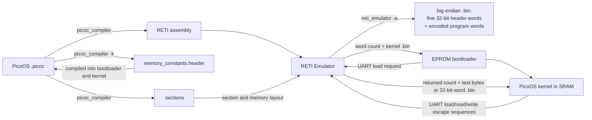


The kernel is **non-preemptive** in the scheduling sense: a timer interrupt
that sees the kernel code segment restores the interrupted kernel context
without entering the scheduler. User processes, however, are preempted by
timer interrupts and scheduled round-robin. A higher-priority UART hardware
interrupt may temporarily run its small handler while kernel code is waiting,
but it returns to that kernel work; it does not schedule a different process.
Consequently, kernel work cannot overlap with another process's kernel work,
so the kernel itself needs no locks.

## Contents

- [Extending the PicoC-Compiler and RETI-Emulator](#extending-the-picoc-compiler-and-reti-emulator)
   - [Overall flow](#overall-flow)
   - [PicoC-Compiler extensions](#picoc-compiler-extensions)
   - [Interrupt vectors and naked handlers](#interrupt-vectors-and-naked-handlers)
   - [PicoOS userspace startup: `libstart` and `_start`](#picoos-userspace-startup-libstart-and-_start)
   - [Generated memory constants](#generated-memory-constants)
   - [RETI-Emulator extensions](#reti-emulator-extensions)
   - [Linked `.sections` metadata and the `.bin` loader header](#linked-sections-metadata-and-the-bin-loader-header)
   - [UART hardware interface](#uart-hardware-interface)
   - [Host requests over UART](#host-requests-over-uart)
   - [Debug TUI and terminal views](#debug-tui-and-terminal-views)
2. [Bootloading](#2-bootloading)
   - [2.1 Loading and starting the kernel](#21)
3. [Kernel main loop](#3-kernel-main-loop)
   - [3.1 Kernel initialization](#31)
   - [3.2 Transition from bootloading to normal execution](#32)
4. [Interrupts, system calls, and exceptions](#4-interrupt-vector-table-interrupts-system-calls-and-exceptions)
   - [4.1 Binary sections](#41)
   - [4.2 Interrupt vector table](#42)
   - [4.3 Interrupt service routines](#43)
   - [4.4 Exception handlers](#44)
   - [4.5 PicoC-Compiler support for low-level handlers](#45)
   - [4.6 System call handling](#46)
   - [4.7 System call arguments and stack-frame layout](#47)
   - [4.8 Timer interrupt](#48)
   - [4.9 UART and keypress interrupt](#49)
5. [Processes](#5-processes)
   - [5.1 Process table](#51)
   - [5.2 Process structure](#52)
   - [5.3 Activation records and stack frames](#53)
   - [5.4 Process states](#54)
   - [5.5 Loading processes](#55)
   - [5.6 Program arguments and environment](#56)
   - [5.7 Initial process stack](#57)
   - [5.8 Environment variables](#58)
6. [Blocking, waiting, synchronization, and signals](#6-process-blocking-waiting-synchronization-and-signals)
   - [6.1 Wait queues](#61)
   - [6.2 `waitpid()` and saved wait state](#62)
   - [6.3 `sleep()`](#63)
   - [6.4 `wakeup()`](#64)
   - [6.5 Blocked-to-ready transitions](#65)
   - [6.6 Signals](#66)
7. [Scheduler](#7-scheduler)
   - [7.1 Relationship to process states](#71)
   - [7.2 Ready processes](#72)
   - [7.3 Scheduling algorithm](#73)
   - [7.4 Timer-based preemption](#74)
   - [7.5 `yield()`](#75)
8. [Dispatcher](#8-dispatcher)
   - [8.1 Context switching](#81)
   - [8.2 Saving the current process](#82)
   - [8.3 Restoring the selected process](#83)
   - [8.4 Transferring control between processes](#84)
9. [Memory management](#9-memory-management)
   - [9.1 Process and kernel memory layouts](#91)
   - [9.2 Heap implementation](#92)
   - [9.3 `free()` and block merging](#93)
   - [9.4 Process memory allocation](#94)
   - [9.5 Shared memory](#95)
10. [Libraries](#10-libraries)
   - [10.1 Implemented libraries](#101)
   - [10.2 Library organization](#102)
   - [10.3 Design tradeoffs](#103)
   - [10.4 Standard I/O](#104)
   - [10.5 Variadic functions and the stack-frame layout](#105)
   - [10.6 `libstart`](#106)
   - [10.7 Start function](#107)
11. [Filesystem](#11-filesystem)
    - [11.1 File-descriptor table](#111)
    - [11.2 File descriptors](#112)
    - [11.3 File operations](#113)
    - [11.4 Output redirection with `>`](#114)
    - [11.5 `dup2()`](#115)
    - [11.6 Output appending with `>>`](#116)
    - [11.7 Working directories and directory operations](#117)
12. [Init process](#12-init-process)
    - [12.1 Purpose of init](#121)
    - [12.2 Separation of responsibilities](#122)
    - [12.3 Configuration file](#123)
    - [12.4 Starting the shell](#124)
    - [12.5 Waiting for the shell with `waitpid()`](#125)
    - [12.6 Why init is in the system directory](#126)
13. [User applications](#13-user-applications)
    - [13.1 User binaries](#131)
    - [13.2 Shell built-ins](#132)
    - [13.3 Shell](#133)
    - [13.4 `echo`](#134)
    - [13.5 `count`](#135)
    - [13.6 `cat`](#136)
    - [13.7 Host-backed directory commands](#137)
    - [13.8 `kill`](#138)
    - [13.9 `poweroff`](#139)
    - [13.10 Actionable command errors](#1310)
14. [Use in lectures](#14-use-in-the-operating-systems-and-real-time-operating-systems-lectures)
    - [14.1 Real-time operating systems lecture](#141)
    - [14.2 Operating systems lecture](#142)
    - [14.3 Exercise sheets and teaching material](#143)
15. [Test system](#15-test-system)
    - [15.1 Testing across all three repositories](#151)
    - [15.2 `make test` and `make test-fast`](#152)
    - [15.3 `make test-lib`](#153)
    - [15.4 System and OS tests](#154)
    - [15.5 Shell tests](#155)
16. [Use of AI](#16-use-of-ai-in-the-project)
17. [Source map and limitations](#17-source-map-and-limitations)
- [Appendix: Inspecting `.bin` files with `hexyl`](#appendix-inspecting-bin-files-with-hexyl)

## Build and run

The build assumes `picoc_compiler`, `reti_emulator`, and `make` are available on
`PATH`. I personally like to use `hexyl` to inspect generated `.bin` files; the
[appendix](#appendix-inspecting-bin-files-with-hexyl) gives useful options.
Build the complete release tree and boot from EPROM with:

```console
$ make bootload
```

`make bootload` first runs its `firmware` dependency. In the current Makefile,
`firmware` builds the complete `release-tree`: the EPROM bootloader, kernel,
system programs, user programs, and runtime files. Once those files are ready,
`bootload` starts the emulator's debug TUI with:

```console
$ ./run_reti_emulator_isolated.sh -n 4 -e ./boot/bootloader.reti \
    -d -c -O -r 262144 \
    -S kernel/kernel.sections -D kernel/kernel.debuginfo
```

Here `-e` selects `boot/bootloader.reti` as the EPROM start program, `-d` opens
the debug TUI, `-c` retains source comments, and `-r` selects the 2^18-word
SRAM. `-S` loads `kernel/kernel.sections`, while `-D` loads
`kernel/kernel.debuginfo`. `-O` starts the emulator with a synthetic active
interrupt context, allowing the dispatcher to launch PicoOS's first process
with `RTI` even though no real interrupt entered the kernel. Press capital `V`
to enter the UART terminal view; `Escape` returns to the debug TUI. `make
run-os OS_RUN_PATH=test/hello_world` runs one configured OS scenario, while
the test targets are documented in [section 15](#15-test-system).

Both bootload targets pass `-n 4` because PicoOS's four-entry interrupt-vector
table is copied into SRAM by the EPROM loader and therefore cannot be counted
when the emulator initially parses `bootloader.reti`. Normally, the emulator
counts the raw address words at the beginning of the parsed `.reti` ISR section
to determine the vector-table size; `-n 4` supplies that count explicitly for
the runtime-loaded table.

# 1. Extending the PicoC-Compiler and RETI-Emulator

PicoOS could not be implemented on the original teaching toolchain unchanged.
The [PicoC-Compiler feature history](https://github.com/matthejue/PicoC-Compiler/blob/linker_update/documentation/new_features_for_pico_os.md)
and [RETI-Emulator feature history](https://github.com/matthejue/RETI-Emulator/blob/statemachine/documentation/new_features_for_pico_os.md)
describe the additions in detail; this chapter is the compact map of every
feature that PicoOS relies on.

## Overall flow

The compiler's complete flow, reproduced from its README, is:

```mermaid
flowchart LR
    source[PicoC source]

    subgraph preprocessing[Preprocessing]
        preprocessor[Includes, macros, and line splicing]
        preprocessed[Preprocessed source]
    end

    subgraph frontend[Lexing and parsing]
        tokens[Token stream]
        parse_tree[Tree-sitter parse tree]
        ast[PicoC AST]
    end

    subgraph compilation[Per-file compilation passes]
        shrink[picoc_shrink]
        blocks[picoc_blocks]
        symbol[picoc_symbol]
        typing[picoc_typing]
        anf[picoc_anf]
        reti_blocks[reti_blocks]
    end

    subgraph linking[Program-wide linking passes]
        merge[Merge units, symbols, and startup]
        patch[reti_patch]
        reti[reti]
    end

    output[Flat RETI output]

    source --> preprocessor --> preprocessed --> tokens --> parse_tree --> ast
    ast --> shrink --> blocks --> symbol --> typing --> anf --> reti_blocks
    reti_blocks --> merge --> patch --> reti --> output
```

PicoOS required extensions throughout that pipeline. The preprocessor gained
headers and macros; the parser/AST gained syntax such as `typedef`, casts,
function pointers, variadics, `asm`, attributes, and `debug;`; the per-file
passes learned their types, stack layout, data, and RETI lowering; and the
program-wide passes gained sections, startup selection, cross-file symbols,
linked assembly labels, safe pseudoinstructions, and loader/debug metadata.

## PicoC-Compiler extensions

Every compiler feature added for the project is summarized below. Examples are
deliberately inline so the implemented surface can be scanned quickly.

| Feature | Short form |
| --- | --- |
| One-step installation | `make full-install` creates the environment and `picoc_compiler` command |
| Generated startup and normal `main` call | generated `_start → initializers → main() → exit` |
| Preprocessing and syntax checks | `#include`, `#pragma once`, `#define N 8`, `-I`, `-M`, line splicing, optional `-s` |
| Multi-file compilation/linking | `a.picoc b.picoc → merged symbols + program.reti` |
| Source trap | `debug; → INT 3` |
| Mixed declarations/statements | `work(); int result = next();` |
| Macros and `sizeof` | `#define N 8`, `sizeof(struct Process)` |
| Casts and typed pointer arithmetic | `(char *)ptr`, `items + 2` scales by element size |
| Pointer returns and generic pointers | `void *malloc(int)`, `struct P *find(void)` |
| Boolean dereference/member conditions | `if (*flag)`, `while (node->next)` |
| Compile-time integer simplification | `int table[2 * (3 + 1)]; → table[8]` |
| Inline RETI | `asm("LOADI ACC 1");`, `asm("INT 0");` |
| Stack-frame/global strings and inferred arrays | global `char *fmt = "%d"`; stack-frame `char text[] = "hi"`; `int a[] = {1, 2}` |
| String-literal storage | `"%d"` becomes a null-terminated `.data` global such as `__strlit_0`; duplicates in one unit reuse it and linker renaming prevents cross-unit collisions |
| Variadic syntax/layout | `int printf(char *fmt, ...)`; extras start at the documented `BAF` offset |
| System-V-style frames | saved `BAF`, return label, right-to-left arguments, caller cleanup |
| Repeat-safe struct headers | `struct Process;` plus compatible repeated declarations across included units |
| Dependency metadata | `// dependencies: libstdio.reti_blocks uart.picoc` |
| Postfix increment | `buffer[index++]` returns the old value and then increments |
| Negated call results | `if (!queue_empty())` lowers correctly |
| Separate compilation artifacts | `-c unit.picoc → unit.reti_blocks + unit.st`; artifacts can be linked repeatedly |
| Debug information | `-g → program.debuginfo` with globals, frames, arguments, calls, returns, and source ranges |
| Source-correlated intermediates | `-i -vv`, `.pre`, labels such as `schedule_while_branch.9`, metadata comments |
| Function pointers | `int (*fn)(int); fn = handler; fn(3);` including arrays and indirect calls |
| RETI sections | `.ivt`, `.text`, `.data` plus `program.sections` |
| Symbols and safe pseudoinstructions | `LOADI32 ACC label`, `JUMP32 0 target`, `PUSH ACC`, `POP ACC` |
| Inspectable startup blocks | `*_startprogram.reti_blocks`, `*_combined.reti_blocks` |
| Interrupt-vector entries | `IVTE timer_interrupt` resolves to a tagged SRAM address |
| Compile-time global data | `-O1` writes known globals, strings, structs, arrays, and function addresses directly into data |
| **Interrupt-vector placement** | `__attribute__((section("ivt")))` emits the vector table first in `.ivt` at address `0` |
| Linking without `main` | libraries and partial units can be linked without inventing `_start` |
| RETI `NOP` | `asm("NOP");` and RETI-block `NOP` are emitted directly |
| Shared function epilogue | all `return` paths jump to one generated restore/return block |
| **Naked low-level functions** | `__attribute__((naked)) void _start(void)` or an ISR emits no compiler prologue/epilogue |
| Linked labels in `asm` | `asm("JUMP32 signal_epilogue");` resolves after final layout |
| Loader metadata | `.sections` records ISR/code/data starts, `heap_start`, `heap_size`, and `stack_start` |
| Kernel headers | `-k sram` / `-k eprom → memory_constants.header` |
| Inline assembly helpers | no-argument `static inline` functions containing only `asm("...")` are copied at calls |
| Custom startup | `-C libstart.picoc` or staged `-C libstart.reti_blocks` selects the first `_start` |
| Scoped aliases | `typedef int pid_t;` follows normal nested scope and shadowing |
| Character escapes | strings/chars support `\0 \n \r \t \\ \" \' \a \b \f \v \?` with decoded array sizing |
| Reliable staged linking | `.reti_blocks`/`.st` preserve data blocks, order, DS-relative references, startup, and debug metadata |
| Automatic artifact reuse | embedded source/header hashes and options reuse unchanged `.reti_blocks`; `-i`, `-w`, or `--direct-source-link` bypass it |
| Build-input/dependency output | `--show-input-files`; `--dependency-file unit.d` for Make |

## Interrupt vectors and naked handlers

Two compiler extensions are essential to PicoOS's interrupt design:

```c
__attribute__((section("ivt")))
void (*interrupt_vector_table[4])(void) = {
    syscall_interrupt, timer_interrupt,
    uart_interrupt, cpu_exception_interrupt
};

__attribute__((naked))
void timer_interrupt(void) {
    asm("PUSH ACC");
    /* Save the interrupted context, enter kernel code, then RTI */
}
```

`__attribute__((section("ivt")))` is the accepted PicoC spelling—there is no
dot in the attribute string. It makes the linker emit the declaration in the
generated `.ivt` section. `.ivt` is placed before `.text` and `.data`, starting
at process-relative address `0`, so the RETI hardware can find the vector
table before any normal startup code runs. With `-O1`, the function addresses
in the table are generated as static words rather than initialized at runtime.

`__attribute__((naked))` suppresses PicoC-Compiler's ordinary stack
prologue, shared epilogue, and automatic return. That is required for `_start`
and interrupt service routines: they must preserve the CPU context in the
precise order expected by the dispatcher, switch to the kernel stack when
needed, and finish with their explicit `RTI` or other control transfer. A
normal compiler-generated function call/return sequence would corrupt that
low-level interrupt layout.

## PicoOS userspace startup: `libstart` and `_start`

`_start` is the program entry point and must be the first function in `.text`.
Without a custom startup unit, PicoC-Compiler generates `_start` to run dynamic
global initializers, call `main()`, and exit.

PicoOS instead links
`library/start/libstart.picoc` with `-C`. This
umbrella unit names the compiled standard library in its dependency metadata
and includes `start.picoc`, whose custom naked
`_start` replaces the generated one:

```console
$ picoc_compiler program.picoc <libraries> \
    -C library/start/libstart.picoc -o program.reti
```

The startup path is deliberately small:

```c
void start_process(int argc, char **argv) {
    init_process_heap();
    initialize_environment(argv + argc + 1);
    exit(main(argc, argv));
}

__attribute__((naked))
void _start(int argc, char *first_argument) {
    start_process(argc, (char **)&first_argument);
}
```

The naked attribute is essential: no compiler prologue may change `BAF` before
`_start` has decoded the initial stack built by the kernel. `_start` initializes
the process heap, clones the environment after `argv`, calls
`main(argc, argv)`, and passes its return value to `exit()`, syscall 9. The
EPROM bootloader and kernel also provide custom naked `_start` functions with
`-C`, but those establish their registers and transfer control instead of
entering a normal userspace `main()`.

## Generated memory constants

Unlike a user process, the kernel has no [process control block
(PCB)](#52-process-structure) from which low-level code could obtain its own
segment, heap, and stack addresses. The EPROM bootloader has the same problem:
the kernel and its PCBs do not exist in SRAM when the first boot instruction
runs, and nothing earlier can pass the bootloader its own layout. The compiler
therefore provides `-k MODE` / `--kernelheader MODE`. It follows the normal
linking path far enough to calculate the final section and memory boundaries,
but writes them as `memory_constants.header` at the path selected by `-o`
instead of emitting RETI assembly.

`MODE` selects which address space and consumer the constants describe. Use
`sram` for the kernel header, including absolute SRAM code, data, heap, stack,
process-memory, and maximum-address constants. Use `eprom` for the bootloader
header, which contains its EPROM data-section start and its temporary SRAM-top
stack. A generated header gives both programs their constants directly and
efficiently. The kernel bootloader could instead pass some kernel bases that it
already read from `kernel/kernel.sections` through the `.bin` header, but that adds a
runtime handoff for compile-time facts and still cannot solve the bootloader's
own first-program layout problem.

For kernel constants, the Makefile uses:

```console
$ picoc_compiler <kernel sources> -O1 -s -k sram \
    --heap-size 4096 --stack-size 2715 \
    -o kernel/memory_constants.header
```

For EPROM bootloader constants, it uses:

```console
$ picoc_compiler <bootloader sources> -O1 -s -k eprom \
    -o boot/memory_constants.header
```

The current generated
`kernel/memory_constants.header` contains:

| Constant | Current value | Meaning |
| --- | ---: | --- |
| `SRAM_BASE` | `-2147483648` | Absolute base selected by address bits `10` |
| `SRAM_MAX_ADDRESS_IN_MEMORY_MAP` | `-2147221505` | Absolute last cell of the configured 2^18-cell SRAM |
| `KERNEL_HEAP_START` | `-2147450459` | Absolute first cell after kernel static data |
| `KERNEL_HEAP_SIZE` | `4096` | Kernel heap size in SRAM cells |
| `PROCESS_MEMORY_START` | `-2147443647` | First cell after the configured kernel stack start |
| `KERNEL_CS_START_ASM` | `LOADI32 CS -2147483644` | Kernel `.text` base |
| `KERNEL_DS_START_ASM` | `LOADI32 DS -2147450943` | Kernel `.data` base |
| `KERNEL_SP_START_ASM` | `LOADI32 SP -2147443648` | Kernel stack pointer (`SRAM_BASE + 40000`) |
| `KERNEL_CS_ACC_ASM` | `LOADI32 ACC -2147483644` | Same code base loaded into `ACC` for comparisons |

The values are generated artifacts and may move when the kernel changes. The
Makefile supplies a 4096-cell kernel heap and a 2715-cell kernel
stack. After linking determines `heap_start`, the compiler calculates
`stack_start = heap_start + heap_size + stack_size`, then uses that layout for
both `kernel/kernel.sections` and `kernel/memory_constants.header`. It also adds the
SRAM base to `stack_start` for `KERNEL_SP_START_ASM` and adds one more cell for
`PROCESS_MEMORY_START`; no generated file is patched afterward. With the
currently generated `kernel/kernel.sections`, the relative
boundaries are `.text = 4`, `.data = 32705`, heap start `33189`, and kernel
stack start `40000`.

The EPROM-mode header
`boot/memory_constants.header`
has no kernel heap or process-memory constants: the bootloader needs only its
EPROM data-section start address and a temporary SRAM-top stack.

| Constant | Current value | Meaning |
| --- | ---: | --- |
| `SRAM_MAX_ADDRESS` | `262143` | Last SRAM offset, `2^18 - 1` |
| `EPROM_DS_START_ASM` | `LOADI32 DS 2607` | Bootloader `.data` start relative to EPROM `CS` |
| `EPROM_STACK_START_ASM` | `LOADI32 SP -2147221505` | Absolute address of the final SRAM cell |

## RETI-Emulator extensions

The emulator was extended from a basic RETI runner into the machine and host
environment needed by PicoOS. Every added user-visible feature is listed here.

| Feature | Short form |
| --- | --- |
| Plain execution output | without `-d`, completed UART bytes go directly to `stdout` |
| Assembly comments in TUI | `-d -c` shows labels and comments beside instructions |
| Atomic locking | `TSL DS ACC 0` returns the old cell and atomically writes `1` |
| Paged action help | `o` cycles the three infobox pages shown below |
| Manual ISR selection | `e` selects a vector; `T` triggers it |
| Post-halt inspection | `-K` keeps final state open; `r` restarts, `q` quits |
| Repeatable snapshots | `S` saves; repeated `R` restores the same CPU/memory/device state |
| Character value input | prompts distinguish `1`, `'1'`, `'\n'`, `'\t'`, and `'\\'` |
| PicoC source debugging | `d` uses `.debuginfo`/`.pre` for source, globals, locals, arguments, calls, and frames |
| Selectable windows | `Tab`/`Shift+Tab`; `j`/`k` scroll; `J`/`K` change the watch object; `C` centers |
| Full-row highlighting | the active instruction/data/watch row is highlighted across its window |
| Live editing | `a` changes a watch object; `A` assigns a register or memory value |
| Raw data words | numeric words and quoted bytes such as `65`, `'A'`, and `'\n'` can occur in `.reti` |
| Structured loading | `.sections` separates `.ivt`, ISR code, `.text`, `.data`, and stack placement |
| Interrupt controller | cells `3…5` map timer/custom/UART; `6…8` set their priorities; `255` disables |
| Raw-byte UART | cells `0…2` send, receive, and expose status; input is buffered byte by byte |
| Loader binary assembly | `--assemble app.reti → app.bin` with five big-endian layout words |
| EPROM-only boot | `-e bootloader.reti` runs without preloading an SRAM program |
| UART host requests | requests such as `ESC load path ESC /`, `read-range`, `file-size`, `pwd`, and `write` |
| Explicit metadata paths | `-S build/kernel.sections`, `-D build/kernel.debuginfo` |
| Runtime SRAM interpretation | code/data views follow live `CS`/`DS` after loading and process switches |
| Runtime timer | cell `9` is the interval; `-I 1000` sets its initial value and the TUI shows its counter |
| SRAM transcoding | `t` switches numeric, ASCII, and instruction views while known code remains decoded |
| Synthetic initial OS context | `-O` allows the first PicoOS `RTI` to leave a modeled kernel/ISR context |
| Interactive UART terminals | `v` opens the normal terminal; `V` opens the raw terminal described below |
| Synchronous exceptions | vector `3`; cause cell `11`: divide-by-zero `1`, stack overflow `2`, illegal instruction `3` |
| Stack/heap protection | cell `10` is the inclusive process boundary and must change on a context switch |
| Explicit vector count | `-n 4` declares a four-entry IVT that the EPROM bootloader will populate later |

## Linked `.sections` metadata and the `.bin` loader header

PicoC-Compiler produces `program.reti` and `program.sections` together after
linking has fixed the position and size of `.ivt`, `.text`, and `.data`. The
compiler therefore already knows `codesegment_start`, `datasegment_start`, the
first cell after static data, and the requested heap/stack layout. No separate
section-file option is needed: `-o build/program.reti` automatically places the
metadata in `build/program.sections`. A compile-only `-c` invocation cannot
produce final layout metadata; it writes per-file `.reti_blocks` and `.st`
artifacts, and the later link creates `.reti` plus `.sections`.

RETI-Emulator also needs no explicit metadata argument for the normal matching
pair: given `program.reti`, it automatically looks for `program.sections`.
Use `-S other/path/layout.sections` only when the name or directory differs.
The file is optional for ordinary execution, although without it the emulator
cannot distinguish all vector, code, data, heap, and stack regions. It is
required by `-a`/`--assemble`, because those values become the binary header.

EPROM-only boot is the special case. With `-e boot/bootloader.reti`, the
emulator automatically looks for `boot/bootloader.sections`; however, PicoOS's
bootloader loads the kernel into SRAM, so the debugger must instead be told
about the kernel layout explicitly with `-S kernel/kernel.sections`.

```console
$ ./run_reti_emulator_isolated.sh -a program.reti
```

This builds `program.bin`. RETI-Emulator automatically reads
`program.sections` and writes five big-endian 32-bit metadata words before the
encoded RETI payload:

| Header word | Meaning and receiver use |
| ---: | --- |
| `0` `codesegment_start` | Process-relative `CS` and initial entry point |
| `1` `datasegment_start` | Process-relative `DS` |
| `2` `heap_start` | First cell after static data; process `malloc()` starts here; ignored by the kernel |
| `3` `heap_size` | Process heap size in cells, or `-1` for its default; ignored by the kernel |
| `4` `stack_start` | Highest process-relative stack cell, or `-1` to request PicoOS defaults |

The `.bin` file itself starts with header word 0; the word count is not stored
inside it. A later `<ESC>load ...<ESC>/` host request first returns the complete
file length in words and then the file bytes. That count includes the five
header words. The PicoOS loader reads the header, computes
`payload_word_count = word_count - 5`, and copies only the encoded RETI payload
into SRAM.

For a normal userspace program, the two tools are used in sequence:

```console
$ picoc_compiler program.picoc <libraries> -C library/start/libstart.picoc \
    -O1 -i -w -s -g -v -o program.reti
$ ./run_reti_emulator_isolated.sh -a program.reti
```

The wrapper gives every emulator process isolated temporary peripheral files,
preventing an assembler process from overwriting an active PicoOS instance's
`sram.bin`. Repository builds may first create reusable `.reti_blocks`/`.st`
pairs; see Incremental PicoC compilation
for their cache and invalidation rules.

## UART hardware interface

The periphery address space has top address bits `01`, so its signed-neutral
base is `2^30 = 1073741824`. The first three cells are UART registers:

| Periphery cell | Absolute address | Direction | Meaning |
| ---: | ---: | --- | --- |
| `0` | `1073741824` | PicoOS → emulator | `uart_send`; low 8 bits are the outgoing byte |
| `1` | `1073741825` | emulator → PicoOS | `uart_receive`; low 8 bits are the incoming byte |
| `2` | `1073741826` | both | `uart_status`; bit 0 send-ready, bit 1 receive-ready |

For either status bit, `0` means that PicoOS has requested a transfer and the
UART is busy; `1` means that the transfer has completed and its register is
ready. To send, PicoOS writes the byte to `uart_send`, clears bit 0 in
`uart_status`, and polls until the emulator sets bit 0 again after consuming
the byte. To receive synchronously, PicoOS clears bit 1, polls until the
emulator places a byte in `uart_receive` and sets bit 1, and then reads that
byte. The linked bootloader always uses these polling routines; its design does
not configure interrupts or create processes. Keypress interrupts provide
input through the UART hardware interrupt and the terminal owner's per-process
input buffer described in [section 4.9](#49-uart-and-keypress-interrupt).

See `kernel/uart_hardware.picoc`, the local
UART protocol notes, and the emulator's
[UART documentation](../RETI-Emulator/README.md#uart).

## Host requests over UART

UART itself transports only raw bytes. PicoOS creates a higher-level request by
writing this ASCII escape sequence as output:

```text
<ESC>load <path><ESC>/
```

`<ESC>` is byte 27. The emulator consumes the complete escape sequence instead
of displaying it. After init has established its working directory, the kernel
sends an absolute `<path>` derived from the calling process's PCB and appends to
the UART input buffer:

1. a 32-bit **big-endian word count** for the file;
2. the exact file bytes.

For `load`, `UINT32_MAX` reports a missing or unreadable path, a non-regular
file, or a file whose word count cannot be represented. An existing empty
regular file returns a zero word count, so receivers can distinguish it from a
failed request.

Working-directory and directory services use these requests:

```text
<ESC>pwd<ESC>/
<ESC>is-directory <path><ESC>/
<ESC>mkdir <path><ESC>/
<ESC>ls<ESC>/
<ESC>ls <path><ESC>/
<ESC>unlink <path><ESC>/
<ESC>rmdir <path><ESC>/
```

`pwd` calls the emulator's `getcwd()` and returns one big-endian 32-bit byte
count followed by the absolute path bytes. Init uses it once to store the
emulator startup directory in its PCB. `is-directory` checks whether an
absolute path names a directory and returns `0` or `UINT32_MAX`. `chdir()`
stores that path in the calling process's PCB only after this check succeeds;
it never changes the emulator's working directory.

`mkdir`, `unlink`, and `rmdir` call the matching host operations and return `0`
or `UINT32_MAX`. A bare `ls` lists the emulator's current directory; PicoOS
normally supplies an absolute path. Its response is a byte count followed by
one line per directory entry in the host's natural order. Each line begins
with `d ` for a directory or `- ` for a file, followed by its name. Hidden
entries, including `.` and `..`, are always included. `UINT32_MAX` reports an
unreadable directory.

Host-backed filesystem operations use the following ranged request:

```text
<ESC>read-range <offset> <count> <path><ESC>/
```

The emulator responds with one big-endian 32-bit returned-byte count, followed
by at most `count` bytes from `offset`. A range reaching past the end of the
file returns fewer bytes. `UINT32_MAX` means that the file is missing or
unreadable.

Metadata operations use a separate request:

```text
<ESC>file-size <path><ESC>/
```

It returns the complete file size as one big-endian 32-bit value, or
`UINT32_MAX` for a missing or unreadable file. PicoOS's `file_exists()` and
`SEEK_END` use this command, so normal ranged reads do not repeatedly transfer
the complete file size.

Creating, truncating, and writing host-backed files uses output selection. This
request creates or truncates the file and routes subsequent ordinary UART output
bytes to it:

```text
<ESC>write <path><ESC>/
```

This variant creates the file if necessary, preserves its existing contents,
and routes subsequent ordinary UART output bytes to its end:

```text
<ESC>append <path><ESC>/
```

The kernel selects `write` briefly for `O_TRUNC` or creation, and selects
`append` while implementing a regular-file `write()`. It then restores normal
terminal output with:

```text
<ESC>write stdout<ESC>/
```

Writing file descriptor 2 temporarily selects the emulator's standard error
stream instead:

```text
<ESC>write stderr<ESC>/
```

Both standard-stream requests close any selected output file. The escape
sequences themselves are consumed by the emulator; only ordinary UART bytes
sent after an output-selection request are redirected.

There is no generic host-command mechanism. Each supported operation has a
bounded request and calls the matching C filesystem function directly.

## Debug TUI and terminal views

The debugger keeps registers, EPROM, SRAM code/data/stack, UART/peripheral
state, and one action infobox visible. Press `o` to cycle all three action
pages; these screenshots were captured from the current emulator at 160×42:


Page 1: `n` next instruction, `c` continue, `r` restart, `s` step into ISR,
`f` finish ISR, `Tab`/`Shift+Tab` switch windows, `q` quit, `o` next page.


Page 2: `j`/`k` scroll, `J`/`K` change the watch object, `C` center, `a`
assign the watch object, `A` assign a value, `e` select the manual ISR, `T`
trigger it, `o` next page.


Page 3: `S` snapshot, `R` restore when a snapshot exists, `d` PicoC source
debugger, `v` normal terminal, `V` raw terminal, `t` transcode SRAM, `o` next
page. During `c`, the infobox instead offers `E` to pause immediately and
`v`/`V` to enter a live terminal. With `-K`, a halted program retains its final
state and offers `r`, window inspection, terminal views, and `q`.

Both terminal views replay all UART output captured since emulator startup and
then show live output. Their important difference is host terminal handling:

| View | Keys delivered to PicoOS | Return to TUI |
| --- | --- | --- |
| Normal `v` | Printable/input keys; host signal handling remains active | `Escape` |
| Raw `V` | All bytes, including `Escape`, control keys, and terminal escape sequences | `Ctrl+]` |

The raw view is required for complete shell interaction. `Ctrl+C` is byte
`0x03`, `Ctrl+Z` is `0x1A`, Arrow Up is `ESC [ A` (`1B 5B 41`), and Arrow Down
is `ESC [ B` (`1B 5B 42`). Thus PicoOS receives job-control keys and command
history keys exactly as a real serial terminal sends them. Opening either view
while paused only displays captured output; opening it during `c` keeps the CPU
running and each received byte can raise a UART interrupt.


# 2. Bootloading

## 2.1 Loading and starting the kernel

The firmware entry point is the naked `_start()` in
`boot/bootloader.picoc`.
The compiler places it in EPROM. It:

1. sets `CS` explicitly to the EPROM base `0`;
2. sets `SP` to the last SRAM cell (`-2^31 + 2^18 - 1`) and copies it to `BAF`;
3. makes `DS` point at the bootloader's read-only EPROM data section; and
4. jumps to `boot_main()`.

The linked bootloader has one global, the compile-time initialized
`loading_bar_enabled`. Its value can be read from the EPROM data section, but
the bootloader cannot modify globals there because EPROM is read-only, and no
linked bootloader code attempts such a write. `_start()` therefore places a
temporary writable stack at the end of SRAM. Normal bootloader functions use
that stack for call frames, local variables, and temporary values produced by
arithmetic and logical expressions. `_start()` also assigns `CS = 0` itself,
so booting does not depend on the emulator's convenient register
zero-initialization or on unspecified register contents in a physical CPU.

`boot_main()` sends the bytes of `<ESC>load kernel/kernel.bin<ESC>/` through UART,
receives the file's word count and five-word binary header, then copies the
remaining 32-bit encoded program words to SRAM starting at its first cell.
`start_loaded_kernel()` is another naked bootloader function in
`boot/bootloader.picoc`. At the end of `boot_main()`,
the bootloader jumps to it directly while preserving `boot_main()`'s `BAF`, so
it can read the saved `code_start`, `data_start`, and `stack_start` locals. It
changes `CS` and `DS` from EPROM to the kernel's SRAM code and data starts,
sets the kernel `SP` and `BAF`, and jumps to `CS`. Thus the bootloader uses the
SRAM-top stack while loading and replaces it with the configured kernel stack
before jumping to the kernel. The compiler-generated kernel `_start` then calls
`kernel/main()`. The kernel ignores the binary
`heap_start` and `heap_size` fields and uses the memory constants from the
generated `kernel/memory_constants.header`
file.

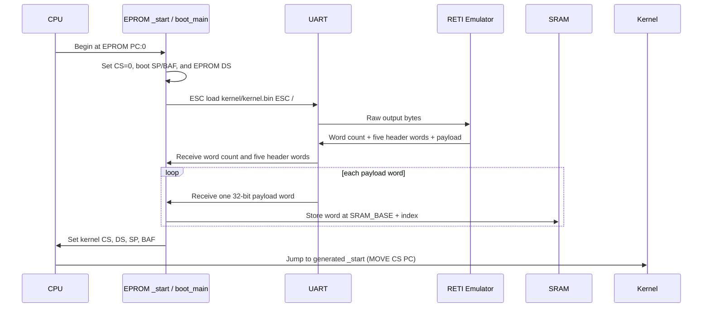

The three bootloader functions divide the transition into reset setup, file
transfer, and the final register switch:

```c
__attribute__((naked))
void _start(void) {
    asm("LOADI CS 0");
    asm(EPROM_STACK_START_ASM);
    asm("MOVE SP BAF");
    asm(EPROM_DS_START_ASM);
    asm("ADD DS CS");
    asm("LOADI32 ACC boot_main");
    asm("ADD ACC CS");
    asm("MOVE ACC PC");
}
```

The reset entry explicitly establishes the EPROM code segment, creates the
temporary SRAM stack, derives the absolute EPROM data address by adding `CS`,
and jumps to `boot_main()` without creating a normal C stack frame.

```c
void boot_main(void) {
    int code_start;
    int data_start;
    int stack_start;
    int word_count;
    int payload_word_count;

    uart_send_file_command("load ", "kernel/kernel.bin");

    word_count = receive_word();
    if (word_count == -1) {
        uart_print_string("error: could not load kernel\n");
        asm("JUMP 0");
    }
    if (word_count < 5) {
        uart_print_string("error: invalid kernel image\n");
        asm("JUMP 0");
    }
    code_start = receive_word();
    data_start = receive_word();
    receive_word();
    receive_word();
    stack_start = receive_word();
    if (stack_start == -1) {
        stack_start = SRAM_MAX_ADDRESS;
    }

    payload_word_count = word_count - 5;
    uart_print_loading_bar_label(
        loading_bar_enabled,
        "load ",
        "kernel/kernel.bin"
    );
    receive_words_to_sram(
        SRAM_BASE,
        payload_word_count,
        loading_bar_enabled
    );
    asm("LOADI32 ACC start_loaded_kernel");
    asm("ADD ACC CS");
    asm("MOVE ACC PC");
}
```

`boot_main()` requests the image and stops with an error if the emulator reports
`UINT32_MAX` or the image is too short to contain its five-word header. It then
separates that header from the payload, substitutes the SRAM-top default when no
stack start was encoded, copies the payload, and finally jumps to the naked
handoff routine. The two unassigned `receive_word()` calls discard the kernel
image's `heap_start` and `heap_size`.

```c
__attribute__((naked))
void start_loaded_kernel(void) {
    asm("LOADIN BAF ACC 0");
    asm("LOADIN BAF IN1 -1");
    asm("LOADIN BAF IN2 -2");

    asm("LOADI32 CS -2147483648");
    asm("MOVE CS DS");
    asm("MOVE CS SP");

    asm("ADD CS ACC");
    asm("ADD DS IN1");
    asm("ADD SP IN2");
    asm("MOVE SP BAF");

    asm("MOVE CS PC");
}
```

The handoff reloads the three retained header values, converts their relative
offsets to absolute SRAM addresses, establishes the kernel stack, and performs
the final jump by moving `CS` into `PC`.

This is intentionally much simpler than a typical modern PC boot. UEFI
firmware normally reads boot entries stored in non-volatile NVRAM; an entry
identifies an EFI executable on an EFI System Partition. The firmware loads and
starts that selected bootloader. On a common Linux installation, the bootloader
then loads a kernel image such as `/boot/vmlinuz-<version>` and usually an
external initial RAM filesystem such as `/boot/initramfs-<version>.img` or
`/boot/initrd.img-<version>`; exact names vary by distribution. The initramfs
can instead be built into the kernel image. After the bootloader places the
kernel and any external initramfs in memory, the kernel unpacks the initramfs
into its temporary root filesystem and runs `/init`, which can load drivers and
mount the persistent root filesystem. PicoOS instead starts one fixed EPROM
program and asks the emulator for one known kernel image.

Useful sources: bootloader,
word receiver, and
SRAM copy loop.

The real big-endian receiver is intentionally simple:

```c
int receive_word(void) {
    int word;

    word = receive_byte_over_uart();
    if (word >= 128) {
        word = word - 256;
    }

    word = word * 256 + receive_byte_over_uart();
    word = word * 256 + receive_byte_over_uart();
    word = word * 256 + receive_byte_over_uart();
    return word;
}
```

Sign-extending the first byte before three multiply/add steps reconstructs the
signed 32-bit value. See
`common/uart_protocol.picoc` and the emulator's
[section-file format](../RETI-Emulator/documentation/section_file_entries.md).

# 3. Kernel main loop

## 3.1 Kernel initialization

The exact startup code in `kernel/kernel.picoc` is:

```c
int main(void) {
    int init_pid;
    struct RunProcessRequest init_request;

    activate_kernel_stack_boundary();
    debug;
    init_kernel_heap();
    initialize_process_table();
    init_process_memory_heap();
    initialize_shared_memory();
    interrupt_controller_initialize();
    init_pid = load_process("system/init.bin", false);
    init_request.pid = init_pid;
    init_request.arguments = NULL;
    init_request.environment = NULL;
    if (mark_process_ready_with_arguments(&init_request)) {
        interrupt_controller_activate_timer();
        dispatcher_start_next_process();
    }
    return 0;
}
```

The order matters. PCBs, paths, descriptor tables, and shared-memory metadata
use `kmalloc()`, so the kernel heap is initialized first. Complete process
regions use `pmalloc()`, initialized next. The interrupt controller maps timer
device 0 to vector 1 at priority 1, disables the custom device, and maps UART
device 2 to vector 2 at priority 2. The timer interval remains zero until init
has loaded successfully.

There is no conventional forever loop in `main()`. The dispatcher transfers
control with `RTI`. Whenever every existing process is blocked,
`dispatcher_start_next_process()` spins in kernel context until a hardware
interrupt makes a process runnable. If all processes have been removed,
control ultimately reaches `shutdown()` (`JUMP 0`).

## 3.2 Transition from bootloading to normal execution

Bootloading ends at `MOVE CS PC` in `start_loaded_kernel()`. At that point:

- `PC` and `CS` select the first kernel `.text` instruction;
- `DS` selects the loaded kernel `.data`;
- `SP` and `BAF` equal the configured kernel stack start;
- `.ivt`, `.text`, and `.data` are present in SRAM;
- general registers other than those explicitly set have no API-level promise;
- interrupts have not yet been configured by PicoOS; and
- no process exists.

Kernel `_start` calls `main()`. After initialization, init is the only
`READY` process. `scheduler_next_process()` returns it,
`dispatcher_switch_to_process()` marks it `RUNNING`, loads its saved `SP`,
`BAF`, `CS`, `DS`, `IN1`, `IN2`, and `ACC`, sets its stack/heap boundary, and
executes `RTI`. The initial stack cell holds `_start - 1`; because `RTI`
advances `PC` after restoring it, userspace starts exactly at `_start`.

# 4. Interrupt vector table, interrupts, system calls, and exceptions

## 4.1 Binary sections

The compiler links three sections:

- **`.ivt`** contains raw vector entries. Each is an SRAM-relative ISR address.
- **`.text`** contains executable RETI words, beginning with `_start`.
- **`.data`** contains globals and other static data. With `-O1`, values known
  at compile time are emitted directly instead of assigned by startup code.

The `.sections` JSON records their boundaries, plus `heap_start`, `heap_size`,
and `stack_start`. The compiler writes `-1` for `heap_size` and `stack_start`
by default. Paired `--heap-size` and `--stack-size` options instead write an
explicit heap size and calculate `stack_start` directly; the Makefile uses
them for the kernel. The kernel ignores its binary heap fields and uses
`KERNEL_HEAP_START` and `KERNEL_HEAP_SIZE` from `memory_constants.header`.
Assembly mode encodes `.ivt`, `.text`, and `.data` as the payload after the
five-word binary header.

| Relative range | Section | Contents |
| --- | --- | --- |
| `0 .. codesegment_start - 1` | `.ivt` | Interrupt vectors 0 through 3 |
| `codesegment_start .. datasegment_start - 1` | `.text` | `_start`, handlers, and other code |
| `datasegment_start .. heap_start - 1` | `.data` | Globals and compile-time initializers |
| `heap_start ..` | Heap/free region | Runtime allocation space |

In the current kernel, `.ivt` is four cells at offsets `0..3`, and `.text`
starts at offset 4. User binaries normally have no `.ivt` and start `.text` at
offset 0.

## 4.2 Interrupt vector table

The operating-system table in
`interrupt_service_routines/os_isrs.picoc`
is:

```c
__attribute__((section("ivt")))
void (*interrupt_vector_table[4])(void) = {
    syscall_interrupt,
    timer_interrupt,
    uart_interrupt,
    cpu_exception_interrupt
};
```

For `INT i`, the emulator decrements `SP`, stores the interrupted `PC` at
`SP + 1`, reads vector cell `i` from the start of SRAM, adds the SRAM address
tag, and loads `PC` with that handler address. Hardware devices first use
periphery cells 3–5 to map their signal line to `i`. Exceptions always select
slot 3. `RTI` reverses the automatic part: load `PC` from `SP + 1`, increment
`SP`, and then advance execution to the following instruction.

Only the return PC is saved automatically. Every ordinary register needed
afterward is explicitly pushed by PicoOS.

## 4.3 Interrupt service routines

The current OS has four vector entries:

| Vector | Entry | Source and purpose |
| ---: | --- | --- |
| 0 | `syscall_interrupt` | Software `INT 0`; saves user context, switches to the kernel stack, and calls `handle_syscall()` |
| 1 | `timer_interrupt` | Timer hardware interrupt; returns immediately for kernel CS, otherwise saves and schedules |
| 2 | `uart_interrupt` | UART hardware interrupt; receives one byte, handles terminal signals, buffers/completes input, and returns to the interrupted context |
| 3 | `cpu_exception_interrupt` | Fixed synchronous exception entry; reports and terminates a process or panics |

The custom hardware signal line exists in the emulator but PicoOS maps it to
`255` (disabled). `interrupt_service_routines/isrs.picoc`
is a separate UART/polling table used by standalone library test, not an
additional kernel ISR.

## 4.4 Exception handlers

Four conditions terminate an affected user process with exception status 1:

| Condition | Kind and trigger | Kernel entry | Diagnostic |
| --- | --- | --- | --- |
| Divide or modulo by zero | CPU exception 1; detected by the emulator instruction interpreter | Vector 3 `cpu_exception_interrupt` → `handle_cpu_exception()` | `Process terminated: division by zero` |
| Stack overflow | CPU exception 2; an instruction would lower `SP` below the active boundary, detected by the emulator register-write guard | Vector 3 `cpu_exception_interrupt` → `handle_cpu_exception()` | `Process terminated: stack overflow` |
| Illegal instruction | CPU exception 3; invalid encoded word or unsupported opcode, detected by the emulator decoder/interpreter | Vector 3 `cpu_exception_interrupt` → `handle_cpu_exception()` | `Process terminated: illegal instruction` |
| Process heap full | PicoOS-defined allocation failure; a positive-size `malloc()` or `realloc()` cannot allocate | Vector 0 syscall → `handle_syscall()` → `handle_process_heap_full_exception()` | `Process terminated: heap full` |

The first three are CPU-synchronous exceptions. The emulator detects them
before the faulting instruction commits its register or memory result, sets
read-only periphery cell 11, adjusts exception entry so `SP + 1` contains the
faulting `PC - 1`, and selects vector 3. Returning would retry the instruction,
but PicoOS never returns from these exceptions.

Process heap full is not a CPU exception and does not use vector 3,
`cpu_exception_interrupt`, or `handle_cpu_exception()`. The userspace
allocator deliberately invokes `SYSCALL_PROCESS_HEAP_FULL`, whose normal
syscall path calls the separate `handle_process_heap_full_exception()`.
Zero-size allocations keep the allocator's normal `NULL` result and do not
invoke the syscall.

The exception ISR preserves the interrupted `CS` in `BAF`, clears stack
protection while changing stacks, restores kernel segments and stack, then
passes the difference between interrupted and kernel `CS` to
`handle_cpu_exception()`. A zero difference is a kernel fault:

| Context | Diagnostic | Result |
| --- | --- | --- |
| User | `Process terminated: division by zero` / `stack overflow` / `illegal instruction` | exit status 1, normal parent notification/cleanup, dispatch another process |
| Kernel | `Kernel panic: division by zero` / `kernel stack overflow` / `illegal instruction` | `shutdown()` |

The exception entry itself saves only the retry PC automatically. PicoOS does
not need to preserve the other faulty user registers because it terminates the
process. See `kernel/exception.picoc` and the
emulator's [CPU exception contract](../RETI-Emulator/documentation/cpu_exceptions.md).

Kernel allocations are not recoverable: a failed positive-size `kmalloc()` or
`krealloc()` prints `Kernel panic: kernel heap full` and shuts down PicoOS.

### Stack-overflow boundary

Periphery cell 10 is an inclusive `stack_heap_boundary`; zero disables the
check. PicoOS writes it, and the emulator reads it whenever an instruction
would lower `SP`:

- kernel boundary = `KERNEL_HEAP_START + KERNEL_HEAP_SIZE - 1`;
- process boundary = `base_address + heap_start + heap_size - 1`.

`SP` denotes the free cell immediately below the lowest occupied stack cell,
so equality with the boundary is valid. A proposed value below it raises the
exception before updating `SP`. The dispatcher changes cell 10 before every
context transfer, and syscall/exception entries temporarily write zero before
changing from a process stack to the kernel stack.

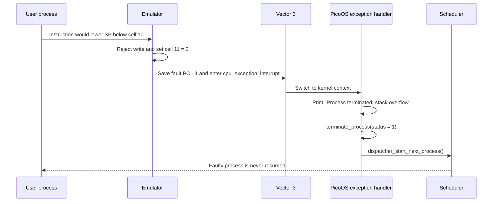

PicoOS chooses the boundary, while the emulator's instruction interpreter
checks it because that is where every `SP` write can be seen. Periphery cell 11
exposes the emulator's read-only
`cpu_exception_cause`; PicoOS reads it to select the diagnostic, and writes are
ignored. The bootload command declares all four vector entries with `-n 4`, so
the emulator knows that exception slot 3 exists even though the EPROM loader
installs it at runtime. If fewer than four entries are parsed or configured,
the emulator reports an unhandled CPU exception and stops instead of entering
PicoOS.

## 4.5 PicoC-Compiler support for low-level handlers

PicoC's special attributes are documented in
[the compiler README](../PicoC-Compiler/README.md#picoc-attributes-and-entry-points):

- `__attribute__((section("ivt")))` places a global or function in `.ivt`.
  IVT globals use `CS` as their base. Only `"ivt"` is accepted.
- `__attribute__((naked))` suppresses the generated prologue, shared epilogue,
  and automatic return sequence. The function must implement its own control
  transfer, which is essential when register and stack layout must exactly
  match `INT`/`RTI`.
- `-O1` enables compile-time global initializer generation. Constant arrays,
  structures, function addresses, and scalar values can be emitted directly
  as section words. This is what makes a raw vector table available before any
  startup code runs. Initializers not reducible at compile time remain runtime
  work; `.ivt` values must be compile-time constant.

Normal functions receive a compiler prologue/epilogue. Naked interrupt hubs
instead contain only the written `asm("...")` instructions.

## 4.6 System call handling

All userspace wrappers put the system-call number in `ACC`, one scalar or
request-structure pointer in `IN1`, and execute `INT 0`. The vector-0 hub saves
the interrupted registers, changes to kernel `CS`, `DS`, and `SP`, and calls:

```c
int handle_syscall(int syscall_number, int argument, int *caller_context) {
    if (syscall_number == SYSCALL_SEND_BYTE_OVER_UART) {
        send_byte_over_uart(argument);
        return 1;
    } else if (syscall_number == SYSCALL_LOAD_PROCESS) {
        return load_process(
            ((struct LoadProcessRequest *)argument)->path,
            ((struct LoadProcessRequest *)argument)->show_loading_bar
        );
    } else if (syscall_number == SYSCALL_WAITPID) {
        return wait_for_process_by_pid(
            (struct WaitPidRequest *)argument,
            caller_context
        );
    }
    // ... open/read/write, shared memory, signals, prctl, yield, and others
    return 0;
}
```

There are 32 syscall numbers (`0..31`) in
`common/syscall.header`. Some return normally through
`syscall_interrupt_return`; blocking, exit, yield, and signal restoration may
save or replace the process context and dispatch without returning through the
same kernel call. `SYSCALL_PROCESS_HEAP_FULL` terminates its caller instead of
returning.

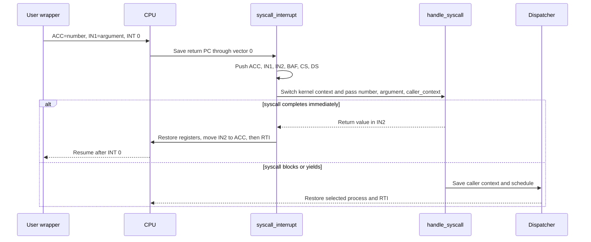

## 4.7 System call arguments and stack-frame layout

RETI stacks grow toward lower addresses. `SP` points one cell **below** the
lowest occupied cell. In a normal current PicoC call, arguments are evaluated
and pushed right-to-left, the caller pushes a continuation address, and the
**called function** pushes and later restores the previous `BAF`. The current
layout from low to high addresses is:

| Address order | Stack content | Position |
| ---: | --- | --- |
| Lowest | Temporary expression values or deeper calls | Below `SP` when present |
| ↑ | Free cell below the occupied stack | `SP` |
| ↑ | Local variables | `BAF`, `BAF - 1`, ... |
| ↑ | Saved previous `BAF` | `BAF + 1` |
| ↑ | Return address | `BAF + 2` |
| ↑ | First argument | `BAF + 3` |
| Highest | Second and later arguments | `BAF + 4`, ... |

This is the post-change convention. Older compiler lowering placed the return
address and frame-pointer bookkeeping differently. The change put all
frame-pointer positioning into the callee, placed the saved `BAF` below the
return address, and gave each call a symbolic continuation label. Consequently:

- the prologue pushes old `BAF`, sets `BAF = SP`, then reserves locals;
- the epilogue sets `SP = BAF`, pops old `BAF`, then pops/jumps to the return;
- parameters begin at `BAF + 3`;
- variadic arguments follow fixed arguments at increasing addresses; and
- hand-written wrappers and ISRs use the same offsets.

The callee, not the caller, saves `BAF`. See the compiler's
[stack-frame description](../PicoC-Compiler/README.md#function-calls-and-stack-frames)
and `NewStackframe` lowering in
[`reti_blocks_pass.py`](../PicoC-Compiler/source/passes/compilation/reti_blocks_pass.py).

At interrupt entry, the CPU and vector-0 hub create this user-stack image:

| Offset from `caller_context` | Contents | Role |
| ---: | --- | --- |
| `+0` | Free cell | `BAF` temporarily points here |
| `+1` | `DS` | Explicitly saved by the vector-0 hub |
| `+2` | `CS` | Explicitly saved by the vector-0 hub |
| `+3` | `BAF` | Explicitly saved by the vector-0 hub |
| `+4` | `IN2` | Explicitly saved by the vector-0 hub |
| `+5` | `IN1` | Syscall argument |
| `+6` | `ACC` | Syscall number |
| `+7` | Return PC | Automatically saved by `INT` |

`dispatcher_switch_from_context()` copies the six explicit saved registers
into the PCB and records `activation.sp = caller_context + 6`, leaving the
automatic return PC at `activation.sp + 1`. A normal syscall return restores
the saved registers, replaces `ACC` with the `IN2` return value, and `RTI`
consumes the return PC.


## 4.8 Timer interrupt

Periphery cell 9 is the timer instruction interval. Zero disables the timer;
writing a positive value resets the counter and requests an interrupt after
that many interpreter cycles. PicoOS writes `1000` after init is ready. Cells
3 and 6 map timer device 0 to vector 1 at priority 1.

On delivery, the emulator enters the mapped vector before executing the next
user instruction. `timer_interrupt()` pushes the six ordinary registers. If
the interrupted `CS` equals kernel `CS`, it immediately pops them and `RTI`s.
Otherwise it disables stack protection, changes to the kernel stack, passes
the user frame to the dispatcher, and never returns along that ISR call path:
the dispatcher eventually `RTI`s into the selected process.

The naked ISR distinguishes kernel and user execution as follows:

```c
asm(KERNEL_CS_ACC_ASM); // ACC = kernel code-segment start
asm("SUB ACC CS");
asm("JUMP!= 14");       // Different CS enters the scheduler path
asm("POP DS");
asm("POP CS");
asm("POP BAF");
asm("POP IN2");
asm("POP IN1");
asm("POP ACC");
asm("RTI");
```

Timer preemption therefore applies to user processes. Kernel scheduling work
is not preempted into another process, which is why PicoOS remains a
non-preemptive kernel. PicoOS does not write a separate acknowledgement:
the emulator resets the interval counter when it raises the interrupt,
temporarily deactivates that timer line while its ISR is active, and reactivates
it when `RTI` completes the hardware interrupt.

## 4.9 UART and keypress interrupt

UART device 2 maps through periphery cell 5 to vector 2 at priority 2. A host
keypress makes the emulator put its low byte in receive register 1, set status
bit 1, and raise the UART line. Further bytes remain buffered while a UART
interrupt is pending.

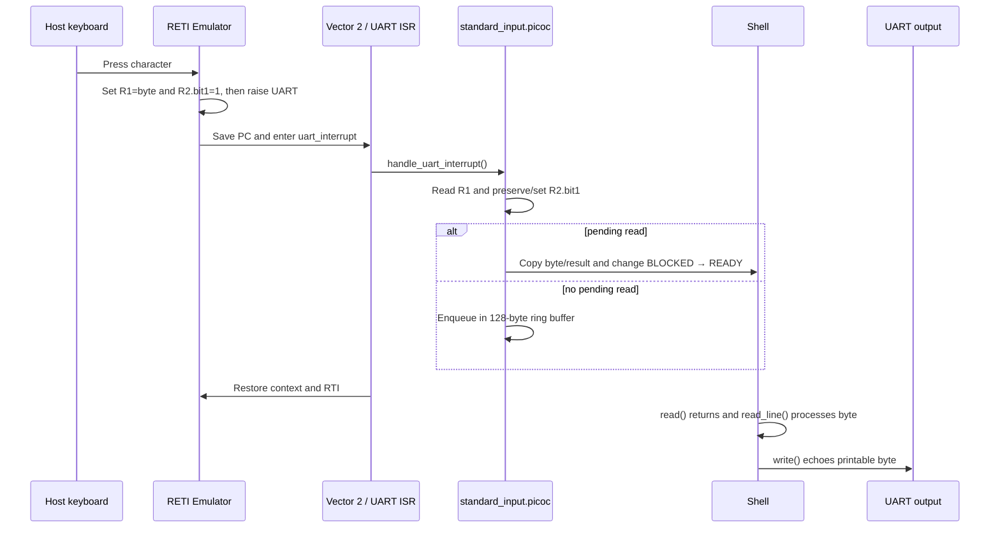

The terminal input owner remains stable across scheduler switches, so the bytes
of one escape sequence cannot land in different process buffers. The shell owns
input while displaying its prompt, transfers ownership to a foreground child,
and takes it back when the child exits or stops.

`read(STDIN_FILENO, ...)` first disables the UART mapping briefly, preventing
a lost wakeup between checking the buffer and enqueueing the reader. If no
byte is available, it records the destination/count in the descriptor table,
places the process on `stdin_waiters`, restores UART mapping, and dispatches.
The ISR writes the result into the saved `activation.acc` before waking it.

The hardware-facing portion of the real handler is:

```c
value = periphery_read_register(UART_RECEIVE_REGISTER) & 255;
status = periphery_read_register(UART_STATUS_REGISTER);
periphery_write_register(
    UART_STATUS_REGISTER,
    status | UART_RECEIVE_READY
);

// Terminal-signal handling omitted
enqueue_stdin_byte(table, value);
complete_pending_stdin_read(process, table);
```

The shell treats `\n` and `\r` as line completion, echoes one `\n`, and handles
backspace (`\b`) or delete (`127`) by outputting backspace-space-backspace.
Printable input is appended and echoed. Control bytes `Ctrl+C` (3) and
`Ctrl+Z` (26) are intercepted by the kernel as `SIGTERM` or `SIGTSTP` for the
foreground process rather than passed to the shell.

# 5. Processes

## 5.1 Process table

Despite the conventional name, PicoOS does **not** use a fixed array. Its
"process table" is a kernel-heap-allocated singly linked list with head and
tail pointers. PIDs begin at 1 and increase monotonically, except that the
fast-test reset deliberately restores the next PID to 3 while init (1) and
the shell (2) remain.

`create_process()` allocates a PCB, binary-path copy, working-directory copy,
and descriptor table with `kmalloc()` and appends it. A child copies the
current process's absolute working-directory string. `remove_process()`
unlinks wait-queue and global list links, releases shared-memory attachments,
frees the complete process region with `pfree()`, destroys descriptors, and
frees both strings and the PCB.

The kernel has no entry because it does not use a user code/data region,
parent, descriptors, or schedulable user state. Low-level kernel addresses
come from `memory_constants.header`.

## 5.2 Process structure

The structure is defined in
`kernel/process.header`. Important fields are:

| Field | Meaning |
| --- | --- |
| `pid`, `parent_pid` | Unique process ID and loader/parent PID (`0` means orphan) |
| `state` | `NEW`, `READY`, `RUNNING`, `BLOCKED`, `STOPPED`, or `ZOMBIE` |
| `base_address`, `size` | Absolute start and cell count of the complete SRAM region |
| `heap_start`, `heap_size` | Process-relative heap offset and requested size, or the 1000-cell default |
| `word_count`, `binary_path` | Load metadata and kernel-owned source path copy |
| `working_directory` | Kernel-owned absolute host path inherited from the loading process |
| `activation` | Saved `IN1`, `IN2`, `ACC`, `SP`, `BAF`, `CS`, and `DS` |
| `file_descriptors` | Per-process eight-entry descriptor table and stdin state |
| `waiting_status_ptr` | Pointer into this process's suspended `waitpid()` frame |
| `waiters` | Queue of processes waiting for this process |
| `waiting_queue_ptr`, `wait_next` | Intrusive membership in one wait queue |
| `next` | Global process-list link |
| `shared_memory_attachments` | Per-process attachment records for exit cleanup |
| `parent_death_signal` | Inherited `PR_SET_PDEATHSIG` setting |
| `exit_status` | Status retained while the process is a zombie |
| `stopped_from_state` | State restored by `SIGCONT` |
| `pending_signals` | Bit mask of deferred/handler-delivered signals |
| `signal_handlers[]`, `signal_restorer` | Per-signal action and userspace restorer |
| `handling_signal`, `signal_saved_activation` | One saved context during a handler |

There is no separate PCB field for the program counter: the interrupt return
PC remains at `activation.sp + 1` on the process stack. There is also no PCB
environment table. `argv`/`envp` begin on the initial process stack, after
which `libstdlib` clones environment strings onto the process heap.

Relative paths do not depend on the emulator's C working directory. Before
`load`, `open`, `read-range`,
`file-size`, `write`, `append`, `mkdir`, `ls`, `unlink`, or `rmdir`, the kernel
prefixes a relative operand with the calling PCB's absolute directory. It
removes repeated separators and resolves `.` and `..` components before
sending the absolute path, so emulator load messages contain clean paths.

## 5.3 Activation records and stack frames

An activation record is the saved machine context in the PCB. A function stack
frame is the live per-call area containing locals, saved `BAF`, return address,
and arguments. Interrupts connect the two: they leave the resumption PC on the
user stack and PicoOS copies the remaining registers into `activation`.

Temporary expression values and nested calls extend the stack downward.
Function results travel in `IN2`; a normal call continuation pushes that result
when the expression needs it. System-call wrappers instead receive the kernel
result in `ACC`, matching the explicit interrupt-return stub.

## 5.4 Process states

There is no `TERMINATED` constant. `ZOMBIE` retains status for a living parent;
full termination means removal from the list.

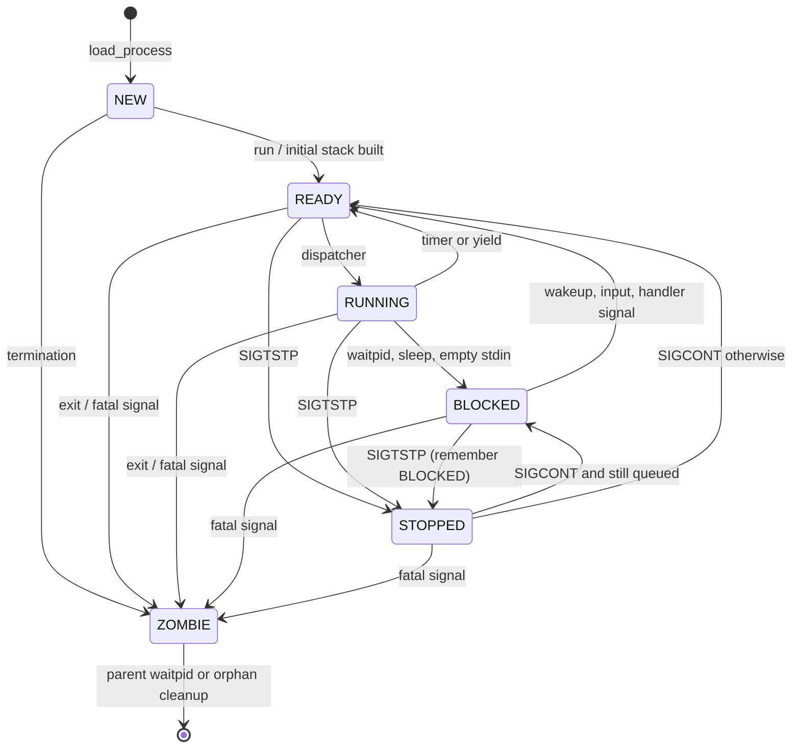

## 5.5 Loading processes

The kernel does not search `PATH`; its caller supplies a concrete `.bin` path.
The shell performs `PATH` lookup before calling `load()`.

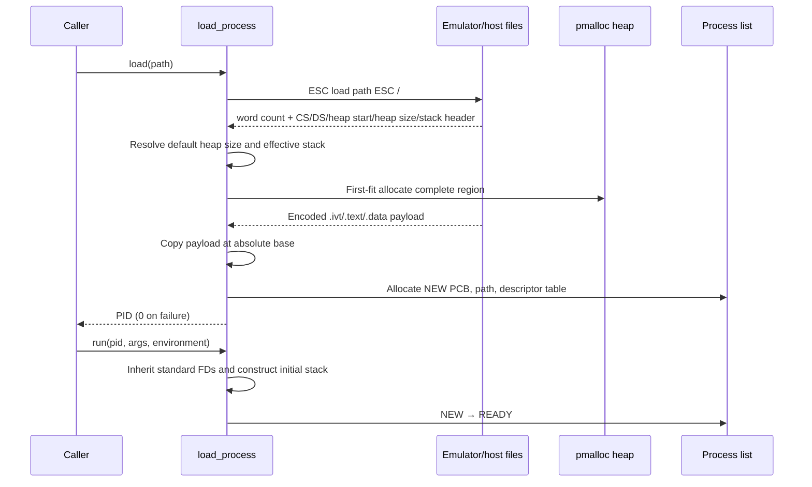

If binary `heap_size == -1`, PicoOS uses the 1000-cell process default. If
`stack_start == -1`, it chooses `heap_start + heap_size + 1000 stack cells`.
An explicit stack start must not be below `heap_start + heap_size`. The
allocated process size is `effective_stack_start + 1`. Loading and running are
separate operations, so a successfully loaded process remains `NEW` until
`run()`.

## 5.6 Program arguments and environment

`store_process_arguments()` creates this
ascending-address layout near the top of the allocated process region:

| Address order | Contents | References |
| ---: | --- | --- |
| Lowest | Free cell | `activation.sp` points here |
| ↑ | Entry PC | `_start - 1` for the first `RTI` |
| ↑ | `argc` | Number of entries before `argv[argc]` |
| ↑ | `argv[0]`, `argv[1]`, ... pointers, then `NULL` | Point to the program path and argument strings below |
| ↑ | `envp[0]`, ... pointers, then `NULL` | Point to the environment strings below |
| ↑ | `"./user/program.bin\0"` and argument strings | Targets of the `argv` pointers |
| Highest | Environment `NAME=value\0` strings | Targets of the `envp` pointers |

Entries are absolute pointers, not offsets. `argv[0]` is always the binary
path. The additional argument string is split only on spaces and tabs; quoting
is a shell concern. Environment strings are copied after argument strings.

The construction code makes the order and final register positions explicit:

```c
entry_pc_cell = (int *)(process->base_address + argument_base_offset);
argc_cell = entry_pc_cell + 1;
argv = (char **)(argc_cell + 1);
envp = argv + argc + 1;
string_target = (char *)(envp + environment_count + 1);

*entry_pc_cell = process->activation.cs - 1;
*argc_cell = argc;
argv[argc] = NULL;
envp[environment_count] = NULL;
// ... copy argv[0], argument strings, and environment strings
process->activation.baf = (int)argc_cell - 3;
process->activation.sp = (int)entry_pc_cell - 1;
```

The initial `BAF` is set two cells below the entry PC, making
`BAF + 3 == argc` and `BAF + 4 == argv[0]`. Naked userspace `_start` receives
those locations under the normal parameter convention. The startup runtime
initializes the process heap and environment, calls `main(argc, argv)`, and
passes its result to `exit()`.

Thus `envp` begins immediately after `argv[argc] == NULL`, and `main()` receives
standard `argc`/`argv`. `main()` has no direct third `envp` parameter in the
current startup API; the application-facing environment functions use the
process-local global `environ`.

## 5.7 Initial process stack

Three layouts must not be confused:

1. The **initial stack** is synthesized by the kernel and includes the `RTI`
   entry PC followed by `argc`, pointer tables, and strings.
2. A **normal function frame** is synthesized by compiler-generated code and
   includes locals, saved `BAF`, continuation address, and arguments.
3. An **interrupt/context-switch frame** begins with the CPU-saved PC and six
   registers pushed by the ISR. Most of that frame is copied into the PCB
   before another process runs.

After the first `RTI`, `_start` uses the initial `BAF` as if the kernel had
created its outer caller frame. Subsequent calls use the ordinary convention.

## 5.8 Environment variables

Environment entries are heap-owned `NAME=value` strings in a null-terminated
`char **environ`. Startup clones the initial stack entries. `getenv()` returns
the value portion; `setenv()`, `unsetenv()`, `putenv()`, and `clearenv()` update
the process-local copy. The shell test reset machinery privately snapshots and
restores this environment.

`run(pid, arguments, NULL)` passes the caller's `environ`; the kernel copies
the strings onto the child's initial stack, so changes are inherited at start
but are not shared afterward. A caller may instead supply its own
null-terminated environment array.

Init reads `config/environment.txt`, currently:

```text
PATH=./user
```

It uses `setenv()`, then starts the shell with inherited environment. The shell
uses `PATH` to locate later programs; those programs inherit the shell's
current copy. If `loading_bar_enabled` in
`config/config.header` is true, init also sets
`PICOOS_LOADING_BAR=true`, allowing one setting to control loader progress in
all descendants.

With that variable present, process loads and host-backed file reads show both
the operation and its path, followed by a ten-cell progress bar:

```text
load ./user/echo.bin
[#####     ] 50%
[##########] 100%
```

The same helpers report kernel, process, and file transfers. Internal
operations can set `show_loading_bar = false` when progress output would mix
with program output; the fast test launcher also removes
`PICOOS_LOADING_BAR` from its inherited environment before running test.

# 6. Process blocking, waiting, synchronization, and signals

## 6.1 Wait queues

A wait queue is a two-pointer FIFO:

```c
struct wait_queue {
    struct Process *head;
    struct Process *tail;
};
```

It is intrusive: the queued PCB holds `waiting_queue_ptr` and one `wait_next`
link. A process can therefore wait on only one queue at a time. Queue owners
include each process (`waiters`), each descriptor table (`stdin_waiters`), and
each userspace mutex (`waiters`).

The public mutex interface uses the same queue mechanism rather than spinning:

```c
struct mutex lock;

mutex_init(&lock);
mutex_lock(&lock);
shared_counter = shared_counter + 1;
mutex_unlock(&lock);
```

If the atomic test-and-set finds the mutex locked, `mutex_lock()` sleeps on its
wait queue.
`mutex_unlock()` wakes at most the first waiter, which competes for the lock
when the scheduler next runs it.

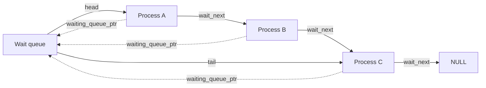

`enqueue_current_process_on_wait_queue()` appends the current PCB and changes
it to `BLOCKED`. `wakeup_wait_queue()` removes **one** process from the head
and makes it `READY` (or records `READY` as the resume state if it is stopped).
`remove_from_wait_queue()` scans and unlinks a process during signal wakeup or
destruction. Removing a PCB always calls it first, preventing stale pointers
from surviving in a queue.

Wait queues are kernel-visible absolute memory structures even when a mutex
placed them in shared process memory. This works because PicoOS has one
physical address space and no virtual-memory protection.

## 6.2 `waitpid()` and saved wait state

The public API has only `waitpid(pid)`, which waits for one exact child. There
is no general `wait()` wrapper and no `waitpid` options argument. The diagram
also shows the two cases where the child has already stopped or exited:

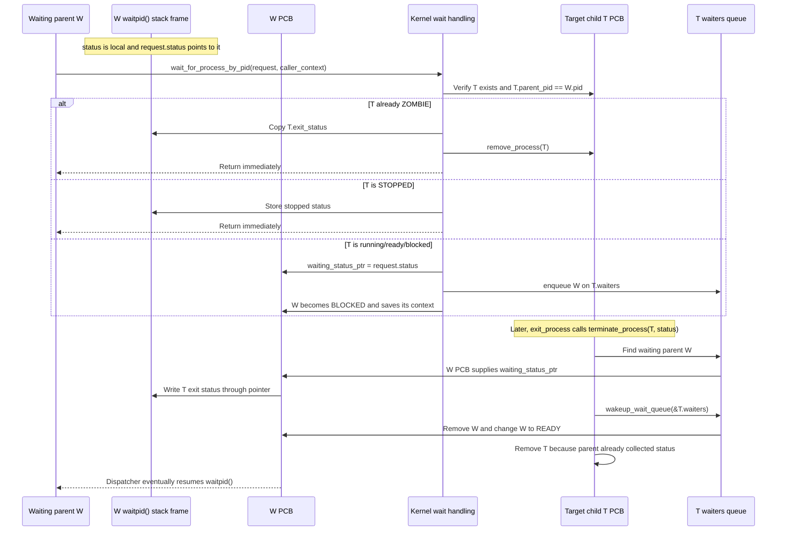

`status` and `request` belong to W's suspended `waitpid()` stack frame.
`waiting_status_ptr` belongs to W's PCB and points to W's `status` variable.
The waited-on child T owns `T->waiters`; the same queue is used when W sleeps
and when T exits.

If a child exits before its parent waits, it becomes `ZOMBIE` and retains
`exit_status`. A later `waitpid()` copies that value and frees the child.
If the parent is already queued, termination writes through its saved pointer,
wakes it, and removes the child immediately. Invalid PIDs and non-children
produce status `-1`.

This exact-child behavior is important to init. Other children or `SIGCHLD`
must not make init's `waitpid(shell_pid)` return as though its shell exited.

## 6.3 `sleep()`

PicoOS `sleep()` does **not** accept a duration and does not register a timer
deadline. It means "block the current process on this wait queue":

```c
void sleep(struct wait_queue *wq) {
    if (wq == NULL) {
        return;
    }
    asm("LOADIN BAF IN1 3");
    asm("LOADI ACC 11"); // SYSCALL_SLEEP
    asm("INT 0");
}
```

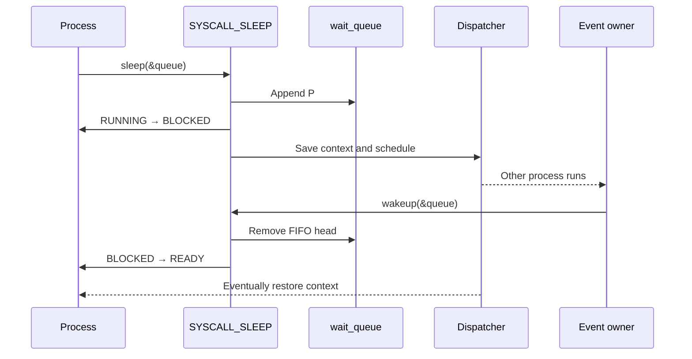

Timer interrupts may let another process run while the caller sleeps, but they
do not expire the sleep. A timed `sleep(seconds)` facility, deadline list, and
timer-driven timeout transition are not implemented.

## 6.4 `wakeup()`

`wakeup(queue)` invokes syscall 12. The kernel removes at most one head waiter,
clears its queue links, and makes it ready. It returns whether a waiter existed.
The woken process does not run immediately; normal scheduling selects it later.

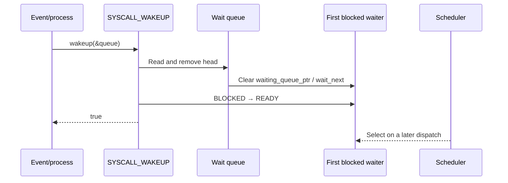

## 6.5 Blocked-to-ready transitions

Implemented causes are:

- the waited-for child exits;
- the waited-for child is stopped by `SIGTSTP`;
- an explicit `wakeup()` (including mutex unlock) removes the FIFO head;
- a UART byte completes a pending stdin read;
- a caught signal is queued for a blocked process, which is removed from its
  wait queue and receives syscall result 0; and
- `SIGCONT` restores a stopped process to `READY` unless it was blocked and is
  still linked to its original queue, in which case it returns to `BLOCKED`.

There is no sleep timeout. Default fatal signals terminate rather than ready a
blocked process. `SIGTSTP` stops it while preserving its queue membership.

## 6.6 Signals

PicoOS uses five familiar Unix signal numbers, with a much smaller set of
semantics:

| Signal | Default action | Notes |
| --- | --- | --- |
| `SIGKILL` (9) | terminate with status `128 + 9` | Cannot be caught or ignored |
| `SIGTERM` (15) | terminate with status `128 + 15` | May be caught or ignored |
| `SIGCHLD` (17) | ignore | Sent to the parent when a child terminates; may have a handler |
| `SIGCONT` (18) | continue | Restores a stopped process; default otherwise ignores |
| `SIGTSTP` (20) | stop | Parent waiters receive stopped status `128 + 20` |

PicoOS does not implement `SIGSTOP` or `SIGINT`. A full operating system
distinguishes these from `SIGTSTP` and `SIGTERM`:
`SIGTSTP` is the terminal stop request that a program may handle or ignore,
whereas `SIGSTOP` is an unconditional stop; `SIGTERM` is a catchable
termination request, whereas `SIGINT` represents an interactive interrupt and
is commonly handled separately. PicoOS uses the two signals it already has for
these terminal actions: `Ctrl+Z` sends `SIGTSTP`, and `Ctrl+C` sends `SIGTERM`.

`signal()` installs one handler plus the library's naked
`signal_restorer()`. `kill(pid, 0)` checks existence without delivery.
Pending signals are bits in the PCB. Before dispatch, the kernel either
performs a default action or builds a small user stack frame containing the
handler entry, restorer address, and signal number. Only one handler context is
saved at a time. Returning through the restorer invokes `SIGRETURN` and
restores `signal_saved_activation`.

Control bytes `Ctrl+C` (3) and `Ctrl+Z` (26) become `SIGTERM` and `SIGTSTP`
for the PID registered by the shell as foreground. The shell implements basic
background execution plus `fg` and `bg`; this is much smaller than POSIX job
control. In the RETI-Emulator debugger these shortcuts require `(V)iew raw
terminal`, because the normal `(v)iew terminal` keeps host control-key handling
active.

### Parent-death signal

`library/sys/prctl` supports exactly:

```c
prctl(PR_SET_PDEATHSIG, 0);
prctl(PR_SET_PDEATHSIG, SIGTERM);
```

The first disables the feature; the second records `SIGTERM` in the current
PCB's `parent_death_signal`. Any valid implemented signal may be selected.
`create_process()` copies the parent's setting into the child. When a parent
terminates, `orphan_and_signal_children()` sets each child's `parent_pid` to
zero, removes already-zombie children, and delivers the configured signal if
nonzero. With zero, the child simply becomes an orphan and continues.

The shell calls `prctl(PR_SET_PDEATHSIG, SIGTERM)` on **itself** during startup.
Because the field is inherited, every process later loaded by that shell gets
the setting. Those children terminate if the shell terminates. This is explicit
shell policy, not PicoOS's default for all children; init and the initial shell
begin with zero.

# 7. Scheduler

## 7.1 Relationship to process states

The scheduler considers only `READY` processes plus the current `RUNNING`
process when a complete wrap finds no alternative. `NEW` has no initial
execution frame, `BLOCKED` lacks a satisfied event, `STOPPED` is suspended, and
`ZOMBIE` exists only for status collection.

## 7.2 Ready processes

There is no separate ready queue. `scheduler_next_process()` scans the global
linked process list. Making a process ready means changing its state; it
automatically participates in the next scan. Other states are skipped.

This is simple and educational but makes selection O(number of PCBs). That is
reasonable for this small system and exposes state transitions without another
queue abstraction.

## 7.3 Scheduling algorithm

Scheduling is round-robin by process-list order:

1. begin at `current->next`, or the list head if there is no current process or
   current is the tail;
2. scan to the tail for a runnable process;
3. wrap to the head and stop before the original start; and
4. return `NULL` if every PCB is non-runnable.

If only the current process can run, the wrapped scan may return it. If none
can run but blocked/stopped processes remain, the dispatcher waits in kernel
context so a UART or other hardware interrupt can change state. If the list is
empty, there is no user process to dispatch and shutdown follows.

## 7.4 Timer-based preemption

On a user timer interrupt, the ISR explicitly pushes the general context and
the CPU has already saved the resumption PC. The dispatcher copies register
values into the current PCB, changes `RUNNING` to `READY`, asks the scheduler
for the next candidate, installs any pending signal action, and restores that
candidate. `RTI` consumes its saved PC.

The timer ISR detects kernel execution by comparing `CS` to generated kernel
`CS`. It restores and returns without calling the scheduler in that case.
The timer therefore preempts userspace but never schedules another process
while the kernel is running.

## 7.5 `yield()`

`yield()` is syscall 13 through software
`INT 0`. Unlike a timer interrupt it is voluntary and deterministic, but both
paths call `dispatcher_switch_from_context()`. The running caller becomes
`READY`, so another ready process can be chosen; if none exists, the caller
can be selected again.

`yield()` is useful in teaching round-robin order and in cooperative loops.
It is not required for timer-preempted fairness, and it does not block on an
event.

# 8. Dispatcher

## 8.1 Context switching

Context is divided between two locations:

- the CPU automatically puts the interrupt return PC at `SP + 1`;
- PicoOS pushes `ACC`, `IN1`, `IN2`, `BAF`, `CS`, and `DS`, then copies them
  into `Process.activation`.

`SP` is saved as the position immediately below the return-PC cell. `BAF`
continues to identify the interrupted function frame. `CS` and `DS` select the
process's code and data bases. No separate `PC` PCB field is needed.

`INT` creates the automatic return cell and jumps through the vector table.
`RTI` restores that PC and advances it, which is why new-process and exception
return addresses use the `address - 1` convention where appropriate.

## 8.2 Saving the current process

Timer interrupts, blocking syscalls, and `yield()` eventually pass the common
saved-frame pointer to:

```c
void dispatcher_switch_from_context(int *caller_context) {
    struct Process *process = current_process();

    if (process != NULL) {
        process->activation.sp = (int)(caller_context + 6);
        process->activation.ds = caller_context[1];
        process->activation.cs = caller_context[2];
        process->activation.baf = caller_context[3];
        process->activation.in2 = caller_context[4];
        process->activation.in1 = caller_context[5];
        process->activation.acc = caller_context[6];

        if (process->state == PROCESS_STATE_RUNNING) {
            process->state = PROCESS_STATE_READY;
        }
    }
    dispatcher_start_next_process();
}
```

The PC at `caller_context[7]` remains in process memory. Because it points to
the interrupted instruction under the emulator's interrupt convention, the
later `RTI` resumes at the correct following instruction.

## 8.3 Restoring the selected process

`dispatcher_switch_to_process()` readies an old running process if necessary,
sets the selected PCB as current, marks it `RUNNING`, and calls the naked
restore hub. Its essential operations are:

```c
__attribute__((naked))
void dispatcher_jump_to_process(struct Process *process, int stack_boundary) {
    asm("LOADIN SP BAF 2");
    asm("LOADIN SP IN1 3");
    // Build periphery base and write stack_boundary to cell 10
    // ...
    asm("LOADIN BAF SP 11");
    asm("LOADIN BAF CS 13");
    asm("LOADIN BAF DS 14");
    asm("LOADIN BAF IN1 8");
    asm("LOADIN BAF IN2 9");
    asm("LOADIN BAF ACC 10");
    asm("LOADIN BAF BAF 12");
    asm("RTI");
}
```

The fixed offsets depend on `activation` remaining immediately after the first
five integer PCB fields; the comment in `Process` protects that layout. The
hub first obtains the PCB and boundary arguments from its kernel call frame,
writes the process boundary, then restores `SP`, segments, ordinary registers,
and finally `BAF`. `RTI` performs the actual control transfer.

## 8.4 Transferring control between processes

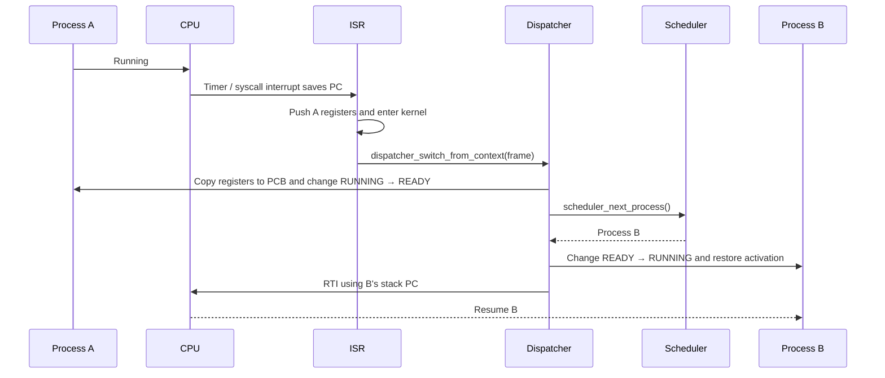

# 9. Memory management

## 9.1 Process and kernel memory layouts

The top two address bits select EPROM (`00`), periphery (`01`), or SRAM
(`10`/`11`). Within SRAM, the current kernel layout is:

| SRAM offsets | Region | Size or role |
| --- | --- | --- |
| `0..3` | `.ivt` | Four interrupt-vector cells |
| `4..32704` | Kernel `.text` | Executable kernel code |
| `32705..33188` | Kernel `.data` | Globals and static data |
| `33189..37284` | Kernel heap | 4096 cells |
| `37285..39999` | Kernel stack room | Free until the downward-growing stack uses it |
| `40000` | Initial kernel `SP` | Free cell immediately below the initial stack |
| `40001..2^18-1` | Process-memory heap | Complete process and shared-memory regions |

The kernel stack grows downward from offset 40000. Its boundary is the final
reserved kernel-heap cell, so stack room is the gap above that boundary.
Complete process/shared-memory regions are first-fit blocks in the area from
40001 to the end of SRAM.

Each process region uses these relative boundaries:

| Relative boundary | Region or register role |
| --- | --- |
| `0` | `.text` begins; `CS` points to `base + 0` |
| `data_start` | `.data` begins; `DS` points to `base + data_start` |
| `heap_start` | The fixed `malloc()` heap begins and is managed upward |
| `heap_start + heap_size` | First cell above the heap; the inclusive stack boundary is one cell lower |
| `stack_start` | Initial `SP`; the stack grows downward through the free gap |

The heap allocator uses linked headers and can consume its fixed region upward.
The stack-overflow check prevents `SP` from moving below
`heap_start + heap_size - 1`. There is no MMU, relocation after load, or
per-process access protection.

### Configurable process heap and stack

The compiler writes these boundaries to each generated `.sections` file.
Passing `--heap-size 2000 --stack-size 1000` requests a 2000-cell heap and
places the stack 1000 cells above it during linking. The generated file may
still be edited before assembly when needed. For example, that layout for
`user/echo.sections` gives:

```json
{
  "codesegment_start": 0,
  "datasegment_start": 11595,
  "heap_start": 11621,
  "heap_size": 2000,
  "stack_start": 14621
}
```

| Boundary | Relative offset | Meaning |
| --- | ---: | --- |
| `codesegment_start` | `0` | `.text` begins |
| `datasegment_start` | `11595` | `.data` begins |
| `heap_start` | `11621` | 2000-cell heap begins |
| Heap end | `13621` | First cell above the heap and lower stack boundary |
| `stack_start` | `14621` | Initial stack pointer; the stack grows downward |

`heap_size: -1` selects PicoOS's 1000-cell default. `stack_start: -1` places
another 1000 stack cells above the effective heap, while an explicit stack may
not overlap the heap. A numeric program image containing an interrupt vector
table may additionally define `interrupt_service_routines_start`. Assembly
copies the five required fields into the binary header described in
[Host requests over UART](#host-requests-over-uart); kernel binaries use that
same header but take their heap range from generated kernel constants.

## 9.2 Heap implementation

`common/heap.picoc` implements the shared allocator:

```c
struct BlockHeader {
    int size;
    bool free;
    struct BlockHeader *next;
};

struct Heap {
    struct BlockHeader *first_block;
};
```

All sizes are RETI memory **cells**, and `sizeof` in PicoC is correspondingly
cell-based. There is no additional byte alignment step.

`heap_alloc_from()` scans from `first_block` and takes the first free block
large enough: this is **first-fit**. If the remainder can hold a three-cell
header plus at least one payload cell, it splits the block. Otherwise the
caller receives the whole block. Invalid/nonpositive sizes and exhaustion
return `NULL`.

The split is pointer arithmetic over RETI cells:

```c
if (block->size >= size + sizeof(struct BlockHeader) + 1) {
    new_block = (struct BlockHeader *)((int *)(block + 1) + size);
    new_block->size =
        block->size - size - sizeof(struct BlockHeader);
    new_block->free = true;
    new_block->next = block->next;
    block->size = size;
    block->next = new_block;
}
```

Before allocating four cells, the block consists of:

| Segment | Contents |
| --- | --- |
| Header | `size = 12`, `free = true`, `next = NULL` |
| Payload | 12 free cells |

After the split, the same memory contains:

| Segment | Contents |
| --- | --- |
| Allocated header | `size = 4`, `free = false` |
| Allocated payload | 4 cells |
| Remainder header | `size = 5`, `free = true` |
| Free payload | 5 cells |

Three interfaces select different `Heap` instances:

| Interface | Region managed | Typical callers |
| --- | --- | --- |
| `kmalloc()` / `krealloc()` / `kfree()` | Kernel heap defined by generated `KERNEL_HEAP_START` and `KERNEL_HEAP_SIZE` | PCBs, paths, descriptors, shared-memory metadata |
| `pmalloc()` / `prealloc()` / `pfree()` | All SRAM after `PROCESS_MEMORY_START` | Kernel process loader and shared-memory backing blocks |
| `malloc()` / `realloc()` / `free()` | Current process heap beginning at binary `heap_start`; binary `heap_size` or the 1000-cell default | Userspace libraries and applications |

Thus both complete process-region allocation and internal `malloc()` allocation
are first-fit, but they are distinct heap instances at different levels.

The shared allocator returns `NULL` for exhaustion, but its public callers
apply their own policy: process `malloc()` and `realloc()` terminate the
process for failed positive-size requests, while `kmalloc()` and `krealloc()`
panic the kernel. `pmalloc()` and `prealloc()` retain the raw `NULL` result for
the loader to handle.

## 9.3 `free()` and block merging

`heap_free_from()` treats `NULL` as a no-op, obtains the preceding header,
marks it free, and scans the entire list. Whenever `current` and
`current->next` are both free, it absorbs the next header and payload. The
loop stays on the merged block, so a run of any length coalesces in both
directions relative to the newly freed block.

| Stage | Block sequence |
| --- | --- |
| Before `free(B)` | Free A, allocated B, free C; each has its own header and payload |
| After `free(B)` and the full scan | One free A block whose size includes A, B, C, and the two absorbed headers |

This reduces external fragmentation. Safety checks are intentionally minimal:
`NULL` and a null heap are handled, but invalid, double-freed, or foreign
pointers are not detected.

`realloc()` shrinks/splits in place, grows into a sufficiently large following
free block, or allocates/copies/frees. `realloc(NULL, n)` is `malloc(n)` and
`realloc(p, 0)` frees and returns `NULL`.

## 9.4 Process memory allocation

`init_process_memory_heap()` creates one heap covering every cell from
`PROCESS_MEMORY_START` through `SRAM_MAX_ADDRESS_IN_MEMORY_MAP`.
`load_process()` asks `pmalloc()` for the complete code/data/heap/gap/stack
region. First-fit makes a newly loaded process reuse the earliest adequate hole
left by unloaded processes. `pfree()` coalesces adjacent regions through the
same general heap code.

Shared-memory backing also comes from this allocator, so shared regions and
complete processes compete for the same post-kernel SRAM pool. This is separate
from the per-process `malloc()` heap inside each allocated process region.

## 9.5 Shared memory

The existing shared-memory API is preserved:

```c
int shm_open(const char *name, size_t size);
void *mmap(int shm_id);
int shm_unlink(const char *name);
```

This is not POSIX virtual-memory mapping. `shm_open()` returns an integer ID,
and `mmap()` simply returns the absolute address of an already allocated SRAM
block.

Kernel entries are dynamically allocated with `kmalloc()` in a linked list.
Each stores its name, ID, `pmalloc()` backing address, cell size, reference
count, unlink flag, and next link.

- `shm_open(name, size)` returns an existing named ID regardless of the newly
  supplied size, or creates a new metadata/backing pair. It returns `-1` on
  invalid input or allocation failure.
- `mmap(id)` adds a kernel-heap attachment record to the current PCB,
  increments the reference count, and returns the shared address. There is no
  `munmap()`; repeated calls create repeated attachments.
- `shm_unlink(name)` frees the name immediately so future opens cannot find
  it, sets `unlink_requested`, and destroys it immediately only if the
  reference count is zero.
- Process removal walks its attachments, decrements references, and destroys
  an unlinked entry after the last reference. The backing block is returned
  with `pfree()` and metadata with `kfree()`.

There is no privileged owner after creation and no access-control model.
Processes that know the ID can map the region. Concurrent reads/writes require
a mutex or another protocol; the shared-memory allocator supplies lifetime,
not mutual exclusion.

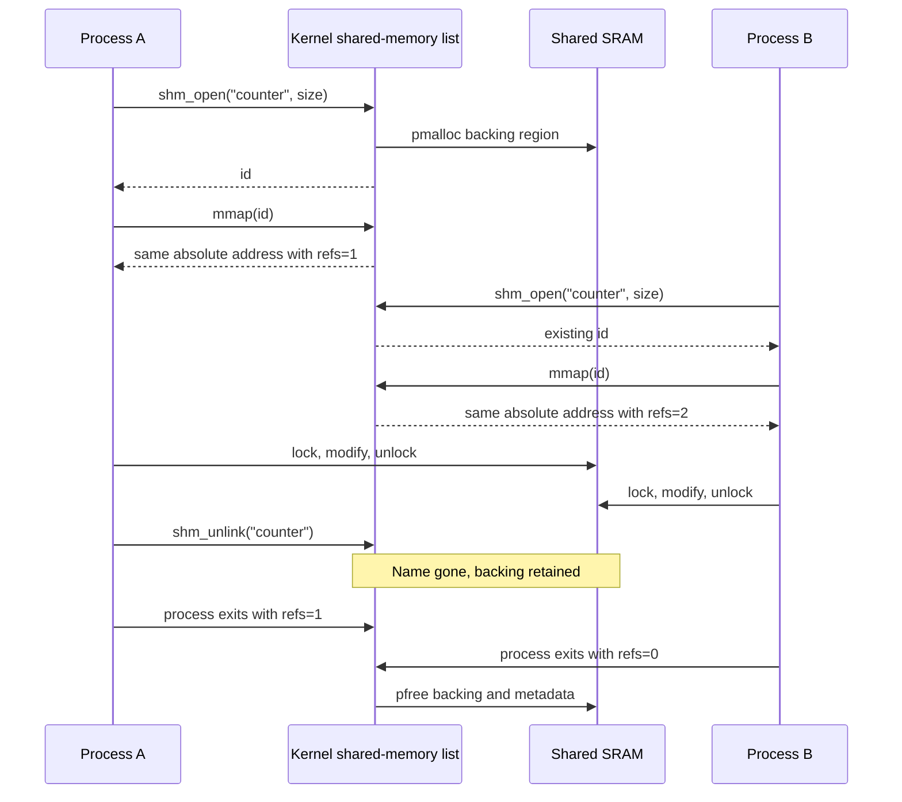

# 10. Libraries

## 10.1 Implemented libraries

Public headers and principal application-facing facilities are listed below.
Low-level syscall wrappers, startup plumbing, test hooks, and implementation
helpers are intentionally omitted from this API overview.

| Directory/header | Purpose |
| --- | --- |
| `library/unistd` | `read`, `write`, `close`, `dup2`, `lseek`, `chdir`, `getcwd`, `unlink`, `rmdir`, `load`, `run`, `unload`, `list`, `getpid` |
| `library/fcntl` | `open`, `creat`, access/create/truncate/append flags |
| `library/sys/wait` | exact-child `waitpid`, `WIFSTOPPED` |
| `library/schedule` | voluntary `yield` |
| `library/mutex` | `mutex_init`, `mutex_lock`, `mutex_unlock` |
| `library/signal` | `signal`, `kill`, default/ignore constants |
| `library/sys/prctl` | `prctl(PR_SET_PDEATHSIG, signal)` |
| `library/sys/stat` | `mkdir` |
| `library/dirent` | `opendir`, `readdir`, `closedir`, directory entries |
| `library/sys/mman` | `shm_open`, `mmap`, `shm_unlink` |
| `library/stdlib` | `malloc`, `realloc`, `free`, `atoi`, `getenv`, `setenv`, `unsetenv`, `putenv`, `clearenv`, `exit` |
| `library/string` | `memcpy`, `memset`, `strcpy`, `strcat`, `strcmp`, `strncmp`, `strlen` |
| `library/stdio` | `stdin`, `stdout`, `stderr`, `fopen`, `fclose`, `fputc`, `fputs`, `fprintf`, `printf`, `scanf` |
| `library/start` | automatic process startup before `main`; applications do not call it directly |

Common ABI structures and constants live under `common`, while
kernel-private interfaces live under `kernel`. The `.header`
extension is PicoC's header convention, not a promise of full standard-header
compatibility.

`common/stddef.header` also defines `bool` as PicoC's
one-cell integer type and provides `true` and `false`. Public process,
scheduler, mutex, heap, UART, stdio, and standard-library interfaces use these
names where a value is logically Boolean:

```c
bool overwrite = true;
setenv("MODE", "debug", overwrite);
```

## 10.2 Library organization

An umbrella source such as `library/stdio/libstdio.picoc` includes implementation
parts such as `stdio.picoc` and `scanf.picoc`. The Makefile passes umbrella
sources to `picoc_compiler`, plus `-C library/start/libstart.picoc` for process
startup. Headers expose the source-level API.

Low-level wrappers package multiple arguments into a stack-local request
structure, put its pointer in `IN1`, put the syscall number in `ACC`, and issue
`INT 0`. Pure userspace routines such as string functions, `atoi`, environment
management, formatting, and heap block management do not require the kernel
except when they ultimately perform I/O or process operations.

## 10.3 Design tradeoffs

The libraries favor readable mechanisms over completeness:

- fixed descriptor and `FILE` capacities replace dynamically extensible tables;
- simple one-cell C values and no byte alignment simplify heaps and ABI;
- wrappers reuse a single syscall argument pointer instead of a large register
  calling convention;
- stream objects contain only a descriptor, not buffering/error/EOF state;
- `printf` supports `%d`, `%c`, `%s`, and `%%`, not full formatting;
- `scanf` is similarly small;
- allocation omits invalid-pointer hardening; and
- names resemble POSIX/C where educationally useful but semantics may differ.

## 10.4 Standard I/O

`stdio` implements `fopen()`, `fclose()`, `fputc()`, `fputs()`, `fprintf()`,
`printf()`, and `scanf()`. There is no `fwrite()` in the current repository.
Five nonstandard `FILE` slots are available in addition to the three standard
stream objects.

The formatted functions support `%d`, `%c`, `%s`, and `%%` for the terminal or
an unbuffered descriptor-backed stream:

```c
printf("pid=%d name=%s ready=%c %%\n", pid, name, 'Y');

FILE *file = fopen("log.txt", "w");
fprintf(file, "result=%d\n", result);
fclose(file);
```

`fputc()` and `fputs()` create `IoRequest` structures and invoke `write()`
semantics through `SYSCALL_WRITE`. `fprintf()` and `printf()` parse supported
format conversions and reduce them to `fputc()`/`fputs()`. In standalone
library test where the kernel descriptor syscall is unavailable, stdout can
fall back to the direct UART send syscall.

## 10.5 Variadic functions and the stack-frame layout

Right-to-left argument evaluation and pushing make fixed and extra arguments
contiguous at increasing addresses from `BAF + 3`. PicoOS does not implement
standard `va_list` macros; its variadic functions read cells relative to
`BAF`.

`printf(format, ...)` saves its current `BAF` value as `argument_base`, then
reads the first extra argument at `argument_base + 4`; `fprintf(stream,
format, ...)` begins extras at `+5`. `scanf` follows the same principle.
This depends directly on saved old `BAF` at `+1`, return address at `+2`, and
fixed parameters from `+3`.

## 10.6 `libstart`

`library/start/libstart.picoc` is the umbrella startup
translation unit. It includes the standard-library implementation and
`start.picoc`. The compiler's `-C` option makes its
custom `_start` replace the generated default and places it first in `.text`.

## 10.7 Start function

The naked `_start(int argc, char *first_argument)` avoids creating another
frame before it has interpreted the kernel-built outer frame. The startup
runtime uses `argc` and `&first_argument` (the address of `argv[0]`) to:

1. initialize the local `malloc()` heap using kernel-reported start/size;
2. clone the `envp` table found at `argv + argc + 1`;
3. call `main(argc, argv)`; and
4. pass `main`'s return value to `exit()`, syscall 9.

The exit path marks the process zombie or removes it, wakes an exact waiting
parent, sends `SIGCHLD`, cleans children as appropriate, and dispatches another
process.

# 11. Filesystem

PicoOS's "filesystem" is a kernel descriptor layer over the emulator host
filesystem. Each process has an absolute working-directory string. Data reads use UART
`read-range <offset> <count> <path>` escape sequences, metadata queries use
`file-size <path>`, and writes use `write` or `append`. It is not an on-SRAM
filesystem.

## 11.1 File-descriptor table

Each PCB owns a dynamically allocated `FileDescriptorTable` with exactly eight
entries (`0..7`), a 128-cell stdin ring buffer, pending-read fields, and a
stdin wait queue. Each descriptor contains kind, flags, current offset, and a
kernel-owned path copy.

New PCBs initially receive standard descriptor kinds. When `run()` starts a
child, the kernel replaces that table with a copy of only descriptors `0`, `1`,
and `2` from the parent. Descriptors `3..7` are not inherited. This is copying,
not a shared open-file-description/refcount model: path and offset are
duplicated values.

Process removal frees all path copies and the table. `close()` intentionally
refuses descriptors below 3, although `dup2()` may replace standard entries.

## 11.2 File descriptors

| Number | Conventional macro | Initial kind |
| ---: | --- | --- |
| 0 | `STDIN_FILENO` | UART-backed standard input |
| 1 | `STDOUT_FILENO` | UART terminal output |
| 2 | `STDERR_FILENO` | UART output temporarily routed to host stderr |
| 3–7 | none | First-free slots for regular files or descriptor copies |

## 11.3 File operations

Implemented calls are `open()`, `creat()`, `close()`, `read()`, `write()`,
`lseek()`, `dup2()`, `chdir()`, `getcwd()`, `mkdir()`, `unlink()`, `rmdir()`,
`opendir()`, `readdir()`, and `closedir()`.

- `open` validates access mode and allocates the first free entry from 3.
  A `file-size` request checks existence without transferring file contents.
  `O_TRUNC` sends an empty host `write` escape sequence; `O_CREAT` creates a missing host
  file. `creat(path, mode)` ignores `mode` and uses write/create/truncate.
- `read` from stdin may block as described earlier. Reading a regular file
  requests at most `count` bytes at the descriptor offset and advances the
  offset by the returned byte count.
- `write` sends stdout directly, temporarily selects stderr for descriptor 2,
  or selects `append <path>` for a regular file, then restores stdout.
- `lseek` changes only the descriptor's logical read offset. `SEEK_END` uses
  `file-size` to obtain the host file size.
- `close` frees the path and entry for descriptors 3–7.

A deliberate limitation is that regular-file writes always append after open.
`O_TRUNC` makes `>` work by emptying the file first; there is no positioned
overwrite despite `lseek`, and `O_APPEND` mainly communicates opening intent.

## 11.4 Output redirection with `>`

The shell recognizes a whitespace-preceded `>` followed by one final path. It
opens that path with `O_WRONLY | O_CREAT | O_TRUNC`, copies stdout to private
descriptor 7 with `dup2(1, 7)`, copies the opened descriptor onto 1, closes the
temporary descriptor, and calls `run()`.

`run()` copies the shell's standard descriptors into the child, so the child
inherits redirected stdout. Immediately afterward, the shell restores
descriptor 1 from 7 and closes 7. Descriptor tables are copied, so restoring
the shell does not change the child's path.

## 11.5 `dup2()`

`dup2(old, new)` validates both indices and the source. If they are identical,
it returns `new` without modification. Otherwise it frees the target path and
copies source kind, flags, offset, and a newly allocated path copy into the
target.

Unlike POSIX, there is no shared open-file object or descriptor reference
count: subsequent offset changes in one copy do not update the other.

## 11.6 Output appending with `>>`

The parser distinguishes a second `>` and opens with
`O_WRONLY | O_CREAT | O_APPEND`, omitting `O_TRUNC`. The same `dup2()` workflow
then passes stdout to the child. Since kernel regular writes use the emulator's
`append` escape sequence, existing content remains and new output is added at the end.

## 11.7 Working directories and directory operations

`chdir(path)` and `getcwd(buffer, size)` are provided by
`library/unistd`. A `chdir()` request works as follows:

1. The kernel combines a relative argument with the directory stored in the
   calling process's PCB. It removes repeated `/` characters and resolves `.`
   and `..` components while building the absolute path.
2. PicoOS sends `<ESC>is-directory <absolute-path><ESC>/` to the emulator.
3. The emulator checks whether the path is an existing directory and returns
   `0` for success or `UINT32_MAX` for failure. It does not change its own
   working directory.
4. After a successful check, PicoOS stores the already-built absolute path in
   the calling process's PCB. On failure, the old PCB path remains unchanged.

For example, if the process PCB contains `/opt/picoos/binary/user`, then
`chdir(".././kernel")` builds `/opt/picoos/binary/kernel` and sends:

```text
<ESC>is-directory /opt/picoos/binary/kernel<ESC>/
```

The complete successful request is:

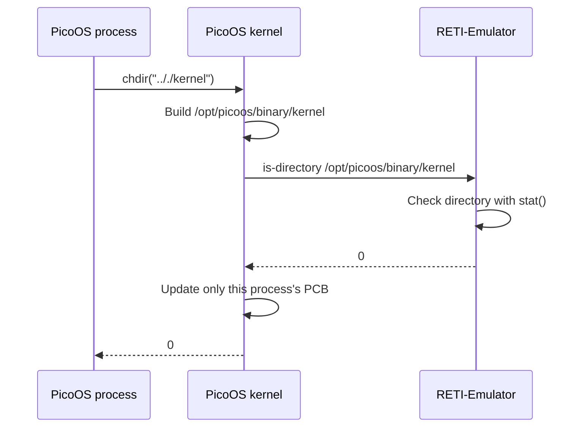

`chdir` returns `0` on success and `-1` on failure. `getcwd` returns the
directory stored in the PCB through the supplied buffer, or `NULL`. PID 1
initializes from `<ESC>pwd<ESC>/`; later calls only copy the PCB string.

`library/sys/stat` follows PicoC's library layout and
exposes the simple `mkdir(path)` call. PicoOS does not provide `stat()` or
`fstat()`.

`library/dirent` provides `opendir()`, `readdir()`, and
`closedir()`. `opendir()` obtains one bounded directory listing through the
kernel, `readdir()` returns its entries one by one from a reusable
`struct dirent`, and `closedir()` releases the stream buffer. An entry contains
only `d_type` (`DT_DIR` or `DT_REG`) and `d_name`; there is no size or other
metadata. `unlink()` and `rmdir()` are provided by
`library/unistd`.

# 12. Init process

## 12.1 Purpose of init

The first userspace process is traditionally called **init**. Many modern
Linux installations use `systemd` as an init system; PicoOS uses its own
minimal `system/init.picoc`, PID 1. It establishes the
initial environment, repeatedly starts one shell, and waits for that exact
shell.

## 12.2 Separation of responsibilities

| Component | Responsibility | Why it belongs there |
| --- | --- | --- |
| Kernel main | Initialize memory, process infrastructure, interrupts, load PID 1, dispatch | Requires privileged access to global machine/kernel state |
| Init | Read policy/configuration, construct initial environment, restart the shell | Userspace policy need not complicate the kernel |
| Shell | Read/parse commands, search `PATH`, manage foreground/background processes and redirection | Interactive user interface and command policy |

The kernel does not parse commands or configuration. Init does not schedule or
manage registers. The shell does not initialize global kernel structures.

## 12.3 Configuration file

Init first calls `getcwd()` with a `PATH_MAX` buffer. Because PID 1 has no
parent directory to inherit, the kernel sends `<ESC>pwd<ESC>/`, stores the
returned emulator startup directory in init's PCB, and copies it to the user
buffer. Init then opens `./config/environment.txt`, a newline/CRLF
separated list of `NAME=value` entries. It reads at most 255 bytes into a
256-cell buffer and calls `setenv(name, value, true)` for each entry. The
current file defines only `PATH=./user`; build-time
`config/config.header` separately controls whether init
adds `PICOOS_LOADING_BAR=true`.

The shell records its inherited directory during startup. When it searches a
relative `PATH` entry, it resolves that entry from this startup directory.
Consequently, the configured `PATH=./user` remains unchanged and still finds
the installed applications after the shell changes directory, without a
special loader protocol.

If the file is missing, cannot be read, exceeds 255 bytes, contains a malformed
line without `=`, or an environment allocation fails, init prints an error and
returns status 1. Because no shell exists, the kernel eventually shuts down.

## 12.4 Starting the shell

Init directly requests `./user/shell.bin`; it does not use `PATH`. `load()`
prefixes this relative path with init's directory and creates a `NEW` child.
The child PCB inherits the same directory. `run(shell_pid, NULL, NULL)`
supplies no extra arguments and inherits init's environment and standard
descriptors. A load return of 0 or failed `run()` makes init print an error and
exit with status 1.

## 12.5 Waiting for the shell with `waitpid()`

After starting the shell, init calls `waitpid(shell_pid)`. It remains blocked
until that exact child stops or terminates, rather than waking merely because
some other child changed. Under normal use, the shell returns when the user
enters `exit`; init collects it and loops back to load a fresh shell.

The current `waitpid()` also reports `SIGTSTP` stopped status. Therefore, if
the shell itself were explicitly stopped, init would wake and start another
shell; the "wait until termination" policy is exact in ordinary operation but
not enforced for that unusual signal case.

The shell's `exit` command therefore exits the current shell session, not the
kernel. `user/poweroff.picoc` invokes the shutdown
syscall when an actual emulator halt is wanted.

## 12.6 Why init is in the system directory

Init is system policy, not an ordinary command. Keeping it in `system`
and using the direct `./system/init.bin` kernel path prevents it from appearing
in the normal `PATH=./user` or being launched casually from the shell.
`fast_os_test_launcher.picoc` is likewise a system helper, while interactive
commands belong in `user`.

# 13. User applications

PicoOS provides **11 user binaries**: the interactive shell plus ten standalone
commands. The shell also provides **11 built-ins**. The two groups are distinct:
a binary runs as its own process, whereas a built-in runs inside the existing
shell and can therefore change shell state.

## 13.1 User binaries

| Binary | Purpose |
| --- | --- |
| `shell.bin` | Run the interactive PicoOS shell |
| `echo.bin` | Print arguments |
| `count.bin` | Count indefinitely with a configurable delay |
| `cat.bin` | Print one or more files |
| `ls.bin` | List a directory and distinguish files from directories |
| `mkdir.bin` | Create directories |
| `pwd.bin` | Print the process working directory |
| `rm.bin` | Remove files |
| `rmdir.bin` | Remove empty directories |
| `kill.bin` | Send a signal to a process |
| `poweroff.bin` | Shut PicoOS down |

The following sections explain the shell and the commands with behavior that is
useful to understand in more detail.

## 13.2 Shell built-ins

| Built-in | Purpose |
| --- | --- |
| `exit` | End the current shell session |
| `eval` | Evaluate a command line in the current shell |
| `run-shell-tests` | Run shell-test directories named by a manifest |
| `export` | Set an environment variable after expansion |
| `cd` | Change the shell working directory |
| `load` | Load a program without starting it |
| `run` | Start a previously loaded process |
| `unload` | Unload a process |
| `list` | Display the process list |
| `fg` | Continue the most recent background process in the foreground |
| `bg` | Continue the most recently tracked background process |

`cd` is necessarily a built-in: a child process could change only its own
working directory, then exit without changing the shell's directory. The other
process-management built-ins operate on loaded processes without starting a
separate command. The shell resolves configured relative `PATH` entries from
the directory it recorded at startup, so programs remain discoverable after a
directory change:

```text
PicoOS> pwd.bin
/opt/picoos/binary
PicoOS> cd ./user/../kernel
PicoOS> pwd.bin
/opt/picoos/binary/kernel
```

## 13.3 Shell

### Command parsing and execution

`user/shell.picoc` uses an 80-cell command buffer. It reads
one byte at a time, performs simple line editing, then:

1. removes a trailing `&` for background execution;
2. recognizes one final `>` or `>>` redirection;
3. separates the command name from a whitespace-delimited raw argument string;
4. expands `$NAME`, `$?` (last foreground status), and `$!` (last background
   PID), and removes double-quote characters;
5. loads a command containing `/` as a path or searches colon-separated
   `PATH`; and
6. starts the child with inherited environment and standard descriptors.

Tokenization is intentionally limited: the kernel later separates process
arguments on spaces/tabs, there is no general escape/single-quote parser, and
double quotes are removed rather than used to preserve embedded whitespace.

Foreground children are registered for terminal signals and waited for.
Background children are not waited for immediately; `$!`, `fg`, and `bg`
track only the most recent one. Exit statuses are available through `$?`.
The shell reports each successful load as `process with pid <pid> created`. It
also starts a new line and reports signal results as
`process with pid <pid> <action> by signal <signal>`, so output ending with
`\r` cannot run into the prompt.

Built-ins are `exit`, `eval`, `run-shell-tests`, `export`, `load`, `run`,
`unload`, `list`, `fg`, `bg`, and `cd`. Everything else is treated as an
external program. `load path` loads without starting, and `run PID` starts a
previously loaded PCB. The shell implements `cd` itself because a normal child
can change only its own PCB directory, not its parent's.

A short session shows direct paths, `PATH` lookup, environment expansion, and
the status values maintained by the shell:

```console
$ ./user/echo.bin direct path
direct path
$ export GREETING=hello
$ echo.bin $GREETING
hello
$ echo.bin background &
background
$ echo.bin background-pid=$!
background-pid=5
$ echo.bin foreground-status=$?
foreground-status=0
```

The exact PID depends on earlier loads. A trailing `&` avoids the foreground
wait; `$!` retains the most recently started background PID, whereas `$?`
retains the most recent foreground exit or stopped status. Starting a
background command does not replace `$?`.

### Newline and line editing

Both `\n` and `\r` complete input and are echoed as one newline. Backspace
byte 8 and delete byte 127 remove one buffered character and output
`\b`, space, `\b` to erase it visually. `Ctrl+U` erases the complete current
line, while `Ctrl+W` erases trailing whitespace and the previous word. Up and
Down select entries from the bounded command history; Left and Right are
ignored because cursor movement is not implemented. Unsupported escape
sequences are discarded without echoing the raw Escape byte to the host
terminal. This behavior sits above the UART receive interrupt and blocking `read()` path from
[section 4.9](#49-uart-and-keypress-interrupt).

### Output redirection

`>` and `>>` use `open()` plus `dup2()` as described in
[section 11](#11-filesystem). There is no `dup()` function in PicoOS; only
`dup2()` exists.

### Environment variables

The shell supports:

```console
$ export VARIABLE=value
```

The right side first undergoes the shell's variable expansion. A bare
`VARIABLE=value` is not assignment syntax; it is treated as a command name.
Although userspace `unsetenv("VARIABLE")` exists, the interactive command
`unset VARIABLE` is **not implemented** in the current shell. Test helpers call
`unsetenv()` directly to remove `PICOOS_LOADING_BAR`.

### Parent-death signal

At startup the shell calls:

```c
prctl(PR_SET_PDEATHSIG, SIGTERM);
```

The child creation path inherits this field, so shell descendants receive
`SIGTERM` if the shell terminates. This is a policy chosen by the shell, not an
OS-wide default; [section 6.6](#66-signals) describes the inheritance rules.

## 13.4 `echo`

`user/echo.picoc` prints `argv[1..argc-1]` separated by one
space and adds a newline at the end. Calling it without arguments therefore
prints an empty line. Within an argument, the two characters backslash-`n` are
printed as a real newline:

```console
$ echo.bin one two\nthree
one two
three
```

The shell does not perform this conversion; it passes the argument text to
`echo.bin` unchanged. Options such as `-n` and escape sequences other than
`\n` are not implemented. `echo.bin` always returns status 0.

## 13.5 `count`

`user/count.picoc` counts upward forever, returning to the
start of the current line with `\r` before each value. `count.bin DELAY` sets
the number of busy-loop iterations between values; without an argument it uses
25,000 iterations:

```console
$ count.bin 10000
```

The delay is a loop count, not a time in milliseconds, so its speed depends on
the emulator or hardware. The program calls `yield()` after every number so
other ready processes can run. `Ctrl+C` terminates it when it owns the
foreground. A negative delay or more than one argument prints help and returns
status 1; `-h` and `--help` print the same help and return 0.

## 13.6 `cat`

`user/cat.picoc` opens each path argument read-only, reads
64 cells at a time, and writes the files to standard output in argument order:

```console
$ cat.bin config/environment.txt README.md
```

Each descriptor is closed before the next file is opened. If one file cannot
be opened or read, `cat.bin` reports that path on standard error, continues
with the remaining files, and eventually returns status 1. A write failure
also returns status 1. It requires at least one path and does not read from
standard input; the usual `cat` options are not implemented. `-h` and
`--help` print its usage when supplied as the only argument.

## 13.7 Host-backed directory commands

The directory binaries are small clients of the `dirent` functions, `mkdir()`,
`getcwd()`, `unlink()`, and `rmdir()`. Those calls enter the kernel, which uses
the bounded [host requests over UART](#host-requests-over-uart). No host program is
launched.

All five directory commands use the calling process's PicoOS working directory
and the host operations described in [section 11.7](#117-working-directories-and-directory-operations).
They do not start similarly named programs on the host.

`ls.bin [DIRECTORY]` lists the current directory when no path is given. It
prints entries in the order returned by the host, including hidden entries and
`.`/`..`. A directory is prefixed with `d`; every other entry is prefixed with
`-`. There are no sorting, filtering, long-format, or recursive options.
Failure to open the directory is reported on standard error and returns status
1.

`mkdir.bin DIRECTORY...` creates every named directory. It continues after a
failure, naming the directory that could not be created, and returns status 1
if any operation failed. Parent creation and `-p` are not implemented.

`pwd.bin` prints the working directory stored in the process control block. It
accepts no operands. This is the PicoOS path used to resolve relative files,
not a fresh query of the emulator process's own working directory.

`rm.bin FILE...` calls `unlink()` for each path. It removes files only: there
is no recursive or forced mode. `rmdir.bin DIRECTORY...` removes empty
directories and leaves non-empty ones untouched. Both commands keep processing
later operands after an error and return status 1 if at least one removal
failed.

All five commands accept `-h` or `--help` as their sole argument. Their normal
output goes through PicoOS `write()`, so `>` and `>>` redirection work. A short
session using the release directory looks like this:

```console
PicoOS> ls.bin .
d .
d ..
- README.md
d boot
d config
- download-tools.ps1
- download-tools.sh
d kernel
- start-picoos.ps1
- start-picoos.sh
d system
d test
d user
PicoOS> pwd.bin
/opt/picoos/binary
PicoOS> ls.bin > files.txt
PicoOS> pwd.bin >> files.txt
PicoOS> mkdir.bin new-directory
PicoOS> rm.bin files.txt
PicoOS> rmdir.bin new-directory
```

## 13.8 `kill`

`user/kill.picoc` sends `SIGTERM` by default or accepts a
signal name or number before the PID. The accepted names are `SIGKILL`,
`SIGTERM`, `SIGCHLD`, `SIGCONT`, and `SIGTSTP`; signal 0 checks whether the
process exists without delivering a signal.

| Command | Result |
| --- | --- |
| `$ kill.bin 3` | Send `SIGTERM` to PID 3 |
| `$ kill.bin SIGKILL 3` | Send `SIGKILL` to PID 3 |
| `$ kill.bin SIGTERM 3` | Send `SIGTERM` to PID 3 |
| `$ kill.bin 0 3` | Check whether PID 3 exists without delivering a signal |

Incorrect argument counts, invalid PIDs or signal numbers, and unknown
processes print a specific error and return status 1. `SIGKILL` cannot be
caught or ignored; the other signal semantics are listed in
[section 6.6](#66-signals). After a successful call, `kill.bin` yields once so
the signalled process can be scheduled promptly. `-h` and `--help` list the
accepted forms.

## 13.9 `poweroff`

`user/poweroff.picoc` invokes the shutdown syscall.
This differs from the shell's `exit` built-in: `exit` ends only the current
shell session and init starts a new shell. In contrast:

```console
$ poweroff.bin
```

shuts PicoOS down and lets the emulator halt. The command accepts no operands;
`-h` and `--help` print help without shutting down, and other arguments return
status 1.

## 13.10 Actionable command errors

The shell validates built-in argument counts, quoting, redirection, process
lookup, and external command lookup before continuing. Errors name the failed
operation instead of silently ignoring malformed input:

```console
$ load
error: load requires a path
$ list extra
error: list does not accept arguments
$ echo.bin "unfinished
error: unmatched double quote
```

Init separately reports missing, unreadable, oversized, or malformed
environment configuration. Applications print short usage help when a required
operand is missing or an argument is invalid. `cat.bin` also reports file I/O
failures, while `kill.bin` distinguishes PID, signal, and process lookup
errors. These commands return failure where appropriate, making the result
visible through `$?`.

# 14. Use in the operating systems and real-time operating systems lectures

## 14.1 Real-time operating systems lecture

The real-time operating systems topics can be followed directly in the source:

- `PROCESS_STATE_*`, the process-list scan, and the dispatcher separate process
  state from the choice and execution of the next process.
- Timer interrupts preempt userspace, while `yield()` requests a voluntary
  switch through the same context-saving code.
- Wait queues block a process until an event occurs. `sleep(queue)` and
  `wakeup(queue)` provide FIFO suspension and resumption rather than timed
  sleeping.
- `TSL`, `mutex_lock()`, and `mutex_unlock()` show how an atomic test-and-set
  instruction can be combined with wait queues instead of continuous spinning.
- The shared-memory mutual-exclusion test demonstrates why processes sharing
  data also need synchronization.
- The kernel is non-preemptive even though userspace is timer-preempted, which
  gives students a small example of that scheduling choice.

Relevant sources include `kernel/scheduler.picoc`,
`kernel/dispatcher.picoc`,
`library/mutex/mutex.picoc`, and
`test/shared_memory_mutual_exclusion`.

## 14.2 Operating systems lecture

The bootloader and process loader provide examples of executable sections,
symbolic labels, binary headers, relocation bases, and initial stacks.
Parent/child PIDs, zombies, exact-child waiting, signals, init, and the shell
cover the lifetime of a process. The vector table and four ISR paths can be
used to trace software interrupts, hardware interrupts, synchronous
exceptions, register saving, and return from an interrupt.

The kernel heap, process-memory heap, and userspace heaps all reuse the same
first-fit allocator, making their different scopes easy to compare. The
host-backed file layer covers per-process descriptor tables, standard
descriptors, inheritance, seeking, and redirection without requiring an
on-device filesystem.

PicoC-Compiler retains symbolic block/function labels until its final RETI
passes resolve addresses. Generated `.reti` files such as
`kernel/kernel.reti` allow students to compare PicoC source, symbolic
assembly, section metadata, and executable words.

## 14.3 Exercise sheets and teaching material

The course handouts themselves are not stored in these repositories, but the
following teaching examples are checked in:

- `config/sheet7ex1_fib_2.picoc`, a program named
  for sheet 7, exercise 1;
- `test/basic_malloc.picoc`,
  `basic_free.picoc`, and
  `basic_free_block_merging.picoc`,
  focused executable examples for allocation, reuse, and coalescing;
- `test/process_memory_first_fit`,
  which checks complete-process first-fit reuse;
- PicoC-Compiler's generically named
  [`example_exercise_from_sheets1.picoc`](../PicoC-Compiler/test/example_exercise_from_sheets1.picoc)
  through `example_exercise_from_sheets6.picoc`; and
- the compiler's [pipeline documentation](../PicoC-Compiler/README.md#compiler-pipeline-overview)
  plus generated `.reti` files for teaching symbolic assembly and label
  resolution.

Course handouts can be linked here later if they are added to the project.

# 15. Test system

## 15.1 Testing across all three repositories

PicoOS, PicoC-Compiler, and RETI-Emulator are all tested both locally and on
fresh **GitHub-hosted Ubuntu 22.04 runners**. Thus, the integration is also
reproduced on GitHub workers instead of only passing on the development
computer. As of **14 August 2026**, the latest manually triggered GitHub
Actions test run for every repository is passing.

The comparable counts below use the default test selection executed by each
repository's GitHub Actions test workflow. One test means one selected source
program or PicoOS scenario, not every individual C `assert` inside it.

| Repository | Tests run in GitHub Actions | What the test system checks | Latest external run |
| --- | ---: | --- | --- |
| [PicoC-Compiler](https://github.com/matthejue/PicoC-Compiler/tree/linker_update) | **147** PicoC programs | `run_tests.sh` reads `// in:` and `// expected:` metadata, compiles each program, executes it with RETI-Emulator, compares its output, and independently compiles/runs the applicable source with GCC as a reference | [Passing: run 23](https://github.com/matthejue/PicoC-Compiler/actions/runs/31701231481) |
| [RETI-Emulator](https://github.com/matthejue/RETI-Emulator/tree/statemachine) | **32** RETI programs | `run_sys_tests.sh` extracts input/expected-output metadata, limits every emulator process to five seconds, and checks exit status plus exact output for normal, interrupt, UART, instruction, and error cases | [Passing: run 164](https://github.com/matthejue/RETI-Emulator/actions/runs/31701217169) |
| [PicoOS](https://github.com/matthejue/Pico-OS/tree/main) | **38** library/OS/shell scenarios | `make test` compiles in direct mode, runs library programs and complete bootloader/kernel/userspace sessions, drives shell input over UART, normalizes terminal output, and compares it with fixtures | [Passing: run 5](https://github.com/matthejue/Pico-OS/actions/runs/31712204843) |
| **Default CI total** | **217** | End-to-end coverage from PicoC source through generated RETI code to the emulator and the complete OS | **All passing** |

The workflows check out the other two repositories at their integration
branches, install the compiler's Python dependencies and ncurses, and rebuild
the compiler and emulator before testing. PicoOS additionally substitutes a
GitHub-specific `host_commands` fixture because directory-entry order differs
on the runner. Each workflow publishes its result as a commit status:
`PicoC tests`, `RETI system tests`, or `PicoOS tests`.

There are additional non-default test inputs. PicoC-Compiler contains **170**
`test/*.picoc` files in total; its default and CI selection deliberately runs
147 `basic`, `advanced`, `example`, `hard`, `thesis`, and `tobias` programs.
RETI-Emulator also has **13 C unit-test executables** in addition to its 32
system-test programs; `make unit-test` builds and runs those assertion-based
tests, while the dedicated GitHub test workflow runs the complete 32-program
system suite. Release workflows add cross-platform build and smoke checks.

The current tree contains **38 tests** across three categories. These are
logical test cases; an OS feature directory may compile a launcher plus one or
more worker programs.

| Category | Count | Discovery and execution |
| --- | ---: | --- |
| Library | 12 | Top-level `test/*.picoc`; each runs directly in RETI-Emulator with the UART-only test ISR table |
| OS feature | 17 | Directories with `launcher.picoc` and the standard three-line load/run/poweroff input; each exercises the kernel, init, shell, and one feature scenario |
| Shell | 9 | Other valid test directories; `input.txt` directly exercises shell commands, descriptors, files, or line editing |
| **Total** | **38** | The default `make test` inventory |

The test runners use the same discovery rules for normal and fast mode:

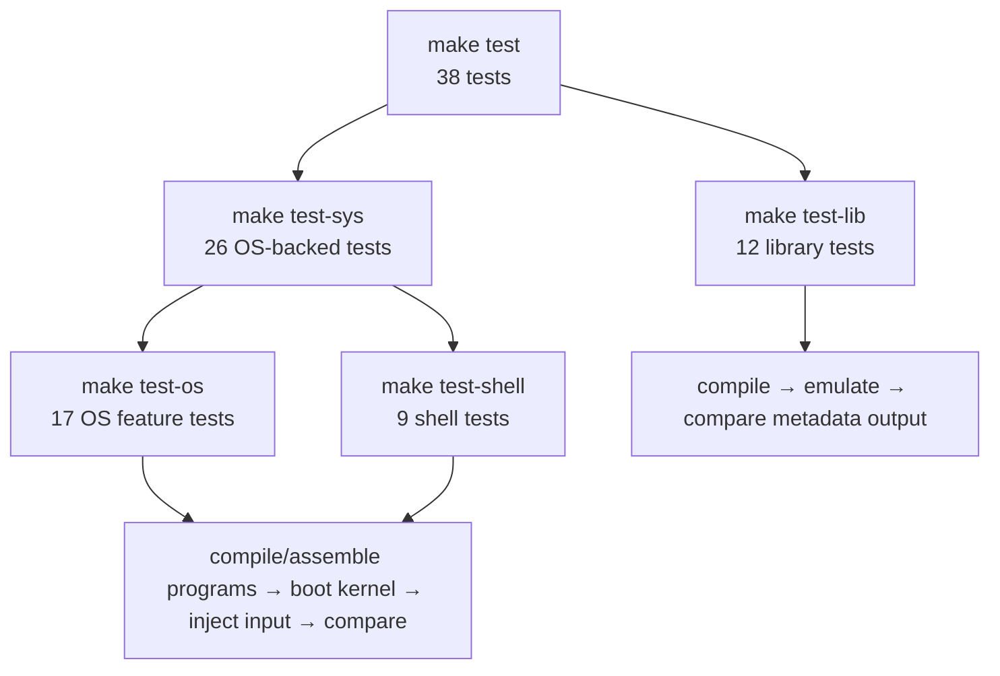

Counts are derived from the files currently present under `test`, so
they should be updated when test cases are added or removed.

The detailed contributor guide is `test/README.md`.

## 15.2 `make test` and `make test-fast`

`make test` runs:

```make
$(MAKE) test-lib
$(MAKE) test-sys
```

It runs the configured library tests, then the OS feature and shell tests.
`make test-fast` runs `make test-lib` followed by `make test-sys-fast`, which
uses one shared OS boot for each of the OS feature and shell test groups.
Normal OS and shell tests run independent emulator instances in parallel;
fast OS and shell tests run serially inside their shared session. Therefore,
`TEST_JOBS` only affects the library-test part of `make test-fast`.
`make test-all` is an alias for `make test`. The Makefile also supports pattern
variables and separate compiler/emulator option files under `opts`.
Combined targets repeat the library, OS feature, and shell summaries under a
final heading in execution order. System-test targets print each group runtime
and their total runtime in `MM:SS` format.

Tests use staged `.reti_blocks`/`.st` inputs by default. For a comparison build
that compiles every merged `.reti` directly from `.picoc` sources without
reusing staged artifacts, run:

```console
$ make test TEST_BUILD_MODE=direct
```

## 15.3 `make test-lib`

Library tests use exact top-of-file metadata:

```c
// in: 42 X
// expected:ok 42 Z
// dependencies: ../library/stdio/libstdio.picoc

#include "../library/stdio/stdio.header"

int main() {
    int value;
    scanf("%d", &value);
    printf("ok %d %c", value, 'Z');
    return 0;
}
```

This is `test/basic_stdio.picoc`.
`run_sys_tests.sh` reads the first two lines and creates
same-basename `.input` and `.expected_output` side files. The parallel Make
rules parse a leading `// dependencies: ...` line with shell-like quoting and
resolve paths relative to the test source.

`run_sys_tests.sh` compiles each selected source using
`config/test_cpl_opts.txt`, runs it with `reti_emulator` and
`config/test_emu_opts.txt`, limits each emulator to five seconds, and compares
actual `.output` to `.expected_output` after stripping trailing whitespace per
line. It reports compilation, emulator, timeout, missing-output, and diff
failures; writes a summary to `test/test.res`; and records failed source
paths in `config/not_passed_tests.txt`.

## 15.4 System and OS tests

The available targets are:

| Target | Categories | Boots |
| --- | --- | ---: |
| `$ make test-sys` | OS feature, then shell | one per test |
| `$ make test-os` | OS feature only | one per test |
| `$ make test-shell` | shell only | one per test |
| `$ make test-sys-fast` | OS feature, then shell | one shared boot per group |
| `$ make test-os-fast` | OS feature only | one shared boot |
| `$ make test-shell-fast` | shell only | one shared boot |

A normal OS feature directory such as
`test/hello_world` contains:

```text
launcher.picoc
hello_world.picoc
input.txt
expected_output.txt
```

Generated test `*.reti`/`*.bin` files are staged below `binary/test`; test
`output.txt` and `raw_output.txt` remain beside the source fixtures. There is
no `output_fast.txt`; fast runs ultimately place normalized content in the
same `output.txt`. Fast shell evaluation temporarily captures
`.fast_shell_output.txt`, then the Python runner renames it to `output.txt`.

`run_os_tests.py` compiles every `.picoc` in the directory, automatically
expands dependency metadata, and assembles each with
`reti_emulator` in an isolated temporary peripheral directory. It starts
the release-style runtime through `binary/boot/bootloader.reti`, waits for each
`PicoOS> ` prompt, injects one input line followed by carriage return, captures
stdout in `raw_output.txt`, renders terminal control characters and removes
prompts/loading UI into `output.txt`, then compares trimmed expected/actual
text. The bootloader loads `binary/kernel/kernel.bin` and the same system,
user, configuration, and kernel metadata files included in release archives.
A normal test has a 120-second limit.

The fast runner builds manifests and starts one release-style OS session:

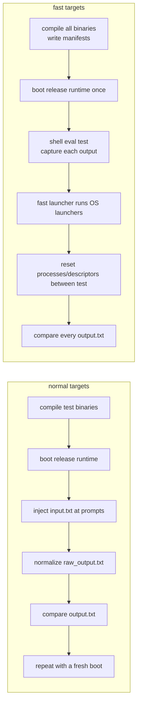

`system/fast_os_test_launcher.picoc`
redirects stdout to each test's `output.txt`, loads and runs its
`launcher.bin`, waits for it, restores stdout, and requests a process-state
reset. That removes all processes except init, shell, and the syscall caller
and destroys their descriptor tables. The launcher also removes the
loading-bar variable. This reuses the expensive boot while isolating process
state.

## 15.5 Shell tests

Shell tests have `input.txt` and `expected_output.txt` but no standard
launcher input pattern. Normal `make test-shell` injects their commands
through UART exactly as a user would, producing `raw_output.txt` and normalized
`output.txt`.

Fast shell tests normally run inside the already-running shell:
`run_os_tests_fast.py` creates a manifest, the shell's
`run-shell-tests` built-in reads each `input.txt`, calls `eval()` per line, and
captures each directory's `.fast_shell_output.txt`. Before and after each test,
`shell_reset()`:

- clears the foreground PID and removes leftover test processes;
- closes private descriptors `3..7`;
- resets `$?` and `$!`;
- restores the cloned initial environment; and
- resets the expected test PID sequence.

The line-editing test contains the literal `\b` test encoding and must traverse
raw UART/`read_line()`, so the fast runner appends it to the shared session's
UART input instead of calling `eval()`. Fast mode permits 60 seconds per
selected test when computing the shared session limit.

# 16. Use of AI in the project

I used AI tools while working on parts of the Makefile and Python test runners,
for repetitive code and test setup, and for help with refactoring, debugging,
and documentation. One example kept in the repository is a
conversation about VS Code file associations.

I reviewed the resulting changes against the PicoOS, PicoC-Compiler, and
RETI-Emulator source and ran the relevant tests. The architecture, project
scope, and final technical decisions were still my responsibility.

# 17. Source map and limitations

Start with these files when following a subsystem:

| Topic | PicoOS | Related project contract |
| --- | --- | --- |
| Boot and binary input | [`bootloader.picoc`](boot/bootloader.picoc), [`process_loader.picoc`](kernel/process/process_loader.picoc) | [binary sections](../RETI-Emulator/documentation/section_file_entries.md) |
| UART | [`uart_hardware.picoc`](kernel/uart_hardware.picoc), [`uart_protocol.picoc`](common/uart_protocol.picoc) | [emulator UART](../RETI-Emulator/documentation/uart_protocol.md) |
| IVT/ISRs | [`os_isrs.picoc`](interrupt_service_routines/os_isrs.picoc) | [compiler low-level attributes](../PicoC-Compiler/documentation/reti_sections_low_level_picoc.md) |
| Processes/waits | [`process.header`](kernel/process.header), [`process.picoc`](kernel/process/process.picoc) | [PicoC calls/frames](../PicoC-Compiler/README.md#function-calls-and-stack-frames) |
| Scheduling/dispatch | [`scheduler.picoc`](kernel/scheduler.picoc), [`dispatcher.picoc`](kernel/dispatcher.picoc) | [`INT`/`RTI` interpreter](../RETI-Emulator/source/interpr.c) |
| Exceptions | [`exception.picoc`](kernel/exception.picoc) | [CPU exceptions](../RETI-Emulator/documentation/cpu_exceptions.md) |
| Memory | [`heap.picoc`](common/heap.picoc), [`kmalloc.picoc`](kernel/kmalloc.picoc), [`pmalloc.picoc`](kernel/pmalloc.picoc) | [generated kernel constants](../PicoC-Compiler/documentation/kernel_header_option.md) |
| Files/descriptors | [`kernel/filesystem`](kernel/filesystem), [`library/unistd`](library/unistd) | [UART escape sequences](../RETI-Emulator/documentation/uart_protocol.md) |
| Userspace lifecycle | [`start.picoc`](library/start/start.picoc), [`init.picoc`](system/init.picoc), [`shell.picoc`](user/shell.picoc) | [compiler `-C`](../PicoC-Compiler/README.md#command-line-options) |

The main limitations are:

- one physical SRAM address space, no MMU or process isolation;
- host-backed UART files rather than a resident filesystem;
- a dynamic linked process list but fixed user heap/stack defaults;
- round-robin list scanning rather than a separate ready queue;
- non-preemptive kernel scheduling and timer-preempted userspace;
- wait-queue `sleep()` rather than timed sleep;
- exact-child `waitpid()` but no general `wait()`;
- five signals and minimal foreground/background handling;
- eight descriptors per process and copied rather than shared descriptor state;
- no interactive `unset` command, no `fwrite()`, and small format parsers; and
- familiar C/POSIX names used for teaching, without full POSIX semantics.

# Appendix: Inspecting `.bin` files with `hexyl`

[`hexyl`](https://github.com/sharkdp/hexyl) is convenient for inspecting the
big-endian words in generated `.bin` files. `-s N` or `--skip N` skips the
first `N` bytes, and `-n N` or `--length N` limits the number of displayed
bytes. The values accept decimal, hexadecimal, and size suffixes. A negative
skip is relative to the end of the file, so this command displays only its
final 64 bytes:

```console
$ hexyl -s -64 -n 64 program.bin
```
