# PicoOS

PicoOS is a small educational operating system for the RETI teaching CPU. It
was developed primarily so that students can inspect a complete implementation
while learning concepts from the real-time operating systems lecture:
mutexes, process states, scheduling, the dispatcher, `waitpid()`, wait-queue
`sleep()`, and `wakeup()`. It also connects topics from the operating systems
lecture: process loading and parent/child relationships, signals, interrupt
vectors and service routines, software and hardware interrupts, file
descriptors, and the implementation of `malloc()`/`free()` with heap-block
splitting and merging.

PicoOS deliberately stays small. It is not Linux and is not a complete POSIX
implementation. There is no virtual memory or on-device filesystem; processes
use absolute SRAM addresses, while host files are requested from the emulator
through UART control frames. Those simplifications keep the path from a RETI
instruction or keyboard byte to kernel code visible.

Three sibling projects form the complete system:

- **[PicoOS](.)** is the kernel, libraries, bootloader, init process, shell, and
  applications described here.
- **[PicoC-Compiler](../PicoC-Compiler/README.md)** compiles the PicoC subset of
  C into symbolic RETI assembly, links `.ivt`, `.text`, and `.data`, and emits
  section metadata.
- **[RETI-Emulator](../RETI-Emulator/README.md)** assembles and executes RETI,
  emulates EPROM, SRAM, UART, the interrupt controller, the timer, and CPU
  exceptions, and exposes host files through the UART protocol.

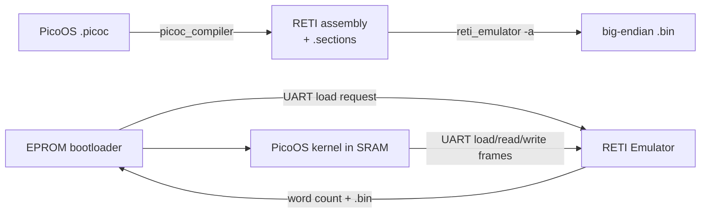

The kernel is **non-preemptive** in the scheduling sense: a timer interrupt
that sees the kernel code segment restores the interrupted kernel context
without entering the scheduler. User processes, however, are preempted by
timer interrupts and scheduled round-robin. A higher-priority UART hardware
interrupt may temporarily run its small handler while kernel code is waiting,
but it returns to that kernel work; it does not schedule a different process.

## Contents

1. [Bootloading](#1-bootloading)
2. [Kernel main loop](#2-kernel-main-loop)
3. [Interrupts, system calls, and exceptions](#3-interrupt-vector-table-interrupts-system-calls-and-exceptions)
4. [Processes](#4-processes)
5. [Blocking, waiting, synchronization, and signals](#5-process-blocking-waiting-synchronization-and-signals)
6. [Scheduler](#6-scheduler)
7. [Dispatcher](#7-dispatcher)
8. [Memory management](#8-memory-management)
9. [Libraries](#9-libraries)
10. [Filesystem](#10-filesystem)
11. [Init process](#11-init-process)
12. [User applications](#12-user-applications)
13. [Use in lectures](#13-use-in-the-operating-systems-and-real-time-operating-systems-lectures)
14. [Test system](#14-test-system)
15. [Use of AI](#15-use-of-ai-in-the-project)
16. [Source map and limitations](#16-source-map-and-deliberate-limitations)

## Build and run

The build assumes `picoc_compiler`, `reti_emulator`, and `make` are available on
`PATH`. The optional `hexyl` utility is useful for inspecting generated `.bin`
files in hexadecimal. Build the firmware and all normal user commands, then
boot through EPROM:

```sh
make firmware user
make bootload
```

`make bootload` starts the emulator's debug TUI with the EPROM start program,
kernel section/debug metadata, and a 2^18-cell SRAM. Press capital `V` to enter
the UART terminal view; `Escape` returns to the TUI. `make bootload-debug`
forces debug information for both bootloader and kernel. `make run-os
OS_RUN_PATH=tests/hello_world` runs one configured OS scenario, while the
focused test targets are documented in [section 14](#14-test-system).
Both bootload targets pass `-n 4` because PicoOS's four-entry interrupt vector
table is copied into SRAM by the EPROM loader and therefore cannot be counted
when the emulator initially parses `startprogram.reti`.

# 1. Bootloading

## 1.1 Loading and starting the kernel

The firmware entry point is the naked `_start()` in
[`eprom_startprogram/startprogram.picoc`](eprom_startprogram/startprogram.picoc).
The compiler places it in EPROM. It:

1. sets `SP` to the last SRAM cell (`-2^31 + 2^18 - 1`) and copies it to `BAF`;
2. makes `DS` point at the bootloader's EPROM data section; and
3. jumps to `boot_main()`.

`boot_main()` sends the bytes of `<ESC>load kernel.bin<ESC>/` through UART,
receives the file's word count and four-word binary header, then copies the
remaining words to the first SRAM cell. `start_loaded_kernel()` reads the
saved header values from its bootloader frame, changes `CS` and `DS` from
EPROM to the kernel's SRAM code/data bases, sets the kernel `SP` and `BAF`,
and jumps to `CS`. The first kernel text routine is the compiler-generated
`_start`, which calls [`kernel/main()`](kernel/kernel.picoc).

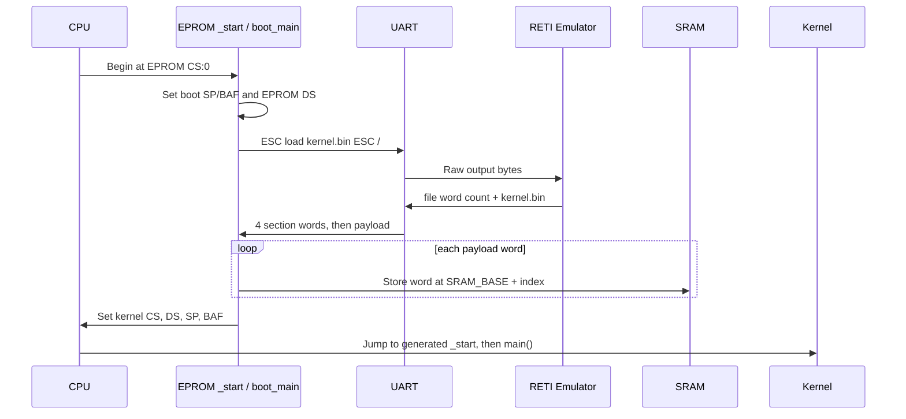

When normal kernel execution begins, `.ivt`, `.text`, and `.data` already
occupy SRAM and compile-time global initializers are present. The kernel heap,
process-region heap, process list, shared-memory list, interrupt controller,
and stack-overflow boundary are **not** initialized until `main()`. The EPROM
stack used during loading is at the top of SRAM; the kernel changes to its
dedicated stack before running.

Useful sources: [bootloader](eprom_startprogram/startprogram.picoc),
[word receiver](common/uart_protocol.picoc), and
[SRAM copy loop](common/sram_loader.picoc).

## 1.2 Generated memory constants

The kernel has no process control block from which low-level code could obtain
its segment and stack addresses. The compiler therefore provides
`-k MODE` / `--kernelheader MODE`, documented in
[PicoC-Compiler's kernel-header guide](../PicoC-Compiler/doc/kernel_header_option.md).
This mode links far enough to know final section addresses and writes only the
header selected by `-o`.

The Makefile uses:

```sh
# Kernel constants
picoc_compiler <kernel sources> -O1 -s -k sram \
    -o kernel/memory_constants.header

# EPROM bootloader constants
picoc_compiler <bootloader sources> -O1 -s -k eprom \
    -o eprom_startprogram/memory_constants.header
```

The current generated
[`kernel/memory_constants.header`](kernel/memory_constants.header) contains:

| Constant | Current value | Meaning |
| --- | ---: | --- |
| `SRAM_BASE` | `-2147483648` | Absolute base selected by address bits `10` |
| `SRAM_MAX_ADDRESS_IN_MEMORY_MAP` | `-2147221505` | Absolute last cell of the configured 2^18-cell SRAM |
| `KERNEL_HEAP_START` | `-2147450821` | Absolute first cell after kernel static data |
| `PROCESS_MEMORY_START` | `-2147443647` | First cell after the configured kernel stack start |
| `KERNEL_CS_START_ASM` | `LOADI32 CS -2147483644` | Kernel `.text` base |
| `KERNEL_DS_START_ASM` | `LOADI32 DS -2147451242` | Kernel `.data` base |
| `KERNEL_SP_START_ASM` | `LOADI32 SP -2147443648` | Kernel stack pointer (`SRAM_BASE + 40000`) |
| `KERNEL_CS_ACC_ASM` | `LOADI32 ACC -2147483644` | Same code base loaded into `ACC` for comparisons |

The values are generated artifacts and may move when the kernel changes.
`KERNEL_STACK_START ?= 40000` in the [Makefile](Makefile) deliberately
overrides the compiler's normal `stack_start`; the Makefile patches
`KERNEL_SP_START_ASM` and `PROCESS_MEMORY_START` consistently. With the
currently generated [`kernel.sections`](kernel.sections), the relative
boundaries are `.text = 4`, `.data = 32406`, heap start `32827`, and kernel
stack start `40000`.

The EPROM-mode header
[`eprom_startprogram/memory_constants.header`](eprom_startprogram/memory_constants.header)
contains `SRAM_MAX_ADDRESS`, `EPROM_DS_START_ASM`, and
`EPROM_STACK_START_ASM`. It has no kernel heap or process-memory constants:
the bootloader needs only its EPROM data base and a temporary SRAM-top stack.

## 1.3 UART hardware interface

The periphery address space has top address bits `01`, so its signed-neutral
base is `2^30 = 1073741824`. The first three cells are UART registers:

| Periphery cell | Absolute address | Direction | Meaning |
| ---: | ---: | --- | --- |
| `0` | `1073741824` | PicoOS → emulator | `uart_send`; low 8 bits are the outgoing byte |
| `1` | `1073741825` | emulator → PicoOS | `uart_receive`; low 8 bits are the incoming byte |
| `2` | `1073741826` | both | status: bit 0 send-ready, bit 1 receive-ready |

To send, PicoOS writes cell 0, clears status bit 0, and polls until the
emulator sets it again. To receive synchronously, it clears bit 1, polls until
the emulator supplies a byte and sets bit 1, then reads cell 1. The bootloader
uses these polling routines because interrupts and processes do not yet
exist. Normal shell input instead uses the UART hardware interrupt and the
per-process input buffer described in [section 3.9](#39-uart-and-keypress-interrupt).

See [`kernel/uart_hardware.picoc`](kernel/uart_hardware.picoc), the local
[UART protocol notes](doc/uart_protocol.md), and the emulator's
[UART documentation](../RETI-Emulator/README.md#uart).

## 1.4 File-loading protocol over UART

UART itself transports only raw bytes. PicoOS creates a higher-level request by
writing this ASCII control frame as output:

```text
<ESC>load <path><ESC>/
```

`<ESC>` is byte 27. The emulator consumes the complete frame instead of
displaying it, opens `<path>` relative to its working directory (unless the
path is absolute), and appends to its UART input buffer:

1. a 32-bit **big-endian word count** for the file;
2. the exact file bytes.

For `load`, an unreadable file produces a zero count. The count lets the
receiver distinguish protocol metadata from payload; neither the escape frame
nor a datatype marker appears in the input payload.

Host-backed filesystem operations use the following ranged request:

```text
<ESC>read-range <offset> <count> <path><ESC>/
```

The emulator responds with one big-endian 32-bit returned-byte count, followed
by at most `count` bytes from `offset`. A range reaching past the end of the
file returns fewer bytes. `UINT32_MAX` means that the file is missing or
unreadable.

Metadata operations use a separate request:

```text
<ESC>file-size <path><ESC>/
```

It returns the complete file size as one big-endian 32-bit value, or
`UINT32_MAX` for a missing or unreadable file. PicoOS's `file_exists()` and
`SEEK_END` use this command, so normal ranged reads do not repeatedly transfer
the complete file size. The complete-file `<ESC>read <path><ESC>/` command
remains available for clients that need it.

`reti_emulator -a program.reti` builds `program.bin`. The `.bin` itself begins
with four big-endian 32-bit words copied from `program.sections`:

| Header word | Meaning and receiver use |
| ---: | --- |
| 0 `codesegment_start` | Process-relative `CS` and initial entry point |
| 1 `datasegment_start` | Process-relative `DS` |
| 2 `heap_start` | First cell after static data; user `malloc()` starts here |
| 3 `stack_start` | Highest process-relative stack cell, or `-1` to request PicoOS defaults |

All four values are one 32-bit word. The emulator-prepended word count includes
these four header words. Thus the kernel computes
`payload_word_count = word_count - 4`, does **not** copy the header to process
memory, and copies only the encoded program words. For normal programs the
build is:

```sh
picoc_compiler program.picoc <libraries> -C lib/start/libstart.picoc \
    -O1 -i -w -s -g -v -o program.reti
reti_emulator -f /tmp -a program.reti
```

Repository builds call `picoc_compiler --show-input-files` directly. Staged
test and user-program builds compile each source into `.reti_blocks` and `.st`
files before linking. The compiler itself decides whether those files can be
reused from the cache metadata embedded in `.reti_blocks`; Make dependency
files keep library-test header dependencies up to date without a separate
Python cache check.
See [Incremental PicoC compilation](doc/incremental_compilation.md) for the
complete cache and invalidation behavior.

The real big-endian receiver is intentionally simple:

```c
int receive_word(void) {
    int word;

    word = receive_byte_over_uart();
    if (word >= 128) {
        word = word - 256;
    }

    word = word * 256 + receive_byte_over_uart();
    word = word * 256 + receive_byte_over_uart();
    word = word * 256 + receive_byte_over_uart();
    return word;
}
```

Sign-extending the first byte before three multiply/add steps reconstructs the
signed 32-bit value. See
[`common/uart_protocol.picoc`](common/uart_protocol.picoc) and the emulator's
[section-file format](../RETI-Emulator/doc/section_file_entries.md).

# 2. Kernel main loop

## 2.1 Kernel initialization

[`kernel/kernel.picoc`](kernel/kernel.picoc) performs the complete
initialization in a deliberately visible order:

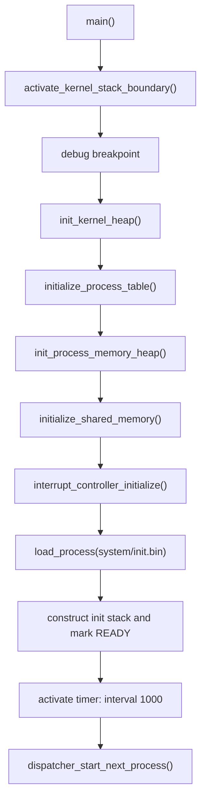

The order matters. PCBs, paths, descriptor tables, and shared-memory metadata
use `kmalloc()`, so the kernel heap is initialized first. Complete process
regions use `pmalloc()`, initialized next. The interrupt controller maps timer
device 0 to vector 1 at priority 1, disables the custom device, and maps UART
device 2 to vector 2 at priority 2. The timer interval remains zero until init
has loaded successfully.

There is no conventional forever loop in `main()`. The dispatcher transfers
control with `RTI`. Whenever every existing process is blocked,
`dispatcher_start_next_process()` spins in kernel context until a hardware
interrupt makes a process runnable. If all processes have been removed,
control ultimately reaches `shutdown()` (`JUMP 0`).

## 2.2 Transition from bootloading to normal execution

Bootloading ends at `MOVE CS PC` in `start_loaded_kernel()`. At that point:

- `PC` and `CS` select the first kernel `.text` instruction;
- `DS` selects the loaded kernel `.data`;
- `SP` and `BAF` equal the configured kernel stack start;
- `.ivt`, `.text`, and `.data` are present in SRAM;
- general registers other than those explicitly set have no API-level promise;
- interrupts have not yet been configured by PicoOS; and
- no process exists.

Kernel `_start` calls `main()`. After initialization, init is the only
`READY` process. `scheduler_next_process()` returns it,
`dispatcher_switch_to_process()` marks it `RUNNING`, loads its saved `SP`,
`BAF`, `CS`, `DS`, `IN1`, `IN2`, and `ACC`, sets its stack/heap boundary, and
executes `RTI`. The initial stack cell holds `_start - 1`; because `RTI`
advances `PC` after restoring it, userspace starts exactly at `_start`.

# 3. Interrupt vector table, interrupts, system calls, and exceptions

## 3.1 Binary sections

The compiler links three sections:

- **`.ivt`** contains raw vector entries. Each is an SRAM-relative ISR address.
- **`.text`** contains executable RETI words, beginning with `_start`.
- **`.data`** contains globals and other static data. With `-O1`, values known
  at compile time are emitted directly instead of assigned by startup code.

The `.sections` JSON records their boundaries, plus `heap_start` and
`stack_start`. Assembly mode encodes `.ivt`, `.text`, and `.data` as the
payload after the four-word binary header.

```text
SRAM relative, low addresses                                      high
┌──────────────┬─────────────────────────────┬──────────────┬───────────┐
│ .ivt         │ .text                       │ .data        │ free/heap │
│ vectors 0..3 │ _start, handlers, kernel…   │ globals      │           │
└──────────────┴─────────────────────────────┴──────────────┴───────────┘
0              codesegment_start             datasegment    heap_start
```

In the current kernel, `.ivt` is four cells at offsets `0..3`, and `.text`
starts at offset 4. User binaries normally have no `.ivt` and start `.text` at
offset 0.

## 3.2 Interrupt vector table

The operating-system table in
[`interrupt_service_routines/os_isrs.picoc`](interrupt_service_routines/os_isrs.picoc)
is:

```c
__attribute__((section("ivt")))
void (*interrupt_vector_table[4])(void) = {
    syscall_interrupt,
    timer_interrupt,
    uart_interrupt,
    cpu_exception_interrupt
};
```

For `INT i`, the emulator decrements `SP`, stores the interrupted `PC` at
`SP + 1`, reads vector cell `i` from the start of SRAM, adds the SRAM address
tag, and loads `PC` with that handler address. Hardware devices first use
periphery cells 3–5 to map their signal line to `i`. Exceptions always select
slot 3. `RTI` reverses the automatic part: load `PC` from `SP + 1`, increment
`SP`, and then advance execution to the following instruction.

Only the return PC is saved automatically. Every ordinary register needed
afterward is explicitly pushed by PicoOS.

## 3.3 Interrupt service routines

The current OS has four vector entries:

| Vector | Entry | Source and purpose |
| ---: | --- | --- |
| 0 | `syscall_interrupt` | Software `INT 0`; saves user context, switches to the kernel stack, and calls `handle_syscall()` |
| 1 | `timer_interrupt` | Timer hardware interrupt; returns immediately for kernel CS, otherwise saves and schedules |
| 2 | `uart_interrupt` | UART hardware interrupt; receives one byte, handles terminal signals, buffers/completes input, and returns to the interrupted context |
| 3 | `cpu_exception_interrupt` | Fixed synchronous exception entry; reports and terminates a process or panics |

The custom hardware signal line exists in the emulator but PicoOS maps it to
`255` (disabled). [`interrupt_service_routines/isrs.picoc`](interrupt_service_routines/isrs.picoc)
is a separate UART/polling table used by standalone library tests, not an
additional kernel ISR.

## 3.4 Exception handlers

The emulator and PicoOS implement exactly three synchronous exceptions:

| Cause | Trigger | Detection |
| ---: | --- | --- |
| 1 | divide or modulo by zero | Emulator instruction interpreter |
| 2 | an instruction would lower `SP` below the active boundary | Emulator register-write guard |
| 3 | invalid encoded word or unsupported opcode | Emulator decoder/interpreter |

Detection happens before the faulting instruction commits its register or
memory result. The emulator sets read-only periphery cell 11, adjusts exception
entry so `SP + 1` contains the faulting `PC - 1`, and selects vector 3.
Returning would retry the instruction, but PicoOS never returns from these
exceptions.

The exception ISR preserves the interrupted `CS` in `BAF`, clears stack
protection while changing stacks, restores kernel segments and stack, then
passes the difference between interrupted and kernel `CS` to
`handle_cpu_exception()`. A zero difference is a kernel fault:

| Context | Diagnostic | Result |
| --- | --- | --- |
| User | `Process terminated: division by zero` / `stack overflow` / `illegal instruction` | exit status 1, normal parent notification/cleanup, dispatch another process |
| Kernel | `Kernel panic: division by zero` / `kernel stack overflow` / `illegal instruction` | `shutdown()` |

The exception entry itself saves only the retry PC automatically. PicoOS does
not need to preserve the other faulty user registers because it terminates the
process. See [`kernel/exception.picoc`](kernel/exception.picoc) and the
emulator's [CPU exception contract](../RETI-Emulator/doc/cpu_exceptions.md).

### Stack-overflow boundary

Periphery cell 10 is an inclusive `stack_heap_boundary`; zero disables the
check. PicoOS writes it, and the emulator reads it whenever an instruction
would lower `SP`:

- kernel boundary = `KERNEL_HEAP_START + 4096 - 1`;
- process boundary = `base_address + heap_start + heap_size - 1`.

`SP` denotes the free cell immediately below the lowest occupied stack cell,
so equality with the boundary is valid. A proposed value below it raises the
exception before updating `SP`. The dispatcher changes cell 10 before every
context transfer, and syscall/exception entries temporarily write zero before
changing from a process stack to the kernel stack.

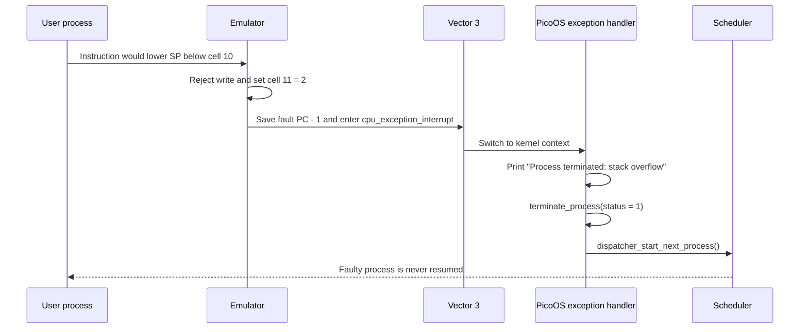

This design keeps the boundary policy in PicoOS while putting the check at the
only place that can reliably see every `SP` write: the emulator's instruction
interpreter. Periphery cell 11 exposes the emulator's read-only
`cpu_exception_cause`; PicoOS reads it to select the diagnostic, and writes are
ignored. The bootload command declares all four vector entries with `-n 4`, so
the emulator knows that exception slot 3 exists even though the EPROM loader
installs it at runtime. If fewer than four entries are parsed or configured,
the emulator reports an unhandled CPU exception and stops instead of entering
PicoOS.

## 3.5 PicoC-Compiler support for low-level handlers

PicoC's special attributes are documented in
[the compiler README](../PicoC-Compiler/README.md#picoc-attributes-and-entry-points):

- `__attribute__((section("ivt")))` places a global or function in `.ivt`.
  IVT globals use `CS` as their base. Only `"ivt"` is accepted.
- `__attribute__((naked))` suppresses the generated prologue, shared epilogue,
  and automatic return sequence. The function must implement its own control
  transfer, which is essential when register and stack layout must exactly
  match `INT`/`RTI`.
- `-O1` enables compile-time global initializer generation. Constant arrays,
  structures, function addresses, and scalar values can be emitted directly
  as section words. This is what makes a raw vector table available before any
  startup code runs. Initializers not reducible at compile time remain runtime
  work; `.ivt` values must be compile-time constant.

Normal functions receive a compiler prologue/epilogue. Naked interrupt hubs
instead contain only the written `asm("...")` instructions.

## 3.6 System call handling

All userspace wrappers put the system-call number in `ACC`, one scalar or
request-structure pointer in `IN1`, and execute `INT 0`. The vector-0 hub saves
the interrupted registers, changes to kernel `CS`, `DS`, and `SP`, and calls:

```c
int handle_syscall(int syscall_number, int argument, int *caller_context) {
    if (syscall_number == SYSCALL_SEND_BYTE_OVER_UART) {
        send_byte_over_uart(argument);
        return 1;
    } else if (syscall_number == SYSCALL_LOAD_PROCESS) {
        return load_process(
            ((struct LoadProcessRequest *)argument)->path,
            ((struct LoadProcessRequest *)argument)->show_loading_bar
        );
    } else if (syscall_number == SYSCALL_WAITPID) {
        return wait_for_process_by_pid(
            (struct WaitPidRequest *)argument,
            caller_context
        );
    }
    // ... open/read/write, shared memory, signals, prctl, yield, and others
    return 0;
}
```

There are 31 syscall numbers (`0..30`) in
[`common/syscall.header`](common/syscall.header). Some return normally through
`syscall_interrupt_return`; blocking, exit, yield, and signal restoration may
save or replace the process context and dispatch without returning through the
same kernel call.

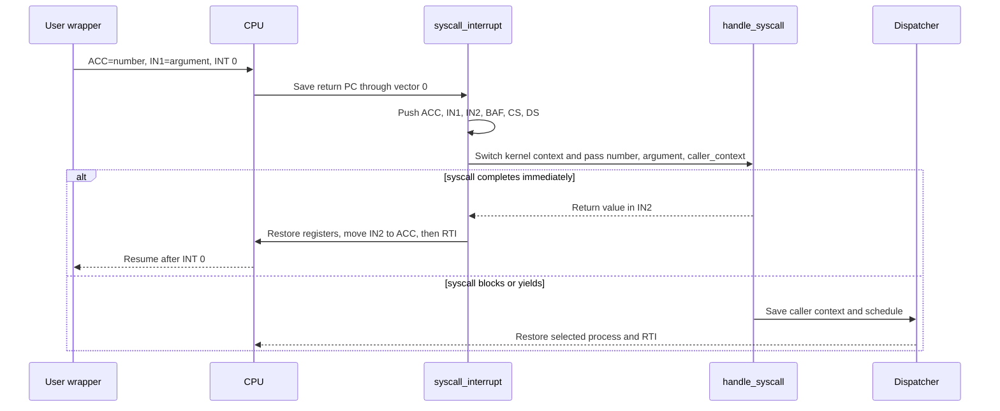

## 3.7 System call arguments and stack-frame layout

RETI stacks grow toward lower addresses. `SP` points one cell **below** the
lowest occupied cell. In a normal current PicoC call, arguments are evaluated
and pushed right-to-left, the caller pushes a continuation address, and the
**called function** pushes and later restores the previous `BAF`. The current
layout from low to high addresses is:

```text
lower addresses
    temporary expression values / deeper calls
SP→ free cell below occupied stack
    local variables                     BAF, BAF-1, ...
    saved previous BAF                  [BAF + 1]
    return address                      [BAF + 2]
    first argument                      [BAF + 3]
    second and later arguments          [BAF + 4 ...]
higher addresses
```

This is the post-change convention. Older compiler lowering placed the return
address and frame-pointer bookkeeping differently. The change put all
frame-pointer positioning into the callee, placed the saved `BAF` below the
return address, and gave each call a symbolic continuation label. Consequently:

- the prologue pushes old `BAF`, sets `BAF = SP`, then reserves locals;
- the epilogue sets `SP = BAF`, pops old `BAF`, then pops/jumps to the return;
- parameters begin at `BAF + 3`;
- variadic arguments follow fixed arguments at increasing addresses; and
- hand-written wrappers and ISRs use the same offsets.

The requested claim that the caller now saves `BAF` does **not** match the
implementation: the callee saves it. See the compiler's
[stack-frame description](../PicoC-Compiler/README.md#function-calls-and-stack-frames)
and `NewStackframe` lowering in
[`reti_blocks_pass.py`](../PicoC-Compiler/src/passes/compilation/reti_blocks_pass.py).

At interrupt entry, the CPU and vector-0 hub create this user-stack image:

```text
caller_context + 7 : return PC       (automatic INT save)
caller_context + 6 : ACC             (syscall number)
caller_context + 5 : IN1             (argument)
caller_context + 4 : IN2
caller_context + 3 : BAF
caller_context + 2 : CS
caller_context + 1 : DS
caller_context + 0 : free cell; BAF temporarily points here
```

`dispatcher_switch_from_context()` copies the six explicit saved registers
into the PCB and records `activation.sp = caller_context + 6`, leaving the
automatic return PC at `activation.sp + 1`. A normal syscall return restores
the saved registers, replaces `ACC` with the `IN2` return value, and `RTI`
consumes the return PC.


## 3.8 Timer interrupt

Periphery cell 9 is the timer instruction interval. Zero disables the timer;
writing a positive value resets the counter and requests an interrupt after
that many interpreter cycles. PicoOS writes `1000` after init is ready. Cells
3 and 6 map timer device 0 to vector 1 at priority 1.

On delivery, the emulator enters the mapped vector before executing the next
user instruction. `timer_interrupt()` pushes the six ordinary registers. If
the interrupted `CS` equals kernel `CS`, it immediately pops them and `RTI`s.
Otherwise it disables stack protection, changes to the kernel stack, passes
the user frame to the dispatcher, and never returns along that ISR call path:
the dispatcher eventually `RTI`s into the selected process.

The decisive kernel/user branch is visible in the naked ISR:

```c
asm(KERNEL_CS_ACC_ASM); // ACC = kernel code-segment start
asm("SUB ACC CS");
asm("JUMP!= 14");       // Different CS enters the scheduler path
asm("POP DS");
asm("POP CS");
asm("POP BAF");
asm("POP IN2");
asm("POP IN1");
asm("POP ACC");
asm("RTI");
```

Timer preemption therefore applies to user processes. Kernel scheduling work
is not preempted into another process, which is why PicoOS remains a
non-preemptive kernel. PicoOS does not write a separate acknowledgement:
the emulator resets the interval counter when it raises the interrupt,
temporarily deactivates that timer line while its ISR is active, and reactivates
it when `RTI` completes the hardware interrupt.

## 3.9 UART and keypress interrupt

UART device 2 maps through periphery cell 5 to vector 2 at priority 2. A host
keypress makes the emulator put its low byte in receive register 1, set status
bit 1, and raise the UART line. Further bytes remain buffered while a UART
interrupt is pending.

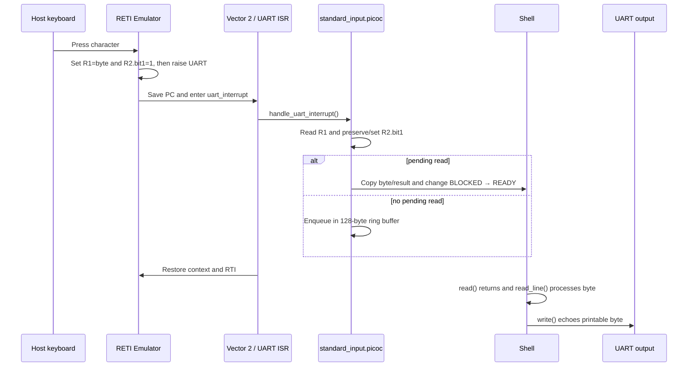

`read(STDIN_FILENO, ...)` first disables the UART mapping briefly, preventing
a lost wakeup between checking the buffer and enqueueing the reader. If no
byte is available, it records the destination/count in the descriptor table,
places the process on `stdin_waiters`, restores UART mapping, and dispatches.
The ISR writes the result into the saved `activation.acc` before waking it.

The hardware-facing portion of the real handler is:

```c
value = periphery_read_register(UART_RECEIVE_REGISTER) & 255;
status = periphery_read_register(UART_STATUS_REGISTER);
periphery_write_register(
    UART_STATUS_REGISTER,
    status | UART_RECEIVE_READY
);

// Terminal-signal handling omitted
enqueue_stdin_byte(table, value);
complete_pending_stdin_read(process, table);
```

The shell treats `\n` and `\r` as line completion, echoes one `\n`, and handles
backspace (`\b`) or delete (`127`) by outputting backspace-space-backspace.
Printable input is appended and echoed. Escape followed by `c`/`C` or `z`/`Z`
is intercepted by the kernel as `SIGTERM` or `SIGTSTP` for the foreground
process rather than passed to the shell.

# 4. Processes

## 4.1 Process table

Despite the conventional name, PicoOS does **not** use a fixed array. Its
"process table" is a kernel-heap-allocated singly linked list with head and
tail pointers. PIDs begin at 1 and increase monotonically, except that the
fast-test reset deliberately restores the next PID to 3 while init (1) and
the shell (2) remain.

`create_process()` allocates a PCB, path copy, and descriptor table with
`kmalloc()` and appends it. `remove_process()` unlinks wait-queue and global
list links, releases shared-memory attachments, frees the complete process
region with `pfree()`, destroys descriptors, and frees the path and PCB.

The kernel has no entry because it does not use a user code/data region,
parent, descriptors, or schedulable user state. Low-level kernel addresses
come from `memory_constants.header`.

## 4.2 Process structure

The authoritative structure is
[`kernel/process.header`](kernel/process.header). Important fields are:

| Field | Meaning |
| --- | --- |
| `pid`, `parent_pid` | Unique process ID and loader/parent PID (`0` means orphan) |
| `state` | `NEW`, `READY`, `RUNNING`, `BLOCKED`, `STOPPED`, or `ZOMBIE` |
| `base_address`, `size` | Absolute start and cell count of the complete SRAM region |
| `heap_start`, `heap_size` | Process-relative heap offset and fixed 1000-cell user heap |
| `word_count`, `binary_path` | Load metadata and kernel-owned source path copy |
| `activation` | Saved `IN1`, `IN2`, `ACC`, `SP`, `BAF`, `CS`, and `DS` |
| `file_descriptors` | Per-process eight-entry descriptor table and stdin state |
| `waiting_status_ptr` | Pointer into this process's suspended `waitpid()` frame |
| `waiters` | Queue of processes waiting for this process |
| `waiting_queue_ptr`, `wait_next` | Intrusive membership in one wait queue |
| `next` | Global process-list link |
| `shared_memory_attachments` | Per-process attachment records for exit cleanup |
| `parent_death_signal` | Inherited `PR_SET_PDEATHSIG` setting |
| `exit_status` | Status retained while the process is a zombie |
| `stopped_from_state` | State restored by `SIGCONT` |
| `pending_signals` | Bit mask of deferred/handler-delivered signals |
| `signal_handlers[]`, `signal_restorer` | Per-signal action and userspace restorer |
| `handling_signal`, `signal_saved_activation` | One saved context during a handler |

There is no separate PCB field for the program counter: the interrupt return
PC remains at `activation.sp + 1` on the process stack. There is also no PCB
environment table. `argv`/`envp` begin on the initial process stack, after
which `libstdlib` clones environment strings onto the process heap.

## 4.3 Activation records and stack frames

An activation record is the saved machine context in the PCB. A function stack
frame is the live per-call area containing locals, saved `BAF`, return address,
and arguments. Interrupts connect the two: they leave the resumption PC on the
user stack and PicoOS copies the remaining registers into `activation`.

Temporary expression values and nested calls extend the stack downward.
Function results travel in `IN2`; a normal call continuation pushes that result
when the expression needs it. System-call wrappers instead receive the kernel
result in `ACC`, matching the explicit interrupt-return stub.

## 4.4 Process states

There is no `TERMINATED` constant. `ZOMBIE` retains status for a living parent;
full termination means removal from the list.

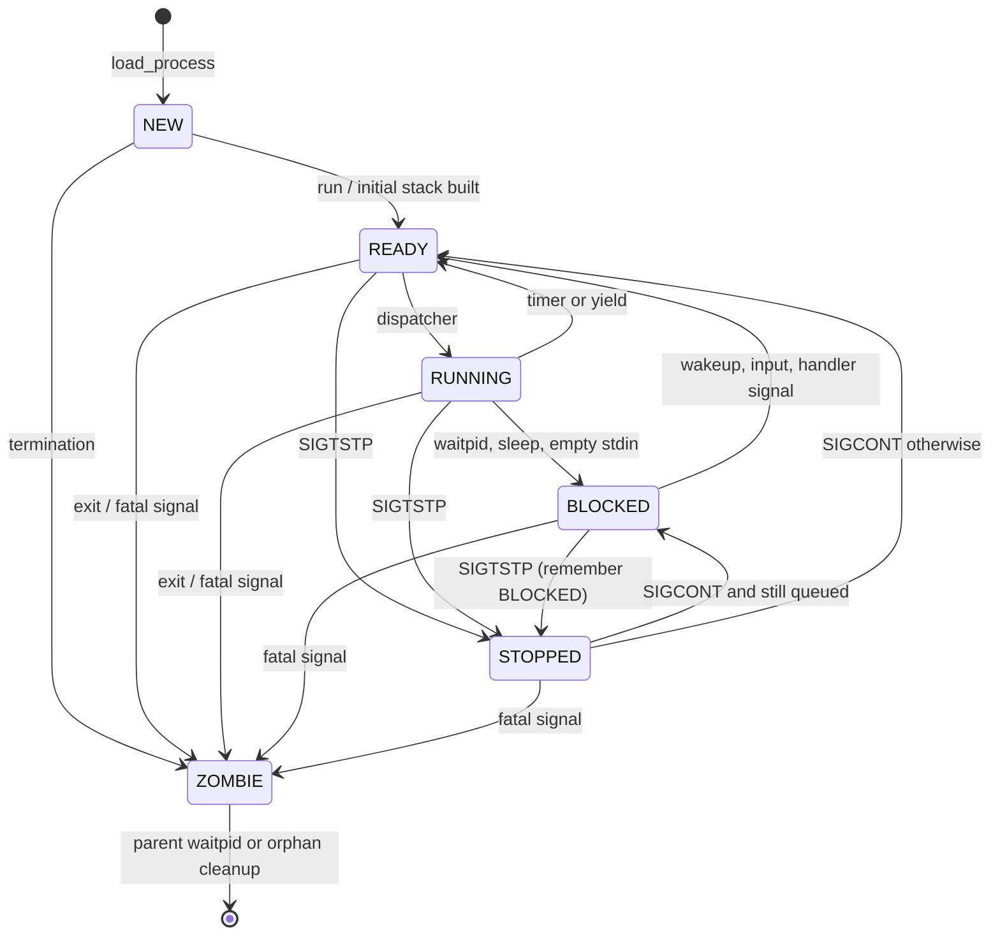

## 4.5 Loading processes

The kernel does not search `PATH`; its caller supplies a concrete `.bin` path.
The shell performs `PATH` lookup before calling `load()`.

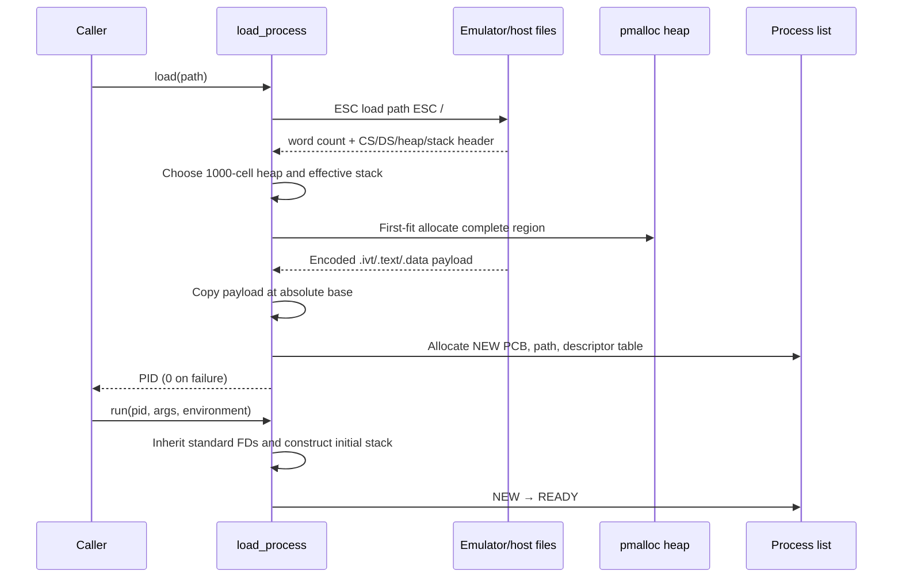

If binary `stack_start == -1`, PicoOS chooses
`heap_start + 1000 heap cells + 1000 stack cells`. An explicit stack start must
not be below `heap_start + heap_size`. The allocated process size is
`effective_stack_start + 1`. Loading and running are separate operations, so a
successfully loaded process remains `NEW` until `run()`.

## 4.6 Program arguments and environment

[`store_process_arguments()`](kernel/process/process_arguments.picoc) creates this
ascending-address layout near the top of the allocated process region:

```text
lower addresses
activation.sp ──► free cell
                  entry PC (_start - 1)
                  argc
                  argv[0] pointer ─────────┐
                  argv[1] pointer ───────┐ │
                  ...                    │ │
                  NULL                   │ │
                  envp[0] pointer ─────┐ │ │
                  ...                  │ │ │
                  NULL                 │ │ │
                  "./user/program.bin\0" ◄─┘
                  argument strings\0   ◄─┘
                  environment NAME=value strings\0
higher addresses
```

Entries are absolute pointers, not offsets. `argv[0]` is always the binary
path. The additional argument string is split only on spaces and tabs; quoting
is a shell concern. Environment strings are copied after argument strings.

The construction code makes the order and final register positions explicit:

```c
entry_pc_cell = (int *)(process->base_address + argument_base_offset);
argc_cell = entry_pc_cell + 1;
argv = (char **)(argc_cell + 1);
envp = argv + argc + 1;
string_target = (char *)(envp + environment_count + 1);

*entry_pc_cell = process->activation.cs - 1;
*argc_cell = argc;
argv[argc] = NULL;
envp[environment_count] = NULL;
// ... copy argv[0], argument strings, and environment strings
process->activation.baf = (int)argc_cell - 3;
process->activation.sp = (int)entry_pc_cell - 1;
```

The initial `BAF` is set two cells below the entry PC, making
`BAF + 3 == argc` and `BAF + 4 == argv[0]`. Naked userspace `_start` receives
those locations under the normal parameter convention and calls:

```c
void start_process(int argc, char **argv) {
    init_process_heap();
    initialize_environment(argv + argc + 1);
    exit(main(argc, argv));
}
```

Thus `envp` begins immediately after `argv[argc] == NULL`, and `main()` receives
standard `argc`/`argv`. `main()` has no direct third `envp` parameter in the
current startup API; library environment functions use the cloned global
`environ`.

## 4.7 Initial process stack

Three layouts must not be confused:

1. The **initial stack** is synthesized by the kernel and includes the `RTI`
   entry PC followed by `argc`, pointer tables, and strings.
2. A **normal function frame** is synthesized by compiler-generated code and
   includes locals, saved `BAF`, continuation address, and arguments.
3. An **interrupt/context-switch frame** begins with the CPU-saved PC and six
   registers pushed by the ISR. Most of that frame is copied into the PCB
   before another process runs.

After the first `RTI`, `_start` uses the initial `BAF` as if the kernel had
created its outer caller frame. Subsequent calls use the ordinary convention.

## 4.8 Environment variables

Environment entries are heap-owned `NAME=value` strings in a null-terminated
`char **environ`. `initialize_environment()` clones the initial stack entries.
`getenv()` returns the value portion; `setenv()`, `unsetenv()`, `putenv()`, and
`clearenv()` update the process-local copy. `clone_environment()` is used by
the shell test reset machinery.

`run(pid, arguments, NULL)` passes the caller's `environ`; the kernel copies
the strings onto the child's initial stack, so changes are inherited at start
but are not shared afterward. A caller may instead supply its own
null-terminated environment array.

Init reads [`opts/environment.txt`](opts/environment.txt), currently:

```text
PATH=./user
```

It uses `setenv()`, then starts the shell with inherited environment. The shell
uses `PATH` to locate later programs; those programs inherit the shell's
current copy. If `loading_bar_enabled` in
[`opts/config.header`](opts/config.header) is true, init also sets
`PICOOS_LOADING_BAR=true`, allowing one setting to control loader progress in
all descendants.

# 5. Process blocking, waiting, synchronization, and signals

## 5.1 Wait queues

A wait queue is a two-pointer FIFO:

```c
struct wait_queue {
    struct Process *head;
    struct Process *tail;
};
```

It is intrusive: the queued PCB holds `waiting_queue_ptr` and one `wait_next`
link. A process can therefore wait on only one queue at a time. Queue owners
include each process (`waiters`), each descriptor table (`stdin_waiters`), and
each userspace mutex (`waiters`).

```text
queue.head                                      queue.tail
    │                                               │
    ▼                                               ▼
┌───────────┐ wait_next  ┌───────────┐ wait_next  ┌───────────┐
│ Process A │───────────►│ Process B │───────────►│ Process C │──► NULL
│ waiting_  │            │ waiting_  │            │ waiting_  │
│ queue_ptr │────────────┴────────────┴───────────► same queue
└───────────┘
```

`enqueue_current_process_on_wait_queue()` appends the current PCB and changes
it to `BLOCKED`. `wakeup_wait_queue()` removes **one** process from the head
and makes it `READY` (or records `READY` as the resume state if it is stopped).
`remove_from_wait_queue()` scans and unlinks a process during signal wakeup or
destruction. Removing a PCB always calls it first, preventing stale pointers
from surviving in a queue.

Wait queues are kernel-visible absolute memory structures even when a mutex
placed them in shared process memory. This works because PicoOS has one
physical address space and no virtual-memory protection.

## 5.2 `waitpid()` and the preserved waiting-process explanation

The current public API has only `waitpid(pid)`, which waits for one exact child.
There is no general `wait()` wrapper and no `waitpid` options argument. The
following existing project diagram is preserved and corrected to include
zombie handling:

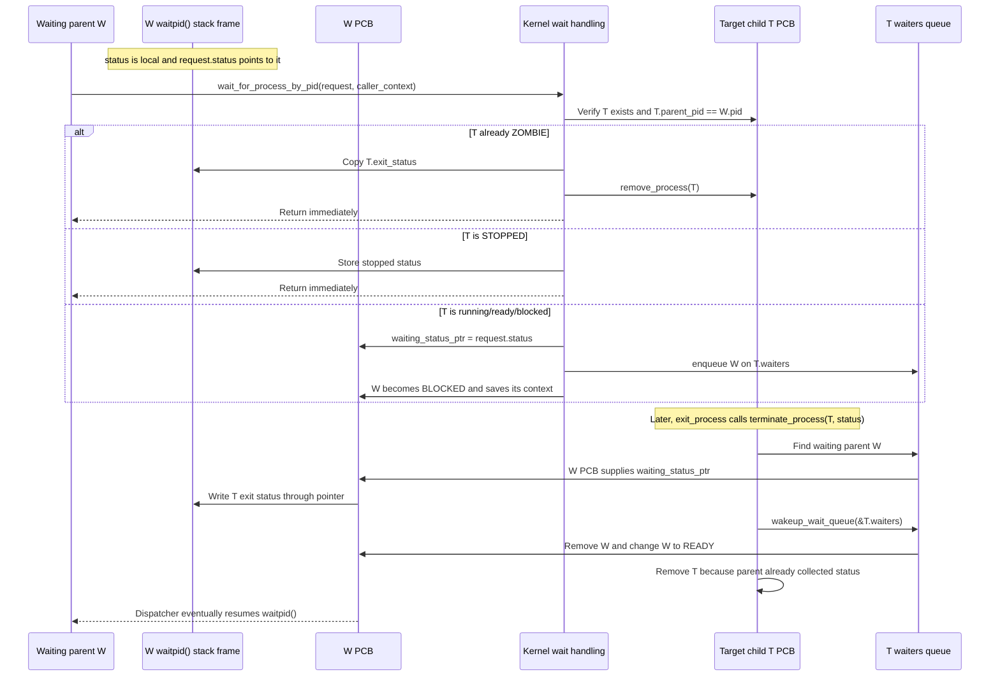

`status` and `request` belong to W's suspended `waitpid()` stack frame.
`waiting_status_ptr` belongs to W's PCB and points to W's `status` variable.
The waited-on child T owns `T->waiters`; the same queue is used when W sleeps
and when T exits.

If a child exits before its parent waits, it becomes `ZOMBIE` and retains
`exit_status`. A later `waitpid()` copies that value and frees the child.
If the parent is already queued, termination writes through its saved pointer,
wakes it, and removes the child immediately. Invalid PIDs and non-children
produce status `-1`.

This exact-child behavior is important to init. Other children or `SIGCHLD`
must not make init's `waitpid(shell_pid)` return as though its shell exited.

## 5.3 `sleep()`

PicoOS `sleep()` does **not** accept a duration and does not register a timer
deadline. It means "block the current process on this wait queue":

```c
void sleep(struct wait_queue *wq) {
    if (wq == NULL) {
        return;
    }
    asm("LOADIN BAF IN1 3");
    asm("LOADI ACC 11"); // SYSCALL_SLEEP
    asm("INT 0");
}
```

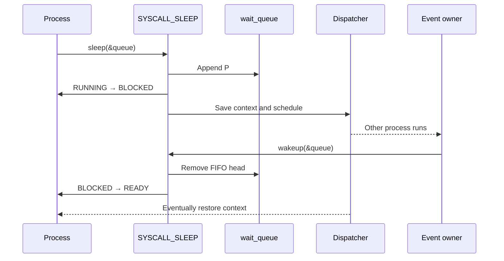

Timer interrupts may let another process run while the caller sleeps, but they
do not expire the sleep. A timed `sleep(seconds)` facility, deadline list, and
timer-driven timeout transition are not implemented.

## 5.4 `wakeup()`

`wakeup(queue)` invokes syscall 12. The kernel removes at most one head waiter,
clears its queue links, and makes it ready. It returns whether a waiter existed.
The woken process does not run immediately; normal scheduling selects it later.

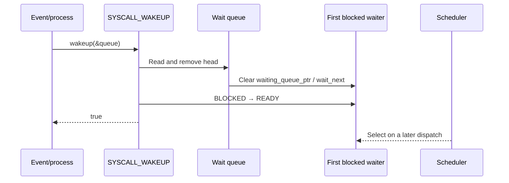

## 5.5 Blocked-to-ready transitions

Implemented causes are:

- the waited-for child exits;
- the waited-for child is stopped by `SIGTSTP`;
- an explicit `wakeup()` (including mutex unlock) removes the FIFO head;
- a UART byte completes a pending stdin read;
- a caught signal is queued for a blocked process, which is removed from its
  wait queue and receives syscall result 0; and
- `SIGCONT` restores a stopped process to `READY` unless it was blocked and is
  still linked to its original queue, in which case it returns to `BLOCKED`.

There is no sleep timeout. Default fatal signals terminate rather than ready a
blocked process. `SIGTSTP` stops it while preserving its queue membership.

## 5.6 Signals

PicoOS uses five familiar Unix numbers but implements a deliberately small,
PicoOS-specific model:

| Signal | Default action | Notes |
| --- | --- | --- |
| `SIGKILL` (9) | terminate with status `128 + 9` | Cannot be caught or ignored |
| `SIGTERM` (15) | terminate with status `128 + 15` | May be caught or ignored |
| `SIGCHLD` (17) | ignore | Sent to the parent when a child terminates; may have a handler |
| `SIGCONT` (18) | continue | Restores a stopped process; default otherwise ignores |
| `SIGTSTP` (20) | stop | Parent waiters receive stopped status `128 + 20` |

`signal()` installs one handler plus the library's naked
`signal_restorer()`. `kill(pid, 0)` checks existence without delivery.
Pending signals are bits in the PCB. Before dispatch, the kernel either
performs a default action or builds a small user stack frame containing the
handler entry, restorer address, and signal number. Only one handler context is
saved at a time. Returning through the restorer invokes `SIGRETURN` and
restores `signal_saved_activation`.

Terminal escape sequences `ESC c` and `ESC z` become `SIGTERM` and `SIGTSTP`
for the PID registered by the shell as foreground. The shell implements basic
background execution plus `fg` and `bg`; this is much smaller than POSIX job
control.

### Parent-death signal

[`lib/sys/prctl`](lib/sys/prctl/prctl.picoc) supports exactly:

```c
prctl(PR_SET_PDEATHSIG, 0);
prctl(PR_SET_PDEATHSIG, SIGTERM);
```

The first disables the feature; the second records `SIGTERM` in the current
PCB's `parent_death_signal`. Any valid implemented signal may be selected.
`create_process()` copies the parent's setting into the child. When a parent
terminates, `orphan_and_signal_children()` sets each child's `parent_pid` to
zero, removes already-zombie children, and delivers the configured signal if
nonzero. With zero, the child simply becomes an orphan and continues.

The shell calls `prctl(PR_SET_PDEATHSIG, SIGTERM)` on **itself** during startup.
Because the field is inherited, every process later loaded by that shell gets
the setting. Those children terminate if the shell terminates. This is explicit
shell policy, not PicoOS's default for all children; init and the initial shell
begin with zero.

# 6. Scheduler

## 6.1 Relationship to process states

The scheduler considers only `READY` processes plus the current `RUNNING`
process when a complete wrap finds no alternative. `NEW` has no initial
execution frame, `BLOCKED` lacks a satisfied event, `STOPPED` is suspended, and
`ZOMBIE` exists only for status collection.

## 6.2 Ready processes

There is no separate ready queue. `scheduler_next_process()` scans the global
linked process list. Making a process ready means changing its state; it
automatically participates in the next scan. Other states are skipped.

This is simple and educational but makes selection O(number of PCBs). That is
reasonable for this small system and exposes state transitions without another
queue abstraction.

## 6.3 Scheduling algorithm

Scheduling is round-robin by process-list order:

1. begin at `current->next`, or the list head if there is no current process or
   current is the tail;
2. scan to the tail for a runnable process;
3. wrap to the head and stop before the original start; and
4. return `NULL` if every PCB is non-runnable.

If only the current process can run, the wrapped scan may return it. If none
can run but blocked/stopped processes remain, the dispatcher waits in kernel
context so a UART or other hardware interrupt can change state. If the list is
empty, there is no user process to dispatch and shutdown follows.

## 6.4 Timer-based preemption

On a user timer interrupt, the ISR explicitly pushes the general context and
the CPU has already saved the resumption PC. The dispatcher copies register
values into the current PCB, changes `RUNNING` to `READY`, asks the scheduler
for the next candidate, installs any pending signal action, and restores that
candidate. `RTI` consumes its saved PC.

The timer ISR detects kernel execution by comparing `CS` to generated kernel
`CS`. It restores and returns without calling the scheduler in that case.
This is the precise distinction between preemptive user scheduling and a
non-preemptive kernel.

## 6.5 `yield()`

[`yield()`](lib/schedule/schedule.picoc) is syscall 13 through software
`INT 0`. Unlike a timer interrupt it is voluntary and deterministic, but both
paths call `dispatcher_switch_from_context()`. The running caller becomes
`READY`, so another ready process can be chosen; if none exists, the caller
can be selected again.

`yield()` is useful in teaching round-robin order and in cooperative loops.
It is not required for timer-preempted fairness, and it does not block on an
event.

# 7. Dispatcher

## 7.1 Context switching

Context is divided between two locations:

- the CPU automatically puts the interrupt return PC at `SP + 1`;
- PicoOS pushes `ACC`, `IN1`, `IN2`, `BAF`, `CS`, and `DS`, then copies them
  into `Process.activation`.

`SP` is saved as the position immediately below the return-PC cell. `BAF`
continues to identify the interrupted function frame. `CS` and `DS` select the
process's code and data bases. No separate `PC` PCB field is needed.

`INT` creates the automatic return cell and jumps through the vector table.
`RTI` restores that PC and advances it, which is why new-process and exception
return addresses use the `address - 1` convention where appropriate.

## 7.2 Saving the current process

Timer interrupts, blocking syscalls, and `yield()` eventually pass the common
saved-frame pointer to:

```c
void dispatcher_switch_from_context(int *caller_context) {
    struct Process *process = current_process();

    if (process != NULL) {
        process->activation.sp = (int)(caller_context + 6);
        process->activation.ds = caller_context[1];
        process->activation.cs = caller_context[2];
        process->activation.baf = caller_context[3];
        process->activation.in2 = caller_context[4];
        process->activation.in1 = caller_context[5];
        process->activation.acc = caller_context[6];

        if (process->state == PROCESS_STATE_RUNNING) {
            process->state = PROCESS_STATE_READY;
        }
    }
    dispatcher_start_next_process();
}
```

The PC at `caller_context[7]` remains in process memory. Because it points to
the interrupted instruction under the emulator's interrupt convention, the
later `RTI` resumes at the correct following instruction.

## 7.3 Restoring the selected process

`dispatcher_switch_to_process()` readies an old running process if necessary,
sets the selected PCB as current, marks it `RUNNING`, and calls the naked
restore hub. Its essential operations are:

```c
__attribute__((naked))
void dispatcher_jump_to_process(struct Process *process, int stack_boundary) {
    asm("LOADIN SP BAF 2");
    asm("LOADIN SP IN1 3");
    // Build periphery base and write stack_boundary to cell 10
    // ...
    asm("LOADIN BAF SP 11");
    asm("LOADIN BAF CS 13");
    asm("LOADIN BAF DS 14");
    asm("LOADIN BAF IN1 8");
    asm("LOADIN BAF IN2 9");
    asm("LOADIN BAF ACC 10");
    asm("LOADIN BAF BAF 12");
    asm("RTI");
}
```

The fixed offsets depend on `activation` remaining immediately after the first
five integer PCB fields; the comment in `Process` protects that layout. The
hub first obtains the PCB and boundary arguments from its kernel call frame,
writes the process boundary, then restores `SP`, segments, ordinary registers,
and finally `BAF`. `RTI` performs the actual control transfer.

## 7.4 Transferring control between processes

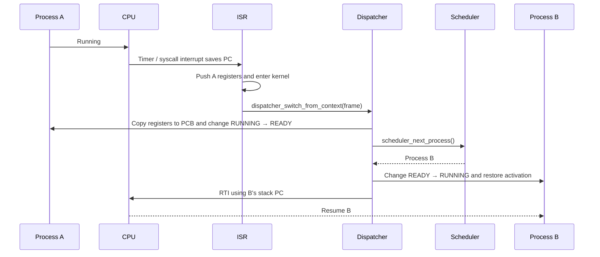

# 8. Memory management

## 8.1 Process and kernel memory layouts

The top two address bits select EPROM (`00`), periphery (`01`), or SRAM
(`10`/`11`). Within SRAM, the current kernel layout is:

```text
SRAM offset
0       4                         32406 32827      36923       40000 40001
┌───────┬─────────────────────────┬─────┬──────────┬───────────┬─────┬─────────┐
│ .ivt  │ kernel .text            │data │ kheap    │stack room │ SP  │ process │
│4 cells│                         │     │4096 cells│  (free)   │ ↓   │ heap    │
└───────┴─────────────────────────┴─────┴──────────┴───────────┴─────┴─────────┘
                                                                         to 2^18-1
```

The kernel stack grows downward from offset 40000. Its boundary is the final
reserved kernel-heap cell, so stack room is the gap above that boundary.
Complete process/shared-memory regions are first-fit blocks in the area from
40001 to the end of SRAM.

Each process region is:

```text
base + 0                                                       base + stack_start
┌────────────────┬─────────────┬────────────────┬──────────────┬───────────────┐
│ .text          │ .data       │ malloc heap    │ free gap     │ stack         │
│ CS points here │ DS points   │ grows upward → │              │ grows down ←  │
└────────────────┴─────────────┴────────────────┴──────────────┴───────────────┘
0                data_start    heap_start       heap+1000      initial args
                                                 ↑ inclusive boundary is one cell before
```

The heap allocator uses linked headers and can consume its fixed region upward.
The stack-overflow check prevents `SP` from moving below
`heap_start + heap_size - 1`. There is no MMU, relocation after load, or
per-process access protection.

## 8.2 Heap implementation

[`common/heap.picoc`](common/heap.picoc) implements the shared allocator:

```c
struct BlockHeader {
    int size;
    bool free;
    struct BlockHeader *next;
};

struct Heap {
    struct BlockHeader *first_block;
};
```

All sizes are RETI memory **cells**, and `sizeof` in PicoC is correspondingly
cell-based. There is no additional byte alignment step.

`heap_alloc_from()` scans from `first_block` and takes the first free block
large enough: this is **first-fit**. If the remainder can hold a three-cell
header plus at least one payload cell, it splits the block. Otherwise the
caller receives the whole block. Invalid/nonpositive sizes and exhaustion
return `NULL`.

The split is pointer arithmetic over RETI cells:

```c
if (block->size >= size + sizeof(struct BlockHeader) + 1) {
    new_block = (struct BlockHeader *)((int *)(block + 1) + size);
    new_block->size =
        block->size - size - sizeof(struct BlockHeader);
    new_block->free = true;
    new_block->next = block->next;
    block->size = size;
    block->next = new_block;
}
```

```text
before allocation of 4 cells
┌──────────── header ────────────┬──────── 12 free payload cells ────────┐
│ size=12, free=true, next=NULL  │                                      │
└────────────────────────────────┴──────────────────────────────────────┘

after
┌── header ──┬─ 4 allocated ─┬── header ──┬─ 5 free cells ─┐
│size=4 false│                │size=5 true │                │
└────────────┴────────────────┴────────────┴────────────────┘
```

Three interfaces select different `Heap` instances:

| Interface | Region managed | Typical callers |
| --- | --- | --- |
| `kmalloc()` / `krealloc()` / `kfree()` | Fixed 4096-cell kernel heap beginning at generated `KERNEL_HEAP_START` | PCBs, paths, descriptors, shared-memory metadata |
| `pmalloc()` / `prealloc()` / `pfree()` | All SRAM after `PROCESS_MEMORY_START` | Kernel process loader and shared-memory backing blocks |
| `malloc()` / `realloc()` / `free()` | Current process's fixed 1000-cell heap beginning at binary `heap_start` | Userspace libraries and applications |

Thus both complete process-region allocation and internal `malloc()` allocation
are first-fit, but they are distinct heap instances at different levels.

## 8.3 `free()` and block merging

`heap_free_from()` treats `NULL` as a no-op, obtains the preceding header,
marks it free, and scans the entire list. Whenever `current` and
`current->next` are both free, it absorbs the next header and payload. The
loop stays on the merged block, so a run of any length coalesces in both
directions relative to the newly freed block.

```text
before free(B)
┌ H:A free ┬ payload ┬ H:B used ┬ payload ┬ H:C free ┬ payload ┐
└──────────┴─────────┴──────────┴─────────┴──────────┴─────────┘

after free(B) and full scan
┌──────────── H:A free; size includes A + old headers + B + C ────────────┐
└─────────────────────────────────────────────────────────────────────────┘
```

This reduces external fragmentation. Safety checks are intentionally minimal:
`NULL` and a null heap are handled, but invalid, double-freed, or foreign
pointers are not detected.

`realloc()` shrinks/splits in place, grows into a sufficiently large following
free block, or allocates/copies/frees. `realloc(NULL, n)` is `malloc(n)` and
`realloc(p, 0)` frees and returns `NULL`.

## 8.4 Process memory allocation

`init_process_memory_heap()` creates one heap covering every cell from
`PROCESS_MEMORY_START` through `SRAM_MAX_ADDRESS_IN_MEMORY_MAP`.
`load_process()` asks `pmalloc()` for the complete code/data/heap/gap/stack
region. First-fit makes a newly loaded process reuse the earliest adequate hole
left by unloaded processes. `pfree()` coalesces adjacent regions through the
same general heap code.

Shared-memory backing also comes from this allocator, so shared regions and
complete processes compete for the same post-kernel SRAM pool. This is separate
from the per-process `malloc()` heap inside each allocated process region.

## 8.5 Shared memory

The existing shared-memory API is preserved:

```c
int shm_open(const char *name, size_t size);
void *mmap(int shm_id);
int shm_unlink(const char *name);
```

This is not POSIX virtual-memory mapping. `shm_open()` returns an integer ID,
and `mmap()` simply returns the absolute address of an already allocated SRAM
block.

Kernel entries are dynamically allocated with `kmalloc()` in a linked list.
Each stores its name, ID, `pmalloc()` backing address, cell size, reference
count, unlink flag, and next link.

- `shm_open(name, size)` returns an existing named ID regardless of the newly
  supplied size, or creates a new metadata/backing pair. It returns `-1` on
  invalid input or allocation failure.
- `mmap(id)` adds a kernel-heap attachment record to the current PCB,
  increments the reference count, and returns the shared address. There is no
  `munmap()`; repeated calls create repeated attachments.
- `shm_unlink(name)` frees the name immediately so future opens cannot find
  it, sets `unlink_requested`, and destroys it immediately only if the
  reference count is zero.
- Process removal walks its attachments, decrements references, and destroys
  an unlinked entry after the last reference. The backing block is returned
  with `pfree()` and metadata with `kfree()`.

There is no privileged owner after creation and no access-control model.
Processes that know the ID can map the region. Concurrent reads/writes require
a mutex or another protocol; the shared-memory allocator supplies lifetime,
not mutual exclusion.

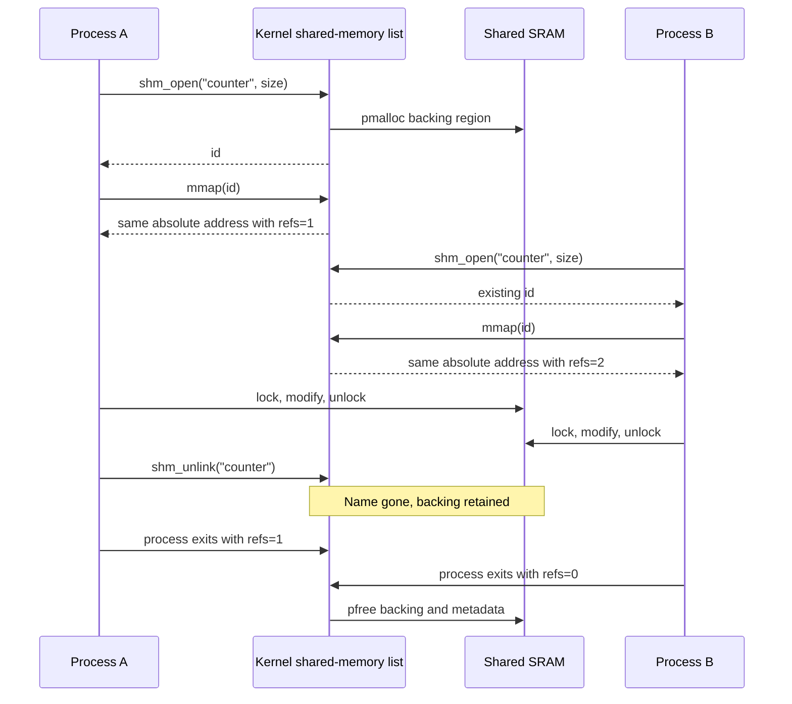

# 9. Libraries

## 9.1 Implemented libraries

Public headers and principal facilities are:

| Directory/header | Purpose |
| --- | --- |
| [`lib/unistd`](lib/unistd/unistd.header) | `read`, `write`, `close`, `dup2`, `lseek`, process load/run/unload/list, PID, reset, foreground PID, wait queues |
| [`lib/fcntl`](lib/fcntl/fcntl.header) | `open`, `creat`, access/create/truncate/append flags |
| [`lib/sys/wait`](lib/sys/wait/wait.header) | exact-child `waitpid`, `WIFSTOPPED` |
| [`lib/schedule`](lib/schedule/schedule.header) | voluntary `yield` |
| [`lib/mutex`](lib/mutex/mutex.header) | `testset`, init, lock, unlock |
| [`lib/signal`](lib/signal/signal.header) | `signal`, `kill`, default/ignore constants |
| [`lib/sys/prctl`](lib/sys/prctl/prctl.header) | `PR_SET_PDEATHSIG` |
| [`lib/sys/mman`](lib/sys/mman/mman.header) | named shared-memory open/map/unlink |
| [`lib/stdlib`](lib/stdlib/stdlib.header) | heap allocation, `atoi`, environment APIs, `exit` |
| [`lib/string`](lib/string/string.header) | `memcpy`, `memset`, copy/concatenate/compare/length |
| [`lib/stdio`](lib/stdio/stdio.header) | streams, file open/close, character/string/formatted output, formatted input |
| [`lib/start`](lib/start/start.picoc) | process `_start`, heap/environment initialization, `main`, exit |

Common ABI structures and constants live under [`common`](common), while
kernel-private interfaces live under [`kernel`](kernel). The `.header`
extension is PicoC's header convention, not a promise of full standard-header
compatibility.

## 9.2 Library organization

An umbrella source such as `lib/stdio/libstdio.picoc` includes implementation
parts such as `stdio.picoc` and `scanf.picoc`. The Makefile passes umbrella
sources to `picoc_compiler`, plus `-C lib/start/libstart.picoc` for process
startup. Headers expose the source-level API.

Low-level wrappers package multiple arguments into a stack-local request
structure, put its pointer in `IN1`, put the syscall number in `ACC`, and issue
`INT 0`. Pure userspace routines such as string functions, `atoi`, environment
management, formatting, and heap block management do not require the kernel
except when they ultimately perform I/O or process operations.

## 9.3 Design tradeoffs

The libraries favor readable mechanisms over completeness:

- fixed descriptor and `FILE` capacities replace dynamically extensible tables;
- simple one-cell C values and no byte alignment simplify heaps and ABI;
- wrappers reuse a single syscall argument pointer instead of a large register
  calling convention;
- stream objects contain only a descriptor, not buffering/error/EOF state;
- `printf` supports `%d`, `%c`, `%s`, and `%%`, not full formatting;
- `scanf` is similarly small;
- allocation omits invalid-pointer hardening; and
- names resemble POSIX/C where educationally useful but semantics may differ.

## 9.4 Standard I/O

`stdio` implements `fopen()`, `fclose()`, `fputc()`, `fputs()`, `fprintf()`,
`printf()`, and `scanf()`. There is no `fwrite()` in the current repository.
Five nonstandard `FILE` slots are available in addition to the three standard
stream objects.

`fputc()` and `fputs()` create `IoRequest` structures and invoke `write()`
semantics through `SYSCALL_WRITE`. `fprintf()` and `printf()` parse supported
format conversions and reduce them to `fputc()`/`fputs()`. In standalone
library tests where the kernel descriptor syscall is unavailable, stdout can
fall back to the direct UART send syscall.

## 9.5 Variadic functions and the stack-frame layout

Right-to-left argument evaluation and pushing make fixed and extra arguments
contiguous at increasing addresses from `BAF + 3`. PicoOS does not implement
standard `va_list` macros; its variadic functions read cells relative to
`BAF`.

`printf(format, ...)` saves its current `BAF` value as `argument_base`, then
reads the first extra argument at `argument_base + 4`; `fprintf(stream,
format, ...)` begins extras at `+5`. `scanf` follows the same principle.
This depends directly on saved old `BAF` at `+1`, return address at `+2`, and
fixed parameters from `+3`.

## 9.6 `libstart`

[`lib/start/libstart.picoc`](lib/start/libstart.picoc) is the umbrella startup
translation unit. It includes the standard-library implementation and
[`start.picoc`](lib/start/start.picoc). The compiler's `-C` option makes its
custom `_start` replace the generated default and places it first in `.text`.

## 9.7 Start function

The naked `_start(int argc, char *first_argument)` avoids creating another
frame before it has interpreted the kernel-built outer frame. It passes
`argc` and `&first_argument` (the address of `argv[0]`) to `start_process()`.
That function:

1. initializes the local `malloc()` heap using kernel-reported start/size;
2. clones the `envp` table found at `argv + argc + 1`;
3. calls `main(argc, argv)`; and
4. passes `main`'s return value to `exit()`, syscall 9.

The exit path marks the process zombie or removes it, wakes an exact waiting
parent, sends `SIGCHLD`, cleans children as appropriate, and dispatches another
process.

# 10. Filesystem

PicoOS's "filesystem" is a kernel descriptor layer over files in the emulator
host's working directory. Data reads use UART
`read-range <offset> <count> <path>` control frames, metadata queries use
`file-size <path>`, and writes use `write` or `append`. It is not an on-SRAM
filesystem.

## 10.1 File-descriptor table

Each PCB owns a dynamically allocated `FileDescriptorTable` with exactly eight
entries (`0..7`), a 128-cell stdin ring buffer, pending-read fields, and a
stdin wait queue. Each descriptor contains kind, flags, current offset, and a
kernel-owned path copy.

New PCBs initially receive standard descriptor kinds. When `run()` starts a
child, the kernel replaces that table with a copy of only descriptors `0`, `1`,
and `2` from the parent. Descriptors `3..7` are not inherited. This is copying,
not a shared open-file-description/refcount model: path and offset are
duplicated values.

Process removal frees all path copies and the table. `close()` intentionally
refuses descriptors below 3, although `dup2()` may replace standard entries.

## 10.2 File descriptors

| Number | Conventional macro | Initial kind |
| ---: | --- | --- |
| 0 | `STDIN_FILENO` | UART-backed standard input |
| 1 | `STDOUT_FILENO` | UART terminal output |
| 2 | `STDERR_FILENO` | UART output temporarily routed to host stderr |
| 3–7 | none | First-free slots for regular files or descriptor copies |

## 10.3 File operations

Implemented calls are `open()`, `creat()`, `close()`, `read()`, `write()`,
`lseek()`, and `dup2()`.

- `open` validates access mode and allocates the first free entry from 3.
  A `file-size` request checks existence without transferring file contents.
  `O_TRUNC` sends an empty host `write` frame; `O_CREAT` creates a missing host
  file. `creat(path, mode)` ignores `mode` and uses write/create/truncate.
- `read` from stdin may block as described earlier. Reading a regular file
  requests at most `count` bytes at the descriptor offset and advances the
  offset by the returned byte count.
- `write` sends stdout directly, temporarily selects stderr for descriptor 2,
  or selects `append <path>` for a regular file, then restores stdout.
- `lseek` changes only the descriptor's logical read offset. `SEEK_END` uses
  `file-size` to obtain the host file size.
- `close` frees the path and entry for descriptors 3–7.

A deliberate limitation is that regular-file writes always append after open.
`O_TRUNC` makes `>` work by emptying the file first; there is no positioned
overwrite despite `lseek`, and `O_APPEND` mainly communicates opening intent.

## 10.4 Output redirection with `>`

The shell recognizes a whitespace-preceded `>` followed by one final path. It
opens that path with `O_WRONLY | O_CREAT | O_TRUNC`, copies stdout to private
descriptor 7 with `dup2(1, 7)`, copies the opened descriptor onto 1, closes the
temporary descriptor, and calls `run()`.

`run()` copies the shell's standard descriptors into the child, so the child
inherits redirected stdout. Immediately afterward, the shell restores
descriptor 1 from 7 and closes 7. Descriptor tables are copied, so restoring
the shell does not change the child's path.

## 10.5 `dup2()`

`dup2(old, new)` validates both indices and the source. If they are identical,
it returns `new` without modification. Otherwise it frees the target path and
copies source kind, flags, offset, and a newly allocated path copy into the
target.

Unlike POSIX, there is no shared open-file object or descriptor reference
count: subsequent offset changes in one copy do not update the other.

## 10.6 Output appending with `>>`

The parser distinguishes a second `>` and opens with
`O_WRONLY | O_CREAT | O_APPEND`, omitting `O_TRUNC`. The same `dup2()` workflow
then passes stdout to the child. Since kernel regular writes use the emulator's
`append` frame, existing content remains and new output is added at the end.

# 11. Init process

## 11.1 Purpose of init

The first userspace process is traditionally called **init**. Many modern
Linux installations use `systemd` as an init system; PicoOS uses its own
minimal [`system/init.picoc`](system/init.picoc), PID 1. It establishes the
initial environment, repeatedly starts one shell, and waits for that exact
shell.

## 11.2 Separation of responsibilities

| Component | Responsibility | Why it belongs there |
| --- | --- | --- |
| Kernel main | Initialize memory, process infrastructure, interrupts, load PID 1, dispatch | Requires privileged access to global machine/kernel state |
| Init | Read policy/configuration, construct initial environment, restart the shell | Userspace policy need not complicate the kernel |
| Shell | Read/parse commands, search `PATH`, manage foreground/background processes and redirection | Interactive user interface and command policy |

The kernel does not parse commands or configuration. Init does not schedule or
manage registers. The shell does not initialize global kernel structures.

## 11.3 Configuration file

Init opens [`./opts/environment.txt`](opts/environment.txt), a newline/CRLF
separated list of `NAME=value` entries. It reads at most 255 bytes into a
256-cell buffer and calls `setenv(name, value, true)` for each entry. The
current file defines only `PATH=./user`; build-time
[`opts/config.header`](opts/config.header) separately controls whether init
adds `PICOOS_LOADING_BAR=true`.

If the file is missing, cannot be read, exceeds 255 bytes, contains a malformed
line without `=`, or an environment allocation fails, init prints an error and
returns status 1. Because no shell exists, the kernel eventually shuts down.

## 11.4 Starting the shell

Init directly requests `./user/shell.bin`; it does not use `PATH`. `load()`
creates a `NEW` child, and `run(shell_pid, NULL, NULL)` supplies no extra
arguments and inherits init's environment and standard descriptors. A load
return of 0 or failed `run()` makes init print an error and exit with status 1.

## 11.5 Waiting for the shell with `waitpid()`

After starting the shell, init calls `waitpid(shell_pid)`. It remains blocked
until that exact child stops or terminates, rather than waking merely because
some other child changed. Under normal use, the shell returns when the user
enters `exit`; init collects it and loops back to load a fresh shell.

The current `waitpid()` also reports `SIGTSTP` stopped status. Therefore, if
the shell itself were explicitly stopped, init would wake and start another
shell; the "wait until termination" policy is exact in ordinary operation but
not enforced for that unusual signal case.

The shell's `exit` command therefore exits the current shell session, not the
kernel. [`user/poweroff.picoc`](user/poweroff.picoc) invokes the shutdown
syscall when an actual emulator halt is wanted.

## 11.6 Why init is in the system directory

Init is system policy, not an ordinary command. Keeping it in [`system`](system)
and using the direct `./system/init.bin` kernel path prevents it from appearing
in the normal `PATH=./user` or being launched casually from the shell.
`fast_os_test_launcher.picoc` is likewise a system helper, while interactive
commands belong in [`user`](user).

# 12. User applications

## 12.1 Shell

### Command parsing and execution

[`user/shell.picoc`](user/shell.picoc) uses an 80-cell command buffer. It reads
one byte at a time, performs simple line editing, then:

1. removes a trailing `&` for background execution;
2. recognizes one final `>` or `>>` redirection;
3. separates the command name from a whitespace-delimited raw argument string;
4. expands `$NAME`, `$?` (last foreground status), and `$!` (last background
   PID), and removes double-quote characters;
5. loads an explicit `./path` or searches colon-separated `PATH`; and
6. starts the child with inherited environment and standard descriptors.

Tokenization is intentionally limited: the kernel later separates process
arguments on spaces/tabs, there is no general escape/single-quote parser, and
double quotes are removed rather than used to preserve embedded whitespace.

Foreground children are registered for terminal signals and waited for.
Background children are not waited for immediately; `$!`, `fg`, and `bg`
track only the most recent one. Exit statuses are available through `$?`.

Built-ins are `exit`, `eval`, `run-shell-tests`, `export`, `load`, `run`,
`unload`, `list`, `fg`, and `bg`. Everything else is treated as an external
program. `load path` loads without starting, and `run PID` starts a previously
loaded PCB.

### Newline, carriage return, and backspace

Both `\n` and `\r` complete input and are echoed as one newline. Backspace
byte 8 and delete byte 127 remove one buffered character and output
`\b`, space, `\b` to erase it visually. Other accepted bytes are stored and
echoed. This behavior sits above the UART receive interrupt and blocking
`read()` path from [section 3.9](#39-uart-and-keypress-interrupt).

### Output redirection

`>` and `>>` use `open()` plus `dup2()` as described in
[section 10](#10-filesystem). There is no `dup()` function in PicoOS; only
`dup2()` exists.

### Environment variables

The shell supports:

```text
export VARIABLE=value
```

The right side first undergoes the shell's variable expansion. A bare
`VARIABLE=value` is not assignment syntax; it is treated as a command name.
Although userspace `unsetenv("VARIABLE")` exists, the interactive command
`unset VARIABLE` is **not implemented** in the current shell. Test helpers call
`unsetenv()` directly to remove `PICOOS_LOADING_BAR`.

### Parent-death signal

At startup the shell calls:

```c
prctl(PR_SET_PDEATHSIG, SIGTERM);
```

The child creation path inherits this field, so shell descendants receive
`SIGTERM` if the shell terminates. See [section 5.6](#56-signals) for the
important distinction between inherited shell policy and an OS-wide default.

## 12.2 `echo`

[`user/echo.picoc`](user/echo.picoc) prints `argv[1..argc-1]` separated by one
space and always adds a final newline. Within each argument, the two-character
sequence backslash-`n` becomes a newline. No options such as `-n` or other
escape sequences are supported. It returns status 0.

The shell itself passes `\n` through unchanged; conversion belongs to `echo`,
which makes the boundary testable and keeps other programs from receiving
unexpected translated bytes.

## 12.3 `cat`

[`user/cat.picoc`](user/cat.picoc) opens each path argument read-only, reads
64 cells at a time, and loops on `write(STDOUT_FILENO, ...)` until each chunk
is complete. It closes each descriptor. Missing operands and open, read, or
write failures produce an error on standard error and make the final status 1,
while successful files continue to be processed. Stdin concatenation and
options are not implemented.

# 13. Use in the operating systems and real-time operating systems lectures

## 13.1 Real-time operating systems lecture

PicoOS provides compact, connected examples:

- `PROCESS_STATE_*`, the process-list scan, and the dispatcher show the
  difference between state, policy, and mechanism.
- Timer interrupts demonstrate user preemption; `yield()` demonstrates a
  voluntary switch through the same context-save path.
- Wait queues show event blocking without busy-waiting in the process.
- `sleep(queue)` and `wakeup(queue)` show FIFO suspension/resumption; their name
  difference from timed sleep is itself a useful API-design discussion.
- `TSL`, `mutex_lock()`, and `mutex_unlock()` connect atomic test-and-set to
  wait queues and scheduling.
- Shared-memory tests show why communication storage needs synchronization.
- The non-preemptive kernel/user-preemptive distinction exposes a concrete
  scheduling design tradeoff.

Relevant sources include [`kernel/scheduler.picoc`](kernel/scheduler.picoc),
[`kernel/dispatcher.picoc`](kernel/dispatcher.picoc),
[`lib/mutex/mutex.picoc`](lib/mutex/mutex.picoc), and
[`tests/shared_memory_mutual_exclusion`](tests/shared_memory_mutual_exclusion).

## 13.2 Operating systems lecture

The bootloader and process loader connect executable sections, symbolic labels,
binary headers, relocation bases, and initial stacks. Parent/child PIDs,
zombies, exact-child waiting, signals, init, and shell job handling form a
small process-lifecycle case study. The vector table and four ISR paths make
software interrupts, hardware interrupts, synchronous exceptions, register
saving, and return semantics inspectable end to end.

The three heap instances let students compare allocation scopes while reusing
the same first-fit/split/coalesce implementation. The host-backed descriptor
layer demonstrates per-process descriptor tables, standard descriptors,
inheritance, seeking, and redirection while also making its simplifications
visible.

PicoC-Compiler retains symbolic block/function labels until its final RETI
passes resolve addresses. Generated `.reti` files such as
[`kernel.reti`](kernel.reti) allow students to compare PicoC source, symbolic
assembly, section metadata, and executable words.

## 13.3 Exercise sheets and teaching material

No actual lecture-sheet PDF for the requested `malloc`/`free` exercises is
stored in the three repositories, so this README does not invent sheet titles.
The checked-in teaching-related artifacts that can be named precisely are:

- [`opts/sheet7ex1_fib_2.picoc`](opts/sheet7ex1_fib_2.picoc), a program named
  for sheet 7, exercise 1;
- [`tests/basic_malloc.picoc`](tests/basic_malloc.picoc),
  [`basic_free.picoc`](tests/basic_free.picoc), and
  [`basic_free_block_merging.picoc`](tests/basic_free_block_merging.picoc),
  focused executable examples for allocation, reuse, and coalescing;
- [`tests/process_memory_first_fit`](tests/process_memory_first_fit),
  which checks complete-process first-fit reuse;
- PicoC-Compiler's generically named
  [`example_exercise_from_sheets1.picoc`](../PicoC-Compiler/sys_tests/example_exercise_from_sheets1.picoc)
  through `example_exercise_from_sheets6.picoc`; and
- the compiler's [pipeline documentation](../PicoC-Compiler/README.md#compiler-pipeline-overview)
  plus generated `.reti` files for teaching symbolic assembly and label
  resolution.

If course handouts live outside these repositories, they should be linked here
by their real title/path when added.

# 14. Test system

Three test categories share the compiler/emulator toolchain:

- single-file library tests directly in [`tests`](tests);
- OS feature directories identified by a canonical `launcher.picoc` and
  three-line `input.txt`; and
- shell directories whose `input.txt` directly exercises command behavior.

The detailed contributor guide is [`tests/README.md`](tests/README.md).

## 14.1 `make test` and `make test-fast`

`make test` runs:

```make
$(MAKE) test-lib
$(MAKE) test-sys
```

It runs the configured library tests, then OS feature and shell tests normally.
`make test-fast` runs `make test-lib` followed by `make test-sys-fast`, which
uses one shared OS boot for each of the OS feature and shell test groups.
Normal OS and shell tests run independent emulator instances in parallel;
fast OS and shell tests run serially inside their shared session. Therefore,
`TEST_JOBS` only affects the library-test part of `make test-fast`.
`make test-all` is an alias for `make test`. The Makefile also supports pattern
variables and separate compiler/emulator option files under [`opts`](opts).
Combined targets repeat the library, OS feature, and shell summaries under a
final heading in execution order. System-test targets print each group runtime
and their total runtime in `MM:SS` format.

Tests use staged `.reti_blocks`/`.st` inputs by default. For a comparison build
that compiles every merged `.reti` directly from `.picoc` sources without
reusing staged artifacts, run:

```sh
make test TEST_BUILD_MODE=direct
```

## 14.2 `make test-lib`

Library tests use exact top-of-file metadata:

```c
// in: 42 X
// expected:ok 42 Z
// dependencies: ../lib/stdio/libstdio.picoc

#include "../lib/stdio/stdio.header"

int main() {
    int value;
    scanf("%d", &value);
    printf("ok %d %c", value, 'Z');
    return 0;
}
```

This is [`tests/basic_stdio.picoc`](tests/basic_stdio.picoc).
[`run_sys_tests.sh`](run_sys_tests.sh) reads the first two lines and creates
same-basename `.input` and `.expected_output` side files. The parallel Make
rules parse a leading `// dependencies: ...` line with shell-like quoting and
resolve paths relative to the test source.

[`run_sys_tests.sh`](run_sys_tests.sh) compiles each selected source using
`opts/test_cpl_opts.txt`, runs it with `reti_emulator` and
`opts/test_emu_opts.txt`, limits each emulator to five seconds, and compares
actual `.output` to `.expected_output` after stripping trailing whitespace per
line. It reports compilation, emulator, timeout, missing-output, and diff
failures; writes a summary to `tests/tests.res`; and records failed source
paths in `opts/not_passed_tests.txt`.

## 14.3 System and OS tests

The targets all exist and mean:

| Target | Categories | Boots |
| --- | --- | ---: |
| `make test-sys` | OS feature, then shell | one per test |
| `make test-os` | OS feature only | one per test |
| `make test-shell` | shell only | one per test |
| `make test-sys-fast` | OS feature, then shell | one shared boot per group |
| `make test-os-fast` | OS feature only | one shared boot |
| `make test-shell-fast` | shell only | one shared boot |

A normal OS feature directory such as
[`tests/hello_world`](tests/hello_world) contains:

```text
launcher.picoc
hello_world.picoc
input.txt
expected_output.txt
```

Generated `*.reti`/`*.bin`, `output.txt`, and `raw_output.txt` appear beside
them. There is no `output_fast.txt`; fast runs ultimately place normalized
content in the same `output.txt`. Fast shell evaluation temporarily captures
`.fast_shell_output.txt`, then the Python runner renames it to `output.txt`.

`run_os_tests.py` compiles every `.picoc` in the directory, automatically
expands dependency metadata, and assembles each with
`reti_emulator -f /tmp -a`. It starts `kernel.reti`, waits for each
`PicoOS> ` prompt, injects one input line followed by carriage return, captures
stdout in `raw_output.txt`, renders terminal control characters and removes
prompts/loading UI into `output.txt`, then compares trimmed expected/actual
text. This loads the kernel directly instead of booting through
`eprom_startprogram/startprogram.reti`; the explicit `make bootload` target
continues to test that boot path. A normal test has a 120-second limit.

The fast runner builds manifests and starts one kernel:

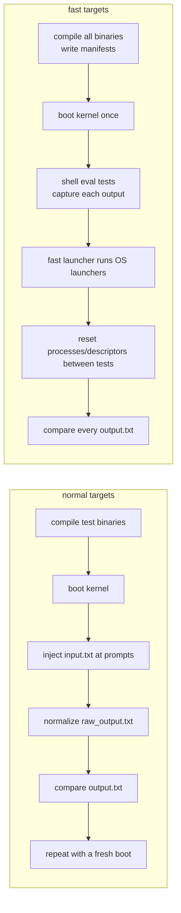

[`system/fast_os_test_launcher.picoc`](system/fast_os_test_launcher.picoc)
redirects stdout to each test's `output.txt`, loads and runs its
`launcher.bin`, waits for it, restores stdout, and invokes `reset_processes()`.
That removes all processes except init, shell, and the syscall caller and
destroys their descriptor tables. The launcher also removes the loading-bar
variable. This reuses the expensive boot while isolating process state.

## 14.4 Shell tests

Shell tests have `input.txt` and `expected_output.txt` but no canonical
launcher input pattern. Normal `make test-shell` injects their commands
through UART exactly as a user would, producing `raw_output.txt` and normalized
`output.txt`.

Fast shell tests normally run inside the already-running shell:
`run_os_tests_fast.py` creates a manifest, the shell's
`run-shell-tests` built-in reads each `input.txt`, calls `eval()` per line, and
captures each directory's `.fast_shell_output.txt`. Before and after each test,
`shell_reset()`:

- clears the foreground PID and removes leftover test processes;
- closes private descriptors `3..7`;
- resets `$?` and `$!`;
- restores the cloned initial environment; and
- resets the expected test PID sequence.

The line-editing test contains the literal `\b` test encoding and must traverse
raw UART/`read_line()`, so the fast runner appends it to the shared session's
UART input instead of calling `eval()`. Fast mode permits 60 seconds per
selected test when computing the shared session limit.

# 15. Use of AI in the project

AI tools have been used as development assistants for bounded tasks such as
Makefile and Python test-runner work, repetitive implementation and test
scaffolding, refactoring support, debugging suggestions, and documentation.
The repository includes, for example, a saved
[VS Code file-association conversation](doc/chats/ChatGPT-VSCode_File_Associations_C.md)
and workspace instructions used to keep automated edits and tests consistent.

AI-assisted output is treated like any other proposed change: it is checked
against PicoOS, PicoC-Compiler, and RETI-Emulator source and the focused tests.
The system architecture, educational scope, RETI/PicoC contracts, and final
technical decisions remain project decisions; describing assistance does not
imply that an AI autonomously designed or validated the operating system.

# 16. Source map and deliberate limitations

Start with these files when following a subsystem:

| Topic | PicoOS | Related project contract |
| --- | --- | --- |
| Boot and binary input | [`startprogram.picoc`](eprom_startprogram/startprogram.picoc), [`process_loader.picoc`](kernel/process/process_loader.picoc) | [binary sections](../RETI-Emulator/doc/section_file_entries.md) |
| UART | [`uart_hardware.picoc`](kernel/uart_hardware.picoc), [`uart_protocol.picoc`](common/uart_protocol.picoc) | [emulator UART](../RETI-Emulator/doc/uart_protocol.md) |
| IVT/ISRs | [`os_isrs.picoc`](interrupt_service_routines/os_isrs.picoc) | [compiler low-level attributes](../PicoC-Compiler/doc/reti_sections_low_level_picoc.md) |
| Processes/waits | [`process.header`](kernel/process.header), [`process.picoc`](kernel/process/process.picoc) | [PicoC calls/frames](../PicoC-Compiler/README.md#function-calls-and-stack-frames) |
| Scheduling/dispatch | [`scheduler.picoc`](kernel/scheduler.picoc), [`dispatcher.picoc`](kernel/dispatcher.picoc) | [`INT`/`RTI` interpreter](../RETI-Emulator/src/interpr.c) |
| Exceptions | [`exception.picoc`](kernel/exception.picoc) | [CPU exceptions](../RETI-Emulator/doc/cpu_exceptions.md) |
| Memory | [`heap.picoc`](common/heap.picoc), [`kmalloc.picoc`](kernel/kmalloc.picoc), [`pmalloc.picoc`](kernel/pmalloc.picoc) | [generated kernel constants](../PicoC-Compiler/doc/kernel_header_option.md) |
| Files/descriptors | [`kernel/filesystem`](kernel/filesystem), [`lib/unistd`](lib/unistd) | [UART control frames](../RETI-Emulator/doc/uart_protocol.md#output-control-frames) |
| Userspace lifecycle | [`start.picoc`](lib/start/start.picoc), [`init.picoc`](system/init.picoc), [`shell.picoc`](user/shell.picoc) | [compiler `-C`](../PicoC-Compiler/README.md#command-line-options) |

Important deliberate limits to remember:

- one physical SRAM address space, no MMU or process isolation;
- host-backed UART files rather than a resident filesystem;
- a dynamic linked process list but fixed user heap/stack defaults;
- round-robin list scanning rather than a separate ready queue;
- non-preemptive kernel scheduling and timer-preempted userspace;
- wait-queue `sleep()` rather than timed sleep;
- exact-child `waitpid()` but no general `wait()`;
- five signals and minimal foreground/background handling;
- eight descriptors per process and copied rather than shared descriptor state;
- no interactive `unset` command, no `fwrite()`, and small format parsers; and
- familiar C/POSIX names used for teaching, without full POSIX semantics.
