<!-- SOURCE Pico-OS/README.md#picoos -->

<div class="eyebrow mb-5">Master Project Presentation</div>

# Pico-OS

<div class="cover-title mt-2">A complete operating system for the<br><span class="accent">RETI teaching CPU</span></div>

<div class="mt-8 grid grid-cols-2 gap-x-10 gap-y-3 max-w-2xl text-sm">
  <div><span class="accent mono mr-3">01</span>Architecture &amp; scope</div>
  <div><span class="accent mono mr-3">02</span>Boot process</div>
  <div><span class="amber mono mr-3">03</span>Kernel &amp; processes</div>
  <div><span class="green mono mr-3">04</span>Memory &amp; I/O</div>
  <div><span class="coral mono mr-3">05</span>Userspace &amp; shell</div>
  <div><span class="muted mono mr-3">06</span>Integration &amp; tests</div>
</div>

<div class="project-art" aria-label="Pico-OS source is compiled by PicoC-Compiler and assembled and executed by RETI-Emulator">
  <div class="art-trace trace-a"></div><div class="art-trace trace-b"></div><div class="art-trace trace-c"></div>
  <div class="art-node art-os"><b>Pico-OS</b><span>.picoc</span></div>
  <div class="art-node art-compiler"><b>PicoC-Compiler</b><span>RETI + .sections</span></div>
  <div class="art-node art-emulator"><b>RETI-Emulator</b><span>assemble · execute</span></div>
  <div class="art-pulse pulse-a"></div><div class="art-pulse pulse-b"></div>
</div>

<div class="cover-footline"><span>Jürgen Mattheis</span><span>University of Freiburg · Technical Faculty</span></div>

---

<!-- SOURCE Pico-OS/README.md#picoos -->

<div class="eyebrow">PicoOS</div>

# Why this operating system exists

<div class="grid grid-cols-2 gap-5 mt-6 text-sm">
  <div class="card">
    <div class="mono accent mb-4">Operating systems</div>
    <div class="grid grid-cols-[7rem_1fr] gap-x-3 gap-y-3">
      <span>processes</span><span class="muted">parent / child · loading · zombies · signals</span>
      <span>interrupts</span><span class="muted">vector table · ISR · software / hardware</span>
      <span>memory</span><span class="muted"><span class="mono">malloc/free</span> · splitting · merging</span>
      <span>files</span><span class="muted">descriptors over host-backed UART services</span>
    </div>
  </div>
  <div class="card amber-border">
    <div class="mono amber mb-4">Real-time operating systems</div>
    <div class="grid grid-cols-[7rem_1fr] gap-x-3 gap-y-3">
      <span>execution</span><span class="muted">states · scheduler · dispatcher</span>
      <span>waiting</span><span class="muted"><span class="mono">waitpid</span> · wait queues · <span class="mono">sleep/wakeup</span></span>
      <span>sharing</span><span class="muted">mutexes · <span class="mono">TSL</span> · shared memory</span>
      <span>preemption</span><span class="muted">timer-preempted userspace · non-preemptive kernel</span>
    </div>
  </div>
</div>

<div class="quote-line mt-7">Small enough to inspect: no virtual memory, no on-device filesystem, and only a focused subset of POSIX-like interfaces.</div>

---

<!-- SOURCE Pico-OS/README.md#intended-physical-hardware -->

<div class="eyebrow">Intended physical hardware</div>

# Two 16-bit SRAMs are enough for Pico-OS

<div class="grid grid-cols-[.95fr_1.05fr] gap-5 mt-4">
  <div class="grid gap-3">
    <div class="card py-4">
      <div class="flex justify-between gap-4"><div><a href="https://www.digikey.de/short/8cmz0qnc" target="_blank"><b>Alchitry Cu V2 ↗</b></a><div class="muted text-xs mt-1">FPGA board · Lattice iCE40-HX8K · CPU, interrupt controller, UART controller, and SRAM interface</div></div><div class="mono text-lg accent whitespace-nowrap">€55.66</div></div>
    </div>
    <div class="card amber-border py-4">
      <div class="flex justify-between gap-4"><div><a href="https://www.digikey.de/short/075fh38w" target="_blank"><b>ISSI IS61WV25616 SRAM ↗</b></a><div class="muted text-xs mt-1">quantity 2 · each: 2<sup>18</sup> addressable cells × 16 bits</div></div><div class="mono text-lg amber whitespace-nowrap">2 × €5.80</div></div>
    </div>
    <div class="card py-4">
      <div class="flex justify-between gap-4"><div><a href="https://www.digikey.de/short/h83tqvbw" target="_blank"><b>SparkFun Serial Basic ↗</b></a><div class="muted text-xs mt-1">CH340C USB-C to UART adapter · 3.3 V serial host connection</div></div><div class="mono text-lg green whitespace-nowrap">€10.92</div></div>
    </div>
    <div class="flex justify-between px-2 text-sm"><b>Total including VAT</b><b class="mono">€78.18</b></div>
  </div>
  <div class="card amber-border py-4">
    <div class="text-center">
      <div class="mono text-sm">2 × (2<sup>18</sup> cells × 16 bits)</div>
      <div class="metric amber mt-2">2<sup>18</sup> × 32 bits</div>
      <div class="metric-label">262,144 addressable words = 1 MiB</div>
      <div class="muted text-xs mt-2">same 18 address lines · D[15:0] + D[31:16]</div>
    </div>
    <div class="memory-bar h-10 mt-4">
      <div class="memory-segment seg-text" style="width:28.3%">74,057 resident image words</div>
      <div class="memory-segment seg-process" style="width:71.7%">188,087 words remain</div>
    </div>
    <div class="grid grid-cols-3 gap-2 mt-3 text-center text-[10px] mono">
      <div class="chip justify-center"><span class="accent">kernel</span> 37,179</div>
      <div class="chip justify-center"><span class="amber">init</span> 10,749</div>
      <div class="chip justify-center"><span class="green">shell</span> 26,129</div>
    </div>
    <div class="text-center text-sm mt-3"><span class="accent mono">kernel + init + shell</span> + <span class="green mono">21 × cat.bin images</span></div>
  </div>
</div>

<div class="muted text-xs text-center mt-3">Conservative image-size comparison; each running process additionally needs heap and stack. Cost excludes USB cables, wires, connectors, PCB, other interconnection hardware, and shipping.</div>

---

<!-- SOURCE Pico-OS/README.md#picoos -->

<div class="eyebrow">Three repositories · one system</div>

# From PicoC source to a running PicoOS

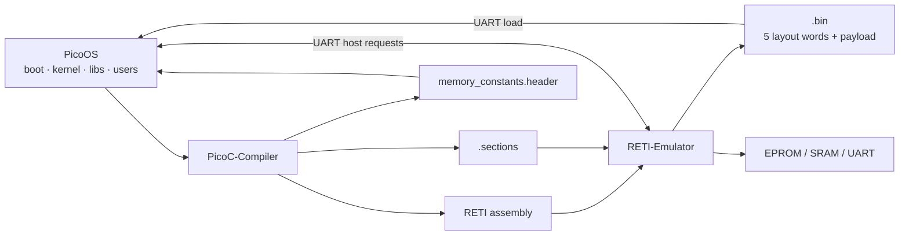

<div class="grid grid-cols-2 gap-5 mt-3 text-sm">
  <div class="card"><span class="mono accent">userspace</span><div class="mt-2">Timer interrupts → round-robin scheduling.</div></div>
  <div class="card amber-border"><span class="mono amber">kernel</span><div class="mt-2">Timer ISR returns to kernel work; another process is never scheduled inside it.</div></div>
</div>

---

<!-- SOURCE Pico-OS/README.md#build-and-run -->

<div class="eyebrow">Build and run</div>

# Build the release tree and boot from EPROM

<div class="terminal mt-6"><div class="terminal-body text-base">$ make bootload</div></div>

<div class="timeline mt-7" style="grid-template-columns:repeat(5,1fr)">
  <div class="timeline-step"><b>firmware</b><br>release tree</div>
  <div class="timeline-step"><b>bootloader</b><br>EPROM <span class="mono">.reti</span></div>
  <div class="timeline-step"><b>kernel</b><br><span class="mono">.bin + .sections</span></div>
  <div class="timeline-step"><b>userspace</b><br>system + user binaries</div>
  <div class="timeline-step"><b>debug TUI</b><br>emulator starts</div>
</div>

<div class="grid grid-cols-4 gap-3 mt-7 text-xs">
  <div class="card py-3"><span class="mono accent">-e</span><br>EPROM bootloader</div>
  <div class="card py-3"><span class="mono accent">-n 4</span><br>runtime-loaded IVT</div>
  <div class="card py-3"><span class="mono accent">-r 262144</span><br>2<sup>18</sup>-word SRAM</div>
  <div class="card py-3"><span class="mono accent">-O</span><br>synthetic first RTI context</div>
</div>

<div class="muted text-xs text-center mt-4"><span class="mono">-S kernel.sections</span> and <span class="mono">-D kernel.debuginfo</span> keep runtime memory and source views aligned.</div>

---

<!-- SOURCE Pico-OS/README.md#overall-flow -->

<div class="eyebrow">Extending the PicoC-Compiler and RETI-Emulator</div>

# The compiler flow PicoOS relies on

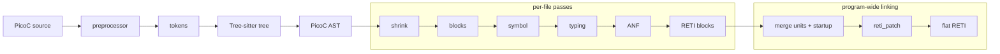

<div class="grid grid-cols-4 gap-2 mt-3 text-[10px] text-center">
  <div class="chip justify-center">headers · macros</div>
  <div class="chip justify-center">types · frames</div>
  <div class="chip justify-center">sections · symbols</div>
  <div class="chip justify-center">loader + debug metadata</div>
</div>

---

<!-- SOURCE Pico-OS/README.md#picoc-compiler-extensions -->

<div class="eyebrow">PicoC-Compiler extensions</div>

# C and ABI features added for PicoOS

<div class="grid grid-cols-3 gap-4 mt-5 text-sm">
  <div class="card"><span class="mono accent">language</span><div class="muted text-xs leading-6 mt-3">headers · macros · <span class="mono">typedef</span><br>casts · <span class="mono">sizeof</span> · postfix <span class="mono">++</span><br>mixed declarations and statements</div></div>
  <div class="card amber-border"><span class="mono amber">types + calls</span><div class="muted text-xs leading-6 mt-3"><span class="mono">void *</span> · typed pointer arithmetic<br>function pointers · variadics<br>System-V-style stack frames</div></div>
  <div class="card green-border"><span class="mono green">low level</span><div class="muted text-xs leading-6 mt-3"><span class="mono">asm("…")</span> · <span class="mono">debug;</span><br>naked functions · section attributes<br><span class="mono">IVTE</span> · linked assembly labels</div></div>
</div>

<div class="grid grid-cols-2 gap-4 mt-5 text-sm">
  <div class="card"><b>Separate compilation</b><div class="muted text-xs mt-2"><span class="mono">-c unit.picoc → .reti_blocks + .st</span><br>cross-file symbols · source/header hashes · dependency files</div></div>
  <div class="card"><b>Inspectable output</b><div class="muted text-xs mt-2"><span class="mono">.pre · .debuginfo · .sections</span><br>source-correlated labels · startup and combined RETI blocks</div></div>
</div>

---

<!-- SOURCE Pico-OS/README.md#picoos-userspace-startup-libstart-and-_start -->

<div class="eyebrow">PicoC-Compiler extensions · startup</div>

# `_start` is always the first `.text` entry

<div class="grid grid-cols-2 gap-6 mt-7">
  <div class="card">
    <div class="chip">normal program</div>
    <div class="timeline mt-6" style="grid-template-columns:repeat(4,1fr)">
      <div class="timeline-step"><b>_start</b></div>
      <div class="timeline-step"><b>globals</b><br>runtime initializers</div>
      <div class="timeline-step"><b>main()</b></div>
      <div class="timeline-step"><b>exit</b></div>
    </div>
  </div>
  <div class="card amber-border">
    <div class="chip">PicoOS: <span class="mono">-C startup.picoc</span></div>
    <div class="timeline mt-6" style="grid-template-columns:repeat(4,1fr)">
      <div class="timeline-step"><b>_start</b><br>naked entry</div>
      <div class="timeline-step"><b>decode</b><br>argc / argv / envp</div>
      <div class="timeline-step"><b>heap</b><br>initialize malloc</div>
      <div class="timeline-step"><b>main</b><br>exit syscall 9</div>
    </div>
  </div>
</div>

<div class="grid grid-cols-3 gap-4 mt-7 text-xs">
  <div class="card"><span class="mono accent">EPROM</span><br>custom naked reset code</div>
  <div class="card"><span class="mono amber">kernel</span><br>custom first kernel entry</div>
  <div class="card"><span class="mono green">userspace</span><br><span class="mono">libstart.picoc</span></div>
</div>

---

<!-- SOURCE Pico-OS/README.md#generated-memory-constants -->

<div class="eyebrow">Generated memory constants</div>

# Compile-time layout for code without a PCB

<div class="grid grid-cols-[1.15fr_.85fr] gap-5 mt-5">
  <div>
    <div class="memory-bar">
      <div class="memory-segment seg-ivt" style="width:8%">.ivt</div>
      <div class="memory-segment seg-text" style="width:35%">kernel .text<br>CS</div>
      <div class="memory-segment seg-data" style="width:13%">.data<br>DS</div>
      <div class="memory-segment seg-heap" style="width:18%">heap<br>4096</div>
      <div class="memory-segment seg-stack" style="width:13%">stack</div>
      <div class="memory-segment seg-process" style="width:13%">processes</div>
    </div>
    <div class="grid grid-cols-2 gap-3 mt-5 text-xs">
      <div class="card"><span class="mono accent">-k sram</span><br>kernel CS · DS · heap · stack · process start · SRAM maximum</div>
      <div class="card amber-border"><span class="mono amber">-k eprom</span><br>bootloader DS · temporary SRAM-top stack</div>
    </div>
  </div>
  <div class="card">
    <div class="mono text-xs leading-7">
      KERNEL_CS_START_ASM<br>
      KERNEL_DS_START_ASM<br>
      KERNEL_SP_START_ASM<br>
      KERNEL_HEAP_START<br>
      KERNEL_HEAP_SIZE <span class="amber">4096</span><br>
      PROCESS_MEMORY_START<br>
      SRAM_MAX_ADDRESS_IN_MEMORY_MAP
    </div>
  </div>
</div>

<div class="quote-line mt-6">The compiler follows the real link far enough to calculate final boundaries, then emits <span class="mono">memory_constants.header</span> instead of RETI.</div>

---

<!-- SOURCE Pico-OS/README.md#reti-emulator-extensions -->

<div class="eyebrow">RETI-Emulator extensions</div>

# The runner became PicoOS’s machine environment

<div class="grid grid-cols-3 gap-4 mt-5 text-xs">
  <div class="card"><span class="mono accent">memory + images</span><div class="leading-6 mt-3">EPROM-only boot<br><span class="mono">.sections</span> loading<br>raw data words<br><span class="mono">--assemble → .bin</span></div></div>
  <div class="card amber-border"><span class="mono amber">devices</span><div class="leading-6 mt-3"><span class="mono">TSL</span><br>interrupt controller<br>runtime timer<br>raw-byte UART</div></div>
  <div class="card green-border"><span class="mono green">protection</span><div class="leading-6 mt-3">exception vector 3<br>cause cell 11<br>stack boundary cell 10<br>explicit <span class="mono">-n 4</span></div></div>
  <div class="card"><span class="mono accent">debug data</span><div class="leading-6 mt-3">source / locals / frames<br>runtime CS / DS views<br>snapshots · live editing</div></div>
  <div class="card amber-border"><span class="mono amber">interaction</span><div class="leading-6 mt-3">paged action help<br>manual interrupt trigger<br>normal + raw terminals</div></div>
  <div class="card green-border"><span class="mono green">host bridge</span><div class="leading-6 mt-3">bounded UART requests<br>load · read · write<br>pwd · ls · mkdir …</div></div>
</div>

---

<!-- SOURCE Pico-OS/README.md#linked-sections-metadata-and-the-bin-loader-header -->

<div class="eyebrow">Linked `.sections` metadata and `.bin` header</div>

# Link layout becomes five big-endian header words

<div class="grid grid-cols-[.8fr_1.2fr] gap-5 mt-5">
  <div class="card">
    <div class="timeline" style="grid-template-columns:1fr">
      <div class="timeline-step"><b>picoc_compiler</b><br><span class="mono">program.reti + program.sections</span></div>
      <div class="timeline-step"><b>reti_emulator -a</b><br>find matching metadata automatically</div>
      <div class="timeline-step"><b>program.bin</b><br>header first · RETI payload second</div>
    </div>
  </div>
  <div>
    <div class="memory-bar h-16">
      <div class="memory-segment seg-ivt" style="width:11%">0 · CS</div>
      <div class="memory-segment seg-data" style="width:11%">1 · DS</div>
      <div class="memory-segment seg-heap" style="width:14%">2 · heap start</div>
      <div class="memory-segment seg-heap" style="width:14%">3 · heap size</div>
      <div class="memory-segment seg-stack" style="width:14%">4 · stack start</div>
      <div class="memory-segment seg-text" style="width:36%">encoded payload</div>
    </div>
    <div class="grid grid-cols-[3rem_1fr] gap-x-4 gap-y-3 mt-5 text-xs">
      <span class="mono accent">0 / 1</span><span>process-relative entry and static-data bases</span>
      <span class="mono amber">2 / 3</span><span><span class="mono">malloc()</span> start/size; <span class="mono">−1</span> selects default size</span>
      <span class="mono green">4</span><span>highest relative stack cell; <span class="mono">−1</span> asks PicoOS to choose</span>
    </div>
  </div>
</div>

<div class="muted text-xs text-center mt-4">The word count arrives before the file; it is not stored inside <span class="mono">.bin</span>. PicoOS reads the header, subtracts five, and copies only the payload.</div>

---

<!-- SOURCE Pico-OS/README.md#uart-hardware-interface -->

<div class="eyebrow">UART hardware interface</div>

# Three cells at periphery base 2³⁰

<div class="grid grid-cols-[.95fr_1.05fr] gap-6 mt-7">
  <div class="stack">
    <div class="stack-cell hot"><span>cell 0 · 1073741824</span><span>PicoOS → host byte</span></div>
    <div class="stack-cell"><span>cell 1 · 1073741825</span><span>host → PicoOS byte</span></div>
    <div class="stack-cell"><span>cell 2 · 1073741826</span><span>ready bits 0 / 1</span></div>
  </div>
  <div class="card">
    <div class="grid grid-cols-[5rem_1fr] gap-x-4 gap-y-4 text-sm">
      <span class="mono accent">send</span><span>write byte → clear bit 0 → emulator consumes → bit 0 becomes 1</span>
      <span class="mono amber">receive</span><span>clear bit 1 → emulator writes byte → bit 1 becomes 1 → read cell 1</span>
      <span class="mono green">boot</span><span>polling only; no processes or interrupts exist</span>
      <span class="mono coral">normal</span><span>UART hardware interrupt feeds the terminal owner</span>
    </div>
  </div>
</div>

---

<!-- SOURCE Pico-OS/README.md#host-requests-over-uart -->

<div class="eyebrow">Host requests over UART</div>

# Raw bytes carry bounded filesystem requests

<div class="card amber-border mt-5 text-center mono text-base">ESC&nbsp; load &lt;absolute-path&gt;&nbsp; ESC /</div>

<div class="grid grid-cols-3 gap-4 mt-5 text-xs">
  <div class="card"><span class="mono accent">load</span><div class="leading-6 mt-2">word count<br>five header words<br>exact file bytes</div></div>
  <div class="card"><span class="mono amber">read</span><div class="leading-6 mt-2"><span class="mono">read-range offset count path</span><br><span class="mono">file-size path</span></div></div>
  <div class="card"><span class="mono green">directories</span><div class="leading-6 mt-2"><span class="mono">pwd · is-directory · mkdir</span><br><span class="mono">ls · unlink · rmdir</span></div></div>
</div>

<div class="grid grid-cols-[1fr_auto_1fr_auto_1fr] items-center gap-3 mt-6 text-center text-xs">
  <div class="card">PicoOS sends control frame</div><span class="flow-arrow">→</span>
  <div class="card amber-border">emulator consumes it</div><span class="flow-arrow">→</span>
  <div class="card green-border">count / status / bytes return through UART</div>
</div>

<div class="muted text-xs text-center mt-4"><span class="mono">UINT32_MAX</span> reports failure; there is deliberately no generic host-command frame.</div>

---

<!-- SOURCE Pico-OS/README.md#host-requests-over-uart -->

<div class="eyebrow">Host requests over UART · output</div>

# Regular-file writes select an output destination

<div class="timeline mt-7" style="grid-template-columns:repeat(5,1fr)">
  <div class="timeline-step"><b>select</b><br><span class="mono">ESC write path ESC /</span></div>
  <div class="timeline-step"><b>truncate/create</b><br>empty request body</div>
  <div class="timeline-step"><b>write bytes</b><br>ordinary UART output</div>
  <div class="timeline-step"><b>append</b><br><span class="mono">ESC append path ESC /</span></div>
  <div class="timeline-step"><b>restore</b><br><span class="mono">write stdout</span></div>
</div>

<div class="grid grid-cols-2 gap-5 mt-7 text-sm">
  <div class="card"><span class="mono accent">stderr</span><div class="muted text-xs mt-2"><span class="mono">ESC write stderr ESC /</span> temporarily selects the host error stream.</div></div>
  <div class="card amber-border"><span class="mono amber">isolation</span><div class="muted text-xs mt-2">Every assembler/emulator process receives separate peripheral files so an active OS image cannot be overwritten.</div></div>
</div>

---

<!-- SOURCE Pico-OS/README.md#debug-tui-and-terminal-views -->

<div class="eyebrow">Debug TUI and terminal views</div>

# The whole RETI machine remains inspectable

<div class="grid grid-cols-[1.35fr_.65fr] gap-5 mt-4">
  
  <div class="grid gap-3 text-xs">
    <div class="card"><span class="mono accent">page 1</span><br><span class="mono">n c r s f</span><br>execute · continue · ISR control</div>
    <div class="card amber-border"><span class="mono amber">page 2</span><br><span class="mono">j k J K C a A e T</span><br>windows · edits · manual ISR</div>
    <div class="card green-border"><span class="mono green">page 3</span><br><span class="mono">S R d v V t</span><br>snapshots · source · terminals</div>
  </div>
</div>

---

<!-- SOURCE Pico-OS/README.md#debug-tui-and-terminal-views -->

<div class="eyebrow">Debug TUI and terminal views</div>

# Normal and raw UART terminals

<div class="grid grid-cols-2 gap-6 mt-7">
  <div class="card">
    <div class="metric">v</div><h2 class="mt-2">Normal view</h2>
    <div class="muted text-sm mt-4">Printable and input keys reach PicoOS.<br>Host signal handling remains active.</div>
    <div class="chip mt-5">Escape → TUI</div>
  </div>
  <div class="card amber-border">
    <div class="metric amber">V</div><h2 class="mt-2">Raw view</h2>
    <div class="muted text-sm mt-4">All bytes reach PicoOS: control keys and terminal escape sequences included.</div>
    <div class="chip mt-5">Ctrl+] → TUI</div>
  </div>
</div>

<div class="grid grid-cols-4 gap-3 mt-7 text-center text-xs mono">
  <div class="card py-3">Ctrl+C<br><span class="accent">03</span></div>
  <div class="card py-3">Ctrl+Z<br><span class="accent">1A</span></div>
  <div class="card py-3">Arrow Up<br><span class="accent">1B 5B 41</span></div>
  <div class="card py-3">Arrow Down<br><span class="accent">1B 5B 42</span></div>
</div>

---

<!-- SOURCE Pico-OS/README.md#11-loading-and-starting-the-kernel -->

<div class="eyebrow">1 · Bootloading</div>

# Loading the kernel from EPROM into SRAM

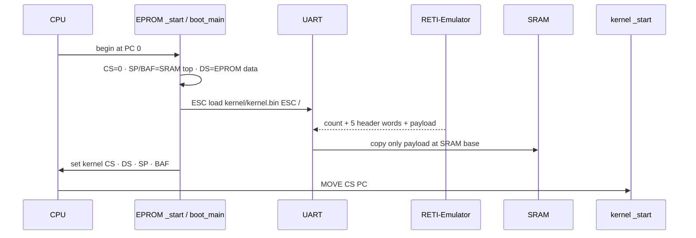

<div class="grid grid-cols-3 gap-3 mt-3 text-center text-xs">
  <div class="chip justify-center">read-only EPROM globals</div>
  <div class="chip justify-center">temporary SRAM-top boot stack</div>
  <div class="chip justify-center">polling UART—no interrupts yet</div>
</div>

---

<!-- SOURCE Pico-OS/README.md#11-loading-and-starting-the-kernel -->

<div class="eyebrow">1.1 · Three bootloader functions</div>

# Reset, transfer, register handoff

<div class="timeline mt-6" style="grid-template-columns:repeat(3,1fr)">
  <div class="timeline-step"><b>naked _start()</b><br>establish EPROM CS/DS and SRAM-top SP/BAF</div>
  <div class="timeline-step"><b>boot_main()</b><br>request image · validate count · retain CS/DS/stack · copy payload</div>
  <div class="timeline-step"><b>start_loaded_kernel()</b><br>add SRAM base · replace registers · jump to kernel CS</div>
</div>

```c {maxHeight:'255px'}
__attribute__((naked))
void _start(void) {
    asm("LOADI CS 0");
    asm(EPROM_STACK_START_ASM);
    asm("MOVE SP BAF");
    asm(EPROM_DS_START_ASM);
    asm("ADD DS CS");
    asm("LOADI32 ACC boot_main");
    asm("ADD ACC CS");
    asm("MOVE ACC PC");
}
```

<div class="muted text-xs text-center mt-3">The handoff preserves <span class="mono">boot_main()</span>’s BAF so it can reload the three retained header locals.</div>

---

<!-- SOURCE Pico-OS/README.md#11-loading-and-starting-the-kernel -->

<div class="eyebrow">1.1 · Big-endian transfer</div>

# Four UART bytes become one signed RETI word

<div class="grid grid-cols-[1fr_.9fr] gap-6 mt-5">
  <div>

```c {maxHeight:'330px'}
int receive_word(void) {
    int word;

    word = receive_byte_over_uart();
    if (word >= 128) {
        word = word - 256;
    }

    word = word * 256 + receive_byte_over_uart();
    word = word * 256 + receive_byte_over_uart();
    word = word * 256 + receive_byte_over_uart();
    return word;
}
```

  </div>
  <div class="card">
    <div class="grid grid-cols-4 gap-2 text-center mono text-sm">
      <div class="stack-cell justify-center hot">b₃</div><div class="stack-cell justify-center">b₂</div><div class="stack-cell justify-center">b₁</div><div class="stack-cell justify-center">b₀</div>
    </div>
    <div class="text-center flow-arrow mt-5">↓ × 256 + next byte</div>
    <div class="mono text-center mt-5">signed 32-bit word</div>
    <div class="muted text-xs mt-5">Sign-extend the first byte, then use three multiply/add steps.</div>
  </div>
</div>

---

<!-- SOURCE Pico-OS/README.md#21-kernel-initialization -->

<div class="eyebrow">2 · Kernel main loop</div>

# Kernel initialization—in source order

```c {maxHeight:'405px'}
int main(void) {
    int init_pid;
    struct RunProcessRequest init_request;

    activate_kernel_stack_boundary();
    debug;
    init_kernel_heap();
    initialize_process_table();
    init_process_memory_heap();
    initialize_shared_memory();
    interrupt_controller_initialize();
    init_pid = load_process("system/init.bin", false);
    init_request.pid = init_pid;
    init_request.arguments = NULL;
    init_request.environment = NULL;
    if (mark_process_ready_with_arguments(&init_request)) {
        interrupt_controller_activate_timer();
        dispatcher_start_next_process();
    }
    return 0;
}
```

---

<!-- SOURCE Pico-OS/README.md#21-kernel-initialization -->

<div class="eyebrow">2.1 · Why that order matters</div>

# Initialization establishes every allocator before its users

<div class="timeline mt-5" style="grid-template-columns:repeat(6,1fr)">
  <div class="timeline-step"><b>boundary</b><br>protect kernel stack</div>
  <div class="timeline-step"><b>kmalloc</b><br>PCB · paths · descriptors</div>
  <div class="timeline-step"><b>process list</b><br>head · tail · PID</div>
  <div class="timeline-step"><b>pmalloc</b><br>complete SRAM regions</div>
  <div class="timeline-step"><b>shared memory</b><br>metadata list</div>
  <div class="timeline-step"><b>interrupts</b><br>timer 1 · UART 2</div>
</div>

<div class="grid grid-cols-3 gap-4 mt-7 text-sm">
  <div class="card"><span class="mono accent">timer</span><div class="muted text-xs mt-2">Interval stays 0 until init has loaded successfully.</div></div>
  <div class="card amber-border"><span class="mono amber">no forever loop</span><div class="muted text-xs mt-2">The dispatcher transfers control with <span class="mono">RTI</span>.</div></div>
  <div class="card green-border"><span class="mono green">no ready process</span><div class="muted text-xs mt-2">Spin in kernel context until an interrupt changes state; empty list → shutdown.</div></div>
</div>

---

<!-- SOURCE Pico-OS/README.md#22-transition-from-bootloading-to-normal-execution -->

<div class="eyebrow">2.2 · First transition to userspace</div>

# The first `RTI` starts init at `_start`

<div class="grid grid-cols-[1fr_auto_1fr] items-center gap-6 mt-6">
  <div class="card">
    <div class="mono accent mb-3">after boot handoff</div>
    <div class="stack">
      <div class="stack-cell"><span>PC / CS</span><span>kernel .text</span></div>
      <div class="stack-cell"><span>DS</span><span>kernel .data</span></div>
      <div class="stack-cell"><span>SP / BAF</span><span>kernel stack</span></div>
      <div class="stack-cell"><span>processes</span><span>none</span></div>
    </div>
  </div>
  <div class="flow-arrow text-3xl">→</div>
  <div class="card green-border">
    <div class="mono green mb-3">after initialization</div>
    <div class="stack">
      <div class="stack-cell"><span>init</span><span>READY → RUNNING</span></div>
      <div class="stack-cell"><span>activation</span><span>7 saved registers</span></div>
      <div class="stack-cell hot"><span>SP + 1</span><span>_start − 1</span></div>
      <div class="stack-cell"><span>RTI</span><span>advances to _start</span></div>
    </div>
  </div>
</div>

<div class="quote-line mt-7">The emulator’s synthetic <span class="mono">-O</span> context lets this first dispatch leave kernel context through the same <span class="mono">RTI</span> path used later.</div>

---

<!-- SOURCE Pico-OS/README.md#31-binary-sections -->

<div class="eyebrow">3 · Interrupts, system calls, and exceptions</div>

# The linked binary has three real sections

<div class="memory-bar mt-6">
  <div class="memory-segment seg-ivt" style="width:10%">.ivt<br>0…3</div>
  <div class="memory-segment seg-text" style="width:50%">.text<br>_start · handlers · code</div>
  <div class="memory-segment seg-data" style="width:22%">.data<br>globals</div>
  <div class="memory-segment seg-heap" style="width:18%">heap / free</div>
</div>

<div class="grid grid-cols-3 gap-4 mt-7 text-sm">
  <div class="card"><span class="mono accent">.ivt</span><div class="muted text-xs mt-2">Raw SRAM-relative addresses. Kernel: four cells; userspace normally none.</div></div>
  <div class="card"><span class="mono amber">.text</span><div class="muted text-xs mt-2">Begins at <span class="mono">_start</span>; kernel begins at relative offset 4.</div></div>
  <div class="card"><span class="mono green">.data</span><div class="muted text-xs mt-2"><span class="mono">-O1</span> emits compile-time globals directly into the image.</div></div>
</div>

<div class="muted text-xs text-center mt-5"><span class="mono">.sections</span> additionally records code/data boundaries, heap start/size, and stack start.</div>

---

<!-- SOURCE Pico-OS/README.md#32-interrupt-vector-table and #33-interrupt-service-routines -->

<div class="eyebrow">3.2–3.3 · Interrupt vector table</div>

# Four entries, four kernel paths

<div class="grid grid-cols-[.8fr_1.2fr] gap-6 mt-5">
  <div class="stack">
    <div class="stack-cell hot"><span>vector 0</span><span>syscall_interrupt</span></div>
    <div class="stack-cell"><span>vector 1</span><span>timer_interrupt</span></div>
    <div class="stack-cell"><span>vector 2</span><span>uart_interrupt</span></div>
    <div class="stack-cell"><span>vector 3</span><span>cpu_exception_interrupt</span></div>
  </div>
  <div class="card">
    <div class="timeline" style="grid-template-columns:repeat(4,1fr)">
      <div class="timeline-step"><b>INT i</b><br>decrement SP</div>
      <div class="timeline-step"><b>save PC</b><br>at SP + 1</div>
      <div class="timeline-step"><b>lookup</b><br>SRAM vector i</div>
      <div class="timeline-step"><b>handler</b><br>push registers</div>
    </div>
    <div class="mt-6 mono text-xs">RTI: PC ← [SP+1] · SP++ · advance</div>
  </div>
</div>

<div class="muted text-xs text-center mt-6">The CPU saves only the return PC. PicoOS explicitly preserves every ordinary register it needs.</div>

---

<!-- SOURCE Pico-OS/README.md#34-exception-handlers and #stack-overflow-boundary -->

<div class="eyebrow">3.4 · Exception handlers</div>

# CPU faults use vector 3; heap exhaustion does not

<div class="grid grid-cols-4 gap-3 mt-5 text-xs">
  <div class="card coral-border"><span class="mono coral">cause 1</span><br><b>divide / modulo by zero</b><div class="muted mt-2">vector 3</div></div>
  <div class="card coral-border"><span class="mono coral">cause 2</span><br><b>stack overflow</b><div class="muted mt-2">vector 3 · cell 10</div></div>
  <div class="card coral-border"><span class="mono coral">cause 3</span><br><b>illegal instruction</b><div class="muted mt-2">vector 3</div></div>
  <div class="card amber-border"><span class="mono amber">syscall</span><br><b>process heap full</b><div class="muted mt-2">vector 0</div></div>
</div>

<div class="grid grid-cols-2 gap-5 mt-6 text-sm">
  <div class="card"><span class="mono accent">user fault</span><div class="mt-2">Print diagnostic → terminate status 1 → notify parent → dispatch.</div></div>
  <div class="card coral-border"><span class="mono coral">kernel fault</span><div class="mt-2">Print kernel panic → <span class="mono">shutdown()</span>.</div></div>
</div>

<div class="card mt-5 text-center text-xs mono">cell 10 = inclusive heap/stack boundary · cell 11 = read-only exception cause</div>

---

<!-- SOURCE Pico-OS/README.md#35-picoc-compiler-support-for-low-level-handlers -->

<div class="eyebrow">3.5 · Compiler support for handlers</div>

# Three features make low-level PicoC possible

<div class="grid grid-cols-3 gap-5 mt-7">
  <div class="card"><div class="metric">.ivt</div><div class="mono text-xs mt-3">__attribute__((section("ivt")))</div><div class="muted text-sm mt-3">Places compile-time vector values before executable code.</div></div>
  <div class="card amber-border"><div class="metric amber">naked</div><div class="mono text-xs mt-3">__attribute__((naked))</div><div class="muted text-sm mt-3">No generated prologue, epilogue, or return sequence.</div></div>
  <div class="card green-border"><div class="metric green">-O1</div><div class="mono text-xs mt-3">compile-time initialization</div><div class="muted text-sm mt-3">Emits function addresses, arrays, structs, and scalars directly.</div></div>
</div>

<div class="quote-line mt-7">Normal functions receive compiler-managed frames. Naked ISR hubs contain only the written RETI assembly.</div>

---

<!-- SOURCE Pico-OS/README.md#36-system-call-handling -->

<div class="eyebrow">3.6 · System call handling</div>

# All 32 syscalls enter through `INT 0`

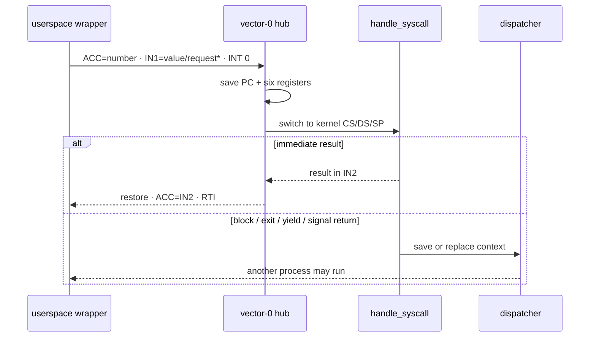

<div class="grid grid-cols-3 gap-4 mt-4 text-xs">
  <div class="card"><span class="mono accent">ACC</span><br>syscall number 0…31</div>
  <div class="card"><span class="mono amber">IN1</span><br>scalar or request-structure pointer</div>
  <div class="card"><span class="mono green">caller_context</span><br>saved user-stack frame</div>
</div>

---

<!-- SOURCE Pico-OS/README.md#37-system-call-arguments-and-stack-frame-layout -->

<div class="eyebrow">3.7 · Stack-frame layout</div>

# PicoC stack positions are part of the OS ABI

<div class="grid grid-cols-2 gap-6 mt-5">
  <div class="card">
    <div class="mono accent mb-3">normal function frame · low → high</div>
    <div class="stack">
      <div class="stack-cell free"><span>SP</span><span>free cell</span></div>
      <div class="stack-cell"><span>BAF, BAF−1 …</span><span>locals</span></div>
      <div class="stack-cell"><span>BAF+1</span><span>saved old BAF</span></div>
      <div class="stack-cell hot"><span>BAF+2</span><span>return address</span></div>
      <div class="stack-cell"><span>BAF+3 …</span><span>arguments</span></div>
    </div>
  </div>
  <div class="card amber-border">
    <div class="mono amber mb-3">interrupt frame · caller_context + offset</div>
    <div class="grid grid-cols-4 gap-1 text-center text-[10px] mono">
      <div class="stack-cell justify-center">+0 free</div><div class="stack-cell justify-center">+1 DS</div><div class="stack-cell justify-center">+2 CS</div><div class="stack-cell justify-center">+3 BAF</div>
      <div class="stack-cell justify-center">+4 IN2</div><div class="stack-cell justify-center">+5 IN1</div><div class="stack-cell justify-center">+6 ACC</div><div class="stack-cell justify-center hot">+7 PC</div>
    </div>
    <div class="muted text-xs mt-5">Dispatcher copies offsets 1…6 into the PCB; the PC stays on the process stack.</div>
  </div>
</div>

---

<!-- SOURCE Pico-OS/README.md#38-timer-interrupt -->

<div class="eyebrow">3.8 · Timer interrupt</div>

# The timer preempts userspace, never kernel scheduling work

<div class="grid grid-cols-[.75fr_1.25fr] gap-6 mt-6">
  <div class="card">
    <div class="metric">1000</div><div class="metric-label">interpreter cycles</div>
    <div class="mono text-xs leading-7 mt-5">cell 9 → interval<br>cell 3 → vector 1<br>cell 6 → priority 1</div>
  </div>
  <div class="card amber-border">
    <div class="grid grid-cols-[7rem_1fr] gap-x-4 gap-y-4 text-sm">
      <span class="mono accent">kernel CS</span><span>pop six registers → <span class="mono">RTI</span> → resume same kernel work</span>
      <span class="mono amber">user CS</span><span>disable boundary → kernel stack → save activation → scheduler</span>
      <span class="mono green">delivery</span><span>before next instruction; timer line resets and reactivates after <span class="mono">RTI</span></span>
    </div>
  </div>
</div>

<div class="quote-line mt-7">A higher-priority UART interrupt may briefly interrupt the kernel, but it returns to that kernel context.</div>

---

<!-- SOURCE Pico-OS/README.md#39-uart-and-keypress-interrupt -->

<div class="eyebrow">3.9 · UART and keypress interrupt</div>

# One byte either completes a read or enters a ring buffer

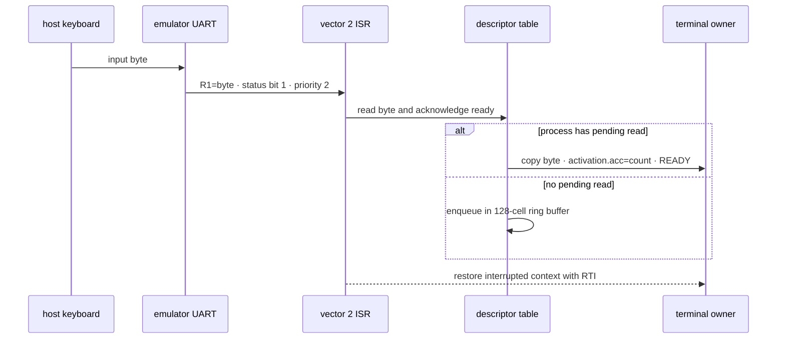

<div class="grid grid-cols-3 gap-3 mt-3 text-xs">
  <div class="card"><span class="mono accent">stable owner</span><br>shell ↔ foreground child</div>
  <div class="card"><span class="mono amber">lost-wakeup guard</span><br>temporarily disable UART mapping</div>
  <div class="card"><span class="mono coral">control bytes</span><br>Ctrl+C → SIGTERM · Ctrl+Z → SIGTSTP</div>
</div>

---

<!-- SOURCE Pico-OS/README.md#41-process-table and #42-process-structure -->

<div class="eyebrow">4 · Processes</div>

# The “process table” is a linked list of PCBs

<div class="flex items-center gap-3 mt-6">
  <div class="process-node running">PID 1 · init</div><span class="flow-arrow">→</span>
  <div class="process-node">PID 2 · shell</div><span class="flow-arrow">→</span>
  <div class="process-node blocked">PID 3 · child</div><span class="flow-arrow">→</span>
  <div class="process-node stopped">…</div><span class="flow-arrow">→ NULL</span>
</div>

<div class="grid grid-cols-3 gap-4 mt-7 text-xs">
  <div class="card"><span class="mono accent">identity + memory</span><div class="leading-6 mt-2">pid · parent_pid<br>base · size · heap<br>binary path · cwd</div></div>
  <div class="card amber-border"><span class="mono amber">execution</span><div class="leading-6 mt-2">state · activation<br>wait state · signals<br>PC remains at SP+1</div></div>
  <div class="card green-border"><span class="mono green">resources</span><div class="leading-6 mt-2">8 descriptors<br>wait-queue links<br>shared-memory attachments</div></div>
</div>

<div class="muted text-xs text-center mt-5">The kernel has no PCB: it has no user region, parent, descriptors, or schedulable user state.</div>

---

<!-- SOURCE Pico-OS/README.md#43-activation-records-and-stack-frames and #44-process-states -->

<div class="eyebrow">4.3–4.4 · Activation and process states</div>

# Saved context and lifecycle are separate concepts

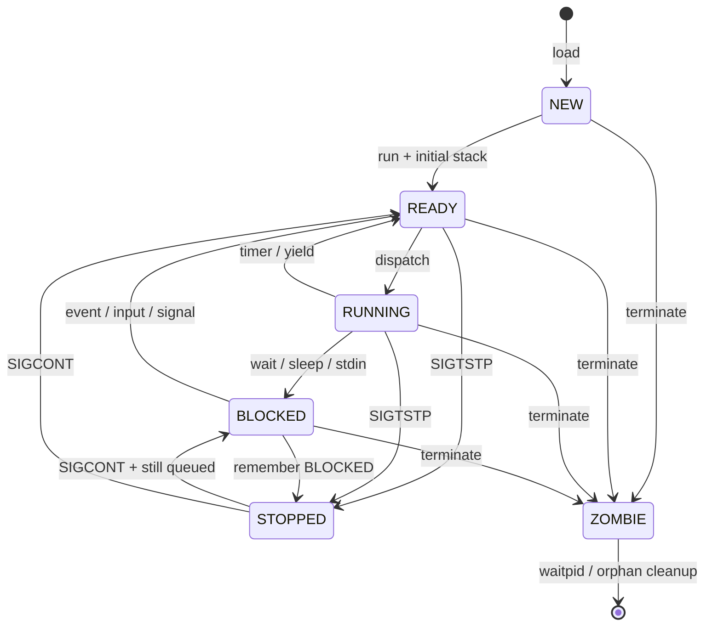

<div class="muted text-xs text-center mt-2"><span class="mono">ZOMBIE</span> retains status for a living parent; complete termination means removal from the list.</div>

---

<!-- SOURCE Pico-OS/README.md#45-loading-processes -->

<div class="eyebrow">4.5 · Loading processes</div>

# `load()` and `run()` are deliberately separate

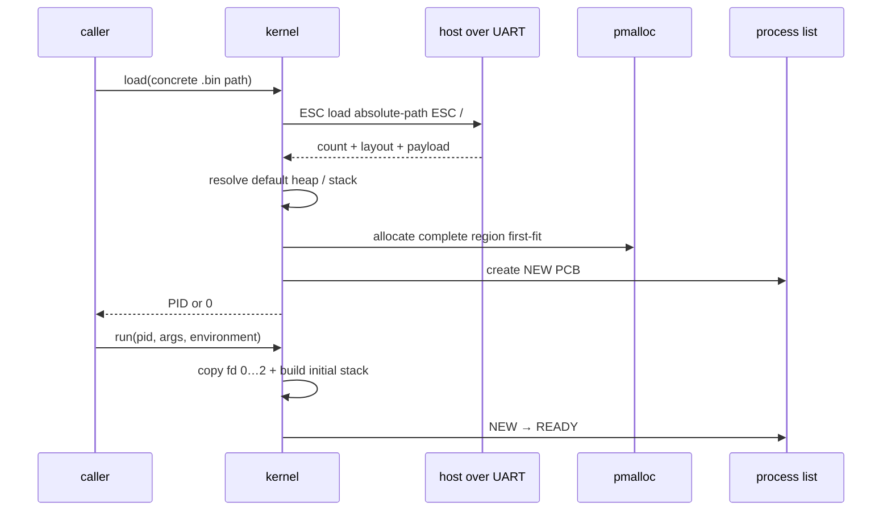

<div class="grid grid-cols-3 gap-3 mt-3 text-xs">
  <div class="chip justify-center">heap default: 1000 cells</div>
  <div class="chip justify-center">stack default: another 1000</div>
  <div class="chip justify-center">shell performs PATH lookup</div>
</div>

---

<!-- SOURCE Pico-OS/README.md#46-program-arguments-and-environment and #47-initial-process-stack -->

<div class="eyebrow">4.6–4.7 · Initial process stack</div>

# The kernel synthesizes `_start`’s outer frame

<div class="grid grid-cols-[.9fr_1.1fr] gap-6 mt-5">
  <div class="stack">
    <div class="stack-cell free"><span>activation.sp</span><span>free cell</span></div>
    <div class="stack-cell hot"><span>SP + 1</span><span>_start − 1</span></div>
    <div class="stack-cell"><span>BAF + 3</span><span>argc</span></div>
    <div class="stack-cell"><span>next</span><span>argv pointers · NULL</span></div>
    <div class="stack-cell"><span>next</span><span>envp pointers · NULL</span></div>
    <div class="stack-cell"><span>high addresses</span><span>argument + NAME=value strings</span></div>
  </div>
  <div class="card">
    <div class="grid grid-cols-[7rem_1fr] gap-x-4 gap-y-4 text-sm">
      <span class="mono accent">argv[0]</span><span>always the binary path</span>
      <span class="mono amber">arguments</span><span>split only on spaces and tabs</span>
      <span class="mono green">pointers</span><span>absolute SRAM addresses, not offsets</span>
      <span class="mono coral">BAF</span><span>set so <span class="mono">BAF + 3 = argc</span> and <span class="mono">BAF + 4 = argv[0]</span></span>
    </div>
  </div>
</div>

<div class="muted text-xs text-center mt-5">Do not confuse this kernel-built entry stack with normal compiler frames or interrupt/context-switch frames.</div>

---

<!-- SOURCE Pico-OS/README.md#48-environment-variables -->

<div class="eyebrow">4.8 · Environment variables</div>

# Environment is inherited once, then process-local

<div class="grid grid-cols-[1fr_auto_1fr_auto_1fr] items-center gap-4 mt-7 text-center text-sm">
  <div class="card"><span class="mono accent">init</span><div class="muted text-xs mt-2">reads <span class="mono">PATH=./user</span></div></div>
  <span class="flow-arrow">copy →</span>
  <div class="card amber-border"><span class="mono amber">shell</span><div class="muted text-xs mt-2">heap-owned <span class="mono">char **environ</span></div></div>
  <span class="flow-arrow">copy →</span>
  <div class="card green-border"><span class="mono green">child</span><div class="muted text-xs mt-2">initial stack → libstart clones to heap</div></div>
</div>

<div class="grid grid-cols-2 gap-5 mt-7">
  <div class="card">
    <div class="mono text-sm leading-7">getenv · setenv<br>unsetenv · putenv · clearenv</div>
  </div>
  <div class="terminal"><div class="terminal-body">load ./user/echo.bin<br>[#####&nbsp;&nbsp;&nbsp;&nbsp;&nbsp;] 50%<br>[##########] 100%</div></div>
</div>

<div class="muted text-xs text-center mt-4"><span class="mono">PICOOS_LOADING_BAR=true</span> is added by init when the build-time setting enables it.</div>

---

<!-- SOURCE Pico-OS/README.md#51-wait-queues -->

<div class="eyebrow">5 · Blocking, waiting, synchronization, and signals</div>

# One intrusive FIFO wait-queue mechanism

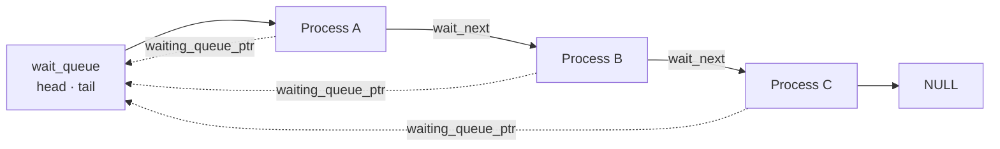

<div class="grid grid-cols-3 gap-4 mt-5 text-xs">
  <div class="card"><span class="mono accent">owners</span><br>child waiters · stdin waiters · mutex waiters</div>
  <div class="card amber-border"><span class="mono amber">sleep</span><br>append current PCB · state → BLOCKED</div>
  <div class="card green-border"><span class="mono green">wakeup</span><br>remove one FIFO head · state → READY</div>
</div>

<div class="muted text-xs text-center mt-4">A process can be linked into only one wait queue at a time.</div>

---

<!-- SOURCE Pico-OS/README.md#51-wait-queues -->

<div class="eyebrow">5.1 · Mutexes use wait queues</div>

# `TSL` avoids races; sleeping avoids spinning

<div class="grid grid-cols-[.75fr_auto_1.25fr] items-center gap-5 mt-7">
  <div class="card text-center"><span class="mono accent">mutex_lock()</span><div class="muted text-xs mt-3">atomic test-and-set</div></div>
  <div class="flow-arrow">→</div>
  <div class="card amber-border">
    <div class="grid grid-cols-2 gap-4 text-sm">
      <div><span class="mono green">old = 0</span><div class="muted text-xs mt-2">lock acquired</div></div>
      <div><span class="mono amber">old = 1</span><div class="muted text-xs mt-2">sleep on mutex.waiters</div></div>
    </div>
  </div>
</div>

<div class="timeline mt-8" style="grid-template-columns:repeat(4,1fr)">
  <div class="timeline-step"><b>unlock</b><br>clear mutex</div>
  <div class="timeline-step"><b>wakeup</b><br>one FIFO waiter</div>
  <div class="timeline-step"><b>READY</b><br>normal scheduler</div>
  <div class="timeline-step"><b>retry TSL</b><br>compete for lock</div>
</div>

<div class="muted text-xs text-center mt-5">A mutex may live in shared process memory because PicoOS has one physical address space and kernel-visible absolute pointers.</div>

---

<!-- SOURCE Pico-OS/README.md#52-waitpid-and-saved-wait-state -->

<div class="eyebrow">5.2 · `waitpid()` and saved wait state</div>

# The parent waits for one exact child

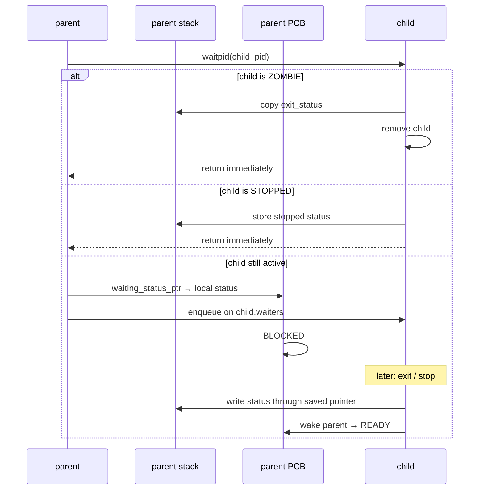

<div class="muted text-xs text-center mt-2">No general <span class="mono">wait()</span> and no options argument; invalid/non-child PID produces status <span class="mono">−1</span>.</div>

---

<!-- SOURCE Pico-OS/README.md#53-sleep and #54-wakeup and #55-blocked-to-ready-transitions -->

<div class="eyebrow">5.3–5.5 · `sleep()`, `wakeup()`, and readiness</div>

# `sleep(queue)` has no duration

<div class="timeline mt-6" style="grid-template-columns:repeat(6,1fr)">
  <div class="timeline-step"><b>sleep</b><br>syscall 11</div>
  <div class="timeline-step"><b>enqueue</b><br>FIFO tail</div>
  <div class="timeline-step"><b>BLOCKED</b><br>save context</div>
  <div class="timeline-step"><b>event</b><br>child · mutex · UART · signal</div>
  <div class="timeline-step"><b>wakeup</b><br>syscall 12 or kernel path</div>
  <div class="timeline-step"><b>READY</b><br>later dispatch</div>
</div>

<div class="grid grid-cols-3 gap-4 mt-7 text-xs">
  <div class="card"><span class="mono accent">ready causes</span><div class="leading-6 mt-2">child exit/stop<br>mutex unlock<br>explicit wakeup</div></div>
  <div class="card amber-border"><span class="mono amber">I/O + signals</span><div class="leading-6 mt-2">stdin byte completes read<br>caught signal unlinks waiter<br>SIGCONT restores state</div></div>
  <div class="card coral-border"><span class="mono coral">not implemented</span><div class="leading-6 mt-2">timed sleep<br>deadline queue<br>timer-expiry wakeup</div></div>
</div>

---

<!-- SOURCE Pico-OS/README.md#56-signals and #parent-death-signal -->

<div class="eyebrow">5.6 · Signals</div>

# Five signal numbers, intentionally small semantics

<div class="grid grid-cols-5 gap-3 mt-5 text-center text-xs">
  <div class="card coral-border"><span class="metric coral">9</span><br><b>SIGKILL</b><div class="muted mt-2">terminate · never caught</div></div>
  <div class="card"><span class="metric">15</span><br><b>SIGTERM</b><div class="muted mt-2">terminate · catch/ignore</div></div>
  <div class="card"><span class="metric">17</span><br><b>SIGCHLD</b><div class="muted mt-2">default ignore</div></div>
  <div class="card green-border"><span class="metric green">18</span><br><b>SIGCONT</b><div class="muted mt-2">continue</div></div>
  <div class="card amber-border"><span class="metric amber">20</span><br><b>SIGTSTP</b><div class="muted mt-2">stop + status</div></div>
</div>

<div class="grid grid-cols-2 gap-5 mt-6 text-sm">
  <div class="card"><span class="mono accent">handler delivery</span><div class="muted text-xs mt-2">Pending bit → handler/restorer frame → one saved activation → <span class="mono">SIGRETURN</span>.</div></div>
  <div class="card amber-border"><span class="mono amber">PR_SET_PDEATHSIG</span><div class="muted text-xs mt-2">Shell sets SIGTERM on itself; children inherit it and terminate if the shell dies.</div></div>
</div>

<div class="muted text-xs text-center mt-4">Ctrl+C sends SIGTERM; Ctrl+Z sends SIGTSTP. PicoOS does not implement SIGINT or SIGSTOP.</div>

---

<!-- SOURCE Pico-OS/README.md#6-scheduler -->

<div class="eyebrow">6 · Scheduler</div>

# Round-robin scan of the process list

<div class="flex items-center gap-3 mt-6">
  <div class="process-node">NEW</div><span class="flow-arrow">→</span>
  <div class="process-node running">READY</div><span class="flow-arrow">→</span>
  <div class="process-node blocked">BLOCKED</div><span class="flow-arrow">→</span>
  <div class="process-node running">RUNNING</div><span class="flow-arrow">↺</span>
</div>

<div class="timeline mt-8" style="grid-template-columns:repeat(4,1fr)">
  <div class="timeline-step"><b>start</b><br><span class="mono">current→next</span> or head</div>
  <div class="timeline-step"><b>scan tail</b><br>READY candidates</div>
  <div class="timeline-step"><b>wrap</b><br>head to original start</div>
  <div class="timeline-step"><b>result</b><br>candidate · current · NULL</div>
</div>

<div class="grid grid-cols-3 gap-4 mt-6 text-xs">
  <div class="card"><span class="mono accent">no ready queue</span><br>state change is enough</div>
  <div class="card amber-border"><span class="mono amber">complexity</span><br>O(number of PCBs)</div>
  <div class="card green-border"><span class="mono green">yield()</span><br>syscall 13 · same save path</div>
</div>

---

<!-- SOURCE Pico-OS/README.md#71-context-switching and #72-saving-the-current-process -->

<div class="eyebrow">7 · Dispatcher</div>

# Saving the current process

<div class="grid grid-cols-[.9fr_1.1fr] gap-6 mt-5">
  <div class="card">
    <div class="mono text-xs accent mb-3">process stack</div>
    <div class="stack">
      <div class="stack-cell free"><span>activation.sp</span><span>free cell</span></div>
      <div class="stack-cell hot"><span>SP + 1</span><span>return PC</span></div>
    </div>
    <div class="muted text-xs mt-4">The PC stays in process memory.</div>
  </div>
  <div class="card amber-border">
    <div class="mono text-xs amber mb-3">Process.activation</div>
    <div class="grid grid-cols-7 gap-1 text-center text-[10px] mono">
      <div class="stack-cell justify-center">SP</div><div class="stack-cell justify-center">DS</div><div class="stack-cell justify-center">CS</div><div class="stack-cell justify-center">BAF</div><div class="stack-cell justify-center">IN2</div><div class="stack-cell justify-center">IN1</div><div class="stack-cell justify-center">ACC</div>
    </div>
    <div class="muted text-xs mt-4">If the old state was RUNNING, saving changes it to READY.</div>
  </div>
</div>

```c {maxHeight:'180px'}
process->activation.sp  = (int)(caller_context + 6);
process->activation.ds  = caller_context[1];
process->activation.cs  = caller_context[2];
process->activation.baf = caller_context[3];
process->activation.in2 = caller_context[4];
process->activation.in1 = caller_context[5];
process->activation.acc = caller_context[6];
```

---

<!-- SOURCE Pico-OS/README.md#73-restoring-the-selected-process and #74-transferring-control-between-processes -->

<div class="eyebrow">7.3–7.4 · Restore and transfer</div>

# The dispatcher restores a different process, then `RTI`s

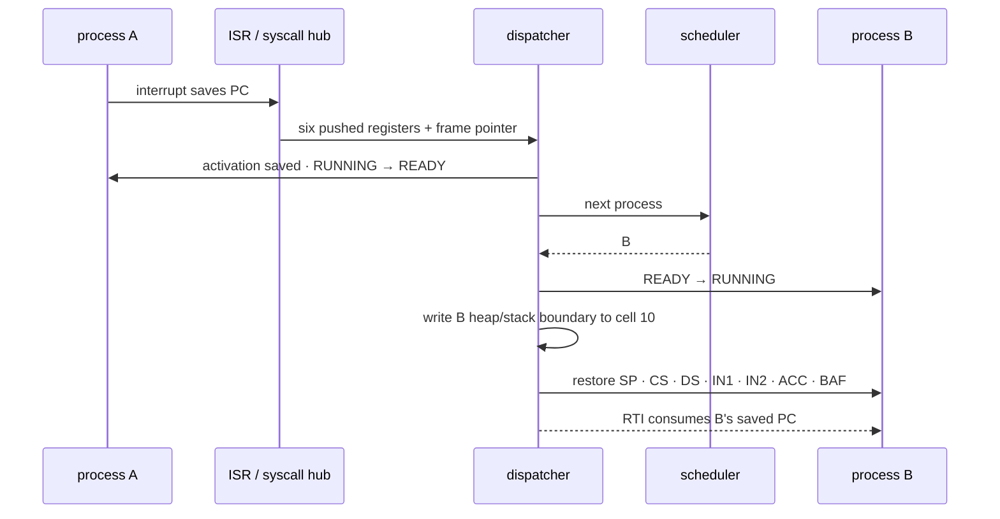

<div class="muted text-xs text-center mt-2">The naked restore hub depends on the documented fixed offset of <span class="mono">activation</span> inside <span class="mono">Process</span>.</div>

---

<!-- SOURCE Pico-OS/README.md#81-process-and-kernel-memory-layouts -->

<div class="eyebrow">8 · Memory management</div>

# Current kernel layout in the 2¹⁸-word SRAM

<div class="mono text-xs muted mt-5 mb-2">relative SRAM offsets · low → high</div>
<div class="memory-bar">
  <div class="memory-segment seg-ivt" style="width:5%">0…3<br>.ivt</div>
  <div class="memory-segment seg-text" style="width:31%">4…32704<br>kernel .text</div>
  <div class="memory-segment seg-data" style="width:9%">32705…33188<br>.data</div>
  <div class="memory-segment seg-heap" style="width:13%">33189…37284<br>kheap</div>
  <div class="memory-segment seg-gap" style="width:11%">stack room</div>
  <div class="memory-segment seg-stack" style="width:7%">SP 40000</div>
  <div class="memory-segment seg-process" style="width:24%">40001…end<br>process-memory heap</div>
</div>

<div class="grid grid-cols-3 gap-4 mt-7 text-xs">
  <div class="card"><span class="mono accent">address tags</span><br>EPROM 00 · periphery 01 · SRAM 10/11</div>
  <div class="card amber-border"><span class="mono amber">kernel stack</span><br>grows down toward final heap cell</div>
  <div class="card green-border"><span class="mono green">process pool</span><br>complete processes + shared backing</div>
</div>

---

<!-- SOURCE Pico-OS/README.md#81-process-and-kernel-memory-layouts and #configurable-process-heap-and-stack -->

<div class="eyebrow">8.1 · One process region</div>

# Text, data, fixed heap, free gap, downward stack

<div class="memory-bar mt-6">
  <div class="memory-segment seg-text" style="width:25%">.text<br>CS = base</div>
  <div class="memory-segment seg-data" style="width:17%">.data<br>DS</div>
  <div class="memory-segment seg-heap" style="width:23%">malloc heap →</div>
  <div class="memory-segment seg-gap" style="width:17%">free gap</div>
  <div class="memory-segment seg-stack" style="width:18%">← stack<br>SP</div>
</div>

<div class="grid grid-cols-2 gap-5 mt-7">
  <div class="card">
    <div class="mono text-xs leading-7">--heap-size 2000<br>--stack-size 1000<br><br>heap_start = 11621<br>heap end = 13621<br>stack_start = 14621</div>
  </div>
  <div class="card amber-border">
    <div class="grid grid-cols-[7rem_1fr] gap-x-4 gap-y-4 text-sm">
      <span class="mono accent">heap −1</span><span>1000-cell default</span>
      <span class="mono amber">stack −1</span><span>another 1000 cells above heap</span>
      <span class="mono coral">boundary</span><span><span class="mono">heap_start + heap_size − 1</span></span>
    </div>
  </div>
</div>

<div class="muted text-xs text-center mt-5">No MMU, relocation after load, or per-process access protection.</div>

---

<!-- SOURCE Pico-OS/README.md#82-heap-implementation and #83-free-and-block-merging -->

<div class="eyebrow">8.2–8.3 · Heap implementation</div>

# First-fit allocation, splitting, and coalescing

<div class="grid grid-cols-[.7fr_1.3fr] gap-5 mt-5">
  <div class="card">
    <div class="mono text-xs leading-7">struct BlockHeader {<br>&nbsp;&nbsp;int size;<br>&nbsp;&nbsp;bool free;<br>&nbsp;&nbsp;BlockHeader *next;<br>};</div>
    <div class="muted text-xs mt-4">All sizes are RETI cells; no byte-alignment step.</div>
  </div>
  <div>
    <div class="memory-bar h-12">
      <div class="memory-segment seg-data" style="width:22%">header · size 4</div>
      <div class="memory-segment seg-process" style="width:26%">allocated · 4</div>
      <div class="memory-segment seg-data" style="width:22%">header · size 5</div>
      <div class="memory-segment seg-heap" style="width:30%">free · 5</div>
    </div>
    <div class="timeline mt-7" style="grid-template-columns:repeat(4,1fr)">
      <div class="timeline-step"><b>scan</b><br>first large free block</div>
      <div class="timeline-step"><b>split</b><br>header + ≥1 cell</div>
      <div class="timeline-step"><b>free</b><br>mark block</div>
      <div class="timeline-step"><b>merge</b><br>all adjacent free runs</div>
    </div>
  </div>
</div>

<div class="muted text-xs text-center mt-5"><span class="mono">realloc</span> shrinks/splits in place, grows into the next free block, or allocates/copies/frees.</div>

---

<!-- SOURCE Pico-OS/README.md#84-process-memory-allocation and #85-shared-memory -->

<div class="eyebrow">8.4–8.5 · Three heaps and shared memory</div>

# The same allocator manages three different scopes

<div class="grid grid-cols-3 gap-4 mt-5 text-xs">
  <div class="card"><span class="mono accent">kmalloc</span><h3 class="mt-2">kernel heap</h3><div class="muted mt-2">PCB · paths · descriptors · shared metadata</div></div>
  <div class="card amber-border"><span class="mono amber">pmalloc</span><h3 class="mt-2">post-kernel SRAM</h3><div class="muted mt-2">complete process regions · shared backing</div></div>
  <div class="card green-border"><span class="mono green">malloc</span><h3 class="mt-2">per-process heap</h3><div class="muted mt-2">library and application allocations</div></div>
</div>

<div class="timeline mt-6" style="grid-template-columns:repeat(5,1fr)">
  <div class="timeline-step"><b>shm_open</b><br>find/create name + ID</div>
  <div class="timeline-step"><b>pmalloc</b><br>backing region</div>
  <div class="timeline-step"><b>mmap</b><br>same absolute address</div>
  <div class="timeline-step"><b>unlink</b><br>remove name, retain refs</div>
  <div class="timeline-step"><b>last exit</b><br>pfree backing</div>
</div>

<div class="muted text-xs text-center mt-5">This is not virtual-memory mapping: lifetime is managed, but access control and mutual exclusion are not.</div>

---

<!-- SOURCE Pico-OS/README.md#91-implemented-libraries -->

<div class="eyebrow">9 · Libraries</div>

# Fourteen application-facing interfaces

<div class="grid grid-cols-2 gap-x-5 gap-y-2 mt-4 text-[10px]">
  <div class="api-row"><b>unistd</b><span>read · write · close · dup2 · lseek · chdir · getcwd · load · run · unload · list</span></div>
  <div class="api-row"><b>stdlib</b><span>malloc · realloc · free · atoi · getenv · setenv · unsetenv · exit</span></div>
  <div class="api-row"><b>fcntl</b><span>open · creat · access/create/truncate/append flags</span></div>
  <div class="api-row"><b>string</b><span>memcpy · memset · strcpy · strcat · strcmp · strncmp · strlen</span></div>
  <div class="api-row"><b>sys/wait</b><span>exact-child waitpid · WIFSTOPPED</span></div>
  <div class="api-row"><b>stdio</b><span>streams · fopen · fclose · fputc · fputs · fprintf · printf · scanf</span></div>
  <div class="api-row"><b>schedule</b><span>yield</span></div>
  <div class="api-row"><b>dirent</b><span>opendir · readdir · closedir</span></div>
  <div class="api-row"><b>mutex</b><span>mutex_init · mutex_lock · mutex_unlock</span></div>
  <div class="api-row"><b>sys/mman</b><span>shm_open · mmap · shm_unlink</span></div>
  <div class="api-row"><b>signal</b><span>signal · kill · default/ignore constants</span></div>
  <div class="api-row"><b>sys/stat</b><span>mkdir</span></div>
  <div class="api-row"><b>sys/prctl</b><span>PR_SET_PDEATHSIG</span></div>
  <div class="api-row"><b>start</b><span>automatic heap/environment initialization before main</span></div>
</div>

---

<!-- SOURCE Pico-OS/README.md#92-library-organization and #93-design-tradeoffs -->

<div class="eyebrow">9.2–9.3 · Library organization and tradeoffs</div>

# Userspace work stays in userspace when possible

<div class="grid grid-cols-[1.1fr_.9fr] gap-5 mt-5">
  <div class="card">
    <div class="grid grid-cols-[7.5rem_1fr] gap-x-4 gap-y-4 text-sm">
      <span class="mono accent">pure userspace</span><span>strings · formatting · environment · <span class="mono">atoi</span> · heap blocks</span>
      <span class="mono amber">kernel wrapper</span><span>stack-local request → pointer in IN1 → number in ACC → <span class="mono">INT 0</span></span>
      <span class="mono green">umbrella unit</span><span><span class="mono">libstdio.picoc</span> includes implementation parts; headers expose the API</span>
    </div>
  </div>
  <div class="card amber-border">
    <div class="mono text-xs leading-6">fixed descriptor / FILE limits<br>one-cell C values<br>no byte alignment<br>small format parsers<br>minimal pointer hardening<br>POSIX-like names ≠ full POSIX</div>
  </div>
</div>

---

<!-- SOURCE Pico-OS/README.md#94-standard-io and #95-variadic-functions-and-the-stack-frame-layout -->

<div class="eyebrow">9.4–9.5 · Standard I/O and variadics</div>

# Formatting is a thin layer over descriptor writes

<div class="grid grid-cols-[1fr_.9fr] gap-6 mt-5">
  <div>

```c {maxHeight:'230px'}
printf("pid=%d name=%s ready=%c %%\n",
       pid, name, 'Y');

FILE *file = fopen("log.txt", "w");
fprintf(file, "result=%d\n", result);
fclose(file);
```

    <div class="flex gap-3 mt-4"><span class="chip">%d</span><span class="chip">%c</span><span class="chip">%s</span><span class="chip">%%</span></div>
  </div>
  <div class="card">
    <div class="mono text-xs leading-7">printf(format, ...)<br>first extra = BAF + 4<br><br>fprintf(stream, format, ...)<br>first extra = BAF + 5<br><br>scanf follows the same ABI</div>
    <div class="muted text-xs mt-4">No standard <span class="mono">va_list</span>; functions read contiguous cells directly.</div>
  </div>
</div>

<div class="muted text-xs text-center mt-4">Implemented: <span class="mono">fopen/fclose/fputc/fputs/fprintf/printf/scanf</span>. Not implemented: <span class="mono">fwrite</span>.</div>

---

<!-- SOURCE Pico-OS/README.md#96-libstart and #97-start-function -->

<div class="eyebrow">9.6–9.7 · `libstart`</div>

# Userspace startup connects the kernel stack ABI to `main`

<div class="timeline mt-7" style="grid-template-columns:repeat(5,1fr)">
  <div class="timeline-step"><b>_start</b><br>naked custom entry</div>
  <div class="timeline-step"><b>heap</b><br>kernel-reported start / size</div>
  <div class="timeline-step"><b>environment</b><br>clone envp after argv</div>
  <div class="timeline-step"><b>main</b><br>argc · argv</div>
  <div class="timeline-step"><b>exit</b><br>syscall 9</div>
</div>

<div class="grid grid-cols-2 gap-5 mt-7 text-sm">
  <div class="card"><span class="mono accent">compiler</span><div class="muted text-xs mt-2"><span class="mono">-C library/start/libstart.picoc</span> puts this <span class="mono">_start</span> first in <span class="mono">.text</span>.</div></div>
  <div class="card amber-border"><span class="mono amber">exit path</span><div class="muted text-xs mt-2">Zombie/removal · exact parent wakeup · SIGCHLD · child cleanup · dispatch.</div></div>
</div>

---

<!-- SOURCE Pico-OS/README.md#10-filesystem and #101-file-descriptor-table and #102-file-descriptors -->

<div class="eyebrow">10 · Filesystem</div>

# Per-process descriptors over host files

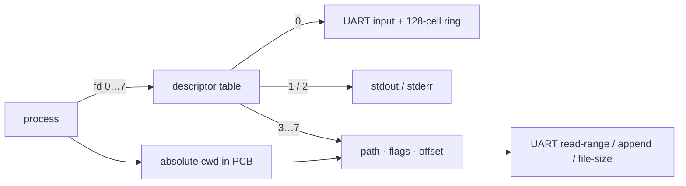

<div class="grid grid-cols-3 gap-4 mt-5 text-xs">
  <div class="card"><div class="metric">8</div><div class="metric-label">descriptors per PCB</div></div>
  <div class="card amber-border"><div class="metric amber">0…2</div><div class="metric-label">copied into child by run()</div></div>
  <div class="card green-border"><div class="metric green">3…7</div><div class="metric-label">private · never inherited</div></div>
</div>

---

<!-- SOURCE Pico-OS/README.md#103-file-operations -->

<div class="eyebrow">10.3 · File operations</div>

# Each call maps to a small kernel/UART mechanism

<div class="grid grid-cols-3 gap-4 mt-5 text-xs">
  <div class="card"><span class="mono accent">open / creat</span><div class="leading-6 mt-2">first free fd ≥ 3<br><span class="mono">file-size</span> existence check<br>create / truncate control frame</div></div>
  <div class="card"><span class="mono amber">read</span><div class="leading-6 mt-2">stdin may block<br>regular file: bounded <span class="mono">read-range</span><br>advance logical offset</div></div>
  <div class="card"><span class="mono green">write</span><div class="leading-6 mt-2">terminal stdout<br>temporary stderr selection<br>regular file always append</div></div>
  <div class="card"><span class="mono accent">lseek</span><div class="leading-6 mt-2">logical read offset only<br><span class="mono">SEEK_END</span> uses file-size</div></div>
  <div class="card"><span class="mono amber">close</span><div class="leading-6 mt-2">fd 3…7 only<br>free path + entry</div></div>
  <div class="card coral-border"><span class="mono coral">deliberate limit</span><div class="leading-6 mt-2">no positioned overwrite<br>even after <span class="mono">lseek</span></div></div>
</div>

---

<!-- SOURCE Pico-OS/README.md#104-output-redirection-with- and #105-dup2 and #106-output-appending-with- -->

<div class="eyebrow">10.4–10.6 · Output redirection</div>

# `>` and `>>` are descriptor-copy workflows

<div class="timeline mt-6" style="grid-template-columns:repeat(6,1fr)">
  <div class="timeline-step"><b>open</b><br>target file</div>
  <div class="timeline-step"><b>save</b><br><span class="mono">dup2(1,7)</span></div>
  <div class="timeline-step"><b>replace</b><br><span class="mono">dup2(fd,1)</span></div>
  <div class="timeline-step"><b>run</b><br>child copies 0…2</div>
  <div class="timeline-step"><b>restore</b><br><span class="mono">dup2(7,1)</span></div>
  <div class="timeline-step"><b>close</b><br>private fd 7</div>
</div>

<div class="grid grid-cols-2 gap-5 mt-7 text-sm">
  <div class="card"><span class="mono accent">&gt;</span><div class="muted text-xs mt-2"><span class="mono">O_WRONLY | O_CREAT | O_TRUNC</span><br>truncate once, then append UART output.</div></div>
  <div class="card amber-border"><span class="mono amber">&gt;&gt;</span><div class="muted text-xs mt-2"><span class="mono">O_WRONLY | O_CREAT | O_APPEND</span><br>same descriptor steps without truncation.</div></div>
</div>

<div class="muted text-xs text-center mt-5"><span class="mono">dup2()</span> deep-copies kind, flags, offset, and path; copies never share an open-file object.</div>

---

<!-- SOURCE Pico-OS/README.md#107-working-directories-and-directory-operations -->

<div class="eyebrow">10.7 · Working directories</div>

# `chdir()` updates only the calling PCB

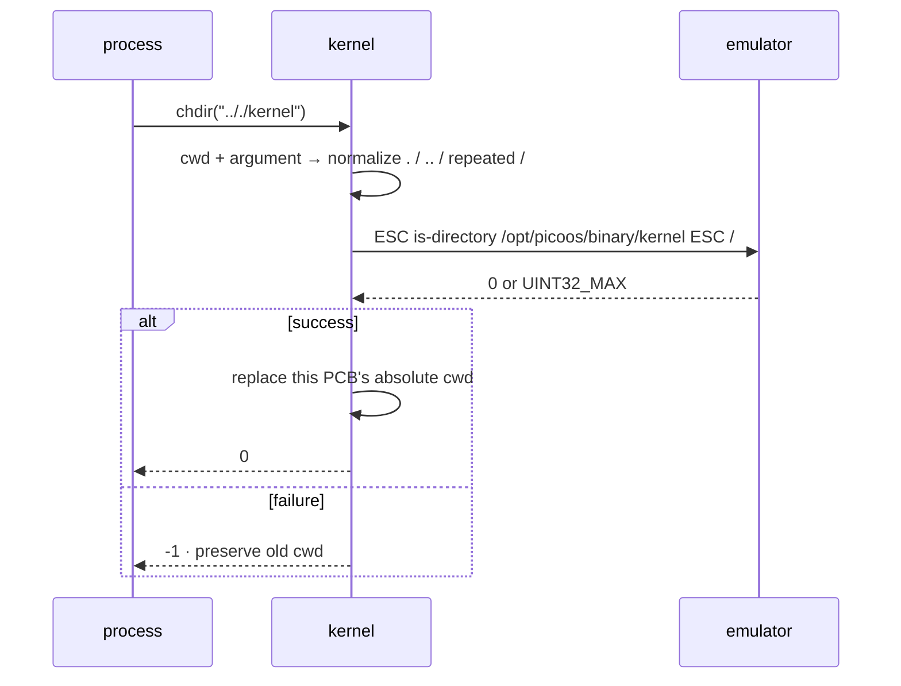

<div class="grid grid-cols-3 gap-4 mt-4 text-xs">
  <div class="card"><span class="mono accent">getcwd</span><br>copy PCB string</div>
  <div class="card amber-border"><span class="mono amber">PID 1</span><br>initializes via <span class="mono">pwd</span> request</div>
  <div class="card green-border"><span class="mono green">dirent</span><br>one bounded listing · d_type + name</div>
</div>

---

<!-- SOURCE Pico-OS/README.md#11-init-process -->

<div class="eyebrow">11 · Init process</div>

# Kernel mechanism, init policy, shell interface

<div class="grid grid-cols-3 gap-4 mt-5 text-sm">
  <div class="card"><span class="mono accent">kernel main</span><div class="muted text-xs leading-6 mt-3">initialize global structures<br>load PID 1<br>dispatch</div></div>
  <div class="card amber-border"><span class="mono amber">init · PID 1</span><div class="muted text-xs leading-6 mt-3">obtain startup cwd<br>read environment policy<br>restart shell</div></div>
  <div class="card green-border"><span class="mono green">shell</span><div class="muted text-xs leading-6 mt-3">parse commands<br>PATH lookup<br>jobs + redirection</div></div>
</div>

<div class="timeline mt-7" style="grid-template-columns:repeat(5,1fr)">
  <div class="timeline-step"><b>pwd</b><br>absolute cwd</div>
  <div class="timeline-step"><b>config</b><br><span class="mono">environment.txt</span></div>
  <div class="timeline-step"><b>load</b><br><span class="mono">./user/shell.bin</span></div>
  <div class="timeline-step"><b>run</b><br>inherit env + fd 0…2</div>
  <div class="timeline-step"><b>waitpid</b><br>exact shell · repeat</div>
</div>

---

<!-- SOURCE Pico-OS/README.md#113-configuration-file through #116-why-init-is-in-the-system-directory -->

<div class="eyebrow">11.3–11.6 · Init details</div>

# `exit` restarts the shell; `poweroff` halts PicoOS

<div class="grid grid-cols-2 gap-5 mt-6">
  <div class="card">
    <div class="mono text-xs accent mb-3">./config/environment.txt</div>
    <div class="terminal"><div class="terminal-body">PATH=./user</div></div>
    <div class="muted text-xs mt-3">Missing, unreadable, oversized, malformed, or allocation failure → init exits status 1.</div>
  </div>
  <div class="card amber-border">
    <div class="mono text-xs amber mb-3">supervision loop</div>
    <div class="mono text-xs leading-7">load shell<br>run shell<br>waitpid(shell_pid)<br>collect status<br>start a fresh shell</div>
  </div>
</div>

<div class="grid grid-cols-2 gap-5 mt-6 text-sm">
  <div><span class="mono accent">system/init.bin</span><div class="muted text-xs mt-2">System policy; direct kernel path; not in PATH.</div></div>
  <div><span class="mono coral">poweroff.bin</span><div class="muted text-xs mt-2">Shutdown syscall; unlike shell <span class="mono">exit</span>.</div></div>
</div>

---

<!-- SOURCE Pico-OS/README.md#121-user-binaries -->

<div class="eyebrow">12.1 · User binaries</div>

# Eleven binaries run as separate processes

<div class="grid grid-cols-4 gap-3 mt-5 text-xs">
  <div class="card"><span class="mono accent">shell.bin</span><br>interactive shell</div>
  <div class="card"><span class="mono accent">echo.bin</span><br>print arguments</div>
  <div class="card"><span class="mono accent">count.bin</span><br>count + yield</div>
  <div class="card"><span class="mono accent">cat.bin</span><br>print files</div>
  <div class="card amber-border"><span class="mono amber">ls.bin</span><br>list directory</div>
  <div class="card amber-border"><span class="mono amber">mkdir.bin</span><br>create directories</div>
  <div class="card amber-border"><span class="mono amber">pwd.bin</span><br>print PCB cwd</div>
  <div class="card amber-border"><span class="mono amber">rm.bin</span><br>remove files</div>
  <div class="card green-border"><span class="mono green">rmdir.bin</span><br>remove empty dirs</div>
  <div class="card green-border"><span class="mono green">kill.bin</span><br>send signal</div>
  <div class="card green-border col-span-2"><span class="mono green">poweroff.bin</span><br>shut PicoOS down</div>
</div>

---

<!-- SOURCE Pico-OS/README.md#122-shell-built-ins -->

<div class="eyebrow">12.2 · Shell built-ins</div>

# Eleven commands execute inside the existing shell

<div class="grid grid-cols-4 gap-3 mt-5 text-xs mono">
  <div class="card">exit</div><div class="card">eval</div><div class="card col-span-2">run-shell-tests</div>
  <div class="card amber-border">export</div><div class="card amber-border">cd</div><div class="card amber-border">load</div><div class="card amber-border">run</div>
  <div class="card green-border">unload</div><div class="card green-border">list</div><div class="card green-border">fg</div><div class="card green-border">bg</div>
</div>

<div class="quote-line mt-7"><span class="mono">cd</span> must be built in: a child can change only its own PCB directory and would exit without changing the shell.</div>

---

<!-- SOURCE Pico-OS/README.md#123-shell and #command-parsing-and-execution -->

<div class="eyebrow">12.3 · Shell</div>

# Shell command parsing—in implementation order

<div class="timeline mt-5" style="grid-template-columns:repeat(6,1fr)">
  <div class="timeline-step"><b>background</b><br>remove trailing <span class="mono">&amp;</span></div>
  <div class="timeline-step"><b>redirection</b><br>final <span class="mono">&gt;</span> / <span class="mono">&gt;&gt;</span></div>
  <div class="timeline-step"><b>split</b><br>command + raw arguments</div>
  <div class="timeline-step"><b>expand</b><br><span class="mono">$NAME · $? · $!</span></div>
  <div class="timeline-step"><b>resolve</b><br>direct path or PATH</div>
  <div class="timeline-step"><b>run</b><br>env + standard fds</div>
</div>

<div class="grid grid-cols-2 gap-5 mt-7 text-sm">
  <div class="card"><span class="mono accent">foreground</span><div class="muted text-xs mt-2">Register terminal owner → exact <span class="mono">waitpid</span> → status in <span class="mono">$?</span>.</div></div>
  <div class="card amber-border"><span class="mono amber">background</span><div class="muted text-xs mt-2">Do not wait → most recent PID in <span class="mono">$!</span> → <span class="mono">fg/bg</span> track one job.</div></div>
</div>

<div class="muted text-xs text-center mt-4">80-cell command buffer; double quotes are removed, not used for full shell tokenization.</div>

---

<!-- SOURCE Pico-OS/README.md#newline-and-line-editing through #parent-death-signal -->

<div class="eyebrow">12.3 · Interactive shell behavior</div>

# Line editing, variables, and process policy

<div class="grid grid-cols-3 gap-4 mt-5 text-xs">
  <div class="card"><span class="mono accent">line editing</span><div class="leading-6 mt-2">CR / LF complete<br>Backspace / Delete erase<br>Ctrl+U line · Ctrl+W word<br>Up / Down history</div></div>
  <div class="card amber-border"><span class="mono amber">environment</span><div class="leading-6 mt-2"><span class="mono">export NAME=value</span><br>right side expands first<br>no interactive <span class="mono">unset</span></div></div>
  <div class="card green-border"><span class="mono green">parent death</span><div class="leading-6 mt-2">shell sets PDEATHSIG<br>children inherit SIGTERM<br>policy—not OS default</div></div>
</div>

<div class="terminal mt-6"><div class="terminal-body">PicoOS&gt; export GREETING=hello<br>PicoOS&gt; echo.bin $GREETING<br>hello<br>PicoOS&gt; echo.bin background &amp;<br>process with pid 4 created</div></div>

---

<!-- SOURCE Pico-OS/README.md#124-echo through #127-host-backed-directory-commands -->

<div class="eyebrow">12.4–12.7 · Standalone command behavior</div>

# Focused commands with explicit limits

<div class="grid grid-cols-4 gap-3 mt-4 text-xs">
  <div class="card"><span class="mono accent">echo.bin</span><br>arguments + newline<br><span class="mono">\n</span> conversion</div>
  <div class="card"><span class="mono accent">count.bin</span><br>busy delay · yield<br>Ctrl+C foreground stop</div>
  <div class="card"><span class="mono accent">cat.bin</span><br>64-cell reads<br>multiple paths</div>
  <div class="card"><span class="mono accent">ls.bin</span><br>files / directories<br>host order</div>
  <div class="card amber-border"><span class="mono amber">mkdir.bin</span><br>create directories</div>
  <div class="card amber-border"><span class="mono amber">pwd.bin</span><br>PCB directory</div>
  <div class="card amber-border"><span class="mono amber">rm.bin</span><br>unlink files</div>
  <div class="card amber-border"><span class="mono amber">rmdir.bin</span><br>empty directories</div>
</div>

<div class="terminal mt-6"><div class="terminal-body">PicoOS&gt; pwd.bin<br>/opt/picoos/binary<br>PicoOS&gt; cd ./user/../kernel<br>PicoOS&gt; pwd.bin<br>/opt/picoos/binary/kernel</div></div>

<div class="muted text-xs text-center mt-4">Configured relative PATH entries remain rooted at the shell’s startup directory, so commands remain discoverable after <span class="mono">cd</span>.</div>

---

<!-- SOURCE Pico-OS/README.md#128-kill through #1210-actionable-command-errors -->

<div class="eyebrow">12.8–12.10 · Signals, shutdown, and errors</div>

# Commands report the failed operation

<div class="grid grid-cols-[.85fr_1.15fr] gap-5 mt-5">
  <div class="card">
    <div class="mono text-xs leading-7">kill.bin 3<br>kill.bin SIGKILL 3<br>kill.bin SIGTERM 3<br>kill.bin 0 3<br><br>poweroff.bin</div>
  </div>
  <div class="terminal"><div class="terminal-body">PicoOS&gt; load<br>error: load requires a path<br>PicoOS&gt; list extra<br>error: list does not accept arguments<br>PicoOS&gt; echo.bin "unfinished<br>error: unmatched double quote</div></div>
</div>

<div class="grid grid-cols-3 gap-4 mt-5 text-xs">
  <div class="card"><span class="mono accent">kill</span><br>specific PID/signal/process errors</div>
  <div class="card amber-border"><span class="mono amber">applications</span><br>short usage + nonzero status</div>
  <div class="card green-border"><span class="mono green">$?</span><br>failure visible to later commands</div>
</div>

---

<!-- SOURCE Pico-OS/README.md#131-real-time-operating-systems-lecture -->

<div class="eyebrow">13 · Use in lectures</div>

# Real-time operating systems concepts in source code

<div class="grid grid-cols-3 gap-4 mt-5 text-xs">
  <div class="card"><span class="mono accent">state</span><div class="leading-6 mt-2">PROCESS_STATE_*<br>process-list scan<br>dispatcher execution</div></div>
  <div class="card"><span class="mono accent">preemption</span><div class="leading-6 mt-2">timer interrupts<br>voluntary yield<br>same context-save path</div></div>
  <div class="card amber-border"><span class="mono amber">waiting</span><div class="leading-6 mt-2">FIFO wait queues<br>sleep(queue)<br>wakeup(queue)</div></div>
  <div class="card amber-border"><span class="mono amber">mutex</span><div class="leading-6 mt-2">atomic TSL<br>sleep instead of spin<br>wake one waiter</div></div>
  <div class="card green-border"><span class="mono green">shared data</span><div class="leading-6 mt-2">shared SRAM address<br>mutual-exclusion test<br>lifetime vs synchronization</div></div>
  <div class="card green-border"><span class="mono green">kernel policy</span><div class="leading-6 mt-2">non-preemptive kernel<br>preempted userspace<br>small handlers return</div></div>
</div>

---

<!-- SOURCE Pico-OS/README.md#132-operating-systems-lecture and #133-exercise-sheets-and-teaching-material -->

<div class="eyebrow">13.2–13.3 · Operating systems teaching</div>

# Trace one mechanism across source, assembly, and machine state

<div class="grid grid-cols-3 gap-4 mt-5 text-sm">
  <div class="card"><span class="mono accent">program image</span><div class="muted text-xs leading-6 mt-2">sections · labels · binary header · relocation bases · initial stack</div></div>
  <div class="card amber-border"><span class="mono amber">process lifetime</span><div class="muted text-xs leading-6 mt-2">parent/child · zombie · waitpid · signals · init · shell</div></div>
  <div class="card green-border"><span class="mono green">interrupt path</span><div class="muted text-xs leading-6 mt-2">IVT · software/hardware interrupt · exception · register save · RTI</div></div>
</div>

<div class="timeline mt-7" style="grid-template-columns:repeat(4,1fr)">
  <div class="timeline-step"><b>PicoC</b><br>readable mechanism</div>
  <div class="timeline-step"><b>.reti_blocks</b><br>symbolic labels</div>
  <div class="timeline-step"><b>.reti / .sections</b><br>resolved layout</div>
  <div class="timeline-step"><b>debug TUI</b><br>live registers + SRAM</div>
</div>

<div class="muted text-xs text-center mt-5">Checked-in examples cover Fibonacci, malloc/free/merging, complete-process first-fit reuse, and compiler pipeline exercises.</div>

---

<!-- SOURCE Pico-OS/README.md#141-testing-across-all-three-repositories -->

<div class="eyebrow">14 · Test system</div>

# 217 default CI scenarios across three repositories

<div class="grid grid-cols-3 gap-5 mt-6 text-center">
  <div class="card"><div class="metric">147</div><h3 class="mt-2">PicoC programs</h3><div class="muted text-xs mt-3">compile → RETI execution → exact output<br>plus applicable GCC reference</div></div>
  <div class="card amber-border"><div class="metric amber">32</div><h3 class="mt-2">RETI programs</h3><div class="muted text-xs mt-3">instructions · interrupts · UART · errors<br>five-second process limit</div></div>
  <div class="card green-border"><div class="metric green">38</div><h3 class="mt-2">PicoOS scenarios</h3><div class="muted text-xs mt-3">libraries · full boots · shell UART input<br>normalized fixture comparison</div></div>
</div>

<div class="card mt-7 text-center"><span class="mono accent text-xl">All passing</span><div class="muted text-xs mt-2">GitHub-hosted Ubuntu 22.04 runners · latest checked 14 August 2026</div></div>

---

<!-- SOURCE Pico-OS/README.md#141-testing-across-all-three-repositories -->

<div class="eyebrow">14.1 · PicoOS test inventory</div>

# 38 tests in three categories

<div class="grid grid-cols-3 gap-5 mt-6">
  <div class="card"><div class="metric">12</div><h3 class="mt-2">library</h3><div class="muted text-xs mt-3">top-level <span class="mono">test/*.picoc</span><br>direct RETI-Emulator run<br>UART-only test ISR table</div></div>
  <div class="card amber-border"><div class="metric amber">17</div><h3 class="mt-2">OS feature</h3><div class="muted text-xs mt-3">launcher directories<br>kernel + init + shell<br>feature scenario</div></div>
  <div class="card green-border"><div class="metric green">9</div><h3 class="mt-2">shell</h3><div class="muted text-xs mt-3">input + expected output<br>commands · files · line editing</div></div>
</div>

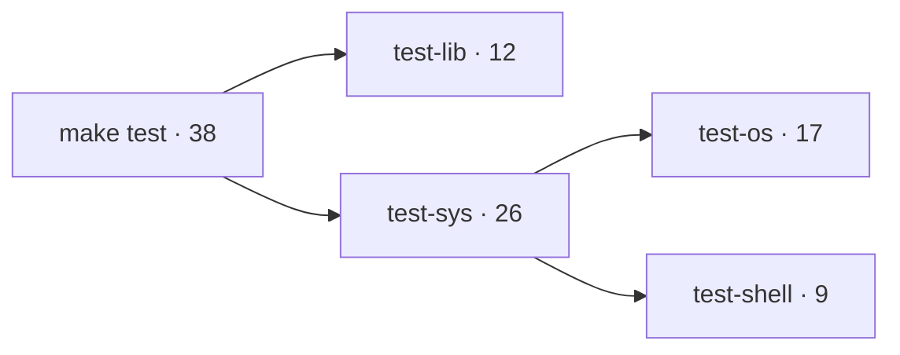

---

<!-- SOURCE Pico-OS/README.md#142-make-test-and-make-test-fast -->

<div class="eyebrow">14.2 · `make test` and `make test-fast`</div>

# Same tests, different boot strategy

<div class="grid grid-cols-2 gap-6 mt-6">
  <div class="card">
    <div class="mono accent mb-4">make test</div>
    <div class="timeline" style="grid-template-columns:repeat(3,1fr)">
      <div class="timeline-step"><b>library</b><br>parallel</div>
      <div class="timeline-step"><b>OS</b><br>fresh boot/test</div>
      <div class="timeline-step"><b>shell</b><br>fresh boot/test</div>
    </div>
  </div>
  <div class="card amber-border">
    <div class="mono amber mb-4">make test-fast</div>
    <div class="timeline" style="grid-template-columns:repeat(3,1fr)">
      <div class="timeline-step"><b>library</b><br>parallel</div>
      <div class="timeline-step"><b>OS</b><br>one shared boot</div>
      <div class="timeline-step"><b>shell</b><br>one shared boot</div>
    </div>
  </div>
</div>

<div class="grid grid-cols-2 gap-5 mt-7 text-xs">
  <div class="card"><span class="mono accent">default</span><br>staged <span class="mono">.reti_blocks/.st</span> with compiler cache metadata</div>
  <div class="card"><span class="mono amber">TEST_BUILD_MODE=direct</span><br>compile merged RETI directly from PicoC sources</div>
</div>

---

<!-- SOURCE Pico-OS/README.md#143-make-test-lib -->

<div class="eyebrow">14.3 · Library tests</div>

# Input, expected output, and dependencies live in the source

<div class="grid grid-cols-[.85fr_1.15fr] gap-6 mt-5">
  <div>

```c {maxHeight:'300px'}
// in: 42 X
// expected:ok 42 Z
// dependencies: ../library/stdio/libstdio.picoc

int main() {
    int value;
    scanf("%d", &value);
    printf("ok %d %c", value, 'Z');
    return 0;
}
```

  </div>
  <div class="timeline" style="grid-template-columns:1fr">
    <div class="timeline-step"><b>parse metadata</b><br>input · output · quoted dependencies</div>
    <div class="timeline-step"><b>compile</b><br>configured PicoC options</div>
    <div class="timeline-step"><b>execute</b><br>RETI-Emulator · five-second timeout</div>
    <div class="timeline-step"><b>compare</b><br>trim trailing whitespace per line</div>
    <div class="timeline-step"><b>report</b><br>test.res + not_passed_tests.txt</div>
  </div>
</div>

---

<!-- SOURCE Pico-OS/README.md#144-system-and-os-tests -->

<div class="eyebrow">14.4 · System and OS tests</div>

# Normal mode: one isolated release-style boot per test

<div class="timeline mt-6" style="grid-template-columns:repeat(6,1fr)">
  <div class="timeline-step"><b>compile</b><br>every test source</div>
  <div class="timeline-step"><b>assemble</b><br>isolated peripheral dir</div>
  <div class="timeline-step"><b>boot</b><br>release bootloader</div>
  <div class="timeline-step"><b>drive</b><br>wait for prompt · inject CR</div>
  <div class="timeline-step"><b>normalize</b><br>render controls · remove UI</div>
  <div class="timeline-step"><b>compare</b><br>output fixture</div>
</div>

<div class="grid grid-cols-2 gap-5 mt-7 text-xs">
  <div class="card"><span class="mono accent">files</span><br><span class="mono">launcher.picoc · worker.picoc · input.txt · expected_output.txt</span></div>
  <div class="card amber-border"><span class="mono amber">artifacts</span><br><span class="mono">raw_output.txt → output.txt</span> · 120-second test limit</div>
</div>

---

<!-- SOURCE Pico-OS/README.md#144-system-and-os-tests -->

<div class="eyebrow">14.4 · Fast OS tests</div>

# One boot, explicit in-system reset between scenarios

<div class="timeline mt-6" style="grid-template-columns:repeat(6,1fr)">
  <div class="timeline-step"><b>manifest</b><br>all test binaries</div>
  <div class="timeline-step"><b>boot once</b><br>release runtime</div>
  <div class="timeline-step"><b>redirect</b><br>stdout → test output</div>
  <div class="timeline-step"><b>run</b><br>launcher + waitpid</div>
  <div class="timeline-step"><b>restore</b><br>stdout + loading-bar env</div>
  <div class="timeline-step"><b>reset</b><br>remove test PCBs/descriptors</div>
</div>

<div class="grid grid-cols-3 gap-4 mt-7 text-xs">
  <div class="card"><span class="mono accent">kept</span><br>init · shell · syscall caller</div>
  <div class="card amber-border"><span class="mono amber">removed</span><br>all other processes + descriptor tables</div>
  <div class="card green-border"><span class="mono green">benefit</span><br>reuse expensive boot while isolating OS state</div>
</div>

---

<!-- SOURCE Pico-OS/README.md#145-shell-tests -->

<div class="eyebrow">14.5 · Shell tests</div>

# Normal UART input; fast in-shell evaluation

<div class="grid grid-cols-2 gap-6 mt-6">
  <div class="card">
    <div class="mono accent mb-3">normal</div>
    <div class="muted text-sm">Inject every <span class="mono">input.txt</span> line through UART exactly as a user would; normalize terminal output.</div>
  </div>
  <div class="card amber-border">
    <div class="mono amber mb-3">fast</div>
    <div class="muted text-sm"><span class="mono">run-shell-tests</span> reads a manifest and calls <span class="mono">eval()</span> per line inside one shell.</div>
  </div>
</div>

<div class="grid grid-cols-5 gap-3 mt-7 text-center text-xs">
  <div class="chip justify-center">clear foreground</div>
  <div class="chip justify-center">remove leftovers</div>
  <div class="chip justify-center">close fd 3…7</div>
  <div class="chip justify-center">restore env + $?/$!</div>
  <div class="chip justify-center">reset expected PIDs</div>
</div>

<div class="quote-line mt-7">The line-editing test still traverses raw UART because <span class="mono">eval()</span> cannot test Backspace and terminal input behavior.</div>

---

<!-- SOURCE Pico-OS/README.md#15-use-of-ai-in-the-project -->

<div class="eyebrow">15 · Use of AI in the project</div>

# AI assisted implementation work—not project ownership

<div class="grid grid-cols-2 gap-6 mt-7">
  <div class="card">
    <div class="mono accent mb-4">assistance</div>
    <div class="muted text-sm leading-7">Makefile and Python test runners<br>repetitive code and test setup<br>refactoring and debugging<br>documentation</div>
  </div>
  <div class="card amber-border">
    <div class="mono amber mb-4">responsibility</div>
    <div class="muted text-sm leading-7">review against all three repositories<br>run the relevant tests<br>own architecture and project scope<br>make the final technical decisions</div>
  </div>
</div>

---

<!-- SOURCE Pico-OS/README.md#16-source-map-and-limitations -->

<div class="eyebrow">16 · Source map</div>

# Where each subsystem begins

<div class="grid grid-cols-2 gap-x-5 gap-y-2 mt-4 text-[10px]">
  <div class="api-row"><b>boot</b><span>bootloader.picoc · process_loader.picoc</span></div>
  <div class="api-row"><b>UART</b><span>uart_hardware.picoc · uart_protocol.picoc</span></div>
  <div class="api-row"><b>IVT / ISR</b><span>os_isrs.picoc</span></div>
  <div class="api-row"><b>processes</b><span>process.header · process.picoc</span></div>
  <div class="api-row"><b>schedule</b><span>scheduler.picoc · dispatcher.picoc</span></div>
  <div class="api-row"><b>exceptions</b><span>exception.picoc</span></div>
  <div class="api-row"><b>memory</b><span>heap.picoc · kmalloc.picoc · pmalloc.picoc</span></div>
  <div class="api-row"><b>files</b><span>kernel/filesystem · library/unistd</span></div>
  <div class="api-row"><b>userspace</b><span>start.picoc · init.picoc · shell.picoc</span></div>
</div>

<div class="timeline mt-7" style="grid-template-columns:repeat(3,1fr)">
  <div class="timeline-step"><b>PicoOS source</b><br>mechanism</div>
  <div class="timeline-step"><b>compiler contract</b><br>layout + ABI</div>
  <div class="timeline-step"><b>emulator contract</b><br>machine behavior</div>
</div>

---

<!-- SOURCE Pico-OS/README.md#16-source-map-and-limitations -->

<div class="eyebrow">16 · Limitations</div>

# Deliberately small, visible design choices

<div class="grid grid-cols-2 gap-x-5 gap-y-3 mt-5 text-xs">
  <div class="card py-3"><span class="mono accent">memory</span><br>one SRAM space · no MMU or isolation</div>
  <div class="card py-3"><span class="mono accent">files</span><br>host-backed UART layer · no resident filesystem</div>
  <div class="card py-3"><span class="mono amber">scheduling</span><br>list scan · non-preemptive kernel</div>
  <div class="card py-3"><span class="mono amber">waiting</span><br>queue sleep · no timed sleep · exact-child waitpid</div>
  <div class="card py-3"><span class="mono green">signals</span><br>five signals · minimal job control</div>
  <div class="card py-3"><span class="mono green">descriptors</span><br>eight per process · copied, not shared</div>
  <div class="card py-3"><span class="mono coral">libraries</span><br>no fwrite · small format parsers · no interactive unset</div>
  <div class="card py-3"><span class="mono coral">semantics</span><br>familiar C/POSIX names without full conformance</div>
</div>

---

<!-- SOURCE Pico-OS/README.md#appendix-inspecting-bin-files-with-hexyl -->

<div class="eyebrow">Appendix · Inspecting `.bin` files</div>

# Look at the exact big-endian image bytes

<div class="terminal mt-7"><div class="terminal-body text-base">$ hexyl -s -64 -n 64 program.bin</div></div>

<div class="grid grid-cols-3 gap-5 mt-7 text-sm">
  <div class="card"><span class="mono accent">-s N</span><div class="muted text-xs mt-2">skip N bytes</div></div>
  <div class="card amber-border"><span class="mono amber">-n N</span><div class="muted text-xs mt-2">show at most N bytes</div></div>
  <div class="card green-border"><span class="mono green">-s -64</span><div class="muted text-xs mt-2">count from the end</div></div>
</div>

<div class="quote-line mt-7">The binary is not opaque: five layout words, then the encoded <span class="mono">.ivt + .text + .data</span> payload.</div>
