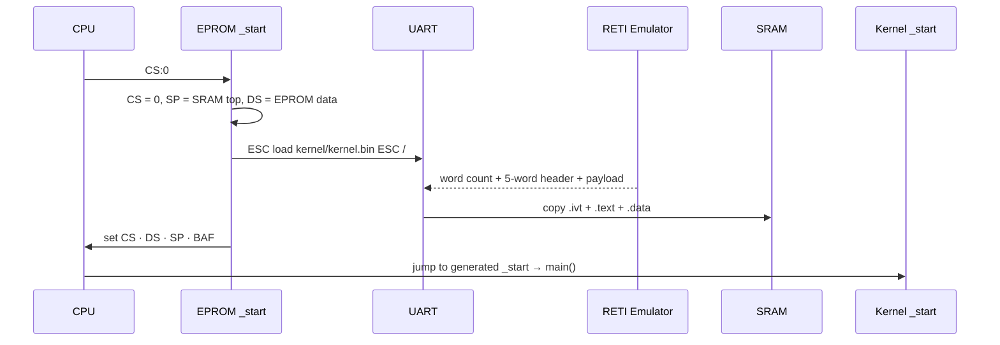
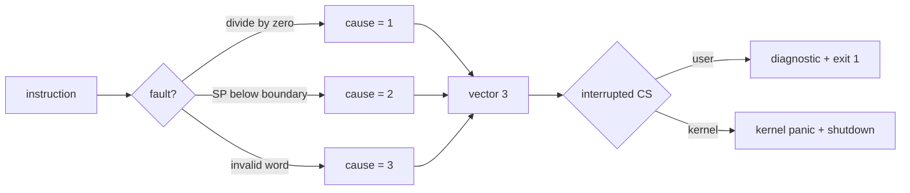
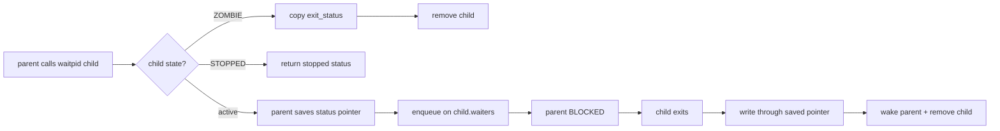
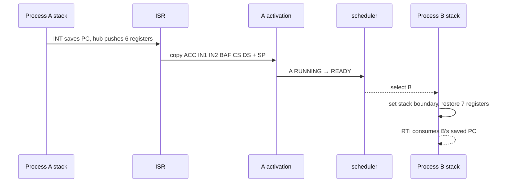
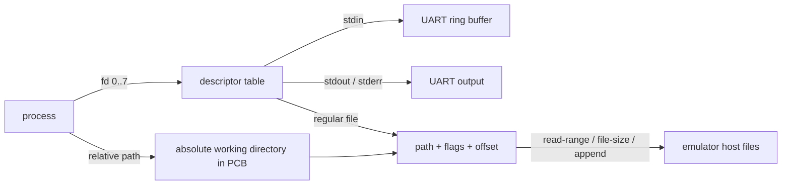
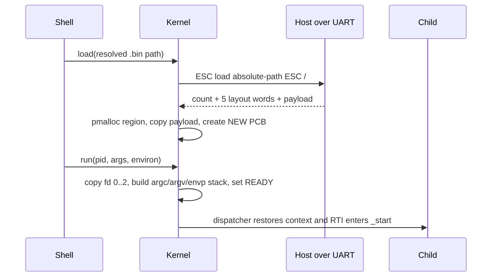

<!-- SOURCE Pico-OS/README.md#picoos — overview and educational purpose -->

<div class="eyebrow mb-5">Master Project Presentation</div>

# Pico-OS

<div class="cover-title mt-2">A complete operating system for the<br><span class="accent">RETI teaching CPU</span></div>

<div class="mt-8 grid grid-cols-2 gap-x-10 gap-y-3 max-w-2xl text-sm">
  <div><span class="accent mono mr-3">01</span>Architecture &amp; scope</div>
  <div><span class="accent mono mr-3">02</span>Boot process</div>
  <div><span class="amber mono mr-3">03</span>Kernel &amp; processes</div>
  <div><span class="green mono mr-3">04</span>Memory &amp; I/O</div>
  <div><span class="coral mono mr-3">05</span>Userspace &amp; shell</div>
  <div><span class="muted mono mr-3">06</span>Integration &amp; tests</div>
</div>

<div class="project-art" aria-label="Pico-OS source is compiled by PicoC-Compiler and assembled and executed by RETI-Emulator">
  <div class="art-trace trace-a"></div><div class="art-trace trace-b"></div><div class="art-trace trace-c"></div>
  <div class="art-node art-os"><b>Pico-OS</b><span>.picoc</span></div>
  <div class="art-node art-compiler"><b>PicoC-Compiler</b><span>RETI + .sections</span></div>
  <div class="art-node art-emulator"><b>RETI-Emulator</b><span>assemble · execute</span></div>
  <div class="art-pulse pulse-a"></div><div class="art-pulse pulse-b"></div>
</div>

<div class="cover-footline"><span>Jürgen Mattheis</span><span>University of Freiburg · Technical Faculty</span></div>

---

<!-- SOURCE Pico-OS/README.md#picoos — educational motivation and lecture concepts -->

<div class="eyebrow">Motivation</div>

# Make operating-system mechanisms inspectable

<div class="grid grid-cols-2 gap-5 mt-5">
  <div class="card">
    <h2 class="text-xl mb-3">Operating systems lecture</h2>
    <div class="grid grid-cols-[6.5rem_1fr] gap-x-3 gap-y-3 items-start text-sm">
      <span class="mono accent">processes</span><span>parent / child · process loading · signals</span>
      <span class="mono accent">interrupts</span><span>vector table · service routines · software + hardware interrupts</span>
      <span class="mono accent">memory</span><span><span class="mono">malloc() / free()</span> · block splitting + merging</span>
    </div>
  </div>
  <div class="card amber-border">
    <h2 class="text-xl mb-3">Real-time operating systems lecture</h2>
    <div class="grid grid-cols-[6.5rem_1fr] gap-x-3 gap-y-3 items-start text-sm">
      <span class="mono amber">state</span><span>process states · scheduling · dispatching</span>
      <span class="mono amber">waiting</span><span><span class="mono">waitpid()</span> · wait-queue <span class="mono">sleep() / wakeup()</span></span>
      <span class="mono amber">coordination</span><span>mutexes · shared memory</span>
    </div>
  </div>
</div>

<div class="grid grid-cols-3 gap-4 mt-5 text-sm">
  <div class="card"><span class="mono accent">process loading</span><div class="mt-2">5-word header → SRAM region → PCB → initial stack</div></div>
  <div class="card amber-border"><span class="mono amber">interrupts</span><div class="mt-2">4-entry <span class="mono">.ivt</span> → naked ISR → saved context → <span class="mono">RTI</span></div></div>
  <div class="card green-border"><span class="mono green">synchronization</span><div class="mt-2">TSL mutex → intrusive FIFO wait queue → dispatcher</div></div>
</div>

---

<!-- SOURCE Pico-OS/README.md#intended-physical-hardware -->

<div class="eyebrow">Intended physical hardware</div>

# Two 16-bit SRAMs are enough for Pico-OS

<div class="grid grid-cols-[.95fr_1.05fr] gap-5 mt-4">
  <div class="grid gap-3">
    <div class="card py-4">
      <div class="flex justify-between gap-4"><div><a href="https://www.digikey.de/short/8cmz0qnc" target="_blank"><b>Alchitry Cu V2 ↗</b></a><div class="muted text-xs mt-1">FPGA board · Lattice iCE40-HX8K</div></div><div class="mono text-lg accent">€55.66</div></div>
    </div>
    <div class="card amber-border py-4">
      <div class="flex justify-between gap-4"><div><a href="https://www.digikey.de/short/075fh38w" target="_blank"><b>ISSI IS61WV25616 SRAM ↗</b></a><div class="muted text-xs mt-1">quantity 2 · each: 2<sup>18</sup> addressable cells × 16 bits</div></div><div class="mono text-lg amber whitespace-nowrap">2 × €5.80</div></div>
    </div>
    <div class="card py-4">
      <div class="flex justify-between gap-4"><div><a href="https://www.digikey.de/short/h83tqvbw" target="_blank"><b>SparkFun Serial Basic ↗</b></a><div class="muted text-xs mt-1">CH340C USB-C to UART adapter</div></div><div class="mono text-lg green">€10.92</div></div>
    </div>
    <div class="flex justify-between px-2 text-sm"><b>Total including VAT</b><b class="mono">€78.18</b></div>
  </div>
  <div class="card amber-border">
    <div class="text-center">
      <div class="mono text-sm">2 × (2<sup>18</sup> cells × 16 bits)</div>
      <div class="metric amber mt-2">2<sup>18</sup> × 32 bits</div>
      <div class="metric-label">262,144 addressable words = 1 MiB</div>
      <div class="muted text-xs mt-2">same 18 address lines · D[15:0] + D[31:16]</div>
    </div>
    <div class="mono text-xs mt-3 leading-6 border-t border-cyan-900/15 pt-2">
      <div class="muted">measured .bin files · five-word headers included</div>
      <div><span class="accent">kernel</span> 37,179 + <span class="amber">init</span> 10,749 + <span class="green">shell</span> 26,129</div>
      <div>= 74,057 resident image words</div>
      <div class="text-sm mt-1">⌊(262,144 − 74,057) ÷ 8,772<sub>cat</sub>⌋ = <span class="amber">21</span></div>
    </div>
    <div class="text-center text-sm mt-2"><span class="accent mono">kernel + init + shell</span> + <span class="green mono">21 × cat.bin images</span></div>
  </div>
</div>

<div class="muted text-xs text-center mt-3">Conservative image-size comparison; each running process additionally needs heap and stack space.</div>

---

<!-- SOURCE Pico-OS/README.md#new-picoos-support-features — PicoC-Compiler Overall Flow -->

<div class="eyebrow">PicoC-Compiler</div>

# Overall flow

```mermaid {scale: 0.74}
flowchart LR
    source[PicoC source]

    subgraph preprocessing[Preprocessing]
        preprocessor[Includes, macros, and line splicing]
        preprocessed[Preprocessed source]
    end

    subgraph frontend[Lexing and parsing]
        tokens[Token stream]
        parse_tree[Tree-sitter parse tree]
        ast[PicoC AST]
    end

    subgraph compilation[Per-file compilation passes]
        shrink[picoc_shrink]
        blocks[picoc_blocks]
        symbol[picoc_symbol]
        typing[picoc_typing]
        anf[picoc_anf]
        reti_blocks[reti_blocks]
    end

    subgraph linking[Program-wide linking passes]
        merge[Merge units, symbols, and startup]
        patch[reti_patch]
        reti[reti]
    end

    output[Flat RETI output]

    source --> preprocessor --> preprocessed --> tokens --> parse_tree --> ast
    ast --> shrink --> blocks --> symbol --> typing --> anf --> reti_blocks
    reti_blocks --> merge --> patch --> reti --> output
```



---

<!-- SOURCE Pico-OS/README.md#new-picoos-support-features — PicoC-Compiler and RETI-Emulator PicoOS support -->

<div class="eyebrow">PicoOS support features</div>

# Compiler and emulator: the essential additions

<div class="grid grid-cols-2 gap-5 mt-4 text-sm">
  <div class="card">
    <div class="chip">PicoC-Compiler</div>
    <div class="grid grid-cols-[7rem_1fr] gap-x-3 gap-y-3 mt-4 items-start">
      <span class="mono accent">source + ABI</span><span><span class="mono">#include</span> · <span class="mono">#pragma once</span> · <span class="mono">typedef</span> · <span class="mono">void *</span> · <span class="mono">int (*fn)(int)</span> · <span class="mono">asm("…")</span></span>
      <span class="mono accent">linking</span><span><span class="mono">-c</span> → <span class="mono">.reti_blocks + .st</span> → staged link · cross-file symbols · cached unchanged units · <span class="mono">--dependency-file</span></span>
      <span class="mono accent">startup</span><span><span class="mono">-C boot.picoc</span> · generated <span class="mono">_start</span> · <span class="mono">__attribute__((naked))</span> · <span class="mono">static inline</span> assembly helpers</span>
      <span class="mono accent">image layout</span><span><span class="mono">.ivt / .text / .data</span> · <span class="mono">IVTE timer_isr</span> · <span class="mono">-O1</span> globals · <span class="mono">.sections</span> · <span class="mono">-k sram</span></span>
      <span class="mono accent">debug</span><span><span class="mono">debug;</span> → <span class="mono">INT 3</span> · <span class="mono">-g</span> source metadata · inspect <span class="mono">*_combined.reti_blocks</span></span>
    </div>
  </div>
  <div class="card green-border">
    <div class="chip">RETI-Emulator</div>
    <div class="grid grid-cols-[7rem_1fr] gap-x-3 gap-y-3 mt-4 items-start">
      <span class="mono green">program image</span><span><span class="mono">.sections</span> layout · raw data words · <span class="mono">--assemble</span> → <span class="mono">.bin</span> with 5-word loader header · <span class="mono">-e boot.reti</span></span>
      <span class="mono green">devices</span><span><span class="mono">TSL S D i</span> · priority interrupt cells <span class="mono">3…8</span> · timer interval cell <span class="mono">9</span> · UART bytes at <span class="mono">0…2</span></span>
      <span class="mono green">kernel I/O</span><span><span class="mono">ESC file-size path ESC /</span> · host file services · interactive UART terminal · receive interrupts</span>
      <span class="mono green">protection</span><span>exception vector <span class="mono">3</span> · cause cell <span class="mono">11</span> · heap/stack boundary cell <span class="mono">10</span> · <span class="mono">-n 4</span> bootloaded vectors</span>
      <span class="mono green">debugger</span><span><span class="mono">d</span> PicoC source + symbols · live register/SRAM edits · code/data view follows <span class="mono">CS / DS</span></span>
    </div>
  </div>
</div>

<div class="muted text-xs text-center mt-4">Full feature lists: <a href="https://github.com/matthejue/PicoC-Compiler/blob/linker_update/documentation/new_features_for_pico_os.md" target="_blank">PicoC-Compiler ↗</a> · <a href="https://github.com/matthejue/RETI-Emulator/blob/statemachine/documentation/new_features_for_pico_os.md" target="_blank">RETI-Emulator ↗</a></div>

---

<!-- SOURCE Pico-OS/README.md#picoos — sibling projects, binary pipeline, and scheduling model -->

<div class="eyebrow">System architecture</div>

# From PicoC source to a running system

<div class="grid grid-cols-[1fr_auto_1fr_auto_1.15fr] items-center gap-4 mt-8">
  <div class="card text-center">
    <span class="chip">PicoC-Compiler</span>
    <div class="mt-5 mono text-sm">PicoC<br>↓<br>RETI + .sections<br>↓<br>5-word header + image</div>
  </div>
  <div class="flow-arrow">→</div>
  <div class="card amber-border text-center">
  <span class="chip">Pico-OS</span>
    <div class="mt-5 text-sm">bootloader<br>kernel<br>libraries<br>init + shell + apps</div>
  </div>
  <div class="flow-arrow">↔</div>
  <div class="card green-border text-center">
    <span class="chip">RETI-Emulator / FPGA</span>
    <div class="mt-5 text-sm">CPU · EPROM · SRAM<br>interrupt controller · timer<br>UART · debugger / serial host</div>
  </div>
</div>

<div class="flex justify-center gap-3 mt-7">
  <span class="chip">compiler-generated memory constants</span>
  <span class="chip">UART host services</span><span class="chip">userspace timer preemption</span>
</div>

---

<!-- SOURCE Pico-OS/README.md#11-loading-and-starting-the-kernel -->

<div class="eyebrow">Boot process</div>

# Loading the kernel from EPROM into SRAM



<div class="grid grid-cols-3 gap-3 mt-1 text-center text-xs">
  <div class="chip justify-center">polling—no interrupts yet</div>
  <div class="chip justify-center">five header words stay out of SRAM</div>
  <div class="chip justify-center">compile-time globals already present</div>
</div>

---

<!-- SOURCE Pico-OS/README.md#12-generated-memory-constants and #13-uart-hardware-interface -->

<div class="eyebrow">Boot process · memory and UART</div>

# Memory constants and UART hardware

<div class="grid grid-cols-[1.15fr_.85fr] gap-6 mt-7">
  <div>
    <div class="memory-bar">
      <div class="memory-segment seg-ivt" style="width:10%">.ivt</div>
      <div class="memory-segment seg-text" style="width:38%">kernel .text<br>CS</div>
      <div class="memory-segment seg-data" style="width:15%">.data<br>DS</div>
      <div class="memory-segment seg-heap" style="width:17%">kheap</div>
      <div class="memory-segment seg-stack" style="width:20%">stack<br>SP ↓</div>
    </div>
    <div class="mt-6 card">
      <div class="mono text-xs muted mb-2">picoc_compiler -k sram</div>
      <div class="grid grid-cols-2 gap-y-2 text-sm mono">
        <span>KERNEL_CS_START</span><span class="accent">.text base</span>
        <span>KERNEL_DS_START</span><span class="amber">.data base</span>
        <span>KERNEL_HEAP_START</span><span class="green">heap boundary</span>
        <span>PROCESS_MEMORY_START</span><span class="coral">post-kernel SRAM</span>
      </div>
    </div>
  </div>
  <div class="card">
    <div class="eyebrow mb-4">periphery base · 2³⁰</div>
    <div class="stack">
      <div class="stack-cell hot"><span>cell 0</span><span>UART send</span></div>
      <div class="stack-cell"><span>cell 1</span><span>UART receive</span></div>
      <div class="stack-cell"><span>cell 2</span><span>ready bits</span></div>
    </div>
    <div class="muted text-xs mt-5">Boot: polling<br>Normal input: hardware interrupt</div>
  </div>
</div>

---

<!-- SOURCE Pico-OS/README.md#14-host-services-over-uart -->

<div class="eyebrow">Host connection · UART protocol</div>

# Accessing host files over UART

<div class="grid grid-cols-3 gap-4 mt-6">
  <div class="card">
    <div class="chip">load</div>
    <div class="mono text-sm mt-5 accent">ESC load path ESC /</div>
    <div class="muted text-xs mt-3">word count + five-word header + payload</div>
  </div>
  <div class="card">
    <div class="chip">files</div>
    <div class="mono text-sm mt-5 amber">read-range · file-size</div>
    <div class="muted text-xs mt-3">write · append · stdout / stderr</div>
  </div>
  <div class="card">
    <div class="chip">directories</div>
    <div class="mono text-sm mt-5 green">pwd · ls · is-directory</div>
    <div class="muted text-xs mt-3">mkdir · unlink · rmdir</div>
  </div>
</div>

<div class="mt-6 card amber-border">
  <div class="flex items-center gap-3 mb-3"><span class="chip">program.bin</span><span class="flow-arrow">→</span><span class="muted text-sm">five big-endian words, then encoded program words</span></div>
  <div class="memory-bar h-14">
    <div class="memory-segment seg-ivt" style="width:11%">CS</div>
    <div class="memory-segment seg-data" style="width:11%">DS</div>
    <div class="memory-segment seg-heap" style="width:12%">heap start</div>
    <div class="memory-segment seg-heap" style="width:12%">heap size</div>
    <div class="memory-segment seg-stack" style="width:12%">stack</div>
    <div class="memory-segment seg-text" style="width:42%">encoded payload</div>
  </div>
  <div class="muted text-xs text-center mt-2">The loader subtracts five and copies only the payload into SRAM.</div>
</div>

---

<!-- SOURCE Pico-OS/README.md#21-kernel-initialization -->

<div class="eyebrow">Kernel startup</div>

# Kernel initialization


<div class="grid grid-cols-3 gap-4 mt-6">
  <div class="card"><div class="metric">1</div><div class="metric-label">first userspace PID</div></div>
  <div class="card"><div class="metric amber">0</div><div class="metric-label">conventional forever loops</div></div>
  <div class="card"><div class="metric green">RTI</div><div class="metric-label">first control transfer</div></div>
</div>

---

<!-- SOURCE Pico-OS/README.md#22-transition-from-bootloading-to-normal-execution -->

<div class="eyebrow">Kernel startup · first user process</div>

# Starting the init process

<div class="grid grid-cols-[1fr_auto_1fr] items-center gap-6 mt-8">
  <div class="card">
    <div class="eyebrow mb-4">kernel context</div>
    <div class="stack">
      <div class="stack-cell"><span>CS</span><span>kernel .text</span></div>
      <div class="stack-cell"><span>DS</span><span>kernel .data</span></div>
      <div class="stack-cell"><span>SP / BAF</span><span>kernel stack</span></div>
      <div class="stack-cell"><span>current</span><span>none</span></div>
    </div>
  </div>
  <div class="flow-arrow text-3xl">RTI →</div>
  <div class="card green-border">
    <div class="eyebrow mb-4">init activation</div>
    <div class="stack">
      <div class="stack-cell"><span>state</span><span class="green">RUNNING</span></div>
      <div class="stack-cell"><span>CS / DS</span><span>process bases</span></div>
      <div class="stack-cell hot"><span>SP + 1</span><span>_start − 1</span></div>
      <div class="stack-cell"><span>RTI advances</span><span>→ _start</span></div>
    </div>
  </div>
</div>

<div class="card mt-7 text-sm"><span class="mono">RTI</span> is used both to return from an interrupt and to start a process.</div>

---

<!-- SOURCE Pico-OS/README.md#31-binary-sections and #32-interrupt-vector-table -->

<div class="eyebrow">Interrupts · vector table</div>

# Interrupt vector table

<div class="memory-bar mt-7">
  <div class="memory-segment seg-ivt" style="width:10%">0<br>syscall</div>
  <div class="memory-segment seg-ivt" style="width:10%">1<br>timer</div>
  <div class="memory-segment seg-ivt" style="width:10%">2<br>UART</div>
  <div class="memory-segment seg-ivt" style="width:10%">3<br>exception</div>
  <div class="memory-segment seg-text" style="width:43%">.text · _start + handlers + kernel</div>
  <div class="memory-segment seg-data" style="width:17%">.data</div>
</div>

```c {1|2-7|all}{lines:true}
__attribute__((section("ivt")))
void (*interrupt_vector_table[4])(void) = {
    syscall_interrupt,
    timer_interrupt,
    uart_interrupt,
    cpu_exception_interrupt
};
```

<div class="flex justify-center gap-3 mt-3 text-xs">
  <span class="chip">INT i saves only PC</span>
  <span class="chip">Pico-OS saves every other live register</span>
  <span class="chip">RTI restores + advances</span>
</div>

---

<!-- SOURCE Pico-OS/README.md#33-interrupt-service-routines and #35-picoc-compiler-support-for-low-level-handlers -->

<div class="eyebrow">Interrupts · low-level handlers</div>

# Interrupt handlers

<div class="grid grid-cols-4 gap-3 mt-9">
  <div class="card text-center"><div class="metric">0</div><h3>syscall</h3><div class="muted text-xs">software<br>switch stacks</div></div>
  <div class="card text-center amber-border"><div class="metric amber">1</div><h3>timer</h3><div class="muted text-xs">hardware<br>schedule users</div></div>
  <div class="card text-center green-border"><div class="metric green">2</div><h3>UART</h3><div class="muted text-xs">hardware<br>complete input</div></div>
  <div class="card text-center coral-border"><div class="metric coral">3</div><h3>exception</h3><div class="muted text-xs">synchronous<br>terminate / panic</div></div>
</div>

<div class="grid grid-cols-2 gap-4 mt-7">
  <div class="card"><span class="chip">section("ivt")</span><div class="mt-3 text-sm">place raw entries and handlers before <span class="mono">.text</span></div></div>
  <div class="card"><span class="chip">naked</span><div class="mt-3 text-sm">suppress prologue and own the exact <span class="mono">INT / RTI</span> layout</div></div>
</div>

---

<!-- SOURCE Pico-OS/README.md#34-exception-handlers and #stack-overflow-boundary -->

<div class="eyebrow">Interrupts · CPU exceptions</div>

# Handling CPU exceptions



<div class="grid grid-cols-3 gap-4 mt-5">
  <div class="card"><div class="metric">10</div><div class="metric-label">boundary periphery cell</div></div>
  <div class="card"><div class="metric amber">11</div><div class="metric-label">read-only cause cell</div></div>
  <div class="card"><div class="metric coral">PC−1</div><div class="metric-label">retry address saved</div></div>
</div>

---

<!-- SOURCE Pico-OS/README.md#36-system-call-handling -->

<div class="eyebrow">Kernel interface · system calls</div>

# Handling system calls with `INT 0`

<div class="grid grid-cols-[1fr_auto_1fr_auto_1fr] items-center gap-4 mt-8">
  <div class="card">
    <div class="eyebrow mb-3">userspace wrapper</div>
    <div class="mono text-sm">ACC = number<br>IN1 = argument<br><span class="accent">INT 0</span></div>
  </div>
  <div class="flow-arrow">→</div>
  <div class="card amber-border">
    <div class="eyebrow mb-3 amber">vector 0 hub</div>
    <div class="mono text-sm">push six registers<br>switch CS · DS · SP</div>
  </div>
  <div class="flow-arrow">→</div>
  <div class="card">
    <div class="eyebrow mb-3">handle_syscall</div>
    <div class="mono text-sm">decode request<br>run the requested kernel code</div>
  </div>
</div>

<div class="grid grid-cols-2 gap-4 mt-5">
  <div class="card green-border"><span class="green mono text-sm">immediate</span><span class="muted text-sm ml-5">IN2 → ACC · restore · RTI</span></div>
  <div class="card coral-border"><span class="coral mono text-sm">block / yield / exit</span><span class="muted text-sm ml-5">save context → dispatcher → another RTI</span></div>
</div>

<div class="flex justify-center gap-3 mt-3">
  <span class="chip">32 syscall numbers · 0…31</span>
  <span class="chip">one scalar or request pointer</span>
  <span class="chip">same hub, different return path</span>
</div>

---

<!-- SOURCE Pico-OS/README.md#37-system-call-arguments-and-stack-frame-layout -->

<div class="eyebrow">Kernel interface · call stack</div>

# Function stack frames and `BAF`

<div class="grid grid-cols-[.8fr_1.2fr] gap-6 mt-6">
  <div class="card">
    <div class="stack">
      <div class="stack-cell free"><span>SP →</span><span>free</span></div>
      <div class="stack-cell"><span>BAF …</span><span>locals</span></div>
      <div class="stack-cell hot"><span>BAF + 1</span><span>old BAF</span></div>
      <div class="stack-cell hot"><span>BAF + 2</span><span>return address</span></div>
      <div class="stack-cell"><span>BAF + 3</span><span>argument 1</span></div>
      <div class="stack-cell"><span>BAF + 4</span><span>argument 2 / variadic</span></div>
    </div>
  </div>
  <div>
    <div class="timeline mt-9">
      <div class="timeline-step"><b>caller</b><br>push args right→left</div>
      <div class="timeline-step"><b>caller</b><br>push continuation</div>
      <div class="timeline-step"><b>callee</b><br>push old BAF</div>
      <div class="timeline-step"><b>callee</b><br>reserve locals</div>
      <div class="timeline-step"><b>epilogue</b><br>restore + jump</div>
    </div>
    <div class="card mt-10 text-sm">Interrupt frames use the same layout and add the registers saved by the interrupt handler.</div>
  </div>
</div>

---

<!-- SOURCE Pico-OS/README.md#38-timer-interrupt and #39-uart-and-keypress-interrupt -->

<div class="eyebrow">Interrupts · hardware events</div>

# Timer and UART interrupts

<div class="grid grid-cols-2 gap-5 mt-7">
  <div class="card amber-border">
    <div class="flex justify-between items-center"><h2>Timer · priority 1</h2><span class="chip">every 1000</span></div>
    <div class="mt-5 mono text-sm">
      <div class="muted">if CS == kernel_CS</div>
      <div class="accent ml-5">restore → RTI</div>
      <div class="muted mt-3">else userspace</div>
      <div class="amber ml-5">save → schedule → RTI</div>
    </div>
  </div>
  <div class="card green-border">
    <div class="flex justify-between items-center"><h2>UART · priority 2</h2><span class="chip">one byte</span></div>
    <div class="mt-5 mono text-sm">
      <div class="muted">pending read?</div>
      <div class="green ml-5">copy result → READY</div>
      <div class="muted mt-3">otherwise</div>
      <div class="accent ml-5">enqueue in 128-cell ring</div>
    </div>
  </div>
</div>

<div class="mt-7 flex justify-center items-center gap-3 mono text-sm">
  <span class="chip">keyboard byte</span><span class="flow-arrow">→</span><span class="chip">UART ISR</span><span class="flow-arrow">→</span><span class="chip">blocked shell READY</span>
</div>

---

<!-- SOURCE Pico-OS/README.md#41-process-table through #44-process-states -->

<div class="eyebrow">Process management</div>

# The process table is a linked list

<div class="flex items-center justify-center gap-3 mt-6">
  <div class="process-node running">PID 1<br>RUNNING</div><span class="flow-arrow">→</span>
  <div class="process-node">PID 2<br>READY</div><span class="flow-arrow">→</span>
  <div class="process-node blocked">PID 3<br>BLOCKED</div><span class="flow-arrow">→</span>
  <div class="process-node stopped">PID 4<br>STOPPED</div>
</div>

<div class="grid grid-cols-4 gap-3 mt-8 text-center">
  <div class="card"><div class="chip">identity</div><div class="mt-3 text-xs muted">pid · parent · path</div></div>
  <div class="card"><div class="chip">memory</div><div class="mt-3 text-xs muted">base · size · heap</div></div>
  <div class="card"><div class="chip">activation</div><div class="mt-3 text-xs muted">7 registers, no PC field</div></div>
  <div class="card"><div class="chip">relations</div><div class="mt-3 text-xs muted">waiters · signals · shared memory</div></div>
</div>

<div class="mt-7 text-center mono text-sm muted">
  NEW → <span class="accent">READY</span> ⇄ <span class="green">RUNNING</span> → <span class="amber">BLOCKED</span> / <span class="coral">STOPPED</span> → ZOMBIE → ∅
</div>

---

<!-- SOURCE Pico-OS/README.md#45-loading-processes through #48-environment-variables -->

<div class="eyebrow">Process management · loading</div>

# Loading a process

<div class="grid grid-cols-[1.25fr_.75fr] gap-6 mt-5">
  <div>
    <div class="timeline mt-6">
      <div class="timeline-step"><b>load</b><br>5-word header</div>
      <div class="timeline-step"><b>pmalloc</b><br>complete region</div>
      <div class="timeline-step"><b>copy</b><br>payload</div>
      <div class="timeline-step"><b>PCB</b><br>state NEW</div>
      <div class="timeline-step"><b>run</b><br>state READY</div>
    </div>
    <div class="card mt-8">
      <div class="mono text-xs muted">defaults: heap_size == -1 · stack_start == -1</div>
      <div class="flex gap-4 mt-3"><span class="chip">1000 heap cells</span><span class="chip">1000 stack cells</span><span class="chip">first-fit region</span></div>
    </div>
  </div>
  <div class="card">
    <div class="stack">
      <div class="stack-cell free"><span>activation.sp</span><span>free</span></div>
      <div class="stack-cell hot"><span>SP + 1</span><span>_start − 1</span></div>
      <div class="stack-cell"><span></span><span>argc</span></div>
      <div class="stack-cell"><span></span><span>argv[] + NULL</span></div>
      <div class="stack-cell"><span></span><span>envp[] + NULL</span></div>
      <div class="stack-cell"><span></span><span>strings ↑</span></div>
    </div>
  </div>
</div>

---

<!-- SOURCE Pico-OS/README.md#51-wait-queues, #53-sleep, #54-wakeup, and #55-blocked-to-ready-transitions -->

<div class="eyebrow">Process coordination · blocking</div>

# Intrusive FIFO wait queues

<div class="grid grid-cols-[.9fr_1.1fr] gap-5 mt-5">
  <div class="card">
    <div class="mono text-xs accent mb-4">struct wait_queue { head; tail; }</div>
    <div class="flex items-center gap-2 text-center">
      <div class="mono text-xs">head<br>↓</div>
      <div class="process-node blocked">PCB A</div><span class="flow-arrow">→</span>
      <div class="process-node blocked">PCB B</div><span class="flow-arrow">→</span>
      <span class="mono muted text-xs">NULL</span>
    </div>
    <div class="mono text-xs text-right mt-2">tail ──────────────↑</div>
    <div class="grid grid-cols-2 gap-3 mt-5 text-xs">
      <div><span class="accent mono">PCB.wait_next</span><br><span class="muted">intrusive next link</span></div>
      <div><span class="accent mono">PCB.waiting_queue_ptr</span><br><span class="muted">one queue per process</span></div>
    </div>
  </div>
  <div class="grid grid-cols-2 gap-3">
    <div class="card py-4">
      <b class="mono accent text-[0.61rem]">enqueue_current_process_<br>on_wait_queue()</b>
      <div class="mono text-xs leading-6 mt-2">tail→wait_next = current<br>tail = current<br>state = BLOCKED<br>dispatcher_switch(...)</div>
    </div>
    <div class="card amber-border py-4">
      <b class="mono amber">wakeup_wait_queue()</b>
      <div class="mono text-xs leading-6 mt-2">p = head<br>head = p→wait_next<br>empty ⇒ tail = NULL<br>clear links · state = READY</div>
    </div>
    <div class="col-span-2 border-t border-cyan-900/15 pt-3 text-sm">
      Queue owners: <span class="mono accent">child.waiters</span> · <span class="mono amber">fd_table.stdin_waiters</span> · <span class="mono green">mutex.waiters</span>
    </div>
  </div>
</div>

---

<!-- SOURCE Pico-OS/README.md#52-waitpid-and-saved-wait-state -->

<div class="eyebrow">Process coordination · waiting</div>

# `waitpid()` before or after the child exits



<div class="flex justify-center gap-3 mt-3">
  <span class="chip">one exact child</span>
  <span class="chip">no wait() wrapper</span>
  <span class="chip">zombie preserves status</span>
</div>

---

<!-- SOURCE Pico-OS/README.md#56-signals and #parent-death-signal -->

<div class="eyebrow">Process coordination · signals</div>

# Signals in Pico-OS

<div class="compact-table mt-5">

| signal | 9 KILL | 15 TERM | 17 CHLD | 18 CONT | 20 TSTP |
|---|---:|---:|---:|---:|---:|
| default | terminate | terminate | ignore | continue | stop |
| catch? | no | yes | yes | yes | yes |

</div>

<div class="grid grid-cols-[1fr_auto_1fr] items-center gap-5 mt-7">
  <div class="card"><span class="chip">shell setup</span><div class="mt-3 mono text-sm">PR_SET_PDEATHSIG<br><span class="amber">SIGTERM</span></div></div>
  <div class="flow-arrow">→ child inherits →</div>
  <div class="card coral-border"><span class="chip">shell child</span><div class="mt-3 text-sm">parent exits<br><span class="coral mono">child gets SIGTERM</span></div></div>
</div>

<div class="muted text-xs text-center mt-5">Ctrl+C → SIGTERM · Ctrl+Z → SIGTSTP for the registered foreground PID; SIGINT and SIGSTOP are deliberately absent.</div>

---

<!-- SOURCE Pico-OS/README.md#6-scheduler -->

<div class="eyebrow">Process scheduling</div>

# Round-robin scheduling

<div class="mono text-sm muted text-center mt-6">global linked process list · scan starts after the current process</div>

<div class="flex items-center justify-center gap-3 mt-5">
  <div class="process-node">A<br><span class="muted">current</span></div><span class="flow-arrow">→</span>
  <div class="process-node blocked">B<br>BLOCKED</div><span class="flow-arrow">→</span>
  <div class="process-node running">C<br>READY ✓</div><span class="flow-arrow">→</span>
  <div class="process-node">D<br>READY</div><span class="flow-arrow">↺</span>
</div>

<div class="timeline mt-8" style="grid-template-columns: repeat(4, 1fr)">
  <div class="timeline-step"><b>begin</b><br><span class="mono">current→next</span></div>
  <div class="timeline-step"><b>scan</b><br>toward the list tail</div>
  <div class="timeline-step"><b>skip</b><br>every state except <span class="mono">READY</span></div>
  <div class="timeline-step"><b>wrap</b><br>to the list head once</div>
</div>

<div class="grid grid-cols-2 gap-8 mt-8 border-t border-cyan-900/15 pt-5 text-sm">
  <div><span class="accent mono">selected</span><div class="mt-1">C changes from <span class="mono">READY</span> to <span class="mono green">RUNNING</span>.</div></div>
  <div><span class="amber mono">no separate ready queue</span><div class="mt-1">Changing a PCB's state to <span class="mono">READY</span> makes it eligible for the next scan.</div></div>
</div>

---

<!-- SOURCE Pico-OS/README.md#7-dispatcher -->

<div class="eyebrow">Context switching</div>

# Saving and restoring process state



<div class="grid grid-cols-2 gap-4 mt-4">
  <div class="card"><span class="chip">PC</span><div class="mt-3 text-sm">remains at <span class="mono accent">activation.sp + 1</span> in process memory</div></div>
  <div class="card"><span class="chip">activation</span><div class="mt-3 text-sm">stores the other seven machine registers</div></div>
</div>

---

<!-- SOURCE Pico-OS/README.md#81-process-and-kernel-memory-layouts -->

<div class="eyebrow">Memory management · layout</div>

# Memory layout and allocators

<div class="mono text-xs muted mt-6 mb-2">SRAM offset · low → high</div>
<div class="memory-bar">
  <div class="memory-segment seg-ivt" style="width:7%">.ivt</div>
  <div class="memory-segment seg-text" style="width:26%">kernel .text</div>
  <div class="memory-segment seg-data" style="width:9%">data</div>
  <div class="memory-segment seg-heap" style="width:13%">kheap<br>4096</div>
  <div class="memory-segment seg-gap" style="width:12%">stack room</div>
  <div class="memory-segment seg-stack" style="width:8%">SP ↓</div>
  <div class="memory-segment seg-process" style="width:25%">process + shared regions</div>
</div>

<div class="mono text-xs muted mt-7 mb-2">one process region</div>
<div class="memory-bar">
  <div class="memory-segment seg-text" style="width:24%">.text · CS</div>
  <div class="memory-segment seg-data" style="width:16%">.data · DS</div>
  <div class="memory-segment seg-heap" style="width:22%">malloc heap →</div>
  <div class="memory-segment seg-gap" style="width:18%">free gap</div>
  <div class="memory-segment seg-stack" style="width:20%">← stack</div>
</div>

<div class="flex justify-center gap-3 mt-7">
  <span class="chip">no MMU</span><span class="chip">no relocation after load</span><span class="chip">boundary catches stack collision</span>
</div>

---

<!-- SOURCE Pico-OS/README.md#82-heap-implementation and #83-free-and-block-merging -->

<div class="eyebrow">Memory management · heap</div>

# Heap allocation and `free()`

```c {1-3|4-10|all}{lines:true}
struct BlockHeader {
    int size; bool free; struct BlockHeader *next;
};
if (block->size >= size + sizeof(struct BlockHeader) + 1) {
    new_block = (struct BlockHeader *)((int *)(block + 1) + size);
    new_block->size = block->size - size - sizeof(struct BlockHeader);
    new_block->free = true;
    new_block->next = block->next;
    block->size = size;
    block->next = new_block;
}
```

<div class="mt-5">
  <div class="memory-bar h-12">
    <div class="memory-segment seg-data" style="width:18%">header · 4</div>
    <div class="memory-segment seg-process" style="width:28%">allocated</div>
    <div class="memory-segment seg-data" style="width:18%">header · 5</div>
    <div class="memory-segment seg-heap" style="width:36%">free</div>
  </div>
  <div class="text-center muted text-xs mt-3">Free scans the list and repeatedly merges adjacent free blocks.</div>
</div>

---

<!-- SOURCE Pico-OS/README.md#84-process-memory-allocation and #85-shared-memory -->

<div class="eyebrow">Memory management · shared memory</div>

# Kernel, process, and application heaps

<div class="grid grid-cols-3 gap-4 mt-5">
  <div class="card"><div class="mono accent">kmalloc</div><h3 class="mt-2">kernel heap</h3><div class="muted text-xs">allocates PCBs, paths, descriptor tables, and shared-memory metadata from the 4096-cell kernel heap</div></div>
  <div class="card amber-border"><div class="mono amber">pmalloc</div><h3 class="mt-2">SRAM regions</h3><div class="muted text-xs">first-fit allocation of complete process images and shared-memory backing after the kernel stack</div></div>
  <div class="card green-border"><div class="mono green">malloc</div><h3 class="mt-2">per-process heap</h3><div class="muted text-xs">same split/merge allocator over the heap_start + heap_size range encoded in the binary</div></div>
</div>

<div class="timeline mt-6" style="grid-template-columns: repeat(5, 1fr)">
  <div class="timeline-step"><b>shm_open</b><br>find/create named kernel record</div>
  <div class="timeline-step"><b>pmalloc</b><br>allocate backing on first create</div>
  <div class="timeline-step"><b>mmap</b><br>attach PCB to record</div>
  <div class="timeline-step"><b>pointer</b><br>return same absolute SRAM address</div>
  <div class="timeline-step"><b>detach</b><br>last attachment frees backing</div>
</div>

<div class="grid grid-cols-2 gap-6 mt-5 text-sm border-t border-cyan-900/15 pt-4">
  <div><span class="mono accent">shm_unlink</span> removes name lookup but preserves backing while attachments remain.</div>
  <div><span class="mono amber">mutex</span> may live in the shared region; its wait queue points directly to kernel-visible PCBs.</div>
</div>

---

<!-- SOURCE Pico-OS/README.md#91-implemented-libraries -->

<div class="eyebrow">Userspace runtime · public API</div>

# 14 implemented library interfaces

<div class="grid grid-cols-2 gap-x-5 gap-y-2 mt-4 text-xs">
  <div class="api-row"><b>unistd</b><span>read · write · close · dup2 · lseek · chdir · getcwd · unlink · rmdir · load · run · unload · list · getpid</span></div>
  <div class="api-row"><b>stdlib</b><span>malloc · realloc · free · atoi · getenv · setenv · unsetenv · putenv · clearenv · exit</span></div>
  <div class="api-row"><b>fcntl</b><span>open · creat · access/create/truncate/append flags</span></div>
  <div class="api-row"><b>string</b><span>memcpy · memset · strcpy · strcat · strcmp · strncmp · strlen</span></div>
  <div class="api-row"><b>sys/wait</b><span>waitpid · WIFSTOPPED</span></div>
  <div class="api-row"><b>stdio</b><span>stdin/out/err · fopen · fclose · fputc · fputs · fprintf · printf · scanf</span></div>
  <div class="api-row"><b>schedule</b><span>yield</span></div>
  <div class="api-row"><b>dirent</b><span>opendir · readdir · closedir · directory entries</span></div>
  <div class="api-row"><b>mutex</b><span>mutex_init · mutex_lock · mutex_unlock</span></div>
  <div class="api-row"><b>sys/mman</b><span>shm_open · mmap · shm_unlink</span></div>
  <div class="api-row"><b>signal</b><span>signal · kill · default/ignore constants</span></div>
  <div class="api-row"><b>sys/stat</b><span>mkdir</span></div>
  <div class="api-row"><b>sys/prctl</b><span>prctl(PR_SET_PDEATHSIG, signal)</span></div>
  <div class="api-row"><b>start</b><span>automatic heap/environment initialization before main</span></div>
</div>

<div class="muted text-xs text-center mt-3">Application-facing functions only; syscall plumbing, startup helpers, and test hooks are excluded.</div>

---

<!-- SOURCE Pico-OS/README.md#92-library-organization through #97-start-function -->

<div class="eyebrow">Userspace runtime</div>

# Library calls: userspace or `INT 0`

<div class="grid grid-cols-[1.05fr_.95fr] gap-5 mt-5">
  <div class="card">
    <div class="mono text-xs accent mb-3">example: read(fd, buffer, count)</div>
    <div class="mono text-xs leading-6">
      struct IoRequest request;<br>
      request.file_descriptor = fd;<br>
      request.buffer = buffer;<br>
      request.count = count;<br>
      <span class="amber">invoke_syscall(SYSCALL_READ, &amp;request)</span>
    </div>
    <div class="timeline mt-5" style="grid-template-columns: repeat(3, 1fr)">
      <div class="timeline-step"><b>ACC</b><br>syscall number</div>
      <div class="timeline-step"><b>IN1</b><br>request pointer</div>
      <div class="timeline-step"><b>INT 0</b><br>ACC receives result</div>
    </div>
  </div>
  <div class="grid gap-3">
    <div class="card green-border py-4"><b>Pure userspace</b><div class="muted text-sm mt-2">strings · formatting · environment · <span class="mono">atoi</span> · heap block management</div></div>
    <div class="card amber-border py-4"><b>Kernel-backed wrappers</b><div class="muted text-sm mt-2">files · processes · signals · scheduling · shared memory</div></div>
    <div class="card py-4"><b>Automatic startup</b><div class="mono text-xs mt-2">_start → init_process_heap → initialize_environment → main → exit</div></div>
  </div>
</div>

---

<!-- SOURCE Pico-OS/README.md#10-filesystem through #103-file-operations and #107-working-directories-and-directory-operations -->

<div class="eyebrow">Input and output · file descriptors</div>

# How file descriptors use host files



<div class="grid grid-cols-3 gap-4 mt-5">
  <div class="card"><div class="metric">8</div><div class="metric-label">descriptors per process</div></div>
  <div class="card"><div class="metric amber">0–2</div><div class="metric-label">copied into children</div></div>
  <div class="card"><div class="metric green">3–7</div><div class="metric-label">private file slots</div></div>
</div>

<div class="muted text-xs text-center mt-4">Each process has its own absolute working directory; descriptor copies have independent offsets.</div>

---

<!-- SOURCE Pico-OS/README.md#104-output-redirection-with-, #105-dup2, and #106-output-appending-with- -->

<div class="eyebrow">Input and output · shell redirection</div>

# Output redirection with `dup2()`

<div class="timeline mt-6">
  <div class="timeline-step"><b>open target</b><br><span class="mono">fd = open(path, flags)</span></div>
  <div class="timeline-step"><b>save shell stdout</b><br><span class="mono">dup2(1, 7)</span></div>
  <div class="timeline-step"><b>replace stdout</b><br><span class="mono">dup2(fd, 1)</span></div>
  <div class="timeline-step"><b>start child</b><br><span class="mono">run()</span> copies fd 0…2</div>
  <div class="timeline-step"><b>restore shell</b><br><span class="mono">dup2(7, 1)</span></div>
</div>

<div class="grid grid-cols-2 gap-4 mt-6">
  <div class="card">
    <b>Descriptor-table implementation</b>
    <div class="mono text-xs leading-6 mt-2">
      dup2(old, new): free target path<br>
      copy kind · flags · offset · cloned path<br>
      run(): deep-copy shell fd 0…2 into child<br>
      ⇒ restoring the shell cannot change the child
    </div>
  </div>
  <div class="card amber-border">
    <b>UART file implementation</b>
    <div class="mono text-xs leading-6 mt-2">
      &gt;  open flags include O_TRUNC<br>
      kernel sends ESC write path ESC / once<br>
      write(fd): ESC append path ESC / → bytes<br>
      finally ESC write stdout ESC /
    </div>
  </div>
</div>

<div class="mt-4 text-sm text-center">
  <span class="mono amber">&gt;&gt;</span> uses the same descriptor workflow with <span class="mono">O_APPEND</span> and omits the one-time truncate request.
</div>

---

<!-- SOURCE Pico-OS/README.md#11-init-process -->

<div class="eyebrow">Userspace · init process</div>

# Init starts and restarts the shell

<div class="grid grid-cols-[.85fr_1.15fr] gap-5 mt-5">
  <div class="card">
    <div class="mono text-xs accent mb-3">PID 1 initialization</div>
    <div class="mono text-xs leading-6">
      pwd over UART<br>
      → store absolute cwd in PCB<br>
      read config/environment.txt<br>
      → parse NAME=value lines<br>
      → setenv(PATH=./user, ...)
    </div>
  </div>
  <div class="card amber-border">
    <div class="mono text-xs amber mb-3">supervision loop</div>
    <div class="mono text-xs leading-6">
      shell_pid = load("./user/shell.bin")<br>
      run(shell_pid, "", environ)<br>
      waitpid(shell_pid, &amp;status)<br>
      → parent sleeps on shell.waiters<br>
      → shell exit writes status + wakes init<br>
      → repeat with a new shell PCB
    </div>
  </div>
</div>

<div class="muted text-xs text-center mt-5">The kernel starts only init; shell restart policy remains in userspace.</div>

---

<!-- SOURCE Pico-OS/README.md#12-user-applications -->

<div class="eyebrow">Userspace · shell and applications</div>

# How the shell starts a command

<div class="timeline mt-5" style="grid-template-columns: repeat(6, 1fr)">
  <div class="timeline-step"><b>read line</b><br>80-cell buffer + history/editing</div>
  <div class="timeline-step"><b>parse</b><br><span class="mono">&amp;</span> and final <span class="mono">&gt; / &gt;&gt;</span></div>
  <div class="timeline-step"><b>expand</b><br><span class="mono">$NAME · $? · $!</span></div>
  <div class="timeline-step"><b>resolve</b><br>direct path or colon-separated PATH</div>
  <div class="timeline-step"><b>load/run</b><br>new PCB + inherited env/fd 0…2</div>
  <div class="timeline-step"><b>foreground</b><br>register PID + exact <span class="mono">waitpid</span></div>
</div>

<div class="grid grid-cols-[1.2fr_.8fr] gap-5 mt-7">
  <div class="card">
    <div class="mono text-xs leading-6">
      command contains '/' <span class="accent">→ load that path</span><br>
      otherwise <span class="accent">→ try each PATH directory</span><br>
      background <span class="amber">→ store PID in $!; do not wait</span><br>
      foreground <span class="green">→ transfer terminal owner; wait; store status in $?</span>
    </div>
  </div>
  <div class="card amber-border">
    <div class="flex justify-between"><b>11 binaries</b><b>11 built-ins</b></div>
    <div class="muted text-xs mt-3">Built-ins such as <span class="mono">cd</span>, <span class="mono">export</span>, <span class="mono">fg</span>, and <span class="mono">bg</span> run inside the shell because they modify its PCB or state.</div>
  </div>
</div>

---
class: compact-sequence
---

<!-- SOURCE Pico-OS/README.md#13-use-in-the-operating-systems-and-real-time-operating-systems-lectures -->

<div class="eyebrow">Project scope</div>

# Cross-layer trace: a foreground command



<div class="muted text-xs text-center mt-2">On <span class="mono">exit(status)</span>, the kernel writes through the parent's saved wait-status pointer, wakes the shell, and reclaims the child. The full path combines loading, allocation, PCB state, descriptor inheritance, initial-stack ABI, dispatch, waiting, and cleanup.</div>

---

<!-- SOURCE Pico-OS/README.md#14-test-system through #142-make-test-lib -->

<div class="eyebrow">Verification</div>

# How I tested the system

<div class="flex justify-center gap-3 mt-4">
  <span class="chip">12 library</span><span class="chip">17 OS feature</span><span class="chip">9 shell</span><span class="chip">38 total</span>
</div>

<div class="grid grid-cols-2 gap-5 mt-5">
  <div class="card amber-border">
    <h2>Normal OS-backed tests</h2>
    <div class="mono text-xs leading-6 mt-3">
      compile launcher + worker binaries<br>
      → isolated peripheral directory<br>
      → boot release runtime per test<br>
      → wait for prompt; inject input.txt via UART<br>
      → raw_output.txt → normalize → output.txt<br>
      → compare with expected_output.txt
    </div>
  </div>
  <div class="card green-border">
    <h2>Fast OS-backed tests</h2>
    <div class="mono text-xs leading-6 mt-3">
      compile all tests + build manifests<br>
      → boot one release runtime per group<br>
      → shell eval or in-system launcher.bin<br>
      → redirect each test's stdout to output.txt<br>
      → wait; restore descriptors; reset OS state<br>
      → compare every expected_output.txt
    </div>
  </div>
</div>

<div class="muted text-xs text-center mt-4">Library tests run directly in RETI-Emulator with metadata-defined input, expected output, dependencies, and a five-second timeout.</div>

---

<!-- SOURCE Pico-OS/README.md#143-system-and-os-tests and #144-shell-tests -->

<div class="eyebrow">Verification · test execution</div>

# Fresh boots and fast repeated tests

<div class="grid grid-cols-2 gap-5 mt-5">
  <div class="card amber-border">
    <h2>Normal runner: host isolation</h2>
    <div class="mono text-xs leading-6 mt-3">
      mktemp peripheral directory per emulator<br>
      boot binary/boot/bootloader.reti<br>
      wait for each "Pico-OS&gt; " prompt<br>
      inject input line + carriage return<br>
      capture UART → raw_output.txt<br>
      render controls; strip prompt/loading UI<br>
      compare normalized output.txt
    </div>
  </div>
  <div class="card green-border">
    <h2>Fast runner: in-system isolation</h2>
    <div class="mono text-xs leading-6 mt-3">
      launcher redirects fd 1 to test/output.txt<br>
      load + run launcher.bin; waitpid<br>
      restore fd 1; invoke process-state reset<br>
      remove all test PCBs + descriptor tables<br>
      shell_reset: fd 3…7 · env · $? · $! · PIDs<br>
      next manifest entry uses the same boot
    </div>
  </div>
</div>

<div class="grid grid-cols-2 gap-6 mt-5 text-sm border-t border-cyan-900/15 pt-4">
  <div><span class="mono accent">OS features</span> run through <span class="mono">system/fast_os_test_launcher</span>.</div>
  <div><span class="mono amber">shell tests</span> use the shell's <span class="mono">run-shell-tests</span> built-in; line editing still traverses raw UART.</div>
</div>

---
layout: center
---

<!-- SOURCE Pico-OS/README.md#picoos through #16-source-map-and-limitations — end-to-end synthesis -->

<div class="eyebrow text-center mb-7">End-to-end example</div>

# What happens after a key is pressed

<div class="grid grid-cols-3 gap-4 mt-6 text-sm">
  <div class="card">
    <div class="mono accent">1 · device</div>
    <div class="mono text-xs leading-6 mt-2">host byte → UART R1<br>set R2 receive-ready<br>raise device 2 → vector 2<br>CPU saves interrupted PC</div>
  </div>
  <div class="card amber-border">
    <div class="mono amber">2 · ISR</div>
    <div class="mono text-xs leading-6 mt-2">save six registers<br>read R1; preserve ready bit<br>locate terminal-owner PCB<br>pending read or ring buffer?</div>
  </div>
  <div class="card green-border">
    <div class="mono green">3 · pending read</div>
    <div class="mono text-xs leading-6 mt-2">copy byte to saved buffer<br>activation.acc = count<br>unlink stdin_waiters<br>BLOCKED → READY</div>
  </div>
</div>

<div class="grid grid-cols-[1fr_auto_1fr_auto_1fr] items-center gap-3 mt-7 text-center text-sm">
  <div class="card"><span class="mono">UART ISR</span><div class="muted text-xs mt-2">restore interrupted context with RTI</div></div>
  <span class="flow-arrow">→ later →</span>
  <div class="card"><span class="mono">scheduler</span><div class="muted text-xs mt-2">select READY terminal owner</div></div>
  <span class="flow-arrow">→</span>
  <div class="card"><span class="mono">dispatcher</span><div class="muted text-xs mt-2">restore 7 registers; RTI; read() returns</div></div>
</div>

<div class="muted text-xs text-center mt-4">Terminal ownership moves from shell to foreground child and returns when that child exits or stops.</div>
