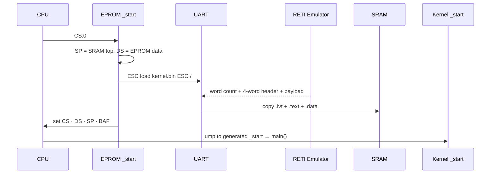
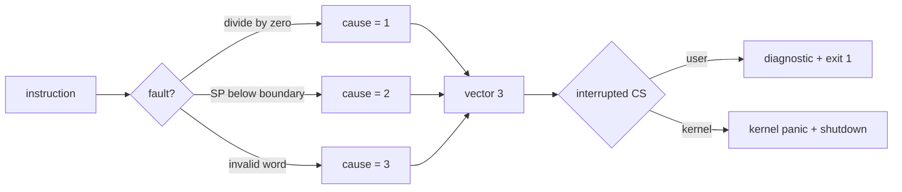
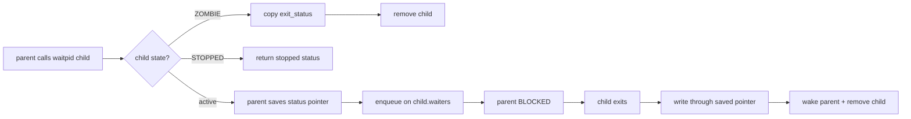
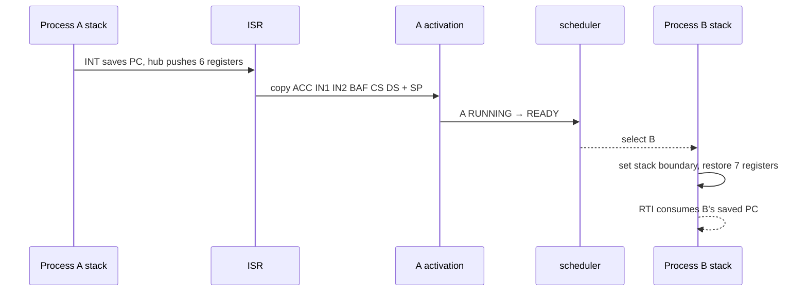
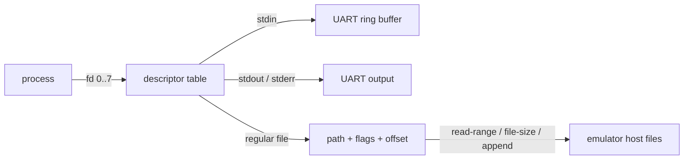

<!-- SOURCE Pico-OS/README.md#picoos — overview and educational purpose -->

<div class="eyebrow mb-5">Master project presentation</div>

# PicoOS

<div class="cover-title mt-2">A complete operating system for the<br><span class="accent">RETI teaching CPU</span></div>

<div class="mt-8 grid grid-cols-2 gap-x-10 gap-y-3 max-w-2xl text-sm">
  <div><span class="accent mono mr-3">01</span>Architecture &amp; scope</div>
  <div><span class="accent mono mr-3">02</span>Boot process</div>
  <div><span class="amber mono mr-3">03</span>Kernel &amp; processes</div>
  <div><span class="green mono mr-3">04</span>Memory &amp; I/O</div>
  <div><span class="coral mono mr-3">05</span>Userspace &amp; shell</div>
  <div><span class="muted mono mr-3">06</span>Integration &amp; tests</div>
</div>

<div class="hero-orbit"></div>
<div class="hero-core">PicoOS</div>

---

<!-- SOURCE Pico-OS/README.md#picoos — three sibling projects and complete-system pipeline -->

<div class="eyebrow">Project result</div>

# What I built

<div class="grid grid-cols-4 gap-3 mt-7 items-stretch text-center">
  <div class="card">
    <div class="metric">boot</div>
    <h3 class="mt-3">Boot path</h3>
    <p class="muted text-xs">EPROM bootloader loads and starts the kernel in SRAM</p>
  </div>
  <div class="card amber-border">
    <div class="metric amber">kernel</div>
    <h3 class="mt-3">Operating system</h3>
    <p class="muted text-xs">interrupts · processes · scheduler · signals · memory</p>
  </div>
  <div class="card green-border">
    <div class="metric green">shell</div>
    <h3 class="mt-3">User environment</h3>
    <p class="muted text-xs">libraries · init · shell · jobs · files · applications</p>
  </div>
  <div class="card coral-border">
    <div class="metric coral">tests</div>
    <h3 class="mt-3">Verification</h3>
    <p class="muted text-xs">library · OS feature · shell · complete boot tests</p>
  </div>
</div>

<div class="card mt-6 text-center text-sm">The result is a bootable system that can run several user programs, handle terminal input, access host files, and be inspected instruction by instruction.</div>

---

<!-- SOURCE Pico-OS/README.md#picoos and #build-and-run — deliberate limits, scheduling model, build entry point -->

<div class="eyebrow">System architecture</div>

# From PicoC source to a running system

<div class="grid grid-cols-[1fr_auto_1fr_auto_1.15fr] items-center gap-4 mt-8">
  <div class="card text-center">
    <span class="chip">PicoC-Compiler</span>
    <div class="mt-5 mono text-sm">PicoC<br>↓<br>RETI + sections<br>↓<br>binary images</div>
  </div>
  <div class="flow-arrow">→</div>
  <div class="card amber-border text-center">
    <span class="chip">PicoOS</span>
    <div class="mt-5 text-sm">bootloader<br>kernel<br>libraries<br>init + shell + apps</div>
  </div>
  <div class="flow-arrow">↔</div>
  <div class="card green-border text-center">
    <span class="chip">RETI-Emulator / FPGA</span>
    <div class="mt-5 text-sm">CPU · EPROM · SRAM<br>interrupt controller · timer<br>UART · debugger / serial host</div>
  </div>
</div>

<div class="flex justify-center gap-3 mt-7">
  <span class="chip">32-bit cells</span><span class="chip">262,144 SRAM words</span>
  <span class="chip">UART host services</span><span class="chip">timer preemption</span>
</div>

---
layout: default
---

<!-- SOURCE Pico-OS/README.md#picoos and #build-and-run — master-project contributions -->

<div class="eyebrow">Main contributions</div>

# The parts I designed and connected

<div class="grid grid-cols-2 gap-4 mt-7">
  <div class="card"><span class="chip">CPU → kernel</span><h3 class="mt-3">Low-level execution</h3><div class="muted text-sm">bootloading · interrupt vector table · handlers · system calls · exceptions</div></div>
  <div class="card amber-border"><span class="chip">kernel</span><h3 class="mt-3">Process system</h3><div class="muted text-sm">process lifecycle · scheduling · dispatching · blocking · waiting · signals</div></div>
  <div class="card green-border"><span class="chip">memory + I/O</span><h3 class="mt-3">Runtime services</h3><div class="muted text-sm">three allocators · shared memory · descriptors · host-backed files · UART input</div></div>
  <div class="card coral-border"><span class="chip">userspace</span><h3 class="mt-3">Usable operating system</h3><div class="muted text-sm">startup runtime · libraries · init · shell · job control · applications · tests</div></div>
</div>

---

<!-- SOURCE Pico-OS/README.md#11-loading-and-starting-the-kernel -->

<div class="eyebrow">Boot process</div>

# Loading the kernel from EPROM into SRAM



<div class="grid grid-cols-3 gap-3 mt-1 text-center text-xs">
  <div class="chip justify-center">polling—no interrupts yet</div>
  <div class="chip justify-center">header stays off the process image</div>
  <div class="chip justify-center">compile-time globals already present</div>
</div>

---

<!-- SOURCE Pico-OS/README.md#12-generated-memory-constants and #13-uart-hardware-interface -->

<div class="eyebrow">Boot process · memory and UART</div>

# Memory constants and UART hardware

<div class="grid grid-cols-[1.15fr_.85fr] gap-6 mt-7">
  <div>
    <div class="memory-bar">
      <div class="memory-segment seg-ivt" style="width:10%">.ivt</div>
      <div class="memory-segment seg-text" style="width:38%">kernel .text<br>CS</div>
      <div class="memory-segment seg-data" style="width:15%">.data<br>DS</div>
      <div class="memory-segment seg-heap" style="width:17%">kheap</div>
      <div class="memory-segment seg-stack" style="width:20%">stack<br>SP ↓</div>
    </div>
    <div class="mt-6 card">
      <div class="mono text-xs muted mb-2">picoc_compiler -k sram</div>
      <div class="grid grid-cols-2 gap-y-2 text-sm mono">
        <span>KERNEL_CS_START</span><span class="accent">.text base</span>
        <span>KERNEL_DS_START</span><span class="amber">.data base</span>
        <span>KERNEL_HEAP_START</span><span class="green">heap boundary</span>
        <span>PROCESS_MEMORY_START</span><span class="coral">post-kernel SRAM</span>
      </div>
    </div>
  </div>
  <div class="card">
    <div class="eyebrow mb-4">periphery base · 2³⁰</div>
    <div class="stack">
      <div class="stack-cell hot"><span>cell 0</span><span>UART send</span></div>
      <div class="stack-cell"><span>cell 1</span><span>UART receive</span></div>
      <div class="stack-cell"><span>cell 2</span><span>ready bits</span></div>
    </div>
    <div class="muted text-xs mt-5">Boot: polling<br>Normal input: hardware interrupt</div>
  </div>
</div>

---

<!-- SOURCE Pico-OS/README.md#14-file-loading-protocol-over-uart -->

<div class="eyebrow">Host connection · UART protocol</div>

# Accessing host files over UART

<div class="grid grid-cols-3 gap-4 mt-7">
  <div class="card">
    <div class="chip">load</div>
    <div class="mono text-sm mt-5 accent">ESC load path ESC /</div>
    <div class="muted text-xs mt-3">word count + exact bytes</div>
  </div>
  <div class="card">
    <div class="chip">read-range</div>
    <div class="mono text-sm mt-5 amber">offset · count · path</div>
    <div class="muted text-xs mt-3">returned count + slice</div>
  </div>
  <div class="card">
    <div class="chip">file-size</div>
    <div class="mono text-sm mt-5 green">path → 32-bit size</div>
    <div class="muted text-xs mt-3">UINT32_MAX = missing</div>
  </div>
</div>

<div class="mt-7 card amber-border">
  <div class="flex items-center gap-3 mb-3"><span class="chip">program.bin</span><span class="flow-arrow">→</span><span class="muted text-sm">four big-endian words, then code/data</span></div>
  <div class="memory-bar h-14">
    <div class="memory-segment seg-ivt" style="width:15%">CS</div>
    <div class="memory-segment seg-data" style="width:15%">DS</div>
    <div class="memory-segment seg-heap" style="width:15%">heap</div>
    <div class="memory-segment seg-stack" style="width:15%">stack</div>
    <div class="memory-segment seg-text" style="width:40%">encoded payload</div>
  </div>
</div>

---

<!-- SOURCE Pico-OS/README.md#21-kernel-initialization -->

<div class="eyebrow">Kernel startup</div>

# Kernel initialization


<div class="grid grid-cols-3 gap-4 mt-6">
  <div class="card"><div class="metric">1</div><div class="metric-label">first userspace PID</div></div>
  <div class="card"><div class="metric amber">0</div><div class="metric-label">conventional forever loops</div></div>
  <div class="card"><div class="metric green">RTI</div><div class="metric-label">first control transfer</div></div>
</div>

---

<!-- SOURCE Pico-OS/README.md#22-transition-from-bootloading-to-normal-execution -->

<div class="eyebrow">Kernel startup · first user process</div>

# Starting the init process

<div class="grid grid-cols-[1fr_auto_1fr] items-center gap-6 mt-8">
  <div class="card">
    <div class="eyebrow mb-4">kernel context</div>
    <div class="stack">
      <div class="stack-cell"><span>CS</span><span>kernel .text</span></div>
      <div class="stack-cell"><span>DS</span><span>kernel .data</span></div>
      <div class="stack-cell"><span>SP / BAF</span><span>kernel stack</span></div>
      <div class="stack-cell"><span>current</span><span>none</span></div>
    </div>
  </div>
  <div class="flow-arrow text-3xl">RTI →</div>
  <div class="card green-border">
    <div class="eyebrow mb-4">init activation</div>
    <div class="stack">
      <div class="stack-cell"><span>state</span><span class="green">RUNNING</span></div>
      <div class="stack-cell"><span>CS / DS</span><span>process bases</span></div>
      <div class="stack-cell hot"><span>SP + 1</span><span>_start − 1</span></div>
      <div class="stack-cell"><span>RTI advances</span><span>→ _start</span></div>
    </div>
  </div>
</div>

<div class="card mt-7 text-sm"><span class="mono">RTI</span> is used both to return from an interrupt and to start a process.</div>

---

<!-- SOURCE Pico-OS/README.md#31-binary-sections and #32-interrupt-vector-table -->

<div class="eyebrow">Interrupts · vector table</div>

# Interrupt vector table

<div class="memory-bar mt-7">
  <div class="memory-segment seg-ivt" style="width:10%">0<br>syscall</div>
  <div class="memory-segment seg-ivt" style="width:10%">1<br>timer</div>
  <div class="memory-segment seg-ivt" style="width:10%">2<br>UART</div>
  <div class="memory-segment seg-ivt" style="width:10%">3<br>exception</div>
  <div class="memory-segment seg-text" style="width:43%">.text · _start + handlers + kernel</div>
  <div class="memory-segment seg-data" style="width:17%">.data</div>
</div>

```c {1|2-7|all}{lines:true}
__attribute__((section("ivt")))
void (*interrupt_vector_table[4])(void) = {
    syscall_interrupt,
    timer_interrupt,
    uart_interrupt,
    cpu_exception_interrupt
};
```

<div class="flex justify-center gap-3 mt-3 text-xs">
  <span class="chip">INT i saves only PC</span>
  <span class="chip">PicoOS saves every other live register</span>
  <span class="chip">RTI restores + advances</span>
</div>

---

<!-- SOURCE Pico-OS/README.md#33-interrupt-service-routines and #35-picoc-compiler-support-for-low-level-handlers -->

<div class="eyebrow">Interrupts · low-level handlers</div>

# Interrupt handlers

<div class="grid grid-cols-4 gap-3 mt-9">
  <div class="card text-center"><div class="metric">0</div><h3>syscall</h3><div class="muted text-xs">software<br>switch stacks</div></div>
  <div class="card text-center amber-border"><div class="metric amber">1</div><h3>timer</h3><div class="muted text-xs">hardware<br>schedule users</div></div>
  <div class="card text-center green-border"><div class="metric green">2</div><h3>UART</h3><div class="muted text-xs">hardware<br>complete input</div></div>
  <div class="card text-center coral-border"><div class="metric coral">3</div><h3>exception</h3><div class="muted text-xs">synchronous<br>terminate / panic</div></div>
</div>

<div class="grid grid-cols-2 gap-4 mt-7">
  <div class="card"><span class="chip">section("ivt")</span><div class="mt-3 text-sm">place raw entries and handlers before <span class="mono">.text</span></div></div>
  <div class="card"><span class="chip">naked</span><div class="mt-3 text-sm">suppress prologue and own the exact <span class="mono">INT / RTI</span> layout</div></div>
</div>

---

<!-- SOURCE Pico-OS/README.md#34-exception-handlers and #stack-overflow-boundary -->

<div class="eyebrow">Interrupts · CPU exceptions</div>

# Handling CPU exceptions



<div class="grid grid-cols-3 gap-4 mt-5">
  <div class="card"><div class="metric">10</div><div class="metric-label">boundary periphery cell</div></div>
  <div class="card"><div class="metric amber">11</div><div class="metric-label">read-only cause cell</div></div>
  <div class="card"><div class="metric coral">PC−1</div><div class="metric-label">retry address saved</div></div>
</div>

---

<!-- SOURCE Pico-OS/README.md#36-system-call-handling -->

<div class="eyebrow">Kernel interface · system calls</div>

# Handling system calls with `INT 0`

<div class="grid grid-cols-[1fr_auto_1fr_auto_1fr] items-center gap-4 mt-8">
  <div class="card">
    <div class="eyebrow mb-3">userspace wrapper</div>
    <div class="mono text-sm">ACC = number<br>IN1 = argument<br><span class="accent">INT 0</span></div>
  </div>
  <div class="flow-arrow">→</div>
  <div class="card amber-border">
    <div class="eyebrow mb-3 amber">vector 0 hub</div>
    <div class="mono text-sm">push six registers<br>switch CS · DS · SP</div>
  </div>
  <div class="flow-arrow">→</div>
  <div class="card">
    <div class="eyebrow mb-3">handle_syscall</div>
    <div class="mono text-sm">decode request<br>run the requested kernel code</div>
  </div>
</div>

<div class="grid grid-cols-2 gap-4 mt-5">
  <div class="card green-border"><span class="green mono text-sm">immediate</span><span class="muted text-sm ml-5">IN2 → ACC · restore · RTI</span></div>
  <div class="card coral-border"><span class="coral mono text-sm">block / yield / exit</span><span class="muted text-sm ml-5">save context → dispatcher → another RTI</span></div>
</div>

<div class="flex justify-center gap-3 mt-3">
  <span class="chip">31 syscall numbers</span>
  <span class="chip">one scalar or request pointer</span>
  <span class="chip">same hub, different return path</span>
</div>

---

<!-- SOURCE Pico-OS/README.md#37-system-call-arguments-and-stack-frame-layout -->

<div class="eyebrow">Kernel interface · call stack</div>

# Function stack frames and `BAF`

<div class="grid grid-cols-[.8fr_1.2fr] gap-6 mt-6">
  <div class="card">
    <div class="stack">
      <div class="stack-cell free"><span>SP →</span><span>free</span></div>
      <div class="stack-cell"><span>BAF …</span><span>locals</span></div>
      <div class="stack-cell hot"><span>BAF + 1</span><span>old BAF</span></div>
      <div class="stack-cell hot"><span>BAF + 2</span><span>return address</span></div>
      <div class="stack-cell"><span>BAF + 3</span><span>argument 1</span></div>
      <div class="stack-cell"><span>BAF + 4</span><span>argument 2 / variadic</span></div>
    </div>
  </div>
  <div>
    <div class="timeline mt-9">
      <div class="timeline-step"><b>caller</b><br>push args right→left</div>
      <div class="timeline-step"><b>caller</b><br>push continuation</div>
      <div class="timeline-step"><b>callee</b><br>push old BAF</div>
      <div class="timeline-step"><b>callee</b><br>reserve locals</div>
      <div class="timeline-step"><b>epilogue</b><br>restore + jump</div>
    </div>
    <div class="card mt-10 text-sm">Interrupt frames use the same layout and add the registers saved by the interrupt handler.</div>
  </div>
</div>

---

<!-- SOURCE Pico-OS/README.md#38-timer-interrupt and #39-uart-and-keypress-interrupt -->

<div class="eyebrow">Interrupts · hardware events</div>

# Timer and UART interrupts

<div class="grid grid-cols-2 gap-5 mt-7">
  <div class="card amber-border">
    <div class="flex justify-between items-center"><h2>Timer · priority 1</h2><span class="chip">every 1000</span></div>
    <div class="mt-5 mono text-sm">
      <div class="muted">if CS == kernel_CS</div>
      <div class="accent ml-5">restore → RTI</div>
      <div class="muted mt-3">else userspace</div>
      <div class="amber ml-5">save → schedule → RTI</div>
    </div>
  </div>
  <div class="card green-border">
    <div class="flex justify-between items-center"><h2>UART · priority 2</h2><span class="chip">one byte</span></div>
    <div class="mt-5 mono text-sm">
      <div class="muted">pending read?</div>
      <div class="green ml-5">copy result → READY</div>
      <div class="muted mt-3">otherwise</div>
      <div class="accent ml-5">enqueue in 128-cell ring</div>
    </div>
  </div>
</div>

<div class="mt-7 flex justify-center items-center gap-3 mono text-sm">
  <span class="chip">keyboard byte</span><span class="flow-arrow">→</span><span class="chip">UART ISR</span><span class="flow-arrow">→</span><span class="chip">blocked shell READY</span>
</div>

---

<!-- SOURCE Pico-OS/README.md#41-process-table through #44-process-states -->

<div class="eyebrow">Process management</div>

# The process table is a linked list

<div class="flex items-center justify-center gap-3 mt-6">
  <div class="process-node running">PID 1<br>RUNNING</div><span class="flow-arrow">→</span>
  <div class="process-node">PID 2<br>READY</div><span class="flow-arrow">→</span>
  <div class="process-node blocked">PID 3<br>BLOCKED</div><span class="flow-arrow">→</span>
  <div class="process-node stopped">PID 4<br>STOPPED</div>
</div>

<div class="grid grid-cols-4 gap-3 mt-8 text-center">
  <div class="card"><div class="chip">identity</div><div class="mt-3 text-xs muted">pid · parent · path</div></div>
  <div class="card"><div class="chip">memory</div><div class="mt-3 text-xs muted">base · size · heap</div></div>
  <div class="card"><div class="chip">activation</div><div class="mt-3 text-xs muted">7 registers, no PC field</div></div>
  <div class="card"><div class="chip">relations</div><div class="mt-3 text-xs muted">waiters · signals · shared memory</div></div>
</div>

<div class="mt-7 text-center mono text-sm muted">
  NEW → <span class="accent">READY</span> ⇄ <span class="green">RUNNING</span> → <span class="amber">BLOCKED</span> / <span class="coral">STOPPED</span> → ZOMBIE → ∅
</div>

---

<!-- SOURCE Pico-OS/README.md#45-loading-processes through #48-environment-variables -->

<div class="eyebrow">Process management · loading</div>

# Loading a process

<div class="grid grid-cols-[1.25fr_.75fr] gap-6 mt-5">
  <div>
    <div class="timeline mt-6">
      <div class="timeline-step"><b>load</b><br>UART header</div>
      <div class="timeline-step"><b>pmalloc</b><br>complete region</div>
      <div class="timeline-step"><b>copy</b><br>payload</div>
      <div class="timeline-step"><b>PCB</b><br>state NEW</div>
      <div class="timeline-step"><b>run</b><br>state READY</div>
    </div>
    <div class="card mt-8">
      <div class="mono text-xs muted">defaults when stack_start == -1</div>
      <div class="flex gap-4 mt-3"><span class="chip">1000 heap cells</span><span class="chip">1000 stack cells</span><span class="chip">first-fit region</span></div>
    </div>
  </div>
  <div class="card">
    <div class="stack">
      <div class="stack-cell free"><span>activation.sp</span><span>free</span></div>
      <div class="stack-cell hot"><span>SP + 1</span><span>_start − 1</span></div>
      <div class="stack-cell"><span></span><span>argc</span></div>
      <div class="stack-cell"><span></span><span>argv[] + NULL</span></div>
      <div class="stack-cell"><span></span><span>envp[] + NULL</span></div>
      <div class="stack-cell"><span></span><span>strings ↑</span></div>
    </div>
  </div>
</div>

---

<!-- SOURCE Pico-OS/README.md#51-wait-queues, #53-sleep, #54-wakeup, and #55-blocked-to-ready-transitions -->

<div class="eyebrow">Process coordination · blocking</div>

# Waiting for an event

<div class="flex items-center justify-center gap-3 mt-6">
  <div class="process-node blocked">A</div><span class="flow-arrow">→</span>
  <div class="process-node blocked">B</div><span class="flow-arrow">→</span>
  <div class="process-node blocked">C</div><span class="flow-arrow">→</span>
  <span class="mono muted text-sm">NULL</span>
</div>

<div class="grid grid-cols-3 gap-4 mt-8">
  <div class="card"><div class="metric">sleep</div><div class="metric-label">append self · BLOCKED · dispatch</div></div>
  <div class="card amber-border"><div class="metric amber">wakeup</div><div class="metric-label">remove one FIFO head · READY</div></div>
  <div class="card green-border"><div class="metric green">event</div><div class="metric-label">child · mutex · UART · signal</div></div>
</div>

<div class="card mt-7 text-sm"><span class="mono">sleep(queue)</span> waits until <span class="mono">wakeup(queue)</span> is called; timer ticks do not end the wait.</div>

---

<!-- SOURCE Pico-OS/README.md#52-waitpid-and-the-preserved-waiting-process-explanation -->

<div class="eyebrow">Process coordination · waiting</div>

# `waitpid()` before or after the child exits



<div class="flex justify-center gap-3 mt-3">
  <span class="chip">one exact child</span>
  <span class="chip">no wait() wrapper</span>
  <span class="chip">zombie preserves status</span>
</div>

---

<!-- SOURCE Pico-OS/README.md#56-signals and #parent-death-signal -->

<div class="eyebrow">Process coordination · signals</div>

# Signals in PicoOS

<div class="compact-table mt-5">

| signal | 9 KILL | 15 TERM | 17 CHLD | 18 CONT | 20 TSTP |
|---|---:|---:|---:|---:|---:|
| default | terminate | terminate | ignore | continue | stop |
| catch? | no | yes | yes | yes | yes |

</div>

<div class="grid grid-cols-[1fr_auto_1fr] items-center gap-5 mt-7">
  <div class="card"><span class="chip">shell setup</span><div class="mt-3 mono text-sm">PR_SET_PDEATHSIG<br><span class="amber">SIGTERM</span></div></div>
  <div class="flow-arrow">→ child inherits →</div>
  <div class="card coral-border"><span class="chip">shell child</span><div class="mt-3 text-sm">parent exits<br><span class="coral mono">child gets SIGTERM</span></div></div>
</div>

<div class="muted text-xs text-center mt-5">Terminal ESC c / ESC z targets the registered foreground PID.</div>

---

<!-- SOURCE Pico-OS/README.md#6-scheduler -->

<div class="eyebrow">Process scheduling</div>

# Round-robin scheduling

<div class="flex items-center justify-center gap-3 mt-8">
  <div class="process-node running">A<br>RUNNING</div><span class="flow-arrow">→</span>
  <div class="process-node">B<br>READY</div><span class="flow-arrow">→</span>
  <div class="process-node blocked">C<br>BLOCKED</div><span class="flow-arrow">→</span>
  <div class="process-node">D<br>READY</div><span class="flow-arrow">↺</span>
</div>

<div class="grid grid-cols-3 gap-4 mt-9">
  <div class="card"><div class="metric">O(n)</div><div class="metric-label">scan PCBs, skip non-runnable</div></div>
  <div class="card"><div class="metric amber">tick</div><div class="metric-label">preempt userspace</div></div>
  <div class="card"><div class="metric green">yield</div><div class="metric-label">same save path, voluntarily</div></div>
</div>

<div class="card mt-7 text-sm">The scheduler selects a ready process. The dispatcher restores its registers and continues it.</div>

---

<!-- SOURCE Pico-OS/README.md#7-dispatcher -->

<div class="eyebrow">Context switching</div>

# Saving and restoring process state



<div class="grid grid-cols-2 gap-4 mt-4">
  <div class="card"><span class="chip">PC</span><div class="mt-3 text-sm">remains at <span class="mono accent">activation.sp + 1</span> in process memory</div></div>
  <div class="card"><span class="chip">activation</span><div class="mt-3 text-sm">stores the other seven machine registers</div></div>
</div>

---

<!-- SOURCE Pico-OS/README.md#81-process-and-kernel-memory-layouts -->

<div class="eyebrow">Memory management · layout</div>

# Memory layout and allocators

<div class="mono text-xs muted mt-6 mb-2">SRAM offset · low → high</div>
<div class="memory-bar">
  <div class="memory-segment seg-ivt" style="width:7%">.ivt</div>
  <div class="memory-segment seg-text" style="width:26%">kernel .text</div>
  <div class="memory-segment seg-data" style="width:9%">data</div>
  <div class="memory-segment seg-heap" style="width:13%">kheap<br>4096</div>
  <div class="memory-segment seg-gap" style="width:12%">stack room</div>
  <div class="memory-segment seg-stack" style="width:8%">SP ↓</div>
  <div class="memory-segment seg-process" style="width:25%">process + shared regions</div>
</div>

<div class="mono text-xs muted mt-7 mb-2">one process region</div>
<div class="memory-bar">
  <div class="memory-segment seg-text" style="width:24%">.text · CS</div>
  <div class="memory-segment seg-data" style="width:16%">.data · DS</div>
  <div class="memory-segment seg-heap" style="width:22%">malloc heap →</div>
  <div class="memory-segment seg-gap" style="width:18%">free gap</div>
  <div class="memory-segment seg-stack" style="width:20%">← stack</div>
</div>

<div class="flex justify-center gap-3 mt-7">
  <span class="chip">no MMU</span><span class="chip">no relocation after load</span><span class="chip">boundary catches stack collision</span>
</div>

---

<!-- SOURCE Pico-OS/README.md#82-heap-implementation and #83-free-and-block-merging -->

<div class="eyebrow">Memory management · heap</div>

# Heap allocation and `free()`

```c {1-3|4-10|all}{lines:true}
struct BlockHeader {
    int size; bool free; struct BlockHeader *next;
};
if (block->size >= size + sizeof(struct BlockHeader) + 1) {
    new_block = (struct BlockHeader *)((int *)(block + 1) + size);
    new_block->size = block->size - size - sizeof(struct BlockHeader);
    new_block->free = true;
    new_block->next = block->next;
    block->size = size;
    block->next = new_block;
}
```

<div class="mt-5">
  <div class="memory-bar h-12">
    <div class="memory-segment seg-data" style="width:18%">header · 4</div>
    <div class="memory-segment seg-process" style="width:28%">allocated</div>
    <div class="memory-segment seg-data" style="width:18%">header · 5</div>
    <div class="memory-segment seg-heap" style="width:36%">free</div>
  </div>
  <div class="text-center muted text-xs mt-3">Free scans the list and repeatedly merges adjacent free blocks.</div>
</div>

---

<!-- SOURCE Pico-OS/README.md#84-process-memory-allocation and #85-shared-memory -->

<div class="eyebrow">Memory management · shared memory</div>

# Kernel, process, and application heaps

<div class="grid grid-cols-3 gap-4 mt-6">
  <div class="card"><div class="metric">k*</div><h3>kernel heap</h3><div class="muted text-xs">PCB · paths · metadata</div></div>
  <div class="card amber-border"><div class="metric amber">p*</div><h3>process memory</h3><div class="muted text-xs">whole regions · shared backing</div></div>
  <div class="card green-border"><div class="metric green">libc</div><h3>user heap</h3><div class="muted text-xs">1000 cells inside each process</div></div>
</div>

<div class="flex justify-center items-center gap-3 mt-7 mono text-sm">
  <span class="chip">shm_open(name)</span><span class="flow-arrow">→</span>
  <span class="chip">ID</span><span class="flow-arrow">→</span>
  <span class="chip">mmap(ID)</span><span class="flow-arrow">→</span>
  <span class="chip">same absolute SRAM address</span>
</div>

<div class="grid grid-cols-2 gap-4 mt-6">
  <div class="card"><b>Lifetime</b><div class="muted text-sm mt-2">unlink hides the name; last attachment frees backing</div></div>
  <div class="card"><b>Synchronization</b><div class="muted text-sm mt-2">shared memory provides storage—mutexes provide order</div></div>
</div>

---

<!-- SOURCE Pico-OS/README.md#9-libraries -->

<div class="eyebrow">Userspace runtime</div>

# How user programs reach the kernel

<div class="grid grid-cols-[1fr_auto_1fr_auto_1fr] items-center gap-4 mt-8">
  <div class="card text-center">
    <div class="metric">apps</div>
    <div class="mt-4 text-sm">shell · utilities<br>student programs</div>
  </div>
  <div class="flow-arrow">→</div>
  <div class="card green-border text-center">
    <div class="metric green">libs</div>
    <div class="mt-4 text-sm">streams · heap · strings<br>processes · signals · mutexes</div>
  </div>
  <div class="flow-arrow">→</div>
  <div class="card amber-border text-center">
    <div class="metric amber">INT 0</div>
    <div class="mt-4 text-sm">one syscall entry<br>request structures<br>result returned in a register</div>
  </div>
</div>

<div class="grid grid-cols-3 gap-3 mt-6 text-center text-sm">
  <div class="card"><b>Pure userspace</b><div class="muted mt-2">strings · formatting · heap management</div></div>
  <div class="card"><b>Kernel services</b><div class="muted mt-2">processes · files · signals · scheduling</div></div>
  <div class="card"><b>Small by design</b><div class="muted mt-2">the complete call path stays understandable</div></div>
</div>

---

<!-- SOURCE Pico-OS/README.md#10-filesystem through #103-file-operations -->

<div class="eyebrow">Input and output · file descriptors</div>

# How file descriptors use host files



<div class="grid grid-cols-3 gap-4 mt-5">
  <div class="card"><div class="metric">8</div><div class="metric-label">descriptors per process</div></div>
  <div class="card"><div class="metric amber">0–2</div><div class="metric-label">copied into children</div></div>
  <div class="card"><div class="metric green">3–7</div><div class="metric-label">private file slots</div></div>
</div>

<div class="muted text-xs text-center mt-4">Copies have independent offsets; there is no shared open-file object.</div>

---

<!-- SOURCE Pico-OS/README.md#104-output-redirection-with-, #105-dup2, and #106-output-appending-with- -->

<div class="eyebrow">Input and output · shell redirection</div>

# Output redirection with `dup2()`

<div class="timeline mt-7">
  <div class="timeline-step"><b>open</b><br>path + flags</div>
  <div class="timeline-step"><b>backup</b><br>dup2(1, 7)</div>
  <div class="timeline-step"><b>redirect</b><br>dup2(fd, 1)</div>
  <div class="timeline-step"><b>run</b><br>copy fd 0..2</div>
  <div class="timeline-step"><b>restore</b><br>dup2(7, 1)</div>
</div>

<div class="grid grid-cols-[1fr_auto_1fr_auto_1fr] items-center gap-3 mt-8 text-center">
  <div class="card"><span class="chip">shell before</span><div class="mono text-sm mt-3">fd 1 → UART</div></div>
  <span class="flow-arrow">→</span>
  <div class="card green-border"><span class="chip">child copy</span><div class="mono text-sm mt-3 green">fd 1 → path</div></div>
  <span class="flow-arrow">→</span>
  <div class="card"><span class="chip">shell after</span><div class="mono text-sm mt-3">fd 1 → UART</div></div>
</div>

<div class="grid grid-cols-2 gap-4 mt-5">
  <div class="card"><span class="metric">&gt;</span><div class="metric-label">truncate first, then append writes</div></div>
  <div class="card"><span class="metric amber">&gt;&gt;</span><div class="metric-label">keep content, append writes</div></div>
</div>

---

<!-- SOURCE Pico-OS/README.md#11-init-process -->

<div class="eyebrow">Userspace · init process</div>

# Init starts and restarts the shell

<div class="grid grid-cols-3 gap-4 mt-6">
  <div class="card"><span class="chip">kernel</span><h3 class="mt-3">start init</h3><div class="muted text-xs">memory · interrupts · load PID 1 · dispatch</div></div>
  <div class="card amber-border"><span class="chip">init</span><h3 class="mt-3">manage the shell</h3><div class="muted text-xs">environment · start shell · exact wait</div></div>
  <div class="card green-border"><span class="chip">shell</span><h3 class="mt-3">interaction</h3><div class="muted text-xs">parse · PATH · jobs · redirection</div></div>
</div>

<div class="mt-7 flex justify-center items-center gap-3 mono text-sm">
  <span class="chip">PATH=./user</span><span class="flow-arrow">→</span>
  <span class="chip">load shell</span><span class="flow-arrow">→</span>
  <span class="chip">waitpid(shell)</span><span class="flow-arrow">↺</span>
</div>

<div class="muted text-xs text-center mt-6">`exit` ends one shell session. `poweroff` invokes the shutdown syscall.</div>

---

<!-- SOURCE Pico-OS/README.md#12-user-applications -->

<div class="eyebrow">Userspace · shell and applications</div>

# Shell commands and programs

<div class="terminal mt-5">
  <div class="terminal-body">
    PicoOS&gt; export NAME=world<br>
    PicoOS&gt; echo "hello $NAME" &gt; greeting.txt<br>
    PicoOS&gt; cat greeting.txt<br>
    <span class="green">hello world</span><br>
    PicoOS&gt; job &amp;&nbsp;&nbsp;<span class="muted"># $! · fg · bg</span>
  </div>
</div>

<div class="grid grid-cols-3 gap-4 mt-6">
  <div class="card"><b>shell</b><div class="muted text-xs mt-2">80 cells · PATH lookup · simple expansion</div></div>
  <div class="card"><b>echo</b><div class="muted text-xs mt-2">arguments + `\n` conversion</div></div>
  <div class="card"><b>cat</b><div class="muted text-xs mt-2">64-cell chunks · robust partial writes</div></div>
</div>

---

<!-- SOURCE Pico-OS/README.md#13-use-in-the-operating-systems-and-real-time-operating-systems-lectures -->

<div class="eyebrow">Project scope</div>

# Operating-system mechanisms working together

<div class="grid grid-cols-2 gap-5 mt-6">
  <div class="card">
    <div class="eyebrow mb-4">Processes and coordination</div>
    <div class="flex flex-wrap gap-2">
      <span class="chip">process states</span><span class="chip">round-robin</span><span class="chip">dispatcher</span>
      <span class="chip">wait queues</span><span class="chip">TSL mutex</span><span class="chip">shared memory</span>
    </div>
  </div>
  <div class="card amber-border">
    <div class="eyebrow mb-4">Machine and kernel</div>
    <div class="flex flex-wrap gap-2">
      <span class="chip">boot + sections</span><span class="chip">process loading</span><span class="chip">signals</span>
      <span class="chip">IVT + ISRs</span><span class="chip">file descriptors</span><span class="chip">heaps</span>
    </div>
  </div>
</div>

<div class="card mt-8 text-sm">These mechanisms are connected in one running system: terminal input can wake a process, the scheduler can select it, and the shell can start another program or redirect its output.</div>

---

<!-- SOURCE Pico-OS/README.md#14-test-system through #142-make-test-lib -->

<div class="eyebrow">Verification</div>

# How I tested the system

<div class="grid grid-cols-3 gap-4 mt-7">
  <div class="card"><div class="metric">lib</div><h3>Libraries</h3><div class="muted text-xs">allocation · strings · formatting · synchronization</div></div>
  <div class="card amber-border"><div class="metric amber">OS</div><h3>Kernel features</h3><div class="muted text-xs">processes · signals · files · memory · exceptions</div></div>
  <div class="card green-border"><div class="metric green">sh</div><h3>Complete shell sessions</h3><div class="muted text-xs">commands · job control · redirection · exact output</div></div>
</div>

<div class="grid grid-cols-2 gap-4 mt-7">
  <div class="terminal"><div class="terminal-body"><span class="muted">$</span> make test<br><span class="muted">lib → OS → shell · fresh boots</span></div></div>
  <div class="terminal"><div class="terminal-body"><span class="muted">$</span> make test-fast<br><span class="muted">lib → shared OS boot → shared shell</span></div></div>
</div>

---

<!-- SOURCE Pico-OS/README.md#143-system-and-os-tests and #144-shell-tests -->

<div class="eyebrow">Verification · test execution</div>

# Fresh boots and fast repeated tests

<div class="grid grid-cols-2 gap-5 mt-6">
  <div class="card amber-border">
    <div class="flex justify-between items-center"><h2>normal</h2><span class="chip">fresh boot / test</span></div>
    <div class="flex items-center gap-2 mt-6 mono text-xs">
      <span class="chip">compile</span><span class="flow-arrow">→</span>
      <span class="chip">boot</span><span class="flow-arrow">→</span>
      <span class="chip">UART</span><span class="flow-arrow">→</span>
      <span class="chip">compare</span>
    </div>
  </div>
  <div class="card green-border">
    <div class="flex justify-between items-center"><h2>fast</h2><span class="chip">one shared boot</span></div>
    <div class="flex items-center gap-2 mt-6 mono text-xs">
      <span class="chip">manifest</span><span class="flow-arrow">→</span>
      <span class="chip">eval / launch</span><span class="flow-arrow">→</span>
      <span class="chip">reset ↺</span>
    </div>
  </div>
</div>

<div class="card mt-5 text-center text-sm">
  <span class="accent">process-state reset</span>
  <span class="muted"> · remove test processes · close private FDs · restore environment · reset PID expectations</span>
</div>

<div class="flex justify-center gap-3 mt-4">
  <span class="chip">raw terminal capture</span>
  <span class="chip">control-character rendering</span>
  <span class="chip">prompt/loading cleanup</span>
  <span class="chip">exact output diff</span>
</div>

---

<!-- SOURCE Pico-OS/README.md#16-source-map-and-deliberate-limitations — project outcome -->

<div class="eyebrow">Project outcome</div>

# The finished PicoOS system

<div class="grid grid-cols-4 gap-3 mt-7 text-center">
  <div class="card"><div class="metric">5</div><div class="metric-label">signals with job control</div></div>
  <div class="card amber-border"><div class="metric amber">8</div><div class="metric-label">file descriptors per process</div></div>
  <div class="card green-border"><div class="metric green">3</div><div class="metric-label">heap users: kernel, loader, apps</div></div>
  <div class="card coral-border"><div class="metric coral">1 MiB</div><div class="metric-label">addressable SRAM</div></div>
</div>

<div class="grid grid-cols-2 gap-4 mt-6 text-sm">
  <div class="card"><b>Runs complete programs</b><div class="muted mt-2">arguments · environment · heap · stack · files · signals · exit status</div></div>
  <div class="card"><b>Works on emulator and planned hardware</b><div class="muted mt-2">the same UART protocol connects the OS to host services</div></div>
  <div class="card"><b>Can be used interactively</b><div class="muted mt-2">shell · applications · background jobs · Ctrl+C / Ctrl+Z · redirection</div></div>
  <div class="card"><b>Can be inspected and tested</b><div class="muted mt-2">instruction debugger · source view · automated library, OS, and shell tests</div></div>
</div>

---
layout: center
---

<!-- SOURCE Pico-OS/README.md#picoos through #16-source-map-and-deliberate-limitations — end-to-end synthesis -->

<div class="eyebrow text-center mb-7">End-to-end example</div>

# What happens after a key is pressed

<div class="flex justify-center items-center gap-2 mt-10 mono text-xs">
  <span class="chip">key</span><span class="flow-arrow">→</span>
  <span class="chip">UART</span><span class="flow-arrow">→</span>
  <span class="chip">ISR</span><span class="flow-arrow">→</span>
  <span class="chip">wait queue</span><span class="flow-arrow">→</span>
  <span class="chip">scheduler</span><span class="flow-arrow">→</span>
  <span class="chip">dispatcher</span><span class="flow-arrow">→</span>
  <span class="chip">shell</span>
</div>

<div class="text-center mt-10 text-xl">This one input passes through interrupt handling, blocking, scheduling, dispatching, and the shell.</div>
