<script setup>
import releaseVersion from './config/presentation-release.txt?raw'
const presentationVersion = releaseVersion.trim()
</script>

<!-- SOURCE Pico-OS/README.md#picoos -->

<div class="eyebrow mb-5">Master Project Presentation</div>

# PicoOS

<div class="cover-title mt-2">An educational operating<br>system toolchain for the<br><span class="accent">OS and RTOS lectures</span></div>

<div class="cover-outline" aria-label="Presentation outline">
  <div class="cover-chapter"><span>01</span><span>Toolchain extensions</span></div>
  <div class="cover-chapter"><span>02</span><span>Boot &amp; kernel startup</span></div>
  <div class="cover-chapter"><span>03</span><span>Interrupts, system calls &amp; exceptions</span></div>
  <div class="cover-chapter"><span>04</span><span>Processes, memory &amp; I/O</span></div>
  <div class="cover-chapter"><span>05</span><span>Shell &amp; user applications</span></div>
  <div class="cover-chapter"><span>06</span><span>Test system</span></div>
  <div class="cover-chapter cover-lecture"><span>07</span><span>Educational Value</span></div>
</div>

<div class="project-art" aria-label="Pico-OS source is compiled by PicoC-Compiler and assembled and executed by RETI-Emulator">
  <div class="art-trace trace-a"></div><div class="art-trace trace-b"></div><div class="art-trace trace-c"></div>
  <div class="art-node art-os"><b>Pico-OS</b><span>.picoc</span></div>
  <div class="art-node art-compiler"><b>PicoC-Compiler</b><span>RETI + .sections</span></div>
  <div class="art-node art-emulator"><b>RETI-Emulator</b><span>assemble · execute</span></div>
  <div class="art-pulse pulse-a"></div><div class="art-pulse pulse-b"></div>
</div>

<div class="cover-footline"><span>Jürgen Mattheis</span><div class="cover-meta"><span>University of Freiburg · Technical Faculty</span><span class="cover-version">{{ presentationVersion }}</span></div></div>


---

<!-- SOURCE Pico-OS/README.md#picoos -->

# PicoOS

<div class="deck-content">

<div class="diagram-panel ">

<div class="visual-label">Source → linked image → runtime</div>

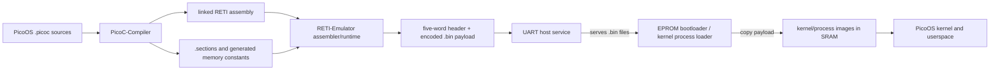

</div><div class="tile-grid cols-3 stat-cards"><div class="card"><div class="metric">14</div><div class="metric-label">libraries</div></div><div class="card"><div class="metric">18</div><div class="metric-label">user applications</div></div><div class="card"><div class="metric">39</div><div class="metric-label">implemented syscalls</div></div></div>

</div>

---

<!-- SOURCE Pico-OS/README.md#intended-physical-hardware -->

# PicoOS

## Intended physical hardware

<div class="deck-content">

<div class="grid grid-cols-[.95fr_1.05fr] gap-5 mt-4">
  <div class="grid gap-3">
    <div class="card py-4">
      <div class="flex justify-between gap-4"><div><a href="https://www.digikey.de/short/8cmz0qnc" target="_blank"><b>Alchitry Cu V2 ↗</b></a><div class="muted text-xs mt-1">FPGA board · Lattice iCE40-HX8K · CPU, interrupt controller, UART controller, and SRAM interface</div></div><div class="mono text-lg accent whitespace-nowrap">€55.66</div></div>
    </div>
    <div class="card amber-border py-4">
      <div class="flex justify-between gap-4"><div><a href="https://www.digikey.de/short/075fh38w" target="_blank"><b>ISSI IS61WV25616 SRAM ↗</b></a><div class="muted text-xs mt-1">quantity 2 · each: 2<sup>18</sup> addressable cells × 16 bits</div></div><div class="mono text-lg amber whitespace-nowrap">2 × €5.80</div></div>
    </div>
    <div class="card py-4">
      <div class="flex justify-between gap-4"><div><a href="https://www.digikey.de/short/h83tqvbw" target="_blank"><b>SparkFun Serial Basic ↗</b></a><div class="muted text-xs mt-1">CH340C USB-C to UART adapter · 3.3 V serial host connection</div></div><div class="mono text-lg green whitespace-nowrap">€10.92</div></div>
    </div>
    <div class="flex justify-between px-2 text-sm"><b>Total including VAT</b><b class="mono">€78.18</b></div>
  </div>
  <div class="card amber-border py-4">
    <div class="text-center">
      <div class="mono text-sm">2 × (2<sup>18</sup> cells × 16 bits)</div>
      <div class="metric amber mt-2">2<sup>18</sup> × 32 bits</div>
      <div class="metric-label">262,144 addressable words = 1 MiB</div>
      <div class="muted text-xs mt-2">same 18 address lines · D[15:0] + D[31:16]</div>
    </div>
    <div class="memory-bar h-10 mt-4">
      <div class="memory-segment seg-text" style="width:33.1%">86,721 resident image words</div>
      <div class="memory-segment seg-process" style="width:66.9%">175,423 words remain</div>
    </div>
    <div class="grid grid-cols-3 gap-2 mt-3 text-center text-[10px] mono">
      <div class="chip justify-center"><span class="accent">kernel</span> 42,464</div>
      <div class="chip justify-center"><span class="amber">init</span> 10,795</div>
      <div class="chip justify-center"><span class="green">shell</span> 33,462</div>
    </div>
    <div class="text-center text-sm mt-3"><span class="accent mono">kernel + init + shell</span> + <span class="green mono">17 × cat.bin images</span></div>
  </div>
</div>

<div class="muted text-xs text-center mt-3">Conservative image-size comparison; each running process additionally needs heap and stack. README prices checked 12 August 2026. Cost excludes USB cables, wires, connectors, PCB, other interconnection hardware, and shipping.</div>

</div>

---

<!-- SOURCE Pico-OS/README.md#reti-execution-model -->

# PicoOS · Intended physical hardware

## RETI execution model

<div class="deck-content">

<div class="data-table">

| High bits | Space | PicoOS use |
| --- | --- | --- |
| 00 | EPROM | Bootloader |
| 01 | Periphery · 0x40000000 | UART · interrupts · timer · boundary · DMA |
| 10 / 11 | SRAM · 0x80000000 | Kernel · images · heaps · stacks |

</div><div class="tile-grid cols-3 "><div class="card"><div class="tile-title">Userspace</div><div class="tile-detail">Timer expiry can dispatch immediately.</div></div><div class="card"><div class="tile-title">Kernel</div><div class="tile-detail">Record expiry; reschedule at syscall return.</div></div><div class="card"><div class="tile-title">Transfers</div><div class="tile-detail">≤1 KiB polling chunks; DMA loads wait for completion.</div></div></div>

</div>

---

<!-- SOURCE Pico-OS/README.md#build-and-run -->

# PicoOS

## Build and run

<div class="deck-content">

<div class="code-panel shell-session shell-session-compact">
<div class="shell-session-bar"><span>Host shell</span><span class="shell-session-caption">build · boot · debugger</span></div>
<pre class="slidev-code"><code><span class="shell-prompt">$</span> <span class="shell-command">make</span> bootload</code></pre>
</div><div class="code-panel shell-session shell-session-compact">
<div class="shell-session-bar"><span>Host shell</span><span class="shell-session-caption">boot · debugger · memory</span></div>
<pre class="slidev-code"><code><span class="shell-prompt">$</span> <span class="shell-command">cd</span> binary
<span class="shell-prompt">$</span> <span class="shell-command">../run_reti_emulator_isolated.sh</span> <span class="shell-operator">-n</span> <span class="shell-output">5</span> <span class="shell-operator">-e</span> ./boot/bootloader.reti <span class="shell-prompt">\</span>
    <span class="shell-operator">-d</span> <span class="shell-operator">-c</span> <span class="shell-operator">-O</span> <span class="shell-operator">-r</span> <span class="shell-output">262144</span> <span class="shell-prompt">\</span>
    <span class="shell-operator">-S</span> kernel/kernel.sections <span class="shell-operator">-D</span> kernel/kernel.debuginfo</code></pre>
</div><div class="tile-grid cols-3 "><div class="card"><div class="tile-title">-n 5 · -r 262144</div><div class="tile-detail">Five IVT cells · 2¹⁸ SRAM words</div></div><div class="card"><div class="tile-title">-e · -O</div><div class="tile-detail">EPROM reset image · initial OS context</div></div><div class="card"><div class="tile-title">-d -c · -S / -D</div><div class="tile-detail">Commented TUI · kernel layout / source metadata</div></div></div>

</div>

---

<!-- SOURCE Pico-OS/README.md#use-the-picoos-shell -->

# PicoOS · Build and run

## Use the PicoOS shell (1)

<div class="deck-content">

<div class="code-panel shell-session shell-session-compact">
<div class="shell-session-bar"><span>Host shell</span><span class="shell-session-caption">terminal · DMA</span></div>
<pre class="slidev-code"><code><span class="shell-prompt">$</span> <span class="shell-command">make</span> bootload-notui
<span class="shell-prompt">$</span> <span class="shell-command">make</span> bootload-notui <span class="shell-operator">DMA=1</span></code></pre>
</div><div class="tile-grid cols-3 "><div class="card"><div class="tile-title">c + Enter</div><div class="tile-detail">Continue in the debugger</div></div><div class="card"><div class="tile-title">V / Ctrl+]</div><div class="tile-detail">Raw UART terminal / return</div></div><div class="card"><div class="tile-title">v / Escape</div><div class="tile-detail">Normal terminal / return</div></div></div><div class="code-panel shell-session shell-session-compact">
<div class="shell-session-bar"><span>PicoOS shell</span><span class="shell-session-caption">init PID 1 · shell PID 2</span></div>
<pre class="slidev-code"><code><span class="shell-prompt">PicoOS&gt;</span> <span class="shell-command">load</span> user/echo.bin
<span class="shell-output">process with pid 3 created</span>
<span class="shell-prompt">PicoOS&gt;</span> <span class="shell-command">run</span> 3 hello PicoOS
<span class="shell-output">hello PicoOS</span></code></pre>
</div><p class="slide-note">load creates NEW; run makes READY and waits. Use the reported PID.</p>

</div>

---

<!-- SOURCE Pico-OS/README.md#use-the-picoos-shell -->

# PicoOS · Build and run

## Use the PicoOS shell (2)

<div class="deck-content">

<div class="tile-grid cols-3 "><div class="card"><div class="tile-title">make firmware</div><div class="tile-detail">Complete firmware tree</div></div><div class="card"><div class="tile-title">make release-archive</div><div class="tile-detail">Package the runtime</div></div><div class="card"><div class="tile-title">make devices</div><div class="tile-detail">Create device markers</div></div><div class="card"><div class="tile-title">make test / test-fast</div><div class="tile-detail">All test categories</div></div><div class="card"><div class="tile-title">make test-lib</div><div class="tile-detail">Standalone libraries</div></div><div class="card"><div class="tile-title">make test-os / test-shell</div><div class="tile-detail">Select system scenarios</div></div></div><p class="slide-note">DMA=1 selects DMA. Fast variants reuse compatible sessions.</p>

</div>

---

<!-- SOURCE Pico-OS/README.md#release-archive-layout -->

# PicoOS · Build and run

## Release archive layout

<div class="deck-content">

<div class="code-panel ">

```text {lines:false}
pico-os-runtime/                ← PicoOS /
├── start-picoos.sh / .ps1      launchers
├── download-tools.sh / .ps1   matching tools
├── boot/                     bootloader.reti
├── kernel/                   .bin · .sections · .debuginfo
├── system/                   init.bin
├── user/                     18 applications
├── config/                   environment · options · release
└── device/                   terminal.dev · null.dev
```

</div><p class="slide-note">The emulator starts in this directory. Host /tmp is not mounted; device markers contain no device data.</p>

</div>

---

<!-- SOURCE Pico-OS/README.md#11-picoc-compiler-extensions -->

# 1. Toolchain extensions for PicoOS

## 1.1 PicoC-Compiler extensions

<div class="deck-content">

<div class="compiler-showcase mt-4">
<div class="compiler-feature-map card text-xs leading-[1.45]">
    <div class="grid grid-cols-2 gap-x-5 gap-y-3">
      <div><span class="mono accent">preprocessing + syntax</span><div>includes · <span class="mono">#pragma once</span> · macros · <span class="mono">-I/-M</span></div><div>line splicing · mixed declarations</div><div>constant expressions</div></div>
      <div><span class="mono amber">types + aggregates</span><div>casts · <span class="mono">sizeof</span> · <span class="mono">void *</span> · pointer returns</div><div>scaled pointer arithmetic</div><div>repeat-safe structs · scoped aliases</div></div>
      <div><span class="mono green">data + expressions</span><div>inferred arrays · string storage / escapes</div><div>global initializers · postfix <span class="mono">++</span></div><div>member conditions · negated calls</div></div>
      <div><span class="mono accent">calls + ABI</span><div>function pointers · indirect calls · variadics</div><div>right-to-left arguments · System-V frames</div><div>shared epilogue</div></div>
      <div><span class="mono amber">low-level control</span><div><span class="mono">asm</span> · <span class="mono">debug;</span> · naked functions</div><div>linked labels · section attributes · IVTE</div><div>custom / generated <span class="mono">_start</span></div></div>
      <div><span class="mono green">compile, link, inspect</span><div>multi-file symbols · <span class="mono">-c</span> artifacts</div><div>symbol tables · dependency files</div><div><span class="mono">.ivt/.text/.data</span> · <span class="mono">.sections</span> · debug info · <span class="mono">-k</span></div></div>
    </div>
</div>

<div class="compiler-showcase-code">

```c {lines:false}
#include <stdio.header>
#include <stdlib.header>

#define N 3

int add(int a, int b) { return a + b; }
void main(void) {
  int v[] = {4, 5, 6}, i = 0;
  int (*op)(int, int) = add;
  int *h = (int *)malloc(N * sizeof(int));
  scanf(" %d", &h[i++]);
  h[1] = v[1]; h[2] = v[2];
  printf("%d %d %d", op(h[0], v[1]),
         sizeof("PicoOS\n"), *(h + N - 1));
  free(h);
}
```

</div>
</div>


</div>

---

<!-- SOURCE Pico-OS/README.md#111-extending-the-compilation-pipeline -->

# 1. Toolchain extensions for PicoOS · 1.1 PicoC-Compiler extensions

## 1.1.1 Extending the compilation pipeline (1)

<div class="deck-content">

<div class="diagram-panel ">

<div class="visual-label">Original pipeline · README stages, arranged in columns</div>

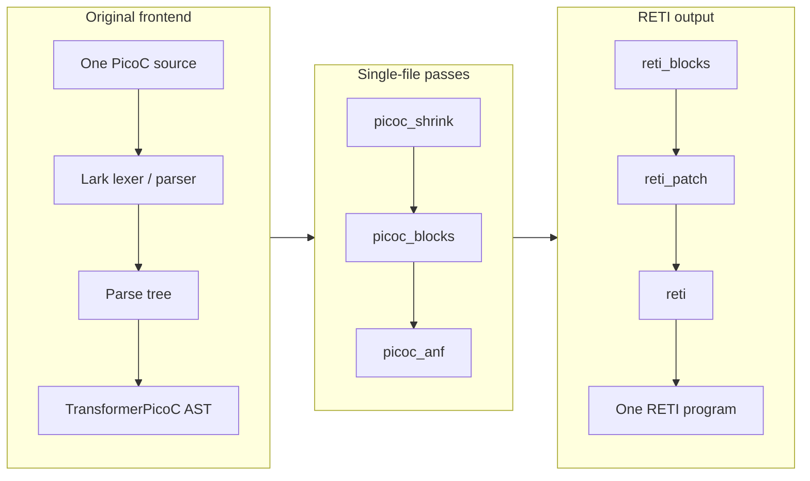

</div>

</div>

---

<!-- SOURCE Pico-OS/README.md#111-extending-the-compilation-pipeline -->

# 1. Toolchain extensions for PicoOS · 1.1 PicoC-Compiler extensions

## 1.1.1 Extending the compilation pipeline (2)

<div class="deck-content">

<div class="diagram-panel ">

<div class="visual-label">Extended pipeline · README stages, arranged in columns</div>

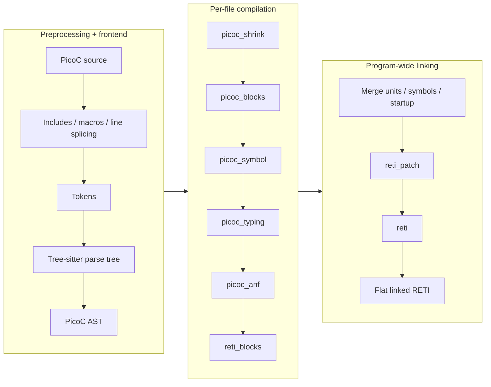

</div>

</div>

---

<!-- SOURCE Pico-OS/README.md#112-separate-compilation-and-linking -->

# 1. Toolchain extensions for PicoOS · 1.1 PicoC-Compiler extensions

## 1.1.2 Separate compilation and linking

<div class="deck-content">

<div class="code-panel shell-session shell-session-compact compilation-session">
<div class="shell-session-bar"><span>Host shell</span><span class="shell-session-caption">GCC &amp; PicoC · compile · link</span></div>
<pre class="slidev-code"><code><span class="shell-prompt">$</span> <span class="shell-command">gcc</span> -c -O2 example/c/main.c example/c/math.c
<span class="shell-prompt">$</span> <span class="shell-command">ls</span> example/c
<span class="shell-output">main.c  main.h  main.o  math.c  math.h  math.o</span>
&#10;<span class="shell-prompt">$</span> <span class="shell-command">picoc_compiler</span> -c -O1 example/picoc/main.picoc example/picoc/math.picoc
<span class="shell-prompt">$</span> <span class="shell-command">ls</span> example/picoc
<span class="shell-output">main.header  main.picoc  main.reti_blocks  main.st  math.header  math.picoc  math.reti_blocks  math.st</span>
&#10;<span class="shell-prompt">$</span> <span class="shell-command">gcc</span> -o binary/c-example example/c/main.o example/c/math.o
<span class="shell-prompt">$</span> <span class="shell-command">picoc_compiler</span> -O1 -o binary/picoc-example.reti \
    example/picoc/main.reti_blocks example/picoc/math.reti_blocks
<span class="shell-prompt">$</span> <span class="shell-command">ls</span> binary
<span class="shell-output">c-example  picoc-example.reti  picoc-example.sections</span></code></pre>
</div>

</div>


---

<!-- SOURCE Pico-OS/README.md#113-linked-sections-metadata -->

# 1. Toolchain extensions for PicoOS · 1.1 PicoC-Compiler extensions

## 1.1.3 Linked `.sections` metadata (1)

<div class="deck-content">

<div class="content-columns columns-2">

<div>

<div class="code-panel ">

<div class="visual-label">.sections</div>

```json {lines:false}
{
  "codesegment_start": 0,
  "datasegment_start": 11595,
  "heap_start": 11621,
  "heap_size": 2000,
  "stack_start": 14621
}
```

</div>

</div>

<div>

<div class="stack-diagram zoomable"><div class="stack-row"><code>word 0</code><span>code start → CS</span></div><div class="stack-row"><code>word 1</code><span>data start → DS</span></div><div class="stack-row"><code>word 2</code><span>heap start</span></div><div class="stack-row"><code>word 3</code><span>heap size · −1 = default</span></div><div class="stack-row"><code>word 4</code><span>stack start · −1 = default</span></div></div>

</div>

</div><div class="memory-visual zoomable"><div class="visual-label">Low address → high address · schematic, not to scale</div><div class="memory-bar"><div class="memory-segment seg-ivt" style="flex:1">5 header words</div><div class="memory-segment seg-text" style="flex:3">encoded .text</div><div class="memory-segment seg-data" style="flex:1">encoded .data</div></div></div><p class="slide-note">Header values are RETI cells; encoded words are big-endian. Loaders copy only the payload.</p>

</div>

---

<!-- SOURCE Pico-OS/README.md#113-linked-sections-metadata -->

# 1. Toolchain extensions for PicoOS · 1.1 PicoC-Compiler extensions

## 1.1.3 Linked `.sections` metadata (2)

<div class="deck-content">

<div class="code-panel shell-session shell-session-compact">
<div class="shell-session-bar"><span>Host shell</span><span class="shell-session-caption">assemble · inspect · header</span></div>
<pre class="slidev-code"><code><span class="shell-prompt">$</span> <span class="shell-command">reti_emulator</span> <span class="shell-operator">-a</span> program.reti
<span class="shell-prompt">$</span> <span class="shell-command">hexyl</span> <span class="shell-operator">-n</span> <span class="shell-output">20</span> program.bin
<span class="shell-output">┌────────┬─────────────────────────┬─────────────────────────┬────────┬────────┐</span>
<span class="shell-output">│00000000│ 00 00 00 00 00 00 2d 4b ┊ 00 00 2d 65 00 00 07 d0 │......-K┊..-e....│</span>
<span class="shell-output">│00000010│ 00 00 39 1d             ┊                         │..9.    ┊        │</span>
<span class="shell-output">└────────┴─────────────────────────┴─────────────────────────┴────────┴────────┘</span></code></pre>
</div><div class="tile-grid cols-3 "><div class="card"><div class="tile-title">Compile only: -c</div><div class="tile-detail">.reti_blocks + .st; no complete layout yet</div></div><div class="card"><div class="tile-title">Assemble: -a</div><div class="tile-detail">Matching .sections found automatically</div></div><div class="card"><div class="tile-title">Boot debugger: -S</div><div class="tile-detail">Kernel layout while EPROM is executing</div></div></div>

</div>

---

<!-- SOURCE Pico-OS/README.md#114-reti-pseudoinstructions -->

# 1. Toolchain extensions for PicoOS · 1.1 PicoC-Compiler extensions

## 1.1.4 RETI pseudoinstructions

<div class="deck-content">

<div class="data-table">

| Pseudoinstruction | Purpose | Concrete size |
| --- | --- | --- |
| `PUSH reg` | Reserve + store | 2 |
| `POP reg` | Load + release | 2 |
| `LOADI32 reg operand` | 32-bit literal or linked symbol | 3 |
| `JUMP32[relation] target` | Long branch | 4–6 |

</div><p class="slide-note">Hardware immediates and ordinary relative jumps use 22-bit fields. Conditions compare ACC directly.</p>

</div>

---

<!-- SOURCE Pico-OS/README.md#1141-interrupt-safe-stack-operations -->

# 1. Toolchain extensions for PicoOS · 1.1 PicoC-Compiler extensions · 1.1.4 RETI pseudoinstructions

## 1.1.4.1 Interrupt-safe stack operations

<div class="deck-content">

<div class="content-columns columns-2">

<div>

<div class="code-panel ">

<div class="visual-label">PUSH ACC</div>

```text {lines:false}
SUBI SP 1
STOREIN SP ACC 1
```

</div>

</div>

<div>

<div class="code-panel ">

<div class="visual-label">POP ACC</div>

```text {lines:false}
LOADIN SP ACC 1
ADDI SP 1
```

</div>

</div>

</div><div class="code-panel ">

<div class="visual-label">ISR register preservation</div>

```c {lines:false}
asm("PUSH ACC");
asm("PUSH IN1");
/* Handle the interrupt */
asm("POP IN1");
asm("POP ACC");
```

</div><p class="slide-note">An interrupt can arrive between either pair: reserve before writing; release after reading.</p>

</div>

---

<!-- SOURCE Pico-OS/README.md#1142-loading-32-bit-values -->

# 1. Toolchain extensions for PicoOS · 1.1 PicoC-Compiler extensions · 1.1.4 RETI pseudoinstructions

## 1.1.4.2 Loading 32-bit values

<div class="deck-content">

<div class="content-columns columns-2">

<div>

<div class="code-panel ">

<div class="visual-label">Three concrete instructions</div>

```text {lines:false}
LOADI reg upper_22_bits
MULTI reg 1024
ORI reg lower_10_bits
```

</div>

</div>

<div>

<div class="code-panel ">

<div class="visual-label">Symbolic kernel handoff</div>

```c {lines:false}
asm("LOADI32 ACC start_loaded_kernel");
asm("ADD ACC CS");
asm("MOVE ACC PC");
```

</div>

</div>

</div><div class="tile-grid cols-3 stat-cards"><div class="card"><div class="metric">22 + 10</div><div class="metric-label">upper + lower bits</div></div><div class="card"><div class="metric">× 1024</div><div class="metric-label">shift upper part</div></div><div class="card"><div class="metric">+ CS</div><div class="metric-label">absolute code address</div></div></div>

</div>

---

<!-- SOURCE Pico-OS/README.md#1143-long-jumps -->

# 1. Toolchain extensions for PicoOS · 1.1 PicoC-Compiler extensions · 1.1.4 RETI pseudoinstructions

## 1.1.4.3 Long jumps

<div class="deck-content">

<div class="code-panel ">

<div class="visual-label">Symbolic target expansion</div>

```text {lines:false}
LOADI ACC upper_22_bits
MULTI ACC 1024
ORI ACC lower_10_bits
ADD ACC CS
MOVE ACC PC
```

</div><div class="tile-grid cols-3 "><div class="card"><div class="tile-title">Numeric target</div><div class="tile-detail">Absolute address; omit ADD ACC CS</div></div><div class="card"><div class="tile-title">Conditional target</div><div class="tile-detail">Opposite short branch skips the long sequence</div></div><div class="card"><div class="tile-title">Register convention</div><div class="tile-detail">Taken jump uses ACC; result stays in IN2</div></div></div>

</div>

---

<!-- SOURCE Pico-OS/README.md#1144-expansion-during-linking -->

# 1. Toolchain extensions for PicoOS · 1.1 PicoC-Compiler extensions · 1.1.4 RETI pseudoinstructions

## 1.1.4.4 Expansion during linking

<div class="deck-content">

<div class="timeline zoomable" style="grid-template-columns:repeat(2,1fr)"><div class="timeline-step"><b>reti_patch</b><div>Expand PUSH / POP; remove fall-through jumps; count positions</div></div><div class="timeline-step"><b>reti</b><div>Resolve final symbols; flatten blocks; expand LOADI32 / JUMP32</div></div></div><div class="step-flow zoomable"><div class="card">Generated + inline assembly</div><span class="flow-arrow">→</span><div class="card">Same RETI AST</div><span class="flow-arrow">→</span><div class="card">Concrete machine instructions</div></div>

</div>

---

<!-- SOURCE Pico-OS/README.md#115-generated-memory_constantsheader-files -->

# 1. Toolchain extensions for PicoOS · 1.1 PicoC-Compiler extensions

## 1.1.5 Generated `memory_constants.header` files

<div class="deck-content">

<div class="memory-visual zoomable"><div class="visual-label">Low address → high address · schematic, not to scale</div><div class="memory-bar"><div class="memory-segment seg-ivt" style="flex:0.6">.ivt</div><div class="memory-segment seg-text" style="flex:2.5">kernel .text · CS</div><div class="memory-segment seg-data" style="flex:1">.data · DS</div><div class="memory-segment seg-heap" style="flex:1.3">heap · 4096</div><div class="memory-segment seg-stack" style="flex:1">stack</div><div class="memory-segment seg-process" style="flex:1.4">processes</div></div></div><div class="content-columns columns-2">

<div>

<div class="tile-grid cols-1 "><div class="card"><div class="tile-title">-k sram</div><div class="tile-detail">Kernel CS / DS / SP · heap · process arena · SRAM maximum</div></div><div class="card"><div class="tile-title">-k eprom</div><div class="tile-detail">Bootloader DS · temporary SRAM-top stack</div></div></div>

</div>

<div>

<div class="stack-diagram zoomable"><div class="stack-row"><code>KERNEL_HEAP_START</code><span>First kernel allocator cell</span></div><div class="stack-row"><code>KERNEL_HEAP_SIZE</code><span>4096 cells</span></div><div class="stack-row"><code>PROCESS_MEMORY_START</code><span>After kernel stack</span></div><div class="stack-row"><code>SRAM_MAX_ADDRESS_IN_MEMORY_MAP</code><span>Inclusive final SRAM cell</span></div></div>

</div>

</div><p class="slide-note">Compile-time interfaces derived from the linked layout; .sections retains relative offsets.</p>

</div>

---

<!-- SOURCE Pico-OS/README.md#116-custom-userspace-startup -->

# 1. Toolchain extensions for PicoOS · 1.1 PicoC-Compiler extensions

## 1.1.6 Custom userspace startup

<div class="deck-content">

<div class="timeline zoomable" style="grid-template-columns:repeat(4,1fr)"><div class="timeline-step"><b>-C libstart</b><div>Select custom startup</div></div><div class="timeline-step"><b>_start</b><div>Preserve kernel-built frame</div></div><div class="timeline-step"><b>heap + env</b><div>Initialize heap, clone envp</div></div><div class="timeline-step"><b>main → exit</b><div>Application result → syscall 9</div></div></div><div class="tile-grid cols-3 "><div class="card"><div class="tile-title">EPROM</div><div class="tile-detail">Naked reset installs its own registers</div></div><div class="card"><div class="tile-title">Kernel</div><div class="tile-detail">Generated SRAM entry calls kernel main</div></div><div class="card"><div class="tile-title">Userspace</div><div class="tile-detail">naked _start reads argc / argv from the initial stack</div></div></div>

</div>

---

<!-- SOURCE Pico-OS/README.md#117-interrupt-sections-and-naked-functions -->

# 1. Toolchain extensions for PicoOS · 1.1 PicoC-Compiler extensions

## 1.1.7 Interrupt sections and naked functions

<div class="deck-content">

<div class="content-columns columns-2">

<div>

<div class="code-panel ">

<div class="visual-label">Focused attribute syntax</div>

```c {lines:false}
__attribute__((section("ivt")))
void (*vectors[])(void) = { /* handlers */ };
```

</div>

</div>

<div>

<div class="code-panel ">

<div class="visual-label">Focused attribute syntax</div>

```c {lines:false}
__attribute__((naked))
void entry(void) {
    /* explicit frame and control transfer */
}
```

</div>

</div>

</div><div class="tile-grid cols-2 "><div class="card"><div class="tile-title">Static vector words</div><div class="tile-detail">Linked handler addresses exist before startup code</div></div><div class="card"><div class="tile-title">Exact frame control</div><div class="tile-detail">No automatic prologue, epilogue or return</div></div></div>

</div>

---

<!-- SOURCE Pico-OS/README.md#12-reti-emulator-extensions -->

# 1. Toolchain extensions for PicoOS

## 1.2 RETI-Emulator extensions

<div class="deck-content">

<div class="tile-grid cols-3 "><div class="card"><div class="tile-title">Execute</div><div class="tile-detail">EPROM boot · tagged SRAM · live segments</div></div><div class="card"><div class="tile-title">Assemble</div><div class="tile-detail">Five-word headers from .sections</div></div><div class="card"><div class="tile-title">Interrupt</div><div class="tile-detail">Mappings · priorities · timer · exceptions</div></div><div class="card"><div class="tile-title">Transfer</div><div class="tile-detail">Raw UART · host protocol · optional DMA</div></div><div class="card"><div class="tile-title">Inspect</div><div class="tile-detail">Source frames · memory editing · manual interrupts</div></div><div class="card"><div class="tile-title">Repeat</div><div class="tile-detail">Snapshots · restore · restart · isolated assembly</div></div></div>

</div>

---

<!-- SOURCE Pico-OS/README.md#121-debugger-and-terminal-views -->

# 1. Toolchain extensions for PicoOS · 1.2 RETI-Emulator extensions

## 1.2.1 Debugger and terminal views (1)

<div class="deck-content">

<div class="debugger-frame">


</div>

<p class="slide-note">Live CS / DS · source frames via .debuginfo · editable machine state</p>

<a class="recording-link" href="https://asciinema.org/a/1264549" target="_blank" rel="noopener">▶ Open the README’s debugger recording</a>

</div>

---

<!-- SOURCE Pico-OS/README.md#121-debugger-and-terminal-views -->

# 1. Toolchain extensions for PicoOS · 1.2 RETI-Emulator extensions

## 1.2.1 Debugger and terminal views (2)

<div class="deck-content">

<div class="tile-grid cols-2 "><div class="card"><div class="tile-title">v · normal terminal</div><div class="tile-detail">Host signal processing active. Escape returns.</div></div><div class="card"><div class="tile-title">V · raw terminal</div><div class="tile-detail">Forward Ctrl+C, Ctrl+Z and arrow keys. Ctrl+] returns.</div></div></div><div class="step-flow zoomable"><div class="card">Key bytes</div><span class="flow-arrow">→</span><div class="card">UART interrupt</div><span class="flow-arrow">→</span><div class="card">Shell editing / signals</div></div>

</div>

---

<!-- SOURCE Pico-OS/README.md#122-machine-model-and-peripherals -->

# 1. Toolchain extensions for PicoOS · 1.2 RETI-Emulator extensions

## 1.2.2 Machine model and peripherals (1)

<div class="deck-content">

<div class="data-table">

| Offset | Register group | Purpose |
| --- | --- | --- |
| 0–2 | UART | Send · receive · status bits |
| 3–5 / 6–8 | Interrupts | Device vectors / priorities |
| 9 | Timer | Instruction period; zero disables |
| 10 | Stack boundary | Inclusive lower stack limit |
| 11 | Exception cause | Divide by zero · overflow · illegal instruction |
| 12–16 | DMA | Active · source · destination · count · control |

</div><p class="slide-note">Periphery address = 0x40000000 + offset. The dispatcher rewrites cell 10 for the selected PCB.</p>

</div>

---

<!-- SOURCE Pico-OS/README.md#122-machine-model-and-peripherals -->

# 1. Toolchain extensions for PicoOS · 1.2 RETI-Emulator extensions

## 1.2.2 Machine model and peripherals (2)

<div class="deck-content">

<div class="stack-diagram zoomable"><div class="stack-row"><code>12</code><span>DMA active: 1 enables offsets 13–16</span></div><div class="stack-row"><code>13</code><span>Source: absolute UART receive address</span></div><div class="stack-row"><code>14</code><span>Destination: absolute SRAM address</span></div><div class="stack-row"><code>15</code><span>Complete 32-bit word count</span></div><div class="stack-row"><code>16</code><span>0 idle · 1 start/busy · 2 complete · 3 error</span></div></div><div class="step-flow zoomable"><div class="card">Configure source / destination / count</div><span class="flow-arrow">→</span><div class="card">Start DMA</div><span class="flow-arrow">→</span><div class="card">Vector 4 completes scheduled loads</div></div>

</div>

---

<!-- SOURCE Pico-OS/README.md#123-uart-host-request-protocol -->

# 1. Toolchain extensions for PicoOS · 1.2 RETI-Emulator extensions

## 1.2.3 UART host request protocol (1)

<div class="deck-content">

<div class="code-panel ">

<div class="visual-label">ESC is byte 27</div>

```text {lines:false}
<ESC>operation arguments<ESC>/
```

</div><div class="tile-grid cols-2 "><div class="card"><div class="tile-title">Images</div><div class="tile-detail">load · file-size · read-range</div></div><div class="card"><div class="tile-title">Output</div><div class="tile-detail">write · write-at · stdout / stderr</div></div><div class="card"><div class="tile-title">Inspect paths</div><div class="tile-detail">pwd · is-directory · ls</div></div><div class="card"><div class="tile-title">Change files</div><div class="tile-detail">mkdir · unlink · rmdir · move · touch</div></div></div><p class="slide-note">Fixed operations. Responses use big-endian values and bounded byte payloads.</p>

</div>

---

<!-- SOURCE Pico-OS/README.md#123-uart-host-request-protocol -->

# 1. Toolchain extensions for PicoOS · 1.2 RETI-Emulator extensions

## 1.2.3 UART host request protocol (2)

<div class="deck-content">

<div class="diagram-panel ">

<div class="visual-label">Boot-time continuous transfer</div>

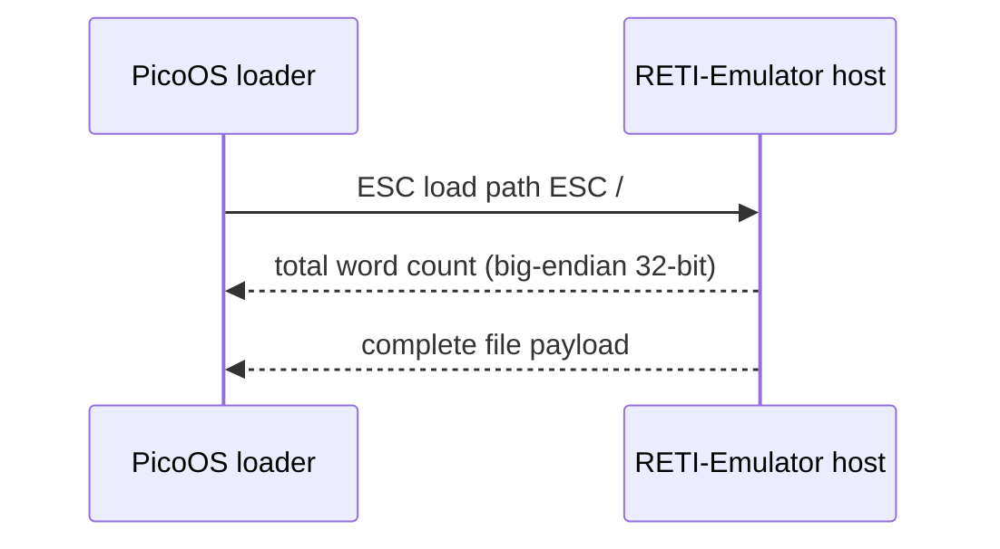

</div><p class="slide-note">The UART word count is outside the .bin file. UINT32_MAX signals failure.</p>

</div>

---

<!-- SOURCE Pico-OS/README.md#123-uart-host-request-protocol -->

# 1. Toolchain extensions for PicoOS · 1.2 RETI-Emulator extensions

## 1.2.3 UART host request protocol (3)

<div class="deck-content">

<div class="diagram-panel ">

<div class="visual-label">Metadata and ranged reads</div>

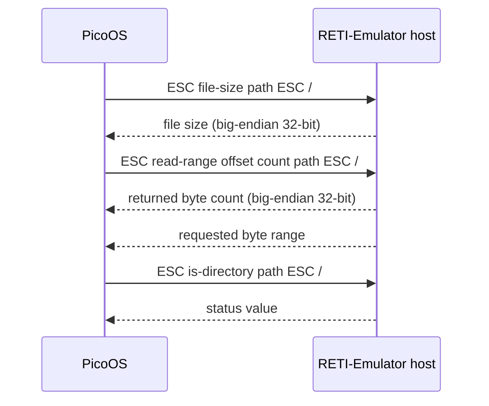

</div><p class="slide-note">Scheduled loading: independent ≤1 KiB responses, or a complete payload via DMA.</p>

</div>

---

<!-- SOURCE Pico-OS/README.md#123-uart-host-request-protocol -->

# 1. Toolchain extensions for PicoOS · 1.2 RETI-Emulator extensions

## 1.2.3 UART host request protocol (4)

<div class="deck-content">

<div class="step-flow zoomable"><div class="card">ESC write-at offset path ESC /</div><span class="flow-arrow">→</span><div class="card">Ordinary UART bytes → host file</div><span class="flow-arrow">→</span><div class="card">ESC write stdout ESC /</div></div><div class="tile-grid cols-3 "><div class="card"><div class="tile-title">write path</div><div class="tile-detail">Create/truncate and select destination</div></div><div class="card"><div class="tile-title">write-at offset path</div><div class="tile-detail">Preserve file and select position</div></div><div class="card"><div class="tile-title">stdout / stderr</div><div class="tile-detail">Return output to the host stream</div></div></div>

</div>

---

<!-- SOURCE Pico-OS/README.md#21-loading-the-kernel -->

# 2. Bootloading and kernel startup

## 2.1 Loading the kernel

<div class="deck-content">

<div class="diagram-panel ">

<div class="visual-label">Reset → EPROM → SRAM</div>

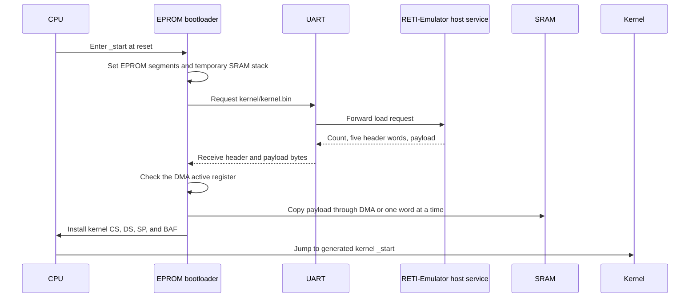

</div>

</div>

---

<!-- SOURCE Pico-OS/README.md#221-kernel-startup-code -->

# 2. Bootloading and kernel startup · 2.2 Initializing the kernel

## 2.2.1 Kernel startup code (1)

<div class="deck-content">

<div class="code-panel code-medium">

<div class="visual-label">Complete kernel main() · blank lines omitted</div>

```c {lines:false}
int main(void) {
    int init_pid;
    struct RunProcessRequest init_request;
    activate_kernel_stack_boundary();
    init_kernel_heap();
    initialize_terminal();
    initialize_process_table();
    init_process_memory_heap();
    initialize_shared_memory();
    if (dma_is_active()) {
        initialize_dma();
    }
    interrupt_controller_initialize();
    init_pid = load_process("system/init.bin", loading_bar_enabled);
    init_request.pid = init_pid;
    init_request.arguments = NULL;
    init_request.environment = NULL;
    if (mark_process_ready_with_arguments(&init_request)) {
        interrupt_controller_activate_timer();
        dispatcher_start_next_process();
    }
    return 0;
}
```

</div>

</div>

---

<!-- SOURCE Pico-OS/README.md#221-kernel-startup-code -->

# 2. Bootloading and kernel startup · 2.2 Initializing the kernel

## 2.2.1 Kernel startup code (2)

<div class="deck-content">

<div class="timeline zoomable" style="grid-template-columns:repeat(4,1fr)"><div class="timeline-step"><b>Boundary</b><div>Protect kernel stack</div></div><div class="timeline-step"><b>kmalloc</b><div>Kernel metadata arena</div></div><div class="timeline-step"><b>Terminal + list</b><div>Ring, head, tail, PID</div></div><div class="timeline-step"><b>pmalloc</b><div>Process/shared arena</div></div></div><div class="timeline zoomable" style="grid-template-columns:repeat(4,1fr)"><div class="timeline-step"><b>Registry + DMA</b><div>Shared state and optional transfer</div></div><div class="timeline-step"><b>Interrupts</b><div>Configure mappings</div></div><div class="timeline-step"><b>Init</b><div>Load + mark READY</div></div><div class="timeline-step"><b>Timer + RTI</b><div>Activate and dispatch</div></div></div><p class="slide-note">Create allocators before their users. Start the timer only after init can run.</p>

</div>

---

<!-- SOURCE Pico-OS/README.md#23-entering-normal-execution -->

# 2. Bootloading and kernel startup

## 2.3 Entering normal execution

<div class="deck-content">

<div class="step-flow zoomable"><div class="card">Select init</div><span class="flow-arrow">→</span><div class="card">Restore activation + boundary</div><span class="flow-arrow">→</span><div class="card">RTI</div><span class="flow-arrow">→</span><div class="card">Userspace _start</div></div><div class="tile-grid cols-3 "><div class="card"><div class="tile-title">All blocked</div><div class="tile-detail">Scan in kernel context until an interrupt makes work ready</div></div><div class="card"><div class="tile-title">Empty list</div><div class="tile-detail">The dispatcher can return</div></div><div class="card"><div class="tile-title">Machine control</div><div class="tile-detail">shutdown halts; reboot returns to EPROM</div></div></div>

</div>

---

<!-- SOURCE Pico-OS/README.md#31-storage-and-lifetime -->

# 3. Kernel storage and ownership

## 3.1 Storage and lifetime

<div class="deck-content">

<div class="tile-grid cols-2 "><div class="card"><div class="tile-title">Static · kernel lifetime</div><div class="tile-detail">IVT · list pointers · terminal · registry heads · heap descriptors</div></div><div class="card"><div class="tile-title">Kernel heap · kfree</div><div class="tile-detail">PCBs · descriptor arrays · paths · names · attachment nodes</div></div><div class="card"><div class="tile-title">Process arena · pfree</div><div class="tile-detail">Complete process images · shared data · unfinished loads</div></div><div class="card"><div class="tile-title">Embedded · owner lifetime</div><div class="tile-detail">Activation · wait queues · in-region heap block headers</div></div><div class="card"><div class="tile-title">Userspace stack · call lifetime</div><div class="tile-detail">Request structs · wait status · suspended read buffers</div></div><div class="card"><div class="tile-title">Process heap</div><div class="tile-detail">malloc allocations · cloned environment</div></div></div>

</div>

---

<!-- SOURCE Pico-OS/README.md#32-ownership-connections -->

# 3. Kernel storage and ownership

## 3.2 Ownership connections

<div class="deck-content">

<div class="diagram-panel ">

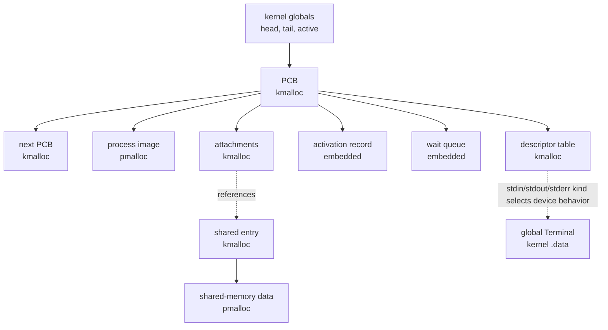

</div>

</div>

---

<!-- SOURCE Pico-OS/README.md#41-interrupt-vector-table -->

# 4. Interrupts, system calls, and exceptions

## 4.1 Interrupt vector table

<div class="deck-content">

<div class="content-columns columns-2">

<div>

<div class="code-panel ">

```c {lines:false}
__attribute__((section("ivt")))
void (*interrupt_vector_table[OS_INTERRUPT_VECTOR_COUNT])(void) = {
    syscall_interrupt,
    timer_interrupt,
    uart_interrupt,
    cpu_exception_interrupt,
    dma_interrupt
};
```

</div>

</div>

<div>

<div class="data-table">

| Vector | Source |
| --- | --- |
| 0 | Software INT 0 |
| 1 | Timer |
| 2 | UART receive |
| 3 | CPU exception · fixed |
| 4 | DMA completion |

</div>

</div>

</div><p class="slide-note">INT saves only return PC. ISR code saves its registers; RTI resumes from SP + 1.</p>

</div>

---

<!-- SOURCE Pico-OS/README.md#42-saved-interrupt-frame -->

# 4. Interrupts, system calls, and exceptions

## 4.2 Saved interrupt frame

<div class="deck-content">

<div class="content-columns columns-2">

<div>

<div class="stack-diagram zoomable"><div class="stack-row"><code>+7</code><span>Return PC</span></div><div class="stack-row"><code>+6</code><span>ACC</span></div><div class="stack-row"><code>+5</code><span>IN1</span></div><div class="stack-row"><code>+4</code><span>IN2 · result</span></div><div class="stack-row"><code>+3</code><span>BAF</span></div><div class="stack-row"><code>+2</code><span>CS</span></div><div class="stack-row"><code>+1</code><span>DS</span></div><div class="stack-row"><code>+0</code><span>Free cell ← caller_context</span></div></div>

</div>

<div>

<div class="tile-grid cols-1 "><div class="card"><div class="tile-title">Save into PCB</div><div class="tile-detail">Copy offsets 1–6 into activation</div></div><div class="card"><div class="tile-title">Resume position</div><div class="tile-detail">activation.sp = caller_context + 6</div></div><div class="card"><div class="tile-title">Return PC</div><div class="tile-detail">Stays on stack at activation.sp + 1</div></div></div>

</div>

</div>

</div>

---

<!-- SOURCE Pico-OS/README.md#43-system-call-path -->

# 4. Interrupts, system calls, and exceptions

## 4.3 System-call path (1)

<div class="deck-content">

<div class="tile-grid cols-3 stat-cards"><div class="card"><div class="metric">39</div><div class="metric-label">implemented syscalls</div></div><div class="card"><div class="metric">0–41</div><div class="metric-label">selector range</div></div><div class="card"><div class="metric">1 · 26 · 28</div><div class="metric-label">unused selectors</div></div></div><div class="step-flow zoomable"><div class="card">ACC = selector · IN1 = value/pointer</div><span class="flow-arrow">→</span><div class="card">INT 0</div><span class="flow-arrow">→</span><div class="card">Kernel subsystem</div><span class="flow-arrow">→</span><div class="card">IN2 = result</div></div><p class="slide-note">The same saved frame supports immediate return, blocking, and deferred timer scheduling.</p>

</div>

---

<!-- SOURCE Pico-OS/README.md#43-system-call-path -->

# 4. Interrupts, system calls, and exceptions

## 4.3 System-call path (2)

<div class="deck-content">

<div class="code-panel code-medium">

<div class="visual-label">Entry excerpt · save registers and install kernel context</div>

```c {lines:false}
__attribute__((naked))
void syscall_interrupt(void) {
    // Saves the same context layout as timer_interrupt
    asm("PUSH ACC"); // Syscall number
    asm("PUSH IN1"); // Syscall argument
    asm("PUSH IN2");
    asm("PUSH BAF");
    asm("PUSH CS");
    asm("PUSH DS");

    // BAF keeps old_sp while loading kernel CS, DS and SP
    asm("MOVE SP BAF");
    asm("LOADI IN1 0");
    write_stack_heap_boundary_from_in1();
    asm(KERNEL_CS_START_ASM);
    asm(KERNEL_DS_START_ASM);
    asm(KERNEL_SP_START_ASM);
    activate_kernel_stack_boundary();

    // Builds the handle_syscall arguments from the saved context
    asm("PUSH BAF"); // Caller context
```

</div>

</div>

---

<!-- SOURCE Pico-OS/README.md#43-system-call-path -->

# 4. Interrupts, system calls, and exceptions

## 4.3 System-call path (3)

<div class="deck-content">

<div class="code-panel code-medium">

<div class="visual-label">Entry excerpt · pass arguments and call C</div>

```c {lines:false}
asm("LOADIN BAF IN2 5");
    asm("PUSH IN2"); // Syscall argument
    asm("LOADIN BAF IN2 6");
    asm("PUSH IN2"); // Syscall number

    // A syscall that switches processes resumes with a successful IN2 result
    asm("LOADI IN2 1");
    asm("STOREIN BAF IN2 4");

    // Calls handle_syscall and returns through syscall_interrupt_return
    asm("LOADI32 ACC syscall_interrupt_return");
    asm("ADD ACC CS");
    asm("PUSH ACC"); // Return address: syscall restoration stub
    asm("LOADI32 ACC handle_syscall");
    asm("ADD ACC CS");
    asm("MOVE ACC PC");
}
```

</div>

</div>

---

<!-- SOURCE Pico-OS/README.md#43-system-call-path -->

# 4. Interrupts, system calls, and exceptions

## 4.3 System-call path (4)

<div class="deck-content">

<div class="code-panel code-medium">

<div class="visual-label">Return continuation · preserve result before rescheduling</div>

```c {lines:false}
__attribute__((naked))
void syscall_interrupt_return(void) {
    // Handle_syscall restores BAF to the saved caller context before returning
    // Saves the IN2 result before a pending timer request can dispatch the caller
    asm("STOREIN BAF IN2 4");

    asm("PUSH BAF"); // Caller context
    asm("LOADI32 ACC syscall_interrupt_restore");
    asm("ADD ACC CS");
    asm("PUSH ACC");
    asm("LOADI32 ACC dispatcher_reschedule_if_requested");
    asm("ADD ACC CS");
    asm("MOVE ACC PC");
}
```

</div>

</div>

---

<!-- SOURCE Pico-OS/README.md#43-system-call-path -->

# 4. Interrupts, system calls, and exceptions

## 4.3 System-call path (5)

<div class="deck-content">

<div class="code-panel code-medium">

<div class="visual-label">Restoration continuation · restore registers and RTI</div>

```c {lines:false}
__attribute__((naked))
void syscall_interrupt_restore(void) {
    asm("MOVE BAF SP");
    activate_current_process_stack_boundary();
    asm("POP DS");
    asm("POP CS");
    asm("POP BAF");
    asm("POP IN2");
    asm("POP IN1");
    asm("POP ACC");
    asm("RTI");
}
```

</div>

</div>

---

<!-- SOURCE Pico-OS/README.md#43-system-call-path -->

# 4. Interrupts, system calls, and exceptions

## 4.3 System-call path (6)

<div class="deck-content">

<div class="diagram-panel sequence-dense">

<div class="visual-label">Normal return and pending reschedule</div>

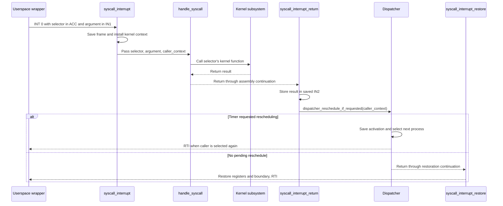

</div>

</div>

---

<!-- SOURCE Pico-OS/README.md#44-timer-isr-and-preemption -->

# 4. Interrupts, system calls, and exceptions

## 4.4 Timer ISR and preemption (1)

<div class="deck-content">

<div class="tile-grid cols-3 stat-cards"><div class="card"><div class="metric">1</div><div class="metric-label">interrupt vector</div></div><div class="card"><div class="metric">1</div><div class="metric-label">device priority</div></div><div class="card"><div class="metric">1000</div><div class="metric-label">instructions per interval</div></div></div><div class="diagram-panel ">

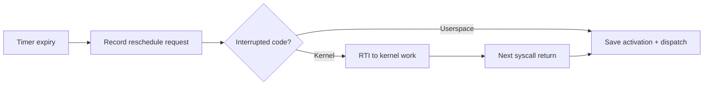

</div>

</div>

---

<!-- SOURCE Pico-OS/README.md#44-timer-isr-and-preemption -->

# 4. Interrupts, system calls, and exceptions

## 4.4 Timer ISR and preemption (2)

<div class="deck-content">

<div class="code-panel code-medium">

<div class="visual-label">Entry · save frame and record expiry</div>

```c {lines:false}
__attribute__((naked))
void timer_interrupt(void) {
    // Saves the interrupted context before requesting a process switch
    asm("PUSH ACC");
    asm("PUSH IN1");
    asm("PUSH IN2");
    asm("PUSH BAF");
    asm("PUSH CS");
    asm("PUSH DS");
    // SP is saved later. From then on, its value is called old_sp

    // Uses kernel segments because an interrupt can arrive during entry or return
    asm(KERNEL_CS_START_ASM);
    asm(KERNEL_DS_START_ASM);

    asm("LOADI32 ACC timer_interrupt_after_reschedule_request");
    asm("ADD ACC CS");
    asm("PUSH ACC");
    asm("LOADI32 ACC dispatcher_request_reschedule");
    asm("ADD ACC CS");
    asm("MOVE ACC PC");
}
```

</div>

</div>

---

<!-- SOURCE Pico-OS/README.md#44-timer-isr-and-preemption -->

# 4. Interrupts, system calls, and exceptions

## 4.4 Timer ISR and preemption (3)

<div class="deck-content">

<div class="code-panel code-medium">

<div class="visual-label">Continuation · kernel return or stack handoff</div>

```c {lines:false}
__attribute__((naked))
void timer_interrupt_after_reschedule_request(void) {
    /*
     * Restores kernel regs when the interrupted instruction belongs to the
     * kernel code segment. The pending request is consumed when that kernel
     * work next returns to a process
     */
    asm("LOADIN SP ACC 7"); // Interrupted PC above the six saved registers
    asm("SUB ACC DS");
    asm("JUMP>= 14"); // Only process code executes at or above this boundary
    asm("POP DS");
    asm("POP CS");
    asm("POP BAF");
    asm("POP IN2");
    asm("POP IN1");
    asm("POP ACC");
    asm("RTI");

    // BAF keeps old_sp while loading kernel CS, DS and SP
    asm("MOVE SP BAF");
```

</div>

</div>

---

<!-- SOURCE Pico-OS/README.md#44-timer-isr-and-preemption -->

# 4. Interrupts, system calls, and exceptions

## 4.4 Timer ISR and preemption (4)

<div class="deck-content">

<div class="code-panel code-medium">

<div class="visual-label">Continuation · enter dispatcher</div>

```c {lines:false}
asm("LOADI IN1 0");
    write_stack_heap_boundary_from_in1();
    asm(KERNEL_CS_START_ASM);
    asm(KERNEL_DS_START_ASM);
    asm(KERNEL_SP_START_ASM);
    activate_kernel_stack_boundary();

    // Passes the interrupted stack frame to the dispatcher
    asm("PUSH BAF"); // Caller context

    // The dispatcher switches to a process through RTI and does not return
    asm("LOADI ACC 0");
    asm("PUSH ACC"); // Unreachable return address required by the call frame
    asm("LOADI32 ACC dispatcher_switch_from_context");
    asm("ADD ACC CS");
    asm("MOVE ACC PC");
}
```

</div>

</div>

---

<!-- SOURCE Pico-OS/README.md#45-uart-isr -->

# 4. Interrupts, system calls, and exceptions

## 4.5 UART ISR

<div class="deck-content">

<div class="code-panel code-medium">

<div class="visual-label">One received byte</div>

```c {lines:false}
void handle_uart_interrupt(void) {
    struct Process *process = terminal_input_process();
    struct Terminal *terminal = kernel_terminal();
    int value;
    int status;

    value = periphery_read_register(UART_RECEIVE_REGISTER) & 255;
    status = periphery_read_register(UART_STATUS_REGISTER);
    periphery_write_register(
        UART_STATUS_REGISTER,
        status | UART_RECEIVE_READY
    );

    if (handle_terminal_signal_character(value)) {
        return;
    }

    enqueue_terminal_byte(terminal, value);
    complete_pending_terminal_read(process, terminal);
}
```

</div><p class="slide-note">Priority 2. Control bytes become signals; other input enters the ring and may complete a pending read.</p>

</div>

---

<!-- SOURCE Pico-OS/README.md#46-cpu-exception-path -->

# 4. Interrupts, system calls, and exceptions

## 4.6 CPU exception path (1)

<div class="deck-content">

<div class="content-columns columns-2">

<div>

<div class="code-panel ">

<div class="visual-label">Fault policy</div>

```c {lines:false}
void handle_cpu_exception(int interrupted_kernel_cs_difference) {
    int cause = periphery_read_register(CPU_EXCEPTION_CAUSE_REGISTER);
    bool kernel_exception = interrupted_kernel_cs_difference == 0;

    print_cpu_exception_message(cause, kernel_exception);
    if (kernel_exception) {
        shutdown();
    }

    exit_process(PROCESS_EXIT_STATUS_EXCEPTION);
}
```

</div>

</div>

<div>

<div class="tile-grid cols-1 "><div class="card"><div class="tile-title">Vector 3 · cause register 11</div><div class="tile-detail">Divide by zero · stack overflow · illegal instruction</div></div><div class="card"><div class="tile-title">Heap exhaustion</div><div class="tile-detail">Process: syscall 31. Kernel: panic and halt.</div></div></div>

</div>

</div><p class="slide-note">Process boundary = base_address + heap_start + heap_size − 1.</p>

</div>

---

<!-- SOURCE Pico-OS/README.md#46-cpu-exception-path -->

# 4. Interrupts, system calls, and exceptions

## 4.6 CPU exception path (2)

<div class="deck-content">

<div class="code-panel code-medium">

<div class="visual-label">Naked exception entry</div>

```c {lines:false}
__attribute__((naked))
void cpu_exception_interrupt(void) {
    // BAF preserves the interrupted CS while the handler resets kernel context
    asm("MOVE CS BAF");
    asm("LOADI IN1 0");
    write_stack_heap_boundary_from_in1();
    asm(KERNEL_CS_START_ASM);
    asm(KERNEL_DS_START_ASM);
    asm(KERNEL_SP_START_ASM);
    activate_kernel_stack_boundary();

    // A zero difference identifies an exception raised in kernel code
    asm("MOVE BAF ACC");
    asm("SUB ACC CS");
    asm("PUSH ACC");

    // The exception handler terminates the process or halts after a kernel panic
    asm("LOADI ACC 0");
    asm("PUSH ACC");
    asm("LOADI32 ACC handle_cpu_exception");
    asm("ADD ACC CS");
    asm("MOVE ACC PC");
}
```

</div>

</div>

---

<!-- SOURCE Pico-OS/README.md#51-global-process-table -->

# 5. Processes and the process table

## 5.1 Global process table

<div class="deck-content">

<div class="code-panel ">

```c {lines:false}
struct Process *process_list_head = NULL;
struct Process *process_list_tail = NULL;
struct Process *active_process = NULL;
int next_process_id = 1;
```

</div><div class="diagram-panel ">

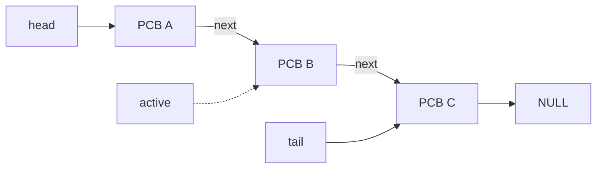

</div><p class="slide-note">One kmalloc per PCB. Scheduler order uses next; waiting uses wait_next.</p>

</div>

---

<!-- SOURCE Pico-OS/README.md#52-activation-record -->

# 5. Processes and the process table

## 5.2 Activation record

<div class="deck-content">

<div class="content-columns columns-2">

<div>

<div class="code-panel ">

```c {lines:false}
struct ActivationRecord {
    int in1;
    int in2;
    int acc;
    int sp;
    int baf;
    int cs;
    int ds;
};
```

</div>

</div>

<div>

<div class="tile-grid cols-1 "><div class="card"><div class="tile-title">Embedded</div><div class="tile-detail">Seven registers; no separate allocation</div></div><div class="card"><div class="tile-title">SP + 1</div><div class="tile-detail">Return PC remains on the process stack</div></div><div class="card"><div class="tile-title">Fixed offsets</div><div class="tile-detail">ISR / dispatcher save and restore the same layout</div></div></div>

</div>

</div>

</div>

---

<!-- SOURCE Pico-OS/README.md#53-process-control-block -->

# 5. Processes and the process table

## 5.3 Process control block (1)

<div class="deck-content">

<div class="tile-grid cols-2 "><div class="card"><div class="tile-title">Identity + image</div><div class="tile-detail">pid · state · base_address · size · heap bounds</div></div><div class="card"><div class="tile-title">CPU state</div><div class="tile-detail">Embedded ActivationRecord</div></div><div class="card"><div class="tile-title">Owned resources</div><div class="tile-detail">Paths · working directory · descriptors · attachments</div></div><div class="card"><div class="tile-title">Queue links</div><div class="tile-detail">waiters · waiting_queue_ptr · wait_next · next</div></div><div class="card"><div class="tile-title">Parent + signals</div><div class="tile-detail">parent_pid · exit status · stop state · pending termination</div></div><div class="card"><div class="tile-title">Suspended work</div><div class="tile-detail">Terminal buffer/count · pending_load</div></div></div>

</div>

---

<!-- SOURCE Pico-OS/README.md#53-process-control-block -->

# 5. Processes and the process table

## 5.3 Process control block (2)

<div class="deck-content">

<div class="content-columns columns-2">

<div>

<div class="code-panel code-medium">

<div class="visual-label">Process · identity and resources</div>

```c {lines:false}
struct Process {
    int pid;
    int state;
    int base_address;
    int size;
    int heap_start;
    int heap_size;
    char *binary_path;
    char *working_directory;
    struct ActivationRecord activation;
    struct FileDescriptorTable *file_descriptors;
    int *waiting_status_ptr;
    struct wait_queue waiters;
    struct wait_queue *waiting_queue_ptr;
```

</div>

</div>

<div>

<div class="code-panel code-medium">

<div class="visual-label">Process · remaining fields</div>

```c {lines:false}
struct Process *wait_next;
    struct Process *next;
    struct SharedMemoryAttachment *shared_memory_attachments;
    int parent_pid;
    int parent_death_signal;
    int exit_status;
    int stop_signal;
    int stopped_from_state;
    int pending_termination_signal;
    char *pending_terminal_read_buffer;
    int pending_terminal_read_count;
    struct ProcessLoad *pending_load;
};
```

</div>

</div>

</div>

</div>

---

<!-- SOURCE Pico-OS/README.md#54-process-image-and-initial-stack -->

# 5. Processes and the process table

## 5.4 Process image and initial stack (1)

<div class="deck-content">

<div class="memory-visual zoomable"><div class="visual-label">Low address → high address · schematic, not to scale</div><div class="memory-bar"><div class="memory-segment seg-text" style="flex:2">code / .text</div><div class="memory-segment seg-data" style="flex:1">globals / .data</div><div class="memory-segment seg-heap" style="flex:2">userspace heap</div><div class="memory-segment seg-gap" style="flex:1.5">free stack space</div><div class="memory-segment seg-stack" style="flex:1.5">initial stack ↓</div></div></div><div class="content-columns columns-2">

<div>

<div class="stack-diagram zoomable"><div class="stack-row"><code>high</code><span>Copied strings: path · arguments · environment</span></div><div class="stack-row"><code></code><span>envp[] + NULL</span></div><div class="stack-row"><code></code><span>argv[] + NULL</span></div><div class="stack-row"><code></code><span>argc</span></div><div class="stack-row"><code></code><span>Entry PC = activation.cs − 1</span></div><div class="stack-row"><code>low</code><span>Free cell ← saved SP</span></div></div>

</div>

<div>

<div class="tile-grid cols-1 "><div class="card"><div class="tile-title">One pmalloc region</div><div class="tile-detail">Code + data + heap + startup / stack</div></div><div class="card"><div class="tile-title">Defaults</div><div class="tile-detail">1000 heap cells; 1001 cells above heap including startup data</div></div></div>

</div>

</div>

</div>

---

<!-- SOURCE Pico-OS/README.md#54-process-image-and-initial-stack -->

# 5. Processes and the process table

## 5.4 Process image and initial stack (2)

<div class="deck-content">

<div class="diagram-panel ">

<div class="visual-label">README sequence · header and reservation</div>

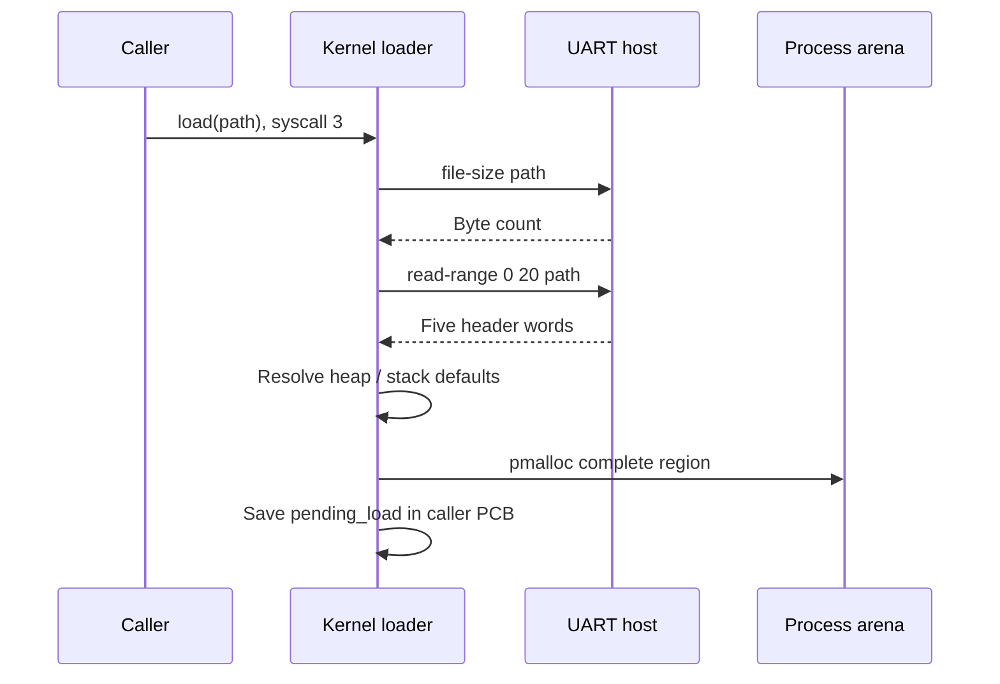

</div><p class="slide-note">No child PCB exists until the final payload word arrives.</p>

</div>

---

<!-- SOURCE Pico-OS/README.md#54-process-image-and-initial-stack -->

# 5. Processes and the process table

## 5.4 Process image and initial stack (3)

<div class="deck-content">

<div class="content-columns columns-2">

<div>

<div class="tile-grid cols-1 "><div class="card"><div class="tile-title">DMA enabled</div><div class="tile-detail">Request full payload → queue caller → start DMA → dispatch → completion ISR wakes caller → wrapper checks completion</div></div></div>

</div>

<div>

<div class="tile-grid cols-1 "><div class="card"><div class="tile-title">Polling fallback</div><div class="tile-detail">Return continue → repeat syscall 3 → request ≤1 KiB → copy at base + progress → repeat</div></div></div>

</div>

</div><div class="step-flow zoomable"><div class="card">Complete transfer</div><span class="flow-arrow">→</span><div class="card">Create PCB in NEW</div><span class="flow-arrow">→</span><div class="card">run(pid, args, env)</div><span class="flow-arrow">→</span><div class="card">Copy stack + descriptors → READY</div></div><p class="slide-note">The caller owns unfinished loading state. Removal releases it; a retained zombie can still own it.</p>

</div>

---

<!-- SOURCE Pico-OS/README.md#55-states-and-lifetime -->

# 5. Processes and the process table

## 5.5 States and lifetime (1)

<div class="deck-content">

<div class="diagram-panel state-diagram">

<div class="visual-label">Process state transitions</div>

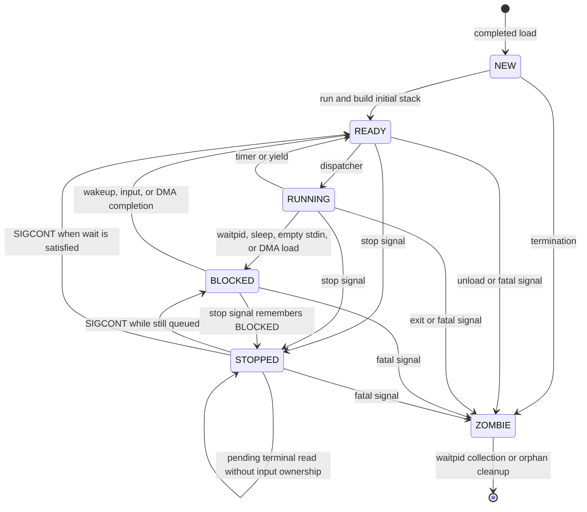

</div>

</div>

---

<!-- SOURCE Pico-OS/README.md#55-states-and-lifetime -->

# 5. Processes and the process table

## 5.5 States and lifetime (2)

<div class="deck-content">

<div class="timeline zoomable" style="grid-template-columns:repeat(4,1fr)"><div class="timeline-step"><b>Load</b><div>Parent PID + cwd copy</div></div><div class="timeline-step"><b>Run</b><div>Arguments + environment + descriptors</div></div><div class="timeline-step"><b>Terminate</b><div>ZOMBIE + retained status</div></div><div class="timeline-step"><b>Collect</b><div>Remove PCB and owned resources</div></div></div><div class="tile-grid cols-3 "><div class="card"><div class="tile-title">Immediate removal</div><div class="tile-detail">Orphan, or status already collected by waiting parent</div></div><div class="card"><div class="tile-title">Retained zombie</div><div class="tile-detail">Image, descriptors, paths and attachments survive until collection</div></div><div class="card"><div class="tile-title">Final cleanup</div><div class="tile-detail">Unlink lists/queues; pfree image; kfree metadata</div></div></div>

</div>

---

<!-- SOURCE Pico-OS/README.md#61-wait-queues -->

# 6. Blocking, waiting, synchronization, and signals

## 6.1 Wait queues

<div class="deck-content">

<div class="diagram-panel ">

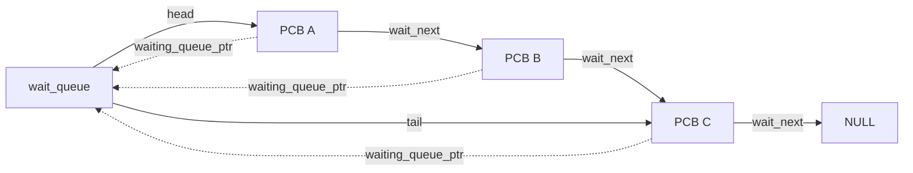

</div><div class="tile-grid cols-3 "><div class="card"><div class="tile-title">Queue</div><div class="tile-detail">head + tail only</div></div><div class="card"><div class="tile-title">PCB links</div><div class="tile-detail">wait_next + waiting_queue_ptr</div></div><div class="card"><div class="tile-title">Owners</div><div class="tile-detail">Child · terminal · mutex · DMA global</div></div></div><p class="slide-note">No extra queue nodes. One PCB can be in at most one wait queue.</p>

</div>

---

<!-- SOURCE Pico-OS/README.md#611-sleeping-and-waking -->

# 6. Blocking, waiting, synchronization, and signals · 6.1 Wait queues

## 6.1.1 Sleeping and waking

<div class="deck-content">

<div class="diagram-panel ">

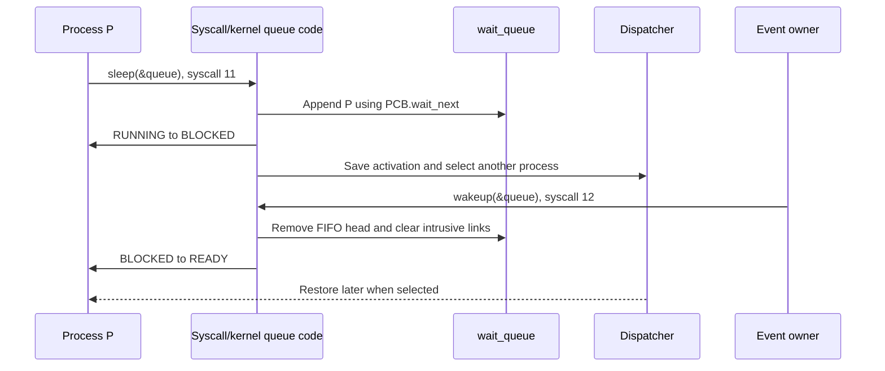

</div><p class="slide-note">sleep(queue) has no duration. Wakeup removes at most one FIFO head; execution resumes only when scheduled.</p>

</div>

---

<!-- SOURCE Pico-OS/README.md#62-waitpid-and-saved-wait-state -->

# 6. Blocking, waiting, synchronization, and signals

## 6.2 `waitpid()` and saved wait state (1)

<div class="deck-content">

<div class="diagram-panel ">

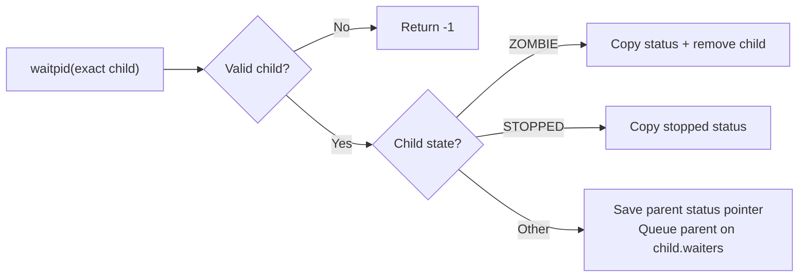

</div><p class="slide-note">The child owns the queue; the parent owns the saved pointer into its suspended stack.</p>

</div>

---

<!-- SOURCE Pico-OS/README.md#62-waitpid-and-saved-wait-state -->

# 6. Blocking, waiting, synchronization, and signals

## 6.2 `waitpid()` and saved wait state (2)

<div class="deck-content">

<div class="diagram-panel ">

<div class="visual-label">Suspended branch of the README sequence</div>

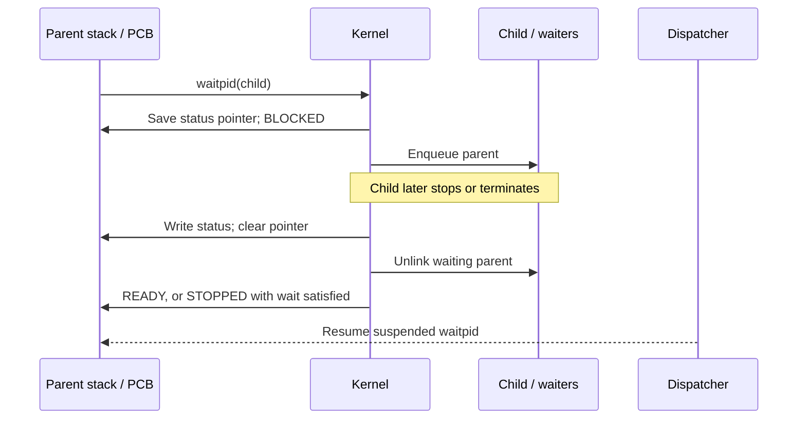

</div>

</div>

---

<!-- SOURCE Pico-OS/README.md#63-signals-inside-the-pcb -->

# 6. Blocking, waiting, synchronization, and signals

## 6.3 Signals inside the PCB (1)

<div class="deck-content">

<div class="data-table">

| Signal | Fixed action | Status |
| --- | --- | --- |
| 2 · SIGINT | Terminate | 130 |
| 9 · SIGKILL | Terminate | 137 |
| 18 · SIGCONT | Resume READY / still BLOCKED | — |
| 19 · SIGSTOP | Stop | 147 |
| 20 · SIGTSTP | Stop · Ctrl+Z | 148 |
| 21 · SIGTTIN | Stop · background read | 149 |

</div><p class="slide-note">Six fixed actions; no catching or ignoring. Signal 0 probes a non-zombie PID without delivery.</p>

</div>

---

<!-- SOURCE Pico-OS/README.md#63-signals-inside-the-pcb -->

# 6. Blocking, waiting, synchronization, and signals

## 6.3 Signals inside the PCB (2)

<div class="deck-content">

<div class="diagram-panel ">

<div class="visual-label">Defer destruction of the running process</div>

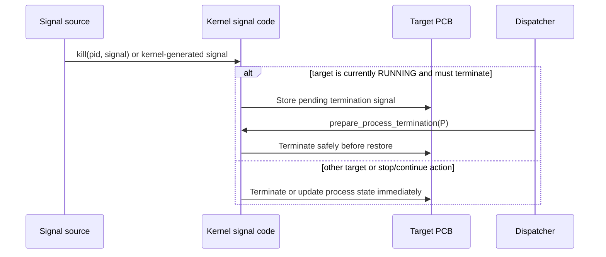

</div>

</div>

---

<!-- SOURCE Pico-OS/README.md#63-signals-inside-the-pcb -->

# 6. Blocking, waiting, synchronization, and signals

## 6.3 Signals inside the PCB (3)

<div class="deck-content">

<div class="step-flow zoomable"><div class="card">Background terminal read</div><span class="flow-arrow">→</span><div class="card">Retain buffer/count</div><span class="flow-arrow">→</span><div class="card">STOPPED · SIGTTIN</div></div><div class="step-flow zoomable"><div class="card">Shell fg</div><span class="flow-arrow">→</span><div class="card">Assign input ownership</div><span class="flow-arrow">→</span><div class="card">SIGCONT</div><span class="flow-arrow">→</span><div class="card">Consume input or queue</div></div><p class="slide-note">Background SIGCONT cannot resume a pending terminal read without ownership. A satisfied ordinary wait can remain visibly STOPPED until SIGCONT.</p>

</div>

---

<!-- SOURCE Pico-OS/README.md#64-important-signal-functions -->

# 6. Blocking, waiting, synchronization, and signals

## 6.4 Important signal functions

<div class="deck-content">

<div class="step-flow zoomable"><div class="card">Parent terminates</div><span class="flow-arrow">→</span><div class="card">Direct children: parent_pid = 0</div><span class="flow-arrow">→</span><div class="card">Remove zombies / deliver configured signal</div></div><div class="tile-grid cols-3 "><div class="card"><div class="tile-title">Inherited setting</div><div class="tile-detail">New processes copy parent_death_signal</div></div><div class="card"><div class="tile-title">Disable</div><div class="tile-detail">prctl(PR_SET_PDEATHSIG, 0)</div></div><div class="card"><div class="tile-title">Status</div><div class="tile-detail">Exact-child waitpid; no child-exit notification signal</div></div></div>

</div>

---

<!-- SOURCE Pico-OS/README.md#65-mutexes -->

# 6. Blocking, waiting, synchronization, and signals

## 6.5 Mutexes (1)

<div class="deck-content">

<div class="code-panel code-medium">

<div class="visual-label">Atomic test and initialization</div>

```c {lines:false}
bool testset(bool *lock_addr) {
    int old;

    asm("LOADIN BAF IN2 3");
    asm("TSL IN2 ACC 0");
    asm("STOREIN BAF ACC 0");
    return old;
}

void mutex_init(struct mutex *m) {
    m->lock = false;
    wait_queue_init(&(m->waiters));
    return;
}
```

</div>

</div>

---

<!-- SOURCE Pico-OS/README.md#65-mutexes -->

# 6. Blocking, waiting, synchronization, and signals

## 6.5 Mutexes (2)

<div class="deck-content">

<div class="code-panel code-medium">

<div class="visual-label">Lock and unlock</div>

```c {lines:false}
void mutex_lock(struct mutex *m) {
    while (testset(&(m->lock))) {
        sleep(&(m->waiters));
    }
    return;
}

void mutex_unlock(struct mutex *m) {
    m->lock = false;
    wakeup(&(m->waiters));
    return;
}
```

</div>

</div>

---

<!-- SOURCE Pico-OS/README.md#65-mutexes -->

# 6. Blocking, waiting, synchronization, and signals

## 6.5 Mutexes (3)

<div class="deck-content">

<div class="step-flow zoomable"><div class="card">TSL: old lock value</div><span class="flow-arrow">→</span><div class="card">If held: sleep(queue)</div><span class="flow-arrow">→</span><div class="card">After wakeup: retry TSL</div></div><div class="tile-grid cols-3 "><div class="card"><div class="tile-title">Shared object</div><div class="tile-detail">Lock + embedded queue; links refer to kernel PCBs</div></div><div class="card"><div class="tile-title">Unlock</div><div class="tile-detail">Clear lock, then wake one FIFO waiter</div></div><div class="card"><div class="tile-title">Preemption limitation</div><div class="tile-detail">Failed TSL and sleep are separate: an intervening unlock can cause a missed wakeup</div></div></div><p class="slide-note">Wakeup makes a process eligible; it does not transfer the lock.</p>

</div>

---

<!-- SOURCE Pico-OS/README.md#71-scheduler -->

# 7. Scheduler and dispatcher

## 7.1 Scheduler (1)

<div class="deck-content">

<div class="diagram-panel ">


</div><p class="slide-note">Round-robin over the global list. RUNNING lets the only runnable process select itself again.</p>

</div>

---

<!-- SOURCE Pico-OS/README.md#71-scheduler -->

# 7. Scheduler and dispatcher

## 7.1 Scheduler (2)

<div class="deck-content">

<div class="content-columns columns-2">

<div>

<div class="code-panel code-medium">

<div class="visual-label">Scan after current PCB</div>

```c {lines:false}
struct Process *scheduler_next_process(void) {
    struct Process *start;
    struct Process *candidate;

    if (first_process() == NULL) {
        return NULL;
    }
    if (current_process() == NULL || current_process()->next == NULL) {
        start = first_process();
    } else {
        start = current_process()->next;
    }

    candidate = start;
    while (candidate != NULL) {
        if (scheduler_can_run(candidate)) {
            return candidate;
        }
        candidate = candidate->next;
    }
```

</div>

</div>

<div>

<div class="code-panel code-medium">

<div class="visual-label">Wrap to the list head</div>

```c {lines:false}
candidate = first_process();
    while (candidate != start) {
        if (scheduler_can_run(candidate)) {
            return candidate;
        }
        candidate = candidate->next;
    }
    return NULL;
}
```

</div>

</div>

</div>

</div>

---

<!-- SOURCE Pico-OS/README.md#72-saving-and-selecting -->

# 7. Scheduler and dispatcher

## 7.2 Saving and selecting (1)

<div class="deck-content">

<div class="code-panel code-medium">

<div class="visual-label">Copy interrupt frame into activation</div>

```c {lines:false}
void dispatcher_switch_from_context(int *caller_context) {
    struct Process *process = current_process();

    if (process != NULL) {
        process->activation.sp = (int)(caller_context + 6);
        process->activation.ds = caller_context[1];
        process->activation.cs = caller_context[2];
        process->activation.baf = caller_context[3];
        process->activation.in2 = caller_context[4];
        process->activation.in1 = caller_context[5];
        process->activation.acc = caller_context[6];

        if (process->state == PROCESS_STATE_RUNNING) {
            process->state = PROCESS_STATE_READY;
        }
    }
    dispatcher_start_next_process();
}
```

</div><p class="slide-note">Only RUNNING becomes READY. BLOCKED and STOPPED remain unchanged.</p>

</div>

---

<!-- SOURCE Pico-OS/README.md#72-saving-and-selecting -->

# 7. Scheduler and dispatcher

## 7.2 Saving and selecting (2)

<div class="deck-content">

<div class="step-flow zoomable"><div class="card">Select candidate</div><span class="flow-arrow">→</span><div class="card">Prepare deferred termination</div><span class="flow-arrow">→</span><div class="card">Candidate survives?</div><span class="flow-arrow">→</span><div class="card">Set active + RUNNING</div></div><div class="tile-grid cols-3 "><div class="card"><div class="tile-title">Terminated candidate</div><div class="tile-detail">Repeat selection</div></div><div class="card"><div class="tile-title">All blocked</div><div class="tile-detail">Scan until an interrupt wakes work</div></div><div class="card"><div class="tile-title">Successful dispatch</div><div class="tile-detail">Clear reschedule request, even when reselecting the same PCB</div></div></div>

</div>

---

<!-- SOURCE Pico-OS/README.md#73-restoring -->

# 7. Scheduler and dispatcher

## 7.3 Restoring (1)

<div class="deck-content">

<div class="code-panel code-medium">

<div class="visual-label">Complete naked restoration</div>

```c {lines:false}
__attribute__((naked))
void dispatcher_jump_to_process(struct Process *process, int stack_boundary) {
    // Reads the process pointer and its precomputed stack boundary from the call frame
    asm("LOADIN SP BAF 2");
    asm("LOADIN SP IN1 3");

    // Installs the process boundary without creating a call frame
    write_stack_heap_boundary_from_in1();

    // Restores the saved activation record while BAF still points to the process
    asm("LOADIN BAF SP 11");
    asm("LOADIN BAF CS 13");
    asm("LOADIN BAF DS 14");
    asm("LOADIN BAF IN1 8");
    asm("LOADIN BAF IN2 9");
    asm("LOADIN BAF ACC 10");
    asm("LOADIN BAF BAF 12");

    // Returns to the restored process context
    asm("RTI");
}
```

</div>

</div>

---

<!-- SOURCE Pico-OS/README.md#73-restoring -->

# 7. Scheduler and dispatcher

## 7.3 Restoring (2)

<div class="deck-content">

<div class="diagram-panel sequence-dense">

<div class="visual-label">Complete process switch</div>

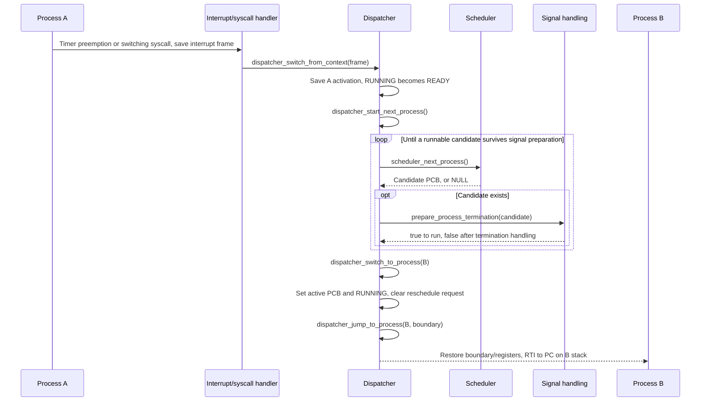

</div>

</div>

---

<!-- SOURCE Pico-OS/README.md#81-three-uses-of-one-heap-implementation -->

# 8. Memory management and shared memory

## 8.1 Three uses of one heap implementation (1)

<div class="deck-content">

<div class="content-columns columns-2">

<div>

<div class="code-panel ">

```c {lines:false}
struct BlockHeader {
    int size;
    bool free;
    struct BlockHeader *next;
};

struct Heap {
    struct BlockHeader *first_block;
};
```

</div>

</div>

<div>

<div class="tile-grid cols-1 "><div class="card"><div class="tile-title">Kernel heap · kmalloc</div><div class="tile-detail">PCBs and metadata</div></div><div class="card"><div class="tile-title">Process arena · pmalloc</div><div class="tile-detail">Whole images and shared data</div></div><div class="card"><div class="tile-title">Process heap · malloc</div><div class="tile-detail">One descriptor in each process .data</div></div></div>

</div>

</div><p class="slide-note">Sizes use RETI cells. BlockHeader sits immediately before its payload.</p>

</div>

---

<!-- SOURCE Pico-OS/README.md#81-three-uses-of-one-heap-implementation -->

# 8. Memory management and shared memory

## 8.1 Three uses of one heap implementation (2)

<div class="deck-content">

<div class="timeline zoomable" style="grid-template-columns:repeat(4,1fr)"><div class="timeline-step"><b>Allocate</b><div>First-fit scan</div></div><div class="timeline-step"><b>Split</b><div>Keep unused tail free</div></div><div class="timeline-step"><b>Free</b><div>Mark payload available</div></div><div class="timeline-step"><b>Merge</b><div>Coalesce adjacent free blocks</div></div></div><div class="memory-visual zoomable"><div class="visual-label">Low address → high address · schematic, not to scale</div><div class="memory-bar"><div class="memory-segment seg-ivt" style="flex:0.7">header</div><div class="memory-segment seg-text" style="flex:2">allocated payload</div><div class="memory-segment seg-ivt" style="flex:0.7">header</div><div class="memory-segment seg-gap" style="flex:3">free payload</div></div></div><p class="slide-note">Heap.first_block anchors the in-region header list. Each header stores size, free, and next.</p>

</div>

---

<!-- SOURCE Pico-OS/README.md#811-current-kernel-sram-layout -->

# 8. Memory management and shared memory · 8.1 Three uses of one heap implementation

## 8.1.1 Current kernel SRAM layout

<div class="deck-content">

<div class="memory-visual zoomable"><div class="visual-label">Low address → high address · schematic, not to scale</div><div class="memory-bar"><div class="memory-segment seg-ivt" style="flex:0.5">.ivt</div><div class="memory-segment seg-text" style="flex:2.4">kernel .text</div><div class="memory-segment seg-data" style="flex:1">.data</div><div class="memory-segment seg-heap" style="flex:1.5">kernel heap</div><div class="memory-segment seg-stack" style="flex:1.5">kernel stack ↓</div><div class="memory-segment seg-process" style="flex:2">process arena</div></div></div><div class="layout-offsets">

<div class="data-table">

| SRAM offset | Region |
| --- | --- |
| 0–4 | .ivt |
| 5–41703 | .text |
| 41704–42458 | .data |
| 42459–46554 | 4096-cell kernel heap |
| 46555–49270 | Stack room + initial free SP |
| 49271–262143 | Process-memory heap |

</div>

</div><p class="slide-note">Generated values from the README; offsets move after relinking.</p>

</div>

---

<!-- SOURCE Pico-OS/README.md#812-per-process-linked-layout -->

# 8. Memory management and shared memory · 8.1 Three uses of one heap implementation

## 8.1.2 Per-process linked layout

<div class="deck-content">

<div class="memory-visual zoomable"><div class="visual-label">Low address → high address · schematic, not to scale</div><div class="memory-bar"><div class="memory-segment seg-text" style="flex:2">.text · CS</div><div class="memory-segment seg-data" style="flex:1">.data · DS</div><div class="memory-segment seg-heap" style="flex:2">heap</div><div class="memory-segment seg-gap" style="flex:1.5">stack room</div><div class="memory-segment seg-stack" style="flex:1">SP ↓</div></div></div><div class="stack-diagram zoomable"><div class="stack-row"><code>base + codesegment_start</code><span>Initial CS / entry</span></div><div class="stack-row"><code>base + datasegment_start</code><span>DS / globals</span></div><div class="stack-row"><code>base + heap_start</code><span>First process heap header</span></div><div class="stack-row"><code>base + heap_start + heap_size − 1</code><span>Inclusive boundary in periphery cell 10</span></div><div class="stack-row"><code>base + stack_start</code><span>Initial free SP</span></div></div>

</div>

---

<!-- SOURCE Pico-OS/README.md#82-heap-and-allocator-functions -->

# 8. Memory management and shared memory

## 8.2 Heap and allocator functions

<div class="deck-content">

<div class="diagram-panel ">

<div class="visual-label">realloc: retain, grow, or move</div>

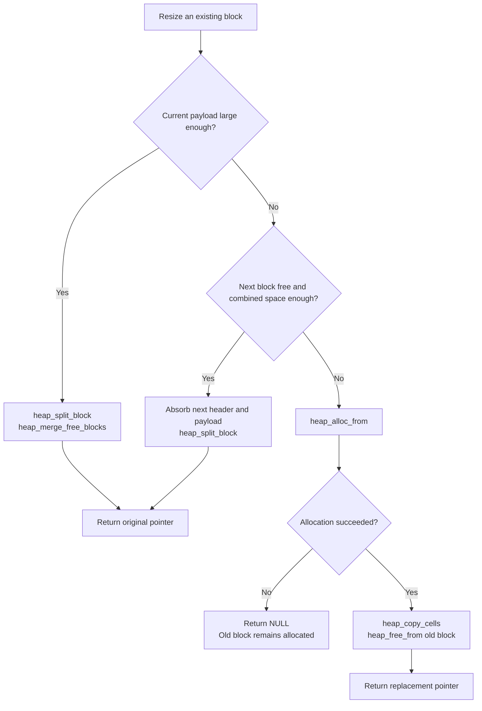

</div><p class="slide-note">Replacement failure leaves the old block intact. NULL allocates; nonpositive size frees.</p>

</div>

---

<!-- SOURCE Pico-OS/README.md#83-shared-memory-registry-and-attachments -->

# 8. Memory management and shared memory

## 8.3 Shared-memory registry and attachments (1)

<div class="deck-content">

<div class="diagram-panel ">

```mermaid
flowchart LR
    P1["PCB A"] --> A1["attachment<br/>kmalloc"]
    P2["PCB B"] --> A2["attachment<br/>kmalloc"]
    A1 --> E["SharedMemoryEntry<br/>kmalloc<br/>count = 2"]
    A2 --> E
    E --> M["shared-memory data<br/>pmalloc"]
    G["global registry head"] --> E
```

</div><div class="tile-grid cols-3 "><div class="card"><div class="tile-title">shm_open(name, size)</div><div class="tile-detail">Existing ID does not resize the region</div></div><div class="card"><div class="tile-title">mmap(id)</div><div class="tile-detail">Same absolute pointer; one reference per mapping</div></div><div class="card"><div class="tile-title">No munmap</div><div class="tile-detail">Attachments survive until process removal</div></div></div>

</div>

---

<!-- SOURCE Pico-OS/README.md#83-shared-memory-registry-and-attachments -->

# 8. Memory management and shared memory

## 8.3 Shared-memory registry and attachments (2)

<div class="deck-content">

<div class="content-columns columns-2">

<div>

<div class="code-panel ">

<div class="visual-label">Registry + per-process attachment</div>

```c {lines:false}
struct SharedMemoryEntry {
    char *name;
    int id;
    void *address;
    int reference_count;
    bool unlink_requested;
    struct SharedMemoryEntry *next;
};

struct SharedMemoryAttachment {
    struct SharedMemoryEntry *entry;
    struct SharedMemoryAttachment *next;
};
```

</div>

</div>

<div>

<div class="tile-grid cols-1 "><div class="card"><div class="tile-title">Entry + name</div><div class="tile-detail">Kernel heap</div></div><div class="card"><div class="tile-title">Data region</div><div class="tile-detail">Process-memory arena</div></div><div class="card"><div class="tile-title">Two linked lists</div><div class="tile-detail">Global lookup registry + each PCB’s attachments</div></div></div>

</div>

</div>

</div>

---

<!-- SOURCE Pico-OS/README.md#83-shared-memory-registry-and-attachments -->

# 8. Memory management and shared memory

## 8.3 Shared-memory registry and attachments (3)

<div class="deck-content">

<div class="diagram-panel ">

<div class="visual-label">README lifetime sequence · references</div>

```mermaid
sequenceDiagram
 participant A as Process A
 participant R as Registry
 participant B as Process B
 A->>R: shm_open(name, size)#59; mmap(id)
 R-->>A: Pointer#59; references = 1
 B->>R: shm_open(name, size)#59; mmap(id)
 R-->>B: Same pointer#59; references = 2
 A->>R: shm_unlink(name)
 Note over R: Name gone#59; ID and data remain
 A->>R: Removal → references = 1
 B->>R: Removal → references = 0
 R->>R: Free data and entry
```

</div><p class="slide-note">An unlinked ID remains mappable while its entry exists. The same name can create a new entry.</p>

</div>

---

<!-- SOURCE Pico-OS/README.md#831-shared-memory-tests -->

# 8. Memory management and shared memory · 8.3 Shared-memory registry and attachments

## 8.3.1 Shared-memory tests

<div class="deck-content">

<div class="tile-grid cols-3 "><div class="card"><div class="tile-title">shared_memory</div><div class="tile-detail">Distinct worker cells; launcher sees all writes</div></div><div class="card"><div class="tile-title">shared_memory_mutex</div><div class="tile-detail">Shared counter + initialized mutex</div></div><div class="card"><div class="tile-title">shared_memory_mutual_exclusion</div><div class="tile-detail">Controlled yields expose blocking and wakeup</div></div></div><div class="code-panel ">

```c {lines:false}
struct SharedState {
    int value;
    struct mutex mutex;
};
```

</div><p class="slide-note">The controlled mutual-exclusion scenario disables the timer; worker 1 yields while holding the lock.</p>

</div>

---

<!-- SOURCE Pico-OS/README.md#91-per-process-descriptor-table -->

# 9. Terminal, file descriptors, and host filesystem

## 9.1 Per-process descriptor table

<div class="deck-content">

<div class="content-columns columns-2">

<div>

<div class="code-panel ">

```c {lines:false}
struct FileDescriptor {
    int kind;
    int flags;
    int offset;
    char *path;
};

struct FileDescriptorTable {
    struct FileDescriptor *entries;
};
```

</div>

</div>

<div>

<div class="stack-diagram zoomable"><div class="stack-row"><code>0</code><span>stdin · read-only</span></div><div class="stack-row"><code>1</code><span>stdout · write-only</span></div><div class="stack-row"><code>2</code><span>stderr · write-only</span></div><div class="stack-row"><code>3–7</code><span>Initially free</span></div></div>

</div>

</div><p class="slide-note">run inheritance and dup2 deep-copy paths and scalar fields. Offsets diverge; terminal input remains global.</p>

</div>

---

<!-- SOURCE Pico-OS/README.md#92-global-terminal -->

# 9. Terminal, file descriptors, and host filesystem

## 9.2 Global terminal

<div class="deck-content">

<div class="content-columns columns-2">

<div>

<div class="code-panel ">

```c {lines:false}
struct Terminal {
    char input_buffer[TERMINAL_INPUT_BUFFER_CAPACITY];
    int input_head;
    int input_tail;
    int input_count;
    struct wait_queue input_waiters;
};
```

</div>

</div>

<div>

<div class="tile-grid cols-1 "><div class="card"><div class="tile-title">128 cells</div><div class="tile-detail">One global ring in kernel .data</div></div><div class="card"><div class="tile-title">One input owner</div><div class="tile-detail">Foreground reader can wait for input</div></div><div class="card"><div class="tile-title">Overflow</div><div class="tile-detail">Discard oldest byte when full</div></div></div>

</div>

</div><p class="slide-note">A read returns available bytes; it need not fill the requested count.</p>

</div>

---

<!-- SOURCE Pico-OS/README.md#93-virtual-device-paths -->

# 9. Terminal, file descriptors, and host filesystem

## 9.3 Virtual device paths (1)

<div class="deck-content">

<div class="tile-grid cols-2 "><div class="card"><div class="tile-title">/device/terminal.dev</div><div class="tile-detail">Read ring / block · write UART · no seeking</div></div><div class="card"><div class="tile-title">/device/null.dev</div><div class="tile-detail">Read EOF · discard writes successfully · no seeking</div></div></div><p class="slide-note">Only the exact normalized paths select devices. Release-tree files are markers; other names use host I/O.</p>

</div>

---

<!-- SOURCE Pico-OS/README.md#93-virtual-device-paths -->

# 9. Terminal, file descriptors, and host filesystem

## 9.3 Virtual device paths (2)

<div class="deck-content">

<div class="diagram-panel sequence-dense">

<div class="visual-label">Foreground terminal read</div>

```mermaid
sequenceDiagram
    participant P as Reading process
    participant K as Descriptor/terminal code
    participant T as Global Terminal
    participant D as Dispatcher
    participant U as UART ISR

    P->>K: read(0, buffer, count), syscall 16
    alt input_buffer contains bytes
        K->>T: Pop up to count bytes
        K-->>P: Return count immediately
    else ring is empty
        K->>P: Store pending buffer/count in PCB
        K->>T: Enqueue P and mark it BLOCKED
        K->>D: dispatcher_switch_from_context(frame), save activation
        U->>T: Enqueue received byte
        U->>P: Copy bytes and store result in activation.in2
        U->>P: Clear PCB pending fields, detach from queue, mark READY
        D-->>P: Restore later and return the saved result
    end
```

</div>

</div>

---

<!-- SOURCE Pico-OS/README.md#95-opening-reading-writing-and-seeking -->

# 9. Terminal, file descriptors, and host filesystem

## 9.5 Opening, reading, writing, and seeking (1)

<div class="deck-content">

<div class="data-table">

| Open flags | Effect |
| --- | --- |
| O_RDONLY / O_WRONLY / O_RDWR | Choose allowed operations |
| O_CREAT | Allow missing file |
| O_TRUNC + writable | Create / empty immediately |
| O_APPEND | Query size before every write |

</div><div class="step-flow zoomable"><div class="card">Normalize path</div><span class="flow-arrow">→</span><div class="card">Lowest free descriptor</div><span class="flow-arrow">→</span><div class="card">Copy path + flags</div><span class="flow-arrow">→</span><div class="card">I/O at saved offset</div></div><p class="slide-note">lseek supports SET / CUR / END for regular files. Append positioning is not atomic with other writers.</p>

</div>

---

<!-- SOURCE Pico-OS/README.md#95-opening-reading-writing-and-seeking -->

# 9. Terminal, file descriptors, and host filesystem

## 9.5 Opening, reading, writing, and seeking (2)

<div class="deck-content">

<div class="diagram-panel sequence-dense">

<div class="visual-label">Regular-file read: one bounded syscall per chunk</div>

```mermaid
sequenceDiagram
    participant C as Application caller
    participant A as Userspace read wrapper
    participant K as Kernel descriptor code
    participant U as Kernel UART helpers
    participant E as RETI-Emulator
    participant H as Host filesystem

    C->>A: read(fd, buffer, count)
    loop Until count, EOF, or error
        A->>K: read chunk, syscall 16 with IoRequest
        K->>K: Validate descriptor and remaining count
        K->>U: Request at most 1 KiB at descriptor.offset
        U->>E: ESC read-range offset chunk-count absolute-path ESC /
        E->>H: Open, seek, and read the bounded range
        H-->>E: Returned data
        E-->>U: Big-endian returned count and bytes
        U->>K: Copy at buffer + transferred
        K->>K: Advance descriptor offset, update completion/progress fields
        K-->>A: Chunk count and completion flag
        A->>A: Add chunk count to transferred
    end
    A-->>C: Combined count, or -1 if the first chunk failed
```

</div>

</div>

---

<!-- SOURCE Pico-OS/README.md#95-opening-reading-writing-and-seeking -->

# 9. Terminal, file descriptors, and host filesystem

## 9.5 Opening, reading, writing, and seeking (3)

<div class="deck-content">

<div class="step-flow zoomable"><div class="card">write-at offset path</div><span class="flow-arrow">→</span><div class="card">Send requested bytes</div><span class="flow-arrow">→</span><div class="card">Restore stdout</div><span class="flow-arrow">→</span><div class="card">Advance offset</div></div><div class="tile-grid cols-3 "><div class="card"><div class="tile-title">Partial read failure</div><div class="tile-detail">Return already transferred bytes; −1 only when none were read</div></div><div class="card"><div class="tile-title">Read boundaries</div><div class="tile-detail">Pending timer request consumed at syscall return</div></div><div class="card"><div class="tile-title">Host writes</div><div class="tile-detail">No acknowledgment: not every host error can be reported</div></div></div>

</div>

---

<!-- SOURCE Pico-OS/README.md#96-working-directories-and-host-operations -->

# 9. Terminal, file descriptors, and host filesystem

## 9.6 Working directories and host operations (1)

<div class="deck-content">

<div class="code-panel ">

```text {lines:false}
Host runtime directory         PicoOS paths
binary/ or extracted archive → /
  kernel/                   → /kernel
  user/                     → /user
  config/                   → /config
  device/                   → /device
```

</div><div class="tile-grid cols-3 "><div class="card"><div class="tile-title">PID 1</div><div class="tile-detail">Starts at /</div></div><div class="card"><div class="tile-title">Child load</div><div class="tile-detail">Copy parent working directory</div></div><div class="card"><div class="tile-title">Normalize</div><div class="tile-detail">Collapse separators, . and ..; stop at /</div></div></div><p class="slide-note">chdir changes a PCB string, not the host cwd. Host /tmp is not mounted. PATH=/user works after cd.</p>

</div>

---

<!-- SOURCE Pico-OS/README.md#96-working-directories-and-host-operations -->

# 9. Terminal, file descriptors, and host filesystem

## 9.6 Working directories and host operations (2)

<div class="deck-content">

<div class="diagram-panel ">

<div class="visual-label">Validate a new directory; copy the current one</div>

```mermaid
sequenceDiagram
    participant P as Process/library wrapper
    participant K as Kernel path code
    participant PCB as Current PCB
    participant E as RETI-Emulator host service

    P->>K: chdir(path), syscall 32
    K->>PCB: Read current working_directory for relative normalization
    K->>E: ESC is-directory absolute-path ESC /
    E-->>K: 0 or failure
    alt directory exists
        K->>PCB: kmalloc new path, kfree old path, replace pointer
        K-->>P: 0
    else invalid directory
        K-->>P: -1 without changing PCB
    end
    P->>K: getcwd(buffer, size), syscall 33
    K->>PCB: Copy stored working_directory without a host request
    K-->>P: 0, getcwd wrapper returns buffer
```

</div>

</div>

---

<!-- SOURCE Pico-OS/README.md#101-system-call-request-structures -->

# 10. Libraries and the userspace/kernel ABI

## 10.1 System-call request structures

<div class="deck-content">

<div class="step-flow zoomable"><div class="card">Stack-local request</div><span class="flow-arrow">→</span><div class="card">ACC = selector · IN1 = pointer</div><span class="flow-arrow">→</span><div class="card">INT 0</div><span class="flow-arrow">→</span><div class="card">IN2 = result</div></div><div class="content-columns columns-2">

<div>

<div class="code-panel ">

<div class="visual-label">Request shape from the README</div>

```c {lines:false}
struct WaitPidRequest {
    int pid;
    int *status;
};
```

</div>

</div>

<div>

<div class="tile-grid cols-1 "><div class="card"><div class="tile-title">Synchronous access</div><div class="tile-detail">Kernel reads the request during the call</div></div><div class="card"><div class="tile-title">Suspended data</div><div class="tile-detail">Wait-status and terminal-buffer pointers can be copied into the PCB</div></div><div class="card"><div class="tile-title">Repeated chunks</div><div class="tile-detail">load/read wrappers retain their own stack request</div></div></div>

</div>

</div>

</div>

---

<!-- SOURCE Pico-OS/README.md#1011-process-wait-signal-and-memory-requests -->

# 10. Libraries and the userspace/kernel ABI · 10.1 System-call request structures

## 10.1.1 Process, wait, signal, and memory requests

<div class="deck-content">

<div class="tile-grid cols-2 "><div class="card"><div class="tile-title">LoadProcessRequest</div><div class="tile-detail">path · show_loading_bar</div></div><div class="card"><div class="tile-title">RunProcessRequest</div><div class="tile-detail">pid · arguments · environment</div></div><div class="card"><div class="tile-title">WaitPidRequest</div><div class="tile-detail">exact child PID · status destination</div></div><div class="card"><div class="tile-title">KillRequest</div><div class="tile-detail">pid · signal_number</div></div><div class="card"><div class="tile-title">PrctlRequest</div><div class="tile-detail">option · argument</div></div><div class="card"><div class="tile-title">ShmOpenRequest</div><div class="tile-detail">name · size in cells</div></div></div><p class="slide-note">Paths, arguments, environment and names are copied when persistent ownership is needed.</p>

</div>

---

<!-- SOURCE Pico-OS/README.md#1012-file-and-directory-requests -->

# 10. Libraries and the userspace/kernel ABI · 10.1 System-call request structures

## 10.1.2 File and directory requests

<div class="deck-content">

<div class="content-columns columns-2">

<div>

<div class="code-panel ">

<div class="visual-label">Transfer request</div>

```c {lines:false}
struct IoRequest {
    int file_descriptor;
    char *buffer;
    int count;
    bool show_loading_bar;
    int transferred;
    int loading_bar_update;
    bool complete;
};
```

</div>

</div>

<div>

<div class="tile-grid cols-1 "><div class="card"><div class="tile-title">Open / Seek / Dup2</div><div class="tile-detail">path + flags · fd + offset + origin · old fd + new fd</div></div><div class="card"><div class="tile-title">GetCwd / ReadDirectory</div><div class="tile-detail">buffer + capacity; listing also has a path</div></div><div class="card"><div class="tile-title">Move</div><div class="tile-detail">old_path + new_path</div></div></div>

</div>

</div>

</div>

---

<!-- SOURCE Pico-OS/README.md#102-implemented-libraries -->

# 10. Libraries and the userspace/kernel ABI

## 10.2 Implemented libraries

<div class="deck-content">

<div class="tile-grid cols-4 catalog"><div class="card"><div class="tile-title">unistd</div><div class="tile-detail">Processes · descriptors · queues</div></div><div class="card"><div class="tile-title">fcntl</div><div class="tile-detail">Open / flags</div></div><div class="card"><div class="tile-title">sys/wait</div><div class="tile-detail">Exact-child status</div></div><div class="card"><div class="tile-title">schedule</div><div class="tile-detail">Voluntary yield</div></div><div class="card"><div class="tile-title">mutex</div><div class="tile-detail">TSL + wait queue</div></div><div class="card"><div class="tile-title">signal</div><div class="tile-detail">Signal delivery</div></div><div class="card"><div class="tile-title">sys/prctl</div><div class="tile-detail">Parent-death signal</div></div><div class="card"><div class="tile-title">sys/mman</div><div class="tile-detail">Named shared memory</div></div><div class="card"><div class="tile-title">dirent</div><div class="tile-detail">Directory streams</div></div><div class="card"><div class="tile-title">sys/stat</div><div class="tile-detail">Directory creation</div></div><div class="card"><div class="tile-title">stdlib</div><div class="tile-detail">Heap · environment · exit</div></div><div class="card"><div class="tile-title">string</div><div class="tile-detail">String / memory helpers</div></div><div class="card"><div class="tile-title">stdio</div><div class="tile-detail">Streams · format / scan</div></div><div class="card"><div class="tile-title">start</div><div class="tile-detail">Heap → env → main</div></div></div><p class="slide-note">14 libraries. Pure userspace work needs no interrupt until it requests a kernel service.</p>

</div>

---

<!-- SOURCE Pico-OS/README.md#1021-unistd-fcntl-waiting-and-scheduling -->

# 10. Libraries and the userspace/kernel ABI · 10.2 Implemented libraries

## 10.2.1 `unistd`, `fcntl`, waiting, and scheduling

<div class="deck-content">

<div class="tile-grid cols-2 "><div class="card"><div class="tile-title">Processes</div><div class="tile-detail">load → run → waitpid · unload · getpid</div></div><div class="card"><div class="tile-title">Descriptors</div><div class="tile-detail">open → read/write → lseek → close · dup2</div></div><div class="card"><div class="tile-title">Queues + schedule</div><div class="tile-detail">sleep · wakeup · yield</div></div><div class="card"><div class="tile-title">Paths</div><div class="tile-detail">chdir · getcwd · move · unlink</div></div></div><p class="slide-note">invoke_syscall(number, argument) is the common assembly bridge, not an additional syscall.</p>

</div>

---

<!-- SOURCE Pico-OS/README.md#1022-signals-process-control-shared-memory-and-mutexes -->

# 10. Libraries and the userspace/kernel ABI · 10.2 Implemented libraries

## 10.2.2 Signals, process control, shared memory, and mutexes

<div class="deck-content">

<div class="tile-grid cols-2 "><div class="card"><div class="tile-title">kill(pid, signal)</div><div class="tile-detail">Fixed action; signal 0 probes existence</div></div><div class="card"><div class="tile-title">prctl(PR_SET_PDEATHSIG, …)</div><div class="tile-detail">Set the inherited parent-death action</div></div><div class="card"><div class="tile-title">shm_open → mmap → shm_unlink</div><div class="tile-detail">Name / ID / shared pointer / deferred destruction</div></div><div class="card"><div class="tile-title">mutex_init → lock → unlock</div><div class="tile-detail">Shared userspace lock and queue; TSL + sleep/wakeup</div></div></div><p class="slide-note">Self-termination can be deferred until dispatch. The kernel does not retain request pointers.</p>

</div>

---

<!-- SOURCE Pico-OS/README.md#1023-directories -->

# 10. Libraries and the userspace/kernel ABI · 10.2 Implemented libraries

## 10.2.3 Directories

<div class="deck-content">

<div class="content-columns columns-2">

<div>

<div class="code-panel ">

```c {lines:false}
struct dirent {
    int d_type;
    char d_name[DIRENT_NAME_MAX];
};

struct DirectoryStream {
    char *contents;
    int length;
    int offset;
    struct dirent entry;
};
```

</div>

</div>

<div>

<div class="tile-grid cols-1 "><div class="card"><div class="tile-title">opendir</div><div class="tile-detail">Allocate DIR + 512-cell listing; ask host</div></div><div class="card"><div class="tile-title">readdir</div><div class="tile-detail">Parse next record; overwrite embedded entry</div></div><div class="card"><div class="tile-title">closedir</div><div class="tile-detail">Free buffer and stream</div></div></div>

</div>

</div><p class="slide-note">No kernel descriptor slot. Names are limited to 127 characters; each readdir reuses the same result object.</p>

</div>

---

<!-- SOURCE Pico-OS/README.md#1024-process-heap-environment-strings-and-exit -->

# 10. Libraries and the userspace/kernel ABI · 10.2 Implemented libraries

## 10.2.4 Process heap, environment, strings, and exit

<div class="deck-content">

<div class="tile-grid cols-2 "><div class="card"><div class="tile-title">Heap</div><div class="tile-detail">malloc · realloc · free · first-fit allocator</div></div><div class="card"><div class="tile-title">Environment</div><div class="tile-detail">getenv · setenv · unsetenv · putenv · clearenv</div></div><div class="card"><div class="tile-title">Copy / restore</div><div class="tile-detail">clone_environment · restore_environment · destroy_environment</div></div><div class="card"><div class="tile-title">Strings / exit</div><div class="tile-detail">strcpy · strcat · strcmp · strlen · atoi · exit</div></div></div><p class="slide-note">Each process owns process_heap and environ. Syscalls 6/7 provide heap bounds; failed positive allocation invokes syscall 31.</p>

</div>

---

<!-- SOURCE Pico-OS/README.md#1025-standard-io -->

# 10. Libraries and the userspace/kernel ABI · 10.2 Implemented libraries

## 10.2.5 Standard I/O (1)

<div class="deck-content">

<div class="content-columns columns-2">

<div>

<div class="code-panel ">

```c {lines:false}
struct PicoFile {
    int file_descriptor;
};
```

</div>

</div>

<div>

<div class="tile-grid cols-1 "><div class="card"><div class="tile-title">3 standard streams</div><div class="tile-detail">stdin · stdout · stderr</div></div><div class="card"><div class="tile-title">5 extra FILE slots</div><div class="tile-detail">fopen modes: r / w / a / +</div></div><div class="card"><div class="tile-title">Unbuffered</div><div class="tile-detail">Descriptor only; no EOF/error flags or shared file object</div></div></div>

</div>

</div><div class="step-flow zoomable"><div class="card">printf / fprintf</div><span class="flow-arrow">→</span><div class="card">Format in userspace</div><span class="flow-arrow">→</span><div class="card">fputc / fputs</div><span class="flow-arrow">→</span><div class="card">Descriptor write</div></div>

</div>

---

<!-- SOURCE Pico-OS/README.md#1025-standard-io -->

# 10. Libraries and the userspace/kernel ABI · 10.2 Implemented libraries

## 10.2.5 Standard I/O (2)

<div class="deck-content">

<div class="content-columns columns-2">

<div>

<div class="tile-grid cols-1 "><div class="card"><div class="tile-title">Formatting</div><div class="tile-detail">%d · %c · %s · %%</div></div><div class="card"><div class="tile-title">Scanning</div><div class="tile-detail">%d · %c · %s · literals · whitespace</div></div><div class="card"><div class="tile-title">Standalone tests</div><div class="tile-detail">Legacy UART fallback via test ISRs</div></div></div>

</div>

<div>

<div class="stack-diagram zoomable"><div class="stack-row"><code>BAF + 1</code><span>Saved caller BAF</span></div><div class="stack-row"><code>BAF + 2</code><span>Return address</span></div><div class="stack-row"><code>BAF + 3…</code><span>Fixed arguments</span></div><div class="stack-row"><code>BAF + 4</code><span>printf: first extra argument</span></div><div class="stack-row"><code>BAF + 5</code><span>fprintf: first extra argument</span></div></div>

</div>

</div>

</div>

---

<!-- SOURCE Pico-OS/README.md#1026-startup-library -->

# 10. Libraries and the userspace/kernel ABI · 10.2 Implemented libraries

## 10.2.6 Startup library

<div class="deck-content">

<div class="code-panel ">

<div class="visual-label">Complete userspace startup</div>

```c {lines:false}
void start_process(int argc, char **argv) {
    init_process_heap();
    initialize_environment(argv + argc + 1);
    exit(main(argc, argv));
}

__attribute__((naked))
void _start(int argc, char *first_argument) {
    start_process(argc, (char **)&first_argument);
}
```

</div><p class="slide-note">envp begins at argv + argc + 1. Heap setup precedes environment cloning.</p>

</div>

---

<!-- SOURCE Pico-OS/README.md#103-library-organization-and-scope -->

# 10. Libraries and the userspace/kernel ABI

## 10.3 Library organization and scope

<div class="deck-content">

<div class="timeline zoomable" style="grid-template-columns:repeat(4,1fr)"><div class="timeline-step"><b>Headers</b><div>Public declarations</div></div><div class="timeline-step"><b>Umbrella units</b><div>Implementation + dependencies</div></div><div class="timeline-step"><b>Link</b><div>Reusable units + -C startup</div></div><div class="timeline-step"><b>Process image</b><div>Code + per-process globals</div></div></div><div class="tile-grid cols-3 "><div class="card"><div class="tile-title">RETI cells</div><div class="tile-detail">Scalar values and sizes use cells</div></div><div class="card"><div class="tile-title">Small subsets</div><div class="tile-detail">Fixed stream slots · limited formats · exact-child waiting</div></div><div class="card"><div class="tile-title">One address space</div><div class="tile-detail">Request ABI trusts absolute pointers</div></div></div>

</div>

---

<!-- SOURCE Pico-OS/README.md#111-purpose-and-separation-of-responsibilities -->

# 11. Init process

## 11.1 Purpose and separation of responsibilities

<div class="deck-content">

<div class="tile-grid cols-3 "><div class="card"><div class="tile-title">Kernel</div><div class="tile-detail">Devices + global state → load and dispatch PID 1</div></div><div class="card"><div class="tile-title">Init</div><div class="tile-detail">Read environment → start shell → wait and restart</div></div><div class="card"><div class="tile-title">Shell</div><div class="tile-detail">Edit → search PATH → launch / redirect / foreground</div></div></div><div class="step-flow zoomable"><div class="card">Kernel mechanism</div><span class="flow-arrow">→</span><div class="card">Userspace session policy</div><span class="flow-arrow">→</span><div class="card">Command policy</div></div>

</div>

---

<!-- SOURCE Pico-OS/README.md#1121-init-startup-code -->

# 11. Init process · 11.2 Startup sequence

## 11.2.1 Init startup code (1)

<div class="deck-content">

<div class="code-panel code-medium">

<div class="visual-label">Startup excerpt · configure environment</div>

```c {lines:false}
int main(void) {
    int shell_pid;

    if (!read_environment()) {
        return 1;
    }
    if (loading_bar_enabled) {
        if (setenv(
                LOADING_BAR_ENVIRONMENT_VARIABLE,
                "true",
                true
            ) != 0) {
            init_write_error("init: could not configure loading bar\n");
            return 1;
        }
    }

    while (true) {
```

</div>

</div>

---

<!-- SOURCE Pico-OS/README.md#1121-init-startup-code -->

# 11. Init process · 11.2 Startup sequence

## 11.2.1 Init startup code (2)

<div class="deck-content">

<div class="code-panel code-medium">

<div class="visual-label">Session-loop excerpt</div>

```c {lines:false}
shell_pid = load("./user/shell.bin");
        if (shell_pid == 0) {
            init_write_error("init: could not load shell\n");
            return 1;
        }

        if (!run(shell_pid, NULL, NULL)) {
            init_write_error("init: could not start shell\n");
            return 1;
        }

        waitpid(shell_pid);
    }
}
```

</div>

</div>

---

<!-- SOURCE Pico-OS/README.md#113-configuration-and-environment -->

# 11. Init process

## 11.3 Configuration and environment

<div class="deck-content">

<div class="step-flow zoomable"><div class="card">config/environment.txt</div><span class="flow-arrow">→</span><div class="card">Validate NAME=value</div><span class="flow-arrow">→</span><div class="card">setenv in init heap</div><span class="flow-arrow">→</span><div class="card">run copies environment</div></div><div class="tile-grid cols-3 "><div class="card"><div class="tile-title">PATH=/user</div><div class="tile-detail">Absolute guest path, independent of cwd</div></div><div class="card"><div class="tile-title">Size limit</div><div class="tile-detail">257-cell buffer; reject file ≥256 cells</div></div><div class="card"><div class="tile-title">Failure</div><div class="tile-detail">Missing, malformed or oversized input → stderr + status 1</div></div></div><p class="slide-note">PID 1 starts in /. Child cwd is copied at load; descriptors and environment at run.</p>

</div>

---

<!-- SOURCE Pico-OS/README.md#114-shell-restart-policy -->

# 11. Init process

## 11.4 Shell restart policy

<div class="deck-content">

<div class="tile-grid cols-3 "><div class="card"><div class="tile-title">exit</div><div class="tile-detail">End shell → init collects → new session</div></div><div class="card"><div class="tile-title">poweroff.bin</div><div class="tile-detail">Syscall 2 → halt machine</div></div><div class="card"><div class="tile-title">reboot.bin</div><div class="tile-detail">Syscall 40 → EPROM → kernel startup</div></div></div><p class="slide-note">Init waits for one exact PID. Since waitpid reports stops, stopping the shell itself can begin another session.</p>

</div>

---

<!-- SOURCE Pico-OS/README.md#121-shell-owned-data -->

# 12. Shell

## 12.1 Shell-owned data

<div class="deck-content">

<div class="tile-grid cols-2 "><div class="card"><div class="tile-title">$?</div><div class="tile-detail">Last command exit status</div></div><div class="card"><div class="tile-title">$! · fg · bg</div><div class="tile-detail">One background/stopped PID</div></div><div class="card"><div class="tile-title">History</div><div class="tile-detail">Eight commands + unfinished draft</div></div><div class="card"><div class="tile-title">Line buffer</div><div class="tile-detail">80 cells on main’s stack</div></div><div class="card"><div class="tile-title">Scratch buffers</div><div class="tile-detail">PATH candidate · pipeline commands · temporary path</div></div><div class="card"><div class="tile-title">Test snapshots</div><div class="tile-detail">Initial environment + cwd</div></div></div>

</div>

---

<!-- SOURCE Pico-OS/README.md#122-startup-and-main-loop -->

# 12. Shell

## 12.2 Startup and main loop

<div class="deck-content">

<div class="timeline zoomable" style="grid-template-columns:repeat(4,1fr)"><div class="timeline-step"><b>Setup</b><div>Claim terminal; parent-death SIGKILL</div></div><div class="timeline-step"><b>Snapshot</b><div>Environment + directory</div></div><div class="timeline-step"><b>Read</b><div>read_line + remember history</div></div><div class="timeline-step"><b>Evaluate</b><div>eval, then next command</div></div></div><div class="code-panel shell-session shell-session-compact">
<div class="shell-session-bar"><span>PicoOS shell</span><span class="shell-session-caption">redirected input</span></div>
<pre class="slidev-code"><code><span class="shell-prompt">PicoOS&gt;</span> <span class="shell-command">shell.bin</span> <span class="shell-operator">&lt;</span> commands.txt</code></pre>
</div><p class="slide-note">EOF returns −1 from read_line and ends the shell normally.</p>

</div>

---

<!-- SOURCE Pico-OS/README.md#123-line-editing-and-history -->

# 12. Shell

## 12.3 Line editing and history

<div class="deck-content">

<div class="tile-grid cols-3 "><div class="card"><div class="tile-title">Enter</div><div class="tile-detail">Finish and echo newline</div></div><div class="card"><div class="tile-title">Backspace / Delete</div><div class="tile-detail">Erase one character</div></div><div class="card"><div class="tile-title">Ctrl+U</div><div class="tile-detail">Erase complete line</div></div><div class="card"><div class="tile-title">Ctrl+W</div><div class="tile-detail">Erase previous word</div></div><div class="card"><div class="tile-title">↑ / ↓</div><div class="tile-detail">History / restore draft</div></div><div class="card"><div class="tile-title">Tab</div><div class="tile-detail">Append one space</div></div></div><div class="tile-grid cols-3 stat-cards"><div class="card"><div class="metric">79</div><div class="metric-label">characters + NUL</div></div><div class="card"><div class="metric">8</div><div class="metric-label">history entries</div></div><div class="card"><div class="metric">V</div><div class="metric-label">raw terminal mode</div></div></div><p class="slide-note">Left/right sequences are consumed without cursor movement.</p>

</div>

---

<!-- SOURCE Pico-OS/README.md#124-parsing-and-command-execution -->

# 12. Shell

## 12.4 Parsing and command execution (1)

<div class="deck-content">

<div class="diagram-panel ">

```mermaid
flowchart LR
 L["read_line + history"] --> Q["Validate quotes / one pipe"] --> B{"Built-in?"}
 B -->|Yes| E["Execute inside shell"]
 B -->|No| P["Parse name, args, redirects, &"] --> F{"Name contains /?"}
 F -->|Yes| D["Load direct path"]
 F -->|No| S["Search PATH entries"]
```

</div><p class="slide-note">PATH=/user is absolute. Relative entries supplied by the user follow the shell’s current directory.</p>

</div>

---

<!-- SOURCE Pico-OS/README.md#124-parsing-and-command-execution -->

# 12. Shell

## 12.4 Parsing and command execution (2)

<div class="deck-content">

<div class="step-flow zoomable"><div class="card">load → NEW</div><span class="flow-arrow">→</span><div class="card">Save / redirect descriptors</div><span class="flow-arrow">→</span><div class="card">Expand argument variables</div><span class="flow-arrow">→</span><div class="card">run → READY</div></div><div class="step-flow zoomable"><div class="card">Restore shell descriptors</div><span class="flow-arrow">→</span><div class="card">Foreground: own input + wait</div><span class="flow-arrow">→</span><div class="card">Restore input; set $? / $!</div></div><div class="tile-grid cols-3 "><div class="card"><div class="tile-title">Expanded</div><div class="tile-detail">Arguments: $NAME · $? · $!; export assignment</div></div><div class="card"><div class="tile-title">Not expanded</div><div class="tile-detail">Command names · redirection paths</div></div><div class="card"><div class="tile-title">Quoting subset</div><div class="tile-detail">Balanced quotes; expands inside single quotes; no general escapes</div></div></div>

</div>

---

<!-- SOURCE Pico-OS/README.md#125-shell-built-ins -->

# 12. Shell

## 12.5 Shell built-ins

<div class="deck-content">

<div class="tile-grid cols-5 catalog"><div class="card"><div class="tile-title">exit</div><div class="tile-detail">End this shell</div></div><div class="card"><div class="tile-title">eval COMMAND</div><div class="tile-detail">Evaluate in same state</div></div><div class="card"><div class="tile-title">run-shell-tests</div><div class="tile-detail">Run manifest internally</div></div><div class="card"><div class="tile-title">export NAME=value</div><div class="tile-detail">Set environment</div></div><div class="card"><div class="tile-title">cd DIRECTORY</div><div class="tile-detail">Change shell cwd</div></div><div class="card"><div class="tile-title">load PATH</div><div class="tile-detail">Create NEW process</div></div><div class="card"><div class="tile-title">run PID [ARGS]</div><div class="tile-detail">Start; redirects / &amp;</div></div><div class="card"><div class="tile-title">unload PID</div><div class="tile-detail">Terminate / remove</div></div><div class="card"><div class="tile-title">fg</div><div class="tile-detail">Own input, continue, wait</div></div><div class="card"><div class="tile-title">bg</div><div class="tile-detail">Continue without waiting</div></div></div><p class="slide-note">10 built-ins execute inside the existing shell. cd and export need to change this process’s state.</p>

</div>

---

<!-- SOURCE Pico-OS/README.md#126-foreground-background-and-signals -->

# 12. Shell

## 12.6 Foreground, background, and signals

<div class="deck-content">

<div class="content-columns columns-2">

<div>

<div class="tile-grid cols-1 "><div class="card"><div class="tile-title">Foreground</div><div class="tile-detail">Assign input → waitpid → restore shell → $?</div></div></div>

</div>

<div>

<div class="tile-grid cols-1 "><div class="card"><div class="tile-title">Background &amp;</div><div class="tile-detail">Return to prompt → store PID in $! → fg / bg</div></div></div>

</div>

</div><div class="tile-grid cols-3 "><div class="card"><div class="tile-title">Ctrl+C / Ctrl+Z</div><div class="tile-detail">SIGINT / SIGTSTP to foreground target</div></div><div class="card"><div class="tile-title">Background input</div><div class="tile-detail">SIGTTIN; fg claims input before SIGCONT</div></div><div class="card"><div class="tile-title">Parent death</div><div class="tile-detail">Inherited SIGKILL reaches descendants retaining the setting</div></div></div><p class="slide-note">Only one background/stopped PID is tracked. bg alone cannot resume a pending terminal read.</p>

</div>

---

<!-- SOURCE Pico-OS/README.md#127-redirection-and-pipelines -->

# 12. Shell

## 12.7 Redirection and pipelines (1)

<div class="deck-content">

<div class="data-table">

| Syntax | Descriptor | Open behavior |
| --- | --- | --- |
| < path | 0 · stdin | Read-only |
| > path | 1 · stdout | Create / truncate |
| >> path | 1 · stdout | Create / append |
| 2> path | 2 · stderr | Create / truncate |
| 2>> path | 2 · stderr | Create / append |

</div><div class="step-flow zoomable"><div class="card">Save descriptors</div><span class="flow-arrow">→</span><div class="card">Redirect</div><span class="flow-arrow">→</span><div class="card">run: copy to child</div><span class="flow-arrow">→</span><div class="card">Restore shell</div></div>

</div>

---

<!-- SOURCE Pico-OS/README.md#127-redirection-and-pipelines -->

# 12. Shell

## 12.7 Redirection and pipelines (2)

<div class="deck-content">

<div class="diagram-panel sequence-dense">

<div class="visual-label">stdout redirection and child inheritance</div>

```mermaid
sequenceDiagram
    participant S as Shell
    participant K as Kernel descriptor/process code
    participant H as RETI-Emulator host file
    participant C as Child

    S->>K: open(path, write/create/truncate or append)
    opt truncating redirect
        K->>H: ESC write path ESC /, then restore stdout
    end
    K-->>S: Temporary descriptor
    S->>K: dup2(1, 5), dup2(temporary, 1), close(temporary)
    S->>K: run(child)
    K->>C: Deep-copy all eight descriptor entries
    S->>K: dup2(5, 1), then close(5)
    C->>K: write(1, bytes, count)
    alt Append redirect
        K->>H: ESC file-size path ESC /
        H-->>K: Current size becomes write offset
    else Truncating redirect
        K->>K: Use descriptor offset, initially zero
    end
    K->>H: ESC write-at offset path ESC /, bytes, ESC write stdout ESC /
```

</div>

</div>

---

<!-- SOURCE Pico-OS/README.md#127-redirection-and-pipelines -->

# 12. Shell

## 12.7 Redirection and pipelines (3)

<div class="deck-content">

<div class="step-flow zoomable"><div class="card">LEFT: run to completion</div><span class="flow-arrow">→</span><div class="card">.picoos-pipe-PID.tmp</div><span class="flow-arrow">→</span><div class="card">RIGHT: read file</div><span class="flow-arrow">→</span><div class="card">Remove temporary file</div></div><div class="code-panel shell-session shell-session-compact">
<div class="shell-session-bar"><span>PicoOS shell</span><span class="shell-session-caption">files · pipe · insertion</span></div>
<pre class="slidev-code"><code><span class="shell-prompt">PicoOS&gt;</span> <span class="shell-command">echo.bin</span> <span class="shell-string">&quot;first\nsecond&quot;</span> <span class="shell-operator">&gt;</span> pipeline-input.txt
<span class="shell-prompt">PicoOS&gt;</span> <span class="shell-command">cat.bin</span> pipeline-input.txt <span class="shell-operator">|</span> <span class="shell-command">sed.bin</span> <span class="shell-string">&quot;1aINSERTED&quot;</span> <span class="shell-operator">&gt;</span> pipeline-output.txt
<span class="shell-prompt">PicoOS&gt;</span> <span class="shell-command">cat.bin</span> pipeline-output.txt
<span class="shell-prompt">PicoOS&gt;</span> <span class="shell-command">rm.bin</span> pipeline-input.txt pipeline-output.txt</code></pre>
</div><p class="slide-note">One sequential file-backed pipeline; no streaming or longer chains. &amp; does not provide this completion ordering.</p>

</div>

---

<!-- SOURCE Pico-OS/README.md#128-shell-test-support -->

# 12. Shell

## 12.8 Shell-test support

<div class="deck-content">

<div class="timeline zoomable" style="grid-template-columns:repeat(4,1fr)"><div class="timeline-step"><b>Reset</b><div>Processes / PIDs · environment · cwd</div></div><div class="timeline-step"><b>Capture</b><div>Redirect stdout + stderr</div></div><div class="timeline-step"><b>Evaluate</b><div>Fixture commands in shell</div></div><div class="timeline-step"><b>Restore</b><div>Descriptors 3–7 · $? · $!</div></div></div><div class="tile-grid cols-2 "><div class="card"><div class="tile-title">Raw editing</div><div class="tile-detail">Feed UART so read_line handles actual bytes</div></div><div class="card"><div class="tile-title">Independent sessions</div><div class="tile-detail">Nested interactive shells and direct terminal output</div></div></div>

</div>

---

<!-- SOURCE Pico-OS/README.md#131-applications-and-their-library-use -->

# 13. User applications

## 13.1 Applications and their library use (1)

<div class="deck-content">

<div class="tile-grid cols-6 catalog apps"><div class="card"><div class="tile-title">shell.bin</div><div class="tile-detail">Interactive / scripted shell</div></div><div class="card"><div class="tile-title">echo.bin</div><div class="tile-detail">Arguments + newline</div></div><div class="card"><div class="tile-title">count.bin</div><div class="tile-detail">Infinite count + yield</div></div><div class="card"><div class="tile-title">cat.bin</div><div class="tile-detail">Files / stdin → stdout</div></div><div class="card"><div class="tile-title">touch.bin</div><div class="tile-detail">Create / timestamp</div></div><div class="card"><div class="tile-title">cp.bin</div><div class="tile-detail">Copy one file</div></div><div class="card"><div class="tile-title">mv.bin</div><div class="tile-detail">Move / rename</div></div><div class="card"><div class="tile-title">sed.bin</div><div class="tile-detail">Edit seekable stdin</div></div><div class="card"><div class="tile-title">ps.bin</div><div class="tile-detail">Processes + paths</div></div><div class="card"><div class="tile-title">ls.bin</div><div class="tile-detail">Directory listing · -a</div></div><div class="card"><div class="tile-title">mkdir.bin</div><div class="tile-detail">Create directories</div></div><div class="card"><div class="tile-title">pwd.bin</div><div class="tile-detail">Working directory</div></div><div class="card"><div class="tile-title">rm.bin</div><div class="tile-detail">Remove files</div></div><div class="card"><div class="tile-title">rmdir.bin</div><div class="tile-detail">Empty directories</div></div><div class="card"><div class="tile-title">kill.bin</div><div class="tile-detail">Signal / PID probe</div></div><div class="card"><div class="tile-title">poweroff.bin</div><div class="tile-detail">Halt PicoOS</div></div><div class="card"><div class="tile-title">reboot.bin</div><div class="tile-detail">Boot again</div></div><div class="card"><div class="tile-title">uname.bin</div><div class="tile-detail">Release version</div></div></div><p class="slide-note">18 applications = shell + 17 commands. Init and the test launcher belong to system/.</p>

</div>

---

<!-- SOURCE Pico-OS/README.md#131-applications-and-their-library-use -->

# 13. User applications

## 13.1 Applications and their library use (2)

<div class="deck-content">

<div class="tile-grid cols-2 "><div class="card"><div class="tile-title">Descriptor I/O</div><div class="tile-detail">cat · cp · sed · uname → open / read / write / close</div></div><div class="card"><div class="tile-title">Directories</div><div class="tile-detail">ls → dirent; mkdir / pwd / rm / rmdir / mv / touch → path wrappers</div></div><div class="card"><div class="tile-title">Process control</div><div class="tile-detail">ps → list; kill → signal; count → yield; poweroff / reboot → syscalls</div></div><div class="card"><div class="tile-title">Local library work</div><div class="tile-detail">echo → printf; sed → heap; shell → environment + orchestration</div></div></div><p class="slide-note">Every command except echo recognizes a sole -h / --help argument.</p>

</div>

---

<!-- SOURCE Pico-OS/README.md#132-command-behavior-and-limitations -->

# 13. User applications

## 13.2 Command behavior and limitations (1)

<div class="deck-content">

<div class="code-panel shell-session">
<div class="shell-session-bar"><span>PicoOS shell</span><span class="shell-session-caption">files · pipe · substitution</span></div>
<pre class="slidev-code"><code><span class="shell-prompt">PicoOS&gt;</span> <span class="shell-command">echo.bin</span> <span class="shell-string">"first\nsecond"</span> <span class="shell-operator">&gt;</span> demo.txt
<span class="shell-prompt">PicoOS&gt;</span> <span class="shell-command">cat.bin</span> demo.txt <span class="shell-operator">|</span> <span class="shell-command">sed.bin</span> <span class="shell-string">"s/second/changed/"</span> <span class="shell-operator">&gt;</span> edited.txt
<span class="shell-prompt">PicoOS&gt;</span> <span class="shell-command">cat.bin</span> edited.txt
<span class="shell-output">first
changed</span>
<span class="shell-prompt">PicoOS&gt;</span> <span class="shell-command">rm.bin</span> demo.txt edited.txt</code></pre>
</div><p class="slide-note">sed uses seekable stdin and literal substitution. Producer completes before consumer starts.</p>

</div>

---

<!-- SOURCE Pico-OS/README.md#132-command-behavior-and-limitations -->

# 13. User applications

## 13.2 Command behavior and limitations (2)

<div class="deck-content">

<div class="tile-grid cols-2 "><div class="card"><div class="tile-title">cat</div><div class="tile-detail">64-cell chunks; terminal editing; Ctrl+D finishes</div></div><div class="card"><div class="tile-title">sed</div><div class="tile-detail">Insert / change / append / literal replacement; input loaded in memory</div></div><div class="card"><div class="tile-title">count</div><div class="tile-detail">Busy-loop delay, not milliseconds; yield after each value</div></div><div class="card"><div class="tile-title">ls</div><div class="tile-detail">Host order; -a for dot entries; no sorting or recursion</div></div><div class="card"><div class="tile-title">File tools</div><div class="tile-detail">cp / mv: source + destination; mkdir has no -p</div></div><div class="card"><div class="tile-title">Machine control</div><div class="tile-detail">exit → shell restart; poweroff → halt; reboot → EPROM</div></div></div>

</div>

---

<!-- SOURCE Pico-OS/README.md#133-errors-and-exit-status -->

# 13. User applications

## 13.3 Errors and exit status

<div class="deck-content">

<div class="step-flow zoomable"><div class="card">stdout / stderr</div><span class="flow-arrow">→</span><div class="card">Exit or signal status</div><span class="flow-arrow">→</span><div class="card">Exact-child waitpid</div><span class="flow-arrow">→</span><div class="card">Shell $?</div></div><div class="tile-grid cols-3 "><div class="card"><div class="tile-title">Built-ins</div><div class="tile-detail">Success → 0; error → 1</div></div><div class="card"><div class="tile-title">Foreground child</div><div class="tile-detail">Replace $? with returned status</div></div><div class="card"><div class="tile-title">Limited checks</div><div class="tile-detail">echo / sed ignore output failures; cp does not check writes</div></div></div><p class="slide-note">Zero status does not guarantee complete output. stderr keeps diagnostics separate from redirected stdout.</p>

</div>

---

<!-- SOURCE Pico-OS/README.md#141-operating-systems-topics -->

# 14. Use in operating-systems and real-time operating-systems lectures

## 14.1 Operating-systems topics

<div class="deck-content">

<div class="tile-grid cols-2 "><div class="card"><div class="tile-title">Parent / child</div><div class="tile-detail">load / run · PCB · waitpid · zombies</div></div><div class="card"><div class="tile-title">Interrupts</div><div class="tile-detail">IVT · saved frame · software / hardware / exception</div></div><div class="card"><div class="tile-title">Signals</div><div class="tile-detail">Stop / continue · deferred termination · parent death</div></div><div class="card"><div class="tile-title">Allocation</div><div class="tile-detail">First fit · split · free · coalesce</div></div><div class="card"><div class="tile-title">Filesystem boundary</div><div class="tile-detail">Descriptor inheritance · UART host requests</div></div><div class="card"><div class="tile-title">Translation</div><div class="tile-detail">PicoC → symbolic RETI → binary → machine state</div></div></div>

</div>

---

<!-- SOURCE Pico-OS/README.md#1411-understanding-picoos-and-the-kernel-step-by-step-in-the-reti-emulator -->

# 14. Use in operating-systems and real-time operating-systems lectures · 14.1 Operating-systems topics

## 14.1.1 Understanding PicoOS and the kernel step by step in the RETI-Emulator (1)

<div class="deck-content">

<div class="code-panel shell-session shell-session-compact">
<div class="shell-session-bar"><span>Host shell</span><span class="shell-session-caption">compile · source debugging</span></div>
<pre class="slidev-code"><code><span class="shell-prompt">$</span> <span class="shell-command">picoc_compiler</span> <span class="shell-operator">-O1</span> <span class="shell-operator">-i</span> <span class="shell-operator">-w</span> <span class="shell-operator">-g</span> <span class="shell-operator">-v</span> <span class="shell-operator">-o</span> program.reti program.picoc
<span class="shell-prompt">$</span> <span class="shell-command">reti_emulator</span> <span class="shell-operator">-d</span> <span class="shell-operator">-c</span> <span class="shell-operator">-D</span> program.debuginfo program.reti</code></pre>
</div><div class="tile-grid cols-3 "><div class="card"><div class="tile-title">c → E</div><div class="tile-detail">Continue, then stop</div></div><div class="card"><div class="tile-title">d</div><div class="tile-detail">Show PicoC source</div></div><div class="card"><div class="tile-title">A</div><div class="tile-detail">Edit register / memory</div></div><div class="card"><div class="tile-title">S / R</div><div class="tile-detail">Snapshot / restore</div></div><div class="card"><div class="tile-title">e → T</div><div class="tile-detail">Select / trigger interrupt</div></div><div class="card"><div class="tile-title">r</div><div class="tile-detail">Restart</div></div></div><p class="slide-note">For kernel inspection, use EPROM boot with kernel .sections and .debuginfo.</p>

</div>

---

<!-- SOURCE Pico-OS/README.md#1411-understanding-picoos-and-the-kernel-step-by-step-in-the-reti-emulator -->

# 14. Use in operating-systems and real-time operating-systems lectures · 14.1 Operating-systems topics

## 14.1.1 Understanding PicoOS and the kernel step by step in the RETI-Emulator (2)

<div class="deck-content">

<div class="data-table">

| Example address | Value | Source annotation |
| --- | --- | --- |
| 8012 | 3 | global current_pid@12 |
| 8179 | 42 | var timeslice@0 |
| 8182 | 9001 | return addr. |
| 8183 | 7 | arg next_pid@0 |

</div><p class="slide-note">Illustrative addresses from the README, not fixed locations. .debuginfo and matching .pre supply names and frame meaning.</p>

</div>

---

<!-- SOURCE Pico-OS/README.md#1412-understanding-the-heap-malloc-and-free-with-picoos -->

# 14. Use in operating-systems and real-time operating-systems lectures · 14.1 Operating-systems topics

## 14.1.2 Understanding the heap, `malloc()`, and `free()` with PicoOS (1)

<div class="deck-content">

<div class="content-columns columns-2">

<div>

<div class="code-panel code-medium">

<div class="visual-label">Exercise sheet 4 · declarations and allocation</div>

```c {lines:false}
struct point {
    int x;
    int y;
};

int main(void) {
    struct point *p1;
    struct point *p3;
    int *a;
    struct point p2;

    a = &(p2.x);
    p2.x = 7;
    p2.y = 4;

    p1 = (struct point *)malloc(sizeof(struct point));
    (*p1).y = *a;
    p3 = p1;
    p1 = &p2;
```

</div>

</div>

<div>

<div class="code-panel code-medium">

<div class="visual-label">Branch and cleanup</div>

```c {lines:false}
if ((*p1).y > 5) {
        *a = 42;
    } else {
        *a = 1;
    }

    free(p3);
    return 0;
}
```

</div>

</div>

</div>

</div>

---

<!-- SOURCE Pico-OS/README.md#1412-understanding-the-heap-malloc-and-free-with-picoos -->

# 14. Use in operating-systems and real-time operating-systems lectures · 14.1 Operating-systems topics

## 14.1.2 Understanding the heap, `malloc()`, and `free()` with PicoOS (2)

<div class="deck-content">

<div class="diagram-panel ">

```mermaid
flowchart LR
 A["a"] --> X["p2.x: 7 → 1"]
 P1["p1 after reassignment"] --> P2["stack: p2"]
 P2 --> X
 P2 --> Y["p2.y: 4"]
 P3["p3"] --> H["heap point: y = 7"] --> F["free(p3)"]
```

</div><div class="code-panel ">

<div class="visual-label">Focused excerpt</div>

```c {lines:false}
p3 = p1;
p1 = &p2;
if ((*p1).y > 5) {
    *a = 42;
} else {
    *a = 1;
}
free(p3);
```

</div>

</div>

---

<!-- SOURCE Pico-OS/README.md#1412-understanding-the-heap-malloc-and-free-with-picoos -->

# 14. Use in operating-systems and real-time operating-systems lectures · 14.1 Operating-systems topics

## 14.1.2 Understanding the heap, `malloc()`, and `free()` with PicoOS (3)

<div class="deck-content">

<div class="diagram-panel sequence-dense">

<div class="visual-label">Startup initializes the heap before the exercise</div>

```mermaid
sequenceDiagram
    participant S as Startup library
    participant H as Heap routines
    participant E as Environment routines
    participant A as Heap exercise
    participant K as Kernel
    S->>H: init_process_heap()
    H->>K: Query heap start and size (syscalls 6 and 7)
    K-->>H: Process heap bounds
    H->>H: heap_init_region()
    H-->>S: Heap ready
    S->>E: initialize_environment()
    E-->>S: Environment ready
    S->>A: main()
    A->>H: malloc(sizeof(struct point))
    H-->>A: Heap pointer
    Note over A: Reassign a pointer to the stack object
    A->>H: free(p3)
    H-->>A: Block freed and adjacent free blocks merged
    A-->>S: Return 0
    S->>K: exit(0) invokes syscall 9
```

</div>

</div>

---

<!-- SOURCE Pico-OS/README.md#1413-symbolic-assembly-for-students -->

# 14. Use in operating-systems and real-time operating-systems lectures · 14.1 Operating-systems topics

## 14.1.3 Symbolic assembly for students (1)

<div class="deck-content">

<div class="content-columns columns-2">

<div>

<div class="code-panel ">

<div class="visual-label">Declare symbols</div>

```c {lines:false}
int result;

int main(void) {
    result = 0;
    return 0;
}
```

</div><div class="code-panel shell-session shell-session-compact">
<div class="shell-session-bar"><span>Host shell</span><span class="shell-session-caption">compile without linking</span></div>
<pre class="slidev-code"><code><span class="shell-prompt">$</span> <span class="shell-command">picoc_compiler</span> <span class="shell-operator">-c</span> exercise.picoc</code></pre>
</div>

</div>

<div>

<div class="code-panel ">

<div class="visual-label">Replace .reti_blocks; retain .st</div>

```text {lines:false}
.ivt
  .text
main:
  LOADI ACC 3
loop:
  SUBI ACC 1
  JUMP> loop
  STOREIN DS ACC result
  JUMP 0
  .data
```

</div>

</div>

</div>

</div>

---

<!-- SOURCE Pico-OS/README.md#1413-symbolic-assembly-for-students -->

# 14. Use in operating-systems and real-time operating-systems lectures · 14.1 Operating-systems topics

## 14.1.3 Symbolic assembly for students (2)

<div class="deck-content">

<div class="code-panel shell-session shell-session-compact">
<div class="shell-session-bar"><span>Host shell</span><span class="shell-session-caption">link · inspect</span></div>
<pre class="slidev-code"><code><span class="shell-prompt">$</span> <span class="shell-command">picoc_compiler</span> <span class="shell-operator">-o</span> exercise.reti exercise.reti_blocks
<span class="shell-prompt">$</span> <span class="shell-command">reti_emulator</span> <span class="shell-operator">-d</span> <span class="shell-operator">-c</span> exercise.reti</code></pre>
</div><div class="timeline zoomable" style="grid-template-columns:repeat(3,1fr)"><div class="timeline-step"><b>Keep exercise.st</b><div>Retain symbol metadata</div></div><div class="timeline-step"><b>Link .reti_blocks</b><div>Resolve loop / result symbols</div></div><div class="timeline-step"><b>Debug</b><div>ACC counts down; global receives 0</div></div></div><p class="slide-note">JUMP 0 jumps to itself: the emulator’s stop marker, not address zero.</p>

</div>

---

<!-- SOURCE Pico-OS/README.md#142-real-time-operating-systems-topics -->

# 14. Use in operating-systems and real-time operating-systems lectures

## 14.2 Real-time operating-systems topics (1)

<div class="deck-content">

<div class="code-panel ">

<div class="visual-label">README worker · includes and dependencies omitted</div>

```c {lines:false}
int main(int argc, char **argv) {
    struct SharedState *shared_state;

    shared_state = (struct SharedState *)mmap(atoi(argv[2]));
    mutex_lock(&(shared_state->mutex));
    shared_state->workers = shared_state->workers + 1;
    if (atoi(argv[1]) == 1) {
        yield();
    }
    mutex_unlock(&(shared_state->mutex));
    return 0;
}
```

</div><p class="slide-note">Worker 1 yields after incrementing while holding the lock. Launcher waits for both, then prints workers: 2.</p>

</div>

---

<!-- SOURCE Pico-OS/README.md#142-real-time-operating-systems-topics -->

# 14. Use in operating-systems and real-time operating-systems lectures

## 14.2 Real-time operating-systems topics (2)

<div class="deck-content">

<div class="diagram-panel ">

```mermaid
flowchart TD
    A["mutex_lock: try testset"] --> B{"Was it already locked?"}
    B -->|No| C["Enter critical section"]
    B -->|Yes| D["sleep on mutex wait queue"]
    D --> E["Resume when scheduled after wakeup"]
    E --> A
    C --> F["mutex_unlock: clear lock, then call wakeup"]
    F -.->|If another process is waiting| E
```

</div><p class="slide-note">The waiter must retry testset after scheduling. Teaching mechanisms, without real-time deadline guarantees.</p>

</div>

---

<!-- SOURCE Pico-OS/README.md#151-test-categories-and-repository-integration -->

# 15. Test system

## 15.1 Test categories and repository integration (1)

<div class="deck-content">

<div class="tile-grid cols-3 stat-cards"><div class="card"><div class="metric">12</div><div class="metric-label">library · standalone sources</div></div><div class="card"><div class="metric">22</div><div class="metric-label">OS feature · launcher cases</div></div><div class="card"><div class="metric">28</div><div class="metric-label">shell · command scenarios</div></div></div><div class="diagram-panel ">

```mermaid
flowchart LR
 T["make test · 62"] --> L["test-lib · 12"]
 T --> S["test-sys · 50"]
 S --> O["test-os · 22"]
 S --> H["test-shell · 28"]
```

</div><p class="slide-note">Library: RETI + test ISRs. OS / shell: complete EPROM → kernel → init → shell sessions.</p><!-- Counts follow section 15.1 prose/table; its 61/49/27 diagram and earlier counts are stale. -->

</div>

---

<!-- SOURCE Pico-OS/README.md#151-test-categories-and-repository-integration -->

# 15. Test system

## 15.1 Test categories and repository integration (2)

<div class="deck-content">

<div class="code-panel shell-session shell-session-compact">
<div class="shell-session-bar"><span>PicoOS shell</span><span class="shell-session-caption">OS-feature test input</span></div>
<pre class="slidev-code"><code><span class="shell-prompt">PicoOS&gt;</span> <span class="shell-command">load</span> test/hello_world/launcher.bin
<span class="shell-prompt">PicoOS&gt;</span> <span class="shell-command">run</span> <span class="shell-output">3</span>
<span class="shell-prompt">PicoOS&gt;</span> <span class="shell-command">poweroff.bin</span></code></pre>
</div><div class="timeline zoomable" style="grid-template-columns:repeat(4,1fr)"><div class="timeline-step"><b>Build</b><div>Compiler + emulator</div></div><div class="timeline-step"><b>Link</b><div>Direct sources + DMA</div></div><div class="timeline-step"><b>Run</b><div>Boot scenario</div></div><div class="timeline-step"><b>Compare</b><div>Expected fixture</div></div></div><p class="slide-note">A class means one library source or one system scenario directory, not an assertion.</p>

</div>

---

<!-- SOURCE Pico-OS/README.md#152-normal-and-fast-execution -->

# 15. Test system

## 15.2 Normal and fast execution (1)

<div class="deck-content">

<div class="diagram-panel ">

<div class="visual-label">Fresh boot versus shared runtime state</div>

```mermaid
flowchart TD
    subgraph Normal["Normal system execution"]
        N1["Compile and assemble test binaries"] --> N2["Fresh boot for a case"]
        N2 --> N3["Inject UART input at prompts"]
        N3 --> N4["Normalize output and compare fixture"]
        N4 -->|Next case| N2
    end
    subgraph Fast["Shared fast execution"]
        F1["Compile binaries and write manifests"] --> F2["Boot once"]
        F2 --> F3["OS: run child launcher with captured stdout<br/>Shell: reset state, then evaluate captured commands"]
        F3 --> F4["OS: wait and remove remaining test processes<br/>Shell: restore descriptors after capture"]
        F4 -->|Next compatible case| F3
        F4 -->|Session complete| F5["Compare each captured output on host"]
    end
```

</div>

</div>

---

<!-- SOURCE Pico-OS/README.md#152-normal-and-fast-execution -->

# 15. Test system

## 15.2 Normal and fast execution (2)

<div class="deck-content">

<div class="tile-grid cols-3 "><div class="card"><div class="tile-title">Library</div><div class="tile-detail">One emulator/program · 5-second timeout</div></div><div class="card"><div class="tile-title">Normal system</div><div class="tile-detail">Fresh boot/case · 120-second limit</div></div><div class="card"><div class="tile-title">Fast shared</div><div class="tile-detail">Reset mutable state · 60 seconds/compatible case</div></div></div><div class="tile-grid cols-3 "><div class="card"><div class="tile-title">Separate boots</div><div class="tile-detail">Nested shells and direct terminal paths</div></div><div class="card"><div class="tile-title">Raw UART</div><div class="tile-detail">Editing sequences still traverse read_line</div></div><div class="card"><div class="tile-title">Fixtures</div><div class="tile-detail">Normalize terminal output; compare expected_output.txt</div></div></div>

</div>

---

<!-- SOURCE Pico-OS/README.md#153-covered-behavior -->

# 15. Test system

## 15.3 Covered behavior

<div class="deck-content">

<div class="tile-grid cols-2 "><div class="card"><div class="tile-title">Processes</div><div class="tile-detail">Load · args · environment · states · exceptions</div></div><div class="card"><div class="tile-title">Scheduling</div><div class="tile-detail">Round-robin · timer · saved/restored activation</div></div><div class="card"><div class="tile-title">Synchronization</div><div class="tile-detail">Wait queues · mutexes · signals · parent death</div></div><div class="card"><div class="tile-title">Memory</div><div class="tile-detail">First-fit images · shared regions · attachments</div></div><div class="card"><div class="tile-title">I/O</div><div class="tile-detail">Descriptors · duplication · files / directories</div></div><div class="card"><div class="tile-title">Shell</div><div class="tile-detail">Editing · redirection · pipelines · reset isolation</div></div></div>

</div>

---

<!-- SOURCE Pico-OS/README.md#16-use-of-ai-in-the-project -->

# 16. Use of AI in the project

<div class="deck-content">

<div class="tile-grid cols-3 "><div class="card"><div class="tile-title">Assistance</div><div class="tile-detail">Build/runners · repetitive code/tests · refactoring · debugging · documentation</div></div><div class="card"><div class="tile-title">Review</div><div class="tile-detail">Generated changes checked against all three projects and relevant tests</div></div><div class="card"><div class="tile-title">Responsibility</div><div class="tile-detail">Architecture, scope and final decisions stayed with the project author</div></div></div>

</div>

---

<!-- SOURCE Pico-OS/README.md#17-limitations -->

# 17. Limitations

<div class="deck-content">

<div class="tile-grid cols-2 "><div class="card"><div class="tile-title">Address space</div><div class="tile-detail">No MMU, virtual memory or hardware process isolation</div></div><div class="card"><div class="tile-title">Storage</div><div class="tile-detail">UART host files; no resident filesystem</div></div><div class="card"><div class="tile-title">Scheduling</div><div class="tile-detail">List round-robin; non-preemptive kernel</div></div><div class="card"><div class="tile-title">Memory sizing</div><div class="tile-detail">Fixed/default heap and stack; no dynamic stack growth</div></div><div class="card"><div class="tile-title">Waiting</div><div class="tile-detail">Queue sleep; exact-child waitpid</div></div><div class="card"><div class="tile-title">Signals / terminal</div><div class="tile-detail">Six fixed actions; one owner and one input ring</div></div></div>

</div>

---

<!-- SOURCE Pico-OS/README.md#17-limitations -->

# 17. Limitations

<div class="deck-content">

<div class="tile-grid cols-2 "><div class="card"><div class="tile-title">Descriptors</div><div class="tile-detail">Eight per process; independently copied offsets</div></div><div class="card"><div class="tile-title">Append</div><div class="tile-detail">Separate size and write-at requests; not atomic</div></div><div class="card"><div class="tile-title">Pipeline</div><div class="tile-detail">One sequential file-backed pair; no streaming</div></div><div class="card"><div class="tile-title">Userspace</div><div class="tile-detail">Small parser, format / scan and library subsets</div></div><div class="card"><div class="tile-title">Mutexes</div><div class="tile-detail">Failed TSL → sleep can miss a wakeup</div></div><div class="card"><div class="tile-title">Semantics</div><div class="tile-detail">POSIX-like names; no full POSIX or deadline guarantees</div></div></div><!-- Additional source: Pico-OS/README.md#65-mutexes -->

</div>

---

<!-- SOURCE Pico-OS/README.md#appendix-inspecting-bin-files-with-hexyl -->

# Appendix: Inspecting `.bin` files with `hexyl`

<div class="deck-content">

<div class="data-table">

| File byte offset | Header word |
| --- | --- |
| 0x00 | Code start |
| 0x04 | Data start |
| 0x08 | Heap start |
| 0x0c | Heap size · ffffffff = default |
| 0x10 | Stack start · ffffffff = automatic |

</div><div class="code-panel shell-session shell-session-compact">
<div class="shell-session-bar"><span>Host shell</span><span class="shell-session-caption">header · payload</span></div>
<pre class="slidev-code"><code><span class="shell-prompt">$</span> <span class="shell-command">hexyl</span> <span class="shell-operator">-g</span> <span class="shell-output">4</span> <span class="shell-operator">-n</span> <span class="shell-output">20</span> binary/user/echo.bin
<span class="shell-prompt">$</span> <span class="shell-command">hexyl</span> <span class="shell-operator">-g</span> <span class="shell-output">4</span> <span class="shell-operator">-s</span> <span class="shell-output">20</span> <span class="shell-operator">-n</span> <span class="shell-output">64</span> binary/user/echo.bin</code></pre>
</div><p class="slide-note">Five big-endian words = 20 bytes. The UART load count is outside the file header.</p>

</div>

---

<!-- SOURCE Pico-OS/README.md#appendix-inspecting-bin-files-with-hexyl -->

# Appendix: Inspecting `.bin` files with `hexyl`

<div class="deck-content">

<div class="tile-grid cols-3 stat-cards"><div class="card"><div class="metric">20 + 4 × n</div><div class="metric-label">byte position of image cell n</div></div><div class="card"><div class="metric">148</div><div class="metric-label">byte position of image cell 32</div></div><div class="card"><div class="metric">4</div><div class="metric-label">bytes per RETI word</div></div></div><div class="code-panel shell-session shell-session-compact">
<div class="shell-session-bar"><span>Host shell</span><span class="shell-session-caption">file tail · 64 bytes</span></div>
<pre class="slidev-code"><code><span class="shell-prompt">$</span> <span class="shell-command">hexyl</span> <span class="shell-operator">--skip=-64</span> <span class="shell-operator">-n</span> <span class="shell-output">64</span> binary/user/echo.bin</code></pre>
</div><p class="slide-note">Stored layout values use RETI cells; hexyl positions and lengths use file bytes.</p>

</div>
