<script setup>
import releaseVersion from './config/presentation-release.txt?raw'
const presentationVersion = releaseVersion.trim()
</script>

<!-- SOURCE Pico-OS/README.md#picoos -->

<div class="eyebrow mb-5">Master Project Presentation</div>

# PicoOS

<div class="cover-title mt-2">An educational operating<br>system toolchain for the<br><span class="accent">OS and RTOS lectures</span></div>

<div class="cover-outline" aria-label="Presentation outline">
  <div class="cover-chapter"><span>01</span><span>Toolchain extensions</span></div>
  <div class="cover-chapter"><span>02</span><span>Interrupts, system calls &amp; exceptions</span></div>
  <div class="cover-chapter"><span>03</span><span>Memory, processes &amp; blocking</span></div>
  <div class="cover-chapter"><span>04</span><span>Boot &amp; kernel startup</span></div>
  <div class="cover-chapter"><span>05</span><span>Shell &amp; user applications</span></div>
  <div class="cover-chapter"><span>06</span><span>Test system</span></div>
  <div class="cover-chapter cover-lecture"><span>07</span><span>OS and RTOS usecases</span></div>
</div>

<div class="project-art" aria-label="Pico-OS source is compiled by PicoC-Compiler and assembled and executed by RETI-Emulator">
  <div class="art-trace trace-a"></div><div class="art-trace trace-b"></div><div class="art-trace trace-c"></div>
  <div class="art-node art-os"><b>Pico-OS</b><span>.picoc</span></div>
  <div class="art-node art-compiler"><b>PicoC-Compiler</b><span>RETI + .sections</span></div>
  <div class="art-node art-emulator"><b>RETI-Emulator</b><span>assemble · execute</span></div>
  <div class="art-pulse pulse-a"></div><div class="art-pulse pulse-b"></div>
</div>

<div class="cover-footline"><span>Jürgen Mattheis</span><div class="cover-meta"><span>University of Freiburg · Technical Faculty</span><span class="cover-version">{{ presentationVersion }}</span></div></div>

---

<!-- SOURCE Pico-OS/README.md#picoos -->

# PicoOS

<div class="deck-content readme-slide">

<div class="readme-explanation"><p>PicoOS is an educational operating system for the RETI teaching CPU. Its bootloader, kernel, libraries, init process, shell, and applications form a complete system whose execution can be followed in the debugger.</p>
<p>Code and data share physical memory without an MMU or process isolation. Files live on the host and are reached through UART; the small scope keeps the path from a library call to a context switch visible.</p></div><aside class="context-note"><b>POSIX context</b><span>PicoOS borrows Unix interface names and conventions, but implements a small subset and does not claim POSIX conformance.</span></aside>

</div>

---

<!-- SOURCE Pico-OS/README.md#picoos -->
<!-- SHORT_VERSION_DISABLED -->

# PicoOS

<div class="deck-content readme-slide">

<div class="readme-artifacts artifact-pair">

<!-- README_ASSET list-27 -->
<div class="readme-list"><ul><li>PicoC-Compiler compiles and links PicoC into RETI assembly and section metadata.</li>
<li>RETI-Emulator assembles and runs RETI; models memory, devices, interrupts, and the host file protocol.</li>
<li>PicoOS supplies the bootloader, kernel, libraries, init, shell, applications, and tests.</li></ul></div>

<!-- README_ASSET image-42 -->
<ReadmeVisual kind="image" :width="1024" style="flex-grow:16">


</ReadmeVisual>

</div>

</div>

---

<!-- SOURCE Pico-OS/README.md#picoos -->

# PicoOS

<div class="deck-content readme-slide">

<div class="readme-artifacts artifact-single">

<!-- README_ASSET table-51 rows=1-5 -->
<ReadmeVisual kind="table" :width="1100" style="flex-grow:10">

<div class="readme-table" v-pre><table><thead>
<tr>
<th>Producer</th>
<th>Contract</th>
<th>Consumer</th>
</tr>
</thead><tbody><tr>
<td>PicoC-Compiler</td>
<td>Linked <span class="source-link"><code>.reti</code></span>, <code>.sections</code>, generated memory headers, and <code>.debuginfo</code></td>
<td>RETI-Emulator assembler/debugger and PicoOS low-level builds</td>
</tr>
<tr>
<td>RETI-Emulator assembler</td>
<td>Five-word layout header followed by encoded RETI words in <code>.bin</code></td>
<td>EPROM bootloader and kernel process loader</td>
</tr>
<tr>
<td>PicoOS libraries</td>
<td>Syscall number plus direct value/pointer or stack-local request structure</td>
<td>Interrupt entry, <span class="source-link"><code>handle_syscall()</code></span>, and the owning kernel subsystem</td>
</tr>
<tr>
<td>Kernel subsystems</td>
<td>PCBs, activations, queues, descriptor/shared-memory state, and periphery-register writes</td>
<td>Scheduler/dispatcher and emulated RETI hardware</td>
</tr>
<tr>
<td>PicoOS UART host request protocol</td>
<td>Bounded <code>&lt;ESC&gt;...&lt;ESC&gt;/</code> requests and big-endian responses</td>
<td>RETI-Emulator host file services, or a companion serial host on hardware</td>
</tr></tbody></table></div>

</ReadmeVisual>

</div>

</div>

---

<!-- SOURCE Pico-OS/README.md#build-and-run -->
<!-- SHORT_VERSION_DISABLED -->

# PicoOS

## Build and run (1)

<div class="deck-content readme-slide">

<div class="readme-artifacts artifact-single">

<!-- README_ASSET code-68 -->
<ReadmeVisual kind="code" :width="865.5999999999999" style="flex-grow:7">

<div class="readme-code readme-terminal">

```console {lines:false}
$ curl -fLO https://github.com/matthejue/Pico-OS/releases/latest/download/pico-os-runtime.tar.gz
$ mkdir pico-os-runtime
$ tar -xzf pico-os-runtime.tar.gz -C pico-os-runtime
$ cd pico-os-runtime
$ ./start-picoos.sh
```

</div>

</ReadmeVisual>

</div>

</div>

---

<!-- SOURCE Pico-OS/README.md#build-and-run -->
<!-- SHORT_VERSION_DISABLED -->

# PicoOS

## Build and run (2)

<div class="deck-content readme-slide">

<div class="readme-artifacts artifact-single">

<!-- README_ASSET table-86 rows=1-5 -->
<ReadmeVisual kind="table" :width="1100" style="flex-grow:10">

<div class="readme-table" v-pre><table><thead>
<tr>
<th>Behavior</th>
<th>Shell launcher</th>
<th>PowerShell launcher</th>
</tr>
</thead><tbody><tr>
<td>Use a specific emulator</td>
<td><code>--reti-emulator PATH</code></td>
<td><code>-RetiEmulator PATH</code></td>
</tr>
<tr>
<td>Enable DMA loading</td>
<td><code>--dma</code> or <code>-M</code></td>
<td><code>-Dma</code> or <code>-M</code></td>
</tr>
<tr>
<td>Run directly in the terminal</td>
<td><code>--notui</code> or <code>-N</code></td>
<td><code>-NoTui</code> or <code>-N</code></td>
</tr>
<tr>
<td>Show help</td>
<td><code>--help</code> or <code>-h</code></td>
<td><code>-Help</code> or <code>-h</code></td>
</tr>
<tr>
<td>Pass remaining emulator options</td>
<td><code>-- EMULATOR_ARGS...</code></td>
<td><code>-- EMULATOR_ARGS...</code></td>
</tr></tbody></table></div>

</ReadmeVisual>

</div>

</div>

---

<!-- SOURCE Pico-OS/README.md#use-the-picoos-shell -->
<!-- SHORT_VERSION_DISABLED -->

# PicoOS · Build and run

## Use the PicoOS shell

<div class="deck-content readme-slide">

<div class="artifact-caption">At <code>PicoOS&gt;</code>, run a program by its executable name or a path. The shell finds commands such as <code>echo.bin</code> in <code>/user</code>. This example replaces a phrase through a file-backed pipeline and writes the result to <code>topics.txt</code>:</div>
<div class="readme-artifacts artifact-single">

<!-- README_ASSET code-122 -->
<ReadmeVisual kind="code" :width="736.6" style="flex-grow:8">

<div class="readme-code readme-terminal">

```console {lines:false}
PicoOS> echo.bin "kernel\ncontext switcher\nscheduler" > input.txt
PicoOS> cat.bin input.txt | sed.bin "s/context switcher/dispatcher/" > topics.txt
PicoOS> cat.bin topics.txt
kernel
dispatcher
scheduler
```

</div>

</ReadmeVisual>

</div>

</div>

---

<!-- SOURCE Pico-OS/README.md#release-archive-layout -->
<!-- SHORT_VERSION_DISABLED -->

# PicoOS · Build and run

## Release archive layout

<div class="deck-content readme-slide">

<div class="readme-artifacts artifact-single">

<!-- README_ASSET table-150 rows=1-9 -->
<ReadmeVisual kind="table" :width="1100" style="flex-grow:10">

<div class="readme-table" v-pre><table><thead>
<tr>
<th>Archive path</th>
<th>Contents and purpose</th>
</tr>
</thead><tbody><tr>
<td><span class="source-link"><code>binary/README.md</code></span></td>
<td>Short release-specific startup and host-filesystem instructions. It becomes <span class="source-link"><code>README.md</code></span> at the archive root.</td>
</tr>
<tr>
<td><span class="source-link"><code>binary/start-picoos.sh</code></span>, <span class="source-link"><code>binary/start-picoos.ps1</code></span></td>
<td>Linux/macOS/Android and Windows launchers. They find or download the tools, select the boot and kernel metadata, and start the emulator.</td>
</tr>
<tr>
<td><span class="source-link"><code>binary/download-tools.sh</code></span>, <span class="source-link"><code>binary/download-tools.ps1</code></span></td>
<td>Helpers used by the launcher to download matching released <code>picoc_compiler</code> and <code>reti_emulator</code> binaries when they are missing.</td>
</tr>
<tr>
<td><span class="source-link"><code>binary/boot/</code></span></td>
<td><span class="source-link"><code>bootloader.reti</code></span>, the RETI EPROM image built from <span class="source-link"><code>bootloader.picoc</code></span> that loads and starts the kernel.</td>
</tr>
<tr>
<td><span class="source-link"><code>binary/kernel/</code></span></td>
<td><span class="source-link"><code>kernel.bin</code></span>, the loadable image built from <span class="source-link"><code>kernel.picoc</code></span>, <span class="source-link"><code>kernel.sections</code></span>, its linked memory-layout metadata, and <span class="source-link"><code>kernel.debuginfo</code></span>, its source/debug metadata.</td>
</tr>
<tr>
<td><span class="source-link"><code>binary/system/</code></span></td>
<td>Loadable system-program binaries, currently <span class="source-link"><code>init.bin</code></span>.</td>
</tr>
<tr>
<td><span class="source-link"><code>binary/user/</code></span></td>
<td>Loadable PicoOS command binaries, including <span class="source-link"><code>shell.bin</code></span> and the standard user commands built from <span class="source-link"><code>user/</code></span>.</td>
</tr>
<tr>
<td><span class="source-link"><code>binary/config/</code></span></td>
<td>Runtime configuration copied from <span class="source-link"><code>config/</code></span>: the initial environment, emulator options, and PicoOS release version.</td>
</tr>
<tr>
<td><span class="source-link"><code>binary/device/</code></span></td>
<td><code>terminal.dev</code> and <code>null.dev</code> marker files. They represent PicoOS virtual device paths, they do not hold device data.</td>
</tr></tbody></table></div>

</ReadmeVisual>

</div>

</div>

---

<!-- SOURCE Pico-OS/README.md#intended-physical-hardware -->

# PicoOS

## Intended physical hardware (1)

<div class="deck-content readme-slide">

<div class="readme-artifacts artifact-single">

<!-- README_ASSET image-178 -->
<ReadmeVisual kind="image" :width="1024" style="flex-grow:16">


</ReadmeVisual>

</div>

</div>

---

<!-- SOURCE Pico-OS/README.md#intended-physical-hardware -->

# PicoOS

## Intended physical hardware (2)

<div class="deck-content readme-slide">

<div class="readme-artifacts artifact-single">

<!-- README_ASSET list-185 -->
<div class="readme-list"><ul><li>Alchitry Cu V2 / iCE40-HX8K FPGA: CPU, timer, interrupt controller, UART, DMA, and SRAM arbitration.</li>
<li>Two 256K × 16-bit SRAM chips share address/control lines; their data pins form one 256K × 32-bit memory for CPU and DMA.</li>
<li>CH340C USB–UART connects the host serial port to the FPGA. Ordinary receive-ready triggers interrupts; active DMA receives groups of four bytes.</li></ul></div>

</div>

</div>

---

<!-- SOURCE Pico-OS/README.md#intended-physical-hardware -->

# PicoOS

## Intended physical hardware (3)

<div class="deck-content readme-slide">

<div class="readme-artifacts artifact-single">

<!-- README_ASSET table-236 rows=1-5 -->
<ReadmeVisual kind="table" :width="1100" style="flex-grow:10">

<div class="readme-table" v-pre><table><thead>
<tr>
<th>Image</th>
<th style="text-align:right">32-bit words</th>
<th style="text-align:right">Size</th>
</tr>
</thead><tbody><tr>
<td><span class="source-link"><code>kernel.bin</code></span> (<span class="source-link"><code>kernel.picoc</code></span>)</td>
<td style="text-align:right">41,502</td>
<td style="text-align:right">0.166008 MB</td>
</tr>
<tr>
<td><span class="source-link"><code>init.bin</code></span> (<span class="source-link"><code>init.picoc</code></span>)</td>
<td style="text-align:right">10,824</td>
<td style="text-align:right">0.043296 MB</td>
</tr>
<tr>
<td><span class="source-link"><code>shell.bin</code></span> (<span class="source-link"><code>shell.picoc</code></span>)</td>
<td style="text-align:right">29,647</td>
<td style="text-align:right">0.118588 MB</td>
</tr>
<tr>
<td><span class="source-link"><code>cat.bin</code></span> (<span class="source-link"><code>cat.picoc</code></span>)</td>
<td style="text-align:right">10,487</td>
<td style="text-align:right">0.041948 MB</td>
</tr>
<tr>
<td><span class="source-link"><code>echo.bin</code></span> (<span class="source-link"><code>echo.picoc</code></span>)</td>
<td style="text-align:right">12,018</td>
<td style="text-align:right">0.048072 MB</td>
</tr></tbody></table></div>

</ReadmeVisual>

</div>

</div>

---

<!-- SOURCE Pico-OS/README.md#reti-execution-model -->
<!-- SHORT_VERSION_DISABLED -->

# PicoOS · Intended physical hardware

## RETI execution model (1)

<div class="deck-content readme-slide">

<div class="artifact-caption">RETI uses 32-bit word addresses. The top two bits select EPROM, peripherals, or SRAM, as shown below. SRAM spans both <code>10</code> and <code>11</code>, giving it half of the address space. These are address ranges, independent of installed capacity:</div>
<div class="readme-artifacts artifact-single">

<!-- README_ASSET image-256 -->
<ReadmeVisual kind="image" :width="1024" style="flex-grow:16">


</ReadmeVisual>

</div>

</div>

---

<!-- SOURCE Pico-OS/README.md#reti-execution-model -->
<!-- SHORT_VERSION_DISABLED -->

# PicoOS · Intended physical hardware

## RETI execution model (2)

<div class="deck-content readme-slide">

<div class="readme-artifacts artifact-single">

<!-- README_ASSET table-260 rows=1-3 -->
<ReadmeVisual kind="table" :width="1100" style="flex-grow:10">

<div class="readme-table" v-pre><table><thead>
<tr>
<th>High bits</th>
<th>Address space</th>
<th>PicoOS use</th>
</tr>
</thead><tbody><tr>
<td><code>00</code></td>
<td>EPROM</td>
<td>Bootloader</td>
</tr>
<tr>
<td><code>01</code></td>
<td>Memory-mapped periphery</td>
<td>UART, interrupt controller, timer, stack boundary, exception cause, DMA</td>
</tr>
<tr>
<td><code>10</code> or <code>11</code></td>
<td>SRAM</td>
<td>Interrupt table, kernel, process images, heaps, and stacks</td>
</tr></tbody></table></div>

</ReadmeVisual>

</div>

</div>

---

<!-- SOURCE Pico-OS/README.md#11-picoc-compiler-extensions -->

# 1. Toolchain extensions for PicoOS

## 1.1 PicoC-Compiler extensions (1)

<div class="deck-content readme-slide">

<div class="readme-artifacts artifact-single">

<!-- README_ASSET table-501 rows=1-12 -->
<ReadmeVisual kind="table" :width="1100" style="flex-grow:10">

<div class="readme-table" v-pre><table><thead>
<tr>
<th>Feature</th>
<th>Contribution used by PicoOS</th>
</tr>
</thead><tbody><tr>
<td>Installation</td>
<td>The compiler installation creates the environment and installs the <code>picoc_compiler</code> command</td>
</tr>
<tr>
<td>Preprocessing</td>
<td><code>#include</code>, include paths, <code>#pragma once</code>, object-like macros, line splicing, dependency output, and optional syntax checking</td>
</tr>
<tr>
<td>Multiple translation units</td>
<td>Per-file compilation, symbol merging, cross-file calls/globals, and final program-wide linking</td>
</tr>
<tr>
<td>Reusable build artifacts</td>
<td><code>.reti_blocks</code> and <code>.st</code> retain lowered code, symbols, data, startup, and debug metadata for later links</td>
</tr>
<tr>
<td>Automatic artifact reuse</td>
<td>Source/header hashes and compiler options decide whether an unchanged compiled file can be reused, Make dependency files expose the same inputs</td>
</tr>
<tr>
<td>Broader PicoC syntax</td>
<td><code>typedef</code>, casts, mixed declarations/statements, postfix increment, array-size inference, and compile-time integer simplification</td>
</tr>
<tr>
<td>Pointer support</td>
<td>Pointer returns, <code>void *</code>, typed pointer arithmetic, dereference/member conditions, and compatible forward/repeated struct declarations</td>
</tr>
<tr>
<td>Function pointers</td>
<td>Declarations, arrays, assignments, indirect calls, and statically emitted function addresses</td>
</tr>
<tr>
<td>Variadic functions</td>
<td>Variadic declarations and the documented System-V-style stack-frame locations used by <span class="source-link"><code>printf()</code></span> and <span class="source-link"><code>scanf()</code></span></td>
</tr>
<tr>
<td>String and character data</td>
<td>Escapes, inferred local arrays, global strings, deduplicated string literals, and linker-safe literal names</td>
</tr>
<tr>
<td>Inline RETI assembly</td>
<td><code>asm(&quot;...&quot;)</code>, linked labels inside assembly, and safe pseudoinstructions such as <code>LOADI32</code>, <code>JUMP32</code>, <code>PUSH</code>, and <code>POP</code></td>
</tr>
<tr>
<td>Low-level functions</td>
<td><code>__attribute__((naked))</code> suppresses compiler prologue/epilogue code for startup and interrupt handlers</td>
</tr></tbody></table></div>

</ReadmeVisual>

</div>

</div>

---

<!-- SOURCE Pico-OS/README.md#11-picoc-compiler-extensions -->

# 1. Toolchain extensions for PicoOS

## 1.1 PicoC-Compiler extensions (2)

<div class="deck-content readme-slide">

<div class="readme-artifacts artifact-single">

<!-- README_ASSET table-501 rows=13-23 -->
<ReadmeVisual kind="table" :width="1100" style="flex-grow:10">

<div class="readme-table" v-pre><table><thead>
<tr>
<th>Feature</th>
<th>Contribution used by PicoOS</th>
</tr>
</thead><tbody><tr>
<td>Custom sections</td>
<td><code>__attribute__((section(&quot;ivt&quot;)))</code> places selected globals or functions in <code>.ivt</code>, ordinary functions and globals use <code>.text</code> and <code>.data</code></td>
</tr>
<tr>
<td>interrupt service routines entries</td>
<td><code>IVTE</code> resolves handler pointers into tagged SRAM addresses</td>
</tr>
<tr>
<td>Runtime startup</td>
<td>Generated default entry or a replaceable custom <code>-C</code> startup such as PicoOS <span class="source-link"><code>libstart</code></span></td>
</tr>
<tr>
<td>Global initialization</td>
<td><code>-O1</code> emits known scalar, string, struct, array, and function-pointer initializers directly into <code>.data</code> or an attributed <code>.ivt</code></td>
</tr>
<tr>
<td>Shared epilogues</td>
<td>All ordinary returns converge on one generated restore/return block</td>
</tr>
<tr>
<td>Section layout</td>
<td>Separate <code>.ivt</code>, <code>.text</code>, and <code>.data</code> regions and the paired final <code>.sections</code> file</td>
</tr>
<tr>
<td>Linked labels</td>
<td>Human-readable labels remain until final patching, making generated RETI inspectable</td>
</tr>
<tr>
<td>Kernel headers</td>
<td><code>-k sram</code> and <code>-k eprom</code> generate <span class="source-link"><code>memory_constants.header</code></span> for code that has no PCB/runtime loader context</td>
</tr>
<tr>
<td>Debug information</td>
<td><code>.debuginfo</code> describes source ranges, globals, frames, arguments, calls, returns, and local variables for the emulator TUI</td>
</tr>
<tr>
<td>Inspectable intermediates</td>
<td>Preprocessed source and named RETI-block stages make the result of individual compiler passes visible</td>
</tr>
<tr>
<td>Source trap and RETI <code>NOP</code></td>
<td><code>debug;</code> lowers to the emulator trap and inline <code>NOP</code> remains a real instruction</td>
</tr></tbody></table></div>

</ReadmeVisual>

</div>

</div>

---

<!-- SOURCE Pico-OS/README.md#111-compilation-pipeline-and-compiler-passes -->

# 1. Toolchain extensions for PicoOS · 1.1 PicoC-Compiler extensions

## 1.1.1 Compilation pipeline and compiler passes (1)

<div class="deck-content readme-slide">

<div class="artifact-caption">The original compiler parsed one PicoC file with Lark, built an AST, and lowered it into RETI. Its <span class="source-link">passes</span> and <span class="source-link">AST transformer</span> followed this sequence:</div>
<div class="readme-artifacts artifact-single">

<!-- README_ASSET mermaid-534 -->
<ReadmeVisual kind="mermaid" :width="1024" style="flex-grow:10">


```mermaid
flowchart LR
    source["One PicoC source file"]

    subgraph frontend["Lexing and parsing"]
        lexer["Lark lexer and parser"]
        tree["Parse tree"]
        ast["TransformerPicoC AST"]
    end

    subgraph compilation["Single-file compilation passes"]
        shrink["picoc_shrink"]
        blocks["picoc_blocks"]
        anf["picoc_anf"]
        reti_blocks["reti_blocks"]
        patch["reti_patch"]
        reti["reti"]
    end

    output["One RETI program"]

    source --> lexer --> tree --> ast
    ast --> shrink --> blocks --> anf --> reti_blocks --> patch --> reti --> output
```

</ReadmeVisual>

</div>

</div>

---

<!-- SOURCE Pico-OS/README.md#111-compilation-pipeline-and-compiler-passes -->

# 1. Toolchain extensions for PicoOS · 1.1 PicoC-Compiler extensions

## 1.1.1 Compilation pipeline and compiler passes (2)

<div class="deck-content readme-slide">

<div class="artifact-caption">The extended pipeline preprocesses includes and macros, checks symbols and types, and then lowers each file. The linker merges those results, inserts startup code, and resolves addresses. The yellow stages show the additions:</div>
<div class="readme-artifacts artifact-single">

<!-- README_ASSET mermaid-563 -->
<ReadmeVisual kind="mermaid" :width="1024" style="flex-grow:10">


```mermaid
flowchart LR
    source["PicoC source files"]

    subgraph preprocessing["Preprocessing"]
        preprocessor["Includes, macros, and line splicing"]:::added
        preprocessed["Preprocessed source"]:::added
    end

    subgraph frontend["Lexing and parsing"]
        tokens["Token stream"]
        parse_tree["Tree-sitter parse tree"]
        ast["PicoC AST"]
    end

    subgraph compilation["Per-file compilation passes"]
        shrink["picoc_shrink"]
        blocks["picoc_blocks"]
        symbol["PicoC symbols<br/>picoc_symbol"]:::added
        typing["PicoC typing<br/>picoc_typing"]:::added
        anf["picoc_anf"]
        reti_blocks["reti_blocks"]
    end

    subgraph linking["Program-wide linking passes"]
        merge["Merge code / global symbols<br/>Insert startup code"]:::added
        patch["reti_patch"]
        reti["reti"]
    end

    output["Linked RETI program"]

    source --> preprocessor --> preprocessed --> tokens --> parse_tree --> ast
    ast --> shrink --> blocks --> symbol --> typing --> anf --> reti_blocks
    reti_blocks --> merge --> patch --> reti --> output
    classDef added fill:#fff2b2,stroke:#8a5a00,stroke-width:3px,color:#111
    style preprocessing fill:#fff8dc,stroke:#8a5a00,stroke-width:3px,color:#111
```

</ReadmeVisual>

</div>

</div>

---

<!-- SOURCE Pico-OS/README.md#112-separate-compilation-reusable-artifacts-and-linking -->

# 1. Toolchain extensions for PicoOS · 1.1 PicoC-Compiler extensions

## 1.1.2 Separate compilation, reusable artifacts, and linking (1)

<div class="deck-content readme-slide">

<div class="readme-artifacts artifact-single">

<!-- README_ASSET code-612 -->
<ReadmeVisual kind="code" :width="762.4" style="flex-grow:25">

<div class="readme-code readme-terminal">

```console {lines:false}
$ gcc -c -O2 libstring.c basic_string.c
$ ls -1 basic_string.o libstring.o
basic_string.o
libstring.o

$ gcc -o basic_string basic_string.o libstring.o
$ ls -1 basic_string
basic_string

$ picoc_compiler -c -O1 library/string/libstring.picoc test/basic_string.picoc \
    library/stdlib/libstdlib.picoc library/stdio/libstdio.picoc
$ ls -1 library/string/libstring.{reti_blocks,st} test/basic_string.{reti_blocks,st}
library/string/libstring.reti_blocks
library/string/libstring.st
test/basic_string.reti_blocks
test/basic_string.st

$ picoc_compiler -O1 -o binary/basic_string.reti test/basic_string.reti_blocks \
    library/string/libstring.reti_blocks library/stdlib/libstdlib.reti_blocks \
    library/stdio/libstdio.reti_blocks
$ ls -1 binary/basic_string.{reti,sections}
binary/basic_string.reti
binary/basic_string.sections
```

</div>

</ReadmeVisual>

</div>

</div>

---

<!-- SOURCE Pico-OS/README.md#112-separate-compilation-reusable-artifacts-and-linking -->

# 1. Toolchain extensions for PicoOS · 1.1 PicoC-Compiler extensions

## 1.1.2 Separate compilation, reusable artifacts, and linking (2)

<div class="deck-content readme-slide">

<div class="artifact-caption">In C, the linker consumes object files and their embedded symbol tables:</div>
<div class="readme-artifacts artifact-single">

<!-- README_ASSET mermaid-640 -->
<ReadmeVisual kind="mermaid" :width="1024" style="flex-grow:10">

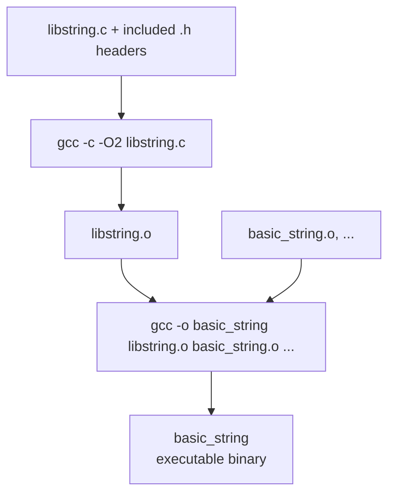
```mermaid
flowchart TB
    SRC["libstring.c + included .h headers"] --> COMPILE["gcc -c -O2 libstring.c"]
    COMPILE --> OBJ["libstring.o"]
    OBJ --> LINK["gcc -o basic_string libstring.o basic_string.o ..."]
    MORE["basic_string.o, ..."] --> LINK
    LINK --> OUT["basic_string<br/>executable binary"]
```

</ReadmeVisual>

</div>

</div>

---

<!-- SOURCE Pico-OS/README.md#112-separate-compilation-reusable-artifacts-and-linking -->

# 1. Toolchain extensions for PicoOS · 1.1 PicoC-Compiler extensions

## 1.1.2 Separate compilation, reusable artifacts, and linking (3)

<div class="deck-content readme-slide">

<div class="artifact-caption">In PicoC, each <code>.reti_blocks</code> input needs its matching <code>.st</code> in the same directory. The compiler reads it automatically:</div>
<div class="readme-artifacts artifact-single">

<!-- README_ASSET mermaid-652 -->
<ReadmeVisual kind="mermaid" :width="1024" style="flex-grow:10">

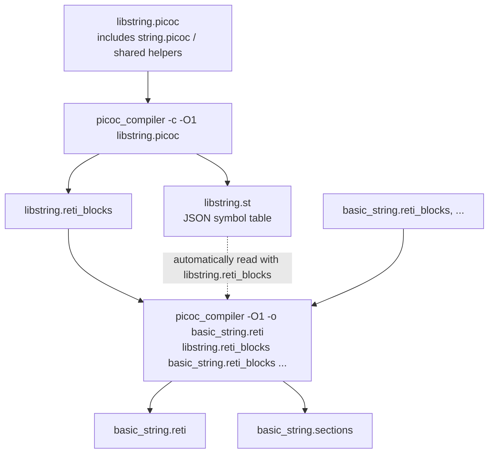
```mermaid
flowchart TB
    SRC["libstring.picoc<br/>includes string.picoc / shared helpers"] --> COMPILE["picoc_compiler -c -O1 libstring.picoc"]
    COMPILE --> OBJ["libstring.reti_blocks"]
    COMPILE --> SYMBOLS["libstring.st<br/>JSON symbol table"]
    OBJ --> LINK["picoc_compiler -O1 -o basic_string.reti<br/>libstring.reti_blocks basic_string.reti_blocks ..."]
    SYMBOLS -.->|automatically read with libstring.reti_blocks| LINK
    MORE["basic_string.reti_blocks, ..."] --> LINK
    LINK --> RETI["basic_string.reti"]
    LINK --> SECTIONS["basic_string.sections"]
```

</ReadmeVisual>

</div>

</div>

---

<!-- SOURCE Pico-OS/README.md#113-system-v-abi-stack-frames-and-call-cleanup -->

# 1. Toolchain extensions for PicoOS · 1.1 PicoC-Compiler extensions

## 1.1.3 System V ABI stack frames and call cleanup

<div class="deck-content readme-slide">

<div class="readme-explanation"><p>Compiled functions, inline assembly, startup code, and interrupt handlers share one calling convention.</p>
<p>BAF identifies the stack frame. The caller pushes arguments and a continuation, then removes argument cells after return; the callee restores BAF and returns its value in IN2.</p></div><aside class="context-note"><b>System V ABI</b><span>The ABI model coordinates compiled functions, assembly wrappers, and startup code. PicoC adapts it to RETI; it does not implement the AMD64 ABI.</span></aside>

</div>

---

<!-- SOURCE Pico-OS/README.md#1131-stack-frame-layout-and-caller-cleanup -->

# 1. Toolchain extensions for PicoOS · 1.1 PicoC-Compiler extensions · 1.1.3 System V ABI stack frames and call cleanup

## 1.1.3.1 Stack-frame layout and caller cleanup (1)

<div class="deck-content readme-slide">

<div class="readme-artifacts artifact-single">

<!-- README_ASSET table-689 rows=1-12 -->
<ReadmeVisual kind="table" :width="1100" style="flex-grow:10">

<div class="readme-table" v-pre><table><thead>
<tr>
<th>Address direction / position</th>
<th>Contents</th>
<th>Managed by</th>
</tr>
</thead><tbody><tr>
<td><strong>Higher addresses ↑</strong></td>
<td><em>Earlier stack contents</em></td>
<td><em>Earlier calls</em></td>
</tr>
<tr>
<td><em><code>caller BAF + 3</code></em></td>
<td><em>Caller function's argument</em></td>
<td><em>Caller's caller</em></td>
</tr>
<tr>
<td><em><code>caller BAF + 2</code></em></td>
<td><em>Caller function's return address</em></td>
<td><em>Caller's caller</em></td>
</tr>
<tr>
<td><em><code>caller BAF + 1</code></em></td>
<td><em>Frame pointer saved on entry to the caller</em></td>
<td><em>Caller function's own frame</em></td>
</tr>
<tr>
<td><em><code>caller BAF</code></em></td>
<td><em>Caller function's local variable</em></td>
<td><em>Caller function's own frame</em></td>
</tr>
<tr>
<td><em><code>caller BAF - 1</code></em></td>
<td><em>Temporary expression value retained across this call</em></td>
<td><em>Caller function's expression evaluation</em></td>
</tr>
<tr>
<td><strong><code>BAF + 4</code></strong></td>
<td><strong>Second argument (<code>arg2</code>)</strong></td>
<td><strong>Caller, for this call</strong></td>
</tr>
<tr>
<td><strong><code>BAF + 3</code></strong></td>
<td><strong>First argument (<code>arg1</code>)</strong></td>
<td><strong>Caller, for this call</strong></td>
</tr>
<tr>
<td><strong><code>BAF + 2</code></strong></td>
<td><strong>Return address to the caller's continuation block</strong></td>
<td><strong>Caller, for this call</strong></td>
</tr>
<tr>
<td><strong><code>BAF + 1</code></strong></td>
<td><strong>Saved <code>caller BAF</code></strong></td>
<td><strong>Current callee</strong></td>
</tr>
<tr>
<td><strong><code>BAF</code></strong></td>
<td><strong>First local variable, if present</strong></td>
<td><strong>Current callee</strong></td>
</tr>
<tr>
<td><strong><code>BAF - 1</code>, ...</strong></td>
<td><strong>Further locals and temporary expression values</strong></td>
<td><strong>Current callee</strong></td>
</tr></tbody></table></div>

</ReadmeVisual>

</div>

</div>

---

<!-- SOURCE Pico-OS/README.md#1131-stack-frame-layout-and-caller-cleanup -->

# 1. Toolchain extensions for PicoOS · 1.1 PicoC-Compiler extensions · 1.1.3 System V ABI stack frames and call cleanup

## 1.1.3.1 Stack-frame layout and caller cleanup (2)

<div class="deck-content readme-slide">

<div class="readme-artifacts artifact-single">

<!-- README_ASSET table-689 rows=13-14 -->
<ReadmeVisual kind="table" :width="1100" style="flex-grow:10">

<div class="readme-table" v-pre><table><thead>
<tr>
<th>Address direction / position</th>
<th>Contents</th>
<th>Managed by</th>
</tr>
</thead><tbody><tr>
<td><strong><code>SP</code></strong></td>
<td><strong>Free cell immediately below occupied stack cells</strong></td>
<td><strong>Current stack boundary</strong></td>
</tr>
<tr>
<td><strong>Lower addresses ↓</strong></td>
<td><strong>Direction of stack growth</strong></td>
<td></td>
</tr></tbody></table></div>

</ReadmeVisual>

</div>

</div>

---

<!-- SOURCE Pico-OS/README.md#1132-shared-function-epilogue-and-return-values -->

# 1. Toolchain extensions for PicoOS · 1.1 PicoC-Compiler extensions · 1.1.3 System V ABI stack frames and call cleanup

## 1.1.3.2 Shared function epilogue and return values (1)

<div class="deck-content readme-slide">

<div class="artifact-caption">Every ordinary function has one <code>&lt;function&gt;_epilogue</code> block. A return puts its value in <code>IN2</code> and jumps there to restore <code>BAF</code> and the return address. Keeping the result in <code>IN2</code> leaves <code>ACC</code> free for long jumps:</div>
<div class="readme-artifacts artifact-single">

<!-- README_ASSET mermaid-723 -->
<ReadmeVisual kind="mermaid" :width="1024" style="flex-grow:10">

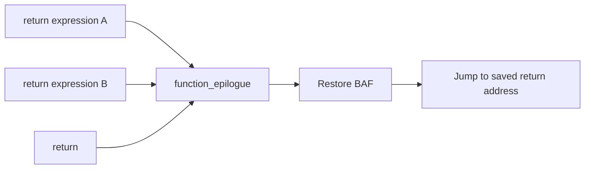
```mermaid
flowchart LR
    return_a["return expression A"] --> epilogue["function_epilogue"]
    return_b["return expression B"] --> epilogue
    return_void["return"] --> epilogue
    epilogue --> restore["Restore BAF"]
    restore --> caller["Jump to saved return address"]
```

</ReadmeVisual>

</div>

</div>

---

<!-- SOURCE Pico-OS/README.md#1132-shared-function-epilogue-and-return-values -->

# 1. Toolchain extensions for PicoOS · 1.1 PicoC-Compiler extensions · 1.1.3 System V ABI stack frames and call cleanup

## 1.1.3.2 Shared function epilogue and return values (2)

<div class="deck-content readme-slide">

<div class="readme-artifacts artifact-pair">

<!-- README_ASSET code-735 -->
<ReadmeVisual kind="code" :width="720" style="flex-grow:9">

<div class="readme-code">

```c {lines:false}
int add_one(int value) {
    return value + 1;
}

int main(void) {
    return add_one(41);
}
```

</div>

</ReadmeVisual>

<!-- README_ASSET code-748 -->
<ReadmeVisual kind="code" :width="720" style="flex-grow:3">

<div class="readme-code readme-terminal">

```console {lines:false}
$ picoc_compiler -c -O1 -v -w normal-function.picoc
```

</div>

</ReadmeVisual>

</div>

</div>

---

<!-- SOURCE Pico-OS/README.md#1132-shared-function-epilogue-and-return-values -->

# 1. Toolchain extensions for PicoOS · 1.1 PicoC-Compiler extensions · 1.1.3 System V ABI stack frames and call cleanup

## 1.1.3.2 Shared function epilogue and return values (3)

<div class="deck-content readme-slide">

<div class="artifact-caption">The <code>.picoc_anf</code> file is the last PicoC representation before RETI lowering:</div>
<div class="readme-artifacts artifact-single">

<!-- README_ASSET code-754 -->
<ReadmeVisual kind="code" :width="720" style="flex-grow:28">

<div class="readme-code">

```text {lines:false}
_global_inits:
add_one:
  NewStackframe(Num('0'))
  Exp(StackframeParam(Num('0')))
  Exp(Num('1'))
  Exp(BinOp(Stack(Num('2')), Add(), Stack(Num('1'))))
  Assign(IN2, Stack(Num('1')))
  Exp(GoTo(Name('add_one_epilogue')))
add_one_epilogue:
  RestoreStackframe()
  RestoreReturnAddress()
main:
  NewStackframe(Num('0'))
  // Call(Name('add_one'), [Num('41')])
  Exp(Num('41'))
  SaveReturnAddress(Name('main_cont.3'))
  Exp(FunRef(Name('add_one')))
  Exp(GoTo(Stack(Num('1'))))
main_cont.3:
  RemoveArguments(Num('1'))
  Exp(IN2)
  Assign(IN2, Stack(Num('1')))
  Exp(GoTo(Name('main_epilogue')))
main_epilogue:
  RestoreStackframe()
  RestoreReturnAddress()
```

</div>

</ReadmeVisual>

</div>

</div>

---

<!-- SOURCE Pico-OS/README.md#1132-shared-function-epilogue-and-return-values -->

# 1. Toolchain extensions for PicoOS · 1.1 PicoC-Compiler extensions · 1.1.3 System V ABI stack frames and call cleanup

## 1.1.3.2 Shared function epilogue and return values (4)

<div class="deck-content readme-slide">

<div class="artifact-caption">The <code>.reti_blocks</code> output retains labels and pseudoinstructions. Pattern comments show the operation behind each sequence. Only the machine-specific <code># @picoc-cache</code> line is omitted:</div>
<div class="readme-artifacts artifact-single">

<!-- README_ASSET code-787 -->
<ReadmeVisual kind="code" :width="720" style="flex-grow:69">

<div class="readme-code">

```text {lines:false}
  .ivt
  .text
add_one:
  # NewStackframe(Num('0'))
  PUSH BAF
  MOVE SP BAF
  SUBI SP 0
  # Exp(StackframeParam(Num('0')))
  LOADIN BAF ACC 3
  PUSH ACC
  # Exp(Num('1'))
  LOADI ACC 1
  PUSH ACC
  # Exp(BinOp(Stack(Num('2')), Add(), Stack(Num('1'))))
  LOADIN SP ACC 2
  LOADIN SP IN2 1
  ADD ACC IN2
  STOREIN SP ACC 2
  ADDI SP 1
  # Assign(IN2, Stack(Num('1')))
  POP IN2
  # Exp(GoTo(Name('add_one_epilogue')))
  JUMP32 add_one_epilogue
add_one_epilogue:
  # RestoreStackframe()
  MOVE BAF SP
  POP BAF
  # RestoreReturnAddress()
  POP IN1
  MOVE IN1 PC
main:
  # NewStackframe(Num('0'))
  PUSH BAF
  MOVE SP BAF
  SUBI SP 0
  # // Call(Name('add_one'), [Num('41')])
  # Exp(Num('41'))
  LOADI ACC 41
  PUSH ACC
  # SaveReturnAddress(Name('main_cont.3'))
  LOADI32 ACC main_cont.3
  ADD ACC CS
  PUSH ACC
  # Exp(FunRef(Name('add_one')))
  LOADI32 ACC add_one
  ADD ACC CS
  PUSH ACC
  # Exp(GoTo(Stack(Num('1'))))
  POP ACC
  MOVE ACC PC
main_cont.3:
  # RemoveArguments(Num('1'))
  ADDI SP 1
  # Exp(IN2)
  PUSH IN2
  # Assign(IN2, Stack(Num('1')))
  POP IN2
  # Exp(GoTo(Name('main_epilogue')))
  JUMP32 main_epilogue
main_epilogue:
  # RestoreStackframe()
  MOVE BAF SP
  POP BAF
  # RestoreReturnAddress()
  POP IN1
  MOVE IN1 PC
  .data
```

</div>

</ReadmeVisual>

</div>

</div>

---

<!-- SOURCE Pico-OS/README.md#1133-naked-functions-without-a-generated-frame -->

# 1. Toolchain extensions for PicoOS · 1.1 PicoC-Compiler extensions · 1.1.3 System V ABI stack frames and call cleanup

## 1.1.3.3 Naked functions without a generated frame (1)

<div class="deck-content readme-slide">

<div class="readme-artifacts artifact-pair">

<!-- README_ASSET code-874 -->
<ReadmeVisual kind="code" :width="720" style="flex-grow:13">

<div class="readme-code">

```c {lines:false}
__attribute__((naked))
int constant(void) {
    asm("LOADI IN2 7");
    asm("LOADIN SP ACC 1");
    asm("ADDI SP 1");
    asm("MOVE ACC PC");
}

int main(void) {
    return constant();
}
```

</div>

</ReadmeVisual>

<!-- README_ASSET code-891 -->
<ReadmeVisual kind="code" :width="720" style="flex-grow:3">

<div class="readme-code readme-terminal">

```console {lines:false}
$ picoc_compiler -c -O1 naked-function.picoc
```

</div>

</ReadmeVisual>

</div>

</div>

---

<!-- SOURCE Pico-OS/README.md#1133-naked-functions-without-a-generated-frame -->

# 1. Toolchain extensions for PicoOS · 1.1 PicoC-Compiler extensions · 1.1.3 System V ABI stack frames and call cleanup

## 1.1.3.3 Naked functions without a generated frame (2)

<div class="deck-content readme-slide">

<div class="artifact-caption">Compile-only mode preserves the complete naked block and its surrounding sections:</div>
<div class="readme-artifacts artifact-single">

<!-- README_ASSET code-895 -->
<ReadmeVisual kind="code" :width="720" style="flex-grow:31">

<div class="readme-code">

```text {lines:false}
  .ivt
  .text
constant:
  LOADI IN2 7
  LOADIN SP ACC 1
  ADDI SP 1
  MOVE ACC PC
main:
  PUSH BAF
  MOVE SP BAF
  SUBI SP 0
  LOADI32 ACC main_cont.2
  ADD ACC CS
  PUSH ACC
  LOADI32 ACC constant
  ADD ACC CS
  PUSH ACC
  POP ACC
  MOVE ACC PC
main_cont.2:
  PUSH IN2
  POP IN2
  JUMP32 main_epilogue
main_epilogue:
  MOVE BAF SP
  POP BAF
  POP IN1
  MOVE IN1 PC
  .data
```

</div>

</ReadmeVisual>

</div>

</div>

---

<!-- SOURCE Pico-OS/README.md#114-placing-globals-in-ivt-with-sectionivt -->

# 1. Toolchain extensions for PicoOS · 1.1 PicoC-Compiler extensions

## 1.1.4 Placing globals in `.ivt` with `section("ivt")` (1)

<div class="deck-content readme-slide">

<div class="artifact-caption">These two function-pointer tables contain the same handler. The attribute places only <code>ivt_table</code> in <code>.ivt</code>, at the beginning of the linked image:</div>
<div class="readme-artifacts artifact-single">

<!-- README_ASSET code-948 -->
<ReadmeVisual kind="code" :width="720" style="flex-grow:15">

<div class="readme-code">

```c {lines:false}
void handler(void);

__attribute__((section("ivt")))
void (*ivt_table[1])(void) = {handler};

void (*ordinary_table[1])(void) = {handler};

void handler(void) {
}

int main(void) {
    return 0;
}
```

</div>

</ReadmeVisual>

</div>

</div>

---

<!-- SOURCE Pico-OS/README.md#114-placing-globals-in-ivt-with-sectionivt -->

# 1. Toolchain extensions for PicoOS · 1.1 PicoC-Compiler extensions

## 1.1.4 Placing globals in `.ivt` with `section("ivt")` (2)

<div class="deck-content readme-slide">

<div class="artifact-caption">With <code>-O1</code>, known initializers become <code>IVTE</code> entries rather than startup stores. Compile-only output retains their labels and sections:</div>
<div class="readme-artifacts artifact-single">

<!-- README_ASSET code-967 -->
<ReadmeVisual kind="code" :width="720" style="flex-grow:3">

<div class="readme-code readme-terminal">

```console {lines:false}
$ picoc_compiler -c -O1 section-placement.picoc
```

</div>

</ReadmeVisual>

</div>

</div>

---

<!-- SOURCE Pico-OS/README.md#114-placing-globals-in-ivt-with-sectionivt -->

# 1. Toolchain extensions for PicoOS · 1.1 PicoC-Compiler extensions

## 1.1.4 Placing globals in `.ivt` with `section("ivt")` (3)

<div class="deck-content readme-slide">

<div class="artifact-caption">The emitted <code>section-placement.reti_blocks</code> program body is:</div>
<div class="readme-artifacts artifact-single">

<!-- README_ASSET code-973 -->
<ReadmeVisual kind="code" :width="720" style="flex-grow:32">

<div class="readme-code">

```text {lines:false}
  .ivt
ivt_table:
  IVTE handler
  .text
handler:
  PUSH BAF
  MOVE SP BAF
  SUBI SP 0
  JUMP32 handler_epilogue
handler_epilogue:
  MOVE BAF SP
  POP BAF
  POP IN1
  MOVE IN1 PC
main:
  PUSH BAF
  MOVE SP BAF
  SUBI SP 0
  LOADI ACC 0
  PUSH ACC
  POP IN2
  JUMP32 main_epilogue
main_epilogue:
  MOVE BAF SP
  POP BAF
  POP IN1
  MOVE IN1 PC
  .data
ordinary_table:
  IVTE handler
```

</div>

</ReadmeVisual>

</div>

</div>

---

<!-- SOURCE Pico-OS/README.md#114-placing-globals-in-ivt-with-sectionivt -->

# 1. Toolchain extensions for PicoOS · 1.1 PicoC-Compiler extensions

## 1.1.4 Placing globals in `.ivt` with `section("ivt")` (4)

<div class="deck-content readme-slide">

<div class="readme-artifacts artifact-pair">

<!-- README_ASSET code-1009 -->
<ReadmeVisual kind="code" :width="720" style="flex-grow:3">

<div class="readme-code readme-terminal">

```console {lines:false}
$ picoc_compiler -O1 -v -o section-placement.reti section-placement.picoc
```

</div>

</ReadmeVisual>

<!-- README_ASSET code-1016 -->
<ReadmeVisual kind="code" :width="720" style="flex-grow:14">

<div class="readme-code">

```text {lines:false}
# // Block('ivt_table', [])
2147483668
# ...
# // Block('handler', [])
# NewStackframe(Num('0'))
SUBI SP 1
STOREIN SP BAF 1
MOVE SP BAF
SUBI SP 0
# ...
# // Block('ordinary_table', [])
2147483668
```

</div>

</ReadmeVisual>

</div>

</div>

---

<!-- SOURCE Pico-OS/README.md#1151-default-compiler-generated-_start -->

# 1. Toolchain extensions for PicoOS · 1.1 PicoC-Compiler extensions · 1.1.5 Selecting a startup function with `-C` / `--startup-source`

## 1.1.5.1 Default compiler-generated `_start`

<div class="deck-content readme-slide">

<div class="artifact-caption">Without a custom entry, the compiler generates <code>_start</code> for a program with <code>main</code>. This source-equivalent example shows the flow. <code>Exit</code> is an internal compiler operation:</div>
<div class="readme-artifacts artifact-single">

<!-- README_ASSET code-1050 -->
<ReadmeVisual kind="code" :width="720" style="flex-grow:6">

<div class="readme-code">

```c {lines:false}
void _start(void) {
    main();
    Exit(0);
}
```

</div>

</ReadmeVisual>

</div>

</div>

---

<!-- SOURCE Pico-OS/README.md#1152-picoos-libstart-startup-sequence -->

# 1. Toolchain extensions for PicoOS · 1.1 PicoC-Compiler extensions · 1.1.5 Selecting a startup function with `-C` / `--startup-source`

## 1.1.5.2 PicoOS `libstart` startup sequence (1)

<div class="deck-content readme-slide">

<div class="artifact-caption">PicoOS selects <span class="source-link"><code>library/start/libstart.picoc</code></span> for userspace with <code>-C library/start/libstart.picoc</code>. The wrapper records its compiled-library dependency and includes the actual startup implementation:</div>
<div class="readme-artifacts artifact-single">

<!-- README_ASSET code-1072 -->
<ReadmeVisual kind="code" :width="720" style="flex-grow:5">

<div class="readme-code">

```c {lines:false}
// dependencies: ../stdlib/libstdlib.reti_blocks

#include "start.picoc"
```

</div>

</ReadmeVisual>

</div>

</div>

---

<!-- SOURCE Pico-OS/README.md#1152-picoos-libstart-startup-sequence -->

# 1. Toolchain extensions for PicoOS · 1.1 PicoC-Compiler extensions · 1.1.5 Selecting a startup function with `-C` / `--startup-source`

## 1.1.5.2 PicoOS `libstart` startup sequence (2)

<div class="deck-content readme-slide">

<div class="artifact-caption">The included <span class="source-link"><code>library/start/start.picoc</code></span> contains the complete userspace startup path:</div>
<div class="readme-artifacts artifact-single">

<!-- README_ASSET code-1081 -->
<ReadmeVisual kind="code" :width="720" style="flex-grow:18">

<div class="readme-code">

```c {lines:false}
#include "../stdlib/stdlib.header"
#include "../unistd/unistd.header"

int main(int argc, char **argv);
void initialize_environment(char **environment);

void start_process(int argc, char **argv) {
    init_process_heap();
    initialize_environment(argv + argc + 1);
    exit(main(argc, argv));
}

__attribute__((naked))
void _start(int argc, char *first_argument) {
    start_process(argc, (char **)&first_argument);
}
```

</div>

</ReadmeVisual>

</div>

</div>

---

<!-- SOURCE Pico-OS/README.md#1153-startup-functions-used-by-picoos-images -->

# 1. Toolchain extensions for PicoOS · 1.1 PicoC-Compiler extensions · 1.1.5 Selecting a startup function with `-C` / `--startup-source`

## 1.1.5.3 Startup functions used by PicoOS images

<div class="deck-content readme-slide">

<div class="readme-artifacts artifact-single">

<!-- README_ASSET table-1112 rows=1-5 -->
<ReadmeVisual kind="table" :width="1100" style="flex-grow:10">

<div class="readme-table" v-pre><table><thead>
<tr>
<th>Image</th>
<th><code>_start</code> used</th>
<th>Next function</th>
</tr>
</thead><tbody><tr>
<td>EPROM bootloader</td>
<td>Its explicitly defined naked <span class="source-link"><code>_start()</code></span>, compiled as part of the bootloader without <code>-C</code></td>
<td><span class="source-link"><code>boot_main()</code></span></td>
</tr>
<tr>
<td>SRAM kernel</td>
<td>Compiler-generated default <code>_start</code>, because the kernel is linked without <code>-C</code></td>
<td><span class="source-link"><code>main()</code></span></td>
</tr>
<tr>
<td>Init process</td>
<td><span class="source-link"><code>libstart</code> <code>_start()</code></span>, selected with <code>-C library/start/libstart.picoc</code></td>
<td><span class="source-link"><code>main()</code></span></td>
</tr>
<tr>
<td>Shell</td>
<td><span class="source-link"><code>libstart</code> <code>_start()</code></span>, selected with the same <code>-C</code> option</td>
<td><span class="source-link"><code>main()</code></span></td>
</tr>
<tr>
<td>User applications</td>
<td><span class="source-link"><code>libstart</code> <code>_start()</code></span>, selected by the common userspace link rule</td>
<td>The application's <code>main</code></td>
</tr></tbody></table></div>

</ReadmeVisual>

</div>

</div>

---

<!-- SOURCE Pico-OS/README.md#116-program-sections-interrupt-table-entries-and-linker-placement -->

# 1. Toolchain extensions for PicoOS · 1.1 PicoC-Compiler extensions

## 1.1.6 Program sections, interrupt table entries, and linker placement (1)

<div class="deck-content readme-slide">

<div class="readme-artifacts artifact-pair">

<!-- README_ASSET code-1760 repeated -->
<ReadmeVisual kind="code" :width="720" style="flex-grow:10">

<div class="readme-code">

```c {lines:false}
__attribute__((section("ivt")))
void (*interrupt_vector_table[OS_INTERRUPT_VECTOR_COUNT])(void) = {
    syscall_interrupt,
    timer_interrupt,
    uart_interrupt,
    cpu_exception_interrupt,
    dma_interrupt
};
```

</div>

</ReadmeVisual>

<!-- README_ASSET code-1787 repeated -->
<ReadmeVisual kind="code" :width="720" style="flex-grow:6">

<div class="readme-code">

```c {lines:false}
__attribute__((naked))
void syscall_interrupt(void) {
    // ...
}
```

</div>

</ReadmeVisual>

</div><aside class="context-note"><b>Calling convention</b><span>Inline assembly calls the linked C helpers using the same RETI adaptation of the System V stack-frame rules.</span></aside>

</div>

---

<!-- SOURCE Pico-OS/README.md#116-program-sections-interrupt-table-entries-and-linker-placement -->

# 1. Toolchain extensions for PicoOS · 1.1 PicoC-Compiler extensions

## 1.1.6 Program sections, interrupt table entries, and linker placement (2)

<div class="deck-content readme-slide">

<div class="readme-artifacts artifact-single">

<!-- README_ASSET table-1126 rows=1-3 -->
<ReadmeVisual kind="table" :width="1100" style="flex-grow:10">

<div class="readme-table" v-pre><table><thead>
<tr>
<th>Section</th>
<th>Default contents and addressing</th>
<th>How source selects it</th>
</tr>
</thead><tbody><tr>
<td><code>.ivt</code></td>
<td>interrupt service routines words and, when requested, low-level functions, it begins at image offset 0 and uses <code>CS</code>-relative global references</td>
<td>Add <code>__attribute__((section(&quot;ivt&quot;)))</code> to a global variable, function declaration, or function definition</td>
</tr>
<tr>
<td><code>.text</code></td>
<td><code>_start</code> followed by ordinary functions and their instructions, execution and code labels are relative to <code>CS</code></td>
<td>This is the default for functions</td>
</tr>
<tr>
<td><code>.data</code></td>
<td>Ordinary global storage, addressed relative to <code>DS</code></td>
<td>This is the default for global variables</td>
</tr></tbody></table></div>

</ReadmeVisual>

</div>

</div>

---

<!-- SOURCE Pico-OS/README.md#117-reti-pseudoinstructions -->

# 1. Toolchain extensions for PicoOS · 1.1 PicoC-Compiler extensions

## 1.1.7 RETI pseudoinstructions

<div class="deck-content readme-slide">

<div class="readme-artifacts artifact-single">

<!-- README_ASSET table-1152 rows=1-4 -->
<ReadmeVisual kind="table" :width="1100" style="flex-grow:10">

<div class="readme-table" v-pre><table><thead>
<tr>
<th>Pseudoinstruction</th>
<th>Purpose</th>
<th style="text-align:right">Concrete size</th>
</tr>
</thead><tbody><tr>
<td><code>PUSH reg</code></td>
<td>Reserves one stack cell and stores <code>reg</code> in it</td>
<td style="text-align:right">2 instructions</td>
</tr>
<tr>
<td><code>POP reg</code></td>
<td>Loads the top stack cell into <code>reg</code> and releases it</td>
<td style="text-align:right">2 instructions</td>
</tr>
<tr>
<td><code>LOADI32 reg operand</code></td>
<td>Loads a 32-bit literal, linked symbol, or <code>symbol +/- offset</code></td>
<td style="text-align:right">3 instructions</td>
</tr>
<tr>
<td><code>JUMP32[relation] target</code></td>
<td>Jumps to an immediate address or linked code label without the normal jump-range limit</td>
<td style="text-align:right">4--6 instructions when retained</td>
</tr></tbody></table></div>

</ReadmeVisual>

</div>

</div>

---

<!-- SOURCE Pico-OS/README.md#1171-interrupt-safe-push-and-pop -->

# 1. Toolchain extensions for PicoOS · 1.1 PicoC-Compiler extensions · 1.1.7 RETI pseudoinstructions

## 1.1.7.1 Interrupt-safe `PUSH` and `POP` (1)

<div class="deck-content readme-slide">

<div class="readme-artifacts artifact-single">

<!-- README_ASSET table-1169 rows=1-2 -->
<ReadmeVisual kind="table" :width="1100" style="flex-grow:10">

<div class="readme-table" v-pre><table><thead>
<tr>
<th>Pseudoinstruction</th>
<th>Expansion</th>
</tr>
</thead><tbody><tr>
<td><code>PUSH ACC</code></td>
<td><code>SUBI SP 1</code><br><code>STOREIN SP ACC 1</code></td>
</tr>
<tr>
<td><code>POP ACC</code></td>
<td><code>LOADIN SP ACC 1</code><br><code>ADDI SP 1</code></td>
</tr></tbody></table></div>

</ReadmeVisual>

</div>

</div>

---

<!-- SOURCE Pico-OS/README.md#1171-interrupt-safe-push-and-pop -->

# 1. Toolchain extensions for PicoOS · 1.1 PicoC-Compiler extensions · 1.1.7 RETI pseudoinstructions

## 1.1.7.1 Interrupt-safe `PUSH` and `POP` (2)

<div class="deck-content readme-slide">

<div class="artifact-caption">The compiler uses these operations for arguments, return addresses, and saved <code>BAF</code>. PicoOS also uses them in naked functions, for example to save registers in an ISR:</div>
<div class="readme-artifacts artifact-single">

<!-- README_ASSET code-1183 -->
<ReadmeVisual kind="code" :width="720" style="flex-grow:7">

<div class="readme-code">

```c {lines:false}
asm("PUSH ACC");
asm("PUSH IN1");
/* Handle the interrupt */
asm("POP IN1");
asm("POP ACC");
```

</div>

</ReadmeVisual>

</div>

</div>

---

<!-- SOURCE Pico-OS/README.md#1172-loading-32-bit-values-with-loadi32 -->

# 1. Toolchain extensions for PicoOS · 1.1 PicoC-Compiler extensions · 1.1.7 RETI pseudoinstructions

## 1.1.7.2 Loading 32-bit values with `LOADI32` (1)

<div class="deck-content readme-slide">

<div class="readme-artifacts artifact-pair">

<!-- README_ASSET code-1211 -->
<ReadmeVisual kind="code" :width="720" style="flex-grow:5">

<div class="readme-code">

```text {lines:false}
LOADI reg signed_upper
MULTI reg 1024
ORI reg lower_bits
```

</div>

</ReadmeVisual>

<!-- README_ASSET code-1223 -->
<ReadmeVisual kind="code" :width="720" style="flex-grow:5">

<div class="readme-code">

```text {lines:false}
LOADI ACC -2097152
MULTI ACC 1024
ORI ACC 5
```

</div>

</ReadmeVisual>

</div>

</div>

---

<!-- SOURCE Pico-OS/README.md#1172-loading-32-bit-values-with-loadi32 -->

# 1. Toolchain extensions for PicoOS · 1.1 PicoC-Compiler extensions · 1.1.7 RETI pseudoinstructions

## 1.1.7.2 Loading 32-bit values with `LOADI32` (2)

<div class="deck-content readme-slide">

<div class="artifact-caption">This also explains the tagged SRAM base <code>0x80000000</code>, represented in PicoC as <code>-2147483648</code>. Code labels are resolved relative to <code>CS</code>, so an absolute code address requires adding <code>CS</code> afterward. The bootloader uses this pattern:</div>
<div class="readme-artifacts artifact-single">

<!-- README_ASSET code-1233 -->
<ReadmeVisual kind="code" :width="720" style="flex-grow:5">

<div class="readme-code">

```c {lines:false}
asm("LOADI32 ACC start_loaded_kernel");
asm("ADD ACC CS");
asm("MOVE ACC PC");
```

</div>

</ReadmeVisual>

</div>

</div>

---

<!-- SOURCE Pico-OS/README.md#1173-long-jumps-with-jump32 -->

# 1. Toolchain extensions for PicoOS · 1.1 PicoC-Compiler extensions · 1.1.7 RETI pseudoinstructions

## 1.1.7.3 Long jumps with `JUMP32`

<div class="deck-content readme-slide">

<div class="artifact-caption"><code>JUMP32</code> reaches beyond the hardware's signed 22-bit relative range. For a symbolic target, it builds the target's <code>CS</code>-relative address in <code>ACC</code>, adds <code>CS</code>, and moves the result to <code>PC</code>. The bit split follows <span class="source-link"><code>1.1.7.2 Loading 32-bit values with LOADI32</code></span>:</div>
<div class="readme-artifacts artifact-single">

<!-- README_ASSET code-1275 -->
<ReadmeVisual kind="code" :width="720" style="flex-grow:7">

<div class="readme-code">

```text {lines:false}
LOADI ACC signed_upper
MULTI ACC 1024
ORI ACC lower_bits
ADD ACC CS
MOVE ACC PC
```

</div>

</ReadmeVisual>

</div>

</div>

---

<!-- SOURCE Pico-OS/README.md#1174-pseudoinstruction-expansion-during-linking -->

# 1. Toolchain extensions for PicoOS · 1.1 PicoC-Compiler extensions · 1.1.7 RETI pseudoinstructions

## 1.1.7.4 Pseudoinstruction expansion during linking (1)

<div class="deck-content readme-slide">

<div class="artifact-caption">This strip shows why expanded sizes matter. The address of <code>done</code> depends on both preceding blocks:</div>
<div class="readme-artifacts artifact-single">

<!-- README_ASSET image-1308 -->
<ReadmeVisual kind="image" :width="1024" style="flex-grow:16">


</ReadmeVisual>

</div>

</div>

---

<!-- SOURCE Pico-OS/README.md#1174-pseudoinstruction-expansion-during-linking -->

# 1. Toolchain extensions for PicoOS · 1.1 PicoC-Compiler extensions · 1.1.7 RETI pseudoinstructions

## 1.1.7.4 Pseudoinstruction expansion during linking (2)

<div class="deck-content readme-slide">

<div class="readme-artifacts artifact-single">

<!-- README_ASSET table-1310 rows=1-3 -->
<ReadmeVisual kind="table" :width="1100" style="flex-grow:10">

<div class="readme-table" v-pre><table><thead>
<tr>
<th>Block</th>
<th>Symbolic instructions</th>
<th style="text-align:right">Real instructions after expansion</th>
</tr>
</thead><tbody><tr>
<td><code>entry</code></td>
<td><code>PUSH BAF</code>, <code>LOADI32 ACC done</code>, <code>JUMP32 done</code></td>
<td style="text-align:right"><code>2 + 3 + 5 = 10</code></td>
</tr>
<tr>
<td><code>work</code></td>
<td><code>PUSH ACC</code>, <code>POP IN1</code>, <code>LOADI32 ACC 7</code></td>
<td style="text-align:right"><code>2 + 2 + 3 = 7</code></td>
</tr>
<tr>
<td><code>done</code></td>
<td><code>POP BAF</code></td>
<td style="text-align:right"><code>2</code></td>
</tr></tbody></table></div>

</ReadmeVisual>

</div>

</div>

---

<!-- SOURCE Pico-OS/README.md#118-linked-sections-metadata-and-the-five-word-binary-header -->

# 1. Toolchain extensions for PicoOS · 1.1 PicoC-Compiler extensions

## 1.1.8 Linked `.sections` metadata and the five-word binary header (1)

<div class="deck-content readme-slide">

<div class="artifact-caption">A completed link emits <span class="source-link"><code>program.reti</code></span> and <code>program.sections</code>. The latter records the image layout used for loading and segment, heap, and stack setup. A typical userspace file looks like this:</div>
<div class="readme-artifacts artifact-single">

<!-- README_ASSET code-1336 -->
<ReadmeVisual kind="code" :width="720" style="flex-grow:9">

<div class="readme-code">

```json {lines:false}
{
  "codesegment_start": 0,
  "datasegment_start": 11595,
  "heap_start": 11621,
  "heap_size": 2000,
  "stack_start": 14621
}
```

</div>

</ReadmeVisual>

</div>

</div>

---

<!-- SOURCE Pico-OS/README.md#118-linked-sections-metadata-and-the-five-word-binary-header -->

# 1. Toolchain extensions for PicoOS · 1.1 PicoC-Compiler extensions

## 1.1.8 Linked `.sections` metadata and the five-word binary header (2)

<div class="deck-content readme-slide">

<div class="readme-artifacts artifact-single">

<!-- README_ASSET table-1349 rows=1-6 -->
<ReadmeVisual kind="table" :width="1100" style="flex-grow:10">

<div class="readme-table" v-pre><table><thead>
<tr>
<th>Entry</th>
<th>Meaning</th>
</tr>
</thead><tbody><tr>
<td><code>interrupt_service_routines_start</code></td>
<td>Optional start of separately identified ISR code when the linked image contains it</td>
</tr>
<tr>
<td><code>codesegment_start</code></td>
<td>Process-relative start loaded into <code>CS</code>, for a normal userspace image this is also its initial entry region</td>
</tr>
<tr>
<td><code>datasegment_start</code></td>
<td>Process-relative start loaded into <code>DS</code></td>
</tr>
<tr>
<td><span class="source-link"><code>heap_start</code></span></td>
<td>First cell after static data and first cell managed by the process-local heap</td>
</tr>
<tr>
<td><span class="source-link"><code>heap_size</code></span></td>
<td>Heap capacity in RETI cells, <code>-1</code> requests PicoOS's default</td>
</tr>
<tr>
<td><span class="source-link"><code>stack_start</code></span></td>
<td>Highest process-relative stack cell, <code>-1</code> requests the kernel's default placement</td>
</tr></tbody></table></div>

</ReadmeVisual>

</div>

</div>

---

<!-- SOURCE Pico-OS/README.md#118-linked-sections-metadata-and-the-five-word-binary-header -->

# 1. Toolchain extensions for PicoOS · 1.1 PicoC-Compiler extensions

## 1.1.8 Linked `.sections` metadata and the five-word binary header (3)

<div class="deck-content readme-slide">

<div class="artifact-caption">Run <code>reti_emulator -a program.reti</code> to assemble a loadable binary. It reads the matching <code>.sections</code> file and prepends five big-endian layout words. <code>-S PATH</code> selects another metadata file. The diagram shows both inputs:</div>
<div class="readme-artifacts artifact-single">

<!-- README_ASSET mermaid-1366 -->
<ReadmeVisual kind="mermaid" :width="1024" style="flex-grow:10">

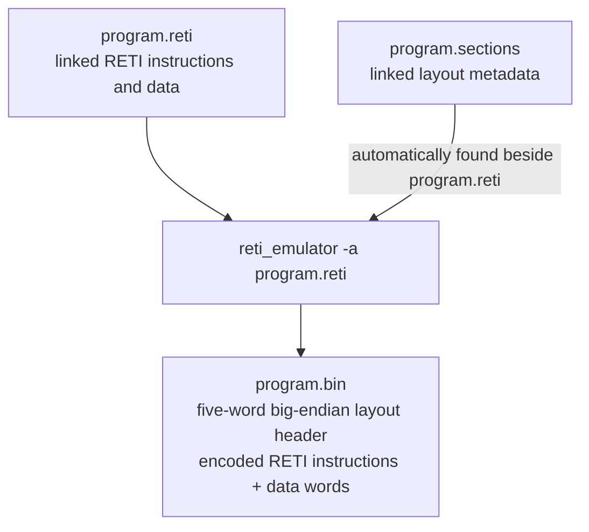
```mermaid
flowchart TB
    RETI["program.reti<br/>linked RETI instructions and data"] --> ASSEMBLE["reti_emulator -a program.reti"]
    SECTIONS["program.sections<br/>linked layout metadata"] -->|automatically found beside program.reti| ASSEMBLE
    ASSEMBLE --> BIN["program.bin<br/>five-word big-endian layout header<br/>encoded RETI instructions + data words"]
```

</ReadmeVisual>

</div>

</div>

---

<!-- SOURCE Pico-OS/README.md#118-linked-sections-metadata-and-the-five-word-binary-header -->

# 1. Toolchain extensions for PicoOS · 1.1 PicoC-Compiler extensions

## 1.1.8 Linked `.sections` metadata and the five-word binary header (4)

<div class="deck-content readme-slide">

<div class="artifact-caption">For example, with the <code>.sections</code> values above, assembling an illustrative <span class="source-link"><code>program.reti</code></span> produces this five-word header:</div>
<div class="readme-artifacts artifact-single">

<!-- README_ASSET code-1376 -->
<ReadmeVisual kind="code" :width="728" style="flex-grow:8">

<div class="readme-code readme-terminal">

```console {lines:false}
$ reti_emulator -a program.reti
$ hexyl -n 20 program.bin
┌────────┬─────────────────────────┬─────────────────────────┬────────┬────────┐
│00000000│ 00 00 00 00 00 00 2d 4b ┊ 00 00 2d 65 00 00 07 d0 │......-K┊..-e....│
│00000010│ 00 00 39 1d             ┊                         │..9.    ┊        │
└────────┴─────────────────────────┴─────────────────────────┴────────┴────────┘
```

</div>

</ReadmeVisual>

</div>

</div>

---

<!-- SOURCE Pico-OS/README.md#118-linked-sections-metadata-and-the-five-word-binary-header -->

# 1. Toolchain extensions for PicoOS · 1.1 PicoC-Compiler extensions

## 1.1.8 Linked `.sections` metadata and the five-word binary header (5)

<div class="deck-content readme-slide">

<div class="readme-artifacts artifact-single">

<!-- README_ASSET table-1390 rows=1-5 -->
<ReadmeVisual kind="table" :width="1100" style="flex-grow:10">

<div class="readme-table" v-pre><table><thead>
<tr>
<th style="text-align:right">Word</th>
<th>Value</th>
<th>Use in PicoOS</th>
</tr>
</thead><tbody><tr>
<td style="text-align:right">0</td>
<td><code>codesegment_start</code></td>
<td>Initial code segment and entry point</td>
</tr>
<tr>
<td style="text-align:right">1</td>
<td><code>datasegment_start</code></td>
<td>Initial data segment</td>
</tr>
<tr>
<td style="text-align:right">2</td>
<td><span class="source-link"><code>heap_start</code></span></td>
<td>Start of the User Process Heap within a Process Payload</td>
</tr>
<tr>
<td style="text-align:right">3</td>
<td><span class="source-link"><code>heap_size</code></span></td>
<td>Configured heap size, or <code>-1</code> for the PicoOS default</td>
</tr>
<tr>
<td style="text-align:right">4</td>
<td><span class="source-link"><code>stack_start</code></span></td>
<td>Highest stack cell, or <code>-1</code> for the PicoOS default</td>
</tr></tbody></table></div>

</ReadmeVisual>

</div>

</div>

---

<!-- SOURCE Pico-OS/README.md#119-generated-memory-constants-for-the-bootloader-and-kernel -->

# 1. Toolchain extensions for PicoOS · 1.1 PicoC-Compiler extensions

## 1.1.9 Generated memory constants for the bootloader and kernel (1)

<div class="deck-content readme-slide">

<div class="artifact-caption">The current kernel header is shown below. Its values come from the linked kernel layout with a 4,096-cell heap and a 2,715-cell stack:</div>
<div class="readme-artifacts artifact-single">

<!-- README_ASSET code-1416 -->
<ReadmeVisual kind="code" :width="736.6" style="flex-grow:11">

<div class="readme-code">

```c {lines:false}
#define SRAM_BASE (-2147483647 - 1) // -2^31
#define SRAM_MAX_ADDRESS_IN_MEMORY_MAP -2147221505 // -2^31 + 2^18 - 1
#define KERNEL_HEAP_START -2147442151 // -2^31 + heap_start
#define KERNEL_HEAP_SIZE 4096 // heap_size
#define PROCESS_MEMORY_START -2147435339 // -2^31 + stack_start + 1
#define KERNEL_CS_START_ASM "LOADI32 CS -2147483643" // -2^31 + codesegment_start
#define KERNEL_DS_START_ASM "LOADI32 DS -2147442882" // -2^31 + datasegment_start
#define KERNEL_SP_START_ASM "LOADI32 SP -2147435340" // -2^31 + stack_start
#define KERNEL_CS_ACC_ASM "LOADI32 ACC -2147483643" // -2^31 + codesegment_start
```

</div>

</ReadmeVisual>

</div>

</div>

---

<!-- SOURCE Pico-OS/README.md#119-generated-memory-constants-for-the-bootloader-and-kernel -->

# 1. Toolchain extensions for PicoOS · 1.1 PicoC-Compiler extensions

## 1.1.9 Generated memory constants for the bootloader and kernel (2)

<div class="deck-content readme-slide">

<div class="readme-artifacts artifact-single">

<!-- README_ASSET table-1430 rows=1-7 -->
<ReadmeVisual kind="table" :width="1100" style="flex-grow:10">

<div class="readme-table" v-pre><table><thead>
<tr>
<th>Kernel constant</th>
<th>Consumer and purpose</th>
</tr>
</thead><tbody><tr>
<td><span class="source-link"><code>SRAM_BASE</code></span></td>
<td>Converts process-relative linked addresses to the absolute SRAM address space</td>
</tr>
<tr>
<td><span class="source-link"><code>SRAM_MAX_ADDRESS_IN_MEMORY_MAP</code></span></td>
<td>Inclusive final configured SRAM cell, bounds the Process and Shared Data Heap</td>
</tr>
<tr>
<td><span class="source-link"><code>KERNEL_HEAP_START</code></span>, <span class="source-link"><code>KERNEL_HEAP_SIZE</code></span></td>
<td>Initialize the global <span class="source-link"><code>kernel_heap</code></span> descriptor and define its stack boundary</td>
</tr>
<tr>
<td><span class="source-link"><code>PROCESS_MEMORY_START</code></span></td>
<td>First cell managed by the global <span class="source-link"><code>process_shared_data_heap</code></span> for Process Payloads and Shared Data Payloads</td>
</tr>
<tr>
<td><span class="source-link"><code>KERNEL_CS_START_ASM</code></span>, <span class="source-link"><code>KERNEL_DS_START_ASM</code></span></td>
<td>Inline assembly fragments used when interrupt entries install kernel segments</td>
</tr>
<tr>
<td><span class="source-link"><code>KERNEL_SP_START_ASM</code></span></td>
<td>Inline assembly fragment that installs the linked kernel stack start</td>
</tr>
<tr>
<td><span class="source-link"><code>KERNEL_CS_ACC_ASM</code></span></td>
<td>Generated fragment for loading the kernel code base into <code>ACC</code>, currently unused by PicoOS source</td>
</tr></tbody></table></div>

</ReadmeVisual>

</div>

</div>

---

<!-- SOURCE Pico-OS/README.md#119-generated-memory-constants-for-the-bootloader-and-kernel -->

# 1. Toolchain extensions for PicoOS · 1.1 PicoC-Compiler extensions

## 1.1.9 Generated memory constants for the bootloader and kernel (3)

<div class="deck-content readme-slide">

<div class="artifact-caption">The current bootloader header establishes the temporary context before the kernel image supplies its own segment and stack values. The code shows the generated format, and the following table explains its three constants:</div>
<div class="readme-artifacts artifact-single">

<!-- README_ASSET code-1444 -->
<ReadmeVisual kind="code" :width="720" style="flex-grow:5">

<div class="readme-code">

```c {lines:false}
#define SRAM_MAX_ADDRESS 262143 // 2^18 - 1
#define EPROM_DS_START_ASM "LOADI32 DS 3165" // datasegment_start
#define EPROM_STACK_START_ASM "LOADI32 SP -2147221505" // -2^31 + 2^18 - 1
```

</div>

</ReadmeVisual>

</div>

</div>

---

<!-- SOURCE Pico-OS/README.md#119-generated-memory-constants-for-the-bootloader-and-kernel -->

# 1. Toolchain extensions for PicoOS · 1.1 PicoC-Compiler extensions

## 1.1.9 Generated memory constants for the bootloader and kernel (4)

<div class="deck-content readme-slide">

<div class="readme-artifacts artifact-single">

<!-- README_ASSET table-1450 rows=1-3 -->
<ReadmeVisual kind="table" :width="1100" style="flex-grow:10">

<div class="readme-table" v-pre><table><thead>
<tr>
<th>Bootloader constant</th>
<th>Consumer and purpose</th>
</tr>
</thead><tbody><tr>
<td><span class="source-link"><code>SRAM_MAX_ADDRESS</code></span></td>
<td>Final physical SRAM offset, fallback kernel stack offset when the loaded header contains -1</td>
</tr>
<tr>
<td><span class="source-link"><code>EPROM_DS_START_ASM</code></span></td>
<td>Loads the bootloader's linked EPROM data segment</td>
</tr>
<tr>
<td><span class="source-link"><code>EPROM_STACK_START_ASM</code></span></td>
<td>Loads the absolute top-of-SRAM temporary stack</td>
</tr></tbody></table></div>

</ReadmeVisual>

</div>

</div>

---

<!-- SOURCE Pico-OS/README.md#12-reti-emulator-extensions -->

# 1. Toolchain extensions for PicoOS

## 1.2 RETI-Emulator extensions (1)

<div class="deck-content readme-slide">

<div class="readme-artifacts artifact-single">

<!-- README_ASSET table-1470 rows=1-12 -->
<ReadmeVisual kind="table" :width="1100" style="flex-grow:10">

<div class="readme-table" v-pre><table><thead>
<tr>
<th>Feature</th>
<th>Contribution used by PicoOS</th>
</tr>
</thead><tbody><tr>
<td>Plain execution output</td>
<td>Without the debugger, completed UART output is written directly to host stdout</td>
</tr>
<tr>
<td>Commented assembly</td>
<td>Debug mode can show source-derived labels and comments beside instructions</td>
</tr>
<tr>
<td>Atomic locking</td>
<td><code>TSL</code> atomically returns a cell's old value and stores <code>1</code>, supporting the mutex library</td>
</tr>
<tr>
<td>Structured loading</td>
<td><code>.sections</code> distinguishes the interrupt service routine table, ISR code, <code>.text</code>, <code>.data</code>, heap, and stack</td>
</tr>
<tr>
<td>Binary assembly</td>
<td><code>--assemble program.reti</code> combines RETI words with the five layout header words in <code>program.bin</code></td>
</tr>
<tr>
<td>EPROM-only boot</td>
<td><code>-e boot/bootloader.reti</code> starts CPU execution at the EPROM bootloader without preloading a program into SRAM</td>
</tr>
<tr>
<td>Configurable SRAM</td>
<td>PicoOS selects 262,144 physical 32-bit cells while retaining the RETI tagged address space</td>
</tr>
<tr>
<td>Memory-mapped periphery</td>
<td>UART, device mappings, priorities, timer interval, stack boundary, exception cause, and optional DMA occupy offsets 0–16</td>
</tr>
<tr>
<td>Interrupt controller</td>
<td>Timer, DMA through the custom device line, and UART have configurable ISR mappings, priorities, pending state, and nesting behavior</td>
</tr>
<tr>
<td>Direct memory access</td>
<td>Optional DMA copies UART words into SRAM for kernel, init, and later program loading, scheduled loads receive a completion interrupt</td>
</tr>
<tr>
<td>Manual interrupts</td>
<td>The TUI can select and trigger an interrupt service routines for inspection</td>
</tr>
<tr>
<td>Runtime timer</td>
<td>An instruction-count interval produces repeatable userspace preemption and exposes the live counter in the TUI</td>
</tr></tbody></table></div>

</ReadmeVisual>

</div>

</div>

---

<!-- SOURCE Pico-OS/README.md#12-reti-emulator-extensions -->

# 1. Toolchain extensions for PicoOS

## 1.2 RETI-Emulator extensions (2)

<div class="deck-content readme-slide">

<div class="readme-artifacts artifact-single">

<!-- README_ASSET table-1470 rows=13-24 -->
<ReadmeVisual kind="table" :width="1100" style="flex-grow:10">

<div class="readme-table" v-pre><table><thead>
<tr>
<th>Feature</th>
<th>Contribution used by PicoOS</th>
</tr>
</thead><tbody><tr>
<td>Raw-byte UART</td>
<td>Receive/send registers and status bits model byte delivery rather than line-oriented console input</td>
</tr>
<tr>
<td>UART host services</td>
<td>The emulator parses bounded load, read, file-size, output, directory, and removal requests from the byte stream</td>
</tr>
<tr>
<td>Normal and raw terminals</td>
<td>The normal view preserves host signal processing, raw mode forwards control and escape bytes needed by the shell</td>
</tr>
<tr>
<td>CPU exceptions</td>
<td>Divide by zero, stack overflow, and illegal instructions enter interrupt service routine table entry 3 and expose a cause value</td>
</tr>
<tr>
<td>Stack/heap protection</td>
<td>The active inclusive boundary is checked whenever an instruction attempts to decrease <code>SP</code></td>
</tr>
<tr>
<td>Runtime segment interpretation</td>
<td>Code/data/watch views follow live <code>CS</code> and <code>DS</code> after bootloading and context switches</td>
</tr>
<tr>
<td>Source-level debugging</td>
<td><code>.debuginfo</code> and preprocessed source provide globals, locals, arguments, calls, frames, and source positions</td>
</tr>
<tr>
<td>SRAM transcoding</td>
<td>Memory can be viewed as numbers, characters, or decoded instructions without losing known-code regions</td>
</tr>
<tr>
<td>Snapshots and restart</td>
<td>Complete CPU, memory, interrupt, UART, and peripheral state can be saved, restored repeatedly, or restarted</td>
</tr>
<tr>
<td>Live inspection/editing</td>
<td>Windows can be selected, scrolled, centered, and edited while inspecting registers or memory</td>
</tr>
<tr>
<td>Synthetic OS context</td>
<td>The initial debugger state can model the kernel/interrupt context needed before PicoOS's first <code>RTI</code></td>
</tr>
<tr>
<td>Explicit ISR table size</td>
<td>The emulator can reserve the five-entry IVT before the bootloader populates SRAM</td>
</tr></tbody></table></div>

</ReadmeVisual>

</div>

</div>

---

<!-- SOURCE Pico-OS/README.md#12-reti-emulator-extensions -->

# 1. Toolchain extensions for PicoOS

## 1.2 RETI-Emulator extensions (3)

<div class="deck-content readme-slide">

<div class="readme-artifacts artifact-single">

<!-- README_ASSET table-1470 rows=25-25 -->
<ReadmeVisual kind="table" :width="1100" style="flex-grow:10">

<div class="readme-table" v-pre><table><thead>
<tr>
<th>Feature</th>
<th>Contribution used by PicoOS</th>
</tr>
</thead><tbody><tr>
<td>Isolated assembly runs</td>
<td>The repository wrapper keeps assembler processes from overwriting peripheral files belonging to an active OS instance</td>
</tr></tbody></table></div>

</ReadmeVisual>

</div>

</div>

---

<!-- SOURCE Pico-OS/README.md#121-reti-machine-model-and-memory-mapped-peripherals -->

# 1. Toolchain extensions for PicoOS · 1.2 RETI-Emulator extensions

## 1.2.1 RETI machine model and memory-mapped peripherals (1)

<div class="deck-content readme-slide">

<div class="artifact-caption">The emulator documentation calls the <code>01</code> region <strong>periphery</strong>. The map places this region between EPROM and SRAM:</div>
<div class="readme-artifacts artifact-single">

<!-- README_ASSET image-1508 -->
<ReadmeVisual kind="image" :width="1024" style="flex-grow:16">


</ReadmeVisual>

</div>

</div>

---

<!-- SOURCE Pico-OS/README.md#121-reti-machine-model-and-memory-mapped-peripherals -->

# 1. Toolchain extensions for PicoOS · 1.2 RETI-Emulator extensions

## 1.2.1 RETI machine model and memory-mapped peripherals (2)

<div class="deck-content readme-slide">

<div class="readme-artifacts artifact-single">

<!-- README_ASSET table-1513 rows=1-3 -->
<ReadmeVisual kind="table" :width="1100" style="flex-grow:10">

<div class="readme-table" v-pre><table><thead>
<tr>
<th>Address range</th>
<th>Top-bit prefix</th>
<th>RETI region</th>
<th>Implemented PicoOS use</th>
</tr>
</thead><tbody><tr>
<td><code>0x00000000..0x3fffffff</code></td>
<td><code>00</code></td>
<td>EPROM</td>
<td>Bootloader code and data</td>
</tr>
<tr>
<td><strong><code>0x40000000..0x7fffffff</code></strong></td>
<td><strong><code>01</code></strong></td>
<td><strong>Periphery</strong></td>
<td><strong>Offsets <code>0..16</code>, through <code>0x40000010</code>, are implemented memory-mapped registers</strong></td>
</tr>
<tr>
<td><code>0x80000000..0xffffffff</code></td>
<td><code>10</code> or <code>11</code></td>
<td>SRAM</td>
<td>Kernel image, process images, heaps, stacks, and shared data</td>
</tr></tbody></table></div>

</ReadmeVisual>

</div>

</div>

---

<!-- SOURCE Pico-OS/README.md#121-reti-machine-model-and-memory-mapped-peripherals -->

# 1. Toolchain extensions for PicoOS · 1.2 RETI-Emulator extensions

## 1.2.1 RETI machine model and memory-mapped peripherals (3)

<div class="deck-content readme-slide">

<div class="readme-artifacts artifact-single">

<!-- README_ASSET table-1523 rows=1-12 -->
<ReadmeVisual kind="table" :width="1100" style="flex-grow:10">

<div class="readme-table" v-pre><table><thead>
<tr>
<th style="text-align:right">Offset</th>
<th>Register</th>
<th>Access and connection to PicoOS</th>
</tr>
</thead><tbody><tr>
<td style="text-align:right">0</td>
<td>UART send</td>
<td>Kernel/bootloader write the low byte and clear send-ready in offset 2</td>
</tr>
<tr>
<td style="text-align:right">1</td>
<td>UART receive</td>
<td>Emulator writes an incoming byte, polling code or UART ISR reads it</td>
</tr>
<tr>
<td style="text-align:right">2</td>
<td>UART status</td>
<td>Bit 0 reports send-ready and bit 1 receive-ready</td>
</tr>
<tr>
<td style="text-align:right">3–5</td>
<td>Device-to-ISR mappings</td>
<td>Timer, custom device, and UART select IVT indices, 255 disables a line</td>
</tr>
<tr>
<td style="text-align:right">6–8</td>
<td>Device priorities</td>
<td>Interrupt controller selects the highest-priority pending device</td>
</tr>
<tr>
<td style="text-align:right">9</td>
<td>Timer interval</td>
<td>Instruction-count period, zero disables and a write restarts the counter</td>
</tr>
<tr>
<td style="text-align:right">10</td>
<td>Stack/heap boundary</td>
<td>Inclusive active lower stack limit, dispatcher rewrites it on every context switch</td>
</tr>
<tr>
<td style="text-align:right">11</td>
<td>CPU exception cause</td>
<td>Read-only: none, divide by zero, stack overflow, or illegal instruction</td>
</tr>
<tr>
<td style="text-align:right">12</td>
<td>DMA active</td>
<td>Always present, <code>1</code> enables DMA and exposes offsets 13–16</td>
</tr>
<tr>
<td style="text-align:right">13</td>
<td>DMA source</td>
<td>Absolute UART receive address used by PicoOS</td>
</tr>
<tr>
<td style="text-align:right">14</td>
<td>DMA destination</td>
<td>Absolute SRAM destination address</td>
</tr>
<tr>
<td style="text-align:right">15</td>
<td>DMA word count</td>
<td>Number of complete 32-bit words to copy</td>
</tr></tbody></table></div>

</ReadmeVisual>

</div>

</div>

---

<!-- SOURCE Pico-OS/README.md#121-reti-machine-model-and-memory-mapped-peripherals -->

# 1. Toolchain extensions for PicoOS · 1.2 RETI-Emulator extensions

## 1.2.1 RETI machine model and memory-mapped peripherals (4)

<div class="deck-content readme-slide">

<div class="readme-artifacts artifact-single">

<!-- README_ASSET table-1523 rows=13-13 -->
<ReadmeVisual kind="table" :width="1100" style="flex-grow:10">

<div class="readme-table" v-pre><table><thead>
<tr>
<th style="text-align:right">Offset</th>
<th>Register</th>
<th>Access and connection to PicoOS</th>
</tr>
</thead><tbody><tr>
<td style="text-align:right">16</td>
<td>DMA status/control</td>
<td><code>0</code> idle, write/read <code>1</code> for start/busy, <code>2</code> complete, <code>3</code> error</td>
</tr></tbody></table></div>

</ReadmeVisual>

</div>

</div>

---

<!-- SOURCE Pico-OS/README.md#122-atomic-test-and-set-with-tsl -->

# 1. Toolchain extensions for PicoOS · 1.2 RETI-Emulator extensions

## 1.2.2 Atomic test-and-set with `TSL` (1)

<div class="deck-content readme-slide">

<div class="readme-artifacts artifact-pair">

<!-- README_ASSET code-1552 -->
<ReadmeVisual kind="code" :width="720" style="flex-grow:5">

<div class="readme-code">

```text {lines:false}
# Before: M[DS + 2] = 0
TSL DS ACC 2
# After:  ACC = 0 and M[DS + 2] = 1
```

</div>

</ReadmeVisual>

<!-- README_ASSET image-1562 -->
<ReadmeVisual kind="image" :width="1024" style="flex-grow:16">


</ReadmeVisual>

</div>

</div>

---

<!-- SOURCE Pico-OS/README.md#122-atomic-test-and-set-with-tsl -->

# 1. Toolchain extensions for PicoOS · 1.2 RETI-Emulator extensions

## 1.2.2 Atomic test-and-set with `TSL` (2)

<div class="deck-content readme-slide">

<div class="artifact-caption"><code>TSL</code> occupies mode <code>10</code> of RETI's Store, Move category. These fields encode <code>TSL DS ACC 2</code>:</div>
<div class="readme-artifacts artifact-single">

<!-- README_ASSET image-1572 -->
<ReadmeVisual kind="image" :width="1024" style="flex-grow:16">


</ReadmeVisual>

</div>

</div>

---

<!-- SOURCE Pico-OS/README.md#122-atomic-test-and-set-with-tsl -->

# 1. Toolchain extensions for PicoOS · 1.2 RETI-Emulator extensions

## 1.2.2 Atomic test-and-set with `TSL` (3)

<div class="deck-content readme-slide">

<div class="readme-artifacts artifact-single">

<!-- README_ASSET table-1580 rows=1-4 -->
<ReadmeVisual kind="table" :width="1100" style="flex-grow:10">

<div class="readme-table" v-pre><table><thead>
<tr>
<th>Type</th>
<th>Mode <code>M</code></th>
<th>Assembly syntax</th>
<th>Operation</th>
</tr>
</thead><tbody><tr>
<td><code>10</code></td>
<td><code>00</code></td>
<td><code>STORE S i</code></td>
<td>Store register <code>S</code> at the direct, DS-completed address</td>
</tr>
<tr>
<td><code>10</code></td>
<td><code>01</code></td>
<td><code>STOREIN D S i</code></td>
<td>Store register <code>S</code> at address <code>D + i</code></td>
</tr>
<tr>
<td><code>10</code></td>
<td><code>10</code></td>
<td><code>TSL S D i</code></td>
<td>Return <code>M[S + i]</code> in <code>D</code>, then set that cell to <code>1</code></td>
</tr>
<tr>
<td><code>10</code></td>
<td><code>11</code></td>
<td><code>MOVE S D</code></td>
<td>Copy register <code>S</code> to register <code>D</code></td>
</tr></tbody></table></div>

</ReadmeVisual>

</div>

</div>

---

<!-- SOURCE Pico-OS/README.md#123-uart-host-service-protocol -->

# 1. Toolchain extensions for PicoOS · 1.2 RETI-Emulator extensions

## 1.2.3 UART host-service protocol (1)

<div class="deck-content readme-slide">

<div class="artifact-caption">On hardware, a host program serves PicoOS filesystem and terminal requests over the USB-to-UART connection. The diagram follows requests and responses through that connection:</div>
<div class="readme-artifacts artifact-single">

<!-- README_ASSET mermaid-1598 -->
<ReadmeVisual kind="mermaid" :width="1024" style="flex-grow:10">

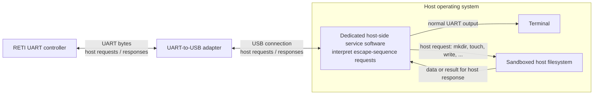
```mermaid
flowchart LR
    UART["RETI UART controller"] <-->|"UART bytes<br/>host requests / responses"| ADAPTER["UART-to-USB adapter"]
    ADAPTER <-->|"USB connection<br/>host requests / responses"| SERVICE
    subgraph HOST["Host operating system"]
        SERVICE["Dedicated host-side service software<br/>interpret escape-sequence requests"]
        TERMINAL["Terminal"]
        FILES["Sandboxed host filesystem"]
        SERVICE -->|normal UART output| TERMINAL
        SERVICE -->|"host request: mkdir, touch, write, ..."| FILES
        FILES -->|data or result for host response| SERVICE
    end
```

</ReadmeVisual>

</div>

</div>

---

<!-- SOURCE Pico-OS/README.md#123-uart-host-service-protocol -->

# 1. Toolchain extensions for PicoOS · 1.2 RETI-Emulator extensions

## 1.2.3 UART host-service protocol (2)

<div class="deck-content readme-slide">

<div class="artifact-caption">During development, the emulator models UART and serves those requests directly:</div>
<div class="readme-artifacts artifact-single">

<!-- README_ASSET mermaid-1615 -->
<ReadmeVisual kind="mermaid" :width="1024" style="flex-grow:10">

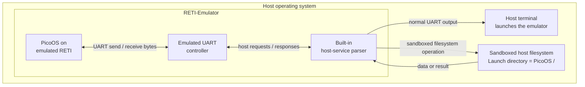
```mermaid
%%{init: {"flowchart": {"nodeSpacing": 20, "rankSpacing": 45, "wrappingWidth": 300}}}%%
flowchart LR
    subgraph HOST["Host operating system"]
        direction LR
        subgraph EMU["RETI-Emulator"]
            direction LR
            GUEST["PicoOS on<br/>emulated RETI"]
            UART["Emulated UART<br/>controller"]
            SERVICE["Built-in<br/>host-service parser"]
            GUEST <-->|UART send / receive bytes| UART
            UART <-->|host requests / responses| SERVICE
        end
        SERVICE -->|normal UART output| TERMINAL["Host terminal<br/>launches the emulator"]
        SERVICE -->|sandboxed filesystem operation| FILES["Sandboxed host filesystem<br/>Launch directory = PicoOS /"]
        FILES -->|data or result| SERVICE
    end
```

</ReadmeVisual>

</div>

</div>

---

<!-- SOURCE Pico-OS/README.md#123-uart-host-service-protocol -->

# 1. Toolchain extensions for PicoOS · 1.2 RETI-Emulator extensions

## 1.2.3 UART host-service protocol (3)

<div class="deck-content readme-slide">

<div class="readme-artifacts artifact-single">

<!-- README_ASSET table-1642 rows=1-12 -->
<ReadmeVisual kind="table" :width="1100" style="flex-grow:10">

<div class="readme-table" v-pre><table><thead>
<tr>
<th>Request form</th>
<th>Result</th>
</tr>
</thead><tbody><tr>
<td><code>&lt;ESC&gt;load &lt;path&gt;&lt;ESC&gt;/</code></td>
<td>Big-endian word count followed by binary bytes, used by the bootloader</td>
</tr>
<tr>
<td><code>&lt;ESC&gt;read-range &lt;offset&gt; &lt;count&gt; &lt;path&gt;&lt;ESC&gt;/</code></td>
<td>Returned byte count followed by that file range</td>
</tr>
<tr>
<td><code>&lt;ESC&gt;file-size &lt;path&gt;&lt;ESC&gt;/</code></td>
<td>File size as one 32-bit value</td>
</tr>
<tr>
<td><code>&lt;ESC&gt;write &lt;path&gt;&lt;ESC&gt;/</code></td>
<td>Create/truncate a file and route following UART bytes to it</td>
</tr>
<tr>
<td><code>&lt;ESC&gt;write-at &lt;offset&gt; &lt;path&gt;&lt;ESC&gt;/</code></td>
<td>Preserve a file and route following UART bytes to the byte offset</td>
</tr>
<tr>
<td><code>&lt;ESC&gt;write stdout&lt;ESC&gt;/</code> / <span class="source-link"><code>stderr</code></span></td>
<td>Restore a host standard output stream</td>
</tr>
<tr>
<td><code>&lt;ESC&gt;literal-output &lt;count&gt;&lt;ESC&gt;/</code></td>
<td>Treat exactly the next <code>count</code> UART bytes as output data, even when they contain <code>&lt;ESC&gt;</code></td>
</tr>
<tr>
<td><code>&lt;ESC&gt;pwd&lt;ESC&gt;/</code></td>
<td>PicoOS root <code>/</code> as a length-prefixed string</td>
</tr>
<tr>
<td><code>&lt;ESC&gt;is-directory &lt;path&gt;&lt;ESC&gt;/</code></td>
<td>Directory test</td>
</tr>
<tr>
<td><code>&lt;ESC&gt;mkdir &lt;path&gt;&lt;ESC&gt;/</code></td>
<td>Create a directory</td>
</tr>
<tr>
<td><code>&lt;ESC&gt;ls &lt;path&gt;&lt;ESC&gt;/</code></td>
<td>Length-prefixed directory listing</td>
</tr>
<tr>
<td><code>&lt;ESC&gt;unlink &lt;path&gt;&lt;ESC&gt;/</code></td>
<td>Remove a file</td>
</tr></tbody></table></div>

</ReadmeVisual>

</div>

</div>

---

<!-- SOURCE Pico-OS/README.md#123-uart-host-service-protocol -->

# 1. Toolchain extensions for PicoOS · 1.2 RETI-Emulator extensions

## 1.2.3 UART host-service protocol (4)

<div class="deck-content readme-slide">

<div class="readme-artifacts artifact-single">

<!-- README_ASSET table-1642 rows=13-15 -->
<ReadmeVisual kind="table" :width="1100" style="flex-grow:10">

<div class="readme-table" v-pre><table><thead>
<tr>
<th>Request form</th>
<th>Result</th>
</tr>
</thead><tbody><tr>
<td><code>&lt;ESC&gt;rmdir &lt;path&gt;&lt;ESC&gt;/</code></td>
<td>Remove an empty directory</td>
</tr>
<tr>
<td><code>&lt;ESC&gt;move &lt;old path&gt;\n&lt;new path&gt;&lt;ESC&gt;/</code></td>
<td>Move or rename a file or directory</td>
</tr>
<tr>
<td><code>&lt;ESC&gt;touch &lt;path&gt;&lt;ESC&gt;/</code></td>
<td>Create a file or update its timestamps</td>
</tr></tbody></table></div>

</ReadmeVisual>

</div>

</div>

---

<!-- SOURCE Pico-OS/README.md#123-uart-host-service-protocol -->

# 1. Toolchain extensions for PicoOS · 1.2 RETI-Emulator extensions

## 1.2.3 UART host-service protocol (5)

<div class="deck-content readme-slide">

<div class="artifact-caption">Replies arrive on the same UART stream. A <span class="source-link"><code>load</code></span> response contains a word count followed by file bytes. <code>ESC</code> below means byte 27:</div>
<div class="readme-artifacts artifact-single">

<!-- README_ASSET mermaid-1666 -->
<ReadmeVisual kind="mermaid" :width="1024" style="flex-grow:10">

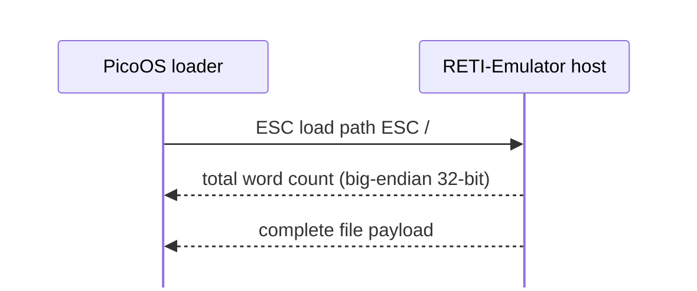
```mermaid
%%{init: {"sequence": {"wrap": false, "actorMargin": 60, "width": 180, "height": 45, "messageMargin": 25, "mirrorActors": false, "diagramMarginY": 35}, "themeCSS": "rect { rx: 0 !important; ry: 0 !important; }"}}%%
sequenceDiagram
    participant P as PicoOS loader
    participant H as RETI-Emulator host

    P->>H: ESC load path ESC /
    H-->>P: total word count (big-endian 32-bit)
    H-->>P: complete file payload
```

</ReadmeVisual>

</div>

</div>

---

<!-- SOURCE Pico-OS/README.md#123-uart-host-service-protocol -->

# 1. Toolchain extensions for PicoOS · 1.2 RETI-Emulator extensions

## 1.2.3 UART host-service protocol (6)

<div class="deck-content readme-slide">

<div class="artifact-caption">Ranged reads return a byte count and payload. Metadata and status requests return one big-endian value:</div>
<div class="readme-artifacts artifact-single">

<!-- README_ASSET mermaid-1680 -->
<ReadmeVisual kind="mermaid" :width="1024" style="flex-grow:10">

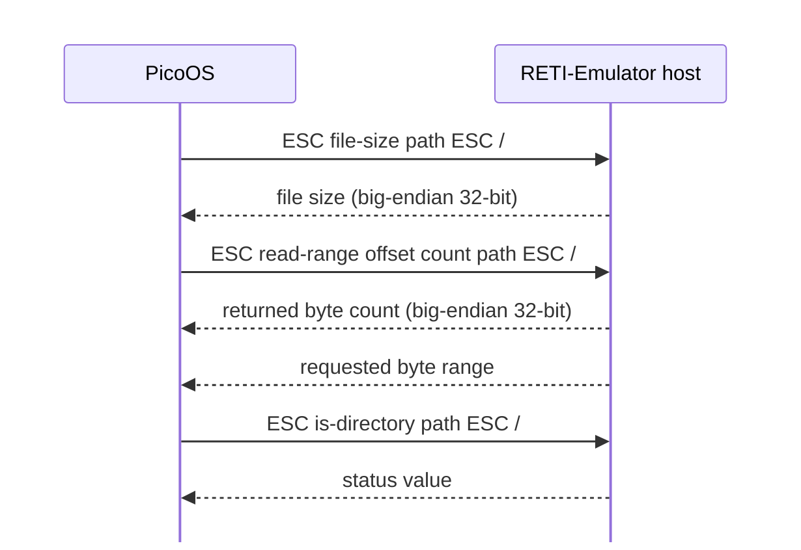
```mermaid
%%{init: {"sequence": {"wrap": false, "actorMargin": 60, "width": 180, "height": 45, "messageMargin": 25, "mirrorActors": false, "diagramMarginY": 35}, "themeCSS": "rect { rx: 0 !important; ry: 0 !important; }"}}%%
sequenceDiagram
    participant P as PicoOS
    participant H as RETI-Emulator host

    P->>H: ESC file-size path ESC /
    H-->>P: file size (big-endian 32-bit)
    P->>H: ESC read-range offset count path ESC /
    H-->>P: returned byte count (big-endian 32-bit)
    H-->>P: requested byte range
    P->>H: ESC is-directory path ESC /
    H-->>P: status value
```

</ReadmeVisual>

</div>

</div>

---

<!-- SOURCE Pico-OS/README.md#124-debugger-source-view-and-terminal-modes -->

# 1. Toolchain extensions for PicoOS · 1.2 RETI-Emulator extensions

## 1.2.4 Debugger, source view, and terminal modes (1)

<div class="deck-content readme-slide">

<div class="artifact-caption">The debugger shows RETI state alongside PicoC source. This recording demonstrates execution controls, snapshots, and the UART terminal:</div>
<div class="readme-artifacts artifact-single">

<!-- README_ASSET recording-1714 -->
<AsciinemaRecording src="/casts/reti_emulator.cast" title="RETI-Emulator session" poster="npt:8" fallback-href="https://asciinema.org/a/1264549" />
<p class="slide-note">Click to play the recording on this slide. Click outside the player to resume slide navigation.</p>

</div>

</div>

---

<!-- SOURCE Pico-OS/README.md#124-debugger-source-view-and-terminal-modes -->

# 1. Toolchain extensions for PicoOS · 1.2 RETI-Emulator extensions

## 1.2.4 Debugger, source view, and terminal modes (2)

<div class="deck-content readme-slide">

<div class="readme-artifacts artifact-single">

<!-- README_ASSET table-1726 rows=1-5 -->
<ReadmeVisual kind="table" :width="1100" style="flex-grow:10">

<div class="readme-table" v-pre><table><thead>
<tr>
<th>View</th>
<th>Default tracking</th>
<th>Additional selection</th>
</tr>
</thead><tbody><tr>
<td>CPU registers</td>
<td>All eight current register values</td>
<td>Select a register to inspect or edit its value</td>
</tr>
<tr>
<td>EEPROM / SRAM code</td>
<td><code>PC</code>, in the matching address space</td>
<td>Assign another register or a direct memory address</td>
</tr>
<tr>
<td>SRAM data</td>
<td><code>DS</code></td>
<td>Assign another register or a direct memory address</td>
</tr>
<tr>
<td>SRAM stack</td>
<td><code>SP</code></td>
<td>Assign another register or a direct memory address</td>
</tr>
<tr>
<td>Periphery</td>
<td>UART state</td>
<td>Cycle interrupt/timer, exception, and DMA views</td>
</tr></tbody></table></div>

</ReadmeVisual>

</div>

</div>

---

<!-- SOURCE Pico-OS/README.md#21-reti-interrupt-entry-and-the-interrupt-service-routine-table -->

# 2. Interrupts, system calls, preemption, and exceptions

## 2.1 RETI interrupt entry and the interrupt service routine table (1)

<div class="deck-content readme-slide">

<div class="artifact-caption">The first five SRAM cells hold the kernel's interrupt service routine table. The array and table below connect each entry to its source:</div>
<div class="readme-artifacts artifact-single">

<!-- README_ASSET code-1760 -->
<ReadmeVisual kind="code" :width="720" style="flex-grow:10">

<div class="readme-code">

```c {lines:false}
__attribute__((section("ivt")))
void (*interrupt_vector_table[OS_INTERRUPT_VECTOR_COUNT])(void) = {
    syscall_interrupt,
    timer_interrupt,
    uart_interrupt,
    cpu_exception_interrupt,
    dma_interrupt
};
```

</div>

</ReadmeVisual>

</div>

</div>

---

<!-- SOURCE Pico-OS/README.md#21-reti-interrupt-entry-and-the-interrupt-service-routine-table -->

# 2. Interrupts, system calls, preemption, and exceptions

## 2.1 RETI interrupt entry and the interrupt service routine table (2)

<div class="deck-content readme-slide">

<div class="readme-artifacts artifact-single">

<!-- README_ASSET table-1771 rows=1-5 -->
<ReadmeVisual kind="table" :width="1100" style="flex-grow:10">

<div class="readme-table" v-pre><table><thead>
<tr>
<th style="text-align:right">Index</th>
<th>Entry</th>
<th>Source</th>
</tr>
</thead><tbody><tr>
<td style="text-align:right">0</td>
<td><span class="source-link"><code>syscall_interrupt()</code></span></td>
<td>Software <code>INT 0</code> from userspace</td>
</tr>
<tr>
<td style="text-align:right">1</td>
<td><span class="source-link"><code>timer_interrupt()</code></span></td>
<td>Timer device</td>
</tr>
<tr>
<td style="text-align:right">2</td>
<td><span class="source-link"><code>uart_interrupt()</code></span></td>
<td>UART receive device</td>
</tr>
<tr>
<td style="text-align:right">3</td>
<td><span class="source-link"><code>cpu_exception_interrupt()</code></span></td>
<td>Fixed synchronous CPU exception entry</td>
</tr>
<tr>
<td style="text-align:right">4</td>
<td><span class="source-link"><code>dma_interrupt()</code></span></td>
<td>DMA completion on the hardware custom-device line</td>
</tr></tbody></table></div>

</ReadmeVisual>

</div>

</div>

---

<!-- SOURCE Pico-OS/README.md#21-reti-interrupt-entry-and-the-interrupt-service-routine-table -->

# 2. Interrupts, system calls, preemption, and exceptions

## 2.1 RETI interrupt entry and the interrupt service routine table (3)

<div class="deck-content readme-slide">

<div class="artifact-caption">This excerpt connects the first entry to <span class="source-link"><code>syscall_interrupt()</code></span>. Its <code>naked</code> attribute lets it save registers before any generated code could change them. <span class="source-link"><code>2.4.2 System-call entry, execution, and return to userspace</code></span> gives the complete body:</div>
<div class="readme-artifacts artifact-single">

<!-- README_ASSET code-1787 -->
<ReadmeVisual kind="code" :width="720" style="flex-grow:6">

<div class="readme-code">

```c {lines:false}
__attribute__((naked))
void syscall_interrupt(void) {
    // ...
}
```

</div>

</ReadmeVisual>

</div>

</div>

---

<!-- SOURCE Pico-OS/README.md#22-interrupt-controller-mappings-and-priorities -->

# 2. Interrupts, system calls, preemption, and exceptions

## 2.2 Interrupt-controller mappings and priorities (1)

<div class="deck-content readme-slide">

<div class="artifact-caption">Startup first disables each device, then writes its configured mapping and priority. The timer starts after init is ready, with a 5,000-instruction interval:</div>
<div class="readme-artifacts artifact-single">

<!-- README_ASSET code-1813 -->
<ReadmeVisual kind="code" :width="745.1999999999999" style="flex-grow:31">

<div class="readme-code">

```c {lines:false}
int interrupt_device_isrs[INTERRUPT_DEVICE_COUNT] = {
    1,                            // INTERRUPT_DEVICE_INTTIMER (index 0)
    4,                            // INTERRUPT_DEVICE_DMA (index 1)
    2                             // INTERRUPT_DEVICE_UART (index 2)
};

int interrupt_device_priorities[INTERRUPT_DEVICE_COUNT] = {
    1, // INTERRUPT_DEVICE_INTTIMER (index 0)
    1, // INTERRUPT_DEVICE_DMA (index 1)
    2  // INTERRUPT_DEVICE_UART (index 2)
};

void interrupt_controller_initialize(void) {
    int device = 0;
    int interrupt_index;
    int priority;

    while (device < INTERRUPT_DEVICE_COUNT) {
        interrupt_controller_disable_device(device);
        interrupt_index = interrupt_device_isrs[device];
        priority = interrupt_device_priorities[device];

        if (interrupt_index != INTERRUPT_CONTROLLER_DISABLED) {
            interrupt_controller_assign_device(device, interrupt_index, priority);
        }

        device = device + 1;
    }
}
```

</div>

</ReadmeVisual>

</div>

</div>

---

<!-- SOURCE Pico-OS/README.md#22-interrupt-controller-mappings-and-priorities -->

# 2. Interrupts, system calls, preemption, and exceptions

## 2.2 Interrupt-controller mappings and priorities (2)

<div class="deck-content readme-slide">

<div class="artifact-caption">The memory map locates these arrays within the kernel image. Arrows show where their values are written in the interrupt controller. <span class="source-link"><code>1.2.1 RETI machine model and memory-mapped peripherals</code></span> describes the peripheral registers:</div>
<div class="readme-artifacts artifact-single">

<!-- README_ASSET image-1853 -->
<ReadmeVisual kind="image" :width="1024" style="flex-grow:16">


</ReadmeVisual>

</div>

</div>

---

<!-- SOURCE Pico-OS/README.md#22-interrupt-controller-mappings-and-priorities -->

# 2. Interrupts, system calls, preemption, and exceptions

## 2.2 Interrupt-controller mappings and priorities (3)

<div class="deck-content readme-slide">

<div class="readme-artifacts artifact-single">

<!-- README_ASSET table-1859 rows=1-3 -->
<ReadmeVisual kind="table" :width="1100" style="flex-grow:10">

<div class="readme-table" v-pre><table><thead>
<tr>
<th>Device / array index</th>
<th>Mapping source → periphery cell</th>
<th>Priority source → periphery cell</th>
</tr>
</thead><tbody><tr>
<td>Timer / <code>0</code></td>
<td><code>interrupt_device_isrs[0] = 1</code> → <code>0x40000003</code></td>
<td><code>interrupt_device_priorities[0] = 1</code> → <code>0x40000006</code></td>
</tr>
<tr>
<td>DMA on custom line / <code>1</code></td>
<td><code>interrupt_device_isrs[1] = 4</code> → <code>0x40000004</code></td>
<td><code>interrupt_device_priorities[1] = 1</code> → <code>0x40000007</code></td>
</tr>
<tr>
<td>UART / <code>2</code></td>
<td><code>interrupt_device_isrs[2] = 2</code> → <code>0x40000005</code></td>
<td><code>interrupt_device_priorities[2] = 2</code> → <code>0x40000008</code></td>
</tr></tbody></table></div>

</ReadmeVisual>

</div>

</div>

---

<!-- SOURCE Pico-OS/README.md#221-interrupt-controller-function-reference -->

# 2. Interrupts, system calls, preemption, and exceptions · 2.2 Interrupt-controller mappings and priorities

## 2.2.1 Interrupt-controller function reference

<div class="deck-content readme-slide">

<div class="readme-artifacts artifact-single">

<!-- README_ASSET table-1876 rows=1-4 -->
<ReadmeVisual kind="table" :width="1440" style="flex-grow:10">

<div class="readme-table" v-pre><table><thead>
<tr>
<th>Kernel function</th>
<th>Return value / status</th>
<th>Effects</th>
<th>Calls</th>
<th>Called by</th>
</tr>
</thead><tbody><tr>
<td><span class="source-link"><code>interrupt_controller_initialize(void)</code></span></td>
<td>Returns no value</td>
<td>Rewrites timer, DMA, and UART mappings and priorities in periphery registers 3–8 from <span class="source-link"><code>interrupt_device_isrs</code></span> and <span class="source-link"><code>interrupt_device_priorities</code></span></td>
<td><span class="source-link"><code>interrupt_controller_disable_device()</code></span>, <span class="source-link"><code>interrupt_controller_assign_device()</code></span></td>
<td><strong>Kernel functions:</strong> <span class="source-link"><code>main()</code></span></td>
</tr>
<tr>
<td><span class="source-link"><code>interrupt_controller_assign_device(device, interrupt_index, priority)</code></span></td>
<td>Returns no value</td>
<td>Writes one device's interrupt service routine-table index and priority</td>
<td><span class="source-link"><code>interrupt_controller_device_to_isr_register()</code></span>, <span class="source-link"><code>interrupt_controller_device_to_priority_register()</code></span>, <span class="source-link"><code>periphery_write_register()</code></span></td>
<td><strong>Kernel functions:</strong> <span class="source-link"><code>begin_terminal_read()</code></span>, <span class="source-link"><code>interrupt_controller_initialize()</code></span>, <span class="source-link"><code>resume_pending_terminal_read()</code></span></td>
</tr>
<tr>
<td><span class="source-link"><code>interrupt_controller_disable_device(device)</code></span></td>
<td>Returns no value</td>
<td>Writes mapping 255 and priority 0 for one device</td>
<td><span class="source-link"><code>interrupt_controller_device_to_isr_register()</code></span>, <span class="source-link"><code>interrupt_controller_device_to_priority_register()</code></span>, <span class="source-link"><code>periphery_write_register()</code></span></td>
<td><strong>Kernel functions:</strong> <span class="source-link"><code>begin_terminal_read()</code></span>, <span class="source-link"><code>interrupt_controller_initialize()</code></span>, <span class="source-link"><code>reboot()</code></span>, <span class="source-link"><code>resume_pending_terminal_read()</code></span></td>
</tr>
<tr>
<td><span class="source-link"><code>interrupt_controller_activate_timer(void)</code></span></td>
<td>Returns no value</td>
<td>Writes the 5,000-instruction interval to periphery register 9</td>
<td><span class="source-link"><code>periphery_write_register()</code></span></td>
<td><strong>Kernel functions:</strong> <span class="source-link"><code>main()</code></span></td>
</tr></tbody></table></div>

</ReadmeVisual>

</div>

</div>

---

<!-- SOURCE Pico-OS/README.md#222-memory-mapped-periphery-function-reference -->

# 2. Interrupts, system calls, preemption, and exceptions · 2.2 Interrupt-controller mappings and priorities

## 2.2.2 Memory-mapped periphery function reference

<div class="deck-content readme-slide">

<div class="readme-artifacts artifact-single">

<!-- README_ASSET table-1890 rows=1-2 -->
<ReadmeVisual kind="table" :width="1440" style="flex-grow:10">

<div class="readme-table" v-pre><table><thead>
<tr>
<th>Kernel function</th>
<th>Return value / status</th>
<th>Effects</th>
<th>Calls</th>
<th>Called by</th>
</tr>
</thead><tbody><tr>
<td><span class="source-link"><code>periphery_read_register(register_index)</code></span></td>
<td>Returns the selected periphery value</td>
<td>Reads one memory-mapped periphery cell, changes no kernel state</td>
<td>None</td>
<td><strong>Kernel functions:</strong> <span class="source-link"><code>begin_terminal_read()</code></span>, <span class="source-link"><code>handle_cpu_exception()</code></span>, <span class="source-link"><code>handle_uart_interrupt()</code></span>, <span class="source-link"><code>resume_pending_terminal_read()</code></span></td>
</tr>
<tr>
<td><span class="source-link"><code>periphery_write_register(register_index, value)</code></span></td>
<td>Returns no value</td>
<td>Writes one memory-mapped periphery cell</td>
<td>None</td>
<td><strong>Kernel functions:</strong> <span class="source-link"><code>activate_current_process_stack_boundary()</code></span>, <span class="source-link"><code>activate_kernel_stack_boundary()</code></span>, <span class="source-link"><code>handle_uart_interrupt()</code></span>, <span class="source-link"><code>interrupt_controller_activate_timer()</code></span>, <span class="source-link"><code>interrupt_controller_assign_device()</code></span>, <span class="source-link"><code>interrupt_controller_disable_device()</code></span>, <span class="source-link"><code>reboot()</code></span></td>
</tr></tbody></table></div>

</ReadmeVisual>

</div>

</div>

---

<!-- SOURCE Pico-OS/README.md#23-saved-interrupt-stack-frame -->

# 2. Interrupts, system calls, preemption, and exceptions

## 2.3 Saved interrupt stack frame

<div class="deck-content readme-slide">

<div class="readme-artifacts artifact-single">

<!-- README_ASSET table-1901 rows=1-8 -->
<ReadmeVisual kind="table" :width="1100" style="flex-grow:10">

<div class="readme-table" v-pre><table><thead>
<tr>
<th style="text-align:right">Offset</th>
<th>Stored value</th>
</tr>
</thead><tbody><tr>
<td style="text-align:right"><code>+0</code></td>
<td>Free cell addressed by <span class="source-link"><code>caller_context</code></span></td>
</tr>
<tr>
<td style="text-align:right"><code>+1</code></td>
<td>Saved <code>DS</code></td>
</tr>
<tr>
<td style="text-align:right"><code>+2</code></td>
<td>Saved <code>CS</code></td>
</tr>
<tr>
<td style="text-align:right"><code>+3</code></td>
<td>Saved <code>BAF</code></td>
</tr>
<tr>
<td style="text-align:right"><code>+4</code></td>
<td>Saved <code>IN2</code></td>
</tr>
<tr>
<td style="text-align:right"><code>+5</code></td>
<td>Saved <code>IN1</code></td>
</tr>
<tr>
<td style="text-align:right"><code>+6</code></td>
<td>Saved <code>ACC</code></td>
</tr>
<tr>
<td style="text-align:right"><code>+7</code></td>
<td>Return PC saved by interrupt entry</td>
</tr></tbody></table></div>

</ReadmeVisual>

</div><aside class="context-note"><b>Linux comparison</b><span>Linux saves syscall context on the kernel stack. RETI entry and RTI use the active SP; PicoOS saves context on the user stack and has no memory isolation.</span></aside>

</div>

---

<!-- SOURCE Pico-OS/README.md#24-system-call-interface-and-execution -->

# 2. Interrupts, system calls, preemption, and exceptions

## 2.4 System-call interface and execution

<div class="deck-content readme-slide">

<div class="readme-explanation"><p>A library wrapper passes a syscall selector and arguments to the installed kernel. <span class="source-link"><code>handle_syscall()</code></span> chooses the implementation. This avoids embedding kernel function addresses in user programs.</p>
<p>Kernel functions can move without changing the wrapper. Compatibility still depends on selectors, register conventions, request layouts, and argument and result meanings. Together these form the syscall ABI. Changing it can require rebuilding libraries or programs.</p></div><aside class="context-note"><b>POSIX: source portability</b><span>A library may expose familiar interfaces over different kernel syscalls. PicoOS also differs in signatures and behavior; familiar names do not imply binary compatibility.</span></aside>

</div>

---

<!-- SOURCE Pico-OS/README.md#241-syscall-selectors-and-register-convention -->

# 2. Interrupts, system calls, preemption, and exceptions · 2.4 System-call interface and execution

## 2.4.1 Syscall selectors and register convention (1)

<div class="deck-content readme-slide">

<div class="readme-artifacts artifact-single">

<!-- README_ASSET code-4917 repeated -->
<ReadmeVisual kind="code" :width="720" style="flex-grow:12">

<div class="readme-code">

```c {lines:false}
int waitpid(int pid) {
    int status = 0;
    struct WaitPidRequest request;

    request.pid = pid;
    request.status = &status;
    while (!invoke_waitpid_syscall(SYSCALL_WAITPID, (int)&request)) {
    }
    return status;
}
```

</div>

</ReadmeVisual>

</div><aside class="context-note"><b>ABI connection</b><span>IN2 carries the syscall result just as it carries a PicoC function result. The wrapper and interrupt entry must agree on this register contract.</span></aside>

</div>

---

<!-- SOURCE Pico-OS/README.md#241-syscall-selectors-and-register-convention -->

# 2. Interrupts, system calls, preemption, and exceptions · 2.4 System-call interface and execution

## 2.4.1 Syscall selectors and register convention (2)

<div class="deck-content readme-slide">

<div class="artifact-caption">The declarations in <span class="source-link"><code>common/syscall.header</code></span> and <span class="source-link"><code>common/file.header</code></span> define these requests. The field tables below explain their contents:</div>
<div class="readme-artifacts artifact-single">

<!-- README_ASSET code-1960 -->
<ReadmeVisual kind="code" :width="720" style="flex-grow:29">

<div class="readme-code">

```c {lines:false}
struct LoadProcessRequest { char *path; bool show_loading_bar; };
struct RunProcessRequest { int pid; char *arguments; char **environment; };
struct WaitPidRequest { int pid; int *status; };
struct KillRequest { int pid; int signal_number; };
struct PrctlRequest { int option; int argument; };
struct ShmOpenRequest { char *name; size_t size; };
struct GetCwdRequest { char *buffer; int size; };
struct ReadDirectoryRequest { char *path; char *buffer; int capacity; };
struct MoveRequest { char *old_path; char *new_path; };

struct OpenRequest { char *path; int flags; };
struct IoRequest {
    int file_descriptor;
    char *buffer;
    int count;
    bool protect_uart_control;
    bool show_loading_bar;
    int transferred;
    int loading_bar_update;
    bool complete;
};
struct SeekRequest {
    int file_descriptor;
    int offset;
    int origin;
};
struct Dup2Request { int old_file_descriptor; int new_file_descriptor; };
```

</div>

</ReadmeVisual>

</div>

</div>

---

<!-- SOURCE Pico-OS/README.md#2411-process-wait-signal-and-memory-request-structures -->

# 2. Interrupts, system calls, preemption, and exceptions · 2.4 System-call interface and execution · 2.4.1 Syscall selectors and register convention

## 2.4.1.1 Process, wait, signal, and memory request structures (1)

<div class="deck-content readme-slide">

<div class="readme-artifacts artifact-single">

<!-- README_ASSET table-2001 rows=1-12 -->
<ReadmeVisual kind="table" :width="1100" style="flex-grow:10">

<div class="readme-table" v-pre><table><thead>
<tr>
<th>Field</th>
<th>Meaning</th>
<th>Used by</th>
</tr>
</thead><tbody><tr>
<td><span class="source-link"><code>LoadProcessRequest.path</code></span></td>
<td>Path of the <code>.bin</code> image</td>
<td>First initialized by <span class="source-link"><code>load()</code></span>, passed through <span class="source-link"><code>SYSCALL_LOAD_PROCESS</code></span>, the loader normalizes it and the PCB receives its own <span class="source-link"><code>kmalloc()</code></span> path copy</td>
</tr>
<tr>
<td><span class="source-link"><code>LoadProcessRequest.show_loading_bar</code></span></td>
<td>Whether UART transfer progress should be printed</td>
<td>First initialized by <span class="source-link"><code>load()</code></span>, read only during loading, derived from <span class="source-link"><code>PICOOS_LOADING_BAR</code></span></td>
</tr>
<tr>
<td><span class="source-link"><code>RunProcessRequest.pid</code></span></td>
<td>PID of an existing process in state <span class="source-link"><code>NEW</code></span></td>
<td>First initialized by <span class="source-link"><code>run()</code></span> (or kernel <span class="source-link"><code>main()</code></span> for init), passed through <span class="source-link"><code>SYSCALL_RUN_PROCESS_WITH_ARGUMENTS</code></span>, identifies the process whose PCB state becomes <span class="source-link"><code>READY</code></span></td>
</tr>
<tr>
<td><span class="source-link"><code>RunProcessRequest.arguments</code></span></td>
<td>Space/tab-separated argument string, or <code>NULL</code></td>
<td>First initialized by <span class="source-link"><code>run()</code></span> (or kernel <span class="source-link"><code>main()</code></span> for init), copied into the child's initial process stack, the pointer itself is not retained</td>
</tr>
<tr>
<td><span class="source-link"><code>RunProcessRequest.environment</code></span></td>
<td>Null-terminated array of <code>NAME=value</code> pointers</td>
<td>First initialized by <span class="source-link"><code>run()</code></span> (or kernel <span class="source-link"><code>main()</code></span> for init), strings and pointer table are copied into the child's initial stack</td>
</tr>
<tr>
<td><span class="source-link"><code>WaitPidRequest.pid</code></span></td>
<td>Exact child PID</td>
<td>First initialized by <span class="source-link"><code>waitpid()</code></span>, passed through <span class="source-link"><code>SYSCALL_WAITPID</code></span>, used to find and validate the child</td>
</tr>
<tr>
<td><span class="source-link"><code>WaitPidRequest.status</code></span></td>
<td>Address of caller's status cell</td>
<td>First initialized by <span class="source-link"><code>waitpid()</code></span>, immediate status destination or copied into the waiting parent's <span class="source-link"><code>waiting_status_ptr</code></span> while blocked</td>
</tr>
<tr>
<td><span class="source-link"><code>KillRequest.pid</code></span></td>
<td>Target process</td>
<td>First initialized by <span class="source-link"><code>kill()</code></span>, passed through <span class="source-link"><code>SYSCALL_KILL</code></span>, lookup only, not retained</td>
</tr>
<tr>
<td><span class="source-link"><code>KillRequest.signal_number</code></span></td>
<td>Signal to deliver, 0 probes existence</td>
<td>First initialized by <span class="source-link"><code>kill()</code></span>, may change target state or defer termination, but the request is not retained</td>
</tr>
<tr>
<td><span class="source-link"><code>PrctlRequest.option</code></span></td>
<td>Currently only <span class="source-link"><code>PR_SET_PDEATHSIG</code></span></td>
<td>First initialized by <span class="source-link"><code>prctl()</code></span>, passed through <span class="source-link"><code>SYSCALL_PRCTL</code></span>, selects the supported operation</td>
</tr>
<tr>
<td><span class="source-link"><code>PrctlRequest.argument</code></span></td>
<td>Signal number, or 0 to disable</td>
<td>First initialized by <span class="source-link"><code>prctl()</code></span>, copied into current PCB <span class="source-link"><code>parent_death_signal</code></span></td>
</tr>
<tr>
<td><span class="source-link"><code>ShmOpenRequest.name</code></span></td>
<td>Name used to find an entry in the kernel's shared-memory linked list</td>
<td>First initialized by <span class="source-link"><code>shm_open()</code></span>, passed through <span class="source-link"><code>SYSCALL_SHM_OPEN</code></span>, a new entry receives a <span class="source-link"><code>kmalloc()</code></span> copy</td>
</tr></tbody></table></div>

</ReadmeVisual>

</div>

</div>

---

<!-- SOURCE Pico-OS/README.md#2411-process-wait-signal-and-memory-request-structures -->

# 2. Interrupts, system calls, preemption, and exceptions · 2.4 System-call interface and execution · 2.4.1 Syscall selectors and register convention

## 2.4.1.1 Process, wait, signal, and memory request structures (2)

<div class="deck-content readme-slide">

<div class="readme-artifacts artifact-single">

<!-- README_ASSET table-2001 rows=13-13 -->
<ReadmeVisual kind="table" :width="1100" style="flex-grow:10">

<div class="readme-table" v-pre><table><thead>
<tr>
<th>Field</th>
<th>Meaning</th>
<th>Used by</th>
</tr>
</thead><tbody><tr>
<td><span class="source-link"><code>ShmOpenRequest.size</code></span></td>
<td>Requested shared region size in RETI cells</td>
<td>First initialized by <span class="source-link"><code>shm_open()</code></span>, used only when creating a name, an existing entry is not resized</td>
</tr></tbody></table></div>

</ReadmeVisual>

</div>

</div>

---

<!-- SOURCE Pico-OS/README.md#2412-file-and-directory-request-structures -->

# 2. Interrupts, system calls, preemption, and exceptions · 2.4 System-call interface and execution · 2.4.1 Syscall selectors and register convention

## 2.4.1.2 File and directory request structures (1)

<div class="deck-content readme-slide">

<div class="readme-artifacts artifact-single">

<!-- README_ASSET table-2023 rows=1-11 -->
<ReadmeVisual kind="table" :width="1100" style="flex-grow:10">

<div class="readme-table" v-pre><table><thead>
<tr>
<th>Field</th>
<th>Meaning</th>
<th>Used by</th>
</tr>
</thead><tbody><tr>
<td><span class="source-link"><code>OpenRequest.path</code></span></td>
<td>Relative or absolute PicoOS path to a host-backed file or kernel device</td>
<td>First initialized by <span class="source-link"><code>open()</code></span> or <span class="source-link"><code>fopen()</code></span>, passed through <span class="source-link"><code>SYSCALL_OPEN</code></span>, normalized and copied into the selected descriptor</td>
</tr>
<tr>
<td><span class="source-link"><code>OpenRequest.flags</code></span></td>
<td>Access mode plus <span class="source-link"><code>O_CREAT</code></span>, <span class="source-link"><code>O_TRUNC</code></span>, or <span class="source-link"><code>O_APPEND</code></span></td>
<td>First initialized by <span class="source-link"><code>open()</code></span> or <span class="source-link"><code>fopen()</code></span>, copied into the descriptor, create/truncate decide open requests and append changes later write positioning</td>
</tr>
<tr>
<td><span class="source-link"><code>IoRequest.file_descriptor</code></span></td>
<td>Entry number in the current PCB’s eight-entry table</td>
<td>First initialized by <span class="source-link"><code>read()</code></span>, <span class="source-link"><code>write()</code></span>, <span class="source-link"><code>write_without_uart_escape_check()</code></span>, or stdio I/O wrappers, passed through <span class="source-link"><code>SYSCALL_READ</code></span> or <span class="source-link"><code>SYSCALL_WRITE</code></span></td>
</tr>
<tr>
<td><span class="source-link"><code>IoRequest.buffer</code></span></td>
<td>Userspace destination for read or source for write</td>
<td>First initialized by <span class="source-link"><code>read()</code></span>, <span class="source-link"><code>write()</code></span>, <span class="source-link"><code>write_without_uart_escape_check()</code></span>, or stdio I/O wrappers, used directly during the call, for a blocked terminal read the caller's PCB temporarily retains the destination pointer</td>
</tr>
<tr>
<td><span class="source-link"><code>IoRequest.count</code></span></td>
<td>Maximum cells to read or exact cells to write</td>
<td>First initialized by <span class="source-link"><code>read()</code></span>, <span class="source-link"><code>write()</code></span>, <span class="source-link"><code>write_without_uart_escape_check()</code></span>, or stdio I/O wrappers, validated before transfer, retained in terminal pending state only while stdin is blocked</td>
</tr>
<tr>
<td><span class="source-link"><code>IoRequest.protect_uart_control</code></span></td>
<td>Whether a write must scan for <code>&lt;ESC&gt;</code> and protect a matching buffer with <code>literal-output &lt;count&gt;</code></td>
<td>First initialized to <code>true</code> by <span class="source-link"><code>write()</code></span>, <span class="source-link"><code>fputc()</code></span>, and <span class="source-link"><code>fputs()</code></span>, initialized to <code>false</code> by <span class="source-link"><code>write_without_uart_escape_check()</code></span>, <span class="source-link"><code>read()</code></span>, <span class="source-link"><code>fgetc()</code></span>, <span class="source-link"><code>write_process_exception_message()</code></span>, and <span class="source-link"><code>list_processes()</code></span>, read by <span class="source-link"><code>write_file_descriptor()</code></span></td>
</tr>
<tr>
<td><span class="source-link"><code>IoRequest.show_loading_bar</code></span></td>
<td>Whether a host-file read shows progress</td>
<td>First initialized by <span class="source-link"><code>read()</code></span>, write wrappers, or stdio I/O wrappers, <span class="source-link"><code>read()</code></span> derives this from the environment, writes set it false</td>
</tr>
<tr>
<td><span class="source-link"><code>IoRequest.transferred</code></span></td>
<td>Bytes already copied by earlier chunks of the same <span class="source-link"><code>read()</code></span></td>
<td>First initialized to 0 by <span class="source-link"><code>read()</code></span> (or stdio input), updated by <span class="source-link"><code>read()</code></span> and read by <span class="source-link"><code>read_regular_file()</code></span> as the next buffer position</td>
</tr>
<tr>
<td><span class="source-link"><code>IoRequest.loading_bar_update</code></span></td>
<td>Next total byte count that redraws read progress</td>
<td>First initialized by <span class="source-link"><code>read_regular_file()</code></span> after the first successful range response, retained and updated for subsequent chunks</td>
</tr>
<tr>
<td><span class="source-link"><code>IoRequest.complete</code></span></td>
<td>Whether <span class="source-link"><code>read()</code></span> should return instead of invoking another chunk</td>
<td>First initialized to false by <span class="source-link"><code>read()</code></span>, set by <span class="source-link"><code>read_file_descriptor()</code></span> or <span class="source-link"><code>read_regular_file()</code></span> on completion/error</td>
</tr>
<tr>
<td><span class="source-link"><code>SeekRequest.file_descriptor</code></span></td>
<td>Regular-file descriptor to reposition</td>
<td>First initialized by <span class="source-link"><code>lseek()</code></span>, passed through <span class="source-link"><code>SYSCALL_LSEEK</code></span></td>
</tr></tbody></table></div>

</ReadmeVisual>

</div>

</div>

---

<!-- SOURCE Pico-OS/README.md#2412-file-and-directory-request-structures -->

# 2. Interrupts, system calls, preemption, and exceptions · 2.4 System-call interface and execution · 2.4.1 Syscall selectors and register convention

## 2.4.1.2 File and directory request structures (2)

<div class="deck-content readme-slide">

<div class="readme-artifacts artifact-single">

<!-- README_ASSET table-2023 rows=12-22 -->
<ReadmeVisual kind="table" :width="1100" style="flex-grow:10">

<div class="readme-table" v-pre><table><thead>
<tr>
<th>Field</th>
<th>Meaning</th>
<th>Used by</th>
</tr>
</thead><tbody><tr>
<td><span class="source-link"><code>SeekRequest.offset</code></span></td>
<td>Signed displacement</td>
<td>First initialized by <span class="source-link"><code>lseek()</code></span>, combined with <span class="source-link"><code>SEEK_SET</code></span>, current descriptor offset, or host file size</td>
</tr>
<tr>
<td><span class="source-link"><code>SeekRequest.origin</code></span></td>
<td><span class="source-link"><code>SEEK_SET</code></span>, <span class="source-link"><code>SEEK_CUR</code></span>, or <span class="source-link"><code>SEEK_END</code></span></td>
<td>First initialized by <span class="source-link"><code>lseek()</code></span>, selects the base for the new descriptor offset</td>
</tr>
<tr>
<td><span class="source-link"><code>Dup2Request.old_file_descriptor</code></span></td>
<td>Descriptor to copy</td>
<td>First initialized by <span class="source-link"><code>dup2()</code></span>, <span class="source-link"><code>SYSCALL_DUP2</code></span> leaves the source entry unchanged</td>
</tr>
<tr>
<td><span class="source-link"><code>Dup2Request.new_file_descriptor</code></span></td>
<td>Entry to replace</td>
<td>First initialized by <span class="source-link"><code>dup2()</code></span>, the target receives an independent copy of the source fields and path</td>
</tr>
<tr>
<td><span class="source-link"><code>GetCwdRequest.buffer</code></span></td>
<td>Userspace destination</td>
<td>First initialized by <span class="source-link"><code>getcwd()</code></span>, passed through <span class="source-link"><code>SYSCALL_GETCWD</code></span>, receives the selected directory copy</td>
</tr>
<tr>
<td><span class="source-link"><code>GetCwdRequest.size</code></span></td>
<td>Destination capacity</td>
<td>First initialized by <span class="source-link"><code>getcwd()</code></span>, prevents copying a path that does not fit</td>
</tr>
<tr>
<td><span class="source-link"><code>ReadDirectoryRequest.path</code></span></td>
<td>Directory to list</td>
<td>First initialized by <span class="source-link"><code>opendir()</code></span>, passed through <span class="source-link"><code>SYSCALL_READ_DIRECTORY</code></span>, normalized for the host request</td>
</tr>
<tr>
<td><span class="source-link"><code>ReadDirectoryRequest.buffer</code></span></td>
<td>Userspace listing buffer</td>
<td>First initialized by <span class="source-link"><code>opendir()</code></span>, receives <code>d name\n</code> / <code>- name\n</code> records from the host</td>
</tr>
<tr>
<td><span class="source-link"><code>ReadDirectoryRequest.capacity</code></span></td>
<td>Maximum returned cells</td>
<td>First initialized by <span class="source-link"><code>opendir()</code></span>, bounds the UART response and copy</td>
</tr>
<tr>
<td><span class="source-link"><code>MoveRequest.old_path</code></span></td>
<td>Existing file or directory</td>
<td>First initialized by <span class="source-link"><code>move()</code></span>, normalized and sent as the first <span class="source-link"><code>move</code></span> host request path</td>
</tr>
<tr>
<td><span class="source-link"><code>MoveRequest.new_path</code></span></td>
<td>New file or directory path</td>
<td>First initialized by <span class="source-link"><code>move()</code></span>, normalized and sent as the second <span class="source-link"><code>move</code></span> host request path</td>
</tr></tbody></table></div>

</ReadmeVisual>

</div>

</div>

---

<!-- SOURCE Pico-OS/README.md#242-system-call-entry-execution-and-return-to-userspace -->

# 2. Interrupts, system calls, preemption, and exceptions · 2.4 System-call interface and execution

## 2.4.2 System-call entry, execution, and return to userspace (1)

<div class="deck-content readme-slide">

<div class="artifact-caption"><code>INT 0</code> saves its PC on the process stack and enters <span class="source-link"><code>syscall_interrupt()</code></span>. The ISR installs the kernel context and calls <span class="source-link"><code>handle_syscall()</code></span>. The diagram follows the request through execution and either direct restoration or scheduling. <span class="source-link"><code>2.4.2.2 Selecting the return path</code></span> explains that choice:</div>
<div class="readme-artifacts artifact-single">

<!-- README_ASSET mermaid-2064 -->
<ReadmeVisual kind="mermaid" :width="1024" style="flex-grow:10">

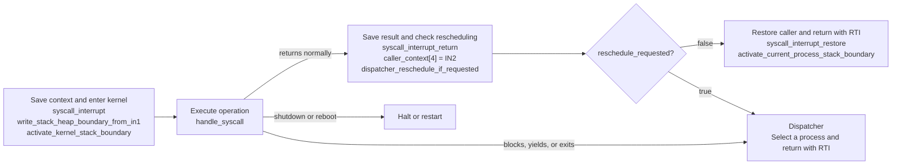
```mermaid
flowchart LR
    ENTRY["Save context and enter kernel<br/>syscall_interrupt<br/>write_stack_heap_boundary_from_in1<br/>activate_kernel_stack_boundary"] --> HANDLE["Execute operation<br/>handle_syscall"]
    HANDLE -->|returns normally| RETURN["Save result and check rescheduling<br/>syscall_interrupt_return<br/>caller_context[4] = IN2<br/>dispatcher_reschedule_if_requested"]
    RETURN --> CHECK{"reschedule_requested?"}
    CHECK -->|false| RESTORE["Restore caller and return with RTI<br/>syscall_interrupt_restore<br/>activate_current_process_stack_boundary"]
    CHECK -->|true| DISPATCH["Dispatcher<br/>Select a process and return with RTI"]
    HANDLE -->|blocks, yields, or exits| DISPATCH
    HANDLE -->|shutdown or reboot| SYSTEM["Halt or restart"]
```

</ReadmeVisual>

</div>

</div>

---

<!-- SOURCE Pico-OS/README.md#242-system-call-entry-execution-and-return-to-userspace -->

# 2. Interrupts, system calls, preemption, and exceptions · 2.4 System-call interface and execution

## 2.4.2 System-call entry, execution, and return to userspace (2)

<div class="deck-content readme-slide">

<div class="artifact-caption">These naked routines manage registers and stacks explicitly. <code>BAF</code> holds the saved-frame pointer while kernel <code>CS</code>, <code>DS</code>, and <code>SP</code> are active. The macros come from <span class="source-link"><code>kernel/memory_constants.header</code></span>, described in <span class="source-link"><code>1.1.9 Generated memory constants for the bootloader and kernel</code></span>:</div>
<div class="readme-artifacts artifact-single">

<!-- README_ASSET code-2079 -->
<ReadmeVisual kind="code" :width="745.1999999999999" style="flex-grow:68">

<div class="readme-code">

```c {lines:false}
__attribute__((naked))
void syscall_interrupt(void) {
    // Saves the same context layout as timer_interrupt
    asm("PUSH ACC"); // Syscall number
    asm("PUSH IN1"); // Syscall argument
    asm("PUSH IN2");
    asm("PUSH BAF");
    asm("PUSH CS");
    asm("PUSH DS");

    // BAF keeps old_sp while loading kernel CS, DS and SP
    asm("MOVE SP BAF");
    asm("LOADI IN1 0");
    write_stack_heap_boundary_from_in1();
    asm(KERNEL_CS_START_ASM); // LOADI32 CS -2147483643
    asm(KERNEL_DS_START_ASM); // LOADI32 DS -2147442882
    asm(KERNEL_SP_START_ASM); // LOADI32 SP -2147435340
    activate_kernel_stack_boundary();

    // Builds the handle_syscall arguments from the saved context
    asm("PUSH BAF"); // Caller context
    asm("LOADIN BAF IN2 5");
    asm("PUSH IN2"); // Syscall argument
    asm("LOADIN BAF IN2 6");
    asm("PUSH IN2"); // Syscall number

    // A syscall that switches processes resumes with a successful IN2 result
    asm("LOADI IN2 1");
    asm("STOREIN BAF IN2 4");

    // Calls handle_syscall and returns through syscall_interrupt_return
    asm("LOADI32 ACC syscall_interrupt_return");
    asm("ADD ACC CS");
    asm("PUSH ACC"); // Return address: syscall return continuation
    asm("LOADI32 ACC handle_syscall");
    asm("ADD ACC CS");
    asm("MOVE ACC PC");
}

__attribute__((naked))
void syscall_interrupt_return(void) {
    // Handle_syscall restores BAF to the saved caller context before returning
    // Saves the IN2 result before a pending timer request can dispatch the caller
    asm("STOREIN BAF IN2 4");

    asm("PUSH BAF"); // Caller context
    asm("LOADI32 ACC syscall_interrupt_restore");
    asm("ADD ACC CS");
    asm("PUSH ACC");
    asm("LOADI32 ACC dispatcher_reschedule_if_requested");
    asm("ADD ACC CS");
    asm("MOVE ACC PC");
}

__attribute__((naked))
void syscall_interrupt_restore(void) {
    asm("MOVE BAF SP");
    activate_current_process_stack_boundary();
    asm("POP DS");
    asm("POP CS");
    asm("POP BAF");
    asm("POP IN2");
    asm("POP IN1");
    asm("POP ACC");
    asm("RTI");
}
```

</div>

</ReadmeVisual>

</div>

</div>

---

<!-- SOURCE Pico-OS/README.md#242-system-call-entry-execution-and-return-to-userspace -->

# 2. Interrupts, system calls, preemption, and exceptions · 2.4 System-call interface and execution

## 2.4.2 System-call entry, execution, and return to userspace (3)

<div class="deck-content readme-slide">

<div class="readme-artifacts artifact-single">

<!-- README_ASSET list-2151 -->
<div class="readme-list"><ol start="1"><li>Save ACC, IN1, IN2, BAF, CS, and DS beside the automatically saved PC.</li>
<li>Keep the saved-frame pointer in BAF while changing stacks.</li>
<li>Disable the old boundary; install kernel CS, DS, and SP; activate the kernel boundary.</li>
<li>Push context, argument, and selector onto the kernel stack before reusing registers.</li>
<li>Initialize saved IN2 to 1 for calls that resume after a process switch; an operation may replace it.</li>
<li>Return via syscall_interrupt_return; transfer control to handle_syscall, whose epilogue restores BAF to the context pointer.</li></ol></div>

</div>

</div>

---

<!-- SOURCE Pico-OS/README.md#242-system-call-entry-execution-and-return-to-userspace -->

# 2. Interrupts, system calls, preemption, and exceptions · 2.4 System-call interface and execution

## 2.4.2 System-call entry, execution, and return to userspace (4)

<div class="deck-content readme-slide">

<div class="readme-artifacts artifact-pair">

<!-- README_ASSET list-2179 -->
<div class="readme-list"><ol start="1"><li>Save IN2 in caller_context[4] before rescheduling can move it into the PCB.</li>
<li>Call dispatcher_reschedule_if_requested with the saved context and syscall_interrupt_restore continuation.</li>
<li>Without a pending request, restore directly; otherwise enter the dispatcher.</li></ol></div>

<!-- README_ASSET list-2195 -->
<div class="readme-list"><ol start="1"><li>Copy BAF to SP to select the saved process frame and discard kernel scratch frames.</li>
<li>Activate the caller's stack boundary while kernel CS and DS can still access the PCB.</li>
<li>Pop DS, CS, BAF, IN2, IN1, and ACC; RTI restores the saved PC and resumes after INT 0.</li></ol></div>

</div>

</div>

---

<!-- SOURCE Pico-OS/README.md#2421-handle-syscall -->

# 2. Interrupts, system calls, preemption, and exceptions · 2.4 System-call interface and execution · 2.4.2 System-call entry, execution, and return to userspace

## 2.4.2.1 Handle Syscall (1)

<div class="deck-content readme-slide">

<div class="artifact-caption"><span class="source-link"><code>handle_syscall()</code></span> selects the operation with an <code>if</code>/<code>else if</code> chain. It passes simple values directly and casts request pointers to their declared types. This excerpt shows both forms and a call needing the saved context:</div>
<div class="readme-artifacts artifact-single">

<!-- README_ASSET code-2212 -->
<ReadmeVisual kind="code" :width="788.1999999999999" style="flex-grow:28">

<div class="readme-code">

```c {lines:false}
int handle_syscall(int syscall_number, int argument, int *caller_context) {
    if (syscall_number == SYSCALL_SHUTDOWN) {
        shutdown();
        return 1;
    } else if (syscall_number == SYSCALL_REBOOT) {
        reboot();
        return 1;
    } else if (syscall_number == SYSCALL_LOAD_PROCESS) {
        return load_process_chunk(
            ((struct LoadProcessRequest *)argument)->path,
            ((struct LoadProcessRequest *)argument)->show_loading_bar,
            caller_context
        );
    } else if (syscall_number == SYSCALL_RUN_PROCESS_WITH_ARGUMENTS) {
        return mark_process_ready_with_arguments((struct RunProcessRequest *)argument);
    } else if (syscall_number == SYSCALL_LIST_PROCESSES) {
        list_processes();
        return 1;
    } else if (syscall_number == SYSCALL_UNLOAD_PROCESS) {
        return unload_process_by_pid(argument);
    }

    // ...

    return 0;
}
```

</div>

</ReadmeVisual>

</div>

</div>

---

<!-- SOURCE Pico-OS/README.md#2421-handle-syscall -->

# 2. Interrupts, system calls, preemption, and exceptions · 2.4 System-call interface and execution · 2.4.2 System-call entry, execution, and return to userspace

## 2.4.2.1 Handle Syscall (2)

<div class="deck-content readme-slide">

<div class="readme-artifacts artifact-single">

<!-- README_ASSET list-2243 -->
<div class="readme-list"><ol start="1"><li>Match the SYSCALL_* selector; pass the saved context when the operation needs it.</li>
<li>Return the result in IN2, or 0 for an unknown selector. Blocking, yielding, or terminating calls may switch first.</li></ol></div>

</div>

</div>

---

<!-- SOURCE Pico-OS/README.md#24211-system-call-groups -->

# 2. Interrupts, system calls, preemption, and exceptions · 2.4 System-call interface and execution · 2.4.2 System-call entry, execution, and return to userspace · 2.4.2.1 Handle Syscall

## 2.4.2.1.1 System-call groups

<div class="deck-content readme-slide">

<div class="readme-artifacts artifact-single">

<!-- README_ASSET table-2258 rows=1-6 -->
<ReadmeVisual kind="table" :width="1100" style="flex-grow:10">

<div class="readme-table" v-pre><table><thead>
<tr>
<th>Group</th>
<th>Syscalls, in declaration order</th>
<th>Kernel functions</th>
</tr>
</thead><tbody><tr>
<td>System control</td>
<td>Shutdown, reboot</td>
<td><span class="source-link"><code>shutdown()</code></span>, <span class="source-link"><code>reboot()</code></span></td>
</tr>
<tr>
<td>Process management</td>
<td>Load, run, list, unload, exit, exact-child wait, PID query, terminal ownership, signal delivery, parent-death setting</td>
<td><span class="source-link"><code>load_process_chunk()</code></span>, <span class="source-link"><code>mark_process_ready_with_arguments()</code></span>, <span class="source-link"><code>list_processes()</code></span>, <span class="source-link"><code>unload_process_by_pid()</code></span>, <span class="source-link"><code>exit_process()</code></span>, <span class="source-link"><code>wait_for_process_by_pid()</code></span>, <span class="source-link"><code>current_process()</code></span>, <span class="source-link"><code>set_foreground_process()</code></span>, <span class="source-link"><code>send_signal_by_pid()</code></span>, <span class="source-link"><code>set_parent_death_signal()</code></span></td>
</tr>
<tr>
<td>Scheduling</td>
<td>Queue sleep, queue wakeup, yield</td>
<td><span class="source-link"><code>sleep_on_wait_queue()</code></span>, <span class="source-link"><code>wakeup_wait_queue()</code></span>, <span class="source-link"><code>dispatcher_switch_from_context()</code></span></td>
</tr>
<tr>
<td>Process and shared memory</td>
<td>Heap start, heap size, heap-exhaustion handling, shared-memory open, map, unlink</td>
<td><span class="source-link"><code>process_heap_start()</code></span>, <span class="source-link"><code>process_heap_size()</code></span>, <span class="source-link"><code>handle_process_heap_full_exception()</code></span>, <span class="source-link"><code>open_shared_memory()</code></span>, <span class="source-link"><code>map_shared_memory()</code></span>, <span class="source-link"><code>unlink_shared_memory()</code></span></td>
</tr>
<tr>
<td>Descriptors and I/O</td>
<td>Descriptor availability, open, read, write, close, seek, duplicate, direct UART byte send</td>
<td>Descriptor availability returns 1 directly, <span class="source-link"><code>open_file_descriptor()</code></span>, <span class="source-link"><code>read_file_descriptor()</code></span>, <span class="source-link"><code>write_file_descriptor()</code></span>, <span class="source-link"><code>close_file_descriptor()</code></span>, <span class="source-link"><code>seek_file_descriptor()</code></span>, <span class="source-link"><code>duplicate_file_descriptor()</code></span>, <span class="source-link"><code>send_byte_over_uart()</code></span></td>
</tr>
<tr>
<td>Paths and directories</td>
<td>Change/get working directory, make/read directory, unlink file, remove directory, move path, touch file</td>
<td><span class="source-link"><code>change_working_directory()</code></span>, <span class="source-link"><code>get_working_directory()</code></span>, <span class="source-link"><code>make_host_directory()</code></span>, <span class="source-link"><code>read_host_directory()</code></span>, <span class="source-link"><code>unlink_host_file()</code></span>, <span class="source-link"><code>remove_host_directory()</code></span>, <span class="source-link"><code>move_host_path()</code></span>, <span class="source-link"><code>touch_host_file()</code></span></td>
</tr></tbody></table></div>

</ReadmeVisual>

</div>

</div>

---

<!-- SOURCE Pico-OS/README.md#2422-selecting-the-return-path -->

# 2. Interrupts, system calls, preemption, and exceptions · 2.4 System-call interface and execution · 2.4.2 System-call entry, execution, and return to userspace

## 2.4.2.2 Selecting the return path (1)

<div class="deck-content readme-slide">

<div class="readme-artifacts artifact-pair">

<!-- README_ASSET code-2277 -->
<ReadmeVisual kind="code" :width="720" style="flex-grow:13">

<div class="readme-code">

```c {lines:false}
bool reschedule_requested = false;

void dispatcher_request_reschedule(void) {
    reschedule_requested = true;
}

void dispatcher_reschedule_if_requested(int *caller_context) {
    if (reschedule_requested) {
        dispatcher_switch_from_context(caller_context);
    }
}
```

</div>

</ReadmeVisual>

<!-- README_ASSET code-2305 -->
<ReadmeVisual kind="code" :width="805.4" style="flex-grow:13">

<div class="readme-code">

```c {lines:false}
void dispatcher_switch_to_process(struct ProcessControlBlock *process) {
    if (current_process() != NULL && current_process()->state == PROCESS_STATE_RUNNING) {
        current_process()->state = PROCESS_STATE_READY;
    }

    reschedule_requested = false;
    set_current_process(process);
    process->state = PROCESS_STATE_RUNNING;

    dispatcher_jump_to_process(process, process_stack_boundary(process));
}
```

</div>

</ReadmeVisual>

</div>

</div>

---

<!-- SOURCE Pico-OS/README.md#2422-selecting-the-return-path -->

# 2. Interrupts, system calls, preemption, and exceptions · 2.4 System-call interface and execution · 2.4.2 System-call entry, execution, and return to userspace

## 2.4.2.2 Selecting the return path (2)

<div class="deck-content readme-slide">

<div class="readme-artifacts artifact-single">

<!-- README_ASSET list-2322 -->
<div class="readme-list"><ol start="1"><li>Change the outgoing process from RUNNING to READY when applicable.</li>
<li>Clear reschedule_requested; make the selected PCB current and mark it RUNNING.</li>
<li>Compute its stack boundary, restore its activation, and finish with RTI.</li></ol></div>

</div>

</div>

---

<!-- SOURCE Pico-OS/README.md#2423-stack-boundary-helpers -->

# 2. Interrupts, system calls, preemption, and exceptions · 2.4 System-call interface and execution · 2.4.2 System-call entry, execution, and return to userspace

## 2.4.2.3 Stack-boundary helpers (1)

<div class="deck-content readme-slide">

<div class="artifact-caption">The inline writer in <span class="source-link"><code>common/periphery_asm.header</code></span> uses <code>IN1</code> without a C call frame. It can disable protection even on an almost exhausted stack. It clobbers <code>ACC</code>, which resumable entries have already saved:</div>
<div class="readme-artifacts artifact-single">

<!-- README_ASSET code-2358 -->
<ReadmeVisual kind="code" :width="720" style="flex-grow:7">

<div class="readme-code">

```c {lines:false}
static inline void write_stack_heap_boundary_from_in1(void) {
    asm("LOADI ACC 1048576");
    asm("MULTI ACC 1024");
    asm("STOREIN ACC IN1 10");
}
```

</div>

</ReadmeVisual>

</div>

</div>

---

<!-- SOURCE Pico-OS/README.md#2423-stack-boundary-helpers -->

# 2. Interrupts, system calls, preemption, and exceptions · 2.4 System-call interface and execution · 2.4.2 System-call entry, execution, and return to userspace

## 2.4.2.3 Stack-boundary helpers (2)

<div class="deck-content readme-slide">

<div class="artifact-caption">The C helpers in <span class="source-link"><code>kernel/exception.picoc</code></span> need ordinary call space, so entry installs kernel <code>SP</code> before calling them:</div>
<div class="readme-artifacts artifact-single">

<!-- README_ASSET code-2373 -->
<ReadmeVisual kind="code" :width="728" style="flex-grow:19">

<div class="readme-code">

```c {lines:false}
void activate_kernel_stack_boundary(void) {
    periphery_write_register(
        STACK_HEAP_BOUNDARY_REGISTER,
        KERNEL_HEAP_START + KERNEL_HEAP_SIZE - 1
    );
}

int process_stack_boundary(struct ProcessControlBlock *process) {
    return process->base_address + process->heap_start + process->heap_size - 1;
}

void activate_current_process_stack_boundary(void) {
    periphery_write_register(
        STACK_HEAP_BOUNDARY_REGISTER,
        process_stack_boundary(current_process())
    );
}
```

</div>

</ReadmeVisual>

</div>

</div>

---

<!-- SOURCE Pico-OS/README.md#243-system-call-selection-function-reference -->

# 2. Interrupts, system calls, preemption, and exceptions · 2.4 System-call interface and execution

## 2.4.3 System-call selection function reference

<div class="deck-content readme-slide">

<div class="readme-artifacts artifact-single">

<!-- README_ASSET table-2418 rows=1-1 -->
<ReadmeVisual kind="table" :width="1440" style="flex-grow:10">

<div class="readme-table" v-pre><table><thead>
<tr>
<th>Kernel function</th>
<th>Return value / status</th>
<th>Effects</th>
<th>Calls</th>
<th>Called by</th>
</tr>
</thead><tbody><tr>
<td><span class="source-link"><code>handle_syscall(syscall_number, argument, caller_context)</code></span></td>
<td>Returns the selected operation's result for immediate calls. Calls that switch processes leave through the saved interrupt frame. Exit, shutdown, and reboot do not return normally.</td>
<td>Selects one of 37 kernel operations and may change process, scheduler, memory, descriptor, or host-filesystem state</td>
<td>The kernel functions in <span class="source-link"><code>2.4.2.1.1 System-call groups</code></span></td>
<td><strong>System-call entry:</strong> <span class="source-link"><code>syscall_interrupt()</code></span> after userspace executes <code>INT 0</code></td>
</tr></tbody></table></div>

</ReadmeVisual>

</div>

</div>

---

<!-- SOURCE Pico-OS/README.md#251-timer-interrupt-path -->

# 2. Interrupts, system calls, preemption, and exceptions · 2.5 Timer interrupts and userspace preemption

## 2.5.1 Timer interrupt path (1)

<div class="deck-content readme-slide">

<div class="artifact-caption">The timer schedules immediately after interrupting userspace and defers scheduling after interrupting kernel work. This diagram follows both paths. <code>c</code> is the saved-frame pointer from <span class="source-link"><code>2.3 Saved interrupt stack frame</code></span>:</div>
<div class="readme-artifacts artifact-single">

<!-- README_ASSET mermaid-2436 -->
<ReadmeVisual kind="mermaid" :width="1024" style="flex-grow:10">

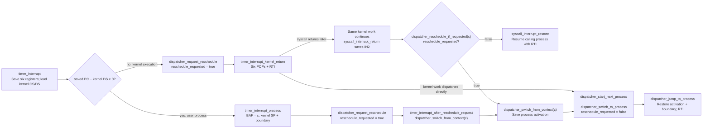
```mermaid
flowchart LR
    ENTRY["timer_interrupt<br/>Save six registers; load kernel CS/DS"] --> CHECK{"saved PC − kernel DS ≥ 0?"}
    CHECK -->|no: kernel execution| REQUEST_K["dispatcher_request_reschedule<br/>reschedule_requested = true"]
    REQUEST_K --> RETURN["timer_interrupt_kernel_return<br/>Six POPs + RTI"]
    RETURN -->|syscall returns later| LATER["Same kernel work continues<br/>syscall_interrupt_return saves IN2"]
    RETURN -->|kernel work dispatches directly| SELECT
    LATER --> PENDING{"dispatcher_reschedule_if_requested(c)<br/>reschedule_requested?"}
    PENDING -->|false| DIRECT["syscall_interrupt_restore<br/>Resume calling process with RTI"]
    PENDING -->|true| DISPATCH["dispatcher_switch_from_context(c)<br/>Save process activation"]
    CHECK -->|yes: user process| PROCESS["timer_interrupt_process<br/>BAF = c; kernel SP + boundary"]
    PROCESS --> REQUEST_P["dispatcher_request_reschedule<br/>reschedule_requested = true"]
    REQUEST_P --> AFTER["timer_interrupt_after_reschedule_request<br/>dispatcher_switch_from_context(c)"]
    AFTER --> DISPATCH
    DISPATCH --> SELECT["dispatcher_start_next_process<br/>→ dispatcher_switch_to_process<br/>reschedule_requested = false"]
    SELECT --> RESTORE["dispatcher_jump_to_process<br/>Restore activation + boundary; RTI"]
```

</ReadmeVisual>

</div>

</div>

---

<!-- SOURCE Pico-OS/README.md#251-timer-interrupt-path -->

# 2. Interrupts, system calls, preemption, and exceptions · 2.5 Timer interrupts and userspace preemption

## 2.5.1 Timer interrupt path (2)

<div class="deck-content readme-slide">

<div class="artifact-caption">The entry distinguishes them using the saved PC. This diagram isolates the implemented <code>&gt;=</code> test:</div>
<div class="readme-artifacts artifact-single">

<!-- README_ASSET mermaid-2457 -->
<ReadmeVisual kind="mermaid" :width="1024" style="flex-grow:10">

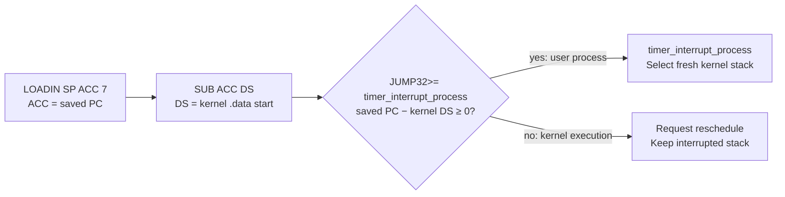
```mermaid
flowchart LR
    LOAD["LOADIN SP ACC 7<br/>ACC = saved PC"] --> SUBTRACT["SUB ACC DS<br/>DS = kernel .data start"]
    SUBTRACT --> CHECK{"JUMP32>= timer_interrupt_process<br/>saved PC − kernel DS ≥ 0?"}
    CHECK -->|yes: user process| PROCESS["timer_interrupt_process<br/>Select fresh kernel stack"]
    CHECK -->|no: kernel execution| KERNEL["Request reschedule<br/>Keep interrupted stack"]
```

</ReadmeVisual>

</div>

</div>

---

<!-- SOURCE Pico-OS/README.md#251-timer-interrupt-path -->

# 2. Interrupts, system calls, preemption, and exceptions · 2.5 Timer interrupts and userspace preemption

## 2.5.1 Timer interrupt path (3)

<div class="deck-content readme-slide">

<div class="artifact-caption">The entry and its three continuations implement those paths:</div>
<div class="readme-artifacts artifact-single">

<!-- README_ASSET code-2467 -->
<ReadmeVisual kind="code" :width="753.8" style="flex-grow:73">

<div class="readme-code">

```c {lines:false}
__attribute__((naked))
void timer_interrupt(void) {
    // Saves the interrupted context before requesting a process switch
    asm("PUSH ACC");
    asm("PUSH IN1");
    asm("PUSH IN2");
    asm("PUSH BAF");
    asm("PUSH CS");
    asm("PUSH DS");
    // SP now addresses the free cell below DS, CS, BAF, IN2, IN1 and ACC

    // Uses kernel segments because an interrupt can arrive during entry or return
    asm(KERNEL_CS_START_ASM); // LOADI32 CS -2147483643
    asm(KERNEL_DS_START_ASM); // LOADI32 DS -2147442882

    // Six saved registers put the automatic return PC at SP + 7.
    // DS is now kernel .data's start: kernel code is below it, process code above.
    // Test saved PC because CS may still be changing on kernel entry/return.
    asm("LOADIN SP ACC 7"); // Saved return PC at SP + 7
    asm("SUB ACC DS"); // Saved PC minus the kernel .data start
    asm("JUMP32>= timer_interrupt_process"); // Nonnegative: process context

    asm("LOADI32 ACC timer_interrupt_kernel_return");
    asm("ADD ACC CS");
    asm("PUSH ACC");
    asm("LOADI32 ACC dispatcher_request_reschedule");
    asm("ADD ACC CS");
    asm("MOVE ACC PC");
}

__attribute__((naked))
void timer_interrupt_kernel_return(void) {
    // The request stays pending while the interrupted kernel instructions resume
    asm("POP DS");
    asm("POP CS");
    asm("POP BAF");
    asm("POP IN2");
    asm("POP IN1");
    asm("POP ACC");
    asm("RTI");
}

__attribute__((naked))
void timer_interrupt_process(void) {
    // BAF preserves caller_context while SP switches to the kernel stack
    asm("MOVE SP BAF");
    asm("LOADI IN1 0");
    write_stack_heap_boundary_from_in1();
    asm(KERNEL_SP_START_ASM); // LOADI32 SP -2147435340
    activate_kernel_stack_boundary();

    asm("LOADI32 ACC timer_interrupt_after_reschedule_request");
    asm("ADD ACC CS");
    asm("PUSH ACC");
    asm("LOADI32 ACC dispatcher_request_reschedule");
    asm("ADD ACC CS");
    asm("MOVE ACC PC");
}

__attribute__((naked))
void timer_interrupt_after_reschedule_request(void) {
    // Passes the interrupted stack frame to the dispatcher
    asm("PUSH BAF"); // Caller context

    // The dispatcher switches to a process through RTI and does not return
    asm("LOADI ACC 0");
    asm("PUSH ACC"); // Unreachable return address required by the call frame
    asm("LOADI32 ACC dispatcher_switch_from_context");
    asm("ADD ACC CS");
    asm("MOVE ACC PC");
}
```

</div>

</ReadmeVisual>

</div>

</div>

---

<!-- SOURCE Pico-OS/README.md#251-timer-interrupt-path -->

# 2. Interrupts, system calls, preemption, and exceptions · 2.5 Timer interrupts and userspace preemption

## 2.5.1 Timer interrupt path (4)

<div class="deck-content readme-slide">

<div class="readme-artifacts artifact-pair">

<!-- README_ASSET list-2544 -->
<div class="readme-list"><ol start="1"><li>Save six registers on the interrupted stack; the automatic return PC is now at SP + 7.</li>
<li>Install kernel CS and DS, retaining the interrupted SP until classification.</li>
<li>Load the saved PC, subtract kernel DS, and branch to the process path when the result is nonnegative.</li></ol></div>

<!-- README_ASSET image-2553 -->
<ReadmeVisual kind="image" :width="1024" style="flex-grow:16">


</ReadmeVisual>

</div>

</div>

---

<!-- SOURCE Pico-OS/README.md#251-timer-interrupt-path -->

# 2. Interrupts, system calls, preemption, and exceptions · 2.5 Timer interrupts and userspace preemption

## 2.5.1 Timer interrupt path (5)

<div class="deck-content readme-slide">

<div class="readme-artifacts artifact-pair">

<!-- README_ASSET list-2563 -->
<div class="readme-list"><ol start="4"><li>Below kernel DS: keep the stack and request deferred rescheduling. Otherwise enter timer_interrupt_process.</li></ol></div>

<!-- README_ASSET list-2570 -->
<div class="readme-list"><ol start="1"><li>Pop DS, CS, BAF, IN2, IN1, and ACC. This path needs no MOVE BAF SP or boundary change.</li>
<li>RTI resumes the kernel; a later scheduling point checks reschedule_requested.</li></ol></div>

</div>

</div>

---

<!-- SOURCE Pico-OS/README.md#251-timer-interrupt-path -->

# 2. Interrupts, system calls, preemption, and exceptions · 2.5 Timer interrupts and userspace preemption

## 2.5.1 Timer interrupt path (6)

<div class="deck-content readme-slide">

<div class="readme-artifacts artifact-pair">

<!-- README_ASSET list-2582 -->
<div class="readme-list"><ol start="1"><li>Copy SP to BAF to retain the process frame. Kernel CS and DS are already active.</li>
<li>Disable the old boundary, install kernel SP, then activate the kernel boundary.</li>
<li>Set reschedule_requested through dispatcher_request_reschedule; continue at timer_interrupt_after_reschedule_request.</li></ol></div>

<!-- README_ASSET list-2599 -->
<div class="readme-list"><ol start="1"><li>Push the BAF context pointer and dummy return address 0.</li>
<li>dispatcher_switch_from_context saves the PCB activation and selects a process. Restoration belongs to the selected process; there is no direct return here.</li></ol></div>

</div>

</div>

---

<!-- SOURCE Pico-OS/README.md#252-kernel-non-preemption-and-deferred-rescheduling -->

# 2. Interrupts, system calls, preemption, and exceptions · 2.5 Timer interrupts and userspace preemption

## 2.5.2 Kernel non-preemption and deferred rescheduling

<div class="deck-content readme-slide">

<div class="readme-explanation"><p>Deferring a process switch lets a kernel operation finish before another process enters the kernel. Device interrupts can still run during that work.</p>
<p>A timer during kernel execution requests a later switch and returns to the interrupted work. Syscall return checks the flag before resuming userspace, subject to the timing window in <span class="source-link"><code>2.4.2.2 Selecting the return path</code></span>. UART handlers also return to the interrupted operation. This serializes processes' kernel calls, while shared terminal state still needs protection against UART interrupts.</p></div>

</div>

---

<!-- SOURCE Pico-OS/README.md#253-shell-character-delay-for-different-timer-intervals -->

# 2. Interrupts, system calls, preemption, and exceptions · 2.5 Timer interrupts and userspace preemption

## 2.5.3 Shell character delay for different timer intervals

<div class="deck-content readme-slide">

<div class="artifact-caption">Shorter timer intervals give processes more frequent turns but spend more time switching. The following measurements time shell character delay while an endless empty loop is running:</div>
<div class="readme-artifacts artifact-single">

<!-- README_ASSET image-2642 -->
<ReadmeVisual kind="image" :width="1024" style="flex-grow:16">


</ReadmeVisual>

</div>

</div>

---

<!-- SOURCE Pico-OS/README.md#26-uart-receive-interrupt-path -->

# 2. Interrupts, system calls, preemption, and exceptions

## 2.6 UART receive interrupt path (1)

<div class="deck-content readme-slide">

<div class="artifact-caption">UART reception enters service routine 2 at priority 2. It handles one byte and resumes the interrupted context. The diagram follows the choice between a terminal signal and ordinary input:</div>
<div class="readme-artifacts artifact-single">

<!-- README_ASSET mermaid-2657 -->
<ReadmeVisual kind="mermaid" :width="1024" style="flex-grow:10">

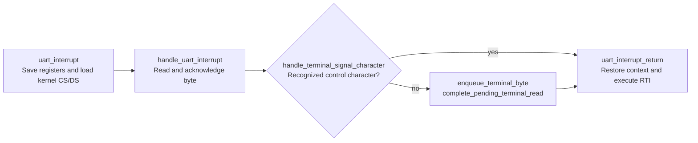
```mermaid
flowchart LR
    ENTRY["uart_interrupt<br/>Save registers and load kernel CS/DS"] --> HANDLE["handle_uart_interrupt<br/>Read and acknowledge byte"]
    HANDLE --> SIGNAL{"handle_terminal_signal_character<br/>Recognized control character?"}
    SIGNAL -->|yes| RETURN["uart_interrupt_return<br/>Restore context and execute RTI"]
    SIGNAL -->|no| INPUT["enqueue_terminal_byte<br/>complete_pending_terminal_read"]
    INPUT --> RETURN
```

</ReadmeVisual>

</div>

</div>

---

<!-- SOURCE Pico-OS/README.md#26-uart-receive-interrupt-path -->

# 2. Interrupts, system calls, preemption, and exceptions

## 2.6 UART receive interrupt path (2)

<div class="deck-content readme-slide">

<div class="artifact-caption">The naked entry and return keep the interrupted stack:</div>
<div class="readme-artifacts artifact-single">

<!-- README_ASSET code-2668 -->
<ReadmeVisual kind="code" :width="720" style="flex-grow:39">

<div class="readme-code">

```c {lines:false}
__attribute__((naked))
void uart_interrupt(void) {
    // Saves the interrupted context while the kernel transfers one input byte
    asm("PUSH ACC");
    asm("PUSH IN1");
    asm("PUSH IN2");
    asm("PUSH BAF");
    asm("PUSH CS");
    asm("PUSH DS");

    // BAF keeps the interrupted stack while the handler uses kernel segments
    // Keeping SP avoids overwriting a suspended kernel call frame when all
    // processes are blocked and the dispatcher is waiting for an interrupt
    asm("MOVE SP BAF");
    asm(KERNEL_CS_START_ASM); // LOADI32 CS -2147483643
    asm(KERNEL_DS_START_ASM); // LOADI32 DS -2147442882

    asm("LOADI32 ACC uart_interrupt_return");
    asm("ADD ACC CS");
    asm("PUSH ACC");
    asm("LOADI32 ACC handle_uart_interrupt");
    asm("ADD ACC CS");
    asm("MOVE ACC PC");
}

__attribute__((naked))
void uart_interrupt_return(void) {
    // Restores the context that was active before the UART interrupt
    asm("MOVE BAF SP");
    asm("POP DS");
    asm("POP CS");
    asm("POP BAF");
    asm("POP IN2");
    asm("POP IN1");
    asm("POP ACC");
    asm("RTI");
}
```

</div>

</ReadmeVisual>

</div>

</div>

---

<!-- SOURCE Pico-OS/README.md#26-uart-receive-interrupt-path -->

# 2. Interrupts, system calls, preemption, and exceptions

## 2.6 UART receive interrupt path (3)

<div class="deck-content readme-slide">

<div class="readme-artifacts artifact-pair">

<!-- README_ASSET list-2711 -->
<div class="readme-list"><ol start="1"><li>Save the six registers beside the automatic return PC.</li>
<li>Keep the frame pointer in BAF and install kernel CS and DS; retain interrupted SP and boundary.</li>
<li>Call handle_uart_interrupt with uart_interrupt_return as its continuation.</li></ol></div>

<!-- README_ASSET list-2722 -->
<div class="readme-list"><ol start="1"><li>Copy BAF to SP after the C handler returns.</li>
<li>Pop DS, CS, BAF, IN2, IN1, and ACC.</li>
<li>RTI resumes the interrupted stream without checking the scheduling flag or switching processes.</li></ol></div>

</div>

</div>

---

<!-- SOURCE Pico-OS/README.md#26-uart-receive-interrupt-path -->

# 2. Interrupts, system calls, preemption, and exceptions

## 2.6 UART receive interrupt path (4)

<div class="deck-content readme-slide">

<div class="artifact-caption">The complete C handler below acknowledges the byte before deciding whether it is a signal character or ordinary terminal input:</div>
<div class="readme-artifacts artifact-single">

<!-- README_ASSET code-2730 -->
<ReadmeVisual kind="code" :width="720" style="flex-grow:22">

<div class="readme-code">

```c {lines:false}
void handle_uart_interrupt(void) {
    struct ProcessControlBlock *process = terminal_input_process();
    struct Terminal *terminal = kernel_terminal();
    int value;
    int status;

    value = periphery_read_register(UART_RECEIVE_REGISTER) & 255;
    status = periphery_read_register(UART_STATUS_REGISTER);
    periphery_write_register(
        UART_STATUS_REGISTER,
        status | UART_RECEIVE_READY
    );

    if (handle_terminal_signal_character(value)) {
        return;
    }

    enqueue_terminal_byte(terminal, value);
    complete_pending_terminal_read(process, terminal);
}
```

</div>

</ReadmeVisual>

</div>

</div>

---

<!-- SOURCE Pico-OS/README.md#26-uart-receive-interrupt-path -->

# 2. Interrupts, system calls, preemption, and exceptions

## 2.6 UART receive interrupt path (5)

<div class="deck-content readme-slide">

<div class="readme-artifacts artifact-single">

<!-- README_ASSET list-2756 -->
<div class="readme-list"><ol start="1"><li>Find the input process and global terminal.</li>
<li>Read the received byte and acknowledge UART_RECEIVE_READY.</li>
<li>Handle Ctrl+C as SIGINT and Ctrl+Z as SIGTSTP; stop processing a consumed signal character.</li>
<li>Enqueue ordinary input; a full ring drops the new byte. Complete a waiting foreground read, save its result in activation.in2, and mark it runnable.</li></ol></div>

</div>

</div>

---

<!-- SOURCE Pico-OS/README.md#261-borrowed-stack-entry-and-return -->

# 2. Interrupts, system calls, preemption, and exceptions · 2.6 UART receive interrupt path

## 2.6.1 Borrowed-stack entry and return

<div class="deck-content readme-slide">

<div class="readme-explanation"><p>UART and DMA save registers and call their handlers on the interrupted stack. Calls use free space below the saved frame. Resetting kernel <code>SP</code> could overwrite suspended kernel calls.</p>
<p>The existing stack limit remains active. A fault inside either handler is classified as a kernel exception once kernel <code>CS</code> has been installed, even when the handler is borrowing a user stack.</p></div>

</div>

---

<!-- SOURCE Pico-OS/README.md#262-uart-nesting-and-interrupt-priorities -->

# 2. Interrupts, system calls, preemption, and exceptions · 2.6 UART receive interrupt path

## 2.6.2 UART nesting and interrupt priorities

<div class="deck-content readme-slide">

<div class="readme-artifacts artifact-single">

<!-- README_ASSET table-2797 rows=1-7 -->
<ReadmeVisual kind="table" :width="1100" style="flex-grow:10">

<div class="readme-table" v-pre><table><thead>
<tr>
<th>Event</th>
<th>Context already executing</th>
<th>Result</th>
</tr>
</thead><tbody><tr>
<td>UART receive</td>
<td>Syscall, with no hardware handler active</td>
<td>UART runs immediately and returns to the same syscall work</td>
</tr>
<tr>
<td>UART receive</td>
<td>Timer or DMA handler</td>
<td>UART priority <code>2</code> nests over priority <code>1</code>, then restores the interrupted handler</td>
</tr>
<tr>
<td>Timer expiration</td>
<td>UART handler</td>
<td>Priority <code>1</code> waits in the emulator's pending-handler queue until UART returns</td>
</tr>
<tr>
<td>DMA completion</td>
<td>UART handler</td>
<td>Priority <code>1</code> waits in that queue until UART returns</td>
</tr>
<tr>
<td>Timer expiration</td>
<td>DMA handler</td>
<td>Equal priority waits until DMA returns</td>
</tr>
<tr>
<td>DMA completion</td>
<td>Timer handler</td>
<td>Equal priority waits until timer completes its <code>RTI</code> path</td>
</tr>
<tr>
<td>Another UART byte</td>
<td>UART handler or an already pending UART byte</td>
<td>The terminal input queue keeps it until the active byte's ISR completes</td>
</tr></tbody></table></div>

</ReadmeVisual>

</div>

</div>

---

<!-- SOURCE Pico-OS/README.md#263-polled-uart-function-reference -->

# 2. Interrupts, system calls, preemption, and exceptions · 2.6 UART receive interrupt path

## 2.6.3 Polled UART function reference

<div class="deck-content readme-slide">

<div class="readme-artifacts artifact-single">

<!-- README_ASSET table-2829 rows=1-2 -->
<ReadmeVisual kind="table" :width="1440" style="flex-grow:10">

<div class="readme-table" v-pre><table><thead>
<tr>
<th>Kernel function</th>
<th>Return value / status</th>
<th>Effects</th>
<th>Calls</th>
<th>Called by</th>
</tr>
</thead><tbody><tr>
<td><span class="source-link"><code>send_byte_over_uart(value)</code></span></td>
<td>Returns no value</td>
<td>Sends the low byte through UART register 0 and polls UART status, changes no kernel structure</td>
<td><span class="source-link"><code>switch_to_periphery_address_space()</code></span></td>
<td><strong>Library functions:</strong> <span class="source-link"><code>send_byte_over_uart()</code></span> through the direct-UART syscall<br><strong>Shared/Common functions:</strong> <span class="source-link"><code>uart_print_character()</code></span>, linked directly to the kernel implementation<br><strong>Kernel functions:</strong> <span class="source-link"><code>handle_syscall()</code></span></td>
</tr>
<tr>
<td><span class="source-link"><code>receive_byte_over_uart(void)</code></span></td>
<td>Returns one received byte</td>
<td>Polls UART status and reads UART register 1, changes no kernel structure</td>
<td><span class="source-link"><code>switch_to_periphery_address_space()</code></span></td>
<td><strong>Shared/Common functions:</strong> <span class="source-link"><code>receive_word()</code></span>, linked directly to the kernel implementation<br><strong>Kernel functions:</strong> <span class="source-link"><code>drain_process_bytes()</code></span>, <span class="source-link"><code>read_regular_file()</code></span>, <span class="source-link"><code>uart_receive_string()</code></span></td>
</tr></tbody></table></div>

</ReadmeVisual>

</div>

</div>

---

<!-- SOURCE Pico-OS/README.md#27-dma-completion-interrupt-path -->

# 2. Interrupts, system calls, preemption, and exceptions

## 2.7 DMA completion interrupt path (1)

<div class="deck-content readme-slide">

<div class="artifact-caption">DMA completion enters service routine 4 and wakes the waiting loader. The loader checks success or failure when it next runs. This diagram follows delivery and wakeup:</div>
<div class="readme-artifacts artifact-single">

<!-- README_ASSET mermaid-2841 -->
<ReadmeVisual kind="mermaid" :width="1024" style="flex-grow:10">

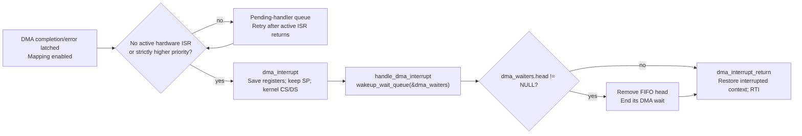
```mermaid
flowchart LR
    PENDING["DMA completion/error latched<br/>Mapping enabled"] --> PRIORITY{"No active hardware ISR<br/>or strictly higher priority?"}
    PRIORITY -->|no| WAIT["Pending-handler queue<br/>Retry after active ISR returns"]
    PRIORITY -->|yes| ENTRY["dma_interrupt<br/>Save registers; keep SP; kernel CS/DS"]
    WAIT --> PRIORITY
    ENTRY --> HANDLE["handle_dma_interrupt<br/>wakeup_wait_queue(&dma_waiters)"]
    HANDLE --> QUEUE{"dma_waiters.head != NULL?"}
    QUEUE -->|yes| WAKE["Remove FIFO head<br/>End its DMA wait"]
    QUEUE -->|no| RETURN["dma_interrupt_return<br/>Restore interrupted context; RTI"]
    WAKE --> RETURN
```

</ReadmeVisual>

</div>

</div>

---

<!-- SOURCE Pico-OS/README.md#27-dma-completion-interrupt-path -->

# 2. Interrupts, system calls, preemption, and exceptions

## 2.7 DMA completion interrupt path (2)

<div class="deck-content readme-slide">

<div class="artifact-caption">The entry and return borrow the interrupted stack. The C handler wakes a waiter and leaves process selection to the dispatcher:</div>
<div class="readme-artifacts artifact-single">

<!-- README_ASSET code-2857 -->
<ReadmeVisual kind="code" :width="720" style="flex-grow:41">

<div class="readme-code">

```c {lines:false}
__attribute__((naked))
void dma_interrupt(void) {
    // Saves the interrupted context while the kernel completes the DMA wait
    asm("PUSH ACC");
    asm("PUSH IN1");
    asm("PUSH IN2");
    asm("PUSH BAF");
    asm("PUSH CS");
    asm("PUSH DS");

    // BAF keeps the interrupted stack while the handler uses kernel segments
    asm("MOVE SP BAF");
    asm(KERNEL_CS_START_ASM); // LOADI32 CS -2147483643
    asm(KERNEL_DS_START_ASM); // LOADI32 DS -2147442882

    asm("LOADI32 ACC dma_interrupt_return");
    asm("ADD ACC CS");
    asm("PUSH ACC");
    asm("LOADI32 ACC handle_dma_interrupt");
    asm("ADD ACC CS");
    asm("MOVE ACC PC");
}

__attribute__((naked))
void dma_interrupt_return(void) {
    // Restores the context that was active before the DMA interrupt
    asm("MOVE BAF SP");
    asm("POP DS");
    asm("POP CS");
    asm("POP BAF");
    asm("POP IN2");
    asm("POP IN1");
    asm("POP ACC");
    asm("RTI");
}

void handle_dma_interrupt(void) {
    wakeup_wait_queue(&dma_waiters);
}
```

</div>

</ReadmeVisual>

</div>

</div>

---

<!-- SOURCE Pico-OS/README.md#27-dma-completion-interrupt-path -->

# 2. Interrupts, system calls, preemption, and exceptions

## 2.7 DMA completion interrupt path (3)

<div class="deck-content readme-slide">

<div class="readme-artifacts artifact-pair">

<!-- README_ASSET list-2902 -->
<div class="readme-list"><ol start="1"><li>Save the six registers on the interrupted stack.</li>
<li>Keep BAF as the frame pointer; install kernel CS and DS while preserving SP and boundary.</li>
<li>Call handle_dma_interrupt with dma_interrupt_return as its continuation.</li></ol></div>

<!-- README_ASSET list-2918 -->
<div class="readme-list"><ol start="1"><li>Copy BAF to SP after the handler returns.</li>
<li>Pop DS, CS, BAF, IN2, IN1, and ACC.</li>
<li>RTI returns without checking the reschedule flag or dispatching; this uses the borrowed-stack convention.</li></ol></div>

</div>

</div>

---

<!-- SOURCE Pico-OS/README.md#271-dma-waiting-and-completion-function-reference -->

# 2. Interrupts, system calls, preemption, and exceptions · 2.7 DMA completion interrupt path

## 2.7.1 DMA waiting and completion function reference

<div class="deck-content readme-slide">

<div class="readme-artifacts artifact-single">

<!-- README_ASSET table-2939 rows=1-3 -->
<ReadmeVisual kind="table" :width="1440" style="flex-grow:10">

<div class="readme-table" v-pre><table><thead>
<tr>
<th>Kernel function</th>
<th>Return value / status</th>
<th>Effects</th>
<th>Calls</th>
<th>Called by</th>
</tr>
</thead><tbody><tr>
<td><span class="source-link"><code>initialize_dma(void)</code></span></td>
<td>Returns no value</td>
<td>Initializes <span class="source-link"><code>dma_waiters</code></span> and sets <span class="source-link"><code>dma_initialized</code></span> once when DMA is active, otherwise changes nothing</td>
<td><span class="source-link"><code>dma_is_active()</code></span></td>
<td><strong>Kernel functions:</strong> <span class="source-link"><code>main()</code></span>, <span class="source-link"><code>start_dma_uart_receive()</code></span></td>
</tr>
<tr>
<td><span class="source-link"><code>start_dma_uart_receive(destination, word_count, caller_context)</code></span></td>
<td>Returns <code>false</code> when DMA is unavailable, busy, or already has a waiter. Successful setup does not return through the current kernel call. The process later resumes from its saved interrupt frame with <span class="source-link"><code>SYSCALL_LOAD_PROCESS_CONTINUE</code></span>.</td>
<td>Stores the continuation result in the saved syscall frame, blocks the caller on <span class="source-link"><code>dma_waiters</code></span>, starts a UART-to-SRAM transfer, and switches processes</td>
<td><span class="source-link"><code>dma_is_active()</code></span>, <span class="source-link"><code>initialize_dma()</code></span>, <span class="source-link"><code>dma_transfer_status()</code></span>, <span class="source-link"><code>enqueue_current_process_on_wait_queue()</code></span>, <span class="source-link"><code>start_dma_uart_transfer()</code></span>, <span class="source-link"><code>dispatcher_switch_from_context()</code></span></td>
<td><strong>Kernel functions:</strong> <span class="source-link"><code>begin_process_load()</code></span></td>
</tr>
<tr>
<td><span class="source-link"><code>handle_dma_interrupt(void)</code></span></td>
<td>Returns no value</td>
<td>Wakes the first process whose PCB is queued on <span class="source-link"><code>dma_waiters</code></span></td>
<td><span class="source-link"><code>wakeup_wait_queue()</code></span></td>
<td><strong>Hardware interrupts:</strong> DMA completion via <span class="source-link"><code>dma_interrupt()</code></span></td>
</tr></tbody></table></div>

</ReadmeVisual>

</div>

</div>

---

<!-- SOURCE Pico-OS/README.md#281-cpu-exception-entry-and-registers -->

# 2. Interrupts, system calls, preemption, and exceptions · 2.8 CPU exceptions and runtime errors

## 2.8.1 CPU exception entry and registers (1)

<div class="deck-content readme-slide">

<div class="artifact-caption">Division or modulo by zero, stack overflow, and illegal instructions enter service routine 3 directly, bypassing device mappings and priorities. The diagram shows why the faulting context does not resume:</div>
<div class="readme-artifacts artifact-single">

<!-- README_ASSET mermaid-2959 -->
<ReadmeVisual kind="mermaid" :width="1024" style="flex-grow:10">

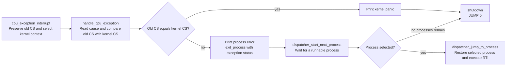
```mermaid
flowchart LR
    ENTRY["cpu_exception_interrupt<br/>Preserve old CS and select kernel context"] --> HANDLE["handle_cpu_exception<br/>Read cause and compare old CS with kernel CS"]
    HANDLE --> KERNEL{"Old CS equals kernel CS?"}
    KERNEL -->|yes| PANIC["Print kernel panic"] --> HALT["shutdown<br/>JUMP 0"]
    KERNEL -->|no| EXIT["Print process error<br/>exit_process with exception status"]
    EXIT --> NEXT["dispatcher_start_next_process<br/>Wait for a runnable process"]
    NEXT --> SELECT{"Process selected?"}
    SELECT -->|no processes remain| HALT
    SELECT -->|yes| RESTORE["dispatcher_jump_to_process<br/>Restore selected process and execute RTI"]
```

</ReadmeVisual>

</div>

</div>

---

<!-- SOURCE Pico-OS/README.md#281-cpu-exception-entry-and-registers -->

# 2. Interrupts, system calls, preemption, and exceptions · 2.8 CPU exceptions and runtime errors

## 2.8.1 CPU exception entry and registers (2)

<div class="deck-content readme-slide">

<div class="readme-artifacts artifact-single">

<!-- README_ASSET table-2974 rows=1-2 -->
<ReadmeVisual kind="table" :width="1100" style="flex-grow:10">

<div class="readme-table" v-pre><table><thead>
<tr>
<th style="text-align:right">Register</th>
<th>Written by</th>
<th>Contents and use</th>
</tr>
</thead><tbody><tr>
<td style="text-align:right">10, <span class="source-link"><code>STACK_HEAP_BOUNDARY_REGISTER</code></span></td>
<td>PicoOS</td>
<td><code>0</code> disables stack protection. Any other value is the active boundary, the emulator raises a stack-overflow exception when an instruction decreases <code>SP</code> to a value below it. <span class="source-link"><code>activate_kernel_stack_boundary()</code></span> writes <span class="source-link"><code>KERNEL_HEAP_START</code></span> + <span class="source-link"><code>KERNEL_HEAP_SIZE</code></span> − 1. A process boundary is <span class="source-link"><code>base_address</code></span> + <span class="source-link"><code>heap_start</code></span> + <span class="source-link"><code>heap_size</code></span> − 1.</td>
</tr>
<tr>
<td style="text-align:right">11, <span class="source-link"><code>CPU_EXCEPTION_CAUSE_REGISTER</code></span></td>
<td>RETI CPU/emulator</td>
<td><code>0</code> means no exception has been recorded, <code>1</code> means division or modulo by zero, <code>2</code> means stack overflow, and <code>3</code> means illegal instruction. Guest writes are ignored. <span class="source-link"><code>handle_cpu_exception()</code></span> reads this value after exception entry.</td>
</tr></tbody></table></div>

</ReadmeVisual>

</div>

</div>

---

<!-- SOURCE Pico-OS/README.md#281-cpu-exception-entry-and-registers -->

# 2. Interrupts, system calls, preemption, and exceptions · 2.8 CPU exceptions and runtime errors

## 2.8.1 CPU exception entry and registers (3)

<div class="deck-content readme-slide">

<div class="artifact-caption">Exception entry saves the faulting PC minus one. The naked handler abandons that context, so it does not save the other registers:</div>
<div class="readme-artifacts artifact-single">

<!-- README_ASSET code-2982 -->
<ReadmeVisual kind="code" :width="736.6" style="flex-grow:25">

<div class="readme-code">

```c {lines:false}
__attribute__((naked))
void cpu_exception_interrupt(void) {
    // BAF preserves the interrupted CS while the handler resets kernel context
    asm("MOVE CS BAF");
    asm("LOADI IN1 0");
    write_stack_heap_boundary_from_in1();
    asm(KERNEL_CS_START_ASM); // LOADI32 CS -2147483643
    asm(KERNEL_DS_START_ASM); // LOADI32 DS -2147442882
    asm(KERNEL_SP_START_ASM); // LOADI32 SP -2147435340
    activate_kernel_stack_boundary();

    // A zero difference identifies an exception raised in kernel code
    asm("MOVE BAF ACC");
    asm("SUB ACC CS");
    asm("PUSH ACC");

    // The exception handler terminates the process or halts after a kernel panic
    asm("LOADI ACC 0");
    asm("PUSH ACC");
    asm("LOADI32 ACC handle_cpu_exception");
    asm("ADD ACC CS");
    asm("MOVE ACC PC");
}
```

</div>

</ReadmeVisual>

</div>

</div>

---

<!-- SOURCE Pico-OS/README.md#281-cpu-exception-entry-and-registers -->

# 2. Interrupts, system calls, preemption, and exceptions · 2.8 CPU exceptions and runtime errors

## 2.8.1 CPU exception entry and registers (4)

<div class="deck-content readme-slide">

<div class="readme-artifacts artifact-pair">

<!-- README_ASSET list-3011 -->
<div class="readme-list"><ol start="1"><li>Preserve interrupted CS in BAF for classification.</li>
<li>Disable the old boundary; reset kernel CS, DS, and SP; activate the kernel boundary, even for a kernel fault.</li>
<li>Subtract kernel CS from the preserved value and pass the difference to the C handler.</li>
<li>Call handle_cpu_exception with dummy return address 0. It halts or terminates the process and never returns.</li></ol></div>

<!-- README_ASSET code-3030 -->
<ReadmeVisual kind="code" :width="720" style="flex-grow:13">

<div class="readme-code">

```c {lines:false}
void handle_cpu_exception(int interrupted_kernel_cs_difference) {
    int cause = periphery_read_register(CPU_EXCEPTION_CAUSE_REGISTER);
    bool kernel_exception = interrupted_kernel_cs_difference == 0;

    print_cpu_exception_message(cause, kernel_exception);
    if (kernel_exception) {
        shutdown();
    }

    exit_process(PROCESS_EXIT_STATUS_EXCEPTION);
}
```

</div>

</ReadmeVisual>

</div>

</div>

---

<!-- SOURCE Pico-OS/README.md#281-cpu-exception-entry-and-registers -->

# 2. Interrupts, system calls, preemption, and exceptions · 2.8 CPU exceptions and runtime errors

## 2.8.1 CPU exception entry and registers (5)

<div class="deck-content readme-slide">

<div class="readme-artifacts artifact-single">

<!-- README_ASSET list-3047 -->
<div class="readme-list"><ol start="1"><li>Read the exception cause and test whether interrupted CS equals kernel CS.</li>
<li>Print the diagnostic: direct UART for kernel faults, descriptor 1 for process faults.</li>
<li>Kernel fault: shutdown halts with JUMP 0.</li>
<li>Process fault: record exception status, mark ZOMBIE, and remove immediately when no parent needs collection.</li>
<li>Dispatch another process, or halt if the list empties. Never restore the faulting context.</li></ol></div>

</div>

</div>

---

<!-- SOURCE Pico-OS/README.md#282-supported-exceptions-and-allocation-errors -->

# 2. Interrupts, system calls, preemption, and exceptions · 2.8 CPU exceptions and runtime errors

## 2.8.2 Supported exceptions and allocation errors

<div class="deck-content readme-slide">

<div class="readme-artifacts artifact-single">

<!-- README_ASSET table-3080 rows=1-6 -->
<ReadmeVisual kind="table" :width="1100" style="flex-grow:10">

<div class="readme-table" v-pre><table><thead>
<tr>
<th>Condition</th>
<th>Trigger</th>
<th>Entry or reported cause</th>
<th>PicoOS handling</th>
</tr>
</thead><tbody><tr>
<td>Division or modulo by zero</td>
<td>A RETI <code>DIV</code>, <code>DIVI</code>, <code>MOD</code>, or <code>MODI</code> instruction has a zero divisor</td>
<td>CPU exception cause <code>1</code>, interrupt service routine table entry 3</td>
<td><span class="source-link"><code>handle_cpu_exception()</code></span> reports division by zero. It terminates the current process with exception status for a userspace fault, or reports a kernel panic and shuts down for a kernel fault.</td>
</tr>
<tr>
<td>Stack overflow</td>
<td>An instruction decreases <code>SP</code> below the active boundary in periphery register 10</td>
<td>CPU exception cause <code>2</code>, interrupt service routine table entry 3</td>
<td><span class="source-link"><code>handle_cpu_exception()</code></span> reports process stack overflow and terminates that process, or reports kernel stack overflow and shuts down.</td>
</tr>
<tr>
<td>Illegal instruction</td>
<td>The fetched word is not a valid RETI instruction, or instruction decoding reaches an unsupported opcode</td>
<td>CPU exception cause <code>3</code>, interrupt service routine table entry 3</td>
<td><span class="source-link"><code>handle_cpu_exception()</code></span> reports an illegal instruction and applies the process-or-kernel policy above. The message helper also treats any unexpected cause value as illegal instruction.</td>
</tr>
<tr>
<td>Process heap full</td>
<td><span class="source-link"><code>malloc()</code></span> or <span class="source-link"><code>realloc()</code></span> cannot satisfy a positive-size allocation</td>
<td><span class="source-link"><code>require_process_heap_allocation()</code></span> invokes the process-heap-full syscall</td>
<td><span class="source-link"><code>handle_process_heap_full_exception()</code></span> reports <code>Process terminated: heap full</code> through descriptor 1 and terminates the current process with exception status.</td>
</tr>
<tr>
<td>Kernel heap full</td>
<td><span class="source-link"><code>kmalloc()</code></span> or <span class="source-link"><code>krealloc()</code></span> cannot satisfy a positive-size allocation</td>
<td><span class="source-link"><code>require_kernel_heap_allocation()</code></span> calls the panic handler directly</td>
<td><span class="source-link"><code>panic_kernel_heap_full()</code></span> writes <code>Kernel panic: kernel heap full</code> directly over UART and shuts down.</td>
</tr>
<tr>
<td>Process and Shared Data Heap exhausted</td>
<td><span class="source-link"><code>PSDMalloc()</code></span> cannot reserve a contiguous Process Payload or Shared Data Payload</td>
<td>Returns <span class="source-link"><code>PSDMALLOC_INVALID_START</code></span>, no CPU exception is raised</td>
<td><span class="source-link"><code>begin_process_load()</code></span> and <span class="source-link"><code>load_process()</code></span> report <code>error: not enough process memory</code> and fail the load. <span class="source-link"><code>open_shared_memory()</code></span> frees the new entry and returns <code>-1</code>. The running process and kernel continue.</td>
</tr></tbody></table></div>

</ReadmeVisual>

</div>

</div>

---

<!-- SOURCE Pico-OS/README.md#283-exception-and-stack-boundary-function-reference -->

# 2. Interrupts, system calls, preemption, and exceptions · 2.8 CPU exceptions and runtime errors

## 2.8.3 Exception and stack-boundary function reference

<div class="deck-content readme-slide">

<div class="readme-artifacts artifact-single">

<!-- README_ASSET table-3097 rows=1-6 -->
<ReadmeVisual kind="table" :width="1440" style="flex-grow:10">

<div class="readme-table" v-pre><table><thead>
<tr>
<th>Kernel function</th>
<th>Return value / status</th>
<th>Effects</th>
<th>Calls</th>
<th>Called by</th>
</tr>
</thead><tbody><tr>
<td><span class="source-link"><code>handle_process_heap_full_exception(void)</code></span></td>
<td>Does not return normally</td>
<td>Writes a diagnostic through descriptor 1 and terminates the current process with exception status</td>
<td><span class="source-link"><code>write_process_exception_message()</code></span>, <span class="source-link"><code>exit_process()</code></span></td>
<td><strong>Library functions:</strong> <span class="source-link"><code>require_process_heap_allocation()</code></span> through the process-heap-full syscall<br><strong>Kernel functions:</strong> <span class="source-link"><code>handle_syscall()</code></span></td>
</tr>
<tr>
<td><span class="source-link"><code>activate_kernel_stack_boundary(void)</code></span></td>
<td>Returns no value</td>
<td>Writes the kernel heap end to periphery register 10</td>
<td><span class="source-link"><code>periphery_write_register()</code></span></td>
<td><strong>System-call entry:</strong> <span class="source-link"><code>syscall_interrupt()</code></span><br><strong>Hardware interrupts:</strong> timer via <span class="source-link"><code>timer_interrupt_process()</code></span><br><strong>CPU exceptions:</strong> <span class="source-link"><code>cpu_exception_interrupt()</code></span><br><strong>Kernel functions:</strong> <span class="source-link"><code>main()</code></span></td>
</tr>
<tr>
<td><span class="source-link"><code>process_stack_boundary(process)</code></span></td>
<td>Returns the process's absolute heap end</td>
<td>Reads <span class="source-link"><code>base_address</code></span>, <span class="source-link"><code>heap_start</code></span>, and <span class="source-link"><code>heap_size</code></span>, changes no state</td>
<td>None</td>
<td><strong>Kernel functions:</strong> <span class="source-link"><code>activate_current_process_stack_boundary()</code></span>, <span class="source-link"><code>dispatcher_switch_to_process()</code></span></td>
</tr>
<tr>
<td><span class="source-link"><code>activate_current_process_stack_boundary(void)</code></span></td>
<td>Returns no value</td>
<td>Writes the current process boundary to periphery register 10</td>
<td><span class="source-link"><code>current_process()</code></span>, <span class="source-link"><code>process_stack_boundary()</code></span>, <span class="source-link"><code>periphery_write_register()</code></span></td>
<td><strong>System-call return:</strong> <span class="source-link"><code>syscall_interrupt_restore()</code></span></td>
</tr>
<tr>
<td><span class="source-link"><code>handle_cpu_exception(interrupted_kernel_cs_difference)</code></span></td>
<td>Does not return normally</td>
<td>Reads register 11, terminates the current process for a process fault or shuts down for a kernel fault</td>
<td><span class="source-link"><code>periphery_read_register()</code></span>, <span class="source-link"><code>print_cpu_exception_message()</code></span>, <span class="source-link"><code>shutdown()</code></span>, <span class="source-link"><code>exit_process()</code></span></td>
<td><strong>CPU exceptions:</strong> <span class="source-link"><code>cpu_exception_interrupt()</code></span></td>
</tr>
<tr>
<td><span class="source-link"><code>panic_kernel_heap_full(void)</code></span></td>
<td>Does not return</td>
<td>Writes a UART kernel-panic message and shuts down</td>
<td><span class="source-link"><code>uart_print_string()</code></span>, <span class="source-link"><code>shutdown()</code></span></td>
<td><strong>Kernel functions:</strong> <span class="source-link"><code>require_kernel_heap_allocation()</code></span></td>
</tr></tbody></table></div>

</ReadmeVisual>

</div>

</div>

---

<!-- SOURCE Pico-OS/README.md#31-heap-block-layout-and-allocation-algorithm -->

# 3. Memory management and shared memory

## 3.1 Heap block layout and allocation algorithm (1)

<div class="deck-content readme-slide">

<div class="artifact-caption"><span class="source-link"><code>Heap.first_block</code></span> starts the allocator's list. Each <span class="source-link"><code>BlockHeader</code></span> describes the payload immediately after it. The definition and field table show how the allocator uses them:</div>
<div class="readme-artifacts artifact-single">

<!-- README_ASSET code-3120 -->
<ReadmeVisual kind="code" :width="720" style="flex-grow:11">

<div class="readme-code">

```c {lines:false}
struct BlockHeader {
    int size;
    bool free;
    struct BlockHeader *next;
};

struct Heap {
    struct BlockHeader *first_block;
};
```

</div>

</ReadmeVisual>

</div>

</div>

---

<!-- SOURCE Pico-OS/README.md#31-heap-block-layout-and-allocation-algorithm -->

# 3. Memory management and shared memory

## 3.1 Heap block layout and allocation algorithm (2)

<div class="deck-content readme-slide">

<div class="artifact-caption">Every header occupies three cells for <span class="source-link"><code>size</code></span>, <span class="source-link"><code>free</code></span>, and <span class="source-link"><code>next</code></span>. This four-block example shows physical adjacency and the header-pointer chain:</div>
<div class="readme-artifacts artifact-single">

<!-- README_ASSET image-3140 -->
<ReadmeVisual kind="image" :width="1024" style="flex-grow:16">


</ReadmeVisual>

</div>

</div>

---

<!-- SOURCE Pico-OS/README.md#31-heap-block-layout-and-allocation-algorithm -->

# 3. Memory management and shared memory

## 3.1 Heap block layout and allocation algorithm (3)

<div class="deck-content readme-slide">

<div class="readme-artifacts artifact-single">

<!-- README_ASSET table-3145 rows=1-4 -->
<ReadmeVisual kind="table" :width="1100" style="flex-grow:10">

<div class="readme-table" v-pre><table><thead>
<tr>
<th>Field</th>
<th>Meaning</th>
<th>Used by</th>
</tr>
</thead><tbody><tr>
<td><span class="source-link"><code>BlockHeader.size</code></span></td>
<td>Number of usable cells after this header, excluding the header itself</td>
<td>First initialized by <span class="source-link"><code>heap_init_region()</code></span>, read by <span class="source-link"><code>heap_alloc_from()</code></span>, read/changed by <span class="source-link"><code>heap_split_block()</code></span>, <span class="source-link"><code>heap_merge_free_blocks()</code></span>, and <span class="source-link"><code>heap_realloc_from()</code></span></td>
</tr>
<tr>
<td><span class="source-link"><code>BlockHeader.free</code></span></td>
<td>Whether the associated cells may satisfy an allocation</td>
<td>First initialized by <span class="source-link"><code>heap_init_region()</code></span>, initialized for new split headers by <span class="source-link"><code>heap_split_block()</code></span>, read/changed by <span class="source-link"><code>heap_alloc_from()</code></span>, changed by <span class="source-link"><code>heap_free_from()</code></span>, read by <span class="source-link"><code>heap_realloc_from()</code></span> and <span class="source-link"><code>heap_merge_free_blocks()</code></span></td>
</tr>
<tr>
<td><span class="source-link"><code>BlockHeader.next</code></span></td>
<td>Address of the next in-region header, or <code>NULL</code>. Splitting inserts and merging removes links</td>
<td>First initialized by <span class="source-link"><code>heap_init_region()</code></span>, read by <span class="source-link"><code>heap_alloc_from()</code></span>, read/changed by <span class="source-link"><code>heap_split_block()</code></span>, <span class="source-link"><code>heap_merge_free_blocks()</code></span>, and <span class="source-link"><code>heap_realloc_from()</code></span></td>
</tr>
<tr>
<td><span class="source-link"><code>Heap.first_block</code></span></td>
<td>First header in the managed region, the descriptor owns no separate block array</td>
<td>First initialized by <span class="source-link"><code>heap_init_region()</code></span>, read by <span class="source-link"><code>heap_alloc_from()</code></span> and <span class="source-link"><code>heap_merge_free_blocks()</code></span>. Reallocation/freeing reach it through these functions</td>
</tr></tbody></table></div>

</ReadmeVisual>

</div>

</div>

---

<!-- SOURCE Pico-OS/README.md#32-sram-image-and-heap-hierarchy -->

# 3. Memory management and shared memory

## 3.2 SRAM image and heap hierarchy (1)

<div class="deck-content readme-slide">

<div class="readme-artifacts artifact-single">

<!-- README_ASSET table-3167 rows=1-3 -->
<ReadmeVisual kind="table" :width="1100" style="flex-grow:10">

<div class="readme-table" v-pre><table><thead>
<tr>
<th>Heap context</th>
<th>Descriptor storage</th>
<th>Managed payloads</th>
<th>Interface</th>
</tr>
</thead><tbody><tr>
<td>Kernel Heap</td>
<td><span class="source-link"><code>kernel_heap</code></span>, a <span class="source-link"><code>struct Heap</code></span> global in kernel <code>.data</code></td>
<td>PCBs, copied paths, descriptor tables, <span class="source-link"><code>SharedMemoryEntry</code></span>, <span class="source-link"><code>SharedMemoryAttachment</code></span>, and other kernel objects</td>
<td><span class="source-link"><code>kmalloc()</code></span> / <span class="source-link"><code>kfree()</code></span></td>
</tr>
<tr>
<td>Process and Shared Data Heap</td>
<td><span class="source-link"><code>process_shared_data_heap</code></span>, a <span class="source-link"><code>struct Heap</code></span> global in kernel <code>.data</code></td>
<td>Complete Process Payloads and Shared Data Payloads</td>
<td><span class="source-link"><code>PSDMalloc()</code></span> / <span class="source-link"><code>PSDFree()</code></span></td>
</tr>
<tr>
<td>User Process Heap</td>
<td><span class="source-link"><code>process_heap</code></span>, a <span class="source-link"><code>struct Heap</code></span> global in that process's <code>.data</code></td>
<td>Allocations made by that process and its linked libraries</td>
<td><span class="source-link"><code>malloc()</code></span> / <span class="source-link"><code>free()</code></span></td>
</tr></tbody></table></div>

</ReadmeVisual>

</div>

</div>

---

<!-- SOURCE Pico-OS/README.md#32-sram-image-and-heap-hierarchy -->

# 3. Memory management and shared memory

## 3.2 SRAM image and heap hierarchy (2)

<div class="deck-content readme-slide">

<div class="artifact-caption">The expanded Process Payload shows its inner heap. Its headers are separate from the outer header that manages the whole payload. Only <code>.ivt</code>, <code>.text</code>, and <code>.data</code> belong to the linked User Process Image.</div>
<div class="readme-artifacts artifact-single">

<!-- README_ASSET image-3183 -->
<ReadmeVisual kind="image" :width="1024" style="flex-grow:16">


</ReadmeVisual>

</div>

</div>

---

<!-- SOURCE Pico-OS/README.md#32-sram-image-and-heap-hierarchy -->

# 3. Memory management and shared memory

## 3.2 SRAM image and heap hierarchy (3)

<div class="deck-content readme-slide">

<div class="readme-artifacts artifact-single">

<!-- README_ASSET table-3189 rows=1-6 -->
<ReadmeVisual kind="table" :width="1100" style="flex-grow:10">

<div class="readme-table" v-pre><table><thead>
<tr>
<th>Larger part</th>
<th style="text-align:right">SRAM offset</th>
<th>Section or region</th>
<th>Contents</th>
</tr>
</thead><tbody><tr>
<td>Kernel Image</td>
<td style="text-align:right"><code>0..4</code></td>
<td><code>.ivt</code></td>
<td>Five interrupt service routine addresses</td>
</tr>
<tr>
<td>Kernel Image</td>
<td style="text-align:right"><code>5..40765</code></td>
<td><code>.text</code></td>
<td>Kernel code, including interrupt service routines</td>
</tr>
<tr>
<td>Kernel Image</td>
<td style="text-align:right"><code>40766..41496</code></td>
<td><code>.data</code></td>
<td>Kernel globals, including both kernel-managed heap descriptors and list roots</td>
</tr>
<tr>
<td>Kernel runtime reservation</td>
<td style="text-align:right"><code>41497..45592</code></td>
<td>Kernel Heap</td>
<td>4096 cells, including in-region block headers</td>
</tr>
<tr>
<td>Kernel runtime reservation</td>
<td style="text-align:right"><code>45593..48308</code></td>
<td>Kernel Stack</td>
<td>Stack grows toward lower addresses from the initial free <code>SP</code> cell</td>
</tr>
<tr>
<td>After the Kernel region</td>
<td style="text-align:right"><code>48309..262143</code></td>
<td>Process and Shared Data Heap</td>
<td>Outer blocks for Process Payloads and Shared Data Payloads</td>
</tr></tbody></table></div>

</ReadmeVisual>

</div>

</div>

---

<!-- SOURCE Pico-OS/README.md#32-sram-image-and-heap-hierarchy -->

# 3. Memory management and shared memory

## 3.2 SRAM image and heap hierarchy (4)

<div class="deck-content readme-slide">

<div class="readme-artifacts artifact-single">

<!-- README_ASSET table-3207 rows=1-5 -->
<ReadmeVisual kind="table" :width="1100" style="flex-grow:10">

<div class="readme-table" v-pre><table><thead>
<tr>
<th>Process Payload part</th>
<th>Relative address</th>
<th>Runtime role</th>
</tr>
</thead><tbody><tr>
<td>Optional <code>.ivt</code></td>
<td>Before <span class="source-link"><code>code_start</code></span> when present</td>
<td>Process-local attributed data, ordinary PicoOS user images normally omit it</td>
</tr>
<tr>
<td><code>.text</code></td>
<td><span class="source-link"><code>code_start</code></span></td>
<td><span class="source-link"><code>create_process()</code></span> adds <span class="source-link"><code>base_address</code></span> to initialize <span class="source-link"><code>activation.cs</code></span></td>
</tr>
<tr>
<td><code>.data</code></td>
<td><span class="source-link"><code>data_start</code></span></td>
<td>Added to <span class="source-link"><code>base_address</code></span> for <span class="source-link"><code>activation.ds</code></span>, contains global data such as <span class="source-link"><code>process_heap</code></span></td>
</tr>
<tr>
<td>User Process Heap</td>
<td><span class="source-link"><code>heap_start</code></span> through <code>heap_start + heap_size - 1</code></td>
<td>Contains its own <span class="source-link"><code>BlockHeader</code></span> chain and library allocations. Its final cell is the stack boundary</td>
</tr>
<tr>
<td>User Process Stack</td>
<td>First cell beyond the heap through <span class="source-link"><code>effective_stack_start</code></span></td>
<td>Holds initial arguments, environment strings, return PC, and later call frames. Grows toward lower addresses</td>
</tr></tbody></table></div>

</ReadmeVisual>

</div>

</div>

---

<!-- SOURCE Pico-OS/README.md#331-kernel-heap-blocks-and-kernel-objects -->

# 3. Memory management and shared memory · 3.3 Kernel Heap

## 3.3.1 Kernel Heap blocks and kernel objects

<div class="deck-content readme-slide">

<div class="readme-explanation"><p>The kernel-global <span class="source-link"><code>kernel_heap.first_block</code></span> points to the first header at <span class="source-link"><code>KERNEL_HEAP_START</code></span>. Each object occupies a separate allocation.</p>
<p><span class="source-link"><code>create_process()</code></span> uses <span class="source-link"><code>kmalloc()</code></span> for its PCB and <span class="source-link"><code>copy_process_path()</code></span> for the PCB-owned path string. <span class="source-link"><code>open_shared_memory()</code></span> allocates its entry here too. <span class="source-link"><code>base_address</code></span> and <span class="source-link"><code>address</code></span> point into the outer heap instead.</p></div>

</div>

---

<!-- SOURCE Pico-OS/README.md#332-kernel-heap-allocator-function-reference -->

# 3. Memory management and shared memory · 3.3 Kernel Heap

## 3.3.2 Kernel Heap allocator function reference

<div class="deck-content readme-slide">

<div class="readme-artifacts artifact-single">

<!-- README_ASSET table-3242 rows=1-5 -->
<ReadmeVisual kind="table" :width="1440" style="flex-grow:10">

<div class="readme-table" v-pre><table><thead>
<tr>
<th>Kernel / Library Function</th>
<th>Return value / status</th>
<th>Effects</th>
<th>Calls</th>
<th>Called by</th>
</tr>
</thead><tbody><tr>
<td><span class="source-link"><code>kmalloc(size)</code></span> (Kernel only)</td>
<td>Payload pointer, <code>NULL</code> for nonpositive size, panics if a positive request has no fit</td>
<td>Allocates through the list rooted at <span class="source-link"><code>kernel_heap</code></span>'s <span class="source-link"><code>first_block</code></span>, may insert a split header and marks the selected block allocated</td>
<td><span class="source-link"><code>require_kernel_heap_allocation()</code></span>, <span class="source-link"><code>heap_alloc_from()</code></span></td>
<td><strong>Kernel functions:</strong> <span class="source-link"><code>copy_shared_memory_name()</code></span>, <span class="source-link"><code>open_shared_memory()</code></span>, <span class="source-link"><code>map_shared_memory()</code></span>, <span class="source-link"><code>copy_process_path()</code></span>, <span class="source-link"><code>create_process()</code></span>, <span class="source-link"><code>begin_process_load()</code></span>, <span class="source-link"><code>copy_file_path()</code></span>, <span class="source-link"><code>create_file_descriptor_table()</code></span></td>
</tr>
<tr>
<td><span class="source-link"><code>krealloc(ptr, size)</code></span> (Kernel only)</td>
<td>Original/replacement payload pointer, <code>NULL</code> after freeing on nonpositive size, panics on positive-size failure</td>
<td>Resizes a Kernel Heap block, a null pointer requests a new allocation. Currently unused</td>
<td><span class="source-link"><code>require_kernel_heap_allocation()</code></span>, <span class="source-link"><code>heap_realloc_from()</code></span></td>
<td>None</td>
</tr>
<tr>
<td><span class="source-link"><code>kfree(ptr)</code></span> (Kernel only)</td>
<td>Returns no value</td>
<td>Marks the preceding <span class="source-link"><code>BlockHeader.free</code></span> true and coalesces free neighbors throughout the Kernel Heap. A null pointer has no effect</td>
<td><span class="source-link"><code>heap_free_from()</code></span></td>
<td><strong>Kernel functions:</strong> <span class="source-link"><code>destroy_shared_memory_entry()</code></span>, <span class="source-link"><code>open_shared_memory()</code></span>, <span class="source-link"><code>unlink_shared_memory()</code></span>, <span class="source-link"><code>release_process_shared_memory()</code></span>, <span class="source-link"><code>free_process_load()</code></span>, <span class="source-link"><code>remove_process()</code></span>, <span class="source-link"><code>open_file_descriptor()</code></span>, <span class="source-link"><code>set_process_working_directory()</code></span>, <span class="source-link"><code>copy_file_descriptor()</code></span>, <span class="source-link"><code>destroy_file_descriptor_table()</code></span>, <span class="source-link"><code>close_file_descriptor()</code></span></td>
</tr>
<tr>
<td><span class="source-link"><code>init_kernel_heap(void)</code></span> (Kernel only)</td>
<td>Returns no value</td>
<td>Initializes <span class="source-link"><code>kernel_heap</code></span> over <span class="source-link"><code>KERNEL_HEAP_START</code></span> and <span class="source-link"><code>KERNEL_HEAP_SIZE</code></span>, creating one free block</td>
<td><span class="source-link"><code>heap_init_region()</code></span></td>
<td><strong>Kernel functions:</strong> <span class="source-link"><code>main()</code></span></td>
</tr>
<tr>
<td><span class="source-link"><code>require_kernel_heap_allocation(memory, size)</code></span> (Kernel only)</td>
<td>Returns the unchanged pointer, or does not return if a positive request failed</td>
<td>Converts a failed positive Kernel Heap allocation into a kernel panic</td>
<td><span class="source-link"><code>panic_kernel_heap_full()</code></span></td>
<td><strong>Kernel functions:</strong> <span class="source-link"><code>kmalloc()</code></span>, <span class="source-link"><code>krealloc()</code></span></td>
</tr></tbody></table></div>

</ReadmeVisual>

</div>

</div>

---

<!-- SOURCE Pico-OS/README.md#341-process-allocations -->

# 3. Memory management and shared memory · 3.4 Process and Shared Data Heap

## 3.4.1 Process allocations

<div class="deck-content readme-slide">

<div class="readme-explanation"><p><span class="source-link"><code>PSDMalloc()</code></span> returns the payload's absolute address. A PCB records it in <span class="source-link"><code>base_address</code></span> and keeps the requested cell count in <span class="source-link"><code>size</code></span>. The actual block may be slightly larger if its remainder is too small to split.</p>
<p><span class="source-link"><code>4.1.2.1 From PCBs to Process Payloads in SRAM</code></span> shows PCB pointers reaching these payloads. The PCB's <span class="source-link"><code>next</code></span> links process records, independently of the allocator's header chain.</p></div>

</div>

---

<!-- SOURCE Pico-OS/README.md#342-shared-data-allocations -->

# 3. Memory management and shared memory · 3.4 Process and Shared Data Heap

## 3.4.2 Shared Data allocations

<div class="deck-content readme-slide">

<div class="readme-explanation"><p><span class="source-link"><code>open_shared_memory()</code></span> also calls <span class="source-link"><code>PSDMalloc()</code></span> and stores the address in <span class="source-link"><code>SharedMemoryEntry.address</code></span>. Its entry and name are separate Kernel Heap allocations.</p>
<p><span class="source-link"><code>3.2 SRAM image and heap hierarchy</code></span> shows that pointer reaching the Shared Data Payload. <span class="source-link"><code>shared_memory_list_head</code></span> and the entries' <span class="source-link"><code>next</code></span> links form an independent registry, and each <span class="source-link"><code>name</code></span> points to a copied Kernel Heap string.</p></div>

</div>

---

<!-- SOURCE Pico-OS/README.md#343-process-and-shared-data-heap-allocator-function-reference -->

# 3. Memory management and shared memory · 3.4 Process and Shared Data Heap

## 3.4.3 Process and Shared Data Heap allocator function reference

<div class="deck-content readme-slide">

<div class="readme-artifacts artifact-single">

<!-- README_ASSET table-3296 rows=1-4 -->
<ReadmeVisual kind="table" :width="1440" style="flex-grow:10">

<div class="readme-table" v-pre><table><thead>
<tr>
<th>Kernel / Library Function</th>
<th>Return value / status</th>
<th>Effects</th>
<th>Calls</th>
<th>Called by</th>
</tr>
</thead><tbody><tr>
<td><span class="source-link"><code>PSDMalloc(size)</code></span> (Kernel only)</td>
<td>Absolute payload address, or <span class="source-link"><code>PSDMALLOC_INVALID_START</code></span> (<code>-1</code>) for nonpositive size or no fit</td>
<td>Allocates a complete Process Payload or shared-data region through <span class="source-link"><code>process_shared_data_heap</code></span>, converts the common payload pointer to an integer address</td>
<td><span class="source-link"><code>heap_alloc_from()</code></span></td>
<td><strong>Kernel functions:</strong> <span class="source-link"><code>open_shared_memory()</code></span>, <span class="source-link"><code>begin_process_load()</code></span>, <span class="source-link"><code>load_process()</code></span></td>
</tr>
<tr>
<td><span class="source-link"><code>PSDRealloc(start, size)</code></span> (Kernel only)</td>
<td>Absolute original/replacement payload address, or <span class="source-link"><code>PSDMALLOC_INVALID_START</code></span> (<code>-1</code>) for nonpositive size or no fit</td>
<td>Resizes an outer allocation. An invalid start requests a new allocation. Nonpositive size releases an existing block, failed positive growth preserves it. Currently unused</td>
<td><span class="source-link"><code>heap_realloc_from()</code></span></td>
<td>None</td>
</tr>
<tr>
<td><span class="source-link"><code>PSDFree(start)</code></span> (Kernel only)</td>
<td>Returns no value</td>
<td>Releases the outer block at the supplied payload address and coalesces free neighbors throughout <span class="source-link"><code>process_shared_data_heap</code></span>. An invalid start has no effect</td>
<td><span class="source-link"><code>heap_free_from()</code></span></td>
<td><strong>Kernel functions:</strong> <span class="source-link"><code>destroy_shared_memory_entry()</code></span>, <span class="source-link"><code>cancel_process_load()</code></span>, <span class="source-link"><code>remove_process()</code></span></td>
</tr>
<tr>
<td><span class="source-link"><code>init_process_shared_data_heap(void)</code></span> (Kernel only)</td>
<td>Returns no value</td>
<td>Initializes <span class="source-link"><code>process_shared_data_heap</code></span> over <span class="source-link"><code>PROCESS_MEMORY_START</code></span> through <span class="source-link"><code>SRAM_MAX_ADDRESS_IN_MEMORY_MAP</code></span>, inclusive, creating one free block</td>
<td><span class="source-link"><code>heap_init_region()</code></span></td>
<td><strong>Kernel functions:</strong> <span class="source-link"><code>main()</code></span></td>
</tr></tbody></table></div>

</ReadmeVisual>

</div>

</div>

---

<!-- SOURCE Pico-OS/README.md#351-per-process-user-process-heap -->

# 3. Memory management and shared memory · 3.5 User Process Heap

## 3.5.1 Per-Process User Process Heap

<div class="deck-content readme-slide">

<div class="readme-explanation"><p><span class="source-link"><code>process_heap</code></span> resides in the process image's <code>.data</code>. <span class="source-link"><code>init_process_heap()</code></span> obtains the heap bounds through syscalls and initializes its first header. <span class="source-link"><code>3.2 SRAM image and heap hierarchy</code></span> shows the inner block list between the image and stack.</p>
<p><span class="source-link"><code>malloc()</code></span>, <span class="source-link"><code>realloc()</code></span>, and <span class="source-link"><code>free()</code></span> call the shared allocator directly with this descriptor. They change the inner block chain, leaving the outer allocation in place.</p></div>

</div>

---

<!-- SOURCE Pico-OS/README.md#352-user-process-heap-allocator-function-reference -->

# 3. Memory management and shared memory · 3.5 User Process Heap

## 3.5.2 User Process Heap allocator function reference

<div class="deck-content readme-slide">

<div class="readme-artifacts artifact-single">

<!-- README_ASSET table-3332 rows=1-5 -->
<ReadmeVisual kind="table" :width="1440" style="flex-grow:10">

<div class="readme-table" v-pre><table><thead>
<tr>
<th>Kernel / Library Function</th>
<th>Return value / status</th>
<th>Effects</th>
<th>Calls</th>
<th>Syscalls</th>
<th>Called by</th>
</tr>
</thead><tbody><tr>
<td><span class="source-link"><code>malloc(size)</code></span> (Library only)</td>
<td>Payload pointer, <code>NULL</code> for nonpositive size, process-heap-full exception if a positive request has no fit</td>
<td>Allocates through the calling image's <span class="source-link"><code>process_heap</code></span>, searches and updates blocks directly in library code</td>
<td><span class="source-link"><code>require_process_heap_allocation()</code></span>, <span class="source-link"><code>heap_alloc_from()</code></span></td>
<td>Process-heap-full on positive-size failure</td>
<td><strong>Library functions:</strong> <span class="source-link"><code>opendir()</code></span>, <span class="source-link"><code>copy_environment_variable()</code></span>, <span class="source-link"><code>initialize_environment()</code></span>, <span class="source-link"><code>setenv()</code></span>, <span class="source-link"><code>clone_environment()</code></span><br><strong>User applications:</strong> <span class="source-link"><code>main()</code> in sed</span>, <span class="source-link"><code>read_environment()</code> in init</span><br><strong>Test programs (direct calls):</strong> <span class="source-link"><code>basic_heap_allocator_example.picoc</code></span>, <span class="source-link"><code>basic_malloc.picoc</code></span>, <span class="source-link"><code>basic_free.picoc</code></span>, <span class="source-link"><code>basic_free_block_merging.picoc</code></span>, <span class="source-link"><code>basic_realloc.picoc</code></span>, <span class="source-link"><code>basic_realloc_null_and_zero.picoc</code></span>, <span class="source-link"><code>basic_string.picoc</code></span>, <span class="source-link"><code>exception_heap_full/heap_full.picoc</code></span>, <span class="source-link"><code>exercise_sheet_4_heap/launcher.picoc</code></span></td>
</tr>
<tr>
<td><span class="source-link"><code>realloc(ptr, size)</code></span> (Library only)</td>
<td>Original/replacement payload pointer, <code>NULL</code> after freeing on nonpositive size, process-heap-full exception on positive-size failure</td>
<td>Resizes a User Process Heap block, a null pointer requests a new allocation. Calls the common implementation directly</td>
<td><span class="source-link"><code>require_process_heap_allocation()</code></span>, <span class="source-link"><code>heap_realloc_from()</code></span></td>
<td>Process-heap-full on positive-size failure</td>
<td><strong>Library functions:</strong> <span class="source-link"><code>store_environment_variable()</code></span><br><strong>Test programs (direct calls):</strong> <span class="source-link"><code>basic_realloc.picoc</code></span>, <span class="source-link"><code>basic_realloc_null_and_zero.picoc</code></span></td>
</tr>
<tr>
<td><span class="source-link"><code>free(ptr)</code></span> (Library only)</td>
<td>Returns no value</td>
<td>Releases and coalesces blocks only in the calling image's <span class="source-link"><code>process_heap</code></span>. A null pointer has no effect</td>
<td><span class="source-link"><code>heap_free_from()</code></span></td>
<td>None</td>
<td><strong>Library functions:</strong> <span class="source-link"><code>opendir()</code></span>, <span class="source-link"><code>closedir()</code></span>, <span class="source-link"><code>store_environment_variable()</code></span>, <span class="source-link"><code>unsetenv()</code></span>, <span class="source-link"><code>clearenv()</code></span>, <span class="source-link"><code>destroy_environment()</code></span><br><strong>User applications:</strong> <span class="source-link"><code>main()</code> in sed</span>, <span class="source-link"><code>read_environment()</code> in init</span><br><strong>Test programs (direct calls):</strong> <span class="source-link"><code>basic_heap_allocator_example.picoc</code></span>, <span class="source-link"><code>basic_free.picoc</code></span>, <span class="source-link"><code>basic_free_block_merging.picoc</code></span>, <span class="source-link"><code>basic_realloc.picoc</code></span>, <span class="source-link"><code>exercise_sheet_4_heap/launcher.picoc</code></span></td>
</tr>
<tr>
<td><span class="source-link"><code>init_process_heap(void)</code></span> (Library only)</td>
<td>Returns no value</td>
<td>Gets the current process's absolute heap start and size, then initializes <span class="source-link"><code>process_heap</code></span> and its first free header</td>
<td><span class="source-link"><code>heap_init_region()</code></span></td>
<td>Process-heap-start, process-heap-size</td>
<td><strong>Library functions:</strong> <span class="source-link"><code>start_process()</code></span><br><strong>Test programs (direct calls):</strong> <span class="source-link"><code>basic_heap_allocator_example.picoc</code></span>, <span class="source-link"><code>basic_environment.picoc</code></span>, <span class="source-link"><code>basic_malloc.picoc</code></span>, <span class="source-link"><code>basic_free.picoc</code></span>, <span class="source-link"><code>basic_free_block_merging.picoc</code></span>, <span class="source-link"><code>basic_realloc.picoc</code></span>, <span class="source-link"><code>basic_realloc_null_and_zero.picoc</code></span>, <span class="source-link"><code>basic_string.picoc</code></span></td>
</tr>
<tr>
<td><span class="source-link"><code>require_process_heap_allocation(memory, size)</code></span> (Library only)</td>
<td>Returns the unchanged pointer, or terminates the process if a positive request failed</td>
<td>Invokes the process-heap-full syscall only when the common allocator returns <code>NULL</code> for a positive request</td>
<td>No C calls</td>
<td>Process-heap-full on positive-size failure</td>
<td><strong>Library functions:</strong> <span class="source-link"><code>malloc()</code></span>, <span class="source-link"><code>realloc()</code></span></td>
</tr></tbody></table></div>

</ReadmeVisual>

</div>

</div>

---

<!-- SOURCE Pico-OS/README.md#361-common-allocator-linkage-and-function-reference -->

# 3. Memory management and shared memory · 3.6 Heap and allocator function reference

## 3.6.1 Common allocator linkage and function reference (1)

<div class="deck-content readme-slide">

<div class="artifact-caption">The kernel links <span class="source-link"><code>common/heap.picoc</code></span> directly. <span class="source-link"><code>libstdlib</code></span> includes it in user images. These arrows represent ordinary C calls within each target:</div>
<div class="readme-artifacts artifact-single">

<!-- README_ASSET mermaid-3353 -->
<ReadmeVisual kind="mermaid" :width="1024" style="flex-grow:10">

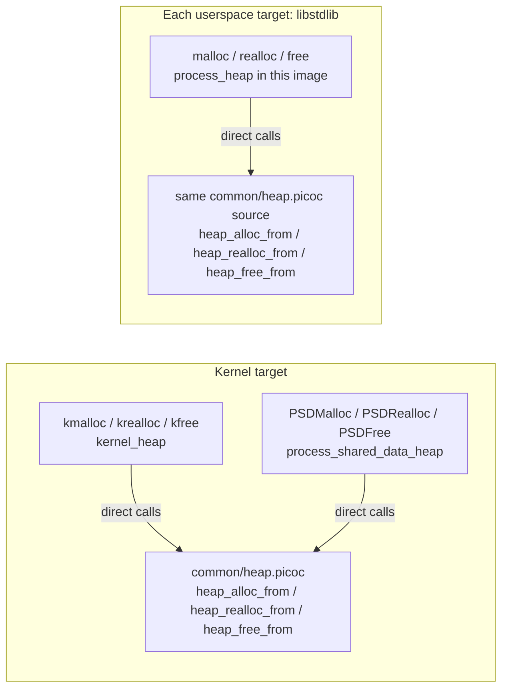
```mermaid
flowchart LR
    subgraph K["Kernel target"]
        KW["kmalloc / krealloc / kfree<br/>kernel_heap"] -->|direct calls| KC["common/heap.picoc<br/>heap_alloc_from / heap_realloc_from / heap_free_from"]
        PW["PSDMalloc / PSDRealloc / PSDFree<br/>process_shared_data_heap"] -->|direct calls| KC
    end
    subgraph L["Each userspace target: libstdlib"]
        LW["malloc / realloc / free<br/>process_heap in this image"] -->|direct calls| LC["same common/heap.picoc source<br/>heap_alloc_from / heap_realloc_from / heap_free_from"]
    end
```

</ReadmeVisual>

</div>

</div>

---

<!-- SOURCE Pico-OS/README.md#361-common-allocator-linkage-and-function-reference -->

# 3. Memory management and shared memory · 3.6 Heap and allocator function reference

## 3.6.1 Common allocator linkage and function reference (2)

<div class="deck-content readme-slide">

<div class="readme-artifacts artifact-single">

<!-- README_ASSET table-3368 rows=1-5 -->
<ReadmeVisual kind="table" :width="1440" style="flex-grow:10">

<div class="readme-table" v-pre><table><thead>
<tr>
<th>Kernel / Library Function</th>
<th>Return value / status</th>
<th>Effects</th>
<th>Calls</th>
<th>Called by</th>
</tr>
</thead><tbody><tr>
<td><span class="source-link"><code>heap_init_region(heap, start, cell_count)</code></span> (Shared/Common)</td>
<td>Returns no value</td>
<td>For a null heap, does nothing. For a null start or at most three cells, sets <span class="source-link"><code>Heap.first_block</code></span> to <code>NULL</code>. Otherwise writes one header with <span class="source-link"><code>size</code></span> = cell count minus three, <span class="source-link"><code>free</code></span> = true, <span class="source-link"><code>next</code></span> = <code>NULL</code>, and stores its address in the descriptor</td>
<td>None</td>
<td><strong>Library functions (directly linked):</strong> <span class="source-link"><code>init_process_heap()</code></span><br><strong>Kernel functions (directly linked):</strong> <span class="source-link"><code>init_kernel_heap()</code></span>, <span class="source-link"><code>init_process_shared_data_heap()</code></span><br><strong>Test programs (direct calls):</strong> <span class="source-link"><code>basic_heap_allocator_example.picoc</code></span></td>
</tr>
<tr>
<td><span class="source-link"><code>heap_alloc_from(heap, size)</code></span> (Shared/Common)</td>
<td>Payload pointer, or <code>NULL</code> for a null heap, nonpositive size, or no fit</td>
<td>Scans from <span class="source-link"><code>Heap.first_block</code></span> through <span class="source-link"><code>next</code></span>, selects the first free block with enough payload cells, optionally splits it, sets <span class="source-link"><code>free</code></span> false, and returns the address immediately after the header</td>
<td><span class="source-link"><code>heap_split_block()</code></span></td>
<td><strong>Library functions (directly linked):</strong> <span class="source-link"><code>malloc()</code></span><br><strong>Kernel functions (directly linked):</strong> <span class="source-link"><code>kmalloc()</code></span>, <span class="source-link"><code>PSDMalloc()</code></span><br><strong>Shared/common functions (directly linked):</strong> <span class="source-link"><code>heap_realloc_from()</code></span></td>
</tr>
<tr>
<td><span class="source-link"><code>heap_realloc_from(heap, ptr, size)</code></span> (Shared/Common)</td>
<td>Original/replacement payload pointer, or <code>NULL</code> for a null heap, nonpositive size, or failed replacement allocation</td>
<td>With a valid heap, nonpositive size frees the block, a null pointer allocates. Otherwise shrinks/splits in place and coalesces, grows into only the immediate free neighbor if sufficient, or allocates/copies/frees. Failed replacement allocation preserves the old block</td>
<td><span class="source-link"><code>heap_free_from()</code></span>, <span class="source-link"><code>heap_alloc_from()</code></span>, <span class="source-link"><code>heap_split_block()</code></span>, <span class="source-link"><code>heap_merge_free_blocks()</code></span>, <span class="source-link"><code>heap_copy_cells()</code></span></td>
<td><strong>Library functions (directly linked):</strong> <span class="source-link"><code>realloc()</code></span><br><strong>Kernel functions (directly linked):</strong> <span class="source-link"><code>krealloc()</code></span>, <span class="source-link"><code>PSDRealloc()</code></span></td>
</tr>
<tr>
<td><span class="source-link"><code>heap_free_from(heap, ptr)</code></span> (Shared/Common)</td>
<td>Returns no value</td>
<td>For a null heap or pointer, does nothing. Otherwise finds the preceding header, sets <span class="source-link"><code>free</code></span> true, and scans the entire heap to coalesce consecutive free blocks. Does not erase payload contents</td>
<td><span class="source-link"><code>heap_merge_free_blocks()</code></span></td>
<td><strong>Library functions (directly linked):</strong> <span class="source-link"><code>free()</code></span><br><strong>Kernel functions (directly linked):</strong> <span class="source-link"><code>kfree()</code></span>, <span class="source-link"><code>PSDFree()</code></span><br><strong>Shared/common functions (directly linked):</strong> <span class="source-link"><code>heap_realloc_from()</code></span></td>
</tr>
<tr>
<td><span class="source-link"><code>heap_split_block(block, size)</code></span> (Shared/Common)</td>
<td>Returns no value</td>
<td>Splits only if <span class="source-link"><code>size</code></span> ≥ requested size + three header cells + one payload cell. Inserts a free header after the requested payload, links it to the old successor, then updates the original size and successor. Otherwise leaves the block unchanged. Does not change the original free flag</td>
<td>None</td>
<td><strong>Shared/common functions (directly linked):</strong> <span class="source-link"><code>heap_alloc_from()</code></span>, <span class="source-link"><code>heap_realloc_from()</code></span></td>
</tr></tbody></table></div>

</ReadmeVisual>

</div>

</div>

---

<!-- SOURCE Pico-OS/README.md#361-common-allocator-linkage-and-function-reference -->

# 3. Memory management and shared memory · 3.6 Heap and allocator function reference

## 3.6.1 Common allocator linkage and function reference (3)

<div class="deck-content readme-slide">

<div class="readme-artifacts artifact-single">

<!-- README_ASSET table-3368 rows=6-7 -->
<ReadmeVisual kind="table" :width="1440" style="flex-grow:10">

<div class="readme-table" v-pre><table><thead>
<tr>
<th>Kernel / Library Function</th>
<th>Return value / status</th>
<th>Effects</th>
<th>Calls</th>
<th>Called by</th>
</tr>
</thead><tbody><tr>
<td><span class="source-link"><code>heap_merge_free_blocks(heap)</code></span> (Shared/Common)</td>
<td>Returns no value</td>
<td>For a null heap, does nothing. Scans from <span class="source-link"><code>Heap.first_block</code></span>. When current and next are free, adds three header cells and the next payload to the current size, bypasses the next header, and rechecks the same current header. Advances only when the pair cannot merge</td>
<td>None</td>
<td><strong>Shared/common functions (directly linked):</strong> <span class="source-link"><code>heap_realloc_from()</code></span>, <span class="source-link"><code>heap_free_from()</code></span></td>
</tr>
<tr>
<td><span class="source-link"><code>heap_copy_cells(destination, source, count)</code></span> (Shared/Common)</td>
<td>Returns no value</td>
<td>Copies count cells in increasing index order from source to destination. Used for the overlap between old payload size and requested replacement size</td>
<td>None</td>
<td><strong>Shared/common functions (directly linked):</strong> <span class="source-link"><code>heap_realloc_from()</code></span></td>
</tr></tbody></table></div>

</ReadmeVisual>

</div>

</div>

---

<!-- SOURCE Pico-OS/README.md#362-reallocation-decisions -->

# 3. Memory management and shared memory · 3.6 Heap and allocator function reference

## 3.6.2 Reallocation decisions

<div class="deck-content readme-slide">

<div class="artifact-caption">For a valid block and positive size, this graph shows when realloc keeps the address or moves the payload. A failed move preserves the old block. A null pointer allocates, while a nonpositive size frees:</div>
<div class="readme-artifacts artifact-single">

<!-- README_ASSET mermaid-3385 -->
<ReadmeVisual kind="mermaid" :width="1024" style="flex-grow:10">

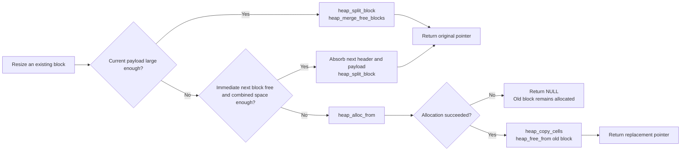
```mermaid
flowchart LR
    R["Resize an existing block"] --> FIT{"Current payload large enough?"}
    FIT -->|Yes| SHRINK["heap_split_block<br/>heap_merge_free_blocks"]
    SHRINK --> SAME["Return original pointer"]
    FIT -->|No| NEXT{"Immediate next block free and combined space enough?"}
    NEXT -->|Yes| GROW["Absorb next header and payload<br/>heap_split_block"]
    GROW --> SAME
    NEXT -->|No| ALLOC["heap_alloc_from"]
    ALLOC --> OK{"Allocation succeeded?"}
    OK -->|No| KEEP["Return NULL<br/>Old block remains allocated"]
    OK -->|Yes| COPY["heap_copy_cells<br/>heap_free_from old block"]
    COPY --> NEW["Return replacement pointer"]
```

</ReadmeVisual>

</div>

</div>

---

<!-- SOURCE Pico-OS/README.md#363-allocation-and-repeated-coalescing-example -->

# 3. Memory management and shared memory · 3.6 Heap and allocator function reference

## 3.6.3 Allocation and repeated coalescing example

<div class="deck-content readme-slide">

<div class="readme-explanation"><p>Follow one allocation and two frees through the same 52-cell heap. Amber cells are headers, cyan payloads are allocated, and green payloads are free.</p>
<p>Arrows preserve the next links. The amber outline marks the changed block; offsets count cells, while widths are illustrative.</p></div>

</div>

---

<!-- SOURCE Pico-OS/README.md#3631-initial-state-and-first-fit-search -->

# 3. Memory management and shared memory · 3.6 Heap and allocator function reference · 3.6.3 Allocation and repeated coalescing example

## 3.6.3.1 Initial state and first-fit search

<div class="deck-content readme-slide">

<div class="artifact-caption">The four payloads have sizes 8, 4, 12, and 16. Including four three-cell headers gives <code>8 + 4 + 12 + 16 + 4 × 3 = 52</code> cells. Allocating all four and then freeing B and D produces this state:</div>
<div class="readme-artifacts artifact-single">

<!-- README_ASSET image-3418 -->
<ReadmeVisual kind="image" :width="1024" style="flex-grow:16">


</ReadmeVisual>

</div>

</div>

---

<!-- SOURCE Pico-OS/README.md#3632-allocation-splits-d -->

# 3. Memory management and shared memory · 3.6 Heap and allocator function reference · 3.6.3 Allocation and repeated coalescing example

## 3.6.3.2 Allocation splits D

<div class="deck-content readme-slide">

<div class="artifact-caption">The remainder D′ gets a header at <code>36 + 11 = 47</code> and a two-cell payload. Its <span class="source-link"><code>next</code></span> is <code>NULL</code>, and D's <span class="source-link"><code>next</code></span> now points to it. A, B, and C stay put.</div>
<div class="readme-artifacts artifact-single">

<!-- README_ASSET image-3433 -->
<ReadmeVisual kind="image" :width="1024" style="flex-grow:16">


</ReadmeVisual>

</div>

</div>

---

<!-- SOURCE Pico-OS/README.md#3633-free-d-and-merge-its-remainder -->

# 3. Memory management and shared memory · 3.6 Heap and allocator function reference · 3.6.3 Allocation and repeated coalescing example

## 3.6.3.3 Free D and merge its remainder

<div class="deck-content readme-slide">

<div class="readme-artifacts artifact-pair">

<!-- README_ASSET image-3444 -->
<ReadmeVisual kind="image" :width="1024" style="flex-grow:16">


</ReadmeVisual>

<!-- README_ASSET image-3450 -->
<ReadmeVisual kind="image" :width="1024" style="flex-grow:16">


</ReadmeVisual>

</div>

</div>

---

<!-- SOURCE Pico-OS/README.md#3634-free-c-and-merge-repeatedly-at-b -->

# 3. Memory management and shared memory · 3.6 Heap and allocator function reference · 3.6.3 Allocation and repeated coalescing example

## 3.6.3.4 Free C and merge repeatedly at B (1)

<div class="deck-content readme-slide">

<div class="readme-artifacts artifact-pair">

<!-- README_ASSET image-3460 -->
<ReadmeVisual kind="image" :width="1024" style="flex-grow:16">


</ReadmeVisual>

<!-- README_ASSET image-3465 -->
<ReadmeVisual kind="image" :width="1024" style="flex-grow:16">


</ReadmeVisual>

</div>

</div>

---

<!-- SOURCE Pico-OS/README.md#3634-free-c-and-merge-repeatedly-at-b -->

# 3. Memory management and shared memory · 3.6 Heap and allocator function reference · 3.6.3 Allocation and repeated coalescing example

## 3.6.3.4 Free C and merge repeatedly at B (2)

<div class="deck-content readme-slide">

<div class="artifact-caption">The scan stays at B and checks its new neighbor D. It merges again, giving B <code>19 + 3 + 16 = 38</code> payload cells and <code>next = NULL</code>. This is repeated iteration at one header:</div>
<div class="readme-artifacts artifact-single">

<!-- README_ASSET image-3471 -->
<ReadmeVisual kind="image" :width="1024" style="flex-grow:16">


</ReadmeVisual>

</div>

</div>

---

<!-- SOURCE Pico-OS/README.md#41-process-control-block-fields -->

# 4. Processes and process lifecycle

## 4.1 Process control block fields (1)

<div class="deck-content readme-slide">

<div class="artifact-caption"><span class="source-link"><code>ProcessControlBlock</code></span> is the kernel's record for one process. Its definition and field table connect memory, resources, saved registers, and lifecycle bookkeeping to the functions that initialize and use them:</div>
<div class="readme-artifacts artifact-single">

<!-- README_ASSET code-3496 -->
<ReadmeVisual kind="code" :width="720" style="flex-grow:29">

<div class="readme-code">

```c {lines:false}
struct ProcessControlBlock {
    int pid;
    int state;
    int base_address;
    int size;
    int heap_start;
    int heap_size;
    char *binary_path;
    char *working_directory;
    struct ActivationRecord activation;
    struct FileDescriptorTable *file_descriptors;
    int *waiting_status_ptr;
    struct wait_queue waiters;
    struct wait_queue *waiting_queue_ptr;
    struct ProcessControlBlock *wait_next;
    struct ProcessControlBlock *next;
    struct SharedMemoryAttachment *shared_memory_attachments;
    int parent_pid;
    int parent_death_signal;
    int exit_status;
    int stop_signal;
    int stopped_from_state;
    int pending_termination_signal;
    char *pending_terminal_read_buffer;
    int pending_terminal_read_count;
    struct ProcessLoad *pending_load;
};
```

</div>

</ReadmeVisual>

</div>

</div>

---

<!-- SOURCE Pico-OS/README.md#41-process-control-block-fields -->

# 4. Processes and process lifecycle

## 4.1 Process control block fields (2)

<div class="deck-content readme-slide">

<div class="readme-artifacts artifact-single">

<!-- README_ASSET table-3526 rows=1-12 -->
<ReadmeVisual kind="table" :width="1100" style="flex-grow:10">

<div class="readme-table" v-pre><table><thead>
<tr>
<th>Attribute</th>
<th>Meaning</th>
<th>Used by</th>
</tr>
</thead><tbody><tr>
<td><span class="source-link"><code>pid</code></span></td>
<td>Assigned from the global counter when the PCB is created, never changes</td>
<td>First initialized by <span class="source-link"><code>create_process()</code></span>, read by <span class="source-link"><code>find_process_by_pid()</code></span> and <span class="source-link"><code>wait_for_process_by_pid()</code></span></td>
</tr>
<tr>
<td><span class="source-link"><code>state</code></span></td>
<td><span class="source-link"><code>NEW</code></span>, <span class="source-link"><code>READY</code></span>, <span class="source-link"><code>RUNNING</code></span>, <span class="source-link"><code>BLOCKED</code></span>, <span class="source-link"><code>STOPPED</code></span>, or <span class="source-link"><code>ZOMBIE</code></span></td>
<td>First initialized by <span class="source-link"><code>create_process()</code></span>, changed by <span class="source-link"><code>mark_process_ready_with_arguments()</code></span>, queue helpers, <span class="source-link"><code>stop_process()</code></span>, <span class="source-link"><code>continue_process()</code></span>, <span class="source-link"><code>dispatcher_switch_to_process()</code></span>, and <span class="source-link"><code>terminate_process()</code></span></td>
</tr>
<tr>
<td><span class="source-link"><code>base_address</code></span>, <span class="source-link"><code>size</code></span></td>
<td>Absolute start and requested cell count of the <span class="source-link"><code>PSDMalloc()</code></span> Process Payload</td>
<td>First initialized by <span class="source-link"><code>create_process()</code></span>, released by <span class="source-link"><code>remove_process()</code></span></td>
</tr>
<tr>
<td><span class="source-link"><code>heap_start</code></span>, <span class="source-link"><code>heap_size</code></span></td>
<td>Process-relative userspace heap start and cell count from the binary header/defaults</td>
<td>First initialized by <span class="source-link"><code>create_process()</code></span>, read by <span class="source-link"><code>process_heap_start()</code></span>, <span class="source-link"><code>process_heap_size()</code></span>, and <span class="source-link"><code>process_stack_boundary()</code></span></td>
</tr>
<tr>
<td><span class="source-link"><code>binary_path</code></span></td>
<td>PCB-owned executable path without the leading <code>/</code>, it exists while the process is <span class="source-link"><code>NEW</code></span>, supplies the later <span class="source-link"><code>argv[0]</code></span> copy, and remains the kernel's stable name for process listings</td>
<td>First initialized by <span class="source-link"><code>create_process()</code></span>, copied by <span class="source-link"><code>store_process_arguments()</code></span>, printed by <span class="source-link"><code>list_processes()</code></span>, freed by <span class="source-link"><code>remove_process()</code></span></td>
</tr>
<tr>
<td><span class="source-link"><code>working_directory</code></span></td>
<td>PCB-owned absolute PicoOS path, copied from the parent or initialized to <code>/</code> for PID 1</td>
<td>First initialized by <span class="source-link"><code>create_process()</code></span> through copying, read by <span class="source-link"><code>build_process_path()</code></span>, replaced by <span class="source-link"><code>change_working_directory()</code></span>, freed by <span class="source-link"><code>remove_process()</code></span></td>
</tr>
<tr>
<td><span class="source-link"><code>activation</code></span></td>
<td>Embedded saved CPU context needed later by the dispatcher, <span class="source-link"><code>6.2 Saved process registers</code></span> explains its fields</td>
<td>First initialized by <span class="source-link"><code>create_process()</code></span>, later maintained by <span class="source-link"><code>store_process_arguments()</code></span>, <span class="source-link"><code>dispatcher_switch_from_context()</code></span>, <span class="source-link"><code>complete_pending_terminal_read()</code></span>, and <span class="source-link"><code>dispatcher_jump_to_process()</code></span></td>
</tr>
<tr>
<td><span class="source-link"><code>file_descriptors</code></span></td>
<td>Pointer to this process's descriptor table. <span class="source-link"><code>9.2 Containment and reference relationships</code></span> shows the wrapper, entry array, and path references</td>
<td>First initialized by <span class="source-link"><code>create_process()</code></span> through <span class="source-link"><code>create_file_descriptor_table()</code></span>, inherited by <span class="source-link"><code>mark_process_ready_with_arguments()</code></span>, destroyed by <span class="source-link"><code>remove_process()</code></span></td>
</tr>
<tr>
<td><span class="source-link"><code>waiting_status_ptr</code></span></td>
<td>Pointer into this process’s suspended userspace <span class="source-link"><code>waitpid()</code></span> frame</td>
<td>First initialized to <code>NULL</code> by <span class="source-link"><code>create_process()</code></span>, set by <span class="source-link"><code>wait_for_process_by_pid()</code></span>, written and cleared by <span class="source-link"><code>wake_parent_waiting_for_process()</code></span> or <span class="source-link"><code>notify_process_stopped()</code></span></td>
</tr>
<tr>
<td><span class="source-link"><code>waiters</code></span></td>
<td>Embedded FIFO queue of processes waiting for this process</td>
<td>First initialized by <span class="source-link"><code>create_process()</code></span>, filled by <span class="source-link"><code>wait_for_process_by_pid()</code></span>, drained by <span class="source-link"><code>wake_parent_waiting_for_process()</code></span> or <span class="source-link"><code>notify_process_stopped()</code></span></td>
</tr>
<tr>
<td><span class="source-link"><code>waiting_queue_ptr</code></span>, <span class="source-link"><code>wait_next</code></span></td>
<td>Queue containing this PCB and its intrusive successor link</td>
<td>First initialized by <span class="source-link"><code>create_process()</code></span>, maintained by <span class="source-link"><code>enqueue_current_process_on_wait_queue()</code></span>, <span class="source-link"><code>enqueue_terminal_reader()</code></span>, <span class="source-link"><code>wakeup_wait_queue()</code></span>, and <span class="source-link"><code>remove_from_wait_queue()</code></span></td>
</tr>
<tr>
<td><span class="source-link"><code>next</code></span></td>
<td>Link in the global process list</td>
<td>First initialized/linked by <span class="source-link"><code>create_process()</code></span>, traversed by <span class="source-link"><code>scheduler_next_process()</code></span> and <span class="source-link"><code>find_process_by_pid()</code></span>, unlinked by <span class="source-link"><code>remove_process()</code></span></td>
</tr></tbody></table></div>

</ReadmeVisual>

</div>

</div>

---

<!-- SOURCE Pico-OS/README.md#41-process-control-block-fields -->

# 4. Processes and process lifecycle

## 4.1 Process control block fields (3)

<div class="deck-content readme-slide">

<div class="readme-artifacts artifact-single">

<!-- README_ASSET table-3526 rows=13-18 -->
<ReadmeVisual kind="table" :width="1100" style="flex-grow:10">

<div class="readme-table" v-pre><table><thead>
<tr>
<th>Attribute</th>
<th>Meaning</th>
<th>Used by</th>
</tr>
</thead><tbody><tr>
<td><span class="source-link"><code>shared_memory_attachments</code></span></td>
<td>Head of this process's mapping-record list. Each record references a shared-memory entry as shown in <span class="source-link"><code>9.2 Containment and reference relationships</code></span></td>
<td>First initialized by <span class="source-link"><code>create_process()</code></span>, extended by <span class="source-link"><code>map_shared_memory()</code></span>, released by <span class="source-link"><code>remove_process()</code></span> through <span class="source-link"><code>release_process_shared_memory()</code></span></td>
</tr>
<tr>
<td><span class="source-link"><code>parent_pid</code></span>, <span class="source-link"><code>parent_death_signal</code></span></td>
<td>Creator PID and optional signal delivered when that parent terminates</td>
<td>First initialized by <span class="source-link"><code>create_process()</code></span>, parent-death setting changed by <span class="source-link"><code>set_parent_death_signal()</code></span>, used by <span class="source-link"><code>orphan_and_signal_children()</code></span></td>
</tr>
<tr>
<td><span class="source-link"><code>exit_status</code></span></td>
<td>Status retained while the process is a zombie</td>
<td>First initialized to 0 by <span class="source-link"><code>create_process()</code></span>, set by <span class="source-link"><code>terminate_process()</code></span>, collected by <span class="source-link"><code>wait_for_process_by_pid()</code></span></td>
</tr>
<tr>
<td><span class="source-link"><code>stop_signal</code></span>, <span class="source-link"><code>stopped_from_state</code></span>, <span class="source-link"><code>pending_termination_signal</code></span></td>
<td>Signal bookkeeping for stopped and deferred termination paths</td>
<td>First initialized by <span class="source-link"><code>create_process()</code></span>, used by <span class="source-link"><code>stop_process()</code></span>, <span class="source-link"><code>continue_process()</code></span>, <span class="source-link"><code>send_signal_to_process()</code></span>, and <span class="source-link"><code>prepare_process_termination()</code></span></td>
</tr>
<tr>
<td><span class="source-link"><code>pending_terminal_read_buffer</code></span>, <span class="source-link"><code>pending_terminal_read_count</code></span></td>
<td>Userspace request retained while a terminal read is blocked or stopped</td>
<td>First initialized to <code>NULL</code>/0 by <span class="source-link"><code>create_process()</code></span>, set by <span class="source-link"><code>begin_terminal_read()</code></span>, consumed by <span class="source-link"><code>complete_pending_terminal_read()</code></span> or <span class="source-link"><code>resume_pending_terminal_read()</code></span></td>
</tr>
<tr>
<td><span class="source-link"><code>pending_load</code></span></td>
<td>Executable metadata, paths, progress, and reserved Process and Shared Data Heap region while this process is between load chunks</td>
<td>First initialized to <code>NULL</code> by <span class="source-link"><code>create_process()</code></span>, set by <span class="source-link"><code>begin_process_load()</code></span>, advanced by <span class="source-link"><code>continue_process_load()</code></span>, cleared by <span class="source-link"><code>finish_process_load()</code></span> or <span class="source-link"><code>cancel_process_load()</code></span></td>
</tr></tbody></table></div>

</ReadmeVisual>

</div>

</div>

---

<!-- SOURCE Pico-OS/README.md#411-process-states-and-transitions -->

# 4. Processes and process lifecycle · 4.1 Process control block fields

## 4.1.1 Process states and transitions (1)

<div class="deck-content readme-slide">

<div class="readme-artifacts artifact-single">

<!-- README_ASSET table-3561 rows=1-6 -->
<ReadmeVisual kind="table" :width="1100" style="flex-grow:10">

<div class="readme-table" v-pre><table><thead>
<tr>
<th>State</th>
<th>Numeric value</th>
<th>Meaning</th>
<th>Typical transition</th>
</tr>
</thead><tbody><tr>
<td><span class="source-link"><code>NEW</code></span></td>
<td>0</td>
<td>Loaded image and PCB exist, but the final startup layout is not yet prepared</td>
<td>Completed process load</td>
</tr>
<tr>
<td><span class="source-link"><code>READY</code></span></td>
<td>1</td>
<td>Eligible for the scheduler</td>
<td>Run setup, queue wakeup, or <span class="source-link"><code>SIGCONT</code></span></td>
</tr>
<tr>
<td><span class="source-link"><code>RUNNING</code></span></td>
<td>2</td>
<td>Activation is loaded into the CPU</td>
<td>Dispatcher</td>
</tr>
<tr>
<td><span class="source-link"><code>BLOCKED</code></span></td>
<td>3</td>
<td>PCB is linked into one wait queue</td>
<td>Terminal read, DMA completion wait, <span class="source-link"><code>waitpid()</code></span>, or <span class="source-link"><code>sleep()</code></span></td>
</tr>
<tr>
<td><span class="source-link"><code>STOPPED</code></span></td>
<td>4</td>
<td>Suspended by <span class="source-link"><code>SIGSTOP</code></span>, <span class="source-link"><code>SIGTSTP</code></span>, or <span class="source-link"><code>SIGTTIN</code></span></td>
<td>Signal subsystem</td>
</tr>
<tr>
<td><span class="source-link"><code>ZOMBIE</code></span></td>
<td>5</td>
<td>Terminated status retained for a parent</td>
<td><span class="source-link"><code>terminate_process()</code></span></td>
</tr></tbody></table></div>

</ReadmeVisual>

</div>

</div>

---

<!-- SOURCE Pico-OS/README.md#411-process-states-and-transitions -->

# 4. Processes and process lifecycle · 4.1 Process control block fields

## 4.1.1 Process states and transitions (2)

<div class="deck-content readme-slide">

<div class="artifact-caption">The diagram follows normal startup, scheduling, waits, signals, and termination. Removal ends the PCB's lifetime. <span class="source-link"><code>6. Scheduling and context switching</code></span> explains scheduling, and <span class="source-link"><code>7. Blocking, wait queues, signals, and mutexes</code></span> explains blocking and signal suspension:</div>
<div class="readme-artifacts artifact-single">

<!-- README_ASSET mermaid-3590 -->
<ReadmeVisual kind="mermaid" :width="1024" style="flex-grow:10">

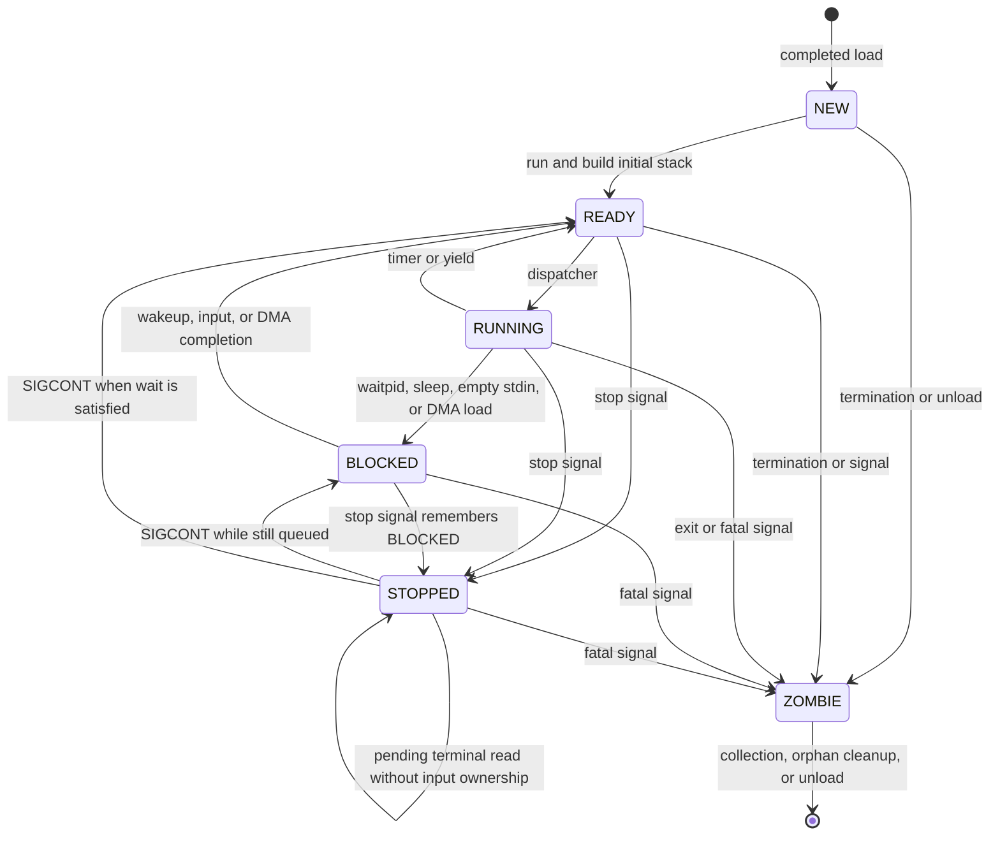
```mermaid
%%{init: {"themeCSS": "rect { rx: 0 !important; ry: 0 !important; }"}}%%
stateDiagram-v2
    [*] --> NEW: completed load
    NEW --> READY: run and build initial stack
    READY --> RUNNING: dispatcher
    RUNNING --> READY: timer or yield
    RUNNING --> BLOCKED: waitpid, sleep, empty stdin, or DMA load
    BLOCKED --> READY: wakeup, input, or DMA completion
    READY --> STOPPED: stop signal
    RUNNING --> STOPPED: stop signal
    BLOCKED --> STOPPED: stop signal remembers BLOCKED
    STOPPED --> BLOCKED: SIGCONT while still queued
    STOPPED --> READY: SIGCONT when wait is satisfied
    STOPPED --> STOPPED: pending terminal read without input ownership
    NEW --> ZOMBIE: termination or unload
    READY --> ZOMBIE: termination or signal
    RUNNING --> ZOMBIE: exit or fatal signal
    BLOCKED --> ZOMBIE: fatal signal
    STOPPED --> ZOMBIE: fatal signal
    ZOMBIE --> [*]: collection, orphan cleanup, or unload
```

</ReadmeVisual>

</div>

</div>

---

<!-- SOURCE Pico-OS/README.md#412-global-process-list-and-current-process -->

# 4. Processes and process lifecycle · 4.1 Process control block fields

## 4.1.2 Global process list and current process (1)

<div class="deck-content readme-slide">

<div class="artifact-caption">The upper view locates the allocations in SRAM. The lower view shows the same three PCBs, with the head at PCB 1, tail at PCB 3, and current pointer at PCB 2:</div>
<div class="readme-artifacts artifact-single">

<!-- README_ASSET image-3627 -->
<ReadmeVisual kind="image" :width="1024" style="flex-grow:16">


</ReadmeVisual>

</div>

</div>

---

<!-- SOURCE Pico-OS/README.md#412-global-process-list-and-current-process -->

# 4. Processes and process lifecycle · 4.1 Process control block fields

## 4.1.2 Global process list and current process (2)

<div class="deck-content readme-slide">

<div class="readme-artifacts artifact-single">

<!-- README_ASSET table-3648 rows=1-2 -->
<ReadmeVisual kind="table" :width="1100" style="flex-grow:10">

<div class="readme-table" v-pre><table><thead>
<tr>
<th>List</th>
<th>Insertion policy</th>
<th>Pointers and linking cost</th>
</tr>
</thead><tbody><tr>
<td>PCB list</td>
<td><span class="source-link"><code>create_process()</code></span> appends at the end</td>
<td><span class="source-link"><code>process_list_head</code></span> starts traversal, <span class="source-link"><code>process_list_tail</code></span> makes append O(1). With only a head, append would take O(n)</td>
</tr>
<tr>
<td><span class="source-link"><code>SharedMemoryEntry</code></span> registry</td>
<td><span class="source-link"><code>open_shared_memory()</code></span> prepends at the beginning</td>
<td>Sets the new entry's <span class="source-link"><code>next</code></span> to <span class="source-link"><code>shared_memory_list_head</code></span>, then moves the head to the new entry. A head alone makes insertion O(1)</td>
</tr></tbody></table></div>

</ReadmeVisual>

</div>

</div>

---

<!-- SOURCE Pico-OS/README.md#4121-from-pcbs-to-process-payloads-in-sram -->

# 4. Processes and process lifecycle · 4.1 Process control block fields · 4.1.2 Global process list and current process

## 4.1.2.1 From PCBs to Process Payloads in SRAM

<div class="deck-content readme-slide">

<div class="artifact-caption">In this two-process example, PCB 1 and PCB 2 occupy Kernel Heap payloads A and C. Their green <span class="source-link"><code>base_address</code></span> arrows reach the corresponding Process Payloads. The middle allocation holds shared data:</div>
<div class="readme-artifacts artifact-single">

<!-- README_ASSET image-3674 -->
<ReadmeVisual kind="image" :width="1024" style="flex-grow:16">


</ReadmeVisual>

</div>

</div>

---

<!-- SOURCE Pico-OS/README.md#421-user-process-stack-placement -->

# 4. Processes and process lifecycle · 4.2 Initial user process stack

## 4.2.1 User process stack placement

<div class="deck-content readme-slide">

<div class="artifact-caption">The blue highlight locates one process's stack after its image and heap. Other processes have their own stacks in separate Process Payloads:</div>
<div class="readme-artifacts artifact-single">

<!-- README_ASSET image-3693 -->
<ReadmeVisual kind="image" :width="1024" style="flex-grow:16">


</ReadmeVisual>

</div>

</div>

---

<!-- SOURCE Pico-OS/README.md#422-initial-argc-argv-and-envp -->

# 4. Processes and process lifecycle · 4.2 Initial user process stack

## 4.2.2 Initial `argc`, `argv`, and `envp` (1)

<div class="deck-content readme-slide">

<div class="readme-artifacts artifact-single">

<!-- README_ASSET table-3716 rows=1-4 -->
<ReadmeVisual kind="table" :width="1100" style="flex-grow:10">

<div class="readme-table" v-pre><table><thead>
<tr>
<th>Name</th>
<th>Meaning</th>
<th>Calculation</th>
</tr>
</thead><tbody><tr>
<td><code>startup_cell_count</code></td>
<td>Number of cells needed for all startup values and strings</td>
<td>Sum shown below</td>
</tr>
<tr>
<td><code>entry_pc_address</code></td>
<td>Address of the cell holding the entry PC</td>
<td><code>base_address + size - startup_cell_count</code></td>
</tr>
<tr>
<td><code>strings_start_address</code></td>
<td>Address of the first copied string character</td>
<td><code>entry_pc_address + argc + envc + 4</code></td>
</tr>
<tr>
<td><code>highest_stack_address</code></td>
<td>Address of the highest reserved stack cell</td>
<td><code>base_address + size - 1</code></td>
</tr></tbody></table></div>

</ReadmeVisual>

</div><aside class="context-note"><b>System V / POSIX</b><span>The Intel386 initial-stack model supplies the argc → argv → NULL → envp → NULL order. RETI adds an entry PC, uses word cells, fixes string order, and omits the auxiliary vector. POSIX defines the arrays and NAME=value strings, not their physical layout.</span></aside>

</div>

---

<!-- SOURCE Pico-OS/README.md#422-initial-argc-argv-and-envp -->

# 4. Processes and process lifecycle · 4.2 Initial user process stack

## 4.2.2 Initial `argc`, `argv`, and `envp` (2)

<div class="deck-content readme-slide">

<div class="readme-artifacts artifact-single">

<!-- README_ASSET table-3726 rows=1-12 -->
<ReadmeVisual kind="table" :width="1100" style="flex-grow:10">

<div class="readme-table" v-pre><table><thead>
<tr>
<th>Cell address</th>
<th>Stored value</th>
</tr>
</thead><tbody><tr>
<td><strong>↑ Decreasing addresses</strong></td>
<td><strong>Lower addresses · stack grows ↑</strong></td>
</tr>
<tr>
<td><code>entry_pc_address</code></td>
<td>Entry PC = <span class="source-link"><code>activation.cs</code></span> minus 1</td>
</tr>
<tr>
<td><code>entry_pc_address + 1</code></td>
<td><span class="source-link"><code>argc</code></span></td>
</tr>
<tr>
<td><code>entry_pc_address + 2</code></td>
<td><span class="source-link"><code>argv[0]</code></span></td>
</tr>
<tr>
<td><code>...</code></td>
<td><code>...</code></td>
</tr>
<tr>
<td><code>entry_pc_address + argc + 2</code></td>
<td><span class="source-link"><code>argv[argc] = NULL</code></span></td>
</tr>
<tr>
<td><code>entry_pc_address + argc + 3</code></td>
<td><span class="source-link"><code>envp[0]</code></span></td>
</tr>
<tr>
<td><code>...</code></td>
<td><code>...</code></td>
</tr>
<tr>
<td><code>entry_pc_address + argc + envc + 3</code></td>
<td><span class="source-link"><code>envp[envc] = NULL</code></span></td>
</tr>
<tr>
<td><code>strings_start_address</code></td>
<td>First character of the copied <span class="source-link"><code>binary_path</code></span></td>
</tr>
<tr>
<td><code>strings_start_address + 1</code></td>
<td>Next character of the path, or its <code>\0</code> terminator</td>
</tr>
<tr>
<td><code>...</code></td>
<td>Remaining path, argument, and environment characters and <code>\0</code> terminators</td>
</tr></tbody></table></div>

</ReadmeVisual>

</div>

</div>

---

<!-- SOURCE Pico-OS/README.md#422-initial-argc-argv-and-envp -->

# 4. Processes and process lifecycle · 4.2 Initial user process stack

## 4.2.2 Initial `argc`, `argv`, and `envp` (3)

<div class="deck-content readme-slide">

<div class="readme-artifacts artifact-single">

<!-- README_ASSET table-3726 rows=13-14 -->
<ReadmeVisual kind="table" :width="1100" style="flex-grow:10">

<div class="readme-table" v-pre><table><thead>
<tr>
<th>Cell address</th>
<th>Stored value</th>
</tr>
</thead><tbody><tr>
<td><code>highest_stack_address</code></td>
<td>Last string's <code>\0</code></td>
</tr>
<tr>
<td><strong>↓ Increasing addresses</strong></td>
<td><strong>Higher addresses</strong></td>
</tr></tbody></table></div>

</ReadmeVisual>

</div>

</div>

---

<!-- SOURCE Pico-OS/README.md#422-initial-argc-argv-and-envp -->

# 4. Processes and process lifecycle · 4.2 Initial user process stack

## 4.2.2 Initial `argc`, `argv`, and `envp` (4)

<div class="deck-content readme-slide">

<div class="artifact-caption">Setup uses the existing reservation without checking that all startup data fits above the heap. This calculation includes the entry PC, counts, pointer sentinels, and string terminators:</div>
<div class="readme-artifacts artifact-single">

<!-- README_ASSET code-3756 -->
<ReadmeVisual kind="code" :width="720" style="flex-grow:6">

<div class="readme-code">

```text {lines:false}
startup_cell_count = 1 + 1 + argc + 1 + envc + 1
    + cells(binary_path including its terminator)
    + cells(all argument strings including their terminators)
    + cells(all environment strings including their terminators)
```

</div>

</ReadmeVisual>

</div>

</div>

---

<!-- SOURCE Pico-OS/README.md#4221-concrete-initial-stack-example -->

# 4. Processes and process lifecycle · 4.2 Initial user process stack · 4.2.2 Initial `argc`, `argv`, and `envp`

## 4.2.2.1 Concrete initial-stack example (1)

<div class="deck-content readme-slide">

<div class="artifact-caption">Save this program as <code>add.picoc</code> and link it with <span class="source-link"><code>libstart</code></span> and <span class="source-link"><code>libstdlib</code></span>. It adds two arguments when environment variable <code>X</code> is <code>1</code>:</div>
<div class="readme-artifacts artifact-single">

<!-- README_ASSET code-3791 -->
<ReadmeVisual kind="code" :width="720" style="flex-grow:12">

<div class="readme-code">

```c {lines:false}
#include "library/stdlib/stdlib.header"

int main(int argc, char **argv) {
    char *enabled = getenv("X");

    if (argc == 3 && enabled != NULL && atoi(enabled) == 1) {
        return atoi(argv[1]) + atoi(argv[2]);
    }
    return 0;
}
```

</div>

</ReadmeVisual>

</div><aside class="context-note"><b>Reading the stack</b><span>argc counts the program name too; argv and envp are NULL-terminated pointer arrays. PicoOS prepares them during run rather than POSIX exec.</span></aside>

</div>

---

<!-- SOURCE Pico-OS/README.md#4221-concrete-initial-stack-example -->

# 4. Processes and process lifecycle · 4.2 Initial user process stack · 4.2.2 Initial `argc`, `argv`, and `envp`

## 4.2.2.1 Concrete initial-stack example (2)

<div class="deck-content readme-slide">

<div class="artifact-caption">The launcher passes <code>2</code>, <code>3</code>, and a null-terminated environment array. With successful loading and starting, <span class="source-link"><code>waitpid()</code></span> returns the result <code>5</code>:</div>
<div class="readme-artifacts artifact-single">

<!-- README_ASSET code-3807 -->
<ReadmeVisual kind="code" :width="720" style="flex-grow:15">

<div class="readme-code">

```c {lines:false}
#include "library/unistd/unistd.header"
#include "library/sys/wait/wait.header"

int main(void) {
    char *environment[3];
    int pid = load("/add.bin");

    environment[0] = "X=1";
    environment[1] = "Y=0";
    environment[2] = NULL;
    run(pid, "2 3", environment);
    return waitpid(pid);
}
```

</div>

</ReadmeVisual>

</div>

</div>

---

<!-- SOURCE Pico-OS/README.md#4221-concrete-initial-stack-example -->

# 4. Processes and process lifecycle · 4.2 Initial user process stack · 4.2.2 Initial `argc`, `argv`, and `envp`

## 4.2.2.1 Concrete initial-stack example (3)

<div class="deck-content readme-slide">

<div class="artifact-caption"><code>argc = 3</code> and two environment entries occupy 29 startup cells. Thus <code>entry_pc_address = base_address + size - 29</code>. Read the rows in order. Each box is one cell labeled by its offset, and the pointer values stored there are absolute addresses:</div>
<div class="readme-artifacts artifact-single">

<!-- README_ASSET image-3828 -->
<ReadmeVisual kind="image" :width="1024" style="flex-grow:16">


</ReadmeVisual>

</div>

</div>

---

<!-- SOURCE Pico-OS/README.md#431-loading-a-process-load-library-call -->

# 4. Processes and process lifecycle · 4.3 Loading and starting a process

## 4.3.1 Loading a process (`load` library call) (1)

<div class="deck-content readme-slide">

<div class="readme-artifacts artifact-single">

<!-- README_ASSET list-3847 -->
<div class="readme-list"><ol start="1"><li>Resolve the path, validate the header, apply heap/stack defaults, and reserve a Process Payload with PSDMalloc.</li>
<li>Track polling or DMA progress in the caller's pending_load.</li>
<li>Create and append a NEW PCB with payload bounds, segment registers, preliminary entry PC, paths, and fresh descriptors.</li>
<li>Clear pending_load, release temporary metadata, and return the child PID.</li></ol></div>

</div>

</div>

---

<!-- SOURCE Pico-OS/README.md#431-loading-a-process-load-library-call -->

# 4. Processes and process lifecycle · 4.3 Loading and starting a process

## 4.3.1 Loading a process (`load` library call) (2)

<div class="deck-content readme-slide">

<div class="artifact-caption">This first step follows the image from host storage through UART into SRAM. Dashed arrows show data movement, and solid arrows show stored pointers:</div>
<div class="readme-artifacts artifact-single">

<!-- README_ASSET image-3863 -->
<ReadmeVisual kind="image" :width="1024" style="flex-grow:16">


</ReadmeVisual>

</div>

</div>

---

<!-- SOURCE Pico-OS/README.md#431-loading-a-process-load-library-call -->

# 4. Processes and process lifecycle · 4.3 Loading and starting a process

## 4.3.1 Loading a process (`load` library call) (3)

<div class="deck-content readme-slide">

<div class="artifact-caption">After reception, creation appends the PCB, advances <span class="source-link"><code>next_process_id</code></span>, and leaves <span class="source-link"><code>state</code></span> set to <span class="source-link"><code>NEW</code></span>:</div>
<div class="readme-artifacts artifact-single">

<!-- README_ASSET image-3878 -->
<ReadmeVisual kind="image" :width="1024" style="flex-grow:16">


</ReadmeVisual>

</div>

</div>

---

<!-- SOURCE Pico-OS/README.md#431-loading-a-process-load-library-call -->

# 4. Processes and process lifecycle · 4.3 Loading and starting a process

## 4.3.1 Loading a process (`load` library call) (4)

<div class="deck-content readme-slide">

<div class="readme-artifacts artifact-single">

<!-- README_ASSET table-3888 rows=1-9 -->
<ReadmeVisual kind="table" :width="1100" style="flex-grow:10">

<div class="readme-table" v-pre><table><thead>
<tr>
<th>Field</th>
<th>Meaning</th>
<th>Used by</th>
</tr>
</thead><tbody><tr>
<td><span class="source-link"><code>ProcessLoad.base_address</code></span></td>
<td>Absolute start of the reserved Process and Shared Data Heap region</td>
<td>First initialized by <span class="source-link"><code>begin_process_load(path, show_loading_bar, caller_context)</code></span>, used by <span class="source-link"><code>continue_process_load(owner)</code></span>, <span class="source-link"><code>finish_process_load(owner)</code></span>, and <span class="source-link"><code>cancel_process_load(process)</code></span></td>
</tr>
<tr>
<td><span class="source-link"><code>ProcessLoad.process_size</code></span></td>
<td>Total reserved cells for the User Process Image, User Process Heap, and User Process Stack</td>
<td>First initialized by <span class="source-link"><code>begin_process_load(path, show_loading_bar, caller_context)</code></span>, passed to <span class="source-link"><code>create_process()</code></span> by <span class="source-link"><code>finish_process_load(owner)</code></span></td>
</tr>
<tr>
<td><span class="source-link"><code>ProcessLoad.code_start</code></span>, <span class="source-link"><code>ProcessLoad.data_start</code></span></td>
<td>Linked code- and data-segment offsets from the binary header</td>
<td>First initialized by <span class="source-link"><code>begin_process_load(path, show_loading_bar, caller_context)</code></span>, passed to <span class="source-link"><code>create_process()</code></span> by <span class="source-link"><code>finish_process_load(owner)</code></span></td>
</tr>
<tr>
<td><span class="source-link"><code>ProcessLoad.heap_start</code></span>, <span class="source-link"><code>ProcessLoad.heap_size</code></span></td>
<td>Resolved userspace heap offset and cell count</td>
<td>First initialized by <span class="source-link"><code>begin_process_load(path, show_loading_bar, caller_context)</code></span>, passed to <span class="source-link"><code>create_process()</code></span> by <span class="source-link"><code>finish_process_load(owner)</code></span></td>
</tr>
<tr>
<td><span class="source-link"><code>ProcessLoad.payload_word_count</code></span></td>
<td>Encoded program words after the five-word header</td>
<td>First initialized by <span class="source-link"><code>begin_process_load(path, show_loading_bar, caller_context)</code></span>, bounds both DMA and polling transfers in <span class="source-link"><code>begin_process_load(path, show_loading_bar, caller_context)</code></span> and <span class="source-link"><code>continue_process_load(owner)</code></span></td>
</tr>
<tr>
<td><span class="source-link"><code>ProcessLoad.loaded_word_count</code></span></td>
<td>Words copied by the polling transfer so far</td>
<td>First initialized to 0 by <span class="source-link"><code>begin_process_load(path, show_loading_bar, caller_context)</code></span>, advanced and checked by <span class="source-link"><code>continue_process_load(owner)</code></span></td>
</tr>
<tr>
<td><span class="source-link"><code>ProcessLoad.loading_bar_update</code></span></td>
<td>Next word count at which progress output is redrawn</td>
<td>First initialized by <span class="source-link"><code>begin_process_load(path, show_loading_bar, caller_context)</code></span>, updated by <span class="source-link"><code>continue_process_load(owner)</code></span></td>
</tr>
<tr>
<td><span class="source-link"><code>ProcessLoad.uses_dma</code></span></td>
<td>Whether the reserved image is being filled by one DMA transfer rather than polling chunks</td>
<td>First initialized to <code>false</code> and set to <code>true</code> by <span class="source-link"><code>begin_process_load(path, show_loading_bar, caller_context)</code></span>, checked by <span class="source-link"><code>continue_process_load(owner)</code></span> and <span class="source-link"><code>cancel_process_load(process)</code></span></td>
</tr>
<tr>
<td><span class="source-link"><code>ProcessLoad.path</code></span></td>
<td>Kernel-owned absolute binary path used by later range requests and copied into the completed PCB</td>
<td>First initialized by <span class="source-link"><code>begin_process_load(path, show_loading_bar, caller_context)</code></span>, read by <span class="source-link"><code>continue_process_load(owner)</code></span> and <span class="source-link"><code>finish_process_load(owner)</code></span>, freed by <span class="source-link"><code>free_process_load(load)</code></span></td>
</tr></tbody></table></div>

</ReadmeVisual>

</div>

</div>

---

<!-- SOURCE Pico-OS/README.md#4311-load-function-reference -->

# 4. Processes and process lifecycle · 4.3 Loading and starting a process · 4.3.1 Loading a process (`load` library call)

## 4.3.1.1 Load function reference (1)

<div class="deck-content readme-slide">

<div class="readme-artifacts artifact-single">

<!-- README_ASSET table-3914 rows=1-6 -->
<ReadmeVisual kind="table" :width="1440" style="flex-grow:10">

<div class="readme-table" v-pre><table><thead>
<tr>
<th>Kernel function</th>
<th>Return value / status</th>
<th>Effects</th>
<th>Calls</th>
<th>Called by</th>
</tr>
</thead><tbody><tr>
<td><span class="source-link"><code>load_process_chunk(path, show_loading_bar, caller_context)</code></span></td>
<td>Positive PID when complete, 0 on failure, or <span class="source-link"><code>SYSCALL_LOAD_PROCESS_CONTINUE</code></span> (-1) while work remains</td>
<td>Starts or resumes the caller-owned load. Successful completion creates a PCB with <span class="source-link"><code>state</code></span> <span class="source-link"><code>NEW</code></span></td>
<td><span class="source-link"><code>begin_process_load()</code></span>, <span class="source-link"><code>continue_process_load()</code></span>, <span class="source-link"><code>current_process()</code></span><br><strong>Host requests:</strong> <code>file-size &lt;path&gt;</code> and <code>read-range &lt;offset&gt; &lt;count&gt; &lt;path&gt;</code> through helpers</td>
<td><strong>Library functions:</strong> <span class="source-link"><code>load()</code></span> via the syscall<br><strong>Kernel functions:</strong> <span class="source-link"><code>handle_syscall()</code></span></td>
</tr>
<tr>
<td><hr><hr></td>
<td><hr><hr></td>
<td><hr><hr></td>
<td><hr><hr></td>
<td><hr><hr></td>
</tr>
<tr>
<td><span class="source-link"><code>load_process(path, show_loading_bar)</code></span></td>
<td>PID on success, 0 on rejected path, missing/short header, invalid stack placement, or exhausted process memory</td>
<td>Kernel boot-time continuous transfer. Reserves the Process Payload, receives the image, and creates the PCB</td>
<td><span class="source-link"><code>PSDMalloc()</code></span>, <span class="source-link"><code>build_process_path()</code></span>, <span class="source-link"><code>create_process()</code></span>, <span class="source-link"><code>drain_process_words()</code></span>, <span class="source-link"><code>loaded_process_stack_start()</code></span>, <span class="source-link"><code>receive_word()</code></span>, <span class="source-link"><code>receive_words_to_sram()</code></span>, <span class="source-link"><code>system_relative_path()</code></span>, <span class="source-link"><code>uart_print_loading_bar_label()</code></span>, <span class="source-link"><code>uart_print_string()</code></span>, <span class="source-link"><code>uart_send_host_request()</code></span><br><strong>Host requests:</strong> <code>load &lt;path&gt;</code></td>
<td><strong>Kernel functions:</strong> <span class="source-link"><code>main()</code></span> in <span class="source-link"><code>kernel/kernel.picoc</code></span></td>
</tr>
<tr>
<td><span class="source-link"><code>begin_process_load(path, show_loading_bar, caller_context)</code></span></td>
<td>PID for an empty payload, continuation status after transfer setup, or 0 on path/header/allocation/transfer failure</td>
<td>Reads the header, reserves memory, allocates <span class="source-link"><code>ProcessLoad</code></span> and its path, sets <span class="source-link"><code>caller.pending_load</code></span>, initializes progress, and optionally starts blocking DMA</td>
<td><span class="source-link"><code>PSDMalloc()</code></span>, <span class="source-link"><code>build_process_path()</code></span>, <span class="source-link"><code>cancel_process_load()</code></span>, <span class="source-link"><code>copy_process_path()</code></span>, <span class="source-link"><code>current_process()</code></span>, <span class="source-link"><code>dma_is_active()</code></span>, <span class="source-link"><code>drain_process_bytes()</code></span>, <span class="source-link"><code>finish_process_load()</code></span>, <span class="source-link"><code>kmalloc()</code></span>, <span class="source-link"><code>loaded_process_stack_start()</code></span>, <span class="source-link"><code>receive_word()</code></span>, <span class="source-link"><code>start_dma_uart_receive()</code></span>, <span class="source-link"><code>system_relative_path()</code></span>, <span class="source-link"><code>uart_print_loading_bar_label()</code></span>, <span class="source-link"><code>uart_print_string()</code></span>, <span class="source-link"><code>uart_send_file_range_command()</code></span>, <span class="source-link"><code>uart_send_host_request()</code></span>, <span class="source-link"><code>uart_start_loading_bar()</code></span><br><strong>Host requests:</strong> <code>file-size &lt;path&gt;</code>, <code>read-range 0 20 &lt;path&gt;</code>, optional whole-payload <code>read-range 20 &lt;count&gt; &lt;path&gt;</code></td>
<td><strong>Kernel functions:</strong> <span class="source-link"><code>load_process_chunk()</code></span></td>
</tr>
<tr>
<td><span class="source-link"><code>continue_process_load(owner)</code></span></td>
<td>PID on completion, continuation status while DMA is busy or polling work remains, or 0 on transfer failure</td>
<td>Checks DMA status or polls up to 256 payload words, advances <span class="source-link"><code>loaded_word_count</code></span> and progress, completes or cancels the load</td>
<td><span class="source-link"><code>cancel_process_load()</code></span>, <span class="source-link"><code>dma_transfer_status()</code></span>, <span class="source-link"><code>drain_process_bytes()</code></span>, <span class="source-link"><code>finish_process_load()</code></span>, <span class="source-link"><code>receive_word()</code></span>, <span class="source-link"><code>uart_send_file_range_command()</code></span>, <span class="source-link"><code>uart_update_loading_bar()</code></span><br><strong>Host requests:</strong> Polling <code>read-range &lt;offset&gt; &lt;count&gt; &lt;path&gt;</code></td>
<td><strong>Kernel functions:</strong> <span class="source-link"><code>load_process_chunk()</code></span></td>
</tr>
<tr>
<td><span class="source-link"><code>finish_process_load(owner)</code></span></td>
<td>New PID</td>
<td>Creates the child PCB after transfer, clears <span class="source-link"><code>owner.pending_load</code></span>, and frees temporary load metadata and its copied path</td>
<td><span class="source-link"><code>create_process()</code></span>, <span class="source-link"><code>free_process_load()</code></span>, <span class="source-link"><code>system_relative_path()</code></span></td>
<td><strong>Kernel functions:</strong> <span class="source-link"><code>begin_process_load()</code></span>, <span class="source-link"><code>continue_process_load()</code></span></td>
</tr></tbody></table></div>

</ReadmeVisual>

</div>

</div>

---

<!-- SOURCE Pico-OS/README.md#4311-load-function-reference -->

# 4. Processes and process lifecycle · 4.3 Loading and starting a process · 4.3.1 Loading a process (`load` library call)

## 4.3.1.1 Load function reference (2)

<div class="deck-content readme-slide">

<div class="readme-artifacts artifact-single">

<!-- README_ASSET table-3914 rows=7-13 -->
<ReadmeVisual kind="table" :width="1440" style="flex-grow:10">

<div class="readme-table" v-pre><table><thead>
<tr>
<th>Kernel function</th>
<th>Return value / status</th>
<th>Effects</th>
<th>Calls</th>
<th>Called by</th>
</tr>
</thead><tbody><tr>
<td><span class="source-link"><code>create_process(base_address, size, code_start, data_start, heap_start, heap_size, binary_path)</code></span></td>
<td>PCB pointer. Kernel-heap exhaustion halts the OS through allocation checks</td>
<td>Assigns PID and <span class="source-link"><code>state</code></span> <span class="source-link"><code>NEW</code></span>, records memory fields, initializes <span class="source-link"><code>activation</code></span>, queues and signals, creates standard descriptors, copies paths and parent-derived metadata, writes the preliminary entry PC, and appends the PCB</td>
<td><span class="source-link"><code>copy_process_path()</code></span>, <span class="source-link"><code>create_file_descriptor_table()</code></span>, <span class="source-link"><code>current_process()</code></span>, <span class="source-link"><code>kmalloc()</code></span></td>
<td><strong>Kernel functions:</strong> <span class="source-link"><code>finish_process_load()</code></span>, <span class="source-link"><code>load_process()</code></span></td>
</tr>
<tr>
<td><span class="source-link"><code>copy_process_path(path)</code></span></td>
<td>New kernel-owned string pointer</td>
<td>Allocates and copies a path including its terminator</td>
<td><span class="source-link"><code>kmalloc()</code></span></td>
<td><strong>Kernel functions:</strong> <span class="source-link"><code>begin_process_load()</code></span>, <span class="source-link"><code>create_process()</code></span>, <span class="source-link"><code>set_process_working_directory()</code></span></td>
</tr>
<tr>
<td><span class="source-link"><code>loaded_process_stack_start(heap_start, heap_size, stack_start)</code></span></td>
<td>Highest process-relative stack offset, or <span class="source-link"><code>PSDMALLOC_INVALID_START</code></span> for overlap</td>
<td>Resolves the default highest stack offset or checks an explicit offset, no memory writes</td>
<td>None</td>
<td><strong>Kernel functions:</strong> <span class="source-link"><code>begin_process_load()</code></span>, <span class="source-link"><code>load_process()</code></span></td>
</tr>
<tr>
<td><span class="source-link"><code>cancel_process_load(process)</code></span></td>
<td>No return value</td>
<td>Cancels busy DMA if needed, clears <span class="source-link"><code>process.pending_load</code></span>, frees the partial Process Payload and temporary metadata</td>
<td><span class="source-link"><code>PSDFree()</code></span>, <span class="source-link"><code>cancel_dma_transfer()</code></span>, <span class="source-link"><code>dma_transfer_status()</code></span>, <span class="source-link"><code>free_process_load()</code></span></td>
<td><strong>Kernel functions:</strong> <span class="source-link"><code>begin_process_load()</code></span>, <span class="source-link"><code>continue_process_load()</code></span>, <span class="source-link"><code>remove_process()</code></span></td>
</tr>
<tr>
<td><span class="source-link"><code>free_process_load(load)</code></span></td>
<td>No return value</td>
<td>Frees the temporary kernel-owned host path and <span class="source-link"><code>ProcessLoad</code></span></td>
<td><span class="source-link"><code>kfree()</code></span></td>
<td><strong>Kernel functions:</strong> <span class="source-link"><code>cancel_process_load()</code></span>, <span class="source-link"><code>finish_process_load()</code></span></td>
</tr>
<tr>
<td><span class="source-link"><code>drain_process_words(payload_word_count, show_loading_bar)</code></span></td>
<td>No return value</td>
<td>Consumes a rejected continuous payload so UART remains synchronized, optionally reports progress</td>
<td><span class="source-link"><code>receive_word()</code></span>, <span class="source-link"><code>uart_start_loading_bar()</code></span>, <span class="source-link"><code>uart_update_loading_bar()</code></span></td>
<td><strong>Kernel functions:</strong> <span class="source-link"><code>load_process()</code></span></td>
</tr>
<tr>
<td><span class="source-link"><code>drain_process_bytes(byte_count)</code></span></td>
<td>No return value</td>
<td>Consumes unexpected positive range-response data so UART remains synchronized</td>
<td><span class="source-link"><code>receive_byte_over_uart()</code></span></td>
<td><strong>Kernel functions:</strong> <span class="source-link"><code>begin_process_load()</code></span>, <span class="source-link"><code>continue_process_load()</code></span></td>
</tr></tbody></table></div>

</ReadmeVisual>

</div>

</div>

---

<!-- SOURCE Pico-OS/README.md#4311-load-function-reference -->

# 4. Processes and process lifecycle · 4.3 Loading and starting a process · 4.3.1 Loading a process (`load` library call)

## 4.3.1.1 Load function reference (3)

<div class="deck-content readme-slide">

<div class="readme-artifacts artifact-single">

<!-- README_ASSET table-3932 rows=1-1 -->
<ReadmeVisual kind="table" :width="1440" style="flex-grow:10">

<div class="readme-table" v-pre><table><thead>
<tr>
<th>Kernel / Library Function</th>
<th>Return value / status</th>
<th>Effects</th>
<th>Calls</th>
<th>Called by</th>
</tr>
</thead><tbody><tr>
<td><span class="source-link"><code>receive_words_to_sram(base_address, word_count, show_loading_bar)</code></span> (Shared/Common)</td>
<td>No return value</td>
<td>Receives word_count cells at base_address. Polls UART without DMA, otherwise starts DMA and busy-waits for its status, updates requested loading progress</td>
<td><span class="source-link"><code>dma_is_active()</code></span>, <span class="source-link"><code>dma_transfer_status()</code></span>, <span class="source-link"><code>receive_word()</code></span>, <span class="source-link"><code>start_dma_uart_transfer()</code></span>, <span class="source-link"><code>uart_start_loading_bar()</code></span>, <span class="source-link"><code>uart_update_loading_bar()</code></span></td>
<td><strong>Kernel functions:</strong> <span class="source-link"><code>load_process()</code></span><br><strong>Bootloader functions:</strong> <span class="source-link"><code>boot_main()</code></span></td>
</tr></tbody></table></div>

</ReadmeVisual>

</div>

</div>

---

<!-- SOURCE Pico-OS/README.md#432-starting-a-process-run-library-call -->

# 4. Processes and process lifecycle · 4.3 Loading and starting a process

## 4.3.2 Starting a process (`run` library call) (1)

<div class="deck-content readme-slide">

<div class="readme-artifacts artifact-single">

<!-- README_ASSET list-3941 -->
<div class="readme-list"><ol start="1"><li>Pack PID, arguments, and environment into RunProcessRequest; NULL selects the caller's environment.</li>
<li>Require a NEW target PCB.</li>
<li>Copy inheritable descriptors from the run caller.</li>
<li>Copy strings and pointer arrays onto the child stack; update activation.sp and activation.baf.</li>
<li>Mark READY and return success.</li></ol></div>

</div>

</div>

---

<!-- SOURCE Pico-OS/README.md#432-starting-a-process-run-library-call -->

# 4. Processes and process lifecycle · 4.3 Loading and starting a process

## 4.3.2 Starting a process (`run` library call) (2)

<div class="deck-content readme-slide">

<div class="artifact-caption">The figure highlights the new stack, descriptor table, and changed PCB fields. The heap remains reserved until userspace startup:</div>
<div class="readme-artifacts artifact-single">

<!-- README_ASSET image-3952 -->
<ReadmeVisual kind="image" :width="1024" style="flex-grow:16">


</ReadmeVisual>

</div>

</div>

---

<!-- SOURCE Pico-OS/README.md#4321-parent-to-child-inheritance -->

# 4. Processes and process lifecycle · 4.3 Loading and starting a process · 4.3.2 Starting a process (`run` library call)

## 4.3.2.1 Parent-to-child inheritance (1)

<div class="deck-content readme-slide">

<div class="readme-artifacts artifact-single">

<!-- README_ASSET table-3973 rows=1-5 -->
<ReadmeVisual kind="table" :width="1100" style="flex-grow:10">

<div class="readme-table" v-pre><table><thead>
<tr>
<th>Child field or resource</th>
<th>Source and time</th>
<th>Relationship to parent afterward</th>
</tr>
</thead><tbody><tr>
<td><span class="source-link"><code>parent_pid</code></span></td>
<td>Loader's PID recorded by <span class="source-link"><code>create_process()</code></span> during load completion</td>
<td>Identifies the parent until orphaning, not a shared PCB pointer</td>
</tr>
<tr>
<td><span class="source-link"><code>working_directory</code></span></td>
<td>Kernel-heap string copied by <span class="source-link"><code>create_process()</code></span></td>
<td>Independent path allocation, a later <span class="source-link"><code>chdir()</code></span> changes only its caller</td>
</tr>
<tr>
<td><span class="source-link"><code>parent_death_signal</code></span></td>
<td>Integer copied from the loader by <span class="source-link"><code>create_process()</code></span></td>
<td>Later <span class="source-link"><code>prctl()</code></span> changes only the caller and what its future children inherit</td>
</tr>
<tr>
<td><span class="source-link"><code>file_descriptors</code></span></td>
<td>Fresh standard table during loading, replaced during <span class="source-link"><code>mark_process_ready_with_arguments()</code></span> with a deep copy from the current run caller</td>
<td>Table, entry fields, offsets, and path strings are independent. Standard slots 0–2 are copied, slots 3–4 are copied only for opened regular-file entries, and reserved shell save slots 5–7 remain free in the child</td>
</tr>
<tr>
<td>Initial environment</td>
<td><span class="source-link"><code>run()</code></span> selects the caller's current environment for a <code>NULL</code> argument, or the explicitly supplied array</td>
<td><span class="source-link"><code>store_process_arguments()</code></span> copies strings to the child stack, then <span class="source-link"><code>initialize_environment()</code></span> copies them into the child's heap after dispatch</td>
</tr></tbody></table></div>

</ReadmeVisual>

</div><aside class="context-note"><b>fork versus load/run</b><span>PicoOS loads a fresh image instead of cloning the parent's memory. Loading and running copy different parts of the parent state.</span></aside>

</div>

---

<!-- SOURCE Pico-OS/README.md#4321-parent-to-child-inheritance -->

# 4. Processes and process lifecycle · 4.3 Loading and starting a process · 4.3.2 Starting a process (`run` library call)

## 4.3.2.1 Parent-to-child inheritance (2)

<div class="deck-content readme-slide">

<div class="artifact-caption">Solid arrows show stored pointers, and dashed arrows show copies at each phase. PCBs, paths, and descriptor tables are Kernel Heap allocations. <span class="source-link"><code>8.6 File-descriptor creation, inheritance, duplication, and cleanup</code></span> explains descriptor copying:</div>
<div class="readme-artifacts artifact-single">

<!-- README_ASSET image-3985 -->
<ReadmeVisual kind="image" :width="1024" style="flex-grow:16">


</ReadmeVisual>

</div>

</div>

---

<!-- SOURCE Pico-OS/README.md#43211-environment-origin-and-propagation -->

# 4. Processes and process lifecycle · 4.3 Loading and starting a process · 4.3.2 Starting a process (`run` library call) · 4.3.2.1 Parent-to-child inheritance

## 4.3.2.1.1 Environment origin and propagation

<div class="deck-content readme-slide">

<div class="artifact-caption">The shell passes its environment to applications in the same way. The diagram follows unchanged values and branches that remove or replace them:</div>
<div class="readme-artifacts artifact-single">

<!-- README_ASSET mermaid-4031 -->
<ReadmeVisual kind="mermaid" :width="1024" style="flex-grow:10">

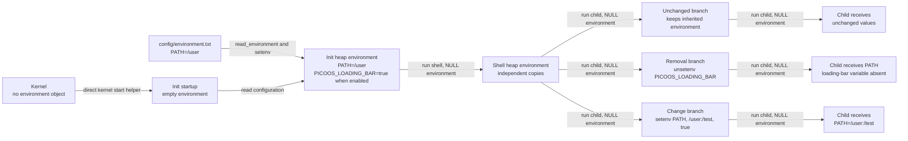
```mermaid
flowchart LR
    K["Kernel<br/>no environment object"] -->|direct kernel start helper| I0["Init startup<br/>empty environment"]
    C["config/environment.txt<br/>PATH=/user"] -->|read_environment and setenv| I["Init heap environment<br/>PATH=/user<br/>PICOOS_LOADING_BAR=true when enabled"]
    I0 -->|read configuration| I
    I -->|run shell, NULL environment| S["Shell heap environment<br/>independent copies"]
    S -->|run child, NULL environment| U["Unchanged branch<br/>keeps inherited environment"]
    U -->|run child, NULL environment| UC["Child receives<br/>unchanged values"]
    S -->|run child, NULL environment| R["Removal branch<br/>unsetenv PICOOS_LOADING_BAR"]
    R -->|run child, NULL environment| RC["Child receives PATH<br/>loading-bar variable absent"]
    S -->|run child, NULL environment| M["Change branch<br/>setenv PATH, /user:/test, true"]
    M -->|run child, NULL environment| MC["Child receives<br/>PATH=/user:/test"]
```

</ReadmeVisual>

</div>

</div>

---

<!-- SOURCE Pico-OS/README.md#43212-loading-bar-environment-variable -->

# 4. Processes and process lifecycle · 4.3 Loading and starting a process · 4.3.2 Starting a process (`run` library call) · 4.3.2.1 Parent-to-child inheritance

## 4.3.2.1.2 Loading-bar environment variable

<div class="deck-content readme-slide">

<div class="artifact-caption"><code>cat.bin</code> removes its inherited entry before reading, keeping progress bars out of file contents. The constant names the environment variable:</div>
<div class="readme-artifacts artifact-single">

<!-- README_ASSET code-4062 -->
<ReadmeVisual kind="code" :width="720" style="flex-grow:7">

<div class="readme-code">

```c {lines:false}
int main(int argc, char **argv) {
    // ...
    unsetenv(LOADING_BAR_ENVIRONMENT_VARIABLE);
    // ...
}
```

</div>

</ReadmeVisual>

</div>

</div>

---

<!-- SOURCE Pico-OS/README.md#4322-recording-termination-status -->

# 4. Processes and process lifecycle · 4.3 Loading and starting a process · 4.3.2 Starting a process (`run` library call)

## 4.3.2.2 Recording termination status (1)

<div class="deck-content readme-slide">

<div class="readme-artifacts artifact-single">

<!-- README_ASSET mermaid-4081 -->
<ReadmeVisual kind="mermaid" :width="1024" style="flex-grow:10">

```mermaid
%%{init: {"flowchart": {"wrappingWidth": 360, "rankSpacing": 30}, "themeCSS": "rect { rx: 0 !important; ry: 0 !important; }"}}%%
flowchart TB
    subgraph WAIT_FIRST["Parent already waiting"]
        direction LR
        EXIT["Child PCB<br/>exit_status = 7"]
        DELIVER["Parent stack<br/>status = 7"]
        RESUME["waitpid<br/>returns 7"]
        EXIT -->|copy| DELIVER
        DELIVER -->|wake and schedule| RESUME
    end
    subgraph EXIT_FIRST["Child terminates first"]
        direction LR
        KEEP["Child PCB<br/>exit_status = 7<br/>state = ZOMBIE"]
        COLLECT["Parent stack<br/>status = 7"]
        RETURN["waitpid<br/>returns 7"]
        KEEP -->|later waitpid copies| COLLECT
        COLLECT -->|no blocking| RETURN
    end
    WAIT_FIRST ~~~ EXIT_FIRST
    classDef waiting fill:#fff3d6,stroke:#b87800,color:#222;
    classDef delivered fill:#e8f4e8,stroke:#39733b,color:#222;
    class EXIT,KEEP waiting;
    class DELIVER,RESUME,COLLECT,RETURN delivered;
```

</ReadmeVisual>

</div><aside class="context-note"><b>Unix terminology: reaping</b><span>Reaping means final status collection and removal. PicoOS does not reparent orphaned children to init; it clears parent_pid and applies the configured parent-death signal.</span></aside>

</div>

---

<!-- SOURCE Pico-OS/README.md#4322-recording-termination-status -->

# 4. Processes and process lifecycle · 4.3 Loading and starting a process · 4.3.2 Starting a process (`run` library call)

## 4.3.2.2 Recording termination status (2)

<div class="deck-content readme-slide">

<div class="readme-artifacts artifact-pair">

<!-- README_ASSET list-4109 -->
<div class="readme-list"><ol start="1"><li>waitpid places its local status address in WaitPidRequest.</li>
<li>The kernel retains that pointer, queues the parent on the child's waiters, and marks the parent BLOCKED.</li>
<li>Termination records status and ZOMBIE, writes through the parent's pointer, clears wait links, and wakes the parent.</li>
<li>The resumed wrapper returns its updated local status; the child may already be removed.</li></ol></div>

<!-- README_ASSET list-4124 -->
<div class="readme-list"><ul><li>Creation records the loading parent's PID and initializes empty wait state.</li>
<li>Waiting identifies the caller through active_process and finds the requested PID in the process list.</li>
<li>Only the actual parent may collect the child. A missing target or different parent completes with −1; wakeup also verifies parent identity.</li></ul></div>

</div>

</div>

---

<!-- SOURCE Pico-OS/README.md#4323-parent-collection-and-final-removal -->

# 4. Processes and process lifecycle · 4.3 Loading and starting a process · 4.3.2 Starting a process (`run` library call)

## 4.3.2.3 Parent collection and final removal

<div class="deck-content readme-slide">

<div class="readme-artifacts artifact-single">

<!-- README_ASSET table-4164 rows=1-3 -->
<ReadmeVisual kind="table" :width="1100" style="flex-grow:10">

<div class="readme-table" v-pre><table><thead>
<tr>
<th>Lifecycle order</th>
<th>Status handoff and child <span class="source-link"><code>state</code></span></th>
<th>Who deletes the child PCB, and when</th>
</tr>
</thead><tbody><tr>
<td>Parent calls <span class="source-link"><code>waitpid()</code></span> while child is alive</td>
<td><span class="source-link"><code>wait_for_process_by_pid()</code></span> links the parent PCB into the child's <span class="source-link"><code>waiters</code></span> queue and blocks it. Child termination writes through the parent's <span class="source-link"><code>waiting_status_ptr</code></span> and wakes it.</td>
<td><span class="source-link"><code>terminate_process()</code></span> calls <span class="source-link"><code>remove_process()</code></span> directly after the status handoff because <span class="source-link"><code>process_has_waiting_parent()</code></span> was true. Deletion occurs inside termination, not during later dispatch. For self-exit it precedes the <span class="source-link"><code>exit_process()</code></span> dispatch.</td>
</tr>
<tr>
<td>Child terminates before parent calls <span class="source-link"><code>waitpid()</code></span></td>
<td>The complete child PCB remains allocated with <span class="source-link"><code>state</code></span> set to <span class="source-link"><code>ZOMBIE</code></span>, retaining <span class="source-link"><code>pid</code></span>, <span class="source-link"><code>parent_pid</code></span>, <span class="source-link"><code>exit_status</code></span>, and owned resources.</td>
<td>The later syscall reaches <span class="source-link"><code>wait_for_process_by_pid()</code></span>, which copies <span class="source-link"><code>exit_status</code></span> to the stack-local status and immediately calls <span class="source-link"><code>remove_process()</code></span> before returning.</td>
</tr>
<tr>
<td>No live parent remains</td>
<td>No future caller can collect the status.</td>
<td><span class="source-link"><code>terminate_process()</code></span> removes an orphan immediately. <span class="source-link"><code>orphan_and_signal_children()</code></span> also removes children that were already zombies when their parent terminates.</td>
</tr></tbody></table></div>

</ReadmeVisual>

</div>

</div>

---

<!-- SOURCE Pico-OS/README.md#4324-run-function-reference -->

# 4. Processes and process lifecycle · 4.3 Loading and starting a process · 4.3.2 Starting a process (`run` library call)

## 4.3.2.4 Run function reference

<div class="deck-content readme-slide">

<div class="readme-artifacts artifact-single">

<!-- README_ASSET table-4184 rows=1-10 -->
<ReadmeVisual kind="table" :width="1440" style="flex-grow:10">

<div class="readme-table" v-pre><table><thead>
<tr>
<th>Kernel function</th>
<th>Return value / status</th>
<th>Effects</th>
<th>Calls</th>
<th>Called by</th>
</tr>
</thead><tbody><tr>
<td><span class="source-link"><code>mark_process_ready_with_arguments(request)</code></span></td>
<td>true after setup, false for missing PID or <span class="source-link"><code>state</code></span> other than <span class="source-link"><code>NEW</code></span></td>
<td>Copies current caller descriptors when present, writes the child stack, updates <span class="source-link"><code>activation.sp</code></span> and <span class="source-link"><code>activation.baf</code></span>, then sets <span class="source-link"><code>state</code></span> to <span class="source-link"><code>READY</code></span>. Init keeps its original table because no current process exists</td>
<td><span class="source-link"><code>current_process()</code></span>, <span class="source-link"><code>destroy_file_descriptor_table()</code></span>, <span class="source-link"><code>find_process_by_pid()</code></span>, <span class="source-link"><code>inherit_file_descriptors()</code></span>, <span class="source-link"><code>store_process_arguments()</code></span></td>
<td><strong>Library functions:</strong> <span class="source-link"><code>run()</code></span> via the syscall<br><strong>Kernel functions:</strong> <span class="source-link"><code>handle_syscall()</code></span>, <span class="source-link"><code>main()</code></span> in <span class="source-link"><code>kernel/kernel.picoc</code></span></td>
</tr>
<tr>
<td><hr><hr></td>
<td><hr><hr></td>
<td><hr><hr></td>
<td><hr><hr></td>
<td><hr><hr></td>
</tr>
<tr>
<td><span class="source-link"><code>store_process_arguments(process, arguments, environment)</code></span></td>
<td>No return value</td>
<td>Copies path, tokens, and selected NAME=value strings into the child User Process Stack, writes entry PC/count/arrays/NULL sentinels, and saves <span class="source-link"><code>activation.sp</code></span> and <span class="source-link"><code>activation.baf</code></span></td>
<td><span class="source-link"><code>copy_process_string()</code></span>, <span class="source-link"><code>process_argument_is_quote()</code></span>, <span class="source-link"><code>process_argument_is_space()</code></span>, <span class="source-link"><code>process_argument_string_cell_count()</code></span>, <span class="source-link"><code>process_argument_token_count()</code></span>, <span class="source-link"><code>process_environment_count()</code></span>, <span class="source-link"><code>process_string_cell_count()</code></span></td>
<td><strong>Kernel functions:</strong> <span class="source-link"><code>mark_process_ready_with_arguments()</code></span></td>
</tr>
<tr>
<td><span class="source-link"><code>process_argument_token_count(arguments)</code></span></td>
<td>Number of argument tokens, 0 for NULL</td>
<td>Reads the raw string, treating space/tab outside matching quotes as separators</td>
<td><span class="source-link"><code>process_argument_is_quote()</code></span>, <span class="source-link"><code>process_argument_is_space()</code></span></td>
<td><strong>Kernel functions:</strong> <span class="source-link"><code>store_process_arguments()</code></span></td>
</tr>
<tr>
<td><span class="source-link"><code>process_argument_string_cell_count(arguments)</code></span></td>
<td>Copied argument characters plus one terminator per token, 0 for NULL</td>
<td>Counts the exact argument-string cells after matching quote removal</td>
<td><span class="source-link"><code>process_argument_is_quote()</code></span>, <span class="source-link"><code>process_argument_is_space()</code></span></td>
<td><strong>Kernel functions:</strong> <span class="source-link"><code>store_process_arguments()</code></span></td>
</tr>
<tr>
<td><span class="source-link"><code>process_argument_is_space(value)</code></span></td>
<td>true for space or tab, otherwise false</td>
<td>Classifies one input character, no writes</td>
<td>None</td>
<td><strong>Kernel functions:</strong> <span class="source-link"><code>process_argument_string_cell_count()</code></span>, <span class="source-link"><code>process_argument_token_count()</code></span>, <span class="source-link"><code>store_process_arguments()</code></span></td>
</tr>
<tr>
<td><span class="source-link"><code>process_argument_is_quote(value)</code></span></td>
<td>true for single or double quote, otherwise false</td>
<td>Classifies one input character, no writes</td>
<td>None</td>
<td><strong>Kernel functions:</strong> <span class="source-link"><code>process_argument_string_cell_count()</code></span>, <span class="source-link"><code>process_argument_token_count()</code></span>, <span class="source-link"><code>store_process_arguments()</code></span></td>
</tr>
<tr>
<td><span class="source-link"><code>process_environment_count(environment)</code></span></td>
<td>Number of entries before NULL, 0 for NULL array</td>
<td>Reads the selected environment pointer array</td>
<td>None</td>
<td><strong>Kernel functions:</strong> <span class="source-link"><code>store_process_arguments()</code></span></td>
</tr>
<tr>
<td><span class="source-link"><code>process_string_cell_count(value)</code></span></td>
<td>Number of character cells including the zero terminator</td>
<td>Reads one null-terminated string</td>
<td>None</td>
<td><strong>Kernel functions:</strong> <span class="source-link"><code>store_process_arguments()</code></span></td>
</tr>
<tr>
<td><span class="source-link"><code>copy_process_string(target, source)</code></span></td>
<td>Address of the first cell after the copied zero terminator</td>
<td>Copies a string and its terminator to the destination stack area</td>
<td>None</td>
<td><strong>Kernel functions:</strong> <span class="source-link"><code>store_process_arguments()</code></span></td>
</tr></tbody></table></div>

</ReadmeVisual>

</div>

</div>

---

<!-- SOURCE Pico-OS/README.md#44-process-list-pcb-metadata-and-lifecycle-function-reference -->

# 4. Processes and process lifecycle

## 4.4 Process list, PCB metadata, and lifecycle function reference (1)

<div class="deck-content readme-slide">

<div class="readme-artifacts artifact-single">

<!-- README_ASSET table-4204 rows=1-11 -->
<ReadmeVisual kind="table" :width="1440" style="flex-grow:10">

<div class="readme-table" v-pre><table><thead>
<tr>
<th>Kernel function</th>
<th>Return value / status</th>
<th>Effects</th>
<th>Calls</th>
<th>Called by</th>
</tr>
</thead><tbody><tr>
<td><span class="source-link"><code>list_processes(void)</code></span></td>
<td>No return value</td>
<td>Traverses the process list and writes each PID and stable binary path through descriptor 1</td>
<td><span class="source-link"><code>first_process()</code></span>, <span class="source-link"><code>system_relative_path()</code></span>, <span class="source-link"><code>uart_append_decimal()</code></span>, <span class="source-link"><code>write_file_descriptor()</code></span><br><strong>Host requests:</strong> Output through a regular file uses <code>write-at &lt;offset&gt; &lt;path&gt;</code>, optional append <code>file-size &lt;path&gt;</code>, then <code>write stdout</code>. Terminal stderr uses <code>write stderr</code>, then <code>write stdout</code>. Terminal stdout or null needs no host request</td>
<td><strong>Library functions:</strong> <span class="source-link"><code>list_processes()</code></span> via the syscall<br><strong>Kernel functions:</strong> <span class="source-link"><code>handle_syscall()</code></span><br><strong>User applications:</strong> <span class="source-link"><code>main()</code></span> in <span class="source-link"><code>user/ps.picoc</code></span></td>
</tr>
<tr>
<td><span class="source-link"><code>unload_process_by_pid(pid)</code></span></td>
<td>true after removal, false for a missing or currently active PID</td>
<td>Terminates with success status and forces final removal, including an uncollected zombie</td>
<td><span class="source-link"><code>find_process_by_pid()</code></span>, <span class="source-link"><code>remove_process()</code></span>, <span class="source-link"><code>terminate_process()</code></span></td>
<td><strong>Library functions:</strong> <span class="source-link"><code>unload()</code></span> via the syscall<br><strong>Kernel functions:</strong> <span class="source-link"><code>handle_syscall()</code></span></td>
</tr>
<tr>
<td><span class="source-link"><code>exit_process(status)</code></span></td>
<td>Does not return normally</td>
<td>Terminates the current process and dispatches another process, shuts down if none remain</td>
<td><span class="source-link"><code>current_process()</code></span>, <span class="source-link"><code>dispatcher_start_next_process()</code></span>, <span class="source-link"><code>shutdown()</code></span>, <span class="source-link"><code>terminate_process()</code></span></td>
<td><strong>Library functions:</strong> <span class="source-link"><code>exit()</code></span> via the syscall<br><strong>Kernel functions:</strong> <span class="source-link"><code>handle_cpu_exception()</code></span>, <span class="source-link"><code>handle_process_heap_full_exception()</code></span>, <span class="source-link"><code>handle_syscall()</code></span><br><strong>CPU exceptions:</strong> through <span class="source-link"><code>handle_cpu_exception()</code></span></td>
</tr>
<tr>
<td><span class="source-link"><code>process_heap_start(void)</code></span></td>
<td>Absolute current-process heap address</td>
<td>Adds <span class="source-link"><code>base_address</code></span> to <span class="source-link"><code>heap_start</code></span>, no writes</td>
<td><span class="source-link"><code>current_process()</code></span></td>
<td><strong>Library functions:</strong> <span class="source-link"><code>init_process_heap()</code></span> via the syscall<br><strong>Kernel functions:</strong> <span class="source-link"><code>handle_syscall()</code></span></td>
</tr>
<tr>
<td><span class="source-link"><code>process_heap_size(void)</code></span></td>
<td>Current-process heap cell count</td>
<td>Reads <span class="source-link"><code>heap_size</code></span>, no writes</td>
<td><span class="source-link"><code>current_process()</code></span></td>
<td><strong>Library functions:</strong> <span class="source-link"><code>init_process_heap()</code></span> via the syscall<br><strong>Kernel functions:</strong> <span class="source-link"><code>handle_syscall()</code></span></td>
</tr>
<tr>
<td><hr><hr></td>
<td><hr><hr></td>
<td><hr><hr></td>
<td><hr><hr></td>
<td><hr><hr></td>
</tr>
<tr>
<td><span class="source-link"><code>initialize_process_table(void)</code></span></td>
<td>No return value</td>
<td>Clears head, tail, and <span class="source-link"><code>active_process</code></span>, resets <span class="source-link"><code>next_process_id</code></span> to 1</td>
<td>None</td>
<td><strong>Kernel functions:</strong> <span class="source-link"><code>main()</code></span> in <span class="source-link"><code>kernel/kernel.picoc</code></span></td>
</tr>
<tr>
<td><span class="source-link"><code>first_process(void)</code></span></td>
<td>Head PCB pointer or NULL</td>
<td>Reads <span class="source-link"><code>process_list_head</code></span></td>
<td>None</td>
<td><strong>Kernel functions:</strong> <span class="source-link"><code>dispatcher_start_next_process()</code></span>, <span class="source-link"><code>list_processes()</code></span> in <span class="source-link"><code>kernel/process/process.picoc</code></span>, <span class="source-link"><code>scheduler_next_process()</code></span></td>
</tr>
<tr>
<td><span class="source-link"><code>current_process(void)</code></span></td>
<td>Current PCB pointer or NULL</td>
<td>Reads <span class="source-link"><code>active_process</code></span></td>
<td>None</td>
<td><strong>Kernel functions:</strong> <span class="source-link"><code>activate_current_process_stack_boundary()</code></span>, <span class="source-link"><code>begin_process_load()</code></span>, <span class="source-link"><code>begin_terminal_read()</code></span>, <span class="source-link"><code>build_process_path()</code></span>, <span class="source-link"><code>change_working_directory()</code></span>, <span class="source-link"><code>close_file_descriptor()</code></span>, <span class="source-link"><code>create_process()</code></span>, <span class="source-link"><code>dispatcher_switch_from_context()</code></span>, <span class="source-link"><code>dispatcher_switch_to_process()</code></span>, <span class="source-link"><code>duplicate_file_descriptor()</code></span>, <span class="source-link"><code>enqueue_current_process_on_wait_queue()</code></span>, <span class="source-link"><code>exit_process()</code></span>, <span class="source-link"><code>get_working_directory()</code></span>, <span class="source-link"><code>handle_syscall()</code></span>, <span class="source-link"><code>load_process_chunk()</code></span>, <span class="source-link"><code>map_shared_memory()</code></span>, <span class="source-link"><code>mark_process_ready_with_arguments()</code></span>, <span class="source-link"><code>open_file_descriptor()</code></span>, <span class="source-link"><code>process_heap_size()</code></span>, <span class="source-link"><code>process_heap_start()</code></span>, <span class="source-link"><code>read_file_descriptor()</code></span>, <span class="source-link"><code>scheduler_next_process()</code></span>, <span class="source-link"><code>seek_file_descriptor()</code></span>, <span class="source-link"><code>send_signal_to_process()</code></span>, <span class="source-link"><code>set_foreground_process()</code></span> in <span class="source-link"><code>kernel/signal.picoc</code></span>, <span class="source-link"><code>set_parent_death_signal()</code></span>, <span class="source-link"><code>terminal_input_process()</code></span>, <span class="source-link"><code>wait_for_process_by_pid()</code></span>, <span class="source-link"><code>write_file_descriptor()</code></span></td>
</tr>
<tr>
<td><span class="source-link"><code>set_current_process(process)</code></span></td>
<td>No return value</td>
<td>Replaces <span class="source-link"><code>active_process</code></span></td>
<td>None</td>
<td><strong>Kernel functions:</strong> <span class="source-link"><code>dispatcher_switch_to_process()</code></span></td>
</tr>
<tr>
<td><span class="source-link"><code>find_process_by_pid(pid)</code></span></td>
<td>Matching PCB pointer or NULL</td>
<td>Traverses <span class="source-link"><code>process_list_head</code></span> through PCB next</td>
<td>None</td>
<td><strong>Kernel functions:</strong> <span class="source-link"><code>handle_terminal_signal_character()</code></span>, <span class="source-link"><code>mark_process_ready_with_arguments()</code></span>, <span class="source-link"><code>send_signal_by_pid()</code></span>, <span class="source-link"><code>set_foreground_process()</code></span> in <span class="source-link"><code>kernel/signal.picoc</code></span>, <span class="source-link"><code>terminal_input_process()</code></span>, <span class="source-link"><code>terminate_process()</code></span>, <span class="source-link"><code>unload_process_by_pid()</code></span>, <span class="source-link"><code>wait_for_process_by_pid()</code></span></td>
</tr></tbody></table></div>

</ReadmeVisual>

</div>

</div>

---

<!-- SOURCE Pico-OS/README.md#44-process-list-pcb-metadata-and-lifecycle-function-reference -->

# 4. Processes and process lifecycle

## 4.4 Process list, PCB metadata, and lifecycle function reference (2)

<div class="deck-content readme-slide">

<div class="readme-artifacts artifact-single">

<!-- README_ASSET table-4204 rows=12-16 -->
<ReadmeVisual kind="table" :width="1440" style="flex-grow:10">

<div class="readme-table" v-pre><table><thead>
<tr>
<th>Kernel function</th>
<th>Return value / status</th>
<th>Effects</th>
<th>Calls</th>
<th>Called by</th>
</tr>
</thead><tbody><tr>
<td><span class="source-link"><code>terminate_process(process, status)</code></span></td>
<td>No return value, no effect for NULL or an existing zombie</td>
<td>Handles children, records <span class="source-link"><code>exit_status</code></span>, sets <span class="source-link"><code>state</code></span> <span class="source-link"><code>ZOMBIE</code></span>, hands off status and wakes <span class="source-link"><code>waiters</code></span>, removes the PCB when no parent remains or its waiting parent received the status</td>
<td><span class="source-link"><code>find_process_by_pid()</code></span>, <span class="source-link"><code>orphan_and_signal_children()</code></span>, <span class="source-link"><code>process_has_waiting_parent()</code></span>, <span class="source-link"><code>remove_process()</code></span>, <span class="source-link"><code>wake_parent_waiting_for_process()</code></span></td>
<td><strong>Kernel functions:</strong> <span class="source-link"><code>exit_process()</code></span>, <span class="source-link"><code>kill_process()</code></span>, <span class="source-link"><code>unload_process_by_pid()</code></span></td>
</tr>
<tr>
<td><span class="source-link"><code>remove_process(process)</code></span></td>
<td>No return value, no effect when absent from the list</td>
<td>Unlinks queue and process-list membership, adjusts list roots, releases shared mappings, cancels partial loading, frees Process Payload, descriptor objects, PCB-owned strings and PCB</td>
<td><span class="source-link"><code>PSDFree()</code></span>, <span class="source-link"><code>cancel_process_load()</code></span>, <span class="source-link"><code>destroy_file_descriptor_table()</code></span>, <span class="source-link"><code>kfree()</code></span>, <span class="source-link"><code>release_process_shared_memory()</code></span>, <span class="source-link"><code>remove_from_wait_queue()</code></span></td>
<td><strong>Kernel functions:</strong> <span class="source-link"><code>orphan_and_signal_children()</code></span>, <span class="source-link"><code>terminate_process()</code></span>, <span class="source-link"><code>unload_process_by_pid()</code></span>, <span class="source-link"><code>wait_for_process_by_pid()</code></span></td>
</tr>
<tr>
<td><span class="source-link"><code>orphan_and_signal_children(parent)</code></span></td>
<td>No return value</td>
<td>Sets direct children <span class="source-link"><code>parent_pid</code></span> to 0, removes existing zombies, signals live children when <span class="source-link"><code>parent_death_signal</code></span> is nonzero</td>
<td><span class="source-link"><code>remove_process()</code></span>, <span class="source-link"><code>send_signal_to_process()</code></span></td>
<td><strong>Kernel functions:</strong> <span class="source-link"><code>terminate_process()</code></span></td>
</tr>
<tr>
<td><span class="source-link"><code>process_has_waiting_parent(process)</code></span></td>
<td>true when the recorded parent is in the child <span class="source-link"><code>waiters</code></span> queue, otherwise false</td>
<td>Scans the child <span class="source-link"><code>waiters</code></span> queue through <span class="source-link"><code>wait_next</code></span></td>
<td>None</td>
<td><strong>Kernel functions:</strong> <span class="source-link"><code>terminate_process()</code></span></td>
</tr>
<tr>
<td><span class="source-link"><code>wake_parent_waiting_for_process(process, status)</code></span></td>
<td>No return value</td>
<td>Writes the status through the parent <span class="source-link"><code>waiting_status_ptr</code></span> when supplied, clears that pointer, and wakes all child <span class="source-link"><code>waiters</code></span></td>
<td><span class="source-link"><code>wakeup_wait_queue()</code></span></td>
<td><strong>Kernel functions:</strong> <span class="source-link"><code>terminate_process()</code></span></td>
</tr></tbody></table></div>

</ReadmeVisual>

</div>

</div>

---

<!-- SOURCE Pico-OS/README.md#51-named-entries-and-per-process-attachments -->

# 5. Shared Memory Entries and Mappings

## 5.1 Named entries and per-process attachments (1)

<div class="deck-content readme-slide">

<div class="artifact-caption">The definitions and field tables show the metadata and pointers connecting these objects:</div>
<div class="readme-artifacts artifact-single">

<!-- README_ASSET code-4241 -->
<ReadmeVisual kind="code" :width="720" style="flex-grow:15">

<div class="readme-code">

```c {lines:false}
struct SharedMemoryEntry {
    char *name;
    int id;
    void *address;
    int reference_count;
    bool unlink_requested;
    struct SharedMemoryEntry *next;
};

struct SharedMemoryAttachment {
    struct SharedMemoryEntry *entry;
    struct SharedMemoryAttachment *next;
};
```

</div>

</ReadmeVisual>

</div>

</div>

---

<!-- SOURCE Pico-OS/README.md#51-named-entries-and-per-process-attachments -->

# 5. Shared Memory Entries and Mappings

## 5.1 Named entries and per-process attachments (2)

<div class="deck-content readme-slide">

<div class="readme-artifacts artifact-single">

<!-- README_ASSET table-4265 rows=1-6 -->
<ReadmeVisual kind="table" :width="1100" style="flex-grow:10">

<div class="readme-table" v-pre><table><thead>
<tr>
<th>Attribute</th>
<th>Meaning</th>
<th>Used by</th>
</tr>
</thead><tbody><tr>
<td><span class="source-link"><code>SharedMemoryEntry.name</code></span></td>
<td>Kernel-owned lookup name, freed and set to <code>NULL</code> on unlink</td>
<td>First initialized by <span class="source-link"><code>open_shared_memory()</code></span>, read by <span class="source-link"><code>find_shared_memory_by_name()</code></span>, freed by <span class="source-link"><code>unlink_shared_memory()</code></span> and <span class="source-link"><code>destroy_shared_memory_entry()</code></span></td>
</tr>
<tr>
<td><span class="source-link"><code>SharedMemoryEntry.id</code></span></td>
<td>Numeric open/map handle</td>
<td>First initialized and returned by <span class="source-link"><code>open_shared_memory()</code></span>, read by <span class="source-link"><code>find_shared_memory_by_id()</code></span> for <span class="source-link"><code>map_shared_memory()</code></span></td>
</tr>
<tr>
<td><span class="source-link"><code>SharedMemoryEntry.address</code></span></td>
<td>Absolute start of the <span class="source-link"><code>PSDMalloc()</code></span> shared-memory data region</td>
<td>First initialized by <span class="source-link"><code>open_shared_memory()</code></span>, returned by <span class="source-link"><code>map_shared_memory()</code></span> and freed by <span class="source-link"><code>destroy_shared_memory_entry()</code></span></td>
</tr>
<tr>
<td><span class="source-link"><code>SharedMemoryEntry.reference_count</code></span></td>
<td>Attachment count, not distinct PID count</td>
<td>First initialized by <span class="source-link"><code>open_shared_memory()</code></span>, changed by <span class="source-link"><code>map_shared_memory()</code></span> and <span class="source-link"><code>release_process_shared_memory()</code></span>, checked by <span class="source-link"><code>unlink_shared_memory()</code></span></td>
</tr>
<tr>
<td><span class="source-link"><code>SharedMemoryEntry.unlink_requested</code></span></td>
<td>Defers destruction until the last attachment disappears</td>
<td>First initialized by <span class="source-link"><code>open_shared_memory()</code></span>, set by <span class="source-link"><code>unlink_shared_memory()</code></span> and checked by <span class="source-link"><code>release_process_shared_memory()</code></span></td>
</tr>
<tr>
<td><span class="source-link"><code>SharedMemoryEntry.next</code></span></td>
<td>Link to the next entry in the kernel's linked list</td>
<td>First initialized by <span class="source-link"><code>open_shared_memory()</code></span>, traversed by <span class="source-link"><code>find_shared_memory_by_name()</code></span> and <span class="source-link"><code>find_shared_memory_by_id()</code></span>, traversed and updated by <span class="source-link"><code>destroy_shared_memory_entry()</code></span></td>
</tr></tbody></table></div>

</ReadmeVisual>

</div>

</div>

---

<!-- SOURCE Pico-OS/README.md#51-named-entries-and-per-process-attachments -->

# 5. Shared Memory Entries and Mappings

## 5.1 Named entries and per-process attachments (3)

<div class="deck-content readme-slide">

<div class="readme-artifacts artifact-single">

<!-- README_ASSET table-4277 rows=1-2 -->
<ReadmeVisual kind="table" :width="1100" style="flex-grow:10">

<div class="readme-table" v-pre><table><thead>
<tr>
<th>Attribute</th>
<th>Meaning</th>
<th>Used by</th>
</tr>
</thead><tbody><tr>
<td><span class="source-link"><code>SharedMemoryAttachment.entry</code></span></td>
<td>Non-owning pointer to the linked-list entry whose reference count this mapping contributes to</td>
<td>First initialized by <span class="source-link"><code>map_shared_memory()</code></span>, read by <span class="source-link"><code>release_process_shared_memory()</code></span> to decrement the entry's count before freeing the attachment</td>
</tr>
<tr>
<td><span class="source-link"><code>SharedMemoryAttachment.next</code></span></td>
<td>Link in one PCB's <span class="source-link"><code>shared_memory_attachments</code></span> list</td>
<td>First initialized by <span class="source-link"><code>map_shared_memory()</code></span>, traversed by <span class="source-link"><code>release_process_shared_memory()</code></span></td>
</tr></tbody></table></div>

</ReadmeVisual>

</div>

</div>

---

<!-- SOURCE Pico-OS/README.md#511-global-shared-memory-list-and-entry-names -->

# 5. Shared Memory Entries and Mappings · 5.1 Named entries and per-process attachments

## 5.1.1 Global shared-memory list and entry names

<div class="deck-content readme-slide">

<div class="artifact-caption">The upper view locates two entries and their copied names in the Kernel Heap. The lower view shows the same registry. <span class="source-link"><code>next</code></span> skips the name allocations, while each <span class="source-link"><code>name</code></span> points to its own string:</div>
<div class="readme-artifacts artifact-single">

<!-- README_ASSET image-4299 -->
<ReadmeVisual kind="image" :width="1024" style="flex-grow:16">


</ReadmeVisual>

</div>

</div>

---

<!-- SOURCE Pico-OS/README.md#5111-from-shared-memory-entries-to-shared-data-payloads-in-sram -->

# 5. Shared Memory Entries and Mappings · 5.1 Named entries and per-process attachments · 5.1.1 Global shared-memory list and entry names

## 5.1.1.1 From Shared Memory Entries to Shared Data Payloads in SRAM

<div class="deck-content readme-slide">

<div class="artifact-caption">The green arrows connect entries 1 and 2 to Shared Data Payloads A and C. The middle Process Payload shows that both kinds of data use the same outer heap:</div>
<div class="readme-artifacts artifact-single">

<!-- README_ASSET image-4311 -->
<ReadmeVisual kind="image" :width="1024" style="flex-grow:16">


</ReadmeVisual>

</div>

</div>

---

<!-- SOURCE Pico-OS/README.md#512-per-process-attachment-lists-in-sram -->

# 5. Shared Memory Entries and Mappings · 5.1 Named entries and per-process attachments

## 5.1.2 Per-process attachment lists in SRAM

<div class="deck-content readme-slide">

<div class="artifact-caption">PCB 1 maps both entries, and PCB 2 also maps Entry 1. Their <span class="source-link"><code>reference_count</code></span> values are therefore 2 and 1. Process cleanup walks its attachment list and follows <span class="source-link"><code>entry</code></span> to release each reference.</div>
<div class="readme-artifacts artifact-single">

<!-- README_ASSET image-4332 -->
<ReadmeVisual kind="image" :width="1024" style="flex-grow:16">


</ReadmeVisual>

</div>

</div>

---

<!-- SOURCE Pico-OS/README.md#52-mapping-unlinking-and-deferred-destruction -->

# 5. Shared Memory Entries and Mappings

## 5.2 Mapping, unlinking, and deferred destruction (1)

<div class="deck-content readme-slide">

<div class="artifact-caption">This timeline follows Entry 1: opening creates it, mapping adds references, unlinking removes its name, and process removal releases the references. The data stays allocated until both destruction conditions hold:</div>
<div class="readme-artifacts artifact-single">

<!-- README_ASSET image-4354 -->
<ReadmeVisual kind="image" :width="1024" style="flex-grow:16">


</ReadmeVisual>

</div>

</div>

---

<!-- SOURCE Pico-OS/README.md#52-mapping-unlinking-and-deferred-destruction -->

# 5. Shared Memory Entries and Mappings

## 5.2 Mapping, unlinking, and deferred destruction (2)

<div class="deck-content readme-slide">

<div class="artifact-caption"><span class="source-link"><code>shm_open()</code></span> returns an ID, and <span class="source-link"><code>mmap()</code></span> returns its address. This launcher shares one cell containing <code>7</code>, then waits for a worker to change it:</div>
<div class="readme-artifacts artifact-single">

<!-- README_ASSET code-4371 -->
<ReadmeVisual kind="code" :width="1287" style="flex-grow:28">

<div class="readme-code">

```c {lines:false}
// dependencies: ../../library/unistd/libunistd.reti_blocks ../../library/sys/wait/libwait.reti_blocks ../../library/sys/mman/libmman.reti_blocks

#include "../../library/unistd/unistd.header"
#include "../../library/sys/wait/wait.header"
#include "../../library/sys/mman/mman.header"

int main(void) {
    int shared_memory_id;
    int *shared_value;
    int worker_pid;
    int result = 1;

    shared_memory_id = shm_open("shared-value", 1);
    shared_value = (int *)mmap(shared_memory_id);
    shared_value[0] = 7;

    worker_pid = load("test/shared_value/worker.bin");
    run(worker_pid, "shared-value", NULL);
    waitpid(worker_pid);

    if (shared_value[0] == 8) {
        result = 0;
    }
    shm_unlink("shared-value");
    return result;
}
```

</div>

</ReadmeVisual>

</div>

</div>

---

<!-- SOURCE Pico-OS/README.md#52-mapping-unlinking-and-deferred-destruction -->

# 5. Shared Memory Entries and Mappings

## 5.2 Mapping, unlinking, and deferred destruction (3)

<div class="deck-content readme-slide">

<div class="artifact-caption">The worker opens the same name, maps the existing region, and changes <code>7</code> to <code>8</code>:</div>
<div class="readme-artifacts artifact-single">

<!-- README_ASSET code-4403 -->
<ReadmeVisual kind="code" :width="720" style="flex-grow:15">

<div class="readme-code">

```c {lines:false}
// dependencies: ../../library/sys/mman/libmman.reti_blocks

#include "../../library/sys/mman/mman.header"

int main(int argc, char **argv) {
    int shared_memory_id;
    int *shared_value;

    shared_memory_id = shm_open(argv[1], 1);
    shared_value = (int *)mmap(shared_memory_id);
    shared_value[0] = shared_value[0] + 1;
    return 0;
}
```

</div>

</ReadmeVisual>

</div>

</div>

---

<!-- SOURCE Pico-OS/README.md#53-shared-memory-function-reference -->

# 5. Shared Memory Entries and Mappings

## 5.3 Shared Memory function reference

<div class="deck-content readme-slide">

<div class="readme-artifacts artifact-single">

<!-- README_ASSET table-4432 rows=1-7 -->
<ReadmeVisual kind="table" :width="1440" style="flex-grow:10">

<div class="readme-table" v-pre><table><thead>
<tr><th>Kernel function</th><th>Return value / status</th><th>Effects</th><th>Calls</th><th>Called by</th></tr>
</thead><tbody><tr><td><span class="source-link"><code>open_shared_memory(request)</code></span></td><td>Existing/new ID, <code>-1</code> for a null request/name, a nonpositive new size, or insufficient Process and Shared Data Heap space</td><td>If the name already exists, returns its <span class="source-link"><code>SharedMemoryEntry.id</code></span> without creating a structure. Otherwise creates a <span class="source-link"><code>SharedMemoryEntry</code></span> and copied name with <span class="source-link"><code>kmalloc()</code></span>, creates its data region with <span class="source-link"><code>PSDMalloc()</code></span>, and prepends the <span class="source-link"><code>SharedMemoryEntry</code></span> to the kernel&#39;s linked list</td><td><span class="source-link"><code>find_shared_memory_by_name()</code></span>, <span class="source-link"><code>kmalloc()</code></span>, <span class="source-link"><code>copy_shared_memory_name()</code></span>, <span class="source-link"><code>PSDMalloc()</code></span>, <span class="source-link"><code>kfree()</code></span></td><td><strong>Library functions:</strong> <span class="source-link"><code>shm_open()</code></span><br><strong>Kernel functions (syscall dispatch):</strong> <span class="source-link"><code>handle_syscall()</code></span></td></tr>
<tr><td><span class="source-link"><code>map_shared_memory(shared_memory_id)</code></span></td><td>Address, or <code>NULL</code> for an unknown ID or no current process</td><td>For every successful mapping, creates one <span class="source-link"><code>SharedMemoryAttachment</code></span> with <span class="source-link"><code>kmalloc()</code></span>, links it from the current PCB&#39;s <span class="source-link"><code>shared_memory_attachments</code></span> field, points it at the existing <span class="source-link"><code>SharedMemoryEntry</code></span>, and increments that entry&#39;s count</td><td><span class="source-link"><code>current_process()</code></span>, <span class="source-link"><code>find_shared_memory_by_id()</code></span>, <span class="source-link"><code>kmalloc()</code></span></td><td><strong>Library functions:</strong> <span class="source-link"><code>mmap()</code></span><br><strong>Kernel functions (syscall dispatch):</strong> <span class="source-link"><code>handle_syscall()</code></span></td></tr>
<tr><td><span class="source-link"><code>unlink_shared_memory(name)</code></span></td><td><code>0</code> on unlink, <code>-1</code> for a null or unknown name</td><td>Frees the name and marks the existing <span class="source-link"><code>SharedMemoryEntry</code></span> for removal, destroys that <span class="source-link"><code>SharedMemoryEntry</code></span> immediately only when its mapping count is zero</td><td><span class="source-link"><code>find_shared_memory_by_name()</code></span>, <span class="source-link"><code>kfree()</code></span>, <span class="source-link"><code>destroy_shared_memory_entry()</code></span></td><td><strong>Library functions:</strong> <span class="source-link"><code>shm_unlink()</code></span><br><strong>Kernel functions (syscall dispatch):</strong> <span class="source-link"><code>handle_syscall()</code></span></td></tr>
<tr><td colspan="5"><hr><hr></td></tr>
<tr><td><span class="source-link"><code>initialize_shared_memory(void)</code></span></td><td>Returns no value</td><td>Initializes the shared-memory list head and next ID</td><td>—</td><td><strong>Kernel functions:</strong> <span class="source-link"><code>main()</code></span></td></tr>
<tr><td><span class="source-link"><code>release_process_shared_memory(process)</code></span></td><td>Returns no value</td><td>Walks one PCB&#39;s <span class="source-link"><code>SharedMemoryAttachment</code></span> list, frees every <span class="source-link"><code>SharedMemoryAttachment</code></span>, and decrements the referenced <span class="source-link"><code>SharedMemoryEntry.reference_count</code></span>, destroys an unlinked <span class="source-link"><code>SharedMemoryEntry</code></span> after its last attachment is released</td><td><span class="source-link"><code>kfree()</code></span>, <span class="source-link"><code>destroy_shared_memory_entry()</code></span></td><td><strong>Kernel functions:</strong> <span class="source-link"><code>remove_process()</code></span></td></tr>
<tr><td><span class="source-link"><code>destroy_shared_memory_entry(entry)</code></span></td><td>Returns no value</td><td>Removes one <span class="source-link"><code>SharedMemoryEntry</code></span> from the kernel&#39;s linked list, frees its <span class="source-link"><code>SharedMemoryEntry.address</code></span> data region with <span class="source-link"><code>PSDFree()</code></span>, and frees the <span class="source-link"><code>SharedMemoryEntry</code></span> and its name with <span class="source-link"><code>kfree()</code></span></td><td><span class="source-link"><code>PSDFree()</code></span>, <span class="source-link"><code>kfree()</code></span></td><td><strong>Kernel functions:</strong> <span class="source-link"><code>unlink_shared_memory()</code></span>, <span class="source-link"><code>release_process_shared_memory()</code></span></td></tr></tbody></table></div>

</ReadmeVisual>

</div>

</div>

---

<!-- SOURCE Pico-OS/README.md#6-scheduling-and-context-switching -->

# 6. Scheduling and context switching

<div class="deck-content readme-slide">

<div class="readme-explanation"><p>The scheduler chooses the next runnable process. The dispatcher saves the outgoing registers and restores the selected process. They share PCB information but have separate jobs.</p>
<p>PicoOS represents states with integer constants. The scheduler accepts <span class="source-link"><code>PROCESS_STATE_READY</code></span> and <span class="source-link"><code>PROCESS_STATE_RUNNING</code></span>, returning the selected process's PCB. The dispatcher uses its saved activation to resume execution.</p></div>

</div>

---

<!-- SOURCE Pico-OS/README.md#611-algorithm-and-round-robin-comparison -->

# 6. Scheduling and context switching · 6.1 Scheduler implementation

## 6.1.1 Algorithm and Round Robin comparison (1)

<div class="deck-content readme-slide">

<div class="artifact-caption">This example has <code>P3</code> as the current process. It shows cyclic order and the extra traversal past non-runnable processes:</div>
<div class="readme-artifacts artifact-single">

<!-- README_ASSET mermaid-4489 -->
<ReadmeVisual kind="mermaid" :width="1024" style="flex-grow:10">

```mermaid
flowchart LR
    P1["P1<br/>READY"] --> P2["P2<br/>BLOCKED"]
    P2 --> P3["P3<br/>RUNNING<br/>current"]
    P3 --> P4["P4<br/>STOPPED"]
    P4 --> P5["P5<br/>READY"]
```

</ReadmeVisual>

</div>

</div>

---

<!-- SOURCE Pico-OS/README.md#611-algorithm-and-round-robin-comparison -->

# 6. Scheduling and context switching · 6.1 Scheduler implementation

## 6.1.1 Algorithm and Round Robin comparison (2)

<div class="deck-content readme-slide">

<div class="artifact-caption">The implementation separates the state check from the cyclic scan:</div>
<div class="readme-artifacts artifact-single">

<!-- README_ASSET code-4510 -->
<ReadmeVisual kind="code" :width="720" style="flex-grow:40">

<div class="readme-code">

```c {lines:false}
bool scheduler_can_run(struct ProcessControlBlock *process) {
    return process != NULL &&
           (process->state == PROCESS_STATE_READY ||
            // A still-current RUNNING process may be the only runnable process
            // when scheduler_next_process() wraps around to it
            process->state == PROCESS_STATE_RUNNING);
}

struct ProcessControlBlock *scheduler_next_process(void) {
    struct ProcessControlBlock *start;
    struct ProcessControlBlock *candidate;

    if (first_process() == NULL) {
        return NULL;
    }
    if (current_process() == NULL || current_process()->next == NULL) {
        start = first_process();
    } else {
        start = current_process()->next;
    }

    candidate = start;
    while (candidate != NULL) {
        if (scheduler_can_run(candidate)) {
            return candidate;
        }
        candidate = candidate->next;
    }

    candidate = first_process();
    while (candidate != start) {
        if (scheduler_can_run(candidate)) {
            return candidate;
        }
        candidate = candidate->next;
    }
    return NULL;
}
```

</div>

</ReadmeVisual>

</div>

</div>

---

<!-- SOURCE Pico-OS/README.md#612-scheduler-function-reference -->

# 6. Scheduling and context switching · 6.1 Scheduler implementation

## 6.1.2 Scheduler function reference

<div class="deck-content readme-slide">

<div class="readme-artifacts artifact-single">

<!-- README_ASSET table-4556 rows=1-2 -->
<ReadmeVisual kind="table" :width="1440" style="flex-grow:10">

<div class="readme-table" v-pre><table><thead>
<tr>
<th>Kernel function</th>
<th>Return value / status</th>
<th>Effects</th>
<th>Calls</th>
<th>Called by</th>
</tr>
</thead><tbody><tr>
<td><span class="source-link"><code>scheduler_can_run(process)</code></span></td>
<td><code>true</code> for a non-<code>NULL</code> PCB whose state is <span class="source-link"><code>READY</code></span> or <span class="source-link"><code>RUNNING</code></span>, otherwise <code>false</code></td>
<td>Reads the candidate PCB's <span class="source-link"><code>state</code></span></td>
<td>None</td>
<td><strong>Kernel functions:</strong> <span class="source-link"><code>scheduler_next_process()</code></span></td>
</tr>
<tr>
<td><span class="source-link"><code>scheduler_next_process(void)</code></span></td>
<td>PCB representing the first runnable process found during one cyclic scan, or <code>NULL</code> when the process list is empty or no process can run</td>
<td>Reads <span class="source-link"><code>process_list_head</code></span>, <span class="source-link"><code>active_process</code></span>, and PCB <span class="source-link"><code>next</code></span> and <span class="source-link"><code>state</code></span> fields, does not change process state</td>
<td><span class="source-link"><code>first_process()</code></span>, <span class="source-link"><code>current_process()</code></span>, <span class="source-link"><code>scheduler_can_run()</code></span></td>
<td><strong>Kernel functions:</strong> <span class="source-link"><code>dispatcher_start_next_process()</code></span></td>
</tr></tbody></table></div>

</ReadmeVisual>

</div>

</div>

---

<!-- SOURCE Pico-OS/README.md#62-saved-process-registers -->

# 6. Scheduling and context switching

## 6.2 Saved process registers (1)

<div class="deck-content readme-slide">

<div class="artifact-caption">The definition and table show the saved registers. <span class="source-link"><code>9.2 Containment and reference relationships</code></span> places the activation within its PCB:</div>
<div class="readme-artifacts artifact-single">

<!-- README_ASSET code-4574 -->
<ReadmeVisual kind="code" :width="720" style="flex-grow:11">

<div class="readme-code">

```c {lines:false}
struct ActivationRecord {
    int in1;
    int in2;
    int acc;
    int sp;
    int baf;
    int cs;
    int ds;
};
```

</div>

</ReadmeVisual>

</div>

</div>

---

<!-- SOURCE Pico-OS/README.md#62-saved-process-registers -->

# 6. Scheduling and context switching

## 6.2 Saved process registers (2)

<div class="deck-content readme-slide">

<div class="readme-artifacts artifact-single">

<!-- README_ASSET table-4586 rows=1-5 -->
<ReadmeVisual kind="table" :width="1100" style="flex-grow:10">

<div class="readme-table" v-pre><table><thead>
<tr>
<th>Attribute</th>
<th>Meaning</th>
<th>Used by</th>
</tr>
</thead><tbody><tr>
<td><span class="source-link"><code>in1</code></span>, <span class="source-link"><code>in2</code></span>, <span class="source-link"><code>acc</code></span></td>
<td>General argument/result registers at the suspension point</td>
<td>First initialized by <span class="source-link"><code>create_process()</code></span>, saved by <span class="source-link"><code>dispatcher_switch_from_context()</code></span> and restored by <span class="source-link"><code>dispatcher_jump_to_process()</code></span></td>
</tr>
<tr>
<td><span class="source-link"><code>sp</code></span></td>
<td>Stack position immediately below the saved return PC, the return PC remains at <code>sp + 1</code></td>
<td>First initialized by <span class="source-link"><code>create_process()</code></span>, rebuilt by <span class="source-link"><code>store_process_arguments()</code></span>, saved by <span class="source-link"><code>dispatcher_switch_from_context()</code></span>, and restored by <span class="source-link"><code>dispatcher_jump_to_process()</code></span></td>
</tr>
<tr>
<td><span class="source-link"><code>baf</code></span></td>
<td>Base address of the interrupted PicoC function frame</td>
<td>First initialized by <span class="source-link"><code>create_process()</code></span>, rebuilt by <span class="source-link"><code>store_process_arguments()</code></span>, saved by <span class="source-link"><code>dispatcher_switch_from_context()</code></span>, and restored by <span class="source-link"><code>dispatcher_jump_to_process()</code></span></td>
</tr>
<tr>
<td><span class="source-link"><code>cs</code></span></td>
<td>Absolute code-segment base used for instruction addresses</td>
<td>First initialized by <span class="source-link"><code>create_process()</code></span>, saved by <span class="source-link"><code>dispatcher_switch_from_context()</code></span> and restored by <span class="source-link"><code>dispatcher_jump_to_process()</code></span></td>
</tr>
<tr>
<td><span class="source-link"><code>ds</code></span></td>
<td>Absolute data-segment base used for globals/static data</td>
<td>First initialized by <span class="source-link"><code>create_process()</code></span>, saved by <span class="source-link"><code>dispatcher_switch_from_context()</code></span> and restored by <span class="source-link"><code>dispatcher_jump_to_process()</code></span></td>
</tr></tbody></table></div>

</ReadmeVisual>

</div>

</div>

---

<!-- SOURCE Pico-OS/README.md#63-saving-the-current-process-and-selecting-the-next-process -->

# 6. Scheduling and context switching

## 6.3 Saving the current process and selecting the next process (1)

<div class="deck-content readme-slide">

<div class="readme-artifacts artifact-single">

<!-- README_ASSET list-4606 -->
<div class="readme-list"><ul><li>Userspace timer preemption and yield switch immediately.</li>
<li>sleep, blocking waitpid/read, and DMA load switch after recording their wait.</li>
<li>Deferred timer or termination requests switch at syscall return when reschedule_requested is set.</li></ul></div>

</div>

</div>

---

<!-- SOURCE Pico-OS/README.md#63-saving-the-current-process-and-selecting-the-next-process -->

# 6. Scheduling and context switching

## 6.3 Saving the current process and selecting the next process (2)

<div class="deck-content readme-slide">

<div class="artifact-caption">The save function copies registers into the current PCB and preserves a state already changed by blocking or signal handling:</div>
<div class="readme-artifacts artifact-single">

<!-- README_ASSET code-4618 -->
<ReadmeVisual kind="code" :width="720" style="flex-grow:20">

<div class="readme-code">

```c {lines:false}
void dispatcher_switch_from_context(int *caller_context) {
    struct ProcessControlBlock *process = current_process();

    if (process != NULL) {
        process->activation.sp = (int)(caller_context + 6);
        process->activation.ds = caller_context[1];
        process->activation.cs = caller_context[2];
        process->activation.baf = caller_context[3];
        process->activation.in2 = caller_context[4];
        process->activation.in1 = caller_context[5];
        process->activation.acc = caller_context[6];

        if (process->state == PROCESS_STATE_RUNNING) {
            process->state = PROCESS_STATE_READY;
        }
    }
    dispatcher_start_next_process();
}
```

</div>

</ReadmeVisual>

</div>

</div>

---

<!-- SOURCE Pico-OS/README.md#63-saving-the-current-process-and-selecting-the-next-process -->

# 6. Scheduling and context switching

## 6.3 Saving the current process and selecting the next process (3)

<div class="deck-content readme-slide">

<div class="readme-artifacts artifact-single">

<!-- README_ASSET list-4642 -->
<div class="readme-list"><ol start="1"><li>Obtain the current PCB.</li>
<li>Copy six registers into activation; set activation.sp = caller_context + 6, leaving the saved PC on the stack.</li>
<li>Change RUNNING to READY; preserve states already changed by blocking or signals.</li>
<li>Start selection through dispatcher_start_next_process.</li></ol></div>

</div>

</div>

---

<!-- SOURCE Pico-OS/README.md#63-saving-the-current-process-and-selecting-the-next-process -->

# 6. Scheduling and context switching

## 6.3 Saving the current process and selecting the next process (4)

<div class="deck-content readme-slide">

<div class="artifact-caption">Before restoration, <span class="source-link"><code>prepare_process_termination()</code></span> can reject a candidate with a pending terminating signal. The loop retries selection. Device interrupts can wake a process while it waits:</div>
<div class="readme-artifacts artifact-single">

<!-- README_ASSET code-4666 -->
<ReadmeVisual kind="code" :width="720" style="flex-grow:17">

<div class="readme-code">

```c {lines:false}
void dispatcher_start_next_process(void) {
    struct ProcessControlBlock *next_process = scheduler_next_process();

    // Waits in kernel context when every process is blocked. A hardware
    // interrupt can make one of them runnable without a separate idle process
    while (first_process() != NULL &&
           (next_process == NULL ||
            !prepare_process_termination(next_process))) {
        next_process = scheduler_next_process();
    }

    if (next_process != NULL) {
        dispatcher_switch_to_process(next_process);
    }
}
```

</div>

</ReadmeVisual>

</div>

</div>

---

<!-- SOURCE Pico-OS/README.md#63-saving-the-current-process-and-selecting-the-next-process -->

# 6. Scheduling and context switching

## 6.3 Saving the current process and selecting the next process (5)

<div class="deck-content readme-slide">

<div class="readme-artifacts artifact-single">

<!-- README_ASSET list-4687 -->
<div class="readme-list"><ol start="1"><li>Ask the scheduler for a candidate.</li>
<li>While processes remain, retry when none is runnable or termination handling rejects a candidate. UART/DMA may wake a waiter.</li>
<li>Switch to an accepted process; return only if the list is empty.</li></ol></div>

</div>

</div>

---

<!-- SOURCE Pico-OS/README.md#64-restoring-the-selected-process-and-returning-with-rti -->

# 6. Scheduling and context switching

## 6.4 Restoring the selected process and returning with `RTI` (1)

<div class="deck-content readme-slide">

<div class="artifact-caption"><span class="source-link"><code>dispatcher_switch_to_process()</code></span> updates the selected PCB's state and enters this naked restoration function. It loads the saved context and finishes with <code>RTI</code>:</div>
<div class="readme-artifacts artifact-single">

<!-- README_ASSET code-4705 -->
<ReadmeVisual kind="code" :width="917.1999999999999" style="flex-grow:24">

<div class="readme-code">

```c {lines:false}
__attribute__((naked))
void dispatcher_jump_to_process(struct ProcessControlBlock *process, int stack_boundary) {
    // Reads the process pointer and its precomputed stack boundary from the call frame
    asm("LOADIN SP BAF 2");
    asm("LOADIN SP IN1 3");

    // Restores SP before the process boundary so an interrupt cannot compare the
    // kernel stack against the process heap during this context-switch window
    asm("LOADIN BAF SP 11");
    write_stack_heap_boundary_from_in1();

    // Restores the remaining activation record while BAF still points to the process
    asm("LOADIN BAF CS 13");
    asm("LOADIN BAF DS 14");
    asm("LOADIN BAF IN1 8");
    asm("LOADIN BAF IN2 9");
    asm("LOADIN BAF ACC 10");
    asm("LOADIN BAF BAF 12");

    // Restores the saved program counter from the selected process's restored stack and resumes there
    asm("RTI");
}
```

</div>

</ReadmeVisual>

</div>

</div>

---

<!-- SOURCE Pico-OS/README.md#64-restoring-the-selected-process-and-returning-with-rti -->

# 6. Scheduling and context switching

## 6.4 Restoring the selected process and returning with `RTI` (2)

<div class="deck-content readme-slide">

<div class="readme-artifacts artifact-single">

<!-- README_ASSET list-4733 -->
<div class="readme-list"><ol start="1"><li>Read the PCB pointer into BAF and precomputed boundary into IN1.</li>
<li>Install activation.sp before the user boundary so nested interrupts never apply it to the kernel stack.</li>
<li>Write the boundary through the inline helper, which needs no C frame.</li>
<li>Restore CS, DS, IN1, IN2, and ACC; restore BAF last because it holds the PCB pointer.</li>
<li>RTI consumes PC at SP + 1. It resumes an interrupted instruction/syscall or starts a prepared process at CS.</li></ol></div>

</div>

</div>

---

<!-- SOURCE Pico-OS/README.md#65-dispatcher-function-reference -->

# 6. Scheduling and context switching

## 6.5 Dispatcher function reference

<div class="deck-content readme-slide">

<div class="readme-artifacts artifact-single">

<!-- README_ASSET table-4765 rows=1-6 -->
<ReadmeVisual kind="table" :width="1440" style="flex-grow:10">

<div class="readme-table" v-pre><table><thead>
<tr>
<th>Kernel function</th>
<th>Return value / status</th>
<th>Effects</th>
<th>Calls</th>
<th>Called by</th>
</tr>
</thead><tbody><tr>
<td><span class="source-link"><code>dispatcher_switch_from_context(caller_context)</code></span></td>
<td>Returns only if the process list becomes empty. Otherwise the dispatch path leaves through <code>RTI</code></td>
<td>Copies <span class="source-link"><code>caller_context</code></span> into the current PCB's activation and changes only <span class="source-link"><code>RUNNING</code></span> to <span class="source-link"><code>READY</code></span></td>
<td><span class="source-link"><code>current_process()</code></span>, <span class="source-link"><code>dispatcher_start_next_process()</code></span></td>
<td><strong>Library functions:</strong> <span class="source-link"><code>yield()</code></span>, blocking <span class="source-link"><code>sleep()</code></span>, waiting <span class="source-link"><code>waitpid()</code></span>, blocking terminal <span class="source-link"><code>read()</code></span>, and DMA-backed <span class="source-link"><code>load()</code></span>, all through syscalls<br><strong>Hardware interrupts:</strong> userspace timer via <span class="source-link"><code>timer_interrupt_after_reschedule_request()</code></span><br><strong>Kernel functions:</strong> <span class="source-link"><code>dispatcher_reschedule_if_requested()</code></span>, <span class="source-link"><code>begin_terminal_read()</code></span>, <span class="source-link"><code>sleep_on_wait_queue()</code></span>, <span class="source-link"><code>start_dma_uart_receive()</code></span>, and the yield branch in <span class="source-link"><code>handle_syscall()</code></span></td>
</tr>
<tr>
<td><span class="source-link"><code>dispatcher_request_reschedule(void)</code></span></td>
<td>Returns no value</td>
<td>Sets <span class="source-link"><code>reschedule_requested</code></span> after timer expiry or a terminating signal for the running process</td>
<td>None</td>
<td><strong>Hardware interrupts:</strong> timer through <span class="source-link"><code>timer_interrupt()</code></span> and <span class="source-link"><code>timer_interrupt_process()</code></span><br><strong>Kernel functions:</strong> <span class="source-link"><code>send_signal_to_process()</code></span></td>
</tr>
<tr>
<td><span class="source-link"><code>dispatcher_reschedule_if_requested(caller_context)</code></span></td>
<td>Returns when no request is pending, otherwise returns only if dispatch finds an empty process list</td>
<td>Sends the saved syscall frame into the dispatcher when a deferred request is pending</td>
<td><span class="source-link"><code>dispatcher_switch_from_context()</code></span></td>
<td><strong>System-call return:</strong> every normally returning syscall through <span class="source-link"><code>syscall_interrupt_return()</code></span></td>
</tr>
<tr>
<td><span class="source-link"><code>dispatcher_start_next_process(void)</code></span></td>
<td>Leaves through <code>RTI</code> for a runnable process, waits while existing processes cannot run, or returns for an empty process list</td>
<td>Repeatedly requests a scheduler choice, consumes deferred termination for a selected process, and starts dispatch</td>
<td><span class="source-link"><code>scheduler_next_process()</code></span>, <span class="source-link"><code>first_process()</code></span>, <span class="source-link"><code>prepare_process_termination()</code></span>, <span class="source-link"><code>dispatcher_switch_to_process()</code></span></td>
<td><strong>Kernel functions:</strong> <span class="source-link"><code>dispatcher_switch_from_context()</code></span>, <span class="source-link"><code>exit_process()</code></span>, <span class="source-link"><code>main()</code></span></td>
</tr>
<tr>
<td><span class="source-link"><code>dispatcher_switch_to_process(process)</code></span></td>
<td>Does not return normally</td>
<td>Changes an old <span class="source-link"><code>RUNNING</code></span> process to <span class="source-link"><code>READY</code></span>, clears the reschedule request, updates <span class="source-link"><code>active_process</code></span>, marks the selected process <span class="source-link"><code>RUNNING</code></span>, and begins restoration</td>
<td><span class="source-link"><code>current_process()</code></span>, <span class="source-link"><code>set_current_process()</code></span>, <span class="source-link"><code>process_stack_boundary()</code></span>, <span class="source-link"><code>dispatcher_jump_to_process()</code></span></td>
<td><strong>Kernel functions:</strong> <span class="source-link"><code>dispatcher_start_next_process()</code></span></td>
</tr>
<tr>
<td><span class="source-link"><code>dispatcher_jump_to_process(process, stack_boundary)</code></span></td>
<td>Leaves through <code>RTI</code>, it has no normal C return</td>
<td>Installs the selected process's <code>SP</code> and stack boundary, restores the other activation registers, then restores <code>PC</code> from the process stack</td>
<td><span class="source-link"><code>write_stack_heap_boundary_from_in1()</code></span></td>
<td><strong>Kernel functions:</strong> <span class="source-link"><code>dispatcher_switch_to_process()</code></span></td>
</tr></tbody></table></div>

</ReadmeVisual>

</div>

</div>

---

<!-- SOURCE Pico-OS/README.md#71-blocking-and-wakeup -->

# 7. Blocking, wait queues, signals, and mutexes

## 7.1 Blocking and wakeup (1)

<div class="deck-content readme-slide">

<div class="artifact-caption">The cycle distinguishes waiting for an event from waiting for CPU time:</div>
<div class="readme-artifacts artifact-single">

<!-- README_ASSET image-4793 -->
<ReadmeVisual kind="image" :width="1024" style="flex-grow:16">


</ReadmeVisual>

</div>

</div>

---

<!-- SOURCE Pico-OS/README.md#71-blocking-and-wakeup -->

# 7. Blocking, wait queues, signals, and mutexes

## 7.1 Blocking and wakeup (2)

<div class="deck-content readme-slide">

<div class="readme-artifacts artifact-single">

<!-- README_ASSET table-4802 rows=1-5 -->
<ReadmeVisual kind="table" :width="1100" style="flex-grow:10">

<div class="readme-table" v-pre><table><thead>
<tr>
<th>Blocking event</th>
<th>Wait queue</th>
<th>Wakeup event</th>
</tr>
</thead><tbody><tr>
<td>A process calls <span class="source-link"><code>sleep(queue)</code></span> through a syscall</td>
<td>Caller-supplied <span class="source-link"><code>wait_queue</code></span></td>
<td>Another process calls <span class="source-link"><code>wakeup(queue)</code></span> through a syscall, waking one waiter</td>
</tr>
<tr>
<td>A parent calls <span class="source-link"><code>waitpid(child_pid)</code></span> while the child is still running</td>
<td>Child PCB's embedded <span class="source-link"><code>waiters</code></span></td>
<td>Child <span class="source-link"><code>exit(status)</code></span> or <span class="source-link"><code>kill_process(child, signal)</code></span> reaches <span class="source-link"><code>terminate_process(child, status)</code></span>, which delivers status and wakes the parent through <span class="source-link"><code>wake_parent_waiting_for_process()</code></span></td>
</tr>
<tr>
<td>A held lock makes <span class="source-link"><code>mutex_lock(m)</code></span> call <span class="source-link"><code>sleep(&amp;m-&gt;waiters)</code></span></td>
<td>Mutex's embedded <span class="source-link"><code>waiters</code></span></td>
<td><span class="source-link"><code>mutex_unlock(m)</code></span> releases the lock and calls <span class="source-link"><code>wakeup(&amp;m-&gt;waiters)</code></span></td>
</tr>
<tr>
<td>A terminal <span class="source-link"><code>read()</code></span> finds no input in <span class="source-link"><code>begin_terminal_read()</code></span></td>
<td><span class="source-link"><code>Terminal.input_waiters</code></span></td>
<td>A UART byte triggers <span class="source-link"><code>handle_uart_interrupt()</code></span>, then <span class="source-link"><code>complete_pending_terminal_read()</code></span> delivers input and makes the reader ready</td>
</tr>
<tr>
<td><span class="source-link"><code>start_dma_uart_receive()</code></span> starts a transfer during process loading</td>
<td>Global <span class="source-link"><code>dma_waiters</code></span></td>
<td>DMA completion triggers <span class="source-link"><code>handle_dma_interrupt()</code></span>, which calls <span class="source-link"><code>wakeup_wait_queue()</code></span></td>
</tr></tbody></table></div>

</ReadmeVisual>

</div>

</div>

---

<!-- SOURCE Pico-OS/README.md#72-wait-queues-and-pcb-links -->

# 7. Blocking, wait queues, signals, and mutexes

## 7.2 Wait queues and PCB links (1)

<div class="deck-content readme-slide">

<div class="artifact-caption">The definition shows the endpoints. The links between them live in PCBs:</div>
<div class="readme-artifacts artifact-single">

<!-- README_ASSET code-4823 -->
<ReadmeVisual kind="code" :width="720" style="flex-grow:6">

<div class="readme-code">

```c {lines:false}
struct wait_queue {
    struct ProcessControlBlock *head;
    struct ProcessControlBlock *tail;
};
```

</div>

</ReadmeVisual>

</div>

</div>

---

<!-- SOURCE Pico-OS/README.md#72-wait-queues-and-pcb-links -->

# 7. Blocking, wait queues, signals, and mutexes

## 7.2 Wait queues and PCB links (2)

<div class="deck-content readme-slide">

<div class="readme-artifacts artifact-single">

<!-- README_ASSET table-4830 rows=1-2 -->
<ReadmeVisual kind="table" :width="1100" style="flex-grow:10">

<div class="readme-table" v-pre><table><thead>
<tr>
<th>Attribute</th>
<th>Meaning</th>
<th>Used by</th>
</tr>
</thead><tbody><tr>
<td><span class="source-link"><code>head</code></span></td>
<td>First blocked PCB to wake, or <code>NULL</code> when empty</td>
<td>First initialized by <span class="source-link"><code>create_process()</code></span> for child waiters, <span class="source-link"><code>initialize_terminal()</code></span> for terminal input, <span class="source-link"><code>wait_queue_init()</code></span> for userspace queues, or <span class="source-link"><code>initialize_dma()</code></span> for DMA, maintained by <span class="source-link"><code>enqueue_current_process_on_wait_queue()</code></span>, <span class="source-link"><code>enqueue_terminal_reader()</code></span>, <span class="source-link"><code>wakeup_wait_queue()</code></span>, and <span class="source-link"><code>remove_from_wait_queue()</code></span></td>
</tr>
<tr>
<td><span class="source-link"><code>tail</code></span></td>
<td>Last blocked PCB, allowing constant-time append, also <code>NULL</code> when empty</td>
<td>First initialized by <span class="source-link"><code>create_process()</code></span> for child waiters, <span class="source-link"><code>initialize_terminal()</code></span> for terminal input, <span class="source-link"><code>wait_queue_init()</code></span> for userspace queues, or <span class="source-link"><code>initialize_dma()</code></span> for DMA, maintained by <span class="source-link"><code>enqueue_current_process_on_wait_queue()</code></span>, <span class="source-link"><code>enqueue_terminal_reader()</code></span>, <span class="source-link"><code>wakeup_wait_queue()</code></span>, and <span class="source-link"><code>remove_from_wait_queue()</code></span></td>
</tr></tbody></table></div>

</ReadmeVisual>

</div>

</div>

---

<!-- SOURCE Pico-OS/README.md#72-wait-queues-and-pcb-links -->

# 7. Blocking, wait queues, signals, and mutexes

## 7.2 Wait queues and PCB links (3)

<div class="deck-content readme-slide">

<div class="readme-artifacts artifact-single">

<!-- README_ASSET table-4845 rows=1-5 -->
<ReadmeVisual kind="table" :width="1100" style="flex-grow:10">

<div class="readme-table" v-pre><table><thead>
<tr>
<th>Field and containing storage</th>
<th>Meaning and why it exists</th>
<th>Used by and important relationships</th>
</tr>
</thead><tbody><tr>
<td><span class="source-link"><code>WaitPidRequest.pid</code></span>, in <span class="source-link"><code>request</code></span> on the parent's userspace stack</td>
<td>Exact child PID requested by the public API. It prevents another child's state change from completing this wait.</td>
<td>Set by <span class="source-link"><code>waitpid()</code></span>. Read by <span class="source-link"><code>wait_for_process_by_pid()</code></span>, which also checks the child's <span class="source-link"><code>parent_pid</code></span>. The kernel does not retain this field after blocking.</td>
</tr>
<tr>
<td><span class="source-link"><code>WaitPidRequest.status</code></span>, in the same stack-local request</td>
<td>Points to the separate stack-local <span class="source-link"><code>status</code></span> result. The indirection lets the kernel use one request argument for both PID and result storage.</td>
<td>Set to <code>&amp;status</code> by <span class="source-link"><code>waitpid()</code></span>. Immediate paths write through it. The blocking path copies its value into the parent PCB's <span class="source-link"><code>waiting_status_ptr</code></span>. Neither the request nor status is allocated on the kernel heap.</td>
</tr>
<tr>
<td><span class="source-link"><code>wait_queue.head</code></span> and <span class="source-link"><code>wait_queue.tail</code></span>, embedded in an owner or stored as a global/userspace object</td>
<td>First and last PCB in a FIFO. <span class="source-link"><code>tail</code></span> makes append constant-time. Both are <code>NULL</code> when empty.</td>
<td>Initialized by each queue owner. Maintained by <span class="source-link"><code>enqueue_current_process_on_wait_queue()</code></span>, <span class="source-link"><code>wakeup_wait_queue()</code></span>, and <span class="source-link"><code>remove_from_wait_queue()</code></span>. The nodes are PCBs linked through <span class="source-link"><code>wait_next</code></span>.</td>
</tr>
<tr>
<td><span class="source-link"><code>ProcessControlBlock.waiters</code></span>, embedded in each kernel-heap PCB</td>
<td>Queue of other processes waiting for this process to stop or terminate. It is queue ownership, not the queue containing this process.</td>
<td>Initialized empty by <span class="source-link"><code>create_process()</code></span>. The target child is found from the PID and its address <code>&amp;child-&gt;waiters</code> is passed to <span class="source-link"><code>sleep_on_wait_queue()</code></span>. Drained by <span class="source-link"><code>notify_process_stopped()</code></span> or <span class="source-link"><code>wake_parent_waiting_for_process()</code></span>.</td>
</tr>
<tr>
<td><span class="source-link"><code>ProcessControlBlock.waiting_status_ptr</code></span>, pointer stored in the waiting parent's kernel-heap PCB</td>
<td>Reaches the <code>status</code> integer in the suspended parent's userspace <span class="source-link"><code>waitpid()</code></span> frame. It exists because the child may finish while that call is not executing.</td>
<td>Initialized to <code>NULL</code> by <span class="source-link"><code>create_process()</code></span>. Set from <span class="source-link"><code>WaitPidRequest.status</code></span> by <span class="source-link"><code>wait_for_process_by_pid()</code></span>. Written and cleared through the parent PCB by <span class="source-link"><code>wake_parent_waiting_for_process()</code></span> or <span class="source-link"><code>notify_process_stopped()</code></span>.</td>
</tr></tbody></table></div>

</ReadmeVisual>

</div>

</div>

---

<!-- SOURCE Pico-OS/README.md#72-wait-queues-and-pcb-links -->

# 7. Blocking, wait queues, signals, and mutexes

## 7.2 Wait queues and PCB links (4)

<div class="deck-content readme-slide">

<div class="readme-artifacts artifact-single">

<!-- README_ASSET table-4845 rows=6-9 -->
<ReadmeVisual kind="table" :width="1100" style="flex-grow:10">

<div class="readme-table" v-pre><table><thead>
<tr>
<th>Field and containing storage</th>
<th>Meaning and why it exists</th>
<th>Used by and important relationships</th>
</tr>
</thead><tbody><tr>
<td><span class="source-link"><code>ProcessControlBlock.waiting_queue_ptr</code></span>, pointer stored in every kernel-heap PCB</td>
<td>Back-reference to the one queue currently containing this PCB, or <code>NULL</code>. It lets code unlink a blocked process without already knowing whether the owner is a child, mutex, terminal, or DMA subsystem.</td>
<td>Set on insertion and cleared on wake/removal. <span class="source-link"><code>remove_process()</code></span> follows it through <span class="source-link"><code>remove_from_wait_queue()</code></span> before freeing the PCB. This prevents a later wakeup from following a dangling PCB pointer. It is also used when terminal reads are stopped or resumed.</td>
</tr>
<tr>
<td><span class="source-link"><code>ProcessControlBlock.wait_next</code></span>, embedded in every kernel-heap PCB</td>
<td>Intrusive link to the next PCB in whichever wait queue contains this process. One field is sufficient because a blocked process can join only one queue at a time.</td>
<td>Initialized to <code>NULL</code> by <span class="source-link"><code>create_process()</code></span>. Linked through the old queue tail by <span class="source-link"><code>enqueue_current_process_on_wait_queue()</code></span>. Traversed by <span class="source-link"><code>remove_from_wait_queue()</code></span>. Cleared on wake/removal. It is independent of global-list <span class="source-link"><code>next</code></span>.</td>
</tr>
<tr>
<td><span class="source-link"><code>ProcessControlBlock.state</code></span> and <span class="source-link"><code>ProcessControlBlock.stopped_from_state</code></span>, in the PCB</td>
<td>Record whether the waiter is <span class="source-link"><code>BLOCKED</code></span>, runnable, or visibly <span class="source-link"><code>STOPPED</code></span>, including whether a stopped wait completed.</td>
<td>Enqueue changes <span class="source-link"><code>state</code></span> to <span class="source-link"><code>BLOCKED</code></span>. <span class="source-link"><code>wakeup_wait_queue()</code></span> changes an ordinary waiter to <span class="source-link"><code>READY</code></span>, or keeps <code>state == STOPPED</code> and changes <span class="source-link"><code>stopped_from_state</code></span> to <span class="source-link"><code>READY</code></span> so <span class="source-link"><code>continue_process()</code></span> can resume it correctly.</td>
</tr>
<tr>
<td><span class="source-link"><code>ProcessControlBlock.parent_pid</code></span>, <span class="source-link"><code>ProcessControlBlock.exit_status</code></span>, and <span class="source-link"><code>ProcessControlBlock.stop_signal</code></span>, in the child PCB</td>
<td>Verify that only the parent can wait and retain the child state needed by immediate/zombie/stopped <span class="source-link"><code>waitpid</code></span> paths.</td>
<td>Initialized by <span class="source-link"><code>create_process()</code></span>. Read by <span class="source-link"><code>wait_for_process_by_pid()</code></span>. Termination writes <span class="source-link"><code>exit_status</code></span>, stopping writes <span class="source-link"><code>stop_signal</code></span>, and later collection reads the corresponding value.</td>
</tr></tbody></table></div>

</ReadmeVisual>

</div>

</div>

---

<!-- SOURCE Pico-OS/README.md#72-wait-queues-and-pcb-links -->

# 7. Blocking, wait queues, signals, and mutexes

## 7.2 Wait queues and PCB links (5)

<div class="deck-content readme-slide">

<div class="artifact-caption">Here PCB A is the child and embeds the queue. B, C, and D illustrate intrusive waiter links. Normal <span class="source-link"><code>waitpid()</code></span> allows only A's parent to wait, but the queue representation supports several entries:</div>
<div class="readme-artifacts artifact-single">

<!-- README_ASSET mermaid-4879 -->
<ReadmeVisual kind="mermaid" :width="1024" style="flex-grow:10">

```mermaid
flowchart LR
    subgraph A["PCB A: process being waited on<br/>kernel heap"]
        AW["waiters: embedded wait_queue"]
    end
    AW -->|head| B["PCB B: waiting process<br/>kernel heap"]
    B -->|wait_next| C["PCB C: waiting process<br/>kernel heap"]
    C -->|wait_next| D["PCB D: waiting process<br/>kernel heap"]
    D -->|wait_next| N["NULL"]
    AW -->|tail| D
    B -. waiting_queue_ptr .-> AW
    C -. waiting_queue_ptr .-> AW
    D -. waiting_queue_ptr .-> AW
```

</ReadmeVisual>

</div>

</div>

---

<!-- SOURCE Pico-OS/README.md#721-blocking-with-sleep-and-waking-with-wakeup -->

# 7. Blocking, wait queues, signals, and mutexes · 7.2 Wait queues and PCB links

## 7.2.1 Blocking with `sleep` and waking with `wakeup`

<div class="deck-content readme-slide">

<div class="readme-explanation"><p><span class="source-link"><code>sleep(queue)</code></span> waits on an existing queue. It sets <span class="source-link"><code>BLOCKED</code></span>, saves the activation, and dispatches. It is not a timed delay. <span class="source-link"><code>wakeup(queue)</code></span> removes at most the FIFO head and makes it ready. A stopped waiter remains stopped until <span class="source-link"><code>SIGCONT</code></span>, with <span class="source-link"><code>stopped_from_state</code></span> updated to <span class="source-link"><code>READY</code></span>. Wakeup itself does not switch processes.</p></div>

</div>

---

<!-- SOURCE Pico-OS/README.md#722-child-waiting-with-waitpid -->

# 7. Blocking, wait queues, signals, and mutexes · 7.2 Wait queues and PCB links

## 7.2.2 Child waiting with `waitpid`

<div class="deck-content readme-slide">

<div class="artifact-caption">The complete wrapper shows both stack objects. Neither needs heap allocation:</div>
<div class="readme-artifacts artifact-single">

<!-- README_ASSET code-4917 -->
<ReadmeVisual kind="code" :width="720" style="flex-grow:12">

<div class="readme-code">

```c {lines:false}
int waitpid(int pid) {
    int status = 0;
    struct WaitPidRequest request;

    request.pid = pid;
    request.status = &status;
    while (!invoke_waitpid_syscall(SYSCALL_WAITPID, (int)&request)) {
    }
    return status;
}
```

</div>

</ReadmeVisual>

</div>

</div>

---

<!-- SOURCE Pico-OS/README.md#723-wait-queue-function-reference -->

# 7. Blocking, wait queues, signals, and mutexes · 7.2 Wait queues and PCB links

## 7.2.3 Wait queue function reference (1)

<div class="deck-content readme-slide">

<div class="readme-artifacts artifact-single">

<!-- README_ASSET table-4957 rows=1-3 -->
<ReadmeVisual kind="table" :width="1100" style="flex-grow:10">

<div class="readme-table" v-pre><table><thead>
<tr>
<th>Public/library operation</th>
<th>Syscall and kernel call path</th>
<th>Completion path</th>
</tr>
</thead><tbody><tr>
<td><span class="source-link"><code>sleep(wq)</code></span></td>
<td><span class="source-link"><code>SYSCALL_SLEEP</code></span> → <span class="source-link"><code>handle_syscall()</code></span> → <span class="source-link"><code>sleep_on_wait_queue(wq, caller_context)</code></span> → <span class="source-link"><code>enqueue_current_process_on_wait_queue(wq)</code></span></td>
<td>An event owner reaches <span class="source-link"><code>wakeup_wait_queue(wq)</code></span>, often through <span class="source-link"><code>wakeup(wq)</code></span>.</td>
</tr>
<tr>
<td><span class="source-link"><code>wakeup(wq)</code></span></td>
<td><span class="source-link"><code>SYSCALL_WAKEUP</code></span> → <span class="source-link"><code>handle_syscall()</code></span> → <span class="source-link"><code>wakeup_wait_queue(wq)</code></span></td>
<td>Clears the removed PCB's intrusive membership fields and makes it <span class="source-link"><code>READY</code></span>, or records completion beneath <span class="source-link"><code>STOPPED</code></span>.</td>
</tr>
<tr>
<td><span class="source-link"><code>waitpid(pid)</code></span></td>
<td><span class="source-link"><code>SYSCALL_WAITPID</code></span> → <span class="source-link"><code>handle_syscall()</code></span> → <span class="source-link"><code>wait_for_process_by_pid(request, caller_context)</code></span> → the same <span class="source-link"><code>sleep_on_wait_queue()</code></span> used by <span class="source-link"><code>sleep</code></span></td>
<td>Child termination calls <span class="source-link"><code>wake_parent_waiting_for_process()</code></span>, which writes the status and calls the same <span class="source-link"><code>wakeup_wait_queue()</code></span> used by public <span class="source-link"><code>wakeup</code></span>. Child stopping uses <span class="source-link"><code>notify_process_stopped()</code></span> and that same wake primitive.</td>
</tr></tbody></table></div>

</ReadmeVisual>

</div>

</div>

---

<!-- SOURCE Pico-OS/README.md#723-wait-queue-function-reference -->

# 7. Blocking, wait queues, signals, and mutexes · 7.2 Wait queues and PCB links

## 7.2.3 Wait queue function reference (2)

<div class="deck-content readme-slide">

<div class="readme-artifacts artifact-single">

<!-- README_ASSET table-4966 rows=1-7 -->
<ReadmeVisual kind="table" :width="1440" style="flex-grow:10">

<div class="readme-table" v-pre><table><thead>
<tr>
<th>Kernel function</th>
<th>Return value / status</th>
<th>Effects</th>
<th>Calls</th>
<th>Called by</th>
</tr>
</thead><tbody><tr>
<td><span class="source-link"><code>wait_for_process_by_pid(request, caller_context)</code></span></td>
<td>Returns <code>true</code> after an immediate invalid, zombie, or stopped result. The normal blocking path switches away and resumes userspace with the successful <code>IN2 = 1</code> preset by <span class="source-link"><code>syscall_interrupt()</code></span>. The source-level <code>false</code> fallback is reached only if dispatch returns instead of restoring a process.</td>
<td>Validates the parent-child relationship. Immediately collects a zombie or stopped status. Otherwise copies <code>request-&gt;status</code> into the parent PCB and blocks it on <code>&amp;child-&gt;waiters</code>.</td>
<td><span class="source-link"><code>current_process()</code></span>, <span class="source-link"><code>find_process_by_pid()</code></span>, <span class="source-link"><code>remove_process()</code></span>, <span class="source-link"><code>sleep_on_wait_queue()</code></span></td>
<td><strong>Library functions:</strong> <span class="source-link"><code>waitpid()</code></span> through <span class="source-link"><code>SYSCALL_WAITPID</code></span><br><strong>Kernel functions:</strong> <span class="source-link"><code>handle_syscall()</code></span></td>
</tr>
<tr>
<td><span class="source-link"><code>sleep_on_wait_queue(queue, caller_context)</code></span></td>
<td>Returns no value. Normally dispatch leaves through <code>RTI</code> and the saved userspace context resumes after a later wakeup. A C return is possible only if dispatch finds an empty process list.</td>
<td>Links the current PCB to <code>queue</code>, changes it to <span class="source-link"><code>BLOCKED</code></span>, saves its activation, and dispatches another process.</td>
<td><span class="source-link"><code>enqueue_current_process_on_wait_queue()</code></span>, <span class="source-link"><code>dispatcher_switch_from_context()</code></span></td>
<td><strong>Library functions:</strong> <span class="source-link"><code>sleep()</code></span> through <span class="source-link"><code>SYSCALL_SLEEP</code></span>. <span class="source-link"><code>waitpid()</code></span> through <span class="source-link"><code>wait_for_process_by_pid()</code></span><br><strong>Kernel functions:</strong> <span class="source-link"><code>handle_syscall()</code></span>, <span class="source-link"><code>wait_for_process_by_pid()</code></span></td>
</tr>
<tr>
<td><span class="source-link"><code>wakeup_wait_queue(queue)</code></span></td>
<td><code>false</code> when empty. <code>true</code> after waking one FIFO head.</td>
<td>Advances <span class="source-link"><code>head</code></span>, fixes <span class="source-link"><code>tail</code></span>, clears the removed PCB's <span class="source-link"><code>wait_next</code></span> and <span class="source-link"><code>waiting_queue_ptr</code></span>, and makes it ready or records a completed wait under <span class="source-link"><code>STOPPED</code></span>.</td>
<td>None</td>
<td><strong>Library functions:</strong> <span class="source-link"><code>wakeup()</code></span> through <span class="source-link"><code>SYSCALL_WAKEUP</code></span><br><strong>Kernel functions:</strong> <span class="source-link"><code>handle_syscall()</code></span>, <span class="source-link"><code>handle_dma_interrupt()</code></span>, <span class="source-link"><code>notify_process_stopped()</code></span>, <span class="source-link"><code>wake_parent_waiting_for_process()</code></span></td>
</tr>
<tr>
<td></td>
<td></td>
<td></td>
<td></td>
<td></td>
</tr>
<tr>
<td><span class="source-link"><code>enqueue_current_process_on_wait_queue(queue)</code></span></td>
<td>Returns no value.</td>
<td>Appends the current PCB in constant time, sets its <span class="source-link"><code>waiting_queue_ptr</code></span>, clears its <span class="source-link"><code>wait_next</code></span>, and changes it to <span class="source-link"><code>BLOCKED</code></span>.</td>
<td><span class="source-link"><code>current_process()</code></span></td>
<td><strong>Library functions:</strong> <span class="source-link"><code>sleep()</code></span> and <span class="source-link"><code>waitpid()</code></span> through <span class="source-link"><code>sleep_on_wait_queue()</code></span><br><strong>Kernel functions:</strong> <span class="source-link"><code>sleep_on_wait_queue()</code></span>, <span class="source-link"><code>begin_terminal_read()</code></span>, <span class="source-link"><code>start_dma_uart_receive()</code></span></td>
</tr>
<tr>
<td><span class="source-link"><code>remove_from_wait_queue(process)</code></span></td>
<td>Returns no value. No change when <code>waiting_queue_ptr == NULL</code> or the PCB is not found.</td>
<td>Follows the PCB's queue back-reference, finds its predecessor, reconnects the intrusive list, fixes queue endpoints, and clears membership fields. This is the arbitrary-member removal path, unlike FIFO wakeup.</td>
<td>None</td>
<td><strong>Kernel functions:</strong> <span class="source-link"><code>remove_process()</code></span>, <span class="source-link"><code>complete_pending_terminal_read()</code></span>, <span class="source-link"><code>resume_pending_terminal_read()</code></span>, <span class="source-link"><code>suspend_pending_terminal_read()</code></span></td>
</tr>
<tr>
<td><span class="source-link"><code>process_has_waiting_parent(process)</code></span></td>
<td><code>true</code> when the target process's queue contains a PCB whose PID equals its <span class="source-link"><code>parent_pid</code></span>. Otherwise <code>false</code>.</td>
<td>Traverses <code>process-&gt;waiters</code> through <span class="source-link"><code>wait_next</code></span> without mutation. The result tells termination whether status delivery permits immediate child removal.</td>
<td>None</td>
<td><strong>Kernel functions:</strong> <span class="source-link"><code>terminate_process()</code></span></td>
</tr></tbody></table></div>

</ReadmeVisual>

</div>

</div>

---

<!-- SOURCE Pico-OS/README.md#723-wait-queue-function-reference -->

# 7. Blocking, wait queues, signals, and mutexes · 7.2 Wait queues and PCB links

## 7.2.3 Wait queue function reference (3)

<div class="deck-content readme-slide">

<div class="readme-artifacts artifact-single">

<!-- README_ASSET table-4966 rows=8-9 -->
<ReadmeVisual kind="table" :width="1440" style="flex-grow:10">

<div class="readme-table" v-pre><table><thead>
<tr>
<th>Kernel function</th>
<th>Return value / status</th>
<th>Effects</th>
<th>Calls</th>
<th>Called by</th>
</tr>
</thead><tbody><tr>
<td><span class="source-link"><code>wake_parent_waiting_for_process(process, status)</code></span></td>
<td>Returns no value.</td>
<td>Drains the process's waiter queue. For its parent PCB, writes through <span class="source-link"><code>waiting_status_ptr</code></span> and clears that pointer before waking.</td>
<td><span class="source-link"><code>wakeup_wait_queue()</code></span></td>
<td><strong>Kernel functions:</strong> <span class="source-link"><code>terminate_process()</code></span></td>
</tr>
<tr>
<td><span class="source-link"><code>notify_process_stopped(process)</code></span></td>
<td>Returns no value.</td>
<td>Drains the stopped process's waiter queue, writes <code>128 + stop_signal</code> through each non-<code>NULL</code> <span class="source-link"><code>waiting_status_ptr</code></span>, clears it, and wakes each waiter.</td>
<td><span class="source-link"><code>wakeup_wait_queue()</code></span></td>
<td><strong>Kernel functions:</strong> <span class="source-link"><code>stop_process()</code></span></td>
</tr></tbody></table></div>

</ReadmeVisual>

</div>

</div>

---

<!-- SOURCE Pico-OS/README.md#731-supported-signals-and-fixed-actions -->

# 7. Blocking, wait queues, signals, and mutexes · 7.3 Process signals

## 7.3.1 Supported signals and fixed actions (1)

<div class="deck-content readme-slide">

<div class="readme-artifacts artifact-single">

<!-- README_ASSET table-4990 rows=1-5 -->
<ReadmeVisual kind="table" :width="1100" style="flex-grow:10">

<div class="readme-table" v-pre><table><thead>
<tr>
<th>Attribute</th>
<th>Meaning</th>
<th>Used by</th>
</tr>
</thead><tbody><tr>
<td><span class="source-link"><code>pending_termination_signal</code></span></td>
<td><span class="source-link"><code>SIGINT</code></span>/<span class="source-link"><code>SIGKILL</code></span> deferred while the target is the running process</td>
<td>First initialized to 0 by <span class="source-link"><code>create_process()</code></span>, set by <span class="source-link"><code>send_signal_to_process()</code></span>, consumed by <span class="source-link"><code>prepare_process_termination()</code></span></td>
</tr>
<tr>
<td><span class="source-link"><code>stop_signal</code></span></td>
<td>Identifies the signal reported for the current stopped state</td>
<td>First initialized to 0 by <span class="source-link"><code>create_process()</code></span>, set by <span class="source-link"><code>stop_process()</code></span> and the input-ownership check in <span class="source-link"><code>continue_process()</code></span>, read by <span class="source-link"><code>notify_process_stopped()</code></span> and <span class="source-link"><code>wait_for_process_by_pid()</code></span></td>
</tr>
<tr>
<td><span class="source-link"><code>stopped_from_state</code></span></td>
<td>State reconsidered on <span class="source-link"><code>SIGCONT</code></span></td>
<td>First initialized to <span class="source-link"><code>READY</code></span> by <span class="source-link"><code>create_process()</code></span>, set by <span class="source-link"><code>stop_process()</code></span>, <span class="source-link"><code>wakeup_wait_queue()</code></span>, and <span class="source-link"><code>resume_pending_terminal_read()</code></span>, read by <span class="source-link"><code>continue_process()</code></span></td>
</tr>
<tr>
<td><span class="source-link"><code>parent_death_signal</code></span></td>
<td>Signal delivered when the parent terminates</td>
<td>First initialized by <span class="source-link"><code>create_process()</code></span>, set by <span class="source-link"><code>set_parent_death_signal()</code></span></td>
</tr>
<tr>
<td><span class="source-link"><code>pending_terminal_read_buffer</code></span>, <span class="source-link"><code>pending_terminal_read_count</code></span></td>
<td>Terminal request retained across any stop while the read is pending</td>
<td>First initialized to <code>NULL</code>/0 by <span class="source-link"><code>create_process()</code></span>, set by <span class="source-link"><code>begin_terminal_read()</code></span>, consumed by <span class="source-link"><code>complete_pending_terminal_read()</code></span> or <span class="source-link"><code>resume_pending_terminal_read()</code></span></td>
</tr></tbody></table></div>

</ReadmeVisual>

</div><aside class="context-note"><b>POSIX / Linux signal 0</b><span>The null signal probes existence and permission without delivery. PicoOS checks only existence, has no user permissions or process-group PID forms, and rejects zombies.</span></aside>

</div>

---

<!-- SOURCE Pico-OS/README.md#731-supported-signals-and-fixed-actions -->

# 7. Blocking, wait queues, signals, and mutexes · 7.3 Process signals

## 7.3.1 Supported signals and fixed actions (2)

<div class="deck-content readme-slide">

<div class="readme-artifacts artifact-single">

<!-- README_ASSET table-5004 rows=1-7 -->
<ReadmeVisual kind="table" :width="1100" style="flex-grow:10">

<div class="readme-table" v-pre><table><thead>
<tr>
<th style="text-align:right">Number</th>
<th>Name</th>
<th>Kernel action</th>
<th>Reported status/state</th>
</tr>
</thead><tbody><tr>
<td style="text-align:right">0</td>
<td>Probe</td>
<td>Validates that a non-zombie PID exists</td>
<td>No change</td>
</tr>
<tr>
<td style="text-align:right">2</td>
<td><span class="source-link"><code>SIGINT</code></span></td>
<td>Terminates the target</td>
<td>Exit status 130</td>
</tr>
<tr>
<td style="text-align:right">9</td>
<td><span class="source-link"><code>SIGKILL</code></span></td>
<td>Terminates the target</td>
<td>Exit status 137</td>
</tr>
<tr>
<td style="text-align:right">18</td>
<td><span class="source-link"><code>SIGCONT</code></span></td>
<td>Resumes a stopped target</td>
<td><span class="source-link"><code>READY</code></span>, or <span class="source-link"><code>BLOCKED</code></span> if its original wait is still active</td>
</tr>
<tr>
<td style="text-align:right">19</td>
<td><span class="source-link"><code>SIGSTOP</code></span></td>
<td>Stops the target</td>
<td><span class="source-link"><code>STOPPED</code></span>, status 147</td>
</tr>
<tr>
<td style="text-align:right">20</td>
<td><span class="source-link"><code>SIGTSTP</code></span></td>
<td>Stops the target</td>
<td><span class="source-link"><code>STOPPED</code></span>, status 148</td>
</tr>
<tr>
<td style="text-align:right">21</td>
<td><span class="source-link"><code>SIGTTIN</code></span></td>
<td>Stops the target, generated when a background process reads the terminal</td>
<td><span class="source-link"><code>STOPPED</code></span>, status 149</td>
</tr></tbody></table></div>

</ReadmeVisual>

</div>

</div>

---

<!-- SOURCE Pico-OS/README.md#732-stopping-and-continuing-a-process -->

# 7. Blocking, wait queues, signals, and mutexes · 7.3 Process signals

## 7.3.2 Stopping and continuing a process

<div class="deck-content readme-slide">

<div class="readme-explanation"><p>Stopping records <span class="source-link"><code>stop_signal</code></span> and <span class="source-link"><code>stopped_from_state</code></span>, sets <span class="source-link"><code>STOPPED</code></span>, and reports the stopped status to a waiting parent. <span class="source-link"><code>WIFSTOPPED()</code></span> recognizes all three stop signals. Terminal reads detach from their queue but retain the buffer and count. <span class="source-link"><code>SIGCONT</code></span> makes an ordinary stopped process ready. An unfinished nonterminal wait instead returns to <span class="source-link"><code>BLOCKED</code></span>.</p>
<p>A background reader receives <span class="source-link"><code>SIGTTIN</code></span> even when input is buffered. The kernel retains its read request without queueing it. Foreground ownership and <span class="source-link"><code>SIGCONT</code></span> are needed to resume that read. <span class="source-link"><code>8.4 Foreground input ownership and terminal-generated signals</code></span> follows this case.</p></div>

</div>

---

<!-- SOURCE Pico-OS/README.md#733-termination-ctrl-c-and-parent-collection -->

# 7. Blocking, wait queues, signals, and mutexes · 7.3 Process signals

## 7.3.3 Termination, `Ctrl-C`, and parent collection

<div class="deck-content readme-slide">

<div class="readme-explanation"><p>Normal exit and signal termination reach <span class="source-link"><code>terminate_process()</code></span>. Normal exit uses the application's status, while signals use <code>128 + signal_number</code>. <span class="source-link"><code>kill.bin</code></span> defaults to <span class="source-link"><code>SIGKILL</code></span> and yields after an accepted request. <span class="source-link"><code>4.3.2.2 Recording termination status</code></span> covers exception and unload statuses.</p>
<p><code>Ctrl+C</code> sends <span class="source-link"><code>SIGINT</code></span> through the UART handler to the foreground target. A noncurrent target can terminate immediately. For the current running process, <span class="source-link"><code>pending_termination_signal</code></span> and a reschedule request defer it until dispatch. <span class="source-link"><code>prepare_process_termination()</code></span> consumes that signal before the process can be selected again.</p></div>

</div>

---

<!-- SOURCE Pico-OS/README.md#734-fixed-picoos-signal-actions-compared-with-unix -->

# 7. Blocking, wait queues, signals, and mutexes · 7.3 Process signals

## 7.3.4 Fixed PicoOS signal actions compared with Unix

<div class="deck-content readme-slide">

<div class="readme-explanation"><p>PicoOS gives its supported signals fixed stop, continue, or termination actions.</p>
<p>Stopping and continuing change the PCB state immediately. Termination of the currently executing process is deferred until dispatch so it can be removed safely before resuming.</p></div><aside class="context-note"><b>Unix signal handling</b><span>Unix/Linux allow catching or ignoring SIGINT, SIGTSTP, and SIGTTIN, but not SIGKILL or SIGSTOP. PicoOS gives all supported signals fixed actions.</span></aside>

</div>

---

<!-- SOURCE Pico-OS/README.md#735-signal-function-reference -->

# 7. Blocking, wait queues, signals, and mutexes · 7.3 Process signals

## 7.3.5 Signal function reference

<div class="deck-content readme-slide">

<div class="readme-artifacts artifact-single">

<!-- README_ASSET table-5072 rows=1-8 -->
<ReadmeVisual kind="table" :width="1440" style="flex-grow:10">

<div class="readme-table" v-pre><table><thead>
<tr>
<th>Kernel function</th>
<th>Return value / status</th>
<th>Effects</th>
<th>Calls</th>
<th>Called by</th>
</tr>
</thead><tbody><tr>
<td><span class="source-link"><code>send_signal_by_pid(request)</code></span></td>
<td><code>0</code> on delivery/probe, <code>-1</code> for an invalid signal, missing PID, or zombie</td>
<td>Finds target, signal 0 only checks existence</td>
<td><span class="source-link"><code>signal_number_is_valid()</code></span>, <span class="source-link"><code>find_process_by_pid()</code></span>, <span class="source-link"><code>send_signal_to_process()</code></span></td>
<td><strong>Library functions:</strong> <span class="source-link"><code>kill()</code></span><br><strong>System calls:</strong> via <span class="source-link"><code>handle_syscall()</code></span></td>
</tr>
<tr>
<td><span class="source-link"><code>set_parent_death_signal(request)</code></span></td>
<td><code>0</code> on success, <code>-1</code> for an unsupported option or invalid signal</td>
<td>Changes current PCB parent-death setting</td>
<td><span class="source-link"><code>signal_number_is_valid()</code></span>, <span class="source-link"><code>current_process()</code></span></td>
<td><strong>Library functions:</strong> <span class="source-link"><code>prctl()</code></span><br><strong>System calls:</strong> via <span class="source-link"><code>handle_syscall()</code></span></td>
</tr>
<tr>
<td></td>
<td></td>
<td></td>
<td></td>
<td></td>
</tr>
<tr>
<td><span class="source-link"><code>send_signal_to_process(process, signal_number)</code></span></td>
<td>Returns no value</td>
<td>Continues, stops, terminates, or defers running-target termination and requests a safe reschedule</td>
<td><span class="source-link"><code>signal_number_is_valid()</code></span>, <span class="source-link"><code>continue_process()</code></span>, <span class="source-link"><code>stop_process()</code></span>, <span class="source-link"><code>current_process()</code></span>, <span class="source-link"><code>dispatcher_request_reschedule()</code></span>, <span class="source-link"><code>kill_process()</code></span></td>
<td><strong>Kernel functions:</strong> <span class="source-link"><code>begin_terminal_read()</code></span>, <span class="source-link"><code>handle_terminal_signal_character()</code></span>, <span class="source-link"><code>orphan_and_signal_children()</code></span>, <span class="source-link"><code>send_signal_by_pid()</code></span></td>
</tr>
<tr>
<td><span class="source-link"><code>kill_process(process, signal_number)</code></span></td>
<td>Returns no value</td>
<td>Calls the general termination path with that termination signal's status</td>
<td><span class="source-link"><code>terminate_process()</code></span></td>
<td><strong>Kernel functions:</strong> <span class="source-link"><code>prepare_process_termination()</code></span>, <span class="source-link"><code>send_signal_to_process()</code></span></td>
</tr>
<tr>
<td><span class="source-link"><code>stop_process(process, signal_number)</code></span></td>
<td>Returns no value</td>
<td>Saves signal/prior state, changes to <span class="source-link"><code>STOPPED</code></span>, reports to waiters</td>
<td><span class="source-link"><code>suspend_pending_terminal_read()</code></span>, <span class="source-link"><code>notify_process_stopped()</code></span></td>
<td><strong>Kernel functions:</strong> <span class="source-link"><code>send_signal_to_process()</code></span></td>
</tr>
<tr>
<td><span class="source-link"><code>continue_process(process)</code></span></td>
<td>Returns no value</td>
<td>Resumes ordinary stops, a pending terminal read additionally requires input ownership</td>
<td><span class="source-link"><code>process_has_terminal_input()</code></span>, <span class="source-link"><code>resume_pending_terminal_read()</code></span></td>
<td><strong>Kernel functions:</strong> <span class="source-link"><code>send_signal_to_process()</code></span></td>
</tr>
<tr>
<td><span class="source-link"><code>prepare_process_termination(process)</code></span></td>
<td><code>true</code> when no termination is pending, <code>false</code> after applying deferred termination</td>
<td>Applies deferred termination</td>
<td><span class="source-link"><code>kill_process()</code></span></td>
<td><strong>Kernel functions:</strong> <span class="source-link"><code>dispatcher_start_next_process()</code></span></td>
</tr></tbody></table></div>

</ReadmeVisual>

</div>

</div>

---

<!-- SOURCE Pico-OS/README.md#74-mutexes-with-test-and-set-and-wait-queues -->

# 7. Blocking, wait queues, signals, and mutexes

## 7.4 Mutexes with test-and-set and wait queues (1)

<div class="deck-content readme-slide">

<div class="artifact-caption"><span class="source-link"><code>mutex_init()</code></span> initializes both fields before use. <span class="source-link"><code>mutex_lock()</code></span> retries <span class="source-link"><code>testset()</code></span> after each wakeup. These are the complete library functions:</div>
<div class="readme-artifacts artifact-single">

<!-- README_ASSET code-5100 -->
<ReadmeVisual kind="code" :width="720" style="flex-grow:29">

<div class="readme-code">

```c {lines:false}
bool testset(bool *lock_addr) {
    int old;

    asm("LOADIN BAF IN2 3");
    asm("TSL IN2 ACC 0");
    asm("STOREIN BAF ACC 0");
    return old;
}

void mutex_init(struct mutex *m) {
    m->lock = false;
    wait_queue_init(&(m->waiters));
    return;
}

void mutex_lock(struct mutex *m) {
    while (testset(&(m->lock))) {
        sleep(&(m->waiters));
    }
    return;
}

void mutex_unlock(struct mutex *m) {
    m->lock = false;
    wakeup(&(m->waiters));
    return;
}
```

</div>

</ReadmeVisual>

</div>

</div>

---

<!-- SOURCE Pico-OS/README.md#74-mutexes-with-test-and-set-and-wait-queues -->

# 7. Blocking, wait queues, signals, and mutexes

## 7.4 Mutexes with test-and-set and wait queues (2)

<div class="deck-content readme-slide">

<div class="artifact-caption">The flowchart shows acquisition and unlock. Wakeup grants another chance to test the lock, rather than transferring ownership:</div>
<div class="readme-artifacts artifact-single">

<!-- README_ASSET mermaid-5137 -->
<ReadmeVisual kind="mermaid" :width="1024" style="flex-grow:10">

```mermaid
flowchart TD
    A["mutex_lock: call testset"] --> B{"Old lock value?"}
    B -->|false| C["Lock changed from 0 to 1<br/>enter critical section"]
    B -->|true| D["sleep on mutex.waiters"]
    D --> E["Resume after wakeup and scheduling"]
    E --> A
    C --> F["mutex_unlock: clear lock, then call wakeup"]
    F -.->|If a process is waiting| E
```

</ReadmeVisual>

</div>

</div>

---

<!-- SOURCE Pico-OS/README.md#74-mutexes-with-test-and-set-and-wait-queues -->

# 7. Blocking, wait queues, signals, and mutexes

## 7.4 Mutexes with test-and-set and wait queues (3)

<div class="deck-content readme-slide">

<div class="readme-artifacts artifact-single">

<!-- README_ASSET table-5151 rows=1-2 -->
<ReadmeVisual kind="table" :width="1100" style="flex-grow:10">

<div class="readme-table" v-pre><table><thead>
<tr>
<th>Attribute</th>
<th>Meaning</th>
<th>Used by</th>
</tr>
</thead><tbody><tr>
<td><span class="source-link"><code>lock</code></span></td>
<td>False when unlocked, <code>TSL</code> stores true and returns the old value</td>
<td>First initialized by <span class="source-link"><code>mutex_init()</code></span>, tested/set by <span class="source-link"><code>testset()</code></span> from <span class="source-link"><code>mutex_lock()</code></span>, cleared by <span class="source-link"><code>mutex_unlock()</code></span></td>
</tr>
<tr>
<td><span class="source-link"><code>waiters</code></span></td>
<td>Embedded FIFO of contending PCBs</td>
<td>First initialized by <span class="source-link"><code>mutex_init()</code></span> through <span class="source-link"><code>wait_queue_init()</code></span>, passed to <span class="source-link"><code>sleep()</code></span> and <span class="source-link"><code>wakeup()</code></span></td>
</tr></tbody></table></div>

</ReadmeVisual>

</div>

</div>

---

<!-- SOURCE Pico-OS/README.md#74-mutexes-with-test-and-set-and-wait-queues -->

# 7. Blocking, wait queues, signals, and mutexes

## 7.4 Mutexes with test-and-set and wait queues (4)

<div class="deck-content readme-slide">

<div class="readme-artifacts artifact-single">

<!-- README_ASSET table-5156 rows=1-4 -->
<ReadmeVisual kind="table" :width="1100" style="flex-grow:10">

<div class="readme-table" v-pre><table><thead>
<tr>
<th>Library function</th>
<th>Return value / status and purpose</th>
<th>Syscalls</th>
</tr>
</thead><tbody><tr>
<td><span class="source-link"><code>testset(lock_addr)</code></span></td>
<td>Returns the previous lock value while atomically storing true</td>
<td>None, uses RETI <code>TSL</code></td>
</tr>
<tr>
<td><span class="source-link"><code>mutex_init(m)</code></span></td>
<td>No value, clears the lock and initializes the queue</td>
<td>None</td>
</tr>
<tr>
<td><span class="source-link"><code>mutex_lock(m)</code></span></td>
<td>No value, returns after acquiring the lock, sleeping and retrying while it is held</td>
<td><span class="source-link"><code>SYSCALL_SLEEP</code></span> through <span class="source-link"><code>sleep()</code></span></td>
</tr>
<tr>
<td><span class="source-link"><code>mutex_unlock(m)</code></span></td>
<td>No value, clears the lock and makes at most one waiter eligible</td>
<td><span class="source-link"><code>SYSCALL_WAKEUP</code></span> through <span class="source-link"><code>wakeup()</code></span></td>
</tr></tbody></table></div>

</ReadmeVisual>

</div>

</div>

---

<!-- SOURCE Pico-OS/README.md#81-per-process-file-descriptor-table -->

# 8. Terminal, file descriptors, and host filesystem

## 8.1 Per-process file-descriptor table (1)

<div class="deck-content readme-slide">

<div class="artifact-caption"><span class="source-link"><code>file_descriptors</code></span> points to a <span class="source-link"><code>FileDescriptorTable</code></span>. Its <span class="source-link"><code>entries</code></span> points to an eight-element <span class="source-link"><code>FileDescriptor</code></span> array, indexed by descriptor number. These declarations show both allocations:</div>
<div class="readme-artifacts artifact-single">

<!-- README_ASSET code-5182 -->
<ReadmeVisual kind="code" :width="720" style="flex-grow:12">

<div class="readme-code">

```c {lines:false}
struct FileDescriptor {
    int kind;
    int flags;
    int offset;
    char *path;
};

struct FileDescriptorTable {
    struct FileDescriptor *entries;
};
```

</div>

</ReadmeVisual>

</div><aside class="context-note"><b>Unix comparison</b><span>Unix descriptors can share an open-file description. PicoOS copies paths and scalar state into independent entries; copied file offsets subsequently diverge.</span></aside>

</div>

---

<!-- SOURCE Pico-OS/README.md#81-per-process-file-descriptor-table -->

# 8. Terminal, file descriptors, and host filesystem

## 8.1 Per-process file-descriptor table (2)

<div class="deck-content readme-slide">

<div class="readme-artifacts artifact-single">

<!-- README_ASSET table-5206 rows=1-8 -->
<ReadmeVisual kind="table" :width="1100" style="flex-grow:10">

<div class="readme-table" v-pre><table><thead>
<tr>
<th style="text-align:right">Index</th>
<th>Initial or conventional use</th>
<th>Availability to <span class="source-link"><code>open()</code></span></th>
</tr>
</thead><tbody><tr>
<td style="text-align:right">0</td>
<td><span class="source-link"><code>STDIN_FILENO</code></span>, initially terminal input</td>
<td>Reused if closed</td>
</tr>
<tr>
<td style="text-align:right">1</td>
<td><span class="source-link"><code>STDOUT_FILENO</code></span>, initially terminal output</td>
<td>Reused if closed</td>
</tr>
<tr>
<td style="text-align:right">2</td>
<td><span class="source-link"><code>STDERR_FILENO</code></span>, initially terminal error output</td>
<td>Reused if closed</td>
</tr>
<tr>
<td style="text-align:right">3</td>
<td>Free initially, first additional opened file or device</td>
<td>Available</td>
</tr>
<tr>
<td style="text-align:right">4</td>
<td>Free initially, second additional opened file or device</td>
<td>Available</td>
</tr>
<tr>
<td style="text-align:right">5</td>
<td>Reserved shell save slot for stdin during <code>&lt;</code></td>
<td>Never returned by <span class="source-link"><code>open()</code></span></td>
</tr>
<tr>
<td style="text-align:right">6</td>
<td>Reserved shell save slot for stdout during <code>&gt;</code> or <code>&gt;&gt;</code></td>
<td>Never returned by <span class="source-link"><code>open()</code></span></td>
</tr>
<tr>
<td style="text-align:right">7</td>
<td>Reserved shell save slot for stderr during <code>2&gt;</code> or <code>2&gt;&gt;</code></td>
<td>Never returned by <span class="source-link"><code>open()</code></span></td>
</tr></tbody></table></div>

</ReadmeVisual>

</div>

</div>

---

<!-- SOURCE Pico-OS/README.md#81-per-process-file-descriptor-table -->

# 8. Terminal, file descriptors, and host filesystem

## 8.1 Per-process file-descriptor table (3)

<div class="deck-content readme-slide">

<div class="artifact-caption">Inheritance always copies 0–2. It copies 3–4 only when their <span class="source-link"><code>kind</code></span> is <span class="source-link"><code>FILE_DESCRIPTOR_FILE</code></span>, and skips 5–7. Each entry and path is independent, unlike Unix shared open-file descriptions.</div>
<div class="readme-artifacts artifact-single">

<!-- README_ASSET mermaid-5221 -->
<ReadmeVisual kind="mermaid" :width="1024" style="flex-grow:10">

```mermaid
flowchart LR
    subgraph PARENT["parent entries[0..7]"]
        P02["0, 1, 2<br/>always copy"]
        P34["3, 4<br/>copy only FILE kind"]
        P57["5, 6, 7<br/>never examine"]
    end
    subgraph CHILD["new child table and array"]
        C02["0, 1, 2<br/>deep copies"]
        C34["3, 4<br/>FILE deep copies or FREE"]
        C57["5, 6, 7<br/>FREE"]
    end
    P02 --> C02
    P34 -->|"conditional"| C34
    P57 -. "not inherited" .-> C57
```

</ReadmeVisual>

</div>

</div>

---

<!-- SOURCE Pico-OS/README.md#81-per-process-file-descriptor-table -->

# 8. Terminal, file descriptors, and host filesystem

## 8.1 Per-process file-descriptor table (4)

<div class="deck-content readme-slide">

<div class="readme-artifacts artifact-single">

<!-- README_ASSET table-5247 rows=1-5 -->
<ReadmeVisual kind="table" :width="1100" style="flex-grow:10">

<div class="readme-table" v-pre><table><thead>
<tr>
<th>Field</th>
<th>Meaning</th>
<th>Used by</th>
</tr>
</thead><tbody><tr>
<td><span class="source-link"><code>FileDescriptor.kind</code></span></td>
<td>Integer constant, not an enum: <span class="source-link"><code>FILE_DESCRIPTOR_FREE</code></span> = 0, <span class="source-link"><code>FILE_DESCRIPTOR_STDIN</code></span> = 1, <span class="source-link"><code>FILE_DESCRIPTOR_STDOUT</code></span> = 2, <span class="source-link"><code>FILE_DESCRIPTOR_STDERR</code></span> = 3, and <span class="source-link"><code>FILE_DESCRIPTOR_FILE</code></span> = 4. The three standard kinds preserve stream identity. Every explicit open, including a device path, uses <span class="source-link"><code>FILE_DESCRIPTOR_FILE</code></span>. Slots 3–4 are inherited only for this last kind.</td>
<td>First initialized by <span class="source-link"><code>initialize_file_descriptor()</code></span>, read by <span class="source-link"><code>inherit_file_descriptors()</code></span>, <span class="source-link"><code>read_file_descriptor()</code></span>, and <span class="source-link"><code>write_file_descriptor()</code></span></td>
</tr>
<tr>
<td><span class="source-link"><code>FileDescriptor.flags</code></span></td>
<td>Integer bit field containing the read/write mode and create, truncate, or append choices. It decides whether later reads and writes are allowed.</td>
<td>First initialized by <span class="source-link"><code>initialize_file_descriptor()</code></span>, set by <span class="source-link"><code>open_file_descriptor()</code></span>, read by <span class="source-link"><code>file_descriptor_can_read()</code></span> and <span class="source-link"><code>file_descriptor_can_write()</code></span></td>
</tr>
<tr>
<td><span class="source-link"><code>FileDescriptor.offset</code></span></td>
<td>Per-entry logical byte position, initialized to 0. Regular reads and successful writes advance it, append writes replace it with the resulting end position, and <span class="source-link"><code>lseek()</code></span> can replace it.</td>
<td>First initialized by <span class="source-link"><code>initialize_file_descriptor()</code></span>, changed by <span class="source-link"><code>read_regular_file()</code></span>, <span class="source-link"><code>write_file_descriptor()</code></span>, and <span class="source-link"><code>seek_file_descriptor()</code></span></td>
</tr>
<tr>
<td><span class="source-link"><code>FileDescriptor.path</code></span></td>
<td>Kernel-owned normalized absolute PicoOS path, or <code>NULL</code> for a free entry. Exact terminal/null paths select device behavior before ordinary-file dispatch.</td>
<td>First initialized to <code>NULL</code> by <span class="source-link"><code>initialize_file_descriptor()</code></span>, standard paths assigned by <span class="source-link"><code>create_file_descriptor_table()</code></span>, copied by <span class="source-link"><code>copy_file_descriptor()</code></span>, and freed by close/destruction</td>
</tr>
<tr>
<td><span class="source-link"><code>FileDescriptorTable.entries</code></span></td>
<td>Owned eight-entry array of descriptor state</td>
<td>First allocated by <span class="source-link"><code>create_file_descriptor_table()</code></span>, copied by <span class="source-link"><code>inherit_file_descriptors()</code></span>, indexed by I/O, and freed by <span class="source-link"><code>destroy_file_descriptor_table()</code></span></td>
</tr></tbody></table></div>

</ReadmeVisual>

</div>

</div>

---

<!-- SOURCE Pico-OS/README.md#81-per-process-file-descriptor-table -->

# 8. Terminal, file descriptors, and host filesystem

## 8.1 Per-process file-descriptor table (5)

<div class="deck-content readme-slide">

<div class="readme-artifacts artifact-single">

<!-- README_ASSET table-5258 rows=1-6 -->
<ReadmeVisual kind="table" :width="1100" style="flex-grow:10">

<div class="readme-table" v-pre><table><thead>
<tr>
<th>Descriptor case</th>
<th><span class="source-link"><code>kind</code></span></th>
<th><span class="source-link"><code>path</code></span></th>
<th>Read/write behavior</th>
</tr>
</thead><tbody><tr>
<td>Initial standard input</td>
<td><span class="source-link"><code>FILE_DESCRIPTOR_STDIN</code></span></td>
<td><code>/device/terminal.dev</code></td>
<td>Read-only, consumes the global terminal ring and may block</td>
</tr>
<tr>
<td>Initial standard output</td>
<td><span class="source-link"><code>FILE_DESCRIPTOR_STDOUT</code></span></td>
<td><code>/device/terminal.dev</code></td>
<td>Write-only, sends ordinary UART output to emulator stdout</td>
</tr>
<tr>
<td>Initial standard error</td>
<td><span class="source-link"><code>FILE_DESCRIPTOR_STDERR</code></span></td>
<td><code>/device/terminal.dev</code></td>
<td>Write-only, selects emulator stderr for the bytes, then restores emulator stdout</td>
</tr>
<tr>
<td>Opened regular file</td>
<td><span class="source-link"><code>FILE_DESCRIPTOR_FILE</code></span></td>
<td>Normalized absolute path</td>
<td>Access flags gate I/O, <code>read-range</code> and <code>write-at</code> use the saved offset, while <code>file-size</code> supports existence checks, append, and <span class="source-link"><code>SEEK_END</code></span>, and <span class="source-link"><code>write</code></span> creates or truncates</td>
</tr>
<tr>
<td>Explicitly opened terminal device</td>
<td><span class="source-link"><code>FILE_DESCRIPTOR_FILE</code></span></td>
<td><code>/device/terminal.dev</code></td>
<td>Access flags gate I/O, reads use the terminal ring and writes use emulator stdout because the kind is not <span class="source-link"><code>FILE_DESCRIPTOR_STDERR</code></span></td>
</tr>
<tr>
<td>Explicitly opened null device</td>
<td><span class="source-link"><code>FILE_DESCRIPTOR_FILE</code></span></td>
<td><code>/device/null.dev</code></td>
<td>Reads return 0, writes discard bytes and return the requested count</td>
</tr></tbody></table></div>

</ReadmeVisual>

</div>

</div>

---

<!-- SOURCE Pico-OS/README.md#82-global-terminal-input-buffer -->

# 8. Terminal, file descriptors, and host filesystem

## 8.2 Global terminal input buffer (1)

<div class="deck-content readme-slide">

<div class="artifact-caption">One global <span class="source-link"><code>Terminal</code></span> supplies input for every descriptor naming the device. The definition and field table describe its ring and reader queue:</div>
<div class="readme-artifacts artifact-single">

<!-- README_ASSET code-5286 -->
<ReadmeVisual kind="code" :width="720" style="flex-grow:9">

<div class="readme-code">

```c {lines:false}
struct Terminal {
    char input_buffer[TERMINAL_INPUT_BUFFER_CAPACITY];
    int input_head;
    int input_tail;
    int input_count;
    struct wait_queue input_waiters;
};
```

</div>

</ReadmeVisual>

</div>

</div>

---

<!-- SOURCE Pico-OS/README.md#82-global-terminal-input-buffer -->

# 8. Terminal, file descriptors, and host filesystem

## 8.2 Global terminal input buffer (2)

<div class="deck-content readme-slide">

<div class="readme-artifacts artifact-single">

<!-- README_ASSET table-5296 rows=1-5 -->
<ReadmeVisual kind="table" :width="1100" style="flex-grow:10">

<div class="readme-table" v-pre><table><thead>
<tr>
<th>Field</th>
<th>Meaning</th>
<th>Used by</th>
</tr>
</thead><tbody><tr>
<td><span class="source-link"><code>Terminal.input_buffer</code></span></td>
<td>Embedded ring storage</td>
<td>First written by <span class="source-link"><code>enqueue_terminal_byte()</code></span>, read by <span class="source-link"><code>pop_terminal_byte()</code></span> (only occupied cells are meaningful)</td>
</tr>
<tr>
<td><span class="source-link"><code>Terminal.input_head</code></span></td>
<td>Index of next unread byte to consume</td>
<td>First initialized by <span class="source-link"><code>initialize_terminal()</code></span>, advanced only by <span class="source-link"><code>pop_terminal_byte()</code></span></td>
</tr>
<tr>
<td><span class="source-link"><code>Terminal.input_tail</code></span></td>
<td>Index of next insertion</td>
<td>First initialized by <span class="source-link"><code>initialize_terminal()</code></span>, advanced by <span class="source-link"><code>enqueue_terminal_byte()</code></span></td>
</tr>
<tr>
<td><span class="source-link"><code>Terminal.input_count</code></span></td>
<td>Distinguishes full from empty when indices match</td>
<td>First initialized by <span class="source-link"><code>initialize_terminal()</code></span>, read and changed by <span class="source-link"><code>enqueue_terminal_byte()</code></span>, <span class="source-link"><code>copy_terminal_bytes()</code></span>, and <span class="source-link"><code>pop_terminal_byte()</code></span></td>
</tr>
<tr>
<td><span class="source-link"><code>Terminal.input_waiters</code></span></td>
<td>Generic blocking queue containing the active foreground reader while it waits for input</td>
<td>First initialized by <span class="source-link"><code>initialize_terminal()</code></span>, <span class="source-link"><code>begin_terminal_read()</code></span> and <span class="source-link"><code>resume_pending_terminal_read()</code></span> queue readers, completion/suspension remove them</td>
</tr></tbody></table></div>

</ReadmeVisual>

</div>

</div>

---

<!-- SOURCE Pico-OS/README.md#83-blocking-and-completing-terminal-reads -->

# 8. Terminal, file descriptors, and host filesystem

## 8.3 Blocking and completing terminal reads (1)

<div class="deck-content readme-slide">

<div class="readme-artifacts artifact-pair">

<!-- README_ASSET code-5351 -->
<ReadmeVisual kind="code" :width="720" style="flex-grow:4">

<div class="readme-code">

```c {lines:false}
char buffer[16];
read(STDIN_FILENO, buffer, 16);
```

</div>

</ReadmeVisual>

<!-- README_ASSET code-5359 -->
<ReadmeVisual kind="code" :width="720" style="flex-grow:10">

<div class="readme-code">

```c {lines:false}
request.file_descriptor = file_descriptor;
request.buffer = (char *)buffer;
request.count = count;
request.protect_uart_control = false;
request.show_loading_bar =
    getenv(LOADING_BAR_ENVIRONMENT_VARIABLE) != NULL;
request.transferred = 0;
request.complete = false;
```

</div>

</ReadmeVisual>

</div>

</div>

---

<!-- SOURCE Pico-OS/README.md#83-blocking-and-completing-terminal-reads -->

# 8. Terminal, file descriptors, and host filesystem

## 8.3 Blocking and completing terminal reads (2)

<div class="deck-content readme-slide">

<div class="readme-artifacts artifact-pair">

<!-- README_ASSET code-5374 -->
<ReadmeVisual kind="code" :width="720" style="flex-grow:11">

<div class="readme-code">

```c {lines:false}
if (is_terminal_device_path(descriptor->path)) {
    request->complete = true;
    return begin_terminal_read(
        kernel_terminal(),
        request->buffer + request->transferred,
        request->count - request->transferred,
        caller_context
    );
}
```

</div>

</ReadmeVisual>

<!-- README_ASSET code-5390 -->
<ReadmeVisual kind="code" :width="720" style="flex-grow:11">

<div class="readme-code">

```c {lines:false}
process->pending_terminal_read_buffer = buffer;
process->pending_terminal_read_count = count;
enqueue_current_process_on_wait_queue(&(terminal->input_waiters));
interrupt_controller_assign_device(
    INTERRUPT_DEVICE_UART,
    uart_interrupt_index,
    uart_interrupt_priority
);
dispatcher_switch_from_context(caller_context);
```

</div>

</ReadmeVisual>

</div>

</div>

---

<!-- SOURCE Pico-OS/README.md#83-blocking-and-completing-terminal-reads -->

# 8. Terminal, file descriptors, and host filesystem

## 8.3 Blocking and completing terminal reads (3)

<div class="deck-content readme-slide">

<div class="artifact-caption">The PCB retains the buffer rather than the <span class="source-link"><code>IoRequest</code></span>. Every ordinary UART byte enters the ring first, then this delivery code completes a pending read. <span class="source-link"><code>9.1 Memory layout, allocation sources, and lifetimes</code></span> lists possible buffer locations:</div>
<div class="readme-artifacts artifact-single">

<!-- README_ASSET code-5406 -->
<ReadmeVisual kind="code" :width="720" style="flex-grow:13">

<div class="readme-code">

```c {lines:false}
result = copy_terminal_bytes(
    terminal,
    process->pending_terminal_read_buffer,
    process->pending_terminal_read_count
);

process->activation.in2 = result;
process->pending_terminal_read_buffer = NULL;
process->pending_terminal_read_count = 0;
remove_from_wait_queue(process);
process->state = PROCESS_STATE_READY;
```

</div>

</ReadmeVisual>

</div>

</div>

---

<!-- SOURCE Pico-OS/README.md#84-foreground-input-ownership-and-terminal-generated-signals -->

# 8. Terminal, file descriptors, and host filesystem

## 8.4 Foreground input ownership and terminal-generated signals (1)

<div class="deck-content readme-slide">

<div class="readme-artifacts artifact-single">

<!-- README_ASSET table-5430 rows=1-3 -->
<ReadmeVisual kind="table" :width="1100" style="flex-grow:10">

<div class="readme-table" v-pre><table><thead>
<tr>
<th>Situation</th>
<th style="text-align:right">Saved <span class="source-link"><code>foreground_process_target</code></span> value</th>
<th>Ordinary input</th>
<th><code>Ctrl+C</code>/<code>Ctrl+Z</code></th>
</tr>
</thead><tbody><tr>
<td>Before shell registration</td>
<td style="text-align:right"><code>0</code></td>
<td>No process passes the ownership check, bytes are buffered, while <span class="source-link"><code>terminal_input_process()</code></span> uses the current PCB only as a possible pending-read completion target</td>
<td>Consumed without signal delivery</td>
</tr>
<tr>
<td>Shell prompt, including while background work runs</td>
<td style="text-align:right">Negative shell process ID</td>
<td>Delivered to the shell</td>
<td>Consumed without signal delivery, so the shell is not terminated or stopped</td>
</tr>
<tr>
<td>Foreground child runs or resumes through <code>fg</code></td>
<td style="text-align:right">Positive child process ID</td>
<td>Delivered to the child</td>
<td>Delivered to the child as <span class="source-link"><code>SIGINT</code></span> or <span class="source-link"><code>SIGTSTP</code></span></td>
</tr></tbody></table></div>

</ReadmeVisual>

</div>

</div>

---

<!-- SOURCE Pico-OS/README.md#84-foreground-input-ownership-and-terminal-generated-signals -->

# 8. Terminal, file descriptors, and host filesystem

## 8.4 Foreground input ownership and terminal-generated signals (2)

<div class="deck-content readme-slide">

<div class="readme-artifacts artifact-single">

<!-- README_ASSET table-5441 rows=1-4 -->
<ReadmeVisual kind="table" :width="1100" style="flex-grow:10">

<div class="readme-table" v-pre><table><thead>
<tr>
<th style="text-align:right">Input byte</th>
<th>Detection and action</th>
<th>Buffered?</th>
</tr>
</thead><tbody><tr>
<td style="text-align:right">3 (<code>Ctrl+C</code>)</td>
<td><span class="source-link"><code>handle_uart_interrupt()</code></span> passes it to <span class="source-link"><code>handle_terminal_signal_character()</code></span>, which sends <span class="source-link"><code>SIGINT</code></span> to a valid positive foreground target</td>
<td>No, always consumed</td>
</tr>
<tr>
<td style="text-align:right">26 (<code>Ctrl+Z</code>)</td>
<td>The same path sends <span class="source-link"><code>SIGTSTP</code></span></td>
<td>No, always consumed</td>
</tr>
<tr>
<td style="text-align:right">4 (<code>Ctrl+D</code>)</td>
<td>Not special to the kernel, follows the ordinary byte path into the ring</td>
<td>Stored as ordinary value 4 when space exists, dropped if the ring is full</td>
</tr>
<tr>
<td style="text-align:right">Any other byte</td>
<td><span class="source-link"><code>enqueue_terminal_byte()</code></span> stores it when space exists and <span class="source-link"><code>complete_pending_terminal_read()</code></span> may deliver it</td>
<td>Stored unless the ring is full, an already pending read consumes available bytes immediately after insertion</td>
</tr></tbody></table></div>

</ReadmeVisual>

</div>

</div>

---

<!-- SOURCE Pico-OS/README.md#84-foreground-input-ownership-and-terminal-generated-signals -->

# 8. Terminal, file descriptors, and host filesystem

## 8.4 Foreground input ownership and terminal-generated signals (3)

<div class="deck-content readme-slide">

<div class="readme-artifacts artifact-single">

<!-- README_ASSET table-5470 rows=1-7 -->
<ReadmeVisual kind="table" :width="1440" style="flex-grow:10">

<div class="readme-table" v-pre><table><thead>
<tr>
<th>Kernel function</th>
<th>Return value / status</th>
<th>Effects</th>
<th>Calls</th>
<th>Called by</th>
</tr>
</thead><tbody><tr>
<td><span class="source-link"><code>set_foreground_process(pid)</code></span></td>
<td><code>0</code> for PID 0 or an existing direct child, <code>-1</code> otherwise</td>
<td>PID 0 saves the negative current-process ID to <span class="source-link"><code>foreground_process_target</code></span>, giving the caller input without terminal-generated signals, a child PID saves that positive process ID, giving the child input and those signals</td>
<td><span class="source-link"><code>current_process()</code></span>, <span class="source-link"><code>find_process_by_pid()</code></span></td>
<td><strong>Library functions:</strong> <span class="source-link"><code>set_foreground_process()</code></span><br><strong>System calls:</strong> via <span class="source-link"><code>handle_syscall()</code></span></td>
</tr>
<tr>
<td></td>
<td></td>
<td></td>
<td></td>
<td></td>
</tr>
<tr>
<td><span class="source-link"><code>continue_process(process)</code></span></td>
<td>Returns no value</td>
<td>Resumes ordinary stops, a pending terminal read additionally requires input ownership</td>
<td><span class="source-link"><code>process_has_terminal_input()</code></span>, <span class="source-link"><code>resume_pending_terminal_read()</code></span></td>
<td><strong>Kernel functions:</strong> <span class="source-link"><code>send_signal_to_process()</code></span></td>
</tr>
<tr>
<td><span class="source-link"><code>terminal_input_owner_id(void)</code></span></td>
<td><code>0</code> for a saved 0, otherwise the positive process ID represented by the saved positive or negative value</td>
<td>Reads <span class="source-link"><code>foreground_process_target</code></span> and removes its sign to identify the input owner</td>
<td>None</td>
<td><strong>Kernel functions:</strong> <span class="source-link"><code>process_has_terminal_input()</code></span>, <span class="source-link"><code>terminal_input_process()</code></span></td>
</tr>
<tr>
<td><span class="source-link"><code>process_has_terminal_input(process)</code></span></td>
<td><code>true</code> only for the PCB whose process ID matches the represented input owner</td>
<td>Checks terminal-input ownership regardless of whether <span class="source-link"><code>foreground_process_target</code></span> contains a positive or negative process ID</td>
<td><span class="source-link"><code>terminal_input_owner_id()</code></span></td>
<td><strong>Kernel functions:</strong> <span class="source-link"><code>begin_terminal_read()</code></span>, <span class="source-link"><code>continue_process()</code></span></td>
</tr>
<tr>
<td><span class="source-link"><code>terminal_input_process(void)</code></span></td>
<td>Represented input-owner PCB, or current PCB when 0 is saved or the represented process cannot be used</td>
<td>Selects the PCB whose pending read the UART handler may try to complete, the fallback does not itself grant read ownership</td>
<td><span class="source-link"><code>terminal_input_owner_id()</code></span>, <span class="source-link"><code>find_process_by_pid()</code></span>, <span class="source-link"><code>current_process()</code></span></td>
<td><strong>Kernel functions:</strong> <span class="source-link"><code>handle_uart_interrupt()</code></span></td>
</tr>
<tr>
<td><span class="source-link"><code>handle_terminal_signal_character(value)</code></span></td>
<td><code>true</code> when it consumed <code>Ctrl+C</code>/<code>Ctrl+Z</code>, otherwise <code>false</code></td>
<td>Sends the mapped signal when <span class="source-link"><code>foreground_process_target</code></span> contains a positive process ID, a saved 0 or negative process ID suppresses delivery while still consuming the byte</td>
<td><span class="source-link"><code>find_process_by_pid()</code></span>, <span class="source-link"><code>send_signal_to_process()</code></span></td>
<td><strong>Kernel functions:</strong> <span class="source-link"><code>handle_uart_interrupt()</code></span></td>
</tr></tbody></table></div>

</ReadmeVisual>

</div>

</div>

---

<!-- SOURCE Pico-OS/README.md#85-virtual-terminal-and-null-device-paths -->

# 8. Terminal, file descriptors, and host filesystem

## 8.5 Virtual terminal and null-device paths

<div class="deck-content readme-slide">

<div class="readme-artifacts artifact-single">

<!-- README_ASSET table-5491 rows=1-2 -->
<ReadmeVisual kind="table" :width="1100" style="flex-grow:10">

<div class="readme-table" v-pre><table><thead>
<tr>
<th>Device path</th>
<th>Role</th>
<th>Used by</th>
</tr>
</thead><tbody><tr>
<td><code>/device/terminal.dev</code></td>
<td>The terminal device. It is the initial path for standard input, output, and error, reads use the global terminal input ring and may block, writes go to UART output, and seeking fails.</td>
<td><span class="source-link"><code>create_file_descriptor_table()</code></span>, <span class="source-link"><code>open_file_descriptor()</code></span>, <span class="source-link"><code>read_file_descriptor()</code></span>, <span class="source-link"><code>write_file_descriptor()</code></span>, <span class="source-link"><code>seek_file_descriptor()</code></span></td>
</tr>
<tr>
<td><code>/device/null.dev</code></td>
<td>The null device. Reads return EOF immediately, writes report success after discarding their bytes, and seeking fails.</td>
<td><span class="source-link"><code>open_file_descriptor()</code></span>, <span class="source-link"><code>read_file_descriptor()</code></span>, <span class="source-link"><code>write_file_descriptor()</code></span>, <span class="source-link"><code>seek_file_descriptor()</code></span></td>
</tr></tbody></table></div>

</ReadmeVisual>

</div>

</div>

---

<!-- SOURCE Pico-OS/README.md#86-file-descriptor-creation-inheritance-duplication-and-cleanup -->

# 8. Terminal, file descriptors, and host filesystem

## 8.6 File-descriptor creation, inheritance, duplication, and cleanup

<div class="deck-content readme-slide">

<div class="readme-artifacts artifact-single">

<!-- README_ASSET table-5506 rows=1-9 -->
<ReadmeVisual kind="table" :width="1440" style="flex-grow:10">

<div class="readme-table" v-pre><table><thead>
<tr>
<th>Kernel function</th>
<th>Return value / status</th>
<th>Effects</th>
<th>Calls</th>
<th>Called by</th>
</tr>
</thead><tbody><tr>
<td><span class="source-link"><code>close_file_descriptor(file_descriptor)</code></span></td>
<td><code>0</code> on close, <code>-1</code> for an invalid or already free descriptor</td>
<td>Frees the path and resets the selected entry</td>
<td><span class="source-link"><code>current_process()</code></span>, <span class="source-link"><code>file_descriptor_is_valid()</code></span>, <span class="source-link"><code>kfree()</code></span>, <span class="source-link"><code>initialize_file_descriptor()</code></span></td>
<td><strong>Library functions:</strong> <span class="source-link"><code>close()</code></span>, <span class="source-link"><code>fclose()</code></span><br><strong>System calls:</strong> via <span class="source-link"><code>handle_syscall()</code></span></td>
</tr>
<tr>
<td><span class="source-link"><code>duplicate_file_descriptor(request)</code></span></td>
<td>Target descriptor, <code>-1</code> for out-of-range descriptors or a free source, panics on allocation failure</td>
<td>Replaces any valid target slot 0–7 with an independent copy</td>
<td><span class="source-link"><code>current_process()</code></span>, <span class="source-link"><code>file_descriptor_is_valid()</code></span>, <span class="source-link"><code>copy_file_descriptor()</code></span></td>
<td><strong>Library functions:</strong> <span class="source-link"><code>dup2()</code></span><br><strong>System calls:</strong> via <span class="source-link"><code>handle_syscall()</code></span></td>
</tr>
<tr>
<td></td>
<td></td>
<td></td>
<td></td>
<td></td>
</tr>
<tr>
<td><span class="source-link"><code>create_file_descriptor_table(void)</code></span></td>
<td>New table, panics if kernel allocation fails</td>
<td>Allocates table/entries and gives standard descriptors terminal paths</td>
<td><span class="source-link"><code>kmalloc()</code></span>, <span class="source-link"><code>initialize_file_descriptor()</code></span>, <span class="source-link"><code>copy_file_path()</code></span></td>
<td><strong>Kernel functions:</strong> <span class="source-link"><code>create_process()</code></span>, <span class="source-link"><code>inherit_file_descriptors()</code></span></td>
</tr>
<tr>
<td><span class="source-link"><code>inherit_file_descriptors(source)</code></span></td>
<td>Independent table copy, panics if kernel allocation fails</td>
<td>Deep-copies 0–2 and <span class="source-link"><code>FILE_DESCRIPTOR_FILE</code></span> entries in 3–4, leaves every other nonstandard entry free, including reserved slots 5–7</td>
<td><span class="source-link"><code>create_file_descriptor_table()</code></span>, <span class="source-link"><code>copy_file_descriptor()</code></span></td>
<td><strong>Kernel functions:</strong> <span class="source-link"><code>mark_process_ready_with_arguments()</code></span></td>
</tr>
<tr>
<td><span class="source-link"><code>destroy_file_descriptor_table(table)</code></span></td>
<td>Returns no value</td>
<td>Frees paths, entry array, and table</td>
<td><span class="source-link"><code>kfree()</code></span></td>
<td><strong>Kernel functions:</strong> <span class="source-link"><code>mark_process_ready_with_arguments()</code></span>, <span class="source-link"><code>remove_process()</code></span></td>
</tr>
<tr>
<td><span class="source-link"><code>file_descriptor_is_valid(file_descriptor)</code></span></td>
<td><code>true</code> for descriptor 0–7, including a currently free entry, otherwise <code>false</code></td>
<td>Reads fixed descriptor-number range</td>
<td>None</td>
<td><strong>Kernel functions:</strong> <span class="source-link"><code>close_file_descriptor()</code></span>, <span class="source-link"><code>duplicate_file_descriptor()</code></span>, <span class="source-link"><code>read_file_descriptor()</code></span>, <span class="source-link"><code>seek_file_descriptor()</code></span>, <span class="source-link"><code>write_file_descriptor()</code></span></td>
</tr>
<tr>
<td><span class="source-link"><code>file_descriptor_can_read(descriptor)</code></span>, <span class="source-link"><code>file_descriptor_can_write(descriptor)</code></span></td>
<td>Boolean access permission</td>
<td>Read descriptor access bits</td>
<td>None</td>
<td><strong>Kernel functions:</strong> <span class="source-link"><code>read_file_descriptor()</code></span>, <span class="source-link"><code>write_file_descriptor()</code></span></td>
</tr>
<tr>
<td><span class="source-link"><code>is_terminal_device_path(path)</code></span>, <span class="source-link"><code>is_null_device_path(path)</code></span>, <span class="source-link"><code>is_device_path(path)</code></span></td>
<td>Boolean path classification</td>
<td>Recognize kernel device paths</td>
<td><span class="source-link"><code>device_paths_match()</code></span>, <span class="source-link"><code>is_null_device_path()</code></span>, <span class="source-link"><code>is_terminal_device_path()</code></span></td>
<td><strong>Kernel functions:</strong> <span class="source-link"><code>is_device_path()</code></span>, <span class="source-link"><code>open_file_descriptor()</code></span>, <span class="source-link"><code>read_file_descriptor()</code></span>, <span class="source-link"><code>seek_file_descriptor()</code></span>, <span class="source-link"><code>write_file_descriptor()</code></span></td>
</tr></tbody></table></div>

</ReadmeVisual>

</div>

</div>

---

<!-- SOURCE Pico-OS/README.md#87-terminal-buffer-and-pending-read-function-reference -->

# 8. Terminal, file descriptors, and host filesystem

## 8.7 Terminal-buffer and pending-read function reference

<div class="deck-content readme-slide">

<div class="readme-artifacts artifact-single">

<!-- README_ASSET table-5524 rows=1-10 -->
<ReadmeVisual kind="table" :width="1440" style="flex-grow:10">

<div class="readme-table" v-pre><table><thead>
<tr>
<th>Kernel function</th>
<th>Return value / status</th>
<th>Effects</th>
<th>Calls</th>
<th>Called by</th>
</tr>
</thead><tbody><tr>
<td><span class="source-link"><code>initialize_terminal(void)</code></span></td>
<td>Returns no value</td>
<td>Resets global ring and reader queue</td>
<td>None</td>
<td><strong>Kernel functions:</strong> <span class="source-link"><code>main()</code></span></td>
</tr>
<tr>
<td><span class="source-link"><code>kernel_terminal(void)</code></span></td>
<td>Pointer to the global terminal</td>
<td>No mutation</td>
<td>None</td>
<td><strong>Kernel functions:</strong> <span class="source-link"><code>handle_uart_interrupt()</code></span>, <span class="source-link"><code>read_file_descriptor()</code></span>, <span class="source-link"><code>resume_pending_terminal_read()</code></span>, <span class="source-link"><code>suspend_pending_terminal_read()</code></span></td>
</tr>
<tr>
<td><span class="source-link"><code>pop_terminal_byte(terminal)</code></span></td>
<td>Next byte, caller must ensure the ring is nonempty</td>
<td>Advances head and decrements count</td>
<td>None</td>
<td><strong>Kernel functions:</strong> <span class="source-link"><code>copy_terminal_bytes()</code></span></td>
</tr>
<tr>
<td><span class="source-link"><code>copy_terminal_bytes(terminal, buffer, count)</code></span></td>
<td>Number of bytes copied</td>
<td>Pops terminal bytes into a process buffer</td>
<td><span class="source-link"><code>pop_terminal_byte()</code></span></td>
<td><strong>Kernel functions:</strong> <span class="source-link"><code>begin_terminal_read()</code></span>, <span class="source-link"><code>complete_pending_terminal_read()</code></span>, <span class="source-link"><code>resume_pending_terminal_read()</code></span></td>
</tr>
<tr>
<td><span class="source-link"><code>enqueue_terminal_byte(terminal, value)</code></span></td>
<td>Returns no value</td>
<td>Inserts at tail when space exists, drops the new byte without changing unread data when full</td>
<td>None</td>
<td><strong>Kernel functions:</strong> <span class="source-link"><code>handle_uart_interrupt()</code></span></td>
</tr>
<tr>
<td><span class="source-link"><code>suspend_pending_terminal_read(process)</code></span></td>
<td>Returns no value</td>
<td>Detaches a stopped reader from active terminal waiters while retaining its PCB request</td>
<td><span class="source-link"><code>kernel_terminal()</code></span>, <span class="source-link"><code>remove_from_wait_queue()</code></span></td>
<td><strong>Kernel functions:</strong> <span class="source-link"><code>stop_process()</code></span></td>
</tr>
<tr>
<td><span class="source-link"><code>begin_terminal_read(terminal, buffer, count, caller_context)</code></span></td>
<td>Immediate available count, or a saved result on later resumption after blocking/stopping, it does not wait to fill <code>count</code></td>
<td>Reads ring or fills pending fields, queues PCB, saves activation, and dispatches</td>
<td><span class="source-link"><code>current_process()</code></span>, <span class="source-link"><code>process_has_terminal_input()</code></span>, <span class="source-link"><code>send_signal_to_process()</code></span>, <span class="source-link"><code>dispatcher_switch_from_context()</code></span>, <span class="source-link"><code>periphery_read_register()</code></span>, <span class="source-link"><code>interrupt_controller_disable_device()</code></span>, <span class="source-link"><code>interrupt_controller_assign_device()</code></span>, <span class="source-link"><code>copy_terminal_bytes()</code></span>, <span class="source-link"><code>enqueue_current_process_on_wait_queue()</code></span></td>
<td><strong>Kernel functions:</strong> <span class="source-link"><code>read_file_descriptor()</code></span></td>
</tr>
<tr>
<td><span class="source-link"><code>resume_pending_terminal_read(process)</code></span></td>
<td>Returns no value</td>
<td>With UART delivery temporarily disabled, fills a stopped foreground reader’s buffer immediately or requeues it, sets <span class="source-link"><code>ProcessControlBlock.stopped_from_state</code></span> for continuation</td>
<td><span class="source-link"><code>kernel_terminal()</code></span>, <span class="source-link"><code>periphery_read_register()</code></span>, <span class="source-link"><code>interrupt_controller_disable_device()</code></span>, <span class="source-link"><code>copy_terminal_bytes()</code></span>, <span class="source-link"><code>remove_from_wait_queue()</code></span>, <span class="source-link"><code>interrupt_controller_assign_device()</code></span>, <span class="source-link"><code>enqueue_terminal_reader()</code></span></td>
<td><strong>Kernel functions:</strong> <span class="source-link"><code>continue_process()</code></span></td>
</tr>
<tr>
<td><span class="source-link"><code>complete_pending_terminal_read(process, terminal)</code></span></td>
<td>Returns no value</td>
<td>Copies available input, writes saved <span class="source-link"><code>activation.in2</code></span>, clears pending fields, and marks the selected reader ready</td>
<td><span class="source-link"><code>copy_terminal_bytes()</code></span>, <span class="source-link"><code>remove_from_wait_queue()</code></span></td>
<td><strong>Kernel functions:</strong> <span class="source-link"><code>handle_uart_interrupt()</code></span></td>
</tr>
<tr>
<td><span class="source-link"><code>handle_uart_interrupt(void)</code></span></td>
<td>Returns no value</td>
<td>Acknowledges one byte, consumes a terminal signal character or offers ordinary input to the ring, then tries to complete the selected reader</td>
<td><span class="source-link"><code>terminal_input_process()</code></span>, <span class="source-link"><code>kernel_terminal()</code></span>, <span class="source-link"><code>periphery_read_register()</code></span>, <span class="source-link"><code>periphery_write_register()</code></span>, <span class="source-link"><code>handle_terminal_signal_character()</code></span>, <span class="source-link"><code>enqueue_terminal_byte()</code></span>, <span class="source-link"><code>complete_pending_terminal_read()</code></span></td>
<td><strong>Hardware interrupts:</strong> UART receive via <span class="source-link"><code>uart_interrupt()</code></span></td>
</tr></tbody></table></div>

</ReadmeVisual>

</div>

</div>

---

<!-- SOURCE Pico-OS/README.md#88-opening-reading-writing-and-seeking -->

# 8. Terminal, file descriptors, and host filesystem

## 8.8 Opening, reading, writing, and seeking (1)

<div class="deck-content readme-slide">

<div class="readme-artifacts artifact-single">

<!-- README_ASSET table-5543 rows=1-6 -->
<ReadmeVisual kind="table" :width="1100" style="flex-grow:10">

<div class="readme-table" v-pre><table><thead>
<tr>
<th>Flag</th>
<th style="text-align:right">Value</th>
<th>Meaning in <span class="source-link"><code>OpenRequest.flags</code></span></th>
</tr>
</thead><tbody><tr>
<td><span class="source-link"><code>O_RDONLY</code></span></td>
<td style="text-align:right">0</td>
<td>Permit reads</td>
</tr>
<tr>
<td><span class="source-link"><code>O_WRONLY</code></span></td>
<td style="text-align:right">1</td>
<td>Permit writes</td>
</tr>
<tr>
<td><span class="source-link"><code>O_RDWR</code></span></td>
<td style="text-align:right">2</td>
<td>Permit reads and writes, <span class="source-link"><code>O_ACCMODE</code></span> = 3 extracts these two access bits</td>
</tr>
<tr>
<td><span class="source-link"><code>O_CREAT</code></span></td>
<td style="text-align:right">64</td>
<td>Allow a missing regular path to be created</td>
</tr>
<tr>
<td><span class="source-link"><code>O_TRUNC</code></span></td>
<td style="text-align:right">512</td>
<td>With writable access, create/empty the regular host file during open</td>
</tr>
<tr>
<td><span class="source-link"><code>O_APPEND</code></span></td>
<td style="text-align:right">1024</td>
<td>Resolve the current file size before every write and use it as that write's offset</td>
</tr></tbody></table></div>

</ReadmeVisual>

</div>

</div>

---

<!-- SOURCE Pico-OS/README.md#88-opening-reading-writing-and-seeking -->

# 8. Terminal, file descriptors, and host filesystem

## 8.8 Opening, reading, writing, and seeking (2)

<div class="deck-content readme-slide">

<div class="readme-artifacts artifact-single">

<!-- README_ASSET table-5565 rows=1-7 -->
<ReadmeVisual kind="table" :width="1440" style="flex-grow:10">

<div class="readme-table" v-pre><table><thead>
<tr>
<th>Operation or mode</th>
<th>Descriptor flags/state</th>
<th>Offset handling</th>
<th>PicoOS functions</th>
<th>RETI emulator host requests and result</th>
</tr>
</thead><tbody><tr>
<td>Open existing without truncation</td>
<td>Any valid access mode, no <span class="source-link"><code>O_TRUNC</code></span></td>
<td>Initializes 0</td>
<td><span class="source-link"><code>open_file_descriptor()</code></span>, <span class="source-link"><code>file_exists()</code></span></td>
<td><code>file-size &lt;path&gt;</code> verifies that the regular file is readable by the host service, the contents are unchanged</td>
</tr>
<tr>
<td>Create missing file</td>
<td><span class="source-link"><code>O_CREAT</code></span> with any valid access mode</td>
<td>Initializes 0</td>
<td><span class="source-link"><code>open_file_descriptor()</code></span></td>
<td><code>file-size &lt;path&gt;</code> returns failure, then <code>write &lt;path&gt;</code>, <code>write stdout</code>, the emulator creates/truncates the path while selecting and restoring its output destination</td>
</tr>
<tr>
<td>Truncate/overwrite open</td>
<td>Writable mode plus <span class="source-link"><code>O_TRUNC</code></span>, usually with <span class="source-link"><code>O_CREAT</code></span></td>
<td>Initializes 0</td>
<td><span class="source-link"><code>open_file_descriptor()</code></span></td>
<td><code>write &lt;path&gt;</code>, <code>write stdout</code>, the file is created if needed and emptied immediately</td>
</tr>
<tr>
<td>Read</td>
<td>Readable descriptor</td>
<td>Starts at saved offset, advances by returned bytes</td>
<td><span class="source-link"><code>read_file_descriptor()</code></span>, <span class="source-link"><code>read_regular_file()</code></span></td>
<td><code>read-range &lt;offset&gt; &lt;count&gt; &lt;path&gt;</code> returns a count and up to 1 KiB per syscall, zero bytes is EOF</td>
</tr>
<tr>
<td>Ordinary overwrite/write</td>
<td>Writable regular descriptor without <span class="source-link"><code>O_APPEND</code></span></td>
<td>Uses saved offset, advances by requested count</td>
<td><span class="source-link"><code>write_file_descriptor()</code></span>, <span class="source-link"><code>write_uart_bytes()</code></span></td>
<td><code>write-at &lt;offset&gt; &lt;path&gt;</code>, optional <code>literal-output &lt;count&gt;</code>, data bytes, <code>write stdout</code>, existing bytes outside the written range remain</td>
</tr>
<tr>
<td>Append write</td>
<td>Writable regular descriptor with <span class="source-link"><code>O_APPEND</code></span></td>
<td>Ignores the prior offset for placement, saves file size plus requested count afterward</td>
<td><span class="source-link"><code>write_file_descriptor()</code></span>, <span class="source-link"><code>receive_file_size()</code></span></td>
<td><code>file-size &lt;path&gt;</code>, <code>write-at &lt;size&gt; &lt;path&gt;</code>, optional <code>literal-output &lt;count&gt;</code>, data bytes, <code>write stdout</code>, a missing file must first have been created by the open sequence</td>
</tr>
<tr>
<td>Seek from end</td>
<td>Regular non-device descriptor</td>
<td>File size plus requested displacement becomes the new nonnegative offset</td>
<td><span class="source-link"><code>seek_file_descriptor()</code></span>, <span class="source-link"><code>receive_file_size()</code></span></td>
<td><code>file-size &lt;path&gt;</code>, no data transfer</td>
</tr></tbody></table></div>

</ReadmeVisual>

</div>

</div>

---

<!-- SOURCE Pico-OS/README.md#88-opening-reading-writing-and-seeking -->

# 8. Terminal, file descriptors, and host filesystem

## 8.8 Opening, reading, writing, and seeking (3)

<div class="deck-content readme-slide">

<div class="readme-artifacts artifact-single">

<!-- README_ASSET table-5608 rows=1-7 -->
<ReadmeVisual kind="table" :width="1440" style="flex-grow:10">

<div class="readme-table" v-pre><table><thead>
<tr>
<th>Kernel function</th>
<th>Return value / status</th>
<th>Effects</th>
<th>Calls</th>
<th>Called by</th>
</tr>
</thead><tbody><tr>
<td><span class="source-link"><code>open_file_descriptor(request)</code></span></td>
<td>Descriptor, or <code>-1</code> for invalid path/mode, no free entry, or a missing file without create/truncate</td>
<td>Allocates a path and changes a free entry to a file or device</td>
<td><span class="source-link"><code>current_process()</code></span>, <span class="source-link"><code>free_file_descriptor()</code></span>, <span class="source-link"><code>build_process_path()</code></span>, <span class="source-link"><code>copy_file_path()</code></span>, <span class="source-link"><code>is_device_path()</code></span>, <span class="source-link"><code>kfree()</code></span>, <span class="source-link"><code>uart_send_host_request()</code></span>, <span class="source-link"><code>file_exists()</code></span><br><strong>Host requests:</strong> <code>file-size &lt;path&gt;</code> for existence, <code>write &lt;path&gt;</code> then <code>write stdout</code> for create/truncate</td>
<td><strong>Library functions:</strong> <span class="source-link"><code>open()</code></span>, <span class="source-link"><code>fopen()</code></span><br><strong>System calls:</strong> via <span class="source-link"><code>handle_syscall()</code></span></td>
</tr>
<tr>
<td><span class="source-link"><code>read_file_descriptor(request, caller_context)</code></span></td>
<td>Count, <code>0</code> at EOF, or <code>-1</code> for an invalid request, unreadable descriptor, or failed host range request</td>
<td>Advances regular-file offset, or changes terminal queue/activation state</td>
<td><span class="source-link"><code>current_process()</code></span>, <span class="source-link"><code>file_descriptor_is_valid()</code></span>, <span class="source-link"><code>file_descriptor_can_read()</code></span>, <span class="source-link"><code>is_terminal_device_path()</code></span>, <span class="source-link"><code>begin_terminal_read()</code></span>, <span class="source-link"><code>kernel_terminal()</code></span>, <span class="source-link"><code>is_null_device_path()</code></span>, <span class="source-link"><code>read_regular_file()</code></span><br><strong>Host request:</strong> <code>read-range &lt;offset&gt; &lt;count&gt; &lt;path&gt;</code> for a regular file</td>
<td><strong>Library functions:</strong> <span class="source-link"><code>read()</code></span>, <span class="source-link"><code>fgetc()</code></span><br><strong>System calls:</strong> via <span class="source-link"><code>handle_syscall()</code></span></td>
</tr>
<tr>
<td><span class="source-link"><code>write_file_descriptor(request)</code></span></td>
<td>Count, or <code>-1</code> for an invalid/unwritable descriptor or failed append-size request</td>
<td>Routes UART output, applies the request's <span class="source-link"><code>IoRequest.protect_uart_control</code></span> choice, and advances the descriptor offset</td>
<td><span class="source-link"><code>current_process()</code></span>, <span class="source-link"><code>file_descriptor_is_valid()</code></span>, <span class="source-link"><code>file_descriptor_can_write()</code></span>, <span class="source-link"><code>is_null_device_path()</code></span>, <span class="source-link"><code>is_terminal_device_path()</code></span>, <span class="source-link"><code>uart_send_host_request()</code></span>, <span class="source-link"><code>receive_file_size()</code></span>, <span class="source-link"><code>uart_send_file_write_command()</code></span>, <span class="source-link"><code>write_uart_bytes()</code></span><br><strong>Host requests:</strong> optional <code>file-size &lt;path&gt;</code> for append, <code>write-at &lt;offset&gt; &lt;path&gt;</code> and <code>write stdout</code> for a regular file, <code>write stderr</code> and <code>write stdout</code> for terminal stderr, optional <code>literal-output &lt;count&gt;</code></td>
<td><strong>Library functions:</strong> <span class="source-link"><code>write()</code></span>, <span class="source-link"><code>write_without_uart_escape_check()</code></span>, <span class="source-link"><code>fputc()</code></span>, <span class="source-link"><code>fputs()</code></span><br><strong>System calls:</strong> via <span class="source-link"><code>handle_syscall()</code></span><br><strong>Kernel functions:</strong> <span class="source-link"><code>write_process_exception_message()</code></span>, <span class="source-link"><code>list_processes()</code></span></td>
</tr>
<tr>
<td><span class="source-link"><code>seek_file_descriptor(request)</code></span></td>
<td>New offset, or <code>-1</code> for invalid descriptor/origin/device/negative result</td>
<td>Replaces a regular-file descriptor offset</td>
<td><span class="source-link"><code>current_process()</code></span>, <span class="source-link"><code>file_descriptor_is_valid()</code></span>, <span class="source-link"><code>is_device_path()</code></span>, <span class="source-link"><code>receive_file_size()</code></span><br><strong>Host request:</strong> <code>file-size &lt;path&gt;</code> for <span class="source-link"><code>SEEK_END</code></span></td>
<td><strong>Library functions:</strong> <span class="source-link"><code>lseek()</code></span><br><strong>System calls:</strong> via <span class="source-link"><code>handle_syscall()</code></span></td>
</tr>
<tr>
<td></td>
<td></td>
<td></td>
<td></td>
<td></td>
</tr>
<tr>
<td><span class="source-link"><code>free_file_descriptor(table)</code></span></td>
<td>Lowest free slot in 0–4, or <code>-1</code> when all ordinary slots are occupied</td>
<td>Reads descriptor kinds without changing the table, slots 5–7 are reserved and never considered</td>
<td>None</td>
<td><strong>Kernel functions:</strong> <span class="source-link"><code>open_file_descriptor()</code></span></td>
</tr>
<tr>
<td><span class="source-link"><code>write_uart_bytes(buffer, count, protect_uart_control)</code></span></td>
<td>Returns no value</td>
<td>When protection is enabled, scans for <code>&lt;ESC&gt;</code> and starts a counted literal-output region if found, then sends exactly <code>count</code> bytes to the selected host destination</td>
<td><span class="source-link"><code>uart_send_literal_output_command()</code></span>, <span class="source-link"><code>uart_print_character()</code></span><br><strong>Host request:</strong> optional <code>literal-output &lt;count&gt;</code></td>
<td><strong>Kernel functions:</strong> <span class="source-link"><code>write_file_descriptor()</code></span></td>
</tr></tbody></table></div>

</ReadmeVisual>

</div>

</div>

---

<!-- SOURCE Pico-OS/README.md#89-picoos-paths-working-directories-and-host-operations -->

# 8. Terminal, file descriptors, and host filesystem

## 8.9 PicoOS paths, working directories, and host operations (1)

<div class="deck-content readme-slide">

<div class="readme-artifacts artifact-single">

<!-- README_ASSET table-5646 rows=1-6 -->
<ReadmeVisual kind="table" :width="1100" style="flex-grow:10">

<div class="readme-table" v-pre><table><thead>
<tr>
<th>Requested path</th>
<th>Base and normalization</th>
<th>Example result from current directory <code>/a/b</code></th>
</tr>
</thead><tbody><tr>
<td>Relative child <code>dir</code></td>
<td>Append to the PCB directory</td>
<td><code>/a/b/dir</code></td>
</tr>
<tr>
<td><code>.</code> or repeated separators</td>
<td>Ignore <code>.</code> and empty segments</td>
<td><code>/a/b</code></td>
</tr>
<tr>
<td><code>..</code></td>
<td>Remove one existing result segment, but never remove root</td>
<td><code>/a</code>, from <code>/</code>, still <code>/</code></td>
</tr>
<tr>
<td><code>../dir</code> and longer combinations</td>
<td>Apply segments from left to right</td>
<td><code>/a/dir</code></td>
</tr>
<tr>
<td>Absolute <code>/dir</code></td>
<td>Ignore the PCB directory and start at root</td>
<td><code>/dir</code></td>
</tr>
<tr>
<td>Empty or result at least <span class="source-link"><code>PATH_MAX</code></span> cells</td>
<td>Reject before contacting the emulator</td>
<td>Operation returns failure</td>
</tr></tbody></table></div>

</ReadmeVisual>

</div><aside class="context-note"><b>Host OS boundary</b><span>The emulator independently confines paths to its root. POSIX traversal refuses symlinks; Linux also uses RESOLVE_BENEATH, RESOLVE_NO_SYMLINKS, and RESOLVE_NO_XDEV. Windows rejects reparse points.</span></aside>

</div>

---

<!-- SOURCE Pico-OS/README.md#89-picoos-paths-working-directories-and-host-operations -->

# 8. Terminal, file descriptors, and host filesystem

## 8.9 PicoOS paths, working directories, and host operations (2)

<div class="deck-content readme-slide">

<div class="readme-artifacts artifact-single">

<!-- README_ASSET table-5659 rows=1-10 -->
<ReadmeVisual kind="table" :width="1440" style="flex-grow:10">

<div class="readme-table" v-pre><table><thead>
<tr>
<th>Kernel function</th>
<th>Return value / status</th>
<th>Effects</th>
<th>Calls</th>
<th>Called by</th>
</tr>
</thead><tbody><tr>
<td><span class="source-link"><code>get_working_directory(request)</code></span></td>
<td><code>0</code> on success, <code>-1</code> when the stored directory is missing or the destination capacity is too small</td>
<td>Copies the PCB directory into the caller buffer</td>
<td><span class="source-link"><code>copy_working_directory()</code></span>, <span class="source-link"><code>current_process()</code></span></td>
<td><strong>Library functions:</strong> <span class="source-link"><code>getcwd()</code></span><br><strong>System calls:</strong> via <span class="source-link"><code>handle_syscall()</code></span></td>
</tr>
<tr>
<td><span class="source-link"><code>change_working_directory(path)</code></span></td>
<td><code>0</code> on success, <code>-1</code> for an invalid path or host failure</td>
<td>Validates host directory and replaces current PCB string</td>
<td><span class="source-link"><code>build_process_path()</code></span>, <span class="source-link"><code>uart_send_host_request()</code></span>, <span class="source-link"><code>receive_word()</code></span>, <span class="source-link"><code>set_process_working_directory()</code></span>, <span class="source-link"><code>current_process()</code></span><br><strong>Host request:</strong> <code>is-directory &lt;path&gt;</code></td>
<td><strong>Library functions:</strong> <span class="source-link"><code>chdir()</code></span><br><strong>System calls:</strong> via <span class="source-link"><code>handle_syscall()</code></span></td>
</tr>
<tr>
<td><span class="source-link"><code>make_host_directory(path)</code></span></td>
<td><code>0</code> on success, <code>-1</code> on invalid path or host failure</td>
<td>Normalizes and sends <span class="source-link"><code>mkdir</code></span>, no kernel table mutation</td>
<td><span class="source-link"><code>build_process_path()</code></span>, <span class="source-link"><code>uart_send_host_request()</code></span>, <span class="source-link"><code>receive_word()</code></span><br><strong>Host request:</strong> <code>mkdir &lt;path&gt;</code></td>
<td><strong>Library functions:</strong> <span class="source-link"><code>mkdir()</code></span><br><strong>System calls:</strong> via <span class="source-link"><code>handle_syscall()</code></span></td>
</tr>
<tr>
<td><span class="source-link"><code>read_host_directory(request)</code></span></td>
<td>Listing count, or <code>-1</code> for invalid request/host failure</td>
<td>Writes host listing into caller buffer</td>
<td><span class="source-link"><code>build_process_path()</code></span>, <span class="source-link"><code>uart_send_host_request()</code></span>, <span class="source-link"><code>uart_receive_string()</code></span><br><strong>Host request:</strong> <code>ls &lt;path&gt;</code></td>
<td><strong>Library functions:</strong> <span class="source-link"><code>opendir()</code></span><br><strong>System calls:</strong> via <span class="source-link"><code>handle_syscall()</code></span></td>
</tr>
<tr>
<td><span class="source-link"><code>unlink_host_file(path)</code></span>, <span class="source-link"><code>remove_host_directory(path)</code></span></td>
<td><code>0</code> on success, <code>-1</code> on invalid path or host failure</td>
<td>Send bounded host unlink/rmdir requests</td>
<td><span class="source-link"><code>request_host_path_operation()</code></span><br><strong>Host requests:</strong> <code>unlink &lt;path&gt;</code> or <code>rmdir &lt;path&gt;</code></td>
<td><strong>Library functions:</strong> <span class="source-link"><code>unlink()</code></span>, <span class="source-link"><code>rmdir()</code></span><br><strong>System calls:</strong> via <span class="source-link"><code>handle_syscall()</code></span></td>
</tr>
<tr>
<td><span class="source-link"><code>move_host_path(request)</code></span></td>
<td><code>0</code> on success, <code>-1</code> on invalid path or host failure</td>
<td>Normalizes both paths and sends a two-path move request to the emulator</td>
<td><span class="source-link"><code>build_process_path()</code></span>, <span class="source-link"><code>uart_print_character()</code></span>, <span class="source-link"><code>uart_print_string()</code></span>, <span class="source-link"><code>receive_word()</code></span><br><strong>Host request:</strong> <code>move &lt;old path&gt;\n&lt;new path&gt;</code></td>
<td><strong>Library functions:</strong> <span class="source-link"><code>move()</code></span><br><strong>System calls:</strong> via <span class="source-link"><code>handle_syscall()</code></span></td>
</tr>
<tr>
<td><span class="source-link"><code>touch_host_file(path)</code></span></td>
<td><code>0</code> on success, <code>-1</code> on invalid path or host failure</td>
<td>Sends a touch request to create a host file or update its timestamps</td>
<td><span class="source-link"><code>request_host_path_operation()</code></span><br><strong>Host request:</strong> <code>touch &lt;path&gt;</code></td>
<td><strong>Library functions:</strong> <span class="source-link"><code>touch()</code></span><br><strong>System calls:</strong> via <span class="source-link"><code>handle_syscall()</code></span></td>
</tr>
<tr>
<td></td>
<td></td>
<td></td>
<td></td>
<td></td>
</tr>
<tr>
<td><span class="source-link"><code>build_process_path(path, result, capacity)</code></span></td>
<td><code>true</code> on a nonempty normalized path that fits, otherwise <code>false</code></td>
<td>Writes an absolute PicoOS path, relative input starts from the current PCB directory, or from <code>/</code> before the first process exists</td>
<td><span class="source-link"><code>append_path_segments()</code></span>, <span class="source-link"><code>current_process()</code></span></td>
<td><strong>Kernel functions:</strong> <span class="source-link"><code>begin_process_load()</code></span>, <span class="source-link"><code>change_working_directory()</code></span>, <span class="source-link"><code>load_process()</code></span>, <span class="source-link"><code>make_host_directory()</code></span>, <span class="source-link"><code>move_host_path()</code></span>, <span class="source-link"><code>open_file_descriptor()</code></span>, <span class="source-link"><code>read_host_directory()</code></span>, <span class="source-link"><code>request_host_path_operation()</code></span></td>
</tr>
<tr>
<td><span class="source-link"><code>system_relative_path(path)</code></span></td>
<td>Pointer to the input path or the text after its leading <code>/</code></td>
<td>Removes the leading <code>/</code> for program names and loading labels</td>
<td>None</td>
<td><strong>Kernel functions:</strong> <span class="source-link"><code>begin_process_load()</code></span>, <span class="source-link"><code>finish_process_load()</code></span>, <span class="source-link"><code>list_processes()</code></span>, <span class="source-link"><code>load_process()</code></span></td>
</tr></tbody></table></div>

</ReadmeVisual>

</div>

</div>

---

<!-- SOURCE Pico-OS/README.md#89-picoos-paths-working-directories-and-host-operations -->

# 8. Terminal, file descriptors, and host filesystem

## 8.9 PicoOS paths, working directories, and host operations (3)

<div class="deck-content readme-slide">

<div class="readme-artifacts artifact-single">

<!-- README_ASSET table-5659 rows=11-11 -->
<ReadmeVisual kind="table" :width="1440" style="flex-grow:10">

<div class="readme-table" v-pre><table><thead>
<tr>
<th>Kernel function</th>
<th>Return value / status</th>
<th>Effects</th>
<th>Calls</th>
<th>Called by</th>
</tr>
</thead><tbody><tr>
<td><span class="source-link"><code>set_process_working_directory(process, path)</code></span></td>
<td>Returns no value</td>
<td>Allocates a new kernel copy, frees old string, and replaces PCB pointer</td>
<td><span class="source-link"><code>copy_process_path()</code></span>, <span class="source-link"><code>kfree()</code></span></td>
<td><strong>Kernel functions:</strong> <span class="source-link"><code>change_working_directory()</code></span></td>
</tr></tbody></table></div>

</ReadmeVisual>

</div>

</div>

---

<!-- SOURCE Pico-OS/README.md#9-kernel-data-structures-relationships-storage-and-lifetimes -->

# 9. Kernel data structures: relationships, storage, and lifetimes

<div class="deck-content readme-slide">

<div class="readme-explanation"><p>This chapter gathers the storage and references explained earlier. It distinguishes fields embedded in objects from separately allocated objects and shows who releases each allocation.</p>
<p><em>Containment</em> means a field is part of an object. <em>Reference</em> means a pointer reaches another object. <em>Ownership</em> identifies responsibility for cleanup. A wait queue references PCBs without owning their allocations.</p></div>

</div>

---

<!-- SOURCE Pico-OS/README.md#91-memory-layout-allocation-sources-and-lifetimes -->

# 9. Kernel data structures: relationships, storage, and lifetimes

## 9.1 Memory layout, allocation sources, and lifetimes (1)

<div class="deck-content readme-slide">

<div class="readme-artifacts artifact-single">

<!-- README_ASSET table-5696 rows=1-10 -->
<ReadmeVisual kind="table" :width="1100" style="flex-grow:10">

<div class="readme-table" v-pre><table><thead>
<tr>
<th>Object</th>
<th>Storage and allocation</th>
<th>References / access</th>
<th>Lifetime or release</th>
</tr>
</thead><tbody><tr>
<td><span class="source-link"><code>ProcessControlBlock</code></span>, the PCB</td>
<td>One kernel-heap allocation per process via <span class="source-link"><code>create_process()</code></span></td>
<td>Global list through <span class="source-link"><code>next</code></span>. Current pointer and queue links also reach these same PCBs</td>
<td>Until <span class="source-link"><code>remove_process()</code></span>, possibly after a zombie period</td>
</tr>
<tr>
<td><span class="source-link"><code>ActivationRecord</code></span>, child <span class="source-link"><code>waiters</code></span>, and PCB scalar/pointer fields</td>
<td>Embedded in the PCB, no separate allocation</td>
<td><span class="source-link"><code>activation</code></span> contains saved registers. <span class="source-link"><code>waiting_queue_ptr</code></span> references the queue containing this PCB</td>
<td>PCB lifetime. Queue membership and pending-operation fields change during it</td>
</tr>
<tr>
<td>Complete Process Payload</td>
<td>One <span class="source-link"><code>PSDMalloc()</code></span> payload, including program sections, heap and stack reservation</td>
<td>PCB <span class="source-link"><code>base_address</code></span>, <span class="source-link"><code>size</code></span>, relative <span class="source-link"><code>heap_start</code></span> and absolute saved register addresses</td>
<td>Released with <span class="source-link"><code>PSDFree()</code></span> on PCB removal</td>
</tr>
<tr>
<td><span class="source-link"><code>ProcessLoad</code></span> and copied path</td>
<td>Separate kernel-heap allocations, plus a reserved Process Payload</td>
<td>Loading caller's <span class="source-link"><code>pending_load</code></span>. <span class="source-link"><code>ProcessLoad.base_address</code></span> reaches the unfinished image</td>
<td>Completion transfers the Process Payload to the new PCB and frees load metadata. Cancellation also frees the Process Payload</td>
</tr>
<tr>
<td>PCB <span class="source-link"><code>binary_path</code></span> and <span class="source-link"><code>working_directory</code></span></td>
<td>Separate kernel-heap strings via <span class="source-link"><code>copy_process_path()</code></span></td>
<td>PCB pointers</td>
<td>PCB removal. Changing directory replaces its string</td>
</tr>
<tr>
<td><span class="source-link"><code>FileDescriptorTable</code></span></td>
<td>One kernel-heap wrapper allocation</td>
<td><span class="source-link"><code>ProcessControlBlock.file_descriptors</code></span></td>
<td>Table replacement or PCB removal</td>
</tr>
<tr>
<td>Eight <span class="source-link"><code>FileDescriptor</code></span> entries</td>
<td><strong>One separate contiguous kernel-heap array</strong>. Each descriptor is an element, not its own allocation and not embedded in the wrapper</td>
<td>Table <span class="source-link"><code>entries</code></span> points to the array. Descriptor number selects an element</td>
<td>Array lasts with table. Closing resets one element</td>
</tr>
<tr>
<td>Descriptor <span class="source-link"><code>path</code></span> strings</td>
<td>Separate kernel-heap copies, including standard terminal paths</td>
<td>Each occupied descriptor references its own path</td>
<td>Close, duplication/replacement, or table destruction</td>
</tr>
<tr>
<td><span class="source-link"><code>Terminal</code></span></td>
<td>Global <span class="source-link"><code>terminal</code></span> in kernel <code>.data</code>. Ring array and input wait queue are embedded</td>
<td><span class="source-link"><code>kernel_terminal()</code></span> returns its address</td>
<td>Whole kernel run</td>
</tr>
<tr>
<td><span class="source-link"><code>SharedMemoryEntry</code></span>, name, and <span class="source-link"><code>SharedMemoryAttachment</code></span> nodes</td>
<td>Separate kernel-heap allocations</td>
<td>Registry links entries. Each PCB links its attachments. Each attachment references one entry</td>
<td>Attachment released at process removal. Name on unlink. Entry after unlink and final attachment release</td>
</tr></tbody></table></div>

</ReadmeVisual>

</div>

</div>

---

<!-- SOURCE Pico-OS/README.md#91-memory-layout-allocation-sources-and-lifetimes -->

# 9. Kernel data structures: relationships, storage, and lifetimes

## 9.1 Memory layout, allocation sources, and lifetimes (2)

<div class="deck-content readme-slide">

<div class="readme-artifacts artifact-single">

<!-- README_ASSET table-5696 rows=11-18 -->
<ReadmeVisual kind="table" :width="1100" style="flex-grow:10">

<div class="readme-table" v-pre><table><thead>
<tr>
<th>Object</th>
<th>Storage and allocation</th>
<th>References / access</th>
<th>Lifetime or release</th>
</tr>
</thead><tbody><tr>
<td>Shared data</td>
<td>Separate <span class="source-link"><code>PSDMalloc()</code></span> payload</td>
<td>Entry <span class="source-link"><code>address</code></span>. Mapping returns the same absolute address to each process</td>
<td>Entry destruction. The data is not tied to one mapper's image</td>
</tr>
<tr>
<td>Kernel Heap and Process and Shared Data Heap <span class="source-link"><code>Heap</code></span> descriptors</td>
<td>Two kernel <code>.data</code> globals</td>
<td>Each <span class="source-link"><code>first_block</code></span> points into its own managed region</td>
<td>Whole kernel run</td>
</tr>
<tr>
<td>Per-process <span class="source-link"><code>process_heap</code></span> and <span class="source-link"><code>environ</code></span></td>
<td>Process <code>.data</code> globals when the libraries are linked</td>
<td>Descriptor reaches process-heap blocks. Environment pointer reaches the process's environment array</td>
<td>Image lifetime. Environment contents can be replaced</td>
</tr>
<tr>
<td><span class="source-link"><code>BlockHeader</code></span></td>
<td>Inside <strong>each managed heap</strong>, immediately before its payload. It is not separately allocated metadata</td>
<td>Heap descriptor → first header → <span class="source-link"><code>next</code></span> header</td>
<td>Split/merged by allocator. Outer heap headers and inner User Process Heap headers belong to different lists</td>
</tr>
<tr>
<td>Userspace library objects, buffers, and caller-created mutexes/queues</td>
<td>Process heap via <span class="source-link"><code>malloc()</code></span>, process <code>.data</code>, process stack, or mapped shared data according to the caller</td>
<td>Examples include <span class="source-link"><code>DirectoryStream</code></span>, environment copies, and <span class="source-link"><code>mutex</code></span></td>
<td>Caller/library controls lifetime. Any kernel-retained pointer must remain valid until completion</td>
</tr>
<tr>
<td>Syscall requests and result cells</td>
<td>Library wrappers use user-process stack locals. Kernel internal calls also use kernel-stack requests, e.g. <span class="source-link"><code>init_request</code></span> and <span class="source-link"><code>IoRequest</code></span></td>
<td>Syscall pointer argument or direct function argument</td>
<td>Call lifetime. Retained status/buffer addresses can outlast one syscall entry while the user call stays suspended</td>
</tr>
<tr>
<td>Pending terminal-read state and destination</td>
<td>Buffer pointer/count are PCB fields. Destination is caller storage, potentially stack, <code>.data</code>, heap, or shared data</td>
<td><span class="source-link"><code>pending_terminal_read_buffer</code></span> and <span class="source-link"><code>pending_terminal_read_count</code></span></td>
<td>Fields cleared at completion/cancellation. Caller buffer stays alive through the blocked call</td>
</tr>
<tr>
<td>Kernel local variables and scratch buffers</td>
<td>Live kernel stack frames in normal kernel calls, e.g. <span class="source-link"><code>absolute_path</code></span></td>
<td>Parameters and local pointers</td>
<td>Until return or context-switch abandonment of that kernel call chain</td>
</tr></tbody></table></div>

</ReadmeVisual>

</div>

</div>

---

<!-- SOURCE Pico-OS/README.md#91-memory-layout-allocation-sources-and-lifetimes -->

# 9. Kernel data structures: relationships, storage, and lifetimes

## 9.1 Memory layout, allocation sources, and lifetimes (3)

<div class="deck-content readme-slide">

<div class="readme-artifacts artifact-single">

<!-- README_ASSET table-5696 rows=19-19 -->
<ReadmeVisual kind="table" :width="1100" style="flex-grow:10">

<div class="readme-table" v-pre><table><thead>
<tr>
<th>Object</th>
<th>Storage and allocation</th>
<th>References / access</th>
<th>Lifetime or release</th>
</tr>
</thead><tbody><tr>
<td>Interrupt saved frames and handler locals</td>
<td>The <strong>interrupted stack</strong>: process stack for a user interruption, kernel stack for a kernel interruption</td>
<td><span class="source-link"><code>caller_context</code></span>. Saved PC remains at <span class="source-link"><code>activation.sp</code></span> + 1 after dispatch</td>
<td>Until restoration. UART/DMA handlers retain the interrupted <code>SP</code>, so their kernel C locals can also occupy a user-process stack</td>
</tr></tbody></table></div>

</ReadmeVisual>

</div>

</div>

---

<!-- SOURCE Pico-OS/README.md#92-containment-and-reference-relationships -->

# 9. Kernel data structures: relationships, storage, and lifetimes

## 9.2 Containment and reference relationships (1)

<div class="deck-content readme-slide">

<div class="artifact-caption">Nested boxes show containment, and arrows identify pointer fields. The dotted terminal edge means path-based selection, rather than a pointer:</div>
<div class="readme-artifacts artifact-single">

<!-- README_ASSET mermaid-5729 -->
<ReadmeVisual kind="mermaid" :width="1024" style="flex-grow:10">

```mermaid
flowchart LR
    subgraph PCB["ProcessControlBlock / PCB: one Kernel Heap allocation"]
        P["PCB fields"]
        A["activation: embedded ActivationRecord"]
        W["waiters: embedded wait_queue<br/>other processes waiting for this process"]
    end
    W -->|head| WA["first waiting PCB"]
    WA -->|wait_next| WZ["last waiting PCB"]
    W -->|tail| WZ
    WA -->|waiting_queue_ptr| W
    P -->|next| PN["next PCB in global process list"]
    P -->|base_address| IMG["Process Payload: PSDMalloc<br/>User Process Image / User Process Heap / User Process Stack"]
    A -->|"sp and baf"| ST["saved process stack frame and return PC<br/>inside that Process Payload"]
    P -->|file_descriptors| FDT["FileDescriptorTable<br/>separate kmalloc allocation"]
    subgraph ARRAY["one separate kmalloc allocation: FileDescriptor entries 0–7"]
        FD["entries[fd]<br/>kind / flags / offset / path"]
    end
    FDT -->|entries| FD
    FD -->|path| PATH["separate kmalloc path string"]
    subgraph TERM["global Terminal object: kernel .data"]
        TROOT["Terminal fields"]
        INPUT["input_buffer[128]<br/>embedded ring storage"]
        INPUTQ["input_waiters<br/>embedded wait_queue"]
    end
    TROOT -->|contains| INPUT
    TROOT -->|contains| INPUTQ
    INPUTQ -->|head / tail| READER["waiting reader PCB<br/>kernel heap"]
    READER -->|waiting_queue_ptr| INPUTQ
    PATH -. "terminal-device path selects" .-> TROOT
    P -->|"binary_path / working_directory"| STR["separate kmalloc strings"]
    P -->|pending_load| LOAD["ProcessLoad: kmalloc<br/>path copy and unfinished PSDMalloc Process Payload"]
    P -->|shared_memory_attachments| ATT["SharedMemoryAttachment: kmalloc"]
    ATT -->|next| ATT2["next attachment or NULL"]
    ATT -->|entry| SE["SharedMemoryEntry: kmalloc"]
    SE -->|next| SE2["next registry entry or NULL"]
    SE -->|name| NAME["kmalloc name or NULL after unlink"]
    SE -->|address| SH["shared data: PSDMalloc"]
    P -->|waiting_queue_ptr| Q["queue currently containing this PCB<br/>may belong to another PCB, terminal, DMA, or userspace"]
    P -->|wait_next| WP["next PCB in that wait queue or NULL"]
    P -->|waiting_status_ptr| STATUS["parent's stack-local waitpid status<br/>inside its Process Payload, or NULL"]
    P -->|pending_terminal_read_buffer| BUF["pending read destination<br/>caller stack, .data, heap, or shared data"]
```

</ReadmeVisual>

</div>

</div>

---

<!-- SOURCE Pico-OS/README.md#92-containment-and-reference-relationships -->

# 9. Kernel data structures: relationships, storage, and lifetimes

## 9.2 Containment and reference relationships (2)

<div class="deck-content readme-slide">

<div class="artifact-caption">Call-local requests are separate from those persistent objects. This diagram uses <span class="source-link"><code>WaitPidRequest</code></span> to show the wrapper's stack objects:</div>
<div class="readme-artifacts artifact-single">

<!-- README_ASSET mermaid-5776 -->
<ReadmeVisual kind="mermaid" :width="1024" style="flex-grow:10">

```mermaid
flowchart LR
    subgraph IMAGE["parent Process Payload: one PSDMalloc allocation"]
        direction TB
        DATA[".data<br/>library globals such as environ"]
        HEAP["userspace heap<br/>malloc environment and application objects"]
        subgraph FRAME["waitpid function frame: userspace stack"]
            REQ["WaitPidRequest request<br/>pid and status pointer"]
            RESULT["int status"]
        end
    end
    REQ -->|status| RESULT
    REQ -->|"&request through IN1"| ARG["handle_syscall argument<br/>pointer value in a kernel stack frame"]
    ARG -->|read during syscall| WAIT["wait_for_process_by_pid<br/>kernel stack frame"]
    PARENT["parent PCB<br/>kernel heap"] -->|waiting_status_ptr| RESULT
    CHILD["child PCB<br/>kernel heap"] -->|contains| Q["waiters: embedded wait_queue"]
    Q -->|head / tail| PARENT
    PARENT -->|waiting_queue_ptr| Q
```

</ReadmeVisual>

</div>

</div>

---

<!-- SOURCE Pico-OS/README.md#93-kernel-global-variables-and-process-list-roots -->

# 9. Kernel data structures: relationships, storage, and lifetimes

## 9.3 Kernel global variables and process-list roots (1)

<div class="deck-content readme-slide">

<div class="readme-artifacts artifact-single">

<!-- README_ASSET table-5816 rows=1-12 -->
<ReadmeVisual kind="table" :width="1100" style="flex-grow:10">

<div class="readme-table" v-pre><table><thead>
<tr>
<th>Global</th>
<th>Type</th>
<th>Stored value / referenced structure and role</th>
</tr>
</thead><tbody><tr>
<td><span class="source-link"><code>process_list_head</code></span></td>
<td><code>struct ProcessControlBlock *</code></td>
<td>First PCB, or <code>NULL</code>. It is the starting point for process lookup and scheduling</td>
</tr>
<tr>
<td><span class="source-link"><code>process_list_tail</code></span></td>
<td><code>struct ProcessControlBlock *</code></td>
<td>Final PCB, or <code>NULL</code>. Appending sets the old tail's <span class="source-link"><code>next</code></span> then updates this pointer</td>
</tr>
<tr>
<td><span class="source-link"><code>active_process</code></span></td>
<td><code>struct ProcessControlBlock *</code></td>
<td>Selected/current PCB returned by <span class="source-link"><code>current_process()</code></span>. It is also the scheduler's position in the list. Initially <code>NULL</code>. Removal may replace it with the preceding PCB, so it does not always designate a <span class="source-link"><code>RUNNING</code></span> process</td>
</tr>
<tr>
<td><span class="source-link"><code>next_process_id</code></span></td>
<td><code>int</code></td>
<td>Next ID assigned by <span class="source-link"><code>create_process()</code></span>, initially 1. It is not a process count or PCB pointer</td>
</tr>
<tr>
<td><span class="source-link"><code>kernel_heap</code></span></td>
<td><span class="source-link"><code>struct Heap</code></span></td>
<td>Embedded descriptor whose first-block pointer reaches the kernel heap</td>
</tr>
<tr>
<td><span class="source-link"><code>process_shared_data_heap</code></span></td>
<td><span class="source-link"><code>struct Heap</code></span></td>
<td>Descriptor for the larger Process and Shared Data Heap allocator. It is not a user's local heap</td>
</tr>
<tr>
<td><span class="source-link"><code>terminal</code></span></td>
<td><code>struct Terminal</code></td>
<td>Contains the 128-cell ring, three ring indices/count fields, and embedded input wait queue. It is shared by all terminal descriptors</td>
</tr>
<tr>
<td><span class="source-link"><code>shared_memory_list_head</code></span></td>
<td><code>struct SharedMemoryEntry *</code></td>
<td>First named entry or first unlinked entry that is still used. The registry follows <span class="source-link"><code>SharedMemoryEntry.next</code></span></td>
</tr>
<tr>
<td><span class="source-link"><code>next_shared_memory_id</code></span></td>
<td><code>int</code></td>
<td>Next registry ID, initially 1. It is independent of process IDs</td>
</tr>
<tr>
<td><span class="source-link"><code>dma_waiters</code></span></td>
<td><span class="source-link"><code>struct wait_queue</code></span></td>
<td>Standalone queue whose endpoints reference PCBs waiting for UART DMA completion</td>
</tr>
<tr>
<td><span class="source-link"><code>dma_initialized</code></span></td>
<td><code>bool</code></td>
<td>Initially false. It prevents reinitializing the DMA queue after setup</td>
</tr>
<tr>
<td><span class="source-link"><code>reschedule_requested</code></span></td>
<td><code>bool</code></td>
<td>Deferred timer-rescheduling flag. It is set by <span class="source-link"><code>dispatcher_request_reschedule()</code></span> and cleared on process selection</td>
</tr></tbody></table></div>

</ReadmeVisual>

</div>

</div>

---

<!-- SOURCE Pico-OS/README.md#93-kernel-global-variables-and-process-list-roots -->

# 9. Kernel data structures: relationships, storage, and lifetimes

## 9.3 Kernel global variables and process-list roots (2)

<div class="deck-content readme-slide">

<div class="readme-artifacts artifact-single">

<!-- README_ASSET table-5816 rows=13-17 -->
<ReadmeVisual kind="table" :width="1100" style="flex-grow:10">

<div class="readme-table" v-pre><table><thead>
<tr>
<th>Global</th>
<th>Type</th>
<th>Stored value / referenced structure and role</th>
</tr>
</thead><tbody><tr>
<td><span class="source-link"><code>foreground_process_target</code></span></td>
<td><code>int</code></td>
<td>Signed process ID for terminal control: 0 means no registered owner, positive ID permits terminal signal delivery, negative ID retains input ownership while suppressing that delivery. It is not a PCB pointer</td>
</tr>
<tr>
<td><span class="source-link"><code>interrupt_device_isrs</code></span></td>
<td><code>int[INTERRUPT_DEVICE_COUNT]</code> (3 entries)</td>
<td>Timer/DMA/UART service-routine indices <code>{1, 4, 2}</code> copied into periphery configuration. They are not function pointers</td>
</tr>
<tr>
<td><span class="source-link"><code>interrupt_device_priorities</code></span></td>
<td><code>int[INTERRUPT_DEVICE_COUNT]</code> (3 entries)</td>
<td>Timer/DMA/UART priorities <code>{1, 1, 2}</code> used during controller initialization</td>
</tr>
<tr>
<td><span class="source-link"><code>loading_bar_enabled</code></span></td>
<td><code>bool</code></td>
<td>Initially true. This kernel-image copy controls the init transfer. The separately linked bootloader and init images each have their own copy, as explained in <span class="source-link"><code>4.3.2.1.2 Loading-bar environment variable</code></span></td>
</tr>
<tr>
<td><span class="source-link"><code>interrupt_vector_table</code></span></td>
<td><code>void (*[OS_INTERRUPT_VECTOR_COUNT])(void)</code> (5 entries)</td>
<td><code>.ivt</code> array of syscall, timer, UART, exception and DMA handler addresses. The CPU reads these to enter kernel <code>.text</code></td>
</tr></tbody></table></div>

</ReadmeVisual>

</div>

</div>

---

<!-- SOURCE Pico-OS/README.md#93-kernel-global-variables-and-process-list-roots -->

# 9. Kernel data structures: relationships, storage, and lifetimes

## 9.3 Kernel global variables and process-list roots (3)

<div class="deck-content readme-slide">

<div class="artifact-caption">This example shows three roots into one PCB list. The current pointer can select any member. Empty lists have null endpoints, and a one-element list has the same head and tail:</div>
<div class="readme-artifacts artifact-single">

<!-- README_ASSET mermaid-5840 -->
<ReadmeVisual kind="mermaid" :width="1024" style="flex-grow:10">

```mermaid
flowchart LR
    H["process_list_head<br/>kernel .data"] --> A["PCB A<br/>kernel heap"]
    A -->|next| B["PCB B<br/>kernel heap"]
    B -->|next| C["PCB C<br/>kernel heap"]
    C -->|next| N["NULL"]
    T["process_list_tail<br/>kernel .data"] --> C
    AP["active_process<br/>kernel .data"] --> B
```

</ReadmeVisual>

</div>

</div>

---

<!-- SOURCE Pico-OS/README.md#94-wait-requests-and-queue-storage -->

# 9. Kernel data structures: relationships, storage, and lifetimes

## 9.4 Wait requests and queue storage

<div class="deck-content readme-slide">

<div class="readme-artifacts artifact-single">

<!-- README_ASSET table-5864 rows=1-5 -->
<ReadmeVisual kind="table" :width="1100" style="flex-grow:10">

<div class="readme-table" v-pre><table><thead>
<tr>
<th>Call path</th>
<th>Request and queue storage</th>
<th>Retained references and reason</th>
</tr>
</thead><tbody><tr>
<td><span class="source-link"><code>sleep(wq)</code></span> → <span class="source-link"><code>sleep_on_wait_queue()</code></span></td>
<td>Passes the existing queue address directly in <code>IN1</code>. The wrapper creates no request struct and no queue. The caller can supply a queue/mutex in a process stack frame, process <code>.data</code>, process heap, or shared data</td>
<td>The PCB retains <span class="source-link"><code>waiting_queue_ptr</code></span>. Queue endpoints and <span class="source-link"><code>wait_next</code></span> link the PCB until wake/removal</td>
</tr>
<tr>
<td><span class="source-link"><code>mutex_lock()</code></span> → <span class="source-link"><code>sleep()</code></span></td>
<td>Uses embedded <span class="source-link"><code>mutex.waiters</code></span>. The <span class="source-link">local-mutex test</span> puts the mutex in a user stack frame. The <span class="source-link">shared-mutex test</span> embeds it in shared data</td>
<td>The kernel writes PCB pointers into that caller-owned queue. PicoOS has no address isolation</td>
</tr>
<tr>
<td><span class="source-link"><code>waitpid()</code></span> → <span class="source-link"><code>wait_for_process_by_pid()</code></span> → <span class="source-link"><code>sleep_on_wait_queue()</code></span>, when blocking</td>
<td>Both <span class="source-link"><code>request</code></span> and <span class="source-link"><code>status</code></span> are in the <strong>parent's user-process stack frame</strong>. The queue is the <strong>child's embedded <span class="source-link"><code>ProcessControlBlock.waiters</code></span></strong>, already within its kernel-heap PCB</td>
<td><span class="source-link"><code>WaitPidRequest.status</code></span> is copied into the parent's <span class="source-link"><code>waiting_status_ptr</code></span>. The suspended frame stays alive for the later status write. The kernel does not retain the request pointer or call <span class="source-link"><code>kmalloc</code></span> here</td>
</tr>
<tr>
<td><span class="source-link"><code>begin_terminal_read()</code></span></td>
<td>Uses embedded <span class="source-link"><code>terminal.input_waiters</code></span> in kernel <code>.data</code></td>
<td>PCB retains caller buffer/count for delivery after an input interrupt</td>
</tr>
<tr>
<td><span class="source-link"><code>start_dma_uart_receive()</code></span></td>
<td>Uses standalone <span class="source-link"><code>dma_waiters</code></span> in kernel <code>.data</code></td>
<td>Intrusive PCB links wait for completion. The persistent <span class="source-link"><code>ProcessLoad</code></span> record separately preserves the partial executable state</td>
</tr></tbody></table></div>

</ReadmeVisual>

</div>

</div>

---

<!-- SOURCE Pico-OS/README.md#10-userspace-libraries -->

# 10. Userspace libraries

<div class="deck-content readme-slide">

<div class="readme-explanation"><p>Libraries give applications reusable process, memory, and I/O operations. Some run entirely in the user image. Others prepare syscalls for the kernel. This chapter follows one call, then lists the available interfaces.</p>
<p>Syscalls avoid hardcoded kernel addresses, subject to the ABI requirements in <span class="source-link"><code>2.4 System-call interface and execution</code></span>. Standard library interfaces can make source portable across systems, without making compiled executables portable. PicoOS implements only the parameters and behavior documented here.</p></div>

</div>

---

<!-- SOURCE Pico-OS/README.md#1011-header-implementation-and-linking -->

# 10. Userspace libraries · 10.1 From a library call to the kernel: waitpid

## 10.1.1 Header, implementation, and linking (1)

<div class="deck-content readme-slide">

<div class="readme-artifacts artifact-single">

<!-- README_ASSET table-5902 rows=1-4 -->
<ReadmeVisual kind="table" :width="1100" style="flex-grow:10">

<div class="readme-table" v-pre><table><thead>
<tr>
<th>File</th>
<th>Role</th>
</tr>
</thead><tbody><tr>
<td><span class="source-link"><code>wait.header</code></span></td>
<td>Declares <code>int waitpid(int pid);</code> and <code>bool WIFSTOPPED(int status);</code> for callers</td>
</tr>
<tr>
<td><span class="source-link"><code>wait.picoc</code></span></td>
<td>Defines both functions and the assembly helper <span class="source-link"><code>invoke_waitpid_syscall()</code></span></td>
</tr>
<tr>
<td><span class="source-link"><code>libwait.picoc</code></span></td>
<td>The compilation unit, containing <code>#include &quot;wait.picoc&quot;</code></td>
</tr>
<tr>
<td><span class="source-link"><code>common/syscall.header</code></span></td>
<td>Defines <span class="source-link"><code>SYSCALL_WAITPID</code></span> and the shared <span class="source-link"><code>WaitPidRequest</code></span> structure used by the library and kernel</td>
</tr></tbody></table></div>

</ReadmeVisual>

</div>

</div>

---

<!-- SOURCE Pico-OS/README.md#1011-header-implementation-and-linking -->

# 10. Userspace libraries · 10.1 From a library call to the kernel: waitpid

## 10.1.1 Header, implementation, and linking (2)

<div class="deck-content readme-slide">

<div class="artifact-caption">The shell includes the header and waits for its foreground child:</div>
<div class="readme-artifacts artifact-single">

<!-- README_ASSET code-5911 -->
<ReadmeVisual kind="code" :width="720" style="flex-grow:5">

<div class="readme-code">

```c {lines:false}
#include "../library/sys/wait/wait.header"

last_command_exit_status = waitpid(pid);
```

</div>

</ReadmeVisual>

</div>

</div>

---

<!-- SOURCE Pico-OS/README.md#1012-packing-arguments-and-executing-the-syscall -->

# 10. Userspace libraries · 10.1 From a library call to the kernel: waitpid

## 10.1.2 Packing arguments and executing the syscall

<div class="deck-content readme-slide">

<div class="readme-artifacts artifact-pair">

<!-- README_ASSET code-5932 -->
<ReadmeVisual kind="code" :width="720" style="flex-grow:6">

<div class="readme-code">

```c {lines:false}
struct WaitPidRequest {
    int pid;
    int *status;
};
```

</div>

</ReadmeVisual>

<!-- README_ASSET code-5943 -->
<ReadmeVisual kind="code" :width="720" style="flex-grow:11">

<div class="readme-code">

```c {lines:false}
int invoke_waitpid_syscall(int number, int argument) {
    int result;

    asm("LOADIN BAF ACC 3");
    asm("LOADIN BAF IN1 4");
    asm("INT 0");
    asm("STOREIN BAF IN2 0");
    return result;
}
```

</div>

</ReadmeVisual>

</div><aside class="context-note"><b>PicoOS waitpid versus POSIX</b><span>PicoOS waitpid takes one PID and returns the child status. POSIX waitpid has a status output parameter and options. The internal syscall request still passes a status pointer.</span></aside>

</div>

---

<!-- SOURCE Pico-OS/README.md#1013-interrupt-entry-waiting-and-return -->

# 10. Userspace libraries · 10.1 From a library call to the kernel: waitpid

## 10.1.3 Interrupt entry, waiting, and return

<div class="deck-content readme-slide">

<div class="artifact-caption"><span class="source-link"><code>syscall_interrupt()</code></span> saves registers and installs the kernel context. <span class="source-link"><code>handle_syscall()</code></span> then selects the wait branch:</div>
<div class="readme-artifacts artifact-single">

<!-- README_ASSET code-5970 -->
<ReadmeVisual kind="code" :width="720" style="flex-grow:8">

<div class="readme-code">

```c {lines:false}
} else if (syscall_number == SYSCALL_WAITPID) {
        return wait_for_process_by_pid(
            (struct WaitPidRequest *)argument,
            caller_context
        );
    }
```

</div>

</ReadmeVisual>

</div>

</div>

---

<!-- SOURCE Pico-OS/README.md#102-library-overview-and-dependencies -->

# 10. Userspace libraries

## 10.2 Library overview and dependencies (1)

<div class="deck-content readme-slide">

<div class="readme-artifacts artifact-single">

<!-- README_ASSET table-5997 rows=1-12 -->
<ReadmeVisual kind="table" :width="1100" style="flex-grow:10">

<div class="readme-table" v-pre><table><thead>
<tr>
<th>Library</th>
<th>Main facilities</th>
<th>Library or common code used</th>
</tr>
</thead><tbody><tr>
<td><span class="source-link"><code>unistd</code></span></td>
<td>Processes, descriptors, paths, and wait queues</td>
<td><span class="source-link"><code>stdlib</code></span> for environment access</td>
</tr>
<tr>
<td><span class="source-link"><code>fcntl</code></span></td>
<td>Opening and creating files</td>
<td><span class="source-link"><code>unistd</code></span> syscall helper</td>
</tr>
<tr>
<td><span class="source-link"><code>sys/wait</code></span></td>
<td>Child waiting and stopped-status inspection</td>
<td>Own syscall helper</td>
</tr>
<tr>
<td><span class="source-link"><code>mutex</code></span></td>
<td>Atomic lock with a wait queue</td>
<td><span class="source-link"><code>unistd</code></span> queue functions</td>
</tr>
<tr>
<td><span class="source-link"><code>sys/mman</code></span></td>
<td>Named shared memory</td>
<td>Own syscall helper</td>
</tr>
<tr>
<td><span class="source-link"><code>dirent</code></span></td>
<td>Directory streams</td>
<td><span class="source-link"><code>unistd</code></span> and <span class="source-link"><code>stdlib</code></span></td>
</tr>
<tr>
<td><span class="source-link"><code>stdlib</code></span></td>
<td>Process heap, environment, conversion, and exit</td>
<td><span class="source-link"><code>common/heap.picoc</code></span> included in its compilation unit</td>
</tr>
<tr>
<td><span class="source-link"><code>string</code></span></td>
<td>String copying, comparison, and length</td>
<td><span class="source-link"><code>common/string.picoc</code></span> included in its compilation unit</td>
</tr>
<tr>
<td><span class="source-link"><code>stdio</code></span></td>
<td>Streams, formatting, and scanning</td>
<td><span class="source-link"><code>common/decimal.picoc</code></span> included in its compilation unit and its own syscall helper</td>
</tr>
<tr>
<td><span class="source-link"><code>start</code></span></td>
<td>Program entry and runtime initialization</td>
<td><span class="source-link"><code>stdlib</code></span></td>
</tr>
<tr>
<td><span class="source-link"><code>schedule</code></span></td>
<td>Voluntary scheduling</td>
<td>Direct inline syscall</td>
</tr>
<tr>
<td><span class="source-link"><code>signal</code></span></td>
<td>Sending signals</td>
<td>Own syscall helper</td>
</tr></tbody></table></div>

</ReadmeVisual>

</div>

</div>

---

<!-- SOURCE Pico-OS/README.md#102-library-overview-and-dependencies -->

# 10. Userspace libraries

## 10.2 Library overview and dependencies (2)

<div class="deck-content readme-slide">

<div class="readme-artifacts artifact-single">

<!-- README_ASSET table-5997 rows=13-15 -->
<ReadmeVisual kind="table" :width="1100" style="flex-grow:10">

<div class="readme-table" v-pre><table><thead>
<tr>
<th>Library</th>
<th>Main facilities</th>
<th>Library or common code used</th>
</tr>
</thead><tbody><tr>
<td><span class="source-link"><code>sys/prctl</code></span></td>
<td>Parent-death signal setup</td>
<td>Own syscall helper</td>
</tr>
<tr>
<td><span class="source-link"><code>sys/reboot</code></span></td>
<td>Restart and power-off</td>
<td><span class="source-link"><code>unistd</code></span> syscall helper</td>
</tr>
<tr>
<td><span class="source-link"><code>sys/stat</code></span></td>
<td>Directory creation</td>
<td><span class="source-link"><code>unistd</code></span> syscall helper</td>
</tr></tbody></table></div>

</ReadmeVisual>

</div>

</div>

---

<!-- SOURCE Pico-OS/README.md#10211-process-operations-in-processpicoc -->

# 10. Userspace libraries · 10.2 Library overview and dependencies · 10.2.1 unistd: processes, descriptors, paths, and wait queues

## 10.2.1.1 Process operations in `process.picoc`

<div class="deck-content readme-slide">

<div class="readme-artifacts artifact-single">

<!-- README_ASSET table-6036 rows=1-7 -->
<ReadmeVisual kind="table" :width="1100" style="flex-grow:10">

<div class="readme-table" v-pre><table><thead>
<tr>
<th>Library function</th>
<th>Return value / status and purpose</th>
<th>Syscalls / Host Requests</th>
</tr>
</thead><tbody><tr>
<td><span class="source-link"><code>invoke_syscall(number, argument)</code></span></td>
<td>Result returned by the selected syscall in <code>IN2</code>. Internal bridge used by <span class="source-link"><code>unistd</code></span> and libraries that depend on it</td>
<td>Forwards the supplied selector and argument. The wrapper rows in this section identify each concrete syscall and host request</td>
</tr>
<tr>
<td><span class="source-link"><code>load(path)</code></span></td>
<td>PID, or 0 on failure. Repeats bounded transfers and creates a process whose <span class="source-link"><code>ProcessControlBlock.state</code></span> is <span class="source-link"><code>PROCESS_STATE_NEW</code></span></td>
<td><span class="source-link"><code>SYSCALL_LOAD_PROCESS</code></span> with <span class="source-link"><code>LoadProcessRequest</code></span><br><strong>Host Requests:</strong> <code>file-size &lt;path&gt;</code>, then one or more <code>read-range &lt;offset&gt; &lt;count&gt; &lt;path&gt;</code> requests</td>
</tr>
<tr>
<td><span class="source-link"><code>run(pid, arguments, environment)</code></span></td>
<td>Whether the process was initialized and its <span class="source-link"><code>ProcessControlBlock.state</code></span> was changed from <span class="source-link"><code>PROCESS_STATE_NEW</code></span> to <span class="source-link"><code>PROCESS_STATE_READY</code></span>. A <code>NULL</code> environment selects the current <span class="source-link"><code>environ</code></span></td>
<td><span class="source-link"><code>SYSCALL_RUN_PROCESS_WITH_ARGUMENTS</code></span> with <span class="source-link"><code>RunProcessRequest</code></span></td>
</tr>
<tr>
<td><span class="source-link"><code>unload(pid)</code></span></td>
<td>Whether a non-current target was terminated and removed</td>
<td><span class="source-link"><code>SYSCALL_UNLOAD_PROCESS</code></span> with the PID directly</td>
</tr>
<tr>
<td><span class="source-link"><code>list_processes(void)</code></span></td>
<td>Prints every known PID and binary path</td>
<td><span class="source-link"><code>SYSCALL_LIST_PROCESSES</code></span> with no request structure<br><strong>Host Requests through descriptor 1:</strong> <code>write-at &lt;offset&gt; &lt;path&gt;</code>, then <code>write stdout</code> for regular files<br>Optional <code>file-size &lt;path&gt;</code> before append<br><code>write stderr</code>, then <code>write stdout</code> for terminal stderr<br>No <code>literal-output</code> request</td>
</tr>
<tr>
<td><span class="source-link"><code>getpid(void)</code></span></td>
<td>PID stored in the current <span class="source-link"><code>ProcessControlBlock</code></span></td>
<td><span class="source-link"><code>SYSCALL_GETPID</code></span> with no request structure</td>
</tr>
<tr>
<td><span class="source-link"><code>set_foreground_process(pid)</code></span></td>
<td>0 or <code>-1</code>. A direct child PID stores that positive value in <span class="source-link"><code>foreground_process_target</code></span> for input and terminal-generated signals. PID 0 stores the caller's negative PID for input without those signals</td>
<td><span class="source-link"><code>SYSCALL_SET_FOREGROUND_PROCESS</code></span> with the PID directly</td>
</tr></tbody></table></div>

</ReadmeVisual>

</div>

</div>

---

<!-- SOURCE Pico-OS/README.md#10212-descriptor-operations-in-iopicoc -->

# 10. Userspace libraries · 10.2 Library overview and dependencies · 10.2.1 unistd: processes, descriptors, paths, and wait queues

## 10.2.1.2 Descriptor operations in `io.picoc`

<div class="deck-content readme-slide">

<div class="readme-artifacts artifact-single">

<!-- README_ASSET table-6056 rows=1-6 -->
<ReadmeVisual kind="table" :width="1100" style="flex-grow:10">

<div class="readme-table" v-pre><table><thead>
<tr>
<th>Library function</th>
<th>Return value / status and purpose</th>
<th>Syscalls / Host Requests</th>
</tr>
</thead><tbody><tr>
<td><span class="source-link"><code>read(file_descriptor, buffer, count)</code></span></td>
<td>Number read or <code>-1</code>. Repeats bounded regular-file chunks and may wait for terminal input</td>
<td><span class="source-link"><code>SYSCALL_READ</code></span> with <span class="source-link"><code>IoRequest</code></span><br><strong>Host Request:</strong> <code>read-range &lt;offset&gt; &lt;count&gt; &lt;path&gt;</code> for a regular-file descriptor</td>
</tr>
<tr>
<td><span class="source-link"><code>write(file_descriptor, buffer, count)</code></span></td>
<td>Number written or <code>-1</code>. Protects arbitrary data from UART control parsing</td>
<td><span class="source-link"><code>SYSCALL_WRITE</code></span> with <span class="source-link"><code>IoRequest</code></span><br><strong>Host Requests:</strong> <code>write-at &lt;offset&gt; &lt;path&gt;</code>, then <code>write stdout</code> for regular files<br>Optional <code>file-size &lt;path&gt;</code> before append<br><code>write stderr</code>, then <code>write stdout</code> for terminal stderr<br><code>literal-output &lt;count&gt;</code> before output containing <code>&lt;ESC&gt;</code>, except for the null device</td>
</tr>
<tr>
<td><span class="source-link"><code>write_without_uart_escape_check(file_descriptor, buffer, count)</code></span></td>
<td>Number written or <code>-1</code>. Skips the UART <code>&lt;ESC&gt;</code> scan and therefore requires a buffer known not to contain <code>&lt;ESC&gt;</code></td>
<td><span class="source-link"><code>SYSCALL_WRITE</code></span> with <span class="source-link"><code>IoRequest</code></span><br><strong>Host Requests:</strong> <code>write-at &lt;offset&gt; &lt;path&gt;</code>, then <code>write stdout</code> for regular files<br>Optional <code>file-size &lt;path&gt;</code> before append<br><code>write stderr</code>, then <code>write stdout</code> for terminal stderr<br>No <code>literal-output</code> request</td>
</tr>
<tr>
<td><span class="source-link"><code>close(file_descriptor)</code></span></td>
<td>0 or <code>-1</code>. Releases the descriptor entry's path and state</td>
<td><span class="source-link"><code>SYSCALL_CLOSE</code></span> with the descriptor directly</td>
</tr>
<tr>
<td><span class="source-link"><code>dup2(old_file_descriptor, new_file_descriptor)</code></span></td>
<td>New descriptor or <code>-1</code>. Copies the entry independently. Later inheritance depends on the target slot and copied descriptor kind</td>
<td><span class="source-link"><code>SYSCALL_DUP2</code></span> with <span class="source-link"><code>Dup2Request</code></span></td>
</tr>
<tr>
<td><span class="source-link"><code>lseek(file_descriptor, offset, origin)</code></span></td>
<td>New logical offset or <code>-1</code></td>
<td><span class="source-link"><code>SYSCALL_LSEEK</code></span> with <span class="source-link"><code>SeekRequest</code></span><br><strong>Host Request:</strong> <code>file-size &lt;path&gt;</code> only for <span class="source-link"><code>SEEK_END</code></span></td>
</tr></tbody></table></div>

</ReadmeVisual>

</div>

</div>

---

<!-- SOURCE Pico-OS/README.md#10213-working-directory-operations-in-working_directorypicoc -->

# 10. Userspace libraries · 10.2 Library overview and dependencies · 10.2.1 unistd: processes, descriptors, paths, and wait queues

## 10.2.1.3 Working-directory operations in `working_directory.picoc`

<div class="deck-content readme-slide">

<div class="readme-artifacts artifact-single">

<!-- README_ASSET table-6071 rows=1-2 -->
<ReadmeVisual kind="table" :width="1100" style="flex-grow:10">

<div class="readme-table" v-pre><table><thead>
<tr>
<th>Library function</th>
<th>Return value / status and purpose</th>
<th>Syscalls / Host Requests</th>
</tr>
</thead><tbody><tr>
<td><span class="source-link"><code>chdir(path)</code></span></td>
<td>0 or <code>-1</code>. Replaces <span class="source-link"><code>ProcessControlBlock.working_directory</code></span></td>
<td><span class="source-link"><code>SYSCALL_CHDIR</code></span> with the path pointer directly<br><strong>Host Request:</strong> <code>is-directory &lt;path&gt;</code></td>
</tr>
<tr>
<td><span class="source-link"><code>getcwd(buffer, size)</code></span></td>
<td>The supplied buffer, or <code>NULL</code> on failure</td>
<td><span class="source-link"><code>SYSCALL_GETCWD</code></span> with <span class="source-link"><code>GetCwdRequest</code></span></td>
</tr></tbody></table></div>

</ReadmeVisual>

</div>

</div>

---

<!-- SOURCE Pico-OS/README.md#10214-path-operations-in-file_removalpicoc -->

# 10. Userspace libraries · 10.2 Library overview and dependencies · 10.2.1 unistd: processes, descriptors, paths, and wait queues

## 10.2.1.4 Path operations in `file_removal.picoc`

<div class="deck-content readme-slide">

<div class="readme-artifacts artifact-single">

<!-- README_ASSET table-6081 rows=1-4 -->
<ReadmeVisual kind="table" :width="1100" style="flex-grow:10">

<div class="readme-table" v-pre><table><thead>
<tr>
<th>Library function</th>
<th>Return value / status and purpose</th>
<th>Syscalls / Host Requests</th>
</tr>
</thead><tbody><tr>
<td><span class="source-link"><code>unlink(path)</code></span></td>
<td>Host status for removing a file</td>
<td><span class="source-link"><code>SYSCALL_UNLINK</code></span> with the path pointer directly<br><strong>Host Request:</strong> <code>unlink &lt;path&gt;</code></td>
</tr>
<tr>
<td><span class="source-link"><code>rmdir(path)</code></span></td>
<td>Host status for removing an empty directory</td>
<td><span class="source-link"><code>SYSCALL_RMDIR</code></span> with the path pointer directly<br><strong>Host Request:</strong> <code>rmdir &lt;path&gt;</code></td>
</tr>
<tr>
<td><span class="source-link"><code>move(old_path, new_path)</code></span></td>
<td>Host status for moving or renaming a file or directory</td>
<td><span class="source-link"><code>SYSCALL_MOVE</code></span> with <span class="source-link"><code>MoveRequest</code></span><br><strong>Host Request:</strong> <code>move &lt;old path&gt;\n&lt;new path&gt;</code></td>
</tr>
<tr>
<td><span class="source-link"><code>touch(path)</code></span></td>
<td>Host status for creating a file or updating its timestamps</td>
<td><span class="source-link"><code>SYSCALL_TOUCH</code></span> with the path pointer directly<br><strong>Host Request:</strong> <code>touch &lt;path&gt;</code></td>
</tr></tbody></table></div>

</ReadmeVisual>

</div>

</div>

---

<!-- SOURCE Pico-OS/README.md#10215-wait-queue-operations-in-blockingpicoc -->

# 10. Userspace libraries · 10.2 Library overview and dependencies · 10.2.1 unistd: processes, descriptors, paths, and wait queues

## 10.2.1.5 Wait-queue operations in `blocking.picoc`

<div class="deck-content readme-slide">

<div class="readme-artifacts artifact-single">

<!-- README_ASSET table-6094 rows=1-3 -->
<ReadmeVisual kind="table" :width="1100" style="flex-grow:10">

<div class="readme-table" v-pre><table><thead>
<tr>
<th>Library function</th>
<th>Return value / status and purpose</th>
<th>Syscalls / Host Requests</th>
</tr>
</thead><tbody><tr>
<td><span class="source-link"><code>wait_queue_init(wq)</code></span></td>
<td>Initializes <span class="source-link"><code>wait_queue.head</code></span> and <span class="source-link"><code>wait_queue.tail</code></span> to <code>NULL</code></td>
<td>No syscall</td>
</tr>
<tr>
<td><span class="source-link"><code>sleep(wq)</code></span></td>
<td>Sets the process's <span class="source-link"><code>ProcessControlBlock.state</code></span> to <span class="source-link"><code>PROCESS_STATE_BLOCKED</code></span> and places it on the queue</td>
<td><span class="source-link"><code>SYSCALL_SLEEP</code></span> with the queue pointer directly</td>
</tr>
<tr>
<td><span class="source-link"><code>wakeup(wq)</code></span></td>
<td>Wakes at most the process at the FIFO head</td>
<td><span class="source-link"><code>SYSCALL_WAKEUP</code></span> with the queue pointer directly</td>
</tr></tbody></table></div>

</ReadmeVisual>

</div>

</div>

---

<!-- SOURCE Pico-OS/README.md#1022-fcntl-opening-and-creating-files -->

# 10. Userspace libraries · 10.2 Library overview and dependencies

## 10.2.2 fcntl: opening and creating files

<div class="deck-content readme-slide">

<div class="readme-artifacts artifact-single">

<!-- README_ASSET table-6106 rows=1-2 -->
<ReadmeVisual kind="table" :width="1100" style="flex-grow:10">

<div class="readme-table" v-pre><table><thead>
<tr>
<th>Library function</th>
<th>Return value / status and purpose</th>
<th>Syscalls / Host Requests</th>
</tr>
</thead><tbody><tr>
<td><span class="source-link"><code>open(path, flags)</code></span></td>
<td>Lowest free descriptor or <code>-1</code></td>
<td><span class="source-link"><code>SYSCALL_OPEN</code></span> with <span class="source-link"><code>OpenRequest</code></span><br><strong>Host Requests:</strong> <code>file-size &lt;path&gt;</code> for every nontruncating regular open. After failure with <span class="source-link"><code>O_CREAT</code></span>, or for <span class="source-link"><code>O_TRUNC</code></span>, the requests are <code>write &lt;path&gt;</code> then <code>write stdout</code></td>
</tr>
<tr>
<td><span class="source-link"><code>creat(path)</code></span></td>
<td>Equivalent to an open for writing, creation, and truncation</td>
<td>Calls <span class="source-link"><code>open()</code></span>, which uses <span class="source-link"><code>SYSCALL_OPEN</code></span><br><strong>Host Requests:</strong> <code>write &lt;path&gt;</code>, then <code>write stdout</code> for a regular path</td>
</tr></tbody></table></div>

</ReadmeVisual>

</div>

</div>

---

<!-- SOURCE Pico-OS/README.md#1023-syswait-waiting-for-children -->

# 10. Userspace libraries · 10.2 Library overview and dependencies

## 10.2.3 sys/wait: waiting for children

<div class="deck-content readme-slide">

<div class="readme-artifacts artifact-single">

<!-- README_ASSET table-6117 rows=1-2 -->
<ReadmeVisual kind="table" :width="1100" style="flex-grow:10">

<div class="readme-table" v-pre><table><thead>
<tr>
<th>Library function</th>
<th>Return value / status and purpose</th>
<th>Syscalls / Host Requests</th>
</tr>
</thead><tbody><tr>
<td><span class="source-link"><code>waitpid(pid)</code></span></td>
<td>Exact child's exit or stopped status, or <code>-1</code></td>
<td><span class="source-link"><code>SYSCALL_WAITPID</code></span> with <span class="source-link"><code>WaitPidRequest</code></span>. Waiting may suspend its stack frame</td>
</tr>
<tr>
<td><span class="source-link"><code>WIFSTOPPED(status)</code></span></td>
<td>Whether status represents <span class="source-link"><code>SIGSTOP</code></span>, <span class="source-link"><code>SIGTSTP</code></span>, or <span class="source-link"><code>SIGTTIN</code></span></td>
<td>No syscall</td>
</tr></tbody></table></div>

</ReadmeVisual>

</div>

</div>

---

<!-- SOURCE Pico-OS/README.md#1024-mutex-locking-and-waking-contenders -->

# 10. Userspace libraries · 10.2 Library overview and dependencies

## 10.2.4 mutex: locking and waking contenders

<div class="deck-content readme-slide">

<div class="readme-artifacts artifact-single">

<!-- README_ASSET table-6127 rows=1-4 -->
<ReadmeVisual kind="table" :width="1100" style="flex-grow:10">

<div class="readme-table" v-pre><table><thead>
<tr>
<th>Library function</th>
<th>Return value / status and purpose</th>
<th>Syscalls / Host Requests</th>
</tr>
</thead><tbody><tr>
<td><span class="source-link"><code>testset(lock_addr)</code></span></td>
<td>Atomically writes 1 and returns the old lock value</td>
<td>No syscall, one RETI <code>TSL</code> instruction</td>
</tr>
<tr>
<td><span class="source-link"><code>mutex_init(m)</code></span></td>
<td>Clears lock and initializes embedded wait queue</td>
<td>No syscall</td>
</tr>
<tr>
<td><span class="source-link"><code>mutex_lock(m)</code></span></td>
<td>Acquires the lock. Contenders wait instead of spinning</td>
<td>Uses <span class="source-link"><code>testset()</code></span>, then <span class="source-link"><code>SYSCALL_SLEEP</code></span> through <span class="source-link"><code>sleep()</code></span> when the lock is held</td>
</tr>
<tr>
<td><span class="source-link"><code>mutex_unlock(m)</code></span></td>
<td>Clears the lock and wakes one contender</td>
<td>Uses <span class="source-link"><code>SYSCALL_WAKEUP</code></span> through <span class="source-link"><code>wakeup()</code></span></td>
</tr></tbody></table></div>

</ReadmeVisual>

</div>

</div>

---

<!-- SOURCE Pico-OS/README.md#1025-sysmman-named-shared-memory -->

# 10. Userspace libraries · 10.2 Library overview and dependencies

## 10.2.5 sys/mman: named shared memory

<div class="deck-content readme-slide">

<div class="readme-artifacts artifact-single">

<!-- README_ASSET table-6144 rows=1-3 -->
<ReadmeVisual kind="table" :width="1100" style="flex-grow:10">

<div class="readme-table" v-pre><table><thead>
<tr>
<th>Library function</th>
<th>Return value / status and purpose</th>
<th>Syscalls / Host Requests</th>
</tr>
</thead><tbody><tr>
<td><span class="source-link"><code>shm_open(name, size)</code></span></td>
<td>Existing or new shared-memory ID, or <code>-1</code></td>
<td><span class="source-link"><code>SYSCALL_SHM_OPEN</code></span> with <span class="source-link"><code>ShmOpenRequest</code></span></td>
</tr>
<tr>
<td><span class="source-link"><code>mmap(shared_memory_id)</code></span></td>
<td>Shared absolute address or <code>NULL</code>. Creates a <span class="source-link"><code>SharedMemoryAttachment</code></span> for the calling process</td>
<td><span class="source-link"><code>SYSCALL_MMAP</code></span> with the ID directly</td>
</tr>
<tr>
<td><span class="source-link"><code>shm_unlink(name)</code></span></td>
<td>0 or <code>-1</code>. Removes the name and requests deferred destruction</td>
<td><span class="source-link"><code>SYSCALL_SHM_UNLINK</code></span> with the name pointer directly</td>
</tr></tbody></table></div>

</ReadmeVisual>

</div>

</div>

---

<!-- SOURCE Pico-OS/README.md#1026-dirent-directory-streams -->

# 10. Userspace libraries · 10.2 Library overview and dependencies

## 10.2.6 dirent: directory streams (1)

<div class="deck-content readme-slide">

<div class="artifact-caption"><span class="source-link"><code>dirent</code></span> fetches a listing once and parses it in userspace. A <span class="source-link"><code>DirectoryStream</code></span> owns the buffer and reuses an embedded result entry:</div>
<div class="readme-artifacts artifact-single">

<!-- README_ASSET code-6156 -->
<ReadmeVisual kind="code" :width="720" style="flex-grow:13">

<div class="readme-code">

```c {lines:false}
struct dirent {
    int d_type;
    char d_name[DIRENT_NAME_MAX];
};

struct DirectoryStream {
    char *contents;
    int length;
    int offset;
    struct dirent entry;
};
```

</div>

</ReadmeVisual>

</div>

</div>

---

<!-- SOURCE Pico-OS/README.md#1026-dirent-directory-streams -->

# 10. Userspace libraries · 10.2 Library overview and dependencies

## 10.2.6 dirent: directory streams (2)

<div class="deck-content readme-slide">

<div class="readme-artifacts artifact-single">

<!-- README_ASSET table-6174 rows=1-6 -->
<ReadmeVisual kind="table" :width="1100" style="flex-grow:10">

<div class="readme-table" v-pre><table><thead>
<tr>
<th>Field</th>
<th>Meaning</th>
<th>Used by</th>
</tr>
</thead><tbody><tr>
<td><span class="source-link"><code>DirectoryStream.contents</code></span></td>
<td>Owned 512-cell listing buffer</td>
<td>First allocated by <span class="source-link"><code>opendir()</code></span> and filled by <span class="source-link"><code>read_host_directory()</code></span>, parsed by <span class="source-link"><code>readdir()</code></span> and freed by <span class="source-link"><code>closedir()</code></span></td>
</tr>
<tr>
<td><span class="source-link"><code>DirectoryStream.length</code></span></td>
<td>Received listing length, excluding its terminator</td>
<td>First initialized by <span class="source-link"><code>opendir()</code></span>, bounds reads in <span class="source-link"><code>readdir()</code></span></td>
</tr>
<tr>
<td><span class="source-link"><code>DirectoryStream.offset</code></span></td>
<td>Position of the next listing record</td>
<td>First initialized to 0 by <span class="source-link"><code>opendir()</code></span>, advanced by <span class="source-link"><code>readdir()</code></span></td>
</tr>
<tr>
<td><span class="source-link"><code>DirectoryStream.entry</code></span></td>
<td>Embedded result reused for each directory entry</td>
<td>First populated by <span class="source-link"><code>readdir()</code></span>, its returned pointer stays valid only while the stream exists and its contents change on the next read</td>
</tr>
<tr>
<td><span class="source-link"><code>dirent.d_type</code></span></td>
<td>Directory or regular-file type</td>
<td>First initialized by <span class="source-link"><code>readdir()</code></span> from the record’s leading character</td>
</tr>
<tr>
<td><span class="source-link"><code>dirent.d_name</code></span></td>
<td>Terminated name, limited to 127 characters</td>
<td>First initialized by <span class="source-link"><code>readdir()</code></span>, long names are truncated</td>
</tr></tbody></table></div>

</ReadmeVisual>

</div>

</div>

---

<!-- SOURCE Pico-OS/README.md#1026-dirent-directory-streams -->

# 10. Userspace libraries · 10.2 Library overview and dependencies

## 10.2.6 dirent: directory streams (3)

<div class="deck-content readme-slide">

<div class="readme-artifacts artifact-single">

<!-- README_ASSET table-6186 rows=1-3 -->
<ReadmeVisual kind="table" :width="1100" style="flex-grow:10">

<div class="readme-table" v-pre><table><thead>
<tr>
<th>Library function</th>
<th>Return value / status and purpose</th>
<th>Syscalls / Host Requests</th>
</tr>
</thead><tbody><tr>
<td><span class="source-link"><code>opendir(path)</code></span></td>
<td>Stream pointer, or <code>NULL</code> for a null path or listing failure. Allocates the stream and buffer. Allocation failure terminates the process in PicoOS</td>
<td><span class="source-link"><code>SYSCALL_READ_DIRECTORY</code></span> with <span class="source-link"><code>ReadDirectoryRequest</code></span><br><span class="source-link"><code>SYSCALL_PROCESS_HEAP_FULL</code></span> through <span class="source-link"><code>malloc()</code></span> on allocation failure<br><strong>Host Requests:</strong> <code>ls &lt;path&gt;</code><br>For the heap-full message, <code>write-at &lt;offset&gt; &lt;path&gt;</code>, then <code>write stdout</code> for a regular descriptor 1<br>Optional <code>file-size &lt;path&gt;</code> before append<br><code>write stderr</code>, then <code>write stdout</code> for terminal stderr</td>
</tr>
<tr>
<td><span class="source-link"><code>readdir(directory)</code></span></td>
<td>Pointer to the reused <span class="source-link"><code>entry</code></span>, or <code>NULL</code> at end/for a null stream</td>
<td>No syscall</td>
</tr>
<tr>
<td><span class="source-link"><code>closedir(directory)</code></span></td>
<td><code>0</code> after freeing buffer/stream, <code>-1</code> for a null stream</td>
<td>No syscall</td>
</tr></tbody></table></div>

</ReadmeVisual>

</div>

</div>

---

<!-- SOURCE Pico-OS/README.md#10271-heap-operations-in-mallocpicoc -->

# 10. Userspace libraries · 10.2 Library overview and dependencies · 10.2.7 stdlib: process heap, environment, conversion, and exit

## 10.2.7.1 Heap operations in `malloc.picoc`

<div class="deck-content readme-slide">

<div class="readme-artifacts artifact-single">

<!-- README_ASSET table-6206 rows=1-5 -->
<ReadmeVisual kind="table" :width="1100" style="flex-grow:10">

<div class="readme-table" v-pre><table><thead>
<tr>
<th>Library function</th>
<th>Return value / status and purpose</th>
<th>Syscalls / Host Requests</th>
</tr>
</thead><tbody><tr>
<td><span class="source-link"><code>require_process_heap_allocation(memory, size)</code></span></td>
<td>Returns <code>memory</code>. A <code>NULL</code> result for a positive size terminates the process</td>
<td><span class="source-link"><code>SYSCALL_PROCESS_HEAP_FULL</code></span> only for a failed positive allocation<br><strong>Host Requests for the heap-full message:</strong> <code>write-at &lt;offset&gt; &lt;path&gt;</code>, then <code>write stdout</code> for a regular descriptor 1<br>Optional <code>file-size &lt;path&gt;</code> before append<br><code>write stderr</code>, then <code>write stdout</code> for terminal stderr</td>
</tr>
<tr>
<td><span class="source-link"><code>init_process_heap(void)</code></span></td>
<td>Initializes <span class="source-link"><code>process_heap</code></span> over the region recorded in the current <span class="source-link"><code>ProcessControlBlock</code></span></td>
<td><span class="source-link"><code>SYSCALL_PROCESS_HEAP_START</code></span> and <span class="source-link"><code>SYSCALL_PROCESS_HEAP_SIZE</code></span></td>
</tr>
<tr>
<td><span class="source-link"><code>malloc(size)</code></span></td>
<td>Pointer to a first-fit allocation. Returns <code>NULL</code> for a nonpositive size. A failed positive allocation terminates the process</td>
<td><span class="source-link"><code>SYSCALL_PROCESS_HEAP_FULL</code></span> through <span class="source-link"><code>require_process_heap_allocation()</code></span> only on failure<br><strong>Host Requests:</strong> The heap-full diagnostic requests listed above</td>
</tr>
<tr>
<td><span class="source-link"><code>realloc(ptr, size)</code></span></td>
<td>Resized or moved pointer. Size 0 frees the block and returns <code>NULL</code>. A failed positive allocation terminates the process</td>
<td><span class="source-link"><code>SYSCALL_PROCESS_HEAP_FULL</code></span> through <span class="source-link"><code>require_process_heap_allocation()</code></span> only on failure<br><strong>Host Requests:</strong> The heap-full diagnostic requests listed above</td>
</tr>
<tr>
<td><span class="source-link"><code>free(ptr)</code></span></td>
<td>Releases and coalesces a process-heap block</td>
<td>No syscall</td>
</tr></tbody></table></div>

</ReadmeVisual>

</div>

</div>

---

<!-- SOURCE Pico-OS/README.md#10272-decimal-conversion-in-atoipicoc -->

# 10. Userspace libraries · 10.2 Library overview and dependencies · 10.2.7 stdlib: process heap, environment, conversion, and exit

## 10.2.7.2 Decimal conversion in `atoi.picoc`

<div class="deck-content readme-slide">

<div class="readme-artifacts artifact-single">

<!-- README_ASSET table-6220 rows=1-1 -->
<ReadmeVisual kind="table" :width="1100" style="flex-grow:10">

<div class="readme-table" v-pre><table><thead>
<tr>
<th>Library function</th>
<th>Return value / status and purpose</th>
<th>Syscalls / Host Requests</th>
</tr>
</thead><tbody><tr>
<td><span class="source-link"><code>atoi(text)</code></span></td>
<td>Converts optional sign and decimal characters</td>
<td>No syscall</td>
</tr></tbody></table></div>

</ReadmeVisual>

</div>

</div>

---

<!-- SOURCE Pico-OS/README.md#10273-environment-operations-in-envpicoc -->

# 10. Userspace libraries · 10.2 Library overview and dependencies · 10.2.7 stdlib: process heap, environment, conversion, and exit

## 10.2.7.3 Environment operations in `env.picoc` (1)

<div class="deck-content readme-slide">

<div class="readme-artifacts artifact-single">

<!-- README_ASSET table-6230 rows=1-9 -->
<ReadmeVisual kind="table" :width="1100" style="flex-grow:10">

<div class="readme-table" v-pre><table><thead>
<tr>
<th>Library function</th>
<th>Return value / status and purpose</th>
<th>Syscalls / Host Requests</th>
</tr>
</thead><tbody><tr>
<td><span class="source-link"><code>getenv(name)</code></span></td>
<td>Pointer to value within matching <code>NAME=value</code> string, or <code>NULL</code></td>
<td>No syscall</td>
</tr>
<tr>
<td><span class="source-link"><code>current_environment(void)</code></span></td>
<td>Current process-global <span class="source-link"><code>environ</code></span> pointer</td>
<td>No syscall</td>
</tr>
<tr>
<td><span class="source-link"><code>copy_environment_variable(variable)</code></span></td>
<td>Pointer to an allocated copy. A failed positive allocation terminates the process</td>
<td><span class="source-link"><code>SYSCALL_PROCESS_HEAP_FULL</code></span> through <span class="source-link"><code>malloc()</code></span> only on failure<br><strong>Host Requests for the heap-full message:</strong> <code>write-at &lt;offset&gt; &lt;path&gt;</code>, then <code>write stdout</code> for a regular descriptor 1<br>Optional <code>file-size &lt;path&gt;</code> before append<br><code>write stderr</code>, then <code>write stdout</code> for terminal stderr</td>
</tr>
<tr>
<td><span class="source-link"><code>store_environment_variable(variable, name_length)</code></span></td>
<td>0 after replacing or adding an entry. A failed positive reallocation terminates the process</td>
<td><span class="source-link"><code>SYSCALL_PROCESS_HEAP_FULL</code></span> through <span class="source-link"><code>realloc()</code></span> only on failure<br><strong>Host Requests for the heap-full message:</strong> <code>write-at &lt;offset&gt; &lt;path&gt;</code>, then <code>write stdout</code> for a regular descriptor 1<br>Optional <code>file-size &lt;path&gt;</code> before append<br><code>write stderr</code>, then <code>write stdout</code> for terminal stderr</td>
</tr>
<tr>
<td><span class="source-link"><code>initialize_environment(environment)</code></span></td>
<td>Creates <span class="source-link"><code>environ</code></span> and copies the initial strings. Used internally during process startup</td>
<td><span class="source-link"><code>SYSCALL_PROCESS_HEAP_FULL</code></span> through allocation helpers only on failure<br><strong>Host Requests for the heap-full message:</strong> <code>write-at &lt;offset&gt; &lt;path&gt;</code>, then <code>write stdout</code> for a regular descriptor 1<br>Optional <code>file-size &lt;path&gt;</code> before append<br><code>write stderr</code>, then <code>write stdout</code> for terminal stderr</td>
</tr>
<tr>
<td><span class="source-link"><code>setenv(name, value, overwrite)</code></span></td>
<td>0 on success or when overwrite is disabled for an existing name. Allocates or replaces one owned string</td>
<td><span class="source-link"><code>SYSCALL_PROCESS_HEAP_FULL</code></span> through allocation helpers only on failure<br><strong>Host Requests for the heap-full message:</strong> <code>write-at &lt;offset&gt; &lt;path&gt;</code>, then <code>write stdout</code> for a regular descriptor 1<br>Optional <code>file-size &lt;path&gt;</code> before append<br><code>write stderr</code>, then <code>write stdout</code> for terminal stderr</td>
</tr>
<tr>
<td><span class="source-link"><code>unsetenv(name)</code></span></td>
<td>0. Frees a matching string and compacts the pointer array</td>
<td>No syscall</td>
</tr>
<tr>
<td><span class="source-link"><code>putenv(variable)</code></span></td>
<td>0 after copying and storing <code>NAME=value</code>, or <code>-1</code> when <code>=</code> is missing</td>
<td><span class="source-link"><code>SYSCALL_PROCESS_HEAP_FULL</code></span> through allocation helpers only on failure<br><strong>Host Requests for the heap-full message:</strong> <code>write-at &lt;offset&gt; &lt;path&gt;</code>, then <code>write stdout</code> for a regular descriptor 1<br>Optional <code>file-size &lt;path&gt;</code> before append<br><code>write stderr</code>, then <code>write stdout</code> for terminal stderr</td>
</tr>
<tr>
<td><span class="source-link"><code>clearenv(void)</code></span></td>
<td>0. Frees all strings but retains an empty array</td>
<td>No syscall</td>
</tr></tbody></table></div>

</ReadmeVisual>

</div>

</div>

---

<!-- SOURCE Pico-OS/README.md#10273-environment-operations-in-envpicoc -->

# 10. Userspace libraries · 10.2 Library overview and dependencies · 10.2.7 stdlib: process heap, environment, conversion, and exit

## 10.2.7.3 Environment operations in `env.picoc` (2)

<div class="deck-content readme-slide">

<div class="readme-artifacts artifact-single">

<!-- README_ASSET table-6230 rows=10-12 -->
<ReadmeVisual kind="table" :width="1100" style="flex-grow:10">

<div class="readme-table" v-pre><table><thead>
<tr>
<th>Library function</th>
<th>Return value / status and purpose</th>
<th>Syscalls / Host Requests</th>
</tr>
</thead><tbody><tr>
<td><span class="source-link"><code>clone_environment(void)</code></span></td>
<td>Deep process-heap copy of the current environment. Exposed to applications but not used by PicoOS programs</td>
<td><span class="source-link"><code>SYSCALL_PROCESS_HEAP_FULL</code></span> through allocation helpers only on failure<br><strong>Host Requests for the heap-full message:</strong> <code>write-at &lt;offset&gt; &lt;path&gt;</code>, then <code>write stdout</code> for a regular descriptor 1<br>Optional <code>file-size &lt;path&gt;</code> before append<br><code>write stderr</code>, then <code>write stdout</code> for terminal stderr</td>
</tr>
<tr>
<td><span class="source-link"><code>destroy_environment(environment)</code></span></td>
<td>Frees a cloned array and its strings</td>
<td>No syscall</td>
</tr>
<tr>
<td><span class="source-link"><code>restore_environment(environment)</code></span></td>
<td>0 after recreating current <span class="source-link"><code>environ</code></span>, or <code>-1</code> for an invalid entry</td>
<td><span class="source-link"><code>SYSCALL_PROCESS_HEAP_FULL</code></span> through allocation helpers only on failure<br><strong>Host Requests for the heap-full message:</strong> <code>write-at &lt;offset&gt; &lt;path&gt;</code>, then <code>write stdout</code> for a regular descriptor 1<br>Optional <code>file-size &lt;path&gt;</code> before append<br><code>write stderr</code>, then <code>write stdout</code> for terminal stderr</td>
</tr></tbody></table></div>

</ReadmeVisual>

</div>

</div>

---

<!-- SOURCE Pico-OS/README.md#10274-process-exit-in-exitpicoc -->

# 10. Userspace libraries · 10.2 Library overview and dependencies · 10.2.7 stdlib: process heap, environment, conversion, and exit

## 10.2.7.4 Process exit in `exit.picoc`

<div class="deck-content readme-slide">

<div class="readme-artifacts artifact-single">

<!-- README_ASSET table-6255 rows=1-1 -->
<ReadmeVisual kind="table" :width="1100" style="flex-grow:10">

<div class="readme-table" v-pre><table><thead>
<tr>
<th>Library function</th>
<th>Return value / status and purpose</th>
<th>Syscalls / Host Requests</th>
</tr>
</thead><tbody><tr>
<td><span class="source-link"><code>exit(status)</code></span></td>
<td>Terminates the current process and does not normally return</td>
<td><span class="source-link"><code>SYSCALL_EXIT</code></span> with the status directly</td>
</tr></tbody></table></div>

</ReadmeVisual>

</div>

</div>

---

<!-- SOURCE Pico-OS/README.md#1028-string-copying-comparison-and-length -->

# 10. Userspace libraries · 10.2 Library overview and dependencies

## 10.2.8 string: copying, comparison, and length

<div class="deck-content readme-slide">

<div class="readme-artifacts artifact-single">

<!-- README_ASSET table-6266 rows=1-5 -->
<ReadmeVisual kind="table" :width="1100" style="flex-grow:10">

<div class="readme-table" v-pre><table><thead>
<tr>
<th>Library function</th>
<th>Return value / status and purpose</th>
<th>Syscalls / Host Requests</th>
</tr>
</thead><tbody><tr>
<td><span class="source-link"><code>strcpy(destination, source)</code></span></td>
<td>Copies a terminated string and returns the destination</td>
<td>No syscall</td>
</tr>
<tr>
<td><span class="source-link"><code>strcat(destination, source)</code></span></td>
<td>Appends a terminated string and returns the destination</td>
<td>No syscall</td>
</tr>
<tr>
<td><span class="source-link"><code>strcmp(left, right)</code></span></td>
<td>Difference between the first unequal cells, or 0 for equal strings</td>
<td>No syscall</td>
</tr>
<tr>
<td><span class="source-link"><code>strncmp(left, right, count)</code></span></td>
<td>Comparison limited to <code>count</code> cells. Returns a negative value, zero, or a positive value</td>
<td>No syscall</td>
</tr>
<tr>
<td><span class="source-link"><code>strlen(string)</code></span></td>
<td>Number of cells before the terminator</td>
<td>No syscall</td>
</tr></tbody></table></div>

</ReadmeVisual>

</div>

</div>

---

<!-- SOURCE Pico-OS/README.md#1029-stdio-streams-formatting-and-scanning -->

# 10. Userspace libraries · 10.2 Library overview and dependencies

## 10.2.9 stdio: streams, formatting, and scanning (1)

<div class="deck-content readme-slide">

<div class="artifact-caption"><span class="source-link"><code>stdio</code></span> builds streams and formatting on descriptors. A <span class="source-link"><code>PicoFile</code></span> stores only the descriptor number:</div>
<div class="readme-artifacts artifact-single">

<!-- README_ASSET code-6280 -->
<ReadmeVisual kind="code" :width="720" style="flex-grow:5">

<div class="readme-code">

```c {lines:false}
struct PicoFile {
    int file_descriptor;
};
```

</div>

</ReadmeVisual>

</div>

</div>

---

<!-- SOURCE Pico-OS/README.md#1029-stdio-streams-formatting-and-scanning -->

# 10. Userspace libraries · 10.2 Library overview and dependencies

## 10.2.9 stdio: streams, formatting, and scanning (2)

<div class="deck-content readme-slide">

<div class="readme-artifacts artifact-single">

<!-- README_ASSET table-6291 rows=1-1 -->
<ReadmeVisual kind="table" :width="1100" style="flex-grow:10">

<div class="readme-table" v-pre><table><thead>
<tr>
<th>Field</th>
<th>Meaning</th>
<th>Used by</th>
</tr>
</thead><tbody><tr>
<td><span class="source-link"><code>PicoFile.file_descriptor</code></span></td>
<td>Entry number in the current process’s descriptor table</td>
<td>First initialized by <span class="source-link"><code>prepare_standard_streams()</code></span> for standard streams and <span class="source-link"><code>fopen()</code></span> for extra streams, used by <span class="source-link"><code>fgetc()</code></span>, <span class="source-link"><code>fputc()</code></span>, <span class="source-link"><code>fputs()</code></span>, and <span class="source-link"><code>fclose()</code></span></td>
</tr></tbody></table></div>

</ReadmeVisual>

</div>

</div>

---

<!-- SOURCE Pico-OS/README.md#10291-streams-and-output-in-stdiopicoc -->

# 10. Userspace libraries · 10.2 Library overview and dependencies · 10.2.9 stdio: streams, formatting, and scanning

## 10.2.9.1 Streams and output in `stdio.picoc` (1)

<div class="deck-content readme-slide">

<div class="readme-artifacts artifact-single">

<!-- README_ASSET table-6304 rows=1-9 -->
<ReadmeVisual kind="table" :width="1100" style="flex-grow:10">

<div class="readme-table" v-pre><table><thead>
<tr>
<th>Library function</th>
<th>Return value / status and purpose</th>
<th>Syscalls / Host Requests</th>
</tr>
</thead><tbody><tr>
<td><span class="source-link"><code>standard_input(void)</code></span></td>
<td>Address of the process-global input stream</td>
<td><span class="source-link"><code>SYSCALL_FILE_DESCRIPTORS_AVAILABLE</code></span> only on first stream preparation. No host request</td>
</tr>
<tr>
<td><span class="source-link"><code>standard_output(void)</code></span></td>
<td>Address of the process-global output stream</td>
<td><span class="source-link"><code>SYSCALL_FILE_DESCRIPTORS_AVAILABLE</code></span> only on first stream preparation. No host request</td>
</tr>
<tr>
<td><span class="source-link"><code>standard_error(void)</code></span></td>
<td>Address of the process-global error stream</td>
<td><span class="source-link"><code>SYSCALL_FILE_DESCRIPTORS_AVAILABLE</code></span> only on first stream preparation. No host request</td>
</tr>
<tr>
<td><span class="source-link"><code>fopen(path, mode)</code></span></td>
<td>One of five stream slots or <code>NULL</code>. Supports <code>r</code>, <code>w</code>, <code>a</code>, and <code>+</code></td>
<td><span class="source-link"><code>SYSCALL_FILE_DESCRIPTORS_AVAILABLE</code></span> on first preparation<br><span class="source-link"><code>SYSCALL_OPEN</code></span> with <span class="source-link"><code>OpenRequest</code></span><br><strong>Host Requests:</strong> <code>file-size &lt;path&gt;</code> for a nontruncating regular open<br><code>write &lt;path&gt;</code>, then <code>write stdout</code> for truncation or creation after a failed existence check</td>
</tr>
<tr>
<td><span class="source-link"><code>fclose(stream)</code></span></td>
<td>0 on close, or <code>-1</code> for an invalid stream or descriptor. Releases an additional stream slot</td>
<td><span class="source-link"><code>SYSCALL_FILE_DESCRIPTORS_AVAILABLE</code></span> on first preparation<br><span class="source-link"><code>SYSCALL_CLOSE</code></span> with the descriptor directly</td>
</tr>
<tr>
<td><span class="source-link"><code>fgetc(stream)</code></span></td>
<td>Read character or <code>-1</code></td>
<td><span class="source-link"><code>SYSCALL_FILE_DESCRIPTORS_AVAILABLE</code></span> on first preparation<br><span class="source-link"><code>SYSCALL_READ</code></span> with <span class="source-link"><code>IoRequest</code></span><br><strong>Host Request:</strong> <code>read-range &lt;offset&gt; &lt;count&gt; &lt;path&gt;</code> for a regular-file stream</td>
</tr>
<tr>
<td><span class="source-link"><code>fputc(character, stream)</code></span></td>
<td>Written character or <code>-1</code></td>
<td><span class="source-link"><code>SYSCALL_FILE_DESCRIPTORS_AVAILABLE</code></span> on first preparation<br><span class="source-link"><code>SYSCALL_WRITE</code></span> with <span class="source-link"><code>IoRequest</code></span><br><strong>Host Requests:</strong> <code>write-at &lt;offset&gt; &lt;path&gt;</code>, then <code>write stdout</code> for regular files<br>Optional <code>file-size &lt;path&gt;</code> before append<br><code>write stderr</code>, then <code>write stdout</code> for terminal stderr<br><code>literal-output &lt;count&gt;</code> before output containing <code>&lt;ESC&gt;</code>, except for the null device</td>
</tr>
<tr>
<td><span class="source-link"><code>fputs(text, stream)</code></span></td>
<td>Written count or <code>-1</code></td>
<td><span class="source-link"><code>SYSCALL_FILE_DESCRIPTORS_AVAILABLE</code></span> on first preparation<br><span class="source-link"><code>SYSCALL_WRITE</code></span> with <span class="source-link"><code>IoRequest</code></span><br><strong>Host Requests:</strong> <code>write-at &lt;offset&gt; &lt;path&gt;</code>, then <code>write stdout</code> for regular files<br>Optional <code>file-size &lt;path&gt;</code> before append<br><code>write stderr</code>, then <code>write stdout</code> for terminal stderr<br><code>literal-output &lt;count&gt;</code> before output containing <code>&lt;ESC&gt;</code>, except for the null device</td>
</tr>
<tr>
<td><span class="source-link"><code>write_decimal(stream, value)</code></span></td>
<td>Count written, or <code>-1</code> if writing a digit fails. Internal formatting helper</td>
<td><span class="source-link"><code>SYSCALL_FILE_DESCRIPTORS_AVAILABLE</code></span> on first preparation and <span class="source-link"><code>SYSCALL_WRITE</code></span> through <span class="source-link"><code>fputc()</code></span><br><strong>Host Requests:</strong> <code>write-at &lt;offset&gt; &lt;path&gt;</code>, then <code>write stdout</code> for regular files<br>Optional <code>file-size &lt;path&gt;</code> before append<br><code>write stderr</code>, then <code>write stdout</code> for terminal stderr<br>No <code>literal-output</code> request because decimal output contains no <code>&lt;ESC&gt;</code></td>
</tr></tbody></table></div>

</ReadmeVisual>

</div><aside class="context-note"><b>Variadic ABI</b><span>printf and fprintf find variadic arguments using the same stack-frame convention as ordinary PicoC calls.</span></aside>

</div>

---

<!-- SOURCE Pico-OS/README.md#10291-streams-and-output-in-stdiopicoc -->

# 10. Userspace libraries · 10.2 Library overview and dependencies · 10.2.9 stdio: streams, formatting, and scanning

## 10.2.9.1 Streams and output in `stdio.picoc` (2)

<div class="deck-content readme-slide">

<div class="readme-artifacts artifact-single">

<!-- README_ASSET table-6304 rows=10-12 -->
<ReadmeVisual kind="table" :width="1100" style="flex-grow:10">

<div class="readme-table" v-pre><table><thead>
<tr>
<th>Library function</th>
<th>Return value / status and purpose</th>
<th>Syscalls / Host Requests</th>
</tr>
</thead><tbody><tr>
<td><span class="source-link"><code>format_stream(stream, format, argument_base, first_argument)</code></span></td>
<td>Formatted count, or <code>-1</code> if output fails. Internal formatting helper</td>
<td><span class="source-link"><code>SYSCALL_FILE_DESCRIPTORS_AVAILABLE</code></span> on first preparation and <span class="source-link"><code>SYSCALL_WRITE</code></span> through <span class="source-link"><code>fputc()</code></span> or <span class="source-link"><code>fputs()</code></span><br><strong>Host Requests:</strong> <code>write-at &lt;offset&gt; &lt;path&gt;</code>, then <code>write stdout</code> for regular files<br>Optional <code>file-size &lt;path&gt;</code> before append<br><code>write stderr</code>, then <code>write stdout</code> for terminal stderr<br><code>literal-output &lt;count&gt;</code> before an output value containing <code>&lt;ESC&gt;</code>, except for the null device</td>
</tr>
<tr>
<td><span class="source-link"><code>fprintf(stream, format, ...)</code></span></td>
<td>Written count or <code>-1</code></td>
<td><span class="source-link"><code>SYSCALL_FILE_DESCRIPTORS_AVAILABLE</code></span> on first preparation and <span class="source-link"><code>SYSCALL_WRITE</code></span> through <span class="source-link"><code>format_stream()</code></span><br><strong>Host Requests:</strong> <code>write-at &lt;offset&gt; &lt;path&gt;</code>, then <code>write stdout</code> for regular files<br>Optional <code>file-size &lt;path&gt;</code> before append<br><code>write stderr</code>, then <code>write stdout</code> for terminal stderr<br><code>literal-output &lt;count&gt;</code> before an output value containing <code>&lt;ESC&gt;</code>, except for the null device</td>
</tr>
<tr>
<td><span class="source-link"><code>printf(format, ...)</code></span></td>
<td>Written count or <code>-1</code> to <span class="source-link"><code>stdout</code></span></td>
<td><span class="source-link"><code>SYSCALL_FILE_DESCRIPTORS_AVAILABLE</code></span> on first preparation and <span class="source-link"><code>SYSCALL_WRITE</code></span> through <span class="source-link"><code>format_stream()</code></span><br><strong>Host Requests:</strong> <code>write-at &lt;offset&gt; &lt;path&gt;</code>, then <code>write stdout</code> when descriptor 1 is a regular file<br>Optional <code>file-size &lt;path&gt;</code> before append<br><code>write stderr</code>, then <code>write stdout</code> when descriptor 1 is a copied terminal-stderr entry<br><code>literal-output &lt;count&gt;</code> before an output value containing <code>&lt;ESC&gt;</code>, except for the null device</td>
</tr></tbody></table></div>

</ReadmeVisual>

</div>

</div>

---

<!-- SOURCE Pico-OS/README.md#10292-scanning-in-scanfpicoc -->

# 10. Userspace libraries · 10.2 Library overview and dependencies · 10.2.9 stdio: streams, formatting, and scanning

## 10.2.9.2 Scanning in `scanf.picoc`

<div class="deck-content readme-slide">

<div class="readme-artifacts artifact-single">

<!-- README_ASSET table-6331 rows=1-5 -->
<ReadmeVisual kind="table" :width="1100" style="flex-grow:10">

<div class="readme-table" v-pre><table><thead>
<tr>
<th>Library function</th>
<th>Return value / status and purpose</th>
<th>Syscalls / Host Requests</th>
</tr>
</thead><tbody><tr>
<td><span class="source-link"><code>read_input(void)</code></span></td>
<td>Returns the saved pushback character when present, otherwise reads one character from <span class="source-link"><code>stdin</code></span>. Internal scanning helper</td>
<td><span class="source-link"><code>SYSCALL_FILE_DESCRIPTORS_AVAILABLE</code></span> on first stream preparation and <span class="source-link"><code>SYSCALL_READ</code></span> through <span class="source-link"><code>fgetc()</code></span> when no character is saved<br><strong>Host Request:</strong> <code>read-range &lt;offset&gt; &lt;count&gt; &lt;path&gt;</code> when descriptor 0 is a regular file</td>
</tr>
<tr>
<td><span class="source-link"><code>skip_whitespace(void)</code></span></td>
<td>Consumes whitespace and saves the first following character. Internal scanning helper</td>
<td><span class="source-link"><code>SYSCALL_FILE_DESCRIPTORS_AVAILABLE</code></span> on first stream preparation and <span class="source-link"><code>SYSCALL_READ</code></span> through <span class="source-link"><code>read_input()</code></span><br><strong>Host Request:</strong> <code>read-range &lt;offset&gt; &lt;count&gt; &lt;path&gt;</code> when descriptor 0 is a regular file</td>
</tr>
<tr>
<td><span class="source-link"><code>read_decimal(target)</code></span></td>
<td>Whether a signed decimal value was read into <code>target</code>. Internal scanning helper</td>
<td><span class="source-link"><code>SYSCALL_FILE_DESCRIPTORS_AVAILABLE</code></span> on first stream preparation and <span class="source-link"><code>SYSCALL_READ</code></span> through <span class="source-link"><code>read_input()</code></span><br><strong>Host Request:</strong> <code>read-range &lt;offset&gt; &lt;count&gt; &lt;path&gt;</code> when descriptor 0 is a regular file</td>
</tr>
<tr>
<td><span class="source-link"><code>read_string(target)</code></span></td>
<td>Whether a nonempty, whitespace-delimited string was read into <code>target</code>. Internal scanning helper</td>
<td><span class="source-link"><code>SYSCALL_FILE_DESCRIPTORS_AVAILABLE</code></span> on first stream preparation and <span class="source-link"><code>SYSCALL_READ</code></span> through <span class="source-link"><code>read_input()</code></span><br><strong>Host Request:</strong> <code>read-range &lt;offset&gt; &lt;count&gt; &lt;path&gt;</code> when descriptor 0 is a regular file</td>
</tr>
<tr>
<td><span class="source-link"><code>scanf(format, ...)</code></span></td>
<td>Number of assigned arguments</td>
<td><span class="source-link"><code>SYSCALL_FILE_DESCRIPTORS_AVAILABLE</code></span> on first stream preparation and <span class="source-link"><code>SYSCALL_READ</code></span> through the scanning helpers above<br><strong>Host Request:</strong> <code>read-range &lt;offset&gt; &lt;count&gt; &lt;path&gt;</code> when descriptor 0 is a regular file</td>
</tr></tbody></table></div>

</ReadmeVisual>

</div>

</div>

---

<!-- SOURCE Pico-OS/README.md#10210-start-entering-and-leaving-a-user-program -->

# 10. Userspace libraries · 10.2 Library overview and dependencies

## 10.2.10 start: entering and leaving a user program

<div class="deck-content readme-slide">

<div class="readme-artifacts artifact-single">

<!-- README_ASSET table-6346 rows=1-2 -->
<ReadmeVisual kind="table" :width="1100" style="flex-grow:10">

<div class="readme-table" v-pre><table><thead>
<tr>
<th>Library function</th>
<th>Return value / status and purpose</th>
<th>Syscalls / Host Requests</th>
</tr>
</thead><tbody><tr>
<td><span class="source-link"><code>_start(argc, first_argument)</code></span></td>
<td>Entry point without a generated stack frame. Calls <span class="source-link"><code>start_process()</code></span></td>
<td>Through <span class="source-link"><code>start_process()</code></span>, <span class="source-link"><code>SYSCALL_PROCESS_HEAP_START</code></span>, <span class="source-link"><code>SYSCALL_PROCESS_HEAP_SIZE</code></span>, and <span class="source-link"><code>SYSCALL_EXIT</code></span><br><span class="source-link"><code>SYSCALL_PROCESS_HEAP_FULL</code></span> on environment allocation failure<br><strong>Host Requests for the heap-full message:</strong> <code>write-at &lt;offset&gt; &lt;path&gt;</code>, then <code>write stdout</code> for a regular descriptor 1<br>Optional <code>file-size &lt;path&gt;</code> before append<br><code>write stderr</code>, then <code>write stdout</code> for terminal stderr</td>
</tr>
<tr>
<td><span class="source-link"><code>start_process(argc, argv)</code></span></td>
<td>Initializes the heap and environment, calls the application entry function, then exits with its status</td>
<td><span class="source-link"><code>SYSCALL_PROCESS_HEAP_START</code></span>, <span class="source-link"><code>SYSCALL_PROCESS_HEAP_SIZE</code></span>, and <span class="source-link"><code>SYSCALL_EXIT</code></span><br><span class="source-link"><code>SYSCALL_PROCESS_HEAP_FULL</code></span> on environment allocation failure<br><strong>Host Requests for the heap-full message:</strong> <code>write-at &lt;offset&gt; &lt;path&gt;</code>, then <code>write stdout</code> for a regular descriptor 1<br>Optional <code>file-size &lt;path&gt;</code> before append<br><code>write stderr</code>, then <code>write stdout</code> for terminal stderr</td>
</tr></tbody></table></div>

</ReadmeVisual>

</div>

</div>

---

<!-- SOURCE Pico-OS/README.md#10211-single-function-libraries -->

# 10. Userspace libraries · 10.2 Library overview and dependencies

## 10.2.11 Single-function libraries

<div class="deck-content readme-slide">

<div class="readme-artifacts artifact-single">

<!-- README_ASSET table-6358 rows=1-5 -->
<ReadmeVisual kind="table" :width="1100" style="flex-grow:10">

<div class="readme-table" v-pre><table><thead>
<tr>
<th>Library</th>
<th>Library function</th>
<th>Return value / status and purpose</th>
<th>Syscalls / Host Requests</th>
</tr>
</thead><tbody><tr>
<td><span class="source-link"><code>schedule</code></span></td>
<td><span class="source-link"><code>yield(void)</code></span></td>
<td>Voluntarily saves the current activation and schedules another runnable process</td>
<td><span class="source-link"><code>SYSCALL_YIELD</code></span> with no request structure</td>
</tr>
<tr>
<td><span class="source-link"><code>signal</code></span></td>
<td><span class="source-link"><code>kill(pid, signal_number)</code></span></td>
<td>0 or <code>-1</code>. Signal 0 only probes existence</td>
<td><span class="source-link"><code>SYSCALL_KILL</code></span> with <span class="source-link"><code>KillRequest</code></span></td>
</tr>
<tr>
<td><span class="source-link"><code>sys/prctl</code></span></td>
<td><span class="source-link"><code>prctl(option, argument)</code></span></td>
<td>0 or <code>-1</code>. Supports <span class="source-link"><code>PR_SET_PDEATHSIG</code></span></td>
<td><span class="source-link"><code>SYSCALL_PRCTL</code></span> with <span class="source-link"><code>PrctlRequest</code></span></td>
</tr>
<tr>
<td><span class="source-link"><code>sys/reboot</code></span></td>
<td><span class="source-link"><code>reboot(command)</code></span></td>
<td>Does not return for <span class="source-link"><code>REBOOT_CMD_RESTART</code></span> or <span class="source-link"><code>REBOOT_CMD_POWER_OFF</code></span>. Returns <code>-1</code> for any other command</td>
<td><span class="source-link"><code>SYSCALL_REBOOT</code></span> for restart or <span class="source-link"><code>SYSCALL_SHUTDOWN</code></span> for power-off<br><strong>Host Requests after firmware restart:</strong> <code>load kernel/kernel.bin</code> from the bootloader, then <code>load /system/init.bin</code> from kernel startup<br>None for power-off</td>
</tr>
<tr>
<td><span class="source-link"><code>sys/stat</code></span></td>
<td><span class="source-link"><code>mkdir(path)</code></span></td>
<td>0 on success, or <code>-1</code> for an invalid path or host failure</td>
<td><span class="source-link"><code>SYSCALL_MKDIR</code></span> with the path pointer directly<br><strong>Host Request:</strong> <code>mkdir &lt;path&gt;</code></td>
</tr></tbody></table></div>

</ReadmeVisual>

</div>

</div>

---

<!-- SOURCE Pico-OS/README.md#11-complete-startup-bootloader-kernel-init-shell-and-user-applications -->

# 11. Complete startup: bootloader, kernel, init, shell, and user applications

<div class="deck-content readme-slide">

<div class="readme-artifacts artifact-single">

<!-- README_ASSET mermaid-6386 -->
<ReadmeVisual kind="mermaid" :width="1024" style="flex-grow:10">

```mermaid
%%{init: {"sequence": {"height": 90}, "themeCSS": "rect { rx: 0 !important; ry: 0 !important; }"}}%%
sequenceDiagram
    box rgb(232, 248, 248) EPROM
        participant B as Bootloader<br/>.text and .data
    end
    box rgb(255, 248, 237) Kernel-reserved SRAM
        participant K as Kernel image<br/>0–41496<br/>.ivt: 0–4<br/>.text from 5<br/>.data from 40766
        participant KH as Kernel heap<br/>41497–45592
        participant KS as Kernel stack<br/>45593–48308
    end
    box rgb(239, 252, 242) Process and Shared Data Heap
        participant I as Init image<br/>libstart startup
        participant SH as Shell image<br/>libstart startup
        participant A as Application A<br/>libstart startup
        participant C as Application B<br/>libstart startup
    end
    B->>K: boot_main loads the kernel payload at SRAM offset 0
    B-->>KS: start_loaded_kernel sets SP and BAF from stack_start
    B-->>K: MOVE CS PC transfers control to kernel _start
    K->>KS: main calls activate_kernel_stack_boundary
    K->>KH: main calls init_kernel_heap, then heap_init_region
    K->>I: load_process loads init
    I->>SH: init loads the shell
    SH->>A: shell loads application A
    SH->>C: shell loads application B
```

</ReadmeVisual>

</div>

</div>

---

<!-- SOURCE Pico-OS/README.md#11-complete-startup-bootloader-kernel-init-shell-and-user-applications -->

# 11. Complete startup: bootloader, kernel, init, shell, and user applications

<div class="deck-content readme-slide">

<div class="readme-artifacts artifact-single">

<!-- README_ASSET table-6428 rows=1-5 -->
<ReadmeVisual kind="table" :width="1100" style="flex-grow:10">

<div class="readme-table" v-pre><table><thead>
<tr>
<th>Component</th>
<th>Startup implementation</th>
<th>Execution path</th>
</tr>
</thead><tbody><tr>
<td>Bootloader</td>
<td>Custom naked <span class="source-link"><code>_start(void)</code></span>, defined in the bootloader itself</td>
<td>Sets the initial registers, then jumps to <span class="source-link"><code>boot_main()</code></span></td>
</tr>
<tr>
<td>Kernel</td>
<td>Default PicoC compiler-generated <span class="source-link"><code>_start</code></span>, linked without <code>-C</code></td>
<td>Calls kernel <span class="source-link"><code>main()</code></span> and halts if it returns</td>
</tr>
<tr>
<td>Init process</td>
<td><span class="source-link"><code>libstart</code></span>, selected with <code>-C library/start/libstart.picoc</code></td>
<td><span class="source-link"><code>_start()</code></span> → <span class="source-link"><code>start_process()</code></span> → init <span class="source-link"><code>main()</code></span> → <span class="source-link"><code>exit()</code></span> if it returns</td>
</tr>
<tr>
<td>Shell</td>
<td>The same <span class="source-link"><code>libstart</code></span> selection</td>
<td><span class="source-link"><code>_start()</code></span> → <span class="source-link"><code>start_process()</code></span> → shell <span class="source-link"><code>main()</code></span> → <span class="source-link"><code>exit()</code></span></td>
</tr>
<tr>
<td>User applications</td>
<td>The same <span class="source-link"><code>libstart</code></span> selection</td>
<td><span class="source-link"><code>_start()</code></span> → <span class="source-link"><code>start_process()</code></span> → the application's <code>main</code> → <span class="source-link"><code>exit()</code></span></td>
</tr></tbody></table></div>

</ReadmeVisual>

</div>

</div>

---

<!-- SOURCE Pico-OS/README.md#111-loading-the-kernel-from-the-eprom-bootloader -->

# 11. Complete startup: bootloader, kernel, init, shell, and user applications

## 11.1 Loading the kernel from the EPROM bootloader (1)

<div class="deck-content readme-slide">

<div class="readme-artifacts artifact-single">

<!-- README_ASSET table-6447 rows=1-3 -->
<ReadmeVisual kind="table" :width="1440" style="flex-grow:10">

<div class="readme-table" v-pre><table><thead>
<tr>
<th>Bootloader function</th>
<th>Return value / status</th>
<th>Effects</th>
<th>Calls</th>
<th>Called by</th>
</tr>
</thead><tbody><tr>
<td><span class="source-link"><code>_start(void)</code></span></td>
<td>Does not return</td>
<td>Establishes EPROM <code>CS</code>/<code>DS</code> and a temporary stack at the top of SRAM</td>
<td>Jumps to <span class="source-link"><code>boot_main()</code></span></td>
<td><strong>Machine entry:</strong> PC 0 at boot. Kernel <span class="source-link"><code>reboot()</code></span></td>
</tr>
<tr>
<td><span class="source-link"><code>boot_main(void)</code></span></td>
<td>Jumps into the kernel on success, halts on a missing or undersized image</td>
<td>Requests <span class="source-link"><code>kernel/kernel.bin</code></span>, consumes the five header words, and copies the payload to SRAM</td>
<td><span class="source-link"><code>uart_send_host_request()</code></span>, <span class="source-link"><code>receive_word()</code></span>, <span class="source-link"><code>uart_print_string()</code></span>, <span class="source-link"><code>uart_print_loading_bar_label()</code></span>, <span class="source-link"><code>receive_words_to_sram()</code></span>, jumps to <span class="source-link"><code>start_loaded_kernel()</code></span><br><strong>Host request:</strong> <code>load kernel/kernel.bin</code></td>
<td><strong>Bootloader functions:</strong> <span class="source-link"><code>_start()</code></span></td>
</tr>
<tr>
<td><span class="source-link"><code>start_loaded_kernel(void)</code></span></td>
<td>Does not return</td>
<td>Adds the SRAM base to the header's code/data/stack offsets, replaces the boot stack, and sets kernel <code>CS</code>, <code>DS</code>, <code>SP</code>, and <code>BAF</code></td>
<td>Jumps to the generated kernel <span class="source-link"><code>_start</code></span>, which calls <span class="source-link"><code>main()</code></span></td>
<td><strong>Bootloader functions:</strong> <span class="source-link"><code>boot_main()</code></span></td>
</tr></tbody></table></div>

</ReadmeVisual>

</div>

</div>

---

<!-- SOURCE Pico-OS/README.md#111-loading-the-kernel-from-the-eprom-bootloader -->

# 11. Complete startup: bootloader, kernel, init, shell, and user applications

## 11.1 Loading the kernel from the EPROM bootloader (2)

<div class="deck-content readme-slide">

<div class="artifact-caption">The initial entry establishes the segments and temporary stack before any ordinary PicoC call frames are needed:</div>
<div class="readme-artifacts artifact-single">

<!-- README_ASSET code-6456 -->
<ReadmeVisual kind="code" :width="720" style="flex-grow:13">

<div class="readme-code">

```c {lines:false}
__attribute__((naked))
void _start(void) {
    asm("LOADI CS 0"); // Sets CS to the EPROM base
    asm(EPROM_STACK_START_ASM); // LOADI32 SP eprom_stack_start
    asm("MOVE SP BAF"); // BAF = eprom_stack_start
    asm(EPROM_DS_START_ASM); // LOADI32 DS eprom_ds_start
    asm("ADD DS CS"); // DS = CS + eprom_ds_start
    asm("LOADI32 ACC boot_main"); // ACC = boot_main in EPROM
    asm("ADD ACC CS"); // ACC = CS + boot_main
    asm("MOVE ACC PC"); // JUMP to boot_main in EPROM
}
```

</div>

</ReadmeVisual>

</div>

</div>

---

<!-- SOURCE Pico-OS/README.md#111-loading-the-kernel-from-the-eprom-bootloader -->

# 11. Complete startup: bootloader, kernel, init, shell, and user applications

## 11.1 Loading the kernel from the EPROM bootloader (3)

<div class="deck-content readme-slide">

<div class="artifact-caption"><span class="source-link"><code>boot_main()</code></span> requests <span class="source-link"><code>kernel/kernel.bin</code></span>, reads its header, and loads only the payload at <span class="source-link"><code>SRAM_BASE</code></span>. The first five payload words are <code>.ivt</code>, followed by code and data. <span class="source-link"><code>receive_words_to_sram()</code></span> selects polling or DMA:</div>
<div class="readme-artifacts artifact-single">

<!-- README_ASSET code-6474 -->
<ReadmeVisual kind="code" :width="814" style="flex-grow:44">

<div class="readme-code">

```c {lines:false}
void boot_main(void) {
    int code_start;
    int data_start;
    int stack_start;
    int word_count;
    int payload_word_count;

    uart_send_host_request("load ", "kernel/kernel.bin");

    word_count = receive_word();
    if (word_count == -1) {
        uart_print_string("error: could not load kernel\n");
        asm("JUMP 0");
    }
    if (word_count < 5) {
        uart_print_string("error: invalid kernel image\n");
        asm("JUMP 0");
    }
    code_start = receive_word();
    data_start = receive_word();
    receive_word(); // Discards heap_start because the kernel uses memory_constants.header
    receive_word(); // Discards heap_size because the kernel uses memory_constants.header
    stack_start = receive_word();
    if (stack_start == -1) {
        stack_start = SRAM_MAX_ADDRESS;
    }

    payload_word_count = word_count - 5;
    uart_print_loading_bar_label(
        loading_bar_enabled,
        "load ",
        "kernel/kernel.bin"
    );
    receive_words_to_sram(
        SRAM_BASE,
        payload_word_count,
        loading_bar_enabled
    );
    asm("LOADI32 ACC start_loaded_kernel"); // ACC = start_loaded_kernel
    asm("ADD ACC CS"); // ACC = CS + start_loaded_kernel in EPROM
    asm("MOVE ACC PC"); // JUMP to start_loaded_kernel in EPROM
}
```

</div>

</ReadmeVisual>

</div>

</div>

---

<!-- SOURCE Pico-OS/README.md#111-loading-the-kernel-from-the-eprom-bootloader -->

# 11. Complete startup: bootloader, kernel, init, shell, and user applications

## 11.1 Loading the kernel from the EPROM bootloader (4)

<div class="deck-content readme-slide">

<div class="artifact-caption"><span class="source-link"><code>start_loaded_kernel()</code></span> still runs in EPROM. It adds the SRAM base to the header offsets, installs kernel registers, and writes <code>CS</code> to <code>PC</code>:</div>
<div class="readme-artifacts artifact-single">

<!-- README_ASSET code-6522 -->
<ReadmeVisual kind="code" :width="720" style="flex-grow:22">

<div class="readme-code">

```c {lines:false}
__attribute__((naked))
void start_loaded_kernel(void) {
    // BAF points behind the kernel metadata
    asm("LOADIN BAF ACC 0"); // ACC = code_start
    asm("LOADIN BAF IN1 -1"); // IN1 = data_start
    asm("LOADIN BAF IN2 -2"); // IN2 = stack_start

    asm("LOADI32 CS -2147483648"); // -2^31, SRAM base
    asm("MOVE CS DS"); // DS = SRAM base
    asm("MOVE CS SP"); // SP = SRAM base

    asm("ADD CS ACC"); // CS = SRAM base + code_start

    asm("ADD DS IN1"); // DS = SRAM base + data_start

    asm("ADD SP IN2"); // SP = SRAM base + stack_start
    asm("MOVE SP BAF"); // BAF = SP

    asm("MOVE CS PC"); // JUMP to CS
}
```

</div>

</ReadmeVisual>

</div>

</div>

---

<!-- SOURCE Pico-OS/README.md#112-kernel-startup -->

# 11. Complete startup: bootloader, kernel, init, shell, and user applications

## 11.2 Kernel startup (1)

<div class="deck-content readme-slide">

<div class="readme-artifacts artifact-single">

<!-- README_ASSET code-1050 repeated -->
<ReadmeVisual kind="code" :width="720" style="flex-grow:6">

<div class="readme-code">

```c {lines:false}
void _start(void) {
    main();
    Exit(0);
}
```

</div>

</ReadmeVisual>

</div>

</div>

---

<!-- SOURCE Pico-OS/README.md#112-kernel-startup -->

# 11. Complete startup: bootloader, kernel, init, shell, and user applications

## 11.2 Kernel startup (2)

<div class="deck-content readme-slide">

<div class="artifact-caption">Kernel <span class="source-link"><code>main()</code></span> initializes allocators, terminal and process state, DMA, and interrupt routing before loading init and scheduling it:</div>
<div class="readme-artifacts artifact-single">

<!-- README_ASSET code-6561 -->
<ReadmeVisual kind="code" :width="720" style="flex-grow:26">

<div class="readme-code">

```c {lines:false}
int main(void) {
    int init_pid;
    struct RunProcessRequest init_request;

    activate_kernel_stack_boundary();
    init_kernel_heap();
    initialize_terminal();
    initialize_process_table();
    init_process_shared_data_heap();
    initialize_shared_memory();
    if (dma_is_active()) {
        initialize_dma();
    }
    interrupt_controller_initialize();
    init_pid = load_process("system/init.bin", loading_bar_enabled);
    init_request.pid = init_pid;
    init_request.arguments = NULL;
    init_request.environment = NULL;
    if (mark_process_ready_with_arguments(&init_request)) {
        interrupt_controller_activate_timer();
        dispatcher_start_next_process();
    }
    return 0;
}
```

</div>

</ReadmeVisual>

</div>

</div>

---

<!-- SOURCE Pico-OS/README.md#1121-loading-init-and-entering-normal-execution -->

# 11. Complete startup: bootloader, kernel, init, shell, and user applications · 11.2 Kernel startup

## 11.2.1 Loading init and entering normal execution

<div class="deck-content readme-slide">

<div class="artifact-caption"><span class="source-link"><code>shutdown()</code></span> stops with <code>JUMP 0</code> without freeing objects first. <span class="source-link"><code>reboot()</code></span> disables device interrupts, clears the timer and stack boundary, and sets <code>PC = 0</code> to rerun the EPROM bootloader. Their implementations are:</div>
<div class="readme-artifacts artifact-single">

<!-- README_ASSET code-6612 -->
<ReadmeVisual kind="code" :width="720" style="flex-grow:17">

<div class="readme-code">

```c {lines:false}
void shutdown(void) {
    asm("JUMP 0");
}

void reboot(void) {
    int device = 0;

    while (device < INTERRUPT_DEVICE_COUNT) {
        interrupt_controller_disable_device(device);
        device = device + 1;
    }
    periphery_write_register(INTERRUPT_CONTROLLER_TIMER_INTERVAL_REGISTER, 0);
    periphery_write_register(STACK_HEAP_BOUNDARY_REGISTER, 0);
    asm("LOADI PC 0");
}
```

</div>

</ReadmeVisual>

</div>

</div>

---

<!-- SOURCE Pico-OS/README.md#113-init-process -->

# 11. Complete startup: bootloader, kernel, init, shell, and user applications

## 11.3 Init process (1)

<div class="deck-content readme-slide">

<div class="readme-artifacts artifact-single">

<!-- README_ASSET code-1072 repeated -->
<ReadmeVisual kind="code" :width="720" style="flex-grow:5">

<div class="readme-code">

```c {lines:false}
// dependencies: ../stdlib/libstdlib.reti_blocks

#include "start.picoc"
```

</div>

</ReadmeVisual>

</div>

</div>

---

<!-- SOURCE Pico-OS/README.md#113-init-process -->

# 11. Complete startup: bootloader, kernel, init, shell, and user applications

## 11.3 Init process (2)

<div class="deck-content readme-slide">

<div class="readme-artifacts artifact-single">

<!-- README_ASSET code-1081 repeated -->
<ReadmeVisual kind="code" :width="720" style="flex-grow:18">

<div class="readme-code">

```c {lines:false}
#include "../stdlib/stdlib.header"
#include "../unistd/unistd.header"

int main(int argc, char **argv);
void initialize_environment(char **environment);

void start_process(int argc, char **argv) {
    init_process_heap();
    initialize_environment(argv + argc + 1);
    exit(main(argc, argv));
}

__attribute__((naked))
void _start(int argc, char *first_argument) {
    start_process(argc, (char **)&first_argument);
}
```

</div>

</ReadmeVisual>

</div>

</div>

---

<!-- SOURCE Pico-OS/README.md#1131-init-responsibilities -->

# 11. Complete startup: bootloader, kernel, init, shell, and user applications · 11.3 Init process

## 11.3.1 Init responsibilities

<div class="deck-content readme-slide">

<div class="readme-artifacts artifact-single">

<!-- README_ASSET table-6648 rows=1-3 -->
<ReadmeVisual kind="table" :width="1100" style="flex-grow:10">

<div class="readme-table" v-pre><table><thead>
<tr>
<th>Component</th>
<th>Responsibility</th>
</tr>
</thead><tbody><tr>
<td>Kernel <span class="source-link"><code>main()</code></span></td>
<td>Initialize kernel state and devices, load PID 1, prepare its first execution, and dispatch</td>
</tr>
<tr>
<td><span class="source-link"><code>Init</code></span></td>
<td>Read environment configuration, load and start a shell, wait for it, and load a new shell afterward</td>
</tr>
<tr>
<td><span class="source-link"><code>Shell</code></span></td>
<td>Read commands, find and load applications, redirect input/output, and manage foreground execution</td>
</tr></tbody></table></div>

</ReadmeVisual>

</div><aside class="context-note"><b>Init / PID 1</b><span>Init is the userspace supervisor: configure the environment, start a shell, wait for it, then start another session. Kernel initialization and dispatch remain kernel jobs.</span></aside>

</div>

---

<!-- SOURCE Pico-OS/README.md#1132-initial-environment-configuration -->

# 11. Complete startup: bootloader, kernel, init, shell, and user applications · 11.3 Init process

## 11.3.2 Initial environment configuration

<div class="deck-content readme-slide">

<div class="readme-artifacts artifact-single">

<!-- README_ASSET table-6666 rows=1-3 -->
<ReadmeVisual kind="table" :width="1100" style="flex-grow:10">

<div class="readme-table" v-pre><table><thead>
<tr>
<th>Init function</th>
<th>Return value / status</th>
<th>Library functions</th>
</tr>
</thead><tbody><tr>
<td><span class="source-link"><code>init_write_error(text)</code></span></td>
<td>No value</td>
<td><span class="source-link"><code>write()</code></span> sends the diagnostic to standard error without changing persistent init state</td>
</tr>
<tr>
<td><span class="source-link"><code>read_environment(void)</code></span></td>
<td><code>true</code> when the complete file was read into the environment, <code>false</code> after an allocation, file, size, or syntax failure</td>
<td><span class="source-link"><code>malloc()</code></span>, <span class="source-link"><code>open()</code></span>, <span class="source-link"><code>read()</code></span>, <span class="source-link"><code>close()</code></span>, <span class="source-link"><code>setenv()</code></span>, and <span class="source-link"><code>free()</code></span>, changes the process-global <span class="source-link"><code>environ</code></span> array</td>
</tr>
<tr>
<td><span class="source-link"><code>main(void)</code></span></td>
<td>Returns status 1 when setup or shell launch fails, otherwise does not return</td>
<td><span class="source-link"><code>setenv()</code></span>, <span class="source-link"><code>load()</code></span>, <span class="source-link"><code>run()</code></span>, and exact-child <span class="source-link"><code>waitpid()</code></span></td>
</tr></tbody></table></div>

</ReadmeVisual>

</div>

</div>

---

<!-- SOURCE Pico-OS/README.md#1133-loading-starting-and-waiting-for-the-shell -->

# 11. Complete startup: bootloader, kernel, init, shell, and user applications · 11.3 Init process

## 11.3.3 Loading, starting, and waiting for the shell

<div class="deck-content readme-slide">

<div class="artifact-caption">After configuration, init repeatedly loads, starts, and waits for one shell:</div>
<div class="readme-artifacts artifact-single">

<!-- README_ASSET code-6681 -->
<ReadmeVisual kind="code" :width="720" style="flex-grow:34">

<div class="readme-code">

```c {lines:false}
int main(void) {
    int shell_pid;

    if (!read_environment()) {
        return 1;
    }
    if (loading_bar_enabled) {
        if (setenv(
                LOADING_BAR_ENVIRONMENT_VARIABLE,
                "true",
                true
            ) != 0) {
            init_write_error("init: could not configure loading bar\n");
            return 1;
        }
    }

    while (true) {
        shell_pid = load("./user/shell.bin");
        if (shell_pid == 0) {
            init_write_error("init: could not load shell\n");
            return 1;
        }

        if (!run(shell_pid, NULL, NULL)) {
            init_write_error("init: could not start shell\n");
            return 1;
        }

        waitpid(shell_pid);
    }
}
```

</div>

</ReadmeVisual>

</div>

</div>

---

<!-- SOURCE Pico-OS/README.md#1134-shell-startup -->

# 11. Complete startup: bootloader, kernel, init, shell, and user applications · 11.3 Init process

## 11.3.4 Shell startup (1)

<div class="deck-content readme-slide">

<div class="readme-artifacts artifact-single">

<!-- README_ASSET code-1072 repeated -->
<ReadmeVisual kind="code" :width="720" style="flex-grow:5">

<div class="readme-code">

```c {lines:false}
// dependencies: ../stdlib/libstdlib.reti_blocks

#include "start.picoc"
```

</div>

</ReadmeVisual>

</div>

</div>

---

<!-- SOURCE Pico-OS/README.md#1134-shell-startup -->

# 11. Complete startup: bootloader, kernel, init, shell, and user applications · 11.3 Init process

## 11.3.4 Shell startup (2)

<div class="deck-content readme-slide">

<div class="readme-artifacts artifact-single">

<!-- README_ASSET code-1081 repeated -->
<ReadmeVisual kind="code" :width="720" style="flex-grow:18">

<div class="readme-code">

```c {lines:false}
#include "../stdlib/stdlib.header"
#include "../unistd/unistd.header"

int main(int argc, char **argv);
void initialize_environment(char **environment);

void start_process(int argc, char **argv) {
    init_process_heap();
    initialize_environment(argv + argc + 1);
    exit(main(argc, argv));
}

__attribute__((naked))
void _start(int argc, char *first_argument) {
    start_process(argc, (char **)&first_argument);
}
```

</div>

</ReadmeVisual>

</div>

</div>

---

<!-- SOURCE Pico-OS/README.md#1135-loading-user-applications -->

# 11. Complete startup: bootloader, kernel, init, shell, and user applications · 11.3 Init process

## 11.3.5 Loading user applications (1)

<div class="deck-content readme-slide">

<div class="readme-artifacts artifact-single">

<!-- README_ASSET code-1072 repeated -->
<ReadmeVisual kind="code" :width="720" style="flex-grow:5">

<div class="readme-code">

```c {lines:false}
// dependencies: ../stdlib/libstdlib.reti_blocks

#include "start.picoc"
```

</div>

</ReadmeVisual>

</div>

</div>

---

<!-- SOURCE Pico-OS/README.md#1135-loading-user-applications -->

# 11. Complete startup: bootloader, kernel, init, shell, and user applications · 11.3 Init process

## 11.3.5 Loading user applications (2)

<div class="deck-content readme-slide">

<div class="readme-artifacts artifact-single">

<!-- README_ASSET code-1081 repeated -->
<ReadmeVisual kind="code" :width="720" style="flex-grow:18">

<div class="readme-code">

```c {lines:false}
#include "../stdlib/stdlib.header"
#include "../unistd/unistd.header"

int main(int argc, char **argv);
void initialize_environment(char **environment);

void start_process(int argc, char **argv) {
    init_process_heap();
    initialize_environment(argv + argc + 1);
    exit(main(argc, argv));
}

__attribute__((naked))
void _start(int argc, char *first_argument) {
    start_process(argc, (char **)&first_argument);
}
```

</div>

</ReadmeVisual>

</div>

</div>

---

<!-- SOURCE Pico-OS/README.md#1136-shell-exit-and-restart-policy -->

# 11. Complete startup: bootloader, kernel, init, shell, and user applications · 11.3 Init process

## 11.3.6 Shell exit and restart policy

<div class="deck-content readme-slide">

<div class="readme-explanation"><p>The shell's <code>exit</code> ends a session, letting init load another shell. <span class="source-link"><code>poweroff.bin</code></span> halts the system, and <span class="source-link"><code>reboot.bin</code></span> starts it again from EPROM. Since <span class="source-link"><code>waitpid()</code></span> also reports stops, stopping the shell itself can make init begin another session.</p>
<p><span class="source-link"><code>init</code></span> lives under <span class="source-link"><code>system</code></span> because it implements system policy. It is not exposed through the normal <code>PATH=/user</code> command directory.</p></div>

</div>

---

<!-- SOURCE Pico-OS/README.md#1137-when-init-terminates -->

# 11. Complete startup: bootloader, kernel, init, shell, and user applications · 11.3 Init process

## 11.3.7 When init terminates

<div class="deck-content readme-slide">

<div class="readme-explanation"><p>PID 1 has no special signal protection. Removing init releases its resources, makes its children parentless, and sends their configured parent-death signals. The kernel does not restart init; children that avoid termination can survive.</p>
<p>Normal final exit halts when no processes remain. Signal-driven removal of the last candidate has a dispatcher limitation: a pointer to the freed PCB can reach restoration, so killing the init tree does not guarantee clean shutdown.</p></div>

</div>

---

<!-- SOURCE Pico-OS/README.md#121-shell-owned-state -->

# 12. Shell

## 12.1 Shell-owned state (1)

<div class="deck-content readme-slide">

<div class="readme-artifacts artifact-single">

<!-- README_ASSET table-6793 rows=1-10 -->
<ReadmeVisual kind="table" :width="1100" style="flex-grow:10">

<div class="readme-table" v-pre><table><thead>
<tr>
<th>Global</th>
<th>Meaning and storage</th>
</tr>
</thead><tbody><tr>
<td><span class="source-link"><code>last_command_exit_status</code></span></td>
<td>One integer used for <code>$?</code></td>
</tr>
<tr>
<td><span class="source-link"><code>last_background_process_id</code></span></td>
<td>Most recently tracked background/stopped PID used for <code>$!</code>, <code>fg</code>, and <code>bg</code></td>
</tr>
<tr>
<td><span class="source-link"><code>shell_executable_path</code></span></td>
<td>Embedded scratch buffer for one <code>PATH</code> candidate</td>
</tr>
<tr>
<td><span class="source-link"><code>shell_pipe_left_command</code></span>, <span class="source-link"><code>shell_pipe_right_command</code></span>, <span class="source-link"><code>shell_pipe_path</code></span></td>
<td>Embedded command and temporary-path storage for one two-command pipeline</td>
</tr>
<tr>
<td><span class="source-link"><code>command_history</code></span></td>
<td>Embedded ring containing at most eight recent commands, only consecutive duplicates are suppressed</td>
</tr>
<tr>
<td><span class="source-link"><code>command_history_draft</code></span></td>
<td>Current unfinished line preserved while navigating history</td>
</tr>
<tr>
<td><span class="source-link"><code>shell_line_erase_sequence</code></span></td>
<td>Embedded scratch array holding one batched terminal erase sequence</td>
</tr>
<tr>
<td><span class="source-link"><code>shell_input_buffer</code></span></td>
<td>Up to 128 input bytes retained across command lines so one <span class="source-link"><code>read()</code></span> can drain the kernel terminal ring</td>
</tr>
<tr>
<td><span class="source-link"><code>command_history_start</code></span>, <span class="source-link"><code>command_history_count</code></span></td>
<td>History ring indices/count</td>
</tr>
<tr>
<td><span class="source-link"><code>shell_input_index</code></span>, <span class="source-link"><code>shell_input_count</code></span></td>
<td>Next retained input byte and number of valid bytes in <span class="source-link"><code>shell_input_buffer</code></span></td>
</tr></tbody></table></div>

</ReadmeVisual>

</div>

</div>

---

<!-- SOURCE Pico-OS/README.md#121-shell-owned-state -->

# 12. Shell

## 12.1 Shell-owned state (2)

<div class="deck-content readme-slide">

<div class="artifact-caption">The current command is an 80-cell local array in <span class="source-link"><code>main()</code></span>. Descriptor state lives in the PCB's kernel table. Reserved slots 5–7 save standard streams during redirection. The declaration below shows that <span class="source-link"><code>shell_input_buffer</code></span> is an array in the user image:</div>
<div class="readme-artifacts artifact-single">

<!-- README_ASSET mermaid-6811 -->
<ReadmeVisual kind="mermaid" :width="1024" style="flex-grow:10">

```mermaid
flowchart LR
    subgraph UI["shell Process Payload"]
        subgraph DATA[".data: storage exists for the shell's lifetime"]
            IB["shell_input_buffer[128]<br/>bytes stored inline"]
            IX["shell_input_index"]
            CT["shell_input_count"]
            HS["history and pipeline arrays<br/>also stored inline"]
        end
        subgraph STACK["main() stack frame"]
            CMD["command[80]<br/>current editable line"]
        end
    end
    subgraph KH["kernel heap"]
        PCB["shell Process"] --> FDT["FileDescriptorTable"]
        FDT --> ENTRIES["entries → 8-descriptor array"]
    end
    IX -->|"next byte"| IB
    CT -->|"valid prefix length"| IB
    IB -->|"read_line copies one byte at a time"| CMD
```

</ReadmeVisual>

</div>

</div>

---

<!-- SOURCE Pico-OS/README.md#122-shell-startup-and-command-loop -->

# 12. Shell

## 12.2 Shell startup and command loop (1)

<div class="deck-content readme-slide">

<div class="readme-artifacts artifact-single">

<!-- README_ASSET table-6850 rows=1-2 -->
<ReadmeVisual kind="table" :width="1440" style="flex-grow:10">

<div class="readme-table" v-pre><table><thead>
<tr>
<th>Buffer state</th>
<th>Cell 0</th>
<th>Cell 1</th>
<th>Cell 2</th>
<th>Cell 3</th>
<th>Cell 4</th>
<th>Cell 5</th>
<th>Cell 6</th>
<th style="text-align:right"><span class="source-link"><code>shell_input_index</code></span></th>
<th style="text-align:right"><span class="source-link"><code>shell_input_count</code></span></th>
</tr>
</thead><tbody><tr>
<td>After <span class="source-link"><code>read()</code></span></td>
<td><code>p</code></td>
<td><code>w</code></td>
<td><code>d</code></td>
<td><code>\n</code></td>
<td><code>l</code></td>
<td><code>s</code></td>
<td><code>\n</code></td>
<td style="text-align:right">0</td>
<td style="text-align:right">7</td>
</tr>
<tr>
<td>After <span class="source-link"><code>read_line()</code></span> returns <code>pwd</code></td>
<td><code>p</code></td>
<td><code>w</code></td>
<td><code>d</code></td>
<td><code>\n</code></td>
<td><code>l</code></td>
<td><code>s</code></td>
<td><code>\n</code></td>
<td style="text-align:right">4</td>
<td style="text-align:right">7</td>
</tr></tbody></table></div>

</ReadmeVisual>

</div>

</div>

---

<!-- SOURCE Pico-OS/README.md#122-shell-startup-and-command-loop -->

# 12. Shell

## 12.2 Shell startup and command loop (2)

<div class="deck-content readme-slide">

<div class="artifact-caption">This helper consumes buffered characters before making another read:</div>
<div class="readme-artifacts artifact-single">

<!-- README_ASSET code-6859 -->
<ReadmeVisual kind="code" :width="720" style="flex-grow:19">

<div class="readme-code">

```c {lines:false}
int read_shell_character(char *character) {
    if (shell_input_index >= shell_input_count) {
        shell_input_count = read(
            STDIN_FILENO,
            shell_input_buffer,
            SHELL_INPUT_BUFFER_CAPACITY
        );
        shell_input_index = 0;
        if (shell_input_count <= 0) {
            return shell_input_count;
        }
    }

    *character = shell_input_buffer[shell_input_index];
    shell_input_index = shell_input_index + 1;
    return 1;
}
```

</div>

</ReadmeVisual>

</div>

</div>

---

<!-- SOURCE Pico-OS/README.md#122-shell-startup-and-command-loop -->

# 12. Shell

## 12.2 Shell startup and command loop (3)

<div class="deck-content readme-slide">

<div class="readme-artifacts artifact-single">

<!-- README_ASSET table-6881 rows=1-9 -->
<ReadmeVisual kind="table" :width="1100" style="flex-grow:10">

<div class="readme-table" v-pre><table><thead>
<tr>
<th>Shell function</th>
<th>Return value / status</th>
<th>Library functions</th>
</tr>
</thead><tbody><tr>
<td><span class="source-link"><code>read_shell_character(character)</code></span></td>
<td>1 after returning one byte, 0 at EOF, or the negative <span class="source-link"><code>read()</code></span> error</td>
<td>Refills <span class="source-link"><code>shell_input_buffer</code></span> with one <span class="source-link"><code>read()</code></span> and returns retained bytes one at a time across command lines</td>
</tr>
<tr>
<td><span class="source-link"><code>read_line(buffer, capacity)</code></span></td>
<td>Command length, or <code>-1</code> at EOF</td>
<td>Calls <span class="source-link"><code>read_shell_character()</code></span>, batches consecutive printable echoes through <span class="source-link"><code>flush_shell_line_echo()</code></span>, flushes them before editing controls, edits the stack buffer, and updates history-navigation state</td>
</tr>
<tr>
<td><span class="source-link"><code>remember_shell_command(command)</code></span></td>
<td>No value</td>
<td><span class="source-link"><code>strcmp()</code></span> and <span class="source-link"><code>strcpy()</code></span>, mutates the global eight-entry history ring and skips consecutive duplicates</td>
</tr>
<tr>
<td><span class="source-link"><code>expand_variables(arguments, result, capacity)</code></span></td>
<td>Expanded buffer (truncated to capacity minus one), or <code>NULL</code> for a null input</td>
<td>Uses <span class="source-link"><code>getenv()</code></span> and the <code>$?</code>/<code>$!</code> globals while preserving quotes for argument parsing, expansion also occurs inside single quotes</td>
</tr>
<tr>
<td><span class="source-link"><code>load_from_path(name)</code></span></td>
<td>Loaded PID, or 0</td>
<td>Reads <code>PATH</code> with <span class="source-link"><code>getenv()</code></span>, builds candidates, and calls <span class="source-link"><code>load()</code></span> in order</td>
</tr>
<tr>
<td><span class="source-link"><code>run_process(pid, arguments, background, stdin_path, stdout_path, append_stdout, stderr_path, append_stderr)</code></span></td>
<td><code>true</code> when <span class="source-link"><code>run()</code></span> succeeds, otherwise <code>false</code></td>
<td><span class="source-link"><code>run()</code></span>, <span class="source-link"><code>WIFSTOPPED()</code></span>, <span class="source-link"><code>open()</code></span>, <span class="source-link"><code>dup2()</code></span>, <span class="source-link"><code>close()</code></span>, <span class="source-link"><code>set_foreground_process()</code></span>, and <span class="source-link"><code>waitpid()</code></span>, changes <code>$?</code>/<code>$!</code> state</td>
</tr>
<tr>
<td><span class="source-link"><code>continue_background_process(foreground)</code></span></td>
<td><code>true</code> when the tracked process was continued, otherwise <code>false</code></td>
<td><span class="source-link"><code>kill()</code></span> and, for <code>fg</code>, <span class="source-link"><code>set_foreground_process()</code></span> and <span class="source-link"><code>waitpid()</code></span></td>
</tr>
<tr>
<td><span class="source-link"><code>eval(command)</code></span></td>
<td><code>false</code> only for <code>exit</code>, otherwise <code>true</code></td>
<td>Selects a built-in or external execution path</td>
</tr>
<tr>
<td><span class="source-link"><code>main(argc, argv)</code></span></td>
<td>Shell exit status</td>
<td><span class="source-link"><code>prctl()</code></span>, <span class="source-link"><code>set_foreground_process()</code></span>, <span class="source-link"><code>lseek()</code></span>, <span class="source-link"><code>unsetenv()</code></span>, <span class="source-link"><code>close()</code></span>, <span class="source-link"><code>read_line()</code></span>, and <span class="source-link"><code>eval()</code></span>, closes 3–7 at startup and owns the interactive or redirected-input execution path</td>
</tr></tbody></table></div>

</ReadmeVisual>

</div>

</div>

---

<!-- SOURCE Pico-OS/README.md#123-interactive-line-editing-and-command-history -->

# 12. Shell

## 12.3 Interactive line editing and command history (1)

<div class="deck-content readme-slide">

<div class="readme-artifacts artifact-single">

<!-- README_ASSET table-6900 rows=1-10 -->
<ReadmeVisual kind="table" :width="1100" style="flex-grow:10">

<div class="readme-table" v-pre><table><thead>
<tr>
<th>Input</th>
<th>Shell behavior</th>
<th>Implementation</th>
</tr>
</thead><tbody><tr>
<td>Line feed or carriage return</td>
<td>Echo one newline and finish the command</td>
<td><span class="source-link"><code>read_line()</code></span> calls <span class="source-link"><code>shell_write_character()</code></span> and ends its loop</td>
</tr>
<tr>
<td>Backspace (8) or Delete (127)</td>
<td>Remove one buffered character and erase it visually</td>
<td><span class="source-link"><code>read_line()</code></span> calls <span class="source-link"><code>erase_shell_line_suffix()</code></span> with <code>length - 1</code></td>
</tr>
<tr>
<td><code>Ctrl+U</code> (21)</td>
<td>Erase the complete current line</td>
<td><span class="source-link"><code>read_line()</code></span> calls <span class="source-link"><code>erase_shell_line_suffix()</code></span> with retained length 0</td>
</tr>
<tr>
<td><code>Ctrl+V</code> (22)</td>
<td>Ignore the byte because PicoOS has no literal-next-character mode</td>
<td>It matches no <span class="source-link"><code>read_line()</code></span> branch and is below the printable range, so it is not appended</td>
</tr>
<tr>
<td><code>Ctrl+W</code> (23)</td>
<td>Erase trailing whitespace and the previous word</td>
<td><span class="source-link"><code>read_line()</code></span> finds the retained prefix, then calls <span class="source-link"><code>erase_shell_line_suffix()</code></span></td>
</tr>
<tr>
<td>Up arrow (<code>ESC [ A</code> or <code>ESC O A</code>)</td>
<td>Move toward older entries in the eight-command history ring</td>
<td><span class="source-link"><code>read_line()</code></span> decodes the sequence, then calls <span class="source-link"><code>navigate_command_history(..., 1)</code></span></td>
</tr>
<tr>
<td>Down arrow (<code>ESC [ B</code> or <code>ESC O B</code>)</td>
<td>Move toward newer entries and finally restore the draft</td>
<td><span class="source-link"><code>read_line()</code></span> calls <span class="source-link"><code>navigate_command_history(..., -1)</code></span></td>
</tr>
<tr>
<td>Left/right arrows (<code>ESC [ C/D</code> or <code>ESC O C/D</code>)</td>
<td>Consume the escape sequence but do not move the cursor</td>
<td><span class="source-link"><code>read_line()</code></span> sets <span class="source-link"><code>process_character</code></span> to <code>false</code> without changing the line</td>
</tr>
<tr>
<td>Tab</td>
<td>Append one space if room remains</td>
<td><span class="source-link"><code>read_line()</code></span> converts it to a space, then calls <span class="source-link"><code>append_shell_line_character()</code></span></td>
</tr>
<tr>
<td>Printable byte</td>
<td>Append it if room remains</td>
<td><span class="source-link"><code>read_line()</code></span> calls <span class="source-link"><code>append_shell_line_character()</code></span></td>
</tr></tbody></table></div>

</ReadmeVisual>

</div>

</div>

---

<!-- SOURCE Pico-OS/README.md#123-interactive-line-editing-and-command-history -->

# 12. Shell

## 12.3 Interactive line editing and command history (2)

<div class="deck-content readme-slide">

<div class="artifact-caption">These excerpts distinguish history navigation from ordinary editing:</div>
<div class="readme-artifacts artifact-single">

<!-- README_ASSET code-6915 -->
<ReadmeVisual kind="code" :width="720" style="flex-grow:21">

<div class="readme-code">

```c {lines:false}
if (character == 'A') {
    length = navigate_command_history(
        buffer, length, capacity, &history_position, 1
    );
    process_character = false;
} else if (character == 'B') {
    length = navigate_command_history(
        buffer, length, capacity, &history_position, -1
    );
    process_character = false;
}

/* ... inside the ordinary-character branch ... */
if (character == SHELL_CTRL_U) {
    length = erase_shell_line_suffix(length, 0);
} else if (character == SHELL_CTRL_W) {
    /* scan backward over whitespace and the preceding word */
    length = erase_shell_line_suffix(length, retained_length);
}
```

</div>

</ReadmeVisual>

</div>

</div>

---

<!-- SOURCE Pico-OS/README.md#124-command-parsing-expansion-and-execution -->

# 12. Shell

## 12.4 Command parsing, expansion, and execution

<div class="deck-content readme-slide">

<div class="readme-artifacts artifact-single">

<!-- README_ASSET table-6958 rows=1-7 -->
<ReadmeVisual kind="table" :width="1100" style="flex-grow:10">

<div class="readme-table" v-pre><table><thead>
<tr>
<th>Stage</th>
<th>Result</th>
<th>What changed</th>
</tr>
</thead><tbody><tr>
<td>Input</td>
<td><code>echo.bin &quot;hello $NAME ($?)&quot; &gt; result.txt &amp;</code></td>
<td>Nothing yet</td>
</tr>
<tr>
<td><span class="source-link"><code>strip_background_operator()</code></span></td>
<td><code>echo.bin &quot;hello $NAME ($?)&quot; &gt; result.txt</code> and <span class="source-link"><code>background</code></span> set to <code>true</code></td>
<td>Removed only the trailing <code>&amp;</code> and adjacent whitespace</td>
</tr>
<tr>
<td><span class="source-link"><code>strip_command_redirections()</code></span></td>
<td>Command prefix <code>echo.bin &quot;hello $NAME ($?)&quot;</code><br><span class="source-link"><code>stdout_path</code></span> points at <code>result.txt</code></td>
<td>Parsed the final <code>&gt;</code> suffix and terminated the command before it. The path is not expanded</td>
</tr>
<tr>
<td><span class="source-link"><code>command_arguments()</code></span></td>
<td>Name <code>echo.bin</code><br>Raw arguments <code>&quot;hello $NAME ($?)&quot;</code></td>
<td>Replaced the separator after the name with <code>\0</code> and returned a pointer to the remainder</td>
</tr>
<tr>
<td><span class="source-link"><code>load_from_path()</code></span></td>
<td>Loaded <code>/user/echo.bin</code>, returning a <span class="source-link"><code>NEW</code></span> PID</td>
<td>Used <code>PATH</code>. This step does <strong>not</strong> copy descriptors</td>
</tr>
<tr>
<td><span class="source-link"><code>expand_variables()</code></span></td>
<td><code>&quot;hello Ada (0)&quot;</code></td>
<td>Replaced <code>$NAME</code> and <code>$?</code>, deliberately retaining quote bytes</td>
</tr>
<tr>
<td><span class="source-link"><code>run()</code></span></td>
<td>Child <span class="source-link"><code>argv[1]</code></span> is <code>hello Ada (0)</code></td>
<td>Kernel run setup removed matching quotes while building <span class="source-link"><code>argv</code></span>, inherited the temporarily redirected descriptors, and made the child <span class="source-link"><code>READY</code></span></td>
</tr></tbody></table></div>

</ReadmeVisual>

</div>

</div>

---

<!-- SOURCE Pico-OS/README.md#125-shell-built-in-commands -->

# 12. Shell

## 12.5 Shell built-in commands

<div class="deck-content readme-slide">

<div class="readme-artifacts artifact-single">

<!-- README_ASSET table-6992 rows=1-9 -->
<ReadmeVisual kind="table" :width="1100" style="flex-grow:10">

<div class="readme-table" v-pre><table><thead>
<tr>
<th>Built-in</th>
<th>Behavior</th>
<th>Library functions / host requests</th>
</tr>
</thead><tbody><tr>
<td><code>exit</code></td>
<td>Accepts no argument and returns false from <span class="source-link"><code>eval()</code></span>, ending this shell session</td>
<td>No immediate syscall, <span class="source-link"><code>libstart</code></span> later calls <span class="source-link"><code>exit(main_result)</code></span></td>
</tr>
<tr>
<td><code>eval COMMAND</code></td>
<td>Recursively evaluates the remaining text in the same shell state</td>
<td>Re-enters <span class="source-link"><code>eval()</code></span>, resulting command calls apply normally</td>
</tr>
<tr>
<td><code>export NAME=value</code></td>
<td>Expands the complete assignment and stores/replaces the variable</td>
<td><span class="source-link"><code>getenv</code></span> during expansion and <span class="source-link"><code>setenv(..., true)</code></span></td>
</tr>
<tr>
<td><code>cd DIRECTORY</code></td>
<td>Changes this shell PCB's working-directory string after host validation</td>
<td><span class="source-link"><code>chdir()</code></span><br><strong>Host request:</strong> <code>is-directory &lt;absolute-path&gt;</code></td>
</tr>
<tr>
<td><code>load PATH</code></td>
<td>Loads a binary but leaves its PCB in <span class="source-link"><code>NEW</code></span></td>
<td><span class="source-link"><code>load()</code></span><br><strong>Host requests:</strong> <code>file-size &lt;path&gt;</code>, then <code>read-range &lt;offset&gt; &lt;count&gt; &lt;path&gt;</code> for the header and executable payload</td>
</tr>
<tr>
<td><code>run PID [ARGUMENTS]</code></td>
<td>Starts a previously loaded PCB, supports <code>&amp;</code>, <code>&lt;</code>, <code>&gt;</code>, <code>&gt;&gt;</code>, <code>2&gt;</code>, and <code>2&gt;&gt;</code></td>
<td><span class="source-link"><code>run()</code></span>, and possibly <span class="source-link"><code>open()</code></span>/<span class="source-link"><code>dup2()</code></span>/<span class="source-link"><code>close()</code></span>, <span class="source-link"><code>set_foreground_process()</code></span>, <span class="source-link"><code>waitpid()</code></span><br><strong>Host requests when opening redirections:</strong> <code>file-size &lt;path&gt;</code> for input/append existence checks, or <code>write &lt;path&gt;</code> followed by <code>write stdout</code> to create/truncate output</td>
</tr>
<tr>
<td><code>unload PID</code></td>
<td>Terminates/removes the selected non-current process</td>
<td><span class="source-link"><code>unload()</code></span></td>
</tr>
<tr>
<td><code>fg</code></td>
<td>Makes the most recently tracked PID foreground, sends <span class="source-link"><code>SIGCONT</code></span>, and waits</td>
<td><span class="source-link"><code>set_foreground_process</code></span>, <span class="source-link"><code>kill</code></span>, <span class="source-link"><code>waitpid</code></span></td>
</tr>
<tr>
<td><code>bg</code></td>
<td>Sends <span class="source-link"><code>SIGCONT</code></span> to the most recently tracked PID without waiting</td>
<td><span class="source-link"><code>kill()</code></span></td>
</tr></tbody></table></div>

</ReadmeVisual>

</div>

</div>

---

<!-- SOURCE Pico-OS/README.md#1251-foreground-processes-background-processes-and-job-control-signals -->

# 12. Shell · 12.5 Shell built-in commands

## 12.5.1 Foreground processes, background processes, and job-control signals (1)

<div class="deck-content readme-slide">

<div class="artifact-caption">This excerpt shows descriptor restoration before ownership transfer, followed by waiting and ownership reset:</div>
<div class="readme-artifacts artifact-single">

<!-- README_ASSET code-7019 -->
<ReadmeVisual kind="code" :width="720" style="flex-grow:21">

<div class="readme-code">

```c {lines:false}
started = run(pid, expand_variables(
                       arguments,
                       expanded_arguments,
                       SHELL_COMMAND_BUFFER_CAPACITY),
              NULL);
restore_standard_descriptors(
    stdin_redirected, stdout_redirected, stderr_redirected
);

if (!started) {
    shell_write_error_string("error: could not start process\n");
} else if (background) {
    last_background_process_id = pid;
} else {
    set_foreground_process(pid);
    last_command_exit_status = waitpid(pid);
    set_foreground_process(0);
    /* report status and remember a stopped pid */
}
```

</div>

</ReadmeVisual>

</div>

</div>

---

<!-- SOURCE Pico-OS/README.md#1251-foreground-processes-background-processes-and-job-control-signals -->

# 12. Shell · 12.5 Shell built-in commands

## 12.5.1 Foreground processes, background processes, and job-control signals (2)

<div class="deck-content readme-slide">

<div class="artifact-caption"><code>set_foreground_process()</code> stores the child PID for a positive argument. Argument zero instead stores the shell's negative PID:</div>
<div class="readme-artifacts artifact-single">

<!-- README_ASSET code-7044 -->
<ReadmeVisual kind="code" :width="720" style="flex-grow:19">

<div class="readme-code">

```c {lines:false}
int set_foreground_process(int pid) {
    struct ProcessControlBlock *process;

    if (pid == 0) {
        foreground_process_target = -current_process()->pid;
        return 0;
    }

    process = find_process_by_pid(pid);
    if (process == NULL ||
        process->parent_pid != current_process()->pid) {
        return -1;
    }

    foreground_process_target = pid;
    return 0;
}
```

</div>

</ReadmeVisual>

</div>

</div>

---

<!-- SOURCE Pico-OS/README.md#126-inputoutput-redirection -->

# 12. Shell

## 12.6 Input/output redirection (1)

<div class="deck-content readme-slide">

<div class="readme-artifacts artifact-single">

<!-- README_ASSET table-7116 rows=1-8 -->
<ReadmeVisual kind="table" :width="1440" style="flex-grow:10">

<div class="readme-table" v-pre><table><thead>
<tr>
<th style="text-align:right">Descriptor</th>
<th>1. Initial shell</th>
<th>2. After opening <code>OUT</code> as 3, then saving 1 as 6</th>
<th>3. After installing 3 as 1 and closing 3</th>
<th>4. Child after run setup</th>
<th>5. Shell after restoring 6 as 1 and closing 6</th>
</tr>
</thead><tbody><tr>
<td style="text-align:right">0</td>
<td><code>T-in</code></td>
<td><code>T-in</code></td>
<td><code>T-in</code></td>
<td>independent <code>T-in</code> copy</td>
<td><code>T-in</code></td>
</tr>
<tr>
<td style="text-align:right">1</td>
<td><code>T-out</code></td>
<td><code>T-out</code></td>
<td><code>OUT</code></td>
<td>independent <code>OUT</code> copy</td>
<td><code>T-out</code></td>
</tr>
<tr>
<td style="text-align:right">2</td>
<td><code>T-err</code></td>
<td><code>T-err</code></td>
<td><code>T-err</code></td>
<td>independent <code>T-err</code> copy</td>
<td><code>T-err</code></td>
</tr>
<tr>
<td style="text-align:right">3</td>
<td>free</td>
<td><code>OUT</code> opened here</td>
<td>free</td>
<td>free</td>
<td>free</td>
</tr>
<tr>
<td style="text-align:right">4</td>
<td>free</td>
<td>free</td>
<td>free</td>
<td>free</td>
<td>free</td>
</tr>
<tr>
<td style="text-align:right">5</td>
<td>free</td>
<td>free</td>
<td>free</td>
<td>free because inheritance never examines it</td>
<td>free</td>
</tr>
<tr>
<td style="text-align:right">6</td>
<td>free</td>
<td>saved <code>T-out</code> copy</td>
<td>saved <code>T-out</code> copy</td>
<td>free because inheritance never examines it</td>
<td>free</td>
</tr>
<tr>
<td style="text-align:right">7</td>
<td>free</td>
<td>free</td>
<td>free</td>
<td>free because inheritance never examines it</td>
<td>free</td>
</tr></tbody></table></div>

</ReadmeVisual>

</div><aside class="context-note"><b>Unix fork + exec / PicoOS load + run</b><span>A Unix shell redirects descriptors in a forked child before exec. PicoOS redirects its own table, runs the child with a copied snapshot, then restores itself. Lack of paging alone does not explain this choice.</span></aside>

</div>

---

<!-- SOURCE Pico-OS/README.md#126-inputoutput-redirection -->

# 12. Shell

## 12.6 Input/output redirection (2)

<div class="deck-content readme-slide">

<div class="artifact-caption">The arrows show how the snapshots are produced. Output is opened before stdout is saved, so open failure leaves the original table untouched:</div>
<div class="readme-artifacts artifact-single">

<!-- README_ASSET mermaid-7130 -->
<ReadmeVisual kind="mermaid" :width="1024" style="flex-grow:10">

```mermaid
flowchart TB
    subgraph SAVE["2. shell saves its stdout"]
        S3["fd 3: OUT (open happened first)"]
        S1["fd 1: T-out"] -->|"dup2(1, 6)"| S6["fd 6: saved T-out"]
    end

    subgraph REDIRECT["3. shell installs OUT"]
        O3["fd 3: OUT from open()"] -->|"dup2(3, 1)"| O1["fd 1: OUT"]
        O3 -->|"close(3)"| OF["fd 3: free"]
    end

    subgraph RUN["4. run(): shell and child tables are different allocations"]
        direction LR
        subgraph ST["shell table"]
            ST0["0: T-in"]
            ST1["1: OUT"]
            ST2["2: T-err"]
            ST34["3–4: free (or opened FILE entries)"]
            ST57["5: free · 6: saved T-out · 7: free"]
        end
        subgraph CT["new child table"]
            CT0["0: T-in copy"]
            CT1["1: OUT copy"]
            CT2["2: T-err copy"]
            CT34["3–4: FILE copies or free"]
            CT57["5–7: free"]
        end
        ST0 -->|"always copied"| CT0
        ST1 -->|"always copied"| CT1
        ST2 -->|"always copied"| CT2
        ST34 -->|"copy only FILE entries"| CT34
        ST57 -. "not examined" .-> CT57
    end

    subgraph RESTORE["5. shell restores itself while the child remains unchanged"]
        R6["shell fd 6: saved T-out"] -->|"dup2(6, 1)"| R1["shell fd 1: T-out"]
        R6 -->|"close(6)"| RF["shell fd 6: free"]
        C1["child fd 1: OUT"] --> KEEP["continues to name OUT"]
    end

    SAVE --> REDIRECT --> RUN --> RESTORE
```

</ReadmeVisual>

</div>

</div>

---

<!-- SOURCE Pico-OS/README.md#126-inputoutput-redirection -->

# 12. Shell

## 12.6 Input/output redirection (3)

<div class="deck-content readme-slide">

<div class="artifact-caption">Descriptor inheritance happens in run setup, before the child is scheduled:</div>
<div class="readme-artifacts artifact-single">

<!-- README_ASSET code-7176 -->
<ReadmeVisual kind="code" :width="720" style="flex-grow:22">

<div class="readme-code">

```c {lines:false}
bool mark_process_ready_with_arguments(struct RunProcessRequest *request) {
    struct ProcessControlBlock *process;
    struct FileDescriptorTable *file_descriptors;

    process = find_process_by_pid(request->pid);
    if (process == NULL || process->state != PROCESS_STATE_NEW) {
        return false;
    }
    if (current_process() != NULL) {
        file_descriptors = inherit_file_descriptors(
            current_process()->file_descriptors
        );
        destroy_file_descriptor_table(process->file_descriptors);
        process->file_descriptors = file_descriptors;
    }

    store_process_arguments(process, request->arguments, request->environment);
    process->state = PROCESS_STATE_READY;
    return true;
}
```

</div>

</ReadmeVisual>

</div>

</div>

---

<!-- SOURCE Pico-OS/README.md#126-inputoutput-redirection -->

# 12. Shell

## 12.6 Input/output redirection (4)

<div class="deck-content readme-slide">

<div class="readme-artifacts artifact-single">

<!-- README_ASSET table-7205 rows=1-7 -->
<ReadmeVisual kind="table" :width="1100" style="flex-grow:10">

<div class="readme-table" v-pre><table><thead>
<tr>
<th>Shell form</th>
<th>Opens/creates</th>
<th>Copies and replacements before <span class="source-link"><code>run()</code></span></th>
<th>Child endpoints and shell cleanup</th>
</tr>
</thead><tbody><tr>
<td><code>COMMAND</code></td>
<td>None</td>
<td>None</td>
<td>Child receives independent copies of 0–2 and opened-file entries in 3–4</td>
</tr>
<tr>
<td><code>COMMAND &lt; IN</code></td>
<td>Save 0 in reserved slot 5, close 0, then <span class="source-link"><code>open(IN, O_RDONLY)</code></span> must return 0</td>
<td><span class="source-link"><code>dup2(0, 5)</code></span> saves current stdin</td>
<td>Child reads <code>IN</code> on 0 but does not inherit slot 5, shell restores 5 to 0, then closes 5</td>
</tr>
<tr>
<td><code>COMMAND &gt; OUT</code></td>
<td><span class="source-link"><code>open(OUT, O_WRONLY | O_CREAT | O_TRUNC)</code></span>, normally temporary slot 3</td>
<td><span class="source-link"><code>dup2(1, 6)</code></span> saves stdout, <span class="source-link"><code>dup2(temporary, 1)</code></span> installs <code>OUT</code>, close temporary</td>
<td>Child writes <code>OUT</code> on 1 but does not inherit slot 6, shell restores 6 to 1, then closes 6</td>
</tr>
<tr>
<td><code>COMMAND &gt;&gt; OUT</code></td>
<td>Same, with <span class="source-link"><code>O_APPEND</code></span> instead of <span class="source-link"><code>O_TRUNC</code></span></td>
<td>Same stdout operations</td>
<td>Each child write appends using a <code>file-size</code> request</td>
</tr>
<tr>
<td><code>COMMAND 2&gt; ERR</code> / <code>2&gt;&gt; ERR</code></td>
<td>Open with the corresponding truncate/append flags</td>
<td><span class="source-link"><code>dup2(2, 7)</code></span> saves stderr, <span class="source-link"><code>dup2(temporary, 2)</code></span> installs <code>ERR</code>, close temporary</td>
<td>Child writes <code>ERR</code> on 2 but does not inherit slot 7, shell restores 7 to 2, then closes 7</td>
</tr>
<tr>
<td><code>COMMAND &lt; IN &gt; OUT 2&gt; ERR</code></td>
<td>Perform stdout, stderr, then stdin setup, append variants may replace either output operator</td>
<td>Combines the operations above, using reserved slots 5, 6, and 7</td>
<td>Child receives all redirected 0/1/2 endpoints but none of the saved originals, shell restores and closes every used save slot after <span class="source-link"><code>run()</code></span></td>
</tr>
<tr>
<td><code>LEFT | RIGHT</code></td>
<td>Create <code>.picoos-pipe-PID.tmp</code> through <code>LEFT &gt; temporary</code>, then open it through <code>RIGHT &lt; temporary</code></td>
<td>Uses stdout save slot 6 for <code>LEFT</code> and stdin save slot 5 for <code>RIGHT</code>, no pipe descriptor kind exists</td>
<td><code>LEFT</code> writes the host-backed file and exits before <code>RIGHT</code> reads it, each command's shell descriptors are restored, then the shell unlinks the temporary path</td>
</tr></tbody></table></div>

</ReadmeVisual>

</div>

</div>

---

<!-- SOURCE Pico-OS/README.md#126-inputoutput-redirection -->

# 12. Shell

## 12.6 Input/output redirection (5)

<div class="deck-content readme-slide">

<div class="artifact-caption">For <code>program &gt; file.txt</code>, <span class="source-link"><code>redirect_output()</code></span> saves stdout in slot 6 and installs a truncating output descriptor. These lines show rollback on partial failure:</div>
<div class="readme-artifacts artifact-single">

<!-- README_ASSET code-7232 -->
<ReadmeVisual kind="code" :width="720" style="flex-grow:17">

<div class="readme-code">

```c {lines:false}
opened_file_descriptor = open(path, flags);
if (opened_file_descriptor < 0) {
    return false;
}
if (dup2(target_file_descriptor, saved_file_descriptor) < 0) {
    close(opened_file_descriptor);
    return false;
}
if (dup2(opened_file_descriptor, target_file_descriptor) < 0) {
    close(opened_file_descriptor);
    close(saved_file_descriptor);
    return false;
}
close(opened_file_descriptor);
return true;
```

</div>

</ReadmeVisual>

</div>

</div>

---

<!-- SOURCE Pico-OS/README.md#126-inputoutput-redirection -->

# 12. Shell

## 12.6 Input/output redirection (6)

<div class="deck-content readme-slide">

<div class="artifact-caption">Input redirection saves stdin in slot 5, closes slot 0, and relies on lowest-free allocation to reopen the input there:</div>
<div class="readme-artifacts artifact-single">

<!-- README_ASSET code-7257 -->
<ReadmeVisual kind="code" :width="720" style="flex-grow:15">

<div class="readme-code">

```c {lines:false}
if (dup2(STDIN_FILENO, SHELL_SAVED_STDIN_FILENO) < 0) {
    return false;
}
close(STDIN_FILENO);
file_descriptor = open(path, O_RDONLY);
if (file_descriptor != STDIN_FILENO) {
    if (file_descriptor >= 0) {
        close(file_descriptor);
    }
    restore_standard_descriptors(true, false, false);
    return false;
}
return true;
```

</div>

</ReadmeVisual>

</div>

</div>

---

<!-- SOURCE Pico-OS/README.md#127-sequential-file-backed-pipelines -->

# 12. Shell

## 12.7 Sequential file-backed pipelines (1)

<div class="deck-content readme-slide">

<div class="artifact-caption"><span class="source-link"><code>run_pipeline()</code></span> builds <code>.picoos-pipe-&lt;shell PID&gt;.tmp</code> in the current directory. It adds output redirection to the left command and input redirection to the right, as this code shows:</div>
<div class="readme-artifacts artifact-single">

<!-- README_ASSET code-7287 -->
<ReadmeVisual kind="code" :width="720" style="flex-grow:24">

<div class="readme-code">

```c {lines:false}
build_shell_pipe_path();
if (!insert_redirection(
        command,
        ">",
        shell_pipe_path,
        strlen(command),
        shell_pipe_left_command
    ) || !insert_redirection(
        right_command,
        "<",
        shell_pipe_path,
        find_output_redirection(right_command),
        shell_pipe_right_command
    )) {
    shell_write_error_string("error: pipeline is too long\n");
    last_command_exit_status = 1;
    return true;
}

eval(shell_pipe_left_command);
evaluating = eval(shell_pipe_right_command);
unlink(shell_pipe_path);
```

</div>

</ReadmeVisual>

</div>

</div>

---

<!-- SOURCE Pico-OS/README.md#127-sequential-file-backed-pipelines -->

# 12. Shell

## 12.7 Sequential file-backed pipelines (2)

<div class="deck-content readme-slide">

<div class="artifact-caption">For <code>LEFT | RIGHT &gt; OUT</code>, the rewrite and both complete descriptor snapshots are:</div>
<div class="readme-artifacts artifact-single">

<!-- README_ASSET mermaid-7314 -->
<ReadmeVisual kind="mermaid" :width="1024" style="flex-grow:10">

```mermaid
flowchart TB
    I["input: LEFT | RIGHT > OUT"]
    W["rewrite<br/>LEFT > TMP<br/>RIGHT < TMP > OUT<br/>TMP = .picoos-pipe-&lt;shell-pid&gt;.tmp"]

    subgraph PRODUCER["producer: eval(LEFT > TMP)"]
        P0["shell before setup<br/>0 T-in · 1 T-out · 2 T-err<br/>3 free · 4 free · 5 free · 6 free · 7 free"]
        P1["open(TMP) → 3<br/>1 → 6: dup2(1,6)<br/>3 → 1: dup2(3,1)<br/>close(3)<br/><b>shell:</b> 0 T-in · 1 TMP · 2 T-err · 3 free · 4 free · 5 free · 6 T-out · 7 free"]
        PC["run() copies child table<br/><b>producer:</b> 0 T-in · 1 TMP · 2 T-err<br/>3 free · 4 free · 5 free · 6 free · 7 free"]
        PR["shell immediately restores<br/>6 → 1: dup2(6,1)<br/>close(6)<br/><b>shell:</b> 0 T-in · 1 T-out · 2 T-err<br/>3–7 free"]
        PW["waitpid(producer)<br/>TMP now contains the complete output"]
        P0 --> P1 --> PC --> PR --> PW
    end

    subgraph CONSUMER["consumer: eval(RIGHT < TMP > OUT)"]
        C1["stdout first<br/>open(OUT) → 3<br/>1 → 6<br/>3 → 1<br/>close(3)<br/>stdin next<br/>0 → 5<br/>close(0)<br/>open(TMP) → 0<br/><b>shell:</b> 0 TMP · 1 OUT · 2 T-err · 3 free · 4 free · 5 T-in · 6 T-out · 7 free"]
        CC["run() copies child table<br/><b>consumer:</b> 0 TMP · 1 OUT · 2 T-err<br/>3 free · 4 free · 5 free · 6 free · 7 free"]
        CR["shell immediately restores<br/>5 → 0<br/>close(5)<br/>6 → 1<br/>close(6)<br/><b>shell:</b> 0 T-in · 1 T-out · 2 T-err · 3–7 free"]
        CW["waitpid(consumer)"]
        CU["unlink(TMP)"]
        C1 --> CC --> CR --> CW --> CU
    end

    I --> W --> P0
    PW --> C1
```

</ReadmeVisual>

</div>

</div>

---

<!-- SOURCE Pico-OS/README.md#127-sequential-file-backed-pipelines -->

# 12. Shell

## 12.7 Sequential file-backed pipelines (3)

<div class="deck-content readme-slide">

<div class="artifact-caption">This session creates input, runs one pipeline, displays the result, and removes the files. Use a writable directory. The shell removes its temporary file:</div>
<div class="readme-artifacts artifact-single">

<!-- README_ASSET code-7369 -->
<ReadmeVisual kind="code" :width="720" style="flex-grow:6">

<div class="readme-code readme-terminal">

```console {lines:false}
PicoOS> echo.bin "first\nsecond" > pipeline-input.txt
PicoOS> cat.bin pipeline-input.txt | sed.bin "1aINSERTED" > pipeline-output.txt
PicoOS> cat.bin pipeline-output.txt
PicoOS> rm.bin pipeline-input.txt pipeline-output.txt
```

</div>

</ReadmeVisual>

</div>

</div>

---

<!-- SOURCE Pico-OS/README.md#131-applications-library-calls-and-host-requests -->

# 13. User applications and commands

## 13.1 Applications, library calls, and host requests (1)

<div class="deck-content readme-slide">

<div class="readme-artifacts artifact-single">

<!-- README_ASSET table-7397 rows=1-10 -->
<ReadmeVisual kind="table" :width="1100" style="flex-grow:10">

<div class="readme-table" v-pre><table><thead>
<tr>
<th>Binary (source link)</th>
<th>Behavior</th>
<th>Library functions / Host Requests</th>
</tr>
</thead><tbody><tr>
<td><span class="source-link"><code>shell.bin</code></span></td>
<td>Interactive command interpreter that can read newline-separated commands from redirected stdin</td>
<td><span class="source-link"><code>read()</code></span>, <span class="source-link"><code>write_without_uart_escape_check()</code></span>, <span class="source-link"><code>lseek()</code></span>, <span class="source-link"><code>load()</code></span>, <span class="source-link"><code>run()</code></span>, <span class="source-link"><code>waitpid()</code></span>, <span class="source-link"><code>kill()</code></span>, <span class="source-link"><code>prctl()</code></span>, <span class="source-link"><code>getenv()</code></span>, <span class="source-link"><code>setenv()</code></span>, <span class="source-link"><code>strlen()</code></span>, <span class="source-link"><code>open()</code></span>, <span class="source-link"><code>dup2()</code></span>, <span class="source-link"><code>close()</code></span>, <span class="source-link"><code>unlink()</code></span>, <span class="source-link"><code>chdir()</code></span>, <span class="source-link"><code>getcwd()</code></span>. See <span class="source-link"><code>12. Shell</code></span> for the other calls<br><strong>Host Requests:</strong> <code>file-size &lt;path&gt;</code> and <code>read-range &lt;offset&gt; &lt;count&gt; &lt;path&gt;</code> for process loading and regular-file stdin<br><code>write &lt;path&gt;</code> then <code>write stdout</code> when creating/truncating redirected output<br><code>is-directory &lt;path&gt;</code> for <code>cd</code><br><code>unlink &lt;path&gt;</code> for the pipeline file<br>Shared output requests when its own descriptors require them</td>
</tr>
<tr>
<td><span class="source-link"><code>echo.bin</code></span></td>
<td>Prints <span class="source-link"><code>argv[1..]</code></span> separated by spaces, converts <code>\n</code> inside an argument, and adds a newline</td>
<td><span class="source-link"><code>printf()</code></span><br><strong>Host Requests:</strong> shared output requests only</td>
</tr>
<tr>
<td><span class="source-link"><code>count.bin</code></span></td>
<td>Counts forever with an optional busy-loop delay and yields after each displayed value</td>
<td><span class="source-link"><code>printf()</code></span>, <span class="source-link"><code>atoi()</code></span>, <span class="source-link"><code>yield()</code></span><br><strong>Host Requests:</strong> shared output requests only</td>
</tr>
<tr>
<td><span class="source-link"><code>cat.bin</code></span></td>
<td>Copies named files or stdin to stdout, terminal stdin supports line editing</td>
<td><span class="source-link"><code>open()</code></span>, <span class="source-link"><code>read()</code></span>, <span class="source-link"><code>write()</code></span>, <span class="source-link"><code>lseek()</code></span>, <span class="source-link"><code>close()</code></span>, <span class="source-link"><code>unsetenv()</code></span><br><strong>Host Requests:</strong> <code>file-size &lt;path&gt;</code> on named-file open, <code>read-range &lt;offset&gt; &lt;count&gt; &lt;path&gt;</code> for regular input, plus shared output requests</td>
</tr>
<tr>
<td><span class="source-link"><code>touch.bin</code></span></td>
<td>Creates each named file or updates its timestamps while preserving contents</td>
<td><span class="source-link"><code>touch()</code></span><br><strong>Host Request:</strong> <code>touch &lt;path&gt;</code><br>Shared output requests only for help/diagnostics</td>
</tr>
<tr>
<td><span class="source-link"><code>cp.bin</code></span></td>
<td>Copies one file to another in 64-cell chunks</td>
<td><span class="source-link"><code>open()</code></span>, <span class="source-link"><code>read()</code></span>, <span class="source-link"><code>write()</code></span>, <span class="source-link"><code>close()</code></span>, <span class="source-link"><code>unsetenv()</code></span><br><strong>Host Requests:</strong> source <code>file-size &lt;path&gt;</code> and <code>read-range &lt;offset&gt; &lt;count&gt; &lt;path&gt;</code><br>Destination <code>write &lt;path&gt;</code>, <code>write stdout</code>, then <code>write-at &lt;offset&gt; &lt;path&gt;</code> and <code>write stdout</code><br>Shared output requests for diagnostics</td>
</tr>
<tr>
<td><span class="source-link"><code>mv.bin</code></span></td>
<td>Moves or renames one file or directory</td>
<td><span class="source-link"><code>move()</code></span><br><strong>Host Request:</strong> <code>move &lt;old path&gt;\n&lt;new path&gt;</code><br>Shared output requests for help/diagnostics</td>
</tr>
<tr>
<td><span class="source-link"><code>sed.bin</code></span></td>
<td>Reads stdin and inserts, changes, appends, or substitutes text at selected lines</td>
<td><span class="source-link"><code>lseek()</code></span>, <span class="source-link"><code>read()</code></span>, <span class="source-link"><code>write()</code></span>, <span class="source-link"><code>malloc()</code></span>, <span class="source-link"><code>free()</code></span>, <span class="source-link"><code>unsetenv()</code></span><br><strong>Host Requests:</strong> <code>file-size &lt;path&gt;</code> for its <span class="source-link"><code>SEEK_END</code></span>, <code>read-range &lt;offset&gt; &lt;count&gt; &lt;path&gt;</code> for regular stdin, plus shared output requests</td>
</tr>
<tr>
<td><span class="source-link"><code>ps.bin</code></span></td>
<td>Prints every process PID and canonical system-relative binary path</td>
<td><span class="source-link"><code>list_processes()</code></span><br><strong>Host Requests:</strong> shared output requests only</td>
</tr>
<tr>
<td><span class="source-link"><code>ls.bin</code></span></td>
<td>Lists <code>.</code> or one directory, hides dot entries by default, and supports <code>-a</code></td>
<td><span class="source-link"><code>opendir()</code></span>, <span class="source-link"><code>readdir()</code></span>, <span class="source-link"><code>closedir()</code></span><br><strong>Host Request:</strong> <code>ls &lt;path&gt;</code><br>Shared output requests</td>
</tr></tbody></table></div>

</ReadmeVisual>

</div>

</div>

---

<!-- SOURCE Pico-OS/README.md#131-applications-library-calls-and-host-requests -->

# 13. User applications and commands

## 13.1 Applications, library calls, and host requests (2)

<div class="deck-content readme-slide">

<div class="readme-artifacts artifact-single">

<!-- README_ASSET table-7397 rows=11-18 -->
<ReadmeVisual kind="table" :width="1100" style="flex-grow:10">

<div class="readme-table" v-pre><table><thead>
<tr>
<th>Binary (source link)</th>
<th>Behavior</th>
<th>Library functions / Host Requests</th>
</tr>
</thead><tbody><tr>
<td><span class="source-link"><code>mkdir.bin</code></span></td>
<td>Creates every supplied directory and reports individual failures</td>
<td><span class="source-link"><code>mkdir()</code></span><br><strong>Host Request:</strong> <code>mkdir &lt;path&gt;</code> for each operand<br>Shared output requests for help/diagnostics</td>
</tr>
<tr>
<td><span class="source-link"><code>pwd.bin</code></span></td>
<td>Prints <span class="source-link"><code>working_directory</code></span> from the current <span class="source-link"><code>ProcessControlBlock</code></span></td>
<td><span class="source-link"><code>getcwd()</code></span><br><strong>Host Requests:</strong> shared output requests only</td>
</tr>
<tr>
<td><span class="source-link"><code>rm.bin</code></span></td>
<td>Removes every supplied file and continues after errors</td>
<td><span class="source-link"><code>unlink()</code></span><br><strong>Host Request:</strong> <code>unlink &lt;path&gt;</code> for each operand<br>Shared output requests for help/diagnostics</td>
</tr>
<tr>
<td><span class="source-link"><code>rmdir.bin</code></span></td>
<td>Removes every supplied empty directory and continues after errors</td>
<td><span class="source-link"><code>rmdir()</code></span><br><strong>Host Request:</strong> <code>rmdir &lt;path&gt;</code> for each operand<br>Shared output requests for help/diagnostics</td>
</tr>
<tr>
<td><span class="source-link"><code>kill.bin</code></span></td>
<td>Sends <span class="source-link"><code>SIGKILL</code></span> by default, a named/numbered signal, or signal 0 as a PID probe</td>
<td><span class="source-link"><code>kill()</code></span>, <span class="source-link"><code>atoi()</code></span>, <span class="source-link"><code>yield()</code></span><br><strong>Host Requests:</strong> none on success<br>Shared output requests for help/diagnostics</td>
</tr>
<tr>
<td><span class="source-link"><code>poweroff.bin</code></span></td>
<td>Halts PicoOS</td>
<td><span class="source-link"><code>reboot(REBOOT_CMD_POWER_OFF)</code></span><br><strong>Host Requests:</strong> none on shutdown<br>Shared output requests for help/diagnostics</td>
</tr>
<tr>
<td><span class="source-link"><code>reboot.bin</code></span></td>
<td>Requests a kernel-controlled reboot</td>
<td><span class="source-link"><code>reboot(REBOOT_CMD_RESTART)</code></span><br><strong>Host Requests after restart:</strong> <code>load kernel/kernel.bin</code>, then <code>load /system/init.bin</code><br>Shared output requests for help/diagnostics before a valid reboot</td>
</tr>
<tr>
<td><span class="source-link"><code>uname.bin</code></span></td>
<td>Prints the PicoOS version stored in <span class="source-link"><code>config/os-release.txt</code></span></td>
<td><span class="source-link"><code>open()</code></span>, <span class="source-link"><code>read()</code></span>, <span class="source-link"><code>write()</code></span>, <span class="source-link"><code>close()</code></span><br><strong>Host Requests:</strong> <code>file-size &lt;path&gt;</code>, <code>read-range &lt;offset&gt; &lt;count&gt; &lt;path&gt;</code>, plus shared output requests</td>
</tr></tbody></table></div>

</ReadmeVisual>

</div>

</div>

---

<!-- SOURCE Pico-OS/README.md#131-applications-library-calls-and-host-requests -->

# 13. User applications and commands

## 13.1 Applications, library calls, and host requests (3)

<div class="deck-content readme-slide">

<div class="readme-artifacts artifact-single">

<!-- README_ASSET table-7420 rows=1-2 -->
<ReadmeVisual kind="table" :width="1440" style="flex-grow:10">

<div class="readme-table" v-pre><table><thead>
<tr>
<th>Kernel function (shared helper)</th>
<th>Return value / status</th>
<th>Effects</th>
<th>Calls</th>
<th>Called by</th>
</tr>
</thead><tbody><tr>
<td><span class="source-link"><code>command_write(file_descriptor, text)</code></span></td>
<td>No return value, the write result is ignored</td>
<td>Counts the text and writes it to the selected descriptor, such as stdout or stderr, the call creates an <span class="source-link"><code>IoRequest</code></span> inside the library</td>
<td><span class="source-link"><code>write()</code></span><br><strong>Host requests:</strong> descriptor-dependent <code>file-size</code>, <code>write-at</code>, <code>write stderr</code>, <code>write stdout</code>, and optional <code>literal-output</code> requests described in <span class="source-link"><code>8.8 Opening, reading, writing, and seeking</code></span></td>
<td><strong>User applications:</strong> <span class="source-link"><code>cat_usage()</code></span>, <span class="source-link"><code>count_usage()</code></span>, <span class="source-link"><code>cp_usage()</code></span>, <span class="source-link"><code>edit_standard_input()</code></span>, <span class="source-link"><code>kill_write_usage()</code></span>, <span class="source-link"><code>ls_usage()</code></span>, <span class="source-link"><code>main()</code></span>, <span class="source-link"><code>main()</code></span>, <span class="source-link"><code>main()</code></span>, <span class="source-link"><code>main()</code></span>, <span class="source-link"><code>main()</code></span>, <span class="source-link"><code>main()</code></span>, <span class="source-link"><code>main()</code></span>, <span class="source-link"><code>main()</code></span>, <span class="source-link"><code>main()</code></span>, <span class="source-link"><code>main()</code></span>, <span class="source-link"><code>main()</code></span>, <span class="source-link"><code>main()</code></span>, <span class="source-link"><code>main()</code></span>, <span class="source-link"><code>mkdir_usage()</code></span>, <span class="source-link"><code>mv_usage()</code></span>, <span class="source-link"><code>poweroff_usage()</code></span>, <span class="source-link"><code>print_path_error()</code></span>, <span class="source-link"><code>ps_usage()</code></span>, <span class="source-link"><code>pwd_usage()</code></span>, <span class="source-link"><code>reboot_usage()</code></span>, <span class="source-link"><code>rm_usage()</code></span>, <span class="source-link"><code>rmdir_usage()</code></span>, <span class="source-link"><code>sed_usage()</code></span>, <span class="source-link"><code>shell_usage()</code></span>, <span class="source-link"><code>touch_usage()</code></span>, <span class="source-link"><code>uname_usage()</code></span>, <span class="source-link"><code>write_replacement()</code></span></td>
</tr>
<tr>
<td><span class="source-link"><code>command_is_help(argument)</code></span></td>
<td><code>true</code> for exactly <code>-h</code> or <code>--help</code>, <code>false</code> otherwise</td>
<td>Reads the argument without changing it</td>
<td>None</td>
<td><strong>User applications:</strong> <span class="source-link"><code>eval()</code></span>, <span class="source-link"><code>main()</code></span>, <span class="source-link"><code>main()</code></span>, <span class="source-link"><code>main()</code></span>, <span class="source-link"><code>main()</code></span>, <span class="source-link"><code>main()</code></span>, <span class="source-link"><code>main()</code></span>, <span class="source-link"><code>main()</code></span>, <span class="source-link"><code>main()</code></span>, <span class="source-link"><code>main()</code></span>, <span class="source-link"><code>main()</code></span>, <span class="source-link"><code>main()</code></span>, <span class="source-link"><code>main()</code></span>, <span class="source-link"><code>main()</code></span>, <span class="source-link"><code>main()</code></span>, <span class="source-link"><code>main()</code></span>, <span class="source-link"><code>main()</code></span>, <span class="source-link"><code>main()</code></span></td>
</tr></tbody></table></div>

</ReadmeVisual>

</div>

</div>

---

<!-- SOURCE Pico-OS/README.md#1311-command-behavior-and-supported-options -->

# 13. User applications and commands · 13.1 Applications, library calls, and host requests

## 13.1.1 Command behavior and supported options (1)

<div class="deck-content readme-slide">

<div class="readme-artifacts artifact-single">

<!-- README_ASSET list-7434 -->
<div class="readme-list"><ul><li>echo: expands literal \n, joins arguments with spaces, and adds a newline; no -n option; returns 0.</li>
<li>count: optional nonnegative busy-loop delay, not milliseconds; yields after each printed value.</li>
<li>cat: copies 64-cell chunks; preserves bytes for files and escapes nonprintable terminal bytes. Terminal input supports editing and Ctrl+D; failures return 1.</li>
<li>touch accepts multiple paths; cp/mv need one source and destination. cp copies 64-cell chunks; mv uses one host move request. ps includes itself and zombies.</li>
<li>sed reads seekable stdin into memory. Supports line insertion/change/append, pattern insertion, and first literal substitution per line; no path operand.</li>
<li>ls supports one directory and -a. mkdir has no -p; rm has no force/recursive mode; rmdir removes empty directories. These three accept multiple paths.</li></ul></div>

</div><aside class="context-note"><b>Familiar Unix commands, smaller interfaces</b><span>Names are familiar, but supported options differ. cd must be a shell built-in because it changes the shell's own working directory.</span></aside>

</div>

---

<!-- SOURCE Pico-OS/README.md#1311-command-behavior-and-supported-options -->

# 13. User applications and commands · 13.1 Applications, library calls, and host requests

## 13.1.1 Command behavior and supported options (2)

<div class="deck-content readme-slide">

<div class="readme-artifacts artifact-single">

<!-- README_ASSET list-7434 -->
<div class="readme-list"><ul><li>kill defaults to SIGKILL; accepts supported names or numbers, including probe 0. Probe rejects zombies; an accepted request is followed by yield.</li>
<li>poweroff halts; reboot restarts bootloader/kernel without ending the emulator; uname prints the installed PicoOS version. These take no operands.</li></ul></div>

</div>

</div>

---

<!-- SOURCE Pico-OS/README.md#1311-command-behavior-and-supported-options -->

# 13. User applications and commands · 13.1 Applications, library calls, and host requests

## 13.1.1 Command behavior and supported options (3)

<div class="deck-content readme-slide">

<div class="readme-artifacts artifact-single">

<!-- README_ASSET code-7494 -->
<ReadmeVisual kind="code" :width="720" style="flex-grow:24">

<div class="readme-code readme-terminal">

```console {lines:false}
PicoOS> mkdir.bin demo
PicoOS> cd demo
PicoOS> echo.bin "todo\nreview" > n
PicoOS> cat.bin n | sed.bin "s/todo/done/" > r
PicoOS> echo.bin "pwd.bin\ntouch.bin e\ncp.bin n c\nmv.bin c b\nls.bin -a" > x
PicoOS> shell.bin < x
/demo
PicoOS> count.bin 0 > /device/null.dev &
PicoOS> ps.bin
14 user/count.bin
PicoOS> kill.bin SIGSTOP $!
PicoOS> kill.bin SIGCONT $!
PicoOS> kill.bin $!
PicoOS> kill.bin 0 $!
kill: process not found
PicoOS> echo.bin $?
1
PicoOS> ps.bin
14 user/count.bin
PicoOS> cd ..
PicoOS> rm.bin demo/n demo/b demo/e demo/r demo/x
PicoOS> rmdir.bin demo
```

</div>

</ReadmeVisual>

</div>

</div>

---

<!-- SOURCE Pico-OS/README.md#1312-command-errors-and-exit-statuses -->

# 13. User applications and commands · 13.1 Applications, library calls, and host requests

## 13.1.2 Command errors and exit statuses

<div class="deck-content readme-slide">

<div class="readme-explanation"><p>Commands write results to stdout and diagnostics to stderr. Multi-path commands continue after an individual error but retain failure status. The shell stores foreground exit status in <code>$?</code>, diagnoses parsing and process errors, and reports signal stops or termination by PID and name.</p>
<p><span class="source-link"><code>cp.bin</code></span>, <span class="source-link"><code>sed.bin</code></span>, and <span class="source-link"><code>echo.bin</code></span> do not check every output failure. A zero status therefore does not guarantee complete output. <span class="source-link"><code>7.2.2 Child waiting with waitpid</code></span> explains child-status delivery.</p></div>

</div>

---

<!-- SOURCE Pico-OS/README.md#141-library-os-shell-and-boot-test-categories -->

# 14. Test system

## 14.1 Library, OS, shell, and boot test categories

<div class="deck-content readme-slide">

<div class="artifact-caption">The diagram shows category targets and expected-output sources. Boot, OS, and shell tests all execute the full startup chain:</div>
<div class="readme-artifacts artifact-single">

<!-- README_ASSET mermaid-7556 -->
<ReadmeVisual kind="mermaid" :width="1024" style="flex-grow:10">

```mermaid
flowchart TD
    T["63 Tests<br/><code>make test</code>"] --> L["13 Library Tests<br/><code>make test-lib</code>"]
    T --> B["1 Boot Test<br/><code>make test-boot</code>"]
    T --> S["49 System Tests<br/><code>make test-sys</code>"]
    S --> O["23 OS Tests<br/><code>make test-os</code>"]
    S --> H["26 Shell Tests<br/><code>make test-shell</code>"]
    L --> LM["Expected output from<br/><code>// expected:</code> source metadata"]
    B --> EF["Expected output from<br/><code>expected_output.txt</code>"]
    O --> EF
    H --> EF
    LM --> LC["Compare actual Library output<br/>with expected output"]
    EF --> SC["Compare normalized <code>output.txt</code><br/>with <code>expected_output.txt</code>"]
```

</ReadmeVisual>

</div>

</div>

---

<!-- SOURCE Pico-OS/README.md#1411-files-that-make-up-a-test -->

# 14. Test system · 14.1 Library, OS, shell, and boot test categories

## 14.1.1 Files that make up a test (1)

<div class="deck-content readme-slide">

<div class="artifact-caption">A library class is one top-level <code>.picoc</code> file. Other classes use a directory of fixtures. These examples show one library and one OS class:</div>
<div class="readme-artifacts artifact-single">

<!-- README_ASSET mermaid-7577 -->
<ReadmeVisual kind="mermaid" :width="1024" style="flex-grow:10">

```mermaid
flowchart TD
    T["<code>test/</code>"] --> L["<code>basic_printf_newline_escape.picoc</code><br/>one Library test"]
    T --> O["<code>hello_world/</code><br/>one OS test"]
    O --> I["<code>input.txt</code>"]
    O --> E["<code>expected_output.txt</code>"]
    O --> A["<code>launcher.picoc</code>"]
    O --> P["<code>hello_world.picoc</code>"]
```

</ReadmeVisual>

</div>

</div>

---

<!-- SOURCE Pico-OS/README.md#1411-files-that-make-up-a-test -->

# 14. Test system · 14.1 Library, OS, shell, and boot test categories

## 14.1.1 Files that make up a test (2)

<div class="deck-content readme-slide">

<div class="readme-artifacts artifact-single">

<!-- README_ASSET table-7591 rows=1-10 -->
<ReadmeVisual kind="table" :width="1100" style="flex-grow:10">

<div class="readme-table" v-pre><table><thead>
<tr>
<th>File or generated file</th>
<th>Role</th>
<th>Test categories</th>
</tr>
</thead><tbody><tr>
<td><span class="source-link"><code>test/*.picoc</code></span></td>
<td>One top-level file is one Library test. Its opening comments declare emulator input, expected output, and linked <code>.reti_blocks</code> dependencies. The Library tests have no separate test-specific <code>.header</code> files.</td>
<td>Library</td>
</tr>
<tr>
<td><code>test/&lt;name&gt;/input.txt</code></td>
<td>Host-side UTF-8 text read by <span class="source-link"><code>run_os_tests.py</code></span>. Each line becomes one command or encoded key sequence sent to the shell after the runner sees <code>PicoOS&gt; </code>.</td>
<td>Boot, OS, Shell</td>
</tr>
<tr>
<td><code>test/&lt;name&gt;/expected_output.txt</code></td>
<td>Source-controlled UTF-8 output that the test expects after terminal output has been normalized.</td>
<td>Boot, OS, Shell</td>
</tr>
<tr>
<td><code>test/&lt;name&gt;/launcher.picoc</code></td>
<td>A test-specific user program that coordinates an OS test by loading, starting, waiting for, or checking other programs. Its presence alone does not classify a directory as an OS test.</td>
<td>Every OS test and the <span class="source-link"><code>shell_exit_status_pid</code> Shell test</span></td>
</tr>
<tr>
<td><code>test/&lt;name&gt;/&lt;program&gt;.picoc</code></td>
<td>Optional test application or worker. Every <code>.picoc</code> file in the directory is compiled and assembled into a <code>.bin</code> file under <code>binary/test/&lt;name&gt;/</code>.</td>
<td>OS, Shell</td>
</tr>
<tr>
<td><code>test/&lt;name&gt;/*.header</code></td>
<td>Optional definitions shared by test programs. The current shared-memory mutex tests use this form.</td>
<td>OS when needed</td>
</tr>
<tr>
<td>Other <code>test/&lt;name&gt;/*.txt</code> source files</td>
<td>Optional guest-visible data, command script, or expected-output variant used by the test. The runner copies these files below <code>binary/test/&lt;name&gt;/</code>.</td>
<td>OS, Shell</td>
</tr>
<tr>
<td><code>test/&lt;name&gt;/raw_output.txt</code></td>
<td>Generated complete RETI-Emulator stdout, including prompts, typed commands, control characters, and loading bars.</td>
<td>Boot, OS, Shell</td>
</tr>
<tr>
<td><code>test/&lt;name&gt;/output.txt</code></td>
<td>Generated readable output after prompt lines, loading bars, terminal cursor effects, and empty lines have been removed. This is the actual value used for comparison.</td>
<td>Boot, OS, Shell</td>
</tr>
<tr>
<td><code>test/&lt;library-name&gt;.input</code>, <code>.expected_output</code>, <code>.output</code>, <code>.error</code>, <span class="source-link"><code>.reti</code></span>, and compiler files</td>
<td>Generated files derived from a top-level Library source. The <code>.input</code> and <code>.expected_output</code> values come from its first two metadata comments.</td>
<td>Library</td>
</tr></tbody></table></div>

</ReadmeVisual>

</div>

</div>

---

<!-- SOURCE Pico-OS/README.md#1412-library-test-example -->

# 14. Test system · 14.1 Library, OS, shell, and boot test categories

## 14.1.2 Library test example (1)

<div class="deck-content readme-slide">

<div class="artifact-caption">This complete library test declares no input, an expected newline, and a stdio dependency in its comments:</div>
<div class="readme-artifacts artifact-single">

<!-- README_ASSET code-7615 -->
<ReadmeVisual kind="code" :width="720" style="flex-grow:12">

<div class="readme-code">

```c {lines:false}
// in:
// expected:newline\n
// dependencies: ../library/stdio/libstdio.reti_blocks

#include "../library/stdio/stdio.header"

int main() {
    printf("newline\n");
    return 0;
}
```

</div>

</ReadmeVisual>

</div>

</div>

---

<!-- SOURCE Pico-OS/README.md#1412-library-test-example -->

# 14. Test system · 14.1 Library, OS, shell, and boot test categories

## 14.1.2 Library test example (2)

<div class="deck-content readme-slide">

<div class="artifact-caption">The runner ignores trailing whitespace per line. A differing output, compiler or emulator error, missing output, or five-second timeout fails the test.</div>
<div class="readme-artifacts artifact-single">

<!-- README_ASSET mermaid-7640 -->
<ReadmeVisual kind="mermaid" :width="1024" style="flex-grow:10">

```mermaid
flowchart LR
    M["Source metadata in <code>.picoc</code>"] --> R["Compiled RETI program"]
    M --> E["Generated <code>.expected_output</code>"]
    R --> A["Actual <code>.output</code>"]
    E --> C["Exact line comparison"]
    A --> C
    C --> P["Pass or fail"]
```

</ReadmeVisual>

</div>

</div>

---

<!-- SOURCE Pico-OS/README.md#1413-os-test-example -->

# 14. Test system · 14.1 Library, OS, shell, and boot test categories

## 14.1.3 OS test example (1)

<div class="deck-content readme-slide">

<div class="artifact-caption">An OS class puts process orchestration in <code>launcher.picoc</code>. Classification requires that source and exactly this three-line input sequence:</div>
<div class="readme-artifacts artifact-single">

<!-- README_ASSET code-7656 -->
<ReadmeVisual kind="code" :width="720" style="flex-grow:5">

<div class="readme-code">

```text {lines:false}
load test/hello_world/launcher.bin
run 3
poweroff.bin
```

</div>

</ReadmeVisual>

</div>

</div>

---

<!-- SOURCE Pico-OS/README.md#1413-os-test-example -->

# 14. Test system · 14.1 Library, OS, shell, and boot test categories

## 14.1.3 OS test example (2)

<div class="deck-content readme-slide">

<div class="artifact-caption">The shell loads the launcher as PID 3 and waits for it. The launcher starts the application under test:</div>
<div class="readme-artifacts artifact-single">

<!-- README_ASSET code-7665 -->
<ReadmeVisual kind="code" :width="917.1999999999999" style="flex-grow:16">

<div class="readme-code">

```c {lines:false}
// test/hello_world/launcher.picoc
// dependencies: ../../library/unistd/libunistd.reti_blocks ../../library/sys/wait/libwait.reti_blocks

#include "../../library/unistd/unistd.header"
#include "../../library/sys/wait/wait.header"
#include "../../common/stddef.header"

int main(void) {
    int pid = load("test/hello_world/hello_world.bin");

    run(pid, NULL, NULL);
    waitpid(pid);
    return 0;
}
```

</div>

</ReadmeVisual>

</div>

</div>

---

<!-- SOURCE Pico-OS/README.md#1413-os-test-example -->

# 14. Test system · 14.1 Library, OS, shell, and boot test categories

## 14.1.3 OS test example (3)

<div class="deck-content readme-slide">

<div class="readme-artifacts artifact-pair">

<!-- README_ASSET code-7684 -->
<ReadmeVisual kind="code" :width="720" style="flex-grow:11">

<div class="readme-code">

```c {lines:false}
// test/hello_world/hello_world.picoc
// dependencies: ../../library/stdio/libstdio.reti_blocks

#include "../../library/stdio/stdio.header"

int main(void) {
    printf("hello world");
    return 0;
}
```

</div>

</ReadmeVisual>

<!-- README_ASSET code-7698 -->
<ReadmeVisual kind="code" :width="720" style="flex-grow:5">

<div class="readme-code">

```text {lines:false}
process with pid 3 created
hello world
process with pid 5 created
```

</div>

</ReadmeVisual>

</div>

</div>

---

<!-- SOURCE Pico-OS/README.md#1413-os-test-example -->

# 14. Test system · 14.1 Library, OS, shell, and boot test categories

## 14.1.3 OS test example (4)

<div class="deck-content readme-slide">

<div class="artifact-caption">The complete path is therefore:</div>
<div class="readme-artifacts artifact-single">

<!-- README_ASSET mermaid-7706 -->
<ReadmeVisual kind="mermaid" :width="1024" style="flex-grow:10">

```mermaid
flowchart LR
    I["<code>input.txt</code>"] --> S["Shell <code>load</code> and <code>run</code> built-ins"]
    S --> L["<code>launcher.bin</code>"]
    L --> H["<code>hello_world.bin</code>"]
    H --> C["Captured emulator stdout"]
    C --> O["Normalized <code>output.txt</code>"]
    O --> D["Comparison"]
    E["<code>expected_output.txt</code>"] --> D
    D --> P["Pass or fail"]
```

</ReadmeVisual>

</div>

</div>

---

<!-- SOURCE Pico-OS/README.md#1414-shell-test-example -->

# 14. Test system · 14.1 Library, OS, shell, and boot test categories

## 14.1.4 Shell test example (1)

<div class="deck-content readme-slide">

<div class="readme-artifacts artifact-pair">

<!-- README_ASSET code-7732 -->
<ReadmeVisual kind="code" :width="720" style="flex-grow:4">

<div class="readme-code">

```text {lines:false}
ps.bin
poweroff.bin
```

</div>

</ReadmeVisual>

<!-- README_ASSET code-7740 -->
<ReadmeVisual kind="code" :width="720" style="flex-grow:7">

<div class="readme-code">

```text {lines:false}
process with pid 3 created
1 system/init.bin
2 user/shell.bin
3 user/ps.bin
process with pid 4 created
```

</div>

</ReadmeVisual>

</div>

</div>

---

<!-- SOURCE Pico-OS/README.md#1414-shell-test-example -->

# 14. Test system · 14.1 Library, OS, shell, and boot test categories

## 14.1.4 Shell test example (2)

<div class="deck-content readme-slide">

<div class="artifact-caption">Each command passes through shell parsing and execution. The runner waits for the next prompt before continuing. More complex classes can include private applications and data.</div>
<div class="readme-artifacts artifact-single">

<!-- README_ASSET mermaid-7752 -->
<ReadmeVisual kind="mermaid" :width="1024" style="flex-grow:10">

```mermaid
flowchart LR
    I["<code>input.txt</code>"] --> R["Runner waits for <code>PicoOS&gt;</code>"]
    R --> S["Shell"]
    S --> A["Command or test application"]
    A --> C["Captured UART output"]
    C --> O["Normalized <code>output.txt</code>"]
    O --> D["Comparison"]
    E["<code>expected_output.txt</code>"] --> D
    D --> P["Pass or fail"]
```

</ReadmeVisual>

</div>

</div>

---

<!-- SOURCE Pico-OS/README.md#1415-boot-test-example -->

# 14. Test system · 14.1 Library, OS, shell, and boot test categories

## 14.1.5 Boot test example (1)

<div class="deck-content readme-slide">

<div class="readme-artifacts artifact-pair">

<!-- README_ASSET code-7770 -->
<ReadmeVisual kind="code" :width="720" style="flex-grow:4">

<div class="readme-code">

```text {lines:false}
echo.bin hello world
poweroff.bin
```

</div>

</ReadmeVisual>

<!-- README_ASSET code-7777 -->
<ReadmeVisual kind="code" :width="720" style="flex-grow:5">

<div class="readme-code">

```text {lines:false}
process with pid 3 created
hello world
process with pid 4 created
```

</div>

</ReadmeVisual>

</div>

</div>

---

<!-- SOURCE Pico-OS/README.md#1415-boot-test-example -->

# 14. Test system · 14.1 Library, OS, shell, and boot test categories

## 14.1.5 Boot test example (2)

<div class="deck-content readme-slide">

<div class="artifact-caption"><code>make test-boot</code> selects this fixture. <code>reti_emulator -e</code> starts the EPROM bootloader, followed by kernel, init, and shell. The runner sends <code>echo.bin</code> and <span class="source-link"><code>poweroff.bin</code></span> after their prompts.</div>
<div class="readme-artifacts artifact-single">

<!-- README_ASSET mermaid-7787 -->
<ReadmeVisual kind="mermaid" :width="1024" style="flex-grow:10">

```mermaid
flowchart LR
    B["EPROM <code>bootloader.reti</code>"] --> K["<code>kernel.bin</code>"]
    K --> I["<code>init.bin</code>"]
    I --> S["<code>shell.bin</code>"]
    S --> E["<code>echo.bin</code>"]
    E --> C["Captured UART output"]
    C --> O["Normalized <code>output.txt</code>"]
    O --> D["Comparison"]
    X["<code>expected_output.txt</code>"] --> D
    D --> P["Pass or fail"]
```

</ReadmeVisual>

</div>

</div>

---

<!-- SOURCE Pico-OS/README.md#142-test-execution -->

# 14. Test system

## 14.2 Test execution

<div class="deck-content readme-slide">

<div class="readme-artifacts artifact-single">

<!-- README_ASSET table-7810 rows=1-4 -->
<ReadmeVisual kind="table" :width="1440" style="flex-grow:10">

<div class="readme-table" v-pre><table><thead>
<tr>
<th>Test representation</th>
<th>Started by</th>
<th>Input path</th>
<th>Code that runs</th>
<th>Output and pass condition</th>
</tr>
</thead><tbody><tr>
<td>Top-level Library <code>.picoc</code> file</td>
<td><span class="source-link"><code>run_sys_tests.sh</code></span>, then <span class="source-link"><code>run_lib_test_case.sh</code></span></td>
<td><code>// in:</code> is extracted from the source and supplied by RETI-Emulator test mode</td>
<td>The compiled test and declared library dependencies run with the generated <span class="source-link"><code>config/isrs.reti</code></span> test interrupt service routines, without PicoOS</td>
<td>Emulator output in <code>&lt;name&gt;.output</code> is compared with the value extracted from <code>// expected:</code>. Trailing whitespace is removed per line. Compile, emulator, timeout, missing-file, or comparison failure prevents a pass.</td>
</tr>
<tr>
<td>OS directory</td>
<td><span class="source-link"><code>run_os_tests.py</code></span> with <code>--kind os</code></td>
<td>The runner waits for <code>PicoOS&gt; </code> before sending each decoded <code>input.txt</code> line to emulator stdin. The shell loads and runs <code>launcher.bin</code>.</td>
<td>EPROM bootloader, kernel, Init, shell, launcher, and any worker or application binaries</td>
<td>Complete stdout is saved as <code>raw_output.txt</code>. <span class="source-link"><code>normalize_os_output()</code></span> applies terminal cursor effects and removes prompts, typed commands, loading bars, and empty lines to produce <code>output.txt</code>. <span class="source-link"><code>outputs_match()</code></span> removes trailing whitespace from the complete expected and actual strings and requires equality.</td>
</tr>
<tr>
<td>Shell directory</td>
<td><span class="source-link"><code>run_os_tests.py</code></span> with <code>--kind shell</code></td>
<td>The same prompt-controlled <code>input.txt</code> path feeds shell commands and encoded keys.</td>
<td>EPROM bootloader, kernel, Init, shell, and commands or test-local applications named by those lines</td>
<td>The same <code>raw_output.txt</code>, normalized <code>output.txt</code>, and <code>expected_output.txt</code> comparison as an OS test.</td>
</tr>
<tr>
<td><span class="source-link"><code>test/boot/</code></span></td>
<td><span class="source-link"><code>run_os_tests.py</code></span> with <code>--kind boot</code></td>
<td>The same prompt-controlled path sends <code>echo.bin hello world</code> and <span class="source-link"><code>poweroff.bin</code></span> from <code>input.txt</code></td>
<td>EPROM bootloader, kernel, Init, shell, and release applications. There is no test-local binary.</td>
<td>The same <code>raw_output.txt</code>, normalized <code>output.txt</code>, and <code>expected_output.txt</code> comparison as OS and Shell tests.</td>
</tr></tbody></table></div>

</ReadmeVisual>

</div>

</div>

---

<!-- SOURCE Pico-OS/README.md#1421-make-targets -->

# 14. Test system · 14.2 Test execution

## 14.2.1 Make targets

<div class="deck-content readme-slide">

<div class="readme-artifacts artifact-single">

<!-- README_ASSET table-7831 rows=1-8 -->
<ReadmeVisual kind="table" :width="1100" style="flex-grow:10">

<div class="readme-table" v-pre><table><thead>
<tr>
<th>Command</th>
<th>Tests run</th>
</tr>
</thead><tbody><tr>
<td><code>make test</code></td>
<td>Builds the release tree, then runs <code>make test-lib</code>, <code>make test-sys</code>, and <code>make test-boot</code>, in that order. With the default empty patterns, this is all 63 tests.</td>
</tr>
<tr>
<td><code>make test-all</code></td>
<td>Alias for <code>make test</code>.</td>
</tr>
<tr>
<td><code>make test-lib</code></td>
<td>The 13 top-level Library tests, or the subset selected by <code>TEST_PATTERN</code>.</td>
</tr>
<tr>
<td><code>make test-sys</code></td>
<td>Aggregate for <code>make test-os</code> followed by <code>make test-shell</code>. It does not invoke <code>make test-boot</code>.</td>
</tr>
<tr>
<td><code>make test-os</code></td>
<td>The 23 directories recognized by the exact <code>launcher.picoc</code> and three-line <code>input.txt</code> rule.</td>
</tr>
<tr>
<td><code>make test-shell</code></td>
<td>The 26 runnable non-Boot directories that do not match the OS rule.</td>
</tr>
<tr>
<td><code>make test-boot</code></td>
<td>Only <span class="source-link"><code>test/boot/</code></span>, using one emulator job. This target is called directly by <code>make test</code>, not by <code>make test-sys</code>.</td>
</tr>
<tr>
<td><code>make test_not_passed</code></td>
<td>Only Library source paths recorded in <span class="source-link"><code>config/not_passed_tests.txt</code></span> by the preceding Library run.</td>
</tr></tbody></table></div>

</ReadmeVisual>

</div>

</div>

---

<!-- SOURCE Pico-OS/README.md#151-operating-systems-topics -->

# 15. Use in operating-systems and real-time operating-systems lectures

## 15.1 Operating-systems topics

<div class="deck-content readme-slide">

<div class="readme-artifacts artifact-single">

<!-- README_ASSET table-7858 rows=1-6 -->
<ReadmeVisual kind="table" :width="1100" style="flex-grow:10">

<div class="readme-table" v-pre><table><thead>
<tr>
<th>Operating-systems lecture topic</th>
<th>What students can inspect in PicoOS</th>
</tr>
</thead><tbody><tr>
<td>Parent/child relationships and process loading</td>
<td><span class="source-link"><code>load()</code></span>, <span class="source-link"><code>run()</code></span>, <span class="source-link"><code>ProcessControlBlock</code></span>, its <span class="source-link"><code>parent_pid</code></span>, process images, zombies, <span class="source-link"><code>waitpid()</code></span>, and cleanup</td>
</tr>
<tr>
<td>Signals</td>
<td><span class="source-link"><code>7.3 Process signals</code></span> in <span class="source-link"><code>ProcessControlBlock</code></span></td>
</tr>
<tr>
<td>interrupt service routines tables and ISRs</td>
<td>The IVT and interrupt service routines in <span class="source-link"><code>2.1 RETI interrupt entry and the interrupt service routine table</code></span>, the saved <span class="source-link"><code>ActivationRecord</code></span>, timer/UART handlers, and <code>RTI</code></td>
</tr>
<tr>
<td>Software, hardware, and synchronous interrupts</td>
<td>System calls, timer and UART interrupts, and CPU exceptions with their fixed exception entry</td>
</tr>
<tr>
<td><span class="source-link"><code>malloc()</code></span> / <span class="source-link"><code>free()</code></span></td>
<td>Heap headers, first-fit allocation, block splitting, freeing, and merging adjacent free blocks</td>
</tr>
<tr>
<td>Filesystem boundary</td>
<td>Per-process file descriptors, descriptor inheritance, and UART host requests instead of an on-device filesystem</td>
</tr></tbody></table></div>

</ReadmeVisual>

</div>

</div>

---

<!-- SOURCE Pico-OS/README.md#1511-inspecting-picoos-execution-in-the-reti-emulator -->

# 15. Use in operating-systems and real-time operating-systems lectures · 15.1 Operating-systems topics

## 15.1.1 Inspecting PicoOS execution in the RETI-Emulator (1)

<div class="deck-content readme-slide">

<div class="readme-artifacts artifact-pair">

<!-- README_ASSET code-7877 -->
<ReadmeVisual kind="code" :width="720" style="flex-grow:4">

<div class="readme-code readme-terminal">

```console {lines:false}
$ picoc_compiler -O1 -i -w -g -v -o program.reti program.picoc
$ reti_emulator -d -c -D program.debuginfo program.reti
```

</div>

</ReadmeVisual>

<!-- README_ASSET code-7885 -->
<ReadmeVisual kind="code" :width="1037.6" style="flex-grow:4">

<div class="readme-code readme-terminal">

```console {lines:false}
$ cd binary
$ reti_emulator -n 5 -O -r 262144 -e boot/bootloader.reti -S kernel/kernel.sections -D kernel/kernel.debuginfo -d -c
```

</div>

</ReadmeVisual>

</div>

</div>

---

<!-- SOURCE Pico-OS/README.md#1511-inspecting-picoos-execution-in-the-reti-emulator -->

# 15. Use in operating-systems and real-time operating-systems lectures · 15.1 Operating-systems topics

## 15.1.1 Inspecting PicoOS execution in the RETI-Emulator (2)

<div class="deck-content readme-slide">

<div class="readme-artifacts artifact-single">

<!-- README_ASSET table-7894 rows=1-6 -->
<ReadmeVisual kind="table" :width="1100" style="flex-grow:10">

<div class="readme-table" v-pre><table><thead>
<tr>
<th>Keys or option</th>
<th>What students can inspect or do</th>
</tr>
</thead><tbody><tr>
<td><code>c</code>, then <code>E</code> (<code>Enter again</code>)</td>
<td>Continue execution and stop it at any point to see the RETI instruction of the kernel/PicoOS code currently being executed</td>
</tr>
<tr>
<td><code>d</code> (<code>debug source</code>)</td>
<td>Show the PicoC source code from which the current RETI instruction resulted</td>
</tr>
<tr>
<td><code>A</code> (<code>Assign value</code>)</td>
<td>Correct a wrong register or memory cell and continue without starting again</td>
</tr>
<tr>
<td><code>r</code> (<code>restart</code>)</td>
<td>Quickly restart the emulator</td>
</tr>
<tr>
<td><code>S</code> / <code>R</code> (<code>Snapshot</code> / <code>Restore</code>)</td>
<td>Save/restore emulator state to repeat a scheduler decision, system call, or interrupt</td>
</tr>
<tr>
<td><code>e</code>, then <code>T</code></td>
<td>Trigger and inspect an interrupt handler without waiting for a timer event or UART input</td>
</tr></tbody></table></div>

</ReadmeVisual>

</div>

</div>

---

<!-- SOURCE Pico-OS/README.md#1511-inspecting-picoos-execution-in-the-reti-emulator -->

# 15. Use in operating-systems and real-time operating-systems lectures · 15.1 Operating-systems topics

## 15.1.1 Inspecting PicoOS execution in the RETI-Emulator (3)

<div class="deck-content readme-slide">

<div class="readme-artifacts artifact-single">

<!-- README_ASSET table-7907 rows=1-4 -->
<ReadmeVisual kind="table" :width="1100" style="flex-grow:10">

<div class="readme-table" v-pre><table><thead>
<tr>
<th style="text-align:right">SRAM address</th>
<th style="text-align:right">Value</th>
<th>Annotation in the debug TUI</th>
</tr>
</thead><tbody><tr>
<td style="text-align:right"><code>8012</code></td>
<td style="text-align:right"><code>3</code></td>
<td><code>global current_pid@12</code></td>
</tr>
<tr>
<td style="text-align:right"><code>8179</code></td>
<td style="text-align:right"><code>42</code></td>
<td><code>var timeslice@0</code></td>
</tr>
<tr>
<td style="text-align:right"><code>8182</code></td>
<td style="text-align:right"><code>9001</code></td>
<td><code>return addr.</code></td>
</tr>
<tr>
<td style="text-align:right"><code>8183</code></td>
<td style="text-align:right"><code>7</code></td>
<td><code>arg next_pid@0</code></td>
</tr></tbody></table></div>

</ReadmeVisual>

</div>

</div>

---

<!-- SOURCE Pico-OS/README.md#1512-exploring-userspace-heap-allocation -->

# 15. Use in operating-systems and real-time operating-systems lectures · 15.1 Operating-systems topics

## 15.1.2 Exploring userspace heap allocation

<div class="deck-content readme-slide">

<div class="artifact-caption"><span class="source-link"><code>test/exercise_sheet_4_heap/launcher.picoc</code></span> adapts OS exercise sheet 4. This complete test contrasts stack objects, aliases, and a heap allocation with its cleanup:</div>
<div class="readme-artifacts artifact-single">

<!-- README_ASSET code-7930 -->
<ReadmeVisual kind="code" :width="720" style="flex-grow:35">

<div class="readme-code">

```c {lines:false}
// dependencies: ../../library/stdlib/libstdlib.reti_blocks

#include "../../library/stdlib/stdlib.header"

struct point {
    int x;
    int y;
};

int main(void) {
    struct point *p1;
    struct point *p3;
    int *a;
    struct point p2;

    a = &(p2.x);
    p2.x = 7;
    p2.y = 4;

    p1 = (struct point *)malloc(sizeof(struct point));
    (*p1).y = *a;
    p3 = p1;
    p1 = &p2;

    if ((*p1).y > 5) {
        *a = 42;
    } else {
        *a = 1;
    }

    free(p3);
    return 0;
}
```

</div>

</ReadmeVisual>

</div>

</div>

---

<!-- SOURCE Pico-OS/README.md#1513-editing-and-executing-symbolic-reti-assembly -->

# 15. Use in operating-systems and real-time operating-systems lectures · 15.1 Operating-systems topics

## 15.1.3 Editing and executing symbolic RETI assembly (1)

<div class="deck-content readme-slide">

<div class="readme-artifacts artifact-pair">

<!-- README_ASSET code-7992 -->
<ReadmeVisual kind="code" :width="720" style="flex-grow:8">

<div class="readme-code">

```c {lines:false}
int result;

int main(void) {
    result = 0;
    return 0;
}
```

</div>

</ReadmeVisual>

<!-- README_ASSET code-8003 -->
<ReadmeVisual kind="code" :width="720" style="flex-grow:3">

<div class="readme-code readme-terminal">

```console {lines:false}
$ picoc_compiler -c exercise.picoc
```

</div>

</ReadmeVisual>

</div>

</div>

---

<!-- SOURCE Pico-OS/README.md#1513-editing-and-executing-symbolic-reti-assembly -->

# 15. Use in operating-systems and real-time operating-systems lectures · 15.1 Operating-systems topics

## 15.1.3 Editing and executing symbolic RETI assembly (2)

<div class="deck-content readme-slide">

<div class="readme-artifacts artifact-pair">

<!-- README_ASSET code-8010 -->
<ReadmeVisual kind="code" :width="720" style="flex-grow:12">

<div class="readme-code">

```text {lines:false}
  .ivt
  .text
main:
  LOADI ACC 3
loop:
  SUBI ACC 1
  JUMP> loop
  STOREIN DS ACC result
  JUMP 0
  .data
```

</div>

</ReadmeVisual>

<!-- README_ASSET code-8027 -->
<ReadmeVisual kind="code" :width="720" style="flex-grow:4">

<div class="readme-code readme-terminal">

```console {lines:false}
$ picoc_compiler -o exercise.reti exercise.reti_blocks
$ reti_emulator -d -c exercise.reti
```

</div>

</ReadmeVisual>

</div>

</div>

---

<!-- SOURCE Pico-OS/README.md#152-real-time-operating-systems-topics -->

# 15. Use in operating-systems and real-time operating-systems lectures

## 15.2 Real-time operating-systems topics (1)

<div class="deck-content readme-slide">

<div class="readme-artifacts artifact-single">

<!-- README_ASSET table-8039 rows=1-4 -->
<ReadmeVisual kind="table" :width="1100" style="flex-grow:10">

<div class="readme-table" v-pre><table><thead>
<tr>
<th>Real-time operating-systems lecture topic</th>
<th>What students can inspect in PicoOS</th>
</tr>
</thead><tbody><tr>
<td>Process states</td>
<td>New, ready, running, blocked, stopped, and zombie entries in the <span class="source-link"><code>ProcessControlBlock</code></span> list, <span class="source-link"><code>4.3.2.3 Parent collection and final removal</code></span> explains why termination and removal are separate steps</td>
</tr>
<tr>
<td>Scheduling and dispatching</td>
<td>The scheduler chooses a ready process, the dispatcher saves and restores its activation record</td>
</tr>
<tr>
<td><span class="source-link"><code>waitpid()</code></span>, <span class="source-link"><code>sleep()</code></span>, and <span class="source-link"><code>wakeup()</code></span></td>
<td>A process blocks in a wait queue until a child, mutex, or other event wakes it</td>
</tr>
<tr>
<td>Mutexes</td>
<td><span class="source-link"><code>mutex_lock()</code></span> blocks a contending process and <span class="source-link"><code>mutex_unlock()</code></span> wakes a waiting process</td>
</tr></tbody></table></div>

</ReadmeVisual>

</div>

</div>

---

<!-- SOURCE Pico-OS/README.md#152-real-time-operating-systems-topics -->

# 15. Use in operating-systems and real-time operating-systems lectures

## 15.2 Real-time operating-systems topics (2)

<div class="deck-content readme-slide">

<div class="artifact-caption">Two workers map one <span class="source-link"><code>SharedState</code></span> and increment <span class="source-link"><code>workers</code></span>. Worker 1 yields while holding the mutex, letting worker 2 contend. This complete source shows mapping, locking, and yielding:</div>
<div class="readme-artifacts artifact-single">

<!-- README_ASSET code-8050 -->
<ReadmeVisual kind="code" :width="1674" style="flex-grow:21">

<div class="readme-code">

```c {lines:false}
// dependencies: ../../library/stdlib/libstdlib.reti_blocks ../../library/mutex/libmutex.reti_blocks ../../library/schedule/libschedule.reti_blocks ../../library/sys/mman/libmman.reti_blocks

#include "shared.header"
#include "../../library/schedule/schedule.header"
#include "../../library/stdlib/stdlib.header"
#include "../../library/sys/mman/mman.header"

int main(int argc, char **argv) {
    struct SharedState *shared_state;

    shared_state = (struct SharedState *)mmap(atoi(argv[2]));
    mutex_lock(&(shared_state->mutex));
    shared_state->workers = shared_state->workers + 1;
    if (atoi(argv[1]) == 1) {
        yield();
    }
    mutex_unlock(&(shared_state->mutex));
    return 0;
}
```

</div>

</ReadmeVisual>

</div>

</div>

---

<!-- SOURCE Pico-OS/README.md#16-use-of-ai-in-the-project -->

# 16. Use of AI in the project

<div class="deck-content readme-slide">

<div class="readme-explanation"><p>The author developed PicoOS's architecture and core concepts and performed substantial manual debugging, including building the PicoC source debugger for RETI.</p>
<p>AI assisted with repetitive implementation whose approach was already understood, pointer calculations checked by the author, applications, tests, and build scripts. Planning, validation, and integration remained the author's responsibility; the source repository records the affected files.</p>
<p>The project applies the University of Freiburg Academic Writing Guide's transparency principles to documenting this assistance.</p></div>

</div>

---

<!-- SOURCE Pico-OS/README.md#17-limitations -->

# 17. Limitations

<div class="deck-content readme-slide">

<div class="readme-artifacts artifact-single">

<!-- README_ASSET list-8127 -->
<div class="readme-list"><ul><li>One physical address space: no MMU, hardware isolation, or virtual memory.</li>
<li>Files reside on the host and are reached through UART.</li>
<li>Eight descriptors per process; state is copied rather than shared through open-file descriptions.</li>
<li>Lazy Round Robin scans cyclically instead of rotating a ready queue.</li>
<li>Kernel execution is non-preemptive; rescheduling is deferred.</li>
<li>Fixed/default heap and stack reservations; no dynamic stack growth.</li></ul></div>

</div><aside class="context-note"><b>Scope</b><span>POSIX-like names support teaching comparisons; the implementation is an educational subset, not a conforming Unix environment.</span></aside>

</div>

---

<!-- SOURCE Pico-OS/README.md#17-limitations -->

# 17. Limitations

<div class="deck-content readme-slide">

<div class="readme-artifacts artifact-single">

<!-- README_ASSET list-8127 -->
<div class="readme-list"><ul><li>Reduced formatting, scanning, shell parsing, and library interfaces.</li>
<li>No implemented physical PicoOS RETI CPU or hardware timer. Instruction-count timing is reproducible, not exact elapsed time.</li>
<li>No sound hardware or dedicated LCD; terminal and files come through the host.</li>
<li>Static images: no dynamic loader, shared libraries, or dynamically linked libc.</li>
<li>POSIX-like names without full POSIX semantics.</li></ul></div>

</div>

</div>

---

<!-- SOURCE Pico-OS/README.md#appendix-inspecting-bin-files-with-hexyl -->

# Appendix: Inspecting `.bin` files with `hexyl`

<div class="deck-content readme-slide">

<div class="readme-artifacts artifact-single">

<!-- README_ASSET table-8164 rows=1-5 -->
<ReadmeVisual kind="table" :width="1100" style="flex-grow:10">

<div class="readme-table" v-pre><table><thead>
<tr>
<th>File byte offset</th>
<th>Header word</th>
<th>Meaning</th>
</tr>
</thead><tbody><tr>
<td><code>0x00</code></td>
<td>Code start</td>
<td>Offset of executable code within the loaded image</td>
</tr>
<tr>
<td><code>0x04</code></td>
<td>Data start</td>
<td>Offset used to initialize the data-segment register</td>
</tr>
<tr>
<td><code>0x08</code></td>
<td>Heap start</td>
<td>Start of the process heap within its allocated memory</td>
</tr>
<tr>
<td><code>0x0c</code></td>
<td>Heap size</td>
<td>Number of cells reserved for the process heap, <code>ff ff ff ff</code> selects the kernel default</td>
</tr>
<tr>
<td><code>0x10</code></td>
<td>Stack start</td>
<td>Initial stack offset, <code>ff ff ff ff</code> denotes automatic stack placement</td>
</tr></tbody></table></div>

</ReadmeVisual>

</div>

</div>

---

<!-- SOURCE Pico-OS/README.md#appendix-inspecting-bin-files-with-hexyl -->

# Appendix: Inspecting `.bin` files with `hexyl`

<div class="deck-content readme-slide">

<div class="readme-artifacts artifact-pair">

<!-- README_ASSET code-8178 -->
<ReadmeVisual kind="code" :width="720" style="flex-grow:4">

<div class="readme-code readme-terminal">

```console {lines:false}
$ hexyl -g 4 -n 20 binary/user/echo.bin
$ hexyl -g 4 -s 20 -n 64 binary/user/echo.bin
```

</div>

</ReadmeVisual>

<!-- README_ASSET code-8189 -->
<ReadmeVisual kind="code" :width="720" style="flex-grow:3">

<div class="readme-code readme-terminal">

```console {lines:false}
$ hexyl --skip=-64 -n 64 binary/user/echo.bin
```

</div>

</ReadmeVisual>

</div>

</div>
