<script setup>
import releaseVersion from './config/presentation-release.txt?raw'
const presentationVersion = releaseVersion.trim()
</script>

<!-- SOURCE Pico-OS/README.md#picoos -->

<div class="eyebrow mb-5">Master Project Presentation</div>

# PicoOS

<div class="cover-title mt-2">An educational operating<br>system toolchain for the<br><span class="accent">OS and RTOS lectures</span></div>

<div class="cover-outline" aria-label="Presentation outline">
  <div class="cover-chapter"><span>01</span><span>Toolchain extensions</span></div>
  <div class="cover-chapter"><span>02</span><span>Interrupts, system calls &amp; exceptions</span></div>
  <div class="cover-chapter"><span>03</span><span>Memory, processes &amp; blocking</span></div>
  <div class="cover-chapter"><span>04</span><span>Boot &amp; kernel startup</span></div>
  <div class="cover-chapter"><span>05</span><span>Shell &amp; user applications</span></div>
  <div class="cover-chapter"><span>06</span><span>Test system</span></div>
  <div class="cover-chapter cover-lecture"><span>07</span><span>OS and RTOS usecases</span></div>
</div>

<div class="project-art" aria-label="Pico-OS source is compiled by PicoC-Compiler and assembled and executed by RETI-Emulator">
  <div class="art-trace trace-a"></div><div class="art-trace trace-b"></div><div class="art-trace trace-c"></div>
  <div class="art-node art-os"><b>Pico-OS</b><span>.picoc</span></div>
  <div class="art-node art-compiler"><b>PicoC-Compiler</b><span>RETI + .sections</span></div>
  <div class="art-node art-emulator"><b>RETI-Emulator</b><span>assemble · execute</span></div>
  <div class="art-pulse pulse-a"></div><div class="art-pulse pulse-b"></div>
</div>

<div class="cover-footline"><span>Jürgen Mattheis</span><div class="cover-meta"><span>University of Freiburg · Technical Faculty</span><span class="cover-version">{{ presentationVersion }}</span></div></div>

---

<!-- SOURCE Pico-OS/README.md#picoos -->
<!-- SHORT_VERSION_DISABLED -->

# PicoOS

<div class="deck-content">

<div class="diagram-panel">

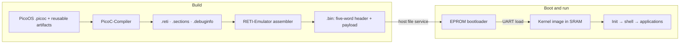
```mermaid
flowchart LR
 subgraph B["Build"]
 direction TB
 SRC["PicoOS .picoc + reusable artifacts"] --> C["PicoC-Compiler"]
 C --> META[".reti · .sections · .debuginfo"]
 META --> A["RETI-Emulator assembler"] --> BIN[".bin: five-word header + payload"]
 end
 subgraph R["Boot and run"]
 direction TB
 EP["EPROM bootloader"] -->|UART load| K["Kernel image in SRAM"]
 K --> I["Init → shell → applications"]
 end
 BIN -->|host file service| EP
```

</div><div class="tile-grid cols-3 stat-cards"><div class="card"><div class="tile-title">15</div><div class="tile-detail">userspace libraries</div></div><div class="card"><div class="tile-title">18</div><div class="tile-detail">user applications</div></div><div class="card"><div class="tile-title">37</div><div class="tile-detail">implemented syscalls</div></div></div>

</div>

---

<!-- SOURCE Pico-OS/README.md#build-and-run -->
<!-- SHORT_VERSION_DISABLED -->

# PicoOS

## Build and run (1)

<div class="deck-content">

<div class="code-panel shell-session shell-session-compact"><div class="shell-session-bar"><span>Host shell</span><span class="shell-session-caption">Ready-built runtime</span></div><pre class="slidev-code"><code><span class="shell-prompt">$</span> <span class="shell-command">curl -fLO https://github.com/matthejue/Pico-OS/releases/latest/download/pico-os-runtime.tar.gz</span>
<span class="shell-prompt">$</span> <span class="shell-command">mkdir pico-os-runtime</span>
<span class="shell-prompt">$</span> <span class="shell-command">tar -xzf pico-os-runtime.tar.gz -C pico-os-runtime</span>
<span class="shell-prompt">$</span> <span class="shell-command">cd pico-os-runtime</span>
<span class="shell-prompt">$</span> <span class="shell-command">./start-picoos.sh</span></code></pre></div><div class="tile-grid cols-3 "><div class="card"><div class="tile-title">Linux / Android</div><div class="tile-detail">Shell launcher; Android uses Termux.</div></div><div class="card"><div class="tile-title">Windows</div><div class="tile-detail">PowerShell: <code>./start-picoos.ps1</code></div></div><div class="card"><div class="tile-title">PicoOS /</div><div class="tile-detail">The extracted directory becomes the guest filesystem root.</div></div></div><p class="slide-note">Launchers offer compatible tools when missing, DMA selection, and the optional cheatsheet.</p>

</div>

---

<!-- SOURCE Pico-OS/README.md#build-and-run -->
<!-- SHORT_VERSION_DISABLED -->

# PicoOS

## Build and run (2)

<div class="deck-content">

<div class="data-table ">

| Behavior | Shell launcher | PowerShell |
| --- | --- | --- |
| Select emulator | `--reti-emulator PATH` | `-RetiEmulator PATH` |
| DMA loading | `--dma` / `-M` | `-Dma` / `-M` |
| Direct terminal | `--notui` / `-N` | `-NoTui` / `-N` |
| Help | `--help` / `-h` | `-Help` / `-h` |
| Emulator options | `-- EMULATOR_ARGS...` | `-- EMULATOR_ARGS...` |

</div><div class="code-panel shell-session shell-session-compact"><div class="shell-session-bar"><span>Host shell</span><span class="shell-session-caption">Example launch</span></div><pre class="slidev-code"><code><span class="shell-prompt">$</span> <span class="shell-command">./start-picoos.sh --dma --notui</span></code></pre></div>

</div>

---

<!-- SOURCE Pico-OS/README.md#use-the-picoos-shell -->
<!-- SHORT_VERSION_DISABLED -->

# PicoOS · Build and run

## Use the PicoOS shell

<div class="deck-content">

<div class="tile-grid cols-3 "><div class="card"><div class="tile-title">c + Enter</div><div class="tile-detail">Continue execution in the debugger.</div></div><div class="card"><div class="tile-title">V / Ctrl+]</div><div class="tile-detail">Raw UART terminal / return to debugger.</div></div><div class="card"><div class="tile-title">v / Escape</div><div class="tile-detail">Normal terminal / return to debugger.</div></div></div><div class="code-panel shell-session shell-session-compact"><div class="shell-session-bar"><span>PicoOS shell</span><span class="shell-session-caption">Use the PID reported by load</span></div><pre class="slidev-code"><code><span class="shell-prompt">PicoOS&gt;</span> <span class="shell-command">load user/echo.bin</span>
<span class="shell-output">process with pid 3 created</span>
<span class="shell-prompt">PicoOS&gt;</span> <span class="shell-command">run 3 hello PicoOS</span>
<span class="shell-output">hello PicoOS</span></code></pre></div><p class="slide-note"><code>load</code> leaves the process NEW; <code>run</code> prepares READY and waits for foreground completion.</p>

</div>

---

<!-- SOURCE Pico-OS/README.md#release-archive-layout -->
<!-- SHORT_VERSION_DISABLED -->

# PicoOS · Build and run

## Release archive layout

<div class="deck-content">

<div class="code-panel ">

```text {lines:false}
pico-os-runtime/                ← PicoOS /
├── start-picoos.sh / .ps1      launchers
├── download-tools.sh / .ps1   matching tools
├── boot/                     bootloader.reti
├── kernel/                   .bin · .sections · .debuginfo
├── system/                   init.bin
├── user/                     18 applications
├── config/                   environment · options · release
└── device/                   terminal.dev · null.dev
```

</div><p class="slide-note">The emulator starts in this directory. Host /tmp is not mounted; device markers contain no device data.</p>

</div>

---

<!-- SOURCE Pico-OS/README.md#intended-physical-hardware -->

# PicoOS

## Intended physical hardware

<div class="deck-content">

<div class="grid grid-cols-[.95fr_1.05fr] gap-5 mt-4">
  <div class="grid gap-3">
    <div class="card py-4">
      <div class="flex justify-between gap-4"><div><a href="https://www.digikey.de/short/8cmz0qnc" target="_blank"><b>Alchitry Cu V2 ↗</b></a><div class="muted text-xs mt-1">FPGA board · Lattice iCE40-HX8K · CPU, interrupt controller, UART controller, and SRAM interface</div></div><div class="mono text-lg accent whitespace-nowrap">€55.66</div></div>
    </div>
    <div class="card amber-border py-4">
      <div class="flex justify-between gap-4"><div><a href="https://www.digikey.de/short/075fh38w" target="_blank"><b>ISSI IS61WV25616 SRAM ↗</b></a><div class="muted text-xs mt-1">quantity 2 · each: 2<sup>18</sup> addressable cells × 16 bits</div></div><div class="mono text-lg amber whitespace-nowrap">2 × €5.80</div></div>
    </div>
    <div class="card py-4">
      <div class="flex justify-between gap-4"><div><a href="https://www.digikey.de/short/h83tqvbw" target="_blank"><b>SparkFun Serial Basic ↗</b></a><div class="muted text-xs mt-1">CH340C USB-C to UART adapter · 3.3 V serial host connection</div></div><div class="mono text-lg green whitespace-nowrap">€10.92</div></div>
    </div>
    <div class="flex justify-between px-2 text-sm"><b>Total including VAT</b><b class="mono">€78.18</b></div>
  </div>
  <div class="card amber-border py-4">
    <div class="text-center">
      <div class="mono text-sm">2 × (2<sup>18</sup> cells × 16 bits)</div>
      <div class="metric amber mt-2">2<sup>18</sup> × 32 bits</div>
      <div class="metric-label">262,144 addressable words = 1 MiB</div>
      <div class="muted text-xs mt-2">same 18 address lines · D[15:0] + D[31:16]</div>
    </div>
    <div class="memory-bar h-10 mt-4">
      <div class="memory-segment seg-text" style="width:31.3%">81,973 resident image words</div>
      <div class="memory-segment seg-process" style="width:68.7%">180,171 words remain</div>
    </div>
    <div class="grid grid-cols-3 gap-2 mt-3 text-center text-[10px] mono">
      <div class="chip justify-center"><span class="accent">kernel</span> 41,502</div>
      <div class="chip justify-center"><span class="amber">init</span> 10,824</div>
      <div class="chip justify-center"><span class="green">shell</span> 29,647</div>
    </div>
    <div class="text-center text-sm mt-3"><span class="accent mono">kernel + init + shell</span> + <span class="green mono">17 × cat.bin images</span></div>
  </div>
</div>

<div class="muted text-xs text-center mt-3">Conservative image-size comparison; each running process additionally needs heap and stack. README prices checked 12 August 2026. Cost excludes USB cables, wires, connectors, PCB, other interconnection hardware, and shipping.</div>

</div>

---

<!-- SOURCE Pico-OS/README.md#reti-execution-model -->
<!-- SHORT_VERSION_DISABLED -->

# PicoOS · Intended physical hardware

## RETI execution model

<div class="deck-content">

<div class="memory-visual zoomable"><div class="visual-label">32-bit word addresses · region size differs from installed capacity</div><div class="memory-bar"><div class="memory-segment seg-text" style="flex:1">EPROM<br>00</div><div class="memory-segment seg-data" style="flex:1">Periphery<br>01</div><div class="memory-segment seg-process" style="flex:2">SRAM<br>10 / 11</div></div></div><div class="data-table ">

| High bits | Address range | PicoOS use |
| --- | --- | --- |
| 00 | `0x00000000…0x3fffffff` | Bootloader |
| 01 | `0x40000000…0x7fffffff` | UART · interrupts · timer · boundary · DMA |
| 10 / 11 | `0x80000000…0xffffffff` | Kernel · process images · heaps · stacks |

</div><p class="slide-note">The proposed hardware installs 2¹⁸ SRAM words = 1 MiB; each address advances one 32-bit cell.</p>

</div>

---

<!-- SOURCE Pico-OS/README.md#11-picoc-compiler-extensions -->

# 1. Toolchain extensions for PicoOS

## 1.1 PicoC-Compiler extensions

<div class="deck-content">

<div class="compiler-showcase mt-4">
<div class="compiler-feature-map card text-xs leading-[1.45]">
    <div class="grid grid-cols-2 gap-x-5 gap-y-3">
      <div><span class="mono accent">preprocessing + syntax</span><div>includes · <span class="mono">#pragma once</span> · macros · <span class="mono">-I/-M</span></div><div>line splicing · mixed declarations</div><div>constant expressions</div></div>
      <div><span class="mono amber">types + aggregates</span><div>casts · <span class="mono">sizeof</span> · <span class="mono">void *</span> · pointer returns</div><div>scaled pointer arithmetic</div><div>repeat-safe structs · scoped aliases</div></div>
      <div><span class="mono green">data + expressions</span><div>inferred arrays · string storage / escapes</div><div>global initializers · postfix <span class="mono">++</span></div><div>member conditions · negated calls</div></div>
      <div><span class="mono accent">calls + ABI</span><div>function pointers · indirect calls · variadics</div><div>right-to-left arguments · System-V frames</div><div>shared epilogue</div></div>
      <div><span class="mono amber">low-level control</span><div><span class="mono">asm</span> · <span class="mono">debug;</span> · naked functions</div><div>linked labels · section attributes · IVTE</div><div>custom / generated <span class="mono">_start</span></div></div>
      <div><span class="mono green">compile, link, inspect</span><div>multi-file symbols · <span class="mono">-c</span> artifacts</div><div>symbol tables · dependency files</div><div><span class="mono">.ivt/.text/.data</span> · <span class="mono">.sections</span> · debug info · <span class="mono">-k</span></div></div>
    </div>
</div>

<div class="compiler-showcase-code">

```c {lines:false}
#include <stdio.header>
#include <stdlib.header>

#define N 3

int add(int a, int b) { return a + b; }
int main(void) {
  int v[] = {4, 5, 6}, i = 0;
  int (*op)(int, int) = add;
  int *h = (int *)malloc(N * sizeof(int));
  scanf(" %d", &h[i++]);
  h[1] = v[1]; h[2] = v[2];
  printf("%d %d %d", op(h[0], v[1]),
         sizeof("PicoOS\n"), *(h + N - 1));
  free(h);
  return 0;
}
```

</div>
</div>

</div>

---

<!-- SOURCE Pico-OS/README.md#111-compilation-pipeline-and-compiler-passes -->

# 1. Toolchain extensions for PicoOS · 1.1 PicoC-Compiler extensions

## 1.1.1 Compilation pipeline and compiler passes (1)

<div class="deck-content">

<div class="diagram-panel ">

<div class="visual-label">Original pipeline · README stages, arranged in columns</div>

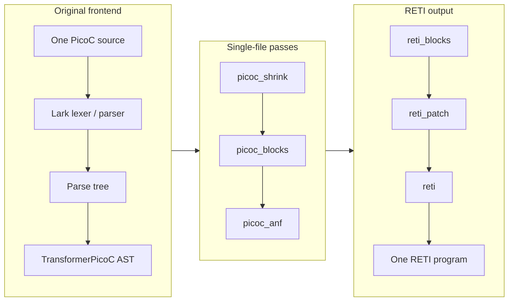
```mermaid
flowchart LR
 subgraph F["Original frontend"]
 direction TB
 S["One PicoC source"] --> L["Lark lexer / parser"] --> P["Parse tree"] --> A["TransformerPicoC AST"]
 end
 subgraph C["Single-file passes"]
 direction TB
 SH["picoc_shrink"] --> B["picoc_blocks"] --> AN["picoc_anf"]
 end
 subgraph R["RETI output"]
 direction TB
 RB["reti_blocks"] --> RP["reti_patch"] --> RE["reti"] --> O["One RETI program"]
 end
 F --> C --> R
```

</div>

</div>

---

<!-- SOURCE Pico-OS/README.md#111-compilation-pipeline-and-compiler-passes -->

# 1. Toolchain extensions for PicoOS · 1.1 PicoC-Compiler extensions

## 1.1.1 Compilation pipeline and compiler passes (2)

<div class="deck-content">

<div class="diagram-panel ">

<div class="visual-label">Extended pipeline · README stages, arranged in columns</div>

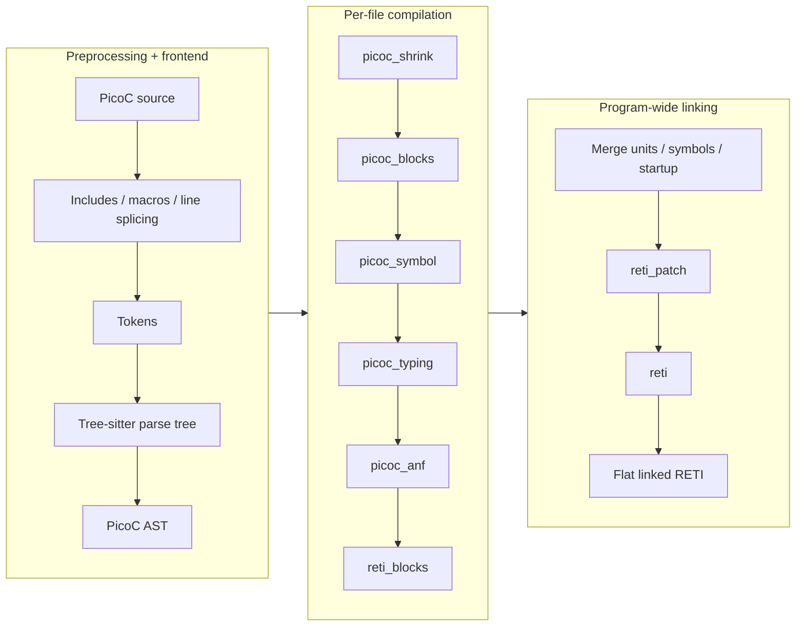
```mermaid
flowchart LR
 subgraph F["Preprocessing + frontend"]
 direction TB
 S["PicoC source"] --> P["Includes / macros / line splicing"] --> T["Tokens"] --> TS["Tree-sitter parse tree"] --> A["PicoC AST"]
 end
 subgraph C["Per-file compilation"]
 direction TB
 SH["picoc_shrink"] --> B["picoc_blocks"] --> SY["picoc_symbol"] --> TY["picoc_typing"] --> AN["picoc_anf"] --> RB["reti_blocks"]
 end
 subgraph L["Program-wide linking"]
 direction TB
 M["Merge units / symbols / startup"] --> RP["reti_patch"] --> R["reti"] --> O["Flat linked RETI"]
 end
 F --> C --> L
```

</div>

</div>

---

<!-- SOURCE Pico-OS/README.md#112-separate-compilation-reusable-artifacts-and-linking -->

# 1. Toolchain extensions for PicoOS · 1.1 PicoC-Compiler extensions

## 1.1.2 Separate compilation, reusable artifacts, and linking (1)

<div class="deck-content">

<div class="content-columns columns-2">

<div>

<div class="diagram-panel">

<div class="visual-label">Conventional C</div>

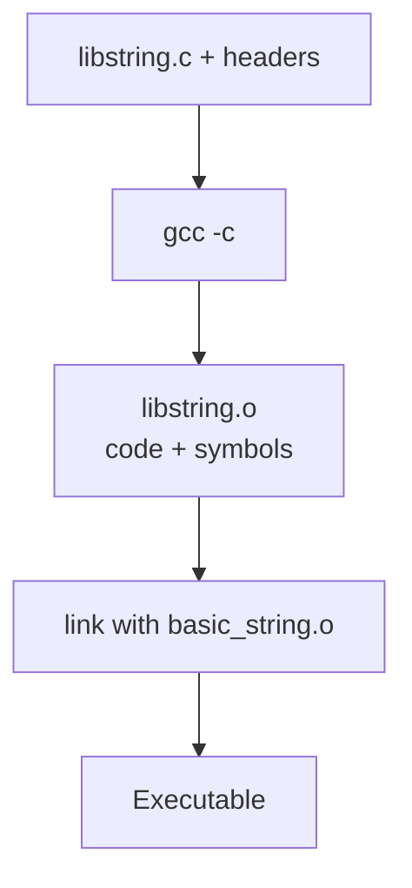
```mermaid
flowchart TB
 S["libstring.c + headers"] --> C["gcc -c"] --> O["libstring.o
code + symbols"]
 O --> L["link with basic_string.o"] --> E["Executable"]
```

</div>

</div>

<div>

<div class="diagram-panel">

<div class="visual-label">PicoC</div>

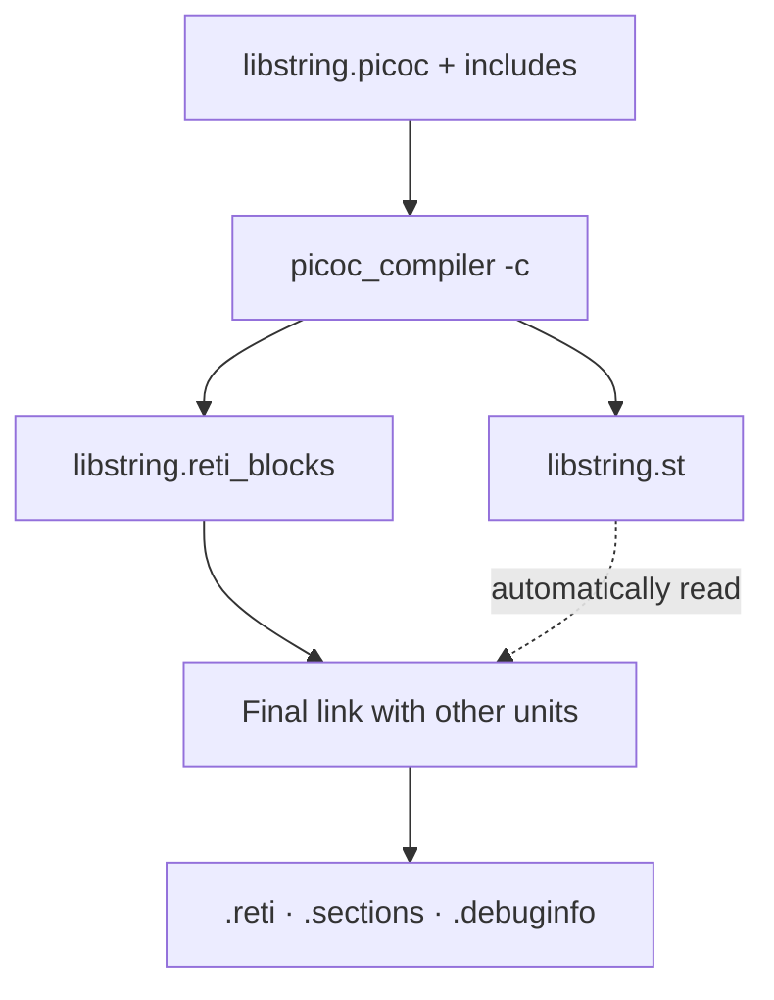
```mermaid
flowchart TB
 S["libstring.picoc + includes"] --> C["picoc_compiler -c"]
 C --> R["libstring.reti_blocks"]
 C --> T["libstring.st"]
 R --> L["Final link with other units"]
 T -. automatically read .-> L
 L --> E[".reti · .sections · .debuginfo"]
```

</div>

</div>

</div><p class="slide-note">Keep each .reti_blocks file beside its matching .st. Source/header hashes and options govern artifact reuse.</p>

</div>

---

<!-- SOURCE Pico-OS/README.md#112-separate-compilation-reusable-artifacts-and-linking -->

# 1. Toolchain extensions for PicoOS · 1.1 PicoC-Compiler extensions

## 1.1.2 Separate compilation, reusable artifacts, and linking (2)

<div class="deck-content">

<div class="code-panel shell-session shell-session-compact"><div class="shell-session-bar"><span>Host shell</span><span class="shell-session-caption">README library-test example</span></div><pre class="slidev-code"><code><span class="shell-prompt">$</span> <span class="shell-command">picoc_compiler -c -O1 library/string/libstring.picoc test/basic_string.picoc \</span>
<span class="shell-output">    library/stdlib/libstdlib.picoc library/stdio/libstdio.picoc</span>
<span class="shell-prompt">$</span> <span class="shell-command">ls -1 library/string/libstring.{reti_blocks,st}</span>
<span class="shell-output">library/string/libstring.reti_blocks</span>
<span class="shell-output">library/string/libstring.st</span>
<span class="shell-prompt">$</span> <span class="shell-command">picoc_compiler -O1 -o binary/basic_string.reti test/basic_string.reti_blocks \</span>
<span class="shell-output">    library/string/libstring.reti_blocks library/stdlib/libstdlib.reti_blocks \</span>
<span class="shell-output">    library/stdio/libstdio.reti_blocks</span></code></pre></div><p class="slide-note">Compile-only mode preserves reusable code and symbols. Only the final link fixes the complete image layout.</p>

</div>

---

<!-- SOURCE Pico-OS/README.md#1131-stack-frame-layout-and-caller-cleanup -->

# 1. Toolchain extensions for PicoOS · 1.1 PicoC-Compiler extensions · 1.1.3 System V ABI stack frames and call cleanup

## 1.1.3.1 Stack-frame layout and caller cleanup

<div class="deck-content">

<div class="content-columns columns-2">

<div>

<div class="stack-diagram zoomable"><div class="stack-row"><code>BAF + 4</code><span>arg2</span></div><div class="stack-row"><code>BAF + 3</code><span>arg1</span></div><div class="stack-row"><code>BAF + 2</code><span>Return address → caller continuation</span></div><div class="stack-row"><code>BAF + 1</code><span>Saved caller BAF</span></div><div class="stack-row"><code>BAF</code><span>First local</span></div><div class="stack-row"><code>BAF − 1 …</code><span>Further locals / temporaries</span></div><div class="stack-row"><code>SP</code><span>Free cell below occupied stack</span></div></div>

</div>

<div>

<div class="tile-grid cols-1 "><div class="card"><div class="tile-title">Caller</div><div class="tile-detail">Push arg2, then arg1, then continuation; remove argument cells after return.</div></div><div class="card"><div class="tile-title">Callee</div><div class="tile-detail">Save / restore BAF; preserve the return value in IN2.</div></div><div class="card"><div class="tile-title">Variadic calls</div><div class="tile-detail">printf starts at BAF + 4; fprintf at BAF + 5.</div></div></div>

</div>

</div><p class="slide-note">Stack grows toward lower addresses. This adapts the System V model to RETI; it does not implement the AMD64 ABI.</p>

</div>

---

<!-- SOURCE Pico-OS/README.md#1132-shared-function-epilogue-and-return-values -->

# 1. Toolchain extensions for PicoOS · 1.1 PicoC-Compiler extensions · 1.1.3 System V ABI stack frames and call cleanup

## 1.1.3.2 Shared function epilogue and return values (1)

<div class="deck-content">

<div class="code-panel ">

<div class="visual-label">Source example</div>

```c {lines:false}
int add_one(int value) {
    return value + 1;
}

int main(void) {
    return add_one(41);
}
```

</div><div class="diagram-panel">

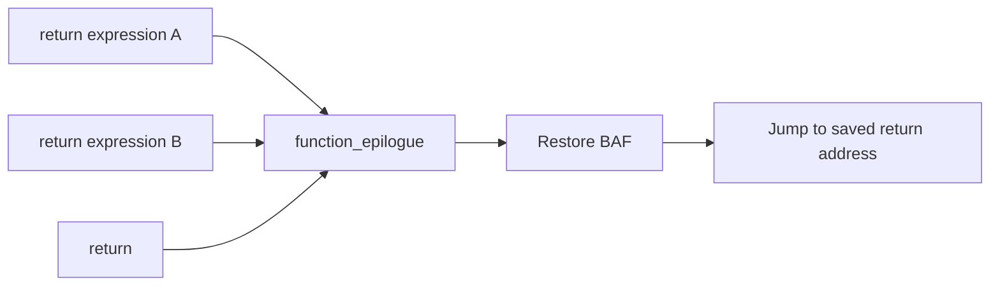
```mermaid
flowchart LR
    return_a["return expression A"] --> epilogue["function_epilogue"]
    return_b["return expression B"] --> epilogue
    return_void["return"] --> epilogue
    epilogue --> restore["Restore BAF"]
    restore --> caller["Jump to saved return address"]
```

</div><p class="slide-note">Each return writes IN2 and converges on one epilogue. ACC remains available for long jumps.</p>

</div>

---

<!-- SOURCE Pico-OS/README.md#1132-shared-function-epilogue-and-return-values -->

# 1. Toolchain extensions for PicoOS · 1.1 PicoC-Compiler extensions · 1.1.3 System V ABI stack frames and call cleanup

## 1.1.3.2 Shared function epilogue and return values (2)

<div class="deck-content">

<div class="content-columns columns-2">

<div>

<div class="code-panel ">

<div class="visual-label">Callee: restore frame and return</div>

```text {lines:false}
add_one_epilogue:
  MOVE BAF SP
  POP BAF
  POP IN1
  MOVE IN1 PC
```

</div>

</div>

<div>

<div class="code-panel ">

<div class="visual-label">Caller: discard one argument</div>

```text {lines:false}
main_cont.3:
  ADDI SP 1
  PUSH IN2
  POP IN2
  JUMP32 main_epilogue
```

</div>

</div>

</div><div class="code-panel shell-session shell-session-compact"><div class="shell-session-bar"><span>Host shell</span><span class="shell-session-caption">Inspect .picoc_anf and .reti_blocks</span></div><pre class="slidev-code"><code><span class="shell-prompt">$</span> <span class="shell-command">picoc_compiler -c -O1 -v -w normal-function.picoc</span></code></pre></div><p class="slide-note">IN2 survives both cleanup steps: <code>add_one(41)</code> returns 42. Excerpts omit unrelated lowering instructions.</p>

</div>

---

<!-- SOURCE Pico-OS/README.md#1133-naked-functions-without-a-generated-frame -->

# 1. Toolchain extensions for PicoOS · 1.1 PicoC-Compiler extensions · 1.1.3 System V ABI stack frames and call cleanup

## 1.1.3.3 Naked functions without a generated frame

<div class="deck-content">

<div class="content-columns columns-2">

<div>

<div class="code-panel code-medium">

<div class="visual-label">Naked source example</div>

```c {lines:false}
__attribute__((naked))
int constant(void) {
    asm("LOADI IN2 7");
    asm("LOADIN SP ACC 1");
    asm("ADDI SP 1");
    asm("MOVE ACC PC");
}

int main(void) {
    return constant();
}
```

</div>

</div>

<div>

<div class="code-panel ">

<div class="visual-label">Complete emitted naked block</div>

```text {lines:false}
constant:
  LOADI IN2 7
  LOADIN SP ACC 1
  ADDI SP 1
  MOVE ACC PC
```

</div>

</div>

</div><p class="slide-note">No generated prologue or epilogue. Naked functions supply their own setup and control transfer; ordinary main still gets its normal frame.</p>

</div>

---

<!-- SOURCE Pico-OS/README.md#114-placing-globals-in-ivt-with-sectionivt -->

# 1. Toolchain extensions for PicoOS · 1.1 PicoC-Compiler extensions

## 1.1.4 Placing globals in `.ivt` with `section("ivt")`

<div class="deck-content">

<div class="content-columns columns-2">

<div>

<div class="code-panel code-medium">

<div class="visual-label">Same handler, two tables</div>

```c {lines:false}
void handler(void);

__attribute__((section("ivt")))
void (*ivt_table[1])(void) = {handler};

void (*ordinary_table[1])(void) = {handler};

void handler(void) {
}

int main(void) {
    return 0;
}
```

</div>

</div>

<div>

<div class="code-panel ">

<div class="visual-label">Section placement · excerpt</div>

```text {lines:false}
.ivt
ivt_table:
  IVTE handler
.text
handler:
  # ordinary function body
.data
ordinary_table:
  IVTE handler
```

</div>

</div>

</div><p class="slide-note">With -O1, both entries become <code>0x80000014</code> for handler offset 20. IVTE assumes an image at the SRAM base; it does not relocate an arbitrary process image.</p>

</div>

---

<!-- SOURCE Pico-OS/README.md#1151-default-compiler-generated-_start -->

# 1. Toolchain extensions for PicoOS · 1.1 PicoC-Compiler extensions · 1.1.5 Selecting a startup function with `-C` / `--startup-source`

## 1.1.5.1 Default compiler-generated `_start`

<div class="deck-content">

<div class="code-panel ">

<div class="visual-label">Source-equivalent compiler entry</div>

```c {lines:false}
void _start(void) {
    main();
    Exit(0);
}
```

</div><div class="step-flow zoomable"><div class="card">Remaining global initializers</div><span class="flow-arrow">→</span><div class="card">main()</div><span class="flow-arrow">→</span><div class="card">LOADI ACC 0<br>JUMP 0</div></div><p class="slide-note">A linked program with main receives this entry when no custom _start is supplied. Exit is a compiler-internal operation.</p>

</div>

---

<!-- SOURCE Pico-OS/README.md#1152-picoos-libstart-startup-sequence -->

# 1. Toolchain extensions for PicoOS · 1.1 PicoC-Compiler extensions · 1.1.5 Selecting a startup function with `-C` / `--startup-source`

## 1.1.5.2 PicoOS `libstart` startup sequence

<div class="deck-content">

<div class="code-panel ">

<div class="visual-label">-C library/start/libstart.picoc</div>

```c {lines:false}
void start_process(int argc, char **argv) {
    init_process_heap();
    initialize_environment(argv + argc + 1);
    exit(main(argc, argv));
}

__attribute__((naked))
void _start(int argc, char *first_argument) {
    start_process(argc, (char **)&first_argument);
}
```

</div><p class="slide-note">libstart depends on libstdlib. The naked entry reads the kernel-built stack; each image initializes its own heap and environment.</p>

</div>

---

<!-- SOURCE Pico-OS/README.md#1153-startup-functions-used-by-picoos-images -->

# 1. Toolchain extensions for PicoOS · 1.1 PicoC-Compiler extensions · 1.1.5 Selecting a startup function with `-C` / `--startup-source`

## 1.1.5.3 Startup functions used by PicoOS images

<div class="deck-content">

<div class="timeline zoomable" style="grid-template-columns:repeat(4,1fr)"><div class="timeline-step"><b>Kernel-built stack</b><div>argc · argv · envp</div></div><div class="timeline-step"><b>naked _start</b><div>Keep the initial frame intact</div></div><div class="timeline-step"><b>heap + environment</b><div>Prepare per-process runtime state</div></div><div class="timeline-step"><b>main → exit</b><div>Return value → syscall</div></div></div>

<div class="data-table">

| Image | `_start` | Handoff |
| --- | --- | --- |
| EPROM bootloader | Own naked definition · no `-C` | `boot_main()` |
| SRAM kernel | Generated default · no `-C` | Kernel `main()` |
| Init process | `libstart` via `-C` | Init `main()` |
| Shell | `libstart` via `-C` | Shell `main()` |
| Other applications | `libstart` via common link rule | Application `main()` |

</div>

</div>

---

<!-- SOURCE Pico-OS/README.md#116-program-sections-interrupt-table-entries-and-linker-placement -->

# 1. Toolchain extensions for PicoOS · 1.1 PicoC-Compiler extensions

## 1.1.6 Program sections, interrupt table entries, and linker placement (1)

<div class="deck-content">

<div class="memory-visual zoomable"><div class="visual-label">Final flat RETI image · low offset → high offset</div><div class="memory-bar"><div class="memory-segment seg-ivt" style="flex:1">.ivt · offset 0</div><div class="memory-segment seg-text" style="flex:3">.text · CS / PC</div><div class="memory-segment seg-data" style="flex:1.4">.data · DS</div></div></div>

<div class="tile-grid cols-3 "><div class="card"><div class="tile-title">.ivt</div><div class="tile-detail">Explicit section attribute · vector words and optional low-level code · CS-relative data</div></div><div class="card"><div class="tile-title">.text</div><div class="tile-detail">Default for _start and ordinary functions · CS-relative instructions</div></div><div class="card"><div class="tile-title">.data</div><div class="tile-detail">Default for global and static storage · DS-relative data</div></div></div>

<div class="step-flow zoomable"><div class="card">-O1 known scalars · strings · structs · arrays · function pointers</div><span class="flow-arrow">→</span><div class="card">Emit words directly into .data or attributed .ivt</div><span class="flow-arrow">→</span><div class="card">Load kernel payload</div><span class="flow-arrow">→</span><div class="card">Vector table ready before _start</div></div>

</div>

---

<!-- SOURCE Pico-OS/README.md#116-program-sections-interrupt-table-entries-and-linker-placement -->

# 1. Toolchain extensions for PicoOS · 1.1 PicoC-Compiler extensions

## 1.1.6 Program sections, interrupt table entries, and linker placement (2)

<div class="deck-content">

<div class="code-panel ">

<div class="visual-label">Kernel table placed at image offset 0</div>

```c {lines:false}
__attribute__((section("ivt")))
void (*interrupt_vector_table[OS_INTERRUPT_VECTOR_COUNT])(void) = {
    syscall_interrupt,
    timer_interrupt,
    uart_interrupt,
    cpu_exception_interrupt,
    dma_interrupt
};
```

</div><p class="slide-note">Known pointer initializers become IVTE words in .ivt before startup. The linker orders .ivt → .text → .data.</p>

</div>

---

<!-- SOURCE Pico-OS/README.md#117-reti-pseudoinstructions -->

# 1. Toolchain extensions for PicoOS · 1.1 PicoC-Compiler extensions

## 1.1.7 RETI pseudoinstructions

<div class="deck-content">

<div class="data-table">

| Pseudoinstruction | Purpose | Concrete size |
| --- | --- | --- |
| `PUSH reg` | Reserve + store | 2 |
| `POP reg` | Load + release | 2 |
| `LOADI32 reg operand` | 32-bit literal or linked symbol | 3 |
| `JUMP32[relation] target` | Long branch | 4–6 |

</div><p class="slide-note">Hardware immediates and ordinary relative jumps use 22-bit fields. Conditions compare ACC directly.</p>

</div>

---

<!-- SOURCE Pico-OS/README.md#1171-interrupt-safe-push-and-pop -->

# 1. Toolchain extensions for PicoOS · 1.1 PicoC-Compiler extensions · 1.1.7 RETI pseudoinstructions

## 1.1.7.1 Interrupt-safe `PUSH` and `POP`

<div class="deck-content">

<div class="content-columns columns-2">

<div>

<div class="code-panel ">

<div class="visual-label">PUSH ACC</div>

```text {lines:false}
SUBI SP 1
STOREIN SP ACC 1
```

</div>

</div>

<div>

<div class="code-panel ">

<div class="visual-label">POP ACC</div>

```text {lines:false}
LOADIN SP ACC 1
ADDI SP 1
```

</div>

</div>

</div><div class="code-panel ">

<div class="visual-label">ISR register preservation</div>

```c {lines:false}
asm("PUSH ACC");
asm("PUSH IN1");
/* Handle the interrupt */
asm("POP IN1");
asm("POP ACC");
```

</div><p class="slide-note">An interrupt can arrive between either pair: reserve before writing; release after reading.</p>

</div>

---

<!-- SOURCE Pico-OS/README.md#1172-loading-32-bit-values-with-loadi32 -->

# 1. Toolchain extensions for PicoOS · 1.1 PicoC-Compiler extensions · 1.1.7 RETI pseudoinstructions

## 1.1.7.2 Loading 32-bit values with `LOADI32`

<div class="deck-content">

<div class="content-columns columns-2">

<div>

<div class="code-panel ">

<div class="visual-label">Signed upper 22 bits + lower 10 bits</div>

```text {lines:false}
LOADI reg signed_upper
MULTI reg 1024
ORI reg lower_bits
```

</div>

</div>

<div>

<div class="code-panel ">

<div class="visual-label">Concrete 32-bit value</div>

```text {lines:false}
# 0x80000005
LOADI ACC -2097152
MULTI ACC 1024
ORI ACC 5
```

</div>

</div>

</div><div class="memory-visual zoomable"><div class="visual-label">LOADI sign-extends; × 1024 shifts left; ORI fills the low bits</div><div class="memory-bar"><div class="memory-segment seg-text" style="flex:2.2">b₃₁ … b₁₀<br>signed 22-bit field</div><div class="memory-segment seg-data" style="flex:1">b₉ … b₀<br>low ten bits</div></div></div><p class="slide-note">When upper bit 21 is set, subtract 2²² before LOADI. The assembler rejects unsigned 2097152; signed_upper × 1024 stays in int32 range.</p>

</div>

---

<!-- SOURCE Pico-OS/README.md#1173-long-jumps-with-jump32 -->

# 1. Toolchain extensions for PicoOS · 1.1 PicoC-Compiler extensions · 1.1.7 RETI pseudoinstructions

## 1.1.7.3 Long jumps with `JUMP32`

<div class="deck-content">

<div class="code-panel ">

<div class="visual-label">Symbolic target expansion</div>

```text {lines:false}
LOADI ACC signed_upper
MULTI ACC 1024
ORI ACC lower_bits
ADD ACC CS
MOVE ACC PC
```

</div><div class="tile-grid cols-3 "><div class="card"><div class="tile-title">Numeric target</div><div class="tile-detail">Absolute address; omit ADD ACC CS</div></div><div class="card"><div class="tile-title">Conditional target</div><div class="tile-detail">Opposite short branch skips the long sequence</div></div><div class="card"><div class="tile-title">Register convention</div><div class="tile-detail">Taken jump uses ACC; result stays in IN2</div></div></div>

</div>

---

<!-- SOURCE Pico-OS/README.md#1174-pseudoinstruction-expansion-during-linking -->

# 1. Toolchain extensions for PicoOS · 1.1 PicoC-Compiler extensions · 1.1.7 RETI pseudoinstructions

## 1.1.7.4 Pseudoinstruction expansion during linking

<div class="deck-content">

<div class="timeline zoomable" style="grid-template-columns:repeat(2,1fr)"><div class="timeline-step"><b>reti_patch</b><div>Expand PUSH / POP; remove fall-through jumps; count expanded sizes.</div></div><div class="timeline-step"><b>reti</b><div>Resolve labels, then expand LOADI32 / JUMP32.</div></div></div><div class="memory-visual zoomable"><div class="visual-label">README block example · expanded instruction counts</div><div class="memory-bar"><div class="memory-segment seg-text" style="flex:10">entry · offset 0<br>2 + 3 + 5 = 10</div><div class="memory-segment seg-data" style="flex:7">work · offset 10<br>2 + 2 + 3 = 7</div><div class="memory-segment seg-heap" style="flex:5">done · offset 17<br>POP BAF = 2</div></div></div><p class="slide-note">The target is CS + 17. Counting each pseudoinstruction as one word would incorrectly place done at 6.</p>

</div>

---

<!-- SOURCE Pico-OS/README.md#118-linked-sections-metadata-and-the-five-word-binary-header -->

# 1. Toolchain extensions for PicoOS · 1.1 PicoC-Compiler extensions

## 1.1.8 Linked `.sections` metadata and the five-word binary header (1)

<div class="deck-content">

<div class="content-columns columns-2">

<div>

<div class="code-panel ">

<div class="visual-label">.sections</div>

```json {lines:false}
{
  "codesegment_start": 0,
  "datasegment_start": 11595,
  "heap_start": 11621,
  "heap_size": 2000,
  "stack_start": 14621
}
```

</div>

</div>

<div>

<div class="stack-diagram zoomable"><div class="stack-row"><code>word 0</code><span>code start → CS</span></div><div class="stack-row"><code>word 1</code><span>data start → DS</span></div><div class="stack-row"><code>word 2</code><span>heap start</span></div><div class="stack-row"><code>word 3</code><span>heap size · −1 = default</span></div><div class="stack-row"><code>word 4</code><span>stack start · −1 = default</span></div></div>

</div>

</div><div class="memory-visual zoomable"><div class="visual-label">Low address → high address · schematic, not to scale</div><div class="memory-bar"><div class="memory-segment seg-ivt" style="flex:1">5 header words</div><div class="memory-segment seg-text" style="flex:3">encoded .text</div><div class="memory-segment seg-data" style="flex:1">encoded .data</div></div></div><p class="slide-note">Header values are RETI cells; encoded words are big-endian. Loaders copy only the payload.</p>

</div>

---

<!-- SOURCE Pico-OS/README.md#118-linked-sections-metadata-and-the-five-word-binary-header -->

# 1. Toolchain extensions for PicoOS · 1.1 PicoC-Compiler extensions

## 1.1.8 Linked `.sections` metadata and the five-word binary header (2)

<div class="deck-content">

<div class="code-panel shell-session shell-session-compact">
<div class="shell-session-bar"><span>Host shell</span><span class="shell-session-caption">assemble · inspect · header</span></div>
<pre class="slidev-code"><code><span class="shell-prompt">$</span> <span class="shell-command">reti_emulator</span> <span class="shell-operator">-a</span> program.reti
<span class="shell-prompt">$</span> <span class="shell-command">hexyl</span> <span class="shell-operator">-n</span> <span class="shell-output">20</span> program.bin
<span class="shell-output">┌────────┬─────────────────────────┬─────────────────────────┬────────┬────────┐</span>
<span class="shell-output">│00000000│ 00 00 00 00 00 00 2d 4b ┊ 00 00 2d 65 00 00 07 d0 │......-K┊..-e....│</span>
<span class="shell-output">│00000010│ 00 00 39 1d             ┊                         │..9.    ┊        │</span>
<span class="shell-output">└────────┴─────────────────────────┴─────────────────────────┴────────┴────────┘</span></code></pre>
</div><div class="tile-grid cols-3 "><div class="card"><div class="tile-title">Compile only: -c</div><div class="tile-detail">.reti_blocks + .st; no complete layout yet</div></div><div class="card"><div class="tile-title">Assemble: -a</div><div class="tile-detail">Matching .sections found automatically</div></div><div class="card"><div class="tile-title">Boot debugger: -S</div><div class="tile-detail">Kernel layout while EPROM is executing</div></div></div>

</div>

---

<!-- SOURCE Pico-OS/README.md#119-generated-memory-constants-for-the-bootloader-and-kernel -->

# 1. Toolchain extensions for PicoOS · 1.1 PicoC-Compiler extensions

## 1.1.9 Generated memory constants for the bootloader and kernel (1)

<div class="deck-content">

<div class="memory-visual zoomable"><div class="visual-label">Low address → high address · schematic, not to scale</div><div class="memory-bar"><div class="memory-segment seg-ivt" style="flex:0.6">.ivt</div><div class="memory-segment seg-text" style="flex:2.5">kernel .text · CS</div><div class="memory-segment seg-data" style="flex:1">.data · DS</div><div class="memory-segment seg-heap" style="flex:1.3">heap · 4096</div><div class="memory-segment seg-stack" style="flex:1">stack</div><div class="memory-segment seg-process" style="flex:1.4">process / shared data</div></div></div><div class="content-columns columns-2">

<div>

<div class="tile-grid cols-1 "><div class="card"><div class="tile-title">-k sram</div><div class="tile-detail">Kernel CS / DS / SP · heap · Process and Shared Data Heap · SRAM maximum</div></div><div class="card"><div class="tile-title">-k eprom</div><div class="tile-detail">Bootloader DS · temporary SRAM-top stack</div></div></div>

</div>

<div>

<div class="stack-diagram zoomable"><div class="stack-row"><code>KERNEL_HEAP_START</code><span>First kernel allocator cell</span></div><div class="stack-row"><code>KERNEL_HEAP_SIZE</code><span>4096 cells</span></div><div class="stack-row"><code>PROCESS_MEMORY_START</code><span>After kernel stack</span></div><div class="stack-row"><code>SRAM_MAX_ADDRESS_IN_MEMORY_MAP</code><span>Inclusive final SRAM cell</span></div></div>

</div>

</div><p class="slide-note">Compile-time interfaces derived from the linked layout; .sections retains relative offsets.</p>

</div>

---

<!-- SOURCE Pico-OS/README.md#119-generated-memory-constants-for-the-bootloader-and-kernel -->

# 1. Toolchain extensions for PicoOS · 1.1 PicoC-Compiler extensions

## 1.1.9 Generated memory constants for the bootloader and kernel (2)

<div class="deck-content">

<div class="data-table ">

| Constant | Current SRAM offset / value | Use |
| --- | --- | --- |
| `KERNEL_CS_START_ASM` | 5 | Install kernel code segment |
| `KERNEL_DS_START_ASM` | 40766 | Install kernel globals |
| `KERNEL_HEAP_START` | 41497 | First kernel heap header |
| `KERNEL_HEAP_SIZE` | 4096 cells | Boundary at 45592 |
| `KERNEL_SP_START_ASM` | 48308 | Initial kernel stack |
| `PROCESS_MEMORY_START` | 48309 | Outer heap begins |

</div><p class="slide-note">Add SRAM_BASE = 0x80000000 for absolute addresses. Generated headers and .sections must come from the same linked image.</p>

</div>

---

<!-- SOURCE Pico-OS/README.md#12-reti-emulator-extensions -->

# 1. Toolchain extensions for PicoOS

## 1.2 RETI-Emulator extensions

<div class="deck-content">

<div class="tile-grid cols-3 "><div class="card"><div class="tile-title">Execute</div><div class="tile-detail">EPROM boot · tagged SRAM · live segments</div></div><div class="card"><div class="tile-title">Assemble</div><div class="tile-detail">Five-word headers from .sections</div></div><div class="card"><div class="tile-title">Interrupt</div><div class="tile-detail">Mappings · priorities · timer · exceptions</div></div><div class="card"><div class="tile-title">Transfer</div><div class="tile-detail">Raw UART · host protocol · optional DMA</div></div><div class="card"><div class="tile-title">Inspect</div><div class="tile-detail">Source frames · memory editing · manual interrupts</div></div><div class="card"><div class="tile-title">Repeat</div><div class="tile-detail">Snapshots · restore · restart · isolated assembly</div></div></div>

</div>

---

<!-- SOURCE Pico-OS/README.md#121-reti-machine-model-and-memory-mapped-peripherals -->

# 1. Toolchain extensions for PicoOS · 1.2 RETI-Emulator extensions

## 1.2.1 RETI machine model and memory-mapped peripherals (1)

<div class="deck-content">

<div class="data-table">

| Offset | Register group | Purpose |
| --- | --- | --- |
| 0–2 | UART | Send · receive · status bits |
| 3–5 / 6–8 | Interrupts | Device vectors / priorities |
| 9 | Timer | Instruction period; zero disables |
| 10 | Stack boundary | Inclusive lower stack limit |
| 11 | Exception cause | Divide by zero · overflow · illegal instruction |
| 12–16 | DMA | Active · source · destination · count · control |

</div><p class="slide-note">Periphery address = 0x40000000 + offset. The dispatcher rewrites cell 10 for the selected PCB.</p>

</div>

---

<!-- SOURCE Pico-OS/README.md#121-reti-machine-model-and-memory-mapped-peripherals -->

# 1. Toolchain extensions for PicoOS · 1.2 RETI-Emulator extensions

## 1.2.1 RETI machine model and memory-mapped peripherals (2)

<div class="deck-content">

<div class="stack-diagram zoomable"><div class="stack-row"><code>12</code><span>DMA active: 1 enables offsets 13–16</span></div><div class="stack-row"><code>13</code><span>Source: absolute UART receive address</span></div><div class="stack-row"><code>14</code><span>Destination: absolute SRAM address</span></div><div class="stack-row"><code>15</code><span>Complete 32-bit word count</span></div><div class="stack-row"><code>16</code><span>0 idle · 1 start/busy · 2 complete · 3 error</span></div></div><div class="step-flow zoomable"><div class="card">Configure source / destination / count</div><span class="flow-arrow">→</span><div class="card">Start DMA</div><span class="flow-arrow">→</span><div class="card">Vector 4 completes scheduled loads</div></div>

</div>

---

<!-- SOURCE Pico-OS/README.md#122-atomic-test-and-set-with-tsl -->

# 1. Toolchain extensions for PicoOS · 1.2 RETI-Emulator extensions

## 1.2.2 Atomic test-and-set with `TSL` (1)

<div class="deck-content">

<div class="code-panel ">

```text {lines:false}
# Before: M[DS + 2] = 0
TSL DS ACC 2
# After: ACC = 0 and M[DS + 2] = 1
```

</div><div class="memory-visual zoomable"><div class="visual-label">Adjacent 32-bit cells · ACC receives the exact previous target word</div><div class="memory-bar"><div class="memory-segment seg-gap" style="flex:1">DS + 0<br>unchanged</div><div class="memory-segment seg-gap" style="flex:1">DS + 1<br>unchanged</div><div class="memory-segment seg-data" style="flex:1">DS + 2<br>0 → 1</div><div class="memory-segment seg-gap" style="flex:1">DS + 3<br>unchanged</div></div></div><div class="tile-grid cols-3 "><div class="card"><div class="tile-title">One atomic operation</div><div class="tile-detail">No interrupt between reading the old value and storing 1.</div></div><div class="card"><div class="tile-title">Address first</div><div class="tile-detail">Saving S + i permits S and D to be the same register.</div></div><div class="card"><div class="tile-title">Mutex use</div><div class="tile-detail">Old 0 acquires; old 1 contends and may sleep.</div></div></div>

</div>

---

<!-- SOURCE Pico-OS/README.md#122-atomic-test-and-set-with-tsl -->

# 1. Toolchain extensions for PicoOS · 1.2 RETI-Emulator extensions

## 1.2.2 Atomic test-and-set with `TSL` (2)

<div class="deck-content">

<div class="memory-visual zoomable"><div class="visual-label">TSL DS ACC 2 → 0xAEC00002 · instruction fields</div><div class="memory-bar"><div class="memory-segment seg-text" style="flex:2">type<br>10</div><div class="memory-segment seg-data" style="flex:2">mode<br>10</div><div class="memory-segment seg-heap" style="flex:3">S = DS<br>111</div><div class="memory-segment seg-process" style="flex:3">D = ACC<br>011</div><div class="memory-segment seg-gap" style="flex:12">signed i = +2<br>22 bits</div></div></div><div class="data-table ">

| Mode | Instruction | Meaning |
| --- | --- | --- |
| 00 | `STORE S i` | Store at DS-completed direct address |
| 01 | `STOREIN D S i` | Store S at D + i |
| 10 | `TSL S D i` | Read M[S + i] into D; store 1 there |
| 11 | `MOVE S D` | Copy register S to D |

</div>

</div>

---

<!-- SOURCE Pico-OS/README.md#123-uart-host-service-protocol -->

# 1. Toolchain extensions for PicoOS · 1.2 RETI-Emulator extensions

## 1.2.3 UART host-service protocol (1)

<div class="deck-content">

<div class="diagram-panel">

<div class="visual-label">Proposed physical hardware</div>

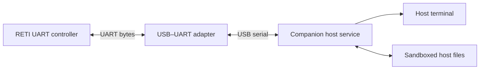
```mermaid
flowchart LR
 P["RETI UART controller"] <-->|UART bytes| A["USB–UART adapter"]
 A <-->|USB serial| H["Companion host service"]
 H --> T["Host terminal"]
 H <--> F["Sandboxed host files"]
```

</div><div class="diagram-panel">

<div class="visual-label">Development in RETI-Emulator</div>

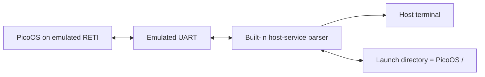
```mermaid
flowchart LR
 P["PicoOS on emulated RETI"] <--> U["Emulated UART"] <--> H["Built-in host-service parser"]
 H --> T["Host terminal"]
 H <--> F["Launch directory = PicoOS /"]
```

</div><p class="slide-note">The protocol carries bytes in both setups. The physical hardware setup has not yet been used.</p>

</div>

---

<!-- SOURCE Pico-OS/README.md#123-uart-host-service-protocol -->

# 1. Toolchain extensions for PicoOS · 1.2 RETI-Emulator extensions

## 1.2.3 UART host-service protocol (2)

<div class="deck-content">

<div class="code-panel ">

<div class="visual-label">ESC is byte 27</div>

```text {lines:false}
<ESC>operation arguments<ESC>/
```

</div><div class="tile-grid cols-2 "><div class="card"><div class="tile-title">Images</div><div class="tile-detail">load · file-size · read-range</div></div><div class="card"><div class="tile-title">Output</div><div class="tile-detail">write · write-at · literal-output · stdout / stderr</div></div><div class="card"><div class="tile-title">Inspect paths</div><div class="tile-detail">pwd · is-directory · ls</div></div><div class="card"><div class="tile-title">Change files</div><div class="tile-detail">mkdir · unlink · rmdir · move · touch</div></div></div><p class="slide-note">literal-output protects binary ESC bytes. Responses use big-endian values and bounded byte payloads.</p>

</div>

---

<!-- SOURCE Pico-OS/README.md#123-uart-host-service-protocol -->

# 1. Toolchain extensions for PicoOS · 1.2 RETI-Emulator extensions

## 1.2.3 UART host-service protocol (3)

<div class="deck-content">

<div class="diagram-panel ">

<div class="visual-label">Boot-time continuous transfer</div>

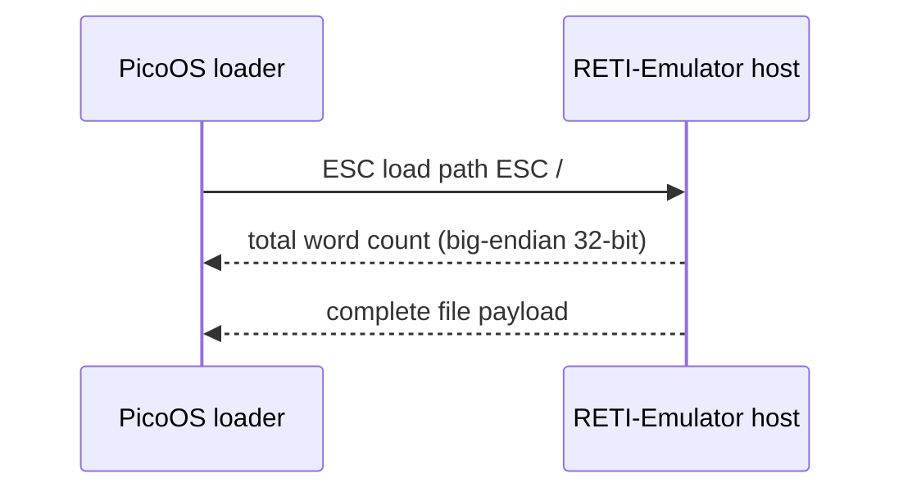
```mermaid
sequenceDiagram
    participant P as PicoOS loader
    participant H as RETI-Emulator host

    P->>H: ESC load path ESC /
    H-->>P: total word count (big-endian 32-bit)
    H-->>P: complete file payload
```

</div><p class="slide-note">The UART word count is outside the .bin file. UINT32_MAX signals failure.</p>

</div>

---

<!-- SOURCE Pico-OS/README.md#123-uart-host-service-protocol -->

# 1. Toolchain extensions for PicoOS · 1.2 RETI-Emulator extensions

## 1.2.3 UART host-service protocol (4)

<div class="deck-content">

<div class="diagram-panel ">

<div class="visual-label">Metadata and ranged reads</div>

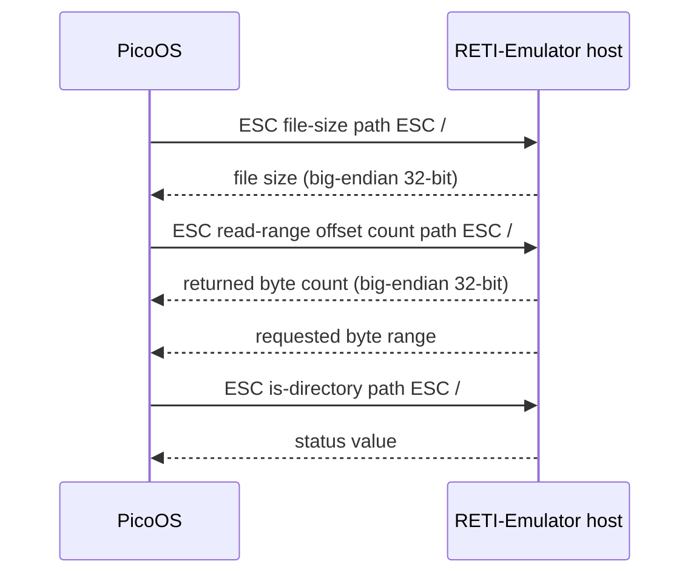
```mermaid
sequenceDiagram
    participant P as PicoOS
    participant H as RETI-Emulator host

    P->>H: ESC file-size path ESC /
    H-->>P: file size (big-endian 32-bit)
    P->>H: ESC read-range offset count path ESC /
    H-->>P: returned byte count (big-endian 32-bit)
    H-->>P: requested byte range
    P->>H: ESC is-directory path ESC /
    H-->>P: status value
```

</div><p class="slide-note">Scheduled loading: independent ≤1 KiB responses, or a complete payload via DMA.</p>

</div>

---

<!-- SOURCE Pico-OS/README.md#123-uart-host-service-protocol -->

# 1. Toolchain extensions for PicoOS · 1.2 RETI-Emulator extensions

## 1.2.3 UART host-service protocol (5)

<div class="deck-content">

<div class="step-flow zoomable"><div class="card">ESC write-at offset path ESC /</div><span class="flow-arrow">→</span><div class="card">Ordinary UART bytes → host file</div><span class="flow-arrow">→</span><div class="card">ESC write stdout ESC /</div></div><div class="tile-grid cols-3 "><div class="card"><div class="tile-title">write path</div><div class="tile-detail">Create/truncate and select destination</div></div><div class="card"><div class="tile-title">write-at offset path</div><div class="tile-detail">Preserve file and select position</div></div><div class="card"><div class="tile-title">stdout / stderr</div><div class="tile-detail">Return output to the host stream</div></div></div>

</div>

---

<!-- SOURCE Pico-OS/README.md#124-debugger-source-view-and-terminal-modes -->

# 1. Toolchain extensions for PicoOS · 1.2 RETI-Emulator extensions

## 1.2.4 Debugger, source view, and terminal modes (1)

<div class="deck-content">

<div class="debugger-frame">

<AsciinemaRecording
  src="/casts/reti_emulator.cast"
  title="RETI emulator · debugger and terminal views"
  poster="npt:8.4"
  :idle-time-limit="1"
  fallback-href="https://asciinema.org/a/1264549"
/>

</div>

<p class="slide-note">Inline local playback · live CS / DS · source frames via .debuginfo · editable machine state</p>

</div>

---

<!-- SOURCE Pico-OS/README.md#124-debugger-source-view-and-terminal-modes -->

# 1. Toolchain extensions for PicoOS · 1.2 RETI-Emulator extensions

## 1.2.4 Debugger, source view, and terminal modes (2)

<div class="deck-content">

<div class="tile-grid cols-2 "><div class="card"><div class="tile-title">v · normal terminal</div><div class="tile-detail">Host signal processing active. Escape returns.</div></div><div class="card"><div class="tile-title">V · raw terminal</div><div class="tile-detail">Forward Ctrl+C, Ctrl+Z and arrow keys. Ctrl+] returns.</div></div></div><div class="step-flow zoomable"><div class="card">Key bytes</div><span class="flow-arrow">→</span><div class="card">UART interrupt</div><span class="flow-arrow">→</span><div class="card">Shell editing / signals</div></div>

</div>

---

<!-- SOURCE Pico-OS/README.md#21-reti-interrupt-entry-and-the-interrupt-service-routine-table -->

# 2. Interrupts, system calls, preemption, and exceptions

## 2.1 RETI interrupt entry and the interrupt service routine table

<div class="deck-content">

<div class="content-columns columns-2">

<div>

<div class="code-panel ">

```c {lines:false}
__attribute__((section("ivt")))
void (*interrupt_vector_table[OS_INTERRUPT_VECTOR_COUNT])(void) = {
    syscall_interrupt,
    timer_interrupt,
    uart_interrupt,
    cpu_exception_interrupt,
    dma_interrupt
};
```

</div>

</div>

<div>

<div class="data-table">

| Vector | Source |
| --- | --- |
| 0 | Software INT 0 |
| 1 | Timer |
| 2 | UART receive |
| 3 | CPU exception · fixed |
| 4 | DMA completion |

</div>

</div>

</div><p class="slide-note">INT saves only return PC. ISR code saves its registers; RTI resumes from SP + 1.</p>

</div>

---

<!-- SOURCE Pico-OS/README.md#22-interrupt-controller-mappings-and-priorities -->

# 2. Interrupts, system calls, preemption, and exceptions

## 2.2 Interrupt-controller mappings and priorities

<div class="deck-content">

<div class="content-columns columns-2">

<div>

<div class="data-table ">

| Device | IVT index | Priority |
| --- | --- | --- |
| Timer | 1 | 1 |
| DMA / custom | 4 | 1 |
| UART | 2 | 2 |

</div>

</div>

<div>

<div class="code-panel code-medium">

<div class="visual-label">Kernel .data initialization arrays</div>

```c {lines:false}
int interrupt_device_isrs[3] = {1, 4, 2};
int interrupt_device_priorities[3] = {1, 1, 2};
```

</div>

</div>

</div><div class="diagram-panel">


```mermaid
flowchart LR
 A["Disable line: mapping 255, priority 0"] --> B["Write mapping to cells 3–5"]
 B --> C["Write priority to cells 6–8"]
 C --> D["After init is READY:
timer interval 5000 in cell 9"]
```

</div><p class="slide-note">The arrays contain indices and priorities. The separate .ivt array contains actual handler addresses.</p>

</div>

---

<!-- SOURCE Pico-OS/README.md#23-saved-interrupt-stack-frame -->

# 2. Interrupts, system calls, preemption, and exceptions

## 2.3 Saved interrupt stack frame

<div class="deck-content">

<div class="content-columns columns-2">

<div>

<div class="stack-diagram zoomable"><div class="stack-row"><code>+7</code><span>Return PC</span></div><div class="stack-row"><code>+6</code><span>ACC</span></div><div class="stack-row"><code>+5</code><span>IN1</span></div><div class="stack-row"><code>+4</code><span>IN2 · result</span></div><div class="stack-row"><code>+3</code><span>BAF</span></div><div class="stack-row"><code>+2</code><span>CS</span></div><div class="stack-row"><code>+1</code><span>DS</span></div><div class="stack-row"><code>+0</code><span>Free cell ← caller_context</span></div></div>

</div>

<div>

<div class="tile-grid cols-1 "><div class="card"><div class="tile-title">Save into PCB</div><div class="tile-detail">Copy offsets 1–6 into activation</div></div><div class="card"><div class="tile-title">Resume position</div><div class="tile-detail">activation.sp = caller_context + 6</div></div><div class="card"><div class="tile-title">Return PC</div><div class="tile-detail">Stays on stack at activation.sp + 1</div></div></div>

</div>

</div>

</div>

---

<!-- SOURCE Pico-OS/README.md#24-system-call-interface-and-execution -->

# 2. Interrupts, system calls, preemption, and exceptions

## 2.4 System-call interface and execution

<div class="deck-content">

<div class="step-flow zoomable"><div class="card">Library wrapper</div><span class="flow-arrow">→</span><div class="card">Selector + ABI arguments</div><span class="flow-arrow">→</span><div class="card">INT 0</div><span class="flow-arrow">→</span><div class="card">Kernel implementation</div></div><div class="tile-grid cols-3 "><div class="card"><div class="tile-title">Stable boundary</div><div class="tile-detail">Userspace embeds selectors, not kernel function addresses.</div></div><div class="card"><div class="tile-title">Binary compatibility</div><div class="tile-detail">Depends on registers, request layouts, selectors, and result meaning.</div></div><div class="card"><div class="tile-title">Source portability</div><div class="tile-detail">POSIX-like names are a subset; rebuilding may be required when the ABI changes.</div></div></div>

</div>

---

<!-- SOURCE Pico-OS/README.md#241-syscall-selectors-and-register-convention -->

# 2. Interrupts, system calls, preemption, and exceptions · 2.4 System-call interface and execution

## 2.4.1 Syscall selectors and register convention

<div class="deck-content">

<div class="content-columns columns-2">

<div>

<div class="code-panel code-medium">

<div class="visual-label">waitpid: stack-local request</div>

```c {lines:false}
int waitpid(int pid) {
    int status = 0;
    struct WaitPidRequest request;

    request.pid = pid;
    request.status = &status;
    while (!invoke_waitpid_syscall(SYSCALL_WAITPID, (int)&request)) {
    }
    return status;
}
```

</div>

</div>

<div>

<div class="stack-diagram zoomable"><div class="stack-row"><code>ACC</code><span>SYSCALL_WAITPID</span></div><div class="stack-row"><code>IN1</code><span>Absolute address of request</span></div><div class="stack-row"><code>INT 0</code><span>Enter the installed kernel</span></div><div class="stack-row"><code>IN2</code><span>Syscall completion result</span></div><div class="stack-row"><code>status</code><span>Child status written through request.status</span></div></div>

</div>

</div><p class="slide-note">The wrapper frame stays alive while suspended. The kernel retains the status pointer when waiting, not the request pointer.</p>

</div>

---

<!-- SOURCE Pico-OS/README.md#2411-process-wait-signal-and-memory-request-structures -->

# 2. Interrupts, system calls, preemption, and exceptions · 2.4 System-call interface and execution · 2.4.1 Syscall selectors and register convention

## 2.4.1.1 Process, wait, signal, and memory request structures

<div class="deck-content">

<div class="data-table ">

| Request | Essential fields | Kernel use |
| --- | --- | --- |
| `LoadProcessRequest` | path · show_loading_bar | Load image; retain its own path copy |
| `RunProcessRequest` | pid · arguments · environment | Copy child startup data |
| `WaitPidRequest` | pid · status pointer | Validate child; deliver status |
| `KillRequest` / `PrctlRequest` | pid + signal / option + argument | Signal or parent-death setting |
| `ShmOpenRequest` | name · size | Find or create shared region |

</div><p class="slide-note">Single-value operations pass IN1 directly. Multi-argument wrappers pass an absolute pointer to a request.</p>

</div>

---

<!-- SOURCE Pico-OS/README.md#2412-file-and-directory-request-structures -->

# 2. Interrupts, system calls, preemption, and exceptions · 2.4 System-call interface and execution · 2.4.1 Syscall selectors and register convention

## 2.4.1.2 File and directory request structures

<div class="deck-content">

<div class="data-table ">

| Request | Fields to follow | Purpose |
| --- | --- | --- |
| `OpenRequest` | path · flags | Create a descriptor |
| `IoRequest` | fd · buffer · count | Transfer bytes or retain pending read destination |
| `IoRequest` progress | transferred · complete · loading_bar_update | Resume bounded regular-file chunks |
| `IoRequest` policy | protect_uart_control · show_loading_bar | ESC protection and progress output |
| `SeekRequest` / `Dup2Request` | fd + offset + origin / old + new fd | Reposition or copy |
| Directory / path requests | buffer + capacity · one or two paths | Normalize paths and bound copies |

</div>

</div>

---

<!-- SOURCE Pico-OS/README.md#242-system-call-entry-execution-and-return-to-userspace -->

# 2. Interrupts, system calls, preemption, and exceptions · 2.4 System-call interface and execution

## 2.4.2 System-call entry, execution, and return to userspace (1)

<div class="deck-content">

<div class="diagram-panel">

<div class="visual-label">Entry → operation → return decision</div>

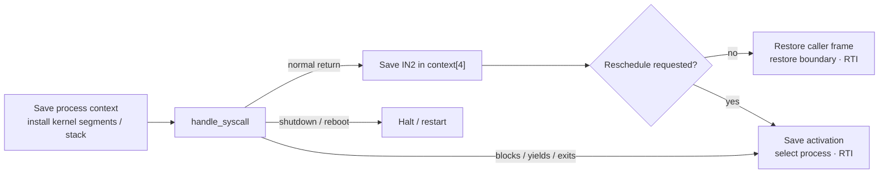
```mermaid
flowchart LR
 E["Save process context
install kernel segments / stack"] --> H["handle_syscall"]
 H -->|normal return| R["Save IN2 in context[4]"] --> Q{"Reschedule requested?"}
 Q -->|no| X["Restore caller frame
restore boundary · RTI"]
 Q -->|yes| D["Save activation
select process · RTI"]
 H -->|blocks / yields / exits| D
 H -->|shutdown / reboot| S["Halt / restart"]
```

</div>

</div>

---

<!-- SOURCE Pico-OS/README.md#242-system-call-entry-execution-and-return-to-userspace -->

# 2. Interrupts, system calls, preemption, and exceptions · 2.4 System-call interface and execution

## 2.4.2 System-call entry, execution, and return to userspace (2)

<div class="deck-content">

<div class="code-panel code-medium">

<div class="visual-label">Entry excerpt · save registers and install kernel context</div>

```c {lines:false}
__attribute__((naked))
void syscall_interrupt(void) {
    // Saves the same context layout as timer_interrupt
    asm("PUSH ACC"); // Syscall number
    asm("PUSH IN1"); // Syscall argument
    asm("PUSH IN2");
    asm("PUSH BAF");
    asm("PUSH CS");
    asm("PUSH DS");

    // BAF keeps old_sp while loading kernel CS, DS and SP
    asm("MOVE SP BAF");
    asm("LOADI IN1 0");
    write_stack_heap_boundary_from_in1();
    asm(KERNEL_CS_START_ASM);
    asm(KERNEL_DS_START_ASM);
    asm(KERNEL_SP_START_ASM);
    activate_kernel_stack_boundary();

    // Builds the handle_syscall arguments from the saved context
    asm("PUSH BAF"); // Caller context
```

</div>

</div>

---

<!-- SOURCE Pico-OS/README.md#242-system-call-entry-execution-and-return-to-userspace -->

# 2. Interrupts, system calls, preemption, and exceptions · 2.4 System-call interface and execution

## 2.4.2 System-call entry, execution, and return to userspace (3)

<div class="deck-content">

<div class="code-panel code-medium">

<div class="visual-label">Entry excerpt · pass arguments and call C</div>

```c {lines:false}
asm("LOADIN BAF IN2 5");
    asm("PUSH IN2"); // Syscall argument
    asm("LOADIN BAF IN2 6");
    asm("PUSH IN2"); // Syscall number

    // A syscall that switches processes resumes with a successful IN2 result
    asm("LOADI IN2 1");
    asm("STOREIN BAF IN2 4");

    // Calls handle_syscall and returns through syscall_interrupt_return
    asm("LOADI32 ACC syscall_interrupt_return");
    asm("ADD ACC CS");
    asm("PUSH ACC"); // Return address: syscall restoration stub
    asm("LOADI32 ACC handle_syscall");
    asm("ADD ACC CS");
    asm("MOVE ACC PC");
}
```

</div>

</div>

---

<!-- SOURCE Pico-OS/README.md#242-system-call-entry-execution-and-return-to-userspace -->

# 2. Interrupts, system calls, preemption, and exceptions · 2.4 System-call interface and execution

## 2.4.2 System-call entry, execution, and return to userspace (4)

<div class="deck-content">

<div class="code-panel code-medium">

<div class="visual-label">Return continuation · preserve result before rescheduling</div>

```c {lines:false}
__attribute__((naked))
void syscall_interrupt_return(void) {
    // Handle_syscall restores BAF to the saved caller context before returning
    // Saves the IN2 result before a pending timer request can dispatch the caller
    asm("STOREIN BAF IN2 4");

    asm("PUSH BAF"); // Caller context
    asm("LOADI32 ACC syscall_interrupt_restore");
    asm("ADD ACC CS");
    asm("PUSH ACC");
    asm("LOADI32 ACC dispatcher_reschedule_if_requested");
    asm("ADD ACC CS");
    asm("MOVE ACC PC");
}
```

</div>

</div>

---

<!-- SOURCE Pico-OS/README.md#242-system-call-entry-execution-and-return-to-userspace -->

# 2. Interrupts, system calls, preemption, and exceptions · 2.4 System-call interface and execution

## 2.4.2 System-call entry, execution, and return to userspace (5)

<div class="deck-content">

<div class="code-panel code-medium">

<div class="visual-label">Restoration continuation · restore registers and RTI</div>

```c {lines:false}
__attribute__((naked))
void syscall_interrupt_restore(void) {
    asm("MOVE BAF SP");
    activate_current_process_stack_boundary();
    asm("POP DS");
    asm("POP CS");
    asm("POP BAF");
    asm("POP IN2");
    asm("POP IN1");
    asm("POP ACC");
    asm("RTI");
}
```

</div>

</div>

---

<!-- SOURCE Pico-OS/README.md#242-system-call-entry-execution-and-return-to-userspace -->

# 2. Interrupts, system calls, preemption, and exceptions · 2.4 System-call interface and execution

## 2.4.2 System-call entry, execution, and return to userspace (6)

<div class="deck-content">

<div class="diagram-panel">

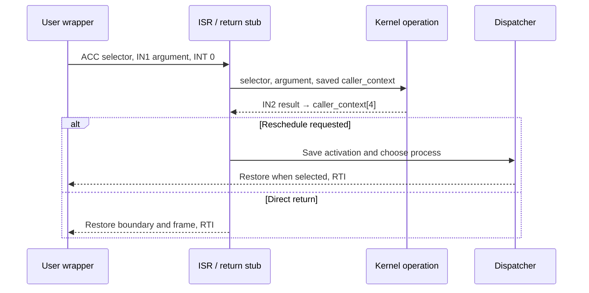
```mermaid
sequenceDiagram
 participant U as User wrapper
 participant I as ISR / return stub
 participant K as Kernel operation
 participant D as Dispatcher
 U->>I: ACC selector, IN1 argument, INT 0
 I->>K: selector, argument, saved caller_context
 K-->>I: IN2 result → caller_context[4]
 alt Reschedule requested
 I->>D: Save activation and choose process
 D-->>U: Restore when selected, RTI
 else Direct return
 I-->>U: Restore boundary and frame, RTI
 end
```

</div>

</div>

---

<!-- SOURCE Pico-OS/README.md#2421-handle-syscall -->

# 2. Interrupts, system calls, preemption, and exceptions · 2.4 System-call interface and execution · 2.4.2 System-call entry, execution, and return to userspace

## 2.4.2.1 Handle Syscall

<div class="deck-content">

<div class="code-panel code-medium">

<div class="visual-label">handle_syscall excerpt</div>

```c {lines:false}
if (syscall_number == SYSCALL_LOAD_PROCESS) {
    return load_process_chunk(
        ((struct LoadProcessRequest *)argument)->path,
        ((struct LoadProcessRequest *)argument)->show_loading_bar,
        caller_context
    );
} else if (syscall_number == SYSCALL_UNLOAD_PROCESS) {
    return unload_process_by_pid(argument);
}
// ... remaining selector branches ...
return 0;
```

</div><p class="slide-note">Request pointers are cast to the shared type; single values are passed directly. Unknown selectors return 0. Switching operations can leave through dispatch.</p>

</div>

---

<!-- SOURCE Pico-OS/README.md#24211-system-call-groups -->

# 2. Interrupts, system calls, preemption, and exceptions · 2.4 System-call interface and execution · 2.4.2 System-call entry, execution, and return to userspace · 2.4.2.1 Handle Syscall

## 2.4.2.1.1 System-call groups

<div class="deck-content">

<div class="tile-grid cols-3 "><div class="card"><div class="tile-title">System control · 2</div><div class="tile-detail">Shutdown · reboot</div></div><div class="card"><div class="tile-title">Processes · 10</div><div class="tile-detail">Load · run · list · unload · exit · wait · PID · foreground · kill · prctl</div></div><div class="card"><div class="tile-title">Scheduling · 3</div><div class="tile-detail">Sleep · wakeup · yield</div></div><div class="card"><div class="tile-title">Memory · 6</div><div class="tile-detail">Heap bounds · heap failure · shared open / map / unlink</div></div><div class="card"><div class="tile-title">Descriptors / I/O · 8</div><div class="tile-detail">Availability · open · read · write · close · seek · dup2 · UART byte</div></div><div class="card"><div class="tile-title">Paths / directories · 8</div><div class="tile-detail">chdir · getcwd · mkdir · read directory · unlink · rmdir · move · touch</div></div></div><p class="slide-note">37 selectors are declared in common/syscall.header and selected by handle_syscall.</p>

</div>

---

<!-- SOURCE Pico-OS/README.md#2422-selecting-the-return-path -->

# 2. Interrupts, system calls, preemption, and exceptions · 2.4 System-call interface and execution · 2.4.2 System-call entry, execution, and return to userspace

## 2.4.2.2 Selecting the return path

<div class="deck-content">

<div class="content-columns columns-2">

<div>

<div class="code-panel code-medium">

<div class="visual-label">Deferred request helpers</div>

```c {lines:false}
bool reschedule_requested = false;

void dispatcher_request_reschedule(void) {
    reschedule_requested = true;
}

void dispatcher_reschedule_if_requested(int *caller_context) {
    if (reschedule_requested) {
        dispatcher_switch_from_context(caller_context);
    }
}
```

</div>

</div>

<div>

<div class="tile-grid cols-1 "><div class="card"><div class="tile-title">Flag clear</div><div class="tile-detail">Return to syscall_interrupt_restore.</div></div><div class="card"><div class="tile-title">Flag set</div><div class="tile-detail">Save the caller context, including its result, and select a process.</div></div><div class="card"><div class="tile-title">Selection</div><div class="tile-detail">Clear the flag and set the selected PCB RUNNING.</div></div></div>

</div>

</div><p class="slide-note">The flag check and RTI are not atomic. A timer arriving after the check remains pending until a later scheduling point.</p>

</div>

---

<!-- SOURCE Pico-OS/README.md#2423-stack-boundary-helpers -->

# 2. Interrupts, system calls, preemption, and exceptions · 2.4 System-call interface and execution · 2.4.2 System-call entry, execution, and return to userspace

## 2.4.2.3 Stack-boundary helpers

<div class="deck-content">

<div class="step-flow zoomable"><div class="card">IN1 = 0<br>disable old boundary</div><span class="flow-arrow">→</span><div class="card">Install kernel SP</div><span class="flow-arrow">→</span><div class="card">Install kernel heap end as boundary</div></div><div class="content-columns columns-2">

<div>

<div class="code-panel code-medium">

<div class="visual-label">Inline writer · no C frame</div>

```c {lines:false}
static inline void write_stack_heap_boundary_from_in1(void) {
    asm("LOADI ACC 1048576");
    asm("MULTI ACC 1024");
    asm("STOREIN ACC IN1 10");
}
```

</div>

</div>

<div>

<div class="stack-diagram zoomable"><div class="stack-row"><code>0x4000000a</code><span>Inclusive lowest permitted free SP</span></div><div class="stack-row"><code>Kernel</code><span>KERNEL_HEAP_START + KERNEL_HEAP_SIZE − 1</span></div><div class="stack-row"><code>Process</code><span>base_address + heap_start + heap_size − 1</span></div></div>

</div>

</div><p class="slide-note">Automatic interrupt entry bypasses the check. UART, DMA, and the kernel timer branch retain the interrupted stack and limit.</p>

</div>

---

<!-- SOURCE Pico-OS/README.md#251-timer-interrupt-path -->

# 2. Interrupts, system calls, preemption, and exceptions · 2.5 Timer interrupts and userspace preemption

## 2.5.1 Timer interrupt path (1)

<div class="deck-content">

<div class="tile-grid cols-3 "><div class="card"><div class="tile-title">IVT 1</div><div class="tile-detail">Timer device</div></div><div class="card"><div class="tile-title">Priority 1</div><div class="tile-detail">UART priority 2 can nest</div></div><div class="card"><div class="tile-title">5000 instructions</div><div class="tile-detail">Repeatable instruction count, not wall-clock time</div></div></div><div class="diagram-panel">

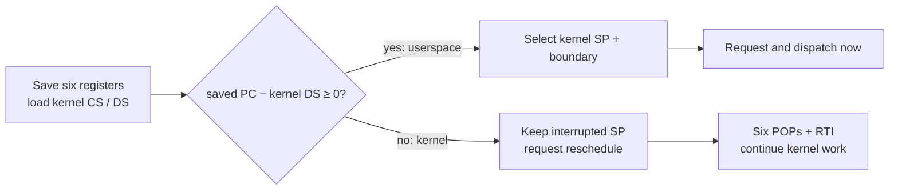
```mermaid
flowchart LR
 E["Save six registers
load kernel CS / DS"] --> Q{"saved PC − kernel DS ≥ 0?"}
 Q -->|yes: userspace| P["Select kernel SP + boundary"] --> D["Request and dispatch now"]
 Q -->|no: kernel| K["Keep interrupted SP
request reschedule"] --> R["Six POPs + RTI
continue kernel work"]
```

</div>

</div>

---

<!-- SOURCE Pico-OS/README.md#251-timer-interrupt-path -->

# 2. Interrupts, system calls, preemption, and exceptions · 2.5 Timer interrupts and userspace preemption

## 2.5.1 Timer interrupt path (2)

<div class="deck-content">

<div class="content-columns columns-2">

<div>

<div class="code-panel ">

<div class="visual-label">Saved-PC classification</div>

```c {lines:false}
asm("LOADIN SP ACC 7");
asm("SUB ACC DS");
asm("JUMP32>= timer_interrupt_process");
```

</div>

</div>

<div>

<div class="tile-grid cols-1 "><div class="card"><div class="tile-title">Below kernel DS</div><div class="tile-detail">Kernel code: keep suspended call frames intact.</div></div><div class="card"><div class="tile-title">At / above kernel DS</div><div class="tile-detail">Process branch; equality is a data address, not normal executable code.</div></div></div>

</div>

</div><div class="memory-visual zoomable"><div class="visual-label">Low address → high address · schematic, not to scale</div><div class="memory-bar"><div class="memory-segment seg-text" style="flex:2">Kernel .text<br>saved PC &lt; DS</div><div class="memory-segment seg-data" style="flex:1">DS → .data</div><div class="memory-segment seg-heap" style="flex:2">Kernel heap / stack</div><div class="memory-segment seg-process" style="flex:3">User images<br>saved PC &gt; DS</div></div></div><p class="slide-note">Saved PC remains reliable during entry / return windows where CS is changing.</p>

</div>

---

<!-- SOURCE Pico-OS/README.md#251-timer-interrupt-path -->

# 2. Interrupts, system calls, preemption, and exceptions · 2.5 Timer interrupts and userspace preemption

## 2.5.1 Timer interrupt path (3)

<div class="deck-content">

<div class="code-panel code-medium">

<div class="visual-label">Entry · save frame and install kernel segments</div>

```c {lines:false}
__attribute__((naked))
void timer_interrupt(void) {
    // Saves the interrupted context before requesting a process switch
    asm("PUSH ACC");
    asm("PUSH IN1");
    asm("PUSH IN2");
    asm("PUSH BAF");
    asm("PUSH CS");
    asm("PUSH DS");
    // SP is saved later. From then on, its value is called old_sp

    // Uses kernel segments because an interrupt can arrive during entry or return
    asm(KERNEL_CS_START_ASM);
    asm(KERNEL_DS_START_ASM);
```

</div>

</div>

---

<!-- SOURCE Pico-OS/README.md#251-timer-interrupt-path -->

# 2. Interrupts, system calls, preemption, and exceptions · 2.5 Timer interrupts and userspace preemption

## 2.5.1 Timer interrupt path (4)

<div class="deck-content">

<div class="code-panel code-medium">

<div class="visual-label">Kernel path · keep the live kernel stack</div>

```c {lines:false}
__attribute__((naked))
void timer_interrupt_kernel_return(void) {
    // The pending request is consumed when this kernel work returns to a process
    asm("POP DS");
    asm("POP CS");
    asm("POP BAF");
    asm("POP IN2");
    asm("POP IN1");
    asm("POP ACC");
    asm("RTI");
}
```

</div><p class="slide-note">A timer inside kernel code records the request, restores the interrupted frame, and defers dispatch until kernel work returns to userspace.</p>

</div>

---

<!-- SOURCE Pico-OS/README.md#251-timer-interrupt-path -->

# 2. Interrupts, system calls, preemption, and exceptions · 2.5 Timer interrupts and userspace preemption

## 2.5.1 Timer interrupt path (5)

<div class="deck-content">

<div class="code-panel code-medium">

<div class="visual-label">Process path · switch stacks before kernel calls</div>

```c {lines:false}
__attribute__((naked))
void timer_interrupt_process(void) {
    // BAF keeps old_sp while loading kernel CS, DS and SP
    asm("MOVE SP BAF");
    asm("LOADI IN1 0");
    write_stack_heap_boundary_from_in1();
    asm(KERNEL_SP_START_ASM);
    activate_kernel_stack_boundary();

    asm("LOADI32 ACC timer_interrupt_after_reschedule_request");
    asm("ADD ACC CS");
    asm("PUSH ACC");
    asm("LOADI32 ACC dispatcher_request_reschedule");
    asm("ADD ACC CS");
    asm("MOVE ACC PC");
}
```

</div><p class="slide-note">The scheduler call needs a call frame. Moving SP first prevents that frame from crossing an almost-full process stack.</p>

</div>

---

<!-- SOURCE Pico-OS/README.md#251-timer-interrupt-path -->

# 2. Interrupts, system calls, preemption, and exceptions · 2.5 Timer interrupts and userspace preemption

## 2.5.1 Timer interrupt path (6)

<div class="deck-content">

<div class="code-panel code-medium">

<div class="visual-label">Process continuation · dispatch saved frame</div>

```c {lines:false}
__attribute__((naked))
void timer_interrupt_after_reschedule_request(void) {
    // Passes the interrupted stack frame to the dispatcher
    asm("PUSH BAF"); // Caller context

    // The dispatcher switches to a process through RTI and does not return
    asm("LOADI ACC 0");
    asm("PUSH ACC"); // Unreachable return address required by the call frame
    asm("LOADI32 ACC dispatcher_switch_from_context");
    asm("ADD ACC CS");
    asm("MOVE ACC PC");
}
```

</div>

</div>

---

<!-- SOURCE Pico-OS/README.md#252-kernel-non-preemption-and-deferred-rescheduling -->

# 2. Interrupts, system calls, preemption, and exceptions · 2.5 Timer interrupts and userspace preemption

## 2.5.2 Kernel non-preemption and deferred rescheduling

<div class="deck-content">

<div class="timeline zoomable" style="grid-template-columns:repeat(3,1fr)"><div class="timeline-step"><b>Timer in kernel</b><div>Set reschedule_requested; keep the current stack.</div></div><div class="timeline-step"><b>Kernel continues</b><div>Device handlers may interrupt; another process does not enter yet.</div></div><div class="timeline-step"><b>Scheduling point</b><div>Check at syscall return, or dispatch directly on block / yield / exit.</div></div></div><div class="tile-grid cols-3 "><div class="card"><div class="tile-title">Polling</div><div class="tile-detail">At most 1 KiB per syscall; return between chunks.</div></div><div class="card"><div class="tile-title">DMA load</div><div class="tile-detail">One payload transfer; block the caller until completion.</div></div><div class="card"><div class="tile-title">All blocked</div><div class="tile-detail">Dispatcher waits; interrupts can make a process runnable.</div></div></div>

</div>

---

<!-- SOURCE Pico-OS/README.md#253-shell-character-delay-for-different-timer-intervals -->

# 2. Interrupts, system calls, preemption, and exceptions · 2.5 Timer interrupts and userspace preemption

## 2.5.3 Shell character delay for different timer intervals

<div class="deck-content">

<div class="source-figure zoomable"></div><p class="slide-note">README measurement: 5000 instructions gives delay close to 10000 with shorter potential waits. Smaller intervals spend more time switching. These are source measurements, not a new benchmark.</p>

</div>

---

<!-- SOURCE Pico-OS/README.md#26-uart-receive-interrupt-path -->

# 2. Interrupts, system calls, preemption, and exceptions

## 2.6 UART receive interrupt path (1)

<div class="deck-content">

<div class="diagram-panel">

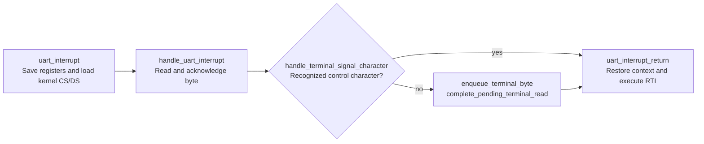
```mermaid
flowchart LR
    ENTRY["uart_interrupt<br/>Save registers and load kernel CS/DS"] --> HANDLE["handle_uart_interrupt<br/>Read and acknowledge byte"]
    HANDLE --> SIGNAL{"handle_terminal_signal_character<br/>Recognized control character?"}
    SIGNAL -->|yes| RETURN["uart_interrupt_return<br/>Restore context and execute RTI"]
    SIGNAL -->|no| INPUT["enqueue_terminal_byte<br/>complete_pending_terminal_read"]
    INPUT --> RETURN
```

</div><p class="slide-note">Read and acknowledge one byte. Control characters generate signals; ordinary bytes enter the ring before delivery to a pending reader.</p>

</div>

---

<!-- SOURCE Pico-OS/README.md#26-uart-receive-interrupt-path -->

# 2. Interrupts, system calls, preemption, and exceptions

## 2.6 UART receive interrupt path (2)

<div class="deck-content">

<div class="code-panel code-medium">

<div class="visual-label">One received byte</div>

```c {lines:false}
void handle_uart_interrupt(void) {
    struct ProcessControlBlock *process = terminal_input_process();
    struct Terminal *terminal = kernel_terminal();
    int value;
    int status;

    value = periphery_read_register(UART_RECEIVE_REGISTER) & 255;
    status = periphery_read_register(UART_STATUS_REGISTER);
    periphery_write_register(
        UART_STATUS_REGISTER,
        status | UART_RECEIVE_READY
    );

    if (handle_terminal_signal_character(value)) {
        return;
    }

    enqueue_terminal_byte(terminal, value);
    complete_pending_terminal_read(process, terminal);
}
```

</div><p class="slide-note">Priority 2. Control bytes become signals; other input enters the ring and may complete a pending read.</p>

</div>

---

<!-- SOURCE Pico-OS/README.md#261-borrowed-stack-entry-and-return -->

# 2. Interrupts, system calls, preemption, and exceptions · 2.6 UART receive interrupt path

## 2.6.1 Borrowed-stack entry and return

<div class="deck-content">

<div class="content-columns columns-2">

<div>

<div class="code-panel code-medium">

<div class="visual-label">Borrow interrupted stack</div>

```c {lines:false}
// Entry after saving six registers
asm("MOVE SP BAF");
asm(KERNEL_CS_START_ASM);
asm(KERNEL_DS_START_ASM);
// Call handler using free space below frame
```

</div>

</div>

<div>

<div class="code-panel code-medium">

<div class="visual-label">Restore interrupted work</div>

```c {lines:false}
asm("MOVE BAF SP");
asm("POP DS");
asm("POP CS");
asm("POP BAF");
asm("POP IN2");
asm("POP IN1");
asm("POP ACC");
asm("RTI");
```

</div>

</div>

</div><p class="slide-note">UART and DMA do not reset SP or the boundary. With kernel CS installed, a fault in their borrowed-stack handler is a kernel exception.</p>

</div>

---

<!-- SOURCE Pico-OS/README.md#262-uart-nesting-and-interrupt-priorities -->

# 2. Interrupts, system calls, preemption, and exceptions · 2.6 UART receive interrupt path

## 2.6.2 UART nesting and interrupt priorities

<div class="deck-content">

<div class="data-table ">

| Incoming event | Active context | Result |
| --- | --- | --- |
| UART · priority 2 | Timer or DMA · priority 1 | Nests; returns to interrupted handler |
| Timer or DMA · priority 1 | UART · priority 2 | Waits until UART returns |
| Timer ↔ DMA | Equal priority 1 | Waits; equal priority cannot nest |
| Any hardware event | Syscall; no hardware ISR | May interrupt the syscall |
| Additional UART input | UART already active / pending | Host queues later bytes |

</div><p class="slide-note">Software INT 0 sets no hardware priority. Kernel-ring overflow is separate: it drops the new byte.</p>

</div>

---

<!-- SOURCE Pico-OS/README.md#263-polled-uart-function-reference -->

# 2. Interrupts, system calls, preemption, and exceptions · 2.6 UART receive interrupt path

## 2.6.3 Polled UART function reference

<div class="deck-content">

<div class="data-table ">

| Library entry | Kernel function | Effect |
| --- | --- | --- |
| `stdio: send_byte_over_uart()` | `send_byte_over_uart(value)` | Send low byte; poll UART status |

</div><div class="step-flow zoomable"><div class="card">Library wrapper</div><span class="flow-arrow">→</span><div class="card">Direct-UART syscall</div><span class="flow-arrow">→</span><div class="card">Periphery send cell 0 / status cell 2</div></div><p class="slide-note">Polled receiving and other internal UART helpers are omitted from the interface table.</p>

</div>

---

<!-- SOURCE Pico-OS/README.md#27-dma-completion-interrupt-path -->

# 2. Interrupts, system calls, preemption, and exceptions

## 2.7 DMA completion interrupt path (1)

<div class="deck-content">

<div class="diagram-panel">

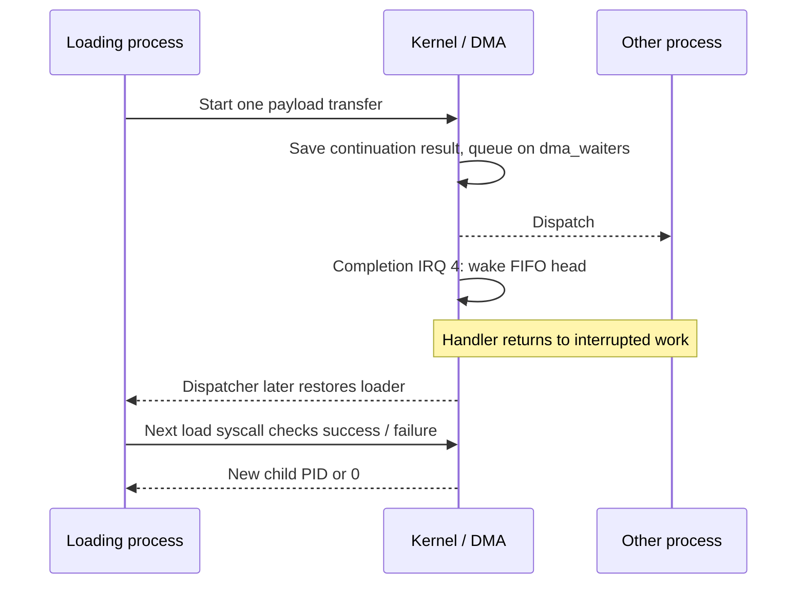
```mermaid
sequenceDiagram
 participant L as Loading process
 participant K as Kernel / DMA
 participant O as Other process
 L->>K: Start one payload transfer
 K->>K: Save continuation result, queue on dma_waiters
 K-->>O: Dispatch
 K->>K: Completion IRQ 4: wake FIFO head
 Note over K,O: Handler returns to interrupted work
 K-->>L: Dispatcher later restores loader
 L->>K: Next load syscall checks success / failure
 K-->>L: New child PID or 0
```

</div><p class="slide-note">The DMA ISR borrows the interrupted stack. Waking the loader does not immediately switch to it.</p>

</div>

---

<!-- SOURCE Pico-OS/README.md#27-dma-completion-interrupt-path -->

# 2. Interrupts, system calls, preemption, and exceptions

## 2.7 DMA completion interrupt path (2)

<div class="deck-content">

<div class="diagram-panel">

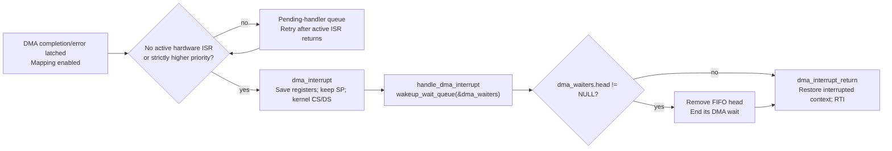
```mermaid
flowchart LR
    PENDING["DMA completion/error latched<br/>Mapping enabled"] --> PRIORITY{"No active hardware ISR<br/>or strictly higher priority?"}
    PRIORITY -->|no| WAIT["Pending-handler queue<br/>Retry after active ISR returns"]
    PRIORITY -->|yes| ENTRY["dma_interrupt<br/>Save registers; keep SP; kernel CS/DS"]
    WAIT --> PRIORITY
    ENTRY --> HANDLE["handle_dma_interrupt<br/>wakeup_wait_queue(&dma_waiters)"]
    HANDLE --> QUEUE{"dma_waiters.head != NULL?"}
    QUEUE -->|yes| WAKE["Remove FIFO head<br/>End its DMA wait"]
    QUEUE -->|no| RETURN["dma_interrupt_return<br/>Restore interrupted context; RTI"]
    WAKE --> RETURN
```

</div><p class="slide-note">DMA priority 1 waits behind equal-priority timer work. UART priority 2 may nest.</p>

</div>

---

<!-- SOURCE Pico-OS/README.md#281-cpu-exception-entry-and-registers -->

# 2. Interrupts, system calls, preemption, and exceptions · 2.8 CPU exceptions and runtime errors

## 2.8.1 CPU exception entry and registers (1)

<div class="deck-content">

<div class="diagram-panel">

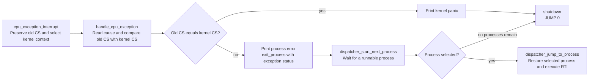
```mermaid
flowchart LR
    ENTRY["cpu_exception_interrupt<br/>Preserve old CS and select kernel context"] --> HANDLE["handle_cpu_exception<br/>Read cause and compare old CS with kernel CS"]
    HANDLE --> KERNEL{"Old CS equals kernel CS?"}
    KERNEL -->|yes| PANIC["Print kernel panic"] --> HALT["shutdown<br/>JUMP 0"]
    KERNEL -->|no| EXIT["Print process error<br/>exit_process with exception status"]
    EXIT --> NEXT["dispatcher_start_next_process<br/>Wait for a runnable process"]
    NEXT --> SELECT{"Process selected?"}
    SELECT -->|no processes remain| HALT
    SELECT -->|yes| RESTORE["dispatcher_jump_to_process<br/>Restore selected process and execute RTI"]
```

</div><p class="slide-note">Vector 3 bypasses device mappings and priorities. The faulting context is abandoned.</p>

</div>

---

<!-- SOURCE Pico-OS/README.md#281-cpu-exception-entry-and-registers -->

# 2. Interrupts, system calls, preemption, and exceptions · 2.8 CPU exceptions and runtime errors

## 2.8.1 CPU exception entry and registers (2)

<div class="deck-content">

<div class="code-panel code-medium">

<div class="visual-label">Naked exception entry</div>

```c {lines:false}
__attribute__((naked))
void cpu_exception_interrupt(void) {
    // BAF preserves the interrupted CS while the handler resets kernel context
    asm("MOVE CS BAF");
    asm("LOADI IN1 0");
    write_stack_heap_boundary_from_in1();
    asm(KERNEL_CS_START_ASM);
    asm(KERNEL_DS_START_ASM);
    asm(KERNEL_SP_START_ASM);
    activate_kernel_stack_boundary();

    // A zero difference identifies an exception raised in kernel code
    asm("MOVE BAF ACC");
    asm("SUB ACC CS");
    asm("PUSH ACC");

    // The exception handler terminates the process or halts after a kernel panic
    asm("LOADI ACC 0");
    asm("PUSH ACC");
    asm("LOADI32 ACC handle_cpu_exception");
    asm("ADD ACC CS");
    asm("MOVE ACC PC");
}
```

</div>

</div>

---

<!-- SOURCE Pico-OS/README.md#282-supported-exceptions-and-allocation-errors -->

# 2. Interrupts, system calls, preemption, and exceptions · 2.8 CPU exceptions and runtime errors

## 2.8.2 Supported exceptions and allocation errors

<div class="deck-content">

<div class="data-table ">

| Failure | Reported cause / result | Policy |
| --- | --- | --- |
| Divide / modulo by zero | Cause 1 | Terminate user process; kernel panic if kernel |
| Stack overflow | Cause 2 | Same user / kernel distinction |
| Illegal instruction | Cause 3 | Same user / kernel distinction |
| User Process Heap full | Heap-full syscall | Diagnostic and process termination |
| Kernel Heap full | Direct panic | Halt system |
| Process and Shared Data Heap full | Load: 0 · shm_open: −1 | Reject allocation; system continues |

</div>

</div>

---

<!-- SOURCE Pico-OS/README.md#283-exception-and-stack-boundary-function-reference -->

# 2. Interrupts, system calls, preemption, and exceptions · 2.8 CPU exceptions and runtime errors

## 2.8.3 Exception and stack-boundary function reference

<div class="deck-content">

<div class="data-table ">

| Library path | Kernel function | Result |
| --- | --- | --- |
| `malloc` / `realloc` failure | `handle_process_heap_full_exception()` | Diagnostic through descriptor 1; terminate process |

</div><p class="slide-note">The wrapper invokes this syscall only when a positive-size allocation fails. A nonpositive allocation returns NULL.</p>

</div>

---

<!-- SOURCE Pico-OS/README.md#31-heap-block-layout-and-allocation-algorithm -->

# 3. Memory management and shared memory

## 3.1 Heap block layout and allocation algorithm (1)

<div class="deck-content">

<div class="content-columns columns-2">

<div>

<div class="code-panel ">

<div class="visual-label">Common allocator records</div>

```c {lines:false}
struct BlockHeader {
    int size;
    bool free;
    struct BlockHeader *next;
};

struct Heap {
    struct BlockHeader *first_block;
};
```

</div>

</div>

<div>

<div class="tile-grid cols-1 "><div class="card"><div class="tile-title">Header · 3 cells</div><div class="tile-detail">size counts payload cells; free marks availability; next reaches the next header.</div></div><div class="card"><div class="tile-title">First fit</div><div class="tile-detail">Walk from Heap.first_block; split only if a new header and payload fit.</div></div><div class="card"><div class="tile-title">Free / merge</div><div class="tile-detail">Recover the preceding header, then coalesce adjacent free blocks.</div></div></div>

</div>

</div><p class="slide-note">Heap descriptors are separate from the region. Headers live directly before their payloads.</p>

</div>

---

<!-- SOURCE Pico-OS/README.md#31-heap-block-layout-and-allocation-algorithm -->

# 3. Memory management and shared memory

## 3.1 Heap block layout and allocation algorithm (2)

<div class="deck-content">

<div class="timeline zoomable" style="grid-template-columns:repeat(4,1fr)"><div class="timeline-step"><b>Allocate</b><div>First-fit scan</div></div><div class="timeline-step"><b>Split</b><div>Keep unused tail free</div></div><div class="timeline-step"><b>Free</b><div>Mark payload available</div></div><div class="timeline-step"><b>Merge</b><div>Coalesce adjacent free blocks</div></div></div><div class="memory-visual zoomable"><div class="visual-label">Low address → high address · schematic, not to scale</div><div class="memory-bar"><div class="memory-segment seg-ivt" style="flex:0.7">header</div><div class="memory-segment seg-text" style="flex:2">allocated payload</div><div class="memory-segment seg-ivt" style="flex:0.7">header</div><div class="memory-segment seg-gap" style="flex:3">free payload</div></div></div><p class="slide-note">Heap.first_block anchors the in-region header list. Each header stores size, free, and next.</p>

</div>

---

<!-- SOURCE Pico-OS/README.md#32-sram-image-and-heap-hierarchy -->

# 3. Memory management and shared memory

## 3.2 SRAM image and heap hierarchy (1)

<div class="deck-content">

<div class="memory-visual zoomable"><div class="visual-label">Low address → high address · schematic, not to scale</div><div class="memory-bar"><div class="memory-segment seg-ivt" style="flex:0.5">.ivt</div><div class="memory-segment seg-text" style="flex:2.4">kernel .text</div><div class="memory-segment seg-data" style="flex:1">.data</div><div class="memory-segment seg-heap" style="flex:1.5">kernel heap</div><div class="memory-segment seg-stack" style="flex:1.5">kernel stack ↓</div><div class="memory-segment seg-process" style="flex:2">Process / Shared Data</div></div></div><div class="layout-offsets">

<div class="data-table">

| SRAM offset | Region |
| --- | --- |
| 0–4 | .ivt |
| 5–40765 | .text |
| 40766–41496 | .data |
| 41497–45592 | 4096-cell kernel heap |
| 45593–48308 | Stack room + initial free SP |
| 48309–262143 | Process and Shared Data Heap |

</div>

</div><p class="slide-note">Generated values from the README; offsets move after relinking.</p>

</div>

---

<!-- SOURCE Pico-OS/README.md#32-sram-image-and-heap-hierarchy -->

# 3. Memory management and shared memory

## 3.2 SRAM image and heap hierarchy (2)

<div class="deck-content">

<div class="heap-hierarchy zoomable">
<div class="heap-band"><b>Kernel Image</b><span>.ivt · .text · .data: kernel_heap / process_shared_data_heap</span></div>
<div class="heap-band heap-kernel"><b>Kernel Heap · kmalloc</b><span>PCB · paths · descriptor table · shared entry · attachment</span></div>
<div class="heap-band heap-stack"><b>Kernel Stack</b><span>Scratch frames; initial SP offset 48308</span></div>
<div class="heap-outer"><div class="visual-label">Process and Shared Data Heap · PSDMalloc · starts at 48309</div>
<div class="content-columns columns-2"><div class="heap-payload"><b>Process Payload</b>
<div class="heap-band">User Process Image · .text / .data</div>
<div class="heap-inner"><b>User Process Heap · malloc</b><span>header → payload → header → payload</span></div>
<div class="heap-band heap-stack">User Process Stack ↓</div></div>
<div class="heap-payload"><b>Shared Data Payload</b><p>Shared cells; no nested user heap.</p><p>SharedMemoryEntry.address points here.</p></div></div></div></div><p class="slide-note">Three independent allocator lists use the same BlockHeader format. Every outer payload has its own preceding header.</p>

</div>

---

<!-- SOURCE Pico-OS/README.md#331-kernel-heap-blocks-and-kernel-objects -->

# 3. Memory management and shared memory · 3.3 Kernel Heap

## 3.3.1 Kernel Heap blocks and kernel objects

<div class="deck-content">

<div class="diagram-panel">

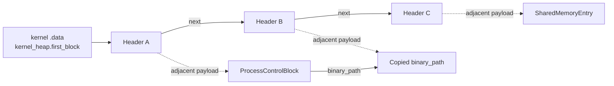
```mermaid
flowchart LR
 G["kernel .data
kernel_heap.first_block"] --> H1["Header A"] -->|next| H2["Header B"] -->|next| H3["Header C"]
 H1 -. adjacent payload .-> P["ProcessControlBlock"]
 H2 -. adjacent payload .-> N["Copied binary_path"]
 H3 -. adjacent payload .-> S["SharedMemoryEntry"]
 P -->|binary_path| N
```

</div><p class="slide-note">Each object is a separate kmalloc allocation. Payload pointers to process images and shared data reach the outer heap.</p>

</div>

---

<!-- SOURCE Pico-OS/README.md#341-process-allocations -->

# 3. Memory management and shared memory · 3.4 Process and Shared Data Heap

## 3.4.1 Process allocations

<div class="deck-content">

<div class="diagram-panel">

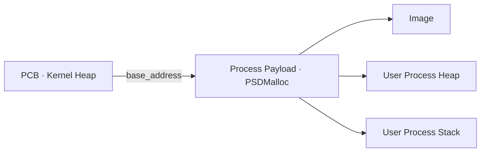
```mermaid
flowchart LR
 P["PCB · Kernel Heap"] -->|base_address| B["Process Payload · PSDMalloc"]
 B --> I["Image"]
 B --> H["User Process Heap"]
 B --> S["User Process Stack"]
```

</div><div class="tile-grid cols-3 "><div class="card"><div class="tile-title">Loading</div><div class="tile-detail">Reserve complete payload; record requested cell count in PCB.size.</div></div><div class="card"><div class="tile-title">Inner free</div><div class="tile-detail">free() changes only that process’s inner allocator list.</div></div><div class="card"><div class="tile-title">Final removal</div><div class="tile-detail">PSDFree(base_address) releases image, heap, and stack together.</div></div></div>

</div>

---

<!-- SOURCE Pico-OS/README.md#342-shared-data-allocations -->

# 3. Memory management and shared memory · 3.4 Process and Shared Data Heap

## 3.4.2 Shared Data allocations

<div class="deck-content">

<div class="diagram-panel">

```mermaid
flowchart LR
 E["SharedMemoryEntry
Kernel Heap"] -->|name| N["Copied name
Kernel Heap"]
 E -->|address| D["Shared Data Payload
Process and Shared Data Heap"]
 P1["Process A mapping"] --> D
 P2["Process B mapping"] --> D
```

</div><p class="slide-note">PSDMalloc reserves shared cells. Metadata and attachments use kmalloc. Unlink plus the last released attachment permits destruction.</p>

</div>

---

<!-- SOURCE Pico-OS/README.md#351-per-process-user-process-heap -->

# 3. Memory management and shared memory · 3.5 User Process Heap

## 3.5.1 Per-Process User Process Heap

<div class="deck-content">

<div class="memory-visual zoomable"><div class="visual-label">Low address → high address · schematic, not to scale</div><div class="memory-bar"><div class="memory-segment seg-text" style="flex:2">.text · CS</div><div class="memory-segment seg-data" style="flex:1">.data · DS</div><div class="memory-segment seg-heap" style="flex:2">heap</div><div class="memory-segment seg-gap" style="flex:1.5">stack room</div><div class="memory-segment seg-stack" style="flex:1">SP ↓</div></div></div><div class="stack-diagram zoomable"><div class="stack-row"><code>base + codesegment_start</code><span>Initial CS / entry</span></div><div class="stack-row"><code>base + datasegment_start</code><span>DS / globals</span></div><div class="stack-row"><code>base + heap_start</code><span>First process heap header</span></div><div class="stack-row"><code>base + heap_start + heap_size − 1</code><span>Inclusive boundary in periphery cell 10</span></div><div class="stack-row"><code>base + effective_stack_start</code><span>Highest reserved stack cell</span></div></div>

</div>

---

<!-- SOURCE Pico-OS/README.md#352-user-process-heap-allocator-function-reference -->

# 3. Memory management and shared memory · 3.5 User Process Heap

## 3.5.2 User Process Heap allocator function reference

<div class="deck-content">

<div class="data-table ">

| Library function | Behavior | Kernel boundary |
| --- | --- | --- |
| `init_process_heap()` | Initialize this image’s process_heap | Query heap start and size |
| `malloc(size)` | First-fit allocation | Heap-full syscall on positive-size failure |
| `realloc(ptr, size)` | Keep, grow, or move | Same failure policy |
| `free(ptr)` | Release and repeatedly coalesce | No syscall |

</div><p class="slide-note">Allocator calls run directly in the process. Restoring DS selects its own globals and heap descriptor.</p>

</div>

---

<!-- SOURCE Pico-OS/README.md#361-common-allocator-linkage-and-function-reference -->

# 3. Memory management and shared memory · 3.6 Heap and allocator function reference

## 3.6.1 Common allocator linkage and function reference

<div class="deck-content">

<div class="diagram-panel">

```mermaid
flowchart LR
 subgraph K["Kernel target"]
 KW["kmalloc / krealloc / kfree
kernel_heap"] --> C["common/heap.picoc"]
 PW["PSDMalloc / PSDRealloc / PSDFree
process_shared_data_heap"] --> C
 end
 subgraph U["Each userspace target"]
 UW["malloc / realloc / free
process_heap"] --> UC["same source linked into libstdlib"]
 end
```

</div><div class="data-table ">

| Directly linked interface | Library caller |
| --- | --- |
| `heap_init_region` | init_process_heap |
| `heap_alloc_from` / `heap_realloc_from` / `heap_free_from` | malloc / realloc / free |

</div><p class="slide-note">Sizes count cells. Free and realloc require a valid pointer from the supplied heap; there is no ownership check.</p>

</div>

---

<!-- SOURCE Pico-OS/README.md#362-reallocation-decisions -->

# 3. Memory management and shared memory · 3.6 Heap and allocator function reference

## 3.6.2 Reallocation decisions

<div class="deck-content">

<div class="diagram-panel">

```mermaid
flowchart LR
    R["Resize an existing block"] --> FIT{"Current payload large enough?"}
    FIT -->|Yes| SHRINK["heap_split_block<br/>heap_merge_free_blocks"]
    SHRINK --> SAME["Return original pointer"]
    FIT -->|No| NEXT{"Immediate next block free and combined space enough?"}
    NEXT -->|Yes| GROW["Absorb next header and payload<br/>heap_split_block"]
    GROW --> SAME
    NEXT -->|No| ALLOC["heap_alloc_from"]
    ALLOC --> OK{"Allocation succeeded?"}
    OK -->|No| KEEP["Return NULL<br/>Old block remains allocated"]
    OK -->|Yes| COPY["heap_copy_cells<br/>heap_free_from old block"]
    COPY --> NEW["Return replacement pointer"]
```

</div><p class="slide-note">Growth absorbs at most one free successor. Failed replacement preserves the old block; the userspace wrapper then applies its heap-full policy.</p>

</div>

---

<!-- SOURCE Pico-OS/README.md#3631-initial-state-and-first-fit-search -->

# 3. Memory management and shared memory · 3.6 Heap and allocator function reference · 3.6.3 Allocation and repeated coalescing example

## 3.6.3.1 Initial state and first-fit search

<div class="deck-content">

<div class="heap-example zoomable"><div class="visual-label">Heap.first_block → A · 52 cells including four headers</div><div class="heap-chain"><div class="heap-example-block heap-used"><div class="heap-header">Header A · @0<br>size 8 · used</div><div class="heap-cells">8 payload cells</div></div><span class="flow-arrow">→</span><div class="heap-example-block heap-free"><div class="heap-header">Header B · @11<br>size 4 · free</div><div class="heap-cells">4 payload cells</div></div><span class="flow-arrow">→</span><div class="heap-example-block heap-used"><div class="heap-header">Header C · @18<br>size 12 · used</div><div class="heap-cells">12 payload cells</div></div><span class="flow-arrow">→</span><div class="heap-example-block heap-free"><div class="heap-header">Header D · @33<br>size 16 · free</div><div class="heap-cells">16 payload cells</div></div><span class="heap-null">NULL</span></div></div><div class="step-flow zoomable"><div class="card">Request 11 cells</div><span class="flow-arrow">→</span><div class="card">Skip A: allocated</div><span class="flow-arrow">→</span><div class="card">Skip B: only 4</div><span class="flow-arrow">→</span><div class="card">Skip C: allocated</div><span class="flow-arrow">→</span><div class="card">Choose D: 16</div></div><p class="slide-note">8 + 4 + 12 + 16 + 4 × 3 = 52 cells. Header links follow contiguous address order.</p>

</div>

---

<!-- SOURCE Pico-OS/README.md#3632-allocation-splits-d -->

# 3. Memory management and shared memory · 3.6 Heap and allocator function reference · 3.6.3 Allocation and repeated coalescing example

## 3.6.3.2 Allocation splits D

<div class="deck-content">

<div class="heap-example zoomable"><div class="visual-label">D splits: 16 ≥ 11 + 3 + 1</div><div class="heap-chain"><div class="heap-example-block heap-used"><div class="heap-header">Header A · @0<br>size 8 · used</div><div class="heap-cells">8 payload cells</div></div><span class="flow-arrow">→</span><div class="heap-example-block heap-free"><div class="heap-header">Header B · @11<br>size 4 · free</div><div class="heap-cells">4 payload cells</div></div><span class="flow-arrow">→</span><div class="heap-example-block heap-used"><div class="heap-header">Header C · @18<br>size 12 · used</div><div class="heap-cells">12 payload cells</div></div><span class="flow-arrow">→</span><div class="heap-example-block heap-used"><div class="heap-header">Header D · @33<br>size 11 · used</div><div class="heap-cells">11 payload cells</div></div><span class="flow-arrow">→</span><div class="heap-example-block heap-free"><div class="heap-header">Header D′ · @47<br>size 2 · free</div><div class="heap-cells">2 payload cells</div></div><span class="heap-null">NULL</span></div></div><div class="tile-grid cols-3 "><div class="card"><div class="tile-title">Returned pointer</div><div class="tile-detail">D payload starts at offset 36.</div></div><div class="card"><div class="tile-title">Remainder</div><div class="tile-detail">Header at 47; two payload cells at 50–51.</div></div><div class="card"><div class="tile-title">No split for 14</div><div class="tile-detail">Two spare cells cannot hold a header and payload; all 16 are allocated.</div></div></div>

</div>

---

<!-- SOURCE Pico-OS/README.md#3633-free-d-and-merge-its-remainder -->

# 3. Memory management and shared memory · 3.6 Heap and allocator function reference · 3.6.3 Allocation and repeated coalescing example

## 3.6.3.3 Free D and merge its remainder

<div class="deck-content">

<div class="heap-example zoomable"><div class="visual-label">First: mark D free</div><div class="heap-chain"><div class="heap-example-block heap-used"><div class="heap-header">Header A · @0<br>size 8 · used</div><div class="heap-cells">8 payload cells</div></div><span class="flow-arrow">→</span><div class="heap-example-block heap-free"><div class="heap-header">Header B · @11<br>size 4 · free</div><div class="heap-cells">4 payload cells</div></div><span class="flow-arrow">→</span><div class="heap-example-block heap-used"><div class="heap-header">Header C · @18<br>size 12 · used</div><div class="heap-cells">12 payload cells</div></div><span class="flow-arrow">→</span><div class="heap-example-block heap-free"><div class="heap-header">Header D · @33<br>size 11 · free</div><div class="heap-cells">11 payload cells</div></div><span class="flow-arrow">→</span><div class="heap-example-block heap-free"><div class="heap-header">Header D′ · @47<br>size 2 · free</div><div class="heap-cells">2 payload cells</div></div><span class="heap-null">NULL</span></div></div><div class="heap-example zoomable"><div class="visual-label">Then: D absorbs its free successor → 11 + 3 + 2 = 16</div><div class="heap-chain"><div class="heap-example-block heap-used"><div class="heap-header">Header A · @0<br>size 8 · used</div><div class="heap-cells">8 payload cells</div></div><span class="flow-arrow">→</span><div class="heap-example-block heap-free"><div class="heap-header">Header B · @11<br>size 4 · free</div><div class="heap-cells">4 payload cells</div></div><span class="flow-arrow">→</span><div class="heap-example-block heap-used"><div class="heap-header">Header C · @18<br>size 12 · used</div><div class="heap-cells">12 payload cells</div></div><span class="flow-arrow">→</span><div class="heap-example-block heap-free"><div class="heap-header">Header D · @33<br>size 16 · free</div><div class="heap-cells">16 payload cells</div></div><span class="heap-null">NULL</span></div></div><p class="slide-note">The absorbed header becomes usable payload. D.next is NULL again.</p>

</div>

---

<!-- SOURCE Pico-OS/README.md#3634-free-c-and-merge-repeatedly-at-b -->

# 3. Memory management and shared memory · 3.6 Heap and allocator function reference · 3.6.3 Allocation and repeated coalescing example

## 3.6.3.4 Free C and merge repeatedly at B

<div class="deck-content">

<div class="heap-example heap-example-compact zoomable"><div class="visual-label">Free C at payload offset 21</div><div class="heap-chain"><div class="heap-example-block heap-used"><div class="heap-header">Header A · @0<br>size 8 · used</div><div class="heap-cells">8 payload cells</div></div><span class="flow-arrow">→</span><div class="heap-example-block heap-free"><div class="heap-header">Header B · @11<br>size 4 · free</div><div class="heap-cells">4 payload cells</div></div><span class="flow-arrow">→</span><div class="heap-example-block heap-free"><div class="heap-header">Header C · @18<br>size 12 · free</div><div class="heap-cells">12 payload cells</div></div><span class="flow-arrow">→</span><div class="heap-example-block heap-free"><div class="heap-header">Header D · @33<br>size 16 · free</div><div class="heap-cells">16 payload cells</div></div><span class="heap-null">NULL</span></div></div><div class="heap-example heap-example-compact zoomable"><div class="visual-label">First merge at B: 4 + 3 + 12 = 19</div><div class="heap-chain"><div class="heap-example-block heap-used"><div class="heap-header">Header A · @0<br>size 8 · used</div><div class="heap-cells">8 payload cells</div></div><span class="flow-arrow">→</span><div class="heap-example-block heap-free"><div class="heap-header">Header B · @11<br>size 19 · free</div><div class="heap-cells">19 payload cells</div></div><span class="flow-arrow">→</span><div class="heap-example-block heap-free"><div class="heap-header">Header D · @33<br>size 16 · free</div><div class="heap-cells">16 payload cells</div></div><span class="heap-null">NULL</span></div></div><div class="heap-example heap-example-compact zoomable"><div class="visual-label">Recheck B: 19 + 3 + 16 = 38</div><div class="heap-chain"><div class="heap-example-block heap-used"><div class="heap-header">Header A · @0<br>size 8 · used</div><div class="heap-cells">8 payload cells</div></div><span class="flow-arrow">→</span><div class="heap-example-block heap-free"><div class="heap-header">Header B · @11<br>size 38 · free</div><div class="heap-cells">38 payload cells</div></div><span class="heap-null">NULL</span></div></div><p class="slide-note">Stay at the same header after merging. A → B still occupies 8 + 38 + 2 × 3 = 52 cells.</p>

</div>

---

<!-- SOURCE Pico-OS/README.md#41-process-control-block-fields -->

# 4. Processes and process lifecycle

## 4.1 Process control block fields (1)

<div class="deck-content">

<div class="tile-grid cols-2 "><div class="card"><div class="tile-title">Identity + image</div><div class="tile-detail">pid · state · base_address · size · heap bounds</div></div><div class="card"><div class="tile-title">CPU state</div><div class="tile-detail">Embedded ActivationRecord</div></div><div class="card"><div class="tile-title">Owned resources</div><div class="tile-detail">Paths · working directory · descriptors · attachments</div></div><div class="card"><div class="tile-title">Queue links</div><div class="tile-detail">waiters · waiting_queue_ptr · wait_next · next</div></div><div class="card"><div class="tile-title">Parent + signals</div><div class="tile-detail">parent_pid · exit status · stop state · pending termination</div></div><div class="card"><div class="tile-title">Suspended work</div><div class="tile-detail">Terminal buffer/count · pending_load</div></div></div>

</div>

---

<!-- SOURCE Pico-OS/README.md#41-process-control-block-fields -->

# 4. Processes and process lifecycle

## 4.1 Process control block fields (2)

<div class="deck-content">

<div class="content-columns columns-2">

<div>

<div class="code-panel code-medium">

<div class="visual-label">Process · identity and resources</div>

```c {lines:false}
struct ProcessControlBlock {
    int pid;
    int state;
    int base_address;
    int size;
    int heap_start;
    int heap_size;
    char *binary_path;
    char *working_directory;
    struct ActivationRecord activation;
    struct FileDescriptorTable *file_descriptors;
    int *waiting_status_ptr;
    struct wait_queue waiters;
    struct wait_queue *waiting_queue_ptr;
```

</div>

</div>

<div>

<div class="code-panel code-medium">

<div class="visual-label">Process · remaining fields</div>

```c {lines:false}
struct ProcessControlBlock *wait_next;
    struct ProcessControlBlock *next;
    struct SharedMemoryAttachment *shared_memory_attachments;
    int parent_pid;
    int parent_death_signal;
    int exit_status;
    int stop_signal;
    int stopped_from_state;
    int pending_termination_signal;
    char *pending_terminal_read_buffer;
    int pending_terminal_read_count;
    struct ProcessLoad *pending_load;
};
```

</div>

</div>

</div>

</div>

---

<!-- SOURCE Pico-OS/README.md#411-process-states-and-transitions -->

# 4. Processes and process lifecycle · 4.1 Process control block fields

## 4.1.1 Process states and transitions

<div class="deck-content">

<div class="diagram-panel">

```mermaid
stateDiagram-v2
    [*] --> NEW: completed load
    NEW --> READY: run and build initial stack
    READY --> RUNNING: dispatcher
    RUNNING --> READY: timer or yield
    RUNNING --> BLOCKED: waitpid, sleep, empty stdin, or DMA load
    BLOCKED --> READY: wakeup, input, or DMA completion
    READY --> STOPPED: stop signal
    RUNNING --> STOPPED: stop signal
    BLOCKED --> STOPPED: stop signal remembers BLOCKED
    STOPPED --> BLOCKED: SIGCONT while still queued
    STOPPED --> READY: SIGCONT when wait is satisfied
    STOPPED --> STOPPED: pending terminal read without input ownership
    NEW --> ZOMBIE: termination or unload
    READY --> ZOMBIE: termination or signal
    RUNNING --> ZOMBIE: exit or fatal signal
    BLOCKED --> ZOMBIE: fatal signal
    STOPPED --> ZOMBIE: fatal signal
    ZOMBIE --> [*]: collection, orphan cleanup, or unload
```

</div><p class="slide-note">Normal run setup accepts only NEW. The README also documents a stop/continue edge case that can expose an unstarted process to scheduling.</p>

</div>

---

<!-- SOURCE Pico-OS/README.md#412-global-process-list-and-current-process -->

# 4. Processes and process lifecycle · 4.1 Process control block fields

## 4.1.2 Global process list and current process (1)

<div class="deck-content">

<div class="code-panel ">

```c {lines:false}
struct ProcessControlBlock *process_list_head = NULL;
struct ProcessControlBlock *process_list_tail = NULL;
struct ProcessControlBlock *active_process = NULL;
int next_process_id = 1;
```

</div><div class="diagram-panel ">

```mermaid
flowchart LR
 H["head"] --> A["PCB A"] -->|next| B["PCB B"] -->|next| C["PCB C"] --> N["NULL"]
 T["tail"] --> C
 X["active"] -.-> B
```

</div><p class="slide-note">One kmalloc per PCB. Scheduler order uses next; waiting uses wait_next.</p>

</div>

---

<!-- SOURCE Pico-OS/README.md#412-global-process-list-and-current-process -->

# 4. Processes and process lifecycle · 4.1 Process control block fields

## 4.1.2 Global process list and current process (2)

<div class="deck-content">

<div class="data-table ">

| List | Insertion | Reason |
| --- | --- | --- |
| PCB list | Append using head + tail | Preserve creation order; O(1) linking |
| Shared-memory registry | Prepend using head only | No creation-order requirement; O(1) linking |

</div><div class="step-flow zoomable"><div class="card">Scheduler starts after current PCB</div><span class="flow-arrow">→</span><div class="card">Follow next</div><span class="flow-arrow">→</span><div class="card">Wrap to head</div></div><p class="slide-note">Allocation and lookup costs are separate. PCB.next is independent of allocator header links and wait_next.</p>

</div>

---

<!-- SOURCE Pico-OS/README.md#4121-from-pcbs-to-process-payloads-in-sram -->

# 4. Processes and process lifecycle · 4.1 Process control block fields · 4.1.2 Global process list and current process

## 4.1.2.1 From PCBs to Process Payloads in SRAM

<div class="deck-content">

<div class="diagram-panel">

```mermaid
flowchart LR
 subgraph K["Kernel Heap · separate allocations"]
 P1["PCB 1"] -->|next| P2["PCB 2"]
 N["Directory string between PCBs"]
 end
 subgraph O["Process and Shared Data Heap"]
 A["Process Payload A
image / user heap / stack"]
 S["Shared Data Payload B"]
 C["Process Payload C
image / user heap / stack"]
 end
 P1 -->|base_address| A
 P2 -->|base_address| C
 P1 -->|working_directory| N
```

</div><p class="slide-note">Header chains follow adjacent allocations; PCB pointers connect metadata to payloads across heap regions.</p>

</div>

---

<!-- SOURCE Pico-OS/README.md#421-user-process-stack-placement -->

# 4. Processes and process lifecycle · 4.2 Initial user process stack

## 4.2.1 User process stack placement

<div class="deck-content">

<div class="memory-visual zoomable"><div class="visual-label">One Process Payload · base_address … base_address + size − 1</div><div class="memory-bar"><div class="memory-segment seg-text" style="flex:2">User Process Image<br>.text / .data</div><div class="memory-segment seg-heap" style="flex:2">User Process Heap</div><div class="memory-segment seg-stack" style="flex:2">User Process Stack<br>growth ←</div></div></div><div class="data-table ">

| Header field | Default / derived value |
| --- | --- |
| `heap_size = −1` | 1000 heap cells |
| `stack_start = −1` | heap_start + heap_size + 1000 |
| Highest stack address | base_address + effective_stack_start |
| Payload size | effective_stack_start + 1 |

</div><p class="slide-note">The inclusive default stack offset reserves 1001 cells beyond the heap. Explicit stack starts inside the heap are rejected.</p>

</div>

---

<!-- SOURCE Pico-OS/README.md#422-initial-argc-argv-and-envp -->

# 4. Processes and process lifecycle · 4.2 Initial user process stack

## 4.2.2 Initial `argc`, `argv`, and `envp`

<div class="deck-content">

<div class="content-columns columns-2">

<div>

<div class="stack-diagram zoomable"><div class="stack-row"><code>entry + 0</code><span>Entry PC = activation.cs − 1</span></div><div class="stack-row"><code>entry + 1</code><span>argc</span></div><div class="stack-row"><code>entry + 2 …</code><span>argv pointers, then NULL</span></div><div class="stack-row"><code>next cells</code><span>envp pointers, then NULL</span></div><div class="stack-row"><code>higher cells</code><span>Copied path / argument / environment strings</span></div><div class="stack-row"><code>entry − 1</code><span>Saved activation.sp</span></div><div class="stack-row"><code>entry − 2</code><span>Saved activation.baf</span></div></div>

</div>

<div>

<div class="tile-grid cols-1 "><div class="card"><div class="tile-title">Array locations</div><div class="tile-detail">argv is the address of the first pointer cell; envp = argv + argc + 1.</div></div><div class="card"><div class="tile-title">Source conventions</div><div class="tile-detail">POSIX describes argv / NAME=value arrays, not physical stack placement.</div></div><div class="card"><div class="tile-title">System V Intel386 model</div><div class="tile-detail">Count → arguments → NULL → environment → NULL; RETI adds entry PC, word cells, fixed string order, no auxiliary vector.</div></div></div>

</div>

</div><p class="slide-note">Each character occupies one 32-bit cell. Startup packing currently does not verify that the complete data fits above the heap.</p>

</div>

---

<!-- SOURCE Pico-OS/README.md#4221-concrete-initial-stack-example -->

# 4. Processes and process lifecycle · 4.2 Initial user process stack · 4.2.2 Initial `argc`, `argv`, and `envp`

## 4.2.2.1 Concrete initial-stack example (1)

<div class="deck-content">

<div class="content-columns columns-2">

<div>

<div class="code-panel code-medium">

<div class="visual-label">add.picoc</div>

```c {lines:false}
#include "library/stdlib/stdlib.header"

int main(int argc, char **argv) {
    char *enabled = getenv("X");

    if (argc == 3 && enabled != NULL && atoi(enabled) == 1) {
        return atoi(argv[1]) + atoi(argv[2]);
    }
    return 0;
}
```

</div>

</div>

<div>

<div class="code-panel code-medium">

<div class="visual-label">Launcher</div>

```c {lines:false}
#include "library/unistd/unistd.header"
#include "library/sys/wait/wait.header"

int main(void) {
    char *environment[3];
    int pid = load("/add.bin");

    environment[0] = "X=1";
    environment[1] = "Y=0";
    environment[2] = NULL;
    run(pid, "2 3", environment);
    return waitpid(pid);
}
```

</div>

</div>

</div><p class="slide-note">Arguments 2 and 3, environment X=1 and Y=0: the child returns 5 through waitpid.</p>

</div>

---

<!-- SOURCE Pico-OS/README.md#4221-concrete-initial-stack-example -->

# 4. Processes and process lifecycle · 4.2 Initial user process stack · 4.2.2 Initial `argc`, `argv`, and `envp`

## 4.2.2.1 Concrete initial-stack example (2)

<div class="deck-content">

<div class="initial-stack zoomable"><div class="visual-label">29 cells · entry = base_address + size − 29 · offsets increase left → right</div><div class="cell-grid"><div class="address-cell"><b>+0</b><span>CS − 1</span></div><div class="address-cell"><b>+1</b><span>argc = 3</span></div><div class="address-cell"><b>+2</b><span>entry + 9</span></div><div class="address-cell"><b>+3</b><span>entry + 17</span></div><div class="address-cell"><b>+4</b><span>entry + 19</span></div><div class="address-cell"><b>+5</b><span>NULL</span></div><div class="address-cell"><b>+6</b><span>entry + 21</span></div><div class="address-cell"><b>+7</b><span>entry + 25</span></div><div class="address-cell"><b>+8</b><span>NULL</span></div></div><div class="visual-label">String cells +9 … +28 · pointers above are absolute entry + offset</div><div class="cell-grid string-cells"><div class="address-cell"><b>+9</b><span>a</span></div><div class="address-cell"><b>+10</b><span>d</span></div><div class="address-cell"><b>+11</b><span>d</span></div><div class="address-cell"><b>+12</b><span>.</span></div><div class="address-cell"><b>+13</b><span>b</span></div><div class="address-cell"><b>+14</b><span>i</span></div><div class="address-cell"><b>+15</b><span>n</span></div><div class="address-cell"><b>+16</b><span>\0</span></div><div class="address-cell"><b>+17</b><span>2</span></div><div class="address-cell"><b>+18</b><span>\0</span></div><div class="address-cell"><b>+19</b><span>3</span></div><div class="address-cell"><b>+20</b><span>\0</span></div><div class="address-cell"><b>+21</b><span>X</span></div><div class="address-cell"><b>+22</b><span>=</span></div><div class="address-cell"><b>+23</b><span>1</span></div><div class="address-cell"><b>+24</b><span>\0</span></div><div class="address-cell"><b>+25</b><span>Y</span></div><div class="address-cell"><b>+26</b><span>=</span></div><div class="address-cell"><b>+27</b><span>0</span></div><div class="address-cell"><b>+28</b><span>\0</span></div></div></div><div class="step-flow zoomable"><div class="card">RTI reads entry PC</div><span class="flow-arrow">→</span><div class="card">argc at BAF + 3</div><span class="flow-arrow">→</span><div class="card">argv at BAF + 4</div><span class="flow-arrow">→</span><div class="card">envp = argv + 4</div></div><p class="slide-note">The last string terminator replaces the preliminary entry PC at the highest stack cell. The final entry PC is now below argc.</p>

</div>

---

<!-- SOURCE Pico-OS/README.md#431-loading-a-process-load-library-call -->

# 4. Processes and process lifecycle · 4.3 Loading and starting a process

## 4.3.1 Loading a process (`load` library call) (1)

<div class="deck-content">

<div class="diagram-panel ">

<div class="visual-label">README sequence · header and reservation</div>

```mermaid
sequenceDiagram
 participant C as Caller
 participant K as Kernel loader
 participant H as UART host
 participant M as Process and Shared Data Heap
 C->>K: load(path), syscall
 K->>H: file-size path
 H-->>K: Byte count
 K->>H: read-range 0 20 path
 H-->>K: Five header words
 K->>K: Resolve heap / stack defaults
 K->>M: PSDMalloc complete region
 K->>K: Save pending_load in caller PCB
```

</div><p class="slide-note">No child PCB exists until the final payload word arrives.</p>

</div>

---

<!-- SOURCE Pico-OS/README.md#431-loading-a-process-load-library-call -->

# 4. Processes and process lifecycle · 4.3 Loading and starting a process

## 4.3.1 Loading a process (`load` library call) (2)

<div class="deck-content">

<div class="content-columns columns-2">

<div>

<div class="tile-grid cols-1 "><div class="card"><div class="tile-title">Polling</div><div class="tile-detail">Read header; reserve payload; request ≤256 words (1 KiB) per syscall; yield opportunities between chunks.</div></div></div>

</div>

<div>

<div class="tile-grid cols-1 "><div class="card"><div class="tile-title">DMA</div><div class="tile-detail">Header still polled; one payload transfer; block caller; completion wakes it; next syscall checks status.</div></div></div>

</div>

</div><div class="step-flow zoomable"><div class="card">Complete image transfer</div><span class="flow-arrow">→</span><div class="card">create_process: PCB NEW</div><span class="flow-arrow">→</span><div class="card">Release temporary ProcessLoad</div><span class="flow-arrow">→</span><div class="card">Return child PID</div></div><p class="slide-note">The image excludes the five header words. No child PCB exists until loading finishes; the user heap is initialized later by libstart.</p>

</div>

---

<!-- SOURCE Pico-OS/README.md#431-loading-a-process-load-library-call -->

# 4. Processes and process lifecycle · 4.3 Loading and starting a process

## 4.3.1 Loading a process (`load` library call) (3)

<div class="deck-content">

<div class="diagram-panel">

```mermaid
flowchart LR
 subgraph K["Kernel Heap"]
 OWNER["Caller PCB"] -->|pending_load| L["ProcessLoad
header / progress / path"]
 CHILD["New child PCB after completion
state NEW · fresh descriptors"]
 end
 subgraph O["Outer Process Payload"]
 IMG["Received .ivt / .text / .data"]
 H["Reserved, uninitialized user heap"]
 ST["Preliminary stack
top cell = entry PC"]
 end
 L -->|base_address while loading| IMG
 CHILD -->|base_address after completion| IMG
 CHILD -->|activation.sp one below top| ST
```

</div><p class="slide-note">Cancellation releases temporary metadata and partial payload. Completion transfers payload ownership to the new PCB.</p>

</div>

---

<!-- SOURCE Pico-OS/README.md#4311-load-function-reference -->

# 4. Processes and process lifecycle · 4.3 Loading and starting a process · 4.3.1 Loading a process (`load` library call)

## 4.3.1.1 Load function reference

<div class="deck-content">

<div class="data-table ">

| Library call | Kernel entry | Returned to wrapper |
| --- | --- | --- |
| `load(path)` | `load_process_chunk(path, show_loading_bar, caller_context)` | PID when complete; 0 on failure; −1 to continue |

</div><div class="step-flow zoomable"><div class="card">file-size</div><span class="flow-arrow">→</span><div class="card">read-range header</div><span class="flow-arrow">→</span><div class="card">Polling chunks / DMA payload</div><span class="flow-arrow">→</span><div class="card">NEW child PID</div></div><p class="slide-note">The wrapper repeats continuation calls. Boot-time load_process and internal transfer helpers are excluded from this interface table.</p>

</div>

---

<!-- SOURCE Pico-OS/README.md#432-starting-a-process-run-library-call -->

# 4. Processes and process lifecycle · 4.3 Loading and starting a process

## 4.3.2 Starting a process (`run` library call)

<div class="deck-content">

<div class="timeline zoomable" style="grid-template-columns:repeat(4,1fr)"><div class="timeline-step"><b>Validate</b><div>Find PID; require NEW.</div></div><div class="timeline-step"><b>Inherit</b><div>Deep-copy eligible descriptors from run caller.</div></div><div class="timeline-step"><b>Pack stack</b><div>Copy arguments / environment; update SP / BAF.</div></div><div class="timeline-step"><b>Ready</b><div>Set READY; scheduler chooses first execution.</div></div></div><div class="diagram-panel">

```mermaid
flowchart LR
 R["RunProcessRequest
pid / arguments / environment"] -. copy .-> ST["Child stack
argc · argv · envp · strings"]
 F["Run caller descriptor table"] -. deep copy .-> CF["Child descriptor table"]
 ST --> A["Updated child activation"] --> READY["NEW → READY"]
```

</div><p class="slide-note">run does not immediately load CPU registers. First dispatch enters libstart, which initializes the user heap and environment.</p>

</div>

---

<!-- SOURCE Pico-OS/README.md#4321-parent-to-child-inheritance -->

# 4. Processes and process lifecycle · 4.3 Loading and starting a process · 4.3.2 Starting a process (`run` library call)

## 4.3.2.1 Parent-to-child inheritance

<div class="deck-content">

<div class="data-table ">

| Stage | What is copied | Afterward |
| --- | --- | --- |
| Load completion | Loader PID · working directory · parent-death signal | Independent directory string and scalar metadata |
| Run setup | Run caller’s descriptors 0–2; FILE entries 3–4 | Independent table, offsets, and path strings |
| Run setup | Explicit environment, or run caller’s current environment | Strings and pointer arrays copied to child stack |
| First dispatch | Stack environment → child heap | Child owns environ and each string |

</div><p class="slide-note">The run caller can differ from the recorded parent. Shared-memory attachments and reserved descriptor slots 5–7 are not inherited.</p>

</div>

---

<!-- SOURCE Pico-OS/README.md#43211-environment-origin-and-propagation -->

# 4. Processes and process lifecycle · 4.3 Loading and starting a process · 4.3.2 Starting a process (`run` library call) · 4.3.2.1 Parent-to-child inheritance

## 4.3.2.1.1 Environment origin and propagation

<div class="deck-content">

<div class="diagram-panel">

```mermaid
flowchart LR
 K["Kernel
no environment object"] --> I0["Init starts empty"]
 C["config/environment.txt
PATH=/user"] --> I["Init heap environ"]
 I0 --> I
 I -->|run with NULL| S["Shell heap copies"]
 S -->|run with NULL| U["Child heap copies"]
 U -->|setenv / unsetenv| N["Later children receive changes"]
 S -. unchanged .-> OLD["Existing processes keep their own values"]
```

</div><p class="slide-note">Propagation copies twice: caller → child startup stack → child heap. The PCB stores no environment pointer.</p>

</div>

---

<!-- SOURCE Pico-OS/README.md#43212-loading-bar-environment-variable -->

# 4. Processes and process lifecycle · 4.3 Loading and starting a process · 4.3.2 Starting a process (`run` library call) · 4.3.2.1 Parent-to-child inheritance

## 4.3.2.1.2 Loading-bar environment variable

<div class="deck-content">

<div class="tile-grid cols-3 "><div class="card"><div class="tile-title">Present = enabled</div><div class="tile-detail">load() and read() check whether PICOOS_LOADING_BAR exists.</div></div><div class="card"><div class="tile-title">"false" still enables</div><div class="tile-detail">The content is not parsed as a boolean.</div></div><div class="card"><div class="tile-title">Remove to disable</div><div class="tile-detail">unsetenv() affects this process and future inherited environments.</div></div></div><div class="code-panel ">

```c {lines:false}
// cat disables progress in its own environment
unsetenv(LOADING_BAR_ENVIRONMENT_VARIABLE);
```

</div><p class="slide-note">Init adds the variable when its boot configuration enables bars. The shell can still show a bar while loading cat.</p>

</div>

---

<!-- SOURCE Pico-OS/README.md#4322-recording-termination-status -->

# 4. Processes and process lifecycle · 4.3 Loading and starting a process · 4.3.2 Starting a process (`run` library call)

## 4.3.2.2 Recording termination status

<div class="deck-content">

<div class="diagram-panel">

```mermaid
flowchart TB
    subgraph WAIT_FIRST["Parent already waiting"]
        direction LR
        EXIT["Child PCB<br/>exit_status = 7"]
        DELIVER["Parent stack<br/>status = 7"]
        RESUME["waitpid<br/>returns 7"]
        EXIT -->|copy| DELIVER
        DELIVER -->|wake and schedule| RESUME
    end
    subgraph EXIT_FIRST["Child terminates first"]
        direction LR
        KEEP["Child PCB<br/>exit_status = 7<br/>state = ZOMBIE"]
        COLLECT["Parent stack<br/>status = 7"]
        RETURN["waitpid<br/>returns 7"]
        KEEP -->|later waitpid copies| COLLECT
        COLLECT -->|no blocking| RETURN
    end
    WAIT_FIRST ~~~ EXIT_FIRST
```

</div><p class="slide-note">Only the recorded parent can collect the child. Invalid PID or non-child writes −1 without blocking or removing it.</p>

</div>

---

<!-- SOURCE Pico-OS/README.md#4323-parent-collection-and-final-removal -->

# 4. Processes and process lifecycle · 4.3 Loading and starting a process · 4.3.2 Starting a process (`run` library call)

## 4.3.2.3 Parent collection and final removal

<div class="deck-content">

<div class="data-table ">

| Ordering | Status storage | Who removes child |
| --- | --- | --- |
| Parent waits first | Written into parent’s suspended status cell | terminate_process, immediately after handoff |
| Child exits first | Retained in complete ZOMBIE PCB | Later wait_for_process_by_pid |
| No live parent | No future collection | Termination / orphan cleanup removes immediately |

</div><div class="step-flow zoomable"><div class="card">Unlink queues and process list</div><span class="flow-arrow">→</span><div class="card">Release attachments / partial load</div><span class="flow-arrow">→</span><div class="card">Free payload, descriptors, paths, PCB</div></div><p class="slide-note">A retained zombie keeps its resources. PicoOS does not reparent children to init.</p>

</div>

---

<!-- SOURCE Pico-OS/README.md#4324-run-function-reference -->

# 4. Processes and process lifecycle · 4.3 Loading and starting a process · 4.3.2 Starting a process (`run` library call)

## 4.3.2.4 Run function reference

<div class="deck-content">

<div class="data-table ">

| Library call | Kernel entry | Effect |
| --- | --- | --- |
| `run(pid, arguments, environment)` | `mark_process_ready_with_arguments(request)` | Deep-copy descriptors; pack child stack; set READY |

</div><p class="slide-note">Returns false for a missing PID or a process outside NEW. A NULL library environment selects the caller’s current environment.</p>

</div>

---

<!-- SOURCE Pico-OS/README.md#44-process-list-pcb-metadata-and-lifecycle-function-reference -->

# 4. Processes and process lifecycle

## 4.4 Process list, PCB metadata, and lifecycle function reference

<div class="deck-content">

<div class="data-table ">

| Library interface | Kernel implementation | Purpose |
| --- | --- | --- |
| `list_processes()` | `list_processes()` | Print known PIDs and stable binary paths |
| `unload(pid)` | `unload_process_by_pid()` | Force removal of a noncurrent target |
| `exit(status)` | `exit_process()` | Terminate current process and dispatch |
| `init_process_heap()` | `process_heap_start()` / `process_heap_size()` | Query this process’s heap bounds |
| `getpid()` | `current_process()` through syscall dispatch | Read current PCB PID |

</div>

</div>

---

<!-- SOURCE Pico-OS/README.md#51-named-entries-and-per-process-attachments -->

# 5. Shared Memory Entries and Mappings

## 5.1 Named entries and per-process attachments (1)

<div class="deck-content">

<div class="content-columns columns-2">

<div>

<div class="code-panel ">

<div class="visual-label">Registry + per-process attachment</div>

```c {lines:false}
struct SharedMemoryEntry {
    char *name;
    int id;
    void *address;
    int reference_count;
    bool unlink_requested;
    struct SharedMemoryEntry *next;
};

struct SharedMemoryAttachment {
    struct SharedMemoryEntry *entry;
    struct SharedMemoryAttachment *next;
};
```

</div>

</div>

<div>

<div class="tile-grid cols-1 "><div class="card"><div class="tile-title">Entry + name</div><div class="tile-detail">Kernel heap</div></div><div class="card"><div class="tile-title">Data region</div><div class="tile-detail">Process and Shared Data Heap</div></div><div class="card"><div class="tile-title">Two linked lists</div><div class="tile-detail">Global lookup registry + each PCB’s attachments</div></div></div>

</div>

</div>

</div>

---

<!-- SOURCE Pico-OS/README.md#51-named-entries-and-per-process-attachments -->

# 5. Shared Memory Entries and Mappings

## 5.1 Named entries and per-process attachments (2)

<div class="deck-content">

<div class="diagram-panel ">

```mermaid
flowchart LR
    P1["PCB A"] --> A1["attachment<br/>kmalloc"]
    P2["PCB B"] --> A2["attachment<br/>kmalloc"]
    A1 --> E["SharedMemoryEntry<br/>kmalloc<br/>count = 2"]
    A2 --> E
    E --> M["shared-memory data<br/>PSDMalloc"]
    G["global registry head"] --> E
```

</div><div class="tile-grid cols-3 "><div class="card"><div class="tile-title">shm_open(name, size)</div><div class="tile-detail">Existing ID does not resize the region</div></div><div class="card"><div class="tile-title">mmap(id)</div><div class="tile-detail">Same absolute pointer; one reference per mapping</div></div><div class="card"><div class="tile-title">No munmap</div><div class="tile-detail">Attachments survive until process removal</div></div></div>

</div>

---

<!-- SOURCE Pico-OS/README.md#511-global-shared-memory-list-and-entry-names -->

# 5. Shared Memory Entries and Mappings · 5.1 Named entries and per-process attachments

## 5.1.1 Global shared-memory list and entry names

<div class="deck-content">

<div class="diagram-panel">

```mermaid
flowchart LR
 H["shared_memory_list_head
kernel .data"] --> E2["Entry 2"] -->|next| E1["Entry 1"] -->|next| Z["NULL"]
 E2 -->|name| N2["Copied name 2"]
 E1 -->|name| N1["Copied name 1"]
```

</div><div class="tile-grid cols-3 "><div class="card"><div class="tile-title">Separate allocations</div><div class="tile-detail">Entries and their names each occupy Kernel Heap blocks.</div></div><div class="card"><div class="tile-title">Prepend</div><div class="tile-detail">New entry becomes head; O(1) list insertion.</div></div><div class="card"><div class="tile-title">Lookup</div><div class="tile-detail">Name and ID lookup walk the same registry.</div></div></div>

</div>

---

<!-- SOURCE Pico-OS/README.md#5111-from-shared-memory-entries-to-shared-data-payloads-in-sram -->

# 5. Shared Memory Entries and Mappings · 5.1 Named entries and per-process attachments · 5.1.1 Global shared-memory list and entry names

## 5.1.1.1 From Shared Memory Entries to Shared Data Payloads in SRAM

<div class="deck-content">

<div class="diagram-panel">

```mermaid
flowchart LR
 subgraph K["Kernel Heap"]
 E1["SharedMemoryEntry 1"]
 PCB["ProcessControlBlock"]
 E2["SharedMemoryEntry 2"]
 end
 subgraph O["Process and Shared Data Heap"]
 S1["Shared Data Payload A"]
 P["Process Payload B"]
 S2["Shared Data Payload C"]
 end
 E1 -->|address| S1
 PCB -->|base_address| P
 E2 -->|address| S2
```

</div><p class="slide-note">mmap returns entry.address unchanged. Shared cells have no separate virtual mapping or nested user heap.</p>

</div>

---

<!-- SOURCE Pico-OS/README.md#512-per-process-attachment-lists-in-sram -->

# 5. Shared Memory Entries and Mappings · 5.1 Named entries and per-process attachments

## 5.1.2 Per-process attachment lists in SRAM

<div class="deck-content">

<div class="diagram-panel">

```mermaid
flowchart LR
 P1["PCB 1"] -->|shared_memory_attachments| A12["Attachment → Entry 2"]
 A12 -->|next| A11["Attachment → Entry 1"]
 P2["PCB 2"] -->|shared_memory_attachments| A21["Attachment → Entry 1"]
 A12 -->|entry| E2["Entry 2
reference_count = 1"]
 A11 -->|entry| E1["Entry 1
reference_count = 2"]
 A21 -->|entry| E1
```

</div><p class="slide-note">Seven separate Kernel Heap allocations are shown. Attachments contain entry and next pointers; shared bytes remain in the outer heap.</p>

</div>

---

<!-- SOURCE Pico-OS/README.md#52-mapping-unlinking-and-deferred-destruction -->

# 5. Shared Memory Entries and Mappings

## 5.2 Mapping, unlinking, and deferred destruction (1)

<div class="deck-content">

<div class="diagram-panel ">

<div class="visual-label">README lifetime sequence · references</div>

```mermaid
sequenceDiagram
 participant A as Process A
 participant R as Registry
 participant B as Process B
 A->>R: shm_open(name, size)#59; mmap(id)
 R-->>A: Pointer#59; references = 1
 B->>R: shm_open(name, size)#59; mmap(id)
 R-->>B: Same pointer#59; references = 2
 A->>R: shm_unlink(name)
 Note over R: Name gone#59; ID and data remain
 A->>R: Removal → references = 1
 B->>R: Removal → references = 0
 R->>R: Free data and entry
```

</div><p class="slide-note">An unlinked ID remains mappable while its entry exists. The same name can create a new entry.</p>

</div>

---

<!-- SOURCE Pico-OS/README.md#52-mapping-unlinking-and-deferred-destruction -->

# 5. Shared Memory Entries and Mappings

## 5.2 Mapping, unlinking, and deferred destruction (2)

<div class="deck-content">

<div class="content-columns columns-2">

<div>

<div class="code-panel code-medium">

<div class="visual-label">Launcher · focused excerpt</div>

```c {lines:false}
int id = shm_open("shared-value", 1);
int *value = (int *)mmap(id);
value[0] = 7;
int pid = load("test/shared_value/worker.bin");
run(pid, "shared-value", NULL);
waitpid(pid);
// worker has changed value[0] to 8
shm_unlink("shared-value");
```

</div>

</div>

<div>

<div class="code-panel ">

<div class="visual-label">Worker · focused excerpt</div>

```c {lines:false}
int id = shm_open(argv[1], 1);
int *value = (int *)mmap(id);
value[0] = value[0] + 1;
return 0;
```

</div>

</div>

</div><p class="slide-note">Every mmap adds one attachment, including repeated mappings by one PID. No munmap: final process removal releases mappings. Zombies retain theirs.</p>

</div>

---

<!-- SOURCE Pico-OS/README.md#52-mapping-unlinking-and-deferred-destruction -->

# 5. Shared Memory Entries and Mappings

## 5.2 Mapping, unlinking, and deferred destruction (3)

<div class="deck-content">

<div class="diagram-panel">

```mermaid
flowchart LR
 U["shm_unlink: free name
set unlink_requested"] --> Q{"reference_count = 0?"}
 Q -->|yes| F["Unlink registry node
PSDFree data · kfree metadata"]
 Q -->|no| K["Keep ID and data valid"]
 R["Final PCB removal
release each attachment"] --> D["Decrement count"]
 D --> B{"Unlinked AND count = 0?"}
 B -->|yes| F
 B -->|no| K
```

</div><p class="slide-note">A named entry with zero mappings remains allocated. Reusing an unlinked name creates a new entry.</p>

</div>

---

<!-- SOURCE Pico-OS/README.md#53-shared-memory-function-reference -->

# 5. Shared Memory Entries and Mappings

## 5.3 Shared Memory function reference

<div class="deck-content">

<div class="data-table ">

| Library interface | Kernel entry | Result |
| --- | --- | --- |
| `shm_open(name, size)` | `open_shared_memory(request)` | Existing / new ID; −1 on failure |
| `mmap(id)` | `map_shared_memory(id)` | Shared address; NULL for unknown ID |
| `shm_unlink(name)` | `unlink_shared_memory(name)` | 0 on unlink; −1 for unknown name |

</div><p class="slide-note">Existing names are not resized. Unlink removes the name immediately, while attachments govern data lifetime.</p>

</div>

---

<!-- SOURCE Pico-OS/README.md#611-algorithm-and-round-robin-comparison -->

# 6. Scheduling and context switching · 6.1 Scheduler implementation

## 6.1.1 Algorithm and Round Robin comparison (1)

<div class="deck-content">

<div class="diagram-panel ">

```mermaid
flowchart LR
 A["Start after active PCB"] --> B["Scan for READY / RUNNING"] --> C{"Found?"}
 C -->|Yes| D["Return PCB"]
 C -->|End| E["Wrap to head; stop at start"] --> F["Candidate or NULL"]
```

</div><p class="slide-note">Lazy Round Robin scans the global list. RUNNING lets the only runnable process select itself again.</p>

</div>

---

<!-- SOURCE Pico-OS/README.md#611-algorithm-and-round-robin-comparison -->

# 6. Scheduling and context switching · 6.1 Scheduler implementation

## 6.1.1 Algorithm and Round Robin comparison (2)

<div class="deck-content">

<div class="diagram-panel">

```mermaid
flowchart LR
    P1["P1<br/>READY"] --> P2["P2<br/>BLOCKED"]
    P2 --> P3["P3<br/>RUNNING<br/>current"]
    P3 --> P4["P4<br/>STOPPED"]
    P4 --> P5["P5<br/>READY"]
```

</div><div class="data-table ">

| PicoOS Lazy Round Robin | Textbook FIFO ready queue |
| --- | --- |
| Scan after current PCB; skip non-runnable entries | Select the queue head |
| Wakeup leaves PCB in its existing list position | Newly ready process joins queue tail |
| Worst case O(number of PCBs) | Selection need not scan blocked / stopped PCBs |

</div><p class="slide-note">Voluntary switches do not restart the 5000-instruction timer. A process may get only the remaining interval.</p>

</div>

---

<!-- SOURCE Pico-OS/README.md#611-algorithm-and-round-robin-comparison -->

# 6. Scheduling and context switching · 6.1 Scheduler implementation

## 6.1.1 Algorithm and Round Robin comparison (3)

<div class="deck-content">

<div class="content-columns columns-2">

<div>

<div class="code-panel code-medium">

<div class="visual-label">Scan after current PCB</div>

```c {lines:false}
struct ProcessControlBlock *scheduler_next_process(void) {
    struct ProcessControlBlock *start;
    struct ProcessControlBlock *candidate;

    if (first_process() == NULL) {
        return NULL;
    }
    if (current_process() == NULL || current_process()->next == NULL) {
        start = first_process();
    } else {
        start = current_process()->next;
    }

    candidate = start;
    while (candidate != NULL) {
        if (scheduler_can_run(candidate)) {
            return candidate;
        }
        candidate = candidate->next;
    }
```

</div>

</div>

<div>

<div class="code-panel code-medium">

<div class="visual-label">Wrap to the list head</div>

```c {lines:false}
candidate = first_process();
    while (candidate != start) {
        if (scheduler_can_run(candidate)) {
            return candidate;
        }
        candidate = candidate->next;
    }
    return NULL;
}
```

</div>

</div>

</div>

</div>

---

<!-- SOURCE Pico-OS/README.md#62-saved-process-registers -->

# 6. Scheduling and context switching

## 6.2 Saved process registers

<div class="deck-content">

<div class="content-columns columns-2">

<div>

<div class="code-panel ">

```c {lines:false}
struct ActivationRecord {
    int in1;
    int in2;
    int acc;
    int sp;
    int baf;
    int cs;
    int ds;
};
```

</div>

</div>

<div>

<div class="tile-grid cols-1 "><div class="card"><div class="tile-title">Embedded</div><div class="tile-detail">Seven registers; no separate allocation</div></div><div class="card"><div class="tile-title">SP + 1</div><div class="tile-detail">Return PC remains on the process stack</div></div><div class="card"><div class="tile-title">Fixed offsets</div><div class="tile-detail">ISR / dispatcher save and restore the same layout</div></div></div>

</div>

</div>

</div>

---

<!-- SOURCE Pico-OS/README.md#63-saving-the-current-process-and-selecting-the-next-process -->

# 6. Scheduling and context switching

## 6.3 Saving the current process and selecting the next process (1)

<div class="deck-content">

<div class="code-panel code-medium">

<div class="visual-label">Copy interrupt frame into activation</div>

```c {lines:false}
void dispatcher_switch_from_context(int *caller_context) {
    struct ProcessControlBlock *process = current_process();

    if (process != NULL) {
        process->activation.sp = (int)(caller_context + 6);
        process->activation.ds = caller_context[1];
        process->activation.cs = caller_context[2];
        process->activation.baf = caller_context[3];
        process->activation.in2 = caller_context[4];
        process->activation.in1 = caller_context[5];
        process->activation.acc = caller_context[6];

        if (process->state == PROCESS_STATE_RUNNING) {
            process->state = PROCESS_STATE_READY;
        }
    }
    dispatcher_start_next_process();
}
```

</div><p class="slide-note">Only RUNNING becomes READY. BLOCKED and STOPPED remain unchanged.</p>

</div>

---

<!-- SOURCE Pico-OS/README.md#63-saving-the-current-process-and-selecting-the-next-process -->

# 6. Scheduling and context switching

## 6.3 Saving the current process and selecting the next process (2)

<div class="deck-content">

<div class="step-flow zoomable"><div class="card">Select candidate</div><span class="flow-arrow">→</span><div class="card">Prepare deferred termination</div><span class="flow-arrow">→</span><div class="card">Candidate survives?</div><span class="flow-arrow">→</span><div class="card">Set active + RUNNING</div></div><div class="tile-grid cols-3 "><div class="card"><div class="tile-title">Terminated candidate</div><div class="tile-detail">Repeat selection</div></div><div class="card"><div class="tile-title">All blocked</div><div class="tile-detail">Scan until an interrupt wakes work</div></div><div class="card"><div class="tile-title">Successful dispatch</div><div class="tile-detail">Clear reschedule request, even when reselecting the same PCB</div></div></div>

</div>

---

<!-- SOURCE Pico-OS/README.md#64-restoring-the-selected-process-and-returning-with-rti -->

# 6. Scheduling and context switching

## 6.4 Restoring the selected process and returning with `RTI` (1)

<div class="deck-content">

<div class="code-panel code-medium">

<div class="visual-label">Restoration · comments shortened</div>

```c {lines:false}
__attribute__((naked))
void dispatcher_jump_to_process(
    struct ProcessControlBlock *process, int stack_boundary) {
    asm("LOADIN SP BAF 2"); // PCB pointer
    asm("LOADIN SP IN1 3"); // boundary
    asm("LOADIN BAF SP 11");
    write_stack_heap_boundary_from_in1();
    asm("LOADIN BAF CS 13");
    asm("LOADIN BAF DS 14");
    asm("LOADIN BAF IN1 8");
    asm("LOADIN BAF IN2 9");
    asm("LOADIN BAF ACC 10");
    asm("LOADIN BAF BAF 12");
    asm("RTI");
}
```

</div><p class="slide-note">Restore SP before its boundary; restore BAF last. RTI consumes the selected process’s saved PC from SP + 1.</p>

</div>

---

<!-- SOURCE Pico-OS/README.md#64-restoring-the-selected-process-and-returning-with-rti -->

# 6. Scheduling and context switching

## 6.4 Restoring the selected process and returning with `RTI` (2)

<div class="deck-content">

<div class="diagram-panel">

<div class="visual-label">Complete process switch</div>

```mermaid
sequenceDiagram
 participant A as Process A
 participant D as ISR / dispatcher
 participant S as Scheduler + signal checks
 participant B as Process B
 A->>D: Timer or switching syscall, saved frame
 D->>D: Save activation, RUNNING → READY
 loop Select until a candidate can run
 D->>S: Next process and pending termination
 S-->>D: Candidate survives, or select again
 end
 D->>D: B becomes active / RUNNING, clear request
 D-->>B: Restore boundary + registers, RTI to saved PC
```

</div><p class="slide-note">The preceding selection and restoration slides show the individual routines. A blocked or exiting caller keeps its corresponding state.</p>

</div>

---

<!-- SOURCE Pico-OS/README.md#65-dispatcher-function-reference -->

# 6. Scheduling and context switching

## 6.5 Dispatcher function reference

<div class="deck-content">

<div class="data-table ">

| Library paths | Kernel entry | Result |
| --- | --- | --- |
| yield; blocking sleep / waitpid / read / DMA load | `dispatcher_switch_from_context(caller_context)` | Save activation; preserve BLOCKED / STOPPED; dispatch |

</div><div class="step-flow zoomable"><div class="card">Six registers → PCB activation</div><span class="flow-arrow">→</span><div class="card">Scheduler selects candidate</div><span class="flow-arrow">→</span><div class="card">Restore activation + boundary</div><span class="flow-arrow">→</span><div class="card">RTI</div></div><p class="slide-note">PC stays on the process stack. Startup and termination can enter selection without saving an outgoing context.</p>

</div>

---

<!-- SOURCE Pico-OS/README.md#71-blocking-and-wakeup -->

# 7. Blocking, wait queues, signals, and mutexes

## 7.1 Blocking and wakeup

<div class="deck-content">

<div class="diagram-panel">

```mermaid
flowchart LR
 RUN["RUNNING"] -->|sleep / wait / empty read / DMA| B["BLOCKED
wait for event"]
 B -->|wakeup / child event / input / DMA complete| R["READY
wait for CPU"]
 R -->|scheduler + dispatcher| RUN
```

</div><div class="data-table ">

| Queue owner | Event completing the wait |
| --- | --- |
| Caller queue / mutex | wakeup / unlock |
| Child PCB.waiters | Child stop or termination |
| Terminal.input_waiters | UART input |
| Global dma_waiters | DMA completion |

</div>

</div>

---

<!-- SOURCE Pico-OS/README.md#72-wait-queues-and-pcb-links -->

# 7. Blocking, wait queues, signals, and mutexes

## 7.2 Wait queues and PCB links

<div class="deck-content">

<div class="diagram-panel ">

```mermaid
flowchart LR
    Q["wait_queue"] -->|head| A["PCB A"]
    A -->|wait_next| B["PCB B"]
    B -->|wait_next| C["PCB C"]
    C -->|wait_next| N["NULL"]
    Q -->|tail| C
    A -. waiting_queue_ptr .-> Q
    B -. waiting_queue_ptr .-> Q
    C -. waiting_queue_ptr .-> Q
```

</div><div class="tile-grid cols-3 "><div class="card"><div class="tile-title">Queue</div><div class="tile-detail">head + tail only</div></div><div class="card"><div class="tile-title">PCB links</div><div class="tile-detail">wait_next + waiting_queue_ptr</div></div><div class="card"><div class="tile-title">Owners</div><div class="tile-detail">Child · terminal · mutex · DMA global</div></div></div><p class="slide-note">No extra queue nodes. One PCB can be in at most one wait queue.</p>

</div>

---

<!-- SOURCE Pico-OS/README.md#721-blocking-with-sleep-and-waking-with-wakeup -->

# 7. Blocking, wait queues, signals, and mutexes · 7.2 Wait queues and PCB links

## 7.2.1 Blocking with `sleep` and waking with `wakeup`

<div class="deck-content">

<div class="diagram-panel ">

```mermaid
sequenceDiagram
    participant P as Process P
    participant K as Syscall/kernel queue code
    participant Q as wait_queue
    participant D as Dispatcher
    participant E as Event owner

    P->>K: sleep(&queue), syscall
    K->>Q: Append P using PCB.wait_next
    K->>P: RUNNING to BLOCKED
    K->>D: Save activation and select another process
    E->>K: wakeup(&queue), syscall
    K->>Q: Remove FIFO head and clear intrusive links
    K->>P: BLOCKED to READY
    D-->>P: Restore later when selected
```

</div><p class="slide-note">sleep(queue) has no duration. Wakeup removes at most one FIFO head; execution resumes only when scheduled.</p>

</div>

---

<!-- SOURCE Pico-OS/README.md#722-child-waiting-with-waitpid -->

# 7. Blocking, wait queues, signals, and mutexes · 7.2 Wait queues and PCB links

## 7.2.2 Child waiting with `waitpid` (1)

<div class="deck-content">

<div class="diagram-panel ">

```mermaid
flowchart LR
 W["waitpid(exact child)"] --> V{"Valid child?"}
 V -->|No| E["Return -1"]
 V -->|Yes| S{"Child state?"}
 S -->|ZOMBIE| Z["Copy status + remove child"]
 S -->|STOPPED| T["Copy stopped status"]
 S -->|Other| Q["Save parent status pointer<br/>Queue parent on child.waiters"]
```

</div><p class="slide-note">The child owns the queue; the parent owns the saved pointer into its suspended stack.</p>

</div>

---

<!-- SOURCE Pico-OS/README.md#722-child-waiting-with-waitpid -->

# 7. Blocking, wait queues, signals, and mutexes · 7.2 Wait queues and PCB links

## 7.2.2 Child waiting with `waitpid` (2)

<div class="deck-content">

<div class="diagram-panel ">

<div class="visual-label">Suspended branch of the README sequence</div>

```mermaid
sequenceDiagram
 participant P as Parent stack / PCB
 participant K as Kernel
 participant C as Child / waiters
 participant D as Dispatcher
 P->>K: waitpid(child)
 K->>P: Save status pointer#59; BLOCKED
 K->>C: Enqueue parent
 Note over K,C: Child later stops or terminates
 K->>P: Write status#59; clear pointer
 K->>C: Unlink waiting parent
 K->>P: READY, or STOPPED with wait satisfied
 D-->>P: Resume suspended waitpid
```

</div>

</div>

---

<!-- SOURCE Pico-OS/README.md#723-wait-queue-function-reference -->

# 7. Blocking, wait queues, signals, and mutexes · 7.2 Wait queues and PCB links

## 7.2.3 Wait queue function reference

<div class="deck-content">

<div class="data-table ">

| Library call | Kernel entry | Queue behavior |
| --- | --- | --- |
| `sleep(queue)` | `sleep_on_wait_queue()` | Append caller, BLOCKED, save and switch |
| `wakeup(queue)` | `wakeup_wait_queue()` | Remove at most FIFO head; make eligible |
| `waitpid(pid)` | `wait_for_process_by_pid()` | Validate exact child; collect or wait |

</div><p class="slide-note">A stopped waiter keeps STOPPED; completion records READY in stopped_from_state until SIGCONT.</p>

</div>

---

<!-- SOURCE Pico-OS/README.md#731-supported-signals-and-fixed-actions -->

# 7. Blocking, wait queues, signals, and mutexes · 7.3 Process signals

## 7.3.1 Supported signals and fixed actions

<div class="deck-content">

<div class="data-table">

| Signal | Fixed action | Status |
| --- | --- | --- |
| 2 · SIGINT | Terminate | 130 |
| 9 · SIGKILL | Terminate | 137 |
| 18 · SIGCONT | Resume READY / still BLOCKED | — |
| 19 · SIGSTOP | Stop | 147 |
| 20 · SIGTSTP | Stop · Ctrl+Z | 148 |
| 21 · SIGTTIN | Stop · background read | 149 |

</div><p class="slide-note">Six fixed actions; no catching or ignoring. Signal 0 probes a non-zombie PID without delivery.</p>

</div>

---

<!-- SOURCE Pico-OS/README.md#732-stopping-and-continuing-a-process -->

# 7. Blocking, wait queues, signals, and mutexes · 7.3 Process signals

## 7.3.2 Stopping and continuing a process

<div class="deck-content">

<div class="diagram-panel">

```mermaid
flowchart LR
 S["Stop signal"] --> P["Remember stopped_from_state
set STOPPED · report status"]
 P --> C["SIGCONT"] --> Q{"Wait still active?"}
 Q -->|nonterminal wait| B["BLOCKED"]
 Q -->|completed / no wait| R["READY"]
 C --> T{"Pending terminal read?"}
 T -->|no ownership| ST["Remain STOPPED · SIGTTIN"]
 T -->|owns input| RD["Copy buffered input
or requeue read"]
```

</div><p class="slide-note">Stopping a terminal reader detaches it from the queue but preserves its buffer and count.</p>

</div>

---

<!-- SOURCE Pico-OS/README.md#733-termination-ctrl-c-and-parent-collection -->

# 7. Blocking, wait queues, signals, and mutexes · 7.3 Process signals

## 7.3.3 Termination, `Ctrl-C`, and parent collection

<div class="deck-content">

<div class="diagram-panel ">

<div class="visual-label">Defer destruction of the running process</div>

```mermaid
sequenceDiagram
    participant S as Signal source
    participant K as Kernel signal code
    participant P as Target PCB
    participant D as Dispatcher

    S->>K: kill(pid, signal) or kernel-generated signal
    alt target is currently RUNNING and must terminate
        K->>P: Store pending termination signal
        K->>D: Request rescheduling at the safe syscall-return boundary
        D->>K: prepare_process_termination(P)
        K->>P: Terminate safely before restore
    else other target or stop/continue action
        K->>P: Terminate or update process state immediately
    end
```

</div>

</div>

---

<!-- SOURCE Pico-OS/README.md#734-fixed-picoos-signal-actions-compared-with-unix -->

# 7. Blocking, wait queues, signals, and mutexes · 7.3 Process signals

## 7.3.4 Fixed PicoOS signal actions compared with Unix

<div class="deck-content">

<div class="data-table ">

| Signal action | PicoOS | Unix / Linux comparison in README |
| --- | --- | --- |
| SIGINT / SIGTSTP / SIGTTIN | Fixed terminate / stop actions | Can be caught or ignored |
| SIGKILL / SIGSTOP | Fixed actions | Cannot be caught |
| Current-process termination | Deferred until dispatch | PicoOS-specific safe scheduling point |
| kill(pid, 0) | Non-zombie existence check | Also checks permissions; zombies count as existing |

</div><p class="slide-note">PicoOS has no signal handlers, user identities, permissions, or process-group PID forms.</p>

</div>

---

<!-- SOURCE Pico-OS/README.md#735-signal-function-reference -->

# 7. Blocking, wait queues, signals, and mutexes · 7.3 Process signals

## 7.3.5 Signal function reference

<div class="deck-content">

<div class="data-table ">

| Library call | Kernel entry | Purpose |
| --- | --- | --- |
| `kill(pid, signal)` | `send_signal_by_pid(request)` | Validate / probe / deliver |
| `prctl(PR_SET_PDEATHSIG, signal)` | `set_parent_death_signal(request)` | Set inherited parent-death action |

</div><div class="step-flow zoomable"><div class="card">Parent terminates</div><span class="flow-arrow">→</span><div class="card">Children parent_pid = 0</div><span class="flow-arrow">→</span><div class="card">Remove zombies / signal live children</div></div><p class="slide-note">Zero disables the parent-death signal. No reparenting to init or background reaper.</p>

</div>

---

<!-- SOURCE Pico-OS/README.md#74-mutexes-with-test-and-set-and-wait-queues -->

# 7. Blocking, wait queues, signals, and mutexes

## 7.4 Mutexes with test-and-set and wait queues (1)

<div class="deck-content">

<div class="code-panel code-medium">

<div class="visual-label">Atomic test and initialization</div>

```c {lines:false}
bool testset(bool *lock_addr) {
    int old;

    asm("LOADIN BAF IN2 3");
    asm("TSL IN2 ACC 0");
    asm("STOREIN BAF ACC 0");
    return old;
}

void mutex_init(struct mutex *m) {
    m->lock = false;
    wait_queue_init(&(m->waiters));
    return;
}
```

</div>

</div>

---

<!-- SOURCE Pico-OS/README.md#74-mutexes-with-test-and-set-and-wait-queues -->

# 7. Blocking, wait queues, signals, and mutexes

## 7.4 Mutexes with test-and-set and wait queues (2)

<div class="deck-content">

<div class="code-panel code-medium">

<div class="visual-label">Lock and unlock</div>

```c {lines:false}
void mutex_lock(struct mutex *m) {
    while (testset(&(m->lock))) {
        sleep(&(m->waiters));
    }
    return;
}

void mutex_unlock(struct mutex *m) {
    m->lock = false;
    wakeup(&(m->waiters));
    return;
}
```

</div>

</div>

---

<!-- SOURCE Pico-OS/README.md#74-mutexes-with-test-and-set-and-wait-queues -->

# 7. Blocking, wait queues, signals, and mutexes

## 7.4 Mutexes with test-and-set and wait queues (3)

<div class="deck-content">

<div class="diagram-panel">

```mermaid
flowchart TD
    A["mutex_lock: call testset"] --> B{"Old lock value?"}
    B -->|false| C["Lock changed from 0 to 1<br/>enter critical section"]
    B -->|true| D["sleep on mutex.waiters"]
    D --> E["Resume after wakeup and scheduling"]
    E --> A
    C --> F["mutex_unlock: clear lock, then call wakeup"]
    F -.->|If a process is waiting| E
```

</div><p class="slide-note">Only TSL is atomic. Unlock between a failed test and sleep can wake nobody, leaving the contender blocked. Wakeup grants another attempt, not lock ownership.</p>

</div>

---

<!-- SOURCE Pico-OS/README.md#81-per-process-file-descriptor-table -->

# 8. Terminal, file descriptors, and host filesystem

## 8.1 Per-process file-descriptor table (1)

<div class="deck-content">

<div class="content-columns columns-2">

<div>

<div class="code-panel ">

```c {lines:false}
struct FileDescriptor {
    int kind;
    int flags;
    int offset;
    char *path;
};

struct FileDescriptorTable {
    struct FileDescriptor *entries;
};
```

</div>

</div>

<div>

<div class="stack-diagram zoomable"><div class="stack-row"><code>0</code><span>stdin · read-only</span></div><div class="stack-row"><code>1</code><span>stdout · write-only</span></div><div class="stack-row"><code>2</code><span>stderr · write-only</span></div><div class="stack-row"><code>3–4</code><span>Ordinary open slots; 5–7 reserved for shell saves</span></div></div>

</div>

</div><p class="slide-note">run inheritance and dup2 deep-copy paths and scalar fields. Offsets diverge; terminal input remains global.</p>

</div>

---

<!-- SOURCE Pico-OS/README.md#81-per-process-file-descriptor-table -->

# 8. Terminal, file descriptors, and host filesystem

## 8.1 Per-process file-descriptor table (2)

<div class="deck-content">

<div class="diagram-panel">

```mermaid
flowchart LR
    subgraph PARENT["parent entries[0..7]"]
        P02["0, 1, 2<br/>always copy"]
        P34["3, 4<br/>copy only FILE kind"]
        P57["5, 6, 7<br/>never examine"]
    end
    subgraph CHILD["new child table and array"]
        C02["0, 1, 2<br/>deep copies"]
        C34["3, 4<br/>FILE deep copies or FREE"]
        C57["5, 6, 7<br/>FREE"]
    end
    P02 --> C02
    P34 -->|"conditional"| C34
    P57 -. "not inherited" .-> C57
```

</div><p class="slide-note">Open searches only 0–4. dup2 may explicitly use 5–7. Every inherited entry has independent flags, offset, and path storage.</p>

</div>

---

<!-- SOURCE Pico-OS/README.md#82-global-terminal-input-buffer -->

# 8. Terminal, file descriptors, and host filesystem

## 8.2 Global terminal input buffer

<div class="deck-content">

<div class="content-columns columns-2">

<div>

<div class="code-panel ">

```c {lines:false}
struct Terminal {
    char input_buffer[TERMINAL_INPUT_BUFFER_CAPACITY];
    int input_head;
    int input_tail;
    int input_count;
    struct wait_queue input_waiters;
};
```

</div>

</div>

<div>

<div class="tile-grid cols-1 "><div class="card"><div class="tile-title">128 cells</div><div class="tile-detail">One global ring in kernel .data</div></div><div class="card"><div class="tile-title">One input owner</div><div class="tile-detail">Foreground reader can wait for input</div></div><div class="card"><div class="tile-title">Overflow</div><div class="tile-detail">Drop incoming byte when full; retain unread input</div></div></div>

</div>

</div><p class="slide-note">A read returns available bytes; it need not fill the requested count.</p>

</div>

---

<!-- SOURCE Pico-OS/README.md#83-blocking-and-completing-terminal-reads -->

# 8. Terminal, file descriptors, and host filesystem

## 8.3 Blocking and completing terminal reads (1)

<div class="deck-content">

<div class="diagram-panel">

<div class="visual-label">Foreground terminal read</div>

```mermaid
sequenceDiagram
 participant P as Reading process
 participant K as Kernel terminal / ring
 participant D as Dispatcher
 participant U as UART ISR
 P->>K: read(0, buffer, count)
 alt Ring contains bytes
 K-->>P: Copy available bytes, return count
 else Ring empty
 K->>K: Retain PCB buffer/count, enqueue P, BLOCKED
 K->>D: Save activation and switch away
 U->>K: Received byte, complete waiting read
 K->>P: Copy bytes, set activation.in2, mark READY
 D-->>P: Restore later, return saved count
 end
```

</div><p class="slide-note">Completion clears the pending fields and detaches the process from its terminal wait queue.</p>

</div>

---

<!-- SOURCE Pico-OS/README.md#83-blocking-and-completing-terminal-reads -->

# 8. Terminal, file descriptors, and host filesystem

## 8.3 Blocking and completing terminal reads (2)

<div class="deck-content">

<div class="step-flow zoomable"><div class="card">Mask UART delivery</div><span class="flow-arrow">→</span><div class="card">Save buffer + count</div><span class="flow-arrow">→</span><div class="card">Queue reader; BLOCKED</div><span class="flow-arrow">→</span><div class="card">Restore routing</div><span class="flow-arrow">→</span><div class="card">Dispatch</div></div><div class="content-columns columns-2">

<div>

<div class="code-panel code-medium">

<div class="visual-label">Remember destination · not IoRequest</div>

```c {lines:false}
process->pending_terminal_read_buffer = buffer;
process->pending_terminal_read_count = count;
```

</div>

</div>

<div>

<div class="code-panel code-medium">

<div class="visual-label">UART completion · after copying bytes</div>

```c {lines:false}
process->activation.in2 = result;
process->pending_terminal_read_buffer = NULL;
process->pending_terminal_read_count = 0;
remove_from_wait_queue(process);
process->state = PROCESS_STATE_READY;
```

</div>

</div>

</div><p class="slide-note">Masking around check-and-queue prevents lost wakeup. Restoring activation returns the count through the original read syscall.</p>

</div>

---

<!-- SOURCE Pico-OS/README.md#84-foreground-input-ownership-and-terminal-generated-signals -->

# 8. Terminal, file descriptors, and host filesystem

## 8.4 Foreground input ownership and terminal-generated signals (1)

<div class="deck-content">

<div class="data-table ">

| Saved target | Input owner | Ctrl+C / Ctrl+Z |
| --- | --- | --- |
| 0 | No registered reader; bytes can be buffered | Consumed; no signal |
| Negative shell PID | Shell | Consumed; shell protected from terminal signals |
| Positive child PID | Foreground child | SIGINT / SIGTSTP to child |

</div><div class="tile-grid cols-3 "><div class="card"><div class="tile-title">Background read</div><div class="tile-detail">SIGTTIN before consuming even buffered input.</div></div><div class="card"><div class="tile-title">fg</div><div class="tile-detail">Assign input ownership, then SIGCONT and wait.</div></div><div class="card"><div class="tile-title">Ctrl+D</div><div class="tile-detail">Ordinary byte 4 in the kernel; cat interprets it as EOF.</div></div></div>

</div>

---

<!-- SOURCE Pico-OS/README.md#84-foreground-input-ownership-and-terminal-generated-signals -->

# 8. Terminal, file descriptors, and host filesystem

## 8.4 Foreground input ownership and terminal-generated signals (2)

<div class="deck-content">

<div class="step-flow zoomable"><div class="card">Background terminal read</div><span class="flow-arrow">→</span><div class="card">Retain buffer/count</div><span class="flow-arrow">→</span><div class="card">STOPPED · SIGTTIN</div></div><div class="step-flow zoomable"><div class="card">Shell fg</div><span class="flow-arrow">→</span><div class="card">Assign input ownership</div><span class="flow-arrow">→</span><div class="card">SIGCONT</div><span class="flow-arrow">→</span><div class="card">Consume input or queue</div></div><p class="slide-note">Background SIGCONT cannot resume a pending terminal read without ownership. A satisfied ordinary wait can remain visibly STOPPED until SIGCONT.</p>

</div>

---

<!-- SOURCE Pico-OS/README.md#85-virtual-terminal-and-null-device-paths -->

# 8. Terminal, file descriptors, and host filesystem

## 8.5 Virtual terminal and null-device paths

<div class="deck-content">

<div class="tile-grid cols-2 "><div class="card"><div class="tile-title">/device/terminal.dev</div><div class="tile-detail">Read ring / block · write UART · no seeking</div></div><div class="card"><div class="tile-title">/device/null.dev</div><div class="tile-detail">Read EOF · discard writes successfully · no seeking</div></div></div><p class="slide-note">Only the exact normalized paths select devices. Release-tree files are markers; other names use host I/O.</p>

</div>

---

<!-- SOURCE Pico-OS/README.md#86-file-descriptor-creation-inheritance-duplication-and-cleanup -->

# 8. Terminal, file descriptors, and host filesystem

## 8.6 File-descriptor creation, inheritance, duplication, and cleanup

<div class="deck-content">

<div class="data-table ">

| Library call | Kernel entry | Effect |
| --- | --- | --- |
| `close()` / `fclose()` | `close_file_descriptor(fd)` | Free path; reset entry |
| `dup2(old, new)` | `duplicate_file_descriptor(request)` | Deep-copy into any slot 0–7; source stays intact |

</div><div class="timeline zoomable" style="grid-template-columns:repeat(4,1fr)"><div class="timeline-step"><b>Create</b><div>Wrapper + contiguous 8-entry array + owned paths.</div></div><div class="timeline-step"><b>Run</b><div>Copy 0–2 and eligible FILE entries 3–4.</div></div><div class="timeline-step"><b>Replace / close</b><div>Free the affected path; offsets remain independent.</div></div><div class="timeline-step"><b>Remove PCB</b><div>Free paths, array, and wrapper.</div></div></div>

</div>

---

<!-- SOURCE Pico-OS/README.md#88-opening-reading-writing-and-seeking -->

# 8. Terminal, file descriptors, and host filesystem

## 8.8 Opening, reading, writing, and seeking (1)

<div class="deck-content">

<div class="data-table">

| Open flags | Effect |
| --- | --- |
| O_RDONLY / O_WRONLY / O_RDWR | Choose allowed operations |
| O_CREAT | Allow missing file |
| O_TRUNC + writable | Create / empty immediately |
| O_APPEND | Query size before every write |

</div><div class="step-flow zoomable"><div class="card">Normalize path</div><span class="flow-arrow">→</span><div class="card">Lowest free descriptor</div><span class="flow-arrow">→</span><div class="card">Copy path + flags</div><span class="flow-arrow">→</span><div class="card">I/O at saved offset</div></div><p class="slide-note">lseek supports SET / CUR / END for regular files. Append positioning is not atomic with other writers.</p>

</div>

---

<!-- SOURCE Pico-OS/README.md#88-opening-reading-writing-and-seeking -->

# 8. Terminal, file descriptors, and host filesystem

## 8.8 Opening, reading, writing, and seeking (2)

<div class="deck-content">

<div class="diagram-panel">

<div class="visual-label">Regular-file read: one bounded syscall per chunk</div>

```mermaid
sequenceDiagram
 participant A as Userspace read wrapper
 participant K as Kernel descriptor / UART code
 participant H as Emulator host service + files
 loop Until count, EOF, or error
 A->>K: IoRequest: fd, buffer, count, transferred
 K->>H: read-range: offset, ≤ 1 KiB, absolute path
 H-->>K: Big-endian count + returned bytes
 K->>K: Copy bytes, advance offset and progress
 K-->>A: Chunk count + completion flag
 A->>A: Accumulate transferred count
 end
```

</div><div class="tile-grid cols-3 "><div class="card"><div class="tile-title">Before host I/O</div><div class="tile-detail">Validate the descriptor and remaining request count.</div></div><div class="card"><div class="tile-title">Between chunks</div><div class="tile-detail">Return to userspace so pending scheduling can take effect.</div></div><div class="card"><div class="tile-title">Wrapper result</div><div class="tile-detail">Combined count; −1 when the first chunk fails.</div></div></div>

</div>

---

<!-- SOURCE Pico-OS/README.md#88-opening-reading-writing-and-seeking -->

# 8. Terminal, file descriptors, and host filesystem

## 8.8 Opening, reading, writing, and seeking (3)

<div class="deck-content">

<div class="step-flow zoomable"><div class="card">write-at offset path</div><span class="flow-arrow">→</span><div class="card">Send requested bytes</div><span class="flow-arrow">→</span><div class="card">Restore stdout</div><span class="flow-arrow">→</span><div class="card">Advance offset</div></div><div class="tile-grid cols-3 "><div class="card"><div class="tile-title">Partial read failure</div><div class="tile-detail">Return already transferred bytes; −1 only when none were read</div></div><div class="card"><div class="tile-title">Read boundaries</div><div class="tile-detail">Pending timer request consumed at syscall return</div></div><div class="card"><div class="tile-title">Host writes</div><div class="tile-detail">No acknowledgment: not every host error can be reported</div></div></div>

</div>

---

<!-- SOURCE Pico-OS/README.md#88-opening-reading-writing-and-seeking -->

# 8. Terminal, file descriptors, and host filesystem

## 8.8 Opening, reading, writing, and seeking (4)

<div class="deck-content">

<div class="data-table ">

| Library calls | Kernel entry | Main host operation |
| --- | --- | --- |
| `open` / `fopen` | `open_file_descriptor` | file-size; write for create / truncate |
| `read` / `fgetc` | `read_file_descriptor` | read-range; ≤1 KiB per syscall |
| `write` / `fputc` / `fputs` | `write_file_descriptor` | write-at; counted literal-output for ESC |
| `lseek` | `seek_file_descriptor` | file-size only for SEEK_END |

</div><p class="slide-note">Terminal and null paths bypass regular-file routing. Host write failures are not fully acknowledged.</p>

</div>

---

<!-- SOURCE Pico-OS/README.md#89-picoos-paths-working-directories-and-host-operations -->

# 8. Terminal, file descriptors, and host filesystem

## 8.9 PicoOS paths, working directories, and host operations (1)

<div class="deck-content">

<div class="code-panel ">

```text {lines:false}
Host runtime directory         PicoOS paths
binary/ or extracted archive → /
  kernel/                   → /kernel
  user/                     → /user
  config/                   → /config
  device/                   → /device
```

</div><div class="tile-grid cols-3 "><div class="card"><div class="tile-title">PID 1</div><div class="tile-detail">Starts at /</div></div><div class="card"><div class="tile-title">Child load</div><div class="tile-detail">Copy parent working directory</div></div><div class="card"><div class="tile-title">Normalize</div><div class="tile-detail">Collapse separators, . and ..; stop at /</div></div></div><p class="slide-note">chdir changes a PCB string, not the host cwd. Host /tmp is not mounted. PATH=/user works after cd.</p>

</div>

---

<!-- SOURCE Pico-OS/README.md#89-picoos-paths-working-directories-and-host-operations -->

# 8. Terminal, file descriptors, and host filesystem

## 8.9 PicoOS paths, working directories, and host operations (2)

<div class="deck-content">

<div class="diagram-panel">

<div class="visual-label">Directory validation and the stored working directory</div>

```mermaid
sequenceDiagram
 participant P as Process / library wrapper
 participant K as Kernel path code + PCB
 participant H as Emulator host service
 P->>K: chdir(path)
 K->>H: is-directory with normalized absolute path
 H-->>K: Directory status
 alt Directory exists
 K->>K: Replace owned working_directory string
 K-->>P: 0
 else Invalid directory
 K-->>P: −1, preserve working_directory
 end
 P->>K: getcwd(buffer, size)
 K-->>P: Copy PCB path, wrapper returns buffer
```

</div><p class="slide-note">Relative paths are normalized against the PCB directory. getcwd needs no host request.</p>

</div>

---

<!-- SOURCE Pico-OS/README.md#89-picoos-paths-working-directories-and-host-operations -->

# 8. Terminal, file descriptors, and host filesystem

## 8.9 PicoOS paths, working directories, and host operations (3)

<div class="deck-content">

<div class="data-table ">

| Library operation | Kernel entry | Host request |
| --- | --- | --- |
| `chdir` / `getcwd` | `change_working_directory` / `get_working_directory` | is-directory / none |
| `mkdir` / `opendir` | `make_host_directory` / `read_host_directory` | mkdir / ls |
| `unlink` / `rmdir` | `unlink_host_file` / `remove_host_directory` | unlink / rmdir |
| `move` / `touch` | `move_host_path` / `touch_host_file` | move / touch |

</div><p class="slide-note">Paths normalize inside the launch-directory root; .. and symlinks cannot escape that root.</p>

</div>

---

<!-- SOURCE Pico-OS/README.md#91-memory-layout-allocation-sources-and-lifetimes -->

# 9. Kernel data structures: relationships, storage, and lifetimes

## 9.1 Memory layout, allocation sources, and lifetimes (1)

<div class="deck-content">

<div class="tile-grid cols-2 "><div class="card"><div class="tile-title">Static · kernel lifetime</div><div class="tile-detail">IVT · list pointers · terminal · registry heads · heap descriptors</div></div><div class="card"><div class="tile-title">Kernel heap · kfree</div><div class="tile-detail">PCBs · descriptor arrays · paths · names · attachment nodes</div></div><div class="card"><div class="tile-title">Process and Shared Data Heap · PSDFree</div><div class="tile-detail">Complete process images · shared data · unfinished loads</div></div><div class="card"><div class="tile-title">Embedded · owner lifetime</div><div class="tile-detail">Activation · wait queues · in-region heap block headers</div></div><div class="card"><div class="tile-title">Userspace stack · call lifetime</div><div class="tile-detail">Request structs · wait status · suspended read buffers</div></div><div class="card"><div class="tile-title">Process heap</div><div class="tile-detail">malloc allocations · cloned environment</div></div></div>

</div>

---

<!-- SOURCE Pico-OS/README.md#91-memory-layout-allocation-sources-and-lifetimes -->

# 9. Kernel data structures: relationships, storage, and lifetimes

## 9.1 Memory layout, allocation sources, and lifetimes (2)

<div class="deck-content">

<div class="data-table ">

| Object / storage | Allocation | Lifetime |
| --- | --- | --- |
| PCB + activation + child queue | One Kernel Heap PCB; fields embedded | Until final removal, including zombie period |
| Descriptor table / entries / paths | Wrapper + one 8-entry array + individual strings | Close / replacement / final removal |
| ProcessLoad + unfinished payload | Kernel Heap metadata + outer allocation | Completion transfers payload; cancellation releases it |
| Syscall request / status | User stack locals | Call remains alive while suspended |
| Terminal read destination | Caller stack, .data, heap, or shared data | Must survive until completion |
| Interrupt frame / handler locals | Interrupted stack | UART and DMA may run on a user stack |

</div>

</div>

---

<!-- SOURCE Pico-OS/README.md#92-containment-and-reference-relationships -->

# 9. Kernel data structures: relationships, storage, and lifetimes

## 9.2 Containment and reference relationships (1)

<div class="deck-content">

<div class="diagram-panel">

```mermaid
flowchart LR
 subgraph P["One PCB allocation"]
 F["PCB fields"]
 A["Embedded activation"]
 Q["Embedded child waiters"]
 end
 F -->|base_address| I["Process Payload"]
 A -->|SP / BAF| S["Saved frame inside payload"]
 F -->|file_descriptors| T["Table wrapper"] -->|entries| E["One 8-entry array"]
 E -->|path| PATH["Owned path string"]
 F -->|binary_path / working_directory| N["Owned strings"]
 Q -->|head / tail| W["Waiting parent PCB"]
 W -->|waiting_queue_ptr| Q
```

</div><p class="slide-note">Nested boxes mean containment; solid arrows mean stored pointers. Separate boxes represent separate allocations.</p>

</div>

---

<!-- SOURCE Pico-OS/README.md#92-containment-and-reference-relationships -->

# 9. Kernel data structures: relationships, storage, and lifetimes

## 9.2 Containment and reference relationships (2)

<div class="deck-content">

<div class="diagram-panel">

```mermaid
flowchart LR
 P["PCB"] -->|shared_memory_attachments| A["Attachment"]
 A -->|entry| E["Shared entry"] -->|address| S["Shared Data Payload"]
 E -->|name| N["Name string / NULL after unlink"]
 P -->|pending_load| L["ProcessLoad"] -->|base_address| U["Unfinished Process Payload"]
 FD["Descriptor path"] -. exact terminal path .-> T["Global Terminal
embedded ring + input_waiters"]
 T -->|queue head / tail| R["Reader PCB"]
 R -->|pending_terminal_read_buffer| B["Caller-owned destination"]
```

</div><p class="slide-note">A path selects the terminal; it is not a stored Terminal pointer. Attachments reference entries without owning shared bytes.</p>

</div>

---

<!-- SOURCE Pico-OS/README.md#92-containment-and-reference-relationships -->

# 9. Kernel data structures: relationships, storage, and lifetimes

## 9.2 Containment and reference relationships (3)

<div class="deck-content">

<div class="diagram-panel">

```mermaid
flowchart LR
 subgraph S["Parent userspace stack · suspended waitpid frame"]
 REQ["WaitPidRequest
pid / status pointer"] -->|status| RESULT["int status"]
 end
 REQ -->|address in IN1| K["Kernel reads request"]
 P["Parent PCB"] -->|waiting_status_ptr| RESULT
 C["Child PCB
embedded waiters"] -->|head / tail| P
 P -->|waiting_queue_ptr| C
```

</div><p class="slide-note">Passing a request pointer does not copy its object to the kernel stack. Only the result destination is retained in the PCB.</p>

</div>

---

<!-- SOURCE Pico-OS/README.md#93-kernel-global-variables-and-process-list-roots -->

# 9. Kernel data structures: relationships, storage, and lifetimes

## 9.3 Kernel global variables and process-list roots

<div class="deck-content">

<div class="diagram-panel">

```mermaid
flowchart LR
    H["process_list_head<br/>kernel .data"] --> A["PCB A<br/>kernel heap"]
    A -->|next| B["PCB B<br/>kernel heap"]
    B -->|next| C["PCB C<br/>kernel heap"]
    C -->|next| N["NULL"]
    T["process_list_tail<br/>kernel .data"] --> C
    AP["active_process<br/>kernel .data"] --> B
```

</div><div class="tile-grid cols-3 "><div class="card"><div class="tile-title">Kernel .data</div><div class="tile-detail">List roots · heap descriptors · terminal · shared registry · DMA waiters.</div></div><div class="card"><div class="tile-title">Scalar state</div><div class="tile-detail">Next IDs · reschedule flag · signed foreground target.</div></div><div class="card"><div class="tile-title">Special .ivt</div><div class="tile-detail">interrupt_vector_table contains the five handler pointers.</div></div></div>

</div>

---

<!-- SOURCE Pico-OS/README.md#94-wait-requests-and-queue-storage -->

# 9. Kernel data structures: relationships, storage, and lifetimes

## 9.4 Wait requests and queue storage

<div class="deck-content">

<div class="data-table ">

| Call path | Queue storage | Retained reference |
| --- | --- | --- |
| sleep / mutex_lock | Caller object; mutex embeds queue | PCB.waiting_queue_ptr |
| waitpid | Child PCB embeds waiters | Parent status pointer into suspended stack |
| Terminal read | Global Terminal.input_waiters | PCB buffer pointer / count |
| DMA load | Global dma_waiters | PCB links; separate ProcessLoad holds progress |

</div><p class="slide-note">The queue must outlive every linked waiter. Neither sleep nor waitpid allocates a separate waiter node.</p>

</div>

---

<!-- SOURCE Pico-OS/README.md#1011-header-implementation-and-linking -->

# 10. Userspace libraries · 10.1 From a library call to the kernel: waitpid

## 10.1.1 Header, implementation, and linking

<div class="deck-content">

<div class="data-table ">

| File | Role |
| --- | --- |
| `wait.header` | Declarations: waitpid and WIFSTOPPED |
| `wait.picoc` | Function definitions and assembly helper |
| `libwait.picoc` | Compilation unit includes wait.picoc |
| `common/syscall.header` | Selector and shared WaitPidRequest |

</div><div class="step-flow zoomable"><div class="card">Include declaration</div><span class="flow-arrow">→</span><div class="card">Compile libwait with -c</div><span class="flow-arrow">→</span><div class="card">Link .reti_blocks + .st</div><span class="flow-arrow">→</span><div class="card">Call code inside user image</div></div><p class="slide-note">The ordinary waitpid call stays in the user image. INT 0 crosses into the separately built kernel.</p>

</div>

---

<!-- SOURCE Pico-OS/README.md#1012-packing-arguments-and-executing-the-syscall -->

# 10. Userspace libraries · 10.1 From a library call to the kernel: waitpid

## 10.1.2 Packing arguments and executing the syscall

<div class="deck-content">

<div class="content-columns columns-2">

<div>

<div class="code-panel code-medium">

<div class="visual-label">Assembly bridge</div>

```c {lines:false}
int invoke_waitpid_syscall(int number, int argument) {
    int result;

    asm("LOADIN BAF ACC 3");
    asm("LOADIN BAF IN1 4");
    asm("INT 0");
    asm("STOREIN BAF IN2 0");
    return result;
}
```

</div>

</div>

<div>

<div class="code-panel ">

<div class="visual-label">Shared request type</div>

```c {lines:false}
struct WaitPidRequest {
    int pid;
    int *status;
};
```

</div>

</div>

</div><p class="slide-note">ACC gets the selector; IN1 gets &amp;request. IN2 reports completion; the child status is written through request.status.</p>

</div>

---

<!-- SOURCE Pico-OS/README.md#1013-interrupt-entry-waiting-and-return -->

# 10. Userspace libraries · 10.1 From a library call to the kernel: waitpid

## 10.1.3 Interrupt entry, waiting, and return

<div class="deck-content">

<div class="diagram-panel">

```mermaid
sequenceDiagram
 participant P as Parent waitpid
 participant K as Kernel
 participant C as Child
 P->>K: INT 0 with WaitPidRequest
 K->>K: Check child.parent_pid against caller.pid
 alt Invalid / zombie / already stopped
 K-->>P: Write status, direct RTI
 else Live child
 K->>K: Retain status pointer, queue parent, dispatch
 C->>K: Exit or stop
 K->>P: Write status, wake parent
 K-->>P: Restore when scheduled, RTI after INT 0
 end
```

</div><p class="slide-note">The parent’s frame keeps both request and result alive while suspended.</p>

</div>

---

<!-- SOURCE Pico-OS/README.md#102-library-overview-and-dependencies -->

# 10. Userspace libraries

## 10.2 Library overview and dependencies (1)

<div class="deck-content">

<div class="tile-grid cols-5 catalog"><div class="card"><div class="tile-title">unistd</div><div class="tile-detail">Processes · I/O · paths · queues</div></div><div class="card"><div class="tile-title">fcntl</div><div class="tile-detail">Open / create</div></div><div class="card"><div class="tile-title">sys/wait</div><div class="tile-detail">Child status</div></div><div class="card"><div class="tile-title">mutex</div><div class="tile-detail">TSL + queues</div></div><div class="card"><div class="tile-title">sys/mman</div><div class="tile-detail">Named shared data</div></div><div class="card"><div class="tile-title">dirent</div><div class="tile-detail">Directory streams</div></div><div class="card"><div class="tile-title">stdlib</div><div class="tile-detail">Heap · environment · atoi · exit</div></div><div class="card"><div class="tile-title">string</div><div class="tile-detail">Copy · compare · length</div></div><div class="card"><div class="tile-title">stdio</div><div class="tile-detail">Streams · format · scan</div></div><div class="card"><div class="tile-title">start</div><div class="tile-detail">Heap → environment → main</div></div><div class="card"><div class="tile-title">schedule</div><div class="tile-detail">Voluntary yield</div></div><div class="card"><div class="tile-title">signal</div><div class="tile-detail">Signal delivery</div></div><div class="card"><div class="tile-title">sys/prctl</div><div class="tile-detail">Parent-death signal</div></div><div class="card"><div class="tile-title">sys/reboot</div><div class="tile-detail">Restart / power-off</div></div><div class="card"><div class="tile-title">sys/stat</div><div class="tile-detail">Directory creation</div></div></div><p class="slide-note">15 statically linked libraries. Common heap, string, and decimal implementations become part of each target that uses them.</p>

</div>

---

<!-- SOURCE Pico-OS/README.md#102-library-overview-and-dependencies -->

# 10. Userspace libraries

## 10.2 Library overview and dependencies (2)

<div class="deck-content">

<div class="diagram-panel">

```mermaid
flowchart LR
 F["fcntl / sys/reboot / sys/stat"] --> U["unistd"] --> S["stdlib"] --> H["common/heap.picoc"]
 M["mutex"] --> U
 D["dirent"] --> U
 D --> S
 ST["start"] --> S
 STR["string"] --> C["common/string.picoc"]
 IO["stdio"] --> DEC["common/decimal.picoc"]
```

</div><p class="slide-note">Dependencies add code to the user image. sys/wait, sys/mman, signal, and sys/prctl have their own syscall bridge.</p>

</div>

---

<!-- SOURCE Pico-OS/README.md#10211-process-operations-in-processpicoc -->

# 10. Userspace libraries · 10.2 Library overview and dependencies · 10.2.1 unistd: processes, descriptors, paths, and wait queues

## 10.2.1.1 Process operations in `process.picoc`

<div class="deck-content">

<div class="data-table ">

| Function | Result / behavior |
| --- | --- |
| `load(path)` | PID or 0; wrapper repeats load chunks |
| `run(pid, args, env)` | Prepare NEW → READY; NULL env selects caller environment |
| `unload(pid)` | Remove noncurrent target |
| `list_processes()` / `getpid()` | Print known processes / return caller PID |
| `set_foreground_process(pid)` | Child gets input + signals; 0 gives caller input without signals |

</div><p class="slide-note">The shared invoke_syscall bridge places selector in ACC, argument in IN1, and returns IN2.</p>

</div>

---

<!-- SOURCE Pico-OS/README.md#10212-descriptor-operations-in-iopicoc -->

# 10. Userspace libraries · 10.2 Library overview and dependencies · 10.2.1 unistd: processes, descriptors, paths, and wait queues

## 10.2.1.2 Descriptor operations in `io.picoc`

<div class="deck-content">

<div class="data-table ">

| Function | Behavior / return |
| --- | --- |
| `read(fd, buffer, count)` | Repeat ≤1 KiB regular-file chunks; terminal may block |
| `write(fd, buffer, count)` | Count / −1; protect ESC bytes with literal-output |
| `write_without_uart_escape_check(...)` | Use only for known escape-free output |
| `close(fd)` | Release one entry; 0 / −1 |
| `dup2(old, new)` | Independent copy; new descriptor / −1 |
| `lseek(fd, offset, origin)` | New offset / −1; SEEK_END queries file size |

</div>

</div>

---

<!-- SOURCE Pico-OS/README.md#10213-working-directory-operations-in-working_directorypicoc -->

# 10. Userspace libraries · 10.2 Library overview and dependencies · 10.2.1 unistd: processes, descriptors, paths, and wait queues

## 10.2.1.3 Working-directory operations in `working_directory.picoc`

<div class="deck-content">

<div class="content-columns columns-2">

<div>

<div class="data-table ">

| Function | Result |
| --- | --- |
| `chdir(path)` | 0 or −1; host validates directory |
| `getcwd(buffer, size)` | Buffer or NULL; no host request |

</div>

</div>

<div>

<div class="diagram-panel">

```mermaid
flowchart TB
 C["Relative path"] --> N["Resolve from PCB.working_directory"] --> V["Host is-directory"]
 V -->|success| R["Replace this PCB’s owned path"]
```

</div>

</div>

</div><p class="slide-note">The host working directory stays fixed. Child directory inheritance happens during load, before run.</p>

</div>

---

<!-- SOURCE Pico-OS/README.md#10214-path-operations-in-file_removalpicoc -->

# 10. Userspace libraries · 10.2 Library overview and dependencies · 10.2.1 unistd: processes, descriptors, paths, and wait queues

## 10.2.1.4 Path operations in `file_removal.picoc`

<div class="deck-content">

<div class="data-table ">

| Function | Host operation | Scope |
| --- | --- | --- |
| `unlink(path)` | unlink | Remove one file |
| `rmdir(path)` | rmdir | Remove empty directory |
| `move(old_path, new_path)` | move | Rename / move a file or directory |
| `touch(path)` | touch | Create file or update timestamps |

</div><p class="slide-note">The kernel normalizes each path under PicoOS /. These wrappers return the host operation’s status.</p>

</div>

---

<!-- SOURCE Pico-OS/README.md#10215-wait-queue-operations-in-blockingpicoc -->

# 10. Userspace libraries · 10.2 Library overview and dependencies · 10.2.1 unistd: processes, descriptors, paths, and wait queues

## 10.2.1.5 Wait-queue operations in `blocking.picoc`

<div class="deck-content">

<div class="data-table ">

| Function | Execution | Effect |
| --- | --- | --- |
| `wait_queue_init(wq)` | Direct userspace | head = tail = NULL |
| `sleep(wq)` | SYSCALL_SLEEP | Queue caller, BLOCKED, dispatch |
| `wakeup(wq)` | SYSCALL_WAKEUP | Wake at most FIFO head |

</div><div class="step-flow zoomable"><div class="card">Caller-owned queue</div><span class="flow-arrow">→</span><div class="card">Intrusive PCB links</div><span class="flow-arrow">→</span><div class="card">Wakeup makes READY</div><span class="flow-arrow">→</span><div class="card">Scheduling resumes execution</div></div><p class="slide-note">sleep has no time argument. Queue storage must remain alive while PCBs refer to it.</p>

</div>

---

<!-- SOURCE Pico-OS/README.md#1022-fcntl-opening-and-creating-files -->

# 10. Userspace libraries · 10.2 Library overview and dependencies

## 10.2.2 fcntl: opening and creating files

<div class="deck-content">

<div class="data-table ">

| Function | Behavior | Host path |
| --- | --- | --- |
| `open(path, flags)` | Lowest free slot 0–4; −1 on failure | file-size or create / truncate |
| `creat(path)` | Write + create + truncate | write path; restore stdout |

</div><div class="tile-grid cols-2 "><div class="card"><div class="tile-title">Flags</div><div class="tile-detail">O_RDONLY / O_WRONLY / O_RDWR plus O_CREAT, O_TRUNC, O_APPEND.</div></div><div class="card"><div class="tile-title">Devices</div><div class="tile-detail">Exact terminal / null paths are implemented in the kernel.</div></div></div>

</div>

---

<!-- SOURCE Pico-OS/README.md#1023-syswait-waiting-for-children -->

# 10. Userspace libraries · 10.2 Library overview and dependencies

## 10.2.3 sys/wait: waiting for children

<div class="deck-content">

<div class="data-table ">

| Function | Return | Scope |
| --- | --- | --- |
| `waitpid(pid)` | Child exit / stopped status, or −1 | Exact child; one argument; no options |
| `WIFSTOPPED(status)` | Boolean | Recognizes SIGSTOP, SIGTSTP, SIGTTIN |

</div><div class="code-panel ">

<div class="visual-label">Using the returned status</div>

```c {lines:false}
int status = waitpid(pid);
if (WIFSTOPPED(status)) {
    // The child remains stopped and can be continued.
}
```

</div><p class="slide-note">PicoOS returns the child status directly; its signature differs from POSIX waitpid.</p>

</div>

---

<!-- SOURCE Pico-OS/README.md#1024-mutex-locking-and-waking-contenders -->

# 10. Userspace libraries · 10.2 Library overview and dependencies

## 10.2.4 mutex: locking and waking contenders

<div class="deck-content">

<div class="data-table ">

| Function | Implementation | Kernel service |
| --- | --- | --- |
| `testset(lock_addr)` | Atomic TSL returns old word; sets 1 | None |
| `mutex_init(m)` | Clear lock; initialize embedded queue | None |
| `mutex_lock(m)` | Retry after sleeping on contention | sleep |
| `mutex_unlock(m)` | Clear lock; wake one contender | wakeup |

</div><p class="slide-note">Shared-memory mutexes share the lock and queue. The failed-test → sleep gap still permits a lost wakeup under preemption.</p>

</div>

---

<!-- SOURCE Pico-OS/README.md#1025-sysmman-named-shared-memory -->

# 10. Userspace libraries · 10.2 Library overview and dependencies

## 10.2.5 sys/mman: named shared memory

<div class="deck-content">

<div class="data-table ">

| Function | Result | Lifetime effect |
| --- | --- | --- |
| `shm_open(name, size)` | Existing / new ID; −1 on failure | Create named region when absent |
| `mmap(id)` | Absolute pointer / NULL | Add one attachment per call |
| `shm_unlink(name)` | 0 / −1 | Remove name; defer freeing until count reaches 0 |

</div><p class="slide-note">No munmap. Process removal releases attachments; mapping does not relocate or copy shared cells.</p>

</div>

---

<!-- SOURCE Pico-OS/README.md#1026-dirent-directory-streams -->

# 10. Userspace libraries · 10.2 Library overview and dependencies

## 10.2.6 dirent: directory streams

<div class="deck-content">

<div class="content-columns columns-2">

<div>

<div class="code-panel ">

```c {lines:false}
struct dirent {
    int d_type;
    char d_name[DIRENT_NAME_MAX];
};

struct DirectoryStream {
    char *contents;
    int length;
    int offset;
    struct dirent entry;
};
```

</div>

</div>

<div>

<div class="tile-grid cols-1 "><div class="card"><div class="tile-title">opendir</div><div class="tile-detail">Allocate DIR + 512-cell listing; ask host</div></div><div class="card"><div class="tile-title">readdir</div><div class="tile-detail">Parse next record; overwrite embedded entry</div></div><div class="card"><div class="tile-title">closedir</div><div class="tile-detail">Free buffer and stream</div></div></div>

</div>

</div><p class="slide-note">No kernel descriptor slot. Names are limited to 127 characters; each readdir reuses the same result object.</p>

</div>

---

<!-- SOURCE Pico-OS/README.md#10271-heap-operations-in-mallocpicoc -->

# 10. Userspace libraries · 10.2 Library overview and dependencies · 10.2.7 stdlib: process heap, environment, conversion, and exit

## 10.2.7.1 Heap operations in `malloc.picoc`

<div class="deck-content">

<div class="data-table ">

| Function | Normal behavior | Failure / edge case |
| --- | --- | --- |
| `init_process_heap()` | Query bounds and initialize process_heap | Runs before environment initialization |
| `malloc(size)` | First-fit allocation | Nonpositive → NULL; positive failure terminates |
| `realloc(ptr, size)` | Resize in place or allocate / copy / free | NULL allocates; nonpositive frees |
| `free(ptr)` | Mark free and repeatedly coalesce | NULL does nothing |

</div><p class="slide-note">The common allocator is linked directly into libstdlib. Only bounds and positive allocation failure need syscalls.</p>

</div>

---

<!-- SOURCE Pico-OS/README.md#10272-decimal-conversion-in-atoipicoc -->

# 10. Userspace libraries · 10.2 Library overview and dependencies · 10.2.7 stdlib: process heap, environment, conversion, and exit

## 10.2.7.2 Decimal conversion in `atoi.picoc`

<div class="deck-content">

<div class="code-panel ">

<div class="visual-label">Argument conversion · as in the add example</div>

```c {lines:false}
// atoi reads the supplied string directly.
int left = atoi(argv[1]);
int right = atoi(argv[2]);
return left + right;
```

</div><div class="tile-grid cols-3 "><div class="card"><div class="tile-title">Input</div><div class="tile-detail">Optional sign and decimal characters.</div></div><div class="card"><div class="tile-title">Execution</div><div class="tile-detail">Pure userspace; no allocation or syscall.</div></div><div class="card"><div class="tile-title">RETI representation</div><div class="tile-detail">Characters and integer results occupy 32-bit cells.</div></div></div>

</div>

---

<!-- SOURCE Pico-OS/README.md#10273-environment-operations-in-envpicoc -->

# 10. Userspace libraries · 10.2 Library overview and dependencies · 10.2.7 stdlib: process heap, environment, conversion, and exit

## 10.2.7.3 Environment operations in `env.picoc`

<div class="deck-content">

<div class="data-table ">

| Operation | Functions | Storage behavior |
| --- | --- | --- |
| Inspect | `getenv` / `current_environment` | Borrow pointers into this image’s environ |
| Set / replace | `setenv` / `putenv` | Copy strings; putenv requires NAME=value |
| Remove | `unsetenv` / `clearenv` | Free matching / all strings |
| Snapshot | `clone_environment` / `restore_environment` | Independent heap copies |
| Release snapshot | `destroy_environment` | Free cloned array and strings |

</div><p class="slide-note">Allocation helpers can raise process-heap-full. Ordinary environment lookup and removal do not enter the kernel.</p>

</div>

---

<!-- SOURCE Pico-OS/README.md#10274-process-exit-in-exitpicoc -->

# 10. Userspace libraries · 10.2 Library overview and dependencies · 10.2.7 stdlib: process heap, environment, conversion, and exit

## 10.2.7.4 Process exit in `exit.picoc`

<div class="deck-content">

<div class="code-panel ">

<div class="visual-label">Normal application completion</div>

```c {lines:false}
// libstart returns main’s result to the kernel.
exit(main(argc, argv));
```

</div><div class="step-flow zoomable"><div class="card">SYSCALL_EXIT with status in IN1</div><span class="flow-arrow">→</span><div class="card">Record termination</div><span class="flow-arrow">→</span><div class="card">Deliver / retain parent status</div><span class="flow-arrow">→</span><div class="card">Dispatch another process</div></div><p class="slide-note">exit(status) does not normally return. If exit_process finds no remaining process, the kernel halts.</p>

</div>

---

<!-- SOURCE Pico-OS/README.md#1028-string-copying-comparison-and-length -->

# 10. Userspace libraries · 10.2 Library overview and dependencies

## 10.2.8 string: copying, comparison, and length

<div class="deck-content">

<div class="data-table ">

| Function | Result / behavior |
| --- | --- |
| `strcpy(destination, source)` | Copy terminated string; return destination |
| `strcat(destination, source)` | Append terminated string; return destination |
| `strcmp(left, right)` | Difference at first unequal cell, or 0 |
| `strncmp(left, right, count)` | Comparison limited to count cells |
| `strlen(string)` | Number of cells before terminator |

</div><p class="slide-note">No allocation or syscall. The caller supplies sufficient destination space, including the terminator.</p>

</div>

---

<!-- SOURCE Pico-OS/README.md#1029-stdio-streams-formatting-and-scanning -->

# 10. Userspace libraries · 10.2 Library overview and dependencies

## 10.2.9 stdio: streams, formatting, and scanning

<div class="deck-content">

<div class="content-columns columns-2">

<div>

<div class="code-panel ">

```c {lines:false}
struct PicoFile {
    int file_descriptor;
};
```

</div>

</div>

<div>

<div class="tile-grid cols-1 "><div class="card"><div class="tile-title">3 standard streams</div><div class="tile-detail">stdin · stdout · stderr</div></div><div class="card"><div class="tile-title">5 extra FILE slots</div><div class="tile-detail">fopen modes: r / w / a / +</div></div><div class="card"><div class="tile-title">Unbuffered</div><div class="tile-detail">Descriptor only; no EOF/error flags or shared file object</div></div></div>

</div>

</div><div class="step-flow zoomable"><div class="card">printf / fprintf</div><span class="flow-arrow">→</span><div class="card">Format in userspace</div><span class="flow-arrow">→</span><div class="card">fputc / fputs</div><span class="flow-arrow">→</span><div class="card">Descriptor write</div></div>

</div>

---

<!-- SOURCE Pico-OS/README.md#10291-streams-and-output-in-stdiopicoc -->

# 10. Userspace libraries · 10.2 Library overview and dependencies · 10.2.9 stdio: streams, formatting, and scanning

## 10.2.9.1 Streams and output in `stdio.picoc`

<div class="deck-content">

<div class="data-table ">

| Interface | Operation | Format / result |
| --- | --- | --- |
| `standard_input/output/error` | Prepare process-global streams | Query descriptor availability once |
| `fopen` / `fclose` | Open / release extra stream slot | r / w / a and + |
| `fgetc` | Read through descriptor | Character or −1 |
| `fputc` / `fputs` | Write through descriptor | Character / count or −1 |
| `printf` / `fprintf` | Userspace formatting → descriptor output | %d · %c · %s · %% |

</div><p class="slide-note">Variadic arguments begin at BAF + 4 for printf and BAF + 5 for fprintf. Arbitrary ESC output receives protocol protection.</p>

</div>

---

<!-- SOURCE Pico-OS/README.md#10292-scanning-in-scanfpicoc -->

# 10. Userspace libraries · 10.2 Library overview and dependencies · 10.2.9 stdio: streams, formatting, and scanning

## 10.2.9.2 Scanning in `scanf.picoc`

<div class="deck-content">

<div class="step-flow zoomable"><div class="card">scanf(format, …)</div><span class="flow-arrow">→</span><div class="card">read_input / one-character pushback</div><span class="flow-arrow">→</span><div class="card">fgetc(stdin)</div><span class="flow-arrow">→</span><div class="card">Descriptor read</div></div><div class="tile-grid cols-3 "><div class="card"><div class="tile-title">%d</div><div class="tile-detail">Signed decimal conversion into caller storage.</div></div><div class="card"><div class="tile-title">%c / %s</div><div class="tile-detail">Character or whitespace-delimited string.</div></div><div class="card"><div class="tile-title">Literals / whitespace</div><div class="tile-detail">Match input; return number of assigned arguments.</div></div></div><p class="slide-note">has_unread_input and unread_input store one pushed-back character in the user image. Redirected stdin uses regular-file read-range.</p>

</div>

---

<!-- SOURCE Pico-OS/README.md#10210-start-entering-and-leaving-a-user-program -->

# 10. Userspace libraries · 10.2 Library overview and dependencies

## 10.2.10 start: entering and leaving a user program

<div class="deck-content">

<div class="code-panel ">

<div class="visual-label">Linked startup implementation</div>

```c {lines:false}
void start_process(int argc, char **argv) {
    init_process_heap();
    initialize_environment(argv + argc + 1);
    exit(main(argc, argv));
}

__attribute__((naked))
void _start(int argc, char *first_argument) {
    start_process(argc, (char **)&first_argument);
}
```

</div><p class="slide-note">No public header. The -C entry prepares heap and environment, calls this image’s main, then exits with its result.</p>

</div>

---

<!-- SOURCE Pico-OS/README.md#10211-single-function-libraries -->

# 10. Userspace libraries · 10.2 Library overview and dependencies

## 10.2.11 Single-function libraries

<div class="deck-content">

<div class="data-table ">

| Library | Public function | Kernel service |
| --- | --- | --- |
| schedule | `yield()` | Voluntary dispatch |
| signal | `kill(pid, signal)` | Delivery or non-zombie existence probe |
| sys/prctl | `prctl(option, argument)` | PR_SET_PDEATHSIG |
| sys/reboot | `reboot(command)` | Restart or power-off |
| sys/stat | `mkdir(path)` | Create directory through host request |

</div><p class="slide-note">Restart enters EPROM again and reloads kernel and init. Power-off halts; there is no separate UART reboot command.</p>

</div>

---

<!-- SOURCE Pico-OS/README.md#11-complete-startup-bootloader-kernel-init-shell-and-user-applications -->

# 11. Complete startup: bootloader, kernel, init, shell, and user applications

<div class="deck-content">

<div class="timeline zoomable" style="grid-template-columns:repeat(5,1fr)"><div class="timeline-step"><b>Bootloader</b><div>EPROM; temporary SRAM-top stack.</div></div><div class="timeline-step"><b>Kernel</b><div>Load at SRAM base; initialize devices and heaps.</div></div><div class="timeline-step"><b>Init</b><div>PID 1; configure environment.</div></div><div class="timeline-step"><b>Shell</b><div>Independent user image; command loop.</div></div><div class="timeline-step"><b>Applications</b><div>New payload per external command.</div></div></div><div class="memory-visual zoomable"><div class="visual-label">SRAM offsets · startup proceeds into separate Process Payloads</div><div class="memory-bar"><div class="memory-segment seg-text" style="flex:2">Kernel Image<br>0–41496</div><div class="memory-segment seg-heap" style="flex:1.4">Kernel Heap<br>41497–45592</div><div class="memory-segment seg-stack" style="flex:1.4">Kernel Stack<br>45593–48308</div><div class="memory-segment seg-process" style="flex:3">Process / Shared Data<br>48309–262143</div></div></div>

</div>

---

<!-- SOURCE Pico-OS/README.md#111-loading-the-kernel-from-the-eprom-bootloader -->

# 11. Complete startup: bootloader, kernel, init, shell, and user applications

## 11.1 Loading the kernel from the EPROM bootloader (1)

<div class="deck-content">

<div class="diagram-panel ">

<div class="visual-label">Reset → EPROM → SRAM</div>

```mermaid
sequenceDiagram
    participant CPU
    participant EPROM as EPROM bootloader
    participant UART
    participant Host as RETI-Emulator host service
    participant SRAM
    participant Kernel

    CPU->>EPROM: Enter _start at reset
    EPROM->>EPROM: Set EPROM segments and temporary SRAM stack
    EPROM->>UART: Request kernel/kernel.bin
    UART->>Host: Forward load request
    Host-->>UART: Count, five header words, payload
    UART-->>EPROM: Receive header and payload bytes
    EPROM->>EPROM: Check the DMA active register
    EPROM->>SRAM: Copy payload through DMA or one word at a time
    EPROM->>CPU: Install kernel CS, DS, SP, and BAF
    CPU->>Kernel: Jump to generated kernel _start
```

</div>

</div>

---

<!-- SOURCE Pico-OS/README.md#111-loading-the-kernel-from-the-eprom-bootloader -->

# 11. Complete startup: bootloader, kernel, init, shell, and user applications

## 11.1 Loading the kernel from the EPROM bootloader (2)

<div class="deck-content">

<div class="content-columns columns-2">

<div>

<div class="code-panel code-medium">

<div class="visual-label">Bootloader entry</div>

```c {lines:false}
__attribute__((naked))
void _start(void) {
    asm("LOADI CS 0"); // Sets CS to the EPROM base
    asm(EPROM_STACK_START_ASM); // LOADI32 SP eprom_stack_start
    asm("MOVE SP BAF"); // BAF = eprom_stack_start
    asm(EPROM_DS_START_ASM); // LOADI32 DS eprom_ds_start
    asm("ADD DS CS"); // DS = CS + eprom_ds_start
    asm("LOADI32 ACC boot_main"); // ACC = boot_main in EPROM
    asm("ADD ACC CS"); // ACC = CS + boot_main
    asm("MOVE ACC PC"); // JUMP to boot_main in EPROM
}
```

</div>

</div>

<div>

<div class="tile-grid cols-1 "><div class="card"><div class="tile-title">Request</div><div class="tile-detail">UART load kernel/kernel.bin; read word count and five header cells.</div></div><div class="card"><div class="tile-title">Receive</div><div class="tile-detail">Copy only the payload to SRAM base; poll UART or DMA.</div></div><div class="card"><div class="tile-title">Handoff</div><div class="tile-detail">Set CS / DS / SP / BAF from header; MOVE CS PC enters 0x80000005.</div></div></div>

</div>

</div><p class="slide-note">The bootloader’s own naked _start uses no -C. Changing segment registers alone does not transfer control.</p>

</div>

---

<!-- SOURCE Pico-OS/README.md#112-kernel-startup -->

# 11. Complete startup: bootloader, kernel, init, shell, and user applications

## 11.2 Kernel startup (1)

<div class="deck-content">

<div class="code-panel ">

<div class="visual-label">Generated kernel _start · source-equivalent</div>

```c {lines:false}
void _start(void) {
    main();
    Exit(0);
}
```

</div><div class="timeline zoomable" style="grid-template-columns:repeat(3,1fr)"><div class="timeline-step"><b>Entry</b><div>Remaining global initializers, then main.</div></div><div class="timeline-step"><b>Kernel main</b><div>Initialize kernel state; prepare init.</div></div><div class="timeline-step"><b>If main returns</b><div>Exit(0) lowers to LOADI ACC 0 and JUMP 0.</div></div></div><p class="slide-note">The kernel is linked without -C. Successful dispatch leaves main through RTI, rather than returning.</p>

</div>

---

<!-- SOURCE Pico-OS/README.md#112-kernel-startup -->

# 11. Complete startup: bootloader, kernel, init, shell, and user applications

## 11.2 Kernel startup (2)

<div class="deck-content">

<div class="content-columns columns-2">

<div>

<div class="code-panel ">

<div class="visual-label">main · 1. Initialize kernel state</div>

```c {lines:false}
int main(void) {
    int init_pid;
    struct RunProcessRequest init_request;

    activate_kernel_stack_boundary();
    init_kernel_heap();
    initialize_terminal();
    initialize_process_table();
    init_process_shared_data_heap();
    initialize_shared_memory();
    if (dma_is_active()) {
        initialize_dma();
    }
```

</div>

</div>

<div>

<div class="code-panel ">

<div class="visual-label">main · 2. Prepare init and dispatch</div>

```c {lines:false}
interrupt_controller_initialize();
    init_pid = load_process(
        "system/init.bin", loading_bar_enabled);
    init_request.pid = init_pid;
    init_request.arguments = NULL;
    init_request.environment = NULL;
    if (mark_process_ready_with_arguments(
            &init_request)) {
        interrupt_controller_activate_timer();
        dispatcher_start_next_process();
    }
    return 0;
}
```

</div>

</div>

</div><p class="slide-note">The timer starts only after init has a runnable startup context. The second column continues the same function.</p>

</div>

---

<!-- SOURCE Pico-OS/README.md#112-kernel-startup -->

# 11. Complete startup: bootloader, kernel, init, shell, and user applications

## 11.2 Kernel startup (3)

<div class="deck-content">

<div class="timeline zoomable" style="grid-template-columns:repeat(4,1fr)"><div class="timeline-step"><b>Boundary</b><div>Protect kernel stack</div></div><div class="timeline-step"><b>kmalloc</b><div>Kernel metadata arena</div></div><div class="timeline-step"><b>Terminal + list</b><div>Ring, head, tail, PID</div></div><div class="timeline-step"><b>PSDMalloc</b><div>Process/shared arena</div></div></div><div class="timeline zoomable" style="grid-template-columns:repeat(4,1fr)"><div class="timeline-step"><b>Registry + DMA</b><div>Shared state and optional transfer</div></div><div class="timeline-step"><b>Interrupts</b><div>Configure mappings</div></div><div class="timeline-step"><b>Init</b><div>Load + mark READY</div></div><div class="timeline-step"><b>Timer + RTI</b><div>Activate and dispatch</div></div></div><p class="slide-note">Create allocators before their users. Start the timer only after init can run.</p>

</div>

---

<!-- SOURCE Pico-OS/README.md#1121-loading-init-and-entering-normal-execution -->

# 11. Complete startup: bootloader, kernel, init, shell, and user applications · 11.2 Kernel startup

## 11.2.1 Loading init and entering normal execution

<div class="deck-content">

<div class="step-flow zoomable"><div class="card">load_process → PID 1 NEW</div><span class="flow-arrow">→</span><div class="card">Prepare argv[0], empty environment</div><span class="flow-arrow">→</span><div class="card">READY; activate timer</div><span class="flow-arrow">→</span><div class="card">RUNNING; RTI to libstart</div></div><div class="tile-grid cols-3 "><div class="card"><div class="tile-title">Initial metadata</div><div class="tile-detail">Parent 0 · directory / · fresh standard descriptors.</div></div><div class="card"><div class="tile-title">shutdown</div><div class="tile-detail">JUMP 0 halts without freeing objects first.</div></div><div class="card"><div class="tile-title">reboot</div><div class="tile-detail">Disable device lines, timer, boundary; set PC = 0.</div></div></div><p class="slide-note">RTI enters init’s _start. The kernel does not call init main directly.</p>

</div>

---

<!-- SOURCE Pico-OS/README.md#113-init-process -->

# 11. Complete startup: bootloader, kernel, init, shell, and user applications

## 11.3 Init process

<div class="deck-content">

<div class="code-panel ">

<div class="visual-label">Init enters through libstart</div>

```c {lines:false}
void start_process(int argc, char **argv) {
    init_process_heap();
    initialize_environment(argv + argc + 1);
    exit(main(argc, argv));
}

__attribute__((naked))
void _start(int argc, char *first_argument) {
    start_process(argc, (char **)&first_argument);
}
```

</div><p class="slide-note">The init image initializes its own User Process Heap and empty environment before calling init main.</p>

</div>

---

<!-- SOURCE Pico-OS/README.md#1131-init-responsibilities -->

# 11. Complete startup: bootloader, kernel, init, shell, and user applications · 11.3 Init process

## 11.3.1 Init responsibilities

<div class="deck-content">

<div class="tile-grid cols-3 "><div class="card"><div class="tile-title">Kernel</div><div class="tile-detail">Devices + global state → load and dispatch PID 1</div></div><div class="card"><div class="tile-title">Init</div><div class="tile-detail">Read environment → start shell → wait and restart</div></div><div class="card"><div class="tile-title">Shell</div><div class="tile-detail">Edit → search PATH → launch / redirect / foreground</div></div></div><div class="step-flow zoomable"><div class="card">Kernel mechanism</div><span class="flow-arrow">→</span><div class="card">Userspace session policy</div><span class="flow-arrow">→</span><div class="card">Command policy</div></div>

</div>

---

<!-- SOURCE Pico-OS/README.md#1132-initial-environment-configuration -->

# 11. Complete startup: bootloader, kernel, init, shell, and user applications · 11.3 Init process

## 11.3.2 Initial environment configuration

<div class="deck-content">

<div class="step-flow zoomable"><div class="card">config/environment.txt</div><span class="flow-arrow">→</span><div class="card">Validate NAME=value</div><span class="flow-arrow">→</span><div class="card">setenv in init heap</div><span class="flow-arrow">→</span><div class="card">run copies environment</div></div><div class="tile-grid cols-3 "><div class="card"><div class="tile-title">PATH=/user</div><div class="tile-detail">Absolute guest path, independent of cwd</div></div><div class="card"><div class="tile-title">Size limit</div><div class="tile-detail">257-cell buffer; reject file ≥256 cells</div></div><div class="card"><div class="tile-title">Failure</div><div class="tile-detail">Missing, malformed or oversized input → stderr + status 1</div></div></div><p class="slide-note">PID 1 starts in /. Child cwd is copied at load; descriptors and environment at run.</p>

</div>

---

<!-- SOURCE Pico-OS/README.md#1133-loading-starting-and-waiting-for-the-shell -->

# 11. Complete startup: bootloader, kernel, init, shell, and user applications · 11.3 Init process

## 11.3.3 Loading, starting, and waiting for the shell

<div class="deck-content">

<div class="code-panel code-medium">

<div class="visual-label">Init session loop · source excerpt</div>

```c {lines:false}
// After read_environment() and optional loading-bar setup:
while (true) {
    shell_pid = load("./user/shell.bin");
    if (shell_pid == 0) {
        init_write_error("init: could not load shell\n");
        return 1;
    }
    if (!run(shell_pid, NULL, NULL)) {
        init_write_error("init: could not start shell\n");
        return 1;
    }
    waitpid(shell_pid);
}
```

</div><p class="slide-note">Each iteration waits for the exact shell PID. NULL environment selects init’s configured values.</p>

</div>

---

<!-- SOURCE Pico-OS/README.md#1134-shell-startup -->

# 11. Complete startup: bootloader, kernel, init, shell, and user applications · 11.3 Init process

## 11.3.4 Shell startup

<div class="deck-content">

<div class="code-panel ">

<div class="visual-label">Shell enters through libstart</div>

```c {lines:false}
void start_process(int argc, char **argv) {
    init_process_heap();
    initialize_environment(argv + argc + 1);
    exit(main(argc, argv));
}

__attribute__((naked))
void _start(int argc, char *first_argument) {
    start_process(argc, (char **)&first_argument);
}
```

</div><div class="step-flow zoomable"><div class="card">Initialize shell heap</div><span class="flow-arrow">→</span><div class="card">Copy inherited environment</div><span class="flow-arrow">→</span><div class="card">Shell main: descriptors + terminal</div><span class="flow-arrow">→</span><div class="card">Read commands while init waits</div></div>

</div>

---

<!-- SOURCE Pico-OS/README.md#1135-loading-user-applications -->

# 11. Complete startup: bootloader, kernel, init, shell, and user applications · 11.3 Init process

## 11.3.5 Loading user applications

<div class="deck-content">

<div class="code-panel ">

<div class="visual-label">Every user application enters through libstart</div>

```c {lines:false}
void start_process(int argc, char **argv) {
    init_process_heap();
    initialize_environment(argv + argc + 1);
    exit(main(argc, argv));
}

__attribute__((naked))
void _start(int argc, char *first_argument) {
    start_process(argc, (char **)&first_argument);
}
```

</div><p class="slide-note">External command: new payload via load, setup via run, then this image’s main. Built-ins execute inside the existing shell.</p>

</div>

---

<!-- SOURCE Pico-OS/README.md#1136-shell-exit-and-restart-policy -->

# 11. Complete startup: bootloader, kernel, init, shell, and user applications · 11.3 Init process

## 11.3.6 Shell exit and restart policy

<div class="deck-content">

<div class="tile-grid cols-3 "><div class="card"><div class="tile-title">exit</div><div class="tile-detail">End shell → init collects → new session</div></div><div class="card"><div class="tile-title">poweroff.bin</div><div class="tile-detail">syscall → halt machine</div></div><div class="card"><div class="tile-title">reboot.bin</div><div class="tile-detail">syscall → EPROM → kernel startup</div></div></div><p class="slide-note">Init waits for one exact PID. Since waitpid reports stops, stopping the shell itself can begin another session.</p>

</div>

---

<!-- SOURCE Pico-OS/README.md#1137-when-init-terminates -->

# 11. Complete startup: bootloader, kernel, init, shell, and user applications · 11.3 Init process

## 11.3.7 When init terminates

<div class="deck-content">

<div class="tile-grid cols-3 "><div class="card"><div class="tile-title">PID 1 can terminate</div><div class="tile-detail">No special signal protection and no automatic init restart.</div></div><div class="card"><div class="tile-title">Children</div><div class="tile-detail">Become parentless; configured parent-death signals propagate.</div></div><div class="card"><div class="tile-title">Resources</div><div class="tile-detail">Normal kernel cleanup releases init’s allocations; shared data follows its reference rules.</div></div><div class="card"><div class="tile-title">Survivors</div><div class="tile-detail">Children that changed parent-death settings may continue.</div></div><div class="card"><div class="tile-title">Startup failure</div><div class="tile-detail">Returning from init can halt when exit_process finds no processes.</div></div><div class="card"><div class="tile-title">Dispatcher limitation</div><div class="tile-detail">Signal removal of the last candidate can leave a stale PCB pointer; killing the tree does not guarantee clean shutdown.</div></div></div>

</div>

---

<!-- SOURCE Pico-OS/README.md#121-shell-owned-state -->

# 12. Shell

## 12.1 Shell-owned state

<div class="deck-content">

<div class="diagram-panel">

```mermaid
flowchart LR
    subgraph UI["shell Process Payload"]
        subgraph DATA[".data: storage exists for the shell's lifetime"]
            IB["shell_input_buffer[128]<br/>bytes stored inline"]
            IX["shell_input_index"]
            CT["shell_input_count"]
            HS["history and pipeline arrays<br/>also stored inline"]
        end
        subgraph STACK["main() stack frame"]
            CMD["command[80]<br/>current editable line"]
        end
    end
    subgraph KH["kernel heap"]
        PCB["shell Process"] --> FDT["FileDescriptorTable"]
        FDT --> ENTRIES["entries → 8-descriptor array"]
    end
    IX -->|"next byte"| IB
    CT -->|"valid prefix length"| IB
    IB -->|"read_line copies one byte at a time"| CMD
```

</div><p class="slide-note">Input traverses three arrays: kernel ring → shell_input_buffer[128] → stack command[80]. No user-heap allocation is needed for these buffers.</p>

</div>

---

<!-- SOURCE Pico-OS/README.md#122-shell-startup-and-command-loop -->

# 12. Shell

## 12.2 Shell startup and command loop

<div class="deck-content">

<div class="timeline zoomable" style="grid-template-columns:repeat(4,1fr)"><div class="timeline-step"><b>Setup</b><div>Close 3–7; preserve standard streams.</div></div><div class="timeline-step"><b>Ownership</b><div>Claim input with target 0; set parent-death SIGKILL.</div></div><div class="timeline-step"><b>Read</b><div>Drain retained bytes; read more only when needed.</div></div><div class="timeline-step"><b>Evaluate</b><div>Remember history; eval; repeat until EOF / exit.</div></div></div><div class="memory-visual zoomable"><div class="visual-label">After read_line returns pwd: shell_input_index = 4, shell_input_count = 7</div><div class="memory-bar"><div class="memory-segment seg-gap" style="flex:4">p w d \n<br>already consumed</div><div class="memory-segment seg-data" style="flex:3">l s \n<br>retained for next prompt</div></div></div><div class="code-panel shell-session shell-session-compact"><div class="shell-session-bar"><span>PicoOS shell</span><span class="shell-session-caption">Redirected input uses the same loop</span></div><pre class="slidev-code"><code><span class="shell-prompt">PicoOS&gt;</span> <span class="shell-command">shell.bin &lt; commands.txt</span></code></pre></div>

</div>

---

<!-- SOURCE Pico-OS/README.md#123-interactive-line-editing-and-command-history -->

# 12. Shell

## 12.3 Interactive line editing and command history

<div class="deck-content">

<div class="tile-grid cols-3 "><div class="card"><div class="tile-title">Enter</div><div class="tile-detail">Finish and echo newline</div></div><div class="card"><div class="tile-title">Backspace / Delete</div><div class="tile-detail">Erase one character</div></div><div class="card"><div class="tile-title">Ctrl+U</div><div class="tile-detail">Erase complete line</div></div><div class="card"><div class="tile-title">Ctrl+W</div><div class="tile-detail">Erase previous word</div></div><div class="card"><div class="tile-title">↑ / ↓</div><div class="tile-detail">History / restore draft</div></div><div class="card"><div class="tile-title">Tab</div><div class="tile-detail">Append one space</div></div></div><div class="tile-grid cols-3 stat-cards"><div class="card"><div class="metric">79</div><div class="metric-label">characters + NUL</div></div><div class="card"><div class="metric">8</div><div class="metric-label">history entries</div></div><div class="card"><div class="metric">V</div><div class="metric-label">raw terminal mode</div></div></div><p class="slide-note">Left/right sequences are consumed without cursor movement.</p>

</div>

---

<!-- SOURCE Pico-OS/README.md#124-command-parsing-expansion-and-execution -->

# 12. Shell

## 12.4 Command parsing, expansion, and execution (1)

<div class="deck-content">

<div class="diagram-panel ">

```mermaid
flowchart LR
 L["read_line + history"] --> Q["Validate quotes / one pipe"] --> B{"Built-in?"}
 B -->|Yes| E["Execute inside shell"]
 B -->|No| P["Parse name, args, redirects, &"] --> F{"Name contains /?"}
 F -->|Yes| D["Load direct path"]
 F -->|No| S["Search PATH entries"]
```

</div><p class="slide-note">PATH=/user is absolute. Relative entries supplied by the user follow the shell’s current directory.</p>

</div>

---

<!-- SOURCE Pico-OS/README.md#124-command-parsing-expansion-and-execution -->

# 12. Shell

## 12.4 Command parsing, expansion, and execution (2)

<div class="deck-content">

<div class="step-flow zoomable"><div class="card">load → NEW</div><span class="flow-arrow">→</span><div class="card">Save / redirect descriptors</div><span class="flow-arrow">→</span><div class="card">Expand argument variables</div><span class="flow-arrow">→</span><div class="card">run → READY</div></div><div class="step-flow zoomable"><div class="card">Restore shell descriptors</div><span class="flow-arrow">→</span><div class="card">Foreground: own input + wait</div><span class="flow-arrow">→</span><div class="card">Restore input; set $? / $!</div></div><div class="tile-grid cols-3 "><div class="card"><div class="tile-title">Expanded</div><div class="tile-detail">Arguments: $NAME · $? · $!; export assignment</div></div><div class="card"><div class="tile-title">Not expanded</div><div class="tile-detail">Command names · redirection paths</div></div><div class="card"><div class="tile-title">Quoting subset</div><div class="tile-detail">Balanced quotes; expands inside single quotes; no general escapes</div></div></div>

</div>

---

<!-- SOURCE Pico-OS/README.md#124-command-parsing-expansion-and-execution -->

# 12. Shell

## 12.4 Command parsing, expansion, and execution (3)

<div class="deck-content">

<div class="data-table ">

| Stage | Command / argument state |
| --- | --- |
| Input | `echo.bin "hello $NAME ($?)" > result.txt &` |
| Strip background / redirects | background = true; stdout_path = result.txt |
| Split name and arguments | Name echo.bin; raw arguments keep quote bytes |
| Load from PATH | NEW PID; descriptors not copied yet |
| Expand arguments | `"hello Ada (0)"` |
| Run setup | argv[1] = hello Ada (0); redirected descriptors copied |

</div><p class="slide-note">Names and redirection paths are not expanded. Single quotes still allow variable expansion; there is no general backslash pass.</p>

</div>

---

<!-- SOURCE Pico-OS/README.md#125-shell-built-in-commands -->

# 12. Shell

## 12.5 Shell built-in commands

<div class="deck-content">

<div class="tile-grid cols-3 catalog"><div class="card"><div class="tile-title">exit</div><div class="tile-detail">End this shell session</div></div><div class="card"><div class="tile-title">eval COMMAND</div><div class="tile-detail">Evaluate in same shell state</div></div><div class="card"><div class="tile-title">export NAME=value</div><div class="tile-detail">Expand assignment; set environment</div></div><div class="card"><div class="tile-title">cd DIRECTORY</div><div class="tile-detail">Change shell working directory</div></div><div class="card"><div class="tile-title">load PATH</div><div class="tile-detail">Create a NEW process</div></div><div class="card"><div class="tile-title">run PID [ARGS]</div><div class="tile-detail">Start with redirects / background option</div></div><div class="card"><div class="tile-title">unload PID</div><div class="tile-detail">Terminate / remove noncurrent process</div></div><div class="card"><div class="tile-title">fg</div><div class="tile-detail">Own input, continue, wait</div></div><div class="card"><div class="tile-title">bg</div><div class="tile-detail">Continue without waiting</div></div></div><p class="slide-note">9 built-ins. No unset or wait built-in; bare NAME=value is treated as an external command.</p>

</div>

---

<!-- SOURCE Pico-OS/README.md#1251-foreground-processes-background-processes-and-job-control-signals -->

# 12. Shell · 12.5 Shell built-in commands

## 12.5.1 Foreground processes, background processes, and job-control signals (1)

<div class="deck-content">

<div class="content-columns columns-2">

<div>

<div class="tile-grid cols-1 "><div class="card"><div class="tile-title">Foreground</div><div class="tile-detail">Assign input → waitpid → restore shell → $?</div></div></div>

</div>

<div>

<div class="tile-grid cols-1 "><div class="card"><div class="tile-title">Background &amp;</div><div class="tile-detail">Return to prompt → store PID in $! → fg / bg</div></div></div>

</div>

</div><div class="tile-grid cols-3 "><div class="card"><div class="tile-title">Ctrl+C / Ctrl+Z</div><div class="tile-detail">SIGINT / SIGTSTP to foreground target</div></div><div class="card"><div class="tile-title">Background input</div><div class="tile-detail">SIGTTIN; fg claims input before SIGCONT</div></div><div class="card"><div class="tile-title">Parent death</div><div class="tile-detail">Inherited SIGKILL reaches descendants retaining the setting</div></div></div><p class="slide-note">Only one background/stopped PID is tracked. bg alone cannot resume a pending terminal read.</p>

</div>

---

<!-- SOURCE Pico-OS/README.md#1251-foreground-processes-background-processes-and-job-control-signals -->

# 12. Shell · 12.5 Shell built-in commands

## 12.5.1 Foreground processes, background processes, and job-control signals (2)

<div class="deck-content">

<div class="tile-grid cols-3 "><div class="card"><div class="tile-title">One tracked PID</div><div class="tile-detail">Only $! remembers background / stopped work; there is no job table.</div></div><div class="card"><div class="tile-title">Independent redirection</div><div class="tile-detail">Child descriptor copies survive later shell commands.</div></div><div class="card"><div class="tile-title">Background zombies</div><div class="tile-detail">No automatic wait. fg first sends SIGCONT, which fails for a zombie.</div></div></div><div class="step-flow zoomable"><div class="card">Foreground run</div><span class="flow-arrow">→</span><div class="card">Assign child input ownership</div><span class="flow-arrow">→</span><div class="card">waitpid(child)</div><span class="flow-arrow">→</span><div class="card">Restore shell ownership; update $?</div></div><p class="slide-note">Successful external background starts leave $? unchanged; run PID & sets it to zero. Explicit unload or shell termination can remove uncollected jobs.</p>

</div>

---

<!-- SOURCE Pico-OS/README.md#126-inputoutput-redirection -->

# 12. Shell

## 12.6 Input/output redirection (1)

<div class="deck-content">

<div class="data-table">

| Syntax | Descriptor | Open behavior |
| --- | --- | --- |
| < path | 0 · stdin | Read-only |
| > path | 1 · stdout | Create / truncate |
| >> path | 1 · stdout | Create / append |
| 2> path | 2 · stderr | Create / truncate |
| 2>> path | 2 · stderr | Create / append |

</div><div class="step-flow zoomable"><div class="card">Save descriptors</div><span class="flow-arrow">→</span><div class="card">Redirect</div><span class="flow-arrow">→</span><div class="card">run: copy to child</div><span class="flow-arrow">→</span><div class="card">Restore shell</div></div>

</div>

---

<!-- SOURCE Pico-OS/README.md#126-inputoutput-redirection -->

# 12. Shell

## 12.6 Input/output redirection (2)

<div class="deck-content">

<div class="data-table ">

| FD | Initial shell | Redirected shell | Child at run | Restored shell |
| --- | --- | --- | --- | --- |
| 0 | T-in | T-in | T-in copy | T-in |
| 1 | T-out | OUT | OUT copy | T-out |
| 2 | T-err | T-err | T-err copy | T-err |
| 3–4 | Free | Free after closing temp | Free / eligible FILE copies | Free |
| 5 | Free | Free | Free | Free |
| 6 | Free | Saved T-out | Free | Free |
| 7 | Free | Free | Free | Free |

</div><div class="step-flow zoomable"><div class="card">open OUT → temp 3</div><span class="flow-arrow">→</span><div class="card">dup2(1,6)</div><span class="flow-arrow">→</span><div class="card">dup2(3,1); close(3)</div><span class="flow-arrow">→</span><div class="card">run(child)</div><span class="flow-arrow">→</span><div class="card">dup2(6,1); close(6)</div></div><p class="slide-note">PicoOS redirects its own table before run copies it. Save slots: stdin 5, stdout 6, stderr 7.</p>

</div>

---

<!-- SOURCE Pico-OS/README.md#126-inputoutput-redirection -->

# 12. Shell

## 12.6 Input/output redirection (3)

<div class="deck-content">

<div class="diagram-panel">

```mermaid
sequenceDiagram
 participant S as Shell
 participant K as Kernel descriptor / process code
 participant C as Child
 participant H as Host file
 S->>K: open OUT, save stdout with dup2(1,6)
 S->>K: dup2(temp,1), close(temp)
 S->>K: run(child)
 K->>C: Deep-copy 0–2 and FILE entries 3–4
 Note over K,C: Child slots 5–7 remain free
 S->>K: dup2(6,1), close(6)
 C->>K: write(1, bytes, count)
 opt O_APPEND
 K->>H: file-size OUT
 H-->>K: End offset
 end
 K->>H: write-at offset OUT, bytes, restore stdout
```

</div>

</div>

---

<!-- SOURCE Pico-OS/README.md#127-sequential-file-backed-pipelines -->

# 12. Shell

## 12.7 Sequential file-backed pipelines (1)

<div class="deck-content">

<div class="step-flow zoomable"><div class="card">LEFT: run to completion</div><span class="flow-arrow">→</span><div class="card">.picoos-pipe-PID.tmp</div><span class="flow-arrow">→</span><div class="card">RIGHT: read file</div><span class="flow-arrow">→</span><div class="card">Remove temporary file</div></div><div class="code-panel shell-session shell-session-compact">
<div class="shell-session-bar"><span>PicoOS shell</span><span class="shell-session-caption">files · pipe · insertion</span></div>
<pre class="slidev-code"><code><span class="shell-prompt">PicoOS&gt;</span> <span class="shell-command">echo.bin</span> <span class="shell-string">&quot;first\nsecond&quot;</span> <span class="shell-operator">&gt;</span> pipeline-input.txt
<span class="shell-prompt">PicoOS&gt;</span> <span class="shell-command">cat.bin</span> pipeline-input.txt <span class="shell-operator">|</span> <span class="shell-command">sed.bin</span> <span class="shell-string">&quot;1aINSERTED&quot;</span> <span class="shell-operator">&gt;</span> pipeline-output.txt
<span class="shell-prompt">PicoOS&gt;</span> <span class="shell-command">cat.bin</span> pipeline-output.txt
<span class="shell-prompt">PicoOS&gt;</span> <span class="shell-command">rm.bin</span> pipeline-input.txt pipeline-output.txt</code></pre>
</div><p class="slide-note">One sequential file-backed pipeline; no streaming or longer chains. &amp; does not provide this completion ordering.</p>

</div>

---

<!-- SOURCE Pico-OS/README.md#127-sequential-file-backed-pipelines -->

# 12. Shell

## 12.7 Sequential file-backed pipelines (2)

<div class="deck-content">

<div class="diagram-panel">

```mermaid
sequenceDiagram
 participant S as Shell
 participant P as Producer
 participant F as Temporary host file
 participant C as Consumer
 S->>P: LEFT > TMP, run
 P->>F: Write complete output
 P-->>S: waitpid completes
 S->>C: RIGHT < TMP > OUT, run
 F-->>C: Read file input
 C-->>S: waitpid completes
 S->>F: unlink TMP
```

</div><p class="slide-note">One finite pair, sequential execution, complete output stored. No concurrent streaming or backpressure. Longer chains and & combinations are unsupported.</p>

</div>

---

<!-- SOURCE Pico-OS/README.md#131-applications-library-calls-and-host-requests -->

# 13. User applications and commands

## 13.1 Applications, library calls, and host requests (1)

<div class="deck-content">

<div class="tile-grid cols-6 catalog apps"><div class="card"><div class="tile-title">shell.bin</div><div class="tile-detail">Interactive / scripted shell</div></div><div class="card"><div class="tile-title">echo.bin</div><div class="tile-detail">Arguments + newline</div></div><div class="card"><div class="tile-title">count.bin</div><div class="tile-detail">Infinite count + yield</div></div><div class="card"><div class="tile-title">cat.bin</div><div class="tile-detail">Files / stdin → stdout</div></div><div class="card"><div class="tile-title">touch.bin</div><div class="tile-detail">Create / timestamp</div></div><div class="card"><div class="tile-title">cp.bin</div><div class="tile-detail">Copy one file</div></div><div class="card"><div class="tile-title">mv.bin</div><div class="tile-detail">Move / rename</div></div><div class="card"><div class="tile-title">sed.bin</div><div class="tile-detail">Edit seekable stdin</div></div><div class="card"><div class="tile-title">ps.bin</div><div class="tile-detail">Processes + paths</div></div><div class="card"><div class="tile-title">ls.bin</div><div class="tile-detail">Directory listing · -a</div></div><div class="card"><div class="tile-title">mkdir.bin</div><div class="tile-detail">Create directories</div></div><div class="card"><div class="tile-title">pwd.bin</div><div class="tile-detail">Working directory</div></div><div class="card"><div class="tile-title">rm.bin</div><div class="tile-detail">Remove files</div></div><div class="card"><div class="tile-title">rmdir.bin</div><div class="tile-detail">Empty directories</div></div><div class="card"><div class="tile-title">kill.bin</div><div class="tile-detail">Signal / PID probe</div></div><div class="card"><div class="tile-title">poweroff.bin</div><div class="tile-detail">Halt PicoOS</div></div><div class="card"><div class="tile-title">reboot.bin</div><div class="tile-detail">Boot again</div></div><div class="card"><div class="tile-title">uname.bin</div><div class="tile-detail">Release version</div></div></div><p class="slide-note">18 applications = shell + 17 commands. Init lives separately under system/.</p>

</div>

---

<!-- SOURCE Pico-OS/README.md#131-applications-library-calls-and-host-requests -->

# 13. User applications and commands

## 13.1 Applications, library calls, and host requests (2)

<div class="deck-content">

<div class="tile-grid cols-2 "><div class="card"><div class="tile-title">Descriptor I/O</div><div class="tile-detail">cat · cp · sed · uname → open / read / write / close</div></div><div class="card"><div class="tile-title">Directories</div><div class="tile-detail">ls → dirent; mkdir / pwd / rm / rmdir / mv / touch → path wrappers</div></div><div class="card"><div class="tile-title">Process control</div><div class="tile-detail">ps → list; kill → signal; count → yield; poweroff / reboot → syscalls</div></div><div class="card"><div class="tile-title">Local library work</div><div class="tile-detail">echo → printf; sed → heap; shell → environment + orchestration</div></div></div><p class="slide-note">Every command except echo recognizes a sole -h / --help argument.</p>

</div>

---

<!-- SOURCE Pico-OS/README.md#1311-command-behavior-and-supported-options -->

# 13. User applications and commands · 13.1 Applications, library calls, and host requests

## 13.1.1 Command behavior and supported options (1)

<div class="deck-content">

<div class="code-panel shell-session">
<div class="shell-session-bar"><span>PicoOS shell</span><span class="shell-session-caption">files · pipe · substitution</span></div>
<pre class="slidev-code"><code><span class="shell-prompt">PicoOS&gt;</span> <span class="shell-command">echo.bin</span> <span class="shell-string">"first\nsecond"</span> <span class="shell-operator">&gt;</span> demo.txt
<span class="shell-prompt">PicoOS&gt;</span> <span class="shell-command">cat.bin</span> demo.txt <span class="shell-operator">|</span> <span class="shell-command">sed.bin</span> <span class="shell-string">"s/second/changed/"</span> <span class="shell-operator">&gt;</span> edited.txt
<span class="shell-prompt">PicoOS&gt;</span> <span class="shell-command">cat.bin</span> edited.txt
<span class="shell-output">first
changed</span>
<span class="shell-prompt">PicoOS&gt;</span> <span class="shell-command">rm.bin</span> demo.txt edited.txt</code></pre>
</div><p class="slide-note">sed uses seekable stdin and literal substitution. Producer completes before consumer starts.</p>

</div>

---

<!-- SOURCE Pico-OS/README.md#1311-command-behavior-and-supported-options -->

# 13. User applications and commands · 13.1 Applications, library calls, and host requests

## 13.1.1 Command behavior and supported options (2)

<div class="deck-content">

<div class="tile-grid cols-2 "><div class="card"><div class="tile-title">cat</div><div class="tile-detail">64-cell chunks; terminal output escapes control bytes as \xHH; file copies preserve bytes</div></div><div class="card"><div class="tile-title">sed</div><div class="tile-detail">Insert / change / append / literal replacement; input loaded in memory</div></div><div class="card"><div class="tile-title">count</div><div class="tile-detail">Busy-loop delay, not milliseconds; yield after each value</div></div><div class="card"><div class="tile-title">ls</div><div class="tile-detail">-a includes dot entries; no long format or recursion</div></div><div class="card"><div class="tile-title">File tools</div><div class="tile-detail">cp / mv: source + destination; mkdir has no -p</div></div><div class="card"><div class="tile-title">Machine control</div><div class="tile-detail">exit → shell restart; poweroff → halt; reboot → EPROM</div></div></div>

</div>

---

<!-- SOURCE Pico-OS/README.md#1311-command-behavior-and-supported-options -->

# 13. User applications and commands · 13.1 Applications, library calls, and host requests

## 13.1.1 Command behavior and supported options (3)

<div class="deck-content">

<div class="code-panel shell-session shell-session-compact"><div class="shell-session-bar"><span>PicoOS shell</span><span class="shell-session-caption">README example · PID 14 is illustrative</span></div><pre class="slidev-code"><code><span class="shell-prompt">PicoOS&gt;</span> <span class="shell-command">count.bin 0 &gt; /device/null.dev &amp;</span>
<span class="shell-prompt">PicoOS&gt;</span> <span class="shell-command">kill.bin SIGSTOP $!</span>
<span class="shell-prompt">PicoOS&gt;</span> <span class="shell-command">kill.bin SIGCONT $!</span>
<span class="shell-prompt">PicoOS&gt;</span> <span class="shell-command">kill.bin $!</span>
<span class="shell-prompt">PicoOS&gt;</span> <span class="shell-command">kill.bin 0 $!</span>
<span class="shell-output">kill: process not found</span>
<span class="shell-prompt">PicoOS&gt;</span> <span class="shell-command">echo.bin $?</span>
<span class="shell-output">1</span>
<span class="shell-prompt">PicoOS&gt;</span> <span class="shell-command">ps.bin</span>
<span class="shell-output">14 user/count.bin</span></code></pre></div><p class="slide-note">The existence probe rejects zombies, while ps still lists the retained PCB. $! selects the tracked PID without hardcoding it.</p>

</div>

---

<!-- SOURCE Pico-OS/README.md#1312-command-errors-and-exit-statuses -->

# 13. User applications and commands · 13.1 Applications, library calls, and host requests

## 13.1.2 Command errors and exit statuses

<div class="deck-content">

<div class="step-flow zoomable"><div class="card">stdout / stderr</div><span class="flow-arrow">→</span><div class="card">Exit or signal status</div><span class="flow-arrow">→</span><div class="card">Exact-child waitpid</div><span class="flow-arrow">→</span><div class="card">Shell $?</div></div><div class="tile-grid cols-3 "><div class="card"><div class="tile-title">Built-ins</div><div class="tile-detail">Success → 0; error → 1</div></div><div class="card"><div class="tile-title">Foreground child</div><div class="tile-detail">Replace $? with returned status</div></div><div class="card"><div class="tile-title">Limited checks</div><div class="tile-detail">echo / sed ignore output failures; cp does not check writes</div></div></div><p class="slide-note">Zero status does not guarantee complete output. stderr keeps diagnostics separate from redirected stdout.</p>

</div>

---

<!-- SOURCE Pico-OS/README.md#141-library-os-shell-and-boot-test-categories -->

# 14. Test system

## 14.1 Library, OS, shell, and boot test categories

<div class="deck-content">

<div class="tile-grid cols-4 test-grid"><div class="card"><div class="tile-title">13 library</div><div class="tile-detail">Top-level .picoc tests; source metadata expectation.</div></div><div class="card"><div class="tile-title">23 OS</div><div class="tile-detail">Exact launcher input; full boot + process orchestration.</div></div><div class="card"><div class="tile-title">26 shell</div><div class="tile-detail">Commands / keys; full boot + shell behavior.</div></div><div class="card"><div class="tile-title">1 boot</div><div class="tile-detail">Full startup and release commands; no private program.</div></div></div><div class="diagram-panel">

```mermaid
flowchart LR
 T["make test · 63 classes"] --> L["test-lib · 13"]
 T --> S["test-sys · 49"]
 T --> B["test-boot · 1"]
 S --> O["test-os · 23"]
 S --> H["test-shell · 26"]
```

</div><p class="slide-note">Source-reported inventory. A class may cover several behaviors; boot is outside the test-sys aggregate.</p>

</div>

---

<!-- SOURCE Pico-OS/README.md#1411-files-that-make-up-a-test -->

# 14. Test system · 14.1 Library, OS, shell, and boot test categories

## 14.1.1 Files that make up a test

<div class="deck-content">

<div class="content-columns columns-2">

<div>

<div class="code-panel ">

<div class="visual-label">Source fixtures</div>

```text {lines:false}
test/
├── basic_printf_newline_escape.picoc
└── hello_world/
    ├── input.txt
    ├── expected_output.txt
    ├── launcher.picoc
    └── hello_world.picoc
```

</div>

</div>

<div>

<div class="tile-grid cols-1 "><div class="card"><div class="tile-title">Required pair</div><div class="tile-detail">Boot / OS / shell directories need input.txt and expected_output.txt.</div></div><div class="card"><div class="tile-title">Optional files</div><div class="tile-detail">Private programs, headers, data, and scripts are staged below binary/test/.</div></div><div class="card"><div class="tile-title">Generated results</div><div class="tile-detail">raw_output.txt keeps terminal bytes; output.txt contains normalized output.</div></div></div>

</div>

</div>

</div>

---

<!-- SOURCE Pico-OS/README.md#1412-library-test-example -->

# 14. Test system · 14.1 Library, OS, shell, and boot test categories

## 14.1.2 Library test example

<div class="deck-content">

<div class="code-panel ">

<div class="visual-label">Complete library fixture</div>

```c {lines:false}
// in:
// expected:newline\n
// dependencies: ../library/stdio/libstdio.reti_blocks

#include "../library/stdio/stdio.header"

int main() {
    printf("newline\n");
    return 0;
}
```

</div><div class="step-flow zoomable"><div class="card">// in: + // expected:</div><span class="flow-arrow">→</span><div class="card">Compile with library dependencies</div><span class="flow-arrow">→</span><div class="card">Run with test ISRs</div><span class="flow-arrow">→</span><div class="card">Compare .output</div></div><p class="slide-note">No PicoOS kernel. Per-line trailing whitespace is ignored; compile/emulator errors, missing output, or a five-second timeout fail the class.</p>

</div>

---

<!-- SOURCE Pico-OS/README.md#1413-os-test-example -->

# 14. Test system · 14.1 Library, OS, shell, and boot test categories

## 14.1.3 OS test example

<div class="deck-content">

<div class="content-columns columns-2">

<div>

<div class="code-panel shell-session shell-session-compact"><div class="shell-session-bar"><span>PicoOS shell</span><span class="shell-session-caption">Exact OS input sequence</span></div><pre class="slidev-code"><code><span class="shell-prompt">PicoOS&gt;</span> <span class="shell-command">load test/hello_world/launcher.bin</span>
<span class="shell-prompt">PicoOS&gt;</span> <span class="shell-command">run 3</span>
<span class="shell-prompt">PicoOS&gt;</span> <span class="shell-command">poweroff.bin</span></code></pre></div>

</div>

<div>

<div class="code-panel code-medium">

<div class="visual-label">launcher.picoc · body</div>

```c {lines:false}
int main(void) {
    int pid = load("test/hello_world/hello_world.bin");
    run(pid, NULL, NULL);
    waitpid(pid);
    return 0;
}
```

</div>

</div>

</div><div class="code-panel ">

<div class="visual-label">expected_output.txt</div>

```text {lines:false}
process with pid 3 created
hello world
process with pid 5 created
```

</div><p class="slide-note">Classification requires launcher.picoc plus this exact three-command input pattern.</p>

</div>

---

<!-- SOURCE Pico-OS/README.md#1414-shell-test-example -->

# 14. Test system · 14.1 Library, OS, shell, and boot test categories

## 14.1.4 Shell test example

<div class="deck-content">

<div class="content-columns columns-2">

<div>

<div class="code-panel shell-session shell-session-compact"><div class="shell-session-bar"><span>PicoOS shell</span><span class="shell-session-caption">test/ps/input.txt</span></div><pre class="slidev-code"><code><span class="shell-prompt">PicoOS&gt;</span> <span class="shell-command">ps.bin</span>
<span class="shell-prompt">PicoOS&gt;</span> <span class="shell-command">poweroff.bin</span></code></pre></div>

</div>

<div>

<div class="code-panel ">

<div class="visual-label">expected_output.txt</div>

```text {lines:false}
process with pid 3 created
1 system/init.bin
2 user/shell.bin
3 user/ps.bin
process with pid 4 created
```

</div>

</div>

</div><div class="step-flow zoomable"><div class="card">Wait for prompt</div><span class="flow-arrow">→</span><div class="card">Decode command / key sequence</div><span class="flow-arrow">→</span><div class="card">Execute through shell</div><span class="flow-arrow">→</span><div class="card">Normalize captured output</div><span class="flow-arrow">→</span><div class="card">Compare</div></div><p class="slide-note">Shell classes do not match the exact OS launcher pattern. The runner waits for each new prompt.</p>

</div>

---

<!-- SOURCE Pico-OS/README.md#1415-boot-test-example -->

# 14. Test system · 14.1 Library, OS, shell, and boot test categories

## 14.1.5 Boot test example

<div class="deck-content">

<div class="timeline zoomable" style="grid-template-columns:repeat(5,1fr)"><div class="timeline-step"><b>EPROM</b><div>bootloader.reti</div></div><div class="timeline-step"><b>Kernel</b><div>kernel.bin</div></div><div class="timeline-step"><b>Init</b><div>init.bin</div></div><div class="timeline-step"><b>Shell</b><div>shell.bin</div></div><div class="timeline-step"><b>Release command</b><div>echo.bin</div></div></div><div class="content-columns columns-2">

<div>

<div class="code-panel shell-session shell-session-compact"><div class="shell-session-bar"><span>PicoOS shell</span><span class="shell-session-caption">test/boot/input.txt</span></div><pre class="slidev-code"><code><span class="shell-prompt">PicoOS&gt;</span> <span class="shell-command">echo.bin hello world</span>
<span class="shell-prompt">PicoOS&gt;</span> <span class="shell-command">poweroff.bin</span></code></pre></div>

</div>

<div>

<div class="code-panel ">

<div class="visual-label">expected_output.txt</div>

```text {lines:false}
process with pid 3 created
hello world
process with pid 4 created
```

</div>

</div>

</div><p class="slide-note">make test-boot runs one class with one emulator job. OS and shell classes use the same full startup chain.</p>

</div>

---

<!-- SOURCE Pico-OS/README.md#142-test-execution -->

# 14. Test system

## 14.2 Test execution

<div class="deck-content">

<div class="tile-grid cols-3 "><div class="card"><div class="tile-title">Isolation</div><div class="tile-detail">Each class gets a fresh emulator and temporary peripheral directory.</div></div><div class="card"><div class="tile-title">Parallel classes</div><div class="tile-detail">Independent classes can run concurrently.</div></div><div class="card"><div class="tile-title">Build modes</div><div class="tile-detail">Staged artifacts by default; TEST_BUILD_MODE=direct links sources directly.</div></div><div class="card"><div class="tile-title">Capture</div><div class="tile-detail">Keep raw_output.txt, then normalize cursor effects, prompts, bars, and empty lines.</div></div><div class="card"><div class="tile-title">Timeouts</div><div class="tile-detail">Library: 5 seconds. Boot / OS / shell: 120 seconds.</div></div><div class="card"><div class="tile-title">CI</div><div class="tile-detail">make test with direct linking and DMA enabled.</div></div></div><p class="slide-note">Staged and direct modes use the same execution and expected-output comparison.</p>

</div>

---

<!-- SOURCE Pico-OS/README.md#1421-make-targets -->

# 14. Test system · 14.2 Test execution

## 14.2.1 Make targets

<div class="deck-content">

<div class="code-panel shell-session shell-session-compact"><div class="shell-session-bar"><span>Host shell</span><span class="shell-session-caption">Category targets</span></div><pre class="slidev-code"><code><span class="shell-prompt">$</span> <span class="shell-command">make test</span>
<span class="shell-prompt">$</span> <span class="shell-command">make test-lib</span>
<span class="shell-prompt">$</span> <span class="shell-command">make test-sys</span>
<span class="shell-prompt">$</span> <span class="shell-command">make test-os</span>
<span class="shell-prompt">$</span> <span class="shell-command">make test-shell</span>
<span class="shell-prompt">$</span> <span class="shell-command">make test-boot</span></code></pre></div><div class="tile-grid cols-3 "><div class="card"><div class="tile-title">make test-all</div><div class="tile-detail">Alias for make test: 63 classes with empty patterns.</div></div><div class="card"><div class="tile-title">make test_not_passed</div><div class="tile-detail">Retry recorded failed Library sources.</div></div><div class="card"><div class="tile-title">make run-os</div><div class="tile-detail">Inspect OS_RUN_PATH; skip expected-output comparison.</div></div></div>

</div>

---

<!-- SOURCE Pico-OS/README.md#151-operating-systems-topics -->

# 15. Use in operating-systems and real-time operating-systems lectures

## 15.1 Operating-systems topics

<div class="deck-content">

<div class="tile-grid cols-2 "><div class="card"><div class="tile-title">Parent / child</div><div class="tile-detail">load / run · PCB · waitpid · zombies</div></div><div class="card"><div class="tile-title">Interrupts</div><div class="tile-detail">IVT · saved frame · software / hardware / exception</div></div><div class="card"><div class="tile-title">Signals</div><div class="tile-detail">Stop / continue · deferred termination · parent death</div></div><div class="card"><div class="tile-title">Allocation</div><div class="tile-detail">First fit · split · free · coalesce</div></div><div class="card"><div class="tile-title">Filesystem boundary</div><div class="tile-detail">Descriptor inheritance · UART host requests</div></div><div class="card"><div class="tile-title">Translation</div><div class="tile-detail">PicoC → symbolic RETI → binary → machine state</div></div></div>

</div>

---

<!-- SOURCE Pico-OS/README.md#1511-inspecting-picoos-execution-in-the-reti-emulator -->

# 15. Use in operating-systems and real-time operating-systems lectures · 15.1 Operating-systems topics

## 15.1.1 Inspecting PicoOS execution in the RETI-Emulator (1)

<div class="deck-content">

<div class="code-panel shell-session shell-session-compact">
<div class="shell-session-bar"><span>Host shell</span><span class="shell-session-caption">compile · source debugging</span></div>
<pre class="slidev-code"><code><span class="shell-prompt">$</span> <span class="shell-command">picoc_compiler</span> <span class="shell-operator">-O1</span> <span class="shell-operator">-i</span> <span class="shell-operator">-w</span> <span class="shell-operator">-g</span> <span class="shell-operator">-v</span> <span class="shell-operator">-o</span> program.reti program.picoc
<span class="shell-prompt">$</span> <span class="shell-command">reti_emulator</span> <span class="shell-operator">-d</span> <span class="shell-operator">-c</span> <span class="shell-operator">-D</span> program.debuginfo program.reti</code></pre>
</div><div class="tile-grid cols-3 "><div class="card"><div class="tile-title">c → E</div><div class="tile-detail">Continue, then stop</div></div><div class="card"><div class="tile-title">d</div><div class="tile-detail">Show PicoC source</div></div><div class="card"><div class="tile-title">A</div><div class="tile-detail">Edit register / memory</div></div><div class="card"><div class="tile-title">S / R</div><div class="tile-detail">Snapshot / restore</div></div><div class="card"><div class="tile-title">e → T</div><div class="tile-detail">Select / trigger interrupt</div></div><div class="card"><div class="tile-title">r</div><div class="tile-detail">Restart</div></div></div><p class="slide-note">For kernel inspection, use EPROM boot with kernel .sections and .debuginfo.</p>

</div>

---

<!-- SOURCE Pico-OS/README.md#1511-inspecting-picoos-execution-in-the-reti-emulator -->

# 15. Use in operating-systems and real-time operating-systems lectures · 15.1 Operating-systems topics

## 15.1.1 Inspecting PicoOS execution in the RETI-Emulator (2)

<div class="deck-content">

<div class="data-table">

| Example address | Value | Source annotation |
| --- | --- | --- |
| 8012 | 3 | global current_pid@12 |
| 8179 | 42 | var timeslice@0 |
| 8182 | 9001 | return addr. |
| 8183 | 7 | arg next_pid@0 |

</div><p class="slide-note">Illustrative addresses from the README, not fixed locations. .debuginfo and matching .pre supply names and frame meaning.</p>

</div>

---

<!-- SOURCE Pico-OS/README.md#1512-exploring-userspace-heap-allocation -->

# 15. Use in operating-systems and real-time operating-systems lectures · 15.1 Operating-systems topics

## 15.1.2 Exploring userspace heap allocation (1)

<div class="deck-content">

<div class="content-columns columns-2">

<div>

<div class="code-panel code-medium">

<div class="visual-label">Exercise sheet 4 · declarations and allocation</div>

```c {lines:false}
struct point {
    int x;
    int y;
};

int main(void) {
    struct point *p1;
    struct point *p3;
    int *a;
    struct point p2;

    a = &(p2.x);
    p2.x = 7;
    p2.y = 4;

    p1 = (struct point *)malloc(sizeof(struct point));
    (*p1).y = *a;
    p3 = p1;
    p1 = &p2;
```

</div>

</div>

<div>

<div class="code-panel code-medium">

<div class="visual-label">Branch and cleanup</div>

```c {lines:false}
if ((*p1).y > 5) {
        *a = 42;
    } else {
        *a = 1;
    }

    free(p3);
    return 0;
}
```

</div>

</div>

</div>

</div>

---

<!-- SOURCE Pico-OS/README.md#1512-exploring-userspace-heap-allocation -->

# 15. Use in operating-systems and real-time operating-systems lectures · 15.1 Operating-systems topics

## 15.1.2 Exploring userspace heap allocation (2)

<div class="deck-content">

<div class="diagram-panel ">

```mermaid
flowchart LR
 A["a"] --> X["p2.x: 7 → 1"]
 P1["p1 after reassignment"] --> P2["stack: p2"]
 P2 --> X
 P2 --> Y["p2.y: 4"]
 P3["p3"] --> H["heap point: y = 7"] --> F["free(p3)"]
```

</div><div class="code-panel ">

<div class="visual-label">Focused excerpt</div>

```c {lines:false}
p3 = p1;
p1 = &p2;
if ((*p1).y > 5) {
    *a = 42;
} else {
    *a = 1;
}
free(p3);
```

</div>

</div>

---

<!-- SOURCE Pico-OS/README.md#1512-exploring-userspace-heap-allocation -->

# 15. Use in operating-systems and real-time operating-systems lectures · 15.1 Operating-systems topics

## 15.1.2 Exploring userspace heap allocation (3)

<div class="deck-content">

<div class="content-columns columns-2">

<div>

<div class="tile-grid cols-1 "><div class="card"><div class="tile-title">1 · Initialize heap</div><div class="tile-detail">Ask the kernel for user-heap bounds; heap_init_region prepares the local allocator.</div></div><div class="card"><div class="tile-title">2 · Initialize environment</div><div class="tile-detail">libstart reads envp from the startup stack.</div></div><div class="card"><div class="tile-title">3 · Call main</div><div class="tile-detail">Run the exercise; pass its return value to exit.</div></div></div>

</div>

<div>

<div class="diagram-panel">

<div class="visual-label">Allocation and aliasing</div>

```mermaid
sequenceDiagram
 participant A as Heap exercise
 participant H as Heap allocator
 A->>H: malloc(sizeof(struct point))
 H-->>A: Heap pointer
 Note over A: p3 keeps heap pointer,<br/>p1 becomes &p2
 A->>H: free(p3)
 H-->>A: Free block, merge free neighbors
```

</div>

</div>

</div><p class="slide-note">Startup runs before the exercise. Reassigning p1 does not move either object; p3 still identifies the allocation to free.</p>

</div>

---

<!-- SOURCE Pico-OS/README.md#1513-editing-and-executing-symbolic-reti-assembly -->

# 15. Use in operating-systems and real-time operating-systems lectures · 15.1 Operating-systems topics

## 15.1.3 Editing and executing symbolic RETI assembly (1)

<div class="deck-content">

<div class="content-columns columns-2">

<div>

<div class="code-panel ">

<div class="visual-label">Declare symbols</div>

```c {lines:false}
int result;

int main(void) {
    result = 0;
    return 0;
}
```

</div><div class="code-panel shell-session shell-session-compact">
<div class="shell-session-bar"><span>Host shell</span><span class="shell-session-caption">compile without linking</span></div>
<pre class="slidev-code"><code><span class="shell-prompt">$</span> <span class="shell-command">picoc_compiler</span> <span class="shell-operator">-c</span> exercise.picoc</code></pre>
</div>

</div>

<div>

<div class="code-panel ">

<div class="visual-label">Replace .reti_blocks; retain .st</div>

```text {lines:false}
.ivt
  .text
main:
  LOADI ACC 3
loop:
  SUBI ACC 1
  JUMP> loop
  STOREIN DS ACC result
  JUMP 0
  .data
```

</div>

</div>

</div>

</div>

---

<!-- SOURCE Pico-OS/README.md#1513-editing-and-executing-symbolic-reti-assembly -->

# 15. Use in operating-systems and real-time operating-systems lectures · 15.1 Operating-systems topics

## 15.1.3 Editing and executing symbolic RETI assembly (2)

<div class="deck-content">

<div class="code-panel shell-session shell-session-compact">
<div class="shell-session-bar"><span>Host shell</span><span class="shell-session-caption">link · inspect</span></div>
<pre class="slidev-code"><code><span class="shell-prompt">$</span> <span class="shell-command">picoc_compiler</span> <span class="shell-operator">-o</span> exercise.reti exercise.reti_blocks
<span class="shell-prompt">$</span> <span class="shell-command">reti_emulator</span> <span class="shell-operator">-d</span> <span class="shell-operator">-c</span> exercise.reti</code></pre>
</div><div class="timeline zoomable" style="grid-template-columns:repeat(3,1fr)"><div class="timeline-step"><b>Keep exercise.st</b><div>Retain symbol metadata</div></div><div class="timeline-step"><b>Link .reti_blocks</b><div>Resolve loop / result symbols</div></div><div class="timeline-step"><b>Debug</b><div>ACC counts down; global receives 0</div></div></div><p class="slide-note">JUMP 0 jumps to itself: the emulator’s stop marker, not address zero.</p>

</div>

---

<!-- SOURCE Pico-OS/README.md#152-real-time-operating-systems-topics -->

# 15. Use in operating-systems and real-time operating-systems lectures

## 15.2 Real-time operating-systems topics (1)

<div class="deck-content">

<div class="code-panel ">

<div class="visual-label">README worker · includes and dependencies omitted</div>

```c {lines:false}
int main(int argc, char **argv) {
    struct SharedState *shared_state;

    shared_state = (struct SharedState *)mmap(atoi(argv[2]));
    mutex_lock(&(shared_state->mutex));
    shared_state->workers = shared_state->workers + 1;
    if (atoi(argv[1]) == 1) {
        yield();
    }
    mutex_unlock(&(shared_state->mutex));
    return 0;
}
```

</div><p class="slide-note">Worker 1 yields after incrementing while holding the lock. Launcher waits for both, then prints workers: 2.</p>

</div>

---

<!-- SOURCE Pico-OS/README.md#152-real-time-operating-systems-topics -->

# 15. Use in operating-systems and real-time operating-systems lectures

## 15.2 Real-time operating-systems topics (2)

<div class="deck-content">

<div class="diagram-panel ">

```mermaid
flowchart TD
    A["mutex_lock: try testset"] --> B{"Was it already locked?"}
    B -->|No| C["Enter critical section"]
    B -->|Yes| D["sleep on mutex wait queue"]
    D --> E["Resume when scheduled after wakeup"]
    E --> A
    C --> F["mutex_unlock: clear lock, then call wakeup"]
    F -.->|If another process is waiting| E
```

</div><p class="slide-note">The waiter must retry testset after scheduling. Teaching mechanisms, without real-time deadline guarantees.</p>

</div>

---

<!-- SOURCE Pico-OS/README.md#16-use-of-ai-in-the-project -->

# 16. Use of AI in the project

<div class="deck-content">

<div class="tile-grid cols-3 "><div class="card"><div class="tile-title">Architecture</div><div class="tile-detail">Core concepts, structure, and design decisions developed by the project author.</div></div><div class="card"><div class="tile-title">Manual debugging</div><div class="tile-detail">A substantial part of the work; custom source debugger built for RETI.</div></div><div class="card"><div class="tile-title">Implementation support</div><div class="tile-detail">AI drafted repetitive work whose behavior and approach were already understood.</div></div><div class="card"><div class="tile-title">Checked calculations</div><div class="tile-detail">Pointer arithmetic drafted after understanding layout, then checked and corrected.</div></div><div class="card"><div class="tile-title">Supporting tools</div><div class="tile-detail">User applications, tests, Makefiles, Python, and shell scripts.</div></div><div class="card"><div class="tile-title">Transparency</div><div class="tile-detail">AI usage record identifies affected source files; author retains integration responsibility.</div></div></div><p class="slide-note">The README applies the Freiburg Academic Writing Guide’s transparency principles to source-code work.</p>

</div>

---

<!-- SOURCE Pico-OS/README.md#17-limitations -->

# 17. Limitations

<div class="deck-content">

<div class="tile-grid cols-2 "><div class="card"><div class="tile-title">Address space</div><div class="tile-detail">No MMU, virtual memory or hardware process isolation</div></div><div class="card"><div class="tile-title">Storage</div><div class="tile-detail">UART host files; no resident filesystem</div></div><div class="card"><div class="tile-title">Scheduling</div><div class="tile-detail">Lazy Round Robin; non-preemptive kernel</div></div><div class="card"><div class="tile-title">Memory sizing</div><div class="tile-detail">Fixed/default heap and stack; no dynamic stack growth</div></div><div class="card"><div class="tile-title">Waiting</div><div class="tile-detail">Queue sleep; exact-child waitpid</div></div><div class="card"><div class="tile-title">Signals / terminal</div><div class="tile-detail">Six fixed actions; one owner and one input ring</div></div></div>

</div>

---

<!-- SOURCE Pico-OS/README.md#17-limitations -->

# 17. Limitations

<div class="deck-content">

<div class="tile-grid cols-2 "><div class="card"><div class="tile-title">Descriptors</div><div class="tile-detail">Eight per process; independently copied offsets</div></div><div class="card"><div class="tile-title">Append</div><div class="tile-detail">Separate size and write-at requests; not atomic</div></div><div class="card"><div class="tile-title">Pipeline</div><div class="tile-detail">One sequential file-backed pair; no streaming</div></div><div class="card"><div class="tile-title">Userspace</div><div class="tile-detail">Small parser, format / scan and library subsets</div></div><div class="card"><div class="tile-title">Mutexes</div><div class="tile-detail">Failed TSL → sleep can miss a wakeup</div></div><div class="card"><div class="tile-title">Semantics</div><div class="tile-detail">POSIX-like names; no full POSIX or deadline guarantees</div></div></div><!-- Additional source: Pico-OS/README.md#65-mutexes -->

</div>

---

<!-- SOURCE Pico-OS/README.md#17-limitations -->

# 17. Limitations

<div class="deck-content">

<div class="tile-grid cols-2 "><div class="card"><div class="tile-title">Physical hardware</div><div class="tile-detail">PicoOS-specific RETI CPU and hardware timer have not been implemented.</div></div><div class="card"><div class="tile-title">Timing</div><div class="tile-detail">Instruction-count timer supports reproducible teaching, not exact elapsed-time behavior.</div></div><div class="card"><div class="tile-title">Devices</div><div class="tile-detail">No sound hardware or dedicated LCD; terminal and files come through the host.</div></div><div class="card"><div class="tile-title">Linking</div><div class="tile-detail">Static program images; no dynamic loader, shared libraries, or dynamically linked libc.</div></div></div>

</div>

---

<!-- SOURCE Pico-OS/README.md#appendix-inspecting-bin-files-with-hexyl -->

# Appendix: Inspecting `.bin` files with `hexyl`

<div class="deck-content">

<div class="data-table">

| File byte offset | Header word |
| --- | --- |
| 0x00 | Code start |
| 0x04 | Data start |
| 0x08 | Heap start |
| 0x0c | Heap size · ffffffff = default |
| 0x10 | Stack start · ffffffff = automatic |

</div><div class="code-panel shell-session shell-session-compact">
<div class="shell-session-bar"><span>Host shell</span><span class="shell-session-caption">header · payload</span></div>
<pre class="slidev-code"><code><span class="shell-prompt">$</span> <span class="shell-command">hexyl</span> <span class="shell-operator">-g</span> <span class="shell-output">4</span> <span class="shell-operator">-n</span> <span class="shell-output">20</span> binary/user/echo.bin
<span class="shell-prompt">$</span> <span class="shell-command">hexyl</span> <span class="shell-operator">-g</span> <span class="shell-output">4</span> <span class="shell-operator">-s</span> <span class="shell-output">20</span> <span class="shell-operator">-n</span> <span class="shell-output">64</span> binary/user/echo.bin</code></pre>
</div><p class="slide-note">Five big-endian words = 20 bytes. The UART load count is outside the file header.</p>

</div>

---

<!-- SOURCE Pico-OS/README.md#appendix-inspecting-bin-files-with-hexyl -->

# Appendix: Inspecting `.bin` files with `hexyl`

<div class="deck-content">

<div class="tile-grid cols-3 stat-cards"><div class="card"><div class="metric">20 + 4 × n</div><div class="metric-label">byte position of image cell n</div></div><div class="card"><div class="metric">148</div><div class="metric-label">byte position of image cell 32</div></div><div class="card"><div class="metric">4</div><div class="metric-label">bytes per RETI word</div></div></div><div class="code-panel shell-session shell-session-compact">
<div class="shell-session-bar"><span>Host shell</span><span class="shell-session-caption">file tail · 64 bytes</span></div>
<pre class="slidev-code"><code><span class="shell-prompt">$</span> <span class="shell-command">hexyl</span> <span class="shell-operator">--skip=-64</span> <span class="shell-operator">-n</span> <span class="shell-output">64</span> binary/user/echo.bin</code></pre>
</div><p class="slide-note">Stored layout values use RETI cells; hexyl positions and lengths use file bytes.</p>

</div>
