<script setup>
import releaseVersion from './config/presentation-release.txt?raw'
const presentationVersion = releaseVersion.trim()
</script>

<!-- SOURCE Pico-OS/README.md#picoos -->

<div class="eyebrow mb-5">Master Project Presentation</div>

# PicoOS

<div class="cover-title mt-2">An educational operating<br>system toolchain for the<br><span class="accent">OS and RTOS lectures</span></div>

<div class="cover-outline" aria-label="Presentation outline">
  <div class="cover-chapter"><span>01</span><span>Toolchain extensions</span></div>
  <div class="cover-chapter"><span>02</span><span>Interrupts, system calls &amp; exceptions</span></div>
  <div class="cover-chapter"><span>03</span><span>Memory, processes &amp; blocking</span></div>
  <div class="cover-chapter"><span>04</span><span>Boot &amp; kernel startup</span></div>
  <div class="cover-chapter"><span>05</span><span>Shell &amp; user applications</span></div>
  <div class="cover-chapter"><span>06</span><span>Test system</span></div>
  <div class="cover-chapter cover-lecture"><span>07</span><span>OS and RTOS usecases</span></div>
</div>

<div class="project-art" aria-label="Pico-OS source is compiled by PicoC-Compiler and assembled and executed by RETI-Emulator">
  <div class="art-trace trace-a"></div><div class="art-trace trace-b"></div><div class="art-trace trace-c"></div>
  <div class="art-node art-os"><b>Pico-OS</b><span>.picoc</span></div>
  <div class="art-node art-compiler"><b>PicoC-Compiler</b><span>RETI + .sections</span></div>
  <div class="art-node art-emulator"><b>RETI-Emulator</b><span>assemble · execute</span></div>
  <div class="art-pulse pulse-a"></div><div class="art-pulse pulse-b"></div>
</div>

<div class="cover-footline"><span>Jürgen Mattheis</span><div class="cover-meta"><span>University of Freiburg · Technical Faculty</span><span class="cover-version">{{ presentationVersion }}</span></div></div>

---

<!-- SOURCE Pico-OS/README.md#picoos -->

# PicoOS

<div class="deck-content readme-slide">

<div class="readme-list"><ul><li>Educational OS for RETI</li>
<li>Bootloader → kernel → init → shell</li>
<li>Shared physical memory; no MMU</li>
<li>Host-backed files via UART</li></ul></div>
<aside class="context-note"><b>POSIX context</b><ul><li>Unix-inspired interfaces</li>
<li>Educational subset; reduced semantics</li></ul></aside>

</div>

---

<!-- SOURCE Pico-OS/README.md#picoos -->
<!-- SHORT_VERSION_DISABLED -->

# PicoOS

<div class="deck-content readme-slide">

<div class="readme-artifacts layout-single">

<!-- README_ASSET list-27 -->
<div class="readme-list"><ul><li>PicoC: compile + link</li>
<li>RETI: execute + inspect</li>
<li>PicoOS: boot → kernel → applications</li></ul></div>

</div>

</div>

---

<!-- SOURCE Pico-OS/README.md#picoos -->
<!-- SHORT_VERSION_DISABLED -->

# PicoOS

<div class="deck-content readme-slide">

<div class="readme-artifacts layout-single">

<!-- README_ASSET image-42 -->
<ReadmeVisual kind="image" :width="980">


</ReadmeVisual>

</div>

</div>

---

<!-- SOURCE Pico-OS/README.md#picoos -->

# PicoOS

<div class="deck-content readme-slide">

<div class="readme-artifacts layout-single">

<!-- README_ASSET table-51 -->
<ReadmeVisual kind="table" :width="1080" data-table-key="table-51:1,2,3,4,5">

<div class="table-panels" v-pre><div class="readme-table"><table><colgroup><col style="width:28.58%" /><col style="width:39.16%" /><col style="width:32.26%" /></colgroup><thead><tr><th>Producer</th><th>Contract</th><th>Consumer</th></tr></thead><tbody><tr data-source-row="1"><td class="table-key"><ul><li>PicoC-Compiler</li></ul></td><td><ul><li>Linked code + layout + debug metadata</li></ul></td><td><ul><li>Assembler + source debugger</li></ul></td></tr>
<tr data-source-row="2"><td class="table-key"><ul><li>RETI-Emulator assembler</li></ul></td><td><ul><li>Five-word header + RETI binary</li></ul></td><td><ul><li>Bootloader + process loader</li></ul></td></tr>
<tr data-source-row="3"><td class="table-key"><ul><li>PicoOS libraries</li></ul></td><td><ul><li>Selector + value/request pointer</li></ul></td><td><ul><li>Interrupt entry + kernel subsystem</li></ul></td></tr>
<tr data-source-row="4"><td class="table-key"><ul><li>Kernel subsystems</li></ul></td><td><ul><li>PCBs, queues, descriptors, periphery writes</li></ul></td><td><ul><li>Dispatcher + emulated hardware</li></ul></td></tr>
<tr data-source-row="5"><td class="table-key"><ul><li>PicoOS UART host request protocol</li></ul></td><td><ul><li>Bounded UART requests + big-endian replies</li></ul></td><td><ul><li>Emulator or companion serial host</li></ul></td></tr></tbody></table></div></div>

</ReadmeVisual>

</div>

</div>

---

<!-- SOURCE Pico-OS/README.md#build-and-run -->
<!-- SHORT_VERSION_DISABLED -->

# PicoOS

## Build and run (1)

<div class="deck-content readme-slide">

<div class="readme-artifacts layout-single">

<!-- README_ASSET code-68 -->
<ReadmeVisual kind="code" :width="980" data-code-source="code-68" data-code-part="1">

<!-- README_CODE_PART code-68 lines=1-5 -->
<div class="readme-code readme-terminal">

```console {lines:false}
$ curl -fLO https://github.com/matthejue/Pico-OS/releases/latest/download/pico-os-runtime.tar.gz
$ mkdir pico-os-runtime
$ tar -xzf pico-os-runtime.tar.gz -C pico-os-runtime
$ cd pico-os-runtime
$ ./start-picoos.sh
```

</div>

</ReadmeVisual>

</div>

</div>

---

<!-- SOURCE Pico-OS/README.md#build-and-run -->
<!-- SHORT_VERSION_DISABLED -->

# PicoOS

## Build and run (2)

<div class="deck-content readme-slide">

<div class="readme-artifacts layout-single">

<!-- README_ASSET table-86 -->
<ReadmeVisual kind="table" :width="1080" data-table-key="table-86:1,2,3,4,5">

<div class="table-panels" v-pre><div class="readme-table"><table><colgroup><col style="width:33.69%" /><col style="width:33.15%" /><col style="width:33.15%" /></colgroup><thead><tr><th>Behavior</th><th>Shell launcher</th><th>PowerShell launcher</th></tr></thead><tbody><tr data-source-row="1"><td class="table-key"><ul><li>Use a specific emulator</li></ul></td><td><ul><li><code>--reti-emulator PATH</code></li></ul></td><td><ul><li><code>-RetiEmulator PATH</code></li></ul></td></tr>
<tr data-source-row="2"><td class="table-key"><ul><li>Enable DMA loading</li></ul></td><td><ul><li><code>--dma</code> or <code>-M</code></li></ul></td><td><ul><li><code>-Dma</code> or <code>-M</code></li></ul></td></tr>
<tr data-source-row="3"><td class="table-key"><ul><li>Run directly in the terminal</li></ul></td><td><ul><li><code>--notui</code> or <code>-N</code></li></ul></td><td><ul><li><code>-NoTui</code> or <code>-N</code></li></ul></td></tr>
<tr data-source-row="4"><td class="table-key"><ul><li>Show help</li></ul></td><td><ul><li><code>--help</code> or <code>-h</code></li></ul></td><td><ul><li><code>-Help</code> or <code>-h</code></li></ul></td></tr>
<tr data-source-row="5"><td class="table-key"><ul><li>Pass remaining emulator options</li></ul></td><td><ul><li><code>-- EMULATOR_ARGS...</code></li></ul></td><td><ul><li><code>-- EMULATOR_ARGS...</code></li></ul></td></tr></tbody></table></div></div>

</ReadmeVisual>

</div>

</div>

---

<!-- SOURCE Pico-OS/README.md#use-the-picoos-shell -->
<!-- SHORT_VERSION_DISABLED -->

# PicoOS · Build and run

## Use the PicoOS shell

<div class="deck-content readme-slide">

<div class="readme-artifacts layout-single">

<!-- README_ASSET code-122 -->
<ReadmeVisual kind="code" :width="980" data-code-source="code-122" data-code-part="1">

<!-- README_CODE_PART code-122 lines=1-6 -->
<div class="readme-code readme-terminal">

```console {lines:false}
PicoOS> echo.bin "kernel\ncontext switcher\nscheduler" > input.txt
PicoOS> cat.bin input.txt | sed.bin "s/context switcher/dispatcher/" > topics.txt
PicoOS> cat.bin topics.txt
kernel
dispatcher
scheduler
```

</div>

</ReadmeVisual>

</div>

</div>

---

<!-- SOURCE Pico-OS/README.md#release-archive-layout -->
<!-- SHORT_VERSION_DISABLED -->

# PicoOS · Build and run

## Release archive layout

<div class="deck-content readme-slide">

<div class="readme-artifacts layout-single">

<!-- README_ASSET table-150 -->
<ReadmeVisual kind="table" :width="1080" data-table-key="table-150:1,2,3,4,5,6,7,8,9">

<div class="table-panels" v-pre><div class="readme-table"><table><colgroup><col style="width:49.04%" /><col style="width:50.96%" /></colgroup><thead><tr><th>Archive path</th><th>Purpose</th></tr></thead><tbody><tr data-source-row="1"><td class="table-key"><ul><li><span class="source-link"><code>binary/README.md</code></span></li></ul></td><td><ul><li>Release startup + filesystem instructions</li></ul></td></tr>
<tr data-source-row="2"><td class="table-key"><ul><li><span class="source-link"><code>binary/start-picoos.sh</code></span>, <span class="source-link"><code>binary/start-picoos.ps1</code></span></li></ul></td><td><ul><li>Find tools; configure; launch emulator</li></ul></td></tr>
<tr data-source-row="3"><td class="table-key"><ul><li><span class="source-link"><code>binary/download-tools.sh</code></span>, <span class="source-link"><code>binary/download-tools.ps1</code></span></li></ul></td><td><ul><li>Download missing released tools</li></ul></td></tr>
<tr data-source-row="4"><td class="table-key"><ul><li><span class="source-link"><code>binary/boot/</code></span></li></ul></td><td><ul><li>EPROM image; load kernel</li></ul></td></tr>
<tr data-source-row="5"><td class="table-key"><ul><li><span class="source-link"><code>binary/kernel/</code></span></li></ul></td><td><ul><li>Kernel binary + layout/debug metadata</li></ul></td></tr>
<tr data-source-row="6"><td class="table-key"><ul><li><span class="source-link"><code>binary/system/</code></span></li></ul></td><td><ul><li>Init binary</li></ul></td></tr>
<tr data-source-row="7"><td class="table-key"><ul><li><span class="source-link"><code>binary/user/</code></span></li></ul></td><td><ul><li>Shell + standalone commands</li></ul></td></tr>
<tr data-source-row="8"><td class="table-key"><ul><li><span class="source-link"><code>binary/config/</code></span></li></ul></td><td><ul><li>Environment, emulator options, OS version</li></ul></td></tr>
<tr data-source-row="9"><td class="table-key"><ul><li><span class="source-link"><code>binary/device/</code></span></li></ul></td><td><ul><li>Virtual terminal/null marker files</li></ul></td></tr></tbody></table></div></div>

</ReadmeVisual>

</div>

</div>

---

<!-- SOURCE Pico-OS/README.md#intended-physical-hardware -->

# PicoOS

## Intended physical hardware (1)

<div class="deck-content readme-slide">

<div class="readme-artifacts layout-single">

<!-- README_ASSET image-178 -->
<ReadmeVisual kind="image" :width="980">


</ReadmeVisual>

</div>

</div>

---

<!-- SOURCE Pico-OS/README.md#intended-physical-hardware -->

# PicoOS

## Intended physical hardware (2)

<div class="deck-content readme-slide">

<!-- README_ASSET list-185 -->
<div class="hardware-tiles"><div class="readme-tile"><ul><li>FPGA: Alchitry Cu V2 — €55.66</li>
<li>Lattice iCE40-HX8K</li>
<li>CPU / IRQ / UART / DMA</li>
<li>Timer + buffer + SRAM arbitration</li></ul></div><div class="readme-tile"><ul><li>SRAM: 2 × ISSI chips</li>
<li>IS61WV25616BLL-10TLI</li>
<li>2 × €5.80 = €11.60</li>
<li>Shared address + control</li>
<li>Combined 32-bit bus; 1 MiB</li></ul></div><div class="readme-tile"><ul><li>USB–UART: SparkFun CH340C</li>
<li>Price: €10.92</li>
<li>TXO → RX; RXI ← TX</li>
<li>Common ground; matching serial format</li>
<li>DMA: four bytes → one word</li></ul></div></div>
<div class="artifact-columns hardware-details"><div class="readme-list"><ul><li>Parts total: €78.18 including VAT</li>
<li>DigiKey Germany estimate: 12 August 2026</li>
<li>Excludes wiring, PCB, cables, shipping</li>
<li>Proposed hardware; development uses emulator</li>
<li>Hardware needs companion host service</li></ul></div>

<!-- README_ASSET table-236 -->
<ReadmeVisual kind="table" :width="1080" data-table-key="table-236:1,2,3,4,5">

<div class="table-panels" v-pre><div class="readme-table"><table><colgroup><col style="width:45.31%" /><col style="width:26.58%" /><col style="width:28.10%" /></colgroup><thead><tr><th>Image</th><th>32-bit words</th><th>Size</th></tr></thead><tbody><tr data-source-row="1"><td class="table-key"><ul><li><span class="source-link"><code>kernel.bin</code></span> (<span class="source-link"><code>kernel.picoc</code></span>)</li></ul></td><td><ul><li>41,502</li></ul></td><td><ul><li>0.166008 MB</li></ul></td></tr>
<tr data-source-row="2"><td class="table-key"><ul><li><span class="source-link"><code>init.bin</code></span> (<span class="source-link"><code>init.picoc</code></span>)</li></ul></td><td><ul><li>10,824</li></ul></td><td><ul><li>0.043296 MB</li></ul></td></tr>
<tr data-source-row="3"><td class="table-key"><ul><li><span class="source-link"><code>shell.bin</code></span> (<span class="source-link"><code>shell.picoc</code></span>)</li></ul></td><td><ul><li>29,647</li></ul></td><td><ul><li>0.118588 MB</li></ul></td></tr>
<tr data-source-row="4"><td class="table-key"><ul><li><span class="source-link"><code>cat.bin</code></span> (<span class="source-link"><code>cat.picoc</code></span>)</li></ul></td><td><ul><li>10,487</li></ul></td><td><ul><li>0.041948 MB</li></ul></td></tr>
<tr data-source-row="5"><td class="table-key"><ul><li><span class="source-link"><code>echo.bin</code></span> (<span class="source-link"><code>echo.picoc</code></span>)</li></ul></td><td><ul><li>12,018</li></ul></td><td><ul><li>0.048072 MB</li></ul></td></tr></tbody></table></div></div>

</ReadmeVisual>

</div>

</div>

---

<!-- SOURCE Pico-OS/README.md#reti-execution-model -->
<!-- SHORT_VERSION_DISABLED -->

# PicoOS · Intended physical hardware

## RETI execution model (1)

<div class="deck-content readme-slide">

<div class="readme-artifacts layout-single">

<!-- README_ASSET image-256 -->
<ReadmeVisual kind="image" :width="980">


</ReadmeVisual>

</div>

</div>

---

<!-- SOURCE Pico-OS/README.md#reti-execution-model -->
<!-- SHORT_VERSION_DISABLED -->

# PicoOS · Intended physical hardware

## RETI execution model (2)

<div class="deck-content readme-slide">

<div class="readme-artifacts layout-single">

<!-- README_ASSET table-260 -->
<ReadmeVisual kind="table" :width="1080" data-table-key="table-260:1,2,3">

<div class="table-panels" v-pre><div class="readme-table"><table><colgroup><col style="width:24.82%" /><col style="width:30.15%" /><col style="width:45.02%" /></colgroup><thead><tr><th>High bits</th><th>Address space</th><th>PicoOS use</th></tr></thead><tbody><tr data-source-row="1"><td class="table-key"><ul><li><code>00</code></li></ul></td><td><ul><li>EPROM</li></ul></td><td><ul><li>Bootloader</li></ul></td></tr>
<tr data-source-row="2"><td class="table-key"><ul><li><code>01</code></li></ul></td><td><ul><li>Memory-mapped periphery</li></ul></td><td><ul><li>UART, interrupts, timer, exceptions, DMA</li></ul></td></tr>
<tr data-source-row="3"><td class="table-key"><ul><li><code>10</code> or <code>11</code></li></ul></td><td><ul><li>SRAM</li></ul></td><td><ul><li>Kernel, processes, heaps, stacks</li></ul></td></tr></tbody></table></div></div>

</ReadmeVisual>

</div>

</div>

---

<!-- SOURCE Pico-OS/README.md#11-picoc-compiler-extensions -->

# 1. Toolchain extensions for PicoOS

## 1.1 PicoC-Compiler extensions

<div class="deck-content readme-slide">

<div class="readme-artifacts layout-single">

<!-- README_ASSET table-501 -->
<ReadmeVisual kind="table" :width="1324" data-table-key="table-501:1,2,3,4,5,6,7,8,9,10,11,12,13,14,15,16,17,18,19,20,21,22,23">

<div class="table-panels table-panels-two" v-pre><div class="readme-table"><table><colgroup><col style="width:39.32%" /><col style="width:60.68%" /></colgroup><thead><tr><th>Feature</th><th>Contribution</th></tr></thead><tbody><tr data-source-row="1"><td class="table-key"><ul><li>Installation</li></ul></td><td><ul><li>Install picoc_compiler + environment</li></ul></td></tr>
<tr data-source-row="2"><td class="table-key"><ul><li>Preprocessing</li></ul></td><td><ul><li>Includes, macros, #pragma once</li><li>Dependencies + optional syntax checking</li></ul></td></tr>
<tr data-source-row="3"><td class="table-key"><ul><li>Multiple translation units</li></ul></td><td><ul><li>Per-file compilation + final linking</li></ul></td></tr>
<tr data-source-row="4"><td class="table-key"><ul><li>Reusable build artifacts</li></ul></td><td><ul><li>Reusable code/symbol/debug artifacts</li></ul></td></tr>
<tr data-source-row="5"><td class="table-key"><ul><li>Automatic artifact reuse</li></ul></td><td><ul><li>Hashes + options decide reuse</li></ul></td></tr>
<tr data-source-row="6"><td class="table-key"><ul><li>Broader PicoC syntax</li></ul></td><td><ul><li>typedef, casts, declarations, increment</li></ul></td></tr>
<tr data-source-row="7"><td class="table-key"><ul><li>Pointer support</li></ul></td><td><ul><li>Typed pointers + compatible structs</li></ul></td></tr>
<tr data-source-row="8"><td class="table-key"><ul><li>Function pointers</li></ul></td><td><ul><li>Indirect calls + linked addresses</li></ul></td></tr>
<tr data-source-row="9"><td class="table-key"><ul><li>Variadic functions</li></ul></td><td><ul><li>Variadic declarations + System V frames</li></ul></td></tr>
<tr data-source-row="10"><td class="table-key"><ul><li>String and character data</li></ul></td><td><ul><li>Escapes + linker-safe string literals</li></ul></td></tr>
<tr data-source-row="11"><td class="table-key"><ul><li>Inline RETI assembly</li></ul></td><td><ul><li>Inline assembly + linked labels</li></ul></td></tr>
<tr data-source-row="12"><td class="table-key"><ul><li>Low-level functions</li></ul></td><td><ul><li>Naked startup/interrupt handlers</li></ul></td></tr></tbody></table></div>
<div class="readme-table"><table><colgroup><col style="width:39.32%" /><col style="width:60.68%" /></colgroup><thead><tr><th>Feature</th><th>Contribution</th></tr></thead><tbody><tr data-source-row="13"><td class="table-key"><ul><li>Custom sections</li></ul></td><td><ul><li>.ivt attributes; .text/.data defaults</li></ul></td></tr>
<tr data-source-row="14"><td class="table-key"><ul><li>ISR entries</li></ul></td><td><ul><li>Tagged SRAM handler addresses</li></ul></td></tr>
<tr data-source-row="15"><td class="table-key"><ul><li>Runtime startup</li></ul></td><td><ul><li>Generated entry or custom -C source</li></ul></td></tr>
<tr data-source-row="16"><td class="table-key"><ul><li>Global initialization</li></ul></td><td><ul><li>-O1 static global initializers</li></ul></td></tr>
<tr data-source-row="17"><td class="table-key"><ul><li>Shared epilogues</li></ul></td><td><ul><li>One shared restore/return block</li></ul></td></tr>
<tr data-source-row="18"><td class="table-key"><ul><li>Section layout</li></ul></td><td><ul><li>.ivt + .text + .data + .sections</li></ul></td></tr>
<tr data-source-row="19"><td class="table-key"><ul><li>Linked labels</li></ul></td><td><ul><li>Readable labels until final patching</li></ul></td></tr>
<tr data-source-row="20"><td class="table-key"><ul><li>Kernel headers</li></ul></td><td><ul><li>Generated kernel/boot memory constants</li></ul></td></tr>
<tr data-source-row="21"><td class="table-key"><ul><li>Debug information</li></ul></td><td><ul><li>Source, globals, locals, calls, frames</li></ul></td></tr>
<tr data-source-row="22"><td class="table-key"><ul><li>Inspectable intermediates</li></ul></td><td><ul><li>Preprocessed source + named pass results</li></ul></td></tr>
<tr data-source-row="23"><td class="table-key"><ul><li>Debug trap + NOP</li></ul></td><td><ul><li>debug trap + real NOP</li></ul></td></tr></tbody></table></div></div>

</ReadmeVisual>

</div>

</div>

---

<!-- SOURCE Pico-OS/README.md#111-compilation-pipeline-and-compiler-passes -->

# 1. Toolchain extensions for PicoOS · 1.1 PicoC-Compiler extensions

## 1.1.1 Compilation pipeline and compiler passes

<div class="deck-content readme-slide">

<div class="readme-artifacts pipeline-comparison"><div class="pipeline-panel"><div class="readme-list"><ul><li>Original: one source file</li>
<li>Lark → AST → RETI</li>
<li>Single-file compiler passes</li></ul></div>

<!-- README_ASSET mermaid-534 -->
<ReadmeVisual kind="mermaid" :width="980">


```mermaid
flowchart LR
    source["One PicoC source file"]

    subgraph frontend["Lexing and parsing"]
        lexer["Lark lexer and parser"]
        tree["Parse tree"]
        ast["TransformerPicoC AST"]
    end

    subgraph compilation["Single-file compilation passes"]
        shrink["picoc_shrink"]
        blocks["picoc_blocks"]
        anf["picoc_anf"]
        reti_blocks["reti_blocks"]
        patch["reti_patch"]
        reti["reti"]
    end

    output["One RETI program"]

    source --> lexer --> tree --> ast
    ast --> shrink --> blocks --> anf --> reti_blocks --> patch --> reti --> output
```

</ReadmeVisual>

</div>

<div class="pipeline-panel"><div class="readme-list"><ul><li>Extended: reusable compilation units</li>
<li>Includes, macros, symbols, types</li>
<li>Linking + startup + address resolution</li></ul></div>

<!-- README_ASSET mermaid-563 -->
<ReadmeVisual kind="mermaid" :width="980">


```mermaid
flowchart LR
    source["PicoC source files"]

    subgraph preprocessing["Preprocessing"]
        preprocessor["Includes, macros, and line splicing"]:::added
        preprocessed["Preprocessed source"]:::added
    end

    subgraph frontend["Lexing and parsing"]
        tokens["Token stream"]
        parse_tree["Tree-sitter parse tree"]
        ast["PicoC AST"]
    end

    subgraph compilation["Per-file compilation passes"]
        shrink["picoc_shrink"]
        blocks["picoc_blocks"]
        symbol["PicoC symbols<br/>picoc_symbol"]:::added
        typing["PicoC typing<br/>picoc_typing"]:::added
        anf["picoc_anf"]
        reti_blocks["reti_blocks"]
    end

    subgraph linking["Program-wide linking passes"]
        merge["Merge code / global symbols<br/>Insert startup code"]:::added
        patch["reti_patch"]
        reti["reti"]
    end

    output["Linked RETI program"]

    source --> preprocessor --> preprocessed --> tokens --> parse_tree --> ast
    ast --> shrink --> blocks --> symbol --> typing --> anf --> reti_blocks
    reti_blocks --> merge --> patch --> reti --> output
    classDef added fill:#fff2b2,stroke:#8a5a00,stroke-width:3px,color:#111
    style preprocessing fill:#fff8dc,stroke:#8a5a00,stroke-width:3px,color:#111
```

</ReadmeVisual>

</div></div>

</div>

---

<!-- SOURCE Pico-OS/README.md#112-separate-compilation-reusable-artifacts-and-linking -->

# 1. Toolchain extensions for PicoOS · 1.1 PicoC-Compiler extensions

## 1.1.2 Separate compilation, reusable artifacts, and linking (1)

<div class="deck-content readme-slide">

<div class="readme-artifacts layout-single">

<!-- README_ASSET code-612 -->
<div class="code-columns">

<ReadmeVisual kind="code" :width="762.4" data-code-source="code-612" data-code-part="1">

<!-- README_CODE_PART code-612 lines=1-12 -->
<div class="readme-code readme-terminal">

```console {lines:false}
$ gcc -c -O2 libstring.c basic_string.c
$ ls -1 basic_string.o libstring.o
basic_string.o
libstring.o

$ gcc -o basic_string basic_string.o libstring.o
$ ls -1 basic_string
basic_string

$ picoc_compiler -c -O1 library/string/libstring.picoc test/basic_string.picoc \
    library/stdlib/libstdlib.picoc library/stdio/libstdio.picoc
$ ls -1 library/string/libstring.{reti_blocks,st} test/basic_string.{reti_blocks,st}
```

</div>

</ReadmeVisual>

<ReadmeVisual kind="code" :width="762.4" data-code-source="code-612" data-code-part="2">

<!-- README_CODE_PART code-612 lines=13-23 -->
<div class="readme-code readme-terminal">

```console {lines:false}
library/string/libstring.reti_blocks
library/string/libstring.st
test/basic_string.reti_blocks
test/basic_string.st

$ picoc_compiler -O1 -o binary/basic_string.reti test/basic_string.reti_blocks \
    library/string/libstring.reti_blocks library/stdlib/libstdlib.reti_blocks \
    library/stdio/libstdio.reti_blocks
$ ls -1 binary/basic_string.{reti,sections}
binary/basic_string.reti
binary/basic_string.sections
```

</div>

</ReadmeVisual>

</div>

</div>

</div>

---

<!-- SOURCE Pico-OS/README.md#112-separate-compilation-reusable-artifacts-and-linking -->

# 1. Toolchain extensions for PicoOS · 1.1 PicoC-Compiler extensions

## 1.1.2 Separate compilation, reusable artifacts, and linking (2)

<div class="deck-content readme-slide">

<div class="readme-artifacts layout-columns">

<!-- README_ASSET mermaid-640 -->
<ReadmeVisual kind="mermaid" :width="980">

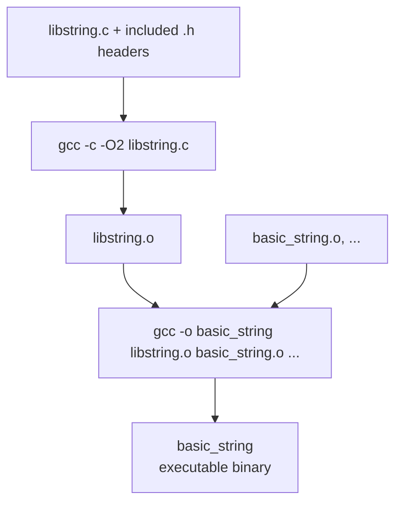
```mermaid
flowchart TB
    SRC["libstring.c + included .h headers"] --> COMPILE["gcc -c -O2 libstring.c"]
    COMPILE --> OBJ["libstring.o"]
    OBJ --> LINK["gcc -o basic_string libstring.o basic_string.o ..."]
    MORE["basic_string.o, ..."] --> LINK
    LINK --> OUT["basic_string<br/>executable binary"]
```

</ReadmeVisual>

<!-- README_ASSET mermaid-652 -->
<ReadmeVisual kind="mermaid" :width="980">

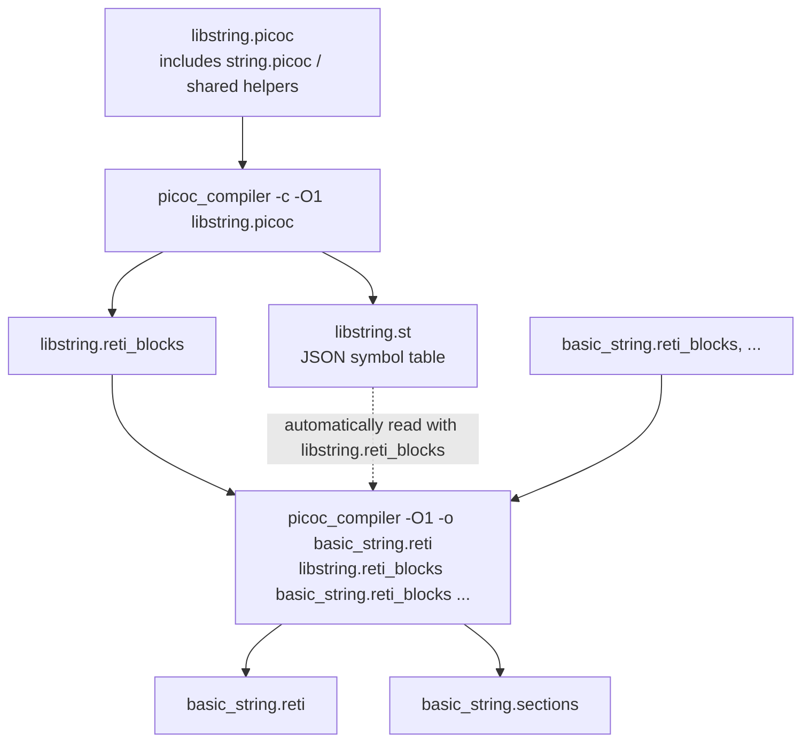
```mermaid
flowchart TB
    SRC["libstring.picoc<br/>includes string.picoc / shared helpers"] --> COMPILE["picoc_compiler -c -O1 libstring.picoc"]
    COMPILE --> OBJ["libstring.reti_blocks"]
    COMPILE --> SYMBOLS["libstring.st<br/>JSON symbol table"]
    OBJ --> LINK["picoc_compiler -O1 -o basic_string.reti<br/>libstring.reti_blocks basic_string.reti_blocks ..."]
    SYMBOLS -.->|automatically read with libstring.reti_blocks| LINK
    MORE["basic_string.reti_blocks, ..."] --> LINK
    LINK --> RETI["basic_string.reti"]
    LINK --> SECTIONS["basic_string.sections"]
```

</ReadmeVisual>

</div>

</div>

---

<!-- SOURCE Pico-OS/README.md#113-system-v-abi-stack-frames-and-call-cleanup -->

# 1. Toolchain extensions for PicoOS · 1.1 PicoC-Compiler extensions

## 1.1.3 System V ABI stack frames and call cleanup

<div class="deck-content readme-slide">

<div class="readme-list"><ul><li>Shared convention: C, assembly, startup, interrupts</li>
<li>BAF identifies stack frame</li>
<li>Caller pushes arguments + continuation</li>
<li>Caller removes arguments after return</li>
<li>Callee restores BAF; result in IN2</li></ul></div>
<aside class="context-note"><b>System V ABI</b><ul><li>General model adapted to RETI</li>
<li>Different from AMD64 ABI</li></ul></aside>

</div>

---

<!-- SOURCE Pico-OS/README.md#1131-stack-frame-layout-and-caller-cleanup -->

# 1. Toolchain extensions for PicoOS · 1.1 PicoC-Compiler extensions · 1.1.3 System V ABI stack frames and call cleanup

## 1.1.3.1 Stack-frame layout and caller cleanup

<div class="deck-content readme-slide">

<div class="readme-artifacts layout-single">

<!-- README_ASSET table-689 -->
<ReadmeVisual kind="table" :width="1080" data-table-key="table-689:1,2,3,4,5,6,7,8,9,10,11,12,13,14">

<div class="table-panels" v-pre><div class="readme-table"><table><colgroup><col style="width:27.60%" /><col style="width:44.05%" /><col style="width:28.36%" /></colgroup><thead><tr><th>Position</th><th>Contents</th><th>Managed by</th></tr></thead><tbody><tr data-source-row="1"><td class="table-key"><ul><li><strong>Higher addresses ↑</strong></li></ul></td><td><ul><li>Earlier stack contents</li></ul></td><td><ul><li>Earlier calls</li></ul></td></tr>
<tr data-source-row="2"><td class="table-key"><ul><li><em><code>caller BAF + 3</code></em></li></ul></td><td><ul><li>Caller argument</li></ul></td><td><ul><li>Caller’s caller</li></ul></td></tr>
<tr data-source-row="3"><td class="table-key"><ul><li><em><code>caller BAF + 2</code></em></li></ul></td><td><ul><li>Caller return address</li></ul></td><td><ul><li>Caller’s caller</li></ul></td></tr>
<tr data-source-row="4"><td class="table-key"><ul><li><em><code>caller BAF + 1</code></em></li></ul></td><td><ul><li>Saved caller frame pointer</li></ul></td><td><ul><li>Caller frame</li></ul></td></tr>
<tr data-source-row="5"><td class="table-key"><ul><li><em><code>caller BAF</code></em></li></ul></td><td><ul><li>Caller local</li></ul></td><td><ul><li>Caller frame</li></ul></td></tr>
<tr data-source-row="6"><td class="table-key"><ul><li><em><code>caller BAF - 1</code></em></li></ul></td><td><ul><li>Retained temporary expression</li></ul></td><td><ul><li>Caller expression</li></ul></td></tr>
<tr data-source-row="7"><td class="table-key"><ul><li><strong><code>BAF + 4</code></strong></li></ul></td><td><ul><li>Second argument (arg2)</li></ul></td><td><ul><li>Caller</li></ul></td></tr>
<tr data-source-row="8"><td class="table-key"><ul><li><strong><code>BAF + 3</code></strong></li></ul></td><td><ul><li>First argument (arg1)</li></ul></td><td><ul><li>Caller</li></ul></td></tr>
<tr data-source-row="9"><td class="table-key"><ul><li><strong><code>BAF + 2</code></strong></li></ul></td><td><ul><li>Return continuation address</li></ul></td><td><ul><li>Caller</li></ul></td></tr>
<tr data-source-row="10"><td class="table-key"><ul><li><strong><code>BAF + 1</code></strong></li></ul></td><td><ul><li>Saved caller BAF</li></ul></td><td><ul><li>Callee</li></ul></td></tr>
<tr data-source-row="11"><td class="table-key"><ul><li><strong><code>BAF</code></strong></li></ul></td><td><ul><li>First local</li></ul></td><td><ul><li>Callee</li></ul></td></tr>
<tr data-source-row="12"><td class="table-key"><ul><li><strong><code>BAF - 1</code>, ...</strong></li></ul></td><td><ul><li>More locals + temporaries</li></ul></td><td><ul><li>Callee</li></ul></td></tr>
<tr data-source-row="13"><td class="table-key"><ul><li><strong><code>SP</code></strong></li></ul></td><td><ul><li>Free cell below occupied stack</li></ul></td><td><ul><li>Current stack boundary</li></ul></td></tr>
<tr data-source-row="14"><td class="table-key"><ul><li><strong>Lower addresses ↓</strong></li></ul></td><td><ul><li>Stack grows toward lower addresses</li></ul></td><td><ul></ul></td></tr></tbody></table></div></div>

</ReadmeVisual>

</div>

</div>

---

<!-- SOURCE Pico-OS/README.md#1132-shared-function-epilogue-and-return-values -->

# 1. Toolchain extensions for PicoOS · 1.1 PicoC-Compiler extensions · 1.1.3 System V ABI stack frames and call cleanup

## 1.1.3.2 Shared function epilogue and return values (1)

<div class="deck-content readme-slide">

<div class="readme-artifacts layout-stacked">

<!-- README_ASSET mermaid-723 -->
<ReadmeVisual kind="mermaid" :width="980">

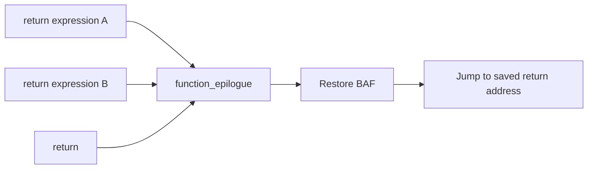
```mermaid
flowchart LR
    return_a["return expression A"] --> epilogue["function_epilogue"]
    return_b["return expression B"] --> epilogue
    return_void["return"] --> epilogue
    epilogue --> restore["Restore BAF"]
    restore --> caller["Jump to saved return address"]
```

</ReadmeVisual>

<!-- README_ASSET code-735 -->
<ReadmeVisual kind="code" :width="980" data-code-source="code-735" data-code-part="1">

<!-- README_CODE_PART code-735 lines=1-7 -->
<div class="readme-code">

```c {lines:false}
int add_one(int value) {
    return value + 1;
}

int main(void) {
    return add_one(41);
}
```

</div>

</ReadmeVisual>

</div>

</div>

---

<!-- SOURCE Pico-OS/README.md#1132-shared-function-epilogue-and-return-values -->

# 1. Toolchain extensions for PicoOS · 1.1 PicoC-Compiler extensions · 1.1.3 System V ABI stack frames and call cleanup

## 1.1.3.2 Shared function epilogue and return values (2)

<div class="deck-content readme-slide">

<div class="readme-artifacts layout-command-above">

<!-- README_ASSET code-748 -->
<ReadmeVisual kind="code" :width="980" class="command-strip" data-code-source="code-748" data-code-part="1" style="flex:0 0 46px">

<!-- README_CODE_PART code-748 lines=1-1 -->
<div class="readme-code readme-terminal">

```console {lines:false}
$ picoc_compiler -c -O1 -v -w normal-function.picoc
```

</div>

</ReadmeVisual>

<!-- README_ASSET code-754 -->
<div class="code-columns">

<ReadmeVisual kind="code" :width="680" data-code-source="code-754" data-code-part="1">

<!-- README_CODE_PART code-754 lines=1-13 -->
<div class="readme-code">

```text {lines:false}
_global_inits:
add_one:
  NewStackframe(Num('0'))
  Exp(StackframeParam(Num('0')))
  Exp(Num('1'))
  Exp(BinOp(Stack(Num('2')), Add(), Stack(Num('1'))))
  Assign(IN2, Stack(Num('1')))
  Exp(GoTo(Name('add_one_epilogue')))
add_one_epilogue:
  RestoreStackframe()
  RestoreReturnAddress()
main:
  NewStackframe(Num('0'))
```

</div>

</ReadmeVisual>

<ReadmeVisual kind="code" :width="680" data-code-source="code-754" data-code-part="2">

<!-- README_CODE_PART code-754 lines=14-26 -->
<div class="readme-code">

```text {lines:false}
  // Call(Name('add_one'), [Num('41')])
  Exp(Num('41'))
  SaveReturnAddress(Name('main_cont.3'))
  Exp(FunRef(Name('add_one')))
  Exp(GoTo(Stack(Num('1'))))
main_cont.3:
  RemoveArguments(Num('1'))
  Exp(IN2)
  Assign(IN2, Stack(Num('1')))
  Exp(GoTo(Name('main_epilogue')))
main_epilogue:
  RestoreStackframe()
  RestoreReturnAddress()
```

</div>

</ReadmeVisual>

</div>

</div>

</div>

---

<!-- SOURCE Pico-OS/README.md#1132-shared-function-epilogue-and-return-values -->

# 1. Toolchain extensions for PicoOS · 1.1 PicoC-Compiler extensions · 1.1.3 System V ABI stack frames and call cleanup

## 1.1.3.2 Shared function epilogue and return values (3)

<div class="deck-content readme-slide">

<div class="readme-artifacts layout-single">

<!-- README_ASSET code-787 -->
<div class="code-columns">

<ReadmeVisual kind="code" :width="680" data-code-source="code-787" data-code-part="1">

<!-- README_CODE_PART code-787 lines=1-34 -->
<div class="readme-code">

```text {lines:false}
  .ivt
  .text
add_one:
  # NewStackframe(Num('0'))
  PUSH BAF
  MOVE SP BAF
  SUBI SP 0
  # Exp(StackframeParam(Num('0')))
  LOADIN BAF ACC 3
  PUSH ACC
  # Exp(Num('1'))
  LOADI ACC 1
  PUSH ACC
  # Exp(BinOp(Stack(Num('2')), Add(), Stack(Num('1'))))
  LOADIN SP ACC 2
  LOADIN SP IN2 1
  ADD ACC IN2
  STOREIN SP ACC 2
  ADDI SP 1
  # Assign(IN2, Stack(Num('1')))
  POP IN2
  # Exp(GoTo(Name('add_one_epilogue')))
  JUMP32 add_one_epilogue
add_one_epilogue:
  # RestoreStackframe()
  MOVE BAF SP
  POP BAF
  # RestoreReturnAddress()
  POP IN1
  MOVE IN1 PC
main:
  # NewStackframe(Num('0'))
  PUSH BAF
  MOVE SP BAF
```

</div>

</ReadmeVisual>

<ReadmeVisual kind="code" :width="680" data-code-source="code-787" data-code-part="2">

<!-- README_CODE_PART code-787 lines=35-67 -->
<div class="readme-code">

```text {lines:false}
  SUBI SP 0
  # // Call(Name('add_one'), [Num('41')])
  # Exp(Num('41'))
  LOADI ACC 41
  PUSH ACC
  # SaveReturnAddress(Name('main_cont.3'))
  LOADI32 ACC main_cont.3
  ADD ACC CS
  PUSH ACC
  # Exp(FunRef(Name('add_one')))
  LOADI32 ACC add_one
  ADD ACC CS
  PUSH ACC
  # Exp(GoTo(Stack(Num('1'))))
  POP ACC
  MOVE ACC PC
main_cont.3:
  # RemoveArguments(Num('1'))
  ADDI SP 1
  # Exp(IN2)
  PUSH IN2
  # Assign(IN2, Stack(Num('1')))
  POP IN2
  # Exp(GoTo(Name('main_epilogue')))
  JUMP32 main_epilogue
main_epilogue:
  # RestoreStackframe()
  MOVE BAF SP
  POP BAF
  # RestoreReturnAddress()
  POP IN1
  MOVE IN1 PC
  .data
```

</div>

</ReadmeVisual>

</div>

</div>

</div>

---

<!-- SOURCE Pico-OS/README.md#1133-naked-functions-without-a-generated-frame -->

# 1. Toolchain extensions for PicoOS · 1.1 PicoC-Compiler extensions · 1.1.3 System V ABI stack frames and call cleanup

## 1.1.3.3 Naked functions without a generated frame (1)

<div class="deck-content readme-slide">

<div class="readme-artifacts layout-single">

<!-- README_ASSET code-874 -->
<ReadmeVisual kind="code" :width="980" data-code-source="code-874" data-code-part="1">

<!-- README_CODE_PART code-874 lines=1-11 -->
<div class="readme-code">

```c {lines:false}
__attribute__((naked))
int constant(void) {
    asm("LOADI IN2 7");
    asm("LOADIN SP ACC 1");
    asm("ADDI SP 1");
    asm("MOVE ACC PC");
}

int main(void) {
    return constant();
}
```

</div>

</ReadmeVisual>

</div>

</div>

---

<!-- SOURCE Pico-OS/README.md#1133-naked-functions-without-a-generated-frame -->

# 1. Toolchain extensions for PicoOS · 1.1 PicoC-Compiler extensions · 1.1.3 System V ABI stack frames and call cleanup

## 1.1.3.3 Naked functions without a generated frame (2)

<div class="deck-content readme-slide">

<div class="readme-artifacts layout-command-above">

<!-- README_ASSET code-891 -->
<ReadmeVisual kind="code" :width="980" class="command-strip" data-code-source="code-891" data-code-part="1" style="flex:0 0 46px">

<!-- README_CODE_PART code-891 lines=1-1 -->
<div class="readme-code readme-terminal">

```console {lines:false}
$ picoc_compiler -c -O1 naked-function.picoc
```

</div>

</ReadmeVisual>

<!-- README_ASSET code-895 -->
<div class="code-columns">

<ReadmeVisual kind="code" :width="680" data-code-source="code-895" data-code-part="1">

<!-- README_CODE_PART code-895 lines=1-15 -->
<div class="readme-code">

```text {lines:false}
  .ivt
  .text
constant:
  LOADI IN2 7
  LOADIN SP ACC 1
  ADDI SP 1
  MOVE ACC PC
main:
  PUSH BAF
  MOVE SP BAF
  SUBI SP 0
  LOADI32 ACC main_cont.2
  ADD ACC CS
  PUSH ACC
  LOADI32 ACC constant
```

</div>

</ReadmeVisual>

<ReadmeVisual kind="code" :width="680" data-code-source="code-895" data-code-part="2">

<!-- README_CODE_PART code-895 lines=16-29 -->
<div class="readme-code">

```text {lines:false}
  ADD ACC CS
  PUSH ACC
  POP ACC
  MOVE ACC PC
main_cont.2:
  PUSH IN2
  POP IN2
  JUMP32 main_epilogue
main_epilogue:
  MOVE BAF SP
  POP BAF
  POP IN1
  MOVE IN1 PC
  .data
```

</div>

</ReadmeVisual>

</div>

</div>

</div>

---

<!-- SOURCE Pico-OS/README.md#114-placing-globals-in-ivt-with-sectionivt -->

# 1. Toolchain extensions for PicoOS · 1.1 PicoC-Compiler extensions

## 1.1.4 Placing globals in `.ivt` with `section("ivt")` (1)

<div class="deck-content readme-slide">

<div class="readme-artifacts layout-single">

<!-- README_ASSET code-948 -->
<ReadmeVisual kind="code" :width="980" data-code-source="code-948" data-code-part="1">

<!-- README_CODE_PART code-948 lines=1-13 -->
<div class="readme-code">

```c {lines:false}
void handler(void);

__attribute__((section("ivt")))
void (*ivt_table[1])(void) = {handler};

void (*ordinary_table[1])(void) = {handler};

void handler(void) {
}

int main(void) {
    return 0;
}
```

</div>

</ReadmeVisual>

</div>

</div>

---

<!-- SOURCE Pico-OS/README.md#114-placing-globals-in-ivt-with-sectionivt -->

# 1. Toolchain extensions for PicoOS · 1.1 PicoC-Compiler extensions

## 1.1.4 Placing globals in `.ivt` with `section("ivt")` (2)

<div class="deck-content readme-slide">

<div class="readme-artifacts layout-command-above">

<!-- README_ASSET code-967 -->
<ReadmeVisual kind="code" :width="980" class="command-strip" data-code-source="code-967" data-code-part="1" style="flex:0 0 46px">

<!-- README_CODE_PART code-967 lines=1-1 -->
<div class="readme-code readme-terminal">

```console {lines:false}
$ picoc_compiler -c -O1 section-placement.picoc
```

</div>

</ReadmeVisual>

<!-- README_ASSET code-973 -->
<div class="code-columns">

<ReadmeVisual kind="code" :width="680" data-code-source="code-973" data-code-part="1">

<!-- README_CODE_PART code-973 lines=1-15 -->
<div class="readme-code">

```text {lines:false}
  .ivt
ivt_table:
  IVTE handler
  .text
handler:
  PUSH BAF
  MOVE SP BAF
  SUBI SP 0
  JUMP32 handler_epilogue
handler_epilogue:
  MOVE BAF SP
  POP BAF
  POP IN1
  MOVE IN1 PC
main:
```

</div>

</ReadmeVisual>

<ReadmeVisual kind="code" :width="680" data-code-source="code-973" data-code-part="2">

<!-- README_CODE_PART code-973 lines=16-30 -->
<div class="readme-code">

```text {lines:false}
  PUSH BAF
  MOVE SP BAF
  SUBI SP 0
  LOADI ACC 0
  PUSH ACC
  POP IN2
  JUMP32 main_epilogue
main_epilogue:
  MOVE BAF SP
  POP BAF
  POP IN1
  MOVE IN1 PC
  .data
ordinary_table:
  IVTE handler
```

</div>

</ReadmeVisual>

</div>

</div>

</div>

---

<!-- SOURCE Pico-OS/README.md#114-placing-globals-in-ivt-with-sectionivt -->

# 1. Toolchain extensions for PicoOS · 1.1 PicoC-Compiler extensions

## 1.1.4 Placing globals in `.ivt` with `section("ivt")` (3)

<div class="deck-content readme-slide">

<div class="readme-artifacts layout-command-above">

<!-- README_ASSET code-1009 -->
<ReadmeVisual kind="code" :width="980" class="command-strip" data-code-source="code-1009" data-code-part="1" style="flex:0 0 46px">

<!-- README_CODE_PART code-1009 lines=1-1 -->
<div class="readme-code readme-terminal">

```console {lines:false}
$ picoc_compiler -O1 -v -o section-placement.reti section-placement.picoc
```

</div>

</ReadmeVisual>

<!-- README_ASSET code-1016 -->
<ReadmeVisual kind="code" :width="980" data-code-source="code-1016" data-code-part="1">

<!-- README_CODE_PART code-1016 lines=1-12 -->
<div class="readme-code">

```text {lines:false}
# // Block('ivt_table', [])
2147483668
# ...
# // Block('handler', [])
# NewStackframe(Num('0'))
SUBI SP 1
STOREIN SP BAF 1
MOVE SP BAF
SUBI SP 0
# ...
# // Block('ordinary_table', [])
2147483668
```

</div>

</ReadmeVisual>

</div>

</div>

---

<!-- SOURCE Pico-OS/README.md#1151-default-compiler-generated-_start -->

# 1. Toolchain extensions for PicoOS · 1.1 PicoC-Compiler extensions · 1.1.5 Selecting a startup function with `-C` / `--startup-source`

## 1.1.5.1 Default compiler-generated `_start`

<div class="deck-content readme-slide">

<div class="readme-artifacts layout-single">

<!-- README_ASSET code-1050 -->
<ReadmeVisual kind="code" :width="980" data-code-source="code-1050" data-code-part="1">

<!-- README_CODE_PART code-1050 lines=1-4 -->
<div class="readme-code">

```c {lines:false}
void _start(void) {
    main();
    Exit(0);
}
```

</div>

</ReadmeVisual>

</div>

</div>

---

<!-- SOURCE Pico-OS/README.md#1152-picoos-libstart-startup-sequence -->

# 1. Toolchain extensions for PicoOS · 1.1 PicoC-Compiler extensions · 1.1.5 Selecting a startup function with `-C` / `--startup-source`

## 1.1.5.2 PicoOS `libstart` startup sequence

<div class="deck-content readme-slide">

<div class="readme-artifacts layout-columns">

<!-- README_ASSET code-1072 -->
<ReadmeVisual kind="code" :width="580" data-code-source="code-1072" data-code-part="1">

<!-- README_CODE_PART code-1072 lines=1-3 -->
<div class="readme-code">

```c {lines:false}
// dependencies: ../stdlib/libstdlib.reti_blocks

#include "start.picoc"
```

</div>

</ReadmeVisual>

<!-- README_ASSET code-1081 -->
<ReadmeVisual kind="code" :width="580" data-code-source="code-1081" data-code-part="1">

<!-- README_CODE_PART code-1081 lines=1-16 -->
<div class="readme-code">

```c {lines:false}
#include "../stdlib/stdlib.header"
#include "../unistd/unistd.header"

int main(int argc, char **argv);
void initialize_environment(char **environment);

void start_process(int argc, char **argv) {
    init_process_heap();
    initialize_environment(argv + argc + 1);
    exit(main(argc, argv));
}

__attribute__((naked))
void _start(int argc, char *first_argument) {
    start_process(argc, (char **)&first_argument);
}
```

</div>

</ReadmeVisual>

</div>

</div>

---

<!-- SOURCE Pico-OS/README.md#1153-startup-functions-used-by-picoos-images -->

# 1. Toolchain extensions for PicoOS · 1.1 PicoC-Compiler extensions · 1.1.5 Selecting a startup function with `-C` / `--startup-source`

## 1.1.5.3 Startup functions used by PicoOS images

<div class="deck-content readme-slide">

<div class="readme-artifacts layout-single">

<!-- README_ASSET table-1112 -->
<ReadmeVisual kind="table" :width="1080" data-table-key="table-1112:1,2,3,4,5">

<div class="table-panels" v-pre><div class="readme-table"><table><colgroup><col style="width:24.20%" /><col style="width:52.37%" /><col style="width:23.44%" /></colgroup><thead><tr><th>Image</th><th>_start used</th><th>Next function</th></tr></thead><tbody><tr data-source-row="1"><td class="table-key"><ul><li>EPROM bootloader</li></ul></td><td><ul><li>Explicit naked _start; no -C</li></ul></td><td><ul><li><span class="source-link"><code>boot_main()</code></span></li></ul></td></tr>
<tr data-source-row="2"><td class="table-key"><ul><li>SRAM kernel</li></ul></td><td><ul><li>Compiler-generated _start</li></ul></td><td><ul><li><span class="source-link"><code>main()</code></span></li></ul></td></tr>
<tr data-source-row="3"><td class="table-key"><ul><li>Init process</li></ul></td><td><ul><li>libstart; -C library/start/libstart.picoc</li></ul></td><td><ul><li><span class="source-link"><code>main()</code></span></li></ul></td></tr>
<tr data-source-row="4"><td class="table-key"><ul><li>Shell</li></ul></td><td><ul><li>Same libstart -C option</li></ul></td><td><ul><li><span class="source-link"><code>main()</code></span></li></ul></td></tr>
<tr data-source-row="5"><td class="table-key"><ul><li>User applications</li></ul></td><td><ul><li>Common userspace libstart link rule</li></ul></td><td><ul><li>Application main()</li></ul></td></tr></tbody></table></div></div>

</ReadmeVisual>

</div>

</div>

---

<!-- SOURCE Pico-OS/README.md#116-program-sections-interrupt-table-entries-and-linker-placement -->

# 1. Toolchain extensions for PicoOS · 1.1 PicoC-Compiler extensions

## 1.1.6 Program sections, interrupt table entries, and linker placement (1)

<div class="deck-content readme-slide">

<div class="readme-artifacts layout-columns">

<!-- README_ASSET code-1760 repeated -->
<ReadmeVisual kind="code" :width="616.1999999999999" data-code-source="code-1760" data-code-part="1">

<!-- README_CODE_PART code-1760 lines=1-8 -->
<div class="readme-code">

```c {lines:false}
__attribute__((section("ivt")))
void (*interrupt_vector_table[OS_INTERRUPT_VECTOR_COUNT])(void) = {
    syscall_interrupt,
    timer_interrupt,
    uart_interrupt,
    cpu_exception_interrupt,
    dma_interrupt
};
```

</div>

</ReadmeVisual>

<!-- README_ASSET code-1787 repeated -->
<ReadmeVisual kind="code" :width="580" data-code-source="code-1787" data-code-part="1">

<!-- README_CODE_PART code-1787 lines=1-4 -->
<div class="readme-code">

```c {lines:false}
__attribute__((naked))
void syscall_interrupt(void) {
    // ...
}
```

</div>

</ReadmeVisual>

</div>
<aside class="context-note"><b>Calling convention</b><ul><li>C helpers + inline assembly</li>
<li>Shared RETI stack-frame rules</li></ul></aside>

</div>

---

<!-- SOURCE Pico-OS/README.md#116-program-sections-interrupt-table-entries-and-linker-placement -->

# 1. Toolchain extensions for PicoOS · 1.1 PicoC-Compiler extensions

## 1.1.6 Program sections, interrupt table entries, and linker placement (2)

<div class="deck-content readme-slide">

<div class="readme-artifacts layout-single">

<!-- README_ASSET table-1126 -->
<ReadmeVisual kind="table" :width="1080" data-table-key="table-1126:1,2,3">

<div class="table-panels" v-pre><div class="readme-table"><table><colgroup><col style="width:18.09%" /><col style="width:40.78%" /><col style="width:41.14%" /></colgroup><thead><tr><th>Section</th><th>Default contents and addressing</th><th>How source selects it</th></tr></thead><tbody><tr data-source-row="1"><td class="table-key"><ul><li><code>.ivt</code></li></ul></td><td><ul><li>ISR words; CS-relative globals</li></ul></td><td><ul><li>section(&quot;ivt&quot;) attribute</li></ul></td></tr>
<tr data-source-row="2"><td class="table-key"><ul><li><code>.text</code></li></ul></td><td><ul><li>Entry + ordinary instructions; CS-relative</li></ul></td><td><ul><li>Default for functions</li></ul></td></tr>
<tr data-source-row="3"><td class="table-key"><ul><li><code>.data</code></li></ul></td><td><ul><li>Ordinary globals; DS-relative</li></ul></td><td><ul><li>Default for globals</li></ul></td></tr></tbody></table></div></div>

</ReadmeVisual>

</div>

</div>

---

<!-- SOURCE Pico-OS/README.md#117-reti-pseudoinstructions -->

# 1. Toolchain extensions for PicoOS · 1.1 PicoC-Compiler extensions

## 1.1.7 RETI pseudoinstructions

<div class="deck-content readme-slide">

<div class="readme-artifacts layout-single">

<!-- README_ASSET table-1152 -->
<ReadmeVisual kind="table" :width="1080" data-table-key="table-1152:1,2,3,4">

<div class="table-panels" v-pre><div class="readme-table"><table><colgroup><col style="width:31.86%" /><col style="width:37.40%" /><col style="width:30.74%" /></colgroup><thead><tr><th>Pseudoinstruction</th><th>Purpose</th><th>Concrete size</th></tr></thead><tbody><tr data-source-row="1"><td class="table-key"><ul><li><code>PUSH reg</code></li></ul></td><td><ul><li>Reserve cell; store register</li></ul></td><td><ul><li>2 instructions</li></ul></td></tr>
<tr data-source-row="2"><td class="table-key"><ul><li><code>POP reg</code></li></ul></td><td><ul><li>Load top cell; release cell</li></ul></td><td><ul><li>2 instructions</li></ul></td></tr>
<tr data-source-row="3"><td class="table-key"><ul><li><code>LOADI32 reg operand</code></li></ul></td><td><ul><li>Load 32-bit literal or linked address</li></ul></td><td><ul><li>3 instructions</li></ul></td></tr>
<tr data-source-row="4"><td class="table-key"><ul><li><code>JUMP32[relation] target</code></li></ul></td><td><ul><li>Jump beyond immediate range</li></ul></td><td><ul><li>4--6 instructions when retained</li></ul></td></tr></tbody></table></div></div>

</ReadmeVisual>

</div>

</div>

---

<!-- SOURCE Pico-OS/README.md#1171-interrupt-safe-push-and-pop -->

# 1. Toolchain extensions for PicoOS · 1.1 PicoC-Compiler extensions · 1.1.7 RETI pseudoinstructions

## 1.1.7.1 Interrupt-safe `PUSH` and `POP` (1)

<div class="deck-content readme-slide">

<div class="readme-artifacts layout-single">

<!-- README_ASSET table-1169 -->
<ReadmeVisual kind="table" :width="1080" data-table-key="table-1169:1,2">

<div class="table-panels" v-pre><div class="readme-table"><table><colgroup><col style="width:43.61%" /><col style="width:56.39%" /></colgroup><thead><tr><th>Pseudoinstruction</th><th>Expansion</th></tr></thead><tbody><tr data-source-row="1"><td class="table-key"><ul><li><code>PUSH ACC</code></li></ul></td><td><ul><li><code>SUBI SP 1</code></li><li><code>STOREIN SP ACC 1</code></li></ul></td></tr>
<tr data-source-row="2"><td class="table-key"><ul><li><code>POP ACC</code></li></ul></td><td><ul><li><code>LOADIN SP ACC 1</code></li><li><code>ADDI SP 1</code></li></ul></td></tr></tbody></table></div></div>

</ReadmeVisual>

</div>

</div>

---

<!-- SOURCE Pico-OS/README.md#1171-interrupt-safe-push-and-pop -->

# 1. Toolchain extensions for PicoOS · 1.1 PicoC-Compiler extensions · 1.1.7 RETI pseudoinstructions

## 1.1.7.1 Interrupt-safe `PUSH` and `POP` (2)

<div class="deck-content readme-slide">

<div class="readme-artifacts layout-single">

<!-- README_ASSET code-1183 -->
<ReadmeVisual kind="code" :width="980" data-code-source="code-1183" data-code-part="1">

<!-- README_CODE_PART code-1183 lines=1-5 -->
<div class="readme-code">

```c {lines:false}
asm("PUSH ACC");
asm("PUSH IN1");
/* Handle the interrupt */
asm("POP IN1");
asm("POP ACC");
```

</div>

</ReadmeVisual>

</div>

</div>

---

<!-- SOURCE Pico-OS/README.md#1172-loading-32-bit-values-with-loadi32 -->

# 1. Toolchain extensions for PicoOS · 1.1 PicoC-Compiler extensions · 1.1.7 RETI pseudoinstructions

## 1.1.7.2 Loading 32-bit values with `LOADI32` (1)

<div class="deck-content readme-slide">

<div class="readme-artifacts layout-columns">

<!-- README_ASSET code-1211 -->
<ReadmeVisual kind="code" :width="580" data-code-source="code-1211" data-code-part="1">

<!-- README_CODE_PART code-1211 lines=1-3 -->
<div class="readme-code">

```text {lines:false}
LOADI reg signed_upper
MULTI reg 1024
ORI reg lower_bits
```

</div>

</ReadmeVisual>

<!-- README_ASSET code-1223 -->
<ReadmeVisual kind="code" :width="580" data-code-source="code-1223" data-code-part="1">

<!-- README_CODE_PART code-1223 lines=1-3 -->
<div class="readme-code">

```text {lines:false}
LOADI ACC -2097152
MULTI ACC 1024
ORI ACC 5
```

</div>

</ReadmeVisual>

</div>

</div>

---

<!-- SOURCE Pico-OS/README.md#1172-loading-32-bit-values-with-loadi32 -->

# 1. Toolchain extensions for PicoOS · 1.1 PicoC-Compiler extensions · 1.1.7 RETI pseudoinstructions

## 1.1.7.2 Loading 32-bit values with `LOADI32` (2)

<div class="deck-content readme-slide">

<div class="readme-artifacts layout-single">

<!-- README_ASSET code-1233 -->
<ReadmeVisual kind="code" :width="980" data-code-source="code-1233" data-code-part="1">

<!-- README_CODE_PART code-1233 lines=1-3 -->
<div class="readme-code">

```c {lines:false}
asm("LOADI32 ACC start_loaded_kernel");
asm("ADD ACC CS");
asm("MOVE ACC PC");
```

</div>

</ReadmeVisual>

</div>

</div>

---

<!-- SOURCE Pico-OS/README.md#1173-long-jumps-with-jump32 -->

# 1. Toolchain extensions for PicoOS · 1.1 PicoC-Compiler extensions · 1.1.7 RETI pseudoinstructions

## 1.1.7.3 Long jumps with `JUMP32`

<div class="deck-content readme-slide">

<div class="readme-artifacts layout-single">

<!-- README_ASSET code-1275 -->
<ReadmeVisual kind="code" :width="980" data-code-source="code-1275" data-code-part="1">

<!-- README_CODE_PART code-1275 lines=1-5 -->
<div class="readme-code">

```text {lines:false}
LOADI ACC signed_upper
MULTI ACC 1024
ORI ACC lower_bits
ADD ACC CS
MOVE ACC PC
```

</div>

</ReadmeVisual>

</div>

</div>

---

<!-- SOURCE Pico-OS/README.md#1174-pseudoinstruction-expansion-during-linking -->

# 1. Toolchain extensions for PicoOS · 1.1 PicoC-Compiler extensions · 1.1.7 RETI pseudoinstructions

## 1.1.7.4 Pseudoinstruction expansion during linking (1)

<div class="deck-content readme-slide">

<div class="readme-artifacts layout-single">

<!-- README_ASSET image-1308 -->
<ReadmeVisual kind="image" :width="980">


</ReadmeVisual>

</div>

</div>

---

<!-- SOURCE Pico-OS/README.md#1174-pseudoinstruction-expansion-during-linking -->

# 1. Toolchain extensions for PicoOS · 1.1 PicoC-Compiler extensions · 1.1.7 RETI pseudoinstructions

## 1.1.7.4 Pseudoinstruction expansion during linking (2)

<div class="deck-content readme-slide">

<div class="readme-artifacts layout-single">

<!-- README_ASSET table-1310 -->
<ReadmeVisual kind="table" :width="1080" data-table-key="table-1310:1,2,3">

<div class="table-panels" v-pre><div class="readme-table"><table><colgroup><col style="width:22.80%" /><col style="width:45.54%" /><col style="width:31.67%" /></colgroup><thead><tr><th>Block</th><th>Symbolic instructions</th><th>Real instructions after expansion</th></tr></thead><tbody><tr data-source-row="1"><td class="table-key"><ul><li><code>entry</code></li></ul></td><td><ul><li><code>PUSH BAF</code>, <code>LOADI32 ACC done</code>, <code>JUMP32 done</code></li></ul></td><td><ul><li><code>2 + 3 + 5 = 10</code></li></ul></td></tr>
<tr data-source-row="2"><td class="table-key"><ul><li><code>work</code></li></ul></td><td><ul><li><code>PUSH ACC</code>, <code>POP IN1</code>, <code>LOADI32 ACC 7</code></li></ul></td><td><ul><li><code>2 + 2 + 3 = 7</code></li></ul></td></tr>
<tr data-source-row="3"><td class="table-key"><ul><li><code>done</code></li></ul></td><td><ul><li><code>POP BAF</code></li></ul></td><td><ul><li><code>2</code></li></ul></td></tr></tbody></table></div></div>

</ReadmeVisual>

</div>

</div>

---

<!-- SOURCE Pico-OS/README.md#118-linked-sections-metadata-and-the-five-word-binary-header -->

# 1. Toolchain extensions for PicoOS · 1.1 PicoC-Compiler extensions

## 1.1.8 Linked `.sections` metadata and the five-word binary header (1)

<div class="deck-content readme-slide">

<div class="readme-artifacts layout-single">

<!-- README_ASSET code-1336 -->
<ReadmeVisual kind="code" :width="980" data-code-source="code-1336" data-code-part="1">

<!-- README_CODE_PART code-1336 lines=1-7 -->
<div class="readme-code">

```json {lines:false}
{
  "codesegment_start": 0,
  "datasegment_start": 11595,
  "heap_start": 11621,
  "heap_size": 2000,
  "stack_start": 14621
}
```

</div>

</ReadmeVisual>

</div>

</div>

---

<!-- SOURCE Pico-OS/README.md#118-linked-sections-metadata-and-the-five-word-binary-header -->

# 1. Toolchain extensions for PicoOS · 1.1 PicoC-Compiler extensions

## 1.1.8 Linked `.sections` metadata and the five-word binary header (2)

<div class="deck-content readme-slide">

<div class="readme-artifacts layout-single">

<!-- README_ASSET table-1349 -->
<ReadmeVisual kind="table" :width="1080" data-table-key="table-1349:1,2,3,4,5,6">

<div class="table-panels" v-pre><div class="readme-table"><table><colgroup><col style="width:50.59%" /><col style="width:49.41%" /></colgroup><thead><tr><th>Entry</th><th>Meaning</th></tr></thead><tbody><tr data-source-row="1"><td class="table-key"><ul><li><code>interrupt_service_routines_start</code></li></ul></td><td><ul><li>Optional ISR code start</li></ul></td></tr>
<tr data-source-row="2"><td class="table-key"><ul><li><code>codesegment_start</code></li></ul></td><td><ul><li>Initial CS + entry region</li></ul></td></tr>
<tr data-source-row="3"><td class="table-key"><ul><li><code>datasegment_start</code></li></ul></td><td><ul><li>Initial DS</li></ul></td></tr>
<tr data-source-row="4"><td class="table-key"><ul><li><span class="source-link"><code>heap_start</code></span></li></ul></td><td><ul><li>First process-local heap cell</li></ul></td></tr>
<tr data-source-row="5"><td class="table-key"><ul><li><span class="source-link"><code>heap_size</code></span></li></ul></td><td><ul><li>Capacity in cells; −1 → default</li></ul></td></tr>
<tr data-source-row="6"><td class="table-key"><ul><li><span class="source-link"><code>stack_start</code></span></li></ul></td><td><ul><li>Highest stack cell; −1 → default</li></ul></td></tr></tbody></table></div></div>

</ReadmeVisual>

</div>

</div>

---

<!-- SOURCE Pico-OS/README.md#118-linked-sections-metadata-and-the-five-word-binary-header -->

# 1. Toolchain extensions for PicoOS · 1.1 PicoC-Compiler extensions

## 1.1.8 Linked `.sections` metadata and the five-word binary header (3)

<div class="deck-content readme-slide">

<div class="readme-artifacts layout-single">

<!-- README_ASSET mermaid-1366 -->
<ReadmeVisual kind="mermaid" :width="980">

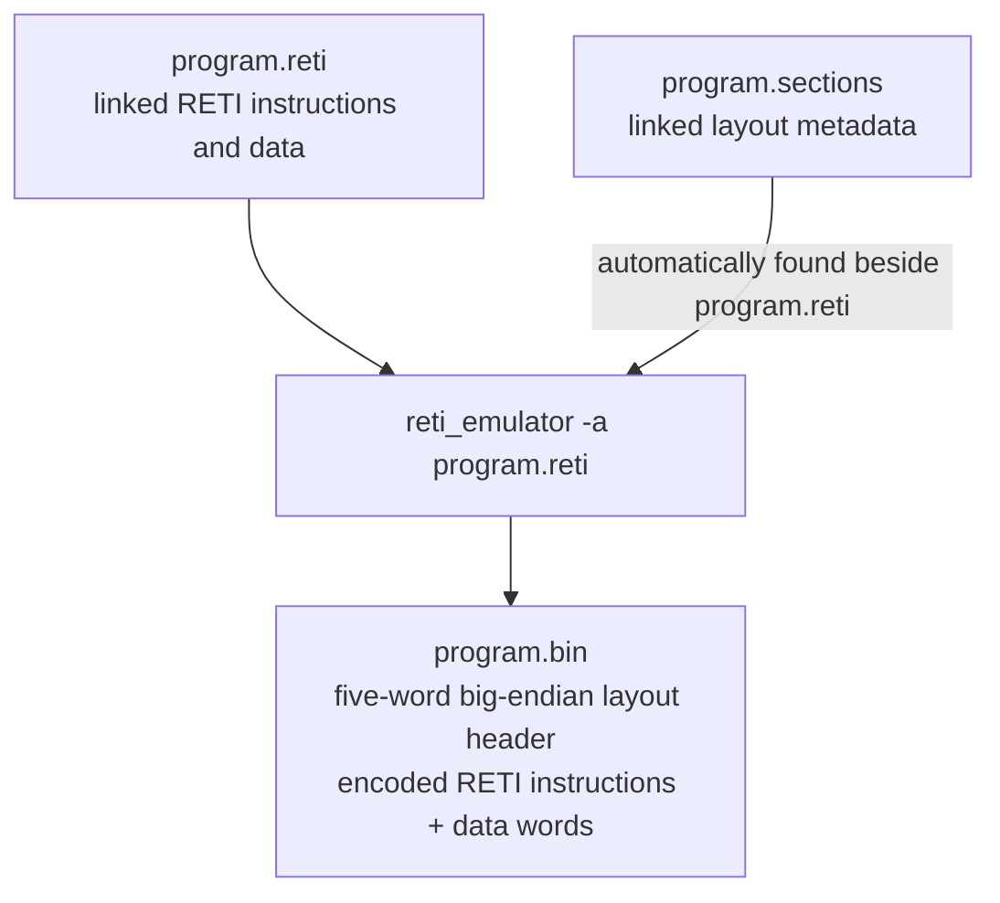
```mermaid
flowchart TB
    RETI["program.reti<br/>linked RETI instructions and data"] --> ASSEMBLE["reti_emulator -a program.reti"]
    SECTIONS["program.sections<br/>linked layout metadata"] -->|automatically found beside program.reti| ASSEMBLE
    ASSEMBLE --> BIN["program.bin<br/>five-word big-endian layout header<br/>encoded RETI instructions + data words"]
```

</ReadmeVisual>

</div>

</div>

---

<!-- SOURCE Pico-OS/README.md#118-linked-sections-metadata-and-the-five-word-binary-header -->

# 1. Toolchain extensions for PicoOS · 1.1 PicoC-Compiler extensions

## 1.1.8 Linked `.sections` metadata and the five-word binary header (4)

<div class="deck-content readme-slide">

<div class="readme-artifacts layout-single">

<!-- README_ASSET code-1376 -->
<ReadmeVisual kind="code" :width="980" data-code-source="code-1376" data-code-part="1">

<!-- README_CODE_PART code-1376 lines=1-6 -->
<div class="readme-code readme-terminal">

```console {lines:false}
$ reti_emulator -a program.reti
$ hexyl -n 20 program.bin
┌────────┬─────────────────────────┬─────────────────────────┬────────┬────────┐
│00000000│ 00 00 00 00 00 00 2d 4b ┊ 00 00 2d 65 00 00 07 d0 │......-K┊..-e....│
│00000010│ 00 00 39 1d             ┊                         │..9.    ┊        │
└────────┴─────────────────────────┴─────────────────────────┴────────┴────────┘
```

</div>

</ReadmeVisual>

</div>

</div>

---

<!-- SOURCE Pico-OS/README.md#118-linked-sections-metadata-and-the-five-word-binary-header -->

# 1. Toolchain extensions for PicoOS · 1.1 PicoC-Compiler extensions

## 1.1.8 Linked `.sections` metadata and the five-word binary header (5)

<div class="deck-content readme-slide">

<div class="readme-artifacts layout-single">

<!-- README_ASSET table-1390 -->
<ReadmeVisual kind="table" :width="1080" data-table-key="table-1390:1,2,3,4,5">

<div class="table-panels" v-pre><div class="readme-table"><table><colgroup><col style="width:24.34%" /><col style="width:32.71%" /><col style="width:42.96%" /></colgroup><thead><tr><th>Word</th><th>Value</th><th>Use in PicoOS</th></tr></thead><tbody><tr data-source-row="1"><td class="table-key"><ul><li>0</li></ul></td><td><ul><li><code>codesegment_start</code></li></ul></td><td><ul><li>Initial CS + entry</li></ul></td></tr>
<tr data-source-row="2"><td class="table-key"><ul><li>1</li></ul></td><td><ul><li><code>datasegment_start</code></li></ul></td><td><ul><li>Initial DS</li></ul></td></tr>
<tr data-source-row="3"><td class="table-key"><ul><li>2</li></ul></td><td><ul><li><span class="source-link"><code>heap_start</code></span></li></ul></td><td><ul><li>Process-local heap start</li></ul></td></tr>
<tr data-source-row="4"><td class="table-key"><ul><li>3</li></ul></td><td><ul><li><span class="source-link"><code>heap_size</code></span></li></ul></td><td><ul><li>Configured cells; −1 → default</li></ul></td></tr>
<tr data-source-row="5"><td class="table-key"><ul><li>4</li></ul></td><td><ul><li><span class="source-link"><code>stack_start</code></span></li></ul></td><td><ul><li>Highest stack cell; −1 → default</li></ul></td></tr></tbody></table></div></div>

</ReadmeVisual>

</div>

</div>

---

<!-- SOURCE Pico-OS/README.md#119-generated-memory-constants-for-the-bootloader-and-kernel -->

# 1. Toolchain extensions for PicoOS · 1.1 PicoC-Compiler extensions

## 1.1.9 Generated memory constants for the bootloader and kernel (1)

<div class="deck-content readme-slide">

<div class="readme-artifacts layout-single">

<!-- README_ASSET code-1416 -->
<ReadmeVisual kind="code" :width="980" data-code-source="code-1416" data-code-part="1">

<!-- README_CODE_PART code-1416 lines=1-9 -->
<div class="readme-code">

```c {lines:false}
#define SRAM_BASE (-2147483647 - 1) // -2^31
#define SRAM_MAX_ADDRESS_IN_MEMORY_MAP -2147221505 // -2^31 + 2^18 - 1
#define KERNEL_HEAP_START -2147442151 // -2^31 + heap_start
#define KERNEL_HEAP_SIZE 4096 // heap_size
#define PROCESS_MEMORY_START -2147435339 // -2^31 + stack_start + 1
#define KERNEL_CS_START_ASM "LOADI32 CS -2147483643" // -2^31 + codesegment_start
#define KERNEL_DS_START_ASM "LOADI32 DS -2147442882" // -2^31 + datasegment_start
#define KERNEL_SP_START_ASM "LOADI32 SP -2147435340" // -2^31 + stack_start
#define KERNEL_CS_ACC_ASM "LOADI32 ACC -2147483643" // -2^31 + codesegment_start
```

</div>

</ReadmeVisual>

</div>

</div>

---

<!-- SOURCE Pico-OS/README.md#119-generated-memory-constants-for-the-bootloader-and-kernel -->

# 1. Toolchain extensions for PicoOS · 1.1 PicoC-Compiler extensions

## 1.1.9 Generated memory constants for the bootloader and kernel (2)

<div class="deck-content readme-slide">

<div class="readme-artifacts layout-single">

<!-- README_ASSET table-1430 -->
<ReadmeVisual kind="table" :width="1080" data-table-key="table-1430:1,2,3,4,5,6,7">

<div class="table-panels" v-pre><div class="readme-table"><table><colgroup><col style="width:53.02%" /><col style="width:46.98%" /></colgroup><thead><tr><th>Kernel constant</th><th>Consumer and purpose</th></tr></thead><tbody><tr data-source-row="1"><td class="table-key"><ul><li><span class="source-link"><code>SRAM_BASE</code></span></li></ul></td><td><ul><li>Relative → absolute SRAM addresses</li></ul></td></tr>
<tr data-source-row="2"><td class="table-key"><ul><li><span class="source-link"><code>SRAM_MAX_ADDRESS_IN_MEMORY_MAP</code></span></li></ul></td><td><ul><li>Inclusive outer-heap limit</li></ul></td></tr>
<tr data-source-row="3"><td class="table-key"><ul><li><span class="source-link"><code>KERNEL_HEAP_START</code></span>, <span class="source-link"><code>KERNEL_HEAP_SIZE</code></span></li></ul></td><td><ul><li>Kernel Heap bounds + stack boundary</li></ul></td></tr>
<tr data-source-row="4"><td class="table-key"><ul><li><span class="source-link"><code>PROCESS_MEMORY_START</code></span></li></ul></td><td><ul><li>First Process/Shared Data Heap cell</li></ul></td></tr>
<tr data-source-row="5"><td class="table-key"><ul><li><span class="source-link"><code>KERNEL_CS_START_ASM</code></span>, <span class="source-link"><code>KERNEL_DS_START_ASM</code></span></li></ul></td><td><ul><li>Install kernel CS + DS</li></ul></td></tr>
<tr data-source-row="6"><td class="table-key"><ul><li><span class="source-link"><code>KERNEL_SP_START_ASM</code></span></li></ul></td><td><ul><li>Install kernel SP</li></ul></td></tr>
<tr data-source-row="7"><td class="table-key"><ul><li><span class="source-link"><code>KERNEL_CS_ACC_ASM</code></span></li></ul></td><td><ul><li>Load kernel code base; currently unused</li></ul></td></tr></tbody></table></div></div>

</ReadmeVisual>

</div>

</div>

---

<!-- SOURCE Pico-OS/README.md#119-generated-memory-constants-for-the-bootloader-and-kernel -->

# 1. Toolchain extensions for PicoOS · 1.1 PicoC-Compiler extensions

## 1.1.9 Generated memory constants for the bootloader and kernel (3)

<div class="deck-content readme-slide">

<div class="readme-artifacts layout-single">

<!-- README_ASSET code-1444 -->
<ReadmeVisual kind="code" :width="980" data-code-source="code-1444" data-code-part="1">

<!-- README_CODE_PART code-1444 lines=1-3 -->
<div class="readme-code">

```c {lines:false}
#define SRAM_MAX_ADDRESS 262143 // 2^18 - 1
#define EPROM_DS_START_ASM "LOADI32 DS 3165" // datasegment_start
#define EPROM_STACK_START_ASM "LOADI32 SP -2147221505" // -2^31 + 2^18 - 1
```

</div>

</ReadmeVisual>

</div>

</div>

---

<!-- SOURCE Pico-OS/README.md#119-generated-memory-constants-for-the-bootloader-and-kernel -->

# 1. Toolchain extensions for PicoOS · 1.1 PicoC-Compiler extensions

## 1.1.9 Generated memory constants for the bootloader and kernel (4)

<div class="deck-content readme-slide">

<div class="readme-artifacts layout-single">

<!-- README_ASSET table-1450 -->
<ReadmeVisual kind="table" :width="1080" data-table-key="table-1450:1,2,3">

<div class="table-panels" v-pre><div class="readme-table"><table><colgroup><col style="width:48.29%" /><col style="width:51.71%" /></colgroup><thead><tr><th>Bootloader constant</th><th>Consumer and purpose</th></tr></thead><tbody><tr data-source-row="1"><td class="table-key"><ul><li><span class="source-link"><code>SRAM_MAX_ADDRESS</code></span></li></ul></td><td><ul><li>Physical SRAM limit; fallback stack</li></ul></td></tr>
<tr data-source-row="2"><td class="table-key"><ul><li><span class="source-link"><code>EPROM_DS_START_ASM</code></span></li></ul></td><td><ul><li>Install linked EPROM DS</li></ul></td></tr>
<tr data-source-row="3"><td class="table-key"><ul><li><span class="source-link"><code>EPROM_STACK_START_ASM</code></span></li></ul></td><td><ul><li>Temporary stack at SRAM top</li></ul></td></tr></tbody></table></div></div>

</ReadmeVisual>

</div>

</div>

---

<!-- SOURCE Pico-OS/README.md#12-reti-emulator-extensions -->

# 1. Toolchain extensions for PicoOS

## 1.2 RETI-Emulator extensions (1)

<div class="deck-content readme-slide">

<div class="readme-artifacts layout-single">

<!-- README_ASSET table-1470 -->
<ReadmeVisual kind="table" :width="1324" data-table-key="table-1470:1,2,3,4,5,6,7,8,9,10,11,12,13">

<div class="table-panels table-panels-two" v-pre><div class="readme-table"><table><colgroup><col style="width:37.58%" /><col style="width:62.42%" /></colgroup><thead><tr><th>Feature</th><th>Contribution</th></tr></thead><tbody><tr data-source-row="1"><td class="table-key"><ul><li>Plain execution output</li></ul></td><td><ul><li>UART output → host stdout</li></ul></td></tr>
<tr data-source-row="2"><td class="table-key"><ul><li>Commented assembly</li></ul></td><td><ul><li>Source labels/comments beside assembly</li></ul></td></tr>
<tr data-source-row="3"><td class="table-key"><ul><li>Atomic locking</li></ul></td><td><ul><li>Atomic old value + store 1</li></ul></td></tr>
<tr data-source-row="4"><td class="table-key"><ul><li>Structured loading</li></ul></td><td><ul><li>Distinct code/data/heap/stack regions</li></ul></td></tr>
<tr data-source-row="5"><td class="table-key"><ul><li>Binary assembly</li></ul></td><td><ul><li>RETI words + five-word header</li></ul></td></tr>
<tr data-source-row="6"><td class="table-key"><ul><li>EPROM-only boot</li></ul></td><td><ul><li>Start bootloader without SRAM preload</li></ul></td></tr>
<tr data-source-row="7"><td class="table-key"><ul><li>Configurable SRAM</li></ul></td><td><ul><li>Configurable physical word capacity</li></ul></td></tr></tbody></table></div>
<div class="readme-table"><table><colgroup><col style="width:37.58%" /><col style="width:62.42%" /></colgroup><thead><tr><th>Feature</th><th>Contribution</th></tr></thead><tbody><tr data-source-row="8"><td class="table-key"><ul><li>Memory-mapped periphery</li></ul></td><td><ul><li>Memory-mapped offsets 0–16</li></ul></td></tr>
<tr data-source-row="9"><td class="table-key"><ul><li>Interrupt controller</li></ul></td><td><ul><li>Mappings, priorities, pending state, nesting</li></ul></td></tr>
<tr data-source-row="10"><td class="table-key"><ul><li>Direct memory access</li></ul></td><td><ul><li>UART words → SRAM; completion interrupt</li></ul></td></tr>
<tr data-source-row="11"><td class="table-key"><ul><li>Manual interrupts</li></ul></td><td><ul><li>Trigger selected ISR in TUI</li></ul></td></tr>
<tr data-source-row="12"><td class="table-key"><ul><li>Runtime timer</li></ul></td><td><ul><li>Instruction-count timer; visible live counter</li></ul></td></tr>
<tr data-source-row="13"><td class="table-key"><ul><li>Raw-byte UART</li></ul></td><td><ul><li>Byte registers + status bits</li></ul></td></tr></tbody></table></div></div>

</ReadmeVisual>

</div>

</div>

---

<!-- SOURCE Pico-OS/README.md#12-reti-emulator-extensions -->

# 1. Toolchain extensions for PicoOS

## 1.2 RETI-Emulator extensions (2)

<div class="deck-content readme-slide">

<div class="readme-artifacts layout-single">

<!-- README_ASSET table-1470 -->
<ReadmeVisual kind="table" :width="1324" data-table-key="table-1470:14,15,16,17,18,19,20,21,22,23,24,25">

<div class="table-panels table-panels-two" v-pre><div class="readme-table"><table><colgroup><col style="width:37.50%" /><col style="width:62.50%" /></colgroup><thead><tr><th>Feature</th><th>Contribution</th></tr></thead><tbody><tr data-source-row="14"><td class="table-key"><ul><li>UART host services</li></ul></td><td><ul><li>Bounded host filesystem protocol</li></ul></td></tr>
<tr data-source-row="15"><td class="table-key"><ul><li>Normal and raw terminals</li></ul></td><td><ul><li>Normal/raw input + control bytes</li></ul></td></tr>
<tr data-source-row="16"><td class="table-key"><ul><li>CPU exceptions</li></ul></td><td><ul><li>Divide/stack/illegal → IVT entry 3</li></ul></td></tr>
<tr data-source-row="17"><td class="table-key"><ul><li>Stack/heap protection</li></ul></td><td><ul><li>Inclusive lower SP boundary</li></ul></td></tr>
<tr data-source-row="18"><td class="table-key"><ul><li>Runtime segment interpretation</li></ul></td><td><ul><li>Views follow live CS + DS</li></ul></td></tr>
<tr data-source-row="19"><td class="table-key"><ul><li>Source-level debugging</li></ul></td><td><ul><li>Globals, locals, frames, source locations</li></ul></td></tr></tbody></table></div>
<div class="readme-table"><table><colgroup><col style="width:37.50%" /><col style="width:62.50%" /></colgroup><thead><tr><th>Feature</th><th>Contribution</th></tr></thead><tbody><tr data-source-row="20"><td class="table-key"><ul><li>SRAM transcoding</li></ul></td><td><ul><li>Numbers, characters, decoded instructions</li></ul></td></tr>
<tr data-source-row="21"><td class="table-key"><ul><li>Snapshots and restart</li></ul></td><td><ul><li>Save/restore/restart complete machine state</li></ul></td></tr>
<tr data-source-row="22"><td class="table-key"><ul><li>Live inspection/editing</li></ul></td><td><ul><li>Select, scroll, center, edit views</li></ul></td></tr>
<tr data-source-row="23"><td class="table-key"><ul><li>Synthetic OS context</li></ul></td><td><ul><li>Synthetic startup kernel/interrupt context</li></ul></td></tr>
<tr data-source-row="24"><td class="table-key"><ul><li>Explicit ISR table size</li></ul></td><td><ul><li>Reserve five-entry IVT</li></ul></td></tr>
<tr data-source-row="25"><td class="table-key"><ul><li>Isolated assembly runs</li></ul></td><td><ul><li>Keep assembler periphery files isolated</li></ul></td></tr></tbody></table></div></div>

</ReadmeVisual>

</div>

</div>

---

<!-- SOURCE Pico-OS/README.md#121-reti-machine-model-and-memory-mapped-peripherals -->

# 1. Toolchain extensions for PicoOS · 1.2 RETI-Emulator extensions

## 1.2.1 RETI machine model and memory-mapped peripherals (1)

<div class="deck-content readme-slide">

<div class="readme-artifacts layout-single">

<!-- README_ASSET image-1508 -->
<ReadmeVisual kind="image" :width="980">


</ReadmeVisual>

</div>

</div>

---

<!-- SOURCE Pico-OS/README.md#121-reti-machine-model-and-memory-mapped-peripherals -->

# 1. Toolchain extensions for PicoOS · 1.2 RETI-Emulator extensions

## 1.2.1 RETI machine model and memory-mapped peripherals (2)

<div class="deck-content readme-slide">

<div class="readme-artifacts layout-single">

<!-- README_ASSET table-1513 -->
<ReadmeVisual kind="table" :width="1080" data-table-key="table-1513:1,2,3">

<div class="table-panels" v-pre><div class="readme-table"><table><colgroup><col style="width:34.38%" /><col style="width:17.00%" /><col style="width:18.52%" /><col style="width:30.09%" /></colgroup><thead><tr><th>Address range</th><th>Top-bit prefix</th><th>RETI region</th><th>Implemented PicoOS use</th></tr></thead><tbody><tr data-source-row="1"><td class="table-key"><ul><li><code>0x00000000..0x3fffffff</code></li></ul></td><td><ul><li><code>00</code></li></ul></td><td><ul><li>EPROM</li></ul></td><td><ul><li>Bootloader code + data</li></ul></td></tr>
<tr data-source-row="2"><td class="table-key"><ul><li><strong><code>0x40000000..0x7fffffff</code></strong></li></ul></td><td><ul><li><strong><code>01</code></strong></li></ul></td><td><ul><li><strong>Periphery</strong></li></ul></td><td><ul><li>Implemented offsets 0–16</li></ul></td></tr>
<tr data-source-row="3"><td class="table-key"><ul><li><code>0x80000000..0xffffffff</code></li></ul></td><td><ul><li><code>10</code> or <code>11</code></li></ul></td><td><ul><li>SRAM</li></ul></td><td><ul><li>Kernel, processes, heaps, stacks</li></ul></td></tr></tbody></table></div></div>

</ReadmeVisual>

</div>

</div>

---

<!-- SOURCE Pico-OS/README.md#121-reti-machine-model-and-memory-mapped-peripherals -->

# 1. Toolchain extensions for PicoOS · 1.2 RETI-Emulator extensions

## 1.2.1 RETI machine model and memory-mapped peripherals (3)

<div class="deck-content readme-slide">

<div class="readme-artifacts layout-single">

<!-- README_ASSET table-1523 -->
<ReadmeVisual kind="table" :width="1324" data-table-key="table-1523:1,2,3,4,5,6,7,8,9,10,11,12,13">

<div class="table-panels table-panels-two" v-pre><div class="readme-table"><table><colgroup><col style="width:18.19%" /><col style="width:29.47%" /><col style="width:52.34%" /></colgroup><thead><tr><th>Offset</th><th>Register</th><th>Access and connection to PicoOS</th></tr></thead><tbody><tr data-source-row="1"><td class="table-key"><ul><li>0</li></ul></td><td><ul><li>UART send</li></ul></td><td><ul><li>Write low byte; clear send-ready</li></ul></td></tr>
<tr data-source-row="2"><td class="table-key"><ul><li>1</li></ul></td><td><ul><li>UART receive</li></ul></td><td><ul><li>Receive byte; poll or ISR reads</li></ul></td></tr>
<tr data-source-row="3"><td class="table-key"><ul><li>2</li></ul></td><td><ul><li>UART status</li></ul></td><td><ul><li>Bit 0: send; bit 1: receive</li></ul></td></tr>
<tr data-source-row="4"><td class="table-key"><ul><li>3–5</li></ul></td><td><ul><li>Device-to-ISR mappings</li></ul></td><td><ul><li>Timer/custom/UART → IVT; 255 disables</li></ul></td></tr>
<tr data-source-row="5"><td class="table-key"><ul><li>6–8</li></ul></td><td><ul><li>Device priorities</li></ul></td><td><ul><li>Highest pending priority wins</li></ul></td></tr>
<tr data-source-row="6"><td class="table-key"><ul><li>9</li></ul></td><td><ul><li>Timer interval</li></ul></td><td><ul><li>Instruction interval; zero disables</li></ul></td></tr>
<tr data-source-row="7"><td class="table-key"><ul><li>10</li></ul></td><td><ul><li>Stack/heap boundary</li></ul></td><td><ul><li>Inclusive SP limit; rewrite on switch</li></ul></td></tr></tbody></table></div>
<div class="readme-table"><table><colgroup><col style="width:18.19%" /><col style="width:29.47%" /><col style="width:52.34%" /></colgroup><thead><tr><th>Offset</th><th>Register</th><th>Access and connection to PicoOS</th></tr></thead><tbody><tr data-source-row="8"><td class="table-key"><ul><li>11</li></ul></td><td><ul><li>CPU exception cause</li></ul></td><td><ul><li>None/divide/stack/illegal cause</li></ul></td></tr>
<tr data-source-row="9"><td class="table-key"><ul><li>12</li></ul></td><td><ul><li>DMA active</li></ul></td><td><ul><li>1 enables DMA + extra registers</li></ul></td></tr>
<tr data-source-row="10"><td class="table-key"><ul><li>13</li></ul></td><td><ul><li>DMA source</li></ul></td><td><ul><li>Absolute UART receive source</li></ul></td></tr>
<tr data-source-row="11"><td class="table-key"><ul><li>14</li></ul></td><td><ul><li>DMA destination</li></ul></td><td><ul><li>Absolute SRAM destination</li></ul></td></tr>
<tr data-source-row="12"><td class="table-key"><ul><li>15</li></ul></td><td><ul><li>DMA word count</li></ul></td><td><ul><li>Complete 32-bit words</li></ul></td></tr>
<tr data-source-row="13"><td class="table-key"><ul><li>16</li></ul></td><td><ul><li>DMA status/control</li></ul></td><td><ul><li>0 idle; 1 busy; 2 done; 3 error</li></ul></td></tr></tbody></table></div></div>

</ReadmeVisual>

</div>

</div>

---

<!-- SOURCE Pico-OS/README.md#122-atomic-test-and-set-with-tsl -->

# 1. Toolchain extensions for PicoOS · 1.2 RETI-Emulator extensions

## 1.2.2 Atomic test-and-set with `TSL` (1)

<div class="deck-content readme-slide">

<div class="readme-artifacts layout-single">

<!-- README_ASSET code-1552 -->
<ReadmeVisual kind="code" :width="980" data-code-source="code-1552" data-code-part="1">

<!-- README_CODE_PART code-1552 lines=1-3 -->
<div class="readme-code">

```text {lines:false}
# Before: M[DS + 2] = 0
TSL DS ACC 2
# After:  ACC = 0 and M[DS + 2] = 1
```

</div>

</ReadmeVisual>

</div>

</div>

---

<!-- SOURCE Pico-OS/README.md#122-atomic-test-and-set-with-tsl -->

# 1. Toolchain extensions for PicoOS · 1.2 RETI-Emulator extensions

## 1.2.2 Atomic test-and-set with `TSL` (2)

<div class="deck-content readme-slide">

<div class="readme-artifacts layout-stacked">

<!-- README_ASSET image-1562 -->
<ReadmeVisual kind="image" :width="980">


</ReadmeVisual>

<!-- README_ASSET image-1572 -->
<ReadmeVisual kind="image" :width="980">


</ReadmeVisual>

</div>

</div>

---

<!-- SOURCE Pico-OS/README.md#122-atomic-test-and-set-with-tsl -->

# 1. Toolchain extensions for PicoOS · 1.2 RETI-Emulator extensions

## 1.2.2 Atomic test-and-set with `TSL` (3)

<div class="deck-content readme-slide">

<div class="readme-artifacts layout-single">

<!-- README_ASSET table-1580 -->
<ReadmeVisual kind="table" :width="1080" data-table-key="table-1580:1,2,3,4">

<div class="table-panels" v-pre><div class="readme-table"><table><colgroup><col style="width:20.19%" /><col style="width:20.19%" /><col style="width:21.72%" /><col style="width:37.90%" /></colgroup><thead><tr><th>Type</th><th>Mode M</th><th>Assembly syntax</th><th>Operation</th></tr></thead><tbody><tr data-source-row="1"><td class="table-key"><ul><li><code>10</code></li></ul></td><td><ul><li><code>00</code></li></ul></td><td><ul><li><code>STORE S i</code></li></ul></td><td><ul><li>Store S at DS-relative address</li></ul></td></tr>
<tr data-source-row="2"><td class="table-key"><ul><li><code>10</code></li></ul></td><td><ul><li><code>01</code></li></ul></td><td><ul><li><code>STOREIN D S i</code></li></ul></td><td><ul><li>Store register <code>S</code> at address <code>D + i</code></li></ul></td></tr>
<tr data-source-row="3"><td class="table-key"><ul><li><code>10</code></li></ul></td><td><ul><li><code>10</code></li></ul></td><td><ul><li><code>TSL S D i</code></li></ul></td><td><ul><li>D ← M[S+i]; M[S+i] ← 1</li></ul></td></tr>
<tr data-source-row="4"><td class="table-key"><ul><li><code>10</code></li></ul></td><td><ul><li><code>11</code></li></ul></td><td><ul><li><code>MOVE S D</code></li></ul></td><td><ul><li>Copy register <code>S</code> to register <code>D</code></li></ul></td></tr></tbody></table></div></div>

</ReadmeVisual>

</div>

</div>

---

<!-- SOURCE Pico-OS/README.md#123-uart-host-service-protocol -->

# 1. Toolchain extensions for PicoOS · 1.2 RETI-Emulator extensions

## 1.2.3 UART host-service protocol (1)

<div class="deck-content readme-slide">

<div class="readme-artifacts layout-stacked">

<!-- README_ASSET mermaid-1598 -->
<ReadmeVisual kind="mermaid" :width="980">

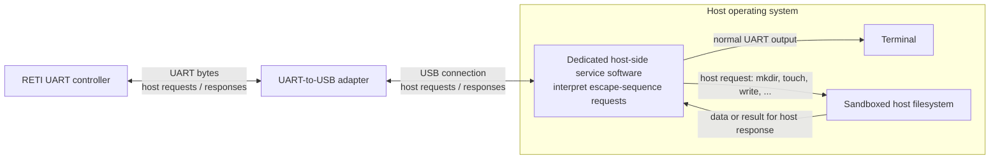
```mermaid
flowchart LR
    UART["RETI UART controller"] <-->|"UART bytes<br/>host requests / responses"| ADAPTER["UART-to-USB adapter"]
    ADAPTER <-->|"USB connection<br/>host requests / responses"| SERVICE
    subgraph HOST["Host operating system"]
        SERVICE["Dedicated host-side service software<br/>interpret escape-sequence requests"]
        TERMINAL["Terminal"]
        FILES["Sandboxed host filesystem"]
        SERVICE -->|normal UART output| TERMINAL
        SERVICE -->|"host request: mkdir, touch, write, ..."| FILES
        FILES -->|data or result for host response| SERVICE
    end
```

</ReadmeVisual>

<!-- README_ASSET mermaid-1615 -->
<ReadmeVisual kind="mermaid" :width="980">

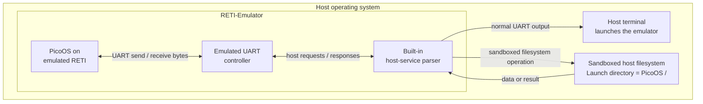
```mermaid
%%{init: {"flowchart": {"nodeSpacing": 20, "rankSpacing": 45, "wrappingWidth": 300}}}%%
flowchart LR
    subgraph HOST["Host operating system"]
        direction LR
        subgraph EMU["RETI-Emulator"]
            direction LR
            GUEST["PicoOS on<br/>emulated RETI"]
            UART["Emulated UART<br/>controller"]
            SERVICE["Built-in<br/>host-service parser"]
            GUEST <-->|UART send / receive bytes| UART
            UART <-->|host requests / responses| SERVICE
        end
        SERVICE -->|normal UART output| TERMINAL["Host terminal<br/>launches the emulator"]
        SERVICE -->|sandboxed filesystem operation| FILES["Sandboxed host filesystem<br/>Launch directory = PicoOS /"]
        FILES -->|data or result| SERVICE
    end
```

</ReadmeVisual>

</div>

</div>

---

<!-- SOURCE Pico-OS/README.md#123-uart-host-service-protocol -->

# 1. Toolchain extensions for PicoOS · 1.2 RETI-Emulator extensions

## 1.2.3 UART host-service protocol (2)

<div class="deck-content readme-slide">

<div class="readme-artifacts layout-single">

<!-- README_ASSET table-1642 -->
<ReadmeVisual kind="table" :width="1324" data-table-key="table-1642:1,2,3,4,5,6,7,8,9,10,11,12,13,14,15">

<div class="table-panels table-panels-two" v-pre><div class="readme-table"><table><colgroup><col style="width:69.85%" /><col style="width:30.15%" /></colgroup><thead><tr><th>Request form</th><th>Result</th></tr></thead><tbody><tr data-source-row="1"><td class="table-key"><ul><li><code>&lt;ESC&gt;load &lt;path&gt;&lt;ESC&gt;/</code></li></ul></td><td><ul><li>Word count + binary bytes</li></ul></td></tr>
<tr data-source-row="2"><td class="table-key"><ul><li><code>&lt;ESC&gt;read-range &lt;offset&gt; &lt;count&gt; &lt;path&gt;&lt;ESC&gt;/</code></li></ul></td><td><ul><li>Returned count + file range</li></ul></td></tr>
<tr data-source-row="3"><td class="table-key"><ul><li><code>&lt;ESC&gt;file-size &lt;path&gt;&lt;ESC&gt;/</code></li></ul></td><td><ul><li>32-bit file size</li></ul></td></tr>
<tr data-source-row="4"><td class="table-key"><ul><li><code>&lt;ESC&gt;write &lt;path&gt;&lt;ESC&gt;/</code></li></ul></td><td><ul><li>Create/truncate; route UART output</li></ul></td></tr>
<tr data-source-row="5"><td class="table-key"><ul><li><code>&lt;ESC&gt;write-at &lt;offset&gt; &lt;path&gt;&lt;ESC&gt;/</code></li></ul></td><td><ul><li>Preserve file; output at offset</li></ul></td></tr>
<tr data-source-row="6"><td class="table-key"><ul><li><code>&lt;ESC&gt;write stdout&lt;ESC&gt;/</code> / <span class="source-link"><code>stderr</code></span></li></ul></td><td><ul><li>Restore host stdout/stderr</li></ul></td></tr>
<tr data-source-row="7"><td class="table-key"><ul><li><code>&lt;ESC&gt;literal-output &lt;count&gt;&lt;ESC&gt;/</code></li></ul></td><td><ul><li>Following bytes bypass control parser</li></ul></td></tr>
<tr data-source-row="8"><td class="table-key"><ul><li><code>&lt;ESC&gt;pwd&lt;ESC&gt;/</code></li></ul></td><td><ul><li>Length-prefixed PicoOS root /</li></ul></td></tr></tbody></table></div>
<div class="readme-table"><table><colgroup><col style="width:69.85%" /><col style="width:30.15%" /></colgroup><thead><tr><th>Request form</th><th>Result</th></tr></thead><tbody><tr data-source-row="9"><td class="table-key"><ul><li><code>&lt;ESC&gt;is-directory &lt;path&gt;&lt;ESC&gt;/</code></li></ul></td><td><ul><li>Directory existence/type test</li></ul></td></tr>
<tr data-source-row="10"><td class="table-key"><ul><li><code>&lt;ESC&gt;mkdir &lt;path&gt;&lt;ESC&gt;/</code></li></ul></td><td><ul><li>Create directory</li></ul></td></tr>
<tr data-source-row="11"><td class="table-key"><ul><li><code>&lt;ESC&gt;ls &lt;path&gt;&lt;ESC&gt;/</code></li></ul></td><td><ul><li>Length-prefixed listing</li></ul></td></tr>
<tr data-source-row="12"><td class="table-key"><ul><li><code>&lt;ESC&gt;unlink &lt;path&gt;&lt;ESC&gt;/</code></li></ul></td><td><ul><li>Remove file</li></ul></td></tr>
<tr data-source-row="13"><td class="table-key"><ul><li><code>&lt;ESC&gt;rmdir &lt;path&gt;&lt;ESC&gt;/</code></li></ul></td><td><ul><li>Remove empty directory</li></ul></td></tr>
<tr data-source-row="14"><td class="table-key"><ul><li><code>&lt;ESC&gt;move &lt;old path&gt;\n&lt;new path&gt;&lt;ESC&gt;/</code></li></ul></td><td><ul><li>Move/rename path</li></ul></td></tr>
<tr data-source-row="15"><td class="table-key"><ul><li><code>&lt;ESC&gt;touch &lt;path&gt;&lt;ESC&gt;/</code></li></ul></td><td><ul><li>Create/update timestamps</li></ul></td></tr></tbody></table></div></div>

</ReadmeVisual>

</div>

</div>

---

<!-- SOURCE Pico-OS/README.md#123-uart-host-service-protocol -->

# 1. Toolchain extensions for PicoOS · 1.2 RETI-Emulator extensions

## 1.2.3 UART host-service protocol (3)

<div class="deck-content readme-slide">

<div class="readme-artifacts layout-columns">

<!-- README_ASSET mermaid-1666 -->
<ReadmeVisual kind="mermaid" :width="980">

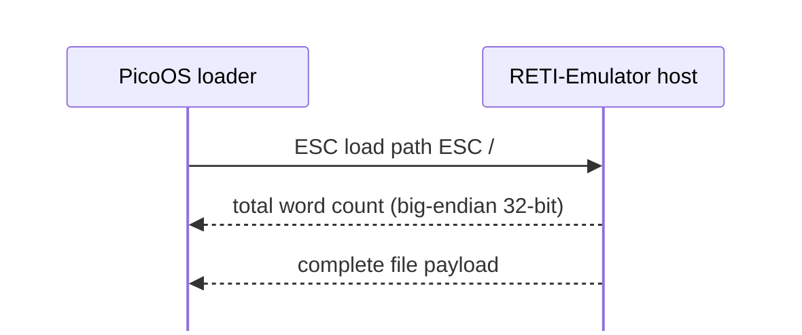
```mermaid
%%{init: {"sequence": {"wrap": false, "actorMargin": 60, "width": 180, "height": 45, "messageMargin": 25, "mirrorActors": false, "diagramMarginY": 35}, "themeCSS": "rect { rx: 0 !important; ry: 0 !important; }"}}%%
sequenceDiagram
    participant P as PicoOS loader
    participant H as RETI-Emulator host

    P->>H: ESC load path ESC /
    H-->>P: total word count (big-endian 32-bit)
    H-->>P: complete file payload
```

</ReadmeVisual>

<!-- README_ASSET mermaid-1680 -->
<ReadmeVisual kind="mermaid" :width="980">

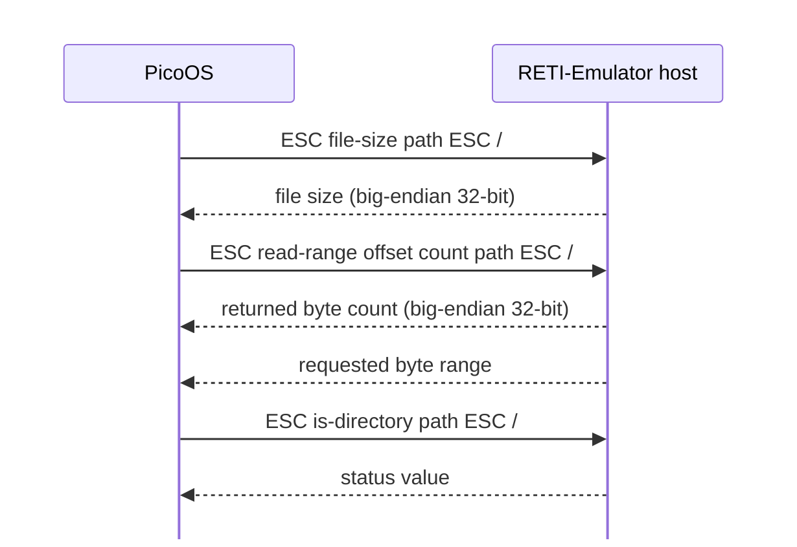
```mermaid
%%{init: {"sequence": {"wrap": false, "actorMargin": 60, "width": 180, "height": 45, "messageMargin": 25, "mirrorActors": false, "diagramMarginY": 35}, "themeCSS": "rect { rx: 0 !important; ry: 0 !important; }"}}%%
sequenceDiagram
    participant P as PicoOS
    participant H as RETI-Emulator host

    P->>H: ESC file-size path ESC /
    H-->>P: file size (big-endian 32-bit)
    P->>H: ESC read-range offset count path ESC /
    H-->>P: returned byte count (big-endian 32-bit)
    H-->>P: requested byte range
    P->>H: ESC is-directory path ESC /
    H-->>P: status value
```

</ReadmeVisual>

</div>

</div>

---

<!-- SOURCE Pico-OS/README.md#124-debugger-source-view-and-terminal-modes -->

# 1. Toolchain extensions for PicoOS · 1.2 RETI-Emulator extensions

## 1.2.4 Debugger, source view, and terminal modes (1)

<div class="deck-content readme-slide">

<div class="readme-artifacts layout-single">

<!-- README_ASSET recording-1714 -->
<AsciinemaRecording src="/casts/reti_emulator.cast" title="RETI-Emulator session" poster="npt:8" fallback-href="https://asciinema.org/a/1264549" />
<ul class="slide-note"><li>Click to play; click outside to navigate</li></ul>

</div>

</div>

---

<!-- SOURCE Pico-OS/README.md#124-debugger-source-view-and-terminal-modes -->

# 1. Toolchain extensions for PicoOS · 1.2 RETI-Emulator extensions

## 1.2.4 Debugger, source view, and terminal modes (2)

<div class="deck-content readme-slide">

<div class="readme-artifacts layout-single">

<!-- README_ASSET table-1726 -->
<ReadmeVisual kind="table" :width="1080" data-table-key="table-1726:1,2,3,4,5">

<div class="table-panels" v-pre><div class="readme-table"><table><colgroup><col style="width:21.97%" /><col style="width:26.73%" /><col style="width:51.30%" /></colgroup><thead><tr><th>View</th><th>Default tracking</th><th>Additional selection</th></tr></thead><tbody><tr data-source-row="1"><td class="table-key"><ul><li>CPU registers</li></ul></td><td><ul><li>All eight live registers</li></ul></td><td><ul><li>Inspect/edit selected register</li></ul></td></tr>
<tr data-source-row="2"><td class="table-key"><ul><li>EEPROM / SRAM code</li></ul></td><td><ul><li>PC in matching address space</li></ul></td><td><ul><li>Choose register or address</li></ul></td></tr>
<tr data-source-row="3"><td class="table-key"><ul><li>SRAM data</li></ul></td><td><ul><li>DS</li></ul></td><td><ul><li>Choose register or address</li></ul></td></tr>
<tr data-source-row="4"><td class="table-key"><ul><li>SRAM stack</li></ul></td><td><ul><li>SP</li></ul></td><td><ul><li>Choose register or address</li></ul></td></tr>
<tr data-source-row="5"><td class="table-key"><ul><li>Periphery</li></ul></td><td><ul><li>UART state</li></ul></td><td><ul><li>Cycle interrupt/timer/exception/DMA views</li></ul></td></tr></tbody></table></div></div>

</ReadmeVisual>

</div>

</div>

---

<!-- SOURCE Pico-OS/README.md#21-reti-interrupt-entry-and-the-interrupt-service-routine-table -->

# 2. Interrupts, system calls, preemption, and exceptions

## 2.1 RETI interrupt entry and the interrupt service routine table (1)

<div class="deck-content readme-slide">

<div class="readme-artifacts layout-single">

<!-- README_ASSET code-1760 -->
<ReadmeVisual kind="code" :width="980" data-code-source="code-1760" data-code-part="1">

<!-- README_CODE_PART code-1760 lines=1-8 -->
<div class="readme-code">

```c {lines:false}
__attribute__((section("ivt")))
void (*interrupt_vector_table[OS_INTERRUPT_VECTOR_COUNT])(void) = {
    syscall_interrupt,
    timer_interrupt,
    uart_interrupt,
    cpu_exception_interrupt,
    dma_interrupt
};
```

</div>

</ReadmeVisual>

</div>

</div>

---

<!-- SOURCE Pico-OS/README.md#21-reti-interrupt-entry-and-the-interrupt-service-routine-table -->

# 2. Interrupts, system calls, preemption, and exceptions

## 2.1 RETI interrupt entry and the interrupt service routine table (2)

<div class="deck-content readme-slide">

<div class="readme-artifacts layout-single">

<!-- README_ASSET table-1771 -->
<ReadmeVisual kind="table" :width="1080" data-table-key="table-1771:1,2,3,4,5">

<div class="table-panels" v-pre><div class="readme-table"><table><colgroup><col style="width:23.02%" /><col style="width:43.05%" /><col style="width:33.93%" /></colgroup><thead><tr><th>Index</th><th>Entry</th><th>Source</th></tr></thead><tbody><tr data-source-row="1"><td class="table-key"><ul><li>0</li></ul></td><td><ul><li><span class="source-link"><code>syscall_interrupt()</code></span></li></ul></td><td><ul><li>Userspace INT 0</li></ul></td></tr>
<tr data-source-row="2"><td class="table-key"><ul><li>1</li></ul></td><td><ul><li><span class="source-link"><code>timer_interrupt()</code></span></li></ul></td><td><ul><li>Timer</li></ul></td></tr>
<tr data-source-row="3"><td class="table-key"><ul><li>2</li></ul></td><td><ul><li><span class="source-link"><code>uart_interrupt()</code></span></li></ul></td><td><ul><li>UART receive</li></ul></td></tr>
<tr data-source-row="4"><td class="table-key"><ul><li>3</li></ul></td><td><ul><li><span class="source-link"><code>cpu_exception_interrupt()</code></span></li></ul></td><td><ul><li>Synchronous CPU exception</li></ul></td></tr>
<tr data-source-row="5"><td class="table-key"><ul><li>4</li></ul></td><td><ul><li><span class="source-link"><code>dma_interrupt()</code></span></li></ul></td><td><ul><li>DMA completion; custom-device line</li></ul></td></tr></tbody></table></div></div>

</ReadmeVisual>

</div>

</div>

---

<!-- SOURCE Pico-OS/README.md#21-reti-interrupt-entry-and-the-interrupt-service-routine-table -->

# 2. Interrupts, system calls, preemption, and exceptions

## 2.1 RETI interrupt entry and the interrupt service routine table (3)

<div class="deck-content readme-slide">

<div class="readme-artifacts layout-single">

<!-- README_ASSET code-1787 -->
<ReadmeVisual kind="code" :width="980" data-code-source="code-1787" data-code-part="1">

<!-- README_CODE_PART code-1787 lines=1-4 -->
<div class="readme-code">

```c {lines:false}
__attribute__((naked))
void syscall_interrupt(void) {
    // ...
}
```

</div>

</ReadmeVisual>

</div>

</div>

---

<!-- SOURCE Pico-OS/README.md#22-interrupt-controller-mappings-and-priorities -->

# 2. Interrupts, system calls, preemption, and exceptions

## 2.2 Interrupt-controller mappings and priorities (1)

<div class="deck-content readme-slide">

<div class="readme-artifacts layout-single">

<!-- README_ASSET code-1813 -->
<div class="code-columns">

<ReadmeVisual kind="code" :width="745.1999999999999" data-code-source="code-1813" data-code-part="1">

<!-- README_CODE_PART code-1813 lines=1-15 -->
<div class="readme-code">

```c {lines:false}
int interrupt_device_isrs[INTERRUPT_DEVICE_COUNT] = {
    1,                            // INTERRUPT_DEVICE_INTTIMER (index 0)
    4,                            // INTERRUPT_DEVICE_DMA (index 1)
    2                             // INTERRUPT_DEVICE_UART (index 2)
};

int interrupt_device_priorities[INTERRUPT_DEVICE_COUNT] = {
    1, // INTERRUPT_DEVICE_INTTIMER (index 0)
    1, // INTERRUPT_DEVICE_DMA (index 1)
    2  // INTERRUPT_DEVICE_UART (index 2)
};

void interrupt_controller_initialize(void) {
    int device = 0;
    int interrupt_index;
```

</div>

</ReadmeVisual>

<ReadmeVisual kind="code" :width="745.1999999999999" data-code-source="code-1813" data-code-part="2">

<!-- README_CODE_PART code-1813 lines=16-29 -->
<div class="readme-code">

```c {lines:false}
    int priority;

    while (device < INTERRUPT_DEVICE_COUNT) {
        interrupt_controller_disable_device(device);
        interrupt_index = interrupt_device_isrs[device];
        priority = interrupt_device_priorities[device];

        if (interrupt_index != INTERRUPT_CONTROLLER_DISABLED) {
            interrupt_controller_assign_device(device, interrupt_index, priority);
        }

        device = device + 1;
    }
}
```

</div>

</ReadmeVisual>

</div>

</div>

</div>

---

<!-- SOURCE Pico-OS/README.md#22-interrupt-controller-mappings-and-priorities -->

# 2. Interrupts, system calls, preemption, and exceptions

## 2.2 Interrupt-controller mappings and priorities (2)

<div class="deck-content readme-slide">

<div class="readme-artifacts layout-single">

<!-- README_ASSET image-1853 -->
<ReadmeVisual kind="image" :width="980">


</ReadmeVisual>

</div>

</div>

---

<!-- SOURCE Pico-OS/README.md#22-interrupt-controller-mappings-and-priorities -->

# 2. Interrupts, system calls, preemption, and exceptions

## 2.2 Interrupt-controller mappings and priorities (3)

<div class="deck-content readme-slide">

<div class="readme-artifacts layout-single">

<!-- README_ASSET table-1859 -->
<ReadmeVisual kind="table" :width="1080" data-table-key="table-1859:1,2,3">

<div class="table-panels" v-pre><div class="readme-table"><table><colgroup><col style="width:12.68%" /><col style="width:40.97%" /><col style="width:46.35%" /></colgroup><thead><tr><th>Device / array index</th><th>Mapping source → periphery cell</th><th>Priority source → periphery cell</th></tr></thead><tbody><tr data-source-row="1"><td class="table-key"><ul><li>Timer / <code>0</code></li></ul></td><td><ul><li><code>interrupt_device_isrs[0] = 1</code> → <code>0x40000003</code></li></ul></td><td><ul><li><code>interrupt_device_priorities[0] = 1</code> → <code>0x40000006</code></li></ul></td></tr>
<tr data-source-row="2"><td class="table-key"><ul><li>DMA on custom line / <code>1</code></li></ul></td><td><ul><li><code>interrupt_device_isrs[1] = 4</code> → <code>0x40000004</code></li></ul></td><td><ul><li><code>interrupt_device_priorities[1] = 1</code> → <code>0x40000007</code></li></ul></td></tr>
<tr data-source-row="3"><td class="table-key"><ul><li>UART / <code>2</code></li></ul></td><td><ul><li><code>interrupt_device_isrs[2] = 2</code> → <code>0x40000005</code></li></ul></td><td><ul><li><code>interrupt_device_priorities[2] = 2</code> → <code>0x40000008</code></li></ul></td></tr></tbody></table></div></div>

</ReadmeVisual>

</div>

</div>

---

<!-- SOURCE Pico-OS/README.md#23-saved-interrupt-stack-frame -->

# 2. Interrupts, system calls, preemption, and exceptions

## 2.3 Saved interrupt stack frame

<div class="deck-content readme-slide">

<div class="readme-artifacts layout-single">

<!-- README_ASSET table-1901 -->
<ReadmeVisual kind="table" :width="1080" data-table-key="table-1901:1,2,3,4,5,6,7,8">

<div class="table-panels" v-pre><div class="readme-table"><table><colgroup><col style="width:42.52%" /><col style="width:57.48%" /></colgroup><thead><tr><th>Offset</th><th>Stored value</th></tr></thead><tbody><tr data-source-row="1"><td class="table-key"><ul><li><code>+0</code></li></ul></td><td><ul><li>Free cell addressed by <span class="source-link"><code>caller_context</code></span></li></ul></td></tr>
<tr data-source-row="2"><td class="table-key"><ul><li><code>+1</code></li></ul></td><td><ul><li>Saved <code>DS</code></li></ul></td></tr>
<tr data-source-row="3"><td class="table-key"><ul><li><code>+2</code></li></ul></td><td><ul><li>Saved <code>CS</code></li></ul></td></tr>
<tr data-source-row="4"><td class="table-key"><ul><li><code>+3</code></li></ul></td><td><ul><li>Saved <code>BAF</code></li></ul></td></tr>
<tr data-source-row="5"><td class="table-key"><ul><li><code>+4</code></li></ul></td><td><ul><li>Saved <code>IN2</code></li></ul></td></tr>
<tr data-source-row="6"><td class="table-key"><ul><li><code>+5</code></li></ul></td><td><ul><li>Saved <code>IN1</code></li></ul></td></tr>
<tr data-source-row="7"><td class="table-key"><ul><li><code>+6</code></li></ul></td><td><ul><li>Saved <code>ACC</code></li></ul></td></tr>
<tr data-source-row="8"><td class="table-key"><ul><li><code>+7</code></li></ul></td><td><ul><li>Return PC saved by interrupt entry</li></ul></td></tr></tbody></table></div></div>

</ReadmeVisual>

</div>
<aside class="context-note"><b>Linux comparison</b><ul><li>Linux: context on kernel stack</li>
<li>PicoOS: context on user stack</li>
<li>RETI entry/RTI use active SP</li></ul></aside>

</div>

---

<!-- SOURCE Pico-OS/README.md#24-system-call-interface-and-execution -->

# 2. Interrupts, system calls, preemption, and exceptions

## 2.4 System-call interface and execution

<div class="deck-content readme-slide">

<div class="readme-list"><ul><li>Library wrapper → selector + request</li>
<li>INT 0 → handle_syscall</li>
<li>No hardcoded kernel function addresses</li>
<li>ABI: registers, layouts, result meanings</li></ul></div>
<aside class="context-note"><b>POSIX portability</b><ul><li>Source interfaces across different kernels</li>
<li>PicoOS signatures/behavior differ</li></ul></aside>

</div>

---

<!-- SOURCE Pico-OS/README.md#241-syscall-selectors-and-register-convention -->

# 2. Interrupts, system calls, preemption, and exceptions · 2.4 System-call interface and execution

## 2.4.1 Syscall selectors and register convention (1)

<div class="deck-content readme-slide">

<div class="readme-artifacts layout-single">

<!-- README_ASSET code-4917 repeated -->
<ReadmeVisual kind="code" :width="980" data-code-source="code-4917" data-code-part="1">

<!-- README_CODE_PART code-4917 lines=1-10 -->
<div class="readme-code">

```c {lines:false}
int waitpid(int pid) {
    int status = 0;
    struct WaitPidRequest request;

    request.pid = pid;
    request.status = &status;
    while (!invoke_waitpid_syscall(SYSCALL_WAITPID, (int)&request)) {
    }
    return status;
}
```

</div>

</ReadmeVisual>

</div>
<aside class="context-note"><b>ABI connection</b><ul><li>IN2: syscall + function result</li>
<li>Wrapper and entry agree</li></ul></aside>

</div>

---

<!-- SOURCE Pico-OS/README.md#241-syscall-selectors-and-register-convention -->

# 2. Interrupts, system calls, preemption, and exceptions · 2.4 System-call interface and execution

## 2.4.1 Syscall selectors and register convention (2)

<div class="deck-content readme-slide">

<div class="readme-artifacts layout-single">

<!-- README_ASSET code-1960 -->
<div class="code-columns">

<ReadmeVisual kind="code" :width="685" data-code-source="code-1960" data-code-part="1">

<!-- README_CODE_PART code-1960 lines=1-14 -->
<div class="readme-code">

```c {lines:false}
struct LoadProcessRequest { char *path; bool show_loading_bar; };
struct RunProcessRequest { int pid; char *arguments; char **environment; };
struct WaitPidRequest { int pid; int *status; };
struct KillRequest { int pid; int signal_number; };
struct PrctlRequest { int option; int argument; };
struct ShmOpenRequest { char *name; size_t size; };
struct GetCwdRequest { char *buffer; int size; };
struct ReadDirectoryRequest { char *path; char *buffer; int capacity; };
struct MoveRequest { char *old_path; char *new_path; };

struct OpenRequest { char *path; int flags; };
struct IoRequest {
    int file_descriptor;
    char *buffer;
```

</div>

</ReadmeVisual>

<ReadmeVisual kind="code" :width="685" data-code-source="code-1960" data-code-part="2">

<!-- README_CODE_PART code-1960 lines=15-27 -->
<div class="readme-code">

```c {lines:false}
    int count;
    bool protect_uart_control;
    bool show_loading_bar;
    int transferred;
    int loading_bar_update;
    bool complete;
};
struct SeekRequest {
    int file_descriptor;
    int offset;
    int origin;
};
struct Dup2Request { int old_file_descriptor; int new_file_descriptor; };
```

</div>

</ReadmeVisual>

</div>

</div>

</div>

---

<!-- SOURCE Pico-OS/README.md#2411-process-wait-signal-and-memory-request-structures -->

# 2. Interrupts, system calls, preemption, and exceptions · 2.4 System-call interface and execution · 2.4.1 Syscall selectors and register convention

## 2.4.1.1 Process, wait, signal, and memory request structures

<div class="deck-content readme-slide">

<div class="readme-artifacts layout-single">

<!-- README_ASSET table-2001 -->
<ReadmeVisual kind="table" :width="1324" data-table-key="table-2001:1,2,3,4,5,6,7,8,9,10,11,12,13">

<div class="table-panels table-panels-two" v-pre><div class="readme-table"><table><colgroup><col style="width:56.25%" /><col style="width:43.75%" /></colgroup><thead><tr><th>Field</th><th>Meaning</th></tr></thead><tbody><tr data-source-row="1"><td class="table-key"><ul><li><span class="source-link"><code>LoadProcessRequest.path</code></span></li></ul></td><td><ul><li>Binary path</li></ul></td></tr>
<tr data-source-row="2"><td class="table-key"><ul><li><code>LoadProcessRequest</code></li><li><code>.show_loading_bar</code></li></ul></td><td><ul><li>Whether UART transfer progress should be printed</li></ul></td></tr>
<tr data-source-row="3"><td class="table-key"><ul><li><span class="source-link"><code>RunProcessRequest.pid</code></span></li></ul></td><td><ul><li>Existing NEW PID</li></ul></td></tr>
<tr data-source-row="4"><td class="table-key"><ul><li><span class="source-link"><code>RunProcessRequest.arguments</code></span></li></ul></td><td><ul><li>Argument string / NULL</li></ul></td></tr>
<tr data-source-row="5"><td class="table-key"><ul><li><span class="source-link"><code>RunProcessRequest.environment</code></span></li></ul></td><td><ul><li>Null-terminated array of <code>NAME=value</code> pointers</li></ul></td></tr>
<tr data-source-row="6"><td class="table-key"><ul><li><span class="source-link"><code>WaitPidRequest.pid</code></span></li></ul></td><td><ul><li>Exact child PID</li></ul></td></tr>
<tr data-source-row="7"><td class="table-key"><ul><li><span class="source-link"><code>WaitPidRequest.status</code></span></li></ul></td><td><ul><li>Address of caller's status cell</li></ul></td></tr></tbody></table></div>
<div class="readme-table"><table><colgroup><col style="width:56.25%" /><col style="width:43.75%" /></colgroup><thead><tr><th>Field</th><th>Meaning</th></tr></thead><tbody><tr data-source-row="8"><td class="table-key"><ul><li><span class="source-link"><code>KillRequest.pid</code></span></li></ul></td><td><ul><li>Target process</li></ul></td></tr>
<tr data-source-row="9"><td class="table-key"><ul><li><span class="source-link"><code>KillRequest.signal_number</code></span></li></ul></td><td><ul><li>Signal to deliver, 0 probes existence</li></ul></td></tr>
<tr data-source-row="10"><td class="table-key"><ul><li><span class="source-link"><code>PrctlRequest.option</code></span></li></ul></td><td><ul><li>Currently only <span class="source-link"><code>PR_SET_PDEATHSIG</code></span></li></ul></td></tr>
<tr data-source-row="11"><td class="table-key"><ul><li><span class="source-link"><code>PrctlRequest.argument</code></span></li></ul></td><td><ul><li>Signal number, or 0 to disable</li></ul></td></tr>
<tr data-source-row="12"><td class="table-key"><ul><li><span class="source-link"><code>ShmOpenRequest.name</code></span></li></ul></td><td><ul><li>Shared-entry lookup name</li></ul></td></tr>
<tr data-source-row="13"><td class="table-key"><ul><li><span class="source-link"><code>ShmOpenRequest.size</code></span></li></ul></td><td><ul><li>Requested shared region size in RETI cells</li></ul></td></tr></tbody></table></div></div>

</ReadmeVisual>

</div>

</div>

---

<!-- SOURCE Pico-OS/README.md#2412-file-and-directory-request-structures -->

# 2. Interrupts, system calls, preemption, and exceptions · 2.4 System-call interface and execution · 2.4.1 Syscall selectors and register convention

## 2.4.1.2 File and directory request structures

<div class="deck-content readme-slide">

<div class="readme-artifacts layout-single">

<!-- README_ASSET table-2023 -->
<ReadmeVisual kind="table" :width="1324" data-table-key="table-2023:1,2,3,4,5,6,7,8,9,10,11,12,13,14,15,16,17,18,19,20,21,22">

<div class="table-panels table-panels-two" v-pre><div class="readme-table"><table><colgroup><col style="width:60.06%" /><col style="width:39.94%" /></colgroup><thead><tr><th>Field</th><th>Meaning</th></tr></thead><tbody><tr data-source-row="1"><td class="table-key"><ul><li><span class="source-link"><code>OpenRequest.path</code></span></li></ul></td><td><ul><li>Relative/absolute file or device path</li></ul></td></tr>
<tr data-source-row="2"><td class="table-key"><ul><li><span class="source-link"><code>OpenRequest.flags</code></span></li></ul></td><td><ul><li>Access mode plus <span class="source-link"><code>O_CREAT</code></span>, <span class="source-link"><code>O_TRUNC</code></span>, or <span class="source-link"><code>O_APPEND</code></span></li></ul></td></tr>
<tr data-source-row="3"><td class="table-key"><ul><li><span class="source-link"><code>IoRequest.file_descriptor</code></span></li></ul></td><td><ul><li>Entry number in the current PCB’s eight-entry table</li></ul></td></tr>
<tr data-source-row="4"><td class="table-key"><ul><li><span class="source-link"><code>IoRequest.buffer</code></span></li></ul></td><td><ul><li>Userspace destination for read or source for write</li></ul></td></tr>
<tr data-source-row="5"><td class="table-key"><ul><li><span class="source-link"><code>IoRequest.count</code></span></li></ul></td><td><ul><li>Maximum cells to read or exact cells to write</li></ul></td></tr>
<tr data-source-row="6"><td class="table-key"><ul><li><span class="source-link"><code>IoRequest.protect_uart_control</code></span></li></ul></td><td><ul><li>Scan escapes; protect with literal-output</li></ul></td></tr>
<tr data-source-row="7"><td class="table-key"><ul><li><span class="source-link"><code>IoRequest.show_loading_bar</code></span></li></ul></td><td><ul><li>Whether a host-file read shows progress</li></ul></td></tr>
<tr data-source-row="8"><td class="table-key"><ul><li><span class="source-link"><code>IoRequest.transferred</code></span></li></ul></td><td><ul><li>Bytes already copied by earlier chunks of the same <span class="source-link"><code>read()</code></span></li></ul></td></tr>
<tr data-source-row="9"><td class="table-key"><ul><li><span class="source-link"><code>IoRequest.loading_bar_update</code></span></li></ul></td><td><ul><li>Next total byte count that redraws read progress</li></ul></td></tr>
<tr data-source-row="10"><td class="table-key"><ul><li><span class="source-link"><code>IoRequest.complete</code></span></li></ul></td><td><ul><li>Whether <span class="source-link"><code>read()</code></span> should return instead of invoking another chunk</li></ul></td></tr>
<tr data-source-row="11"><td class="table-key"><ul><li><span class="source-link"><code>SeekRequest.file_descriptor</code></span></li></ul></td><td><ul><li>Regular-file descriptor to reposition</li></ul></td></tr></tbody></table></div>
<div class="readme-table"><table><colgroup><col style="width:60.06%" /><col style="width:39.94%" /></colgroup><thead><tr><th>Field</th><th>Meaning</th></tr></thead><tbody><tr data-source-row="12"><td class="table-key"><ul><li><span class="source-link"><code>SeekRequest.offset</code></span></li></ul></td><td><ul><li>Signed displacement</li></ul></td></tr>
<tr data-source-row="13"><td class="table-key"><ul><li><span class="source-link"><code>SeekRequest.origin</code></span></li></ul></td><td><ul><li><span class="source-link"><code>SEEK_SET</code></span>, <span class="source-link"><code>SEEK_CUR</code></span>, or <span class="source-link"><code>SEEK_END</code></span></li></ul></td></tr>
<tr data-source-row="14"><td class="table-key"><ul><li><span class="source-link"><code>Dup2Request.old_file_descriptor</code></span></li></ul></td><td><ul><li>Descriptor to copy</li></ul></td></tr>
<tr data-source-row="15"><td class="table-key"><ul><li><span class="source-link"><code>Dup2Request.new_file_descriptor</code></span></li></ul></td><td><ul><li>Entry to replace</li></ul></td></tr>
<tr data-source-row="16"><td class="table-key"><ul><li><span class="source-link"><code>GetCwdRequest.buffer</code></span></li></ul></td><td><ul><li>Userspace destination</li></ul></td></tr>
<tr data-source-row="17"><td class="table-key"><ul><li><span class="source-link"><code>GetCwdRequest.size</code></span></li></ul></td><td><ul><li>Destination capacity</li></ul></td></tr>
<tr data-source-row="18"><td class="table-key"><ul><li><span class="source-link"><code>ReadDirectoryRequest.path</code></span></li></ul></td><td><ul><li>Directory to list</li></ul></td></tr>
<tr data-source-row="19"><td class="table-key"><ul><li><span class="source-link"><code>ReadDirectoryRequest.buffer</code></span></li></ul></td><td><ul><li>Userspace listing buffer</li></ul></td></tr>
<tr data-source-row="20"><td class="table-key"><ul><li><span class="source-link"><code>ReadDirectoryRequest.capacity</code></span></li></ul></td><td><ul><li>Maximum returned cells</li></ul></td></tr>
<tr data-source-row="21"><td class="table-key"><ul><li><span class="source-link"><code>MoveRequest.old_path</code></span></li></ul></td><td><ul><li>Existing file or directory</li></ul></td></tr>
<tr data-source-row="22"><td class="table-key"><ul><li><span class="source-link"><code>MoveRequest.new_path</code></span></li></ul></td><td><ul><li>New file or directory path</li></ul></td></tr></tbody></table></div></div>

</ReadmeVisual>

</div>

</div>

---

<!-- SOURCE Pico-OS/README.md#242-system-call-entry-execution-and-return-to-userspace -->

# 2. Interrupts, system calls, preemption, and exceptions · 2.4 System-call interface and execution

## 2.4.2 System-call entry, execution, and return to userspace (1)

<div class="deck-content readme-slide">

<div class="readme-artifacts layout-single">

<!-- README_ASSET mermaid-2064 -->
<ReadmeVisual kind="mermaid" :width="980">

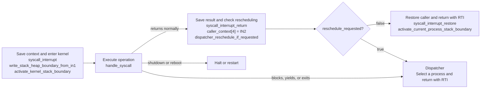
```mermaid
flowchart LR
    ENTRY["Save context and enter kernel<br/>syscall_interrupt<br/>write_stack_heap_boundary_from_in1<br/>activate_kernel_stack_boundary"] --> HANDLE["Execute operation<br/>handle_syscall"]
    HANDLE -->|returns normally| RETURN["Save result and check rescheduling<br/>syscall_interrupt_return<br/>caller_context[4] = IN2<br/>dispatcher_reschedule_if_requested"]
    RETURN --> CHECK{"reschedule_requested?"}
    CHECK -->|false| RESTORE["Restore caller and return with RTI<br/>syscall_interrupt_restore<br/>activate_current_process_stack_boundary"]
    CHECK -->|true| DISPATCH["Dispatcher<br/>Select a process and return with RTI"]
    HANDLE -->|blocks, yields, or exits| DISPATCH
    HANDLE -->|shutdown or reboot| SYSTEM["Halt or restart"]
```

</ReadmeVisual>

</div>

</div>

---

<!-- SOURCE Pico-OS/README.md#242-system-call-entry-execution-and-return-to-userspace -->

# 2. Interrupts, system calls, preemption, and exceptions · 2.4 System-call interface and execution

## 2.4.2 System-call entry, execution, and return to userspace (2)

<div class="deck-content readme-slide">

<div class="readme-artifacts layout-single">

<!-- README_ASSET code-2079 -->
<div class="code-columns">

<ReadmeVisual kind="code" :width="745.1999999999999" data-code-source="code-2079" data-code-part="1">

<!-- README_CODE_PART code-2079 lines=1-33 -->
<div class="readme-code">

```c {lines:false}
__attribute__((naked))
void syscall_interrupt(void) {
    // Saves the same context layout as timer_interrupt
    asm("PUSH ACC"); // Syscall number
    asm("PUSH IN1"); // Syscall argument
    asm("PUSH IN2");
    asm("PUSH BAF");
    asm("PUSH CS");
    asm("PUSH DS");

    // BAF keeps old_sp while loading kernel CS, DS and SP
    asm("MOVE SP BAF");
    asm("LOADI IN1 0");
    write_stack_heap_boundary_from_in1();
    asm(KERNEL_CS_START_ASM); // LOADI32 CS -2147483643
    asm(KERNEL_DS_START_ASM); // LOADI32 DS -2147442882
    asm(KERNEL_SP_START_ASM); // LOADI32 SP -2147435340
    activate_kernel_stack_boundary();

    // Builds the handle_syscall arguments from the saved context
    asm("PUSH BAF"); // Caller context
    asm("LOADIN BAF IN2 5");
    asm("PUSH IN2"); // Syscall argument
    asm("LOADIN BAF IN2 6");
    asm("PUSH IN2"); // Syscall number

    // A syscall that switches processes resumes with a successful IN2 result
    asm("LOADI IN2 1");
    asm("STOREIN BAF IN2 4");

    // Calls handle_syscall and returns through syscall_interrupt_return
    asm("LOADI32 ACC syscall_interrupt_return");
    asm("ADD ACC CS");
```

</div>

</ReadmeVisual>

<ReadmeVisual kind="code" :width="745.1999999999999" data-code-source="code-2079" data-code-part="2">

<!-- README_CODE_PART code-2079 lines=34-66 -->
<div class="readme-code">

```c {lines:false}
    asm("PUSH ACC"); // Return address: syscall return continuation
    asm("LOADI32 ACC handle_syscall");
    asm("ADD ACC CS");
    asm("MOVE ACC PC");
}

__attribute__((naked))
void syscall_interrupt_return(void) {
    // Handle_syscall restores BAF to the saved caller context before returning
    // Saves the IN2 result before a pending timer request can dispatch the caller
    asm("STOREIN BAF IN2 4");

    asm("PUSH BAF"); // Caller context
    asm("LOADI32 ACC syscall_interrupt_restore");
    asm("ADD ACC CS");
    asm("PUSH ACC");
    asm("LOADI32 ACC dispatcher_reschedule_if_requested");
    asm("ADD ACC CS");
    asm("MOVE ACC PC");
}

__attribute__((naked))
void syscall_interrupt_restore(void) {
    asm("MOVE BAF SP");
    activate_current_process_stack_boundary();
    asm("POP DS");
    asm("POP CS");
    asm("POP BAF");
    asm("POP IN2");
    asm("POP IN1");
    asm("POP ACC");
    asm("RTI");
}
```

</div>

</ReadmeVisual>

</div>

</div>

</div>

---

<!-- SOURCE Pico-OS/README.md#242-system-call-entry-execution-and-return-to-userspace -->

# 2. Interrupts, system calls, preemption, and exceptions · 2.4 System-call interface and execution

## 2.4.2 System-call entry, execution, and return to userspace (3)

<div class="deck-content readme-slide">

<div class="readme-artifacts layout-columns">

<!-- README_ASSET list-2151 -->
<div class="readme-list"><ul><li>Save six registers + PC</li>
<li>BAF → saved frame</li>
<li>Install kernel segments + stack boundary</li>
<li>Push context, argument, selector</li>
<li>Default saved IN2 = 1</li>
<li>handle_syscall → syscall_interrupt_return</li></ul></div>

<!-- README_ASSET list-2179 -->
<div class="readme-list"><ul><li>Save IN2 in caller_context[4]</li>
<li>Check deferred rescheduling</li>
<li>Restore directly or dispatch</li></ul></div>

</div>

</div>

---

<!-- SOURCE Pico-OS/README.md#242-system-call-entry-execution-and-return-to-userspace -->

# 2. Interrupts, system calls, preemption, and exceptions · 2.4 System-call interface and execution

## 2.4.2 System-call entry, execution, and return to userspace (4)

<div class="deck-content readme-slide">

<div class="readme-artifacts layout-single">

<!-- README_ASSET list-2195 -->
<div class="readme-list"><ul><li>SP ← BAF; discard scratch frames</li>
<li>Restore caller stack boundary</li>
<li>Pop registers; RTI restores PC</li></ul></div>

</div>

</div>

---

<!-- SOURCE Pico-OS/README.md#2421-handle-syscall -->

# 2. Interrupts, system calls, preemption, and exceptions · 2.4 System-call interface and execution · 2.4.2 System-call entry, execution, and return to userspace

## 2.4.2.1 Handle Syscall (1)

<div class="deck-content readme-slide">

<div class="readme-artifacts layout-single">

<!-- README_ASSET code-2212 -->
<div class="code-columns">

<ReadmeVisual kind="code" :width="788.1999999999999" data-code-source="code-2212" data-code-part="1">

<!-- README_CODE_PART code-2212 lines=1-13 -->
<div class="readme-code">

```c {lines:false}
int handle_syscall(int syscall_number, int argument, int *caller_context) {
    if (syscall_number == SYSCALL_SHUTDOWN) {
        shutdown();
        return 1;
    } else if (syscall_number == SYSCALL_REBOOT) {
        reboot();
        return 1;
    } else if (syscall_number == SYSCALL_LOAD_PROCESS) {
        return load_process_chunk(
            ((struct LoadProcessRequest *)argument)->path,
            ((struct LoadProcessRequest *)argument)->show_loading_bar,
            caller_context
        );
```

</div>

</ReadmeVisual>

<ReadmeVisual kind="code" :width="788.1999999999999" data-code-source="code-2212" data-code-part="2">

<!-- README_CODE_PART code-2212 lines=14-26 -->
<div class="readme-code">

```c {lines:false}
    } else if (syscall_number == SYSCALL_RUN_PROCESS_WITH_ARGUMENTS) {
        return mark_process_ready_with_arguments((struct RunProcessRequest *)argument);
    } else if (syscall_number == SYSCALL_LIST_PROCESSES) {
        list_processes();
        return 1;
    } else if (syscall_number == SYSCALL_UNLOAD_PROCESS) {
        return unload_process_by_pid(argument);
    }

    // ...

    return 0;
}
```

</div>

</ReadmeVisual>

</div>

</div>

</div>

---

<!-- SOURCE Pico-OS/README.md#2421-handle-syscall -->

# 2. Interrupts, system calls, preemption, and exceptions · 2.4 System-call interface and execution · 2.4.2 System-call entry, execution, and return to userspace

## 2.4.2.1 Handle Syscall (2)

<div class="deck-content readme-slide">

<div class="readme-artifacts layout-single">

<!-- README_ASSET list-2243 -->
<div class="readme-list"><ul><li>Match selector; pass saved context</li>
<li>IN2 ← result; unknown selector → 0</li></ul></div>

</div>

</div>

---

<!-- SOURCE Pico-OS/README.md#24211-system-call-groups -->

# 2. Interrupts, system calls, preemption, and exceptions · 2.4 System-call interface and execution · 2.4.2 System-call entry, execution, and return to userspace · 2.4.2.1 Handle Syscall

## 2.4.2.1.1 System-call groups

<div class="deck-content readme-slide">

<div class="readme-artifacts layout-single">

<!-- README_ASSET table-2258 -->
<ReadmeVisual kind="table" :width="1080" data-table-key="table-2258:1,2,3,4,5,6">

<div class="table-panels" v-pre><div class="readme-table"><table><colgroup><col style="width:24.37%" /><col style="width:75.63%" /></colgroup><thead><tr><th>Group</th><th>Syscalls, in declaration order</th></tr></thead><tbody><tr data-source-row="1"><td class="table-key"><ul><li>System control</li></ul></td><td><ul><li>Shutdown, reboot</li></ul></td></tr>
<tr data-source-row="2"><td class="table-key"><ul><li>Process management</li></ul></td><td><ul><li>Load/run/list/unload/exit/wait/PID</li><li>Foreground/signals/parent-death</li></ul></td></tr>
<tr data-source-row="3"><td class="table-key"><ul><li>Scheduling</li></ul></td><td><ul><li>Queue sleep, queue wakeup, yield</li></ul></td></tr>
<tr data-source-row="4"><td class="table-key"><ul><li>Process and shared memory</li></ul></td><td><ul><li>Heap start, heap size, heap-exhaustion handling, shared-memory open, map, unlink</li></ul></td></tr>
<tr data-source-row="5"><td class="table-key"><ul><li>Descriptors and I/O</li></ul></td><td><ul><li>Availability/open/read/write/close/seek/dup</li><li>Direct UART byte</li></ul></td></tr>
<tr data-source-row="6"><td class="table-key"><ul><li>Paths and directories</li></ul></td><td><ul><li>chdir/getcwd/mkdir/readdir</li><li>unlink/rmdir/move/touch</li></ul></td></tr></tbody></table></div></div>

</ReadmeVisual>

</div>

</div>

---

<!-- SOURCE Pico-OS/README.md#2422-selecting-the-return-path -->

# 2. Interrupts, system calls, preemption, and exceptions · 2.4 System-call interface and execution · 2.4.2 System-call entry, execution, and return to userspace

## 2.4.2.2 Selecting the return path (1)

<div class="deck-content readme-slide">

<div class="readme-artifacts layout-columns">

<!-- README_ASSET code-2277 -->
<ReadmeVisual kind="code" :width="580" data-code-source="code-2277" data-code-part="1">

<!-- README_CODE_PART code-2277 lines=1-11 -->
<div class="readme-code">

```c {lines:false}
bool reschedule_requested = false;

void dispatcher_request_reschedule(void) {
    reschedule_requested = true;
}

void dispatcher_reschedule_if_requested(int *caller_context) {
    if (reschedule_requested) {
        dispatcher_switch_from_context(caller_context);
    }
}
```

</div>

</ReadmeVisual>

<!-- README_ASSET code-2305 -->
<ReadmeVisual kind="code" :width="805.4" data-code-source="code-2305" data-code-part="1">

<!-- README_CODE_PART code-2305 lines=1-11 -->
<div class="readme-code">

```c {lines:false}
void dispatcher_switch_to_process(struct ProcessControlBlock *process) {
    if (current_process() != NULL && current_process()->state == PROCESS_STATE_RUNNING) {
        current_process()->state = PROCESS_STATE_READY;
    }

    reschedule_requested = false;
    set_current_process(process);
    process->state = PROCESS_STATE_RUNNING;

    dispatcher_jump_to_process(process, process_stack_boundary(process));
}
```

</div>

</ReadmeVisual>

</div>

</div>

---

<!-- SOURCE Pico-OS/README.md#2422-selecting-the-return-path -->

# 2. Interrupts, system calls, preemption, and exceptions · 2.4 System-call interface and execution · 2.4.2 System-call entry, execution, and return to userspace

## 2.4.2.2 Selecting the return path (2)

<div class="deck-content readme-slide">

<div class="readme-artifacts layout-single">

<!-- README_ASSET list-2322 -->
<div class="readme-list"><ul><li>Outgoing RUNNING → READY</li>
<li>Clear request; selected PCB → RUNNING</li>
<li>Restore boundary + activation; RTI</li></ul></div>

</div>

</div>

---

<!-- SOURCE Pico-OS/README.md#2423-stack-boundary-helpers -->

# 2. Interrupts, system calls, preemption, and exceptions · 2.4 System-call interface and execution · 2.4.2 System-call entry, execution, and return to userspace

## 2.4.2.3 Stack-boundary helpers

<div class="deck-content readme-slide">

<div class="readme-artifacts layout-columns">

<!-- README_ASSET code-2358 -->
<ReadmeVisual kind="code" :width="580" data-code-source="code-2358" data-code-part="1">

<!-- README_CODE_PART code-2358 lines=1-5 -->
<div class="readme-code">

```c {lines:false}
static inline void write_stack_heap_boundary_from_in1(void) {
    asm("LOADI ACC 1048576");
    asm("MULTI ACC 1024");
    asm("STOREIN ACC IN1 10");
}
```

</div>

</ReadmeVisual>

<!-- README_ASSET code-2373 -->
<ReadmeVisual kind="code" :width="728" data-code-source="code-2373" data-code-part="1">

<!-- README_CODE_PART code-2373 lines=1-17 -->
<div class="readme-code">

```c {lines:false}
void activate_kernel_stack_boundary(void) {
    periphery_write_register(
        STACK_HEAP_BOUNDARY_REGISTER,
        KERNEL_HEAP_START + KERNEL_HEAP_SIZE - 1
    );
}

int process_stack_boundary(struct ProcessControlBlock *process) {
    return process->base_address + process->heap_start + process->heap_size - 1;
}

void activate_current_process_stack_boundary(void) {
    periphery_write_register(
        STACK_HEAP_BOUNDARY_REGISTER,
        process_stack_boundary(current_process())
    );
}
```

</div>

</ReadmeVisual>

</div>

</div>

---

<!-- SOURCE Pico-OS/README.md#251-timer-interrupt-path -->

# 2. Interrupts, system calls, preemption, and exceptions · 2.5 Timer interrupts and userspace preemption

## 2.5.1 Timer interrupt path (1)

<div class="deck-content readme-slide">

<div class="readme-artifacts layout-stacked">

<!-- README_ASSET mermaid-2436 -->
<ReadmeVisual kind="mermaid" :width="980">

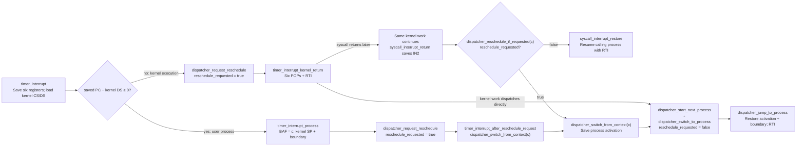
```mermaid
flowchart LR
    ENTRY["timer_interrupt<br/>Save six registers; load kernel CS/DS"] --> CHECK{"saved PC − kernel DS ≥ 0?"}
    CHECK -->|no: kernel execution| REQUEST_K["dispatcher_request_reschedule<br/>reschedule_requested = true"]
    REQUEST_K --> RETURN["timer_interrupt_kernel_return<br/>Six POPs + RTI"]
    RETURN -->|syscall returns later| LATER["Same kernel work continues<br/>syscall_interrupt_return saves IN2"]
    RETURN -->|kernel work dispatches directly| SELECT
    LATER --> PENDING{"dispatcher_reschedule_if_requested(c)<br/>reschedule_requested?"}
    PENDING -->|false| DIRECT["syscall_interrupt_restore<br/>Resume calling process with RTI"]
    PENDING -->|true| DISPATCH["dispatcher_switch_from_context(c)<br/>Save process activation"]
    CHECK -->|yes: user process| PROCESS["timer_interrupt_process<br/>BAF = c; kernel SP + boundary"]
    PROCESS --> REQUEST_P["dispatcher_request_reschedule<br/>reschedule_requested = true"]
    REQUEST_P --> AFTER["timer_interrupt_after_reschedule_request<br/>dispatcher_switch_from_context(c)"]
    AFTER --> DISPATCH
    DISPATCH --> SELECT["dispatcher_start_next_process<br/>→ dispatcher_switch_to_process<br/>reschedule_requested = false"]
    SELECT --> RESTORE["dispatcher_jump_to_process<br/>Restore activation + boundary; RTI"]
```

</ReadmeVisual>

<!-- README_ASSET mermaid-2457 -->
<ReadmeVisual kind="mermaid" :width="980">

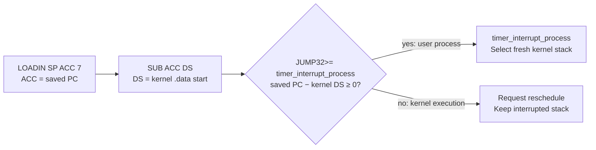
```mermaid
flowchart LR
    LOAD["LOADIN SP ACC 7<br/>ACC = saved PC"] --> SUBTRACT["SUB ACC DS<br/>DS = kernel .data start"]
    SUBTRACT --> CHECK{"JUMP32>= timer_interrupt_process<br/>saved PC − kernel DS ≥ 0?"}
    CHECK -->|yes: user process| PROCESS["timer_interrupt_process<br/>Select fresh kernel stack"]
    CHECK -->|no: kernel execution| KERNEL["Request reschedule<br/>Keep interrupted stack"]
```

</ReadmeVisual>

</div>

</div>

---

<!-- SOURCE Pico-OS/README.md#251-timer-interrupt-path -->

# 2. Interrupts, system calls, preemption, and exceptions · 2.5 Timer interrupts and userspace preemption

## 2.5.1 Timer interrupt path (2)

<div class="deck-content readme-slide">

<div class="readme-artifacts layout-single">

<!-- README_ASSET code-2467 -->
<div class="code-columns">

<ReadmeVisual kind="code" :width="753.8" data-code-source="code-2467" data-code-part="1">

<!-- README_CODE_PART code-2467 lines=1-36 -->
<div class="readme-code">

```c {lines:false}
__attribute__((naked))
void timer_interrupt(void) {
    // Saves the interrupted context before requesting a process switch
    asm("PUSH ACC");
    asm("PUSH IN1");
    asm("PUSH IN2");
    asm("PUSH BAF");
    asm("PUSH CS");
    asm("PUSH DS");
    // SP now addresses the free cell below DS, CS, BAF, IN2, IN1 and ACC

    // Uses kernel segments because an interrupt can arrive during entry or return
    asm(KERNEL_CS_START_ASM); // LOADI32 CS -2147483643
    asm(KERNEL_DS_START_ASM); // LOADI32 DS -2147442882

    // Six saved registers put the automatic return PC at SP + 7.
    // DS is now kernel .data's start: kernel code is below it, process code above.
    // Test saved PC because CS may still be changing on kernel entry/return.
    asm("LOADIN SP ACC 7"); // Saved return PC at SP + 7
    asm("SUB ACC DS"); // Saved PC minus the kernel .data start
    asm("JUMP32>= timer_interrupt_process"); // Nonnegative: process context

    asm("LOADI32 ACC timer_interrupt_kernel_return");
    asm("ADD ACC CS");
    asm("PUSH ACC");
    asm("LOADI32 ACC dispatcher_request_reschedule");
    asm("ADD ACC CS");
    asm("MOVE ACC PC");
}

__attribute__((naked))
void timer_interrupt_kernel_return(void) {
    // The request stays pending while the interrupted kernel instructions resume
    asm("POP DS");
    asm("POP CS");
    asm("POP BAF");
```

</div>

</ReadmeVisual>

<ReadmeVisual kind="code" :width="753.8" data-code-source="code-2467" data-code-part="2">

<!-- README_CODE_PART code-2467 lines=37-71 -->
<div class="readme-code">

```c {lines:false}
    asm("POP IN2");
    asm("POP IN1");
    asm("POP ACC");
    asm("RTI");
}

__attribute__((naked))
void timer_interrupt_process(void) {
    // BAF preserves caller_context while SP switches to the kernel stack
    asm("MOVE SP BAF");
    asm("LOADI IN1 0");
    write_stack_heap_boundary_from_in1();
    asm(KERNEL_SP_START_ASM); // LOADI32 SP -2147435340
    activate_kernel_stack_boundary();

    asm("LOADI32 ACC timer_interrupt_after_reschedule_request");
    asm("ADD ACC CS");
    asm("PUSH ACC");
    asm("LOADI32 ACC dispatcher_request_reschedule");
    asm("ADD ACC CS");
    asm("MOVE ACC PC");
}

__attribute__((naked))
void timer_interrupt_after_reschedule_request(void) {
    // Passes the interrupted stack frame to the dispatcher
    asm("PUSH BAF"); // Caller context

    // The dispatcher switches to a process through RTI and does not return
    asm("LOADI ACC 0");
    asm("PUSH ACC"); // Unreachable return address required by the call frame
    asm("LOADI32 ACC dispatcher_switch_from_context");
    asm("ADD ACC CS");
    asm("MOVE ACC PC");
}
```

</div>

</ReadmeVisual>

</div>

</div>

</div>

---

<!-- SOURCE Pico-OS/README.md#251-timer-interrupt-path -->

# 2. Interrupts, system calls, preemption, and exceptions · 2.5 Timer interrupts and userspace preemption

## 2.5.1 Timer interrupt path (3)

<div class="deck-content readme-slide">

<div class="readme-artifacts layout-single">

<!-- README_ASSET list-2544 -->
<div class="readme-list"><ul><li>Save registers; PC at SP + 7</li>
<li>Install kernel CS + DS</li>
<li>Classify saved PC against kernel DS</li></ul></div>

</div>

</div>

---

<!-- SOURCE Pico-OS/README.md#251-timer-interrupt-path -->

# 2. Interrupts, system calls, preemption, and exceptions · 2.5 Timer interrupts and userspace preemption

## 2.5.1 Timer interrupt path (4)

<div class="deck-content readme-slide">

<div class="readme-artifacts layout-single">

<!-- README_ASSET image-2553 -->
<ReadmeVisual kind="image" :width="980">


</ReadmeVisual>

</div>

</div>

---

<!-- SOURCE Pico-OS/README.md#251-timer-interrupt-path -->

# 2. Interrupts, system calls, preemption, and exceptions · 2.5 Timer interrupts and userspace preemption

## 2.5.1 Timer interrupt path (5)

<div class="deck-content readme-slide">

<div class="readme-artifacts layout-columns">

<!-- README_ASSET list-2563 -->
<div class="readme-list"><ul><li>Kernel → defer; userspace → switch</li></ul></div>

<!-- README_ASSET list-2570 -->
<div class="readme-list"><ul><li>Pop registers; retain stack boundary</li>
<li>RTI; reschedule at later safe point</li></ul></div>

</div>

</div>

---

<!-- SOURCE Pico-OS/README.md#251-timer-interrupt-path -->

# 2. Interrupts, system calls, preemption, and exceptions · 2.5 Timer interrupts and userspace preemption

## 2.5.1 Timer interrupt path (6)

<div class="deck-content readme-slide">

<div class="readme-artifacts layout-columns">

<!-- README_ASSET list-2582 -->
<div class="readme-list"><ul><li>BAF ← process frame</li>
<li>Install kernel SP + boundary</li>
<li>Request rescheduling; continue entry path</li></ul></div>

<!-- README_ASSET list-2599 -->
<div class="readme-list"><ul><li>Push context + dummy return</li>
<li>Save PCB; dispatch selected process</li></ul></div>

</div>

</div>

---

<!-- SOURCE Pico-OS/README.md#252-kernel-non-preemption-and-deferred-rescheduling -->

# 2. Interrupts, system calls, preemption, and exceptions · 2.5 Timer interrupts and userspace preemption

## 2.5.2 Kernel non-preemption and deferred rescheduling

<div class="deck-content readme-slide">

<div class="readme-list"><ul><li>Kernel work completes before process switch</li>
<li>Device interrupts remain enabled</li>
<li>Timer → deferred rescheduling flag</li>
<li>Syscall return → safe switching point</li>
<li>Polling: bounded chunks; DMA: block</li></ul></div>

</div>

---

<!-- SOURCE Pico-OS/README.md#253-shell-character-delay-for-different-timer-intervals -->

# 2. Interrupts, system calls, preemption, and exceptions · 2.5 Timer interrupts and userspace preemption

## 2.5.3 Shell character delay for different timer intervals

<div class="deck-content readme-slide">

<div class="readme-artifacts layout-single">

<!-- README_ASSET image-2642 -->
<ReadmeVisual kind="image" :width="980">


</ReadmeVisual>

</div>

</div>

---

<!-- SOURCE Pico-OS/README.md#26-uart-receive-interrupt-path -->

# 2. Interrupts, system calls, preemption, and exceptions

## 2.6 UART receive interrupt path (1)

<div class="deck-content readme-slide">

<div class="readme-artifacts layout-single">

<!-- README_ASSET mermaid-2657 -->
<ReadmeVisual kind="mermaid" :width="980">

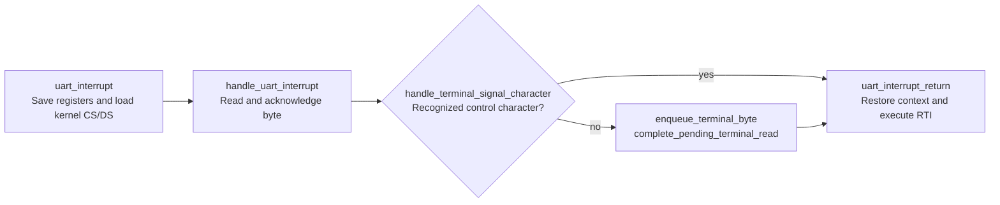
```mermaid
flowchart LR
    ENTRY["uart_interrupt<br/>Save registers and load kernel CS/DS"] --> HANDLE["handle_uart_interrupt<br/>Read and acknowledge byte"]
    HANDLE --> SIGNAL{"handle_terminal_signal_character<br/>Recognized control character?"}
    SIGNAL -->|yes| RETURN["uart_interrupt_return<br/>Restore context and execute RTI"]
    SIGNAL -->|no| INPUT["enqueue_terminal_byte<br/>complete_pending_terminal_read"]
    INPUT --> RETURN
```

</ReadmeVisual>

</div>

</div>

---

<!-- SOURCE Pico-OS/README.md#26-uart-receive-interrupt-path -->

# 2. Interrupts, system calls, preemption, and exceptions

## 2.6 UART receive interrupt path (2)

<div class="deck-content readme-slide">

<div class="readme-artifacts layout-single">

<!-- README_ASSET code-2668 -->
<div class="code-columns">

<ReadmeVisual kind="code" :width="710.8" data-code-source="code-2668" data-code-part="1">

<!-- README_CODE_PART code-2668 lines=1-19 -->
<div class="readme-code">

```c {lines:false}
__attribute__((naked))
void uart_interrupt(void) {
    // Saves the interrupted context while the kernel transfers one input byte
    asm("PUSH ACC");
    asm("PUSH IN1");
    asm("PUSH IN2");
    asm("PUSH BAF");
    asm("PUSH CS");
    asm("PUSH DS");

    // BAF keeps the interrupted stack while the handler uses kernel segments
    // Keeping SP avoids overwriting a suspended kernel call frame when all
    // processes are blocked and the dispatcher is waiting for an interrupt
    asm("MOVE SP BAF");
    asm(KERNEL_CS_START_ASM); // LOADI32 CS -2147483643
    asm(KERNEL_DS_START_ASM); // LOADI32 DS -2147442882

    asm("LOADI32 ACC uart_interrupt_return");
    asm("ADD ACC CS");
```

</div>

</ReadmeVisual>

<ReadmeVisual kind="code" :width="710.8" data-code-source="code-2668" data-code-part="2">

<!-- README_CODE_PART code-2668 lines=20-37 -->
<div class="readme-code">

```c {lines:false}
    asm("PUSH ACC");
    asm("LOADI32 ACC handle_uart_interrupt");
    asm("ADD ACC CS");
    asm("MOVE ACC PC");
}

__attribute__((naked))
void uart_interrupt_return(void) {
    // Restores the context that was active before the UART interrupt
    asm("MOVE BAF SP");
    asm("POP DS");
    asm("POP CS");
    asm("POP BAF");
    asm("POP IN2");
    asm("POP IN1");
    asm("POP ACC");
    asm("RTI");
}
```

</div>

</ReadmeVisual>

</div>

</div>

</div>

---

<!-- SOURCE Pico-OS/README.md#26-uart-receive-interrupt-path -->

# 2. Interrupts, system calls, preemption, and exceptions

## 2.6 UART receive interrupt path (3)

<div class="deck-content readme-slide">

<div class="readme-artifacts layout-columns">

<!-- README_ASSET list-2711 -->
<div class="readme-list"><ul><li>Save registers + automatic PC</li>
<li>Retain interrupted SP + boundary</li>
<li>handle_uart_interrupt → uart_interrupt_return</li></ul></div>

<!-- README_ASSET list-2722 -->
<div class="readme-list"><ul><li>SP ← BAF</li>
<li>Pop six registers</li>
<li>RTI; no scheduling check</li></ul></div>

</div>

</div>

---

<!-- SOURCE Pico-OS/README.md#26-uart-receive-interrupt-path -->

# 2. Interrupts, system calls, preemption, and exceptions

## 2.6 UART receive interrupt path (4)

<div class="deck-content readme-slide">

<div class="readme-artifacts layout-single">

<!-- README_ASSET code-2730 -->
<ReadmeVisual kind="code" :width="980" data-code-source="code-2730" data-code-part="1">

<!-- README_CODE_PART code-2730 lines=1-20 -->
<div class="readme-code">

```c {lines:false}
void handle_uart_interrupt(void) {
    struct ProcessControlBlock *process = terminal_input_process();
    struct Terminal *terminal = kernel_terminal();
    int value;
    int status;

    value = periphery_read_register(UART_RECEIVE_REGISTER) & 255;
    status = periphery_read_register(UART_STATUS_REGISTER);
    periphery_write_register(
        UART_STATUS_REGISTER,
        status | UART_RECEIVE_READY
    );

    if (handle_terminal_signal_character(value)) {
        return;
    }

    enqueue_terminal_byte(terminal, value);
    complete_pending_terminal_read(process, terminal);
}
```

</div>

</ReadmeVisual>

</div>

</div>

---

<!-- SOURCE Pico-OS/README.md#26-uart-receive-interrupt-path -->

# 2. Interrupts, system calls, preemption, and exceptions

## 2.6 UART receive interrupt path (5)

<div class="deck-content readme-slide">

<div class="readme-artifacts layout-single">

<!-- README_ASSET list-2756 -->
<div class="readme-list"><ul><li>Find foreground owner + terminal</li>
<li>Read byte; acknowledge receive-ready</li>
<li>Ctrl+C → SIGINT; Ctrl+Z → SIGTSTP</li>
<li>Buffer byte; complete waiting read</li></ul></div>

</div>

</div>

---

<!-- SOURCE Pico-OS/README.md#261-borrowed-stack-entry-and-return -->

# 2. Interrupts, system calls, preemption, and exceptions · 2.6 UART receive interrupt path

## 2.6.1 Borrowed-stack entry and return

<div class="deck-content readme-slide">

<div class="readme-list"><ul><li>UART/DMA borrow interrupted stack</li>
<li>Handler uses space below saved frame</li>
<li>Retain SP + stack boundary</li>
<li>Kernel CS classifies nested faults</li>
<li>Return restores interrupted execution</li></ul></div>

</div>

---

<!-- SOURCE Pico-OS/README.md#262-uart-nesting-and-interrupt-priorities -->

# 2. Interrupts, system calls, preemption, and exceptions · 2.6 UART receive interrupt path

## 2.6.2 UART nesting and interrupt priorities

<div class="deck-content readme-slide">

<div class="readme-artifacts layout-single">

<!-- README_ASSET table-2797 -->
<ReadmeVisual kind="table" :width="1080" data-table-key="table-2797:1,2,3,4,5,6,7">

<div class="table-panels" v-pre><div class="readme-table"><table><colgroup><col style="width:24.52%" /><col style="width:33.49%" /><col style="width:41.99%" /></colgroup><thead><tr><th>Event</th><th>Context already executing</th><th>Result</th></tr></thead><tbody><tr data-source-row="1"><td class="table-key"><ul><li>UART receive</li></ul></td><td><ul><li>Syscall, with no hardware handler active</li></ul></td><td><ul><li>Immediate UART; return to syscall</li></ul></td></tr>
<tr data-source-row="2"><td class="table-key"><ul><li>UART receive</li></ul></td><td><ul><li>Timer or DMA handler</li></ul></td><td><ul><li>UART priority 2 nests over priority 1</li></ul></td></tr>
<tr data-source-row="3"><td class="table-key"><ul><li>Timer expiration</li></ul></td><td><ul><li>UART handler</li></ul></td><td><ul><li>Timer pending until UART returns</li></ul></td></tr>
<tr data-source-row="4"><td class="table-key"><ul><li>DMA completion</li></ul></td><td><ul><li>UART handler</li></ul></td><td><ul><li>DMA pending until UART returns</li></ul></td></tr>
<tr data-source-row="5"><td class="table-key"><ul><li>Timer expiration</li></ul></td><td><ul><li>DMA handler</li></ul></td><td><ul><li>Timer pending until DMA returns</li></ul></td></tr>
<tr data-source-row="6"><td class="table-key"><ul><li>DMA completion</li></ul></td><td><ul><li>Timer handler</li></ul></td><td><ul><li>DMA pending until timer RTI</li></ul></td></tr>
<tr data-source-row="7"><td class="table-key"><ul><li>Another UART byte</li></ul></td><td><ul><li>UART handler or an already pending UART byte</li></ul></td><td><ul><li>Queued byte until active UART ISR completes</li></ul></td></tr></tbody></table></div></div>

</ReadmeVisual>

</div>

</div>

---

<!-- SOURCE Pico-OS/README.md#263-polled-uart-function-reference -->

# 2. Interrupts, system calls, preemption, and exceptions · 2.6 UART receive interrupt path

## 2.6.3 Polled UART function reference

<div class="deck-content readme-slide">

<div class="readme-artifacts layout-single">

<!-- README_ASSET table-2829 -->
<ReadmeVisual kind="table" :width="1080" data-table-key="table-2829:1">

<div class="table-panels" v-pre><div class="readme-table"><table><colgroup><col style="width:32.24%" /><col style="width:16.22%" /><col style="width:20.07%" /><col style="width:31.47%" /></colgroup><thead><tr><th>Kernel function</th><th>Result</th><th>Effects</th><th>Library entry</th></tr></thead><tbody><tr data-source-row="1"><td class="table-key"><ul><li><code>send_byte_over_uart()</code></li></ul></td><td><ul><li>No value</li></ul></td><td><ul><li>Send one polled UART byte</li></ul></td><td><ul><li><code>send_byte_over_uart()</code></li></ul></td></tr></tbody></table></div></div>

</ReadmeVisual>

</div>

</div>

---

<!-- SOURCE Pico-OS/README.md#27-dma-completion-interrupt-path -->

# 2. Interrupts, system calls, preemption, and exceptions

## 2.7 DMA completion interrupt path (1)

<div class="deck-content readme-slide">

<div class="readme-artifacts layout-single">

<!-- README_ASSET mermaid-2841 -->
<ReadmeVisual kind="mermaid" :width="980">

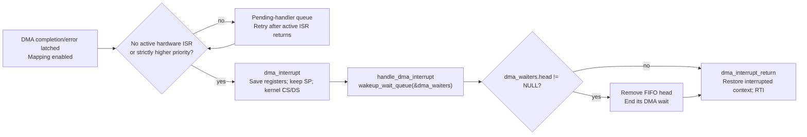
```mermaid
flowchart LR
    PENDING["DMA completion/error latched<br/>Mapping enabled"] --> PRIORITY{"No active hardware ISR<br/>or strictly higher priority?"}
    PRIORITY -->|no| WAIT["Pending-handler queue<br/>Retry after active ISR returns"]
    PRIORITY -->|yes| ENTRY["dma_interrupt<br/>Save registers; keep SP; kernel CS/DS"]
    WAIT --> PRIORITY
    ENTRY --> HANDLE["handle_dma_interrupt<br/>wakeup_wait_queue(&dma_waiters)"]
    HANDLE --> QUEUE{"dma_waiters.head != NULL?"}
    QUEUE -->|yes| WAKE["Remove FIFO head<br/>End its DMA wait"]
    QUEUE -->|no| RETURN["dma_interrupt_return<br/>Restore interrupted context; RTI"]
    WAKE --> RETURN
```

</ReadmeVisual>

</div>

</div>

---

<!-- SOURCE Pico-OS/README.md#27-dma-completion-interrupt-path -->

# 2. Interrupts, system calls, preemption, and exceptions

## 2.7 DMA completion interrupt path (2)

<div class="deck-content readme-slide">

<div class="readme-artifacts layout-single">

<!-- README_ASSET code-2857 -->
<div class="code-columns">

<ReadmeVisual kind="code" :width="702.1999999999999" data-code-source="code-2857" data-code-part="1">

<!-- README_CODE_PART code-2857 lines=1-20 -->
<div class="readme-code">

```c {lines:false}
__attribute__((naked))
void dma_interrupt(void) {
    // Saves the interrupted context while the kernel completes the DMA wait
    asm("PUSH ACC");
    asm("PUSH IN1");
    asm("PUSH IN2");
    asm("PUSH BAF");
    asm("PUSH CS");
    asm("PUSH DS");

    // BAF keeps the interrupted stack while the handler uses kernel segments
    asm("MOVE SP BAF");
    asm(KERNEL_CS_START_ASM); // LOADI32 CS -2147483643
    asm(KERNEL_DS_START_ASM); // LOADI32 DS -2147442882

    asm("LOADI32 ACC dma_interrupt_return");
    asm("ADD ACC CS");
    asm("PUSH ACC");
    asm("LOADI32 ACC handle_dma_interrupt");
    asm("ADD ACC CS");
```

</div>

</ReadmeVisual>

<ReadmeVisual kind="code" :width="702.1999999999999" data-code-source="code-2857" data-code-part="2">

<!-- README_CODE_PART code-2857 lines=21-39 -->
<div class="readme-code">

```c {lines:false}
    asm("MOVE ACC PC");
}

__attribute__((naked))
void dma_interrupt_return(void) {
    // Restores the context that was active before the DMA interrupt
    asm("MOVE BAF SP");
    asm("POP DS");
    asm("POP CS");
    asm("POP BAF");
    asm("POP IN2");
    asm("POP IN1");
    asm("POP ACC");
    asm("RTI");
}

void handle_dma_interrupt(void) {
    wakeup_wait_queue(&dma_waiters);
}
```

</div>

</ReadmeVisual>

</div>

</div>

</div>

---

<!-- SOURCE Pico-OS/README.md#27-dma-completion-interrupt-path -->

# 2. Interrupts, system calls, preemption, and exceptions

## 2.7 DMA completion interrupt path (3)

<div class="deck-content readme-slide">

<div class="readme-artifacts layout-columns">

<!-- README_ASSET list-2902 -->
<div class="readme-list"><ul><li>Save six registers</li>
<li>Borrow stack; install kernel CS/DS</li>
<li>handle_dma_interrupt → dma_interrupt_return</li></ul></div>

<!-- README_ASSET list-2918 -->
<div class="readme-list"><ul><li>SP ← BAF</li>
<li>Pop six registers</li>
<li>RTI; retain borrowed-stack convention</li></ul></div>

</div>

</div>

---

<!-- SOURCE Pico-OS/README.md#281-cpu-exception-entry-and-registers -->

# 2. Interrupts, system calls, preemption, and exceptions · 2.8 CPU exceptions and runtime errors

## 2.8.1 CPU exception entry and registers (1)

<div class="deck-content readme-slide">

<div class="readme-artifacts layout-single">

<!-- README_ASSET mermaid-2959 -->
<ReadmeVisual kind="mermaid" :width="980">

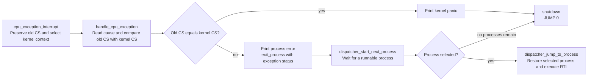
```mermaid
flowchart LR
    ENTRY["cpu_exception_interrupt<br/>Preserve old CS and select kernel context"] --> HANDLE["handle_cpu_exception<br/>Read cause and compare old CS with kernel CS"]
    HANDLE --> KERNEL{"Old CS equals kernel CS?"}
    KERNEL -->|yes| PANIC["Print kernel panic"] --> HALT["shutdown<br/>JUMP 0"]
    KERNEL -->|no| EXIT["Print process error<br/>exit_process with exception status"]
    EXIT --> NEXT["dispatcher_start_next_process<br/>Wait for a runnable process"]
    NEXT --> SELECT{"Process selected?"}
    SELECT -->|no processes remain| HALT
    SELECT -->|yes| RESTORE["dispatcher_jump_to_process<br/>Restore selected process and execute RTI"]
```

</ReadmeVisual>

</div>

</div>

---

<!-- SOURCE Pico-OS/README.md#281-cpu-exception-entry-and-registers -->

# 2. Interrupts, system calls, preemption, and exceptions · 2.8 CPU exceptions and runtime errors

## 2.8.1 CPU exception entry and registers (2)

<div class="deck-content readme-slide">

<div class="readme-artifacts layout-single">

<!-- README_ASSET table-2974 -->
<ReadmeVisual kind="table" :width="1080" data-table-key="table-2974:1,2">

<div class="table-panels" v-pre><div class="readme-table"><table><colgroup><col style="width:37.42%" /><col style="width:18.40%" /><col style="width:44.18%" /></colgroup><thead><tr><th>Register</th><th>Written by</th><th>Contents and use</th></tr></thead><tbody><tr data-source-row="1"><td class="table-key"><ul><li>10, <span class="source-link"><code>STACK_HEAP_BOUNDARY_REGISTER</code></span></li></ul></td><td><ul><li>PicoOS</li></ul></td><td><ul><li>0: disabled</li><li>SP below boundary → exception</li><li>Boundary: final heap cell</li></ul></td></tr>
<tr data-source-row="2"><td class="table-key"><ul><li>11, <span class="source-link"><code>CPU_EXCEPTION_CAUSE_REGISTER</code></span></li></ul></td><td><ul><li>RETI CPU/emulator</li></ul></td><td><ul><li>0: none; 1: divide-by-zero</li><li>2: stack overflow; 3: illegal instruction</li><li>Read-only cause register</li></ul></td></tr></tbody></table></div></div>

</ReadmeVisual>

</div>

</div>

---

<!-- SOURCE Pico-OS/README.md#281-cpu-exception-entry-and-registers -->

# 2. Interrupts, system calls, preemption, and exceptions · 2.8 CPU exceptions and runtime errors

## 2.8.1 CPU exception entry and registers (3)

<div class="deck-content readme-slide">

<div class="readme-artifacts layout-single">

<!-- README_ASSET code-2982 -->
<div class="code-columns">

<ReadmeVisual kind="code" :width="736.6" data-code-source="code-2982" data-code-part="1">

<!-- README_CODE_PART code-2982 lines=1-12 -->
<div class="readme-code">

```c {lines:false}
__attribute__((naked))
void cpu_exception_interrupt(void) {
    // BAF preserves the interrupted CS while the handler resets kernel context
    asm("MOVE CS BAF");
    asm("LOADI IN1 0");
    write_stack_heap_boundary_from_in1();
    asm(KERNEL_CS_START_ASM); // LOADI32 CS -2147483643
    asm(KERNEL_DS_START_ASM); // LOADI32 DS -2147442882
    asm(KERNEL_SP_START_ASM); // LOADI32 SP -2147435340
    activate_kernel_stack_boundary();

    // A zero difference identifies an exception raised in kernel code
```

</div>

</ReadmeVisual>

<ReadmeVisual kind="code" :width="736.6" data-code-source="code-2982" data-code-part="2">

<!-- README_CODE_PART code-2982 lines=13-23 -->
<div class="readme-code">

```c {lines:false}
    asm("MOVE BAF ACC");
    asm("SUB ACC CS");
    asm("PUSH ACC");

    // The exception handler terminates the process or halts after a kernel panic
    asm("LOADI ACC 0");
    asm("PUSH ACC");
    asm("LOADI32 ACC handle_cpu_exception");
    asm("ADD ACC CS");
    asm("MOVE ACC PC");
}
```

</div>

</ReadmeVisual>

</div>

</div>

</div>

---

<!-- SOURCE Pico-OS/README.md#281-cpu-exception-entry-and-registers -->

# 2. Interrupts, system calls, preemption, and exceptions · 2.8 CPU exceptions and runtime errors

## 2.8.1 CPU exception entry and registers (4)

<div class="deck-content readme-slide">

<div class="readme-artifacts layout-columns">

<!-- README_ASSET list-3011 -->
<div class="readme-list"><ul><li>BAF ← interrupted CS</li>
<li>Reset kernel segments, stack, boundary</li>
<li>Compare interrupted CS with kernel CS</li>
<li>Handle exception; never return</li></ul></div>

<!-- README_ASSET code-3030 -->
<ReadmeVisual kind="code" :width="642" data-code-source="code-3030" data-code-part="1">

<!-- README_CODE_PART code-3030 lines=1-11 -->
<div class="readme-code">

```c {lines:false}
void handle_cpu_exception(int interrupted_kernel_cs_difference) {
    int cause = periphery_read_register(CPU_EXCEPTION_CAUSE_REGISTER);
    bool kernel_exception = interrupted_kernel_cs_difference == 0;

    print_cpu_exception_message(cause, kernel_exception);
    if (kernel_exception) {
        shutdown();
    }

    exit_process(PROCESS_EXIT_STATUS_EXCEPTION);
}
```

</div>

</ReadmeVisual>

</div>

</div>

---

<!-- SOURCE Pico-OS/README.md#281-cpu-exception-entry-and-registers -->

# 2. Interrupts, system calls, preemption, and exceptions · 2.8 CPU exceptions and runtime errors

## 2.8.1 CPU exception entry and registers (5)

<div class="deck-content readme-slide">

<div class="readme-artifacts layout-single">

<!-- README_ASSET list-3047 -->
<div class="readme-list"><ul><li>Read cause; classify kernel/userspace</li>
<li>Print diagnostic via UART or stdout</li>
<li>Kernel fault → shutdown</li>
<li>Process fault → status + ZOMBIE</li>
<li>Dispatch survivor; never restore fault</li></ul></div>

</div>

</div>

---

<!-- SOURCE Pico-OS/README.md#282-supported-exceptions-and-allocation-errors -->

# 2. Interrupts, system calls, preemption, and exceptions · 2.8 CPU exceptions and runtime errors

## 2.8.2 Supported exceptions and allocation errors

<div class="deck-content readme-slide">

<div class="readme-artifacts layout-single">

<!-- README_ASSET table-3080 -->
<ReadmeVisual kind="table" :width="1080" data-table-key="table-3080:1,2,3,4,5,6">

<div class="table-panels" v-pre><div class="readme-table"><table><colgroup><col style="width:15.25%" /><col style="width:26.18%" /><col style="width:36.48%" /><col style="width:22.09%" /></colgroup><thead><tr><th>Condition</th><th>Trigger</th><th>Entry or reported cause</th><th>PicoOS handling</th></tr></thead><tbody><tr data-source-row="1"><td class="table-key"><ul><li>Division or modulo by zero</li></ul></td><td><ul><li>DIV/DIVI/MOD/MODI with zero divisor</li></ul></td><td><ul><li>Cause 1; IVT entry 3</li></ul></td><td><ul><li>Userspace → terminate</li><li>Kernel → panic + shutdown</li></ul></td></tr>
<tr data-source-row="2"><td class="table-key"><ul><li>Stack overflow</li></ul></td><td><ul><li>SP decreased below active boundary</li></ul></td><td><ul><li>Cause 2; IVT entry 3</li></ul></td><td><ul><li>Process overflow → terminate</li><li>Kernel overflow → shutdown</li></ul></td></tr>
<tr data-source-row="3"><td class="table-key"><ul><li>Illegal instruction</li></ul></td><td><ul><li>Invalid/unsupported decoded RETI instruction</li></ul></td><td><ul><li>Cause 3; IVT entry 3</li></ul></td><td><ul><li>Same process/kernel fault policy</li></ul></td></tr>
<tr data-source-row="4"><td class="table-key"><ul><li>Process heap full</li></ul></td><td><ul><li><span class="source-link"><code>malloc()</code></span> or <span class="source-link"><code>realloc()</code></span> cannot satisfy a positive-size allocation</li></ul></td><td><ul><li><span class="source-link"><code>require_process_heap_allocation()</code></span> invokes the process-heap-full syscall</li></ul></td><td><ul><li>Print heap-full diagnostic; terminate process</li></ul></td></tr>
<tr data-source-row="5"><td class="table-key"><ul><li>Kernel heap full</li></ul></td><td><ul><li><span class="source-link"><code>kmalloc()</code></span> or <span class="source-link"><code>krealloc()</code></span> cannot satisfy a positive-size allocation</li></ul></td><td><ul><li><span class="source-link"><code>require_kernel_heap_allocation()</code></span> calls the panic handler directly</li></ul></td><td><ul><li>UART panic; shut down kernel</li></ul></td></tr>
<tr data-source-row="6"><td class="table-key"><ul><li>Process and Shared Data Heap exhausted</li></ul></td><td><ul><li>No contiguous Process/Shared Data Payload</li></ul></td><td><ul><li>Returns <span class="source-link"><code>PSDMALLOC_INVALID_START</code></span>, no CPU exception is raised</li></ul></td><td><ul><li>Load fails / shm_open returns −1</li><li>Process + kernel continue</li></ul></td></tr></tbody></table></div></div>

</ReadmeVisual>

</div>

</div>

---

<!-- SOURCE Pico-OS/README.md#283-exception-and-stack-boundary-function-reference -->

# 2. Interrupts, system calls, preemption, and exceptions · 2.8 CPU exceptions and runtime errors

## 2.8.3 Exception and stack-boundary function reference

<div class="deck-content readme-slide">

<div class="readme-artifacts layout-single">

<!-- README_ASSET table-3097 -->
<ReadmeVisual kind="table" :width="1080" data-table-key="table-3097:1">

<div class="table-panels" v-pre><div class="readme-table"><table><colgroup><col style="width:36.64%" /><col style="width:13.24%" /><col style="width:16.44%" /><col style="width:33.68%" /></colgroup><thead><tr><th>Kernel function</th><th>Result</th><th>Effects</th><th>Library entry</th></tr></thead><tbody><tr data-source-row="1"><td class="table-key"><ul><li><code>handle_process_heap_full_exception()</code></li></ul></td><td><ul><li>Terminates process</li></ul></td><td><ul><li>Print diagnostic; terminate process</li></ul></td><td><ul><li><code>require_process_heap_allocation()</code></li></ul></td></tr></tbody></table></div></div>

</ReadmeVisual>

</div>

</div>

---

<!-- SOURCE Pico-OS/README.md#31-heap-block-layout-and-allocation-algorithm -->

# 3. Memory management and shared memory

## 3.1 Heap block layout and allocation algorithm (1)

<div class="deck-content readme-slide">

<div class="readme-artifacts layout-single">

<!-- README_ASSET code-3120 -->
<ReadmeVisual kind="code" :width="980" data-code-source="code-3120" data-code-part="1">

<!-- README_CODE_PART code-3120 lines=1-9 -->
<div class="readme-code">

```c {lines:false}
struct BlockHeader {
    int size;
    bool free;
    struct BlockHeader *next;
};

struct Heap {
    struct BlockHeader *first_block;
};
```

</div>

</ReadmeVisual>

</div>

</div>

---

<!-- SOURCE Pico-OS/README.md#31-heap-block-layout-and-allocation-algorithm -->

# 3. Memory management and shared memory

## 3.1 Heap block layout and allocation algorithm (2)

<div class="deck-content readme-slide">

<div class="readme-artifacts layout-single">

<!-- README_ASSET image-3140 -->
<ReadmeVisual kind="image" :width="980">


</ReadmeVisual>

</div>

</div>

---

<!-- SOURCE Pico-OS/README.md#31-heap-block-layout-and-allocation-algorithm -->

# 3. Memory management and shared memory

## 3.1 Heap block layout and allocation algorithm (3)

<div class="deck-content readme-slide">

<div class="readme-artifacts layout-single">

<!-- README_ASSET table-3145 -->
<ReadmeVisual kind="table" :width="1080" data-table-key="table-3145:1,2,3,4">

<div class="table-panels" v-pre><div class="readme-table"><table><colgroup><col style="width:40.71%" /><col style="width:59.29%" /></colgroup><thead><tr><th>Field</th><th>Meaning</th></tr></thead><tbody><tr data-source-row="1"><td class="table-key"><ul><li><span class="source-link"><code>BlockHeader.size</code></span></li></ul></td><td><ul><li>Usable cells; excludes header</li></ul></td></tr>
<tr data-source-row="2"><td class="table-key"><ul><li><span class="source-link"><code>BlockHeader.free</code></span></li></ul></td><td><ul><li>Whether payload can satisfy allocation</li></ul></td></tr>
<tr data-source-row="3"><td class="table-key"><ul><li><span class="source-link"><code>BlockHeader.next</code></span></li></ul></td><td><ul><li>Next header or NULL</li></ul></td></tr>
<tr data-source-row="4"><td class="table-key"><ul><li><span class="source-link"><code>Heap.first_block</code></span></li></ul></td><td><ul><li>First header; no separate block array</li></ul></td></tr></tbody></table></div></div>

</ReadmeVisual>

</div>

</div>

---

<!-- SOURCE Pico-OS/README.md#32-sram-image-and-heap-hierarchy -->

# 3. Memory management and shared memory

## 3.2 SRAM image and heap hierarchy (1)

<div class="deck-content readme-slide">

<div class="readme-artifacts layout-single">

<!-- README_ASSET table-3167 -->
<ReadmeVisual kind="table" :width="1080" data-table-key="table-3167:1,2,3">

<div class="table-panels" v-pre><div class="readme-table"><table><colgroup><col style="width:16.13%" /><col style="width:35.34%" /><col style="width:29.36%" /><col style="width:19.17%" /></colgroup><thead><tr><th>Heap context</th><th>Descriptor storage</th><th>Managed payloads</th><th>Interface</th></tr></thead><tbody><tr data-source-row="1"><td class="table-key"><ul><li>Kernel Heap</li></ul></td><td><ul><li>kernel_heap in kernel .data</li></ul></td><td><ul><li>PCBs, paths, descriptors, shared metadata</li></ul></td><td><ul><li><span class="source-link"><code>kmalloc()</code></span> / <span class="source-link"><code>kfree()</code></span></li></ul></td></tr>
<tr data-source-row="2"><td class="table-key"><ul><li>Process and Shared Data Heap</li></ul></td><td><ul><li>process_shared_data_heap in kernel .data</li></ul></td><td><ul><li>Complete process + shared-data payloads</li></ul></td><td><ul><li><span class="source-link"><code>PSDMalloc()</code></span> / <span class="source-link"><code>PSDFree()</code></span></li></ul></td></tr>
<tr data-source-row="3"><td class="table-key"><ul><li>User Process Heap</li></ul></td><td><ul><li>process_heap in each process .data</li></ul></td><td><ul><li>Process + linked-library allocations</li></ul></td><td><ul><li><span class="source-link"><code>malloc()</code></span> / <span class="source-link"><code>free()</code></span></li></ul></td></tr></tbody></table></div></div>

</ReadmeVisual>

</div>

</div>

---

<!-- SOURCE Pico-OS/README.md#32-sram-image-and-heap-hierarchy -->

# 3. Memory management and shared memory

## 3.2 SRAM image and heap hierarchy (2)

<div class="deck-content readme-slide">

<div class="readme-artifacts layout-single">

<!-- README_ASSET image-3183 -->
<ReadmeVisual kind="image" :width="980">


</ReadmeVisual>

</div>

</div>

---

<!-- SOURCE Pico-OS/README.md#32-sram-image-and-heap-hierarchy -->

# 3. Memory management and shared memory

## 3.2 SRAM image and heap hierarchy (3)

<div class="deck-content readme-slide">

<div class="readme-artifacts layout-stacked">

<!-- README_ASSET table-3189 -->
<ReadmeVisual kind="table" :width="1080" data-table-key="table-3189:1,2,3,4,5,6">

<div class="table-panels" v-pre><div class="readme-table"><table><colgroup><col style="width:24.83%" /><col style="width:21.97%" /><col style="width:17.41%" /><col style="width:35.78%" /></colgroup><thead><tr><th>Larger part</th><th>SRAM offset</th><th>Section or region</th><th>Contents</th></tr></thead><tbody><tr data-source-row="1"><td class="table-key"><ul><li>Kernel Image</li></ul></td><td><ul><li><code>0..4</code></li></ul></td><td><ul><li><code>.ivt</code></li></ul></td><td><ul><li>Five ISR addresses</li></ul></td></tr>
<tr data-source-row="2"><td class="table-key"><ul><li>Kernel Image</li></ul></td><td><ul><li><code>5..40765</code></li></ul></td><td><ul><li><code>.text</code></li></ul></td><td><ul><li>Kernel + interrupt code</li></ul></td></tr>
<tr data-source-row="3"><td class="table-key"><ul><li>Kernel Image</li></ul></td><td><ul><li><code>40766..41496</code></li></ul></td><td><ul><li><code>.data</code></li></ul></td><td><ul><li>Globals, heap descriptors, list roots</li></ul></td></tr>
<tr data-source-row="4"><td class="table-key"><ul><li>Kernel runtime reservation</li></ul></td><td><ul><li><code>41497..45592</code></li></ul></td><td><ul><li>Kernel Heap</li></ul></td><td><ul><li>4096 cells + in-region headers</li></ul></td></tr>
<tr data-source-row="5"><td class="table-key"><ul><li>Kernel runtime reservation</li></ul></td><td><ul><li><code>45593..48308</code></li></ul></td><td><ul><li>Kernel Stack</li></ul></td><td><ul><li>Downward-growing kernel stack</li></ul></td></tr>
<tr data-source-row="6"><td class="table-key"><ul><li>After the Kernel region</li></ul></td><td><ul><li><code>48309..262143</code></li></ul></td><td><ul><li>Process and Shared Data Heap</li></ul></td><td><ul><li>Outer process + shared-data allocations</li></ul></td></tr></tbody></table></div></div>

</ReadmeVisual>

<!-- README_ASSET table-3207 -->
<ReadmeVisual kind="table" :width="1080" data-table-key="table-3207:1,2,3,4,5">

<div class="table-panels" v-pre><div class="readme-table"><table><colgroup><col style="width:19.31%" /><col style="width:41.54%" /><col style="width:39.14%" /></colgroup><thead><tr><th>Process Payload part</th><th>Relative address</th><th>Runtime role</th></tr></thead><tbody><tr data-source-row="1"><td class="table-key"><ul><li>Optional <code>.ivt</code></li></ul></td><td><ul><li>Before <span class="source-link"><code>code_start</code></span> when present</li></ul></td><td><ul><li>Optional attributed data</li></ul></td></tr>
<tr data-source-row="2"><td class="table-key"><ul><li><code>.text</code></li></ul></td><td><ul><li><span class="source-link"><code>code_start</code></span></li></ul></td><td><ul><li>base_address → activation.cs</li></ul></td></tr>
<tr data-source-row="3"><td class="table-key"><ul><li><code>.data</code></li></ul></td><td><ul><li><span class="source-link"><code>data_start</code></span></li></ul></td><td><ul><li>base_address → activation.ds; process_heap</li></ul></td></tr>
<tr data-source-row="4"><td class="table-key"><ul><li>User Process Heap</li></ul></td><td><ul><li><span class="source-link"><code>heap_start</code></span> through <code>heap_start + heap_size - 1</code></li></ul></td><td><ul><li>Inner headers + allocations; stack boundary</li></ul></td></tr>
<tr data-source-row="5"><td class="table-key"><ul><li>User Process Stack</li></ul></td><td><ul><li>First cell beyond the heap through <span class="source-link"><code>effective_stack_start</code></span></li></ul></td><td><ul><li>Arguments, environment, PC, call frames</li></ul></td></tr></tbody></table></div></div>

</ReadmeVisual>

</div>

</div>

---

<!-- SOURCE Pico-OS/README.md#331-kernel-heap-blocks-and-kernel-objects -->

# 3. Memory management and shared memory · 3.3 Kernel Heap

## 3.3.1 Kernel Heap blocks and kernel objects

<div class="deck-content readme-slide">

<div class="readme-list"><ul><li>Kernel Heap: PCB, paths, shared metadata</li>
<li>Separate allocation for each object</li>
<li>Metadata points into outer heap</li>
<li>kernel_heap.first_block → header chain</li></ul></div>

</div>

---

<!-- SOURCE Pico-OS/README.md#341-process-allocations -->

# 3. Memory management and shared memory · 3.4 Process and Shared Data Heap

## 3.4.1 Process allocations

<div class="deck-content readme-slide">

<div class="readme-list"><ul><li>PSDMalloc → complete Process Payload</li>
<li>PCB records base_address + size</li>
<li>Image + user heap + stack</li>
<li>remove_process → PSDFree whole payload</li>
<li>User free releases inner allocation only</li></ul></div>

</div>

---

<!-- SOURCE Pico-OS/README.md#342-shared-data-allocations -->

# 3. Memory management and shared memory · 3.4 Process and Shared Data Heap

## 3.4.2 Shared Data allocations

<div class="deck-content readme-slide">

<div class="readme-list"><ul><li>PSDMalloc → Shared Data Payload</li>
<li>Entry + name in Kernel Heap</li>
<li>Several mappings → same shared payload</li>
<li>No nested user heap</li>
<li>Unlinked + unmapped → PSDFree</li></ul></div>

</div>

---

<!-- SOURCE Pico-OS/README.md#351-per-process-user-process-heap -->

# 3. Memory management and shared memory · 3.5 User Process Heap

## 3.5.1 Per-Process User Process Heap

<div class="deck-content readme-slide">

<div class="readme-list"><ul><li>process_heap stored in process .data</li>
<li>Startup obtains bounds through syscalls</li>
<li>malloc/realloc/free → common allocator</li>
<li>Inner blocks; outer payload stays allocated</li>
<li>Restored DS selects process-local globals</li></ul></div>

</div>

---

<!-- SOURCE Pico-OS/README.md#352-user-process-heap-allocator-function-reference -->

# 3. Memory management and shared memory · 3.5 User Process Heap

## 3.5.2 User Process Heap allocator function reference

<div class="deck-content readme-slide">

<div class="readme-artifacts layout-single">

<!-- README_ASSET table-3332 -->
<ReadmeVisual kind="table" :width="1080" data-table-key="table-3332:1,2,3,4,5">

<div class="table-panels" v-pre><div class="readme-table"><table><colgroup><col style="width:33.94%" /><col style="width:14.79%" /><col style="width:17.79%" /><col style="width:33.48%" /></colgroup><thead><tr><th>Function</th><th>Result</th><th>Effects</th><th>Library entry</th></tr></thead><tbody><tr data-source-row="1"><td class="table-key"><ul><li><code>malloc()</code></li></ul></td><td><ul><li>Pointer / NULL / heap-full</li></ul></td><td><ul><li>First-fit process allocation</li><li>Positive failure → terminate</li></ul></td><td><ul><li><code>opendir()</code></li><li><code>copy_environment_variable()</code></li><li><code>initialize_environment()</code></li><li><code>setenv()</code></li><li><code>clone_environment()</code></li></ul></td></tr>
<tr data-source-row="2"><td class="table-key"><ul><li><code>realloc()</code></li></ul></td><td><ul><li>Pointer / NULL / heap-full</li></ul></td><td><ul><li>Resize/move process allocation</li><li>Size 0 → free</li></ul></td><td><ul><li><code>store_environment_variable()</code></li></ul></td></tr>
<tr data-source-row="3"><td class="table-key"><ul><li><code>free()</code></li></ul></td><td><ul><li>No value</li></ul></td><td><ul><li>Free + coalesce process blocks</li></ul></td><td><ul><li><code>opendir()</code></li><li><code>closedir()</code></li><li><code>store_environment_variable()</code></li><li><code>unsetenv()</code></li><li><code>clearenv()</code></li><li><code>destroy_environment()</code></li></ul></td></tr>
<tr data-source-row="4"><td class="table-key"><ul><li><code>init_process_heap()</code></li></ul></td><td><ul><li>No value</li></ul></td><td><ul><li>Initialize process-local heap</li></ul></td><td><ul><li><code>start_process()</code></li></ul></td></tr>
<tr data-source-row="5"><td class="table-key"><ul><li><code>require_process_heap_allocation()</code></li></ul></td><td><ul><li>Pointer or termination</li></ul></td><td><ul><li>Positive failure → heap-full syscall</li></ul></td><td><ul><li><code>malloc()</code></li><li><code>realloc()</code></li></ul></td></tr></tbody></table></div></div>

</ReadmeVisual>

</div>

</div>

---

<!-- SOURCE Pico-OS/README.md#361-common-allocator-linkage-and-function-reference -->

# 3. Memory management and shared memory · 3.6 Heap and allocator function reference

## 3.6.1 Common allocator linkage and function reference (1)

<div class="deck-content readme-slide">

<div class="readme-artifacts layout-single">

<!-- README_ASSET mermaid-3353 -->
<ReadmeVisual kind="mermaid" :width="980">

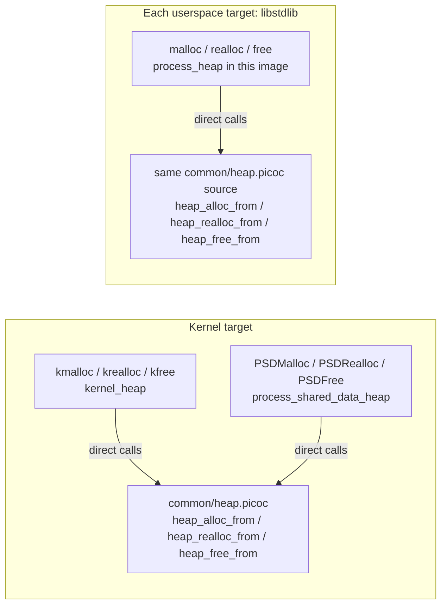
```mermaid
flowchart LR
    subgraph K["Kernel target"]
        KW["kmalloc / krealloc / kfree<br/>kernel_heap"] -->|direct calls| KC["common/heap.picoc<br/>heap_alloc_from / heap_realloc_from / heap_free_from"]
        PW["PSDMalloc / PSDRealloc / PSDFree<br/>process_shared_data_heap"] -->|direct calls| KC
    end
    subgraph L["Each userspace target: libstdlib"]
        LW["malloc / realloc / free<br/>process_heap in this image"] -->|direct calls| LC["same common/heap.picoc source<br/>heap_alloc_from / heap_realloc_from / heap_free_from"]
    end
```

</ReadmeVisual>

</div>

</div>

---

<!-- SOURCE Pico-OS/README.md#361-common-allocator-linkage-and-function-reference -->

# 3. Memory management and shared memory · 3.6 Heap and allocator function reference

## 3.6.1 Common allocator linkage and function reference (2)

<div class="deck-content readme-slide">

<div class="readme-artifacts layout-single">

<!-- README_ASSET table-3368 -->
<ReadmeVisual kind="table" :width="1080" data-table-key="table-3368:1,2,3,4">

<div class="table-panels" v-pre><div class="readme-table"><table><colgroup><col style="width:26.56%" /><col style="width:16.95%" /><col style="width:32.17%" /><col style="width:24.32%" /></colgroup><thead><tr><th>Function</th><th>Result</th><th>Effects</th><th>Library entry</th></tr></thead><tbody><tr data-source-row="1"><td class="table-key"><ul><li><code>heap_init_region()</code></li></ul></td><td><ul><li>No value</li></ul></td><td><ul><li>Initialize one free header</li></ul></td><td><ul><li><code>init_process_heap()</code></li></ul></td></tr>
<tr data-source-row="2"><td class="table-key"><ul><li><code>heap_alloc_from()</code></li></ul></td><td><ul><li>Pointer or NULL</li></ul></td><td><ul><li>First fit; split; mark allocated</li></ul></td><td><ul><li><code>malloc()</code></li></ul></td></tr>
<tr data-source-row="3"><td class="table-key"><ul><li><code>heap_realloc_from()</code></li></ul></td><td><ul><li>Pointer or NULL; old block on failure</li></ul></td><td><ul><li>Shrink, grow, or allocate/copy/free</li></ul></td><td><ul><li><code>realloc()</code></li></ul></td></tr>
<tr data-source-row="4"><td class="table-key"><ul><li><code>heap_free_from()</code></li></ul></td><td><ul><li>No value</li></ul></td><td><ul><li>Mark free; coalesce neighbors</li></ul></td><td><ul><li><code>free()</code></li></ul></td></tr></tbody></table></div></div>

</ReadmeVisual>

</div>

</div>

---

<!-- SOURCE Pico-OS/README.md#362-reallocation-decisions -->

# 3. Memory management and shared memory · 3.6 Heap and allocator function reference

## 3.6.2 Reallocation decisions

<div class="deck-content readme-slide">

<div class="readme-artifacts layout-single">

<!-- README_ASSET mermaid-3385 -->
<ReadmeVisual kind="mermaid" :width="980">

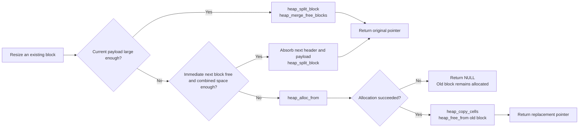
```mermaid
flowchart LR
    R["Resize an existing block"] --> FIT{"Current payload large enough?"}
    FIT -->|Yes| SHRINK["heap_split_block<br/>heap_merge_free_blocks"]
    SHRINK --> SAME["Return original pointer"]
    FIT -->|No| NEXT{"Immediate next block free and combined space enough?"}
    NEXT -->|Yes| GROW["Absorb next header and payload<br/>heap_split_block"]
    GROW --> SAME
    NEXT -->|No| ALLOC["heap_alloc_from"]
    ALLOC --> OK{"Allocation succeeded?"}
    OK -->|No| KEEP["Return NULL<br/>Old block remains allocated"]
    OK -->|Yes| COPY["heap_copy_cells<br/>heap_free_from old block"]
    COPY --> NEW["Return replacement pointer"]
```

</ReadmeVisual>

</div>

</div>

---

<!-- SOURCE Pico-OS/README.md#363-allocation-and-repeated-coalescing-example -->

# 3. Memory management and shared memory · 3.6 Heap and allocator function reference

## 3.6.3 Allocation and repeated coalescing example

<div class="deck-content readme-slide">

<div class="readme-list"><ul><li>Allocation → free → repeated coalescing</li>
<li>Amber: headers; cyan: allocated payloads</li>
<li>Green: free payloads</li>
<li>Arrows: next links; offsets: cells</li></ul></div>

</div>

---

<!-- SOURCE Pico-OS/README.md#3631-initial-state-and-first-fit-search -->

# 3. Memory management and shared memory · 3.6 Heap and allocator function reference · 3.6.3 Allocation and repeated coalescing example

## 3.6.3.1 Initial state and first-fit search

<div class="deck-content readme-slide">

<div class="readme-artifacts layout-single">

<!-- README_ASSET image-3418 -->
<ReadmeVisual kind="image" :width="980">


</ReadmeVisual>

</div>

</div>

---

<!-- SOURCE Pico-OS/README.md#3632-allocation-splits-d -->

# 3. Memory management and shared memory · 3.6 Heap and allocator function reference · 3.6.3 Allocation and repeated coalescing example

## 3.6.3.2 Allocation splits D

<div class="deck-content readme-slide">

<div class="readme-artifacts layout-single">

<!-- README_ASSET image-3433 -->
<ReadmeVisual kind="image" :width="980">


</ReadmeVisual>

</div>

</div>

---

<!-- SOURCE Pico-OS/README.md#3633-free-d-and-merge-its-remainder -->

# 3. Memory management and shared memory · 3.6 Heap and allocator function reference · 3.6.3 Allocation and repeated coalescing example

## 3.6.3.3 Free D and merge its remainder

<div class="deck-content readme-slide">

<div class="readme-artifacts layout-stacked">

<!-- README_ASSET image-3444 -->
<ReadmeVisual kind="image" :width="980">


</ReadmeVisual>

<!-- README_ASSET image-3450 -->
<ReadmeVisual kind="image" :width="980">


</ReadmeVisual>

</div>

</div>

---

<!-- SOURCE Pico-OS/README.md#3634-free-c-and-merge-repeatedly-at-b -->

# 3. Memory management and shared memory · 3.6 Heap and allocator function reference · 3.6.3 Allocation and repeated coalescing example

## 3.6.3.4 Free C and merge repeatedly at B (1)

<div class="deck-content readme-slide">

<div class="readme-artifacts layout-stacked">

<!-- README_ASSET image-3460 -->
<ReadmeVisual kind="image" :width="980">


</ReadmeVisual>

<!-- README_ASSET image-3465 -->
<ReadmeVisual kind="image" :width="980">


</ReadmeVisual>

</div>

</div>

---

<!-- SOURCE Pico-OS/README.md#3634-free-c-and-merge-repeatedly-at-b -->

# 3. Memory management and shared memory · 3.6 Heap and allocator function reference · 3.6.3 Allocation and repeated coalescing example

## 3.6.3.4 Free C and merge repeatedly at B (2)

<div class="deck-content readme-slide">

<div class="readme-artifacts layout-single">

<!-- README_ASSET image-3471 -->
<ReadmeVisual kind="image" :width="980">


</ReadmeVisual>

</div>

</div>

---

<!-- SOURCE Pico-OS/README.md#41-process-control-block-fields -->

# 4. Processes and process lifecycle

## 4.1 Process control block fields (1)

<div class="deck-content readme-slide">

<div class="readme-artifacts layout-single">

<!-- README_ASSET code-3496 -->
<div class="code-columns">

<ReadmeVisual kind="code" :width="680" data-code-source="code-3496" data-code-part="1">

<!-- README_CODE_PART code-3496 lines=1-14 -->
<div class="readme-code">

```c {lines:false}
struct ProcessControlBlock {
    int pid;
    int state;
    int base_address;
    int size;
    int heap_start;
    int heap_size;
    char *binary_path;
    char *working_directory;
    struct ActivationRecord activation;
    struct FileDescriptorTable *file_descriptors;
    int *waiting_status_ptr;
    struct wait_queue waiters;
    struct wait_queue *waiting_queue_ptr;
```

</div>

</ReadmeVisual>

<ReadmeVisual kind="code" :width="680" data-code-source="code-3496" data-code-part="2">

<!-- README_CODE_PART code-3496 lines=15-27 -->
<div class="readme-code">

```c {lines:false}
    struct ProcessControlBlock *wait_next;
    struct ProcessControlBlock *next;
    struct SharedMemoryAttachment *shared_memory_attachments;
    int parent_pid;
    int parent_death_signal;
    int exit_status;
    int stop_signal;
    int stopped_from_state;
    int pending_termination_signal;
    char *pending_terminal_read_buffer;
    int pending_terminal_read_count;
    struct ProcessLoad *pending_load;
};
```

</div>

</ReadmeVisual>

</div>

</div>

</div>

---

<!-- SOURCE Pico-OS/README.md#41-process-control-block-fields -->

# 4. Processes and process lifecycle

## 4.1 Process control block fields (2)

<div class="deck-content readme-slide">

<div class="readme-artifacts layout-single">

<!-- README_ASSET table-3526 -->
<ReadmeVisual kind="table" :width="1324" data-table-key="table-3526:1,2,3,4,5,6,7,8,9,10,11,12,13,14,15,16,17,18">

<div class="table-panels table-panels-two" v-pre><div class="readme-table"><table><colgroup><col style="width:47.69%" /><col style="width:52.31%" /></colgroup><thead><tr><th>Attribute</th><th>Meaning</th></tr></thead><tbody><tr data-source-row="1"><td class="table-key"><ul><li><span class="source-link"><code>pid</code></span></li></ul></td><td><ul><li>Stable process ID</li></ul></td></tr>
<tr data-source-row="2"><td class="table-key"><ul><li><span class="source-link"><code>state</code></span></li></ul></td><td><ul><li>NEW / READY / RUNNING</li><li>BLOCKED / STOPPED / ZOMBIE</li></ul></td></tr>
<tr data-source-row="3"><td class="table-key"><ul><li><span class="source-link"><code>base_address</code></span>, <span class="source-link"><code>size</code></span></li></ul></td><td><ul><li>Absolute Process Payload base + size</li></ul></td></tr>
<tr data-source-row="4"><td class="table-key"><ul><li><span class="source-link"><code>heap_start</code></span>, <span class="source-link"><code>heap_size</code></span></li></ul></td><td><ul><li>Relative userspace heap bounds</li></ul></td></tr>
<tr data-source-row="5"><td class="table-key"><ul><li><span class="source-link"><code>binary_path</code></span></li></ul></td><td><ul><li>Owned executable path; later argv[0]</li></ul></td></tr>
<tr data-source-row="6"><td class="table-key"><ul><li><span class="source-link"><code>working_directory</code></span></li></ul></td><td><ul><li>Owned absolute path; inherited or /</li></ul></td></tr>
<tr data-source-row="7"><td class="table-key"><ul><li><span class="source-link"><code>activation</code></span></li></ul></td><td><ul><li>Embedded saved CPU context</li></ul></td></tr>
<tr data-source-row="8"><td class="table-key"><ul><li><span class="source-link"><code>file_descriptors</code></span></li></ul></td><td><ul><li>Owned descriptor table</li></ul></td></tr>
<tr data-source-row="9"><td class="table-key"><ul><li><span class="source-link"><code>waiting_status_ptr</code></span></li></ul></td><td><ul><li>Pointer into suspended waitpid frame</li></ul></td></tr></tbody></table></div>
<div class="readme-table"><table><colgroup><col style="width:47.69%" /><col style="width:52.31%" /></colgroup><thead><tr><th>Attribute</th><th>Meaning</th></tr></thead><tbody><tr data-source-row="10"><td class="table-key"><ul><li><span class="source-link"><code>waiters</code></span></li></ul></td><td><ul><li>Embedded FIFO of waiting parents</li></ul></td></tr>
<tr data-source-row="11"><td class="table-key"><ul><li><span class="source-link"><code>waiting_queue_ptr</code></span>, <span class="source-link"><code>wait_next</code></span></li></ul></td><td><ul><li>Owning queue + intrusive successor</li></ul></td></tr>
<tr data-source-row="12"><td class="table-key"><ul><li><span class="source-link"><code>next</code></span></li></ul></td><td><ul><li>Global process-list successor</li></ul></td></tr>
<tr data-source-row="13"><td class="table-key"><ul><li><span class="source-link"><code>shared_memory_attachments</code></span></li></ul></td><td><ul><li>Head of process mapping records</li></ul></td></tr>
<tr data-source-row="14"><td class="table-key"><ul><li><span class="source-link"><code>parent_pid</code></span>, <span class="source-link"><code>parent_death_signal</code></span></li></ul></td><td><ul><li>Parent identity + parent-death signal</li></ul></td></tr>
<tr data-source-row="15"><td class="table-key"><ul><li><span class="source-link"><code>exit_status</code></span></li></ul></td><td><ul><li>Retained zombie termination status</li></ul></td></tr>
<tr data-source-row="16"><td class="table-key"><ul><li><span class="source-link"><code>stop_signal</code></span>, <span class="source-link"><code>stopped_from_state</code></span>, <span class="source-link"><code>pending_termination_signal</code></span></li></ul></td><td><ul><li>Stop/prior-state/deferred-termination bookkeeping</li></ul></td></tr>
<tr data-source-row="17"><td class="table-key"><ul><li><span class="source-link"><code>pending_terminal_read_buffer</code></span>, <span class="source-link"><code>pending_terminal_read_count</code></span></li></ul></td><td><ul><li>Retained buffer + requested count</li></ul></td></tr>
<tr data-source-row="18"><td class="table-key"><ul><li><span class="source-link"><code>pending_load</code></span></li></ul></td><td><ul><li>Metadata + progress of pending load</li></ul></td></tr></tbody></table></div></div>

</ReadmeVisual>

</div>

</div>

---

<!-- SOURCE Pico-OS/README.md#411-process-states-and-transitions -->

# 4. Processes and process lifecycle · 4.1 Process control block fields

## 4.1.1 Process states and transitions (1)

<div class="deck-content readme-slide">

<div class="readme-artifacts layout-single">

<!-- README_ASSET table-3561 -->
<ReadmeVisual kind="table" :width="1080" data-table-key="table-3561:1,2,3,4,5,6">

<div class="table-panels" v-pre><div class="readme-table"><table><colgroup><col style="width:19.21%" /><col style="width:19.21%" /><col style="width:30.66%" /><col style="width:30.91%" /></colgroup><thead><tr><th>State</th><th>Numeric value</th><th>Meaning</th><th>Typical transition</th></tr></thead><tbody><tr data-source-row="1"><td class="table-key"><ul><li><span class="source-link"><code>NEW</code></span></li></ul></td><td><ul><li>0</li></ul></td><td><ul><li>Loaded; startup not prepared</li></ul></td><td><ul><li>Load completion</li></ul></td></tr>
<tr data-source-row="2"><td class="table-key"><ul><li><span class="source-link"><code>READY</code></span></li></ul></td><td><ul><li>1</li></ul></td><td><ul><li>Eligible for scheduling</li></ul></td><td><ul><li>Run, wakeup, SIGCONT</li></ul></td></tr>
<tr data-source-row="3"><td class="table-key"><ul><li><span class="source-link"><code>RUNNING</code></span></li></ul></td><td><ul><li>2</li></ul></td><td><ul><li>Activation loaded into CPU</li></ul></td><td><ul><li>Dispatch</li></ul></td></tr>
<tr data-source-row="4"><td class="table-key"><ul><li><span class="source-link"><code>BLOCKED</code></span></li></ul></td><td><ul><li>3</li></ul></td><td><ul><li>Linked into wait queue</li></ul></td><td><ul><li>Read, DMA, waitpid, sleep</li></ul></td></tr>
<tr data-source-row="5"><td class="table-key"><ul><li><span class="source-link"><code>STOPPED</code></span></li></ul></td><td><ul><li>4</li></ul></td><td><ul><li>Suspended by signal</li></ul></td><td><ul><li>SIGSTOP/TSTP/TTIN</li></ul></td></tr>
<tr data-source-row="6"><td class="table-key"><ul><li><span class="source-link"><code>ZOMBIE</code></span></li></ul></td><td><ul><li>5</li></ul></td><td><ul><li>Status retained for parent</li></ul></td><td><ul><li>Termination</li></ul></td></tr></tbody></table></div></div>

</ReadmeVisual>

</div>

</div>

---

<!-- SOURCE Pico-OS/README.md#411-process-states-and-transitions -->

# 4. Processes and process lifecycle · 4.1 Process control block fields

## 4.1.1 Process states and transitions (2)

<div class="deck-content readme-slide">

<div class="readme-artifacts layout-single">

<!-- README_ASSET mermaid-3590 -->
<ReadmeVisual kind="mermaid" :width="980">

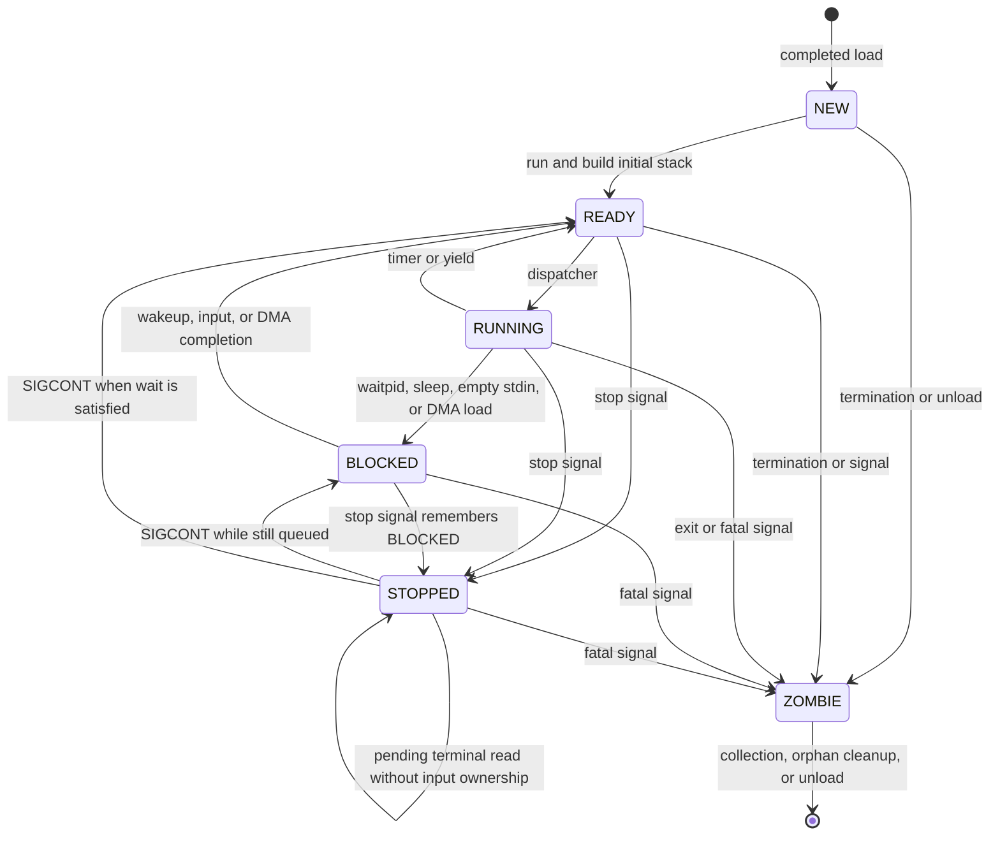
```mermaid
%%{init: {"themeCSS": "rect { rx: 0 !important; ry: 0 !important; }"}}%%
stateDiagram-v2
    [*] --> NEW: completed load
    NEW --> READY: run and build initial stack
    READY --> RUNNING: dispatcher
    RUNNING --> READY: timer or yield
    RUNNING --> BLOCKED: waitpid, sleep, empty stdin, or DMA load
    BLOCKED --> READY: wakeup, input, or DMA completion
    READY --> STOPPED: stop signal
    RUNNING --> STOPPED: stop signal
    BLOCKED --> STOPPED: stop signal remembers BLOCKED
    STOPPED --> BLOCKED: SIGCONT while still queued
    STOPPED --> READY: SIGCONT when wait is satisfied
    STOPPED --> STOPPED: pending terminal read without input ownership
    NEW --> ZOMBIE: termination or unload
    READY --> ZOMBIE: termination or signal
    RUNNING --> ZOMBIE: exit or fatal signal
    BLOCKED --> ZOMBIE: fatal signal
    STOPPED --> ZOMBIE: fatal signal
    ZOMBIE --> [*]: collection, orphan cleanup, or unload
```

</ReadmeVisual>

</div>

</div>

---

<!-- SOURCE Pico-OS/README.md#412-global-process-list-and-current-process -->

# 4. Processes and process lifecycle · 4.1 Process control block fields

## 4.1.2 Global process list and current process (1)

<div class="deck-content readme-slide">

<div class="readme-artifacts layout-single">

<!-- README_ASSET image-3627 -->
<ReadmeVisual kind="image" :width="980">


</ReadmeVisual>

</div>

</div>

---

<!-- SOURCE Pico-OS/README.md#412-global-process-list-and-current-process -->

# 4. Processes and process lifecycle · 4.1 Process control block fields

## 4.1.2 Global process list and current process (2)

<div class="deck-content readme-slide">

<div class="readme-artifacts layout-single">

<!-- README_ASSET table-3648 -->
<ReadmeVisual kind="table" :width="1080" data-table-key="table-3648:1,2">

<div class="table-panels" v-pre><div class="readme-table"><table><colgroup><col style="width:30.86%" /><col style="width:27.65%" /><col style="width:41.50%" /></colgroup><thead><tr><th>List</th><th>Insertion policy</th><th>Pointers and linking cost</th></tr></thead><tbody><tr data-source-row="1"><td class="table-key"><ul><li>PCB list</li></ul></td><td><ul><li>Append at tail</li></ul></td><td><ul><li>Head for traversal; tail → O(1)</li></ul></td></tr>
<tr data-source-row="2"><td class="table-key"><ul><li><span class="source-link"><code>SharedMemoryEntry</code></span> registry</li></ul></td><td><ul><li>Prepend at head</li></ul></td><td><ul><li>Head insertion → O(1)</li></ul></td></tr></tbody></table></div></div>

</ReadmeVisual>

</div>

</div>

---

<!-- SOURCE Pico-OS/README.md#4121-from-pcbs-to-process-payloads-in-sram -->

# 4. Processes and process lifecycle · 4.1 Process control block fields · 4.1.2 Global process list and current process

## 4.1.2.1 From PCBs to Process Payloads in SRAM

<div class="deck-content readme-slide">

<div class="readme-artifacts layout-single">

<!-- README_ASSET image-3674 -->
<ReadmeVisual kind="image" :width="980">


</ReadmeVisual>

</div>

</div>

---

<!-- SOURCE Pico-OS/README.md#421-user-process-stack-placement -->

# 4. Processes and process lifecycle · 4.2 Initial user process stack

## 4.2.1 User process stack placement

<div class="deck-content readme-slide">

<div class="readme-artifacts layout-single">

<!-- README_ASSET image-3693 -->
<ReadmeVisual kind="image" :width="980">


</ReadmeVisual>

</div>

</div>

---

<!-- SOURCE Pico-OS/README.md#422-initial-argc-argv-and-envp -->

# 4. Processes and process lifecycle · 4.2 Initial user process stack

## 4.2.2 Initial `argc`, `argv`, and `envp` (1)

<div class="deck-content readme-slide">

<div class="readme-artifacts layout-single">

<!-- README_ASSET table-3716 -->
<ReadmeVisual kind="table" :width="1080" data-table-key="table-3716:1,2,3,4">

<div class="table-panels" v-pre><div class="readme-table"><table><colgroup><col style="width:32.70%" /><col style="width:29.15%" /><col style="width:38.14%" /></colgroup><thead><tr><th>Name</th><th>Meaning</th><th>Calculation</th></tr></thead><tbody><tr data-source-row="1"><td class="table-key"><ul><li><code>startup_cell_count</code></li></ul></td><td><ul><li>All startup values + strings</li></ul></td><td><ul><li>Sum shown below</li></ul></td></tr>
<tr data-source-row="2"><td class="table-key"><ul><li><code>entry_pc_address</code></li></ul></td><td><ul><li>Saved initial entry PC cell</li></ul></td><td><ul><li><code>base_address + size - startup_cell_count</code></li></ul></td></tr>
<tr data-source-row="3"><td class="table-key"><ul><li><code>strings_start_address</code></li></ul></td><td><ul><li>First copied character</li></ul></td><td><ul><li><code>entry_pc_address + argc + envc + 4</code></li></ul></td></tr>
<tr data-source-row="4"><td class="table-key"><ul><li><code>highest_stack_address</code></li></ul></td><td><ul><li>Highest reserved stack cell</li></ul></td><td><ul><li><code>base_address + size - 1</code></li></ul></td></tr></tbody></table></div></div>

</ReadmeVisual>

</div>
<aside class="context-note"><b>System V / POSIX</b><ul><li>Intel386: argc → argv → envp</li>
<li>NULL ends pointer arrays</li>
<li>RETI: entry PC; no auxiliary vector</li></ul></aside>

</div>

---

<!-- SOURCE Pico-OS/README.md#422-initial-argc-argv-and-envp -->

# 4. Processes and process lifecycle · 4.2 Initial user process stack

## 4.2.2 Initial `argc`, `argv`, and `envp` (2)

<div class="deck-content readme-slide">

<div class="readme-artifacts layout-single">

<!-- README_ASSET table-3726 -->
<ReadmeVisual kind="table" :width="1080" data-table-key="table-3726:1,2,3,4,5,6,7,8,9,10,11,12,13,14">

<div class="table-panels" v-pre><div class="readme-table"><table><colgroup><col style="width:49.30%" /><col style="width:50.70%" /></colgroup><thead><tr><th>Cell address</th><th>Stored value</th></tr></thead><tbody><tr data-source-row="1"><td class="table-key"><ul><li><strong>↑ Decreasing addresses</strong></li></ul></td><td><ul><li><strong>Lower addresses · stack grows ↑</strong></li></ul></td></tr>
<tr data-source-row="2"><td class="table-key"><ul><li><code>entry_pc_address</code></li></ul></td><td><ul><li>Entry PC = <span class="source-link"><code>activation.cs</code></span> minus 1</li></ul></td></tr>
<tr data-source-row="3"><td class="table-key"><ul><li><code>entry_pc_address + 1</code></li></ul></td><td><ul><li><span class="source-link"><code>argc</code></span></li></ul></td></tr>
<tr data-source-row="4"><td class="table-key"><ul><li><code>entry_pc_address + 2</code></li></ul></td><td><ul><li><span class="source-link"><code>argv[0]</code></span></li></ul></td></tr>
<tr data-source-row="5"><td class="table-key"><ul><li><code>...</code></li></ul></td><td><ul><li><code>...</code></li></ul></td></tr>
<tr data-source-row="6"><td class="table-key"><ul><li><code>entry_pc_address + argc + 2</code></li></ul></td><td><ul><li><span class="source-link"><code>argv[argc] = NULL</code></span></li></ul></td></tr>
<tr data-source-row="7"><td class="table-key"><ul><li><code>entry_pc_address + argc + 3</code></li></ul></td><td><ul><li><span class="source-link"><code>envp[0]</code></span></li></ul></td></tr>
<tr data-source-row="8"><td class="table-key"><ul><li><code>...</code></li></ul></td><td><ul><li><code>...</code></li></ul></td></tr>
<tr data-source-row="9"><td class="table-key"><ul><li><code>entry_pc_address + argc + envc + 3</code></li></ul></td><td><ul><li><span class="source-link"><code>envp[envc] = NULL</code></span></li></ul></td></tr>
<tr data-source-row="10"><td class="table-key"><ul><li><code>strings_start_address</code></li></ul></td><td><ul><li>First character of the copied <span class="source-link"><code>binary_path</code></span></li></ul></td></tr>
<tr data-source-row="11"><td class="table-key"><ul><li><code>strings_start_address + 1</code></li></ul></td><td><ul><li>Path character / \0</li></ul></td></tr>
<tr data-source-row="12"><td class="table-key"><ul><li><code>...</code></li></ul></td><td><ul><li>Remaining path, argument, and environment characters and <code>\0</code> terminators</li></ul></td></tr>
<tr data-source-row="13"><td class="table-key"><ul><li><code>highest_stack_address</code></li></ul></td><td><ul><li>Final \0</li></ul></td></tr>
<tr data-source-row="14"><td class="table-key"><ul><li><strong>↓ Increasing addresses</strong></li></ul></td><td><ul><li><strong>Higher addresses</strong></li></ul></td></tr></tbody></table></div></div>

</ReadmeVisual>

</div>

</div>

---

<!-- SOURCE Pico-OS/README.md#422-initial-argc-argv-and-envp -->

# 4. Processes and process lifecycle · 4.2 Initial user process stack

## 4.2.2 Initial `argc`, `argv`, and `envp` (3)

<div class="deck-content readme-slide">

<div class="readme-artifacts layout-single">

<!-- README_ASSET code-3756 -->
<ReadmeVisual kind="code" :width="980" data-code-source="code-3756" data-code-part="1">

<!-- README_CODE_PART code-3756 lines=1-4 -->
<div class="readme-code">

```text {lines:false}
startup_cell_count = 1 + 1 + argc + 1 + envc + 1
    + cells(binary_path including its terminator)
    + cells(all argument strings including their terminators)
    + cells(all environment strings including their terminators)
```

</div>

</ReadmeVisual>

</div>

</div>

---

<!-- SOURCE Pico-OS/README.md#4221-concrete-initial-stack-example -->

# 4. Processes and process lifecycle · 4.2 Initial user process stack · 4.2.2 Initial `argc`, `argv`, and `envp`

## 4.2.2.1 Concrete initial-stack example (1)

<div class="deck-content readme-slide">

<div class="readme-artifacts layout-columns">

<!-- README_ASSET code-3791 -->
<ReadmeVisual kind="code" :width="580" data-code-source="code-3791" data-code-part="1">

<!-- README_CODE_PART code-3791 lines=1-10 -->
<div class="readme-code">

```c {lines:false}
#include "library/stdlib/stdlib.header"

int main(int argc, char **argv) {
    char *enabled = getenv("X");

    if (argc == 3 && enabled != NULL && atoi(enabled) == 1) {
        return atoi(argv[1]) + atoi(argv[2]);
    }
    return 0;
}
```

</div>

</ReadmeVisual>

<!-- README_ASSET code-3807 -->
<ReadmeVisual kind="code" :width="580" data-code-source="code-3807" data-code-part="1">

<!-- README_CODE_PART code-3807 lines=1-13 -->
<div class="readme-code">

```c {lines:false}
#include "library/unistd/unistd.header"
#include "library/sys/wait/wait.header"

int main(void) {
    char *environment[3];
    int pid = load("/add.bin");

    environment[0] = "X=1";
    environment[1] = "Y=0";
    environment[2] = NULL;
    run(pid, "2 3", environment);
    return waitpid(pid);
}
```

</div>

</ReadmeVisual>

</div>
<aside class="context-note"><b>Reading the stack</b><ul><li>argc includes program name</li>
<li>argv/envp: NULL-terminated arrays</li>
<li>PicoOS prepares stack during run</li></ul></aside>

</div>

---

<!-- SOURCE Pico-OS/README.md#4221-concrete-initial-stack-example -->

# 4. Processes and process lifecycle · 4.2 Initial user process stack · 4.2.2 Initial `argc`, `argv`, and `envp`

## 4.2.2.1 Concrete initial-stack example (2)

<div class="deck-content readme-slide">

<div class="readme-artifacts layout-single">

<!-- README_ASSET image-3828 -->
<ReadmeVisual kind="image" :width="980">


</ReadmeVisual>

</div>

</div>

---

<!-- SOURCE Pico-OS/README.md#431-loading-a-process-load-library-call -->

# 4. Processes and process lifecycle · 4.3 Loading and starting a process

## 4.3.1 Loading a process (`load` library call) (1)

<div class="deck-content readme-slide">

<div class="readme-artifacts layout-single">

<!-- README_ASSET list-3847 -->
<div class="readme-list"><ul><li>Validate header; reserve Process Payload</li>
<li>Track polling/DMA progress</li>
<li>Append NEW PCB + fresh descriptors</li>
<li>Release load metadata; return PID</li></ul></div>

</div>

</div>

---

<!-- SOURCE Pico-OS/README.md#431-loading-a-process-load-library-call -->

# 4. Processes and process lifecycle · 4.3 Loading and starting a process

## 4.3.1 Loading a process (`load` library call) (2)

<div class="deck-content readme-slide">

<div class="readme-artifacts layout-columns">

<!-- README_ASSET image-3863 -->
<ReadmeVisual kind="image" :width="980">


</ReadmeVisual>

<!-- README_ASSET image-3878 -->
<ReadmeVisual kind="image" :width="980">


</ReadmeVisual>

</div>

</div>

---

<!-- SOURCE Pico-OS/README.md#431-loading-a-process-load-library-call -->

# 4. Processes and process lifecycle · 4.3 Loading and starting a process

## 4.3.1 Loading a process (`load` library call) (3)

<div class="deck-content readme-slide">

<div class="readme-artifacts layout-single">

<!-- README_ASSET table-3888 -->
<ReadmeVisual kind="table" :width="1080" data-table-key="table-3888:1,2,3,4,5,6,7,8,9">

<div class="table-panels" v-pre><div class="readme-table"><table><colgroup><col style="width:48.41%" /><col style="width:51.59%" /></colgroup><thead><tr><th>Field</th><th>Meaning</th></tr></thead><tbody><tr data-source-row="1"><td class="table-key"><ul><li><span class="source-link"><code>ProcessLoad.base_address</code></span></li></ul></td><td><ul><li>Absolute reserved payload base</li></ul></td></tr>
<tr data-source-row="2"><td class="table-key"><ul><li><span class="source-link"><code>ProcessLoad.process_size</code></span></li></ul></td><td><ul><li>Image + heap + stack cells</li></ul></td></tr>
<tr data-source-row="3"><td class="table-key"><ul><li><span class="source-link"><code>ProcessLoad.code_start</code></span>, <span class="source-link"><code>ProcessLoad.data_start</code></span></li></ul></td><td><ul><li>Linked code- and data-segment offsets from the binary header</li></ul></td></tr>
<tr data-source-row="4"><td class="table-key"><ul><li><span class="source-link"><code>ProcessLoad.heap_start</code></span>, <span class="source-link"><code>ProcessLoad.heap_size</code></span></li></ul></td><td><ul><li>Resolved userspace heap offset and cell count</li></ul></td></tr>
<tr data-source-row="5"><td class="table-key"><ul><li><span class="source-link"><code>ProcessLoad.payload_word_count</code></span></li></ul></td><td><ul><li>Encoded program words after the five-word header</li></ul></td></tr>
<tr data-source-row="6"><td class="table-key"><ul><li><span class="source-link"><code>ProcessLoad.loaded_word_count</code></span></li></ul></td><td><ul><li>Words copied by the polling transfer so far</li></ul></td></tr>
<tr data-source-row="7"><td class="table-key"><ul><li><span class="source-link"><code>ProcessLoad.loading_bar_update</code></span></li></ul></td><td><ul><li>Next word count at which progress output is redrawn</li></ul></td></tr>
<tr data-source-row="8"><td class="table-key"><ul><li><span class="source-link"><code>ProcessLoad.uses_dma</code></span></li></ul></td><td><ul><li>DMA transfer versus polling chunks</li></ul></td></tr>
<tr data-source-row="9"><td class="table-key"><ul><li><span class="source-link"><code>ProcessLoad.path</code></span></li></ul></td><td><ul><li>Owned binary path; range requests + PCB</li></ul></td></tr></tbody></table></div></div>

</ReadmeVisual>

</div>

</div>

---

<!-- SOURCE Pico-OS/README.md#4311-load-function-reference -->

# 4. Processes and process lifecycle · 4.3 Loading and starting a process · 4.3.1 Loading a process (`load` library call)

## 4.3.1.1 Load function reference

<div class="deck-content readme-slide">

<div class="readme-artifacts layout-single">

<!-- README_ASSET table-3914 -->
<ReadmeVisual kind="table" :width="1080" data-table-key="table-3914:1">

<div class="table-panels" v-pre><div class="readme-table"><table><colgroup><col style="width:29.01%" /><col style="width:21.53%" /><col style="width:33.92%" /><col style="width:15.55%" /></colgroup><thead><tr><th>Kernel function</th><th>Result</th><th>Effects</th><th>Library entry</th></tr></thead><tbody><tr data-source-row="1"><td class="table-key"><ul><li><code>load_process_chunk()</code></li></ul></td><td><ul><li>PID success; 0 failure; −1 pending</li></ul></td><td><ul><li>Incremental load; preserve progress</li><li>Create NEW PCB on completion</li></ul></td><td><ul><li><code>load()</code></li></ul></td></tr></tbody></table></div></div>

</ReadmeVisual>

</div>

</div>

---

<!-- SOURCE Pico-OS/README.md#432-starting-a-process-run-library-call -->

# 4. Processes and process lifecycle · 4.3 Loading and starting a process

## 4.3.2 Starting a process (`run` library call) (1)

<div class="deck-content readme-slide">

<div class="readme-artifacts layout-single">

<!-- README_ASSET list-3941 -->
<div class="readme-list"><ul><li>Pack PID, arguments, environment</li>
<li>Require NEW PCB</li>
<li>Copy inheritable descriptors</li>
<li>Build child stack; update SP/BAF</li>
<li>NEW → READY</li></ul></div>

</div>

</div>

---

<!-- SOURCE Pico-OS/README.md#432-starting-a-process-run-library-call -->

# 4. Processes and process lifecycle · 4.3 Loading and starting a process

## 4.3.2 Starting a process (`run` library call) (2)

<div class="deck-content readme-slide">

<div class="readme-artifacts layout-single">

<!-- README_ASSET image-3952 -->
<ReadmeVisual kind="image" :width="980">


</ReadmeVisual>

</div>

</div>

---

<!-- SOURCE Pico-OS/README.md#4321-parent-to-child-inheritance -->

# 4. Processes and process lifecycle · 4.3 Loading and starting a process · 4.3.2 Starting a process (`run` library call)

## 4.3.2.1 Parent-to-child inheritance (1)

<div class="deck-content readme-slide">

<div class="readme-artifacts layout-single">

<!-- README_ASSET table-3973 -->
<ReadmeVisual kind="table" :width="1080" data-table-key="table-3973:1,2,3,4,5">

<div class="table-panels" v-pre><div class="readme-table"><table><colgroup><col style="width:31.73%" /><col style="width:30.25%" /><col style="width:38.02%" /></colgroup><thead><tr><th>Child field or resource</th><th>Source and time</th><th>Relationship to parent afterward</th></tr></thead><tbody><tr data-source-row="1"><td class="table-key"><ul><li><span class="source-link"><code>parent_pid</code></span></li></ul></td><td><ul><li>Loading parent; during load</li></ul></td><td><ul><li>Parent identity; no shared PCB pointer</li></ul></td></tr>
<tr data-source-row="2"><td class="table-key"><ul><li><span class="source-link"><code>working_directory</code></span></li></ul></td><td><ul><li>Owned path copied during load</li></ul></td><td><ul><li>Independent owned path</li></ul></td></tr>
<tr data-source-row="3"><td class="table-key"><ul><li><span class="source-link"><code>parent_death_signal</code></span></li></ul></td><td><ul><li>Signal setting copied during load</li></ul></td><td><ul><li>Independent signal setting</li></ul></td></tr>
<tr data-source-row="4"><td class="table-key"><ul><li><span class="source-link"><code>file_descriptors</code></span></li></ul></td><td><ul><li>Run caller; during run</li></ul></td><td><ul><li>Independent entries, paths, offsets</li></ul></td></tr>
<tr data-source-row="5"><td class="table-key"><ul><li>Initial environment</li></ul></td><td><ul><li>Explicit env or run caller</li></ul></td><td><ul><li>Copied to child stack; then heap</li></ul></td></tr></tbody></table></div></div>

</ReadmeVisual>

</div>
<aside class="context-note"><b>fork / load + run</b><ul><li>Unix fork: clone parent process</li>
<li>PicoOS: fresh image + copied state</li></ul></aside>

</div>

---

<!-- SOURCE Pico-OS/README.md#4321-parent-to-child-inheritance -->

# 4. Processes and process lifecycle · 4.3 Loading and starting a process · 4.3.2 Starting a process (`run` library call)

## 4.3.2.1 Parent-to-child inheritance (2)

<div class="deck-content readme-slide">

<div class="readme-artifacts layout-single">

<!-- README_ASSET image-3985 -->
<ReadmeVisual kind="image" :width="980">


</ReadmeVisual>

</div>

</div>

---

<!-- SOURCE Pico-OS/README.md#43211-environment-origin-and-propagation -->

# 4. Processes and process lifecycle · 4.3 Loading and starting a process · 4.3.2 Starting a process (`run` library call) · 4.3.2.1 Parent-to-child inheritance

## 4.3.2.1.1 Environment origin and propagation

<div class="deck-content readme-slide">

<div class="readme-artifacts layout-single">

<!-- README_ASSET mermaid-4031 -->
<ReadmeVisual kind="mermaid" :width="980">

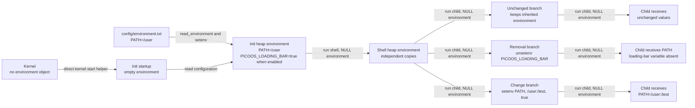
```mermaid
flowchart LR
    K["Kernel<br/>no environment object"] -->|direct kernel start helper| I0["Init startup<br/>empty environment"]
    C["config/environment.txt<br/>PATH=/user"] -->|read_environment and setenv| I["Init heap environment<br/>PATH=/user<br/>PICOOS_LOADING_BAR=true when enabled"]
    I0 -->|read configuration| I
    I -->|run shell, NULL environment| S["Shell heap environment<br/>independent copies"]
    S -->|run child, NULL environment| U["Unchanged branch<br/>keeps inherited environment"]
    U -->|run child, NULL environment| UC["Child receives<br/>unchanged values"]
    S -->|run child, NULL environment| R["Removal branch<br/>unsetenv PICOOS_LOADING_BAR"]
    R -->|run child, NULL environment| RC["Child receives PATH<br/>loading-bar variable absent"]
    S -->|run child, NULL environment| M["Change branch<br/>setenv PATH, /user:/test, true"]
    M -->|run child, NULL environment| MC["Child receives<br/>PATH=/user:/test"]
```

</ReadmeVisual>

</div>

</div>

---

<!-- SOURCE Pico-OS/README.md#43212-loading-bar-environment-variable -->

# 4. Processes and process lifecycle · 4.3 Loading and starting a process · 4.3.2 Starting a process (`run` library call) · 4.3.2.1 Parent-to-child inheritance

## 4.3.2.1.2 Loading-bar environment variable

<div class="deck-content readme-slide">

<div class="readme-artifacts layout-single">

<!-- README_ASSET code-4062 -->
<ReadmeVisual kind="code" :width="980" data-code-source="code-4062" data-code-part="1">

<!-- README_CODE_PART code-4062 lines=1-5 -->
<div class="readme-code">

```c {lines:false}
int main(int argc, char **argv) {
    // ...
    unsetenv(LOADING_BAR_ENVIRONMENT_VARIABLE);
    // ...
}
```

</div>

</ReadmeVisual>

</div>

</div>

---

<!-- SOURCE Pico-OS/README.md#4322-recording-termination-status -->

# 4. Processes and process lifecycle · 4.3 Loading and starting a process · 4.3.2 Starting a process (`run` library call)

## 4.3.2.2 Recording termination status (1)

<div class="deck-content readme-slide">

<div class="readme-artifacts layout-single">

<!-- README_ASSET mermaid-4081 -->
<ReadmeVisual kind="mermaid" :width="980">

```mermaid
%%{init: {"flowchart": {"wrappingWidth": 360, "rankSpacing": 30}, "themeCSS": "rect { rx: 0 !important; ry: 0 !important; }"}}%%
flowchart TB
    subgraph WAIT_FIRST["Parent already waiting"]
        direction LR
        EXIT["Child PCB<br/>exit_status = 7"]
        DELIVER["Parent stack<br/>status = 7"]
        RESUME["waitpid<br/>returns 7"]
        EXIT -->|copy| DELIVER
        DELIVER -->|wake and schedule| RESUME
    end
    subgraph EXIT_FIRST["Child terminates first"]
        direction LR
        KEEP["Child PCB<br/>exit_status = 7<br/>state = ZOMBIE"]
        COLLECT["Parent stack<br/>status = 7"]
        RETURN["waitpid<br/>returns 7"]
        KEEP -->|later waitpid copies| COLLECT
        COLLECT -->|no blocking| RETURN
    end
    WAIT_FIRST ~~~ EXIT_FIRST
    classDef waiting fill:#fff3d6,stroke:#b87800,color:#222;
    classDef delivered fill:#e8f4e8,stroke:#39733b,color:#222;
    class EXIT,KEEP waiting;
    class DELIVER,RESUME,COLLECT,RETURN delivered;
```

</ReadmeVisual>

</div>
<aside class="context-note"><b>Unix: reaping</b><ul><li>Collect status; remove child</li>
<li>PicoOS: no reparenting to init</li></ul></aside>

</div>

---

<!-- SOURCE Pico-OS/README.md#4322-recording-termination-status -->

# 4. Processes and process lifecycle · 4.3 Loading and starting a process · 4.3.2 Starting a process (`run` library call)

## 4.3.2.2 Recording termination status (2)

<div class="deck-content readme-slide">

<div class="readme-artifacts layout-columns">

<!-- README_ASSET list-4109 -->
<div class="readme-list"><ul><li>Request points to local status</li>
<li>Queue parent; mark BLOCKED</li>
<li>Child exits; write status; wake parent</li>
<li>Wrapper resumes; returns child status</li></ul></div>

<!-- README_ASSET list-4124 -->
<div class="readme-list"><ul><li>Creation records parent PID</li>
<li>Find caller + requested child</li>
<li>Parent-only collection; mismatch → −1</li></ul></div>

</div>

</div>

---

<!-- SOURCE Pico-OS/README.md#4323-parent-collection-and-final-removal -->

# 4. Processes and process lifecycle · 4.3 Loading and starting a process · 4.3.2 Starting a process (`run` library call)

## 4.3.2.3 Parent collection and final removal

<div class="deck-content readme-slide">

<div class="readme-artifacts layout-single">

<!-- README_ASSET table-4164 -->
<ReadmeVisual kind="table" :width="1080" data-table-key="table-4164:1,2,3">

<div class="table-panels" v-pre><div class="readme-table"><table><colgroup><col style="width:34.20%" /><col style="width:27.30%" /><col style="width:38.50%" /></colgroup><thead><tr><th>Lifecycle order</th><th>Status handoff and child state</th><th>Who deletes the child PCB, and when</th></tr></thead><tbody><tr data-source-row="1"><td class="table-key"><ul><li>Parent calls <span class="source-link"><code>waitpid()</code></span> while child is alive</li></ul></td><td><ul><li>Parent blocks; child later exits</li></ul></td><td><ul><li>Exit writes status; wakes; removes child</li></ul></td></tr>
<tr data-source-row="2"><td class="table-key"><ul><li>Child terminates before parent calls <span class="source-link"><code>waitpid()</code></span></li></ul></td><td><ul><li>Child zombie; parent later waits</li></ul></td><td><ul><li>waitpid collects + removes child</li></ul></td></tr>
<tr data-source-row="3"><td class="table-key"><ul><li>No live parent remains</li></ul></td><td><ul><li>No future parent collection</li></ul></td><td><ul><li>Orphan exit or parent cleanup removes child</li></ul></td></tr></tbody></table></div></div>

</ReadmeVisual>

</div>

</div>

---

<!-- SOURCE Pico-OS/README.md#4324-run-function-reference -->

# 4. Processes and process lifecycle · 4.3 Loading and starting a process · 4.3.2 Starting a process (`run` library call)

## 4.3.2.4 Run function reference

<div class="deck-content readme-slide">

<div class="readme-artifacts layout-single">

<!-- README_ASSET table-4184 -->
<ReadmeVisual kind="table" :width="1080" data-table-key="table-4184:1">

<div class="table-panels" v-pre><div class="readme-table"><table><colgroup><col style="width:40.09%" /><col style="width:12.29%" /><col style="width:34.57%" /><col style="width:13.05%" /></colgroup><thead><tr><th>Kernel function</th><th>Result</th><th>Effects</th><th>Library entry</th></tr></thead><tbody><tr data-source-row="1"><td class="table-key"><ul><li><code>mark_process_ready_with_arguments()</code></li></ul></td><td><ul><li>true / false</li></ul></td><td><ul><li>Build arguments/environment stack</li><li>Inherit descriptors; NEW → READY</li></ul></td><td><ul><li><code>run()</code></li></ul></td></tr></tbody></table></div></div>

</ReadmeVisual>

</div>

</div>

---

<!-- SOURCE Pico-OS/README.md#44-process-list-pcb-metadata-and-lifecycle-function-reference -->

# 4. Processes and process lifecycle

## 4.4 Process list, PCB metadata, and lifecycle function reference

<div class="deck-content readme-slide">

<div class="readme-artifacts layout-single">

<!-- README_ASSET table-4204 -->
<ReadmeVisual kind="table" :width="1080" data-table-key="table-4204:1,2,3,4,5,9">

<div class="table-panels" v-pre><div class="readme-table"><table><colgroup><col style="width:24.77%" /><col style="width:23.01%" /><col style="width:29.78%" /><col style="width:22.44%" /></colgroup><thead><tr><th>Kernel function</th><th>Result</th><th>Effects</th><th>Library entry</th></tr></thead><tbody><tr data-source-row="1"><td class="table-key"><ul><li><code>list_processes()</code></li></ul></td><td><ul><li>No value</li></ul></td><td><ul><li>Print all PIDs + binary paths</li></ul></td><td><ul><li><code>list_processes()</code></li></ul></td></tr>
<tr data-source-row="2"><td class="table-key"><ul><li><code>unload_process_by_pid()</code></li></ul></td><td><ul><li>true / false</li></ul></td><td><ul><li>Remove noncurrent process by PID</li></ul></td><td><ul><li><code>unload()</code></li></ul></td></tr>
<tr data-source-row="3"><td class="table-key"><ul><li><code>exit_process()</code></li></ul></td><td><ul><li>No normal return</li></ul></td><td><ul><li>Record exit; notify parent; dispatch</li></ul></td><td><ul><li><code>exit()</code></li></ul></td></tr>
<tr data-source-row="4"><td class="table-key"><ul><li><code>process_heap_start()</code></li></ul></td><td><ul><li>Absolute heap address</li></ul></td><td><ul><li>Current process heap base</li></ul></td><td><ul><li><code>init_process_heap()</code></li></ul></td></tr>
<tr data-source-row="5"><td class="table-key"><ul><li><code>process_heap_size()</code></li></ul></td><td><ul><li>Heap cell count</li></ul></td><td><ul><li>Current process heap capacity</li></ul></td><td><ul><li><code>init_process_heap()</code></li></ul></td></tr>
<tr data-source-row="9"><td class="table-key"><ul><li><code>current_process()</code></li></ul></td><td><ul><li>PCB pointer or NULL</li></ul></td><td><ul><li>Current PCB; GETPID reads its pid</li></ul></td><td><ul><li><code>getpid()</code> → <code>GETPID</code></li></ul></td></tr></tbody></table></div></div>

</ReadmeVisual>

</div>

</div>

---

<!-- SOURCE Pico-OS/README.md#51-named-entries-and-per-process-attachments -->

# 5. Shared Memory Entries and Mappings

## 5.1 Named entries and per-process attachments (1)

<div class="deck-content readme-slide">

<div class="readme-artifacts layout-single">

<!-- README_ASSET code-4241 -->
<ReadmeVisual kind="code" :width="980" data-code-source="code-4241" data-code-part="1">

<!-- README_CODE_PART code-4241 lines=1-13 -->
<div class="readme-code">

```c {lines:false}
struct SharedMemoryEntry {
    char *name;
    int id;
    void *address;
    int reference_count;
    bool unlink_requested;
    struct SharedMemoryEntry *next;
};

struct SharedMemoryAttachment {
    struct SharedMemoryEntry *entry;
    struct SharedMemoryAttachment *next;
};
```

</div>

</ReadmeVisual>

</div>

</div>

---

<!-- SOURCE Pico-OS/README.md#51-named-entries-and-per-process-attachments -->

# 5. Shared Memory Entries and Mappings

## 5.1 Named entries and per-process attachments (2)

<div class="deck-content readme-slide">

<div class="readme-artifacts layout-columns">

<!-- README_ASSET table-4265 -->
<ReadmeVisual kind="table" :width="1080" data-table-key="table-4265:1,2,3,4,5,6">

<div class="table-panels" v-pre><div class="readme-table"><table><colgroup><col style="width:47.69%" /><col style="width:52.31%" /></colgroup><thead><tr><th>Attribute</th><th>Meaning</th></tr></thead><tbody><tr data-source-row="1"><td class="table-key"><ul><li><span class="source-link"><code>SharedMemoryEntry.name</code></span></li></ul></td><td><ul><li>Owned lookup name</li><li>Unlink → free + NULL</li></ul></td></tr>
<tr data-source-row="2"><td class="table-key"><ul><li><span class="source-link"><code>SharedMemoryEntry.id</code></span></li></ul></td><td><ul><li>Numeric open/map handle</li></ul></td></tr>
<tr data-source-row="3"><td class="table-key"><ul><li><span class="source-link"><code>SharedMemoryEntry.address</code></span></li></ul></td><td><ul><li>Absolute start of the <span class="source-link"><code>PSDMalloc()</code></span> shared-memory data region</li></ul></td></tr>
<tr data-source-row="4"><td class="table-key"><ul><li><span class="source-link"><code>SharedMemoryEntry.reference_count</code></span></li></ul></td><td><ul><li>Attachment count, not distinct PID count</li></ul></td></tr>
<tr data-source-row="5"><td class="table-key"><ul><li><span class="source-link"><code>SharedMemoryEntry.unlink_requested</code></span></li></ul></td><td><ul><li>Defers destruction until the last attachment disappears</li></ul></td></tr>
<tr data-source-row="6"><td class="table-key"><ul><li><span class="source-link"><code>SharedMemoryEntry.next</code></span></li></ul></td><td><ul><li>Link to the next entry in the kernel's linked list</li></ul></td></tr></tbody></table></div></div>

</ReadmeVisual>

<!-- README_ASSET table-4277 -->
<ReadmeVisual kind="table" :width="1080" data-table-key="table-4277:1,2">

<div class="table-panels" v-pre><div class="readme-table"><table><colgroup><col style="width:44.35%" /><col style="width:55.65%" /></colgroup><thead><tr><th>Attribute</th><th>Meaning</th></tr></thead><tbody><tr data-source-row="1"><td class="table-key"><ul><li><span class="source-link"><code>SharedMemoryAttachment.entry</code></span></li></ul></td><td><ul><li>Non-owning entry pointer; contributes one reference</li></ul></td></tr>
<tr data-source-row="2"><td class="table-key"><ul><li><span class="source-link"><code>SharedMemoryAttachment.next</code></span></li></ul></td><td><ul><li>Link in one PCB's <span class="source-link"><code>shared_memory_attachments</code></span> list</li></ul></td></tr></tbody></table></div></div>

</ReadmeVisual>

</div>

</div>

---

<!-- SOURCE Pico-OS/README.md#511-global-shared-memory-list-and-entry-names -->

# 5. Shared Memory Entries and Mappings · 5.1 Named entries and per-process attachments

## 5.1.1 Global shared-memory list and entry names

<div class="deck-content readme-slide">

<div class="readme-artifacts layout-single">

<!-- README_ASSET image-4299 -->
<ReadmeVisual kind="image" :width="980">


</ReadmeVisual>

</div>

</div>

---

<!-- SOURCE Pico-OS/README.md#5111-from-shared-memory-entries-to-shared-data-payloads-in-sram -->

# 5. Shared Memory Entries and Mappings · 5.1 Named entries and per-process attachments · 5.1.1 Global shared-memory list and entry names

## 5.1.1.1 From Shared Memory Entries to Shared Data Payloads in SRAM

<div class="deck-content readme-slide">

<div class="readme-artifacts layout-single">

<!-- README_ASSET image-4311 -->
<ReadmeVisual kind="image" :width="980">


</ReadmeVisual>

</div>

</div>

---

<!-- SOURCE Pico-OS/README.md#512-per-process-attachment-lists-in-sram -->

# 5. Shared Memory Entries and Mappings · 5.1 Named entries and per-process attachments

## 5.1.2 Per-process attachment lists in SRAM

<div class="deck-content readme-slide">

<div class="readme-artifacts layout-single">

<!-- README_ASSET image-4332 -->
<ReadmeVisual kind="image" :width="980">


</ReadmeVisual>

</div>

</div>

---

<!-- SOURCE Pico-OS/README.md#52-mapping-unlinking-and-deferred-destruction -->

# 5. Shared Memory Entries and Mappings

## 5.2 Mapping, unlinking, and deferred destruction (1)

<div class="deck-content readme-slide">

<div class="readme-artifacts layout-single">

<!-- README_ASSET image-4354 -->
<ReadmeVisual kind="image" :width="980">


</ReadmeVisual>

</div>

</div>

---

<!-- SOURCE Pico-OS/README.md#52-mapping-unlinking-and-deferred-destruction -->

# 5. Shared Memory Entries and Mappings

## 5.2 Mapping, unlinking, and deferred destruction (2)

<div class="deck-content readme-slide">

<div class="readme-artifacts layout-single">

<!-- README_ASSET code-4371 -->
<div class="code-columns">

<ReadmeVisual kind="code" :width="1287" data-code-source="code-4371" data-code-part="1">

<!-- README_CODE_PART code-4371 lines=1-13 -->
<div class="readme-code">

```c {lines:false}
// dependencies: ../../library/unistd/libunistd.reti_blocks ../../library/sys/wait/libwait.reti_blocks ../../library/sys/mman/libmman.reti_blocks

#include "../../library/unistd/unistd.header"
#include "../../library/sys/wait/wait.header"
#include "../../library/sys/mman/mman.header"

int main(void) {
    int shared_memory_id;
    int *shared_value;
    int worker_pid;
    int result = 1;

    shared_memory_id = shm_open("shared-value", 1);
```

</div>

</ReadmeVisual>

<ReadmeVisual kind="code" :width="1287" data-code-source="code-4371" data-code-part="2">

<!-- README_CODE_PART code-4371 lines=14-26 -->
<div class="readme-code">

```c {lines:false}
    shared_value = (int *)mmap(shared_memory_id);
    shared_value[0] = 7;

    worker_pid = load("test/shared_value/worker.bin");
    run(worker_pid, "shared-value", NULL);
    waitpid(worker_pid);

    if (shared_value[0] == 8) {
        result = 0;
    }
    shm_unlink("shared-value");
    return result;
}
```

</div>

</ReadmeVisual>

</div>

</div>

</div>

---

<!-- SOURCE Pico-OS/README.md#52-mapping-unlinking-and-deferred-destruction -->

# 5. Shared Memory Entries and Mappings

## 5.2 Mapping, unlinking, and deferred destruction (3)

<div class="deck-content readme-slide">

<div class="readme-artifacts layout-single">

<!-- README_ASSET code-4403 -->
<ReadmeVisual kind="code" :width="980" data-code-source="code-4403" data-code-part="1">

<!-- README_CODE_PART code-4403 lines=1-13 -->
<div class="readme-code">

```c {lines:false}
// dependencies: ../../library/sys/mman/libmman.reti_blocks

#include "../../library/sys/mman/mman.header"

int main(int argc, char **argv) {
    int shared_memory_id;
    int *shared_value;

    shared_memory_id = shm_open(argv[1], 1);
    shared_value = (int *)mmap(shared_memory_id);
    shared_value[0] = shared_value[0] + 1;
    return 0;
}
```

</div>

</ReadmeVisual>

</div>

</div>

---

<!-- SOURCE Pico-OS/README.md#53-shared-memory-function-reference -->

# 5. Shared Memory Entries and Mappings

## 5.3 Shared Memory function reference

<div class="deck-content readme-slide">

<div class="readme-artifacts layout-single">

<!-- README_ASSET table-4432 -->
<ReadmeVisual kind="table" :width="1080" data-table-key="table-4432:1,2,3">

<div class="table-panels" v-pre><div class="readme-table"><table><colgroup><col style="width:30.02%" /><col style="width:16.51%" /><col style="width:33.16%" /><col style="width:20.31%" /></colgroup><thead><tr><th>Kernel function</th><th>Result</th><th>Effects</th><th>Library entry</th></tr></thead><tbody><tr data-source-row="1"><td class="table-key"><ul><li><code>open_shared_memory()</code></li></ul></td><td><ul><li>ID or −1</li></ul></td><td><ul><li>Find/create named shared entry</li></ul></td><td><ul><li><code>shm_open()</code></li></ul></td></tr>
<tr data-source-row="2"><td class="table-key"><ul><li><code>map_shared_memory()</code></li></ul></td><td><ul><li>Address or NULL</li></ul></td><td><ul><li>Attach process; return shared address</li></ul></td><td><ul><li><code>mmap()</code></li></ul></td></tr>
<tr data-source-row="3"><td class="table-key"><ul><li><code>unlink_shared_memory()</code></li></ul></td><td><ul><li>0 / −1</li></ul></td><td><ul><li>Remove name; defer final release</li></ul></td><td><ul><li><code>shm_unlink()</code></li></ul></td></tr></tbody></table></div></div>

</ReadmeVisual>

</div>

</div>

---

<!-- SOURCE Pico-OS/README.md#6-scheduling-and-context-switching -->

# 6. Scheduling and context switching

<div class="deck-content readme-slide">

<div class="readme-list"><ul><li>Save activation → select PCB → restore</li>
<li>Lazy Round Robin scans process list</li>
<li>Only runnable processes enter execution</li></ul></div>

</div>

---

<!-- SOURCE Pico-OS/README.md#611-algorithm-and-round-robin-comparison -->

# 6. Scheduling and context switching · 6.1 Scheduler implementation

## 6.1.1 Algorithm and Round Robin comparison (1)

<div class="deck-content readme-slide">

<div class="readme-artifacts layout-single">

<!-- README_ASSET mermaid-4489 -->
<ReadmeVisual kind="mermaid" :width="980">

```mermaid
flowchart LR
    P1["P1<br/>READY"] --> P2["P2<br/>BLOCKED"]
    P2 --> P3["P3<br/>RUNNING<br/>current"]
    P3 --> P4["P4<br/>STOPPED"]
    P4 --> P5["P5<br/>READY"]
```

</ReadmeVisual>

</div>

</div>

---

<!-- SOURCE Pico-OS/README.md#611-algorithm-and-round-robin-comparison -->

# 6. Scheduling and context switching · 6.1 Scheduler implementation

## 6.1.1 Algorithm and Round Robin comparison (2)

<div class="deck-content readme-slide">

<div class="readme-artifacts layout-single">

<!-- README_ASSET code-4510 -->
<div class="code-columns">

<ReadmeVisual kind="code" :width="719.4" data-code-source="code-4510" data-code-part="1">

<!-- README_CODE_PART code-4510 lines=1-19 -->
<div class="readme-code">

```c {lines:false}
bool scheduler_can_run(struct ProcessControlBlock *process) {
    return process != NULL &&
           (process->state == PROCESS_STATE_READY ||
            // A still-current RUNNING process may be the only runnable process
            // when scheduler_next_process() wraps around to it
            process->state == PROCESS_STATE_RUNNING);
}

struct ProcessControlBlock *scheduler_next_process(void) {
    struct ProcessControlBlock *start;
    struct ProcessControlBlock *candidate;

    if (first_process() == NULL) {
        return NULL;
    }
    if (current_process() == NULL || current_process()->next == NULL) {
        start = first_process();
    } else {
        start = current_process()->next;
```

</div>

</ReadmeVisual>

<ReadmeVisual kind="code" :width="719.4" data-code-source="code-4510" data-code-part="2">

<!-- README_CODE_PART code-4510 lines=20-38 -->
<div class="readme-code">

```c {lines:false}
    }

    candidate = start;
    while (candidate != NULL) {
        if (scheduler_can_run(candidate)) {
            return candidate;
        }
        candidate = candidate->next;
    }

    candidate = first_process();
    while (candidate != start) {
        if (scheduler_can_run(candidate)) {
            return candidate;
        }
        candidate = candidate->next;
    }
    return NULL;
}
```

</div>

</ReadmeVisual>

</div>

</div>

</div>

---

<!-- SOURCE Pico-OS/README.md#62-saved-process-registers -->

# 6. Scheduling and context switching

## 6.2 Saved process registers (1)

<div class="deck-content readme-slide">

<div class="readme-artifacts layout-single">

<!-- README_ASSET code-4574 -->
<ReadmeVisual kind="code" :width="980" data-code-source="code-4574" data-code-part="1">

<!-- README_CODE_PART code-4574 lines=1-9 -->
<div class="readme-code">

```c {lines:false}
struct ActivationRecord {
    int in1;
    int in2;
    int acc;
    int sp;
    int baf;
    int cs;
    int ds;
};
```

</div>

</ReadmeVisual>

</div>

</div>

---

<!-- SOURCE Pico-OS/README.md#62-saved-process-registers -->

# 6. Scheduling and context switching

## 6.2 Saved process registers (2)

<div class="deck-content readme-slide">

<div class="readme-artifacts layout-single">

<!-- README_ASSET table-4586 -->
<ReadmeVisual kind="table" :width="1080" data-table-key="table-4586:1,2,3,4,5">

<div class="table-panels" v-pre><div class="readme-table"><table><colgroup><col style="width:26.14%" /><col style="width:73.86%" /></colgroup><thead><tr><th>Attribute</th><th>Meaning</th></tr></thead><tbody><tr data-source-row="1"><td class="table-key"><ul><li><span class="source-link"><code>in1</code></span>, <span class="source-link"><code>in2</code></span>, <span class="source-link"><code>acc</code></span></li></ul></td><td><ul><li>General argument/result registers at the suspension point</li></ul></td></tr>
<tr data-source-row="2"><td class="table-key"><ul><li><span class="source-link"><code>sp</code></span></li></ul></td><td><ul><li>Below saved PC; PC at sp + 1</li></ul></td></tr>
<tr data-source-row="3"><td class="table-key"><ul><li><span class="source-link"><code>baf</code></span></li></ul></td><td><ul><li>Base address of the interrupted PicoC function frame</li></ul></td></tr>
<tr data-source-row="4"><td class="table-key"><ul><li><span class="source-link"><code>cs</code></span></li></ul></td><td><ul><li>Absolute code-segment base used for instruction addresses</li></ul></td></tr>
<tr data-source-row="5"><td class="table-key"><ul><li><span class="source-link"><code>ds</code></span></li></ul></td><td><ul><li>Absolute data-segment base used for globals/static data</li></ul></td></tr></tbody></table></div></div>

</ReadmeVisual>

</div>

</div>

---

<!-- SOURCE Pico-OS/README.md#63-saving-the-current-process-and-selecting-the-next-process -->

# 6. Scheduling and context switching

## 6.3 Saving the current process and selecting the next process (1)

<div class="deck-content readme-slide">

<div class="readme-artifacts layout-columns">

<!-- README_ASSET list-4606 -->
<div class="readme-list"><ul><li>Timer/yield → immediate switch</li>
<li>Blocking call → save wait; switch</li>
<li>Deferred request → switch on syscall return</li></ul></div>

<!-- README_ASSET code-4618 -->
<ReadmeVisual kind="code" :width="580" data-code-source="code-4618" data-code-part="1">

<!-- README_CODE_PART code-4618 lines=1-18 -->
<div class="readme-code">

```c {lines:false}
void dispatcher_switch_from_context(int *caller_context) {
    struct ProcessControlBlock *process = current_process();

    if (process != NULL) {
        process->activation.sp = (int)(caller_context + 6);
        process->activation.ds = caller_context[1];
        process->activation.cs = caller_context[2];
        process->activation.baf = caller_context[3];
        process->activation.in2 = caller_context[4];
        process->activation.in1 = caller_context[5];
        process->activation.acc = caller_context[6];

        if (process->state == PROCESS_STATE_RUNNING) {
            process->state = PROCESS_STATE_READY;
        }
    }
    dispatcher_start_next_process();
}
```

</div>

</ReadmeVisual>

</div>

</div>

---

<!-- SOURCE Pico-OS/README.md#63-saving-the-current-process-and-selecting-the-next-process -->

# 6. Scheduling and context switching

## 6.3 Saving the current process and selecting the next process (2)

<div class="deck-content readme-slide">

<div class="readme-artifacts layout-columns">

<!-- README_ASSET list-4642 -->
<div class="readme-list"><ul><li>Find current PCB</li>
<li>Save registers; SP = context + 6</li>
<li>RUNNING → READY; retain blocking states</li>
<li>Select next process</li></ul></div>

<!-- README_ASSET code-4666 -->
<ReadmeVisual kind="code" :width="710.8" data-code-source="code-4666" data-code-part="1">

<!-- README_CODE_PART code-4666 lines=1-15 -->
<div class="readme-code">

```c {lines:false}
void dispatcher_start_next_process(void) {
    struct ProcessControlBlock *next_process = scheduler_next_process();

    // Waits in kernel context when every process is blocked. A hardware
    // interrupt can make one of them runnable without a separate idle process
    while (first_process() != NULL &&
           (next_process == NULL ||
            !prepare_process_termination(next_process))) {
        next_process = scheduler_next_process();
    }

    if (next_process != NULL) {
        dispatcher_switch_to_process(next_process);
    }
}
```

</div>

</ReadmeVisual>

</div>

</div>

---

<!-- SOURCE Pico-OS/README.md#63-saving-the-current-process-and-selecting-the-next-process -->

# 6. Scheduling and context switching

## 6.3 Saving the current process and selecting the next process (3)

<div class="deck-content readme-slide">

<div class="readme-artifacts layout-single">

<!-- README_ASSET list-4687 -->
<div class="readme-list"><ul><li>Ask scheduler for candidate</li>
<li>Retry; interrupts can wake blocked processes</li>
<li>Restore accepted process; empty list → return</li></ul></div>

</div>

</div>

---

<!-- SOURCE Pico-OS/README.md#64-restoring-the-selected-process-and-returning-with-rti -->

# 6. Scheduling and context switching

## 6.4 Restoring the selected process and returning with `RTI` (1)

<div class="deck-content readme-slide">

<div class="readme-artifacts layout-single">

<!-- README_ASSET code-4705 -->
<div class="code-columns">

<ReadmeVisual kind="code" :width="917.1999999999999" data-code-source="code-4705" data-code-part="1">

<!-- README_CODE_PART code-4705 lines=1-11 -->
<div class="readme-code">

```c {lines:false}
__attribute__((naked))
void dispatcher_jump_to_process(struct ProcessControlBlock *process, int stack_boundary) {
    // Reads the process pointer and its precomputed stack boundary from the call frame
    asm("LOADIN SP BAF 2");
    asm("LOADIN SP IN1 3");

    // Restores SP before the process boundary so an interrupt cannot compare the
    // kernel stack against the process heap during this context-switch window
    asm("LOADIN BAF SP 11");
    write_stack_heap_boundary_from_in1();

```

</div>

</ReadmeVisual>

<ReadmeVisual kind="code" :width="917.1999999999999" data-code-source="code-4705" data-code-part="2">

<!-- README_CODE_PART code-4705 lines=12-22 -->
<div class="readme-code">

```c {lines:false}
    // Restores the remaining activation record while BAF still points to the process
    asm("LOADIN BAF CS 13");
    asm("LOADIN BAF DS 14");
    asm("LOADIN BAF IN1 8");
    asm("LOADIN BAF IN2 9");
    asm("LOADIN BAF ACC 10");
    asm("LOADIN BAF BAF 12");

    // Restores the saved program counter from the selected process's restored stack and resumes there
    asm("RTI");
}
```

</div>

</ReadmeVisual>

</div>

</div>

</div>

---

<!-- SOURCE Pico-OS/README.md#64-restoring-the-selected-process-and-returning-with-rti -->

# 6. Scheduling and context switching

## 6.4 Restoring the selected process and returning with `RTI` (2)

<div class="deck-content readme-slide">

<div class="readme-artifacts layout-single">

<!-- README_ASSET list-4733 -->
<div class="readme-list"><ul><li>BAF ← PCB; IN1 ← boundary</li>
<li>Install saved SP before boundary</li>
<li>Write boundary without C frame</li>
<li>Restore registers; BAF last</li>
<li>RTI → saved PC or initial entry</li></ul></div>

</div>

</div>

---

<!-- SOURCE Pico-OS/README.md#65-dispatcher-function-reference -->

# 6. Scheduling and context switching

## 6.5 Dispatcher function reference

<div class="deck-content readme-slide">

<div class="readme-artifacts layout-single">

<!-- README_ASSET table-4765 -->
<ReadmeVisual kind="table" :width="1080" data-table-key="table-4765:1">

<div class="table-panels" v-pre><div class="readme-table"><table><colgroup><col style="width:31.13%" /><col style="width:10.63%" /><col style="width:15.18%" /><col style="width:43.05%" /></colgroup><thead><tr><th>Kernel function</th><th>Result</th><th>Effects</th><th>Library entry</th></tr></thead><tbody><tr data-source-row="1"><td class="table-key"><ul><li><code>dispatcher_switch_from_context()</code></li></ul></td><td><ul><li>RTI; C return only for empty list</li></ul></td><td><ul><li>Save activation; select; restore process</li></ul></td><td><ul><li><code>yield()</code></li><li><code>sleep()</code></li><li><code>waitpid()</code></li><li><code>read()</code></li><li><code>load()</code></li><li><code>timer_interrupt_after_reschedule_request()</code></li></ul></td></tr></tbody></table></div></div>

</ReadmeVisual>

</div>

</div>

---

<!-- SOURCE Pico-OS/README.md#71-blocking-and-wakeup -->

# 7. Blocking, wait queues, signals, and mutexes

## 7.1 Blocking and wakeup (1)

<div class="deck-content readme-slide">

<div class="readme-artifacts layout-single">

<!-- README_ASSET image-4793 -->
<ReadmeVisual kind="image" :width="980">


</ReadmeVisual>

</div>

</div>

---

<!-- SOURCE Pico-OS/README.md#71-blocking-and-wakeup -->

# 7. Blocking, wait queues, signals, and mutexes

## 7.1 Blocking and wakeup (2)

<div class="deck-content readme-slide">

<div class="readme-artifacts layout-single">

<!-- README_ASSET table-4802 -->
<ReadmeVisual kind="table" :width="1080" data-table-key="table-4802:1,2,3,4,5">

<div class="table-panels" v-pre><div class="readme-table"><table><colgroup><col style="width:33.61%" /><col style="width:37.75%" /><col style="width:28.63%" /></colgroup><thead><tr><th>Blocking event</th><th>Wait queue</th><th>Wakeup event</th></tr></thead><tbody><tr data-source-row="1"><td class="table-key"><ul><li>sleep(queue)</li></ul></td><td><ul><li>Caller-supplied <span class="source-link"><code>wait_queue</code></span></li></ul></td><td><ul><li>wakeup(queue)</li></ul></td></tr>
<tr data-source-row="2"><td class="table-key"><ul><li>Parent waitpid(child)</li></ul></td><td><ul><li>Child PCB waiters</li></ul></td><td><ul><li>Child exit or termination</li></ul></td></tr>
<tr data-source-row="3"><td class="table-key"><ul><li>Contended mutex_lock</li></ul></td><td><ul><li>Mutex waiters</li></ul></td><td><ul><li>Mutex unlock</li></ul></td></tr>
<tr data-source-row="4"><td class="table-key"><ul><li>Terminal read without input</li></ul></td><td><ul><li><span class="source-link"><code>Terminal.input_waiters</code></span></li></ul></td><td><ul><li>UART byte arrival</li></ul></td></tr>
<tr data-source-row="5"><td class="table-key"><ul><li>DMA-backed process load</li></ul></td><td><ul><li>Global <span class="source-link"><code>dma_waiters</code></span></li></ul></td><td><ul><li>DMA completion</li></ul></td></tr></tbody></table></div></div>

</ReadmeVisual>

</div>

</div>

---

<!-- SOURCE Pico-OS/README.md#72-wait-queues-and-pcb-links -->

# 7. Blocking, wait queues, signals, and mutexes

## 7.2 Wait queues and PCB links (1)

<div class="deck-content readme-slide">

<div class="readme-artifacts layout-single">

<!-- README_ASSET code-4823 -->
<ReadmeVisual kind="code" :width="980" data-code-source="code-4823" data-code-part="1">

<!-- README_CODE_PART code-4823 lines=1-4 -->
<div class="readme-code">

```c {lines:false}
struct wait_queue {
    struct ProcessControlBlock *head;
    struct ProcessControlBlock *tail;
};
```

</div>

</ReadmeVisual>

</div>

</div>

---

<!-- SOURCE Pico-OS/README.md#72-wait-queues-and-pcb-links -->

# 7. Blocking, wait queues, signals, and mutexes

## 7.2 Wait queues and PCB links (2)

<div class="deck-content readme-slide">

<div class="readme-artifacts layout-columns">

<!-- README_ASSET table-4830 -->
<ReadmeVisual kind="table" :width="1080" data-table-key="table-4830:1,2">

<div class="table-panels" v-pre><div class="readme-table"><table><colgroup><col style="width:35.23%" /><col style="width:64.77%" /></colgroup><thead><tr><th>Attribute</th><th>Meaning</th></tr></thead><tbody><tr data-source-row="1"><td class="table-key"><ul><li><span class="source-link"><code>head</code></span></li></ul></td><td><ul><li>First blocked PCB</li><li>Empty → NULL</li></ul></td></tr>
<tr data-source-row="2"><td class="table-key"><ul><li><span class="source-link"><code>tail</code></span></li></ul></td><td><ul><li>Last blocked PCB</li><li>O(1) append; empty → NULL</li></ul></td></tr></tbody></table></div></div>

</ReadmeVisual>

<!-- README_ASSET table-4845 -->
<ReadmeVisual kind="table" :width="1080" data-table-key="table-4845:1,2,3,4,5,6,7,8,9">

<div class="table-panels" v-pre><div class="readme-table"><table><colgroup><col style="width:55.64%" /><col style="width:44.36%" /></colgroup><thead><tr><th>Field / storage</th><th>Meaning</th></tr></thead><tbody><tr data-source-row="1"><td class="table-key"><ul><li><span class="source-link"><code>WaitPidRequest.pid</code></span>, in <span class="source-link"><code>request</code></span> on the parent's userspace stack</li></ul></td><td><ul><li>Exact requested child PID</li></ul></td></tr>
<tr data-source-row="2"><td class="table-key"><ul><li><span class="source-link"><code>WaitPidRequest.status</code></span>, in the same stack-local request</li></ul></td><td><ul><li>Pointer to stack-local status result</li></ul></td></tr>
<tr data-source-row="3"><td class="table-key"><ul><li>wait_queue.head + wait_queue.tail</li></ul></td><td><ul><li>FIFO endpoints; O(1) append; NULL when empty</li></ul></td></tr>
<tr data-source-row="4"><td class="table-key"><ul><li><span class="source-link"><code>ProcessControlBlock.waiters</code></span>, embedded in each kernel-heap PCB</li></ul></td><td><ul><li>Other processes waiting for this child</li></ul></td></tr>
<tr data-source-row="5"><td class="table-key"><ul><li><span class="source-link"><code>ProcessControlBlock.waiting_status_ptr</code></span>, pointer stored in the waiting parent's kernel-heap PCB</li></ul></td><td><ul><li>Parent's suspended stack-local status</li></ul></td></tr>
<tr data-source-row="6"><td class="table-key"><ul><li><span class="source-link"><code>ProcessControlBlock.waiting_queue_ptr</code></span>, pointer stored in every kernel-heap PCB</li></ul></td><td><ul><li>Queue containing this PCB or NULL</li></ul></td></tr>
<tr data-source-row="7"><td class="table-key"><ul><li><span class="source-link"><code>ProcessControlBlock.wait_next</code></span>, embedded in every kernel-heap PCB</li></ul></td><td><ul><li>Intrusive successor; one active queue</li></ul></td></tr>
<tr data-source-row="8"><td class="table-key"><ul><li><span class="source-link"><code>ProcessControlBlock.state</code></span> and <span class="source-link"><code>ProcessControlBlock.stopped_from_state</code></span>, in the PCB</li></ul></td><td><ul><li>BLOCKED/runnable/STOPPED + completed wait</li></ul></td></tr>
<tr data-source-row="9"><td class="table-key"><ul><li>Child PCB: parent_pid</li><li>exit_status + stop_signal</li></ul></td><td><ul><li>Parent validation + retained child state</li></ul></td></tr></tbody></table></div></div>

</ReadmeVisual>

</div>

</div>

---

<!-- SOURCE Pico-OS/README.md#72-wait-queues-and-pcb-links -->

# 7. Blocking, wait queues, signals, and mutexes

## 7.2 Wait queues and PCB links (3)

<div class="deck-content readme-slide">

<div class="readme-artifacts layout-single">

<!-- README_ASSET mermaid-4879 -->
<ReadmeVisual kind="mermaid" :width="980">

```mermaid
flowchart LR
    subgraph A["PCB A: process being waited on<br/>kernel heap"]
        AW["waiters: embedded wait_queue"]
    end
    AW -->|head| B["PCB B: waiting process<br/>kernel heap"]
    B -->|wait_next| C["PCB C: waiting process<br/>kernel heap"]
    C -->|wait_next| D["PCB D: waiting process<br/>kernel heap"]
    D -->|wait_next| N["NULL"]
    AW -->|tail| D
    B -. waiting_queue_ptr .-> AW
    C -. waiting_queue_ptr .-> AW
    D -. waiting_queue_ptr .-> AW
```

</ReadmeVisual>

</div>

</div>

---

<!-- SOURCE Pico-OS/README.md#721-blocking-with-sleep-and-waking-with-wakeup -->

# 7. Blocking, wait queues, signals, and mutexes · 7.2 Wait queues and PCB links

## 7.2.1 Blocking with `sleep` and waking with `wakeup`

<div class="deck-content readme-slide">

<div class="readme-list"><ul><li>sleep → FIFO queue + BLOCKED</li>
<li>wakeup → remove head; mark READY</li>
<li>Queue references PCBs; owns no allocations</li></ul></div>

</div>

---

<!-- SOURCE Pico-OS/README.md#722-child-waiting-with-waitpid -->

# 7. Blocking, wait queues, signals, and mutexes · 7.2 Wait queues and PCB links

## 7.2.2 Child waiting with `waitpid`

<div class="deck-content readme-slide">

<div class="readme-artifacts layout-single">

<!-- README_ASSET code-4917 -->
<ReadmeVisual kind="code" :width="980" data-code-source="code-4917" data-code-part="1">

<!-- README_CODE_PART code-4917 lines=1-10 -->
<div class="readme-code">

```c {lines:false}
int waitpid(int pid) {
    int status = 0;
    struct WaitPidRequest request;

    request.pid = pid;
    request.status = &status;
    while (!invoke_waitpid_syscall(SYSCALL_WAITPID, (int)&request)) {
    }
    return status;
}
```

</div>

</ReadmeVisual>

</div>

</div>

---

<!-- SOURCE Pico-OS/README.md#723-wait-queue-function-reference -->

# 7. Blocking, wait queues, signals, and mutexes · 7.2 Wait queues and PCB links

## 7.2.3 Wait queue function reference

<div class="deck-content readme-slide">

<div class="readme-artifacts layout-stacked">

<!-- README_ASSET table-4957 -->
<ReadmeVisual kind="table" :width="1080" data-table-key="table-4957:1,2,3">

<div class="table-panels" v-pre><div class="readme-table"><table><colgroup><col style="width:17.23%" /><col style="width:49.63%" /><col style="width:33.14%" /></colgroup><thead><tr><th>Public/library operation</th><th>Syscall and kernel call path</th><th>Completion path</th></tr></thead><tbody><tr data-source-row="1"><td class="table-key"><ul><li><span class="source-link"><code>sleep(wq)</code></span></li></ul></td><td><ul><li><span class="source-link"><code>SYSCALL_SLEEP</code></span> → <span class="source-link"><code>handle_syscall()</code></span> → <span class="source-link"><code>sleep_on_wait_queue(wq, caller_context)</code></span> → <span class="source-link"><code>enqueue_current_process_on_wait_queue(wq)</code></span></li></ul></td><td><ul><li>An event owner reaches <span class="source-link"><code>wakeup_wait_queue(wq)</code></span>, often through <span class="source-link"><code>wakeup(wq)</code></span>.</li></ul></td></tr>
<tr data-source-row="2"><td class="table-key"><ul><li><span class="source-link"><code>wakeup(wq)</code></span></li></ul></td><td><ul><li><span class="source-link"><code>SYSCALL_WAKEUP</code></span> → <span class="source-link"><code>handle_syscall()</code></span> → <span class="source-link"><code>wakeup_wait_queue(wq)</code></span></li></ul></td><td><ul><li>Clear links; READY or completed beneath STOPPED</li></ul></td></tr>
<tr data-source-row="3"><td class="table-key"><ul><li><span class="source-link"><code>waitpid(pid)</code></span></li></ul></td><td><ul><li>WAITPID → validate child → sleep_on_wait_queue</li></ul></td><td><ul><li>Child exits/stops → status write</li><li>Same FIFO wakeup primitive</li></ul></td></tr></tbody></table></div></div>

</ReadmeVisual>

<!-- README_ASSET table-4966 -->
<ReadmeVisual kind="table" :width="1080" data-table-key="table-4966:1,2,3,5">

<div class="table-panels" v-pre><div class="readme-table"><table><colgroup><col style="width:37.28%" /><col style="width:19.08%" /><col style="width:16.34%" /><col style="width:27.30%" /></colgroup><thead><tr><th>Kernel function</th><th>Result</th><th>Effects</th><th>Library entry</th></tr></thead><tbody><tr data-source-row="1"><td class="table-key"><ul><li><code>wait_for_process_by_pid()</code></li></ul></td><td><ul><li>Completion flag; userspace IN2 = 1</li></ul></td><td><ul><li>Validate child; collect or block</li></ul></td><td><ul><li><code>waitpid()</code></li><li><code>SYSCALL_WAITPID</code></li></ul></td></tr>
<tr data-source-row="2"><td class="table-key"><ul><li><code>sleep_on_wait_queue()</code></li></ul></td><td><ul><li>No value; later resumes via RTI</li></ul></td><td><ul><li>Enqueue caller; BLOCKED; dispatch</li></ul></td><td><ul><li><code>sleep()</code></li><li><code>SYSCALL_SLEEP</code></li><li><code>waitpid()</code></li><li><code>wait_for_process_by_pid()</code></li></ul></td></tr>
<tr data-source-row="3"><td class="table-key"><ul><li><code>wakeup_wait_queue()</code></li></ul></td><td><ul><li>true if woke; false if empty</li></ul></td><td><ul><li>Wake FIFO head</li></ul></td><td><ul><li><code>wakeup()</code></li><li><code>SYSCALL_WAKEUP</code></li></ul></td></tr>
<tr data-source-row="5"><td class="table-key"><ul><li><code>enqueue_current_process_on_wait_queue()</code></li></ul></td><td><ul><li>No value</li></ul></td><td><ul><li>Link current PCB into FIFO</li></ul></td><td><ul><li><code>sleep()</code></li><li><code>waitpid()</code></li><li><code>sleep_on_wait_queue()</code></li></ul></td></tr></tbody></table></div></div>

</ReadmeVisual>

</div>

</div>

---

<!-- SOURCE Pico-OS/README.md#731-supported-signals-and-fixed-actions -->

# 7. Blocking, wait queues, signals, and mutexes · 7.3 Process signals

## 7.3.1 Supported signals and fixed actions

<div class="deck-content readme-slide">

<div class="readme-artifacts layout-stacked">

<!-- README_ASSET table-4990 -->
<ReadmeVisual kind="table" :width="1080" data-table-key="table-4990:1,2,3,4,5">

<div class="table-panels" v-pre><div class="readme-table"><table><colgroup><col style="width:55.09%" /><col style="width:44.91%" /></colgroup><thead><tr><th>Attribute</th><th>Meaning</th></tr></thead><tbody><tr data-source-row="1"><td class="table-key"><ul><li><span class="source-link"><code>pending_termination_signal</code></span></li></ul></td><td><ul><li>Deferred SIGINT/SIGKILL</li></ul></td></tr>
<tr data-source-row="2"><td class="table-key"><ul><li><span class="source-link"><code>stop_signal</code></span></li></ul></td><td><ul><li>Current stop signal</li></ul></td></tr>
<tr data-source-row="3"><td class="table-key"><ul><li><span class="source-link"><code>stopped_from_state</code></span></li></ul></td><td><ul><li>State reconsidered on SIGCONT</li></ul></td></tr>
<tr data-source-row="4"><td class="table-key"><ul><li><span class="source-link"><code>parent_death_signal</code></span></li></ul></td><td><ul><li>Signal delivered when parent dies</li></ul></td></tr>
<tr data-source-row="5"><td class="table-key"><ul><li><span class="source-link"><code>pending_terminal_read_buffer</code></span>, <span class="source-link"><code>pending_terminal_read_count</code></span></li></ul></td><td><ul><li>Retained terminal buffer + count</li></ul></td></tr></tbody></table></div></div>

</ReadmeVisual>

<!-- README_ASSET table-5004 -->
<ReadmeVisual kind="table" :width="1080" data-table-key="table-5004:1,2,3,4,5,6,7">

<div class="table-panels" v-pre><div class="readme-table"><table><colgroup><col style="width:15.79%" /><col style="width:19.55%" /><col style="width:35.17%" /><col style="width:29.50%" /></colgroup><thead><tr><th>Number</th><th>Name</th><th>Kernel action</th><th>Reported status/state</th></tr></thead><tbody><tr data-source-row="1"><td class="table-key"><ul><li>0</li></ul></td><td><ul><li>Probe</li></ul></td><td><ul><li>Validates that a non-zombie PID exists</li></ul></td><td><ul><li>No change</li></ul></td></tr>
<tr data-source-row="2"><td class="table-key"><ul><li>2</li></ul></td><td><ul><li><span class="source-link"><code>SIGINT</code></span></li></ul></td><td><ul><li>Terminates the target</li></ul></td><td><ul><li>Exit status 130</li></ul></td></tr>
<tr data-source-row="3"><td class="table-key"><ul><li>9</li></ul></td><td><ul><li><span class="source-link"><code>SIGKILL</code></span></li></ul></td><td><ul><li>Terminates the target</li></ul></td><td><ul><li>Exit status 137</li></ul></td></tr>
<tr data-source-row="4"><td class="table-key"><ul><li>18</li></ul></td><td><ul><li><span class="source-link"><code>SIGCONT</code></span></li></ul></td><td><ul><li>Resumes a stopped target</li></ul></td><td><ul><li>READY / original BLOCKED wait</li></ul></td></tr>
<tr data-source-row="5"><td class="table-key"><ul><li>19</li></ul></td><td><ul><li><span class="source-link"><code>SIGSTOP</code></span></li></ul></td><td><ul><li>Stops the target</li></ul></td><td><ul><li>STOPPED</li><li>Status: 147</li></ul></td></tr>
<tr data-source-row="6"><td class="table-key"><ul><li>20</li></ul></td><td><ul><li><span class="source-link"><code>SIGTSTP</code></span></li></ul></td><td><ul><li>Stops the target</li></ul></td><td><ul><li>STOPPED</li><li>Status: 148</li></ul></td></tr>
<tr data-source-row="7"><td class="table-key"><ul><li>21</li></ul></td><td><ul><li><span class="source-link"><code>SIGTTIN</code></span></li></ul></td><td><ul><li>Stop background terminal reader</li></ul></td><td><ul><li>STOPPED</li><li>Status: 149</li></ul></td></tr></tbody></table></div></div>

</ReadmeVisual>

</div>
<aside class="context-note"><b>POSIX / Linux: signal 0</b><ul><li>Probe without signal delivery</li>
<li>PicoOS: existence only; rejects zombies</li></ul></aside>

</div>

---

<!-- SOURCE Pico-OS/README.md#732-stopping-and-continuing-a-process -->

# 7. Blocking, wait queues, signals, and mutexes · 7.3 Process signals

## 7.3.2 Stopping and continuing a process

<div class="deck-content readme-slide">

<div class="readme-list"><ul><li>Stop saves previous state + signal</li>
<li>STOPPED processes stay in process list</li>
<li>Continue restores prior state</li>
<li>Terminal read also needs input ownership</li></ul></div>

</div>

---

<!-- SOURCE Pico-OS/README.md#733-termination-ctrl-c-and-parent-collection -->

# 7. Blocking, wait queues, signals, and mutexes · 7.3 Process signals

## 7.3.3 Termination, `Ctrl-C`, and parent collection

<div class="deck-content readme-slide">

<div class="readme-list"><ul><li>Current target: defer until dispatch</li>
<li>Waiting parent: status + wakeup + removal</li>
<li>Otherwise: retain status as ZOMBIE</li>
<li>Ctrl+C → shell resumes with 130</li></ul></div>

</div>

---

<!-- SOURCE Pico-OS/README.md#734-fixed-picoos-signal-actions-compared-with-unix -->

# 7. Blocking, wait queues, signals, and mutexes · 7.3 Process signals

## 7.3.4 Fixed PicoOS signal actions compared with Unix

<div class="deck-content readme-slide">

<div class="readme-list"><ul><li>PicoOS: fixed signal actions</li>
<li>Stop/continue update state immediately</li>
<li>Current-process termination waits for dispatch</li></ul></div>
<aside class="context-note"><b>Unix signal handling</b><ul><li>SIGINT/TSTP/TTIN: catch or ignore</li>
<li>SIGKILL/STOP: cannot catch</li>
<li>PicoOS: all actions fixed</li></ul></aside>

</div>

---

<!-- SOURCE Pico-OS/README.md#735-signal-function-reference -->

# 7. Blocking, wait queues, signals, and mutexes · 7.3 Process signals

## 7.3.5 Signal function reference

<div class="deck-content readme-slide">

<div class="readme-artifacts layout-single">

<!-- README_ASSET table-5072 -->
<ReadmeVisual kind="table" :width="1080" data-table-key="table-5072:1,2">

<div class="table-panels" v-pre><div class="readme-table"><table><colgroup><col style="width:37.71%" /><col style="width:16.76%" /><col style="width:28.01%" /><col style="width:17.52%" /></colgroup><thead><tr><th>Kernel function</th><th>Result</th><th>Effects</th><th>Library entry</th></tr></thead><tbody><tr data-source-row="1"><td class="table-key"><ul><li><code>send_signal_by_pid()</code></li></ul></td><td><ul><li>0 / −1</li></ul></td><td><ul><li>Validate PID; probe or deliver</li></ul></td><td><ul><li><code>kill()</code></li></ul></td></tr>
<tr data-source-row="2"><td class="table-key"><ul><li><code>set_parent_death_signal()</code></li></ul></td><td><ul><li>0 / −1</li></ul></td><td><ul><li>Configure signal on parent death</li></ul></td><td><ul><li><code>prctl()</code></li></ul></td></tr></tbody></table></div></div>

</ReadmeVisual>

</div>

</div>

---

<!-- SOURCE Pico-OS/README.md#74-mutexes-with-test-and-set-and-wait-queues -->

# 7. Blocking, wait queues, signals, and mutexes

## 7.4 Mutexes with test-and-set and wait queues (1)

<div class="deck-content readme-slide">

<div class="readme-artifacts layout-single">

<!-- README_ASSET code-5100 -->
<div class="code-columns">

<ReadmeVisual kind="code" :width="680" data-code-source="code-5100" data-code-part="1">

<!-- README_CODE_PART code-5100 lines=1-14 -->
<div class="readme-code">

```c {lines:false}
bool testset(bool *lock_addr) {
    int old;

    asm("LOADIN BAF IN2 3");
    asm("TSL IN2 ACC 0");
    asm("STOREIN BAF ACC 0");
    return old;
}

void mutex_init(struct mutex *m) {
    m->lock = false;
    wait_queue_init(&(m->waiters));
    return;
}
```

</div>

</ReadmeVisual>

<ReadmeVisual kind="code" :width="680" data-code-source="code-5100" data-code-part="2">

<!-- README_CODE_PART code-5100 lines=15-27 -->
<div class="readme-code">

```c {lines:false}

void mutex_lock(struct mutex *m) {
    while (testset(&(m->lock))) {
        sleep(&(m->waiters));
    }
    return;
}

void mutex_unlock(struct mutex *m) {
    m->lock = false;
    wakeup(&(m->waiters));
    return;
}
```

</div>

</ReadmeVisual>

</div>

</div>

</div>

---

<!-- SOURCE Pico-OS/README.md#74-mutexes-with-test-and-set-and-wait-queues -->

# 7. Blocking, wait queues, signals, and mutexes

## 7.4 Mutexes with test-and-set and wait queues (2)

<div class="deck-content readme-slide">

<div class="readme-artifacts layout-single">

<!-- README_ASSET mermaid-5137 -->
<ReadmeVisual kind="mermaid" :width="980">

```mermaid
flowchart TD
    A["mutex_lock: call testset"] --> B{"Old lock value?"}
    B -->|false| C["Lock changed from 0 to 1<br/>enter critical section"]
    B -->|true| D["sleep on mutex.waiters"]
    D --> E["Resume after wakeup and scheduling"]
    E --> A
    C --> F["mutex_unlock: clear lock, then call wakeup"]
    F -.->|If a process is waiting| E
```

</ReadmeVisual>

</div>

</div>

---

<!-- SOURCE Pico-OS/README.md#74-mutexes-with-test-and-set-and-wait-queues -->

# 7. Blocking, wait queues, signals, and mutexes

## 7.4 Mutexes with test-and-set and wait queues (3)

<div class="deck-content readme-slide">

<div class="readme-artifacts layout-columns">

<!-- README_ASSET table-5151 -->
<ReadmeVisual kind="table" :width="1080" data-table-key="table-5151:1,2">

<div class="table-panels" v-pre><div class="readme-table"><table><colgroup><col style="width:32.52%" /><col style="width:67.48%" /></colgroup><thead><tr><th>Attribute</th><th>Meaning</th></tr></thead><tbody><tr data-source-row="1"><td class="table-key"><ul><li><span class="source-link"><code>lock</code></span></li></ul></td><td><ul><li>Unlocked=false; TSL returns old, stores true</li></ul></td></tr>
<tr data-source-row="2"><td class="table-key"><ul><li><span class="source-link"><code>waiters</code></span></li></ul></td><td><ul><li>Embedded FIFO of waiting parents</li></ul></td></tr></tbody></table></div></div>

</ReadmeVisual>

<!-- README_ASSET table-5156 -->
<ReadmeVisual kind="table" :width="1080" data-table-key="table-5156:1,2,3,4">

<div class="table-panels" v-pre><div class="readme-table"><table><colgroup><col style="width:29.32%" /><col style="width:46.69%" /><col style="width:23.99%" /></colgroup><thead><tr><th>Library function</th><th>Purpose / result</th><th>Syscalls</th></tr></thead><tbody><tr data-source-row="1"><td class="table-key"><ul><li><code>testset()</code></li></ul></td><td><ul><li>Atomic old value; store 1</li></ul></td><td><ul><li>TSL; no syscall</li></ul></td></tr>
<tr data-source-row="2"><td class="table-key"><ul><li><code>mutex_init()</code></li></ul></td><td><ul><li>Clear lock + initialize wait queue</li></ul></td><td><ul><li>None</li></ul></td></tr>
<tr data-source-row="3"><td class="table-key"><ul><li><code>mutex_lock()</code></li></ul></td><td><ul><li>Acquire; sleep/retry on contention</li></ul></td><td><ul><li><code>SLEEP</code></li></ul></td></tr>
<tr data-source-row="4"><td class="table-key"><ul><li><code>mutex_unlock()</code></li></ul></td><td><ul><li>Clear lock; wake one contender</li></ul></td><td><ul><li><code>WAKEUP</code></li></ul></td></tr></tbody></table></div></div>

</ReadmeVisual>

</div>

</div>

---

<!-- SOURCE Pico-OS/README.md#81-per-process-file-descriptor-table -->

# 8. Terminal, file descriptors, and host filesystem

## 8.1 Per-process file-descriptor table (1)

<div class="deck-content readme-slide">

<div class="readme-artifacts layout-single">

<!-- README_ASSET code-5182 -->
<ReadmeVisual kind="code" :width="980" data-code-source="code-5182" data-code-part="1">

<!-- README_CODE_PART code-5182 lines=1-10 -->
<div class="readme-code">

```c {lines:false}
struct FileDescriptor {
    int kind;
    int flags;
    int offset;
    char *path;
};

struct FileDescriptorTable {
    struct FileDescriptor *entries;
};
```

</div>

</ReadmeVisual>

</div>
<aside class="context-note"><b>Unix comparison</b><ul><li>Unix: shared open-file descriptions</li>
<li>PicoOS: independent copied entries/offsets</li></ul></aside>

</div>

---

<!-- SOURCE Pico-OS/README.md#81-per-process-file-descriptor-table -->

# 8. Terminal, file descriptors, and host filesystem

## 8.1 Per-process file-descriptor table (2)

<div class="deck-content readme-slide">

<div class="readme-artifacts layout-single">

<!-- README_ASSET table-5206 -->
<ReadmeVisual kind="table" :width="1080" data-table-key="table-5206:1,2,3,4,5,6,7,8">

<div class="table-panels" v-pre><div class="readme-table"><table><colgroup><col style="width:26.14%" /><col style="width:38.71%" /><col style="width:35.15%" /></colgroup><thead><tr><th>Index</th><th>Initial or conventional use</th><th>Availability to open()</th></tr></thead><tbody><tr data-source-row="1"><td class="table-key"><ul><li>0</li></ul></td><td><ul><li>Standard input</li></ul></td><td><ul><li>Reused if closed</li></ul></td></tr>
<tr data-source-row="2"><td class="table-key"><ul><li>1</li></ul></td><td><ul><li>Standard output</li></ul></td><td><ul><li>Reused if closed</li></ul></td></tr>
<tr data-source-row="3"><td class="table-key"><ul><li>2</li></ul></td><td><ul><li>Standard error</li></ul></td><td><ul><li>Reused if closed</li></ul></td></tr>
<tr data-source-row="4"><td class="table-key"><ul><li>3</li></ul></td><td><ul><li>General inherited slot</li></ul></td><td><ul><li>Available</li></ul></td></tr>
<tr data-source-row="5"><td class="table-key"><ul><li>4</li></ul></td><td><ul><li>General inherited slot</li></ul></td><td><ul><li>Available</li></ul></td></tr>
<tr data-source-row="6"><td class="table-key"><ul><li>5</li></ul></td><td><ul><li>Shell scratch</li></ul></td><td><ul><li>open skips slot</li></ul></td></tr>
<tr data-source-row="7"><td class="table-key"><ul><li>6</li></ul></td><td><ul><li>Shell scratch</li></ul></td><td><ul><li>open skips slot</li></ul></td></tr>
<tr data-source-row="8"><td class="table-key"><ul><li>7</li></ul></td><td><ul><li>Shell scratch</li></ul></td><td><ul><li>open skips slot</li></ul></td></tr></tbody></table></div></div>

</ReadmeVisual>

</div>

</div>

---

<!-- SOURCE Pico-OS/README.md#81-per-process-file-descriptor-table -->

# 8. Terminal, file descriptors, and host filesystem

## 8.1 Per-process file-descriptor table (3)

<div class="deck-content readme-slide">

<div class="readme-artifacts layout-single">

<!-- README_ASSET mermaid-5221 -->
<ReadmeVisual kind="mermaid" :width="980">

```mermaid
flowchart LR
    subgraph PARENT["parent entries[0..7]"]
        P02["0, 1, 2<br/>always copy"]
        P34["3, 4<br/>copy only FILE kind"]
        P57["5, 6, 7<br/>never examine"]
    end
    subgraph CHILD["new child table and array"]
        C02["0, 1, 2<br/>deep copies"]
        C34["3, 4<br/>FILE deep copies or FREE"]
        C57["5, 6, 7<br/>FREE"]
    end
    P02 --> C02
    P34 -->|"conditional"| C34
    P57 -. "not inherited" .-> C57
```

</ReadmeVisual>

</div>

</div>

---

<!-- SOURCE Pico-OS/README.md#81-per-process-file-descriptor-table -->

# 8. Terminal, file descriptors, and host filesystem

## 8.1 Per-process file-descriptor table (4)

<div class="deck-content readme-slide">

<div class="readme-artifacts layout-stacked">

<!-- README_ASSET table-5247 -->
<ReadmeVisual kind="table" :width="1080" data-table-key="table-5247:1,2,3,4,5">

<div class="table-panels" v-pre><div class="readme-table"><table><colgroup><col style="width:43.35%" /><col style="width:56.65%" /></colgroup><thead><tr><th>Field</th><th>Meaning</th></tr></thead><tbody><tr data-source-row="1"><td class="table-key"><ul><li><span class="source-link"><code>FileDescriptor.kind</code></span></li></ul></td><td><ul><li>FREE/STDIN/STDOUT/STDERR/FILE identity</li></ul></td></tr>
<tr data-source-row="2"><td class="table-key"><ul><li><span class="source-link"><code>FileDescriptor.flags</code></span></li></ul></td><td><ul><li>Access + create/truncate/append bits</li></ul></td></tr>
<tr data-source-row="3"><td class="table-key"><ul><li><span class="source-link"><code>FileDescriptor.offset</code></span></li></ul></td><td><ul><li>Independent logical byte position</li></ul></td></tr>
<tr data-source-row="4"><td class="table-key"><ul><li><span class="source-link"><code>FileDescriptor.path</code></span></li></ul></td><td><ul><li>Owned normalized path or NULL</li></ul></td></tr>
<tr data-source-row="5"><td class="table-key"><ul><li><span class="source-link"><code>FileDescriptorTable.entries</code></span></li></ul></td><td><ul><li>Owned array of eight descriptors</li></ul></td></tr></tbody></table></div></div>

</ReadmeVisual>

<!-- README_ASSET table-5258 -->
<ReadmeVisual kind="table" :width="1080" data-table-key="table-5258:1,2,3,4,5,6">

<div class="table-panels" v-pre><div class="readme-table"><table><colgroup><col style="width:19.04%" /><col style="width:25.64%" /><col style="width:23.75%" /><col style="width:31.56%" /></colgroup><thead><tr><th>Descriptor case</th><th>kind</th><th>path</th><th>Read/write behavior</th></tr></thead><tbody><tr data-source-row="1"><td class="table-key"><ul><li>Initial standard input</li></ul></td><td><ul><li><span class="source-link"><code>FILE_DESCRIPTOR_STDIN</code></span></li></ul></td><td><ul><li><code>/device/terminal.dev</code></li></ul></td><td><ul><li>Ring input; may block</li></ul></td></tr>
<tr data-source-row="2"><td class="table-key"><ul><li>Initial standard output</li></ul></td><td><ul><li><span class="source-link"><code>FILE_DESCRIPTOR_STDOUT</code></span></li></ul></td><td><ul><li><code>/device/terminal.dev</code></li></ul></td><td><ul><li>UART → stdout</li></ul></td></tr>
<tr data-source-row="3"><td class="table-key"><ul><li>Initial standard error</li></ul></td><td><ul><li><span class="source-link"><code>FILE_DESCRIPTOR_STDERR</code></span></li></ul></td><td><ul><li><code>/device/terminal.dev</code></li></ul></td><td><ul><li>Select stderr; restore stdout</li></ul></td></tr>
<tr data-source-row="4"><td class="table-key"><ul><li>Opened regular file</li></ul></td><td><ul><li><span class="source-link"><code>FILE_DESCRIPTOR_FILE</code></span></li></ul></td><td><ul><li>Normalized absolute path</li></ul></td><td><ul><li>Flags + saved offset; host requests</li></ul></td></tr>
<tr data-source-row="5"><td class="table-key"><ul><li>Explicitly opened terminal device</li></ul></td><td><ul><li><span class="source-link"><code>FILE_DESCRIPTOR_FILE</code></span></li></ul></td><td><ul><li><code>/device/terminal.dev</code></li></ul></td><td><ul><li>Ring reads; UART stdout writes</li></ul></td></tr>
<tr data-source-row="6"><td class="table-key"><ul><li>Explicitly opened null device</li></ul></td><td><ul><li><span class="source-link"><code>FILE_DESCRIPTOR_FILE</code></span></li></ul></td><td><ul><li><code>/device/null.dev</code></li></ul></td><td><ul><li>Read → 0; write → count</li></ul></td></tr></tbody></table></div></div>

</ReadmeVisual>

</div>

</div>

---

<!-- SOURCE Pico-OS/README.md#82-global-terminal-input-buffer -->

# 8. Terminal, file descriptors, and host filesystem

## 8.2 Global terminal input buffer (1)

<div class="deck-content readme-slide">

<div class="readme-artifacts layout-single">

<!-- README_ASSET code-5286 -->
<ReadmeVisual kind="code" :width="980" data-code-source="code-5286" data-code-part="1">

<!-- README_CODE_PART code-5286 lines=1-7 -->
<div class="readme-code">

```c {lines:false}
struct Terminal {
    char input_buffer[TERMINAL_INPUT_BUFFER_CAPACITY];
    int input_head;
    int input_tail;
    int input_count;
    struct wait_queue input_waiters;
};
```

</div>

</ReadmeVisual>

</div>

</div>

---

<!-- SOURCE Pico-OS/README.md#82-global-terminal-input-buffer -->

# 8. Terminal, file descriptors, and host filesystem

## 8.2 Global terminal input buffer (2)

<div class="deck-content readme-slide">

<div class="readme-artifacts layout-single">

<!-- README_ASSET table-5296 -->
<ReadmeVisual kind="table" :width="1080" data-table-key="table-5296:1,2,3,4,5">

<div class="table-panels" v-pre><div class="readme-table"><table><colgroup><col style="width:49.16%" /><col style="width:50.84%" /></colgroup><thead><tr><th>Field</th><th>Meaning</th></tr></thead><tbody><tr data-source-row="1"><td class="table-key"><ul><li><span class="source-link"><code>Terminal.input_buffer</code></span></li></ul></td><td><ul><li>Embedded receive ring</li></ul></td></tr>
<tr data-source-row="2"><td class="table-key"><ul><li><span class="source-link"><code>Terminal.input_head</code></span></li></ul></td><td><ul><li>Next unread byte</li></ul></td></tr>
<tr data-source-row="3"><td class="table-key"><ul><li><span class="source-link"><code>Terminal.input_tail</code></span></li></ul></td><td><ul><li>Next insertion cell</li></ul></td></tr>
<tr data-source-row="4"><td class="table-key"><ul><li><span class="source-link"><code>Terminal.input_count</code></span></li></ul></td><td><ul><li>Occupied count; distinguishes full/empty</li></ul></td></tr>
<tr data-source-row="5"><td class="table-key"><ul><li><span class="source-link"><code>Terminal.input_waiters</code></span></li></ul></td><td><ul><li>Foreground readers awaiting input</li></ul></td></tr></tbody></table></div></div>

</ReadmeVisual>

</div>

</div>

---

<!-- SOURCE Pico-OS/README.md#83-blocking-and-completing-terminal-reads -->

# 8. Terminal, file descriptors, and host filesystem

## 8.3 Blocking and completing terminal reads (1)

<div class="deck-content readme-slide">

<div class="readme-artifacts layout-columns">

<!-- README_ASSET code-5351 -->
<ReadmeVisual kind="code" :width="580" data-code-source="code-5351" data-code-part="1">

<!-- README_CODE_PART code-5351 lines=1-2 -->
<div class="readme-code">

```c {lines:false}
char buffer[16];
read(STDIN_FILENO, buffer, 16);
```

</div>

</ReadmeVisual>

<!-- README_ASSET code-5359 -->
<ReadmeVisual kind="code" :width="580" data-code-source="code-5359" data-code-part="1">

<!-- README_CODE_PART code-5359 lines=1-8 -->
<div class="readme-code">

```c {lines:false}
request.file_descriptor = file_descriptor;
request.buffer = (char *)buffer;
request.count = count;
request.protect_uart_control = false;
request.show_loading_bar =
    getenv(LOADING_BAR_ENVIRONMENT_VARIABLE) != NULL;
request.transferred = 0;
request.complete = false;
```

</div>

</ReadmeVisual>

</div>

</div>

---

<!-- SOURCE Pico-OS/README.md#83-blocking-and-completing-terminal-reads -->

# 8. Terminal, file descriptors, and host filesystem

## 8.3 Blocking and completing terminal reads (2)

<div class="deck-content readme-slide">

<div class="readme-artifacts layout-columns">

<!-- README_ASSET code-5374 -->
<ReadmeVisual kind="code" :width="580" data-code-source="code-5374" data-code-part="1">

<!-- README_CODE_PART code-5374 lines=1-9 -->
<div class="readme-code">

```c {lines:false}
if (is_terminal_device_path(descriptor->path)) {
    request->complete = true;
    return begin_terminal_read(
        kernel_terminal(),
        request->buffer + request->transferred,
        request->count - request->transferred,
        caller_context
    );
}
```

</div>

</ReadmeVisual>

<!-- README_ASSET code-5390 -->
<ReadmeVisual kind="code" :width="607.6" data-code-source="code-5390" data-code-part="1">

<!-- README_CODE_PART code-5390 lines=1-9 -->
<div class="readme-code">

```c {lines:false}
process->pending_terminal_read_buffer = buffer;
process->pending_terminal_read_count = count;
enqueue_current_process_on_wait_queue(&(terminal->input_waiters));
interrupt_controller_assign_device(
    INTERRUPT_DEVICE_UART,
    uart_interrupt_index,
    uart_interrupt_priority
);
dispatcher_switch_from_context(caller_context);
```

</div>

</ReadmeVisual>

</div>

</div>

---

<!-- SOURCE Pico-OS/README.md#83-blocking-and-completing-terminal-reads -->

# 8. Terminal, file descriptors, and host filesystem

## 8.3 Blocking and completing terminal reads (3)

<div class="deck-content readme-slide">

<div class="readme-artifacts layout-single">

<!-- README_ASSET code-5406 -->
<ReadmeVisual kind="code" :width="980" data-code-source="code-5406" data-code-part="1">

<!-- README_CODE_PART code-5406 lines=1-11 -->
<div class="readme-code">

```c {lines:false}
result = copy_terminal_bytes(
    terminal,
    process->pending_terminal_read_buffer,
    process->pending_terminal_read_count
);

process->activation.in2 = result;
process->pending_terminal_read_buffer = NULL;
process->pending_terminal_read_count = 0;
remove_from_wait_queue(process);
process->state = PROCESS_STATE_READY;
```

</div>

</ReadmeVisual>

</div>

</div>

---

<!-- SOURCE Pico-OS/README.md#84-foreground-input-ownership-and-terminal-generated-signals -->

# 8. Terminal, file descriptors, and host filesystem

## 8.4 Foreground input ownership and terminal-generated signals (1)

<div class="deck-content readme-slide">

<div class="readme-artifacts layout-stacked">

<!-- README_ASSET table-5430 -->
<ReadmeVisual kind="table" :width="1080" data-table-key="table-5430:1,2,3">

<div class="table-panels" v-pre><div class="readme-table"><table><colgroup><col style="width:23.80%" /><col style="width:34.20%" /><col style="width:20.19%" /><col style="width:21.81%" /></colgroup><thead><tr><th>Situation</th><th>Saved foreground_process_target value</th><th>Ordinary input</th><th>Ctrl+C / Ctrl+Z</th></tr></thead><tbody><tr data-source-row="1"><td class="table-key"><ul><li>Before shell registration</li></ul></td><td><ul><li><code>0</code></li></ul></td><td><ul><li>Buffer; fallback completion target</li></ul></td><td><ul><li>Consume; no signal</li></ul></td></tr>
<tr data-source-row="2"><td class="table-key"><ul><li>Shell prompt, including while background work runs</li></ul></td><td><ul><li>Negative shell process ID</li></ul></td><td><ul><li>Shell input</li></ul></td><td><ul><li>Consume; protect shell</li></ul></td></tr>
<tr data-source-row="3"><td class="table-key"><ul><li>Foreground child / fg</li></ul></td><td><ul><li>Positive child process ID</li></ul></td><td><ul><li>Child input</li></ul></td><td><ul><li>SIGINT / SIGTSTP</li></ul></td></tr></tbody></table></div></div>

</ReadmeVisual>

<!-- README_ASSET table-5441 -->
<ReadmeVisual kind="table" :width="1080" data-table-key="table-5441:1,2,3,4">

<div class="table-panels" v-pre><div class="readme-table"><table><colgroup><col style="width:22.65%" /><col style="width:41.11%" /><col style="width:36.24%" /></colgroup><thead><tr><th>Input byte</th><th>Detection and action</th><th>Buffered?</th></tr></thead><tbody><tr data-source-row="1"><td class="table-key"><ul><li>3 (<code>Ctrl+C</code>)</li></ul></td><td><ul><li>Foreground SIGINT</li></ul></td><td><ul><li>Never buffered</li></ul></td></tr>
<tr data-source-row="2"><td class="table-key"><ul><li>26 (<code>Ctrl+Z</code>)</li></ul></td><td><ul><li>Foreground SIGTSTP</li></ul></td><td><ul><li>Never buffered</li></ul></td></tr>
<tr data-source-row="3"><td class="table-key"><ul><li>4 (<code>Ctrl+D</code>)</li></ul></td><td><ul><li>Ordinary ring byte; user handles EOF</li></ul></td><td><ul><li>Stored; dropped only when full</li></ul></td></tr>
<tr data-source-row="4"><td class="table-key"><ul><li>Any other byte</li></ul></td><td><ul><li>Enqueue; complete pending read</li></ul></td><td><ul><li>Stored unless full; waiter may consume</li></ul></td></tr></tbody></table></div></div>

</ReadmeVisual>

</div>

</div>

---

<!-- SOURCE Pico-OS/README.md#84-foreground-input-ownership-and-terminal-generated-signals -->

# 8. Terminal, file descriptors, and host filesystem

## 8.4 Foreground input ownership and terminal-generated signals (2)

<div class="deck-content readme-slide">

<div class="readme-artifacts layout-single">

<!-- README_ASSET table-5470 -->
<ReadmeVisual kind="table" :width="1080" data-table-key="table-5470:1">

<div class="table-panels" v-pre><div class="readme-table"><table><colgroup><col style="width:32.90%" /><col style="width:14.52%" /><col style="width:20.31%" /><col style="width:32.27%" /></colgroup><thead><tr><th>Kernel function</th><th>Result</th><th>Effects</th><th>Library entry</th></tr></thead><tbody><tr data-source-row="1"><td class="table-key"><ul><li><code>set_foreground_process()</code></li></ul></td><td><ul><li>0 / −1</li></ul></td><td><ul><li>Select shell or child input owner</li></ul></td><td><ul><li><code>set_foreground_process()</code></li></ul></td></tr></tbody></table></div></div>

</ReadmeVisual>

</div>

</div>

---

<!-- SOURCE Pico-OS/README.md#85-virtual-terminal-and-null-device-paths -->

# 8. Terminal, file descriptors, and host filesystem

## 8.5 Virtual terminal and null-device paths

<div class="deck-content readme-slide">

<div class="readme-artifacts layout-single">

<!-- README_ASSET table-5491 -->
<ReadmeVisual kind="table" :width="1080" data-table-key="table-5491:1,2">

<div class="table-panels" v-pre><div class="readme-table"><table><colgroup><col style="width:44.46%" /><col style="width:55.54%" /></colgroup><thead><tr><th>Device path</th><th>Role</th></tr></thead><tbody><tr data-source-row="1"><td class="table-key"><ul><li><code>/device/terminal.dev</code></li></ul></td><td><ul><li>Global ring input; UART output; no seek</li></ul></td></tr>
<tr data-source-row="2"><td class="table-key"><ul><li><code>/device/null.dev</code></li></ul></td><td><ul><li>Immediate EOF; discard writes; no seek</li></ul></td></tr></tbody></table></div></div>

</ReadmeVisual>

</div>

</div>

---

<!-- SOURCE Pico-OS/README.md#86-file-descriptor-creation-inheritance-duplication-and-cleanup -->

# 8. Terminal, file descriptors, and host filesystem

## 8.6 File-descriptor creation, inheritance, duplication, and cleanup

<div class="deck-content readme-slide">

<div class="readme-artifacts layout-single">

<!-- README_ASSET table-5506 -->
<ReadmeVisual kind="table" :width="1080" data-table-key="table-5506:1,2">

<div class="table-panels" v-pre><div class="readme-table"><table><colgroup><col style="width:42.04%" /><col style="width:15.90%" /><col style="width:24.64%" /><col style="width:17.42%" /></colgroup><thead><tr><th>Kernel function</th><th>Result</th><th>Effects</th><th>Library entry</th></tr></thead><tbody><tr data-source-row="1"><td class="table-key"><ul><li><code>close_file_descriptor()</code></li></ul></td><td><ul><li>0 / −1</li></ul></td><td><ul><li>Release path; reset entry</li></ul></td><td><ul><li><code>close()</code></li><li><code>fclose()</code></li></ul></td></tr>
<tr data-source-row="2"><td class="table-key"><ul><li><code>duplicate_file_descriptor()</code></li></ul></td><td><ul><li>Target FD / −1</li></ul></td><td><ul><li>Replace target with independent copy</li></ul></td><td><ul><li><code>dup2()</code></li></ul></td></tr></tbody></table></div></div>

</ReadmeVisual>

</div>

</div>

---

<!-- SOURCE Pico-OS/README.md#88-opening-reading-writing-and-seeking -->

# 8. Terminal, file descriptors, and host filesystem

## 8.8 Opening, reading, writing, and seeking (1)

<div class="deck-content readme-slide">

<div class="readme-artifacts layout-stacked">

<!-- README_ASSET table-5543 -->
<ReadmeVisual kind="table" :width="1080" data-table-key="table-5543:1,2,3,4,5,6">

<div class="table-panels" v-pre><div class="readme-table"><table><colgroup><col style="width:22.74%" /><col style="width:21.20%" /><col style="width:56.06%" /></colgroup><thead><tr><th>Flag</th><th>Value</th><th>Meaning in OpenRequest.flags</th></tr></thead><tbody><tr data-source-row="1"><td class="table-key"><ul><li><span class="source-link"><code>O_RDONLY</code></span></li></ul></td><td><ul><li>0</li></ul></td><td><ul><li>Permit reads</li></ul></td></tr>
<tr data-source-row="2"><td class="table-key"><ul><li><span class="source-link"><code>O_WRONLY</code></span></li></ul></td><td><ul><li>1</li></ul></td><td><ul><li>Permit writes</li></ul></td></tr>
<tr data-source-row="3"><td class="table-key"><ul><li><span class="source-link"><code>O_RDWR</code></span></li></ul></td><td><ul><li>2</li></ul></td><td><ul><li>Read + write; O_ACCMODE extracts access bits</li></ul></td></tr>
<tr data-source-row="4"><td class="table-key"><ul><li><span class="source-link"><code>O_CREAT</code></span></li></ul></td><td><ul><li>64</li></ul></td><td><ul><li>Allow a missing regular path to be created</li></ul></td></tr>
<tr data-source-row="5"><td class="table-key"><ul><li><span class="source-link"><code>O_TRUNC</code></span></li></ul></td><td><ul><li>512</li></ul></td><td><ul><li>With writable access, create/empty the regular host file during open</li></ul></td></tr>
<tr data-source-row="6"><td class="table-key"><ul><li><span class="source-link"><code>O_APPEND</code></span></li></ul></td><td><ul><li>1024</li></ul></td><td><ul><li>Every write uses current file end</li></ul></td></tr></tbody></table></div></div>

</ReadmeVisual>

<!-- README_ASSET table-5565 -->
<ReadmeVisual kind="table" :width="1080" data-table-key="table-5565:1,2,3,4,5,6,7">

<div class="table-panels" v-pre><div class="readme-table"><table><colgroup><col style="width:16.06%" /><col style="width:18.39%" /><col style="width:16.85%" /><col style="width:24.08%" /><col style="width:24.62%" /></colgroup><thead><tr><th>Operation or mode</th><th>Descriptor flags/state</th><th>Offset handling</th><th>PicoOS functions</th><th>Host requests</th></tr></thead><tbody><tr data-source-row="1"><td class="table-key"><ul><li>Open existing without truncation</li></ul></td><td><ul><li>Any valid access mode, no <span class="source-link"><code>O_TRUNC</code></span></li></ul></td><td><ul><li>Initializes 0</li></ul></td><td><ul><li><span class="source-link"><code>open_file_descriptor()</code></span>, <span class="source-link"><code>file_exists()</code></span></li></ul></td><td><ul><li>file-size verifies existing file</li></ul></td></tr>
<tr data-source-row="2"><td class="table-key"><ul><li>Create missing file</li></ul></td><td><ul><li><span class="source-link"><code>O_CREAT</code></span> with any valid access mode</li></ul></td><td><ul><li>Initializes 0</li></ul></td><td><ul><li><span class="source-link"><code>open_file_descriptor()</code></span></li></ul></td><td><ul><li>Failed file-size → write → restore stdout</li></ul></td></tr>
<tr data-source-row="3"><td class="table-key"><ul><li>Truncate/overwrite open</li></ul></td><td><ul><li>Writable mode plus <span class="source-link"><code>O_TRUNC</code></span>, usually with <span class="source-link"><code>O_CREAT</code></span></li></ul></td><td><ul><li>Initializes 0</li></ul></td><td><ul><li><span class="source-link"><code>open_file_descriptor()</code></span></li></ul></td><td><ul><li>write creates/truncates; restore stdout</li></ul></td></tr>
<tr data-source-row="4"><td class="table-key"><ul><li>Read</li></ul></td><td><ul><li>Readable descriptor</li></ul></td><td><ul><li>Starts at saved offset, advances by returned bytes</li></ul></td><td><ul><li><span class="source-link"><code>read_file_descriptor()</code></span>, <span class="source-link"><code>read_regular_file()</code></span></li></ul></td><td><ul><li>read-range; ≤1 KiB/syscall; 0 → EOF</li></ul></td></tr>
<tr data-source-row="5"><td class="table-key"><ul><li>Ordinary overwrite/write</li></ul></td><td><ul><li>Writable regular descriptor without <span class="source-link"><code>O_APPEND</code></span></li></ul></td><td><ul><li>Uses saved offset, advances by requested count</li></ul></td><td><ul><li><span class="source-link"><code>write_file_descriptor()</code></span>, <span class="source-link"><code>write_uart_bytes()</code></span></li></ul></td><td><ul><li>write-at; optional literal-output; restore stdout</li></ul></td></tr>
<tr data-source-row="6"><td class="table-key"><ul><li>Append write</li></ul></td><td><ul><li>Writable regular descriptor with <span class="source-link"><code>O_APPEND</code></span></li></ul></td><td><ul><li>Place at end; save resulting offset</li></ul></td><td><ul><li><span class="source-link"><code>write_file_descriptor()</code></span>, <span class="source-link"><code>receive_file_size()</code></span></li></ul></td><td><ul><li>file-size → write-at end → restore stdout</li></ul></td></tr>
<tr data-source-row="7"><td class="table-key"><ul><li>Seek from end</li></ul></td><td><ul><li>Regular non-device descriptor</li></ul></td><td><ul><li>File size plus requested displacement becomes the new nonnegative offset</li></ul></td><td><ul><li><span class="source-link"><code>seek_file_descriptor()</code></span>, <span class="source-link"><code>receive_file_size()</code></span></li></ul></td><td><ul><li><code>file-size &lt;path&gt;</code>, no data transfer</li></ul></td></tr></tbody></table></div></div>

</ReadmeVisual>

</div>

</div>

---

<!-- SOURCE Pico-OS/README.md#88-opening-reading-writing-and-seeking -->

# 8. Terminal, file descriptors, and host filesystem

## 8.8 Opening, reading, writing, and seeking (2)

<div class="deck-content readme-slide">

<div class="readme-artifacts layout-single">

<!-- README_ASSET table-5608 -->
<ReadmeVisual kind="table" :width="1080" data-table-key="table-5608:1,2,3,4">

<div class="table-panels" v-pre><div class="readme-table"><table><colgroup><col style="width:23.14%" /><col style="width:18.85%" /><col style="width:21.19%" /><col style="width:36.82%" /></colgroup><thead><tr><th>Kernel function</th><th>Result</th><th>Effects</th><th>Library entry</th></tr></thead><tbody><tr data-source-row="1"><td class="table-key"><ul><li><code>open_file_descriptor()</code></li></ul></td><td><ul><li>Lowest free FD / −1</li></ul></td><td><ul><li>Open path; choose lowest free slot</li></ul></td><td><ul><li><code>open()</code></li><li><code>fopen()</code></li></ul></td></tr>
<tr data-source-row="2"><td class="table-key"><ul><li><code>read_file_descriptor()</code></li></ul></td><td><ul><li>Byte count / −1</li></ul></td><td><ul><li>Read file or terminal; may block</li></ul></td><td><ul><li><code>read()</code></li><li><code>fgetc()</code></li></ul></td></tr>
<tr data-source-row="3"><td class="table-key"><ul><li><code>write_file_descriptor()</code></li></ul></td><td><ul><li>Byte count / −1</li></ul></td><td><ul><li>Route output; advance saved offset</li></ul></td><td><ul><li><code>write()</code></li><li><code>write_without_uart_escape_check()</code></li><li><code>fputc()</code></li><li><code>fputs()</code></li></ul></td></tr>
<tr data-source-row="4"><td class="table-key"><ul><li><code>seek_file_descriptor()</code></li></ul></td><td><ul><li>Offset / −1</li></ul></td><td><ul><li>Replace logical file offset</li></ul></td><td><ul><li><code>lseek()</code></li></ul></td></tr></tbody></table></div></div>

</ReadmeVisual>

</div>

</div>

---

<!-- SOURCE Pico-OS/README.md#89-picoos-paths-working-directories-and-host-operations -->

# 8. Terminal, file descriptors, and host filesystem

## 8.9 PicoOS paths, working directories, and host operations

<div class="deck-content readme-slide">

<div class="readme-artifacts layout-stacked">

<!-- README_ASSET table-5646 -->
<ReadmeVisual kind="table" :width="1080" data-table-key="table-5646:1,2,3,4,5,6">

<div class="table-panels" v-pre><div class="readme-table"><table><colgroup><col style="width:32.41%" /><col style="width:42.97%" /><col style="width:24.62%" /></colgroup><thead><tr><th>Requested path</th><th>Base and normalization</th><th>Example result from current directory /a/b</th></tr></thead><tbody><tr data-source-row="1"><td class="table-key"><ul><li>Relative dir</li></ul></td><td><ul><li>Append to the PCB directory</li></ul></td><td><ul><li><code>/a/b/dir</code></li></ul></td></tr>
<tr data-source-row="2"><td class="table-key"><ul><li>. / repeated separators</li></ul></td><td><ul><li>Skip . + empty segments</li></ul></td><td><ul><li><code>/a/b</code></li></ul></td></tr>
<tr data-source-row="3"><td class="table-key"><ul><li><code>..</code></li></ul></td><td><ul><li>Remove one existing result segment, but never remove root</li></ul></td><td><ul><li><code>/a</code>, from <code>/</code>, still <code>/</code></li></ul></td></tr>
<tr data-source-row="4"><td class="table-key"><ul><li>Parent/child combinations</li></ul></td><td><ul><li>Apply segments from left to right</li></ul></td><td><ul><li><code>/a/dir</code></li></ul></td></tr>
<tr data-source-row="5"><td class="table-key"><ul><li>Absolute <code>/dir</code></li></ul></td><td><ul><li>Ignore the PCB directory and start at root</li></ul></td><td><ul><li><code>/dir</code></li></ul></td></tr>
<tr data-source-row="6"><td class="table-key"><ul><li>Empty or result at least <span class="source-link"><code>PATH_MAX</code></span> cells</li></ul></td><td><ul><li>Reject before contacting the emulator</li></ul></td><td><ul><li>Operation returns failure</li></ul></td></tr></tbody></table></div></div>

</ReadmeVisual>

<!-- README_ASSET table-5659 -->
<ReadmeVisual kind="table" :width="1080" data-table-key="table-5659:1,2,3,4,5,6,7">

<div class="table-panels" v-pre><div class="readme-table"><table><colgroup><col style="width:38.04%" /><col style="width:16.15%" /><col style="width:28.14%" /><col style="width:17.67%" /></colgroup><thead><tr><th>Kernel function</th><th>Result</th><th>Effects</th><th>Library entry</th></tr></thead><tbody><tr data-source-row="1"><td class="table-key"><ul><li><code>get_working_directory()</code></li></ul></td><td><ul><li>0 / −1</li></ul></td><td><ul><li>Copy current absolute path</li></ul></td><td><ul><li><code>getcwd()</code></li></ul></td></tr>
<tr data-source-row="2"><td class="table-key"><ul><li><code>change_working_directory()</code></li></ul></td><td><ul><li>0 / −1</li></ul></td><td><ul><li>Validate directory; replace current path</li></ul></td><td><ul><li><code>chdir()</code></li></ul></td></tr>
<tr data-source-row="3"><td class="table-key"><ul><li><code>make_host_directory()</code></li></ul></td><td><ul><li>Host status</li></ul></td><td><ul><li>Request host directory creation</li></ul></td><td><ul><li><code>mkdir()</code></li></ul></td></tr>
<tr data-source-row="4"><td class="table-key"><ul><li><code>read_host_directory()</code></li></ul></td><td><ul><li>Listing count / error</li></ul></td><td><ul><li>Fetch directory listing</li></ul></td><td><ul><li><code>opendir()</code></li></ul></td></tr>
<tr data-source-row="5"><td class="table-key"><ul><li><code>unlink_host_file()</code></li><li><code>remove_host_directory()</code></li></ul></td><td><ul><li>Host status</li></ul></td><td><ul><li>Request file removal</li></ul></td><td><ul><li><code>unlink()</code></li><li><code>rmdir()</code></li></ul></td></tr>
<tr data-source-row="6"><td class="table-key"><ul><li><code>move_host_path()</code></li></ul></td><td><ul><li>Host status</li></ul></td><td><ul><li>Request move/rename</li></ul></td><td><ul><li><code>move()</code></li></ul></td></tr>
<tr data-source-row="7"><td class="table-key"><ul><li><code>touch_host_file()</code></li></ul></td><td><ul><li>Host status</li></ul></td><td><ul><li>Create file or update timestamps</li></ul></td><td><ul><li><code>touch()</code></li></ul></td></tr></tbody></table></div></div>

</ReadmeVisual>

</div>
<aside class="context-note"><b>Host OS boundary</b><ul><li>Root confinement; reject symlinks</li>
<li>Linux: RESOLVE_BENEATH/NO_SYMLINKS/NO_XDEV</li>
<li>Windows: reject reparse points</li></ul></aside>

</div>

---

<!-- SOURCE Pico-OS/README.md#9-kernel-data-structures-relationships-storage-and-lifetimes -->

# 9. Kernel data structures: relationships, storage, and lifetimes

<div class="deck-content readme-slide">

<div class="readme-list"><ul><li>Containment: embedded field</li>
<li>Reference: pointer to another object</li>
<li>Ownership: responsibility for cleanup</li>
<li>Wait queues reference; do not own PCBs</li></ul></div>

</div>

---

<!-- SOURCE Pico-OS/README.md#91-memory-layout-allocation-sources-and-lifetimes -->

# 9. Kernel data structures: relationships, storage, and lifetimes

## 9.1 Memory layout, allocation sources, and lifetimes (1)

<div class="deck-content readme-slide">

<div class="readme-artifacts layout-single">

<!-- README_ASSET table-5696 -->
<ReadmeVisual kind="table" :width="1080" data-table-key="table-5696:1,2,3,4,5,6,7,8,9,10">

<div class="table-panels" v-pre><div class="readme-table"><table><colgroup><col style="width:23.07%" /><col style="width:22.42%" /><col style="width:27.13%" /><col style="width:27.37%" /></colgroup><thead><tr><th>Object</th><th>Storage and allocation</th><th>References / access</th><th>Lifetime or release</th></tr></thead><tbody><tr data-source-row="1"><td class="table-key"><ul><li><span class="source-link"><code>ProcessControlBlock</code></span>, the PCB</li></ul></td><td><ul><li>One kernel-heap allocation per process via <span class="source-link"><code>create_process()</code></span></li></ul></td><td><ul><li>Global list + current/queue pointers</li></ul></td><td><ul><li>Until <span class="source-link"><code>remove_process()</code></span>, possibly after a zombie period</li></ul></td></tr>
<tr data-source-row="2"><td class="table-key"><ul><li><span class="source-link"><code>ActivationRecord</code></span>, child <span class="source-link"><code>waiters</code></span>, and PCB scalar/pointer fields</li></ul></td><td><ul><li>Embedded in the PCB, no separate allocation</li></ul></td><td><ul><li>Saved activation + queue back-reference</li></ul></td><td><ul><li>PCB lifetime. Queue membership and pending-operation fields change during it</li></ul></td></tr>
<tr data-source-row="3"><td class="table-key"><ul><li>Complete Process Payload</li></ul></td><td><ul><li>One <span class="source-link"><code>PSDMalloc()</code></span> payload, including program sections, heap and stack reservation</li></ul></td><td><ul><li>PCB base/size + heap + saved registers</li></ul></td><td><ul><li>Released with <span class="source-link"><code>PSDFree()</code></span> on PCB removal</li></ul></td></tr>
<tr data-source-row="4"><td class="table-key"><ul><li><span class="source-link"><code>ProcessLoad</code></span> and copied path</li></ul></td><td><ul><li>Separate kernel-heap allocations, plus a reserved Process Payload</li></ul></td><td><ul><li>Loading caller's <span class="source-link"><code>pending_load</code></span>. <span class="source-link"><code>ProcessLoad.base_address</code></span> reaches the unfinished image</li></ul></td><td><ul><li>Completion transfers payload; cancellation frees it</li></ul></td></tr>
<tr data-source-row="5"><td class="table-key"><ul><li>PCB <span class="source-link"><code>binary_path</code></span> and <span class="source-link"><code>working_directory</code></span></li></ul></td><td><ul><li>Separate kernel-heap strings via <span class="source-link"><code>copy_process_path()</code></span></li></ul></td><td><ul><li>PCB pointers</li></ul></td><td><ul><li>PCB removal. Changing directory replaces its string</li></ul></td></tr>
<tr data-source-row="6"><td class="table-key"><ul><li><span class="source-link"><code>FileDescriptorTable</code></span></li></ul></td><td><ul><li>One kernel-heap wrapper allocation</li></ul></td><td><ul><li><span class="source-link"><code>ProcessControlBlock.file_descriptors</code></span></li></ul></td><td><ul><li>Table replacement or PCB removal</li></ul></td></tr>
<tr data-source-row="7"><td class="table-key"><ul><li>Eight <span class="source-link"><code>FileDescriptor</code></span> entries</li></ul></td><td><ul><li>Separate contiguous Kernel Heap array</li></ul></td><td><ul><li>entries pointer; indexed by descriptor number</li></ul></td><td><ul><li>Array lasts with table. Closing resets one element</li></ul></td></tr>
<tr data-source-row="8"><td class="table-key"><ul><li>Descriptor paths</li></ul></td><td><ul><li>Separate kernel-heap copies, including standard terminal paths</li></ul></td><td><ul><li>Each occupied descriptor references its own path</li></ul></td><td><ul><li>Close, duplication/replacement, or table destruction</li></ul></td></tr>
<tr data-source-row="9"><td class="table-key"><ul><li><span class="source-link"><code>Terminal</code></span></li></ul></td><td><ul><li>Kernel .data; embedded ring + wait queue</li></ul></td><td><ul><li><span class="source-link"><code>kernel_terminal()</code></span> returns its address</li></ul></td><td><ul><li>Whole kernel run</li></ul></td></tr>
<tr data-source-row="10"><td class="table-key"><ul><li><span class="source-link"><code>SharedMemoryEntry</code></span>, name, and <span class="source-link"><code>SharedMemoryAttachment</code></span> nodes</li></ul></td><td><ul><li>Separate kernel-heap allocations</li></ul></td><td><ul><li>Registry → entries; PCB → attachments → entry</li></ul></td><td><ul><li>Process removal; unlink + last reference</li></ul></td></tr></tbody></table></div></div>

</ReadmeVisual>

</div>

</div>

---

<!-- SOURCE Pico-OS/README.md#91-memory-layout-allocation-sources-and-lifetimes -->

# 9. Kernel data structures: relationships, storage, and lifetimes

## 9.1 Memory layout, allocation sources, and lifetimes (2)

<div class="deck-content readme-slide">

<div class="readme-artifacts layout-single">

<!-- README_ASSET table-5696 -->
<ReadmeVisual kind="table" :width="1080" data-table-key="table-5696:11,12,13,14,15,16,17,18,19">

<div class="table-panels" v-pre><div class="readme-table"><table><colgroup><col style="width:17.09%" /><col style="width:29.63%" /><col style="width:34.50%" /><col style="width:18.77%" /></colgroup><thead><tr><th>Object</th><th>Storage and allocation</th><th>References / access</th><th>Lifetime or release</th></tr></thead><tbody><tr data-source-row="11"><td class="table-key"><ul><li>Shared data</li></ul></td><td><ul><li>Separate <span class="source-link"><code>PSDMalloc()</code></span> payload</li></ul></td><td><ul><li>Same absolute address for every mapping</li></ul></td><td><ul><li>Entry destruction; independent of mapper image</li></ul></td></tr>
<tr data-source-row="12"><td class="table-key"><ul><li>Kernel Heap and Process and Shared Data Heap <span class="source-link"><code>Heap</code></span> descriptors</li></ul></td><td><ul><li>Kernel .data globals</li></ul></td><td><ul><li>Each <span class="source-link"><code>first_block</code></span> points into its own managed region</li></ul></td><td><ul><li>Whole kernel run</li></ul></td></tr>
<tr data-source-row="13"><td class="table-key"><ul><li>Per-process <span class="source-link"><code>process_heap</code></span> and <span class="source-link"><code>environ</code></span></li></ul></td><td><ul><li>Process <code>.data</code> globals when the libraries are linked</li></ul></td><td><ul><li>Process heap blocks + environment array</li></ul></td><td><ul><li>Image lifetime. Environment contents can be replaced</li></ul></td></tr>
<tr data-source-row="14"><td class="table-key"><ul><li><span class="source-link"><code>BlockHeader</code></span></li></ul></td><td><ul><li>In-region header immediately before payload</li></ul></td><td><ul><li>Descriptor → first → next header</li></ul></td><td><ul><li>Allocator splits/merges; inner/outer lists separate</li></ul></td></tr>
<tr data-source-row="15"><td class="table-key"><ul><li>Userspace library objects, buffers, and caller-created mutexes/queues</li></ul></td><td><ul><li>Caller chooses heap/data/stack/shared storage</li></ul></td><td><ul><li>DirectoryStream, environment, mutex</li></ul></td><td><ul><li>Caller lifetime; retain until kernel completion</li></ul></td></tr>
<tr data-source-row="16"><td class="table-key"><ul><li>Syscall requests and result cells</li></ul></td><td><ul><li>Stack-local request; user/kernel</li></ul></td><td><ul><li>Syscall pointer argument or direct function argument</li></ul></td><td><ul><li>Suspended call preserves retained result/buffer</li></ul></td></tr>
<tr data-source-row="17"><td class="table-key"><ul><li>Pending terminal-read state and destination</li></ul></td><td><ul><li>PCB retains caller buffer + count</li></ul></td><td><ul><li><span class="source-link"><code>pending_terminal_read_buffer</code></span> and <span class="source-link"><code>pending_terminal_read_count</code></span></li></ul></td><td><ul><li>Clear fields; preserve buffer through blocked call</li></ul></td></tr>
<tr data-source-row="18"><td class="table-key"><ul><li>Kernel local variables and scratch buffers</li></ul></td><td><ul><li>Live kernel stack frames in normal kernel calls, e.g. <span class="source-link"><code>absolute_path</code></span></li></ul></td><td><ul><li>Parameters and local pointers</li></ul></td><td><ul><li>Until return or context-switch abandonment of that kernel call chain</li></ul></td></tr>
<tr data-source-row="19"><td class="table-key"><ul><li>Interrupt saved frames and handler locals</li></ul></td><td><ul><li>Interrupted process or kernel stack</li></ul></td><td><ul><li>Saved frame; PC at activation.sp + 1</li></ul></td><td><ul><li>Until restore; UART/DMA borrow same stack</li></ul></td></tr></tbody></table></div></div>

</ReadmeVisual>

</div>

</div>

---

<!-- SOURCE Pico-OS/README.md#92-containment-and-reference-relationships -->

# 9. Kernel data structures: relationships, storage, and lifetimes

## 9.2 Containment and reference relationships

<div class="deck-content readme-slide">

<div class="readme-artifacts layout-stacked">

<!-- README_ASSET mermaid-5729 -->
<ReadmeVisual kind="mermaid" :width="980">

```mermaid
flowchart LR
    subgraph PCB["ProcessControlBlock / PCB: one Kernel Heap allocation"]
        P["PCB fields"]
        A["activation: embedded ActivationRecord"]
        W["waiters: embedded wait_queue<br/>other processes waiting for this process"]
    end
    W -->|head| WA["first waiting PCB"]
    WA -->|wait_next| WZ["last waiting PCB"]
    W -->|tail| WZ
    WA -->|waiting_queue_ptr| W
    P -->|next| PN["next PCB in global process list"]
    P -->|base_address| IMG["Process Payload: PSDMalloc<br/>User Process Image / User Process Heap / User Process Stack"]
    A -->|"sp and baf"| ST["saved process stack frame and return PC<br/>inside that Process Payload"]
    P -->|file_descriptors| FDT["FileDescriptorTable<br/>separate kmalloc allocation"]
    subgraph ARRAY["one separate kmalloc allocation: FileDescriptor entries 0–7"]
        FD["entries[fd]<br/>kind / flags / offset / path"]
    end
    FDT -->|entries| FD
    FD -->|path| PATH["separate kmalloc path string"]
    subgraph TERM["global Terminal object: kernel .data"]
        TROOT["Terminal fields"]
        INPUT["input_buffer[128]<br/>embedded ring storage"]
        INPUTQ["input_waiters<br/>embedded wait_queue"]
    end
    TROOT -->|contains| INPUT
    TROOT -->|contains| INPUTQ
    INPUTQ -->|head / tail| READER["waiting reader PCB<br/>kernel heap"]
    READER -->|waiting_queue_ptr| INPUTQ
    PATH -. "terminal-device path selects" .-> TROOT
    P -->|"binary_path / working_directory"| STR["separate kmalloc strings"]
    P -->|pending_load| LOAD["ProcessLoad: kmalloc<br/>path copy and unfinished PSDMalloc Process Payload"]
    P -->|shared_memory_attachments| ATT["SharedMemoryAttachment: kmalloc"]
    ATT -->|next| ATT2["next attachment or NULL"]
    ATT -->|entry| SE["SharedMemoryEntry: kmalloc"]
    SE -->|next| SE2["next registry entry or NULL"]
    SE -->|name| NAME["kmalloc name or NULL after unlink"]
    SE -->|address| SH["shared data: PSDMalloc"]
    P -->|waiting_queue_ptr| Q["queue currently containing this PCB<br/>may belong to another PCB, terminal, DMA, or userspace"]
    P -->|wait_next| WP["next PCB in that wait queue or NULL"]
    P -->|waiting_status_ptr| STATUS["parent's stack-local waitpid status<br/>inside its Process Payload, or NULL"]
    P -->|pending_terminal_read_buffer| BUF["pending read destination<br/>caller stack, .data, heap, or shared data"]
```

</ReadmeVisual>

<!-- README_ASSET mermaid-5776 -->
<ReadmeVisual kind="mermaid" :width="980">

```mermaid
flowchart LR
    subgraph IMAGE["parent Process Payload: one PSDMalloc allocation"]
        direction TB
        DATA[".data<br/>library globals such as environ"]
        HEAP["userspace heap<br/>malloc environment and application objects"]
        subgraph FRAME["waitpid function frame: userspace stack"]
            REQ["WaitPidRequest request<br/>pid and status pointer"]
            RESULT["int status"]
        end
    end
    REQ -->|status| RESULT
    REQ -->|"&request through IN1"| ARG["handle_syscall argument<br/>pointer value in a kernel stack frame"]
    ARG -->|read during syscall| WAIT["wait_for_process_by_pid<br/>kernel stack frame"]
    PARENT["parent PCB<br/>kernel heap"] -->|waiting_status_ptr| RESULT
    CHILD["child PCB<br/>kernel heap"] -->|contains| Q["waiters: embedded wait_queue"]
    Q -->|head / tail| PARENT
    PARENT -->|waiting_queue_ptr| Q
```

</ReadmeVisual>

</div>

</div>

---

<!-- SOURCE Pico-OS/README.md#93-kernel-global-variables-and-process-list-roots -->

# 9. Kernel data structures: relationships, storage, and lifetimes

## 9.3 Kernel global variables and process-list roots (1)

<div class="deck-content readme-slide">

<div class="readme-artifacts layout-single">

<!-- README_ASSET table-5816 -->
<ReadmeVisual kind="table" :width="1324" data-table-key="table-5816:1,2,3,4,5,6,7,8,9,10,11,12,13,14,15,16,17">

<div class="table-panels table-panels-two" v-pre><div class="readme-table"><table><colgroup><col style="width:52.85%" /><col style="width:47.15%" /></colgroup><thead><tr><th>Global</th><th>Stored value / referenced structure and role</th></tr></thead><tbody><tr data-source-row="1"><td class="table-key"><ul><li><span class="source-link"><code>process_list_head</code></span></li></ul></td><td><ul><li>First PCB or NULL; traversal starts here</li></ul></td></tr>
<tr data-source-row="2"><td class="table-key"><ul><li><span class="source-link"><code>process_list_tail</code></span></li></ul></td><td><ul><li>Final PCB or NULL; O(1) append</li></ul></td></tr>
<tr data-source-row="3"><td class="table-key"><ul><li><span class="source-link"><code>active_process</code></span></li></ul></td><td><ul><li>Current PCB + scheduler scan position</li></ul></td></tr>
<tr data-source-row="4"><td class="table-key"><ul><li><span class="source-link"><code>next_process_id</code></span></li></ul></td><td><ul><li>Next PID; initial 1</li></ul></td></tr>
<tr data-source-row="5"><td class="table-key"><ul><li><span class="source-link"><code>kernel_heap</code></span></li></ul></td><td><ul><li>Embedded descriptor whose first-block pointer reaches the kernel heap</li></ul></td></tr>
<tr data-source-row="6"><td class="table-key"><ul><li><span class="source-link"><code>process_shared_data_heap</code></span></li></ul></td><td><ul><li>Outer Process/Shared Data Heap descriptor</li></ul></td></tr>
<tr data-source-row="7"><td class="table-key"><ul><li><span class="source-link"><code>terminal</code></span></li></ul></td><td><ul><li>128-cell ring + indices/count + wait queue</li></ul></td></tr>
<tr data-source-row="8"><td class="table-key"><ul><li><span class="source-link"><code>shared_memory_list_head</code></span></li></ul></td><td><ul><li>Registry head; includes unlinked live entries</li></ul></td></tr>
<tr data-source-row="9"><td class="table-key"><ul><li><span class="source-link"><code>next_shared_memory_id</code></span></li></ul></td><td><ul><li>Next shared-memory ID; independent of PID</li></ul></td></tr></tbody></table></div>
<div class="readme-table"><table><colgroup><col style="width:52.85%" /><col style="width:47.15%" /></colgroup><thead><tr><th>Global</th><th>Stored value / referenced structure and role</th></tr></thead><tbody><tr data-source-row="10"><td class="table-key"><ul><li><span class="source-link"><code>dma_waiters</code></span></li></ul></td><td><ul><li>Standalone DMA wait queue; PCB endpoints</li></ul></td></tr>
<tr data-source-row="11"><td class="table-key"><ul><li><span class="source-link"><code>dma_initialized</code></span></li></ul></td><td><ul><li>Initially false. It prevents reinitializing the DMA queue after setup</li></ul></td></tr>
<tr data-source-row="12"><td class="table-key"><ul><li><span class="source-link"><code>reschedule_requested</code></span></li></ul></td><td><ul><li>Deferred switch flag; cleared on selection</li></ul></td></tr>
<tr data-source-row="13"><td class="table-key"><ul><li><span class="source-link"><code>foreground_process_target</code></span></li></ul></td><td><ul><li>0: unregistered</li><li>Positive: input + signals</li><li>Negative: input; suppress signals</li></ul></td></tr>
<tr data-source-row="14"><td class="table-key"><ul><li><span class="source-link"><code>interrupt_device_isrs</code></span></li></ul></td><td><ul><li>Timer/DMA/UART indices {1,4,2}</li></ul></td></tr>
<tr data-source-row="15"><td class="table-key"><ul><li><span class="source-link"><code>interrupt_device_priorities</code></span></li></ul></td><td><ul><li>Timer/DMA/UART priorities <code>{1, 1, 2}</code> used during controller initialization</li></ul></td></tr>
<tr data-source-row="16"><td class="table-key"><ul><li><span class="source-link"><code>loading_bar_enabled</code></span></li></ul></td><td><ul><li>Image-local loading-bar setting; initially true</li></ul></td></tr>
<tr data-source-row="17"><td class="table-key"><ul><li><span class="source-link"><code>interrupt_vector_table</code></span></li></ul></td><td><ul><li>Five ISR addresses in .ivt</li></ul></td></tr></tbody></table></div></div>

</ReadmeVisual>

</div>

</div>

---

<!-- SOURCE Pico-OS/README.md#93-kernel-global-variables-and-process-list-roots -->

# 9. Kernel data structures: relationships, storage, and lifetimes

## 9.3 Kernel global variables and process-list roots (2)

<div class="deck-content readme-slide">

<div class="readme-artifacts layout-single">

<!-- README_ASSET mermaid-5840 -->
<ReadmeVisual kind="mermaid" :width="980">

```mermaid
flowchart LR
    H["process_list_head<br/>kernel .data"] --> A["PCB A<br/>kernel heap"]
    A -->|next| B["PCB B<br/>kernel heap"]
    B -->|next| C["PCB C<br/>kernel heap"]
    C -->|next| N["NULL"]
    T["process_list_tail<br/>kernel .data"] --> C
    AP["active_process<br/>kernel .data"] --> B
```

</ReadmeVisual>

</div>

</div>

---

<!-- SOURCE Pico-OS/README.md#94-wait-requests-and-queue-storage -->

# 9. Kernel data structures: relationships, storage, and lifetimes

## 9.4 Wait requests and queue storage

<div class="deck-content readme-slide">

<div class="readme-artifacts layout-single">

<!-- README_ASSET table-5864 -->
<ReadmeVisual kind="table" :width="1080" data-table-key="table-5864:1,2,3,4,5">

<div class="table-panels" v-pre><div class="readme-table"><table><colgroup><col style="width:37.29%" /><col style="width:31.50%" /><col style="width:31.21%" /></colgroup><thead><tr><th>Call path</th><th>Request and queue storage</th><th>Retained references and reason</th></tr></thead><tbody><tr data-source-row="1"><td class="table-key"><ul><li><span class="source-link"><code>sleep(wq)</code></span> → <span class="source-link"><code>sleep_on_wait_queue()</code></span></li></ul></td><td><ul><li>Caller queue address directly in IN1</li></ul></td><td><ul><li>Retained queue pointer + intrusive PCB links</li></ul></td></tr>
<tr data-source-row="2"><td class="table-key"><ul><li><span class="source-link"><code>mutex_lock()</code></span> → <span class="source-link"><code>sleep()</code></span></li></ul></td><td><ul><li>Embedded mutex.waiters; stack or shared storage</li></ul></td><td><ul><li>Kernel writes PCB pointers into caller queue</li></ul></td></tr>
<tr data-source-row="3"><td class="table-key"><ul><li><span class="source-link"><code>waitpid()</code></span> → <span class="source-link"><code>wait_for_process_by_pid()</code></span> → <span class="source-link"><code>sleep_on_wait_queue()</code></span>, when blocking</li></ul></td><td><ul><li>Parent stack request/status; child's embedded waiters</li></ul></td><td><ul><li>Retain status pointer; suspended frame stays alive</li></ul></td></tr>
<tr data-source-row="4"><td class="table-key"><ul><li><span class="source-link"><code>begin_terminal_read()</code></span></li></ul></td><td><ul><li>Kernel-global terminal.input_waiters</li></ul></td><td><ul><li>PCB retains caller buffer/count for delivery after an input interrupt</li></ul></td></tr>
<tr data-source-row="5"><td class="table-key"><ul><li><span class="source-link"><code>start_dma_uart_receive()</code></span></li></ul></td><td><ul><li>Kernel-global dma_waiters</li></ul></td><td><ul><li>Intrusive wait links + persistent load progress</li></ul></td></tr></tbody></table></div></div>

</ReadmeVisual>

</div>

</div>

---

<!-- SOURCE Pico-OS/README.md#10-userspace-libraries -->

# 10. Userspace libraries

<div class="deck-content readme-slide">

<div class="readme-list"><ul><li>Local library code or syscall wrapper</li>
<li>Link dependencies into user image</li>
<li>Source portability depends on interface</li>
<li>PicoOS implements documented subset</li></ul></div>

</div>

---

<!-- SOURCE Pico-OS/README.md#1011-header-implementation-and-linking -->

# 10. Userspace libraries · 10.1 From a library call to the kernel: waitpid

## 10.1.1 Header, implementation, and linking (1)

<div class="deck-content readme-slide">

<div class="readme-artifacts layout-single">

<!-- README_ASSET table-5902 -->
<ReadmeVisual kind="table" :width="1080" data-table-key="table-5902:1,2,3,4">

<div class="table-panels" v-pre><div class="readme-table"><table><colgroup><col style="width:38.83%" /><col style="width:61.17%" /></colgroup><thead><tr><th>File</th><th>Role</th></tr></thead><tbody><tr data-source-row="1"><td class="table-key"><ul><li><span class="source-link"><code>wait.header</code></span></li></ul></td><td><ul><li>Public waitpid declaration</li></ul></td></tr>
<tr data-source-row="2"><td class="table-key"><ul><li><span class="source-link"><code>wait.picoc</code></span></li></ul></td><td><ul><li>Implementation + syscall helper</li></ul></td></tr>
<tr data-source-row="3"><td class="table-key"><ul><li><span class="source-link"><code>libwait.picoc</code></span></li></ul></td><td><ul><li>Compilation unit links wait implementation</li></ul></td></tr>
<tr data-source-row="4"><td class="table-key"><ul><li><span class="source-link"><code>common/syscall.header</code></span></li></ul></td><td><ul><li>Shared request + selector declarations</li></ul></td></tr></tbody></table></div></div>

</ReadmeVisual>

</div>

</div>

---

<!-- SOURCE Pico-OS/README.md#1011-header-implementation-and-linking -->

# 10. Userspace libraries · 10.1 From a library call to the kernel: waitpid

## 10.1.1 Header, implementation, and linking (2)

<div class="deck-content readme-slide">

<div class="readme-artifacts layout-single">

<!-- README_ASSET code-5911 -->
<ReadmeVisual kind="code" :width="980" data-code-source="code-5911" data-code-part="1">

<!-- README_CODE_PART code-5911 lines=1-3 -->
<div class="readme-code">

```c {lines:false}
#include "../library/sys/wait/wait.header"

last_command_exit_status = waitpid(pid);
```

</div>

</ReadmeVisual>

</div>

</div>

---

<!-- SOURCE Pico-OS/README.md#1012-packing-arguments-and-executing-the-syscall -->

# 10. Userspace libraries · 10.1 From a library call to the kernel: waitpid

## 10.1.2 Packing arguments and executing the syscall

<div class="deck-content readme-slide">

<div class="readme-artifacts layout-columns">

<!-- README_ASSET code-5932 -->
<ReadmeVisual kind="code" :width="580" data-code-source="code-5932" data-code-part="1">

<!-- README_CODE_PART code-5932 lines=1-4 -->
<div class="readme-code">

```c {lines:false}
struct WaitPidRequest {
    int pid;
    int *status;
};
```

</div>

</ReadmeVisual>

<!-- README_ASSET code-5943 -->
<ReadmeVisual kind="code" :width="580" data-code-source="code-5943" data-code-part="1">

<!-- README_CODE_PART code-5943 lines=1-9 -->
<div class="readme-code">

```c {lines:false}
int invoke_waitpid_syscall(int number, int argument) {
    int result;

    asm("LOADIN BAF ACC 3");
    asm("LOADIN BAF IN1 4");
    asm("INT 0");
    asm("STOREIN BAF IN2 0");
    return result;
}
```

</div>

</ReadmeVisual>

</div>
<aside class="context-note"><b>waitpid / POSIX</b><ul><li>PicoOS: one PID; returns child status</li>
<li>POSIX: output parameter + options</li></ul></aside>

</div>

---

<!-- SOURCE Pico-OS/README.md#1013-interrupt-entry-waiting-and-return -->

# 10. Userspace libraries · 10.1 From a library call to the kernel: waitpid

## 10.1.3 Interrupt entry, waiting, and return

<div class="deck-content readme-slide">

<div class="readme-artifacts layout-single">

<!-- README_ASSET code-5970 -->
<ReadmeVisual kind="code" :width="980" data-code-source="code-5970" data-code-part="1">

<!-- README_CODE_PART code-5970 lines=1-6 -->
<div class="readme-code">

```c {lines:false}
} else if (syscall_number == SYSCALL_WAITPID) {
        return wait_for_process_by_pid(
            (struct WaitPidRequest *)argument,
            caller_context
        );
    }
```

</div>

</ReadmeVisual>

</div>

</div>

---

<!-- SOURCE Pico-OS/README.md#102-library-overview-and-dependencies -->

# 10. Userspace libraries

## 10.2 Library overview and dependencies

<div class="deck-content readme-slide">

<div class="readme-artifacts layout-single">

<!-- README_ASSET table-5997 -->
<ReadmeVisual kind="table" :width="1440" class="inventory-grid library-grid">

<div class="readme-tiles" v-pre><div class="readme-tile"><ul class="tile-name"><li><span class="source-link"><code>unistd</code></span></li></ul><ul><li>Processes + descriptors</li><li>Paths + wait queues</li></ul><ul><li>stdlib: environment</li></ul></div>
<div class="readme-tile"><ul class="tile-name"><li><span class="source-link"><code>fcntl</code></span></li></ul><ul><li>Open/create files</li></ul><ul><li>unistd syscall helper</li></ul></div>
<div class="readme-tile"><ul class="tile-name"><li><span class="source-link"><code>sys/wait</code></span></li></ul><ul><li>Child wait/stop status</li></ul><ul><li>Own syscall helper</li></ul></div>
<div class="readme-tile"><ul class="tile-name"><li><span class="source-link"><code>mutex</code></span></li></ul><ul><li>Atomic lock + wait queue</li></ul><ul><li>unistd wait queues</li></ul></div>
<div class="readme-tile"><ul class="tile-name"><li><span class="source-link"><code>sys/mman</code></span></li></ul><ul><li>Named shared memory</li></ul><ul><li>Own syscall helper</li></ul></div>
<div class="readme-tile"><ul class="tile-name"><li><span class="source-link"><code>dirent</code></span></li></ul><ul><li>Directory streams</li></ul><ul><li>unistd + stdlib</li></ul></div>
<div class="readme-tile"><ul class="tile-name"><li><span class="source-link"><code>stdlib</code></span></li></ul><ul><li>Heap + environment</li><li>Conversion + exit</li></ul><ul><li>common/heap.picoc</li></ul></div>
<div class="readme-tile"><ul class="tile-name"><li><span class="source-link"><code>string</code></span></li></ul><ul><li>Copy, compare, length</li></ul><ul><li>common/string.picoc</li></ul></div>
<div class="readme-tile"><ul class="tile-name"><li><span class="source-link"><code>stdio</code></span></li></ul><ul><li>Streams, formatting, scanning</li></ul><ul><li>common/decimal.picoc</li><li>Syscall helper</li></ul></div>
<div class="readme-tile"><ul class="tile-name"><li><span class="source-link"><code>start</code></span></li></ul><ul><li>Entry + runtime initialization</li></ul><ul><li>stdlib</li></ul></div>
<div class="readme-tile"><ul class="tile-name"><li><span class="source-link"><code>schedule</code></span></li></ul><ul><li>Voluntary scheduling</li></ul><ul><li>Inline syscall</li></ul></div>
<div class="readme-tile"><ul class="tile-name"><li><span class="source-link"><code>signal</code></span></li></ul><ul><li>Signal delivery</li></ul><ul><li>Own syscall helper</li></ul></div>
<div class="readme-tile"><ul class="tile-name"><li><span class="source-link"><code>sys/prctl</code></span></li></ul><ul><li>Parent-death signal</li></ul><ul><li>Own syscall helper</li></ul></div>
<div class="readme-tile"><ul class="tile-name"><li><span class="source-link"><code>sys/reboot</code></span></li></ul><ul><li>Restart + power-off</li></ul><ul><li>unistd syscall helper</li></ul></div>
<div class="readme-tile"><ul class="tile-name"><li><span class="source-link"><code>sys/stat</code></span></li></ul><ul><li>Directory creation</li></ul><ul><li>unistd syscall helper</li></ul></div></div>

</ReadmeVisual>

</div>

</div>

---

<!-- SOURCE Pico-OS/README.md#10211-process-operations-in-processpicoc -->

# 10. Userspace libraries · 10.2 Library overview and dependencies · 10.2.1 unistd: processes, descriptors, paths, and wait queues

## 10.2.1.1 Process operations in `process.picoc`

<div class="deck-content readme-slide">

<div class="readme-artifacts layout-single">

<!-- README_ASSET table-6036 -->
<ReadmeVisual kind="table" :width="1080" data-table-key="table-6036:1,2,3,4,5,6,7">

<div class="table-panels" v-pre><div class="readme-table"><table><colgroup><col style="width:25.98%" /><col style="width:31.30%" /><col style="width:42.72%" /></colgroup><thead><tr><th>Library function</th><th>Purpose / result</th><th>Syscalls / host</th></tr></thead><tbody><tr data-source-row="1"><td class="table-key"><ul><li><code>invoke_syscall()</code></li></ul></td><td><ul><li>Internal syscall bridge; result in IN2</li></ul></td><td><ul><li>Forward supplied selector + argument</li></ul></td></tr>
<tr data-source-row="2"><td class="table-key"><ul><li><code>load()</code></li></ul></td><td><ul><li>Load binary; return NEW child PID</li></ul></td><td><ul><li><code>LOAD_PROCESS</code></li><li>Host: <code>file-size</code></li><li>Host: <code>read-range</code></li></ul></td></tr>
<tr data-source-row="3"><td class="table-key"><ul><li><code>run()</code></li></ul></td><td><ul><li>Prepare child; mark READY</li></ul></td><td><ul><li><code>RUN_PROCESS_WITH_ARGUMENTS</code></li></ul></td></tr>
<tr data-source-row="4"><td class="table-key"><ul><li><code>unload()</code></li></ul></td><td><ul><li>Remove noncurrent process</li></ul></td><td><ul><li><code>UNLOAD_PROCESS</code></li></ul></td></tr>
<tr data-source-row="5"><td class="table-key"><ul><li><code>list_processes()</code></li></ul></td><td><ul><li>Print all PIDs + binary paths</li></ul></td><td><ul><li><code>LIST_PROCESSES</code></li><li>Host: <code>write-at</code></li><li>Host: <code>write stdout</code></li><li>Host: <code>file-size</code></li><li>Host: <code>write stderr</code></li><li>Host: <code>literal-output</code></li></ul></td></tr>
<tr data-source-row="6"><td class="table-key"><ul><li><code>getpid()</code></li></ul></td><td><ul><li>Current process PID</li></ul></td><td><ul><li><code>GETPID</code></li></ul></td></tr>
<tr data-source-row="7"><td class="table-key"><ul><li><code>set_foreground_process()</code></li></ul></td><td><ul><li>Shell/child input owner</li></ul></td><td><ul><li><code>SET_FOREGROUND_PROCESS</code></li></ul></td></tr></tbody></table></div></div>

</ReadmeVisual>

</div>

</div>

---

<!-- SOURCE Pico-OS/README.md#10212-descriptor-operations-in-iopicoc -->

# 10. Userspace libraries · 10.2 Library overview and dependencies · 10.2.1 unistd: processes, descriptors, paths, and wait queues

## 10.2.1.2 Descriptor operations in `io.picoc`

<div class="deck-content readme-slide">

<div class="readme-artifacts layout-single">

<!-- README_ASSET table-6056 -->
<ReadmeVisual kind="table" :width="1080" data-table-key="table-6056:1,2,3,4,5,6">

<div class="table-panels" v-pre><div class="readme-table"><table><colgroup><col style="width:32.34%" /><col style="width:33.44%" /><col style="width:34.22%" /></colgroup><thead><tr><th>Library function</th><th>Purpose / result</th><th>Syscalls / host</th></tr></thead><tbody><tr data-source-row="1"><td class="table-key"><ul><li><code>read()</code></li></ul></td><td><ul><li>Read bytes; return count or −1</li></ul></td><td><ul><li><code>READ</code></li><li>Host: <code>read-range</code></li></ul></td></tr>
<tr data-source-row="2"><td class="table-key"><ul><li><code>write()</code></li></ul></td><td><ul><li>Write bytes; protect UART control</li></ul></td><td><ul><li><code>WRITE</code></li><li>Host: <code>write-at</code></li><li>Host: <code>write stdout</code></li><li>Host: <code>file-size</code></li><li>Host: <code>write stderr</code></li><li>Host: <code>literal-output</code></li></ul></td></tr>
<tr data-source-row="3"><td class="table-key"><ul><li><code>write_without_uart_escape_check()</code></li></ul></td><td><ul><li>Write known escape-free bytes</li></ul></td><td><ul><li><code>WRITE</code></li><li>Host: <code>write-at</code></li><li>Host: <code>write stdout</code></li><li>Host: <code>file-size</code></li><li>Host: <code>write stderr</code></li><li>Host: <code>literal-output</code></li></ul></td></tr>
<tr data-source-row="4"><td class="table-key"><ul><li><code>close()</code></li></ul></td><td><ul><li>Close descriptor; return 0 or −1</li></ul></td><td><ul><li><code>CLOSE</code></li></ul></td></tr>
<tr data-source-row="5"><td class="table-key"><ul><li><code>dup2()</code></li></ul></td><td><ul><li>Independent entry copy; return target</li></ul></td><td><ul><li><code>DUP2</code></li></ul></td></tr>
<tr data-source-row="6"><td class="table-key"><ul><li><code>lseek()</code></li></ul></td><td><ul><li>Set offset; return position or −1</li></ul></td><td><ul><li><code>LSEEK</code></li><li>Host: <code>file-size</code></li></ul></td></tr></tbody></table></div></div>

</ReadmeVisual>

</div>

</div>

---

<!-- SOURCE Pico-OS/README.md#10213-working-directory-operations-in-working_directorypicoc -->

# 10. Userspace libraries · 10.2 Library overview and dependencies · 10.2.1 unistd: processes, descriptors, paths, and wait queues

## 10.2.1.3 Working-directory operations in `working_directory.picoc`

<div class="deck-content readme-slide">

<div class="readme-artifacts layout-single">

<!-- README_ASSET table-6071 -->
<ReadmeVisual kind="table" :width="1080" data-table-key="table-6071:1,2">

<div class="table-panels" v-pre><div class="readme-table"><table><colgroup><col style="width:24.33%" /><col style="width:44.34%" /><col style="width:31.33%" /></colgroup><thead><tr><th>Library function</th><th>Purpose / result</th><th>Syscalls / host</th></tr></thead><tbody><tr data-source-row="1"><td class="table-key"><ul><li><code>chdir()</code></li></ul></td><td><ul><li>Change process working directory</li></ul></td><td><ul><li><code>CHDIR</code></li><li>Host: <code>is-directory</code></li></ul></td></tr>
<tr data-source-row="2"><td class="table-key"><ul><li><code>getcwd()</code></li></ul></td><td><ul><li>Copy directory; buffer or NULL</li></ul></td><td><ul><li><code>GETCWD</code></li></ul></td></tr></tbody></table></div></div>

</ReadmeVisual>

</div>

</div>

---

<!-- SOURCE Pico-OS/README.md#10214-path-operations-in-file_removalpicoc -->

# 10. Userspace libraries · 10.2 Library overview and dependencies · 10.2.1 unistd: processes, descriptors, paths, and wait queues

## 10.2.1.4 Path operations in `file_removal.picoc`

<div class="deck-content readme-slide">

<div class="readme-artifacts layout-single">

<!-- README_ASSET table-6081 -->
<ReadmeVisual kind="table" :width="1080" data-table-key="table-6081:1,2,3,4">

<div class="table-panels" v-pre><div class="readme-table"><table><colgroup><col style="width:25.49%" /><col style="width:42.50%" /><col style="width:32.01%" /></colgroup><thead><tr><th>Library function</th><th>Purpose / result</th><th>Syscalls / host</th></tr></thead><tbody><tr data-source-row="1"><td class="table-key"><ul><li><code>unlink()</code></li></ul></td><td><ul><li>Remove file; return host status</li></ul></td><td><ul><li><code>UNLINK</code></li><li>Host: <code>unlink</code></li></ul></td></tr>
<tr data-source-row="2"><td class="table-key"><ul><li><code>rmdir()</code></li></ul></td><td><ul><li>Remove empty directory</li></ul></td><td><ul><li><code>RMDIR</code></li><li>Host: <code>rmdir</code></li></ul></td></tr>
<tr data-source-row="3"><td class="table-key"><ul><li><code>move()</code></li></ul></td><td><ul><li>Move/rename path</li></ul></td><td><ul><li><code>MOVE</code></li><li>Host: <code>move</code></li></ul></td></tr>
<tr data-source-row="4"><td class="table-key"><ul><li><code>touch()</code></li></ul></td><td><ul><li>Create or update timestamps</li></ul></td><td><ul><li><code>TOUCH</code></li><li>Host: <code>touch</code></li></ul></td></tr></tbody></table></div></div>

</ReadmeVisual>

</div>

</div>

---

<!-- SOURCE Pico-OS/README.md#10215-wait-queue-operations-in-blockingpicoc -->

# 10. Userspace libraries · 10.2 Library overview and dependencies · 10.2.1 unistd: processes, descriptors, paths, and wait queues

## 10.2.1.5 Wait-queue operations in `blocking.picoc`

<div class="deck-content readme-slide">

<div class="readme-artifacts layout-single">

<!-- README_ASSET table-6094 -->
<ReadmeVisual kind="table" :width="1080" data-table-key="table-6094:1,2,3">

<div class="table-panels" v-pre><div class="readme-table"><table><colgroup><col style="width:32.41%" /><col style="width:42.01%" /><col style="width:25.58%" /></colgroup><thead><tr><th>Library function</th><th>Purpose / result</th><th>Syscalls / host</th></tr></thead><tbody><tr data-source-row="1"><td class="table-key"><ul><li><code>wait_queue_init()</code></li></ul></td><td><ul><li>Clear FIFO head + tail</li></ul></td><td><ul><li>Local code; no syscall</li></ul></td></tr>
<tr data-source-row="2"><td class="table-key"><ul><li><code>sleep()</code></li></ul></td><td><ul><li>Queue caller; suspend execution</li></ul></td><td><ul><li><code>SLEEP</code></li></ul></td></tr>
<tr data-source-row="3"><td class="table-key"><ul><li><code>wakeup()</code></li></ul></td><td><ul><li>Wake at most one waiter</li></ul></td><td><ul><li><code>WAKEUP</code></li></ul></td></tr></tbody></table></div></div>

</ReadmeVisual>

</div>

</div>

---

<!-- SOURCE Pico-OS/README.md#1022-fcntl-opening-and-creating-files -->

# 10. Userspace libraries · 10.2 Library overview and dependencies

## 10.2.2 fcntl: opening and creating files

<div class="deck-content readme-slide">

<div class="readme-artifacts layout-single">

<!-- README_ASSET table-6106 -->
<ReadmeVisual kind="table" :width="1080" data-table-key="table-6106:1,2">

<div class="table-panels" v-pre><div class="readme-table"><table><colgroup><col style="width:20.57%" /><col style="width:36.28%" /><col style="width:43.15%" /></colgroup><thead><tr><th>Library function</th><th>Purpose / result</th><th>Syscalls / host</th></tr></thead><tbody><tr data-source-row="1"><td class="table-key"><ul><li><code>open()</code></li></ul></td><td><ul><li>Lowest free descriptor; −1 on error</li></ul></td><td><ul><li><code>OPEN</code></li><li>Host: <code>file-size</code></li><li>Host: <code>write</code></li><li>Host: <code>write stdout</code></li></ul></td></tr>
<tr data-source-row="2"><td class="table-key"><ul><li><code>creat()</code></li></ul></td><td><ul><li>Write + create + truncate</li></ul></td><td><ul><li><code>OPEN</code></li><li>Host: <code>write</code></li><li>Host: <code>write stdout</code></li></ul></td></tr></tbody></table></div></div>

</ReadmeVisual>

</div>

</div>

---

<!-- SOURCE Pico-OS/README.md#1023-syswait-waiting-for-children -->

# 10. Userspace libraries · 10.2 Library overview and dependencies

## 10.2.3 sys/wait: waiting for children

<div class="deck-content readme-slide">

<div class="readme-artifacts layout-single">

<!-- README_ASSET table-6117 -->
<ReadmeVisual kind="table" :width="1080" data-table-key="table-6117:1,2">

<div class="table-panels" v-pre><div class="readme-table"><table><colgroup><col style="width:26.72%" /><col style="width:46.72%" /><col style="width:26.56%" /></colgroup><thead><tr><th>Library function</th><th>Purpose / result</th><th>Syscalls / host</th></tr></thead><tbody><tr data-source-row="1"><td class="table-key"><ul><li><code>waitpid()</code></li></ul></td><td><ul><li>Child exit/stopped status; −1 on error</li></ul></td><td><ul><li><code>WAITPID</code></li></ul></td></tr>
<tr data-source-row="2"><td class="table-key"><ul><li><code>WIFSTOPPED()</code></li></ul></td><td><ul><li>Test stopped-status encoding</li></ul></td><td><ul><li>Local code; no syscall</li></ul></td></tr></tbody></table></div></div>

</ReadmeVisual>

</div>

</div>

---

<!-- SOURCE Pico-OS/README.md#1024-mutex-locking-and-waking-contenders -->

# 10. Userspace libraries · 10.2 Library overview and dependencies

## 10.2.4 mutex: locking and waking contenders

<div class="deck-content readme-slide">

<div class="readme-artifacts layout-single">

<!-- README_ASSET table-6127 -->
<ReadmeVisual kind="table" :width="1080" data-table-key="table-6127:1,2,3,4">

<div class="table-panels" v-pre><div class="readme-table"><table><colgroup><col style="width:28.72%" /><col style="width:45.37%" /><col style="width:25.91%" /></colgroup><thead><tr><th>Library function</th><th>Purpose / result</th><th>Syscalls / host</th></tr></thead><tbody><tr data-source-row="1"><td class="table-key"><ul><li><code>testset()</code></li></ul></td><td><ul><li>Atomic old value; store 1</li></ul></td><td><ul><li>Local code; no syscall</li></ul></td></tr>
<tr data-source-row="2"><td class="table-key"><ul><li><code>mutex_init()</code></li></ul></td><td><ul><li>Clear lock + initialize wait queue</li></ul></td><td><ul><li>Local code; no syscall</li></ul></td></tr>
<tr data-source-row="3"><td class="table-key"><ul><li><code>mutex_lock()</code></li></ul></td><td><ul><li>Acquire; sleep/retry on contention</li></ul></td><td><ul><li><code>SLEEP</code></li></ul></td></tr>
<tr data-source-row="4"><td class="table-key"><ul><li><code>mutex_unlock()</code></li></ul></td><td><ul><li>Clear lock; wake one contender</li></ul></td><td><ul><li><code>WAKEUP</code></li></ul></td></tr></tbody></table></div></div>

</ReadmeVisual>

</div>

</div>

---

<!-- SOURCE Pico-OS/README.md#1025-sysmman-named-shared-memory -->

# 10. Userspace libraries · 10.2 Library overview and dependencies

## 10.2.5 sys/mman: named shared memory

<div class="deck-content readme-slide">

<div class="readme-artifacts layout-single">

<!-- README_ASSET table-6144 -->
<ReadmeVisual kind="table" :width="1080" data-table-key="table-6144:1,2,3">

<div class="table-panels" v-pre><div class="readme-table"><table><colgroup><col style="width:28.45%" /><col style="width:44.62%" /><col style="width:26.93%" /></colgroup><thead><tr><th>Library function</th><th>Purpose / result</th><th>Syscalls / host</th></tr></thead><tbody><tr data-source-row="1"><td class="table-key"><ul><li><code>shm_open()</code></li></ul></td><td><ul><li>Named entry ID or −1</li></ul></td><td><ul><li><code>SHM_OPEN</code></li></ul></td></tr>
<tr data-source-row="2"><td class="table-key"><ul><li><code>mmap()</code></li></ul></td><td><ul><li>Attach; shared address or NULL</li></ul></td><td><ul><li><code>MMAP</code></li></ul></td></tr>
<tr data-source-row="3"><td class="table-key"><ul><li><code>shm_unlink()</code></li></ul></td><td><ul><li>Unlink name; defer destruction</li></ul></td><td><ul><li><code>SHM_UNLINK</code></li></ul></td></tr></tbody></table></div></div>

</ReadmeVisual>

</div>

</div>

---

<!-- SOURCE Pico-OS/README.md#1026-dirent-directory-streams -->

# 10. Userspace libraries · 10.2 Library overview and dependencies

## 10.2.6 dirent: directory streams (1)

<div class="deck-content readme-slide">

<div class="readme-artifacts layout-single">

<!-- README_ASSET code-6156 -->
<ReadmeVisual kind="code" :width="980" data-code-source="code-6156" data-code-part="1">

<!-- README_CODE_PART code-6156 lines=1-11 -->
<div class="readme-code">

```c {lines:false}
struct dirent {
    int d_type;
    char d_name[DIRENT_NAME_MAX];
};

struct DirectoryStream {
    char *contents;
    int length;
    int offset;
    struct dirent entry;
};
```

</div>

</ReadmeVisual>

</div>

</div>

---

<!-- SOURCE Pico-OS/README.md#1026-dirent-directory-streams -->

# 10. Userspace libraries · 10.2 Library overview and dependencies

## 10.2.6 dirent: directory streams (2)

<div class="deck-content readme-slide">

<div class="readme-artifacts layout-columns">

<!-- README_ASSET table-6174 -->
<ReadmeVisual kind="table" :width="1080" data-table-key="table-6174:1,2,3,4,5,6">

<div class="table-panels" v-pre><div class="readme-table"><table><colgroup><col style="width:45.77%" /><col style="width:54.23%" /></colgroup><thead><tr><th>Field</th><th>Meaning</th></tr></thead><tbody><tr data-source-row="1"><td class="table-key"><ul><li><span class="source-link"><code>DirectoryStream.contents</code></span></li></ul></td><td><ul><li>Owned 512-cell listing buffer</li></ul></td></tr>
<tr data-source-row="2"><td class="table-key"><ul><li><span class="source-link"><code>DirectoryStream.length</code></span></li></ul></td><td><ul><li>Listing length without terminator</li></ul></td></tr>
<tr data-source-row="3"><td class="table-key"><ul><li><span class="source-link"><code>DirectoryStream.offset</code></span></li></ul></td><td><ul><li>Next listing record</li></ul></td></tr>
<tr data-source-row="4"><td class="table-key"><ul><li><span class="source-link"><code>DirectoryStream.entry</code></span></li></ul></td><td><ul><li>Embedded, reused directory-entry result</li></ul></td></tr>
<tr data-source-row="5"><td class="table-key"><ul><li><span class="source-link"><code>dirent.d_type</code></span></li></ul></td><td><ul><li>Directory or regular-file type</li></ul></td></tr>
<tr data-source-row="6"><td class="table-key"><ul><li><span class="source-link"><code>dirent.d_name</code></span></li></ul></td><td><ul><li>Terminated name; 127-character limit</li></ul></td></tr></tbody></table></div></div>

</ReadmeVisual>

<!-- README_ASSET table-6186 -->
<ReadmeVisual kind="table" :width="1080" data-table-key="table-6186:1,2,3">

<div class="table-panels" v-pre><div class="readme-table"><table><colgroup><col style="width:21.43%" /><col style="width:30.15%" /><col style="width:48.42%" /></colgroup><thead><tr><th>Library function</th><th>Purpose / result</th><th>Syscalls / host</th></tr></thead><tbody><tr data-source-row="1"><td class="table-key"><ul><li><code>opendir()</code></li></ul></td><td><ul><li>Allocate stream + fetch listing</li></ul></td><td><ul><li><code>READ_DIRECTORY</code></li><li><code>PROCESS_HEAP_FULL</code></li><li>Host: <code>ls</code></li><li>Host: <code>write-at</code></li><li>Host: <code>write stdout</code></li><li>Host: <code>file-size</code></li><li>Host: <code>write stderr</code></li></ul></td></tr>
<tr data-source-row="2"><td class="table-key"><ul><li><code>readdir()</code></li></ul></td><td><ul><li>Reuse entry; NULL at end</li></ul></td><td><ul><li>Local code; no syscall</li></ul></td></tr>
<tr data-source-row="3"><td class="table-key"><ul><li><code>closedir()</code></li></ul></td><td><ul><li>Free buffer + stream</li></ul></td><td><ul><li>Local code; no syscall</li></ul></td></tr></tbody></table></div></div>

</ReadmeVisual>

</div>

</div>

---

<!-- SOURCE Pico-OS/README.md#10271-heap-operations-in-mallocpicoc -->

# 10. Userspace libraries · 10.2 Library overview and dependencies · 10.2.7 stdlib: process heap, environment, conversion, and exit

## 10.2.7.1 Heap operations in `malloc.picoc`

<div class="deck-content readme-slide">

<div class="readme-artifacts layout-single">

<!-- README_ASSET table-6206 -->
<ReadmeVisual kind="table" :width="1080" data-table-key="table-6206:1,2,3,4,5">

<div class="table-panels" v-pre><div class="readme-table"><table><colgroup><col style="width:35.67%" /><col style="width:31.39%" /><col style="width:32.94%" /></colgroup><thead><tr><th>Library function</th><th>Purpose / result</th><th>Syscalls / host</th></tr></thead><tbody><tr data-source-row="1"><td class="table-key"><ul><li><code>require_process_heap_allocation()</code></li></ul></td><td><ul><li>Positive failure → heap-full syscall</li></ul></td><td><ul><li><code>PROCESS_HEAP_FULL</code></li><li>Host: <code>write-at</code></li><li>Host: <code>write stdout</code></li><li>Host: <code>file-size</code></li><li>Host: <code>write stderr</code></li></ul></td></tr>
<tr data-source-row="2"><td class="table-key"><ul><li><code>init_process_heap()</code></li></ul></td><td><ul><li>Initialize process-local heap</li></ul></td><td><ul><li><code>PROCESS_HEAP_START</code></li><li><code>PROCESS_HEAP_SIZE</code></li></ul></td></tr>
<tr data-source-row="3"><td class="table-key"><ul><li><code>malloc()</code></li></ul></td><td><ul><li>First-fit process allocation</li><li>Positive failure → terminate</li></ul></td><td><ul><li><code>PROCESS_HEAP_FULL</code></li></ul></td></tr>
<tr data-source-row="4"><td class="table-key"><ul><li><code>realloc()</code></li></ul></td><td><ul><li>Resize/move process allocation</li><li>Size 0 → free</li></ul></td><td><ul><li><code>PROCESS_HEAP_FULL</code></li></ul></td></tr>
<tr data-source-row="5"><td class="table-key"><ul><li><code>free()</code></li></ul></td><td><ul><li>Free + coalesce process blocks</li></ul></td><td><ul><li>Local code; no syscall</li></ul></td></tr></tbody></table></div></div>

</ReadmeVisual>

</div>

</div>

---

<!-- SOURCE Pico-OS/README.md#10272-decimal-conversion-in-atoipicoc -->

# 10. Userspace libraries · 10.2 Library overview and dependencies · 10.2.7 stdlib: process heap, environment, conversion, and exit

## 10.2.7.2 Decimal conversion in `atoi.picoc`

<div class="deck-content readme-slide">

<div class="readme-artifacts layout-single">

<!-- README_ASSET table-6220 -->
<ReadmeVisual kind="table" :width="1080" data-table-key="table-6220:1">

<div class="table-panels" v-pre><div class="readme-table"><table><colgroup><col style="width:25.86%" /><col style="width:38.86%" /><col style="width:35.28%" /></colgroup><thead><tr><th>Library function</th><th>Purpose / result</th><th>Syscalls / host</th></tr></thead><tbody><tr data-source-row="1"><td class="table-key"><ul><li><code>atoi()</code></li></ul></td><td><ul><li>Convert signed decimal text</li></ul></td><td><ul><li>Local code; no syscall</li></ul></td></tr></tbody></table></div></div>

</ReadmeVisual>

</div>

</div>

---

<!-- SOURCE Pico-OS/README.md#10273-environment-operations-in-envpicoc -->

# 10. Userspace libraries · 10.2 Library overview and dependencies · 10.2.7 stdlib: process heap, environment, conversion, and exit

## 10.2.7.3 Environment operations in `env.picoc`

<div class="deck-content readme-slide">

<div class="readme-artifacts layout-single">

<!-- README_ASSET table-6230 -->
<ReadmeVisual kind="table" :width="1324" data-table-key="table-6230:1,2,3,4,5,6,7,8,9,10,11,12">

<div class="table-panels table-panels-two" v-pre><div class="readme-table"><table><colgroup><col style="width:48.00%" /><col style="width:30.31%" /><col style="width:21.69%" /></colgroup><thead><tr><th>Library function</th><th>Purpose / result</th><th>Syscalls / host</th></tr></thead><tbody><tr data-source-row="1"><td class="table-key"><ul><li><code>getenv()</code></li></ul></td><td><ul><li>Value pointer or NULL</li></ul></td><td><ul><li>Local code; no syscall</li></ul></td></tr>
<tr data-source-row="2"><td class="table-key"><ul><li><code>current_environment()</code></li></ul></td><td><ul><li>Process-global environ pointer</li></ul></td><td><ul><li>Local code; no syscall</li></ul></td></tr>
<tr data-source-row="3"><td class="table-key"><ul><li><code>copy_environment_variable()</code></li></ul></td><td><ul><li>Allocate string copy</li></ul></td><td><ul><li><code>PROCESS_HEAP_FULL</code></li><li>Host: <code>write-at</code></li><li>Host: <code>write stdout</code></li><li>Host: <code>file-size</code></li><li>Host: <code>write stderr</code></li></ul></td></tr>
<tr data-source-row="4"><td class="table-key"><ul><li><code>store_environment_variable()</code></li></ul></td><td><ul><li>Add/replace environment entry</li></ul></td><td><ul><li><code>PROCESS_HEAP_FULL</code></li><li>Host: <code>write-at</code></li><li>Host: <code>write stdout</code></li><li>Host: <code>file-size</code></li><li>Host: <code>write stderr</code></li></ul></td></tr>
<tr data-source-row="5"><td class="table-key"><ul><li><code>initialize_environment()</code></li></ul></td><td><ul><li>Copy inherited environment</li></ul></td><td><ul><li><code>PROCESS_HEAP_FULL</code></li><li>Host: <code>write-at</code></li><li>Host: <code>write stdout</code></li><li>Host: <code>file-size</code></li><li>Host: <code>write stderr</code></li></ul></td></tr>
<tr data-source-row="6"><td class="table-key"><ul><li><code>setenv()</code></li></ul></td><td><ul><li>Add/replace NAME=value</li></ul></td><td><ul><li><code>PROCESS_HEAP_FULL</code></li><li>Host: <code>write-at</code></li><li>Host: <code>write stdout</code></li><li>Host: <code>file-size</code></li><li>Host: <code>write stderr</code></li></ul></td></tr></tbody></table></div>
<div class="readme-table"><table><colgroup><col style="width:48.00%" /><col style="width:30.31%" /><col style="width:21.69%" /></colgroup><thead><tr><th>Library function</th><th>Purpose / result</th><th>Syscalls / host</th></tr></thead><tbody><tr data-source-row="7"><td class="table-key"><ul><li><code>unsetenv()</code></li></ul></td><td><ul><li>Remove entry; compact pointer array</li></ul></td><td><ul><li>Local code; no syscall</li></ul></td></tr>
<tr data-source-row="8"><td class="table-key"><ul><li><code>putenv()</code></li></ul></td><td><ul><li>Copy NAME=value; require =</li></ul></td><td><ul><li><code>PROCESS_HEAP_FULL</code></li><li>Host: <code>write-at</code></li><li>Host: <code>write stdout</code></li><li>Host: <code>file-size</code></li><li>Host: <code>write stderr</code></li></ul></td></tr>
<tr data-source-row="9"><td class="table-key"><ul><li><code>clearenv()</code></li></ul></td><td><ul><li>Free strings; retain empty array</li></ul></td><td><ul><li>Local code; no syscall</li></ul></td></tr>
<tr data-source-row="10"><td class="table-key"><ul><li><code>clone_environment()</code></li></ul></td><td><ul><li>Deep-copy environment</li></ul></td><td><ul><li><code>PROCESS_HEAP_FULL</code></li><li>Host: <code>write-at</code></li><li>Host: <code>write stdout</code></li><li>Host: <code>file-size</code></li><li>Host: <code>write stderr</code></li></ul></td></tr>
<tr data-source-row="11"><td class="table-key"><ul><li><code>destroy_environment()</code></li></ul></td><td><ul><li>Free cloned strings + array</li></ul></td><td><ul><li>Local code; no syscall</li></ul></td></tr>
<tr data-source-row="12"><td class="table-key"><ul><li><code>restore_environment()</code></li></ul></td><td><ul><li>Recreate current environment</li></ul></td><td><ul><li><code>PROCESS_HEAP_FULL</code></li><li>Host: <code>write-at</code></li><li>Host: <code>write stdout</code></li><li>Host: <code>file-size</code></li><li>Host: <code>write stderr</code></li></ul></td></tr></tbody></table></div></div>

</ReadmeVisual>

</div>

</div>

---

<!-- SOURCE Pico-OS/README.md#10274-process-exit-in-exitpicoc -->

# 10. Userspace libraries · 10.2 Library overview and dependencies · 10.2.7 stdlib: process heap, environment, conversion, and exit

## 10.2.7.4 Process exit in `exit.picoc`

<div class="deck-content readme-slide">

<div class="readme-artifacts layout-single">

<!-- README_ASSET table-6255 -->
<ReadmeVisual kind="table" :width="1080" data-table-key="table-6255:1">

<div class="table-panels" v-pre><div class="readme-table"><table><colgroup><col style="width:26.93%" /><col style="width:46.14%" /><col style="width:26.93%" /></colgroup><thead><tr><th>Library function</th><th>Purpose / result</th><th>Syscalls / host</th></tr></thead><tbody><tr data-source-row="1"><td class="table-key"><ul><li><code>exit()</code></li></ul></td><td><ul><li>Terminate with status; no return</li></ul></td><td><ul><li><code>EXIT</code></li></ul></td></tr></tbody></table></div></div>

</ReadmeVisual>

</div>

</div>

---

<!-- SOURCE Pico-OS/README.md#1028-string-copying-comparison-and-length -->

# 10. Userspace libraries · 10.2 Library overview and dependencies

## 10.2.8 string: copying, comparison, and length

<div class="deck-content readme-slide">

<div class="readme-artifacts layout-single">

<!-- README_ASSET table-6266 -->
<ReadmeVisual kind="table" :width="1080" data-table-key="table-6266:1,2,3,4,5">

<div class="table-panels" v-pre><div class="readme-table"><table><colgroup><col style="width:23.27%" /><col style="width:43.89%" /><col style="width:32.84%" /></colgroup><thead><tr><th>Library function</th><th>Purpose / result</th><th>Syscalls / host</th></tr></thead><tbody><tr data-source-row="1"><td class="table-key"><ul><li><code>strcpy()</code></li></ul></td><td><ul><li>Copy terminated string; return destination</li></ul></td><td><ul><li>Local code; no syscall</li></ul></td></tr>
<tr data-source-row="2"><td class="table-key"><ul><li><code>strcat()</code></li></ul></td><td><ul><li>Append string; return destination</li></ul></td><td><ul><li>Local code; no syscall</li></ul></td></tr>
<tr data-source-row="3"><td class="table-key"><ul><li><code>strcmp()</code></li></ul></td><td><ul><li>First unequal cell difference</li></ul></td><td><ul><li>Local code; no syscall</li></ul></td></tr>
<tr data-source-row="4"><td class="table-key"><ul><li><code>strncmp()</code></li></ul></td><td><ul><li>Compare at most count cells</li></ul></td><td><ul><li>Local code; no syscall</li></ul></td></tr>
<tr data-source-row="5"><td class="table-key"><ul><li><code>strlen()</code></li></ul></td><td><ul><li>Cells before terminator</li></ul></td><td><ul><li>Local code; no syscall</li></ul></td></tr></tbody></table></div></div>

</ReadmeVisual>

</div>

</div>

---

<!-- SOURCE Pico-OS/README.md#1029-stdio-streams-formatting-and-scanning -->

# 10. Userspace libraries · 10.2 Library overview and dependencies

## 10.2.9 stdio: streams, formatting, and scanning (1)

<div class="deck-content readme-slide">

<div class="readme-artifacts layout-single">

<!-- README_ASSET code-6280 -->
<ReadmeVisual kind="code" :width="980" data-code-source="code-6280" data-code-part="1">

<!-- README_CODE_PART code-6280 lines=1-3 -->
<div class="readme-code">

```c {lines:false}
struct PicoFile {
    int file_descriptor;
};
```

</div>

</ReadmeVisual>

</div>

</div>

---

<!-- SOURCE Pico-OS/README.md#1029-stdio-streams-formatting-and-scanning -->

# 10. Userspace libraries · 10.2 Library overview and dependencies

## 10.2.9 stdio: streams, formatting, and scanning (2)

<div class="deck-content readme-slide">

<div class="readme-artifacts layout-single">

<!-- README_ASSET table-6291 -->
<ReadmeVisual kind="table" :width="1080" data-table-key="table-6291:1">

<div class="table-panels" v-pre><div class="readme-table"><table><colgroup><col style="width:49.79%" /><col style="width:50.21%" /></colgroup><thead><tr><th>Field</th><th>Meaning</th></tr></thead><tbody><tr data-source-row="1"><td class="table-key"><ul><li><span class="source-link"><code>PicoFile.file_descriptor</code></span></li></ul></td><td><ul><li>Current process descriptor number</li></ul></td></tr></tbody></table></div></div>

</ReadmeVisual>

</div>

</div>

---

<!-- SOURCE Pico-OS/README.md#10291-streams-and-output-in-stdiopicoc -->

# 10. Userspace libraries · 10.2 Library overview and dependencies · 10.2.9 stdio: streams, formatting, and scanning

## 10.2.9.1 Streams and output in `stdio.picoc`

<div class="deck-content readme-slide">

<div class="readme-artifacts layout-single">

<!-- README_ASSET table-6304 -->
<ReadmeVisual kind="table" :width="1324" data-table-key="table-6304:1,2,3,4,5,6,7,8,9,10,11,12">

<div class="table-panels table-panels-two" v-pre><div class="readme-table"><table><colgroup><col style="width:33.00%" /><col style="width:20.60%" /><col style="width:46.40%" /></colgroup><thead><tr><th>Library function</th><th>Purpose / result</th><th>Syscalls / host</th></tr></thead><tbody><tr data-source-row="1"><td class="table-key"><ul><li><code>standard_input()</code></li></ul></td><td><ul><li>Process-global stdin stream</li></ul></td><td><ul><li><code>FILE_DESCRIPTORS_AVAILABLE</code></li></ul></td></tr>
<tr data-source-row="2"><td class="table-key"><ul><li><code>standard_output()</code></li></ul></td><td><ul><li>Process-global stdout stream</li></ul></td><td><ul><li><code>FILE_DESCRIPTORS_AVAILABLE</code></li></ul></td></tr>
<tr data-source-row="3"><td class="table-key"><ul><li><code>standard_error()</code></li></ul></td><td><ul><li>Process-global stderr stream</li></ul></td><td><ul><li><code>FILE_DESCRIPTORS_AVAILABLE</code></li></ul></td></tr>
<tr data-source-row="4"><td class="table-key"><ul><li><code>fopen()</code></li></ul></td><td><ul><li>Stream slot or NULL; r/w/a/+</li></ul></td><td><ul><li><code>FILE_DESCRIPTORS_AVAILABLE</code></li><li><code>OPEN</code></li><li>Host: <code>file-size</code></li><li>Host: <code>write</code></li><li>Host: <code>write stdout</code></li></ul></td></tr>
<tr data-source-row="5"><td class="table-key"><ul><li><code>fclose()</code></li></ul></td><td><ul><li>Close + release stream slot</li></ul></td><td><ul><li><code>FILE_DESCRIPTORS_AVAILABLE</code></li><li><code>CLOSE</code></li></ul></td></tr>
<tr data-source-row="6"><td class="table-key"><ul><li><code>fgetc()</code></li></ul></td><td><ul><li>Character or −1</li></ul></td><td><ul><li><code>FILE_DESCRIPTORS_AVAILABLE</code></li><li><code>READ</code></li><li>Host: <code>read-range</code></li></ul></td></tr></tbody></table></div>
<div class="readme-table"><table><colgroup><col style="width:33.00%" /><col style="width:20.60%" /><col style="width:46.40%" /></colgroup><thead><tr><th>Library function</th><th>Purpose / result</th><th>Syscalls / host</th></tr></thead><tbody><tr data-source-row="7"><td class="table-key"><ul><li><code>fputc()</code></li></ul></td><td><ul><li>Written character or −1</li></ul></td><td><ul><li><code>FILE_DESCRIPTORS_AVAILABLE</code></li><li><code>WRITE</code></li><li>Host: <code>write-at</code></li><li>Host: <code>write stdout</code></li><li>Host: <code>file-size</code></li><li>Host: <code>write stderr</code></li><li>Host: <code>literal-output</code></li></ul></td></tr>
<tr data-source-row="8"><td class="table-key"><ul><li><code>fputs()</code></li></ul></td><td><ul><li>Written count or −1</li></ul></td><td><ul><li><code>FILE_DESCRIPTORS_AVAILABLE</code></li><li><code>WRITE</code></li><li>Host: <code>write-at</code></li><li>Host: <code>write stdout</code></li><li>Host: <code>file-size</code></li><li>Host: <code>write stderr</code></li><li>Host: <code>literal-output</code></li></ul></td></tr>
<tr data-source-row="9"><td class="table-key"><ul><li><code>write_decimal()</code></li></ul></td><td><ul><li>Print decimal; count or −1</li></ul></td><td><ul><li><code>FILE_DESCRIPTORS_AVAILABLE</code></li><li><code>WRITE</code></li><li>Host: <code>write-at</code></li><li>Host: <code>write stdout</code></li><li>Host: <code>file-size</code></li><li>Host: <code>write stderr</code></li><li>Host: <code>literal-output</code></li></ul></td></tr>
<tr data-source-row="10"><td class="table-key"><ul><li><code>format_stream()</code></li></ul></td><td><ul><li>Format arguments; count or −1</li></ul></td><td><ul><li><code>FILE_DESCRIPTORS_AVAILABLE</code></li><li><code>WRITE</code></li><li>Host: <code>write-at</code></li><li>Host: <code>write stdout</code></li><li>Host: <code>file-size</code></li><li>Host: <code>write stderr</code></li><li>Host: <code>literal-output</code></li></ul></td></tr>
<tr data-source-row="11"><td class="table-key"><ul><li><code>fprintf()</code></li></ul></td><td><ul><li>Formatted stream output; count or −1</li></ul></td><td><ul><li><code>FILE_DESCRIPTORS_AVAILABLE</code></li><li><code>WRITE</code></li><li>Host: <code>write-at</code></li><li>Host: <code>write stdout</code></li><li>Host: <code>file-size</code></li><li>Host: <code>write stderr</code></li><li>Host: <code>literal-output</code></li></ul></td></tr>
<tr data-source-row="12"><td class="table-key"><ul><li><code>printf()</code></li></ul></td><td><ul><li>Formatted stdout output; count or −1</li></ul></td><td><ul><li><code>FILE_DESCRIPTORS_AVAILABLE</code></li><li><code>WRITE</code></li><li>Host: <code>write-at</code></li><li>Host: <code>write stdout</code></li><li>Host: <code>file-size</code></li><li>Host: <code>write stderr</code></li><li>Host: <code>literal-output</code></li></ul></td></tr></tbody></table></div></div>

</ReadmeVisual>

</div>
<aside class="context-note"><b>Variadic ABI</b><ul><li>printf/fprintf: stack-based arguments</li>
<li>Same PicoC frame convention</li></ul></aside>

</div>

---

<!-- SOURCE Pico-OS/README.md#10292-scanning-in-scanfpicoc -->

# 10. Userspace libraries · 10.2 Library overview and dependencies · 10.2.9 stdio: streams, formatting, and scanning

## 10.2.9.2 Scanning in `scanf.picoc`

<div class="deck-content readme-slide">

<div class="readme-artifacts layout-single">

<!-- README_ASSET table-6331 -->
<ReadmeVisual kind="table" :width="1080" data-table-key="table-6331:1,2,3,4,5">

<div class="table-panels" v-pre><div class="readme-table"><table><colgroup><col style="width:19.13%" /><col style="width:36.72%" /><col style="width:44.15%" /></colgroup><thead><tr><th>Library function</th><th>Purpose / result</th><th>Syscalls / host</th></tr></thead><tbody><tr data-source-row="1"><td class="table-key"><ul><li><code>read_input()</code></li></ul></td><td><ul><li>Pushback character or stdin byte</li></ul></td><td><ul><li><code>FILE_DESCRIPTORS_AVAILABLE</code></li><li><code>READ</code></li><li>Host: <code>read-range</code></li></ul></td></tr>
<tr data-source-row="2"><td class="table-key"><ul><li><code>skip_whitespace()</code></li></ul></td><td><ul><li>Skip spaces; save following character</li></ul></td><td><ul><li><code>FILE_DESCRIPTORS_AVAILABLE</code></li><li><code>READ</code></li><li>Host: <code>read-range</code></li></ul></td></tr>
<tr data-source-row="3"><td class="table-key"><ul><li><code>read_decimal()</code></li></ul></td><td><ul><li>Parse signed decimal into target</li></ul></td><td><ul><li><code>FILE_DESCRIPTORS_AVAILABLE</code></li><li><code>READ</code></li><li>Host: <code>read-range</code></li></ul></td></tr>
<tr data-source-row="4"><td class="table-key"><ul><li><code>read_string()</code></li></ul></td><td><ul><li>Parse nonempty whitespace-delimited string</li></ul></td><td><ul><li><code>FILE_DESCRIPTORS_AVAILABLE</code></li><li><code>READ</code></li><li>Host: <code>read-range</code></li></ul></td></tr>
<tr data-source-row="5"><td class="table-key"><ul><li><code>scanf()</code></li></ul></td><td><ul><li>Number of assigned arguments</li></ul></td><td><ul><li><code>FILE_DESCRIPTORS_AVAILABLE</code></li><li><code>READ</code></li><li>Host: <code>read-range</code></li></ul></td></tr></tbody></table></div></div>

</ReadmeVisual>

</div>

</div>

---

<!-- SOURCE Pico-OS/README.md#10210-start-entering-and-leaving-a-user-program -->

# 10. Userspace libraries · 10.2 Library overview and dependencies

## 10.2.10 start: entering and leaving a user program

<div class="deck-content readme-slide">

<div class="readme-artifacts layout-single">

<!-- README_ASSET table-6346 -->
<ReadmeVisual kind="table" :width="1080" data-table-key="table-6346:1,2">

<div class="table-panels" v-pre><div class="readme-table"><table><colgroup><col style="width:21.17%" /><col style="width:29.67%" /><col style="width:49.16%" /></colgroup><thead><tr><th>Library function</th><th>Purpose / result</th><th>Syscalls / host</th></tr></thead><tbody><tr data-source-row="1"><td class="table-key"><ul><li><code>_start()</code></li></ul></td><td><ul><li>Naked entry → start_process</li></ul></td><td><ul><li><code>PROCESS_HEAP_START</code></li><li><code>PROCESS_HEAP_SIZE</code></li><li><code>EXIT</code></li><li><code>PROCESS_HEAP_FULL</code></li><li>Host: <code>write-at</code></li><li>Host: <code>write stdout</code></li><li>Host: <code>file-size</code></li><li>Host: <code>write stderr</code></li></ul></td></tr>
<tr data-source-row="2"><td class="table-key"><ul><li><code>start_process()</code></li></ul></td><td><ul><li>Initialize heap + environment</li><li>main → exit(status)</li></ul></td><td><ul><li><code>PROCESS_HEAP_START</code></li><li><code>PROCESS_HEAP_SIZE</code></li><li><code>EXIT</code></li><li><code>PROCESS_HEAP_FULL</code></li><li>Host: <code>write-at</code></li><li>Host: <code>write stdout</code></li><li>Host: <code>file-size</code></li><li>Host: <code>write stderr</code></li></ul></td></tr></tbody></table></div></div>

</ReadmeVisual>

</div>

</div>

---

<!-- SOURCE Pico-OS/README.md#10211-single-function-libraries -->

# 10. Userspace libraries · 10.2 Library overview and dependencies

## 10.2.11 Single-function libraries

<div class="deck-content readme-slide">

<div class="readme-artifacts layout-single">

<!-- README_ASSET table-6358 -->
<ReadmeVisual kind="table" :width="1080" data-table-key="table-6358:1,2,3,4,5">

<div class="table-panels" v-pre><div class="readme-table"><table><colgroup><col style="width:17.80%" /><col style="width:24.62%" /><col style="width:41.30%" /><col style="width:16.28%" /></colgroup><thead><tr><th>Library</th><th>Library function</th><th>Purpose / result</th><th>Syscalls / host</th></tr></thead><tbody><tr data-source-row="1"><td class="table-key"><ul><li><span class="source-link"><code>schedule</code></span></li></ul></td><td><ul><li><span class="source-link"><code>yield(void)</code></span></li></ul></td><td><ul><li>Voluntarily saves the current activation and schedules another runnable process</li></ul></td><td><ul><li><code>YIELD</code></li></ul></td></tr>
<tr data-source-row="2"><td class="table-key"><ul><li><span class="source-link"><code>signal</code></span></li></ul></td><td><ul><li><span class="source-link"><code>kill(pid, signal_number)</code></span></li></ul></td><td><ul><li>0 / −1</li><li>Signal 0: existence probe</li></ul></td><td><ul><li><code>KILL</code></li></ul></td></tr>
<tr data-source-row="3"><td class="table-key"><ul><li><span class="source-link"><code>sys/prctl</code></span></li></ul></td><td><ul><li><span class="source-link"><code>prctl(option, argument)</code></span></li></ul></td><td><ul><li>0 or <code>-1</code>. Supports <span class="source-link"><code>PR_SET_PDEATHSIG</code></span></li></ul></td><td><ul><li><code>PRCTL</code></li></ul></td></tr>
<tr data-source-row="4"><td class="table-key"><ul><li><span class="source-link"><code>sys/reboot</code></span></li></ul></td><td><ul><li><span class="source-link"><code>reboot(command)</code></span></li></ul></td><td><ul><li>Restart/power-off: no return; otherwise −1</li></ul></td><td><ul><li><code>REBOOT</code></li><li><code>SHUTDOWN</code></li></ul></td></tr>
<tr data-source-row="5"><td class="table-key"><ul><li><span class="source-link"><code>sys/stat</code></span></li></ul></td><td><ul><li><span class="source-link"><code>mkdir(path)</code></span></li></ul></td><td><ul><li>0 success; −1 path/host error</li></ul></td><td><ul><li><code>MKDIR</code></li><li>Host: <code>mkdir</code></li></ul></td></tr></tbody></table></div></div>

</ReadmeVisual>

</div>

</div>

---

<!-- SOURCE Pico-OS/README.md#11-complete-startup-bootloader-kernel-init-shell-and-user-applications -->

# 11. Complete startup: bootloader, kernel, init, shell, and user applications

<div class="deck-content readme-slide">

<div class="readme-artifacts layout-single">

<!-- README_ASSET mermaid-6386 -->
<ReadmeVisual kind="mermaid" :width="980">

```mermaid
%%{init: {"sequence": {"height": 90}, "themeCSS": "rect { rx: 0 !important; ry: 0 !important; }"}}%%
sequenceDiagram
    box rgb(232, 248, 248) EPROM
        participant B as Bootloader<br/>.text and .data
    end
    box rgb(255, 248, 237) Kernel-reserved SRAM
        participant K as Kernel image<br/>0–41496<br/>.ivt: 0–4<br/>.text from 5<br/>.data from 40766
        participant KH as Kernel heap<br/>41497–45592
        participant KS as Kernel stack<br/>45593–48308
    end
    box rgb(239, 252, 242) Process and Shared Data Heap
        participant I as Init image<br/>libstart startup
        participant SH as Shell image<br/>libstart startup
        participant A as Application A<br/>libstart startup
        participant C as Application B<br/>libstart startup
    end
    B->>K: boot_main loads the kernel payload at SRAM offset 0
    B-->>KS: start_loaded_kernel sets SP and BAF from stack_start
    B-->>K: MOVE CS PC transfers control to kernel _start
    K->>KS: main calls activate_kernel_stack_boundary
    K->>KH: main calls init_kernel_heap, then heap_init_region
    K->>I: load_process loads init
    I->>SH: init loads the shell
    SH->>A: shell loads application A
    SH->>C: shell loads application B
```

</ReadmeVisual>

</div>

</div>

---

<!-- SOURCE Pico-OS/README.md#11-complete-startup-bootloader-kernel-init-shell-and-user-applications -->

# 11. Complete startup: bootloader, kernel, init, shell, and user applications

<div class="deck-content readme-slide">

<div class="readme-artifacts layout-single">

<!-- README_ASSET table-6428 -->
<ReadmeVisual kind="table" :width="1080" data-table-key="table-6428:1,2,3,4,5">

<div class="table-panels" v-pre><div class="readme-table"><table><colgroup><col style="width:24.39%" /><col style="width:35.21%" /><col style="width:40.40%" /></colgroup><thead><tr><th>Component</th><th>Startup implementation</th><th>Execution path</th></tr></thead><tbody><tr data-source-row="1"><td class="table-key"><ul><li>Bootloader</li></ul></td><td><ul><li>Explicit naked _start</li></ul></td><td><ul><li>boot_main → load kernel → jump</li></ul></td></tr>
<tr data-source-row="2"><td class="table-key"><ul><li>Kernel</li></ul></td><td><ul><li>Generated default _start</li></ul></td><td><ul><li>main → init subsystems → dispatch</li></ul></td></tr>
<tr data-source-row="3"><td class="table-key"><ul><li>Init process</li></ul></td><td><ul><li>libstart; custom -C</li></ul></td><td><ul><li>_start → heap/env → main → exit</li></ul></td></tr>
<tr data-source-row="4"><td class="table-key"><ul><li>Shell</li></ul></td><td><ul><li>libstart; custom -C</li></ul></td><td><ul><li>_start → heap/env → main → exit</li></ul></td></tr>
<tr data-source-row="5"><td class="table-key"><ul><li>User applications</li></ul></td><td><ul><li>libstart; custom -C</li></ul></td><td><ul><li>_start → heap/env → main → exit</li></ul></td></tr></tbody></table></div></div>

</ReadmeVisual>

</div>

</div>

---

<!-- SOURCE Pico-OS/README.md#111-loading-the-kernel-from-the-eprom-bootloader -->

# 11. Complete startup: bootloader, kernel, init, shell, and user applications

## 11.1 Loading the kernel from the EPROM bootloader (1)

<div class="deck-content readme-slide">

<div class="readme-artifacts layout-single">

<!-- README_ASSET table-6447 -->
<ReadmeVisual kind="table" :width="1080" data-table-key="table-6447:1,2,3">

<div class="table-panels" v-pre><div class="readme-table"><table><colgroup><col style="width:25.89%" /><col style="width:18.30%" /><col style="width:18.05%" /><col style="width:19.64%" /><col style="width:18.12%" /></colgroup><thead><tr><th>Bootloader function</th><th>Result</th><th>Effects</th><th>Calls</th><th>Called by</th></tr></thead><tbody><tr data-source-row="1"><td class="table-key"><ul><li><span class="source-link"><code>_start(void)</code></span></li></ul></td><td><ul><li>Naked entry → start_process</li></ul></td><td><ul><li>Install EPROM CS/DS + temporary SRAM stack</li></ul></td><td><ul><li>Jumps to <span class="source-link"><code>boot_main()</code></span></li></ul></td><td><ul><li><strong>Machine entry:</strong> PC 0 at boot. Kernel <span class="source-link"><code>reboot()</code></span></li></ul></td></tr>
<tr data-source-row="2"><td class="table-key"><ul><li><span class="source-link"><code>boot_main(void)</code></span></li></ul></td><td><ul><li>Load kernel; install segments; transfer control</li></ul></td><td><ul><li>Read five-word header; copy kernel payload</li></ul></td><td><ul><li>UART host load; receive words</li><li>Copy to SRAM; jump to kernel</li></ul></td><td><ul><li><strong>Bootloader functions:</strong> <span class="source-link"><code>_start()</code></span></li></ul></td></tr>
<tr data-source-row="3"><td class="table-key"><ul><li><span class="source-link"><code>start_loaded_kernel(void)</code></span></li></ul></td><td><ul><li>Does not return</li></ul></td><td><ul><li>Relative → absolute segments; replace boot stack</li></ul></td><td><ul><li>Jumps to the generated kernel <span class="source-link"><code>_start</code></span>, which calls <span class="source-link"><code>main()</code></span></li></ul></td><td><ul><li><strong>Bootloader functions:</strong> <span class="source-link"><code>boot_main()</code></span></li></ul></td></tr></tbody></table></div></div>

</ReadmeVisual>

</div>

</div>

---

<!-- SOURCE Pico-OS/README.md#111-loading-the-kernel-from-the-eprom-bootloader -->

# 11. Complete startup: bootloader, kernel, init, shell, and user applications

## 11.1 Loading the kernel from the EPROM bootloader (2)

<div class="deck-content readme-slide">

<div class="readme-artifacts layout-single">

<!-- README_ASSET code-6456 -->
<ReadmeVisual kind="code" :width="980" data-code-source="code-6456" data-code-part="1">

<!-- README_CODE_PART code-6456 lines=1-11 -->
<div class="readme-code">

```c {lines:false}
__attribute__((naked))
void _start(void) {
    asm("LOADI CS 0"); // Sets CS to the EPROM base
    asm(EPROM_STACK_START_ASM); // LOADI32 SP eprom_stack_start
    asm("MOVE SP BAF"); // BAF = eprom_stack_start
    asm(EPROM_DS_START_ASM); // LOADI32 DS eprom_ds_start
    asm("ADD DS CS"); // DS = CS + eprom_ds_start
    asm("LOADI32 ACC boot_main"); // ACC = boot_main in EPROM
    asm("ADD ACC CS"); // ACC = CS + boot_main
    asm("MOVE ACC PC"); // JUMP to boot_main in EPROM
}
```

</div>

</ReadmeVisual>

</div>

</div>

---

<!-- SOURCE Pico-OS/README.md#111-loading-the-kernel-from-the-eprom-bootloader -->

# 11. Complete startup: bootloader, kernel, init, shell, and user applications

## 11.1 Loading the kernel from the EPROM bootloader (3)

<div class="deck-content readme-slide">

<div class="readme-artifacts layout-single">

<!-- README_ASSET code-6474 -->
<div class="code-columns">

<ReadmeVisual kind="code" :width="814" data-code-source="code-6474" data-code-part="1">

<!-- README_CODE_PART code-6474 lines=1-21 -->
<div class="readme-code">

```c {lines:false}
void boot_main(void) {
    int code_start;
    int data_start;
    int stack_start;
    int word_count;
    int payload_word_count;

    uart_send_host_request("load ", "kernel/kernel.bin");

    word_count = receive_word();
    if (word_count == -1) {
        uart_print_string("error: could not load kernel\n");
        asm("JUMP 0");
    }
    if (word_count < 5) {
        uart_print_string("error: invalid kernel image\n");
        asm("JUMP 0");
    }
    code_start = receive_word();
    data_start = receive_word();
    receive_word(); // Discards heap_start because the kernel uses memory_constants.header
```

</div>

</ReadmeVisual>

<ReadmeVisual kind="code" :width="814" data-code-source="code-6474" data-code-part="2">

<!-- README_CODE_PART code-6474 lines=22-42 -->
<div class="readme-code">

```c {lines:false}
    receive_word(); // Discards heap_size because the kernel uses memory_constants.header
    stack_start = receive_word();
    if (stack_start == -1) {
        stack_start = SRAM_MAX_ADDRESS;
    }

    payload_word_count = word_count - 5;
    uart_print_loading_bar_label(
        loading_bar_enabled,
        "load ",
        "kernel/kernel.bin"
    );
    receive_words_to_sram(
        SRAM_BASE,
        payload_word_count,
        loading_bar_enabled
    );
    asm("LOADI32 ACC start_loaded_kernel"); // ACC = start_loaded_kernel
    asm("ADD ACC CS"); // ACC = CS + start_loaded_kernel in EPROM
    asm("MOVE ACC PC"); // JUMP to start_loaded_kernel in EPROM
}
```

</div>

</ReadmeVisual>

</div>

</div>

</div>

---

<!-- SOURCE Pico-OS/README.md#111-loading-the-kernel-from-the-eprom-bootloader -->

# 11. Complete startup: bootloader, kernel, init, shell, and user applications

## 11.1 Loading the kernel from the EPROM bootloader (4)

<div class="deck-content readme-slide">

<div class="readme-artifacts layout-single">

<!-- README_ASSET code-6522 -->
<ReadmeVisual kind="code" :width="980" data-code-source="code-6522" data-code-part="1">

<!-- README_CODE_PART code-6522 lines=1-20 -->
<div class="readme-code">

```c {lines:false}
__attribute__((naked))
void start_loaded_kernel(void) {
    // BAF points behind the kernel metadata
    asm("LOADIN BAF ACC 0"); // ACC = code_start
    asm("LOADIN BAF IN1 -1"); // IN1 = data_start
    asm("LOADIN BAF IN2 -2"); // IN2 = stack_start

    asm("LOADI32 CS -2147483648"); // -2^31, SRAM base
    asm("MOVE CS DS"); // DS = SRAM base
    asm("MOVE CS SP"); // SP = SRAM base

    asm("ADD CS ACC"); // CS = SRAM base + code_start

    asm("ADD DS IN1"); // DS = SRAM base + data_start

    asm("ADD SP IN2"); // SP = SRAM base + stack_start
    asm("MOVE SP BAF"); // BAF = SP

    asm("MOVE CS PC"); // JUMP to CS
}
```

</div>

</ReadmeVisual>

</div>

</div>

---

<!-- SOURCE Pico-OS/README.md#112-kernel-startup -->

# 11. Complete startup: bootloader, kernel, init, shell, and user applications

## 11.2 Kernel startup (1)

<div class="deck-content readme-slide">

<div class="readme-artifacts layout-single">

<!-- README_ASSET code-1050 repeated -->
<ReadmeVisual kind="code" :width="980" data-code-source="code-1050" data-code-part="1">

<!-- README_CODE_PART code-1050 lines=1-4 -->
<div class="readme-code">

```c {lines:false}
void _start(void) {
    main();
    Exit(0);
}
```

</div>

</ReadmeVisual>

</div>

</div>

---

<!-- SOURCE Pico-OS/README.md#112-kernel-startup -->

# 11. Complete startup: bootloader, kernel, init, shell, and user applications

## 11.2 Kernel startup (2)

<div class="deck-content readme-slide">

<div class="readme-artifacts layout-single">

<!-- README_ASSET code-6561 -->
<div class="code-columns">

<ReadmeVisual kind="code" :width="680" data-code-source="code-6561" data-code-part="1">

<!-- README_CODE_PART code-6561 lines=1-12 -->
<div class="readme-code">

```c {lines:false}
int main(void) {
    int init_pid;
    struct RunProcessRequest init_request;

    activate_kernel_stack_boundary();
    init_kernel_heap();
    initialize_terminal();
    initialize_process_table();
    init_process_shared_data_heap();
    initialize_shared_memory();
    if (dma_is_active()) {
        initialize_dma();
```

</div>

</ReadmeVisual>

<ReadmeVisual kind="code" :width="680" data-code-source="code-6561" data-code-part="2">

<!-- README_CODE_PART code-6561 lines=13-24 -->
<div class="readme-code">

```c {lines:false}
    }
    interrupt_controller_initialize();
    init_pid = load_process("system/init.bin", loading_bar_enabled);
    init_request.pid = init_pid;
    init_request.arguments = NULL;
    init_request.environment = NULL;
    if (mark_process_ready_with_arguments(&init_request)) {
        interrupt_controller_activate_timer();
        dispatcher_start_next_process();
    }
    return 0;
}
```

</div>

</ReadmeVisual>

</div>

</div>

</div>

---

<!-- SOURCE Pico-OS/README.md#1121-loading-init-and-entering-normal-execution -->

# 11. Complete startup: bootloader, kernel, init, shell, and user applications · 11.2 Kernel startup

## 11.2.1 Loading init and entering normal execution

<div class="deck-content readme-slide">

<div class="readme-artifacts layout-single">

<!-- README_ASSET code-6612 -->
<ReadmeVisual kind="code" :width="980" data-code-source="code-6612" data-code-part="1">

<!-- README_CODE_PART code-6612 lines=1-15 -->
<div class="readme-code">

```c {lines:false}
void shutdown(void) {
    asm("JUMP 0");
}

void reboot(void) {
    int device = 0;

    while (device < INTERRUPT_DEVICE_COUNT) {
        interrupt_controller_disable_device(device);
        device = device + 1;
    }
    periphery_write_register(INTERRUPT_CONTROLLER_TIMER_INTERVAL_REGISTER, 0);
    periphery_write_register(STACK_HEAP_BOUNDARY_REGISTER, 0);
    asm("LOADI PC 0");
}
```

</div>

</ReadmeVisual>

</div>

</div>

---

<!-- SOURCE Pico-OS/README.md#113-init-process -->

# 11. Complete startup: bootloader, kernel, init, shell, and user applications

## 11.3 Init process

<div class="deck-content readme-slide">

<div class="readme-artifacts layout-columns">

<!-- README_ASSET code-1072 repeated -->
<ReadmeVisual kind="code" :width="580" data-code-source="code-1072" data-code-part="1">

<!-- README_CODE_PART code-1072 lines=1-3 -->
<div class="readme-code">

```c {lines:false}
// dependencies: ../stdlib/libstdlib.reti_blocks

#include "start.picoc"
```

</div>

</ReadmeVisual>

<!-- README_ASSET code-1081 repeated -->
<ReadmeVisual kind="code" :width="580" data-code-source="code-1081" data-code-part="1">

<!-- README_CODE_PART code-1081 lines=1-16 -->
<div class="readme-code">

```c {lines:false}
#include "../stdlib/stdlib.header"
#include "../unistd/unistd.header"

int main(int argc, char **argv);
void initialize_environment(char **environment);

void start_process(int argc, char **argv) {
    init_process_heap();
    initialize_environment(argv + argc + 1);
    exit(main(argc, argv));
}

__attribute__((naked))
void _start(int argc, char *first_argument) {
    start_process(argc, (char **)&first_argument);
}
```

</div>

</ReadmeVisual>

</div>

</div>

---

<!-- SOURCE Pico-OS/README.md#1131-init-responsibilities -->

# 11. Complete startup: bootloader, kernel, init, shell, and user applications · 11.3 Init process

## 11.3.1 Init responsibilities

<div class="deck-content readme-slide">

<div class="readme-artifacts layout-single">

<!-- README_ASSET table-6648 -->
<ReadmeVisual kind="table" :width="1080" data-table-key="table-6648:1,2,3">

<div class="table-panels" v-pre><div class="readme-table"><table><colgroup><col style="width:31.19%" /><col style="width:68.81%" /></colgroup><thead><tr><th>Component</th><th>Responsibility</th></tr></thead><tbody><tr data-source-row="1"><td class="table-key"><ul><li>Kernel <span class="source-link"><code>main()</code></span></li></ul></td><td><ul><li>Initialize subsystems + dispatch</li></ul></td></tr>
<tr data-source-row="2"><td class="table-key"><ul><li><span class="source-link"><code>Init</code></span></li></ul></td><td><ul><li>Configure environment; supervise shell</li></ul></td></tr>
<tr data-source-row="3"><td class="table-key"><ul><li><span class="source-link"><code>Shell</code></span></li></ul></td><td><ul><li>Terminal ownership + command execution</li></ul></td></tr></tbody></table></div></div>

</ReadmeVisual>

</div>
<aside class="context-note"><b>Init / PID 1</b><ul><li>Environment → shell → wait → repeat</li>
<li>Userspace supervisor</li></ul></aside>

</div>

---

<!-- SOURCE Pico-OS/README.md#1132-initial-environment-configuration -->

# 11. Complete startup: bootloader, kernel, init, shell, and user applications · 11.3 Init process

## 11.3.2 Initial environment configuration

<div class="deck-content readme-slide">

<div class="readme-artifacts layout-single">

<!-- README_ASSET table-6666 -->
<ReadmeVisual kind="table" :width="1080" data-table-key="table-6666:1,2,3">

<div class="table-panels" v-pre><div class="readme-table"><table><colgroup><col style="width:33.04%" /><col style="width:28.98%" /><col style="width:37.99%" /></colgroup><thead><tr><th>Init function</th><th>Result</th><th>Library functions</th></tr></thead><tbody><tr data-source-row="1"><td class="table-key"><ul><li><span class="source-link"><code>init_write_error(text)</code></span></li></ul></td><td><ul><li>No value</li></ul></td><td><ul><li>write → stderr diagnostic</li></ul></td></tr>
<tr data-source-row="2"><td class="table-key"><ul><li><span class="source-link"><code>read_environment(void)</code></span></li></ul></td><td><ul><li>Read /config environment</li></ul></td><td><ul><li>Read config; setenv; release buffers</li></ul></td></tr>
<tr data-source-row="3"><td class="table-key"><ul><li><span class="source-link"><code>main(void)</code></span></li></ul></td><td><ul><li>Setup/launch failure → 1; otherwise supervises</li></ul></td><td><ul><li><span class="source-link"><code>setenv()</code></span>, <span class="source-link"><code>load()</code></span>, <span class="source-link"><code>run()</code></span>, and exact-child <span class="source-link"><code>waitpid()</code></span></li></ul></td></tr></tbody></table></div></div>

</ReadmeVisual>

</div>

</div>

---

<!-- SOURCE Pico-OS/README.md#1133-loading-starting-and-waiting-for-the-shell -->

# 11. Complete startup: bootloader, kernel, init, shell, and user applications · 11.3 Init process

## 11.3.3 Loading, starting, and waiting for the shell

<div class="deck-content readme-slide">

<div class="readme-artifacts layout-single">

<!-- README_ASSET code-6681 -->
<div class="code-columns">

<ReadmeVisual kind="code" :width="680" data-code-source="code-6681" data-code-part="1">

<!-- README_CODE_PART code-6681 lines=1-16 -->
<div class="readme-code">

```c {lines:false}
int main(void) {
    int shell_pid;

    if (!read_environment()) {
        return 1;
    }
    if (loading_bar_enabled) {
        if (setenv(
                LOADING_BAR_ENVIRONMENT_VARIABLE,
                "true",
                true
            ) != 0) {
            init_write_error("init: could not configure loading bar\n");
            return 1;
        }
    }
```

</div>

</ReadmeVisual>

<ReadmeVisual kind="code" :width="680" data-code-source="code-6681" data-code-part="2">

<!-- README_CODE_PART code-6681 lines=17-32 -->
<div class="readme-code">

```c {lines:false}

    while (true) {
        shell_pid = load("./user/shell.bin");
        if (shell_pid == 0) {
            init_write_error("init: could not load shell\n");
            return 1;
        }

        if (!run(shell_pid, NULL, NULL)) {
            init_write_error("init: could not start shell\n");
            return 1;
        }

        waitpid(shell_pid);
    }
}
```

</div>

</ReadmeVisual>

</div>

</div>

</div>

---

<!-- SOURCE Pico-OS/README.md#1134-shell-startup -->

# 11. Complete startup: bootloader, kernel, init, shell, and user applications · 11.3 Init process

## 11.3.4 Shell startup

<div class="deck-content readme-slide">

<div class="readme-artifacts layout-columns">

<!-- README_ASSET code-1072 repeated -->
<ReadmeVisual kind="code" :width="580" data-code-source="code-1072" data-code-part="1">

<!-- README_CODE_PART code-1072 lines=1-3 -->
<div class="readme-code">

```c {lines:false}
// dependencies: ../stdlib/libstdlib.reti_blocks

#include "start.picoc"
```

</div>

</ReadmeVisual>

<!-- README_ASSET code-1081 repeated -->
<ReadmeVisual kind="code" :width="580" data-code-source="code-1081" data-code-part="1">

<!-- README_CODE_PART code-1081 lines=1-16 -->
<div class="readme-code">

```c {lines:false}
#include "../stdlib/stdlib.header"
#include "../unistd/unistd.header"

int main(int argc, char **argv);
void initialize_environment(char **environment);

void start_process(int argc, char **argv) {
    init_process_heap();
    initialize_environment(argv + argc + 1);
    exit(main(argc, argv));
}

__attribute__((naked))
void _start(int argc, char *first_argument) {
    start_process(argc, (char **)&first_argument);
}
```

</div>

</ReadmeVisual>

</div>

</div>

---

<!-- SOURCE Pico-OS/README.md#1135-loading-user-applications -->

# 11. Complete startup: bootloader, kernel, init, shell, and user applications · 11.3 Init process

## 11.3.5 Loading user applications

<div class="deck-content readme-slide">

<div class="readme-artifacts layout-columns">

<!-- README_ASSET code-1072 repeated -->
<ReadmeVisual kind="code" :width="580" data-code-source="code-1072" data-code-part="1">

<!-- README_CODE_PART code-1072 lines=1-3 -->
<div class="readme-code">

```c {lines:false}
// dependencies: ../stdlib/libstdlib.reti_blocks

#include "start.picoc"
```

</div>

</ReadmeVisual>

<!-- README_ASSET code-1081 repeated -->
<ReadmeVisual kind="code" :width="580" data-code-source="code-1081" data-code-part="1">

<!-- README_CODE_PART code-1081 lines=1-16 -->
<div class="readme-code">

```c {lines:false}
#include "../stdlib/stdlib.header"
#include "../unistd/unistd.header"

int main(int argc, char **argv);
void initialize_environment(char **environment);

void start_process(int argc, char **argv) {
    init_process_heap();
    initialize_environment(argv + argc + 1);
    exit(main(argc, argv));
}

__attribute__((naked))
void _start(int argc, char *first_argument) {
    start_process(argc, (char **)&first_argument);
}
```

</div>

</ReadmeVisual>

</div>

</div>

---

<!-- SOURCE Pico-OS/README.md#1136-shell-exit-and-restart-policy -->

# 11. Complete startup: bootloader, kernel, init, shell, and user applications · 11.3 Init process

## 11.3.6 Shell exit and restart policy

<div class="deck-content readme-slide">

<div class="readme-list"><ul><li>exit → end session; init restarts shell</li>
<li>poweroff → halt; reboot → EPROM</li>
<li>Stopped shell can trigger new session</li>
<li>Init in /system; commands in /user</li></ul></div>

</div>

---

<!-- SOURCE Pico-OS/README.md#1137-when-init-terminates -->

# 11. Complete startup: bootloader, kernel, init, shell, and user applications · 11.3 Init process

## 11.3.7 When init terminates

<div class="deck-content readme-slide">

<div class="readme-list"><ul><li>PID 1 has no signal protection</li>
<li>Kernel releases init resources</li>
<li>Children orphaned + parent-death signals</li>
<li>Survivors continue; init never restarted</li>
<li>Final-candidate deletion: dispatcher limitation</li></ul></div>

</div>

---

<!-- SOURCE Pico-OS/README.md#121-shell-owned-state -->

# 12. Shell

## 12.1 Shell-owned state (1)

<div class="deck-content readme-slide">

<div class="readme-artifacts layout-single">

<!-- README_ASSET table-6793 -->
<ReadmeVisual kind="table" :width="1324" data-table-key="table-6793:1,2,3,4,5,6,7,8,9,10">

<div class="table-panels table-panels-two" v-pre><div class="readme-table"><table><colgroup><col style="width:45.34%" /><col style="width:54.66%" /></colgroup><thead><tr><th>Global</th><th>Meaning and storage</th></tr></thead><tbody><tr data-source-row="1"><td class="table-key"><ul><li><span class="source-link"><code>last_command_exit_status</code></span></li></ul></td><td><ul><li>$? status integer</li></ul></td></tr>
<tr data-source-row="2"><td class="table-key"><ul><li><span class="source-link"><code>last_background_process_id</code></span></li></ul></td><td><ul><li>Background/stopped PID</li><li>Used by $!, fg, bg</li></ul></td></tr>
<tr data-source-row="3"><td class="table-key"><ul><li><span class="source-link"><code>shell_executable_path</code></span></li></ul></td><td><ul><li>Embedded scratch buffer for one <code>PATH</code> candidate</li></ul></td></tr>
<tr data-source-row="4"><td class="table-key"><ul><li><span class="source-link"><code>shell_pipe_left_command</code></span>, <span class="source-link"><code>shell_pipe_right_command</code></span>, <span class="source-link"><code>shell_pipe_path</code></span></li></ul></td><td><ul><li>Embedded command and temporary-path storage for one two-command pipeline</li></ul></td></tr>
<tr data-source-row="5"><td class="table-key"><ul><li><span class="source-link"><code>command_history</code></span></li></ul></td><td><ul><li>Eight-command ring; skip consecutive duplicates</li></ul></td></tr></tbody></table></div>
<div class="readme-table"><table><colgroup><col style="width:45.34%" /><col style="width:54.66%" /></colgroup><thead><tr><th>Global</th><th>Meaning and storage</th></tr></thead><tbody><tr data-source-row="6"><td class="table-key"><ul><li><span class="source-link"><code>command_history_draft</code></span></li></ul></td><td><ul><li>Current unfinished line preserved while navigating history</li></ul></td></tr>
<tr data-source-row="7"><td class="table-key"><ul><li><span class="source-link"><code>shell_line_erase_sequence</code></span></li></ul></td><td><ul><li>Embedded scratch array holding one batched terminal erase sequence</li></ul></td></tr>
<tr data-source-row="8"><td class="table-key"><ul><li><span class="source-link"><code>shell_input_buffer</code></span></li></ul></td><td><ul><li>Retain up to 128 read-ahead bytes</li></ul></td></tr>
<tr data-source-row="9"><td class="table-key"><ul><li><span class="source-link"><code>command_history_start</code></span>, <span class="source-link"><code>command_history_count</code></span></li></ul></td><td><ul><li>History ring indices/count</li></ul></td></tr>
<tr data-source-row="10"><td class="table-key"><ul><li><span class="source-link"><code>shell_input_index</code></span>, <span class="source-link"><code>shell_input_count</code></span></li></ul></td><td><ul><li>Next retained byte + valid byte count</li></ul></td></tr></tbody></table></div></div>

</ReadmeVisual>

</div>

</div>

---

<!-- SOURCE Pico-OS/README.md#121-shell-owned-state -->

# 12. Shell

## 12.1 Shell-owned state (2)

<div class="deck-content readme-slide">

<div class="readme-artifacts layout-single">

<!-- README_ASSET mermaid-6811 -->
<ReadmeVisual kind="mermaid" :width="980">

```mermaid
flowchart LR
    subgraph UI["shell Process Payload"]
        subgraph DATA[".data: storage exists for the shell's lifetime"]
            IB["shell_input_buffer[128]<br/>bytes stored inline"]
            IX["shell_input_index"]
            CT["shell_input_count"]
            HS["history and pipeline arrays<br/>also stored inline"]
        end
        subgraph STACK["main() stack frame"]
            CMD["command[80]<br/>current editable line"]
        end
    end
    subgraph KH["kernel heap"]
        PCB["shell Process"] --> FDT["FileDescriptorTable"]
        FDT --> ENTRIES["entries → 8-descriptor array"]
    end
    IX -->|"next byte"| IB
    CT -->|"valid prefix length"| IB
    IB -->|"read_line copies one byte at a time"| CMD
```

</ReadmeVisual>

</div>

</div>

---

<!-- SOURCE Pico-OS/README.md#122-shell-startup-and-command-loop -->

# 12. Shell

## 12.2 Shell startup and command loop (1)

<div class="deck-content readme-slide">

<div class="readme-artifacts layout-single">

<!-- README_ASSET table-6850 -->
<ReadmeVisual kind="table" :width="1080" data-table-key="table-6850:1,2">

<div class="table-panels" v-pre><div class="readme-table"><table><colgroup><col style="width:12.17%" /><col style="width:7.90%" /><col style="width:7.90%" /><col style="width:7.90%" /><col style="width:7.90%" /><col style="width:7.90%" /><col style="width:7.90%" /><col style="width:7.90%" /><col style="width:16.27%" /><col style="width:16.27%" /></colgroup><thead><tr><th>Buffer state</th><th>Cell 0</th><th>Cell 1</th><th>Cell 2</th><th>Cell 3</th><th>Cell 4</th><th>Cell 5</th><th>Cell 6</th><th>shell_input_index</th><th>shell_input_count</th></tr></thead><tbody><tr data-source-row="1"><td class="table-key"><ul><li>After <span class="source-link"><code>read()</code></span></li></ul></td><td><ul><li><code>p</code></li></ul></td><td><ul><li><code>w</code></li></ul></td><td><ul><li><code>d</code></li></ul></td><td><ul><li><code>\n</code></li></ul></td><td><ul><li><code>l</code></li></ul></td><td><ul><li><code>s</code></li></ul></td><td><ul><li><code>\n</code></li></ul></td><td><ul><li>0</li></ul></td><td><ul><li>7</li></ul></td></tr>
<tr data-source-row="2"><td class="table-key"><ul><li>After <span class="source-link"><code>read_line()</code></span> returns <code>pwd</code></li></ul></td><td><ul><li><code>p</code></li></ul></td><td><ul><li><code>w</code></li></ul></td><td><ul><li><code>d</code></li></ul></td><td><ul><li><code>\n</code></li></ul></td><td><ul><li><code>l</code></li></ul></td><td><ul><li><code>s</code></li></ul></td><td><ul><li><code>\n</code></li></ul></td><td><ul><li>4</li></ul></td><td><ul><li>7</li></ul></td></tr></tbody></table></div></div>

</ReadmeVisual>

</div>

</div>

---

<!-- SOURCE Pico-OS/README.md#122-shell-startup-and-command-loop -->

# 12. Shell

## 12.2 Shell startup and command loop (2)

<div class="deck-content readme-slide">

<div class="readme-artifacts layout-single">

<!-- README_ASSET code-6859 -->
<ReadmeVisual kind="code" :width="980" data-code-source="code-6859" data-code-part="1">

<!-- README_CODE_PART code-6859 lines=1-17 -->
<div class="readme-code">

```c {lines:false}
int read_shell_character(char *character) {
    if (shell_input_index >= shell_input_count) {
        shell_input_count = read(
            STDIN_FILENO,
            shell_input_buffer,
            SHELL_INPUT_BUFFER_CAPACITY
        );
        shell_input_index = 0;
        if (shell_input_count <= 0) {
            return shell_input_count;
        }
    }

    *character = shell_input_buffer[shell_input_index];
    shell_input_index = shell_input_index + 1;
    return 1;
}
```

</div>

</ReadmeVisual>

</div>

</div>

---

<!-- SOURCE Pico-OS/README.md#122-shell-startup-and-command-loop -->

# 12. Shell

## 12.2 Shell startup and command loop (3)

<div class="deck-content readme-slide">

<div class="readme-artifacts layout-single">

<!-- README_ASSET table-6881 -->
<ReadmeVisual kind="table" :width="1080" data-table-key="table-6881:1,2,3,4,5,6,7,8,9">

<div class="table-panels" v-pre><div class="readme-table"><table><colgroup><col style="width:43.94%" /><col style="width:20.26%" /><col style="width:35.80%" /></colgroup><thead><tr><th>Shell function</th><th>Result</th><th>Library functions</th></tr></thead><tbody><tr data-source-row="1"><td class="table-key"><ul><li><span class="source-link"><code>read_shell_character(character)</code></span></li></ul></td><td><ul><li>1 byte; 0 EOF; negative error</li></ul></td><td><ul><li>Refill once; consume retained bytes</li></ul></td></tr>
<tr data-source-row="2"><td class="table-key"><ul><li><span class="source-link"><code>read_line(buffer, capacity)</code></span></li></ul></td><td><ul><li>Length; −1 EOF</li></ul></td><td><ul><li>Batch echoes; edit line; navigate history</li></ul></td></tr>
<tr data-source-row="3"><td class="table-key"><ul><li><span class="source-link"><code>remember_shell_command(command)</code></span></li></ul></td><td><ul><li>No value</li></ul></td><td><ul><li>strcmp/strcpy; update eight-entry ring</li></ul></td></tr>
<tr data-source-row="4"><td class="table-key"><ul><li><span class="source-link"><code>expand_variables(arguments, result, capacity)</code></span></li></ul></td><td><ul><li>Expanded buffer; bounded length; NULL on null</li></ul></td><td><ul><li>getenv + $?/$!; retain quote bytes</li></ul></td></tr>
<tr data-source-row="5"><td class="table-key"><ul><li><span class="source-link"><code>load_from_path(name)</code></span></li></ul></td><td><ul><li>Loaded PID, or 0</li></ul></td><td><ul><li>Search PATH; load candidates in order</li></ul></td></tr>
<tr data-source-row="6"><td class="table-key"><ul><li><span class="source-link"><code>run_process(pid, arguments, background, stdin_path, stdout_path, append_stdout, stderr_path, append_stderr)</code></span></li></ul></td><td><ul><li><code>true</code> when <span class="source-link"><code>run()</code></span> succeeds, otherwise <code>false</code></li></ul></td><td><ul><li>Redirect; run; foreground/wait; update statuses</li></ul></td></tr>
<tr data-source-row="7"><td class="table-key"><ul><li><span class="source-link"><code>continue_background_process(foreground)</code></span></li></ul></td><td><ul><li><code>true</code> when the tracked process was continued, otherwise <code>false</code></li></ul></td><td><ul><li><span class="source-link"><code>kill()</code></span> and, for <code>fg</code>, <span class="source-link"><code>set_foreground_process()</code></span> and <span class="source-link"><code>waitpid()</code></span></li></ul></td></tr>
<tr data-source-row="8"><td class="table-key"><ul><li><span class="source-link"><code>eval(command)</code></span></li></ul></td><td><ul><li><code>false</code> only for <code>exit</code>, otherwise <code>true</code></li></ul></td><td><ul><li>Selects a built-in or external execution path</li></ul></td></tr>
<tr data-source-row="9"><td class="table-key"><ul><li><span class="source-link"><code>main(argc, argv)</code></span></li></ul></td><td><ul><li>Shell exit status</li></ul></td><td><ul><li>Initialize ownership; close scratch; command loop</li></ul></td></tr></tbody></table></div></div>

</ReadmeVisual>

</div>

</div>

---

<!-- SOURCE Pico-OS/README.md#123-interactive-line-editing-and-command-history -->

# 12. Shell

## 12.3 Interactive line editing and command history (1)

<div class="deck-content readme-slide">

<div class="readme-artifacts layout-single">

<!-- README_ASSET table-6900 -->
<ReadmeVisual kind="table" :width="1324" data-table-key="table-6900:1,2,3,4,5,6,7,8,9,10">

<div class="table-panels table-panels-two" v-pre><div class="readme-table"><table><colgroup><col style="width:22.82%" /><col style="width:37.85%" /><col style="width:39.33%" /></colgroup><thead><tr><th>Input</th><th>Shell behavior</th><th>Implementation</th></tr></thead><tbody><tr data-source-row="1"><td class="table-key"><ul><li>Line feed or carriage return</li></ul></td><td><ul><li>Echo one newline and finish the command</li></ul></td><td><ul><li><span class="source-link"><code>read_line()</code></span> calls <span class="source-link"><code>shell_write_character()</code></span> and ends its loop</li></ul></td></tr>
<tr data-source-row="2"><td class="table-key"><ul><li>Backspace (8) or Delete (127)</li></ul></td><td><ul><li>Remove one buffered character and erase it visually</li></ul></td><td><ul><li><span class="source-link"><code>read_line()</code></span> calls <span class="source-link"><code>erase_shell_line_suffix()</code></span> with <code>length - 1</code></li></ul></td></tr>
<tr data-source-row="3"><td class="table-key"><ul><li><code>Ctrl+U</code> (21)</li></ul></td><td><ul><li>Erase the complete current line</li></ul></td><td><ul><li><span class="source-link"><code>read_line()</code></span> calls <span class="source-link"><code>erase_shell_line_suffix()</code></span> with retained length 0</li></ul></td></tr>
<tr data-source-row="4"><td class="table-key"><ul><li><code>Ctrl+V</code> (22)</li></ul></td><td><ul><li>Ignore the byte because PicoOS has no literal-next-character mode</li></ul></td><td><ul><li>No matching branch; discarded</li></ul></td></tr>
<tr data-source-row="5"><td class="table-key"><ul><li><code>Ctrl+W</code> (23)</li></ul></td><td><ul><li>Erase trailing whitespace and the previous word</li></ul></td><td><ul><li><span class="source-link"><code>read_line()</code></span> finds the retained prefix, then calls <span class="source-link"><code>erase_shell_line_suffix()</code></span></li></ul></td></tr></tbody></table></div>
<div class="readme-table"><table><colgroup><col style="width:22.82%" /><col style="width:37.85%" /><col style="width:39.33%" /></colgroup><thead><tr><th>Input</th><th>Shell behavior</th><th>Implementation</th></tr></thead><tbody><tr data-source-row="6"><td class="table-key"><ul><li>Up: ESC [ A / ESC O A</li></ul></td><td><ul><li>Move toward older entries in the eight-command history ring</li></ul></td><td><ul><li><span class="source-link"><code>read_line()</code></span> decodes the sequence, then calls <span class="source-link"><code>navigate_command_history(..., 1)</code></span></li></ul></td></tr>
<tr data-source-row="7"><td class="table-key"><ul><li>Down: ESC [ B / ESC O B</li></ul></td><td><ul><li>Move toward newer entries and finally restore the draft</li></ul></td><td><ul><li><span class="source-link"><code>read_line()</code></span> calls <span class="source-link"><code>navigate_command_history(..., -1)</code></span></li></ul></td></tr>
<tr data-source-row="8"><td class="table-key"><ul><li>Left/right: ESC [ C/D / ESC O C/D</li></ul></td><td><ul><li>Consume the escape sequence but do not move the cursor</li></ul></td><td><ul><li><span class="source-link"><code>read_line()</code></span> sets <span class="source-link"><code>process_character</code></span> to <code>false</code> without changing the line</li></ul></td></tr>
<tr data-source-row="9"><td class="table-key"><ul><li>Tab</li></ul></td><td><ul><li>Append one space if room remains</li></ul></td><td><ul><li><span class="source-link"><code>read_line()</code></span> converts it to a space, then calls <span class="source-link"><code>append_shell_line_character()</code></span></li></ul></td></tr>
<tr data-source-row="10"><td class="table-key"><ul><li>Printable byte</li></ul></td><td><ul><li>Append it if room remains</li></ul></td><td><ul><li><span class="source-link"><code>read_line()</code></span> calls <span class="source-link"><code>append_shell_line_character()</code></span></li></ul></td></tr></tbody></table></div></div>

</ReadmeVisual>

</div>

</div>

---

<!-- SOURCE Pico-OS/README.md#123-interactive-line-editing-and-command-history -->

# 12. Shell

## 12.3 Interactive line editing and command history (2)

<div class="deck-content readme-slide">

<div class="readme-artifacts layout-single">

<!-- README_ASSET code-6915 -->
<ReadmeVisual kind="code" :width="980" data-code-source="code-6915" data-code-part="1">

<!-- README_CODE_PART code-6915 lines=1-19 -->
<div class="readme-code">

```c {lines:false}
if (character == 'A') {
    length = navigate_command_history(
        buffer, length, capacity, &history_position, 1
    );
    process_character = false;
} else if (character == 'B') {
    length = navigate_command_history(
        buffer, length, capacity, &history_position, -1
    );
    process_character = false;
}

/* ... inside the ordinary-character branch ... */
if (character == SHELL_CTRL_U) {
    length = erase_shell_line_suffix(length, 0);
} else if (character == SHELL_CTRL_W) {
    /* scan backward over whitespace and the preceding word */
    length = erase_shell_line_suffix(length, retained_length);
}
```

</div>

</ReadmeVisual>

</div>

</div>

---

<!-- SOURCE Pico-OS/README.md#124-command-parsing-expansion-and-execution -->

# 12. Shell

## 12.4 Command parsing, expansion, and execution

<div class="deck-content readme-slide">

<div class="readme-artifacts layout-single">

<!-- README_ASSET table-6958 -->
<ReadmeVisual kind="table" :width="1080" data-table-key="table-6958:1,2,3,4,5,6,7">

<div class="table-panels" v-pre><div class="readme-table"><table><colgroup><col style="width:30.40%" /><col style="width:31.28%" /><col style="width:38.33%" /></colgroup><thead><tr><th>Stage</th><th>Result</th><th>What changed</th></tr></thead><tbody><tr data-source-row="1"><td class="table-key"><ul><li>Input</li></ul></td><td><ul><li>Original command + redirection + &amp;</li></ul></td><td><ul><li>Nothing yet</li></ul></td></tr>
<tr data-source-row="2"><td class="table-key"><ul><li><span class="source-link"><code>strip_background_operator()</code></span></li></ul></td><td><ul><li>Trailing &amp; removed; background=true</li></ul></td><td><ul><li>Removed only the trailing <code>&amp;</code> and adjacent whitespace</li></ul></td></tr>
<tr data-source-row="3"><td class="table-key"><ul><li><span class="source-link"><code>strip_command_redirections()</code></span></li></ul></td><td><ul><li>Command prefix + stdout_path</li></ul></td><td><ul><li>Split final &gt;; path stays unexpanded</li></ul></td></tr>
<tr data-source-row="4"><td class="table-key"><ul><li><span class="source-link"><code>command_arguments()</code></span></li></ul></td><td><ul><li>Separated name + raw arguments</li></ul></td><td><ul><li>Terminate name; retain raw argument suffix</li></ul></td></tr>
<tr data-source-row="5"><td class="table-key"><ul><li><span class="source-link"><code>load_from_path()</code></span></li></ul></td><td><ul><li>/user/echo.bin; NEW PID</li></ul></td><td><ul><li>Used <code>PATH</code>. This step does <strong>not</strong> copy descriptors</li></ul></td></tr>
<tr data-source-row="6"><td class="table-key"><ul><li><span class="source-link"><code>expand_variables()</code></span></li></ul></td><td><ul><li>&quot;hello Ada (0)&quot;; quotes retained</li></ul></td><td><ul><li>Replaced <code>$NAME</code> and <code>$?</code>, deliberately retaining quote bytes</li></ul></td></tr>
<tr data-source-row="7"><td class="table-key"><ul><li><span class="source-link"><code>run()</code></span></li></ul></td><td><ul><li>argv[1] = hello Ada (0)</li></ul></td><td><ul><li>Strip matching quotes; inherit FDs; READY</li></ul></td></tr></tbody></table></div></div>

</ReadmeVisual>

</div>

</div>

---

<!-- SOURCE Pico-OS/README.md#125-shell-built-in-commands -->

# 12. Shell

## 12.5 Shell built-in commands

<div class="deck-content readme-slide">

<div class="readme-artifacts layout-single">

<!-- README_ASSET table-6992 -->
<ReadmeVisual kind="table" :width="1280" class="inventory-grid">

<div class="readme-tiles" v-pre><div class="readme-tile"><ul class="tile-name"><li><code>exit</code></li></ul><ul><li>End current session</li></ul><ul><li>libstart → exit(main_result)</li></ul></div>
<div class="readme-tile"><ul class="tile-name"><li><code>eval COMMAND</code></li></ul><ul><li>Recursively evaluate command; same shell state</li></ul><ul><li>eval; normal command APIs</li></ul></div>
<div class="readme-tile"><ul class="tile-name"><li><code>export NAME=value</code></li></ul><ul><li>Expand assignment; update environment</li></ul><ul><li>getenv/setenv</li></ul></div>
<div class="readme-tile"><ul class="tile-name"><li><code>cd DIRECTORY</code></li></ul><ul><li>Validate path; change shell directory</li></ul><ul><li>chdir; host directory check</li></ul></div>
<div class="readme-tile"><ul class="tile-name"><li><code>load PATH</code></li></ul><ul><li>Load binary → NEW PCB</li></ul><ul><li>load; host file-size + read-range</li></ul></div>
<div class="readme-tile"><ul class="tile-name"><li><code>run PID [ARGUMENTS]</code></li></ul><ul><li>Run child; background + redirection</li></ul><ul><li>Redirect → run → wait → restore</li></ul></div>
<div class="readme-tile"><ul class="tile-name"><li><code>unload PID</code></li></ul><ul><li>Remove noncurrent process</li></ul><ul><li>unload</li></ul></div>
<div class="readme-tile"><ul class="tile-name"><li><code>fg</code></li></ul><ul><li>Continue job; foreground; wait</li></ul><ul><li>Foreground ownership; SIGCONT; waitpid</li></ul></div>
<div class="readme-tile"><ul class="tile-name"><li><code>bg</code></li></ul><ul><li>Continue job in background</li></ul><ul><li>kill(SIGCONT)</li></ul></div></div>

</ReadmeVisual>

</div>

</div>

---

<!-- SOURCE Pico-OS/README.md#1251-foreground-processes-background-processes-and-job-control-signals -->

# 12. Shell · 12.5 Shell built-in commands

## 12.5.1 Foreground processes, background processes, and job-control signals (1)

<div class="deck-content readme-slide">

<div class="readme-artifacts layout-single">

<!-- README_ASSET code-7019 -->
<ReadmeVisual kind="code" :width="980" data-code-source="code-7019" data-code-part="1">

<!-- README_CODE_PART code-7019 lines=1-19 -->
<div class="readme-code">

```c {lines:false}
started = run(pid, expand_variables(
                       arguments,
                       expanded_arguments,
                       SHELL_COMMAND_BUFFER_CAPACITY),
              NULL);
restore_standard_descriptors(
    stdin_redirected, stdout_redirected, stderr_redirected
);

if (!started) {
    shell_write_error_string("error: could not start process\n");
} else if (background) {
    last_background_process_id = pid;
} else {
    set_foreground_process(pid);
    last_command_exit_status = waitpid(pid);
    set_foreground_process(0);
    /* report status and remember a stopped pid */
}
```

</div>

</ReadmeVisual>

</div>

</div>

---

<!-- SOURCE Pico-OS/README.md#1251-foreground-processes-background-processes-and-job-control-signals -->

# 12. Shell · 12.5 Shell built-in commands

## 12.5.1 Foreground processes, background processes, and job-control signals (2)

<div class="deck-content readme-slide">

<div class="readme-artifacts layout-single">

<!-- README_ASSET code-7044 -->
<ReadmeVisual kind="code" :width="980" data-code-source="code-7044" data-code-part="1">

<!-- README_CODE_PART code-7044 lines=1-17 -->
<div class="readme-code">

```c {lines:false}
int set_foreground_process(int pid) {
    struct ProcessControlBlock *process;

    if (pid == 0) {
        foreground_process_target = -current_process()->pid;
        return 0;
    }

    process = find_process_by_pid(pid);
    if (process == NULL ||
        process->parent_pid != current_process()->pid) {
        return -1;
    }

    foreground_process_target = pid;
    return 0;
}
```

</div>

</ReadmeVisual>

</div>

</div>

---

<!-- SOURCE Pico-OS/README.md#126-inputoutput-redirection -->

# 12. Shell

## 12.6 Input/output redirection (1)

<div class="deck-content readme-slide">

<div class="readme-artifacts layout-single">

<!-- README_ASSET table-7116 -->
<ReadmeVisual kind="table" :width="1080" data-table-key="table-7116:1,2,3,4,5,6,7,8">

<div class="table-panels" v-pre><div class="readme-table"><table><colgroup><col style="width:17.53%" /><col style="width:15.25%" /><col style="width:14.49%" /><col style="width:14.47%" /><col style="width:23.02%" /><col style="width:15.25%" /></colgroup><thead><tr><th>Descriptor</th><th>Initial shell</th><th>Open 3; save 1 → 6</th><th>3 → 1; close 3</th><th>Child after run</th><th>Restore 6 → 1; close 6</th></tr></thead><tbody><tr data-source-row="1"><td class="table-key"><ul><li>0</li></ul></td><td><ul><li><code>T-in</code></li></ul></td><td><ul><li><code>T-in</code></li></ul></td><td><ul><li><code>T-in</code></li></ul></td><td><ul><li>T-in copy</li></ul></td><td><ul><li><code>T-in</code></li></ul></td></tr>
<tr data-source-row="2"><td class="table-key"><ul><li>1</li></ul></td><td><ul><li><code>T-out</code></li></ul></td><td><ul><li><code>T-out</code></li></ul></td><td><ul><li><code>OUT</code></li></ul></td><td><ul><li>OUT copy</li></ul></td><td><ul><li><code>T-out</code></li></ul></td></tr>
<tr data-source-row="3"><td class="table-key"><ul><li>2</li></ul></td><td><ul><li><code>T-err</code></li></ul></td><td><ul><li><code>T-err</code></li></ul></td><td><ul><li><code>T-err</code></li></ul></td><td><ul><li>T-err copy</li></ul></td><td><ul><li><code>T-err</code></li></ul></td></tr>
<tr data-source-row="4"><td class="table-key"><ul><li>3</li></ul></td><td><ul><li>free</li></ul></td><td><ul><li><code>OUT</code> opened here</li></ul></td><td><ul><li>free</li></ul></td><td><ul><li>free</li></ul></td><td><ul><li>free</li></ul></td></tr>
<tr data-source-row="5"><td class="table-key"><ul><li>4</li></ul></td><td><ul><li>free</li></ul></td><td><ul><li>free</li></ul></td><td><ul><li>free</li></ul></td><td><ul><li>free</li></ul></td><td><ul><li>free</li></ul></td></tr>
<tr data-source-row="6"><td class="table-key"><ul><li>5</li></ul></td><td><ul><li>free</li></ul></td><td><ul><li>free</li></ul></td><td><ul><li>free</li></ul></td><td><ul><li>free because inheritance never examines it</li></ul></td><td><ul><li>free</li></ul></td></tr>
<tr data-source-row="7"><td class="table-key"><ul><li>6</li></ul></td><td><ul><li>free</li></ul></td><td><ul><li>saved <code>T-out</code> copy</li></ul></td><td><ul><li>saved <code>T-out</code> copy</li></ul></td><td><ul><li>free because inheritance never examines it</li></ul></td><td><ul><li>free</li></ul></td></tr>
<tr data-source-row="8"><td class="table-key"><ul><li>7</li></ul></td><td><ul><li>free</li></ul></td><td><ul><li>free</li></ul></td><td><ul><li>free</li></ul></td><td><ul><li>free because inheritance never examines it</li></ul></td><td><ul><li>free</li></ul></td></tr></tbody></table></div></div>

</ReadmeVisual>

</div>
<aside class="context-note"><b>fork + exec / load + run</b><ul><li>Unix: redirect forked child</li>
<li>PicoOS: redirect shell; copy; restore</li></ul></aside>

</div>

---

<!-- SOURCE Pico-OS/README.md#126-inputoutput-redirection -->

# 12. Shell

## 12.6 Input/output redirection (2)

<div class="deck-content readme-slide">

<div class="readme-artifacts layout-single">

<!-- README_ASSET mermaid-7130 -->
<ReadmeVisual kind="mermaid" :width="980">

```mermaid
flowchart TB
    subgraph SAVE["2. shell saves its stdout"]
        S3["fd 3: OUT (open happened first)"]
        S1["fd 1: T-out"] -->|"dup2(1, 6)"| S6["fd 6: saved T-out"]
    end

    subgraph REDIRECT["3. shell installs OUT"]
        O3["fd 3: OUT from open()"] -->|"dup2(3, 1)"| O1["fd 1: OUT"]
        O3 -->|"close(3)"| OF["fd 3: free"]
    end

    subgraph RUN["4. run(): shell and child tables are different allocations"]
        direction LR
        subgraph ST["shell table"]
            ST0["0: T-in"]
            ST1["1: OUT"]
            ST2["2: T-err"]
            ST34["3–4: free (or opened FILE entries)"]
            ST57["5: free · 6: saved T-out · 7: free"]
        end
        subgraph CT["new child table"]
            CT0["0: T-in copy"]
            CT1["1: OUT copy"]
            CT2["2: T-err copy"]
            CT34["3–4: FILE copies or free"]
            CT57["5–7: free"]
        end
        ST0 -->|"always copied"| CT0
        ST1 -->|"always copied"| CT1
        ST2 -->|"always copied"| CT2
        ST34 -->|"copy only FILE entries"| CT34
        ST57 -. "not examined" .-> CT57
    end

    subgraph RESTORE["5. shell restores itself while the child remains unchanged"]
        R6["shell fd 6: saved T-out"] -->|"dup2(6, 1)"| R1["shell fd 1: T-out"]
        R6 -->|"close(6)"| RF["shell fd 6: free"]
        C1["child fd 1: OUT"] --> KEEP["continues to name OUT"]
    end

    SAVE --> REDIRECT --> RUN --> RESTORE
```

</ReadmeVisual>

</div>

</div>

---

<!-- SOURCE Pico-OS/README.md#126-inputoutput-redirection -->

# 12. Shell

## 12.6 Input/output redirection (3)

<div class="deck-content readme-slide">

<div class="readme-artifacts layout-single">

<!-- README_ASSET code-7176 -->
<ReadmeVisual kind="code" :width="980" data-code-source="code-7176" data-code-part="1">

<!-- README_CODE_PART code-7176 lines=1-20 -->
<div class="readme-code">

```c {lines:false}
bool mark_process_ready_with_arguments(struct RunProcessRequest *request) {
    struct ProcessControlBlock *process;
    struct FileDescriptorTable *file_descriptors;

    process = find_process_by_pid(request->pid);
    if (process == NULL || process->state != PROCESS_STATE_NEW) {
        return false;
    }
    if (current_process() != NULL) {
        file_descriptors = inherit_file_descriptors(
            current_process()->file_descriptors
        );
        destroy_file_descriptor_table(process->file_descriptors);
        process->file_descriptors = file_descriptors;
    }

    store_process_arguments(process, request->arguments, request->environment);
    process->state = PROCESS_STATE_READY;
    return true;
}
```

</div>

</ReadmeVisual>

</div>

</div>

---

<!-- SOURCE Pico-OS/README.md#126-inputoutput-redirection -->

# 12. Shell

## 12.6 Input/output redirection (4)

<div class="deck-content readme-slide">

<div class="readme-artifacts layout-single">

<!-- README_ASSET table-7205 -->
<ReadmeVisual kind="table" :width="1080" data-table-key="table-7205:1,2,3,4,5,6,7">

<div class="table-panels" v-pre><div class="readme-table"><table><colgroup><col style="width:15.34%" /><col style="width:35.76%" /><col style="width:16.33%" /><col style="width:32.58%" /></colgroup><thead><tr><th>Shell form</th><th>Opens/creates</th><th>Copies and replacements before run()</th><th>Child endpoints and shell cleanup</th></tr></thead><tbody><tr data-source-row="1"><td class="table-key"><ul><li><code>COMMAND</code></li></ul></td><td><ul><li>None</li></ul></td><td><ul><li>None</li></ul></td><td><ul><li>Child: independent 0–2 + file slots 3–4</li></ul></td></tr>
<tr data-source-row="2"><td class="table-key"><ul><li><code>COMMAND &lt; IN</code></li></ul></td><td><ul><li>Save stdin → 5; open IN as 0</li></ul></td><td><ul><li><span class="source-link"><code>dup2(0, 5)</code></span> saves current stdin</li></ul></td><td><ul><li>Child reads 0; shell restores/closes 5</li></ul></td></tr>
<tr data-source-row="3"><td class="table-key"><ul><li><code>COMMAND &gt; OUT</code></li></ul></td><td><ul><li>Open OUT: write/create/truncate; temporary slot 3</li></ul></td><td><ul><li>Save 1 → 6; install OUT; close temporary</li></ul></td><td><ul><li>Child writes 1; shell restores/closes 6</li></ul></td></tr>
<tr data-source-row="4"><td class="table-key"><ul><li><code>COMMAND &gt;&gt; OUT</code></li></ul></td><td><ul><li>Same, with <span class="source-link"><code>O_APPEND</code></span> instead of <span class="source-link"><code>O_TRUNC</code></span></li></ul></td><td><ul><li>Same stdout operations</li></ul></td><td><ul><li>Each child write appends using a <code>file-size</code> request</li></ul></td></tr>
<tr data-source-row="5"><td class="table-key"><ul><li><code>COMMAND 2&gt; ERR</code> / <code>2&gt;&gt; ERR</code></li></ul></td><td><ul><li>Open with the corresponding truncate/append flags</li></ul></td><td><ul><li>Save 2 → 7; install ERR; close temporary</li></ul></td><td><ul><li>Child writes 2; shell restores/closes 7</li></ul></td></tr>
<tr data-source-row="6"><td class="table-key"><ul><li><code>COMMAND &lt; IN &gt; OUT 2&gt; ERR</code></li></ul></td><td><ul><li>stdout → stderr → stdin; append optional</li></ul></td><td><ul><li>Combine save slots 5, 6, 7</li></ul></td><td><ul><li>Child gets endpoints; shell restores originals</li></ul></td></tr>
<tr data-source-row="7"><td class="table-key"><ul><li><code>LEFT | RIGHT</code></li></ul></td><td><ul><li>LEFT &gt; temporary; RIGHT &lt; temporary</li></ul></td><td><ul><li>Save stdout → 6; stdin → 5</li></ul></td><td><ul><li>LEFT exits → RIGHT reads → unlink temporary</li></ul></td></tr></tbody></table></div></div>

</ReadmeVisual>

</div>

</div>

---

<!-- SOURCE Pico-OS/README.md#126-inputoutput-redirection -->

# 12. Shell

## 12.6 Input/output redirection (5)

<div class="deck-content readme-slide">

<div class="readme-artifacts layout-columns">

<!-- README_ASSET code-7232 -->
<ReadmeVisual kind="code" :width="581.8" data-code-source="code-7232" data-code-part="1">

<!-- README_CODE_PART code-7232 lines=1-15 -->
<div class="readme-code">

```c {lines:false}
opened_file_descriptor = open(path, flags);
if (opened_file_descriptor < 0) {
    return false;
}
if (dup2(target_file_descriptor, saved_file_descriptor) < 0) {
    close(opened_file_descriptor);
    return false;
}
if (dup2(opened_file_descriptor, target_file_descriptor) < 0) {
    close(opened_file_descriptor);
    close(saved_file_descriptor);
    return false;
}
close(opened_file_descriptor);
return true;
```

</div>

</ReadmeVisual>

<!-- README_ASSET code-7257 -->
<ReadmeVisual kind="code" :width="580" data-code-source="code-7257" data-code-part="1">

<!-- README_CODE_PART code-7257 lines=1-13 -->
<div class="readme-code">

```c {lines:false}
if (dup2(STDIN_FILENO, SHELL_SAVED_STDIN_FILENO) < 0) {
    return false;
}
close(STDIN_FILENO);
file_descriptor = open(path, O_RDONLY);
if (file_descriptor != STDIN_FILENO) {
    if (file_descriptor >= 0) {
        close(file_descriptor);
    }
    restore_standard_descriptors(true, false, false);
    return false;
}
return true;
```

</div>

</ReadmeVisual>

</div>

</div>

---

<!-- SOURCE Pico-OS/README.md#127-sequential-file-backed-pipelines -->

# 12. Shell

## 12.7 Sequential file-backed pipelines (1)

<div class="deck-content readme-slide">

<div class="readme-artifacts layout-single">

<!-- README_ASSET code-7287 -->
<div class="code-columns">

<ReadmeVisual kind="code" :width="680" data-code-source="code-7287" data-code-part="1">

<!-- README_CODE_PART code-7287 lines=1-11 -->
<div class="readme-code">

```c {lines:false}
build_shell_pipe_path();
if (!insert_redirection(
        command,
        ">",
        shell_pipe_path,
        strlen(command),
        shell_pipe_left_command
    ) || !insert_redirection(
        right_command,
        "<",
        shell_pipe_path,
```

</div>

</ReadmeVisual>

<ReadmeVisual kind="code" :width="680" data-code-source="code-7287" data-code-part="2">

<!-- README_CODE_PART code-7287 lines=12-22 -->
<div class="readme-code">

```c {lines:false}
        find_output_redirection(right_command),
        shell_pipe_right_command
    )) {
    shell_write_error_string("error: pipeline is too long\n");
    last_command_exit_status = 1;
    return true;
}

eval(shell_pipe_left_command);
evaluating = eval(shell_pipe_right_command);
unlink(shell_pipe_path);
```

</div>

</ReadmeVisual>

</div>

</div>

</div>

---

<!-- SOURCE Pico-OS/README.md#127-sequential-file-backed-pipelines -->

# 12. Shell

## 12.7 Sequential file-backed pipelines (2)

<div class="deck-content readme-slide">

<div class="readme-artifacts layout-single">

<!-- README_ASSET mermaid-7314 -->
<ReadmeVisual kind="mermaid" :width="980">

```mermaid
flowchart TB
    I["input: LEFT | RIGHT > OUT"]
    W["rewrite<br/>LEFT > TMP<br/>RIGHT < TMP > OUT<br/>TMP = .picoos-pipe-&lt;shell-pid&gt;.tmp"]

    subgraph PRODUCER["producer: eval(LEFT > TMP)"]
        P0["shell before setup<br/>0 T-in · 1 T-out · 2 T-err<br/>3 free · 4 free · 5 free · 6 free · 7 free"]
        P1["open(TMP) → 3<br/>1 → 6: dup2(1,6)<br/>3 → 1: dup2(3,1)<br/>close(3)<br/><b>shell:</b> 0 T-in · 1 TMP · 2 T-err · 3 free · 4 free · 5 free · 6 T-out · 7 free"]
        PC["run() copies child table<br/><b>producer:</b> 0 T-in · 1 TMP · 2 T-err<br/>3 free · 4 free · 5 free · 6 free · 7 free"]
        PR["shell immediately restores<br/>6 → 1: dup2(6,1)<br/>close(6)<br/><b>shell:</b> 0 T-in · 1 T-out · 2 T-err<br/>3–7 free"]
        PW["waitpid(producer)<br/>TMP now contains the complete output"]
        P0 --> P1 --> PC --> PR --> PW
    end

    subgraph CONSUMER["consumer: eval(RIGHT < TMP > OUT)"]
        C1["stdout first<br/>open(OUT) → 3<br/>1 → 6<br/>3 → 1<br/>close(3)<br/>stdin next<br/>0 → 5<br/>close(0)<br/>open(TMP) → 0<br/><b>shell:</b> 0 TMP · 1 OUT · 2 T-err · 3 free · 4 free · 5 T-in · 6 T-out · 7 free"]
        CC["run() copies child table<br/><b>consumer:</b> 0 TMP · 1 OUT · 2 T-err<br/>3 free · 4 free · 5 free · 6 free · 7 free"]
        CR["shell immediately restores<br/>5 → 0<br/>close(5)<br/>6 → 1<br/>close(6)<br/><b>shell:</b> 0 T-in · 1 T-out · 2 T-err · 3–7 free"]
        CW["waitpid(consumer)"]
        CU["unlink(TMP)"]
        C1 --> CC --> CR --> CW --> CU
    end

    I --> W --> P0
    PW --> C1
```

</ReadmeVisual>

</div>

</div>

---

<!-- SOURCE Pico-OS/README.md#127-sequential-file-backed-pipelines -->

# 12. Shell

## 12.7 Sequential file-backed pipelines (3)

<div class="deck-content readme-slide">

<div class="readme-artifacts layout-single">

<!-- README_ASSET code-7369 -->
<ReadmeVisual kind="code" :width="980" class="command-strip" data-code-source="code-7369" data-code-part="1" style="flex:0 0 100px">

<!-- README_CODE_PART code-7369 lines=1-4 -->
<div class="readme-code readme-terminal">

```console {lines:false}
PicoOS> echo.bin "first\nsecond" > pipeline-input.txt
PicoOS> cat.bin pipeline-input.txt | sed.bin "1aINSERTED" > pipeline-output.txt
PicoOS> cat.bin pipeline-output.txt
PicoOS> rm.bin pipeline-input.txt pipeline-output.txt
```

</div>

</ReadmeVisual>

</div>

</div>

---

<!-- SOURCE Pico-OS/README.md#131-applications-library-calls-and-host-requests -->

# 13. User applications and commands

## 13.1 Applications, library calls, and host requests (1)

<div class="deck-content readme-slide">

<div class="readme-artifacts layout-single">

<!-- README_ASSET table-7397 -->
<ReadmeVisual kind="table" :width="1280" class="inventory-grid">

<div class="readme-tiles" v-pre><div class="readme-tile"><ul class="tile-name"><li><span class="source-link"><code>shell.bin</code></span></li></ul><ul><li>Interpret commands; interactive or redirected</li></ul><ul><li>Process + descriptor + environment APIs</li><li>Host: load/read/output/directory requests</li></ul></div>
<div class="readme-tile"><ul class="tile-name"><li><span class="source-link"><code>echo.bin</code></span></li></ul><ul><li>Join arguments; expand \n; newline</li></ul><ul><li>printf; descriptor-based output</li></ul></div>
<div class="readme-tile"><ul class="tile-name"><li><span class="source-link"><code>count.bin</code></span></li></ul><ul><li>Count + busy delay; yield</li></ul><ul><li>printf/atoi/yield; descriptor-based output</li></ul></div>
<div class="readme-tile"><ul class="tile-name"><li><span class="source-link"><code>cat.bin</code></span></li></ul><ul><li>Files/stdin → stdout; editing</li></ul><ul><li>open/read/write/lseek/close</li><li>Host: file-size/read-range/output</li></ul></div>
<div class="readme-tile"><ul class="tile-name"><li><span class="source-link"><code>touch.bin</code></span></li></ul><ul><li>Create file or update timestamps</li></ul><ul><li>touch; host touch</li></ul></div>
<div class="readme-tile"><ul class="tile-name"><li><span class="source-link"><code>cp.bin</code></span></li></ul><ul><li>Copy file in 64-cell chunks</li></ul><ul><li>open/read/write/close</li><li>Host: read-range/write-at</li></ul></div>
<div class="readme-tile"><ul class="tile-name"><li><span class="source-link"><code>mv.bin</code></span></li></ul><ul><li>Move/rename file or directory</li></ul><ul><li>move; host move/rename</li></ul></div>
<div class="readme-tile"><ul class="tile-name"><li><span class="source-link"><code>sed.bin</code></span></li></ul><ul><li>Insert/change/append/substitute stdin lines</li></ul><ul><li>lseek/read/write; malloc/free</li><li>Host: file-size/read-range/output</li></ul></div>
<div class="readme-tile"><ul class="tile-name"><li><span class="source-link"><code>ps.bin</code></span></li></ul><ul><li>Print PIDs + binary paths</li></ul><ul><li>list_processes; descriptor-based output</li></ul></div></div>

</ReadmeVisual>

</div>

</div>

---

<!-- SOURCE Pico-OS/README.md#131-applications-library-calls-and-host-requests -->

# 13. User applications and commands

## 13.1 Applications, library calls, and host requests (2)

<div class="deck-content readme-slide">

<div class="readme-artifacts layout-single">

<!-- README_ASSET table-7397 -->
<ReadmeVisual kind="table" :width="1280" class="inventory-grid">

<div class="readme-tiles" v-pre><div class="readme-tile"><ul class="tile-name"><li><span class="source-link"><code>ls.bin</code></span></li></ul><ul><li>Directory listing; optional -a</li></ul><ul><li>opendir/readdir/closedir; host ls</li></ul></div>
<div class="readme-tile"><ul class="tile-name"><li><span class="source-link"><code>mkdir.bin</code></span></li></ul><ul><li>Create supplied directories</li></ul><ul><li>mkdir; host mkdir</li></ul></div>
<div class="readme-tile"><ul class="tile-name"><li><span class="source-link"><code>pwd.bin</code></span></li></ul><ul><li>Print current working directory</li></ul><ul><li>getcwd; descriptor-based output</li></ul></div>
<div class="readme-tile"><ul class="tile-name"><li><span class="source-link"><code>rm.bin</code></span></li></ul><ul><li>Remove supplied files</li></ul><ul><li>unlink; host unlink</li></ul></div>
<div class="readme-tile"><ul class="tile-name"><li><span class="source-link"><code>rmdir.bin</code></span></li></ul><ul><li>Remove supplied empty directories</li></ul><ul><li>rmdir; host rmdir</li></ul></div>
<div class="readme-tile"><ul class="tile-name"><li><span class="source-link"><code>kill.bin</code></span></li></ul><ul><li>Deliver signal; 0 probes PID</li></ul><ul><li>kill/atoi/yield; diagnostics output</li></ul></div>
<div class="readme-tile"><ul class="tile-name"><li><span class="source-link"><code>poweroff.bin</code></span></li></ul><ul><li>Halt PicoOS</li></ul><ul><li>reboot(POWER_OFF); no host request</li></ul></div>
<div class="readme-tile"><ul class="tile-name"><li><span class="source-link"><code>reboot.bin</code></span></li></ul><ul><li>Restart bootloader + kernel</li></ul><ul><li>reboot(RESTART); host reloads kernel + init</li></ul></div>
<div class="readme-tile"><ul class="tile-name"><li><span class="source-link"><code>uname.bin</code></span></li></ul><ul><li>Print installed PicoOS version</li></ul><ul><li>open/read/write/close</li><li>Host: file-size/read-range/output</li></ul></div></div>

</ReadmeVisual>

</div>

</div>

---

<!-- SOURCE Pico-OS/README.md#1311-command-behavior-and-supported-options -->

# 13. User applications and commands · 13.1 Applications, library calls, and host requests

## 13.1.1 Command behavior and supported options (1)

<div class="deck-content readme-slide">

<div class="readme-artifacts layout-single">

<!-- README_ASSET list-7434 -->
<div class="readme-list bullet-columns"><ul><li>echo: spaces + newline; expands \n<ul><li>No -n; returns 0</li></ul></li>
<li>count: optional busy-loop delay<ul><li>Yield after each value</li></ul></li>
<li>cat: files/stdin → stdout<ul><li>64-cell chunks; terminal editing + Ctrl+D</li></ul></li>
<li>touch: multiple paths<ul><li>cp/mv: one source + destination</li>
<li>cp: 64-cell chunks; ps includes zombies</li></ul></li>
<li>sed: seekable stdin; no path operand<ul><li>Insert/change/append; first literal substitution</li></ul></li>
<li>ls: one directory; -a<ul><li>mkdir: no -p; rm: nonrecursive</li>
<li>rmdir: empty directories; multiple paths</li></ul></li>
<li>kill: default SIGKILL; names/numbers<ul><li>Signal 0 probes; zombies rejected</li>
<li>Accepted request → yield</li></ul></li>
<li>poweroff: halt; reboot: restart<ul><li>uname: installed version</li>
<li>All three: no operands</li></ul></li></ul></div>

</div>
<aside class="context-note"><b>Unix command names</b><ul><li>Reduced option sets</li>
<li>cd: built-in changes shell directory</li></ul></aside>

</div>

---

<!-- SOURCE Pico-OS/README.md#1311-command-behavior-and-supported-options -->

# 13. User applications and commands · 13.1 Applications, library calls, and host requests

## 13.1.1 Command behavior and supported options (2)

<div class="deck-content readme-slide">

<div class="readme-artifacts layout-single">

<!-- README_ASSET code-7494 -->
<div class="code-columns">

<ReadmeVisual kind="code" :width="710.8" data-code-source="code-7494" data-code-part="1">

<!-- README_CODE_PART code-7494 lines=1-11 -->
<div class="readme-code readme-terminal">

```console {lines:false}
PicoOS> mkdir.bin demo
PicoOS> cd demo
PicoOS> echo.bin "todo\nreview" > n
PicoOS> cat.bin n | sed.bin "s/todo/done/" > r
PicoOS> echo.bin "pwd.bin\ntouch.bin e\ncp.bin n c\nmv.bin c b\nls.bin -a" > x
PicoOS> shell.bin < x
/demo
PicoOS> count.bin 0 > /device/null.dev &
PicoOS> ps.bin
14 user/count.bin
PicoOS> kill.bin SIGSTOP $!
```

</div>

</ReadmeVisual>

<ReadmeVisual kind="code" :width="710.8" data-code-source="code-7494" data-code-part="2">

<!-- README_CODE_PART code-7494 lines=12-22 -->
<div class="readme-code readme-terminal">

```console {lines:false}
PicoOS> kill.bin SIGCONT $!
PicoOS> kill.bin $!
PicoOS> kill.bin 0 $!
kill: process not found
PicoOS> echo.bin $?
1
PicoOS> ps.bin
14 user/count.bin
PicoOS> cd ..
PicoOS> rm.bin demo/n demo/b demo/e demo/r demo/x
PicoOS> rmdir.bin demo
```

</div>

</ReadmeVisual>

</div>

</div>

</div>

---

<!-- SOURCE Pico-OS/README.md#1312-command-errors-and-exit-statuses -->

# 13. User applications and commands · 13.1 Applications, library calls, and host requests

## 13.1.2 Command errors and exit statuses

<div class="deck-content readme-slide">

<div class="readme-list"><ul><li>Results → stdout; diagnostics → stderr</li>
<li>Multiple paths: continue; retain failure</li>
<li>Foreground result stored in $?</li>
<li>Signal status reported by PID/name</li>
<li>Unchecked writes: success may hide truncation</li></ul></div>

</div>

---

<!-- SOURCE Pico-OS/README.md#141-library-os-shell-and-boot-test-categories -->

# 14. Test system

## 14.1 Library, OS, shell, and boot test categories

<div class="deck-content readme-slide">

<div class="readme-artifacts layout-single">

<!-- README_ASSET mermaid-7556 -->
<ReadmeVisual kind="mermaid" :width="980">

```mermaid
flowchart TD
    T["63 Tests<br/><code>make test</code>"] --> L["13 Library Tests<br/><code>make test-lib</code>"]
    T --> B["1 Boot Test<br/><code>make test-boot</code>"]
    T --> S["49 System Tests<br/><code>make test-sys</code>"]
    S --> O["23 OS Tests<br/><code>make test-os</code>"]
    S --> H["26 Shell Tests<br/><code>make test-shell</code>"]
    L --> LM["Expected output from<br/><code>// expected:</code> source metadata"]
    B --> EF["Expected output from<br/><code>expected_output.txt</code>"]
    O --> EF
    H --> EF
    LM --> LC["Compare actual Library output<br/>with expected output"]
    EF --> SC["Compare normalized <code>output.txt</code><br/>with <code>expected_output.txt</code>"]
```

</ReadmeVisual>

</div>

</div>

---

<!-- SOURCE Pico-OS/README.md#1411-files-that-make-up-a-test -->

# 14. Test system · 14.1 Library, OS, shell, and boot test categories

## 14.1.1 Files that make up a test (1)

<div class="deck-content readme-slide">

<div class="readme-artifacts layout-single">

<!-- README_ASSET mermaid-7577 -->
<ReadmeVisual kind="mermaid" :width="980">

```mermaid
flowchart TD
    T["<code>test/</code>"] --> L["<code>basic_printf_newline_escape.picoc</code><br/>one Library test"]
    T --> O["<code>hello_world/</code><br/>one OS test"]
    O --> I["<code>input.txt</code>"]
    O --> E["<code>expected_output.txt</code>"]
    O --> A["<code>launcher.picoc</code>"]
    O --> P["<code>hello_world.picoc</code>"]
```

</ReadmeVisual>

</div>

</div>

---

<!-- SOURCE Pico-OS/README.md#1411-files-that-make-up-a-test -->

# 14. Test system · 14.1 Library, OS, shell, and boot test categories

## 14.1.1 Files that make up a test (2)

<div class="deck-content readme-slide">

<div class="readme-artifacts layout-single">

<!-- README_ASSET table-7591 -->
<ReadmeVisual kind="table" :width="1324" data-table-key="table-7591:1,2,3,4,5,6,7,8,9,10">

<div class="table-panels table-panels-two" v-pre><div class="readme-table"><table><colgroup><col style="width:28.19%" /><col style="width:42.05%" /><col style="width:29.76%" /></colgroup><thead><tr><th>File or generated file</th><th>Role</th><th>Test categories</th></tr></thead><tbody><tr data-source-row="1"><td class="table-key"><ul><li>test/*.picoc</li></ul></td><td><ul><li>Program + input/expected/link metadata</li></ul></td><td><ul><li>Library</li></ul></td></tr>
<tr data-source-row="2"><td class="table-key"><ul><li>input.txt</li></ul></td><td><ul><li>Prompt-driven commands + encoded keys</li></ul></td><td><ul><li>Boot, OS, Shell</li></ul></td></tr>
<tr data-source-row="3"><td class="table-key"><ul><li>expected_output.txt</li></ul></td><td><ul><li>Source-controlled normalized expectation</li></ul></td><td><ul><li>Boot, OS, Shell</li></ul></td></tr>
<tr data-source-row="4"><td class="table-key"><ul><li>launcher.picoc</li></ul></td><td><ul><li>OS coordination program</li></ul></td><td><ul><li>Every OS test and the <span class="source-link"><code>shell_exit_status_pid</code> Shell test</span></li></ul></td></tr>
<tr data-source-row="5"><td class="table-key"><ul><li><code>&lt;program&gt;.picoc</code></li></ul></td><td><ul><li>Optional applications/workers</li></ul></td><td><ul><li>OS, Shell</li></ul></td></tr></tbody></table></div>
<div class="readme-table"><table><colgroup><col style="width:28.19%" /><col style="width:42.05%" /><col style="width:29.76%" /></colgroup><thead><tr><th>File or generated file</th><th>Role</th><th>Test categories</th></tr></thead><tbody><tr data-source-row="6"><td class="table-key"><ul><li>*.header</li></ul></td><td><ul><li>Shared definitions</li></ul></td><td><ul><li>OS when needed</li></ul></td></tr>
<tr data-source-row="7"><td class="table-key"><ul><li>Other source *.txt</li></ul></td><td><ul><li>Guest data, scripts, expected variants</li></ul></td><td><ul><li>OS, Shell</li></ul></td></tr>
<tr data-source-row="8"><td class="table-key"><ul><li>raw_output.txt</li></ul></td><td><ul><li>Complete emulator stdout</li></ul></td><td><ul><li>Boot, OS, Shell</li></ul></td></tr>
<tr data-source-row="9"><td class="table-key"><ul><li>output.txt</li></ul></td><td><ul><li>Normalized actual output</li></ul></td><td><ul><li>Boot, OS, Shell</li></ul></td></tr>
<tr data-source-row="10"><td class="table-key"><ul><li>Library build artifacts</li></ul></td><td><ul><li>Derived input/output/compiler artifacts</li></ul></td><td><ul><li>Library</li></ul></td></tr></tbody></table></div></div>

</ReadmeVisual>

</div>

</div>

---

<!-- SOURCE Pico-OS/README.md#1412-library-test-example -->

# 14. Test system · 14.1 Library, OS, shell, and boot test categories

## 14.1.2 Library test example (1)

<div class="deck-content readme-slide">

<div class="readme-artifacts layout-single">

<!-- README_ASSET code-7615 -->
<ReadmeVisual kind="code" :width="980" data-code-source="code-7615" data-code-part="1">

<!-- README_CODE_PART code-7615 lines=1-10 -->
<div class="readme-code">

```c {lines:false}
// in:
// expected:newline\n
// dependencies: ../library/stdio/libstdio.reti_blocks

#include "../library/stdio/stdio.header"

int main() {
    printf("newline\n");
    return 0;
}
```

</div>

</ReadmeVisual>

</div>

</div>

---

<!-- SOURCE Pico-OS/README.md#1412-library-test-example -->

# 14. Test system · 14.1 Library, OS, shell, and boot test categories

## 14.1.2 Library test example (2)

<div class="deck-content readme-slide">

<div class="readme-artifacts layout-single">

<!-- README_ASSET mermaid-7640 -->
<ReadmeVisual kind="mermaid" :width="980">

```mermaid
flowchart LR
    M["Source metadata in <code>.picoc</code>"] --> R["Compiled RETI program"]
    M --> E["Generated <code>.expected_output</code>"]
    R --> A["Actual <code>.output</code>"]
    E --> C["Exact line comparison"]
    A --> C
    C --> P["Pass or fail"]
```

</ReadmeVisual>

</div>

</div>

---

<!-- SOURCE Pico-OS/README.md#1413-os-test-example -->

# 14. Test system · 14.1 Library, OS, shell, and boot test categories

## 14.1.3 OS test example (1)

<div class="deck-content readme-slide">

<div class="readme-artifacts layout-columns">

<!-- README_ASSET code-7656 -->
<ReadmeVisual kind="code" :width="580" data-code-source="code-7656" data-code-part="1">

<!-- README_CODE_PART code-7656 lines=1-3 -->
<div class="readme-code">

```text {lines:false}
load test/hello_world/launcher.bin
run 3
poweroff.bin
```

</div>

</ReadmeVisual>

<!-- README_ASSET code-7665 -->
<ReadmeVisual kind="code" :width="917.1999999999999" data-code-source="code-7665" data-code-part="1">

<!-- README_CODE_PART code-7665 lines=1-14 -->
<div class="readme-code">

```c {lines:false}
// test/hello_world/launcher.picoc
// dependencies: ../../library/unistd/libunistd.reti_blocks ../../library/sys/wait/libwait.reti_blocks

#include "../../library/unistd/unistd.header"
#include "../../library/sys/wait/wait.header"
#include "../../common/stddef.header"

int main(void) {
    int pid = load("test/hello_world/hello_world.bin");

    run(pid, NULL, NULL);
    waitpid(pid);
    return 0;
}
```

</div>

</ReadmeVisual>

</div>

</div>

---

<!-- SOURCE Pico-OS/README.md#1413-os-test-example -->

# 14. Test system · 14.1 Library, OS, shell, and boot test categories

## 14.1.3 OS test example (2)

<div class="deck-content readme-slide">

<div class="readme-artifacts layout-columns">

<!-- README_ASSET code-7684 -->
<ReadmeVisual kind="code" :width="580" data-code-source="code-7684" data-code-part="1">

<!-- README_CODE_PART code-7684 lines=1-9 -->
<div class="readme-code">

```c {lines:false}
// test/hello_world/hello_world.picoc
// dependencies: ../../library/stdio/libstdio.reti_blocks

#include "../../library/stdio/stdio.header"

int main(void) {
    printf("hello world");
    return 0;
}
```

</div>

</ReadmeVisual>

<!-- README_ASSET code-7698 -->
<ReadmeVisual kind="code" :width="580" data-code-source="code-7698" data-code-part="1">

<!-- README_CODE_PART code-7698 lines=1-3 -->
<div class="readme-code">

```text {lines:false}
process with pid 3 created
hello world
process with pid 5 created
```

</div>

</ReadmeVisual>

</div>

</div>

---

<!-- SOURCE Pico-OS/README.md#1413-os-test-example -->

# 14. Test system · 14.1 Library, OS, shell, and boot test categories

## 14.1.3 OS test example (3)

<div class="deck-content readme-slide">

<div class="readme-artifacts layout-single">

<!-- README_ASSET mermaid-7706 -->
<ReadmeVisual kind="mermaid" :width="980">

```mermaid
flowchart LR
    I["<code>input.txt</code>"] --> S["Shell <code>load</code> and <code>run</code> built-ins"]
    S --> L["<code>launcher.bin</code>"]
    L --> H["<code>hello_world.bin</code>"]
    H --> C["Captured emulator stdout"]
    C --> O["Normalized <code>output.txt</code>"]
    O --> D["Comparison"]
    E["<code>expected_output.txt</code>"] --> D
    D --> P["Pass or fail"]
```

</ReadmeVisual>

</div>

</div>

---

<!-- SOURCE Pico-OS/README.md#1414-shell-test-example -->

# 14. Test system · 14.1 Library, OS, shell, and boot test categories

## 14.1.4 Shell test example (1)

<div class="deck-content readme-slide">

<div class="readme-artifacts layout-columns">

<!-- README_ASSET code-7732 -->
<ReadmeVisual kind="code" :width="580" data-code-source="code-7732" data-code-part="1">

<!-- README_CODE_PART code-7732 lines=1-2 -->
<div class="readme-code">

```text {lines:false}
ps.bin
poweroff.bin
```

</div>

</ReadmeVisual>

<!-- README_ASSET code-7740 -->
<ReadmeVisual kind="code" :width="580" data-code-source="code-7740" data-code-part="1">

<!-- README_CODE_PART code-7740 lines=1-5 -->
<div class="readme-code">

```text {lines:false}
process with pid 3 created
1 system/init.bin
2 user/shell.bin
3 user/ps.bin
process with pid 4 created
```

</div>

</ReadmeVisual>

</div>

</div>

---

<!-- SOURCE Pico-OS/README.md#1414-shell-test-example -->

# 14. Test system · 14.1 Library, OS, shell, and boot test categories

## 14.1.4 Shell test example (2)

<div class="deck-content readme-slide">

<div class="readme-artifacts layout-single">

<!-- README_ASSET mermaid-7752 -->
<ReadmeVisual kind="mermaid" :width="980">

```mermaid
flowchart LR
    I["<code>input.txt</code>"] --> R["Runner waits for <code>PicoOS&gt;</code>"]
    R --> S["Shell"]
    S --> A["Command or test application"]
    A --> C["Captured UART output"]
    C --> O["Normalized <code>output.txt</code>"]
    O --> D["Comparison"]
    E["<code>expected_output.txt</code>"] --> D
    D --> P["Pass or fail"]
```

</ReadmeVisual>

</div>

</div>

---

<!-- SOURCE Pico-OS/README.md#1415-boot-test-example -->

# 14. Test system · 14.1 Library, OS, shell, and boot test categories

## 14.1.5 Boot test example (1)

<div class="deck-content readme-slide">

<div class="readme-artifacts layout-columns">

<!-- README_ASSET code-7770 -->
<ReadmeVisual kind="code" :width="580" data-code-source="code-7770" data-code-part="1">

<!-- README_CODE_PART code-7770 lines=1-2 -->
<div class="readme-code">

```text {lines:false}
echo.bin hello world
poweroff.bin
```

</div>

</ReadmeVisual>

<!-- README_ASSET code-7777 -->
<ReadmeVisual kind="code" :width="580" data-code-source="code-7777" data-code-part="1">

<!-- README_CODE_PART code-7777 lines=1-3 -->
<div class="readme-code">

```text {lines:false}
process with pid 3 created
hello world
process with pid 4 created
```

</div>

</ReadmeVisual>

</div>

</div>

---

<!-- SOURCE Pico-OS/README.md#1415-boot-test-example -->

# 14. Test system · 14.1 Library, OS, shell, and boot test categories

## 14.1.5 Boot test example (2)

<div class="deck-content readme-slide">

<div class="readme-artifacts layout-single">

<!-- README_ASSET mermaid-7787 -->
<ReadmeVisual kind="mermaid" :width="980">

```mermaid
flowchart LR
    B["EPROM <code>bootloader.reti</code>"] --> K["<code>kernel.bin</code>"]
    K --> I["<code>init.bin</code>"]
    I --> S["<code>shell.bin</code>"]
    S --> E["<code>echo.bin</code>"]
    E --> C["Captured UART output"]
    C --> O["Normalized <code>output.txt</code>"]
    O --> D["Comparison"]
    X["<code>expected_output.txt</code>"] --> D
    D --> P["Pass or fail"]
```

</ReadmeVisual>

</div>

</div>

---

<!-- SOURCE Pico-OS/README.md#142-test-execution -->

# 14. Test system

## 14.2 Test execution

<div class="deck-content readme-slide">

<div class="readme-artifacts layout-single">

<!-- README_ASSET table-7810 -->
<ReadmeVisual kind="table" :width="1080" data-table-key="table-7810:1,2,3,4">

<div class="table-panels" v-pre><div class="readme-table"><table><colgroup><col style="width:14.77%" /><col style="width:20.63%" /><col style="width:14.80%" /><col style="width:35.15%" /><col style="width:14.65%" /></colgroup><thead><tr><th>Test representation</th><th>Started by</th><th>Input path</th><th>Code that runs</th><th>Output and pass condition</th></tr></thead><tbody><tr data-source-row="1"><td class="table-key"><ul><li>Top-level Library <code>.picoc</code> file</li></ul></td><td><ul><li><span class="source-link"><code>run_sys_tests.sh</code></span>, then <span class="source-link"><code>run_lib_test_case.sh</code></span></li></ul></td><td><ul><li>Source // in: → emulator</li></ul></td><td><ul><li>Test + libraries; no PicoOS</li></ul></td><td><ul><li>Output equals // expected; trim line endings</li></ul></td></tr>
<tr data-source-row="2"><td class="table-key"><ul><li>OS directory</li></ul></td><td><ul><li><span class="source-link"><code>run_os_tests.py</code></span> with <code>--kind os</code></li></ul></td><td><ul><li>Prompt-driven input.txt → launcher</li></ul></td><td><ul><li>Boot/kernel/init/shell/launcher/workers</li></ul></td><td><ul><li>Raw → normalize terminal → compare expectation</li></ul></td></tr>
<tr data-source-row="3"><td class="table-key"><ul><li>Shell directory</li></ul></td><td><ul><li><span class="source-link"><code>run_os_tests.py</code></span> with <code>--kind shell</code></li></ul></td><td><ul><li>Prompt-driven commands + keys</li></ul></td><td><ul><li>Boot/kernel/init/shell/commands</li></ul></td><td><ul><li>Same normalized comparison as OS tests</li></ul></td></tr>
<tr data-source-row="4"><td class="table-key"><ul><li><span class="source-link"><code>test/boot/</code></span></li></ul></td><td><ul><li><span class="source-link"><code>run_os_tests.py</code></span> with <code>--kind boot</code></li></ul></td><td><ul><li>Prompt-driven boot commands</li></ul></td><td><ul><li>Boot/kernel/init/shell/release applications</li></ul></td><td><ul><li>Same normalized comparison as OS tests</li></ul></td></tr></tbody></table></div></div>

</ReadmeVisual>

</div>

</div>

---

<!-- SOURCE Pico-OS/README.md#1421-make-targets -->

# 14. Test system · 14.2 Test execution

## 14.2.1 Make targets

<div class="deck-content readme-slide">

<div class="readme-artifacts layout-single">

<!-- README_ASSET table-7831 -->
<ReadmeVisual kind="table" :width="1080" data-table-key="table-7831:1,2,3,4,5,6,7,8">

<div class="table-panels" v-pre><div class="readme-table"><table><colgroup><col style="width:35.60%" /><col style="width:64.40%" /></colgroup><thead><tr><th>Command</th><th>Tests run</th></tr></thead><tbody><tr data-source-row="1"><td class="table-key"><ul><li><code>make test</code></li></ul></td><td><ul><li>Release build + Library/System/Boot</li></ul></td></tr>
<tr data-source-row="2"><td class="table-key"><ul><li><code>make test-all</code></li></ul></td><td><ul><li>Alias for make test</li></ul></td></tr>
<tr data-source-row="3"><td class="table-key"><ul><li><code>make test-lib</code></li></ul></td><td><ul><li>Library; TEST_PATTERN filters</li></ul></td></tr>
<tr data-source-row="4"><td class="table-key"><ul><li><code>make test-sys</code></li></ul></td><td><ul><li>OS then Shell; excludes Boot</li></ul></td></tr>
<tr data-source-row="5"><td class="table-key"><ul><li><code>make test-os</code></li></ul></td><td><ul><li>Directories matching OS classification</li></ul></td></tr>
<tr data-source-row="6"><td class="table-key"><ul><li><code>make test-shell</code></li></ul></td><td><ul><li>Runnable non-Boot/non-OS directories</li></ul></td></tr>
<tr data-source-row="7"><td class="table-key"><ul><li><code>make test-boot</code></li></ul></td><td><ul><li>Only test/boot; one emulator</li></ul></td></tr>
<tr data-source-row="8"><td class="table-key"><ul><li><code>make test_not_passed</code></li></ul></td><td><ul><li>Previously failed Library paths</li></ul></td></tr></tbody></table></div></div>

</ReadmeVisual>

</div>

</div>

---

<!-- SOURCE Pico-OS/README.md#15-use-in-operating-systems-and-real-time-operating-systems-lectures -->

# 15. Use in operating-systems and real-time operating-systems lectures

<div class="deck-content readme-slide">

<div class="readme-list"><ul><li>Inspect source + live execution</li>
<li>OS: processes, interrupts, memory, files</li>
<li>RTOS: scheduling, queues, synchronization</li></ul></div>

</div>

---

<!-- SOURCE Pico-OS/README.md#151-operating-systems-topics -->

# 15. Use in operating-systems and real-time operating-systems lectures

## 15.1 Operating-systems topics

<div class="deck-content readme-slide">

<div class="readme-artifacts layout-single">

<!-- README_ASSET table-7858 -->
<ReadmeVisual kind="table" :width="1080" data-table-key="table-7858:1,2,3,4,5,6">

<div class="table-panels" v-pre><div class="readme-table"><table><colgroup><col style="width:49.41%" /><col style="width:50.59%" /></colgroup><thead><tr><th>Operating-systems lecture topic</th><th>What students can inspect in PicoOS</th></tr></thead><tbody><tr data-source-row="1"><td class="table-key"><ul><li>Parent/child relationships and process loading</li></ul></td><td><ul><li>load/run; PCB parent; zombies; cleanup</li></ul></td></tr>
<tr data-source-row="2"><td class="table-key"><ul><li>Signals</li></ul></td><td><ul><li>Signal fields + state changes</li></ul></td></tr>
<tr data-source-row="3"><td class="table-key"><ul><li>interrupt service routines tables and ISRs</li></ul></td><td><ul><li>IVT; saved activation; handlers; RTI</li></ul></td></tr>
<tr data-source-row="4"><td class="table-key"><ul><li>Software, hardware, and synchronous interrupts</li></ul></td><td><ul><li>Syscalls, devices, synchronous exceptions</li></ul></td></tr>
<tr data-source-row="5"><td class="table-key"><ul><li><span class="source-link"><code>malloc()</code></span> / <span class="source-link"><code>free()</code></span></li></ul></td><td><ul><li>First fit; split; free; coalesce</li></ul></td></tr>
<tr data-source-row="6"><td class="table-key"><ul><li>Filesystem boundary</li></ul></td><td><ul><li>Descriptors + UART host boundary</li></ul></td></tr></tbody></table></div></div>

</ReadmeVisual>

</div>

</div>

---

<!-- SOURCE Pico-OS/README.md#1511-inspecting-picoos-execution-in-the-reti-emulator -->

# 15. Use in operating-systems and real-time operating-systems lectures · 15.1 Operating-systems topics

## 15.1.1 Inspecting PicoOS execution in the RETI-Emulator (1)

<div class="deck-content readme-slide">

<div class="readme-artifacts layout-command-above">

<!-- README_ASSET code-7877 -->
<ReadmeVisual kind="code" :width="980" class="command-strip" data-code-source="code-7877" data-code-part="1" style="flex:0 0 64px">

<!-- README_CODE_PART code-7877 lines=1-2 -->
<div class="readme-code readme-terminal">

```console {lines:false}
$ picoc_compiler -O1 -i -w -g -v -o program.reti program.picoc
$ reti_emulator -d -c -D program.debuginfo program.reti
```

</div>

</ReadmeVisual>

<!-- README_ASSET code-7885 -->
<ReadmeVisual kind="code" :width="1037.6" class="command-strip" data-code-source="code-7885" data-code-part="1" style="flex:0 0 64px">

<!-- README_CODE_PART code-7885 lines=1-2 -->
<div class="readme-code readme-terminal">

```console {lines:false}
$ cd binary
$ reti_emulator -n 5 -O -r 262144 -e boot/bootloader.reti -S kernel/kernel.sections -D kernel/kernel.debuginfo -d -c
```

</div>

</ReadmeVisual>

</div>

</div>

---

<!-- SOURCE Pico-OS/README.md#1511-inspecting-picoos-execution-in-the-reti-emulator -->

# 15. Use in operating-systems and real-time operating-systems lectures · 15.1 Operating-systems topics

## 15.1.1 Inspecting PicoOS execution in the RETI-Emulator (2)

<div class="deck-content readme-slide">

<div class="readme-artifacts layout-columns">

<!-- README_ASSET table-7894 -->
<ReadmeVisual kind="table" :width="1080" data-table-key="table-7894:1,2,3,4,5,6">

<div class="table-panels" v-pre><div class="readme-table"><table><colgroup><col style="width:34.83%" /><col style="width:65.17%" /></colgroup><thead><tr><th>Keys or option</th><th>What students can inspect or do</th></tr></thead><tbody><tr data-source-row="1"><td class="table-key"><ul><li><code>c</code>, then <code>E</code> (<code>Enter again</code>)</li></ul></td><td><ul><li>Continue; stop anywhere; inspect instruction</li></ul></td></tr>
<tr data-source-row="2"><td class="table-key"><ul><li><code>d</code> (<code>debug source</code>)</li></ul></td><td><ul><li>PicoC source for current RETI instruction</li></ul></td></tr>
<tr data-source-row="3"><td class="table-key"><ul><li><code>A</code> (<code>Assign value</code>)</li></ul></td><td><ul><li>Edit register/memory; continue execution</li></ul></td></tr>
<tr data-source-row="4"><td class="table-key"><ul><li><code>r</code> (<code>restart</code>)</li></ul></td><td><ul><li>Restart emulator</li></ul></td></tr>
<tr data-source-row="5"><td class="table-key"><ul><li><code>S</code> / <code>R</code> (<code>Snapshot</code> / <code>Restore</code>)</li></ul></td><td><ul><li>Save/restore complete emulator state</li></ul></td></tr>
<tr data-source-row="6"><td class="table-key"><ul><li><code>e</code>, then <code>T</code></li></ul></td><td><ul><li>Trigger + inspect selected interrupt</li></ul></td></tr></tbody></table></div></div>

</ReadmeVisual>

<!-- README_ASSET table-7907 -->
<ReadmeVisual kind="table" :width="1080" data-table-key="table-7907:1,2,3,4">

<div class="table-panels" v-pre><div class="readme-table"><table><colgroup><col style="width:28.48%" /><col style="width:27.70%" /><col style="width:43.82%" /></colgroup><thead><tr><th>SRAM address</th><th>Value</th><th>Annotation in the debug TUI</th></tr></thead><tbody><tr data-source-row="1"><td class="table-key"><ul><li><code>8012</code></li></ul></td><td><ul><li><code>3</code></li></ul></td><td><ul><li><code>global current_pid@12</code></li></ul></td></tr>
<tr data-source-row="2"><td class="table-key"><ul><li><code>8179</code></li></ul></td><td><ul><li><code>42</code></li></ul></td><td><ul><li><code>var timeslice@0</code></li></ul></td></tr>
<tr data-source-row="3"><td class="table-key"><ul><li><code>8182</code></li></ul></td><td><ul><li><code>9001</code></li></ul></td><td><ul><li><code>return addr.</code></li></ul></td></tr>
<tr data-source-row="4"><td class="table-key"><ul><li><code>8183</code></li></ul></td><td><ul><li><code>7</code></li></ul></td><td><ul><li><code>arg next_pid@0</code></li></ul></td></tr></tbody></table></div></div>

</ReadmeVisual>

</div>

</div>

---

<!-- SOURCE Pico-OS/README.md#1512-exploring-userspace-heap-allocation -->

# 15. Use in operating-systems and real-time operating-systems lectures · 15.1 Operating-systems topics

## 15.1.2 Exploring userspace heap allocation

<div class="deck-content readme-slide">

<div class="readme-artifacts layout-single">

<!-- README_ASSET code-7930 -->
<div class="code-columns">

<ReadmeVisual kind="code" :width="680" data-code-source="code-7930" data-code-part="1">

<!-- README_CODE_PART code-7930 lines=1-17 -->
<div class="readme-code">

```c {lines:false}
// dependencies: ../../library/stdlib/libstdlib.reti_blocks

#include "../../library/stdlib/stdlib.header"

struct point {
    int x;
    int y;
};

int main(void) {
    struct point *p1;
    struct point *p3;
    int *a;
    struct point p2;

    a = &(p2.x);
    p2.x = 7;
```

</div>

</ReadmeVisual>

<ReadmeVisual kind="code" :width="680" data-code-source="code-7930" data-code-part="2">

<!-- README_CODE_PART code-7930 lines=18-33 -->
<div class="readme-code">

```c {lines:false}
    p2.y = 4;

    p1 = (struct point *)malloc(sizeof(struct point));
    (*p1).y = *a;
    p3 = p1;
    p1 = &p2;

    if ((*p1).y > 5) {
        *a = 42;
    } else {
        *a = 1;
    }

    free(p3);
    return 0;
}
```

</div>

</ReadmeVisual>

</div>

</div>

</div>

---

<!-- SOURCE Pico-OS/README.md#1513-editing-and-executing-symbolic-reti-assembly -->

# 15. Use in operating-systems and real-time operating-systems lectures · 15.1 Operating-systems topics

## 15.1.3 Editing and executing symbolic RETI assembly (1)

<div class="deck-content readme-slide">

<div class="readme-artifacts layout-single">

<!-- README_ASSET code-7992 -->
<ReadmeVisual kind="code" :width="980" data-code-source="code-7992" data-code-part="1">

<!-- README_CODE_PART code-7992 lines=1-6 -->
<div class="readme-code">

```c {lines:false}
int result;

int main(void) {
    result = 0;
    return 0;
}
```

</div>

</ReadmeVisual>

</div>

</div>

---

<!-- SOURCE Pico-OS/README.md#1513-editing-and-executing-symbolic-reti-assembly -->

# 15. Use in operating-systems and real-time operating-systems lectures · 15.1 Operating-systems topics

## 15.1.3 Editing and executing symbolic RETI assembly (2)

<div class="deck-content readme-slide">

<div class="readme-artifacts layout-command-above">

<!-- README_ASSET code-8003 -->
<ReadmeVisual kind="code" :width="980" class="command-strip" data-code-source="code-8003" data-code-part="1" style="flex:0 0 46px">

<!-- README_CODE_PART code-8003 lines=1-1 -->
<div class="readme-code readme-terminal">

```console {lines:false}
$ picoc_compiler -c exercise.picoc
```

</div>

</ReadmeVisual>

<!-- README_ASSET code-8010 -->
<ReadmeVisual kind="code" :width="980" data-code-source="code-8010" data-code-part="1">

<!-- README_CODE_PART code-8010 lines=1-10 -->
<div class="readme-code">

```text {lines:false}
  .ivt
  .text
main:
  LOADI ACC 3
loop:
  SUBI ACC 1
  JUMP> loop
  STOREIN DS ACC result
  JUMP 0
  .data
```

</div>

</ReadmeVisual>

</div>

</div>

---

<!-- SOURCE Pico-OS/README.md#1513-editing-and-executing-symbolic-reti-assembly -->

# 15. Use in operating-systems and real-time operating-systems lectures · 15.1 Operating-systems topics

## 15.1.3 Editing and executing symbolic RETI assembly (3)

<div class="deck-content readme-slide">

<div class="readme-artifacts layout-single">

<!-- README_ASSET code-8027 -->
<ReadmeVisual kind="code" :width="980" class="command-strip" data-code-source="code-8027" data-code-part="1" style="flex:0 0 64px">

<!-- README_CODE_PART code-8027 lines=1-2 -->
<div class="readme-code readme-terminal">

```console {lines:false}
$ picoc_compiler -o exercise.reti exercise.reti_blocks
$ reti_emulator -d -c exercise.reti
```

</div>

</ReadmeVisual>

</div>

</div>

---

<!-- SOURCE Pico-OS/README.md#152-real-time-operating-systems-topics -->

# 15. Use in operating-systems and real-time operating-systems lectures

## 15.2 Real-time operating-systems topics (1)

<div class="deck-content readme-slide">

<div class="readme-artifacts layout-single">

<!-- README_ASSET table-8039 -->
<ReadmeVisual kind="table" :width="1080" data-table-key="table-8039:1,2,3,4">

<div class="table-panels" v-pre><div class="readme-table"><table><colgroup><col style="width:35.94%" /><col style="width:64.06%" /></colgroup><thead><tr><th>Real-time operating-systems lecture topic</th><th>What students can inspect in PicoOS</th></tr></thead><tbody><tr data-source-row="1"><td class="table-key"><ul><li>Process states</li></ul></td><td><ul><li>NEW/READY/RUNNING/BLOCKED/STOPPED/ZOMBIE</li></ul></td></tr>
<tr data-source-row="2"><td class="table-key"><ul><li>Scheduling and dispatching</li></ul></td><td><ul><li>Scheduler chooses; dispatcher saves/restores</li></ul></td></tr>
<tr data-source-row="3"><td class="table-key"><ul><li><span class="source-link"><code>waitpid()</code></span>, <span class="source-link"><code>sleep()</code></span>, and <span class="source-link"><code>wakeup()</code></span></li></ul></td><td><ul><li>Wait queues + event wakeup</li></ul></td></tr>
<tr data-source-row="4"><td class="table-key"><ul><li>Mutexes</li></ul></td><td><ul><li>Sleep on contention; unlock wakes waiter</li></ul></td></tr></tbody></table></div></div>

</ReadmeVisual>

</div>

</div>

---

<!-- SOURCE Pico-OS/README.md#152-real-time-operating-systems-topics -->

# 15. Use in operating-systems and real-time operating-systems lectures

## 15.2 Real-time operating-systems topics (2)

<div class="deck-content readme-slide">

<div class="readme-artifacts layout-single">

<!-- README_ASSET code-8050 -->
<ReadmeVisual kind="code" :width="1674" data-code-source="code-8050" data-code-part="1">

<!-- README_CODE_PART code-8050 lines=1-19 -->
<div class="readme-code">

```c {lines:false}
// dependencies: ../../library/stdlib/libstdlib.reti_blocks ../../library/mutex/libmutex.reti_blocks ../../library/schedule/libschedule.reti_blocks ../../library/sys/mman/libmman.reti_blocks

#include "shared.header"
#include "../../library/schedule/schedule.header"
#include "../../library/stdlib/stdlib.header"
#include "../../library/sys/mman/mman.header"

int main(int argc, char **argv) {
    struct SharedState *shared_state;

    shared_state = (struct SharedState *)mmap(atoi(argv[2]));
    mutex_lock(&(shared_state->mutex));
    shared_state->workers = shared_state->workers + 1;
    if (atoi(argv[1]) == 1) {
        yield();
    }
    mutex_unlock(&(shared_state->mutex));
    return 0;
}
```

</div>

</ReadmeVisual>

</div>

</div>

---

<!-- SOURCE Pico-OS/README.md#16-use-of-ai-in-the-project -->

# 16. Use of AI in the project

<div class="deck-content readme-slide">

<div class="readme-list bullet-columns"><ul><li>Core concepts + architecture: author</li>
<li>Manual debugging; custom PicoC debugger</li>
<li>GDB unavailable for RETI</li>
<li>AI: repetitive, already-understood implementation</li>
<li>Supporting applications, tests, build scripts</li>
<li>Author checks calculations + integrates changes</li>
<li>Freiburg guide: transparency principles</li>
<li>GitHub Copilot; documented source-file usage</li>
<li>Three semesters; beyond 18 ECTS</li></ul></div>

</div>

---

<!-- SOURCE Pico-OS/README.md#17-limitations -->

# 17. Limitations

<div class="deck-content readme-slide">

<div class="readme-artifacts layout-single">

<!-- README_ASSET list-8158 -->
<div class="readme-list bullet-columns"><ul><li>No MMU, isolation, or virtual memory</li>
<li>Host files via UART</li>
<li>Eight descriptors; independent copied state</li>
<li>Lazy Round Robin; cyclic scan</li>
<li>Non-preemptive kernel; deferred switching</li>
<li>Fixed heap/stack; no stack growth</li>
<li>Reduced libraries, formatting, shell parsing</li>
<li>Hardware unimplemented; instruction-count timing</li>
<li>No sound/LCD; host terminal</li>
<li>Static images; no dynamic linking</li>
<li>POSIX-like names; reduced semantics</li></ul></div>

</div>
<aside class="context-note"><b>Scope</b><ul><li>Educational OS mechanisms</li>
<li>POSIX-like interfaces; reduced behavior</li></ul></aside>

</div>

---

<!-- SOURCE Pico-OS/README.md#appendix-inspecting-bin-files-with-hexyl -->

# Appendix: Inspecting `.bin` files with `hexyl`

<div class="deck-content readme-slide">

<div class="readme-artifacts layout-single">

<!-- README_ASSET table-8195 -->
<ReadmeVisual kind="table" :width="1080" data-table-key="table-8195:1,2,3,4,5">

<div class="table-panels" v-pre><div class="readme-table"><table><colgroup><col style="width:27.10%" /><col style="width:27.10%" /><col style="width:45.80%" /></colgroup><thead><tr><th>File byte offset</th><th>Header word</th><th>Meaning</th></tr></thead><tbody><tr data-source-row="1"><td class="table-key"><ul><li><code>0x00</code></li></ul></td><td><ul><li>Code start</li></ul></td><td><ul><li>Initial code/entry offset</li></ul></td></tr>
<tr data-source-row="2"><td class="table-key"><ul><li><code>0x04</code></li></ul></td><td><ul><li>Data start</li></ul></td><td><ul><li>Initial data offset</li></ul></td></tr>
<tr data-source-row="3"><td class="table-key"><ul><li><code>0x08</code></li></ul></td><td><ul><li>Heap start</li></ul></td><td><ul><li>Process heap start</li></ul></td></tr>
<tr data-source-row="4"><td class="table-key"><ul><li><code>0x0c</code></li></ul></td><td><ul><li>Heap size</li></ul></td><td><ul><li>Heap capacity; −1 → default</li></ul></td></tr>
<tr data-source-row="5"><td class="table-key"><ul><li><code>0x10</code></li></ul></td><td><ul><li>Stack start</li></ul></td><td><ul><li>Highest stack cell; −1 → default</li></ul></td></tr></tbody></table></div></div>

</ReadmeVisual>

</div>

</div>

---

<!-- SOURCE Pico-OS/README.md#appendix-inspecting-bin-files-with-hexyl -->

# Appendix: Inspecting `.bin` files with `hexyl`

<div class="deck-content readme-slide">

<div class="readme-artifacts layout-command-above">

<!-- README_ASSET code-8209 -->
<ReadmeVisual kind="code" :width="980" class="command-strip" data-code-source="code-8209" data-code-part="1" style="flex:0 0 64px">

<!-- README_CODE_PART code-8209 lines=1-2 -->
<div class="readme-code readme-terminal">

```console {lines:false}
$ hexyl -g 4 -n 20 binary/user/echo.bin
$ hexyl -g 4 -s 20 -n 64 binary/user/echo.bin
```

</div>

</ReadmeVisual>

<!-- README_ASSET code-8220 -->
<ReadmeVisual kind="code" :width="980" class="command-strip" data-code-source="code-8220" data-code-part="1" style="flex:0 0 46px">

<!-- README_CODE_PART code-8220 lines=1-1 -->
<div class="readme-code readme-terminal">

```console {lines:false}
$ hexyl --skip=-64 -n 64 binary/user/echo.bin
```

</div>

</ReadmeVisual>

</div>

</div>
